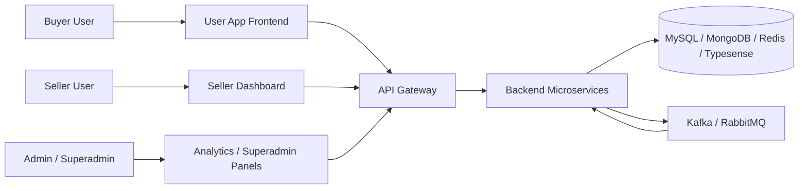
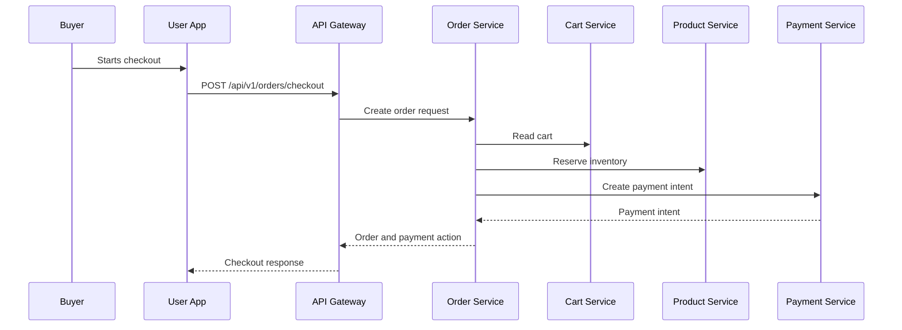
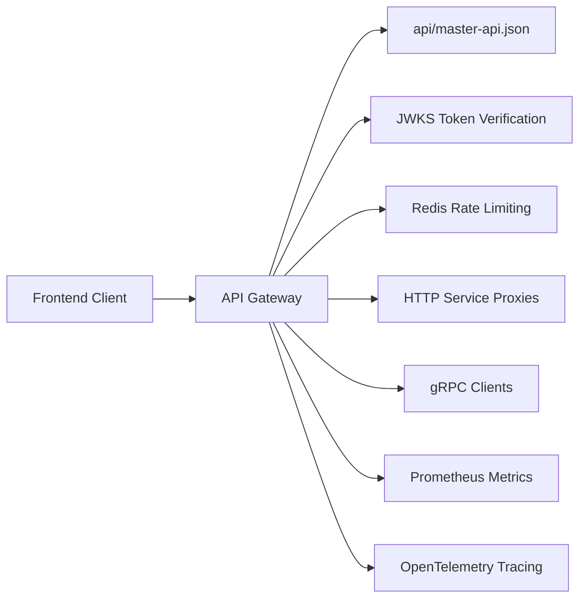
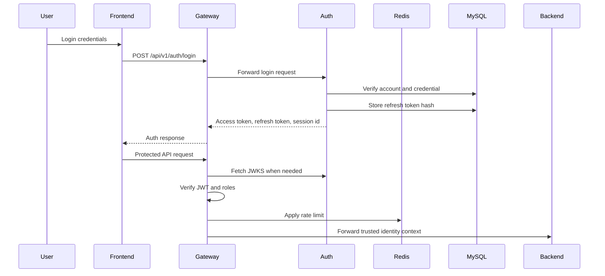
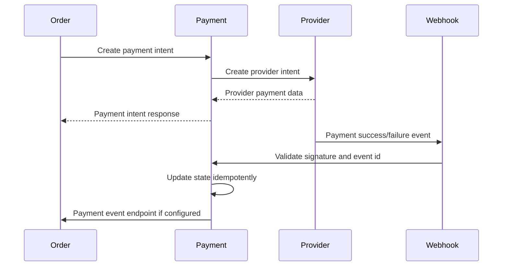
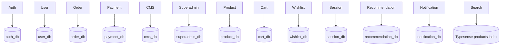
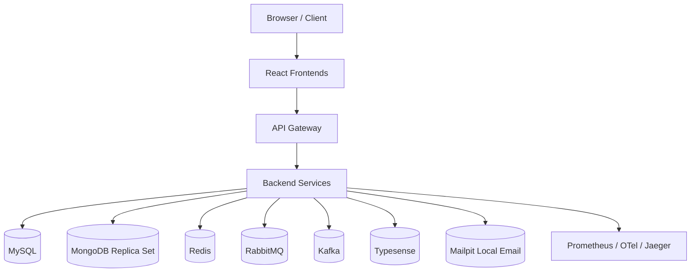

# MCA Final Project Report

## Title Page

**Project Title:** Scalable Backend Development for High-Performance E-Commerce Website Platform

**Internal Project Identifier:** `scalable-ecommerce-platform`

Submitted in partial fulfillment of the requirements for the award of the degree of

**Master of Computer Applications (MCA)**

Submitted By:

| Field | Details |
| --- | --- |
| Student Name | `[STUDENT NAME]` |
| Enrollment / Roll Number | `[ENROLLMENT NUMBER]` |
| Course | Master of Computer Applications |
| Semester | Final Semester / Fourth Semester |
| Department | `[DEPARTMENT NAME]` |
| College / University | `[COLLEGE / UNIVERSITY NAME]` |
| Academic Year | `[ACADEMIC YEAR]` |

Under the guidance of:

| Field | Details |
| --- | --- |
| Guide / Supervisor Name | `[GUIDE / SUPERVISOR NAME]` |
| Designation | `[GUIDE DESIGNATION]` |
| Department | `[DEPARTMENT NAME]` |

**Submission Date:** `[SUBMISSION DATE]`

---

## Certificate

This is to certify that the project report entitled **"Scalable Backend Development for High-Performance E-Commerce Website Platform"** has been prepared and submitted by **`[STUDENT NAME]`**, Enrollment / Roll Number **`[ENROLLMENT NUMBER]`**, in partial fulfillment of the requirements for the award of the degree of **Master of Computer Applications (MCA)**.

The project work has been carried out under my guidance and supervision during the academic year **`[ACADEMIC YEAR]`**. The report is based on the project source code, configuration files, API contract files, database design files, infrastructure files, documentation, and implementation notes available in the project repository.

To the best of my knowledge, the work presented in this report is original, implementation-focused, and suitable for academic evaluation.

| Field | Signature / Details |
| --- | --- |
| Guide / Supervisor Signature | `[SIGNATURE]` |
| Guide / Supervisor Name | `[GUIDE / SUPERVISOR NAME]` |
| Date | `[DATE]` |
| Institution Seal | `[INSTITUTION SEAL]` |

---

## Declaration

I, **`[STUDENT NAME]`**, hereby declare that the project report titled **"Scalable Backend Development for High-Performance E-Commerce Website Platform"** submitted in partial fulfillment of the requirements for the award of the degree of **Master of Computer Applications (MCA)** is my original academic project work.

I further declare that:

1. The project has been carried out by me during the academic year **`[ACADEMIC YEAR]`** under the guidance of **`[GUIDE / SUPERVISOR NAME]`**.
2. The work has not been submitted previously to any other university, institution, or examination body for the award of any degree, diploma, or certificate.
3. All technical details in this report have been written with reference to the actual project repository, source code, configuration files, database schema files, API contract files, deployment files, runbooks, and previous assignment reference material.
4. No unsupported feature, fake database, fake API, fake screenshot, or fake deployment claim has been intentionally added.
5. Where a required academic detail was not available in the repository, a professional placeholder or clearly stated assumption has been used.

| Field | Details |
| --- | --- |
| Place | `[PLACE]` |
| Date | `[DATE]` |
| Student Signature | `[SIGNATURE]` |
| Student Name | `[STUDENT NAME]` |
| Enrollment / Roll Number | `[ENROLLMENT NUMBER]` |

---

## Acknowledgement

I would like to express my sincere gratitude to **`[COLLEGE / UNIVERSITY NAME]`** and the **`[DEPARTMENT NAME]`** for providing me the opportunity to complete this MCA final-year project.

I am thankful to my guide **`[GUIDE / SUPERVISOR NAME]`** for the support, direction, and valuable suggestions throughout the project work. I also thank the faculty members, evaluators, and academic staff for their guidance in understanding the standards expected from a final semester MCA project.

This project helped me study and implement important software engineering concepts such as microservices architecture, API gateway design, authentication and authorization, database design, frontend development, event-driven communication, containerization, testing, monitoring, and deployment planning.

Finally, I thank my family, friends, and everyone who supported me directly or indirectly during the completion of this project and report.

---

## Abstract / Executive Summary

The project titled **"Scalable Backend Development for High-Performance E-Commerce Website Platform"** is a full-stack ecommerce platform designed using a microservices-based architecture. The system includes buyer-facing shopping features, seller dashboard features, session analytics, admin operations, payment workflows, notification handling, and superadmin controls. The backend is implemented mainly in Go using separate service modules, gRPC/protobuf contracts, REST APIs, HTTP service proxies, and shared platform libraries. The frontend is implemented using React, TypeScript, Vite, React Router, TanStack Query, Zustand, React Hook Form, Zod, and dashboard-oriented UI modules. The platform uses MySQL for structured transactional data, MongoDB for flexible document and event data, Redis for caching, sessions and rate limiting, Typesense for search, and RabbitMQ/Kafka for asynchronous communication. Docker Compose is used for local orchestration, while Kubernetes/Kustomize manifests, Prometheus, OpenTelemetry, Jaeger, and CI workflows support deployment and observability planning. The project demonstrates modular service ownership, secure JWT-based authentication, role-based access control, checkout/payment coordination, session analytics, and operational dashboards. The final report documents the actual implementation, database entities, APIs, testing approach, limitations, and future enhancement possibilities.

---

## Table of Contents

1. Title Page
2. Certificate
3. Declaration
4. Acknowledgement
5. Abstract / Executive Summary
6. Table of Contents
7. List of Figures
8. List of Tables
9. List of Abbreviations
10. Chapter 1: Introduction
11. Chapter 2: Literature Review / System Study
12. Chapter 3: System Analysis
13. Chapter 4: System Design
14. Chapter 5: System Implementation
15. Chapter 6: Testing
16. Chapter 7: Results and Discussion
17. Chapter 8: Conclusion and Future Enhancements
18. Chapter 9: References
19. Chapter 10: Appendices

**MS Word Note:** After opening the DOCX version, use **References > Table of Contents > Update Table** to generate an automatic page-numbered table of contents.

---

## List of Figures

| Figure No. | Title | Status |
| --- | --- | --- |
| Figure 1.1 | High-Level Ecommerce Platform Context | Textual / diagram placeholder |
| Figure 3.1 | Level 0 Data Flow Diagram | Mermaid diagram / placeholder |
| Figure 3.2 | Buyer Checkout Flow | Mermaid diagram / placeholder |
| Figure 4.1 | Overall System Architecture | Mermaid diagram / placeholder |
| Figure 4.2 | API Gateway and Service Communication Flow | Mermaid diagram / placeholder |
| Figure 4.3 | Authentication and Authorization Flow | Mermaid diagram / placeholder |
| Figure 4.4 | Checkout and Payment Coordination Flow | Mermaid diagram / placeholder |
| Figure 4.5 | Database Ownership Diagram | Mermaid diagram / placeholder |
| Figure 4.6 | Deployment Architecture | Mermaid diagram / placeholder |
| Figure 7.1 | User App Home / Product Listing Screenshot | Screenshot placeholder |
| Figure 7.2 | Product Detail Screenshot | Screenshot placeholder |
| Figure 7.3 | Cart and Checkout Screenshot | Screenshot placeholder |
| Figure 7.4 | Seller Dashboard Screenshot | Screenshot placeholder |
| Figure 7.5 | Session Analytics Dashboard Screenshot | Screenshot placeholder |
| Figure 7.6 | Superadmin Panel Screenshot | Screenshot placeholder |

---

## List of Tables

| Table No. | Title |
| --- | --- |
| Table 1.1 | Project Source Evidence |
| Table 1.2 | Project Scope |
| Table 2.1 | Existing System Limitations |
| Table 2.2 | Proposed System Advantages |
| Table 3.1 | Functional Requirements |
| Table 3.2 | Non-Functional Requirements |
| Table 3.3 | User Roles |
| Table 3.4 | Feasibility Study |
| Table 4.1 | Service Inventory |
| Table 4.2 | Database Ownership |
| Table 4.3 | MySQL Tables |
| Table 4.4 | MongoDB Collections |
| Table 4.5 | API Endpoint Distribution |
| Table 5.1 | Technologies Used |
| Table 5.2 | Frontend Applications |
| Table 5.3 | Backend Service Modules |
| Table 6.1 | Existing Test Coverage Evidence |
| Table 6.2 | Sample Test Cases |
| Table 8.1 | Project Limitations |
| Table 8.2 | Future Enhancements |

---

## List of Abbreviations

| Abbreviation | Full Form |
| --- | --- |
| API | Application Programming Interface |
| CDN | Content Delivery Network |
| CI/CD | Continuous Integration / Continuous Deployment |
| CMS | Content Management System |
| CORS | Cross-Origin Resource Sharing |
| CRUD | Create, Read, Update, Delete |
| DB | Database |
| DFD | Data Flow Diagram |
| DLQ | Dead Letter Queue |
| DTO | Data Transfer Object |
| ERD | Entity Relationship Diagram |
| gRPC | Google Remote Procedure Call |
| HPA | Horizontal Pod Autoscaler |
| HTTP | Hypertext Transfer Protocol |
| JWT | JSON Web Token |
| KYC | Know Your Customer |
| MCA | Master of Computer Applications |
| MFA | Multi-Factor Authentication |
| OTP | One-Time Password |
| PII | Personally Identifiable Information |
| RBAC | Role-Based Access Control |
| REST | Representational State Transfer |
| SRS | Software Requirements Specification |
| TTL | Time To Live |
| UI | User Interface |
| UX | User Experience |
| WAF | Web Application Firewall |

---

# Chapter 1: Introduction

## 1.1 Project Overview

The project **"Scalable Backend Development for High-Performance E-Commerce Website Platform"** is a full-stack ecommerce platform built around the idea of independent services, clear data ownership, secure user access, and separate frontend experiences for different user groups.

The repository identifies the internal project name as `scalable-ecommerce-platform` in `api/master-api.json`. The user-facing report title is taken from the previous submitted assignment and the repository documentation, which describe the project as a scalable, high-performance ecommerce platform.

Modern ecommerce platforms are used by different types of users at the same time. Buyers browse products, manage wishlists, add items to cart, complete checkout, and view orders. Sellers manage products, orders, coupons, campaigns, staff access, and revenue analytics. Admin and superadmin users monitor users, sellers, sessions, payments, refunds, search settings, platform settings, and audit logs. A single monolithic application can become difficult to maintain when these responsibilities grow. For this reason, the project uses a microservices-based architecture.

The current project folder contains implementation and documentation for backend services, frontend applications, database designs, API contracts, protobuf definitions, Docker Compose setup, Kubernetes manifests, CI workflows, observability configuration, and runbooks.

## 1.2 Project Source Evidence

The final report has been prepared by studying the actual project repository and the provided reference documents.

**Table 1.1: Project Source Evidence**

| Source | Evidence Used |
| --- | --- |
| `README.md` | Project summary and local runbook references |
| `api/master-api.json` | API contract, project identifier, schemas, route auth levels, endpoint distribution |
| `backend/services/*` | Backend service code, handlers, use cases, repositories, migrations, tests |
| `backend/go.work` | Backend Go workspace modules |
| `frontend/*` | React applications, routes, API clients, tests, package manifests |
| `database/draw.sql` | MySQL database design and table definitions |
| `database/mongodb-schema-design.md` | MongoDB collection design |
| `proto/ecommerce/*` | Protobuf service contracts |
| `docker-compose.yml` | Local runtime topology, ports, dependencies, health checks |
| `infra/k8s` and `deployments/k8s/local` | Kubernetes/Kustomize deployment manifests |
| `infra/observability` | Prometheus and OpenTelemetry configuration |
| `.github/workflows` | CI pipeline for Go, frontend, proto, and Docker image checks |
| `runbook` and `LOCAL_ACCESS_GUIDE.md` | Local setup, service URLs, health checks, known blockers |
| Previous assignment submission PDF | Title, academic style, previous project understanding |
| MCA report template and writing guidelines | Report structure and formatting expectations |

## 1.3 Background of the Project

Ecommerce applications require high availability, secure transactions, quick search results, reliable order processing, and strong administrative control. A buyer expects product browsing and checkout to be fast and reliable. A seller expects a dashboard for managing products, orders, coupons, and analytics. An administrator expects tools for monitoring users, sellers, payments, sessions, and audit logs.

In a small ecommerce application, all features can be written in a single codebase. However, as product volume, traffic, payment operations, seller activity, and analytics grow, one application can become difficult to scale. A failure in one part of the system can affect unrelated areas. Direct database sharing can create tight coupling. Deployment risk also increases because every change requires redeploying the entire application.

This project addresses these concerns by separating business areas into independent services. Each service owns its data and exposes access through APIs. The API Gateway becomes the entry point for public clients. Internal communication uses gRPC/protobuf where available, HTTP service proxies where implemented, and event-driven communication for asynchronous workflows.

## 1.4 Problem Statement

The problem addressed by this project is the design and implementation of a scalable ecommerce platform that can support buyer shopping workflows, seller management workflows, session analytics, notifications, payment handling, and superadmin operations without forcing all functionality into one monolithic application.

The system must provide:

1. Secure authentication, authorization, OTP handling, and role-based access.
2. Modular services for users, products, cart, wishlist, search, orders, payments, CMS, sessions, notifications, recommendations, and superadmin operations.
3. Separate frontend applications for buyers, sellers, session analytics admins, and superadmins.
4. Database ownership per service using MySQL, MongoDB, Redis, and Typesense according to workload type.
5. Reliable checkout and payment coordination with idempotency and webhook-based final payment status.
6. Observability, testing, local deployment, and future production deployment planning.

## 1.5 Objectives of the Project

The major objectives of the project are:

1. To design a high-performance ecommerce platform using microservices architecture.
2. To implement separate backend services with clear module boundaries and service ownership.
3. To provide a central API Gateway for routing, authentication enforcement, request validation, rate limiting, CORS, logging, metrics, tracing, and gRPC-Web facade support.
4. To implement secure authentication using JWT, refresh token rotation, OTP hashing, password hashing, role assignments, and JWKS-based token verification.
5. To design database structures using MySQL for transactional data and MongoDB for flexible document/event data.
6. To use Redis for short-lived state such as rate limiting, sessions, OTP counters, and cache.
7. To use Typesense for product search and autocomplete.
8. To support asynchronous communication through RabbitMQ and Kafka where configured.
9. To develop multiple frontend applications using React, TypeScript, Vite, React Router, and TanStack Query.
10. To provide testing support through Go tests, Vitest, Testing Library, CI workflows, and service-specific test files.
11. To document deployment through Docker Compose, Kubernetes/Kustomize, observability configuration, and runbooks.
12. To prepare a final MCA project report based on the actual implementation.

## 1.6 Scope of the Project

The project scope includes backend services, frontend applications, database design, service communication, local deployment, testing, and documentation. The source code contains a broad implementation footprint, but some external integrations remain local/demo or configuration-dependent.

**Table 1.2: Project Scope**

| Area | Included in Scope |
| --- | --- |
| Buyer application | Product browsing, search, cart, wishlist, checkout, orders, profile, addresses, notification preferences |
| Seller dashboard | Products, orders, offers/coupons, campaigns, analytics, team management, audit activity |
| Session analytics dashboard | Overview, live sessions, journeys, funnels, heatmaps, cohorts, reports, privacy controls |
| Superadmin panel | Users, sellers, orders, payments/refunds, sessions, settings, search placeholder, audit logs |
| Backend services | API Gateway, Auth, User, Product, Cart, Wishlist, Search, Session, CMS, Recommendation, Order, Payment, Notification, Superadmin |
| Databases | MySQL, MongoDB, Redis, Typesense |
| Communication | REST, HTTP proxying, gRPC/protobuf, gRPC-Web facade, Kafka/RabbitMQ events |
| DevOps | Docker Compose, Kubernetes/Kustomize manifests, CI pipeline, Prometheus, OpenTelemetry, Jaeger |
| Testing | Go tests, frontend tests, CI test and build pipeline, manual test flow |
| Documentation | Existing docs, runbooks, database design, API contract, final report |

## 1.7 Existing System

In a traditional ecommerce system, the complete application may be implemented as one monolithic web application with one shared database. Such a system can be easier to build initially, but it becomes difficult to scale when different features grow at different speeds.

Typical limitations of a simple existing system are:

1. Authentication, product catalog, orders, payments, admin features, and analytics may all share one codebase.
2. One database may be used for all types of data, even when the data has different consistency and performance requirements.
3. A failure or heavy load in one feature can affect the complete application.
4. Deployment becomes risky because a small change requires redeploying the whole system.
5. Separate frontend experiences for buyer, seller, analytics, and superadmin users may not be properly organized.
6. Search, recommendation, session analytics, and notification workflows may be difficult to add cleanly.

## 1.8 Proposed System

The proposed system is a microservices-based ecommerce platform. Public requests go through the API Gateway. Backend services are separated by business responsibility. Each service owns its own database or storage layer. Frontend applications are separated according to user type.

The main services include:

1. API Gateway
2. Auth Service
3. User Service
4. Product Service
5. Cart Service
6. Wishlist Service
7. Search Service
8. Session Management Service
9. CMS Service
10. Recommendation Service
11. Order Service
12. Payment Service
13. Notification Service
14. Superadmin Service

The main frontend applications include:

1. User App Frontend
2. Seller Dashboard / CMS Frontend
3. Session Analytics Dashboard
4. Superadmin Panel

## 1.9 Advantages of the Proposed System

The proposed system provides the following advantages:

1. **Modularity:** Each major business area has a separate service.
2. **Scalability:** Services can be scaled based on workload.
3. **Maintainability:** Code is organized using service boundaries and layered packages.
4. **Security:** JWT authentication, RBAC, OTP hashing, password hashing, request validation, and audit logging are implemented or documented.
5. **Performance:** Redis, Typesense, service-specific databases, and asynchronous events support performance improvement.
6. **Reliability:** Idempotency is used for sensitive flows such as checkout, payment, refund, and event handling.
7. **Operational Visibility:** Prometheus, OpenTelemetry, Jaeger, logs, health checks, and metrics are included.
8. **Frontend Separation:** Buyer, seller, analytics admin, and superadmin users have different applications.
9. **Deployment Readiness:** Docker Compose and Kubernetes manifests are included.
10. **Testing Support:** Backend and frontend test files are available across many modules.

## 1.10 Report Formatting Note

The provided MCA writing guidelines recommend Times New Roman, 12 pt body text, 1.5 line spacing, A4 page size, justified alignment, and proper numbering of figures and tables. This Markdown report is structured so it can be converted to DOCX/PDF and formatted accordingly in a word processor.

---

# Chapter 2: Literature Review / System Study

## 2.1 Purpose of System Study

The purpose of the system study is to understand the existing problem domain, compare common ecommerce architecture choices, analyze the technologies used, and identify why the selected architecture is suitable for the project.

This project is not only a shopping website. It includes backend services, frontend applications, session analytics, seller tools, notification handling, payment workflows, and superadmin controls. Therefore, the system study covers both business requirements and technical architecture.

## 2.2 Study of Similar Systems

Large ecommerce systems such as marketplace platforms generally include the following parts:

1. Buyer-facing product browsing and checkout.
2. Seller or vendor management.
3. Admin and support operations.
4. Product search and recommendations.
5. Payment and refund processing.
6. Notification and communication workflows.
7. User session tracking and analytics.
8. Security, audit logging, and operational monitoring.

The project implements a similar structure at academic project scale. It does not claim to be a production clone of any commercial platform, but it follows common architectural ideas used in high-traffic ecommerce systems.

## 2.3 Existing System Limitations

**Table 2.1: Existing System Limitations**

| Limitation | Explanation |
| --- | --- |
| Monolithic complexity | A single codebase becomes large and difficult to maintain. |
| Shared database coupling | Multiple modules directly using one database can create dependency conflicts. |
| Difficult scaling | Product search, checkout, analytics, and notifications have different scaling needs. |
| Risky deployment | Every change may require redeploying all features together. |
| Limited observability | Without metrics, tracing, and logs, failures are difficult to diagnose. |
| Weak separation of roles | Buyer, seller, admin, and superadmin users need different permissions and UI flows. |
| Payment risk | Payment success should not depend only on frontend callback status. |
| Analytics gap | User journey, heatmap, funnel, and retention analytics are often missing in simple systems. |

## 2.4 Proposed System Advantages

**Table 2.2: Proposed System Advantages**

| Area | Advantage |
| --- | --- |
| Architecture | Microservices with service-specific ownership |
| API Access | API Gateway for public REST routes and selected gRPC-Web access |
| Security | JWT, JWKS, RBAC, OTP, password hashing, trusted identity headers |
| Databases | MySQL for transactions, MongoDB for documents/events, Redis for cache, Typesense for search |
| Communication | REST, gRPC, HTTP proxying, RabbitMQ/Kafka events |
| Frontend | Separate apps for buyer, seller, analytics, and superadmin workflows |
| Testing | 305 backend Go test files and 121 frontend test files found |
| Deployment | Docker Compose, Kubernetes/Kustomize, CI, observability setup |
| Operations | Health checks, runbooks, metrics, traces, local access guide |

## 2.5 Development Methodology

The project follows an iterative and modular development approach. The repository contains task-wise implementation folders for several services and clear technical documentation. The development style can be described as an iterative SDLC model:

1. **Identification Phase:** Define the ecommerce platform, modules, technology stack, and architecture.
2. **Requirement Analysis Phase:** Identify buyer, seller, admin, analytics, and superadmin requirements.
3. **System Design Phase:** Prepare service boundaries, API contracts, database schemas, security flows, and deployment topology.
4. **Implementation Phase:** Implement backend services, frontend apps, migrations, gateways, and infrastructure files.
5. **Testing Phase:** Add Go unit tests, frontend tests, API tests, component tests, and CI checks.
6. **Deployment and Maintenance Phase:** Use Docker Compose, Kubernetes manifests, monitoring, and runbooks.

## 2.6 Technology Study

### 2.6.1 Go for Backend Services

Go is used for backend services because it is efficient for network applications, supports concurrency through goroutines, and produces simple deployable binaries. The repository contains service-specific Go modules and a backend workspace file at `backend/go.work`.

### 2.6.2 React and TypeScript for Frontend

React and TypeScript are used for frontend applications. The applications are built with Vite and organized into features, routes, hooks, components, API clients, and state modules. TypeScript improves type safety in frontend code.

### 2.6.3 MySQL

MySQL is used for structured and transactional data such as authentication, users, orders, payments, CMS records, and superadmin records. This is suitable because these modules need relational consistency, indexes, and transactional updates.

### 2.6.4 MongoDB

MongoDB is used for flexible document and event-heavy modules such as product catalog, cart, wishlist, recommendation, sessions, and notifications. These areas may have dynamic schemas or high-volume event data.

### 2.6.5 Redis

Redis is used for caching, rate limiting, active sessions, OTP counters, and short-lived data. The API Gateway uses Redis-backed rate limiting. Other services use Redis where fast access is required.

### 2.6.6 Typesense

Typesense is used for product search and autocomplete. Search workloads require indexing, ranking, filtering, sorting, and quick text search responses.

### 2.6.7 RabbitMQ and Kafka

RabbitMQ and Kafka are present in the local Docker Compose setup and service dependencies. RabbitMQ is used by notification and search/product-related workflows. Kafka is used by services such as product, wishlist, recommendation, order, and user where event-driven communication is configured.

### 2.6.8 Docker, Kubernetes, and Observability

Docker Compose defines the complete local runtime stack. Kubernetes/Kustomize manifests are available under `infra/k8s` and `deployments/k8s/local`. Prometheus, OpenTelemetry Collector, Jaeger, and service metrics are used for observability.

## 2.7 Research Gap / Need for the System

The need for this system is based on the gap between simple ecommerce applications and scalable ecommerce platforms. A simple application may be enough for a small store, but a marketplace-style platform needs separation of concerns, strong security, service ownership, analytics, admin controls, and robust deployment practices.

This project fills that gap at academic project level by combining:

1. Microservices architecture.
2. Multiple frontend applications.
3. API Gateway and service communication.
4. MySQL and MongoDB database design.
5. Redis, Typesense, Kafka/RabbitMQ integration.
6. Payment and refund coordination.
7. Session analytics and privacy controls.
8. CI, testing, Docker Compose, Kubernetes, and observability.

---

# Chapter 3: System Analysis

## 3.1 Requirement Analysis

The system requirements are divided into functional requirements, non-functional requirements, user requirements, hardware requirements, and software requirements.

## 3.2 Functional Requirements

**Table 3.1: Functional Requirements**

| ID | Requirement | Implementation Evidence |
| --- | --- | --- |
| FR-01 | User signup and login | Auth service handlers and frontend auth pages |
| FR-02 | JWT access token and refresh token handling | Auth token use cases, JWT/JWKS support, gateway JWT verifier |
| FR-03 | OTP send and verify | Auth OTP use cases, notification gRPC client, OTP hashing |
| FR-04 | User profile and address management | User service gRPC methods and user app account/address pages |
| FR-05 | Seller profile and status handling | User service seller profile methods and superadmin seller controls |
| FR-06 | Product listing and detail | Product service HTTP/gRPC routes and user app product pages |
| FR-07 | Seller product management | Product service seller product routes and seller dashboard product editor |
| FR-08 | Product categories | Product service category routes and local category seed migration |
| FR-09 | Cart management | Cart service HTTP handlers and user app cart module |
| FR-10 | Wishlist management | Wishlist service HTTP handlers and user app wishlist module |
| FR-11 | Search and autocomplete | Search service HTTP/gRPC handlers, Typesense dependency, user app search module |
| FR-12 | Recommendations | Recommendation service gRPC handler and user app recommendation client |
| FR-13 | Checkout from cart | Order service checkout use cases and gateway buyer order bridge |
| FR-14 | Payment intent, retry, refund, webhook | Payment service handlers and domain/usecase files |
| FR-15 | Seller order fulfillment | Order service seller fulfillment gRPC and seller dashboard order pages |
| FR-16 | Coupons and campaigns | CMS service coupon/campaign handlers and seller dashboard offers module |
| FR-17 | Seller analytics | CMS service seller analytics and seller dashboard analytics pages |
| FR-18 | Session event ingestion | Session service `/api/v1/sessions/events` and frontend analytics tracking |
| FR-19 | Live sessions, journeys, funnels, heatmaps, cohorts, reports | Session service routes and analytics dashboard pages |
| FR-20 | Notification preferences | Notification gRPC/proto and user profile notification page |
| FR-21 | Superadmin users, sellers, orders, payments, settings, audit | Superadmin service handlers and superadmin panel routes |
| FR-22 | Health checks and metrics | Service health endpoints, Prometheus metrics, Docker Compose health checks |

## 3.3 Non-Functional Requirements

**Table 3.2: Non-Functional Requirements**

| ID | Requirement | Project Support |
| --- | --- | --- |
| NFR-01 | Security | JWT, JWKS, RBAC, OTP hashing, password hashing, gateway authorization |
| NFR-02 | Scalability | Service separation, Redis, Typesense, message queues, Kubernetes manifests |
| NFR-03 | Maintainability | Layered packages: domain, usecase, repository, transport, config |
| NFR-04 | Reliability | Idempotency, outbox events, health checks, retry/DLQ support |
| NFR-05 | Performance | Search index, Redis caching/rate limiting, typed internal APIs |
| NFR-06 | Observability | Prometheus, OpenTelemetry, Jaeger, structured logging packages |
| NFR-07 | Privacy | Session privacy controls, masking, deletion requests, retention migrations |
| NFR-08 | Testability | 305 Go test files and 121 frontend test files |
| NFR-09 | Deployment readiness | Dockerfiles, Docker Compose, Kubernetes/Kustomize, CI pipeline |
| NFR-10 | Extensibility | Separate services and API contracts allow new modules to be added |

## 3.4 User Roles

**Table 3.3: User Roles**

| Role | Purpose |
| --- | --- |
| Buyer | Browse products, search, manage cart/wishlist, checkout, view orders, manage profile |
| Seller | Manage products, orders, coupons, campaigns, analytics, seller staff |
| Seller Manager | Manage seller operations with broader permissions |
| Seller Catalog Editor | Manage catalog-related seller actions |
| Seller Order Manager | Manage seller order fulfillment |
| Operations Admin | Manage operational users, sellers, orders, and sessions |
| Finance Admin | Manage payments, refunds, reconciliation alerts |
| Catalog Admin | Manage product moderation and search-related catalog tasks |
| Superadmin | Full platform administration and settings access |

## 3.5 System Requirements

### 3.5.1 Hardware Requirements

The MCA guideline mentions minimum hardware such as Pentium-IV processor or above, 2 GB RAM, and 40 GB disk. For this modern full-stack project, the recommended development setup is higher because Docker, databases, frontend builds, and multiple services run locally.

| Component | Minimum / Recommended Requirement |
| --- | --- |
| Processor | Intel i5 / AMD Ryzen 5 or above recommended |
| RAM | 8 GB minimum, 16 GB or more recommended |
| Storage | 40 GB minimum, SSD recommended |
| Display | Standard monitor for frontend testing |
| Network | Internet connection for dependency installation and external provider setup |

### 3.5.2 Software Requirements

| Category | Software / Tool |
| --- | --- |
| Operating System | Windows, Linux, or macOS |
| Backend Language | Go `1.26.3` as specified in backend modules |
| Frontend Runtime | Node.js `>=22.13.0` |
| Package Manager | pnpm `11.5.0` |
| Frontend Framework | React, TypeScript, Vite |
| Databases | MySQL 8.4, MongoDB 8.0 |
| Cache | Redis 7.4 |
| Search | Typesense 29.0 |
| Messaging | RabbitMQ 4.1, Kafka 3.9.1 |
| API Contracts | Protobuf, Buf, gRPC, gRPC-Web |
| Local Orchestration | Docker Compose |
| Deployment | Kubernetes, Kustomize |
| Observability | Prometheus, OpenTelemetry Collector, Jaeger |
| Testing | Go test, Go vet, Vitest, Testing Library, MSW |
| CI/CD | GitHub Actions, Docker Buildx, Hadolint, Trivy |

## 3.6 Feasibility Study

**Table 3.4: Feasibility Study**

| Feasibility Type | Analysis |
| --- | --- |
| Technical Feasibility | The project is technically feasible because the repository contains service implementations, API contracts, frontend applications, database migrations, Dockerfiles, Docker Compose, and CI workflows. |
| Economic Feasibility | The project uses open-source technologies such as Go, React, MySQL, MongoDB, Redis, Typesense, RabbitMQ, Kafka, Prometheus, and Docker. Production hosting may require paid infrastructure, but academic development can be done locally. |
| Operational Feasibility | Separate frontend apps and service runbooks make the system understandable for different users and developers. Local Compose setup simplifies operations for demonstration. |
| Schedule Feasibility | The project is large, but modular services allow incremental development and testing. Some production-level integrations remain future work. |
| Legal and Security Feasibility | No real payment credentials or production secrets are committed. The system uses placeholders and local credentials. Payment card data is not stored by the platform according to design. |

## 3.7 System Assumptions

The following assumptions are used in this report:

1. The final academic title is **"Scalable Backend Development for High-Performance E-Commerce Website Platform"**, based on the previous assignment report and repository context.
2. The internal project identifier is `scalable-ecommerce-platform`, based on `api/master-api.json`.
3. Student, roll number, guide, department, institution, academic year, and submission date are intentionally left as placeholders for manual confirmation.
4. Docker Compose is treated as the complete local runtime source of truth because the repository runbooks state this clearly.
5. Kubernetes manifests are treated as deployment/infrastructure preparation, with local Compose being the most complete runnable stack.
6. Screenshots are not generated artificially. Screenshot locations are provided as placeholders.
7. External payment provider credentials are not present, so real payment gateway testing is not claimed.

## 3.8 Detailed User Requirements

The project serves multiple user groups. Each user group has different expectations from the system. Separating these requirements is important because the platform is not limited to a single buyer-facing website.

### 3.8.1 Buyer Requirements

Buyer users require a simple, reliable, and secure shopping experience. The source code supports buyer-related pages in the User App frontend and buyer-facing APIs in the API contract.

Buyer requirements include:

1. A buyer should be able to register or login using authentication flows.
2. A buyer should be able to verify OTP where required.
3. A buyer should be able to browse product lists.
4. A buyer should be able to view product details, images, variants, price, rating, and stock-related information.
5. A buyer should be able to search products and use filters.
6. A buyer should be able to add products to cart.
7. A buyer should be able to update item quantity or remove items from cart.
8. A buyer should be able to preview coupon discounts.
9. A buyer should be able to maintain a wishlist.
10. A buyer should be able to move wishlist items toward purchase flows.
11. A buyer should be able to manage profile details.
12. A buyer should be able to manage delivery addresses.
13. A buyer should be able to create an order from cart using checkout.
14. A buyer should be able to view payment result pages.
15. A buyer should be able to view order history and order details.
16. A buyer should be able to cancel an order when allowed by order state.
17. A buyer should be able to manage notification preferences.

### 3.8.2 Seller Requirements

Seller users require operational tools rather than a marketing-style interface. The seller dashboard contains product, order, offer, analytics, team, and audit modules.

Seller requirements include:

1. A seller should be able to access the seller dashboard only after authentication.
2. A seller should be able to view the active seller context.
3. A seller should be able to list own products.
4. A seller should be able to create product drafts.
5. A seller should be able to edit product details, images, attributes, and variants.
6. A seller should be able to publish products where permitted.
7. A seller should be able to view seller orders.
8. A seller should be able to update fulfillment status such as packed, shipped, or delivered.
9. A seller should be able to create and edit coupons.
10. A seller should be able to create and manage campaigns.
11. A seller should be able to view analytics such as revenue, GMV, orders, conversion, and product performance.
12. A seller should be able to manage team members and role permissions.
13. A seller should be able to review audit activity related to seller actions.

### 3.8.3 Analytics Admin Requirements

Analytics administrators require visibility into user sessions and platform behavior. The session analytics dashboard implements modules for overview, live sessions, journeys, funnels, heatmaps, cohorts, reports, and privacy.

Analytics admin requirements include:

1. An analytics admin should be able to login securely.
2. An analytics admin should be able to view live platform metrics.
3. An analytics admin should be able to filter data by date range and segments.
4. An analytics admin should be able to inspect active sessions.
5. An analytics admin should be able to view user journey timelines.
6. An analytics admin should be able to analyze funnel conversion and drop-off.
7. An analytics admin should be able to inspect heatmap data.
8. An analytics admin should be able to view cohort retention reports.
9. An analytics admin should be able to export or schedule reports where supported.
10. An analytics admin should be able to manage privacy-related settings and deletion workflows.

### 3.8.4 Superadmin Requirements

Superadmin users require the highest level of operational control. The Superadmin Panel and Superadmin Service cover users, sellers, orders, payments, sessions, settings, and audit logs.

Superadmin requirements include:

1. A superadmin should be able to login and access the admin shell.
2. A superadmin should be able to list, filter, and inspect users.
3. A superadmin should be able to block or unblock users where permitted.
4. A superadmin should be able to list, filter, inspect, approve, suspend, or reject sellers.
5. A superadmin should be able to inspect orders and order details.
6. A superadmin should be able to view payment operations.
7. A superadmin or finance admin should be able to review refunds.
8. A superadmin should be able to view reconciliation alerts.
9. A superadmin should be able to monitor session activity and suspicious behavior.
10. A superadmin should be able to update platform settings.
11. A superadmin should be able to view and export audit logs.
12. A superadmin should be able to access permission-protected modules according to role.

### 3.8.5 Developer and Operator Requirements

The project also supports developers and operators who need to run, test, and maintain the platform.

Developer/operator requirements include:

1. A developer should be able to start the local platform through Docker Compose.
2. A developer should be able to run backend tests.
3. A developer should be able to run frontend tests.
4. A developer should be able to inspect service health endpoints.
5. A developer should be able to review API contracts and protobuf definitions.
6. A developer should be able to apply database migrations through the local stack.
7. An operator should be able to inspect metrics through Prometheus.
8. An operator should be able to inspect traces through Jaeger.
9. An operator should be able to inspect local emails through Mailpit.
10. An operator should be able to inspect message infrastructure through RabbitMQ management UI.

## 3.9 Use Case Analysis

The following use cases summarize the important business workflows in the platform.

| Use Case ID | Use Case | Primary Actor | Main Success Scenario |
| --- | --- | --- | --- |
| UC-01 | Login | Buyer/Seller/Admin | User enters credentials, Auth Service verifies password, token pair is returned. |
| UC-02 | OTP Verification | Buyer/Seller/Admin | User requests OTP, OTP challenge is created, OTP is delivered and verified. |
| UC-03 | View Product List | Buyer | Buyer opens listing page, API Gateway routes request, Product/Search data is returned. |
| UC-04 | Search Product | Buyer | Buyer enters query, Search Service queries Typesense, ranked results and facets are returned. |
| UC-05 | View Product Detail | Buyer | Buyer selects a product, Product Service returns canonical product detail. |
| UC-06 | Add to Cart | Buyer | Buyer adds variant and quantity, Cart Service updates cart document. |
| UC-07 | Apply Coupon Preview | Buyer | Buyer submits coupon code, Cart/CMS validation returns discount preview. |
| UC-08 | Checkout | Buyer | Buyer selects address and cart, Order Service creates order and Payment Service creates intent. |
| UC-09 | Payment Webhook | Payment Provider | Provider sends webhook, Payment Service verifies signature and updates status idempotently. |
| UC-10 | View Orders | Buyer | Buyer opens orders page, Order Service returns order list. |
| UC-11 | Cancel Order | Buyer | Buyer requests cancel, Order Service validates state and updates order status. |
| UC-12 | Manage Product | Seller | Seller creates or edits product, Product Service stores product document. |
| UC-13 | Publish Product | Seller | Seller submits/publishes product according to permission and workflow. |
| UC-14 | Update Fulfillment | Seller | Seller updates order shipment/fulfillment status through dashboard. |
| UC-15 | Manage Coupons | Seller | Seller creates or updates coupon rules through CMS Service. |
| UC-16 | View Seller Analytics | Seller | Seller dashboard calls CMS analytics endpoint and displays metrics/charts. |
| UC-17 | Ingest Session Event | User App | Frontend sends event, Session Service stores and aggregates analytics data. |
| UC-18 | View Journey | Analytics Admin | Admin searches session, Session Service returns event timeline. |
| UC-19 | Review Refund | Finance Admin | Admin opens refund queue, approves/rejects refund, Payment Service updates record. |
| UC-20 | Update Platform Setting | Superadmin | Superadmin changes setting, Superadmin Service validates and writes audit log. |
| UC-21 | View Audit Logs | Superadmin | Admin filters audit logs and views/export records. |
| UC-22 | Notification Preference Update | Buyer | Buyer changes notification preferences, Notification Service stores preference. |

## 3.10 Business Rules

The following business rules are inferred from source code, API contracts, and project documentation:

1. Protected routes must have a valid JWT access token.
2. Route access depends on roles such as buyer, seller, admin, finance admin, catalog admin, operations admin, and superadmin.
3. The API Gateway must not trust identity headers supplied by the browser.
4. Passwords must not be stored in plain text.
5. OTP values must not be stored in plain text.
6. Refresh tokens must be stored as hashes and rotated.
7. Checkout must use an idempotency key to prevent duplicate order creation.
8. Product inventory must be reserved before final payment confirmation.
9. Payment final status must be based on verified provider webhook/event handling.
10. Duplicate payment provider events must be handled idempotently.
11. Refund review must be restricted to finance admin or superadmin-level permissions.
12. Admin mutations should create audit logs.
13. Seller product and order actions must be restricted to seller context or superadmin context.
14. Analytics should minimize exposure of sensitive user information.
15. Logs must not contain passwords, OTPs, full tokens, payment card data, or secrets.

## 3.11 Level 0 Data Flow Diagram



**Figure 3.1: Level 0 Data Flow Diagram**

The diagram shows external users interacting with frontend applications. All public traffic passes through the API Gateway. Backend services communicate with their own databases and asynchronous messaging infrastructure.

## 3.12 Buyer Checkout Flow



**Figure 3.2: Buyer Checkout Flow**

The checkout flow uses idempotency and server-side coordination. Final payment success is decided by verified payment webhook/event handling, not only by frontend callback.

---

# Chapter 4: System Design

## 4.1 System Architecture

The platform uses a microservices architecture. Public clients communicate with the API Gateway using REST APIs and selected gRPC-Web methods. The API Gateway validates requests, verifies authentication, applies role checks, performs rate limiting, adds request IDs, maps errors, and forwards requests to downstream services.

Backend services are responsible for their own business logic and data. Services do not directly read or write each other's databases. For synchronous communication, the project uses gRPC/protobuf where contracts are available and HTTP proxying where services expose HTTP APIs. For asynchronous workflows, RabbitMQ and Kafka are used.

```mermaid
flowchart TB
    UA[User App] --> GW[API Gateway]
    SD[Seller Dashboard] --> GW
    AD[Session Analytics Dashboard] --> GW
    SA[Superadmin Panel] --> GW

    GW --> AUTH[Auth Service]
    GW --> USER[User Service]
    GW --> PRODUCT[Product Service]
    GW --> CART[Cart Service]
    GW --> WISH[Wishlist Service]
    GW --> SEARCH[Search Service]
    GW --> SESSION[Session Service]
    GW --> CMS[CMS Service]
    GW --> RECO[Recommendation Service]
    GW --> ORDER[Order Service]
    GW --> PAYMENT[Payment Service]
    GW --> NOTIF[Notification Service]
    GW --> ADMIN[Superadmin Service]

    AUTH --> MYSQLA[(MySQL Auth DB)]
    USER --> MYSQLU[(MySQL User DB)]
    ORDER --> MYSQLO[(MySQL Order DB)]
    PAYMENT --> MYSQLP[(MySQL Payment DB)]
    CMS --> MYSQLC[(MySQL CMS DB)]
    ADMIN --> MYSQLS[(MySQL Superadmin DB)]

    PRODUCT --> MONGOP[(Mongo Product DB)]
    CART --> MONGOC[(Mongo Cart DB)]
    WISH --> MONGOW[(Mongo Wishlist DB)]
    SESSION --> MONGOS[(Mongo Session DB)]
    RECO --> MONGOR[(Mongo Recommendation DB)]
    NOTIF --> MONGON[(Mongo Notification DB)]

    GW --> REDIS[(Redis)]
    AUTH --> REDIS
    CART --> REDIS
    SESSION --> REDIS
    SEARCH --> TYPESENSE[(Typesense)]
    PRODUCT --> MQ[Kafka / RabbitMQ]
    ORDER --> MQ
    PAYMENT --> MQ
    NOTIF --> MQ
```



**Figure 4.1: Overall System Architecture**

## 4.2 Service Inventory

**Table 4.1: Service Inventory**

| Service | Location | Main Responsibility |
| --- | --- | --- |
| API Gateway | `backend/services/api-gateway` | REST gateway, gRPC-Web facade, auth enforcement, validation, rate limiting, observability |
| Auth Service | `backend/services/auth-service` | Signup/login, OTP, password verification, JWT/JWKS, refresh tokens, RBAC |
| User Service | `backend/services/user-service` | User profiles, addresses, seller profiles, KYC/status admin operations |
| Product Service | `backend/services/product-service` | Catalog, categories, seller product workflow, variants, inventory reservations, product events |
| Cart Service | `backend/services/cart-service` | Cart items, quantity update, coupon preview, cart merge, checkout cart read |
| Wishlist Service | `backend/services/wishlist-service` | Wishlist items, move to cart, price-drop candidate events |
| Search Service | `backend/services/search-service` | Product search, autocomplete, synonyms, reindexing, Typesense integration |
| Session Service | `backend/services/session-service` | Session events, live metrics, journeys, funnels, heatmaps, retention, reports, privacy |
| CMS Service | `backend/services/cms-service` | Seller permissions, coupons, campaigns, product moderation, seller analytics, audit logs |
| Recommendation Service | `backend/services/recommendation-service` | Recommendation rules, interactions, ranking, feature store, A/B assignments |
| Order Service | `backend/services/order-service` | Checkout, order lifecycle, seller fulfillment, payment coordination, idempotency |
| Payment Service | `backend/services/payment-service` | Payment intents, retries, webhooks, refunds, state machine, reconciliation |
| Notification Service | `backend/services/notification-service` | OTP delivery, templates, preferences, delivery logs, retry/DLQ, provider callbacks |
| Superadmin Service | `backend/services/superadmin-service` | Admin users, sellers, orders, payments, sessions, settings, audit logs, RBAC |

## 4.3 API Gateway Design

The API Gateway is the central entry point for public API traffic. Its route catalog comes from `api/master-api.json`. The current contract contains 99 REST endpoints.

The gateway responsibilities include:

1. Route loading from API contract.
2. Public REST routing.
3. JWT verification using remote JWKS.
4. Role-based route authorization.
5. Webhook signature enforcement for webhook routes.
6. Request schema validation.
7. CORS handling for local frontend origins.
8. Redis-backed rate limiting.
9. Request ID injection.
10. Access logging.
11. Prometheus metrics.
12. OpenTelemetry tracing.
13. HTTP proxying for downstream services.
14. gRPC client handling for selected services.
15. gRPC-Web facade for selected browser use cases.



**Figure 4.2: API Gateway and Service Communication Flow**

## 4.4 REST Endpoint Distribution

**Table 4.5: API Endpoint Distribution**

| Service Group | Endpoint Count |
| --- | ---: |
| API Gateway Service | 1 |
| Auth Service | 8 |
| User Service | 8 |
| Product Service | 8 |
| Cart Service | 6 |
| Wishlist Service | 4 |
| Search Service | 6 |
| Session Service | 19 |
| CMS Service | 6 |
| Order Service | 6 |
| Payment Service | 3 |
| Notification Service | 2 |
| Superadmin Service | 22 |
| **Total** | **99** |

The API contract also defines route authentication groups: public, buyer, seller, admin, superadmin, and webhook.

## 4.5 gRPC and Protobuf Design

The repository contains protobuf contracts under `proto/ecommerce`. Generated Go clients are available under `backend/shared/gen/go`. The visible contracts include:

1. CMS Service
2. Notification Service
3. Order Service
4. Product Service
5. Recommendation Service
6. Search Service
7. Session event ingestion proto
8. User Service

The generated backend clients currently include CMS, Notification, Order, Product, Recommendation, Search, and User packages. Some services, such as Auth, Cart, Wishlist, Payment, Session, and Superadmin, are represented mainly through HTTP handlers, internal APIs, API catalog routes, or service-specific code rather than a visible generated Go proto package.

## 4.6 Authentication and Authorization Design

Authentication is handled by the Auth Service and enforced at the API Gateway for protected routes.

Main elements:

1. Password hashing using secure algorithms supported by the auth security package.
2. JWT access tokens.
3. Refresh token rotation and token hash storage.
4. JWKS endpoint at `/.well-known/jwks.json`.
5. OTP challenge creation, hashing, verification, retry limits, and expiry.
6. Role assignment and role revocation.
7. Gateway-level JWT validation and RBAC checks.
8. Trusted identity headers from gateway to downstream HTTP services.



**Figure 4.3: Authentication and Authorization Flow**

## 4.7 Payment Design

Payment handling is implemented in the Payment Service. The service contains domain and use case files for payment state, provider events, payment attempts, retry lineage, refunds, webhook handling, and reconciliation.

Core design rules:

1. Payment intent creation is idempotent.
2. Provider webhook signature verification is required.
3. Final payment status is decided by webhook/provider event handling.
4. Client callback is not treated as financial source of truth.
5. Refund records are stored and reviewed.
6. Reconciliation support exists through a separate command and migration files.



**Figure 4.4: Checkout and Payment Coordination Flow**

## 4.8 Database Design and Ownership

The project follows a service-owned database strategy. Each service owns its own data and other services must access it through APIs or events.

**Table 4.2: Database Ownership**

| Service | Database / Storage | Purpose |
| --- | --- | --- |
| Auth | MySQL + Redis | Credentials, tokens, OTP audit, roles, short-lived counters |
| User | MySQL | User profiles, addresses, seller profile, KYC metadata |
| Product | MongoDB | Dynamic product catalog, variants, categories, inventory reservations |
| Cart | MongoDB + Redis | Cart documents, hot cart cache, cart expiry |
| Wishlist | MongoDB | User wishlists, wishlist events |
| Order | MySQL | Orders, items, fulfillment, idempotency, outbox |
| Payment | MySQL | Payments, attempts, refunds, webhooks, reconciliation |
| Search | Typesense | Product index, search results, autocomplete, synonyms |
| CMS | MySQL | Seller settings, staff, coupons, campaigns, audit logs |
| Session | MongoDB + Redis | Sessions, events, journeys, heatmaps, analytics, retention |
| Recommendation | MongoDB + Redis | Interactions, recommendation sets, feature store, cached recommendations |
| Notification | MongoDB | Templates, deliveries, preferences, provider events |
| Superadmin | MySQL | Admin users, permissions, settings, audit logs, review tasks |



**Figure 4.5: Database Ownership Diagram**

## 4.9 MySQL Tables

The shared database design in `database/draw.sql` contains MySQL table definitions for Auth, User, Order, Payment, CMS, and Superadmin services. Service-specific migrations extend and harden these structures.

**Table 4.3: MySQL Tables**

| Database Area | Tables |
| --- | --- |
| Auth | `auth_accounts`, `credentials`, `refresh_tokens`, `otp_challenges`, `role_assignments` |
| User | `users`, `user_addresses`, `seller_profiles`, `seller_kyc_documents` |
| Order | `orders`, `order_items`, `order_status_history`, `shipments`, `order_idempotency_keys` |
| Payment | `payments`, `payment_attempts`, `refunds`, `payment_webhook_events`, `payment_reconciliations` |
| CMS | `seller_settings`, `seller_staff`, `coupons`, `coupon_rules`, `coupon_redemptions`, `campaigns`, `cms_audit_logs` |
| Superadmin | `admin_users`, `admin_permissions`, `admin_role_permissions`, `platform_settings`, `admin_audit_logs`, `admin_review_tasks` |

### Important MySQL Relationships

1. One auth account has one credential.
2. One auth account can have many refresh tokens.
3. One auth account can have many role assignments.
4. One user can have many addresses.
5. One user can have one seller profile.
6. One seller profile can have many KYC document records.
7. One order can have many order items.
8. One order can have many status history entries.
9. One payment can have multiple attempts.
10. One payment can have multiple refund records.
11. One seller can have multiple staff users, coupons, campaigns, and audit logs.
12. One admin role can map to many permissions.

## 4.10 MongoDB Collections

MongoDB is used for services that have flexible document structures or event-heavy data.

**Table 4.4: MongoDB Collections**

| Service | Collections Found / Designed |
| --- | --- |
| Product | `products`, `categories`, `brands`, `inventory_snapshots`, `price_books`, `inventory_reservations`, `product_event_outbox` |
| Cart | `carts` |
| Wishlist | `wishlists`, `wishlist_events` |
| Recommendation | `user_interactions`, `recommendation_sets`, `product_features`, `user_feature_profiles`, `user_product_counters`, `product_cooccurrence_features`, `feature_job_runs`, `feature_processed_events`, `ab_test_assignments` |
| Session | `sessions`, `session_events`, `journey_summaries`, `heatmap_points`, `heatmap_bucket_sessions`, `heatmap_checkpoints`, `heatmap_processed_events`, `analytics_aggregates`, `retention_deletion_audits`, `report_schedules`, `analytics_deletion_requests`, `admin_audit_events` |
| Notification | `notification_templates`, `notification_deliveries`, `notification_preferences`, `provider_events` |

## 4.11 Important Entity Descriptions

### Auth Entities

The auth database stores account identities, credential hashes, refresh token hashes, OTP challenge hashes, and role assignments. Plain passwords, OTPs, and full tokens should not be stored.

### User Entities

The user database stores user profile information, addresses, seller profile information, and seller KYC document metadata. Seller approval and status changes are handled through admin/superadmin workflows.

### Product Entities

Product documents contain seller ownership, title, description, brand, category, dynamic attributes, images, variants, price information, stock quantities, ratings, and lifecycle status. Inventory reservations are stored separately to support checkout workflows.

### Cart Entities

Cart documents contain user or guest session ownership, cart status, items, price snapshots, quantities, coupon preview data, totals, timestamps, and expiry.

### Order Entities

Order tables contain order headers, order items, payment references, shipping address snapshots, status history, seller fulfillment status, shipment data, and idempotency keys.

### Payment Entities

Payment tables contain payment intents, payment attempts, provider identifiers, webhook events, refunds, retry lineage, and reconciliation records.

### Session Entities

Session collections store session identity, anonymous/user links, device information, events, journeys, funnels, heatmap points, aggregates, privacy deletion requests, report schedules, and retention audit records.

### Superadmin Entities

Superadmin tables store admin users, permissions, role-permission mapping, platform settings, immutable audit logs, and review tasks.

## 4.12 Frontend Design

The frontend is divided into four main applications.

**Table 4.6: Frontend Applications**

| Application | Purpose | Key Routes / Modules |
| --- | --- | --- |
| User App | Buyer shopping experience | Home, categories, search, product detail, wishlist, cart, checkout, payment result, account, profile, addresses, orders, notifications |
| Seller Dashboard | Seller operations | Products, product editor, orders, fulfillment, offers, coupons, campaigns, analytics, team, audit |
| Session Analytics Dashboard | Analytics operations | Overview, live sessions, journey explorer, funnels, heatmaps, cohorts, reports, privacy |
| Superadmin Panel | Platform administration | Users, sellers, orders, payments, refunds, sessions, settings, search placeholder, audit logs |

## 4.13 Deployment Architecture

Local deployment is based on the root `docker-compose.yml`. It starts infrastructure, migration jobs, backend services, API Gateway, and frontend apps. Kubernetes/Kustomize manifests are available for cluster deployment planning.



**Figure 4.6: Deployment Architecture**

---

# Chapter 5: System Implementation

## 5.1 Repository Structure

The repository is organized into separate folders for API contracts, backend services, database design, deployment files, documentation, frontend apps, infrastructure, protobuf files, reports, runbooks, and task implementation notes.

| Path | Responsibility |
| --- | --- |
| `api` | Master API contract |
| `backend` | Go services, shared modules, generated clients |
| `database` | SQL and MongoDB schema design |
| `deployments` | Local Kubernetes deployment examples |
| `docs` | Architecture, database, security, frontend, DevOps, monitoring documentation |
| `frontend` | React applications and shared proto client package |
| `infra` | CI helpers, Compose examples, Docker support, Envoy, Kubernetes, MySQL init, observability |
| `proto` | Protobuf service definitions |
| `runbook` | Local setup and service runbooks |
| `TaskImplementation` | Service-wise task implementation notes |
| `Final_Project_Report` | Final report generated for this submission |

## 5.2 Technologies Used

**Table 5.1: Technologies Used**

| Layer | Technology |
| --- | --- |
| Backend Language | Go `1.26.3` |
| Backend Libraries | net/http, gRPC, protobuf, MySQL driver, MongoDB driver, Redis client, JWT, OpenTelemetry, Prometheus |
| API Contracts | `api/master-api.json`, Protobuf, Buf |
| Frontend | React, TypeScript, Vite |
| Frontend State | TanStack Query, Zustand |
| Forms / Validation | React Hook Form, Zod |
| Frontend Charts | Recharts |
| UI Icons | lucide-react |
| Databases | MySQL 8.4, MongoDB 8.0 |
| Cache / Rate Limit | Redis 7.4 |
| Search | Typesense 29.0 |
| Messaging | RabbitMQ 4.1, Kafka 3.9.1 |
| Local Email | Mailpit |
| Observability | Prometheus, OpenTelemetry Collector, Jaeger |
| Containerization | Docker, Docker Compose |
| Orchestration | Kubernetes, Kustomize |
| CI/CD | GitHub Actions, Hadolint, Docker Buildx, Trivy |
| Testing | Go test, Go vet, Vitest, Testing Library, MSW |

## 5.3 Backend Workspace Implementation

The backend workspace is defined in `backend/go.work` and includes 18 Go modules:

1. `proto-gen/go`
2. `services/api-gateway`
3. `services/auth-service`
4. `services/cart-service`
5. `services/cms-service`
6. `services/notification-service`
7. `services/order-service`
8. `services/payment-service`
9. `services/product-service`
10. `services/recommendation-service`
11. `services/search-service`
12. `services/session-service`
13. `services/superadmin-service`
14. `services/user-service`
15. `services/wishlist-service`
16. `shared/gen/go`
17. `shared/platform`
18. `shared/validation`

Most services follow a layered structure:

1. `cmd` for service startup.
2. `internal/config` for configuration.
3. `internal/domain` for core entities and rules.
4. `internal/usecase` for application logic.
5. `internal/repository` for database access.
6. `internal/transport` for HTTP or gRPC handlers.
7. Service-specific packages such as `events`, `worker`, `scheduler`, `rbac`, `device`, or `security`.

## 5.4 API Gateway Implementation

The API Gateway loads routes from the API contract and creates a router dynamically. It includes:

1. Health routes: `/health/live` and `/health/ready`.
2. Route catalog service.
3. Remote JWKS token verifier.
4. Redis-backed rate limiter.
5. Request schema validation.
6. HTTP service proxies.
7. gRPC clients for selected services.
8. Buyer order and seller order bridge handlers.
9. Seller session handler.
10. gRPC-Web facade using `grpcweb-policies.json`.
11. Prometheus metrics server.
12. OpenTelemetry tracing provider.

The gateway forwards trusted identity headers to HTTP downstream services after verifying JWT claims. It removes user-supplied identity headers before forwarding, which reduces header spoofing risk.

## 5.5 Auth Service Implementation

The Auth Service implements authentication and authorization features. Important packages include:

| Package | Responsibility |
| --- | --- |
| `internal/security/password` | Password hashing and verification |
| `internal/security/token` | JWT issue, verify, JWKS, refresh token helpers |
| `internal/security/otp` | OTP generation, hashing, policy, validation |
| `internal/authorization` | RBAC permissions |
| `internal/usecase` | Login, token, role, OTP, signup, password workflows |
| `internal/repository` | MySQL and Redis repositories |
| `internal/events` | Auth outbox worker |
| `internal/sessionlink` | Session-link events and privacy hashing |
| `internal/transport/http` | HTTP routes and middleware |

Auth routes include signup, login, refresh, logout, OTP send/verify, forgot password, internal credential/password/token/role routes, and JWKS.

## 5.6 User Service Implementation

The User Service manages user profiles, addresses, seller profiles, seller status, and KYC document review. It exposes gRPC service methods through generated protobuf code and also includes internal admin HTTP endpoints for user and seller management.

Implementation evidence includes:

1. `UserService` gRPC registration in `cmd/server/main.go`.
2. MySQL migrations for user tables, audit fields, outbox events, and local access users.
3. Domain files for profile, address, seller, KYC, and audit behavior.
4. Admin endpoints for users and sellers.

## 5.7 Product Service Implementation

The Product Service manages products, categories, variants, inventory, price information, seller product workflow, and product events.

Implementation evidence includes:

1. Product gRPC service registration.
2. HTTP routes for product listing, product detail, categories, seller product list/detail/create/update/publish, internal batch product retrieval, search export, lifecycle status, and inventory reservation actions.
3. MongoDB migrations for product collections, seller product workflow, read indexes, inventory reservations, product event outbox, and local categories.
4. Domain files for product, variant, image, category, brand, inventory, price book, and seller permissions.

## 5.8 Cart Service Implementation

The Cart Service manages active cart documents and cart mutations.

Implemented routes include:

1. `GET /api/v1/cart`
2. `POST /api/v1/cart/items`
3. Cart item path handling for update/delete.
4. `POST /api/v1/cart/coupons/preview`
5. `POST /api/v1/cart/merge`
6. Internal cart schema and checkout read routes.

The domain package includes cart mutation, merge, expiry, coupon, owner, and money logic. MongoDB migration creates the carts collection and indexes.

## 5.9 Wishlist Service Implementation

The Wishlist Service manages wishlist items and wishlist events.

Implementation evidence includes:

1. HTTP handlers for wishlist path, item path, and item-by-product path.
2. MongoDB migrations for wishlists, item variant indexes, price-drop indexes, wishlist events, and event lease indexes.
3. Use cases for wishlist service and price-drop service.
4. Kafka dependency for event-oriented workflows.

## 5.10 Search Service Implementation

The Search Service integrates with Typesense for product search.

Implemented capabilities include:

1. Search products.
2. Autocomplete.
3. Admin reindex.
4. Admin synonym create/update/delete/list.
5. Product schema endpoint.
6. gRPC SearchService server registration.
7. Product event consumer and product indexer.

## 5.11 Session Management Service Implementation

The Session Service implements analytics and session tracking features.

Routes include:

1. `POST /api/v1/sessions/events`
2. `GET /api/v1/analytics/live`
3. `GET /api/v1/analytics/sessions`
4. `GET /api/v1/analytics/sessions/{session_id}/journey`
5. `GET /api/v1/analytics/funnels`
6. `GET /api/v1/analytics/heatmaps`
7. `GET /api/v1/analytics/retention`
8. Report export and schedule routes.
9. Privacy settings, retention, deletion preview, deletion request routes.
10. Admin retention and delete-user-data routes.

Domain files include sessions, events, active sessions, journeys, analytics, heatmaps, privacy, retention, reports, and device context.

## 5.12 CMS Service Implementation

The CMS Service supports seller dashboard backend workflows.

Implementation evidence includes:

1. Seller analytics endpoints.
2. Seller audit log endpoints.
3. Product review, publish, unpublish, and moderation routes.
4. Coupon list/create/update/disable and validation routes.
5. Campaign list/create/update/disable and validation routes.
6. Seller permission and internal authorization routes.
7. MySQL migrations for access tables, product moderation, coupon engine, campaigns, analytics, seller settings, audit hardening, and local seller staff.

## 5.13 Recommendation Service Implementation

The Recommendation Service provides recommendation logic and feature-store support.

Implementation evidence includes:

1. gRPC `RecommendationService` registration.
2. HTTP endpoints for recommendation types, contexts, type resolution, storage plan, and storage status.
3. Kafka consumer for interaction events.
4. Domain files for experiments, features, interactions, personalization, ranking, recommendations, storage, and strategy.
5. MongoDB migrations for recommendation storage, event indexes, feature store schema, rule-based ranking, personalized ranking, A/B assignments, and product feature defaults.

## 5.14 Order Service Implementation

The Order Service manages checkout, order lifecycle, fulfillment, payment coordination, idempotency, and outbox events.

Implementation evidence includes:

1. gRPC `OrderService` registration.
2. Use cases for create order, create order from cart, list orders, list seller orders, cancel order, update fulfillment, initiate order payment, apply payment result.
3. HTTP internal payment-events endpoint.
4. MySQL migrations for order tables, payment coordination, gRPC query indexes, and order outbox events.
5. Domain files for checkout, order, fulfillment, idempotency, seller order, payment, and outbox.

## 5.15 Payment Service Implementation

The Payment Service handles payment and refund workflows.

Implemented routes include:

1. Internal payment state machine endpoints.
2. Internal payment schema endpoints.
3. Internal payment intent creation.
4. Payment provider webhook endpoint.
5. Payment retry endpoint.
6. Refund request and review endpoints.
7. Admin payment, refund, and reconciliation endpoints.

Domain and use case files cover payment state, attempts, retry lineage, provider events, webhooks, refunds, reconciliation, and payment schema.

## 5.16 Notification Service Implementation

The Notification Service handles OTP delivery, templates, preferences, delivery events, retries, provider events, and analytics.

Implementation evidence includes:

1. gRPC `NotificationService` registration.
2. Health and readiness endpoints.
3. Provider webhook handler path.
4. MongoDB collections for templates, deliveries, preferences, and provider events.
5. RabbitMQ event consumer and retry/DLQ support.
6. SMTP local email setup through Mailpit.
7. Domain files for channels, delivery, event triggers, message rendering, OTP delivery, preference, retry jobs, and templates.

## 5.17 Superadmin Service Implementation

The Superadmin Service provides platform-level control.

Implemented features include:

1. Admin user and seller listing/status controls.
2. Admin order listing and order actions.
3. Admin payment, refund, and reconciliation views/actions.
4. Session analytics proxy and dashboard access authorization.
5. Platform settings list/update.
6. Search synonyms route under admin settings.
7. Admin audit log list/export.
8. RBAC permissions and role permission endpoints.
9. MySQL migrations for RBAC, review tasks, platform settings, audit logs, and local admin users.

## 5.18 Frontend Implementation

### 5.18.1 User App Frontend

The User App is located at `frontend/user-app`. It includes:

1. Auth pages: login, signup, OTP, forgot password, reset password.
2. Product pages: home, categories, category listing, deals, product detail.
3. Search page and autocomplete integration.
4. Wishlist page and wishlist button.
5. Cart page, quantity stepper, coupon box, cart summary.
6. Checkout pages: address step, order review, payment step, payment result.
7. Orders pages: order list, order detail, status timeline, cancel dialog.
8. Account pages: overview, profile, addresses, notifications.
9. Analytics tracking through gRPC-Web/connect client.

### 5.18.2 Seller Dashboard

The Seller Dashboard is located at `frontend/seller-dashboard`. It includes:

1. Seller authentication guard.
2. Dashboard layout, sidebar, topbar, seller switcher.
3. Product list and editor.
4. Order list and detail with fulfillment update.
5. Coupon and campaign management.
6. Revenue analytics charts and metric cards.
7. Team members and role permissions.
8. Seller audit activity timeline.

### 5.18.3 Session Analytics Dashboard

The Session Analytics Dashboard is located at `frontend/session-analytics-dashboard`. It includes:

1. Admin login and admin guard.
2. Analytics overview page.
3. Live sessions table and summary.
4. Journey explorer.
5. Funnel analysis.
6. Heatmap visualization.
7. Cohort retention matrix.
8. Reports export and schedule management.
9. Privacy controls for masking, retention, and deletion.

### 5.18.4 Superadmin Panel

The Superadmin Panel is located at `frontend/superadmin-panel`. It includes:

1. Admin login and role guards.
2. Admin shell with sidebar and topbar.
3. User list and user detail.
4. Seller list and seller review.
5. Order operations and order detail.
6. Payment operations and refund review.
7. Session oversight.
8. Platform settings.
9. Audit log listing and export.
10. Search route placeholder module.

## 5.19 Infrastructure and DevOps Implementation

The root `docker-compose.yml` defines the local runtime. It includes:

1. MySQL
2. MongoDB with replica set initialization
3. Redis
4. RabbitMQ with management UI
5. Kafka
6. Typesense
7. Mailpit
8. Jaeger
9. OpenTelemetry Collector
10. Prometheus
11. Migration jobs
12. Backend services
13. Frontend applications

Local ports include:

| Component | Local URL |
| --- | --- |
| User App | `http://localhost:3000` |
| Seller Dashboard | `http://localhost:3001` |
| Session Analytics Dashboard | `http://localhost:3002` |
| Superadmin Panel | `http://localhost:3003` |
| API Gateway | `http://localhost:8080` |
| gRPC-Web Gateway | `http://localhost:8099` |
| Gateway Metrics | `http://localhost:19090/metrics` |
| RabbitMQ Management | `http://localhost:15672` |
| Mailpit | `http://localhost:8025` |
| Jaeger | `http://localhost:16686` |
| Prometheus | `http://localhost:9095` |
| Typesense | `http://localhost:8108` |

## 5.20 CI/CD Implementation

The GitHub Actions workflow includes:

1. Go tests for every backend module.
2. Go vet for every backend module.
3. Go formatting check.
4. golangci-lint for every backend module.
5. Frontend install, tests, lint, typecheck, and build.
6. Buf proto lint.
7. Buf breaking change check.
8. Generated client verification.
9. Dockerfile linting using Hadolint.
10. Docker image build checks.
11. Container vulnerability scanning using Trivy.

## 5.21 Detailed Module-Wise Implementation Matrix

The following matrix gives a consolidated view of what each module contributes to the full ecommerce platform. It is based on source folders, route registrations, migration files, package structure, frontend routes, API clients, and the API contract.

| Module | Main Actors | Main Inputs | Main Outputs | Storage / Dependency |
| --- | --- | --- | --- | --- |
| API Gateway | Buyer, seller, admin, frontend apps | REST requests, JWTs, request body/query, webhook signatures | Routed API responses, error envelopes, request metrics | Redis, route catalog, JWKS, downstream services |
| Auth Service | Buyer, seller, admin, internal services | Email/phone/password, OTP, refresh token, role requests | Token pair, OTP status, JWKS, role results | MySQL auth DB, Redis, Notification Service |
| User Service | Buyer, seller, superadmin | Profile data, addresses, seller profile data, KYC metadata | User profile, seller profile, status updates | MySQL user DB, RabbitMQ/Kafka events |
| Product Service | Buyer, seller, catalog admin | Product input, variants, category filters, inventory reservation requests | Product lists, product details, category data, reservation status | MongoDB product DB, RabbitMQ/Kafka |
| Cart Service | Buyer, guest user | Product/variant id, quantity, coupon code, guest session | Cart document, totals, coupon preview, checkout cart snapshot | MongoDB cart DB, Redis, Product/CMS clients |
| Wishlist Service | Buyer | Product/variant id, wishlist actions | Wishlist document, item status, wishlist events | MongoDB wishlist DB, Kafka |
| Search Service | Buyer, admin | Search query, filters, sort, synonyms, reindex command | Ranked products, facets, autocomplete, synonym list | Typesense, Product Service, RabbitMQ |
| Session Service | User app, analytics admin, superadmin | Session events, date range, segment filters, privacy actions | Live metrics, sessions, journeys, funnels, heatmaps, reports | MongoDB session DB, Redis |
| CMS Service | Seller, catalog admin | Coupon rules, campaign data, seller actions, product moderation | Coupon validation, campaign results, seller analytics, audit logs | MySQL CMS DB, Product Service |
| Recommendation Service | Buyer, recommendation events | User/product/category context, interactions, cart product ids | Recommendation set, strategy id, ranked items | MongoDB recommendation DB, Redis, Kafka |
| Order Service | Buyer, seller, payment service | Cart id, address snapshot, idempotency key, payment event | Order, order list, seller order view, fulfillment status | MySQL order DB, Cart/Product/Payment services, Kafka |
| Payment Service | Buyer, finance admin, provider webhook | Payment intent request, provider webhook, refund request, retry request | Payment status, refund status, reconciliation result | MySQL payment DB, external provider configuration |
| Notification Service | Auth, order, payment, user | OTP request, event message, preference update, provider callback | Delivery record, rendered message, preference result | MongoDB notification DB, RabbitMQ, Mailpit/SMTP |
| Superadmin Service | Superadmin, operations admin, finance admin, catalog admin | Admin filters, status actions, settings updates, review decisions | Admin lists, status updates, audit logs, review outcomes | MySQL superadmin DB, User/Order/Payment/Session services |

## 5.22 API and Service Communication Details

The project uses different communication methods depending on the use case. This is a practical design choice because not every interaction has the same performance, consistency, or security requirement. Browser-facing actions are mostly exposed through REST because REST is easy to consume from React applications. Internal service calls use gRPC where generated contracts are available. Several services also expose HTTP APIs and are reached through gateway service proxying. Asynchronous work is handled with events through RabbitMQ or Kafka.

### 5.22.1 Public REST Communication

Public frontend applications mainly use REST APIs through the API Gateway. REST is suitable for browser applications because it is easy to call from frontend code, easy to debug through browser developer tools, and compatible with standard HTTP infrastructure.

Examples of public REST route groups include:

1. Auth routes such as signup, login, refresh, logout, OTP send, OTP verify, and forgot password.
2. User profile and address routes.
3. Product listing, product detail, category, and seller product routes.
4. Cart and wishlist routes.
5. Search and autocomplete routes.
6. Checkout, buyer order, and seller order routes.
7. Seller CMS dashboard, coupon, and campaign routes.
8. Analytics live metrics, sessions, journeys, funnels, heatmaps, reports, retention, and privacy routes.
9. Superadmin user, seller, order, payment, refund, settings, session, and audit routes.

### 5.22.2 Internal gRPC Communication

The repository contains protobuf contracts and generated Go clients for several services. gRPC is suitable for internal communication because it is typed, efficient, and contract-driven. It is used for services such as User, Product, Order, Search, Recommendation, CMS, and Notification where generated clients and server registrations are visible.

Examples from the project include:

1. API Gateway using User gRPC client for profile and address operations.
2. API Gateway using Order gRPC client for buyer order and seller order bridge handlers.
3. Product Service registering ProductService gRPC server.
4. Search Service registering SearchService gRPC server.
5. Recommendation Service registering RecommendationService gRPC server.
6. Notification Service registering NotificationService gRPC server.
7. CMS Service containing gRPC transport code.

### 5.22.3 HTTP Service Proxying

Several services expose HTTP routes directly. The API Gateway forwards requests to these services using HTTP proxying when the corresponding service URL is configured. During proxying, the gateway removes identity headers supplied by the client and adds trusted identity context based on verified JWT claims.

This protects downstream services from direct header spoofing. It also allows services that are not fully exposed through gRPC to still participate in the platform. The implementation includes service proxy support for downstream services such as Auth, Product, Cart, Wishlist, CMS, Payment, Session, and Superadmin.

### 5.22.4 gRPC-Web Communication

The API Gateway includes a browser gRPC-Web facade. The policy file `backend/services/api-gateway/config/grpcweb-policies.json` defines exposed gRPC-Web methods and their authentication requirements.

Visible policy examples include:

1. Search autocomplete as public.
2. Recommendations with optional authentication.
3. Session event ingestion with optional authentication.
4. Live session access requiring admin or superadmin roles.
5. Superadmin user listing requiring operations admin or superadmin roles.
6. Platform settings update requiring superadmin role.
7. CMS seller analytics requiring seller, seller manager, or superadmin role.

### 5.22.5 Event-Driven Communication

Event-driven communication is used for workflows that do not need immediate synchronous responses. Events help reduce direct coupling between services and support retry or background processing.

Examples of event-oriented areas include:

1. Product updates sent to search indexing.
2. Auth events and session-link events.
3. Order and payment events for order status and notifications.
4. Wishlist price-drop and activity events.
5. Recommendation interaction events.
6. Notification command and delivery retry queues.

RabbitMQ and Kafka are both present in the local stack. Different services depend on one or both depending on their implementation.

## 5.23 Common API Response and Error Handling

The API Gateway and frontend clients are designed around consistent request and response handling. A common response envelope helps the frontend handle success, errors, request IDs, and validation details uniformly.

A typical success response can be represented as:

```json
{
  "data": {},
  "request_id": "req_123",
  "error": null
}
```

A typical error response can be represented as:

```json
{
  "data": null,
  "request_id": "req_123",
  "error": {
    "code": "VALIDATION_ERROR",
    "message": "Invalid request"
  }
}
```

The API Gateway contains error mapping, validation middleware, rate limit middleware, recovery middleware, and request ID middleware. Downstream errors are mapped into frontend-friendly responses where implemented. This design improves consistency because frontend applications do not need to understand every internal service error format.

## 5.24 Security Considerations

Security is a major part of this project because ecommerce platforms handle user data, authentication data, order data, payment workflows, seller operations, and admin operations.

### 5.24.1 Password Security

The Auth Service contains a password security package that supports secure password hashing. Passwords are not stored in plain text. The credentials table stores password hash and algorithm metadata. Important password-related controls include password hashing, password verification, failed login attempt tracking, lockout fields, and password reset workflow support.

### 5.24.2 OTP Security

The OTP workflow stores only hashed OTP values. The Auth Service includes OTP generation, hashing, policy, validation, expiry, maximum attempts, and rate-limit related logic. OTP security controls include challenge identifiers, OTP hashes, expiry time, attempt counters, maximum attempts, Redis-backed counters, and Notification Service integration for delivery.

### 5.24.3 JWT and Refresh Token Security

The Auth Service issues access tokens and refresh tokens. Access tokens are short-lived. Refresh tokens are stored as hashes and rotated. The gateway verifies JWTs using JWKS. JWT and token controls include issuer validation, audience validation, JWKS endpoint, key id support, refresh token hash storage, refresh token rotation, token revocation, role claims, and service-level permission checks.

### 5.24.4 Role-Based Access Control

The project defines buyer, seller, seller manager, seller catalog editor, seller order manager, admin, finance admin, catalog admin, operations admin, and superadmin level access. The gateway enforces route-level access from the API contract. Superadmin Service has its own RBAC package, permission matrix, guards, and admin context handling.

High-risk routes such as refunds, platform settings, seller status changes, user status changes, and audit log access require admin-level roles.

### 5.24.5 Gateway Header Security

The gateway proxy removes user-supplied identity headers before forwarding requests. It then adds trusted headers such as `X-User-ID`, `X-Actor-ID`, `X-User-Roles`, `X-Seller-ID`, `X-Session-ID`, and admin-specific headers after JWT verification. This prevents a frontend user from manually sending privileged identity headers to impersonate another user or role.

### 5.24.6 Payment Security

Payment security is handled through provider abstraction, webhook signature verification, provider event idempotency, server-side amount handling, refund permission control, environment-based provider credentials, and reconciliation support. Payment card data is not designed to be stored by the platform. Hosted or provider-controlled payment flows are preferred.

### 5.24.7 Session Analytics Privacy

Session analytics can contain sensitive behavioral information. The Session Service includes privacy and retention features such as deletion requests, masking settings, retention policies, and privacy audit-related collections. Privacy controls include avoiding sensitive field capture, masking identifiers in admin views, deletion preview workflows, deletion requests, retention cleanup support, and minimized identifiers where appropriate.

### 5.24.8 Logging and Secret Redaction

The project documentation indicates that sensitive values should not be logged. This includes passwords, OTPs, full JWTs, refresh tokens, card data, and secrets. Observability should include request IDs, trace IDs, route names, latency, and error codes without leaking sensitive data.

## 5.25 Configuration and Environment Management

Every major service has an `.env.example` file. These files document required runtime configuration. Local Compose wires many values directly for demo usage.

Important configuration areas include:

1. HTTP and gRPC addresses.
2. Database connection strings.
3. Redis address and password.
4. JWT issuer, audience, key paths, and JWKS URL.
5. OTP peppers and policy values.
6. Notification endpoints and provider settings.
7. Payment provider keys, webhook secrets, allowed providers, currency settings, retry settings, and reconciliation settings.
8. Gateway CORS allowed origins.
9. gRPC-Web policy path and exposed services.
10. OpenTelemetry collector endpoints.
11. Metrics ports and paths.

The report does not include real production secrets. Values such as local passwords and local internal tokens are treated as development/demo configuration only.

## 5.26 Database Migration Management

The project uses migration files for both MySQL and MongoDB-backed services.

### 5.26.1 MySQL Migrations

MySQL migration jobs are defined in Docker Compose for Auth Service, User Service, Order Service, Payment Service, CMS Service, and Superadmin Service. These migrations create tables, add indexes, harden schemas, create audit/outbox tables, and seed local demo access records where implemented.

### 5.26.2 MongoDB Migrations

MongoDB migration jobs are defined for Product Service, Cart Service, Wishlist Service, Recommendation Service, Session Service, and Notification Service. The Docker Compose migration job applies JavaScript migration files to MongoDB after the replica set is initialized. Product, cart, and wishlist use nested `migrations/mongo` folders. Recommendation, session, and notification use migration files directly under their service migration folders.

## 5.27 Deployment and Operations Details

### 5.27.1 Local Docker Compose

Docker Compose is the complete local runtime source of truth. It defines data services, observability tools, migration jobs, backend services, and frontend applications.

The startup flow is:

1. Start MySQL, MongoDB, Redis, RabbitMQ, Kafka, Typesense, Mailpit, Jaeger, OpenTelemetry Collector, and Prometheus.
2. Initialize MongoDB replica set.
3. Run MySQL migration jobs.
4. Run MongoDB migration jobs.
5. Start backend services.
6. Start API Gateway.
7. Start frontend applications.

### 5.27.2 Kubernetes and Kustomize

The repository contains Kubernetes manifests under `infra/k8s` and `deployments/k8s/local`. These include namespaces, deployments, services, config maps, secret examples, jobs, stateful sets, and overlays.

Kubernetes is useful for service discovery, horizontal scaling, rolling deployment, health checks, ConfigMap/Secret based configuration, environment separation, batch jobs, and scheduled jobs. The project contains many Kubernetes files, but the runbooks state that Docker Compose is the full local platform source of truth.

### 5.27.3 Observability

Observability is implemented through Prometheus metrics, OpenTelemetry tracing, Jaeger tracing UI, metrics endpoints, structured logging packages, and service health/readiness endpoints. Operational dashboards can use these metrics to monitor request rates, latency, errors, downstream health, queue lag, payment webhook failures, and session ingestion.

### 5.27.4 Local Access and Demonstration

The local access guide provides URLs and demo credentials for seller dashboard, analytics dashboard, and superadmin panel. Buyer credentials are not seeded yet. For a final demonstration, a buyer seed account should be added or created manually after ensuring the signup and password reset flows are correctly aligned.

---

# Chapter 6: Testing

## 6.1 Testing Strategy

Testing is important because the project contains sensitive workflows such as authentication, OTP, role assignment, cart mutations, checkout, payment, refunds, session analytics, and admin actions.

The testing strategy includes:

1. Unit testing of domain logic.
2. Use case testing.
3. HTTP handler testing.
4. gRPC handler testing.
5. Repository testing with mocks or local database handles where present.
6. Frontend component testing.
7. Frontend utility and validation testing.
8. API mapping tests.
9. CI test execution.
10. Manual end-to-end smoke testing through Docker Compose.

## 6.2 Existing Test Coverage Evidence

**Table 6.1: Existing Test Coverage Evidence**

| Area | Count / Evidence |
| --- | ---: |
| Backend Go modules | 18 |
| Backend Go test files | 305 |
| Frontend test files | 121 |
| Dockerfiles | 19 |
| API Gateway test files | 35 |
| Auth Service test files | 15 |
| Cart Service test files | 16 |
| CMS Service test files | 18 |
| Notification Service test files | 31 |
| Order Service test files | 18 |
| Payment Service test files | 23 |
| Product Service test files | 17 |
| Recommendation Service test files | 22 |
| Search Service test files | 27 |
| Session Service test files | 21 |
| Superadmin Service test files | 19 |
| User Service test files | 15 |
| Wishlist Service test files | 17 |
| User App frontend tests | 22 |
| Seller Dashboard tests | 33 |
| Session Analytics Dashboard tests | 25 |
| Superadmin Panel tests | 41 |

## 6.3 Backend Testing

Backend tests cover areas such as:

1. API Gateway route registration, error mapping, JWT verification, CORS, rate limiting, request validation, session proxying, gRPC-Web policies, downstream clients, and metrics.
2. Auth Service password tests, OTP tests, token tests, role security tests, signup tests, HTTP security tests, outbox worker tests, and session-link tests.
3. Product Service domain validation, product events, inventory reservations, seller product workflow, repository tests, and gRPC/HTTP mapping tests.
4. Cart Service cart mutation, merge, expiry, coupons, repository behavior, HTTP handler behavior, and use case tests.
5. Order Service checkout, idempotency, seller orders, payment coordination, repositories, and gRPC handler tests.
6. Payment Service payment state, payment schema, webhooks, retry, refund, reconciliation, and HTTP handler tests.
7. Session Service analytics, privacy, reports, retention, heatmaps, journeys, admin authorization, repositories, and HTTP handlers.
8. Notification Service template rendering, preferences, OTP delivery, retry jobs, event handling, repository behavior, and gRPC handlers.
9. Superadmin Service RBAC, authorization, audit logs, platform settings, session visibility, user/seller controls, order/payment controls, and HTTP handlers.

## 6.4 Frontend Testing

Frontend tests cover:

1. User App login page, auth schemas, product cards, product URL state, cart quantity stepper, checkout idempotency, orders, wishlist item card, profile schema, address schema, search/autocomplete gRPC, recommendation gRPC, and environment helpers.
2. Seller Dashboard product validation, product table, category selector, image uploader, order filters, shipment update, offer validation, analytics adapters, team validation, audit formatters, and seller route guards.
3. Session Analytics Dashboard live metrics API mapping, admin login, overview metrics, live sessions, journeys, funnels, heatmaps, cohorts, reports export, privacy validation, and formatting helpers.
4. Superadmin Panel users, sellers, orders, payments, sessions, settings, audit, permissions, CSV export, risk rules, and admin route guards.

## 6.5 Sample Test Cases

**Table 6.2: Sample Test Cases**

| Test Case ID | Input / Action | Expected Output | Status |
| --- | --- | --- | --- |
| TC-01 | Valid login request | Access token, refresh token, session id returned | Testable through Auth Service |
| TC-02 | Invalid password | Authentication error and failed attempt handling | Testable through Auth Service |
| TC-03 | OTP send request | OTP challenge created and notification requested | Testable through Auth/Notification |
| TC-04 | OTP verify with correct OTP | Challenge marked verified | Testable through Auth Service |
| TC-05 | JWT protected route request | Gateway verifies token and roles | Testable through API Gateway |
| TC-06 | Product listing request | Products returned with pagination/filter data | Testable through Product/Gateway |
| TC-07 | Add item to cart | Cart item added or quantity updated | Testable through Cart Service |
| TC-08 | Apply coupon preview | Discount preview returned without final redemption | Testable through Cart/CMS |
| TC-09 | Checkout with idempotency key | Order created once, duplicate prevented | Testable through Order Service |
| TC-10 | Payment webhook duplicate | Duplicate provider event ignored/idempotently handled | Testable through Payment Service |
| TC-11 | Seller fulfillment update | Fulfillment status updated with allowed status | Testable through Order/Seller Dashboard |
| TC-12 | Session event ingestion | Event accepted and stored/aggregated | Testable through Session Service |
| TC-13 | Superadmin user block | User status update and audit log written | Testable through Superadmin/User |
| TC-14 | Analytics privacy deletion request | Preview or request generated according to policy | Testable through Session Service |
| TC-15 | Frontend route guard | Unauthorized user redirected or denied | Testable through frontend tests |

## 6.6 Suggested Test Commands

The repository includes the following useful commands:

```powershell
# Validate Docker Compose configuration
docker compose config

# Start full local platform
docker compose up -d --build

# Run backend tests through Makefile
make test-go

# Run frontend tests through Makefile
make test-frontend

# Run all configured tests
make test

# Lint protobuf contracts
make proto-lint

# Build Docker images through CI helper
make ci-docker-build
```

The CI workflow also runs tests and build steps automatically on pull requests and pushes to `dev` and `main`.

## 6.7 Manual Testing Flow

Manual testing should be performed after starting the local stack:

1. Start the stack using `docker compose up -d --build`.
2. Verify API Gateway live and ready endpoints.
3. Verify frontend health endpoints.
4. Login using available seeded seller/admin credentials from `LOCAL_ACCESS_GUIDE.md`.
5. Test user app product browsing and search.
6. Test seller dashboard product/order/offer flows.
7. Test session analytics pages after events are ingested.
8. Test superadmin users, sellers, sessions, settings, payments, refunds, and audit pages.
9. Check Mailpit for OTP/email delivery.
10. Check RabbitMQ, Prometheus, Jaeger, and logs for operational behavior.

## 6.8 End-to-End Testing Status

Dedicated end-to-end test automation was not found in the repository. The project has extensive unit/component/service tests and CI checks, but full browser-level E2E tests for buyer signup, checkout, payment webhook, seller fulfillment, and admin refund approval should be added as a future enhancement.

## 6.9 Validation Matrix

The validation matrix maps major system requirements to the evidence available in the repository. This does not replace execution of all tests in a live environment, but it shows where implementation and verification support exist.

| Requirement | Repository Evidence | Validation Method |
| --- | --- | --- |
| API Gateway exposes central routes | `api/master-api.json`, gateway route catalog, router tests | Unit tests, route tests, manual gateway health check |
| Gateway verifies JWT for protected routes | Gateway auth package, JWKS verifier, route auth tests | Unit tests and protected route manual testing |
| Gateway applies RBAC | API contract auth levels, `RequireRoles` middleware | Gateway tests and role-specific manual tests |
| Gateway supports rate limiting | Redis limiter package and policy tests | Unit tests and load/manual requests |
| Auth supports login and refresh | Auth use cases, token package, HTTP handler | Go tests and manual login |
| Auth supports OTP | OTP use cases, OTP security package, notification client | Go tests and Mailpit verification |
| User profiles and addresses exist | User gRPC proto, user service code, user app account pages | gRPC tests and frontend tests |
| Product listing/detail exists | Product routes, product domain, product frontend pages | Product tests and browser testing |
| Cart mutations exist | Cart HTTP handlers, use cases, frontend cart module | Go tests and frontend component tests |
| Wishlist flows exist | Wishlist handlers, use cases, frontend wishlist module | Go tests and frontend component tests |
| Search and autocomplete exist | Search service, Typesense dependency, search frontend modules | Search tests and manual search |
| Checkout uses order service | Gateway buyer order bridge, Order Service use cases | Go tests and manual checkout with configured services |
| Payments support intents/webhooks/refunds | Payment Service handlers, domain, use cases, migrations | Go tests and sandbox/manual payment testing |
| Seller dashboard features exist | Seller frontend routes and CMS/product/order APIs | Frontend tests and manual seller demo |
| Session analytics features exist | Session service routes and analytics dashboard modules | Frontend tests, service tests, manual analytics demo |
| Notification preferences exist | Notification proto/service and user app profile module | gRPC tests and frontend/manual tests |
| Superadmin features exist | Superadmin service handlers and panel routes | Go tests, frontend tests, manual admin demo |
| Local deployment exists | `docker-compose.yml`, runbooks, health checks | Docker Compose startup and health checks |
| CI exists | `.github/workflows` | GitHub Actions execution |

## 6.10 Acceptance Criteria

The following criteria can be used by the student, guide, or evaluator to judge whether the project demonstration is ready.

| Area | Acceptance Criteria |
| --- | --- |
| Documentation | Final report has title page, certificate, declaration, acknowledgement, abstract, chapters, references, appendices, and screenshot placeholders. |
| Local startup | `docker compose up -d --build` starts infrastructure and services without major dependency failures. |
| Health checks | API Gateway and major services return live/ready responses. |
| Authentication | At least one seeded seller/admin/superadmin login works; buyer login requires seeded account or signup flow verification. |
| Buyer UI | User App loads and shows browsing/search/product/cart/account UI. |
| Seller UI | Seller Dashboard loads with seller context and protected routes. |
| Analytics UI | Session Analytics Dashboard loads after admin login and displays dashboard pages. |
| Superadmin UI | Superadmin Panel loads protected admin modules according to role. |
| Database | MySQL and MongoDB migrations apply successfully in local stack. |
| Search | Typesense is healthy and search endpoints are reachable. |
| Notification | Mailpit receives local email/OTP notifications where flow is configured. |
| Payment | Payment service health and state/refund routes are testable; real provider flow requires sandbox configuration. |
| Tests | Backend and frontend tests can be executed through module commands or CI. |
| Security | Protected routes reject unauthenticated users and role-restricted routes reject insufficient roles. |
| Screenshots | Required screenshots are captured manually and inserted before final PDF submission. |

## 6.11 Bug and Risk Reporting

During analysis, the following risks were identified for documentation and future validation:

1. Payment providers are disabled by default; real payment testing needs sandbox credentials.
2. Payment event endpoint is blank by default; order payment status update requires configuration.
3. Auth event publishing endpoint is blank by default; session-link/outbox event publishing requires configuration.
4. Buyer demo credentials are not seeded according to the local access guide.
5. Public password reset endpoint alignment should be confirmed because the API contract exposes `/api/v1/auth/password/reset` while the auth router visibly registers reset under an internal path.
6. Full browser E2E automation was not found.
7. Production secret management procedure is not complete in the repository.
8. Superadmin search route is currently represented as a placeholder page in the frontend.
9. Final screenshots and diagrams must be manually captured and inserted.

## 6.12 Testing Summary

The project has a strong testing foundation for an academic final-year project. The number of backend and frontend test files indicates that important logic is covered at unit, handler, component, and API mapping levels. The CI pipeline also enforces tests, vetting, formatting, linting, frontend build checks, proto checks, Docker builds, and vulnerability scanning.

The main missing testing layer is full end-to-end browser automation. Adding Playwright or Cypress tests for buyer checkout, seller fulfillment, session analytics, and superadmin refund review would make the quality assurance process more complete.

---

# Chapter 7: Results and Discussion

## 7.1 Project Results

The project repository demonstrates a broad implementation of a modern ecommerce platform. The major results identified from the source code are:

1. A multi-service Go backend workspace with 14 service modules.
2. A catalog-driven API Gateway with 99 REST endpoints in the API contract.
3. Backend service implementations for authentication, users, products, cart, wishlist, search, sessions, CMS, recommendation, orders, payments, notifications, and superadmin operations.
4. Four React TypeScript frontend applications for buyer, seller, analytics admin, and superadmin users.
5. MySQL and MongoDB database design with service-specific migrations.
6. Redis, Typesense, RabbitMQ, Kafka, Mailpit, Prometheus, OpenTelemetry, and Jaeger configured in local Docker Compose.
7. Kubernetes/Kustomize deployment manifests for many services.
8. CI workflows for backend tests, frontend tests, proto checks, Docker builds, linting, and security scanning.
9. Runbooks and local access guides for running and validating the project locally.

## 7.2 Comparison with Existing System

Compared with a simple monolithic ecommerce application, this project provides:

1. Better separation of responsibilities.
2. Independent service ownership.
3. Multiple frontend experiences.
4. More suitable database choices.
5. API Gateway-based security enforcement.
6. Dedicated search engine support.
7. Session analytics and privacy controls.
8. Payment and refund workflow separation.
9. Observability and CI support.
10. Deployment planning through Docker and Kubernetes.

## 7.3 Screenshot Section

Actual screenshots were not generated or inserted automatically. The following placeholders should be replaced with real screenshots after running the application locally.

### Figure 7.1: User App Home / Product Listing

**Insert screenshot here:** `http://localhost:3000`

Suggested screenshot: user app home page or product listing page showing header, product cards, search box, and category navigation.

### Figure 7.2: Product Detail Page

**Insert screenshot here:** product detail route from the user app.

Suggested screenshot: product image gallery, price, variant selection, add-to-cart, wishlist button, and recommendation section if available.

### Figure 7.3: Cart and Checkout

**Insert screenshot here:** cart page and checkout page.

Suggested screenshot: cart items, quantity controls, coupon preview, order summary, address step, order review step, and payment step.

### Figure 7.4: Seller Dashboard

**Insert screenshot here:** `http://localhost:3001`

Suggested screenshot: seller product list, product editor, orders page, offers page, analytics page, team page, or audit page.

### Figure 7.5: Session Analytics Dashboard

**Insert screenshot here:** `http://localhost:3002`

Suggested screenshot: analytics overview, live sessions, journey explorer, funnel analysis, heatmap, cohort retention, reports, or privacy page.

### Figure 7.6: Superadmin Panel

**Insert screenshot here:** `http://localhost:3003`

Suggested screenshot: admin home, user list, seller review, order operations, payment/refund review, session oversight, settings, or audit logs.

### Figure 7.7: Infrastructure Dashboards

**Insert screenshots here:**

1. RabbitMQ Management: `http://localhost:15672`
2. Mailpit: `http://localhost:8025`
3. Jaeger: `http://localhost:16686`
4. Prometheus: `http://localhost:9095`

## 7.4 Discussion

The implementation shows that the project has moved beyond a basic academic prototype. It includes many practical engineering concerns such as configuration validation, route-level authorization, request validation, health checks, metrics, tracing, migrations, frontend route guards, typed API clients, service tests, component tests, and deployment manifests.

However, the project also has some practical limitations. Payment providers are disabled by default in local environment examples. Real payment gateway integration requires sandbox credentials and proper webhook configuration. Dedicated E2E tests are not present. Production secret management and full production deployment instructions are not complete. These limitations are acceptable for an academic project if documented honestly, and they provide clear future enhancement direction.

## 7.5 Performance and Operational Evaluation

The repository does not contain a completed load-test report, so no artificial performance numbers are added. However, the architecture contains several design choices that are intended to improve performance and operational reliability.

First, the API Gateway separates public routing from business logic. This allows request validation, authentication checks, CORS, rate limiting, logging, metrics, and tracing to be handled consistently at the edge. Because the gateway reads the route catalog and applies middleware centrally, frontend clients receive a more predictable API surface.

Second, the platform uses service-specific storage. MySQL is used where transactional consistency is important, such as authentication, users, orders, payments, CMS records, and superadmin audit data. MongoDB is used where document flexibility and event-style data are useful, such as products, carts, wishlists, sessions, recommendations, and notifications. Typesense is used for text search instead of forcing full-text search into the transactional product database.

Third, Redis is used for fast short-lived data such as rate limiting, cache, active sessions, OTP counters, and hot state. This reduces pressure on durable databases and supports lower-latency reads for repeated operational checks.

Fourth, RabbitMQ and Kafka allow background workflows to be processed asynchronously. Search indexing, notification delivery, recommendation event handling, payment/order events, wishlist events, and outbox-style publishing can be handled without blocking the main user request path.

Fifth, observability is included as part of the platform instead of being added later. Prometheus metrics, OpenTelemetry tracing, Jaeger, service health endpoints, and structured logs make it possible to diagnose latency, downstream failures, webhook issues, queue lag, and service errors.

For final evaluation, the following performance checks should be performed manually or through a load-testing tool:

1. API Gateway p95 and p99 latency for product listing, search, cart, and checkout routes.
2. Search response time for common product queries and autocomplete.
3. Checkout latency with cart, product, order, and payment dependencies.
4. Session event ingestion throughput.
5. Redis latency under rate-limit traffic.
6. MongoDB write performance for session events and cart updates.
7. MySQL transaction performance for orders and payments.
8. Queue lag during notification and indexing workflows.
9. Frontend build size and page load time for each React application.
10. Service recovery behavior after restarting a dependency.

## 7.6 Academic Learning Outcomes

This project demonstrates several MCA-level learning outcomes. It shows how software engineering concepts are applied in a real codebase rather than only in theory. The project covers requirement analysis, modular architecture, database design, API design, frontend development, backend development, authentication, security, testing, deployment, and documentation.

The most important learning outcomes are:

1. Understanding how to divide a large system into microservices.
2. Understanding why each service should own its data.
3. Learning how API Gateway design improves security and consistency.
4. Learning how JWT, refresh tokens, OTP, JWKS, and RBAC work together.
5. Learning how transactional and document databases can be used in one platform.
6. Learning how search engines, caches, and message queues support high-traffic systems.
7. Learning how frontend applications can be split by user role and workflow.
8. Learning how tests, CI, Docker, Kubernetes, metrics, and traces support maintainability.
9. Learning how to document a technical project in a formal academic format.
10. Learning the importance of honestly documenting assumptions, gaps, and limitations.

---

# Chapter 8: Conclusion and Future Enhancements

## 8.1 Conclusion

The project **"Scalable Backend Development for High-Performance E-Commerce Website Platform"** successfully demonstrates the design and implementation of a full-stack, microservices-based ecommerce platform. The repository contains backend services, frontend applications, database schemas, API contracts, protobuf definitions, Docker Compose setup, Kubernetes manifests, CI workflows, observability configuration, runbooks, and tests.

The project achieves the major academic objectives of designing a modular ecommerce system, implementing service-specific functionality, separating databases by ownership, securing APIs through authentication and authorization, supporting buyer/seller/admin/superadmin workflows, and documenting the system in a structured manner.

The work also provides practical learning in Go backend development, React TypeScript frontend development, API Gateway design, database schema design, JWT authentication, RBAC, OTP handling, cart and checkout logic, payment workflow design, notification handling, session analytics, observability, Docker, Kubernetes, and CI/CD.

## 8.2 Limitations of the Project

**Table 8.1: Project Limitations**

| Limitation | Explanation |
| --- | --- |
| External payment providers disabled by default | `PAYMENT_ALLOWED_PROVIDERS` and `PAYMENT_DEFAULT_PROVIDER` are empty in payment service `.env.example`. |
| Payment event endpoint not configured by default | `PAYMENT_EVENTS_ENDPOINT` is empty, so order payment-event update needs configuration. |
| Auth event publishing endpoint empty by default | `AUTH_EVENTS_PUBLISH_ENDPOINT` is empty; outbox publishing depends on configuration. |
| Public password reset route mismatch | API contract lists public password reset, while the auth router registers reset under an internal path. |
| Real production secrets absent | Correctly not committed, but required for production deployment. |
| Buyer seed credentials not found | Local access guide notes buyer/user credentials are not seeded yet. |
| Superadmin search route placeholder | Superadmin panel search page is currently a placeholder module. |
| Dedicated E2E tests not found | Unit/component/service tests exist, but full browser E2E automation is future work. |
| Production incident runbooks not found | Local runbooks exist; production incident playbooks need expansion. |
| Actual screenshots not inserted | Screenshots must be captured manually from running application. |
| Complete production deployment not proven | Kubernetes manifests exist, but Docker Compose is the complete local source of truth. |

## 8.3 Future Enhancements

**Table 8.2: Future Enhancements**

| Enhancement | Benefit |
| --- | --- |
| Configure sandbox payment provider | Enables full payment testing with real provider sandbox |
| Add E2E test suite | Validates buyer, seller, payment, analytics, and admin workflows end to end |
| Add contract drift tests | Compares API catalog, gateway routes, service routers, and frontend clients |
| Add buyer seed/demo account | Improves local demo and testing |
| Complete public password reset route alignment | Removes API contract and service route mismatch |
| Add full production secret management | Improves production readiness |
| Add Helm charts or complete Kustomize overlays | Improves deployability |
| Add backup and restore runbooks | Supports database operations |
| Add production incident runbooks | Supports operational response |
| Complete superadmin search module | Enables admin search synonym/reindex operations from UI |
| Add mobile-responsive validation screenshots | Improves frontend QA evidence |
| Add load testing | Measures gateway/search/checkout/session ingestion capacity |
| Add service mesh or mTLS | Improves internal service security |
| Add advanced recommendation models | Improves personalization using ML or vector embeddings |
| Add notification provider webhooks | Improves delivery tracking for external providers |

---

# Chapter 9: References

The following references are suitable for academic citation. Use APA formatting as required by the university.

1. Go Authors. (2026). *The Go Programming Language Documentation*. https://go.dev/doc/
2. React Team. (2026). *React Documentation*. https://react.dev/
3. TypeScript Team. (2026). *TypeScript Documentation*. https://www.typescriptlang.org/docs/
4. Vite Team. (2026). *Vite Documentation*. https://vite.dev/
5. TanStack. (2026). *TanStack Query Documentation*. https://tanstack.com/query/latest
6. React Router Team. (2026). *React Router Documentation*. https://reactrouter.com/
7. Zod. (2026). *Zod Documentation*. https://zod.dev/
8. React Hook Form. (2026). *React Hook Form Documentation*. https://react-hook-form.com/
9. gRPC Authors. (2026). *gRPC Documentation*. https://grpc.io/docs/
10. Protocol Buffers. (2026). *Protocol Buffers Documentation*. https://protobuf.dev/
11. Buf Technologies. (2026). *Buf Documentation*. https://buf.build/docs/
12. MySQL. (2026). *MySQL 8.4 Reference Manual*. https://dev.mysql.com/doc/
13. MongoDB. (2026). *MongoDB Manual*. https://www.mongodb.com/docs/
14. Redis. (2026). *Redis Documentation*. https://redis.io/docs/
15. Typesense. (2026). *Typesense Documentation*. https://typesense.org/docs/
16. RabbitMQ. (2026). *RabbitMQ Documentation*. https://www.rabbitmq.com/docs
17. Apache Kafka. (2026). *Apache Kafka Documentation*. https://kafka.apache.org/documentation/
18. Docker. (2026). *Docker Documentation*. https://docs.docker.com/
19. Kubernetes. (2026). *Kubernetes Documentation*. https://kubernetes.io/docs/
20. Prometheus Authors. (2026). *Prometheus Documentation*. https://prometheus.io/docs/
21. OpenTelemetry. (2026). *OpenTelemetry Documentation*. https://opentelemetry.io/docs/
22. Jaeger Tracing. (2026). *Jaeger Documentation*. https://www.jaegertracing.io/docs/
23. OWASP Foundation. (2026). *OWASP Web Security Testing Guide*. https://owasp.org/www-project-web-security-testing-guide/
24. OWASP Foundation. (2026). *OWASP API Security Top 10*. https://owasp.org/API-Security/
25. GitHub Docs. (2026). *GitHub Actions Documentation*. https://docs.github.com/actions
26. Hadolint. (2026). *Hadolint Documentation*. https://github.com/hadolint/hadolint
27. Aqua Security. (2026). *Trivy Documentation*. https://aquasecurity.github.io/trivy/
28. Stripe. (2026). *Webhook and Payment Intent Concepts*. https://docs.stripe.com/
29. Razorpay. (2026). *Payment Gateway and Webhook Documentation*. https://razorpay.com/docs/
30. Hochschule / University MCA Project Guidelines. (2026). *Provided MCA Project Report Writing Guidelines and Project Work Assignment Documents*.

---

# Chapter 10: Appendices

## Appendix A: Project Folder Summary

| Folder / File | Purpose |
| --- | --- |
| `api/master-api.json` | Master API catalog |
| `backend/go.work` | Backend Go workspace |
| `backend/services` | Backend microservices |
| `backend/shared` | Shared generated clients, platform helpers, validation |
| `database/draw.sql` | MySQL schema design |
| `database/mongodb-schema-design.md` | MongoDB schema design |
| `docker-compose.yml` | Local full platform runtime |
| `frontend` | React frontend applications |
| `infra` | Infrastructure, CI, Kubernetes, observability |
| `proto` | Protobuf definitions |
| `runbook` | Local setup and operation guides |
| `TaskImplementation` | Task-wise service implementation notes |

## Appendix B: Important Local URLs

| Component | URL |
| --- | --- |
| User App | `http://localhost:3000` |
| Seller Dashboard | `http://localhost:3001` |
| Session Analytics Dashboard | `http://localhost:3002` |
| Superadmin Panel | `http://localhost:3003` |
| API Gateway Live | `http://localhost:8080/health/live` |
| API Gateway Ready | `http://localhost:8080/health/ready` |
| Mailpit | `http://localhost:8025` |
| RabbitMQ Management | `http://localhost:15672` |
| Jaeger | `http://localhost:16686` |
| Prometheus | `http://localhost:9095` |
| Typesense Health | `http://localhost:8108/health` |

## Appendix C: Local Demo Credentials to Verify

The local access guide lists the following local/demo credentials. These should be verified before final demonstration and should not be treated as production credentials.

| Area | Email | Password | Role |
| --- | --- | --- | --- |
| Seller Dashboard / CMS | `seller.local@example.com` | `LocalDemo#2026!` | seller |
| Session Analytics Dashboard | `analytics.admin.local@example.com` | `LocalDemo#2026!` | operations_admin |
| Superadmin Panel | `superadmin.local@example.com` | `LocalDemo#2026!` | superadmin |
| Buyer/User App | Not found | Not found | buyer credentials not seeded |

## Appendix D: Screenshot Checklist

Capture the following screenshots manually after starting the application:

1. API Gateway health ready response.
2. User App home page.
3. Product listing page.
4. Product detail page.
5. Cart page.
6. Checkout address/order review/payment step.
7. Order list or order detail page.
8. Seller Dashboard home.
9. Seller product list/editor.
10. Seller order list/detail.
11. Seller offers/coupons page.
12. Seller analytics page.
13. Session Analytics overview.
14. Live sessions page.
15. Journey explorer.
16. Funnel analysis.
17. Heatmap page.
18. Privacy controls.
19. Superadmin users page.
20. Superadmin sellers page.
21. Superadmin payments/refunds page.
22. Superadmin audit logs.
23. Mailpit inbox for local email/OTP.
24. RabbitMQ management page.
25. Prometheus target/metrics page.
26. Jaeger tracing page.

## Appendix E: Manual Details to Fill Before Submission

| Placeholder | Fill With |
| --- | --- |
| `[STUDENT NAME]` | Student full name |
| `[ENROLLMENT NUMBER]` | Roll number / enrollment number |
| `[COLLEGE / UNIVERSITY NAME]` | Institution name |
| `[DEPARTMENT NAME]` | Department name |
| `[GUIDE / SUPERVISOR NAME]` | Guide name |
| `[GUIDE DESIGNATION]` | Guide designation |
| `[ACADEMIC YEAR]` | Academic year |
| `[SUBMISSION DATE]` | Final submission date |
| `[PLACE]` | Submission place |
| `[SIGNATURE]` | Student/guide signature |
| `[INSTITUTION SEAL]` | College/university seal |

## Appendix F: Report Preparation Notes

1. The previous assignment submission was used only for context, title continuity, and academic style.
2. The current report was expanded and rewritten based on the actual current repository.
3. No fake screenshots were added.
4. No fake external payment provider credentials were added.
5. No unsupported production deployment claim was added.
6. The report should be formatted in Word using Times New Roman, 12 pt, 1.5 line spacing, justified alignment, and A4 layout before final submission.
7. The DOCX table of contents should be refreshed after opening the document.
