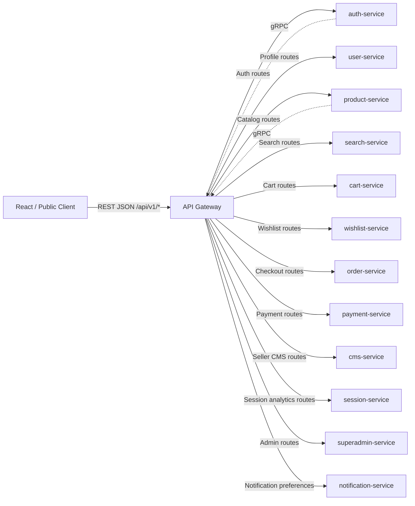
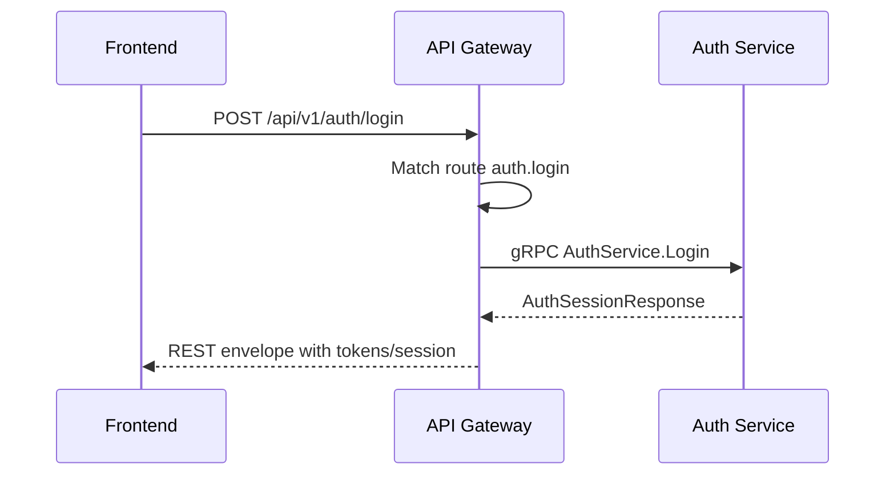
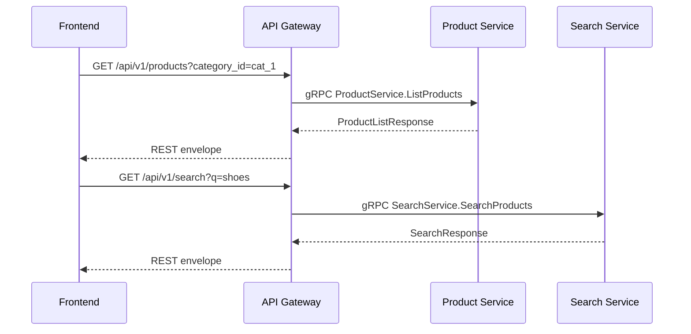
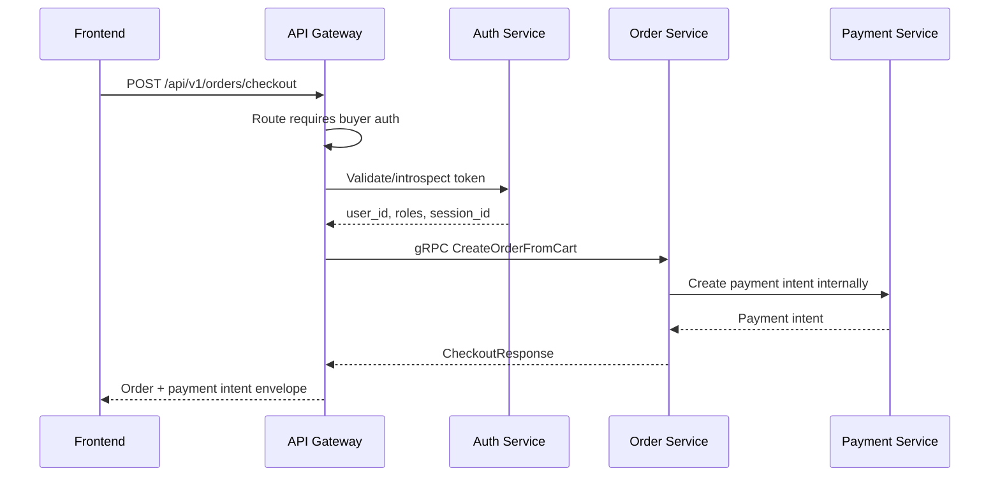
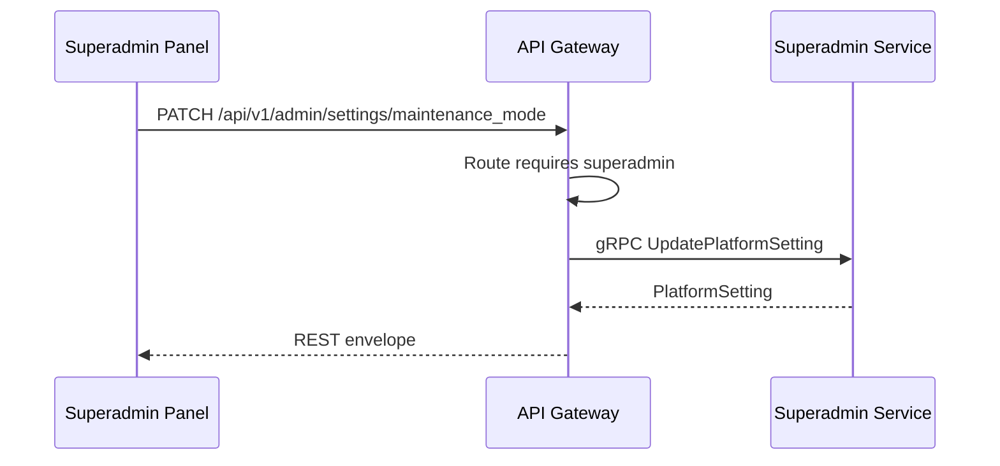
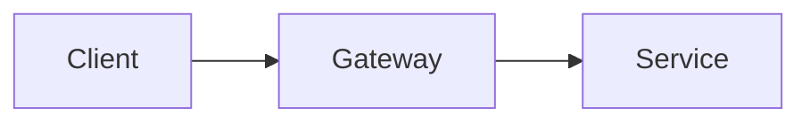

# 🚪 API Gateway Service - Task 1: Define Public Routes


## 📌 Task Summary

| Field | Detail |
|---|---|
| Task Name | Define public routes |
| Source | `docs/01-micro-tasks.md` → `API Gateway` → Task 1 |
| Goal | Frontend ke REST endpoints map karo: auth, products, cart, checkout, seller, admin |
| Priority | P0 |
| Dependency | Platform foundation |
| Output Type | Documentation-only route contract guide |
| Not Included | gRPC clients setup, auth middleware implementation, rate limiting, request validation, error mapping, observability, gRPC-Web bridge |

> **Simple Hinglish goal:** Is task me API Gateway ke public REST routes define kiye gaye hain. Frontend ko kaun sa endpoint call karna hai, Gateway internally kis microservice/gRPC method ko map karega, aur har route ka auth level kya hoga - ye sab clear kiya gaya hai.

---

## ✅ Final Output Created

```text
TaskImplementation/
└── API Gateway Service/
    └── task1.md
```

### Why this structure?

| Path | Purpose |
|---|---|
| `TaskImplementation/` | Saare task-wise implementation guides ka central folder |
| `TaskImplementation/API Gateway Service/` | API Gateway service ke task guides ka group |
| `task1.md` | Sirf **API Gateway Service - Task 1** ka public route definition guide |

> 🟢 **Scope rule:** Is task me sirf route contract define hua hai. Actual `backend/services/api-gateway/` code create nahi kiya gaya, kyunki wo API Gateway ke later implementation tasks me aayega.

---

## 🧭 Documents Studied

| Document | Kya use kiya gaya |
|---|---|
| `docs/01-micro-tasks.md` | API Gateway Task 1 ka exact scope identify kiya |
| `api/master-api.json` | REST endpoint, service, gRPC method, auth level, request/response schema ka source of truth |
| `docs/02-system-architecture.md` | Gateway responsibility: REST → gRPC bridge, auth, routing, response shaping |
| `docs/03-folder-structure.md` | Future API Gateway folder layout and middleware order |
| `docs/04-microservice-design.md` | Gateway ka purpose and "no business logic ownership" rule |
| `docs/13-developer-guide.md` | REST response envelope and public route addition flow |

---

## 🧩 API Gateway Route Architecture



**Hinglish explanation:**  
Frontend sirf REST endpoint call karega. Gateway route match karega, route ke auth level ko identify karega, request ko correct backend service ke gRPC method se map karega, aur response common REST JSON envelope me return karega. Business logic Gateway me nahi rahegi.

---

## 🧱 Route Definition Principles

| Rule | Explanation |
|---|---|
| Base prefix | Saare public routes `/api/v1` ke andar rahenge |
| REST outside, gRPC inside | Browser REST use karega, Gateway internal services se gRPC me baat karega |
| Route auth clear | Har route ka auth level `public`, `buyer`, `seller`, `admin`, `superadmin`, ya `webhook` hoga |
| Business logic service-owned | Gateway sirf routing/auth/shape karega; product, order, payment rules services me rahenge |
| Stable names | Route IDs `domain.action` format me rahenge, jaise `auth.login`, `cart.add_item` |
| Common response envelope | Success/error response predictable shape me rahega |
| No direct DB access | Gateway kisi service ki DB directly read/write nahi karega |

---

## 🔐 Auth Level Matrix

`api/master-api.json` ke according route access levels:

| Auth Level | Token Required | Allowed Roles | Use Case |
|---|---:|---|---|
| `public` | No | Anyone | Product browse, search, signup, login |
| `buyer` | Yes | `buyer`, `seller`, `admin`, `superadmin` | Cart, wishlist, orders, profile |
| `seller` | Yes | `seller`, `seller_manager`, `seller_catalog_editor`, `seller_order_manager`, `superadmin` | Seller products, coupons, dashboard |
| `admin` | Yes | `admin`, `operations_admin`, `finance_admin`, `catalog_admin`, `superadmin` | Admin users, orders, payments, analytics |
| `superadmin` | Yes | `superadmin` | Highest privilege platform settings |
| `webhook` | Signature-based | Provider signature | Payment provider callbacks |

> 🟡 **Important:** Auth middleware implementation API Gateway Task 3 me aayega. Task 1 me sirf route-level auth requirement define ki gayi hai.

---

## 📦 Common REST Response Shape

Developer guide ke according successful response:

```json
{
  "data": {},
  "request_id": "req_123",
  "error": null
}
```

Error response:

```json
{
  "data": null,
  "request_id": "req_123",
  "error": {
    "code": "VALIDATION_ERROR",
    "message": "Invalid request",
    "details": []
  }
}
```

**Hinglish explanation:**  
Frontend ko har endpoint se same shape milegi. Isse React side error handling, logging, toast messages, aur debugging simple rahega.

---

## 🪜 Step-by-Step Implementation

## Step 1: Task boundary lock kiya

Task 1 ka kaam route definition hai:

- Public REST endpoints identify karna
- Route groups banana
- Har route ka target service define karna
- Har route ka gRPC method map karna
- Har route ka auth level clear karna
- Request/response schema names attach karna

### Task 1 me ye implement nahi kiya gaya

| Not Included | Kyu nahi |
|---|---|
| gRPC client connection code | API Gateway Task 2 |
| JWT validation middleware | API Gateway Task 3 |
| RBAC enforcement code | API Gateway Task 3 |
| Redis rate limiter | API Gateway Task 4 |
| DTO validation code | API Gateway Task 5 |
| gRPC → REST error mapper | API Gateway Task 6 |
| Logs/metrics/traces | API Gateway Task 7 |
| gRPC-Web bridge | API Gateway Task 8 |

---

## Step 2: Source of truth choose kiya

Route contract ke liye `api/master-api.json` ko primary source maana gaya.

### Why?

| Reason | Benefit |
|---|---|
| Saare routes ek file me hain | Route drift kam hota hai |
| Service and gRPC mapping already defined hai | Gateway implementation predictable hogi |
| Auth level route ke saath attached hai | Public/protected routes clear rahenge |
| Schema names available hain | Request/response DTO later generate/validate ho sakte hain |

Example contract object:

```json
{
  "id": "auth.login",
  "method": "POST",
  "path": "/api/v1/auth/login",
  "service": "auth-service",
  "grpc": "AuthService.Login",
  "auth": "public",
  "request_schema": "LoginRequest",
  "response_schema": "AuthSessionResponse"
}
```

**Hinglish explanation:**  
Ye object Gateway ko batata hai ki `POST /api/v1/auth/login` public route hai, Auth Service ko call karega, aur internal RPC `AuthService.Login` hogi.

---

## Step 3: Route groups define kiye

Routes ko domain-wise group kiya gaya, taaki Gateway router readable rahe.

```text
/api/v1
├── /auth/*
├── /me/*
├── /products
├── /categories
├── /search
├── /cart/*
├── /wishlist/*
├── /orders/*
├── /payments/*
├── /seller/*
├── /sessions/events
├── /analytics/*
├── /webhooks/*
└── /admin/*
```

### Route group responsibilities

| Group | Responsibility |
|---|---|
| `/auth` | Signup, login, refresh, OTP, password reset |
| `/me` | Logged-in user profile, addresses, notification preferences |
| `/products`, `/categories`, `/search` | Public catalog browse and discovery |
| `/cart`, `/wishlist` | Buyer shopping state |
| `/orders`, `/payments` | Checkout, order history, payment retry |
| `/seller` | Seller profile, products, orders, coupons, campaigns, dashboard |
| `/sessions/events` | Public frontend analytics event ingestion |
| `/analytics` | Admin analytics views |
| `/webhooks` | External payment provider callbacks |
| `/admin` | Platform admin and superadmin controls |

---

## Step 4: Auth routes define kiye

Auth routes mostly public hain, kyunki signup/login/OTP token ke bina start hote hain. Logout protected hai.

| Route ID | Method | Path | Target gRPC | Auth | Request → Response |
|---|---|---|---|---|---|
| `auth.signup` | `POST` | `/api/v1/auth/signup` | `AuthService.Register` | `public` | `SignupRequest` → `AuthSessionResponse` |
| `auth.login` | `POST` | `/api/v1/auth/login` | `AuthService.Login` | `public` | `LoginRequest` → `AuthSessionResponse` |
| `auth.refresh` | `POST` | `/api/v1/auth/refresh` | `AuthService.RefreshToken` | `public` | `RefreshTokenRequest` → `TokenResponse` |
| `auth.logout` | `POST` | `/api/v1/auth/logout` | `AuthService.Logout` | `buyer` | `LogoutRequest` → `SuccessResponse` |
| `auth.otp_send` | `POST` | `/api/v1/auth/otp/send` | `AuthService.CreateOTPChallenge` | `public` | `SendOTPRequest` → `OTPChallengeResponse` |
| `auth.otp_verify` | `POST` | `/api/v1/auth/otp/verify` | `AuthService.VerifyOTP` | `public` | `VerifyOTPRequest` → `SuccessResponse` |
| `auth.password_forgot` | `POST` | `/api/v1/auth/password/forgot` | `AuthService.CreateOTPChallenge` | `public` | `ForgotPasswordRequest` → `OTPChallengeResponse` |
| `auth.password_reset` | `POST` | `/api/v1/auth/password/reset` | `AuthService.ResetPassword` | `public` | `ResetPasswordRequest` → `SuccessResponse` |

### Auth flow diagram



---

## Step 5: User and profile routes define kiye

User profile routes logged-in user ke liye hain. Gateway token claims se current user context downstream bhejega.

| Route ID | Method | Path | Service | Target gRPC | Auth |
|---|---|---|---|---|---|
| `user.me_get` | `GET` | `/api/v1/me` | `user-service` | `UserService.GetUser` | `buyer` |
| `user.me_update` | `PATCH` | `/api/v1/me` | `user-service` | `UserService.UpdateUserProfile` | `buyer` |
| `user.addresses_list` | `GET` | `/api/v1/me/addresses` | `user-service` | `UserService.ListUserAddresses` | `buyer` |
| `user.address_create` | `POST` | `/api/v1/me/addresses` | `user-service` | `UserService.CreateAddress` | `buyer` |
| `user.address_update` | `PATCH` | `/api/v1/me/addresses/{address_id}` | `user-service` | `UserService.UpdateAddress` | `buyer` |
| `user.address_delete` | `DELETE` | `/api/v1/me/addresses/{address_id}` | `user-service` | `UserService.DeleteAddress` | `buyer` |
| `notification.preferences_get` | `GET` | `/api/v1/me/notification-preferences` | `notification-service` | `NotificationService.GetNotificationPreference` | `buyer` |
| `notification.preferences_update` | `PATCH` | `/api/v1/me/notification-preferences` | `notification-service` | `NotificationService.UpdateNotificationPreference` | `buyer` |

**Hinglish explanation:**  
`/me` routes me frontend ko `user_id` path me bhejne ki zarurat nahi. Gateway token se `user_id` nikalega aur service ko safe auth context ke saath request forward karega.

---

## Step 6: Catalog and discovery routes define kiye

Product browsing public hai. Ye routes login ke bina accessible rahenge.

| Route ID | Method | Path | Service | Target gRPC | Auth |
|---|---|---|---|---|---|
| `product.list` | `GET` | `/api/v1/products` | `product-service` | `ProductService.ListProducts` | `public` |
| `product.detail` | `GET` | `/api/v1/products/{product_id}` | `product-service` | `ProductService.GetProduct` | `public` |
| `category.list` | `GET` | `/api/v1/categories` | `product-service` | `ProductService.ListCategories` | `public` |
| `search.products` | `GET` | `/api/v1/search` | `search-service` | `SearchService.SearchProducts` | `public` |
| `search.autocomplete` | `GET` | `/api/v1/search/autocomplete` | `search-service` | `SearchService.Autocomplete` | `public` |

### Catalog request flow



---

## Step 7: Cart and wishlist routes define kiye

Cart and wishlist buyer-level protected routes hain.

### Cart routes

| Route ID | Method | Path | Service | Target gRPC | Auth |
|---|---|---|---|---|---|
| `cart.get` | `GET` | `/api/v1/cart` | `cart-service` | `CartService.GetCart` | `buyer` |
| `cart.add_item` | `POST` | `/api/v1/cart/items` | `cart-service` | `CartService.AddItem` | `buyer` |
| `cart.update_item` | `PATCH` | `/api/v1/cart/items/{item_id}` | `cart-service` | `CartService.UpdateItemQuantity` | `buyer` |
| `cart.remove_item` | `DELETE` | `/api/v1/cart/items/{item_id}` | `cart-service` | `CartService.RemoveItem` | `buyer` |
| `cart.merge` | `POST` | `/api/v1/cart/merge` | `cart-service` | `CartService.MergeGuestCart` | `buyer` |
| `cart.coupon_preview` | `POST` | `/api/v1/cart/coupons/preview` | `cart-service` | `CartService.ApplyCouponPreview` | `buyer` |

### Wishlist routes

| Route ID | Method | Path | Service | Target gRPC | Auth |
|---|---|---|---|---|---|
| `wishlist.get` | `GET` | `/api/v1/wishlist` | `wishlist-service` | `WishlistService.GetWishlist` | `buyer` |
| `wishlist.add` | `POST` | `/api/v1/wishlist/items` | `wishlist-service` | `WishlistService.AddWishlistItem` | `buyer` |
| `wishlist.remove` | `DELETE` | `/api/v1/wishlist/items/{product_id}` | `wishlist-service` | `WishlistService.RemoveWishlistItem` | `buyer` |
| `wishlist.move_to_cart` | `POST` | `/api/v1/wishlist/items/{product_id}/move-to-cart` | `wishlist-service` | `WishlistService.MoveToCart` | `buyer` |

---

## Step 8: Checkout, order, and payment routes define kiye

Checkout buyer route hai. Admin refund/payment operations separate admin routes hain.

| Route ID | Method | Path | Service | Target gRPC | Auth |
|---|---|---|---|---|---|
| `order.checkout` | `POST` | `/api/v1/orders/checkout` | `order-service` | `OrderService.CreateOrderFromCart` | `buyer` |
| `order.list` | `GET` | `/api/v1/orders` | `order-service` | `OrderService.ListOrders` | `buyer` |
| `order.detail` | `GET` | `/api/v1/orders/{order_id}` | `order-service` | `OrderService.GetOrder` | `buyer` |
| `order.cancel` | `POST` | `/api/v1/orders/{order_id}/cancel` | `order-service` | `OrderService.CancelOrder` | `buyer` |
| `payment.retry` | `POST` | `/api/v1/payments/{payment_id}/retry` | `payment-service` | `PaymentService.CreatePaymentIntent` | `buyer` |
| `payment.webhook` | `POST` | `/api/v1/webhooks/payments/{provider}` | `payment-service` | `PaymentService.HandleWebhook` | `webhook` |

### Checkout flow



> 🟡 **Important:** Idempotency key `CheckoutRequest` ka part hai. Duplicate checkout prevent karna Order Service ka responsibility rahega; Gateway sirf request forward karega.

---

## Step 9: Seller routes define kiye

Seller routes seller dashboard/CMS ke liye protected rahenge.

### Seller profile and product routes

| Route ID | Method | Path | Service | Target gRPC | Auth |
|---|---|---|---|---|---|
| `seller.profile_get` | `GET` | `/api/v1/sellers/me` | `user-service` | `UserService.GetSellerProfile` | `seller` |
| `seller.profile_update` | `PATCH` | `/api/v1/sellers/me` | `user-service` | `UserService.UpdateSellerProfile` | `seller` |
| `seller.product_create` | `POST` | `/api/v1/seller/products` | `product-service` | `ProductService.CreateProduct` | `seller` |
| `seller.product_update` | `PATCH` | `/api/v1/seller/products/{product_id}` | `product-service` | `ProductService.UpdateProduct` | `seller` |
| `seller.product_publish` | `POST` | `/api/v1/seller/products/{product_id}/publish` | `product-service` | `ProductService.PublishProduct` | `seller` |

### Seller order and CMS routes

| Route ID | Method | Path | Service | Target gRPC | Auth |
|---|---|---|---|---|---|
| `seller.order.list` | `GET` | `/api/v1/seller/orders` | `order-service` | `OrderService.ListSellerOrders` | `seller` |
| `seller.order.fulfillment` | `PATCH` | `/api/v1/seller/orders/{order_id}/fulfillment` | `order-service` | `OrderService.UpdateFulfillment` | `seller` |
| `cms.dashboard_summary` | `GET` | `/api/v1/seller/dashboard/summary` | `cms-service` | `CMSService.GetSellerAnalytics` | `seller` |
| `cms.coupon_list` | `GET` | `/api/v1/seller/coupons` | `cms-service` | `CMSService.ListCoupons` | `seller` |
| `cms.coupon_create` | `POST` | `/api/v1/seller/coupons` | `cms-service` | `CMSService.CreateCoupon` | `seller` |
| `cms.coupon_update` | `PATCH` | `/api/v1/seller/coupons/{coupon_id}` | `cms-service` | `CMSService.UpdateCoupon` | `seller` |
| `cms.campaign_list` | `GET` | `/api/v1/seller/campaigns` | `cms-service` | `CMSService.ListCampaigns` | `seller` |
| `cms.campaign_create` | `POST` | `/api/v1/seller/campaigns` | `cms-service` | `CMSService.CreateCampaign` | `seller` |

**Hinglish explanation:**  
Seller routes me Gateway sirf seller role check karega. Product ownership, coupon ownership, order seller ownership jaise detailed business checks service layer me enforce honge.

---

## Step 10: Session and analytics routes define kiye

Frontend event ingestion public route hai. Analytics read APIs admin-only hain.

| Route ID | Method | Path | Service | Target gRPC | Auth |
|---|---|---|---|---|---|
| `session.ingest` | `POST` | `/api/v1/sessions/events` | `session-service` | `SessionService.IngestEvent` | `public` |
| `analytics.live` | `GET` | `/api/v1/analytics/live` | `session-service` | `SessionService.GetLiveMetrics` | `admin` |
| `analytics.sessions` | `GET` | `/api/v1/analytics/sessions` | `session-service` | `SessionService.ListSessions` | `admin` |
| `analytics.journey` | `GET` | `/api/v1/analytics/sessions/{session_id}/journey` | `session-service` | `SessionService.GetJourney` | `admin` |
| `analytics.funnels` | `GET` | `/api/v1/analytics/funnels` | `session-service` | `SessionService.GetFunnelReport` | `admin` |
| `analytics.heatmaps` | `GET` | `/api/v1/analytics/heatmaps` | `session-service` | `SessionService.GetHeatmap` | `admin` |

> 🔵 **Design note:** `session.ingest` public hai because anonymous users bhi browse karte hain. Abuse protection later Task 4 rate limiting me enforce hoga.

---

## Step 11: Admin and superadmin routes define kiye

Admin routes platform control plane ke liye hain. Highest-risk setting update route `superadmin` only hai.

| Route ID | Method | Path | Service | Target gRPC | Auth |
|---|---|---|---|---|---|
| `admin.users` | `GET` | `/api/v1/admin/users` | `superadmin-service` | `SuperadminService.ListUsersForAdmin` | `admin` |
| `admin.user_status` | `PATCH` | `/api/v1/admin/users/{user_id}/status` | `superadmin-service` | `SuperadminService.UpdateUserStatus` | `admin` |
| `admin.sellers` | `GET` | `/api/v1/admin/sellers` | `superadmin-service` | `SuperadminService.ListSellersForAdmin` | `admin` |
| `admin.seller_status` | `PATCH` | `/api/v1/admin/sellers/{seller_id}/status` | `superadmin-service` | `SuperadminService.UpdateSellerStatus` | `admin` |
| `admin.orders` | `GET` | `/api/v1/admin/orders` | `order-service` | `OrderService.ListOrders` | `admin` |
| `admin.payments` | `GET` | `/api/v1/admin/payments` | `payment-service` | `PaymentService.ListPayments` | `admin` |
| `payment.refund` | `POST` | `/api/v1/payments/{payment_id}/refund` | `payment-service` | `PaymentService.RefundPayment` | `admin` |
| `admin.refund_review` | `POST` | `/api/v1/admin/refunds/{refund_id}/review` | `superadmin-service` | `SuperadminService.ReviewRefund` | `admin` |
| `admin.audit_logs` | `GET` | `/api/v1/admin/audit-logs` | `superadmin-service` | `SuperadminService.ListAuditLogs` | `admin` |
| `admin.settings` | `GET` | `/api/v1/admin/settings` | `superadmin-service` | `SuperadminService.GetPlatformSettings` | `admin` |
| `admin.setting_update` | `PATCH` | `/api/v1/admin/settings/{key}` | `superadmin-service` | `SuperadminService.UpdatePlatformSetting` | `superadmin` |

### Admin control flow



---

## Step 12: Route registry format define kiya

Future implementation me Gateway ke andar route registry maintain ho sakti hai. Task 1 me registry ka shape define karna enough hai.

### Example route registry schema

```go
type RouteDefinition struct {
    ID             string
    Method         string
    Path           string
    Service        string
    GRPCMethod     string
    AuthLevel      string
    RequestSchema  string
    ResponseSchema string
}
```

### Example entries

```go
var PublicRoutes = []RouteDefinition{
    {
        ID:             "auth.login",
        Method:         "POST",
        Path:           "/api/v1/auth/login",
        Service:        "auth-service",
        GRPCMethod:     "AuthService.Login",
        AuthLevel:      "public",
        RequestSchema:  "LoginRequest",
        ResponseSchema: "AuthSessionResponse",
    },
    {
        ID:             "product.detail",
        Method:         "GET",
        Path:           "/api/v1/products/{product_id}",
        Service:        "product-service",
        GRPCMethod:     "ProductService.GetProduct",
        AuthLevel:      "public",
        RequestSchema:  "IdPathRequest",
        ResponseSchema: "Product",
    },
}
```

**Hinglish explanation:**  
Route registry se Gateway implementation predictable hogi. Tests bhi easily verify kar sakte hain ki route exists, auth level correct hai, aur service mapping expected hai.

> 🟡 **Note:** Ye code example hai, actual Go file create nahi ki gayi.

---

## Step 13: Future router grouping example define kiya

Actual implementation later tasks me hogi, but Task 1 ke route groups ko router me roughly aise organize kiya ja sakta hai:

```go
func RegisterRoutes(r chi.Router, h Handlers, mw Middleware) {
    r.Route("/api/v1", func(api chi.Router) {
        api.Post("/auth/signup", h.Auth.Signup)
        api.Post("/auth/login", h.Auth.Login)
        api.Post("/auth/refresh", h.Auth.Refresh)

        api.Get("/products", h.Products.List)
        api.Get("/products/{product_id}", h.Products.Detail)
        api.Get("/categories", h.Products.Categories)
        api.Get("/search", h.Search.Products)

        api.Group(func(protected chi.Router) {
            protected.Use(mw.RequireBuyer)
            protected.Get("/cart", h.Cart.Get)
            protected.Post("/orders/checkout", h.Orders.Checkout)
            protected.Get("/me", h.Users.Me)
        })

        api.Group(func(seller chi.Router) {
            seller.Use(mw.RequireSeller)
            seller.Post("/seller/products", h.SellerProducts.Create)
            seller.Get("/seller/orders", h.SellerOrders.List)
        })

        api.Group(func(admin chi.Router) {
            admin.Use(mw.RequireAdmin)
            admin.Get("/admin/users", h.Admin.Users)
            admin.Get("/analytics/live", h.Analytics.Live)
        })
    })
}
```

**Hinglish explanation:**  
Public routes directly register honge. Buyer/seller/admin routes group middleware ke andar register honge, taaki auth rule duplicate na ho.

> 🔴 **Out of scope:** `chi.Router`, handlers, and middleware code is task me implement nahi kiya gaya.

---

## 🧰 External Libraries and Tools Used

Is Task 1 me koi backend runtime library install nahi ki gayi. Ye documentation-only route definition task hai.

| Tool/Library | Used? | What it is | Why used | Install/Use |
|---|---:|---|---|---|
| Markdown | ✅ | Documentation format | Beginner-friendly guide likhne ke liye | No install needed in GitHub/GitLab/most IDEs |
| Mermaid | ✅ | Markdown-friendly diagram syntax | Architecture and request flow diagrams ke liye | GitHub supports it; VS Code me optional Mermaid extension use kar sakte ho |
| Shields.io badges | ✅ | Badge image service | Status, priority, dependency ko visually clear dikhane ke liye | Markdown image URL use hota hai |
| `api/master-api.json` | ✅ | Existing project API contract | Route catalog ka source of truth | Repo me already available |
| `github.com/go-chi/chi/v5` | ❌ Future only | Lightweight Go HTTP router | Later gateway route implementation me useful hoga | Future task me: `go get github.com/go-chi/chi/v5` |
| `google.golang.org/grpc` | ❌ Future only | Go gRPC framework | Later Gateway se services call karne ke liye | Future task me: `go get google.golang.org/grpc` |

### Mermaid usage example

````markdown

````

### Future Go router dependency install example

```bash
cd backend/services/api-gateway
go get github.com/go-chi/chi/v5
go get google.golang.org/grpc
```

> 🟡 **Important:** Upar wale install commands sirf future implementation reference ke liye hain. Task 1 me inhe run nahi kiya gaya.

---

## 🗂️ Clean Folder Structure

### Created for this task

```text
TaskImplementation/
└── API Gateway Service/
    └── task1.md
```

### Future API Gateway implementation target

Docs ke according later tasks me actual Gateway code roughly yahan rahega:

```text
backend/
└── services/
    └── api-gateway/
        ├── cmd/
        │   └── server/
        │       └── main.go
        ├── internal/
        │   ├── config/
        │   │   └── config.go
        │   ├── routes/
        │   │   ├── routes.go
        │   │   └── registry.go
        │   ├── handlers/
        │   │   ├── auth_handler.go
        │   │   ├── product_handler.go
        │   │   ├── cart_handler.go
        │   │   ├── order_handler.go
        │   │   ├── seller_handler.go
        │   │   └── admin_handler.go
        │   ├── middleware/
        │   │   ├── jwt.go
        │   │   ├── rbac.go
        │   │   └── rate_limit.go
        │   └── clients/
        │       ├── auth_client.go
        │       ├── product_client.go
        │       └── order_client.go
        └── deploy/
            ├── Dockerfile
            └── k8s.yaml
```

> 🔵 **Design note:** Ye future folder structure reference hai. Task 1 me sirf `TaskImplementation/API Gateway Service/task1.md` create hua hai.

---

## 🧪 Route Contract Verification Checklist

| Check | Status | Notes |
|---|---:|---|
| `TaskImplementation/` exists | ✅ | Existing folder kept |
| `TaskImplementation/API Gateway Service/` created | ✅ | New service-specific guide folder |
| `task1.md` created | ✅ | This guide |
| Route source identified | ✅ | `api/master-api.json` |
| Auth levels documented | ✅ | public/buyer/seller/admin/superadmin/webhook |
| Auth routes documented | ✅ | Signup/login/refresh/logout/OTP/password |
| Product/search routes documented | ✅ | Product, category, search, autocomplete |
| Cart/wishlist routes documented | ✅ | Buyer shopping state |
| Checkout/payment routes documented | ✅ | Checkout, order, retry, webhook |
| Seller routes documented | ✅ | Profile, products, orders, coupons, campaigns |
| Admin routes documented | ✅ | Users, sellers, orders, payments, settings |
| Mermaid diagrams included | ✅ | Architecture and flows |
| External tools/libraries mentioned | ✅ | Markdown, Mermaid, future Go router/gRPC |
| No beyond Task 1 code implemented | ✅ | Documentation-only |

---

## 🚫 Out of Scope for Task 1

Ye items intentionally implement nahi kiye gaye:

- Actual API Gateway service code
- `backend/services/api-gateway/` files
- gRPC client setup
- JWT verification
- RBAC middleware
- Redis rate limiting
- Request DTO validation
- Error mapper
- Logging/metrics/tracing
- Dockerfile/Kubernetes manifests
- gRPC-Web bridge

> 🔴 **Reason:** Ye sab API Gateway ke later tasks ya Platform Foundation ke already separate tasks hain. Task 1 ka purpose sirf public route contract define karna hai.

---

## ✅ Final Task 1 Route Contract

API Gateway Service Task 1 complete hai:

- `/api/v1` base route standard define hua.
- Public, buyer, seller, admin, superadmin, webhook auth groups clear hue.
- `api/master-api.json` ko route source of truth maana gaya.
- REST route → backend service → gRPC method mapping documented hua.
- Route groups frontend workflows ke according organize hue: auth, products, cart, checkout, seller, admin.
- Future Gateway implementation ke liye route registry shape and grouping example ready hai.

> 🟢 **Final outcome:** Ab API Gateway ke next tasks route ambiguity ke bina start ho sakte hain. Task 2 me gRPC clients setup hoga, Task 3 me auth middleware, aur later tasks me validation/error/observability add honge.
