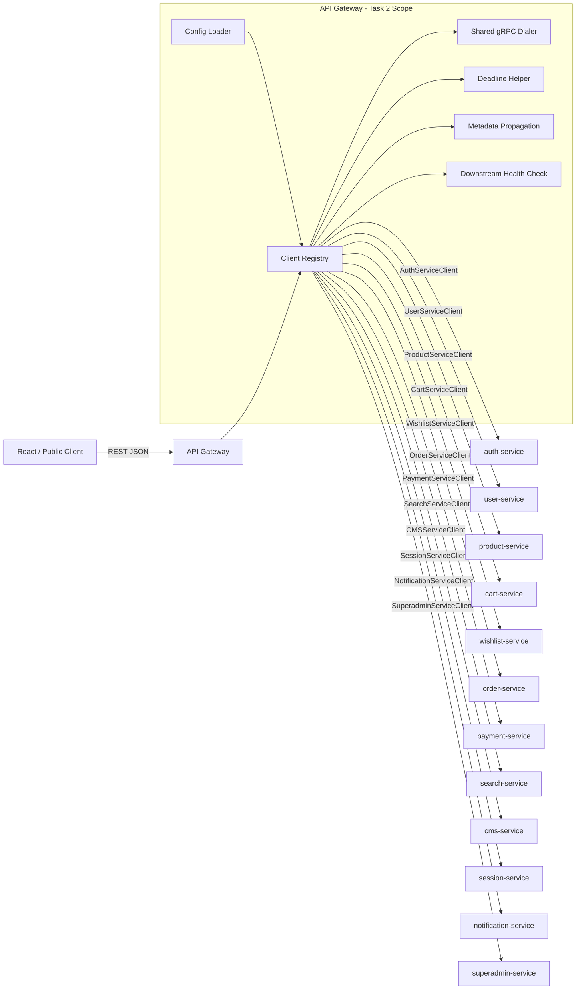
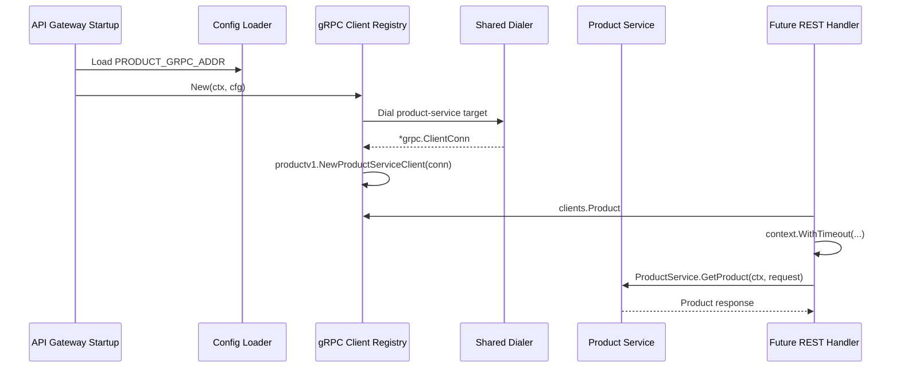
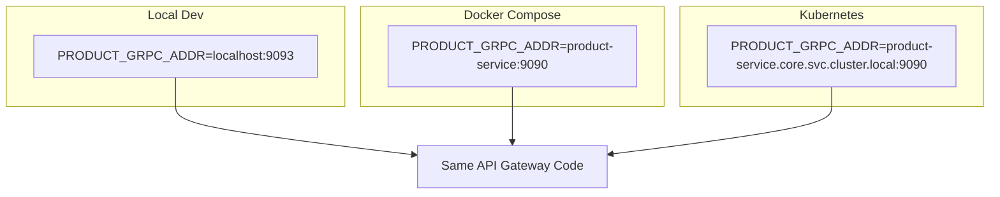

# 🚪 API Gateway Service - Task 2: gRPC Clients Setup


## 📌 Task Summary

| Field | Detail |
|---|---|
| Task Name | gRPC clients setup |
| Source | `docs/01-micro-tasks.md` → `API Gateway` → Task 2 |
| Goal | Gateway ke andar har required microservice ka reusable gRPC client configure karna |
| Priority | `P0` |
| Dependency | Platform Foundation Task 2: Proto strategy |
| Output Type | Documentation-only implementation guide |
| Not Included | Auth middleware, RBAC, rate limiting, request validation, REST handlers implementation, gRPC-Web bridge, business logic |

> **Simple Hinglish goal:** API Gateway ko internal services se gRPC ke through baat karni hai. Is task me hum define karte hain ki Gateway service addresses config se kaise lega, generated proto clients kaise initialize honge, connection reuse kaise hoga, deadlines kaise set honge, aur shutdown pe connections safely close kaise honge.

---

## ✅ Final Output Created

```text
TaskImplementation/
└── API Gateway Service/
    ├── task1.md
    └── task2.md
```

### Why this structure?

| Path | Purpose |
|---|---|
| `TaskImplementation/` | Saare task-wise implementation guides ka central folder |
| `TaskImplementation/API Gateway Service/` | API Gateway service ke task guides ka group |
| `task1.md` | Public REST route contract guide |
| `task2.md` | Sirf **API Gateway Service - Task 2** ka gRPC client setup guide |

> 🟢 **Scope rule:** Is task me actual `backend/services/api-gateway/` code create nahi kiya gaya. User request ka output sirf folder structure aur `task2.md` content hai. Backend implementation ke liye exact structure/code examples niche documented hain.

---

## 🧭 Documents Studied

| Document | Kya use kiya gaya |
|---|---|
| `docs/01-micro-tasks.md` | API Gateway Task 2 ka exact scope: gRPC clients setup |
| `TaskImplementation/API Gateway Service/task1.md` | Public routes se required target services identify kiye |
| `api/master-api.json` | REST → service → gRPC method mapping and gRPC service packages |
| `docs/02-system-architecture.md` | REST outside, gRPC inside, mandatory deadlines, no direct DB access |
| `docs/03-folder-structure.md` | Future Gateway folder layout: `internal/clients/`, `internal/config/` |
| `docs/04-microservice-design.md` | API Gateway responsibilities and required downstream gRPC clients |
| `docs/13-developer-guide.md` | Proto generate → service implementation → gateway route flow |

---

## 🟦 Task 2 Boundary

### Included in Task 2

| Included | Explanation |
|---|---|
| Service target config | Gateway env vars se downstream gRPC addresses read karega |
| Generated client registry | `AuthServiceClient`, `ProductServiceClient`, etc. ek central struct me expose honge |
| Shared dialer | Har service ke liye same timeout, TLS/insecure, keepalive, and metadata rules |
| Connection reuse | Per request dial nahi hoga; app startup pe connection create, shutdown pe close |
| Deadlines | Downstream calls ke liye context timeout mandatory hoga |
| Metadata propagation | `x-request-id` and trace headers downstream forward karne ka pattern |
| Health/readiness check | Gateway downstream services ki connectivity check kar sakega |

### Not included in Task 2

| Not Included | Future Task |
|---|---|
| JWT validation middleware | API Gateway Task 3 |
| RBAC enforcement | API Gateway Task 3 |
| Redis rate limiting | API Gateway Task 4 |
| Request DTO validation | API Gateway Task 5 |
| gRPC error → REST error mapper | API Gateway Task 6 |
| Full logs/metrics/traces instrumentation | API Gateway Task 7 |
| gRPC-Web bridge | API Gateway Task 8 |
| Public route handler implementation | Later route-specific implementation |

> 🔴 **Important:** Gateway gRPC clients sirf communication layer hain. Product, order, payment, cart, auth jaise business rules respective services ke andar rahenge.

---

## 🧩 gRPC Client Architecture



**Hinglish explanation:**  
Browser REST call karta hai, Gateway route handler request ko parse karega, phir `clients.Clients` registry se correct generated gRPC client uthayega. Har client startup pe initialize hoga, request ke time reuse hoga. Isse latency kam hoti hai aur connection storm avoid hota hai.

---

## 🔁 Client Call Flow



**Hinglish explanation:**  
Connection startup pe banega. Handler sirf ready client use karega. Har call ke saath timeout lagega, warna slow downstream service Gateway request ko indefinitely hang kar sakti hai.

---

## 🧱 Required gRPC Client Matrix

`docs/04-microservice-design.md` aur `api/master-api.json` ke basis par Task 2 ke required Gateway clients:

| Service | Proto Package | Generated Client | Env Var | Used By Public Routes |
|---|---|---|---|---|
| Auth Service | `ecommerce.auth.v1` | `AuthServiceClient` | `AUTH_GRPC_ADDR` | Signup, login, refresh, logout, OTP |
| User Service | `ecommerce.user.v1` | `UserServiceClient` | `USER_GRPC_ADDR` | Profile, addresses, seller profile |
| Product Service | `ecommerce.product.v1` | `ProductServiceClient` | `PRODUCT_GRPC_ADDR` | Product list/detail, seller product CRUD |
| Cart Service | `ecommerce.cart.v1` | `CartServiceClient` | `CART_GRPC_ADDR` | Cart get/add/update/remove/merge |
| Wishlist Service | `ecommerce.wishlist.v1` | `WishlistServiceClient` | `WISHLIST_GRPC_ADDR` | Wishlist get/add/remove/move |
| Order Service | `ecommerce.order.v1` | `OrderServiceClient` | `ORDER_GRPC_ADDR` | Checkout, orders, seller fulfillment, admin orders |
| Payment Service | `ecommerce.payment.v1` | `PaymentServiceClient` | `PAYMENT_GRPC_ADDR` | Payment retry, refunds, webhooks, admin payments |
| Search Service | `ecommerce.search.v1` | `SearchServiceClient` | `SEARCH_GRPC_ADDR` | Search, autocomplete |
| CMS Service | `ecommerce.cms.v1` | `CMSServiceClient` | `CMS_GRPC_ADDR` | Seller dashboard, coupons, campaigns |
| Session Service | `ecommerce.session.v1` | `SessionServiceClient` | `SESSION_GRPC_ADDR` | Event ingestion, analytics |
| Notification Service | `ecommerce.notification.v1` | `NotificationServiceClient` | `NOTIFICATION_GRPC_ADDR` | Notification preferences |
| Superadmin Service | `ecommerce.superadmin.v1` | `SuperadminServiceClient` | `SUPERADMIN_GRPC_ADDR` | Admin users, sellers, settings, audit logs |

> 🟡 **Note:** `RecommendationService` master API me proto-level service ke roop me present hai, but Task 1 public route contract me recommendation REST route define nahi hai. Isliye Task 2 me usko required Gateway client nahi banaya gaya. Recommendation route approve hone par same pattern se client add hoga.

---

## 🗂️ Clean Folder Structure

### Actual documentation output

```text
TaskImplementation/
└── API Gateway Service/
    ├── task1.md
    └── task2.md
```

### Target backend implementation structure

```text
backend/
└── services/
    └── api-gateway/
        ├── go.mod
        ├── cmd/
        │   └── server/
        │       └── main.go
        └── internal/
            ├── config/
            │   └── config.go
            └── clients/
                ├── clients.go
                ├── dialer.go
                ├── health.go
                ├── metadata.go
                ├── timeouts.go
                ├── auth_client.go
                ├── user_client.go
                ├── product_client.go
                ├── cart_client.go
                ├── wishlist_client.go
                ├── order_client.go
                ├── payment_client.go
                ├── search_client.go
                ├── cms_client.go
                ├── session_client.go
                ├── notification_client.go
                └── superadmin_client.go
```

### Folder responsibility

| Path | Responsibility |
|---|---|
| `internal/config/config.go` | Env vars load and validate karna |
| `internal/clients/clients.go` | Saare generated clients ka central registry |
| `internal/clients/dialer.go` | Shared gRPC connection factory |
| `internal/clients/metadata.go` | Request id / tracing metadata forward karna |
| `internal/clients/timeouts.go` | Service-wise call deadlines define karna |
| `internal/clients/health.go` | Downstream health/readiness check |
| `*_client.go` | Service-specific generated client initialization |

> 🟢 **Beginner tip:** `clients.go` ko phonebook samjho. Handler ko service address ya connection detail nahi pata hoti; wo sirf `clients.Product.GetProduct(...)` call karta hai.

---

## 🧰 External Libraries / Tools

Task 2 me actual dependency install nahi ki gayi. Ye libraries/tools future backend implementation ke liye required/recommended hain.

| Tool / Library | What it is | Why used | Install / Use |
|---|---|---|---|
| Go | Backend runtime | Gateway Go service me implement hoga | Repo docs: Go `1.24+`; current `backend/go.work` me Go `1.26.3` configured hai |
| `google.golang.org/grpc` | Go gRPC framework | Internal services ke typed gRPC clients banane ke liye | `go get google.golang.org/grpc` |
| `google.golang.org/protobuf` | Protobuf runtime | Generated protobuf message types ke liye | `go get google.golang.org/protobuf` |
| `buf` CLI | Proto generation/linting tool | Proto contracts se Go clients generate karne ke liye | Install Buf, then run `buf generate` |
| Generated proto clients | Buf/protoc output | `authv1.NewAuthServiceClient(conn)` jaise constructors milte hain | `buf generate` ke baad use |
| `google.golang.org/grpc/credentials/insecure` | Local insecure transport | Local development me TLS ke bina service call karne ke liye | `grpc` module ke saath available |
| `google.golang.org/grpc/credentials` | TLS transport | Staging/prod me TLS/mTLS connect ke liye | `grpc` module ke saath available |
| `google.golang.org/grpc/health/grpc_health_v1` | gRPC health API client | Downstream readiness check ke liye | `grpc` module ke saath available |

### Install commands

```bash
cd backend/services/api-gateway

go get google.golang.org/grpc
go get google.golang.org/protobuf
```

### Proto generate command

```bash
# repo root se run karo, jab proto/buf config available ho
buf generate
```

### Usage pattern

```go
conn, err := grpc.NewClient(
    cfg.ProductGRPCAddr,
    grpc.WithTransportCredentials(insecure.NewCredentials()),
)
if err != nil {
    return err
}

productClient := productv1.NewProductServiceClient(conn)
```

> 🟡 **Important:** Task 2 me `chi`, JWT, Redis, validator, Prometheus, etc. install karna required nahi hai. Wo later API Gateway tasks ke concerns hain.

---

## 🪜 Step-by-Step Implementation

## Step 1: Task Boundary Lock Kiya

Sabse pehle ye decide kiya gaya ki Task 2 sirf Gateway ke **outbound gRPC communication layer** ko cover karega.

### Task 2 ka core output

```text
REST Handler → Client Registry → Generated gRPC Client → Downstream Service
```

### Why?

| Reason | Benefit |
|---|---|
| Central client registry | Handlers duplicate dialing code nahi likhenge |
| Startup-time connections | Request latency low rahegi |
| Config-driven targets | Local, Docker, Kubernetes me same code chalega |
| Deadlines mandatory | Slow service Gateway ko block nahi karegi |
| Close on shutdown | Resource leak avoid hoga |

---

## Step 2: Service Address Config Define Kiya

Gateway ko har downstream service ka address environment se milna chahiye.

### Example `.env`

```bash
SERVICE_NAME=api-gateway
APP_ENV=local
HTTP_ADDR=:8080

GRPC_TLS_ENABLED=false
GRPC_DIAL_TIMEOUT=3s

AUTH_GRPC_ADDR=localhost:9091
USER_GRPC_ADDR=localhost:9092
PRODUCT_GRPC_ADDR=localhost:9093
CART_GRPC_ADDR=localhost:9094
WISHLIST_GRPC_ADDR=localhost:9095
ORDER_GRPC_ADDR=localhost:9096
PAYMENT_GRPC_ADDR=localhost:9097
SEARCH_GRPC_ADDR=localhost:9098
CMS_GRPC_ADDR=localhost:9099
SESSION_GRPC_ADDR=localhost:9100
NOTIFICATION_GRPC_ADDR=localhost:9101
SUPERADMIN_GRPC_ADDR=localhost:9102
```

### Environment examples

| Runtime | Target Example |
|---|---|
| Local machine | `localhost:9093` |
| Docker Compose | `product-service:9090` |
| Kubernetes | `product-service.core.svc.cluster.local:9090` |

**Hinglish explanation:**  
Code me hardcoded address nahi hona chahiye. Local setup me ports alag ho sakte hain, Docker me service name use hota hai, aur Kubernetes me DNS name use hota hai. Env config Gateway ko portable banata hai.

---

## Step 3: Config Struct Banaya

`internal/config/config.go` me Gateway config strongly typed rakha jayega.

```go
package config

import "time"

type Config struct {
    ServiceName string
    Env         string
    HTTPAddr    string

    GRPCTLSEnabled bool
    GRPCDialTimeout time.Duration

    AuthGRPCAddr         string
    UserGRPCAddr         string
    ProductGRPCAddr      string
    CartGRPCAddr         string
    WishlistGRPCAddr     string
    OrderGRPCAddr        string
    PaymentGRPCAddr      string
    SearchGRPCAddr       string
    CMSGRPCAddr          string
    SessionGRPCAddr      string
    NotificationGRPCAddr string
    SuperadminGRPCAddr   string
}
```

### Validation rule

```go
func (c Config) Validate() error {
    required := map[string]string{
        "AUTH_GRPC_ADDR":         c.AuthGRPCAddr,
        "USER_GRPC_ADDR":         c.UserGRPCAddr,
        "PRODUCT_GRPC_ADDR":      c.ProductGRPCAddr,
        "CART_GRPC_ADDR":         c.CartGRPCAddr,
        "WISHLIST_GRPC_ADDR":     c.WishlistGRPCAddr,
        "ORDER_GRPC_ADDR":        c.OrderGRPCAddr,
        "PAYMENT_GRPC_ADDR":      c.PaymentGRPCAddr,
        "SEARCH_GRPC_ADDR":       c.SearchGRPCAddr,
        "CMS_GRPC_ADDR":          c.CMSGRPCAddr,
        "SESSION_GRPC_ADDR":      c.SessionGRPCAddr,
        "NOTIFICATION_GRPC_ADDR": c.NotificationGRPCAddr,
        "SUPERADMIN_GRPC_ADDR":   c.SuperadminGRPCAddr,
    }

    for name, value := range required {
        if value == "" {
            return fmt.Errorf("%s is required", name)
        }
    }

    return nil
}
```

**Hinglish explanation:**  
Gateway startup pe hi fail ho jana better hai agar service address missing hai. Runtime me random request fail hone se debugging mushkil hoti hai.

---

## Step 4: Generated Proto Clients Ko Dependency Banaya

Platform Foundation Task 2 ke proto strategy ke hisaab se generated Go clients expected location me available honge.

### Expected generated import style

```go
import (
    authv1 "github.com/example/ecommerce-platform/backend/shared/gen/go/ecommerce/auth/v1"
    productv1 "github.com/example/ecommerce-platform/backend/shared/gen/go/ecommerce/product/v1"
)
```

### Example generated constructor

```go
authClient := authv1.NewAuthServiceClient(conn)
productClient := productv1.NewProductServiceClient(conn)
```

> 🟡 **Note:** Actual module path `go.mod` finalize hone ke baad update hoga. Examples me `github.com/example/ecommerce-platform` placeholder path use kiya gaya hai, kyunki docs me same style reference hai.

---

## Step 5: Client Registry Design Kiya

Gateway me ek central `Clients` struct hoga jo saare generated clients expose karega.

```go
package clients

import (
    authv1 "github.com/example/ecommerce-platform/backend/shared/gen/go/ecommerce/auth/v1"
    cartv1 "github.com/example/ecommerce-platform/backend/shared/gen/go/ecommerce/cart/v1"
    cmsv1 "github.com/example/ecommerce-platform/backend/shared/gen/go/ecommerce/cms/v1"
    notificationv1 "github.com/example/ecommerce-platform/backend/shared/gen/go/ecommerce/notification/v1"
    orderv1 "github.com/example/ecommerce-platform/backend/shared/gen/go/ecommerce/order/v1"
    paymentv1 "github.com/example/ecommerce-platform/backend/shared/gen/go/ecommerce/payment/v1"
    productv1 "github.com/example/ecommerce-platform/backend/shared/gen/go/ecommerce/product/v1"
    searchv1 "github.com/example/ecommerce-platform/backend/shared/gen/go/ecommerce/search/v1"
    sessionv1 "github.com/example/ecommerce-platform/backend/shared/gen/go/ecommerce/session/v1"
    superadminv1 "github.com/example/ecommerce-platform/backend/shared/gen/go/ecommerce/superadmin/v1"
    userv1 "github.com/example/ecommerce-platform/backend/shared/gen/go/ecommerce/user/v1"
    wishlistv1 "github.com/example/ecommerce-platform/backend/shared/gen/go/ecommerce/wishlist/v1"

    "google.golang.org/grpc"
)

type Clients struct {
    Auth         authv1.AuthServiceClient
    User         userv1.UserServiceClient
    Product      productv1.ProductServiceClient
    Cart         cartv1.CartServiceClient
    Wishlist     wishlistv1.WishlistServiceClient
    Order        orderv1.OrderServiceClient
    Payment      paymentv1.PaymentServiceClient
    Search       searchv1.SearchServiceClient
    CMS          cmsv1.CMSServiceClient
    Session      sessionv1.SessionServiceClient
    Notification notificationv1.NotificationServiceClient
    Superadmin   superadminv1.SuperadminServiceClient

    conns []*grpc.ClientConn
}
```

### Why registry?

| Without registry | With registry |
|---|---|
| Har handler service address jaanta hai | Handler sirf typed client use karta hai |
| Duplicate dial code hota hai | Dialing centralized hoti hai |
| Shutdown difficult hota hai | Saare conns ek jagah close hote hain |
| Testing hard hoti hai | Mock/fake clients inject karna easy hota hai |

---

## Step 6: Shared Dialer Banaya

`dialer.go` ka kaam hai ek consistent `*grpc.ClientConn` create karna.

```go
package clients

import (
    "context"
    "time"

    "google.golang.org/grpc"
    "google.golang.org/grpc/backoff"
    "google.golang.org/grpc/connectivity"
    "google.golang.org/grpc/credentials"
    "google.golang.org/grpc/credentials/insecure"
    "google.golang.org/grpc/keepalive"
)

type DialOptions struct {
    TLSEnabled  bool
    DialTimeout time.Duration
}

func dial(ctx context.Context, target string, opts DialOptions) (*grpc.ClientConn, error) {
    transport := insecure.NewCredentials()
    if opts.TLSEnabled {
        transport = credentials.NewClientTLSFromCert(nil, "")
    }

    dialCtx, cancel := context.WithTimeout(ctx, opts.DialTimeout)
    defer cancel()

    conn, err := grpc.NewClient(
        target,
        grpc.WithTransportCredentials(transport),
        grpc.WithConnectParams(grpc.ConnectParams{
            Backoff: backoff.Config{
                BaseDelay:  100 * time.Millisecond,
                Multiplier: 1.6,
                Jitter:     0.2,
                MaxDelay:   3 * time.Second,
            },
            MinConnectTimeout: opts.DialTimeout,
        }),
        grpc.WithKeepaliveParams(keepalive.ClientParameters{
            Time:                30 * time.Second,
            Timeout:             10 * time.Second,
            PermitWithoutStream: true,
        }),
    )
    if err != nil {
        return nil, err
    }

    conn.Connect()

    for {
        state := conn.GetState()
        if state == connectivity.Ready {
            return conn, nil
        }

        if !conn.WaitForStateChange(dialCtx, state) {
            _ = conn.Close()
            return nil, dialCtx.Err()
        }
    }
}
```

### Explanation

| Part | Meaning |
|---|---|
| `grpc.NewClient` | gRPC channel create karta hai |
| `WithTransportCredentials` | Local me insecure, prod me TLS |
| `ConnectParams` | Reconnect backoff predictable rakhta hai |
| `Keepalive` | Long-lived connection healthy rakhne me help karta hai |
| `DialTimeout` | Startup pe dependency unreachable ho to fast fail |

> 🟡 **Production note:** Real mTLS service mesh use ho to TLS details mesh sidecar handle kar sakta hai. App-level TLS config project infra decision ke hisaab se adjust hoga.

---

## Step 7: Client Initialization Function Banaya

`clients.New(ctx, cfg)` startup pe saare clients initialize karega.

```go
package clients

import (
    "context"

    "github.com/example/ecommerce-platform/backend/services/api-gateway/internal/config"
)

func New(ctx context.Context, cfg config.Config) (*Clients, error) {
    opts := DialOptions{
        TLSEnabled:  cfg.GRPCTLSEnabled,
        DialTimeout: cfg.GRPCDialTimeout,
    }

    authConn, err := dial(ctx, cfg.AuthGRPCAddr, opts)
    if err != nil {
        return nil, fmt.Errorf("dial auth service: %w", err)
    }

    userConn, err := dial(ctx, cfg.UserGRPCAddr, opts)
    if err != nil {
        _ = authConn.Close()
        return nil, fmt.Errorf("dial user service: %w", err)
    }

    productConn, err := dial(ctx, cfg.ProductGRPCAddr, opts)
    if err != nil {
        _ = authConn.Close()
        _ = userConn.Close()
        return nil, fmt.Errorf("dial product service: %w", err)
    }

    c := &Clients{
        Auth:    authv1.NewAuthServiceClient(authConn),
        User:    userv1.NewUserServiceClient(userConn),
        Product: productv1.NewProductServiceClient(productConn),
        conns: []*grpc.ClientConn{
            authConn,
            userConn,
            productConn,
        },
    }

    return c, nil
}
```

### Full implementation idea

Actual Task 2 backend implementation me same pattern saare services ke liye repeat hoga:

```text
Auth
User
Product
Cart
Wishlist
Order
Payment
Search
CMS
Session
Notification
Superadmin
```

**Hinglish explanation:**  
Agar kisi service ka connection fail hota hai, function error return karega aur already-open connections close karega. Isse half-ready Gateway start nahi hota.

---

## Step 8: Connection Close Method Add Kiya

Gateway shutdown pe saare gRPC connections close hone chahiye.

```go
func (c *Clients) Close() error {
    var errs []error

    for _, conn := range c.conns {
        if conn == nil {
            continue
        }
        if err := conn.Close(); err != nil {
            errs = append(errs, err)
        }
    }

    return errors.Join(errs...)
}
```

### Where used?

```go
grpcClients, err := clients.New(ctx, cfg)
if err != nil {
    log.Fatal(err)
}
defer grpcClients.Close()
```

**Hinglish explanation:**  
Connection close na karne se local tests aur graceful shutdown me resource leak ho sakta hai. `defer grpcClients.Close()` simple and reliable pattern hai.

---

## Step 9: Service-wise Deadline Strategy Define Ki

`docs/02-system-architecture.md` ke according gRPC deadlines mandatory hain. Gateway outbound call bina timeout ke nahi jayega.

### Recommended starting deadlines

| Service / Use Case | Timeout | Reason |
|---|---:|---|
| Search query | `300ms` | User-facing search fast feel honi chahiye |
| Auth token verify | `300ms` | Har protected request auth pe depend karega |
| Product read | `500ms` | Listing/detail quick response chahiye |
| Cart / Wishlist | `700ms` | Mutable buyer state, but still interactive |
| Session event ingest | `200ms` | Analytics ingestion request lightweight hona chahiye |
| Checkout / Order | `1500ms` | Checkout multiple services touch kar sakta hai |
| Payment commands | `1500ms` | Provider-facing operations slower ho sakte hain |
| Admin list/report | `1000ms` | Data-heavy but bounded request |

### Timeout helper

```go
package clients

import (
    "context"
    "time"
)

type Downstream string

const (
    DownstreamAuth    Downstream = "auth"
    DownstreamProduct Downstream = "product"
    DownstreamSearch  Downstream = "search"
    DownstreamOrder   Downstream = "order"
    DownstreamPayment Downstream = "payment"
)

func WithDeadline(ctx context.Context, service Downstream) (context.Context, context.CancelFunc) {
    timeout := 700 * time.Millisecond

    switch service {
    case DownstreamAuth, DownstreamSearch:
        timeout = 300 * time.Millisecond
    case DownstreamProduct:
        timeout = 500 * time.Millisecond
    case DownstreamOrder, DownstreamPayment:
        timeout = 1500 * time.Millisecond
    }

    return context.WithTimeout(ctx, timeout)
}
```

**Hinglish explanation:**  
Timeouts Gateway ko resilient banate hain. Agar Search slow hai, request bounded time me fail hogi. Later Task 6 error mapper us failure ko frontend-friendly REST error me convert karega.

---

## Step 10: Metadata Propagation Pattern Add Kiya

Gateway ko downstream calls me request id pass karna chahiye. Later observability task me trace/span details fully add honge, but Task 2 client layer metadata propagation ke liye ready rahega.

### Metadata helper

```go
package clients

import (
    "context"

    "google.golang.org/grpc/metadata"
)

func WithRequestMetadata(ctx context.Context, requestID string) context.Context {
    if requestID == "" {
        return ctx
    }

    return metadata.AppendToOutgoingContext(ctx, "x-request-id", requestID)
}
```

### Future handler usage

```go
ctx, cancel := clients.WithDeadline(r.Context(), clients.DownstreamProduct)
defer cancel()

ctx = clients.WithRequestMetadata(ctx, requestID)

product, err := h.clients.Product.GetProduct(ctx, req)
```

**Hinglish explanation:**  
`x-request-id` downstream service logs me bhi dikhega. Jab ek request Gateway se Product Service tak jaati hai, debugging me same request id use karke logs join kiye ja sakte hain.

---

## Step 11: Health / Readiness Check Add Kiya

Gateway readiness tabhi true honi chahiye jab critical downstream gRPC services reachable hon.

### Health check helper

```go
package clients

import (
    "context"
    "time"

    healthv1 "google.golang.org/grpc/health/grpc_health_v1"
)

func checkHealth(ctx context.Context, conn *grpc.ClientConn, serviceName string) error {
    healthCtx, cancel := context.WithTimeout(ctx, 300*time.Millisecond)
    defer cancel()

    client := healthv1.NewHealthClient(conn)
    resp, err := client.Check(healthCtx, &healthv1.HealthCheckRequest{
        Service: serviceName,
    })
    if err != nil {
        return err
    }

    if resp.GetStatus() != healthv1.HealthCheckResponse_SERVING {
        return fmt.Errorf("%s is not serving: %s", serviceName, resp.GetStatus())
    }

    return nil
}
```

### Registry-level check idea

```go
func (c *Clients) Check(ctx context.Context) map[string]error {
    results := map[string]error{}

    results["auth"] = checkHealth(ctx, c.authConn, "ecommerce.auth.v1.AuthService")
    results["product"] = checkHealth(ctx, c.productConn, "ecommerce.product.v1.ProductService")
    results["order"] = checkHealth(ctx, c.orderConn, "ecommerce.order.v1.OrderService")

    return results
}
```

> 🟡 **Implementation note:** For this helper, `Clients` struct can store named connections like `authConn`, `productConn`, etc., or a map of service name to connection. Named fields are beginner-friendly; map is shorter for loops.

---

## Step 12: Handler Usage Example Define Kiya

Task 2 handlers implement nahi karta, but client setup ka usage clear hona chahiye.

### Product detail handler example

```go
type ProductHandler struct {
    clients *clients.Clients
}

func (h *ProductHandler) GetProduct(w http.ResponseWriter, r *http.Request) {
    productID := chi.URLParam(r, "product_id")

    ctx, cancel := clients.WithDeadline(r.Context(), clients.DownstreamProduct)
    defer cancel()

    ctx = clients.WithRequestMetadata(ctx, requestIDFromContext(r.Context()))

    resp, err := h.clients.Product.GetProduct(ctx, &productv1.IdPathRequest{
        Id: productID,
    })
    if err != nil {
        // Task 6 me gRPC error mapper final hoga.
        writeGatewayError(w, err)
        return
    }

    writeJSON(w, http.StatusOK, resp)
}
```

### Explanation

| Line | Meaning |
|---|---|
| `h.clients.Product` | Registry se Product gRPC client use hua |
| `WithDeadline` | Downstream timeout attach hua |
| `WithRequestMetadata` | Request id downstream forward hua |
| `GetProduct` | Generated typed RPC call hua |
| `writeGatewayError` | Final error mapping Task 6 me polish hoga |

> 🟢 **Beginner tip:** Handler ko `grpc.NewClient` kabhi call nahi karna chahiye. Handler sirf already-created client use karega.

---

## Step 13: Startup Wiring Define Kiya

`cmd/server/main.go` me Gateway startup flow:

```go
func main() {
    ctx, stop := signal.NotifyContext(context.Background(), syscall.SIGINT, syscall.SIGTERM)
    defer stop()

    cfg, err := config.Load()
    if err != nil {
        log.Fatal(err)
    }

    grpcClients, err := clients.New(ctx, cfg)
    if err != nil {
        log.Fatal(err)
    }
    defer grpcClients.Close()

    router := routes.NewRouter(cfg, grpcClients)
    server := server.NewHTTPServer(cfg.HTTPAddr, router)

    go func() {
        if err := server.ListenAndServe(); err != nil && !errors.Is(err, http.ErrServerClosed) {
            log.Fatal(err)
        }
    }()

    <-ctx.Done()

    shutdownCtx, cancel := context.WithTimeout(context.Background(), 10*time.Second)
    defer cancel()

    _ = server.Shutdown(shutdownCtx)
}
```

**Hinglish explanation:**  
Pehle config load, phir gRPC clients create, phir router/server start. Shutdown signal aate hi HTTP server stop hota hai aur gRPC connections close hote hain.

---

## Step 14: Local Verification Flow Define Kiya

Task 2 backend files jab implement honge, verification flow ye rahega:

```bash
# 1. Proto clients generate
buf generate

# 2. Gateway dependencies download
cd backend/services/api-gateway
go mod tidy

# 3. Gateway tests
go test ./...

# 4. Gateway run
go run ./cmd/server
```

### Expected startup logs

```text
api-gateway config loaded
grpc client connected service=auth target=localhost:9091
grpc client connected service=product target=localhost:9093
grpc client connected service=order target=localhost:9096
api-gateway listening addr=:8080
```

### Expected failure if config missing

```text
AUTH_GRPC_ADDR is required
```

### Expected failure if service unreachable

```text
dial product service: context deadline exceeded
```

**Hinglish explanation:**  
Failure messages service name ke saath honi chahiye. `context deadline exceeded` alone beginner ke liye confusing hota hai; `dial product service` prefix debugging easy banata hai.

---

## Step 15: Testing Strategy Define Ki

Task 2 me client setup testable hona chahiye.

| Test Type | What to test |
|---|---|
| Config unit test | Missing `*_GRPC_ADDR` pe validation fail hoti hai |
| Dialer unit test | Invalid target pe timeout/error aata hai |
| Registry test | `clients.New` saare required client fields initialize karta hai |
| Close test | `Clients.Close()` multiple connections close karta hai |
| Metadata test | `x-request-id` outgoing metadata me add hota hai |
| Deadline test | Service-wise timeout expected value set hota hai |
| Health test | Fake health server `SERVING` return kare to pass, `NOT_SERVING` ho to fail |

### Fake gRPC server idea

```go
listener := bufconn.Listen(1024 * 1024)
server := grpc.NewServer()
healthServer := health.NewServer()
healthServer.SetServingStatus(
    "ecommerce.product.v1.ProductService",
    healthv1.HealthCheckResponse_SERVING,
)
healthv1.RegisterHealthServer(server, healthServer)
```

> 🟡 **Why bufconn?** Network port open kiye bina in-memory gRPC server se tests fast and reliable hote hain.

---

## Step 16: Common Mistakes Avoid Kiye

| Mistake | Problem | Correct Pattern |
|---|---|---|
| Per request `grpc.NewClient` | Latency high, connection storm | Startup pe connect, request me reuse |
| Hardcoded addresses | Local/Docker/K8s me code change chahiye | Env config |
| No deadline | Slow downstream Gateway hang karega | `context.WithTimeout` |
| Missing close | Resource leak | `defer clients.Close()` |
| Handler knows target address | Tight coupling | Client registry |
| Blind retries on commands | Duplicate checkout/payment risk | Retry policy carefully later define karo |
| Gateway business logic | Service boundary break | Domain service ko call karo |

---

## 🛡️ Reliability Rules

| Rule | Implementation Guidance |
|---|---|
| One connection per service | Long-lived `*grpc.ClientConn` reuse karo |
| Fast startup validation | Required target missing ho to startup fail |
| Bounded dial | `GRPC_DIAL_TIMEOUT` use karo |
| Bounded request | Har RPC call ke saath deadline use karo |
| Context first | HTTP request context se child context banao |
| No direct DB | Gateway sirf gRPC services se baat kare |
| No secret in logs | Targets log kar sakte ho, tokens/raw auth headers nahi |
| Safe shutdown | HTTP shutdown + gRPC `Close()` dono call karo |

---

## 📦 Example Complete Client Registry Shape

Production implementation me `Clients` struct named connections bhi store kar sakta hai:

```go
type Clients struct {
    Auth         authv1.AuthServiceClient
    User         userv1.UserServiceClient
    Product      productv1.ProductServiceClient
    Cart         cartv1.CartServiceClient
    Wishlist     wishlistv1.WishlistServiceClient
    Order        orderv1.OrderServiceClient
    Payment      paymentv1.PaymentServiceClient
    Search       searchv1.SearchServiceClient
    CMS          cmsv1.CMSServiceClient
    Session      sessionv1.SessionServiceClient
    Notification notificationv1.NotificationServiceClient
    Superadmin   superadminv1.SuperadminServiceClient

    authConn         *grpc.ClientConn
    userConn         *grpc.ClientConn
    productConn      *grpc.ClientConn
    cartConn         *grpc.ClientConn
    wishlistConn     *grpc.ClientConn
    orderConn        *grpc.ClientConn
    paymentConn      *grpc.ClientConn
    searchConn       *grpc.ClientConn
    cmsConn          *grpc.ClientConn
    sessionConn      *grpc.ClientConn
    notificationConn *grpc.ClientConn
    superadminConn   *grpc.ClientConn
}
```

### Why named connections?

| Benefit | Explanation |
|---|---|
| Health checks simple | `productConn` directly check ho sakta hai |
| Logs readable | Service name field clearly map hota hai |
| Beginner-friendly | Map iteration ke comparison me explicit code easy hota hai |

---

## 🧪 Readiness Response Example

Future `/readyz` endpoint Gateway client registry se status le sakta hai.

```json
{
  "status": "ready",
  "dependencies": {
    "auth": "serving",
    "user": "serving",
    "product": "serving",
    "cart": "serving",
    "order": "serving",
    "payment": "serving"
  }
}
```

If Product Service down:

```json
{
  "status": "not_ready",
  "dependencies": {
    "auth": "serving",
    "product": "unavailable"
  }
}
```

> 🔵 **Note:** Actual HTTP health endpoint routing Platform Foundation/API Gateway base implementation me add hoga. Task 2 sirf client-side health check helper define karta hai.

---

## 🧭 Local to Kubernetes Target Mapping



**Hinglish explanation:**  
Sirf env target change hota hai, Gateway code same rehta hai. Ye 12-factor style config approach hai.

---

## ✅ Implementation Checklist

| Checklist Item | Status |
|---|---|
| `TaskImplementation/API Gateway Service/` folder exists | ✅ |
| `task2.md` created | ✅ |
| Task 2 scope documented | ✅ |
| Required downstream services listed | ✅ |
| Config env vars documented | ✅ |
| Client registry design documented | ✅ |
| Shared dialer example added | ✅ |
| Connection close pattern added | ✅ |
| Deadline strategy added | ✅ |
| Metadata propagation pattern added | ✅ |
| Health/readiness helper documented | ✅ |
| External tools/libraries explained | ✅ |
| Mermaid architecture and flow diagrams added | ✅ |
| Out-of-scope items clearly mentioned | ✅ |

---

## 🚫 Explicitly Not Implemented Beyond Task 2

Is guide me intentionally ye cheezein implement/document-as-done nahi ki gayi:

- JWT parsing or validation
- RBAC role checks
- Redis rate limiting
- Request body/query validation
- REST route handlers for all endpoints
- gRPC status to REST error mapper
- Full OpenTelemetry/Prometheus setup
- gRPC-Web bridge
- Business service logic
- Database access
- New backend source files

> 🔴 **Reason:** Ye sab API Gateway ke later tasks ya service-specific tasks ka part hai. Task 2 ka focused output sirf Gateway ke gRPC clients setup ka design and step-by-step implementation guide hai.

---

## 🎯 Final Outcome

API Gateway Service Task 2 complete hai as a structured implementation guide:

- Gateway ke required downstream gRPC clients identify ho gaye.
- Env-based service target config define ho gaya.
- Generated proto client usage pattern clear ho gaya.
- Shared dialer, deadlines, metadata, health checks, and shutdown strategy document ho gayi.
- Beginner-friendly examples and Mermaid diagrams add ho gaye.
- Scope guardrails clear hain, taaki Task 3+ work accidentally mix na ho.

> 🟢 **Final result:** Ab API Gateway ke future backend implementation me `internal/clients/` layer bina ambiguity ke ban sakti hai. Task 3 auth middleware ko ye same client registry use karke Auth Service se token verification karne ka clean base milega.
