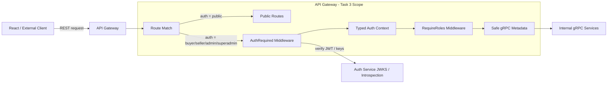
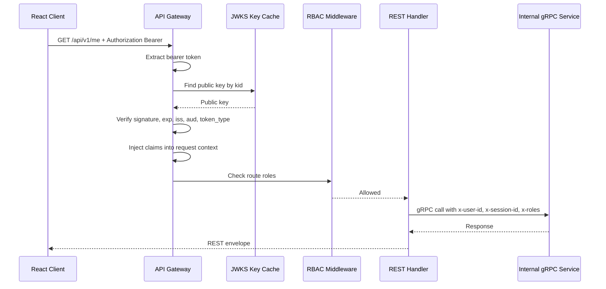
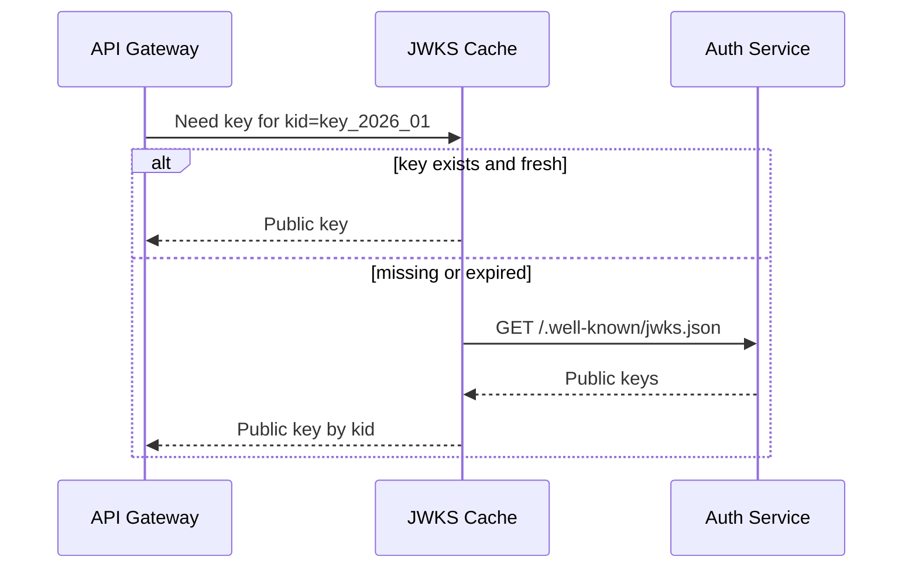
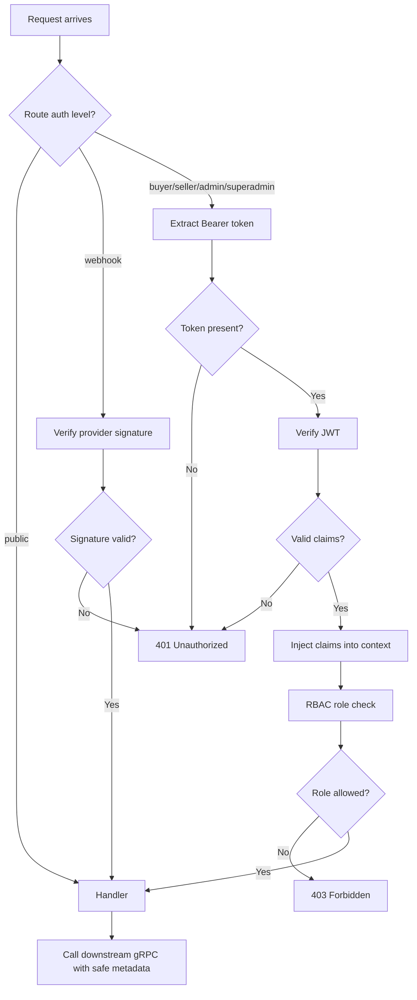

# 🚪 API Gateway Service - Task 3: Auth Middleware


## 📌 Task Summary

| Field | Detail |
|---|---|
| Task Name | Auth middleware |
| Source | `docs/01-micro-tasks.md` → `API Gateway` → Task 3 |
| Goal | JWT validate karna, user context inject karna, RBAC enforce karna, aur public vs protected routes clear rakhna |
| Priority | `P0` |
| Dependency | Auth Service |
| Output Type | Documentation-only implementation guide |
| Not Included | Rate limiting, request DTO validation, gRPC error mapping, full observability, Auth Service token issuing, Payment provider webhook signature internals |

> **Simple Hinglish goal:** API Gateway ke protected routes pe request tabhi aage jayegi jab access token valid ho. Token se user/session/roles nikal kar request context me safe tarike se inject hoga, phir route ke required role ke basis pe access allow/deny hoga.

---

## ✅ Final Output Created

```text
TaskImplementation/
└── API Gateway Service/
    ├── task1.md
    ├── task2.md
    └── task3.md
```

### Why this structure?

| Path | Purpose |
|---|---|
| `TaskImplementation/` | Saare task-wise implementation guides ka central folder |
| `TaskImplementation/API Gateway Service/` | API Gateway service ke guides ka group |
| `task1.md` | Public route contract |
| `task2.md` | Gateway gRPC clients setup |
| `task3.md` | Sirf **API Gateway Service - Task 3** ka auth middleware guide |

> 🟢 **Scope rule:** Is task me actual `backend/services/api-gateway/` code create nahi kiya gaya. User request ka output sirf folder structure aur `task3.md` content hai. Backend implementation ke exact files/code examples niche documented hain.

---

## 🧭 Documents Studied

| Document | Kya use kiya gaya |
|---|---|
| `docs/01-micro-tasks.md` | Task 3 exact scope: JWT validate, user context inject, RBAC enforce |
| `docs/02-system-architecture.md` | Gateway auth responsibility, REST → gRPC flow, no direct DB access |
| `docs/03-folder-structure.md` | Gateway target folders: `internal/middleware`, `internal/routes`, `internal/clients` |
| `docs/04-microservice-design.md` | Gateway purpose: auth enforcement, response shaping, no business ownership |
| `docs/06-auth-security.md` | JWT claims, access token TTL, roles, RBAC rules, security headers |
| `docs/13-developer-guide.md` | Common REST success/error envelope |
| `api/master-api.json` | Route-level auth requirements: `public`, `buyer`, `seller`, `admin`, `superadmin`, `webhook` |
| `TaskImplementation/API Gateway Service/task1.md` | Public route groups and auth matrix |
| `TaskImplementation/API Gateway Service/task2.md` | gRPC client registry and Auth Service dependency |

---

## 🟦 Task 3 Boundary

### Included in Task 3

| Included | Explanation |
|---|---|
| Bearer token extraction | `Authorization: Bearer <access_token>` header se token safely nikalna |
| JWT verification strategy | Signature, `kid`, issuer, audience, expiry, token type validate karna |
| Auth claims model | `sub`, `sid`, `roles`, `seller_id`, `token_type` ko typed Go struct me map karna |
| Request context injection | Valid claims ko HTTP request context me store karna |
| RBAC middleware | Route ke allowed roles ke against JWT roles check karna |
| Public/protected route split | Public routes bina JWT, protected groups JWT + roles ke saath |
| Downstream auth metadata | Full JWT forward nahi; safe claims gRPC metadata me pass karna |
| Webhook auth boundary | Payment webhooks JWT nahi use karenge; separate signature guard ka placeholder |
| Unit test plan | Missing token, expired token, invalid issuer, allowed/denied role test cases |

### Not included in Task 3

| Not Included | Future Task / Owner |
|---|---|
| Access/refresh token issue karna | Auth Service |
| Password, OTP, MFA flows | Auth Service |
| Redis rate limiting | API Gateway Task 4 |
| Request body/query validation | API Gateway Task 5 |
| gRPC error → REST error mapper | API Gateway Task 6 |
| Logs, metrics, traces full wiring | API Gateway Task 7 |
| Provider-specific webhook signature details | Payment Service provider abstraction |
| Service-level ownership checks | Respective backend service, for example Product/CMS/Order |

> 🔴 **Important:** Gateway route-level auth karega. Deep business authorization, jaise "seller sirf apna product edit kar sakta hai", service layer me bhi enforce hoga.

---

## 🧩 Auth Middleware Architecture



**Hinglish explanation:**  
Request pehle route se match hoti hai. Agar route public hai to JWT required nahi. Agar route protected hai to `AuthRequired` token validate karega, claims context me inject karega, phir `RequireRoles` route-level role check karega. Handler downstream service ko call karte waqt full JWT nahi bhejega; sirf safe metadata jaise user id, session id, roles bhejega.

---

## 🔐 Auth Level Matrix

`api/master-api.json` ke auth requirements ke basis par Gateway middleware mapping:

| Auth Level | JWT Required | Allowed Roles | Middleware Chain |
|---|---:|---|---|
| `public` | No | Anyone | Public route only |
| `buyer` | Yes | `buyer`, `seller`, `admin`, `superadmin` | `AuthRequired` → `RequireRoles(...)` |
| `seller` | Yes | `seller`, `seller_manager`, `seller_catalog_editor`, `seller_order_manager`, `superadmin` | `AuthRequired` → `RequireRoles(...)` |
| `admin` | Yes | `admin`, `operations_admin`, `finance_admin`, `catalog_admin`, `superadmin` | `AuthRequired` → `RequireRoles(...)` |
| `superadmin` | Yes | `superadmin` | `AuthRequired` → `RequireRoles("superadmin")` |
| `webhook` | No user JWT | Provider signature | `RequireWebhookSignature` |

### Status code decision

| Case | HTTP Status | Reason |
|---|---:|---|
| Missing token on protected route | `401` | User authenticate nahi hua |
| Malformed bearer header | `401` | Token readable nahi hai |
| Invalid signature / expired token | `401` | Token trust nahi kar sakte |
| Wrong issuer/audience/token type | `401` | Token is API ke liye valid nahi |
| Valid token but role not allowed | `403` | User authenticated hai, but authorized nahi |
| Webhook signature missing/invalid | `401` or `403` | Provider trust fail hua |

---

## 🧾 Expected JWT Claims

`docs/06-auth-security.md` ke according Gateway access token me ye claims expect karega:

```json
{
  "sub": "user_123",
  "sid": "sess_123",
  "roles": ["buyer"],
  "seller_id": "seller_456",
  "token_type": "access",
  "iat": 1760000000,
  "exp": 1760000900,
  "iss": "ecommerce-auth",
  "aud": "ecommerce-api"
}
```

### Claim rules

| Claim | Required | Purpose |
|---|---:|---|
| `sub` | Yes | Authenticated user id |
| `sid` | Yes | Session id for audit/session tracking |
| `roles` | Yes | Route-level RBAC |
| `seller_id` | Conditional | Seller dashboard context |
| `token_type` | Yes | Must be `access`; refresh token API access ke liye reject hoga |
| `iss` | Yes | Must match `JWT_ISSUER` |
| `aud` | Yes | Must match `JWT_AUDIENCE` |
| `exp` | Yes | Expired token reject hoga |
| `kid` header | Yes for rotating keys | Correct public key select karne ke liye |

> 🟡 **Security note:** Full JWT logs, context, downstream metadata, ya error details me print nahi karna. Token sensitive credential hai.

---

## 🔁 Protected Request Flow



**Hinglish explanation:**  
Gateway token ko trust karne se pehle cryptographic verification karta hai. Valid token ke baad claims request context me aate hain. RBAC pass hone ke baad handler business service ko call karta hai.

---

## 🗂️ Clean Folder Structure

### Actual documentation output

```text
TaskImplementation/
└── API Gateway Service/
    ├── task1.md
    ├── task2.md
    └── task3.md
```

### Target backend implementation structure

```text
backend/
└── services/
    └── api-gateway/
        ├── go.mod
        ├── cmd/
        │   └── server/
        │       └── main.go
        └── internal/
            ├── auth/
            │   ├── claims.go
            │   ├── context.go
            │   ├── verifier.go
            │   ├── jwks.go
            │   └── bearer.go
            ├── config/
            │   └── config.go
            ├── middleware/
            │   ├── jwt.go
            │   ├── rbac.go
            │   ├── optional_auth.go
            │   └── webhook_auth.go
            ├── routes/
            │   ├── routes.go
            │   └── auth_levels.go
            └── clients/
                ├── clients.go
                └── metadata.go
```

### Folder responsibility

| Path | Responsibility |
|---|---|
| `internal/auth/claims.go` | JWT claims ka typed model |
| `internal/auth/context.go` | Request context me claims set/get helpers |
| `internal/auth/verifier.go` | Token signature and claims validation |
| `internal/auth/jwks.go` | Auth Service public keys/JWKS cache strategy |
| `internal/auth/bearer.go` | `Authorization` header parser |
| `internal/middleware/jwt.go` | `AuthRequired` middleware |
| `internal/middleware/rbac.go` | `RequireRoles` middleware |
| `internal/middleware/optional_auth.go` | Public routes ke liye optional identity support |
| `internal/middleware/webhook_auth.go` | Webhook routes ke liye separate signature guard |
| `internal/routes/auth_levels.go` | Route auth groups and role mapping |
| `internal/clients/metadata.go` | Safe auth claims ko gRPC metadata me attach karna |

---

## 🧰 External Libraries / Tools

Task 3 me actual dependency install nahi ki gayi. Ye future backend implementation ke liye required/recommended hain.

| Tool / Library | What it is | Why used | Install / Use |
|---|---|---|---|
| Go | Backend runtime | API Gateway Go service me middleware implement hoga | Repo docs: Go `1.24+` |
| `github.com/go-chi/chi/v5` | Lightweight HTTP router | Auth middleware ko route groups pe cleanly attach karne ke liye | `go get github.com/go-chi/chi/v5` |
| `github.com/golang-jwt/jwt/v5` | JWT parse/verify library | Access token signature, claims, issuer, audience, expiry validate karne ke liye | `go get github.com/golang-jwt/jwt/v5` |
| `google.golang.org/grpc/metadata` | gRPC metadata API | User/session/role context downstream services ko safely forward karne ke liye | `go get google.golang.org/grpc` |
| Auth Service JWKS endpoint | Public signing keys source | `kid` ke basis pe JWT signing key rotate/resolve karne ke liye | Auth Service expose karega, Gateway cache karega |
| Generated proto clients | Buf/protoc output | Optional token introspection call ke liye `AuthServiceClient` available hoga | `buf generate` |

### Install commands

```bash
cd backend/services/api-gateway

go get github.com/go-chi/chi/v5
go get github.com/golang-jwt/jwt/v5
go get google.golang.org/grpc
```

### Basic usage

```go
parser := jwt.NewParser(
    jwt.WithIssuer(cfg.JWTIssuer),
    jwt.WithAudience(cfg.JWTAudience),
    jwt.WithValidMethods([]string{"RS256"}),
)

token, err := parser.ParseWithClaims(rawToken, &AccessClaims{}, keyFunc)
```

**Hinglish explanation:**  
`jwt/v5` token parse and validate karne me help karta hai. `chi` route groups pe middleware attach karna simple banata hai. `grpc/metadata` downstream calls me safe auth context bhejne ke liye use hota hai.

---

## 🪜 Step-by-Step Implementation

## Step 1: Task Boundary Lock Kiya

Task 3 ka kaam Gateway ke auth layer ko define karna hai:

```text
Protected REST Route
→ AuthRequired
→ Claims Context
→ RequireRoles
→ Handler
→ gRPC Metadata
→ Downstream Service
```

### Is step me decisions

| Decision | Reason |
|---|---|
| Gateway local JWT verify karega | Har request pe Auth Service network call avoid hoga |
| Auth Service JWKS source hoga | Signing keys central Auth Service ke paas rahenge |
| Full JWT downstream nahi bhejna | Token leak blast radius kam hota hai |
| RBAC route-level rahega | Public/protected API boundary clear hoti hai |
| Service-level authorization duplicate nahi, complement karega | Ownership/business rules service ke paas rahenge |

---

## Step 2: Config Keys Define Karo

Gateway ko JWT verification ke liye config chahiye.

### `.env` example

```bash
SERVICE_NAME=api-gateway
HTTP_ADDR=:8080

JWT_ISSUER=ecommerce-auth
JWT_AUDIENCE=ecommerce-api
JWT_ALLOWED_ALGS=RS256
JWT_JWKS_URL=http://localhost:8081/.well-known/jwks.json
JWT_JWKS_CACHE_TTL=5m
JWT_CLOCK_SKEW=30s

AUTH_GRPC_ADDR=localhost:9001
```

### Config struct example

```go
package config

import "time"

type Config struct {
    JWTIssuer       string
    JWTAudience     string
    JWTAllowedAlgs  []string
    JWTJWKSURL      string
    JWTJWKSCacheTTL time.Duration
    JWTClockSkew    time.Duration
    AuthGRPCAddr    string
}
```

**Hinglish explanation:**  
Issuer/audience wrong token ko reject karne ke liye zaruri hain. JWKS URL se Gateway Auth Service ke public keys cache karega. Clock skew chhota rakha gaya hai taaki servers ke time me minor difference tolerate ho.

---

## Step 3: Claims Model Banao

JWT payload ko strongly typed struct me map karna clean and testable hota hai.

### `internal/auth/claims.go`

```go
package auth

import "github.com/golang-jwt/jwt/v5"

type AccessClaims struct {
    SessionID string   `json:"sid"`
    Roles     []string `json:"roles"`
    SellerID  string   `json:"seller_id,omitempty"`
    TokenType string   `json:"token_type"`

    jwt.RegisteredClaims
}

func (c AccessClaims) UserID() string {
    return c.Subject
}

func (c AccessClaims) HasRole(role string) bool {
    for _, current := range c.Roles {
        if current == role {
            return true
        }
    }
    return false
}
```

### Claims validation rules

| Field | Rule |
|---|---|
| `sub` / `Subject` | Empty nahi hona chahiye |
| `SessionID` | Empty nahi hona chahiye for logged-in user |
| `Roles` | At least one role required |
| `TokenType` | Must equal `access` |
| `Issuer` | Configured issuer se match |
| `Audience` | Configured audience se match |
| `ExpiresAt` | Current time se future me hona chahiye |

---

## Step 4: Request Context Helper Banao

Middleware claims ko context me store karega. Handler and downstream metadata helper usi context se claims read karenge.

### `internal/auth/context.go`

```go
package auth

import "context"

type claimsContextKey struct{}

func WithClaims(ctx context.Context, claims AccessClaims) context.Context {
    return context.WithValue(ctx, claimsContextKey{}, claims)
}

func ClaimsFromContext(ctx context.Context) (AccessClaims, bool) {
    claims, ok := ctx.Value(claimsContextKey{}).(AccessClaims)
    return claims, ok
}

func MustUserID(ctx context.Context) (string, bool) {
    claims, ok := ClaimsFromContext(ctx)
    if !ok || claims.UserID() == "" {
        return "", false
    }
    return claims.UserID(), true
}
```

**Hinglish explanation:**  
Context ek request-scoped carrier hai. Isme token raw form me nahi, sirf verified claims rakhe jayenge. Isse handlers ko header parse karne ki zarurat nahi padegi.

---

## Step 5: Bearer Token Parser Banao

`Authorization` header strict parse hona chahiye.

### `internal/auth/bearer.go`

```go
package auth

import "strings"

func BearerToken(header string) string {
    if header == "" {
        return ""
    }

    parts := strings.Fields(header)
    if len(parts) != 2 {
        return ""
    }

    if !strings.EqualFold(parts[0], "Bearer") {
        return ""
    }

    return parts[1]
}
```

### Accepted and rejected examples

| Header | Result |
|---|---|
| `Authorization: Bearer eyJ...` | ✅ Token extracted |
| `Authorization: bearer eyJ...` | ✅ Scheme case-insensitive |
| `Authorization: eyJ...` | ❌ Missing scheme |
| `Authorization: Bearer` | ❌ Missing token |
| `Authorization: Basic abc` | ❌ Wrong scheme |

---

## Step 6: JWT Verifier Define Karo

Verifier ka kaam raw token ko trusted `AccessClaims` me convert karna hai.

### Verification checklist

| Check | Why |
|---|---|
| Signing algorithm allowlist | `alg=none` or unexpected algorithm attacks avoid |
| `kid` based public key lookup | Key rotation support |
| Signature verification | Token tamper detect |
| `exp`, `nbf`, `iat` | Token timing validity |
| `iss` | Trusted issuer |
| `aud` | Token is Gateway/API ke liye issued hai |
| `token_type` | Refresh token ko API access ke liye block karna |
| Required claims | Empty identity/roles reject |

### `internal/auth/verifier.go`

```go
package auth

import (
    "context"
    "errors"
    "time"

    "github.com/golang-jwt/jwt/v5"
)

var (
    ErrInvalidToken = errors.New("invalid access token")
    ErrMissingClaim = errors.New("missing required claim")
)

type KeyProvider interface {
    Keyfunc(ctx context.Context) jwt.Keyfunc
}

type Verifier struct {
    parser      *jwt.Parser
    keyProvider KeyProvider
}

func NewVerifier(
    issuer string,
    audience string,
    allowedAlgs []string,
    clockSkew time.Duration,
    keys KeyProvider,
) *Verifier {
    return &Verifier{
        parser: jwt.NewParser(
            jwt.WithIssuer(issuer),
            jwt.WithAudience(audience),
            jwt.WithValidMethods(allowedAlgs),
            jwt.WithLeeway(clockSkew),
        ),
        keyProvider: keys,
    }
}

func (v *Verifier) Verify(ctx context.Context, raw string) (AccessClaims, error) {
    claims := AccessClaims{}

    token, err := v.parser.ParseWithClaims(raw, &claims, v.keyProvider.Keyfunc(ctx))
    if err != nil || token == nil || !token.Valid {
        return AccessClaims{}, ErrInvalidToken
    }

    if claims.UserID() == "" || claims.SessionID == "" || len(claims.Roles) == 0 {
        return AccessClaims{}, ErrMissingClaim
    }

    if claims.TokenType != "access" {
        return AccessClaims{}, ErrInvalidToken
    }

    return claims, nil
}
```

**Hinglish explanation:**  
Verifier reusable hai. Middleware sirf `verifier.Verify(...)` call karega. Isse JWT logic route code me spread nahi hota.

---

## Step 7: JWKS Key Provider Strategy Define Karo

Auth Service token sign karega. Gateway ko signature verify karne ke liye public keys chahiye. Recommended approach: Auth Service JWKS endpoint expose kare, Gateway keys cache kare.

### JWKS flow



### `internal/auth/jwks.go` shape

```go
package auth

import (
    "context"
    "crypto/rsa"
    "fmt"

    "github.com/golang-jwt/jwt/v5"
)

type JWKSCache struct {
    keys map[string]*rsa.PublicKey
}

func (c *JWKSCache) Keyfunc(ctx context.Context) jwt.Keyfunc {
    return func(token *jwt.Token) (any, error) {
        kid, _ := token.Header["kid"].(string)
        if kid == "" {
            return nil, fmt.Errorf("missing kid")
        }

        key, ok := c.keys[kid]
        if !ok {
            return nil, fmt.Errorf("unknown kid")
        }

        return key, nil
    }
}
```

> 🟡 **Implementation note:** Production implementation me `JWKSCache` HTTP fetch, cache TTL, background refresh, and retry/backoff handle karega. Task 3 guide me interface and usage boundary define ki gayi hai; full Auth Service JWKS implementation Auth Service side ka concern hai.

---

## Step 8: `AuthRequired` Middleware Banao

Protected routes pe ye middleware mandatory hoga.

### `internal/middleware/jwt.go`

```go
package middleware

import (
    "context"
    "net/http"

    gatewayauth "github.com/example/ecommerce-platform/backend/services/api-gateway/internal/auth"
)

type TokenVerifier interface {
    Verify(rctx context.Context, raw string) (gatewayauth.AccessClaims, error)
}

func AuthRequired(verifier TokenVerifier, writeError ErrorWriter) func(http.Handler) http.Handler {
    return func(next http.Handler) http.Handler {
        return http.HandlerFunc(func(w http.ResponseWriter, r *http.Request) {
            raw := gatewayauth.BearerToken(r.Header.Get("Authorization"))
            if raw == "" {
                writeError(w, r, http.StatusUnauthorized, "UNAUTHORIZED", "Missing access token")
                return
            }

            claims, err := verifier.Verify(r.Context(), raw)
            if err != nil {
                writeError(w, r, http.StatusUnauthorized, "UNAUTHORIZED", "Invalid access token")
                return
            }

            ctx := gatewayauth.WithClaims(r.Context(), claims)
            next.ServeHTTP(w, r.WithContext(ctx))
        })
    }
}
```

**Hinglish explanation:**  
Middleware token missing/invalid hone par request ko handler tak nahi jaane deta. Error message generic rakha gaya hai, taaki attacker ko exact failure reason na mile.

---

## Step 9: Error Response Shape Standard Rakho

Auth failures bhi same REST envelope me jayenge.

### 401 example

```json
{
  "data": null,
  "request_id": "req_123",
  "error": {
    "code": "UNAUTHORIZED",
    "message": "Invalid access token",
    "details": []
  }
}
```

### 403 example

```json
{
  "data": null,
  "request_id": "req_123",
  "error": {
    "code": "FORBIDDEN",
    "message": "Insufficient role",
    "details": []
  }
}
```

### Error writer interface

```go
package middleware

import "net/http"

type ErrorWriter func(
    w http.ResponseWriter,
    r *http.Request,
    status int,
    code string,
    message string,
)
```

> 🔵 **Note:** Final error mapper API Gateway Task 6 me detail hoga. Task 3 me auth middleware ko same envelope-compatible writer use karna hai.

---

## Step 10: RBAC Middleware Banao

JWT valid hone ke baad route-level role check hoga.

### `internal/middleware/rbac.go`

```go
package middleware

import (
    "net/http"

    gatewayauth "github.com/example/ecommerce-platform/backend/services/api-gateway/internal/auth"
)

func RequireRoles(writeError ErrorWriter, allowed ...string) func(http.Handler) http.Handler {
    allowedSet := make(map[string]struct{}, len(allowed))
    for _, role := range allowed {
        allowedSet[role] = struct{}{}
    }

    return func(next http.Handler) http.Handler {
        return http.HandlerFunc(func(w http.ResponseWriter, r *http.Request) {
            claims, ok := gatewayauth.ClaimsFromContext(r.Context())
            if !ok {
                writeError(w, r, http.StatusUnauthorized, "UNAUTHORIZED", "Missing auth context")
                return
            }

            for _, role := range claims.Roles {
                if _, exists := allowedSet[role]; exists {
                    next.ServeHTTP(w, r)
                    return
                }
            }

            writeError(w, r, http.StatusForbidden, "FORBIDDEN", "Insufficient role")
        })
    }
}
```

### RBAC explanation

| Layer | Question answered |
|---|---|
| JWT middleware | "Ye request kis authenticated user ki hai?" |
| RBAC middleware | "Is user ke roles is route ke liye enough hain?" |
| Service domain logic | "Kya ye user is exact resource ka owner/approver hai?" |

---

## Step 11: Route Auth Groups Wire Karo

Task 1 me route contracts defined hain. Task 3 me un contracts ko middleware groups se enforce karna hai.

### `internal/routes/auth_levels.go`

```go
package routes

var BuyerRoles = []string{"buyer", "seller", "admin", "superadmin"}

var SellerRoles = []string{
    "seller",
    "seller_manager",
    "seller_catalog_editor",
    "seller_order_manager",
    "superadmin",
}

var AdminRoles = []string{
    "admin",
    "operations_admin",
    "finance_admin",
    "catalog_admin",
    "superadmin",
}

var SuperadminRoles = []string{"superadmin"}
```

### Route wiring example

```go
func registerProtectedRoutes(api chi.Router, deps Deps) {
    api.Group(func(buyer chi.Router) {
        buyer.Use(deps.AuthRequired)
        buyer.Use(deps.RequireRoles(BuyerRoles...))

        buyer.Get("/me", deps.Handlers.User.GetMe)
        buyer.Get("/cart", deps.Handlers.Cart.GetCart)
        buyer.Post("/orders/checkout", deps.Handlers.Order.Checkout)
    })

    api.Group(func(seller chi.Router) {
        seller.Use(deps.AuthRequired)
        seller.Use(deps.RequireRoles(SellerRoles...))

        seller.Post("/seller/products", deps.Handlers.Product.CreateSellerProduct)
        seller.Get("/seller/orders", deps.Handlers.Order.ListSellerOrders)
    })

    api.Group(func(admin chi.Router) {
        admin.Use(deps.AuthRequired)
        admin.Use(deps.RequireRoles(AdminRoles...))

        admin.Get("/analytics/live", deps.Handlers.Analytics.Live)
        admin.Get("/admin/users", deps.Handlers.Admin.ListUsers)
    })

    api.Group(func(superadmin chi.Router) {
        superadmin.Use(deps.AuthRequired)
        superadmin.Use(deps.RequireRoles(SuperadminRoles...))

        superadmin.Patch("/admin/settings/{key}", deps.Handlers.Admin.UpdateSetting)
    })
}
```

**Hinglish explanation:**  
Har protected group me pehle JWT validate hoga, phir role check. Public routes alag register honge, unpe `AuthRequired` nahi lagega.

---

## Step 12: Public Routes Clear Rakho

Public route ka matlab "JWT not required". Iska matlab ye nahi ki route unprotected from abuse hai. Rate limiting Task 4 me aayegi.

### Public routes examples

| Route | Reason public |
|---|---|
| `POST /api/v1/auth/signup` | New user ke paas token nahi hota |
| `POST /api/v1/auth/login` | Login ke pehle token nahi hota |
| `POST /api/v1/auth/refresh` | Refresh token flow Auth Service handle karega |
| `GET /api/v1/products` | Product browse anonymous user ke liye allowed |
| `GET /api/v1/search` | Search anonymous user ke liye allowed |
| `POST /api/v1/sessions/events` | Anonymous analytics events accept ho sakte hain |

### Optional auth pattern

Kuch public routes personalization ke liye optional identity read kar sakte hain.

```go
func OptionalAuth(verifier TokenVerifier) func(http.Handler) http.Handler {
    return func(next http.Handler) http.Handler {
        return http.HandlerFunc(func(w http.ResponseWriter, r *http.Request) {
            raw := gatewayauth.BearerToken(r.Header.Get("Authorization"))
            if raw == "" {
                next.ServeHTTP(w, r)
                return
            }

            claims, err := verifier.Verify(r.Context(), raw)
            if err == nil {
                r = r.WithContext(gatewayauth.WithClaims(r.Context(), claims))
            }

            next.ServeHTTP(w, r)
        })
    }
}
```

> 🟡 **Rule:** Optional auth ko carefully use karo. Checkout/cart/profile/admin jaise routes kabhi optional nahi hone chahiye.

---

## Step 13: Webhook Auth Ko JWT Se Separate Rakho

`api/master-api.json` me webhook auth level alag hai:

```text
POST /api/v1/webhooks/payments/{provider}
```

Webhook provider server call karta hai, browser user nahi. Isliye JWT token nahi hoga. Gateway ko provider signature verify karni hogi, ya verified raw payload Payment Service ko forward karna hoga, depending final Payment Service contract.

### Webhook guard shape

```go
func RequireWebhookSignature(writeError ErrorWriter) func(http.Handler) http.Handler {
    return func(next http.Handler) http.Handler {
        return http.HandlerFunc(func(w http.ResponseWriter, r *http.Request) {
            provider := chi.URLParam(r, "provider")
            signature := r.Header.Get("X-Provider-Signature")

            if provider == "" || signature == "" {
                writeError(w, r, http.StatusUnauthorized, "UNAUTHORIZED", "Missing webhook signature")
                return
            }

            next.ServeHTTP(w, r)
        })
    }
}
```

> 🔵 **Boundary:** Exact Stripe/Razorpay-like signature algorithm Payment Service provider abstraction task me detail hoga. Task 3 sirf ye ensure karta hai ki webhook routes JWT middleware ke saath mix na hon.

---

## Step 14: Auth Context gRPC Metadata Me Propagate Karo

Gateway verified claims ko downstream services tak safe metadata ke through bhejega.

### Metadata keys

| Key | Value |
|---|---|
| `x-user-id` | JWT `sub` |
| `x-session-id` | JWT `sid` |
| `x-roles` | Comma-separated roles |
| `x-seller-id` | JWT `seller_id`, if present |
| `x-request-id` | Request correlation id |
| `traceparent` | Trace propagation, Task 7 observability me full detail |

### `internal/clients/metadata.go`

```go
package clients

import (
    "context"
    "strings"

    gatewayauth "github.com/example/ecommerce-platform/backend/services/api-gateway/internal/auth"
    "google.golang.org/grpc/metadata"
)

func ContextWithAuthMetadata(ctx context.Context) context.Context {
    claims, ok := gatewayauth.ClaimsFromContext(ctx)
    if !ok {
        return ctx
    }

    md := metadata.Pairs(
        "x-user-id", claims.UserID(),
        "x-session-id", claims.SessionID,
        "x-roles", strings.Join(claims.Roles, ","),
    )

    if claims.SellerID != "" {
        md.Append("x-seller-id", claims.SellerID)
    }

    return metadata.NewOutgoingContext(ctx, md)
}
```

**Hinglish explanation:**  
Downstream services ko user context milta hai, but raw JWT nahi milta. Agar service ko sensitive action ke liye extra verification chahiye, wo Auth Service se introspection call kar sakti hai.

---

## Step 15: Auth Service Introspection Fallback Define Karo

Normal flow local JWT verification hoga. Kuch cases me Auth Service introspection useful hai.

### When to introspect?

| Case | Why |
|---|---|
| High-risk admin mutation | Revoked token/session check stronger ho sakta hai |
| Key cache unavailable | Local JWKS fetch fail hua |
| Suspicious request | Fraud/security rule trigger hua |
| Logout/session revocation edge | Recently revoked token local JWT expiry tak valid dikh sakta hai |

### Optional interface

```go
type Introspector interface {
    VerifyAccessToken(ctx context.Context, raw string) (AccessClaims, error)
}
```

### Recommended policy

| Route Type | Verification |
|---|---|
| Normal buyer read/write | Local JWT verification |
| Seller/admin dashboard read | Local JWT verification |
| Refund, role changes, platform settings | Local JWT + Auth Service introspection |
| Auth logout | Auth Service owns token/session revocation |

> 🟢 **Why:** Har request pe introspection karne se Gateway Auth Service pe bottleneck ban sakta hai. Local JWT fast hai, selective introspection stronger safety deti hai.

---

## Step 16: Middleware Order Confirm Karo

Auth middleware ko Gateway middleware chain me correct jagah lagna chahiye.

```text
1. Request ID
2. Real IP / forwarded headers
3. Panic recovery
4. Structured logging
5. Metrics
6. Tracing
7. CORS
8. Security headers
9. Rate limiting
10. Authentication
11. RBAC
12. Request validation
13. Handler
```

### Why this order?

| Middleware | Auth se relation |
|---|---|
| Request ID | Auth failure logs/error response me request id chahiye |
| Recovery/logging/metrics/tracing | Auth failure bhi visible hona chahiye |
| CORS/security headers | Browser behavior and baseline security |
| Rate limiting | Brute force ko auth parsing se pehle throttle kar sakta hai |
| Authentication | User identity establish karta hai |
| RBAC | Identity ke roles check karta hai |
| Validation | Authorized request ka body/query validate hota hai |

---

## Step 17: Route Registration Example

### `internal/routes/routes.go`

```go
func NewRouter(deps Deps) http.Handler {
    r := chi.NewRouter()

    r.Use(deps.RequestID)
    r.Use(deps.Recoverer)
    r.Use(deps.Logger)
    r.Use(deps.CORS)
    r.Use(deps.SecurityHeaders)

    r.Route("/api/v1", func(api chi.Router) {
        registerPublicRoutes(api, deps)
        registerBuyerRoutes(api, deps)
        registerSellerRoutes(api, deps)
        registerAdminRoutes(api, deps)
        registerSuperadminRoutes(api, deps)
        registerWebhookRoutes(api, deps)
    })

    return r
}
```

### Public vs protected separation

```go
func registerPublicRoutes(api chi.Router, deps Deps) {
    api.Post("/auth/signup", deps.Handlers.Auth.Signup)
    api.Post("/auth/login", deps.Handlers.Auth.Login)
    api.Get("/products", deps.Handlers.Product.List)
    api.Get("/search", deps.Handlers.Search.Search)
}

func registerBuyerRoutes(api chi.Router, deps Deps) {
    api.Group(func(r chi.Router) {
        r.Use(deps.AuthRequired)
        r.Use(deps.RequireRoles(BuyerRoles...))

        r.Get("/me", deps.Handlers.User.GetMe)
        r.Get("/cart", deps.Handlers.Cart.GetCart)
    })
}
```

**Hinglish explanation:**  
Route registration dekhte hi samajh aa jana chahiye ki kaunsa endpoint public hai aur kaunsa protected. Ye future bugs ko kaafi reduce karta hai.

---

## Step 18: Handler Me Auth Context Use Karo

Handlers ko user id client body/path se trust nahi karna chahiye for self routes. `/me`, `/cart`, `/wishlist` jaise routes user id token se aayega.

### Example: `GET /api/v1/me`

```go
func (h *UserHandler) GetMe(w http.ResponseWriter, r *http.Request) {
    claims, ok := gatewayauth.ClaimsFromContext(r.Context())
    if !ok {
        h.writeError(w, r, http.StatusUnauthorized, "UNAUTHORIZED", "Missing auth context")
        return
    }

    ctx := clients.ContextWithAuthMetadata(r.Context())

    resp, err := h.userClient.GetUser(ctx, &userv1.GetUserRequest{
        UserId: claims.UserID(),
    })
    if err != nil {
        h.writeGRPCError(w, r, err)
        return
    }

    h.writeJSON(w, r, http.StatusOK, resp)
}
```

### Why this matters?

| Bad pattern | Better pattern |
|---|---|
| Client sends `user_id` in body for `/me` | Gateway uses JWT `sub` |
| Seller id trusted from body | Gateway uses claim/context, service verifies ownership |
| Full JWT sent downstream | Safe metadata sent downstream |

---

## Step 19: Security Hardening Rules Add Karo

| Rule | Explanation |
|---|---|
| Allowlist algorithms | Sirf expected alg, for example `RS256` |
| Reject refresh tokens | `token_type` must be `access` |
| Never log token | Logs me token, refresh token, OTP, password nahi |
| Generic auth errors | "Invalid access token" enough hai; exact cryptographic reason expose nahi |
| Cache JWKS safely | TTL, refresh on unknown `kid`, fail closed |
| Avoid direct DB | Gateway auth ke liye Auth DB direct query nahi karega |
| Keep route roles centralized | Same role list multiple files me duplicate nahi |
| Service authorization remains | Gateway role pass hone ka matlab resource ownership pass nahi |

### Fail closed examples

| Situation | Behavior |
|---|---|
| JWKS endpoint down and key missing | Protected request reject |
| Unknown `kid` after refresh | Reject token |
| Token has no roles | Reject token |
| Token has `token_type=refresh` | Reject token |
| Context missing before RBAC | Reject request |

---

## Step 20: Testing Strategy

### Unit tests

| Area | Test cases |
|---|---|
| Bearer parser | Empty header, wrong scheme, missing token, valid token |
| Verifier | Valid token, expired token, wrong issuer, wrong audience, wrong alg, missing roles |
| Auth middleware | Missing token returns 401, invalid token returns 401, valid token injects context |
| RBAC middleware | Allowed role passes, denied role returns 403, missing claims returns 401 |
| Metadata helper | Claims become `x-user-id`, `x-session-id`, `x-roles`, `x-seller-id` |
| Route wiring | Public route no auth, buyer route auth required, admin route admin role required |

### Example RBAC test

```go
func TestRequireRolesAllowsBuyer(t *testing.T) {
    req := httptest.NewRequest(http.MethodGet, "/api/v1/me", nil)
    req = req.WithContext(gatewayauth.WithClaims(req.Context(), gatewayauth.AccessClaims{
        SessionID: "sess_123",
        Roles:     []string{"buyer"},
        TokenType: "access",
        RegisteredClaims: jwt.RegisteredClaims{
            Subject: "user_123",
        },
    }))

    called := false
    next := http.HandlerFunc(func(w http.ResponseWriter, r *http.Request) {
        called = true
    })

    rr := httptest.NewRecorder()
    mw := RequireRoles(testErrorWriter, "buyer", "seller")
    mw(next).ServeHTTP(rr, req)

    if !called {
        t.Fatal("expected next handler to be called")
    }
}
```

### Integration smoke tests

```bash
# Public route: no token required
curl http://localhost:8080/api/v1/products

# Protected route: missing token should fail
curl -i http://localhost:8080/api/v1/me

# Protected route: valid access token should pass
curl \
  -H "Authorization: Bearer $ACCESS_TOKEN" \
  http://localhost:8080/api/v1/me

# Seller route: buyer token should fail with 403
curl \
  -H "Authorization: Bearer $BUYER_ACCESS_TOKEN" \
  http://localhost:8080/api/v1/seller/products
```

---

## 🧪 Test Matrix by Auth Level

| Route Type | Example Route | No Token | Buyer Token | Seller Token | Admin Token | Superadmin Token |
|---|---|---:|---:|---:|---:|---:|
| Public | `GET /api/v1/products` | ✅ | ✅ | ✅ | ✅ | ✅ |
| Buyer | `GET /api/v1/me` | ❌ 401 | ✅ | ✅ | ✅ | ✅ |
| Seller | `POST /api/v1/seller/products` | ❌ 401 | ❌ 403 | ✅ | ❌ 403 | ✅ |
| Admin | `GET /api/v1/admin/users` | ❌ 401 | ❌ 403 | ❌ 403 | ✅ | ✅ |
| Superadmin | `PATCH /api/v1/admin/settings/{key}` | ❌ 401 | ❌ 403 | ❌ 403 | ❌ 403 | ✅ |
| Webhook | `POST /api/v1/webhooks/payments/{provider}` | Signature required | JWT ignored | JWT ignored | JWT ignored | JWT ignored |

---

## 🧯 Common Mistakes and Fixes

| Mistake | Risk | Fix |
|---|---|---|
| Public and protected routes mixed in one group | Protected endpoint accidentally public ho sakta hai | Auth level based route registration |
| JWT parsed but signature not verified | Forged token accepted ho sakta hai | `ParseWithClaims` + trusted keyfunc |
| Algorithm not allowlisted | Algorithm confusion attack ka risk | `jwt.WithValidMethods(...)` |
| Full token downstream forward | Token leak risk | Only safe metadata forward |
| RBAC only Gateway me | Service direct/internal call bypass risk | Service-level domain authorization bhi rakho |
| `403` for missing token | Frontend login flow confuse hota hai | Missing/invalid token = `401` |
| `401` for insufficient role | Auth vs authorization confusion | Valid token wrong role = `403` |
| Token failure reason logged with token | Credential leakage | Generic logs, no raw token |

---

## 📊 End-to-End Auth Flow Summary



---

## ✅ Completion Checklist

| Check | Status |
|---|---|
| `TaskImplementation/API Gateway Service/` folder exists | ✅ |
| `task3.md` created | ✅ |
| Step-by-step Hinglish guide added | ✅ |
| JWT verification strategy documented | ✅ |
| Claims model documented | ✅ |
| Context injection documented | ✅ |
| RBAC middleware documented | ✅ |
| Public/protected/webhook route boundary documented | ✅ |
| gRPC auth metadata propagation documented | ✅ |
| External libraries/tools listed with install/use | ✅ |
| Folder structure documented | ✅ |
| Mermaid diagrams added | ✅ |
| Code examples added | ✅ |
| No backend implementation beyond Task 3 created | ✅ |

---

## 🚫 Explicitly Not Implemented

Is guide me intentionally ye cheezein implement nahi ki gayi:

- Real `backend/services/api-gateway/` files
- Real JWT keys or secrets
- Auth Service JWKS endpoint
- Token issuing/refresh/logout logic
- Redis rate limiting
- Request DTO validation
- gRPC error mapper
- Full observability metrics/tracing
- Payment provider signature algorithms
- Any database access

> 🔴 **Reason:** Ye sab API Gateway ke later tasks ya Auth/Payment Service ke owned tasks hain. Task 3 ka focused output sirf Gateway auth middleware design and implementation guide hai.

---

## 🟢 Final Result

API Gateway Service Task 3 complete hai as a structured implementation guide:

- Gateway protected routes ke liye JWT validation strategy clear hai.
- Claims request context me kaise inject honge ye documented hai.
- Buyer/seller/admin/superadmin RBAC role mapping clear hai.
- Public, protected, and webhook routes ki boundary defined hai.
- Downstream gRPC services ko safe auth metadata pass karne ka pattern ready hai.
- Tests and common mistakes beginner-friendly form me documented hain.

> 🟢 **Final outcome:** Ab API Gateway ke future backend implementation me `internal/auth/` and `internal/middleware/` layer bina ambiguity ke ban sakti hai. Task 4 rate limiting ko is auth context ka use karke per-user limits implement karne ka clean base milega.
