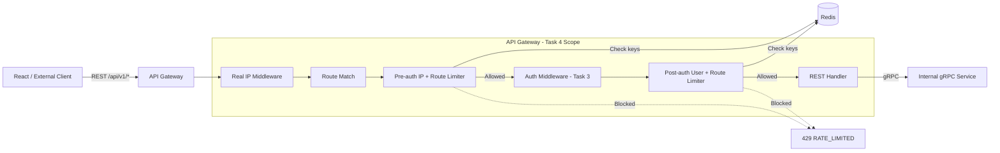
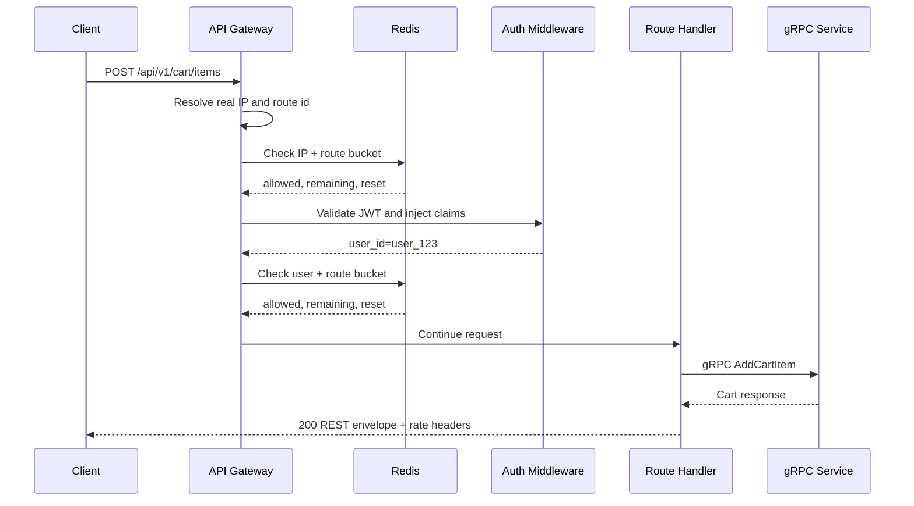
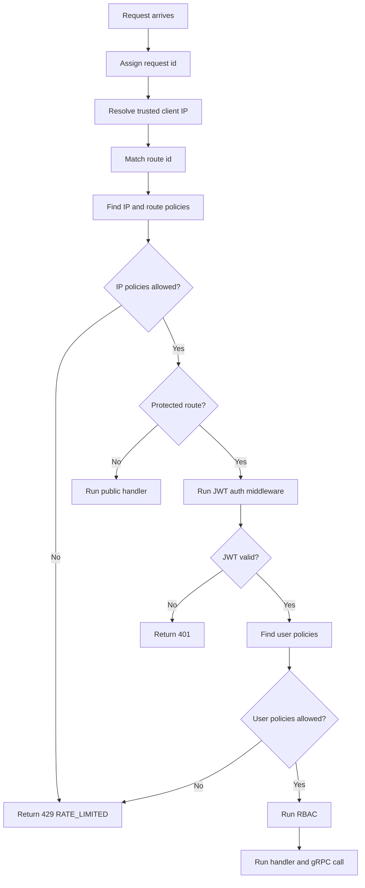

# 🚪 API Gateway Service - Task 4: Rate Limiting


## 📌 Task Summary

| Field | Detail |
|---|---|
| Task Name | Rate limiting |
| Source | `docs/01-micro-tasks.md` → `API Gateway` → Task 4 |
| Goal | IP, user, route based limits Redis se implement karna |
| Priority | `P0` |
| Dependency | Redis |
| Output Type | Documentation-only implementation guide |
| Not Included | Request DTO validation, gRPC error mapping, full observability, WAF/CAPTCHA, Auth Service token issuing, business-service throttling |

> **Simple Hinglish goal:** API Gateway pe har public request ko controlled rate me allow karna hai. Login, OTP, search, cart, checkout, seller/admin routes jaise sensitive ya high-traffic endpoints pe Redis-backed limits lagenge, taaki abuse, brute force, bots, accidental loops, aur traffic spikes se platform safe rahe.

---

## ✅ Final Output Created

```text
TaskImplementation/
└── API Gateway Service/
    ├── task1.md
    ├── task2.md
    ├── task3.md
    └── task4.md
```

### Why this structure?

| Path | Purpose |
|---|---|
| `TaskImplementation/` | Saare task-wise implementation guides ka central folder |
| `TaskImplementation/API Gateway Service/` | API Gateway service ke guides ka group |
| `task1.md` | Public REST route contract |
| `task2.md` | Gateway gRPC clients setup |
| `task3.md` | Auth middleware guide |
| `task4.md` | Sirf **API Gateway Service - Task 4** ka Redis rate limiting guide |

> 🟢 **Scope rule:** Is task me actual `backend/services/api-gateway/` code create nahi kiya gaya. User request ka output sirf folder structure aur `task4.md` content hai. Backend implementation ke exact files/code examples niche documented hain.

---

## 🧭 Documents Studied

| Document | Kya use kiya gaya |
|---|---|
| `docs/01-micro-tasks.md` | Task 4 exact scope: IP, user, route based Redis rate limits |
| `docs/02-system-architecture.md` | Gateway responsibility: Redis based per IP, per user, per route limits |
| `docs/03-folder-structure.md` | Gateway middleware order: rate limiting authentication se pehle aata hai |
| `docs/04-microservice-design.md` | Gateway has no primary DB; Redis temporary request metadata/rate limits ke liye |
| `docs/06-auth-security.md` | Recommended limits: login, OTP, search, cart, checkout, admin mutations |
| `docs/13-developer-guide.md` | Production readiness checklist me rate limits required hain |
| `api/master-api.json` | Public/protected route groups and route auth levels |
| `TaskImplementation/API Gateway Service/task1.md` | REST route groups and auth matrix |
| `TaskImplementation/API Gateway Service/task2.md` | Gateway startup/config/client pattern |
| `TaskImplementation/API Gateway Service/task3.md` | Auth context and safe user/session metadata |
| `TaskImplementation/Platform Foundation/task4.md` | Local Redis service availability in Docker Compose stack |

---

## 🟦 Task 4 Boundary

### Included in Task 4

| Included | Explanation |
|---|---|
| Redis-backed limiter | Gateway ke multiple pods same Redis counters use karenge |
| IP based limits | Anonymous/public traffic, login brute force, search bots control honge |
| User based limits | Authenticated cart, checkout, seller/admin actions per user throttle honge |
| Route based limits | Expensive/sensitive route groups ke liye alag limits rahenge |
| Multi-rule evaluation | Ek request pe global + route + identity rules apply ho sakte hain |
| Safe key design | PII raw Redis key me nahi jayegi; target/email/phone hash honge |
| 429 response contract | Frontend ko consistent REST error envelope + retry headers milenge |
| Middleware placement | Pre-auth IP limiter and post-auth user limiter ka clean split |
| Test strategy | Unit, Redis integration, middleware, and concurrency tests define honge |

### Not included in Task 4

| Not Included | Future Task / Owner |
|---|---|
| JWT verification itself | API Gateway Task 3 |
| Request body/query validation | API Gateway Task 5 |
| gRPC error to REST mapping | API Gateway Task 6 |
| Logs/metrics/traces full wiring | API Gateway Task 7 |
| CAPTCHA or bot challenge | Security/product decision later |
| Edge/CDN/WAF rules | Infra/DevOps layer |
| Service-specific business quotas | Respective services, for example Product/CMS/Order |
| Billing/subscription quotas | Future plan, not current ecommerce MVP scope |

> 🔴 **Important:** Rate limiting Gateway ka protection layer hai. Ye business authorization ka replacement nahi hai. Seller ownership, order ownership, refund permissions jaise checks service layer me bhi enforce honge.

---

## 🧩 Rate Limiting Architecture



**Hinglish explanation:**  
Request pehle trusted client IP resolve karegi. Uske baad Gateway route identify karega. Public/anonymous abuse stop karne ke liye **pre-auth limiter** IP + route rules check karega. Auth ke baad protected routes pe **user limiter** user id + route rules check karega. Dono Redis use karenge, taaki agar Gateway ke 5 pods chal rahe hon tab bhi total limit same rahe.

---

## 🔁 Request Flow



**Blocked flow:** Agar Redis check bolta hai `allowed=false`, Gateway downstream service ko call nahi karega. Direct `429 Too Many Requests` return karega.

---

## 🧱 Middleware Order

`docs/03-folder-structure.md` ke according Gateway middleware stack me rate limiting authentication se pehle aata hai. User-based limits ke liye Task 4 me rate limiting ko two-stage design kiya gaya hai.

```text
1. Request ID
2. Real IP / forwarded headers
3. Panic recovery
4. Structured logging
5. Metrics
6. Tracing
7. CORS
8. Pre-auth rate limiting        ← IP + route limits
9. Authentication                ← Task 3 JWT middleware
10. Post-auth user rate limiting ← user + route limits, Task 4 extension
11. RBAC
12. Request validation
```

### Why two-stage limiter?

| Stage | Runs Before Auth? | Identity Available? | Use Case |
|---|---:|---:|---|
| Pre-auth limiter | Yes | IP, route, headers | Login brute force, OTP abuse, public search bots |
| Post-auth limiter | No | User id, session id, roles | Cart mutations, checkout, seller/admin mutation quotas |

> 🟡 **Decision:** Task 4 ka official "Rate limiting" layer do parts me split hai. Ye docs ke middleware order ko respect karta hai aur user-based limit ke liye Task 3 auth context ka use karta hai.

---

## 🧰 External Libraries / Tools

Task 4 me backend code create nahi kiya gaya, but future implementation ke liye ye tools/libraries use honge.

| Tool / Library | What it is | Why used | Install / Use |
|---|---|---|---|
| Redis | In-memory distributed data store | Gateway pods ke beech shared rate-limit counters/buckets maintain karne ke liye | Local stack me Redis run karo |
| `github.com/redis/go-redis/v9` | Go Redis client | Gateway se Redis commands/Lua scripts execute karne ke liye | `go get github.com/redis/go-redis/v9` |
| `github.com/go-chi/chi/v5` | HTTP router/middleware toolkit | Route groups pe limiter middleware attach karne ke liye | `go get github.com/go-chi/chi/v5` |
| Go `crypto/sha256` | Standard library hashing | Email/phone/IP target PII ko Redis key me raw store na karne ke liye | Built-in |
| Go `net/netip` | Standard library IP parser | IP normalize karne ke liye | Built-in |
| Docker Compose | Local dependency runner | Redis locally start/test karne ke liye | `docker compose up redis` |

### Install commands

```bash
cd backend/services/api-gateway

go get github.com/redis/go-redis/v9
go get github.com/go-chi/chi/v5
```

### Local Redis check

```bash
# Platform Foundation local stack ke Redis service ko start karo
docker compose up -d redis

# Redis reachable hai ya nahi check karo
redis-cli -h localhost -p 6379 PING
```

Expected output:

```text
PONG
```

---

## 🗂️ Clean Folder Structure

### Actual documentation output

```text
TaskImplementation/
└── API Gateway Service/
    ├── task1.md
    ├── task2.md
    ├── task3.md
    └── task4.md
```

### Target backend implementation structure

```text
backend/
└── services/
    └── api-gateway/
        ├── go.mod
        ├── cmd/
        │   └── server/
        │       └── main.go
        └── internal/
            ├── config/
            │   └── config.go
            ├── ratelimit/
            │   ├── limiter.go
            │   ├── redis_limiter.go
            │   ├── policy.go
            │   ├── key.go
            │   ├── result.go
            │   ├── lua_token_bucket.go
            │   └── response.go
            ├── middleware/
            │   ├── rate_limit_ip.go
            │   └── rate_limit_user.go
            ├── auth/
            │   └── context.go
            └── routes/
                ├── routes.go
                └── auth_levels.go
```

### Folder responsibility

| Path | Responsibility |
|---|---|
| `internal/config/config.go` | Redis address, rate-limit config, fail-open/fail-closed settings load karega |
| `internal/ratelimit/limiter.go` | Common `Limiter` interface define karega |
| `internal/ratelimit/redis_limiter.go` | Redis client and token bucket script execute karega |
| `internal/ratelimit/policy.go` | Route group wise limits define karega |
| `internal/ratelimit/key.go` | Safe Redis keys build karega |
| `internal/ratelimit/result.go` | Allow/deny result model |
| `internal/ratelimit/response.go` | 429 response and rate-limit headers helper |
| `internal/middleware/rate_limit_ip.go` | Pre-auth IP + route limiter |
| `internal/middleware/rate_limit_user.go` | Post-auth user + route limiter |
| `internal/auth/context.go` | Task 3 claims se user id read karne ke helpers |
| `internal/routes/routes.go` | Middleware ko correct route groups pe attach karega |

---

## 🪜 Step-by-Step Implementation

## Step 1: Rate limit strategy choose karo

Docs me Redis token bucket ya sliding window allowed hai. Task 4 ke liye recommended approach:

```text
Redis-backed token bucket
```

### Why token bucket?

| Reason | Benefit |
|---|---|
| Burst tolerate karta hai | User ek second me 2-3 clicks kare to unnecessary block nahi hoga |
| Smooth refill hota hai | Fixed-window reset abuse kam hota hai |
| Redis shared state hai | Multiple Gateway pods ke across limit consistent rahega |
| Lua script atomic hai | Race condition me limit bypass nahi hogi |

**Hinglish explanation:**  
Token bucket ko paani ki bucket samjho. Har route/user/IP ke paas limited tokens hain. Request aati hai to token consume hota hai. Time ke saath tokens refill hote hain. Bucket empty hui to request block.

---

## Step 2: Rate limit dimensions define karo

Task requirement ke 3 dimensions:

| Dimension | Key Source | Example | Kyu needed |
|---|---|---|---|
| IP | Real client IP | `203.0.113.10` | Anonymous/public abuse control |
| User | JWT `sub` from Task 3 | `user_123` | Logged-in user action quota |
| Route | Normalized route id/path | `cart.items_mutation` | Expensive/sensitive endpoint protection |

### Composite key examples

```text
rl:v1:ip:auth.login:203.0.113.10
rl:v1:ip:search.public:203.0.113.10
rl:v1:user:cart.mutation:user_123
rl:v1:user:checkout:user_123
rl:v1:user:admin.mutation:admin_123
rl:v1:target:auth.otp_send:sha256_phone_or_email
```

> 🟢 **Key rule:** Raw email, phone, full JWT, refresh token, or payment data Redis key me kabhi store nahi karna.

---

## Step 3: Route policy table banao

`docs/06-auth-security.md` ke examples ko Gateway route groups ke saath map kiya gaya.

| Policy | Routes | Scope | Limit |
|---|---|---|---|
| `auth.login.ip` | `POST /api/v1/auth/login` | IP | 5 attempts / 10 min |
| `auth.otp_send.target` | `POST /api/v1/auth/otp/send` | email/phone target hash | 3 requests / 15 min |
| `auth.otp_send.ip` | `POST /api/v1/auth/otp/send` | IP | 10 requests / 15 min |
| `auth.password_reset.ip` | forgot/reset password routes | IP | 5 requests / 15 min |
| `search.public.ip` | `/api/v1/search`, `/api/v1/search/autocomplete` | IP | 120 requests / min |
| `catalog.public.ip` | `/api/v1/products`, `/api/v1/categories` | IP | 240 requests / min |
| `cart.user` | cart mutations | user | 60 requests / min |
| `wishlist.user` | wishlist mutations | user | 60 requests / min |
| `checkout.user` | `POST /api/v1/orders/checkout` | user | 10 requests / 10 min |
| `seller.mutation.user` | seller create/update/delete routes | user | 60 requests / min |
| `admin.mutation.user` | admin/superadmin mutation routes | user | 30 requests / min |
| `webhook.provider.ip` | `/api/v1/webhooks/payments/{provider}` | IP/provider | 120 requests / min |
| `global.ip` | all routes fallback | IP | 600 requests / min |

### Policy behavior

Ek request pe multiple policies apply ho sakti hain:

```text
POST /api/v1/auth/login
├── global.ip
└── auth.login.ip
```

```text
POST /api/v1/cart/items
├── global.ip
└── cart.user
```

> 🟡 **Decision:** Request tabhi allowed hai jab saare applicable rules pass karein. Ek bhi rule fail hua to `429 RATE_LIMITED`.

---

## Step 4: Config variables add karo

Gateway ko Redis and limiter behavior env vars se configurable rakhna chahiye.

```env
# Redis
REDIS_ADDR=localhost:6379
REDIS_PASSWORD=
REDIS_DB=0
REDIS_TLS_ENABLED=false

# Rate limiting
RATE_LIMIT_ENABLED=true
RATE_LIMIT_KEY_PREFIX=rl:v1
RATE_LIMIT_FAIL_OPEN=false
RATE_LIMIT_DEFAULT_IP_LIMIT=600
RATE_LIMIT_DEFAULT_IP_WINDOW=1m
```

### Config meaning

| Env Var | Meaning |
|---|---|
| `REDIS_ADDR` | Redis host/port |
| `REDIS_PASSWORD` | Redis password, local me empty ho sakta hai |
| `REDIS_DB` | Redis logical DB number |
| `REDIS_TLS_ENABLED` | Production Redis TLS ke liye |
| `RATE_LIMIT_ENABLED` | Emergency toggle |
| `RATE_LIMIT_KEY_PREFIX` | Redis keys ka namespace |
| `RATE_LIMIT_FAIL_OPEN` | Redis failure pe request allow karni hai ya block |

> 🔴 **Security default:** `RATE_LIMIT_FAIL_OPEN=false` safer hai for auth, checkout, and admin routes. Public read routes ke liye business availability requirement ho to per-policy fail-open later add kiya ja sakta hai.

---

## Step 5: Config struct define karo

### `internal/config/config.go`

```go
package config

import "time"

type RedisConfig struct {
    Addr       string
    Password   string
    DB         int
    TLSEnabled bool
}

type RateLimitConfig struct {
    Enabled        bool
    KeyPrefix      string
    FailOpen       bool
    DefaultIPLimit int64
    DefaultIPWindow time.Duration
}

type Config struct {
    Redis     RedisConfig
    RateLimit RateLimitConfig
}
```

**Hinglish explanation:**  
Config struct se limiter hard-coded nahi rahega. Local, staging, production me Redis address and limit toggles easily change ho sakte hain.

---

## Step 6: Limiter interface define karo

### `internal/ratelimit/limiter.go`

```go
package ratelimit

import (
    "context"
    "time"
)

type Request struct {
    Key      string
    Limit    int64
    Window   time.Duration
    Cost     int64
}

type Result struct {
    Allowed      bool
    Limit        int64
    Remaining    int64
    RetryAfter   time.Duration
    ResetAfter   time.Duration
}

type Limiter interface {
    Allow(ctx context.Context, req Request) (Result, error)
}
```

**Hinglish explanation:**  
Middleware ko Redis details nahi pata honi chahiye. Middleware sirf `limiter.Allow(...)` call karega. Isse tests me fake limiter use karna easy hota hai.

---

## Step 7: Policy model banao

### `internal/ratelimit/policy.go`

```go
package ratelimit

import "time"

type Dimension string

const (
    DimensionIP     Dimension = "ip"
    DimensionUser   Dimension = "user"
    DimensionRoute  Dimension = "route"
    DimensionTarget Dimension = "target"
)

type Policy struct {
    Name       string
    Dimension  Dimension
    RouteIDs   []string
    Methods    []string
    PathPrefix []string
    Limit      int64
    Window     time.Duration
    Cost       int64
}
```

### Default policies example

```go
package ratelimit

import "time"

var DefaultPolicies = []Policy{
    {
        Name:      "auth.login.ip",
        Dimension: DimensionIP,
        RouteIDs:  []string{"auth.login"},
        Limit:     5,
        Window:    10 * time.Minute,
        Cost:      1,
    },
    {
        Name:      "search.public.ip",
        Dimension: DimensionIP,
        RouteIDs:  []string{"search.query", "search.autocomplete"},
        Limit:     120,
        Window:    time.Minute,
        Cost:      1,
    },
    {
        Name:      "cart.user",
        Dimension: DimensionUser,
        PathPrefix: []string{"/api/v1/cart"},
        Limit:     60,
        Window:    time.Minute,
        Cost:      1,
    },
    {
        Name:      "checkout.user",
        Dimension: DimensionUser,
        RouteIDs:  []string{"order.checkout"},
        Limit:     10,
        Window:    10 * time.Minute,
        Cost:      1,
    },
}
```

> 🟢 **Beginner tip:** Policy ek rule hai. Rule batata hai "kis route pe, kis identity ke against, kitni requests allow hain."

---

## Step 8: Redis key builder safe banao

### `internal/ratelimit/key.go`

```go
package ratelimit

import (
    "crypto/sha256"
    "encoding/hex"
    "strings"
)

func BuildKey(prefix, policyName, identity string) string {
    cleanPolicy := strings.ReplaceAll(policyName, ":", "_")
    cleanIdentity := hashIdentity(identity)

    return prefix + ":" + cleanPolicy + ":" + cleanIdentity
}

func hashIdentity(value string) string {
    normalized := strings.TrimSpace(strings.ToLower(value))
    sum := sha256.Sum256([]byte(normalized))

    return hex.EncodeToString(sum[:])[:32]
}
```

### Why hash identity?

| Raw Value | Risk | Hashed Key Benefit |
|---|---|---|
| Email | PII leak in Redis monitor/logs | Key safe-ish and non-readable |
| Phone | PII leak | Same target gets same hash |
| IP | User tracking exposure | Lower leakage |
| User id | Internal id exposure | Consistent opaque key |

> 🟡 **Note:** Hashing Redis keys privacy improve karta hai, but Redis access still sensitive hai. Production Redis auth/TLS/network isolation mandatory rahega.

---

## Step 9: Redis token bucket implement karo

Atomicity ke liye Lua script use karo. Redis me current token count and last refill timestamp ek hash me store hoga.

### `internal/ratelimit/lua_token_bucket.go`

```go
package ratelimit

const tokenBucketScript = `
local key = KEYS[1]
local capacity = tonumber(ARGV[1])
local refill_per_ms = tonumber(ARGV[2])
local now_ms = tonumber(ARGV[3])
local cost = tonumber(ARGV[4])
local ttl_ms = tonumber(ARGV[5])

local bucket = redis.call("HMGET", key, "tokens", "updated_at")
local tokens = tonumber(bucket[1])
local updated_at = tonumber(bucket[2])

if tokens == nil then
  tokens = capacity
  updated_at = now_ms
end

local elapsed = math.max(0, now_ms - updated_at)
local refill = elapsed * refill_per_ms
tokens = math.min(capacity, tokens + refill)

local allowed = 0
local retry_after_ms = 0

if tokens >= cost then
  allowed = 1
  tokens = tokens - cost
else
  retry_after_ms = math.ceil((cost - tokens) / refill_per_ms)
end

redis.call("HMSET", key, "tokens", tokens, "updated_at", now_ms)
redis.call("PEXPIRE", key, ttl_ms)

return {allowed, math.floor(tokens), retry_after_ms, ttl_ms}
`
```

**Hinglish explanation:**  
Lua script ek hi Redis operation me tokens read, refill, consume, and save karta hai. Agar 100 requests ek saath aayein, tab bhi race condition se extra requests pass nahi hongi.

---

## Step 10: Redis limiter code banao

### `internal/ratelimit/redis_limiter.go`

```go
package ratelimit

import (
    "context"
    "time"

    "github.com/redis/go-redis/v9"
)

type RedisLimiter struct {
    client *redis.Client
    script *redis.Script
    now    func() time.Time
}

func NewRedisLimiter(client *redis.Client) *RedisLimiter {
    return &RedisLimiter{
        client: client,
        script: redis.NewScript(tokenBucketScript),
        now:    time.Now,
    }
}

func (l *RedisLimiter) Allow(ctx context.Context, req Request) (Result, error) {
    if req.Cost <= 0 {
        req.Cost = 1
    }

    nowMs := l.now().UnixMilli()
    ttl := req.Window * 2
    refillPerMs := float64(req.Limit) / float64(req.Window.Milliseconds())

    values, err := l.script.Run(ctx, l.client, []string{req.Key},
        req.Limit,
        refillPerMs,
        nowMs,
        req.Cost,
        ttl.Milliseconds(),
    ).Slice()
    if err != nil {
        return Result{}, err
    }

    allowed := values[0].(int64) == 1
    remaining := values[1].(int64)
    retryAfter := time.Duration(values[2].(int64)) * time.Millisecond

    return Result{
        Allowed:    allowed,
        Limit:      req.Limit,
        Remaining:  remaining,
        RetryAfter: retryAfter,
        ResetAfter: req.Window,
    }, nil
}
```

> 🔵 **Implementation note:** Type assertions ko production code me carefully handle karo, kyunki Redis driver integer/float return types version ke hisaab se vary kar sakte hain. Tests me Lua return parsing cover hona chahiye.

---

## Step 11: Redis client setup karo

### `cmd/server/main.go` startup pattern

```go
redisClient := redis.NewClient(&redis.Options{
    Addr:     cfg.Redis.Addr,
    Password: cfg.Redis.Password,
    DB:       cfg.Redis.DB,
})

ctx, cancel := context.WithTimeout(context.Background(), 3*time.Second)
defer cancel()

if err := redisClient.Ping(ctx).Err(); err != nil {
    return fmt.Errorf("redis ping failed: %w", err)
}

limiter := ratelimit.NewRedisLimiter(redisClient)
```

**Hinglish explanation:**  
Gateway startup pe Redis connection verify karega. Agar Redis required hai aur connect nahi hua, Gateway fail fast kare. Isse broken rate-limit config production me silently ignore nahi hota.

---

## Step 12: Real IP extraction safe rakho

Rate limit ka base IP hota hai, isliye IP spoofing avoid karna important hai.

### Rules

| Rule | Explanation |
|---|---|
| Direct internet se `X-Forwarded-For` blindly trust mat karo | Client fake header bhej sakta hai |
| Sirf trusted ingress/load balancer ke forwarded headers trust karo | Real user IP reliable milega |
| IPv4/IPv6 normalize karo | Same IP different string formats me duplicate buckets na banaye |
| Missing/invalid IP pe fallback bucket use karo | Request bypass na ho |

### Example helper

```go
func ClientIP(r *http.Request) string {
    if ip := r.Header.Get("X-Real-IP"); ip != "" {
        return ip
    }

    host, _, err := net.SplitHostPort(r.RemoteAddr)
    if err == nil {
        return host
    }

    return r.RemoteAddr
}
```

> 🟡 **Production note:** Real implementation me `X-Forwarded-For` sirf trusted proxy list ke saath parse karo. Warna attacker apni IP rotate karne ke liye fake header bhej sakta hai.

---

## Step 13: Pre-auth IP limiter middleware banao

### `internal/middleware/rate_limit_ip.go`

```go
package middleware

import (
    "net/http"

    "ecommerce/api-gateway/internal/ratelimit"
)

func RateLimitIP(limiter ratelimit.Limiter, policies []ratelimit.Policy, prefix string) func(http.Handler) http.Handler {
    return func(next http.Handler) http.Handler {
        return http.HandlerFunc(func(w http.ResponseWriter, r *http.Request) {
            routeID := RouteIDFromContext(r.Context())
            ip := ClientIP(r)

            for _, policy := range ratelimit.MatchPolicies(policies, routeID, r.Method, r.URL.Path, ratelimit.DimensionIP) {
                key := ratelimit.BuildKey(prefix, policy.Name, ip)

                result, err := limiter.Allow(r.Context(), ratelimit.Request{
                    Key:    key,
                    Limit:  policy.Limit,
                    Window: policy.Window,
                    Cost:   policy.Cost,
                })
                if err != nil {
                    ratelimit.WriteUnavailable(w, r)
                    return
                }
                if !result.Allowed {
                    ratelimit.WriteLimited(w, r, result)
                    return
                }

                ratelimit.WriteHeaders(w, result)
            }

            next.ServeHTTP(w, r)
        })
    }
}
```

**Hinglish explanation:**  
Ye middleware JWT parse nahi karta. Sirf IP and route ke basis pe request ko throttle karta hai. Isliye login/OTP jaise public routes bhi protected rahte hain.

---

## Step 14: Post-auth user limiter middleware banao

### `internal/middleware/rate_limit_user.go`

```go
package middleware

import (
    "net/http"

    gatewayauth "ecommerce/api-gateway/internal/auth"
    "ecommerce/api-gateway/internal/ratelimit"
)

func RateLimitUser(limiter ratelimit.Limiter, policies []ratelimit.Policy, prefix string) func(http.Handler) http.Handler {
    return func(next http.Handler) http.Handler {
        return http.HandlerFunc(func(w http.ResponseWriter, r *http.Request) {
            claims, ok := gatewayauth.ClaimsFromContext(r.Context())
            if !ok {
                next.ServeHTTP(w, r)
                return
            }

            routeID := RouteIDFromContext(r.Context())

            for _, policy := range ratelimit.MatchPolicies(policies, routeID, r.Method, r.URL.Path, ratelimit.DimensionUser) {
                key := ratelimit.BuildKey(prefix, policy.Name, claims.Subject)

                result, err := limiter.Allow(r.Context(), ratelimit.Request{
                    Key:    key,
                    Limit:  policy.Limit,
                    Window: policy.Window,
                    Cost:   policy.Cost,
                })
                if err != nil {
                    ratelimit.WriteUnavailable(w, r)
                    return
                }
                if !result.Allowed {
                    ratelimit.WriteLimited(w, r, result)
                    return
                }

                ratelimit.WriteHeaders(w, result)
            }

            next.ServeHTTP(w, r)
        })
    }
}
```

**Hinglish explanation:**  
Auth middleware ke baad JWT claims context me available hain. User limiter `claims.Subject` use karke per-user quota enforce karta hai. Full JWT kabhi Redis key ya log me nahi jata.

---

## Step 15: OTP target limiter add karo

OTP abuse sirf IP se limit karna enough nahi hota, kyunki attacker different IPs se same phone/email pe OTP spam kar sakta hai.

### Target key idea

```text
target = sha256(normalized_email_or_phone)
key = rl:v1:auth.otp_send.target:<target_hash>
```

### Example extraction

```go
type SendOTPRequest struct {
    Target string `json:"target"`
}

func OTPHashTarget(target string) string {
    normalized := strings.TrimSpace(strings.ToLower(target))
    sum := sha256.Sum256([]byte(normalized))
    return hex.EncodeToString(sum[:])
}
```

> 🔴 **Boundary:** Body parsing/DTO validation Task 5 ka detailed scope hai. Task 4 me OTP target limit ka design define hota hai. Final middleware body read carefully karega taaki handler ke liye body consume na ho, ya Auth Service me second-line OTP counter bhi rahega.

---

## Step 16: 429 response format define karo

Gateway common envelope follow karega.

### HTTP response

```http
HTTP/1.1 429 Too Many Requests
Content-Type: application/json
RateLimit-Limit: 5
RateLimit-Remaining: 0
RateLimit-Reset: 600
Retry-After: 120
```

### JSON envelope

```json
{
  "data": null,
  "request_id": "req_123",
  "error": {
    "code": "RATE_LIMITED",
    "message": "Too many requests. Please try again later.",
    "details": [
      {
        "field": "route",
        "reason": "rate limit exceeded"
      }
    ]
  }
}
```

### Header meaning

| Header | Meaning |
|---|---|
| `RateLimit-Limit` | Current policy ki max request count |
| `RateLimit-Remaining` | Approx remaining tokens |
| `RateLimit-Reset` | Bucket reset/refill seconds |
| `Retry-After` | Client kitne seconds baad retry kare |

> 🟢 **Frontend benefit:** React app `429` pe noisy repeated retry stop kar sakta hai and user ko friendly message dikha sakta hai.

---

## Step 17: Response helper banao

### `internal/ratelimit/response.go`

```go
package ratelimit

import (
    "encoding/json"
    "net/http"
    "strconv"
)

func WriteHeaders(w http.ResponseWriter, result Result) {
    w.Header().Set("RateLimit-Limit", strconv.FormatInt(result.Limit, 10))
    w.Header().Set("RateLimit-Remaining", strconv.FormatInt(result.Remaining, 10))
    w.Header().Set("RateLimit-Reset", strconv.Itoa(int(result.ResetAfter.Seconds())))

    if result.RetryAfter > 0 {
        w.Header().Set("Retry-After", strconv.Itoa(int(result.RetryAfter.Seconds())))
    }
}

func WriteLimited(w http.ResponseWriter, r *http.Request, result Result) {
    WriteHeaders(w, result)

    w.Header().Set("Content-Type", "application/json")
    w.WriteHeader(http.StatusTooManyRequests)

    _ = json.NewEncoder(w).Encode(map[string]any{
        "data":       nil,
        "request_id": RequestIDFromContext(r.Context()),
        "error": map[string]any{
            "code":    "RATE_LIMITED",
            "message": "Too many requests. Please try again later.",
            "details": []map[string]string{
                {"field": "route", "reason": "rate limit exceeded"},
            },
        },
    })
}
```

**Hinglish explanation:**  
Error mapper Task 6 me detail hoga, but Task 4 ko `429` response abhi define karna zaruri hai. Format common envelope compatible hai.

---

## Step 18: Routes me middleware wire karo

### `internal/routes/routes.go`

```go
func RegisterRoutes(
    r chi.Router,
    limiter ratelimit.Limiter,
    policies []ratelimit.Policy,
    authMW func(http.Handler) http.Handler,
    rbacMW func(...string) func(http.Handler) http.Handler,
) {
    r.Use(middleware.RateLimitIP(limiter, policies, "rl:v1"))

    r.Group(func(public chi.Router) {
        public.Post("/api/v1/auth/login", handlers.Login)
        public.Post("/api/v1/auth/otp/send", handlers.SendOTP)
        public.Get("/api/v1/search", handlers.Search)
        public.Get("/api/v1/products", handlers.ListProducts)
    })

    r.Group(func(protected chi.Router) {
        protected.Use(authMW)
        protected.Use(middleware.RateLimitUser(limiter, policies, "rl:v1"))
        protected.Use(rbacMW("buyer", "seller", "admin", "superadmin"))

        protected.Get("/api/v1/cart", handlers.GetCart)
        protected.Post("/api/v1/cart/items", handlers.AddCartItem)
        protected.Post("/api/v1/orders/checkout", handlers.Checkout)
    })
}
```

**Hinglish explanation:**  
IP limiter sab routes pe common hai. Protected group me auth ke baad user limiter attach hota hai. Phir RBAC run hota hai.

---

## Step 19: Fail-open vs fail-closed decision

Redis temporarily down ho sakta hai. Gateway behavior clear hona chahiye.

| Mode | Behavior | Pros | Cons |
|---|---|---|---|
| Fail-closed | Redis error pe request block/503 | Security strong | Redis outage se traffic impact |
| Fail-open | Redis error pe request allow | Availability high | Abuse protection temporarily weak |

### Recommended Task 4 default

```text
Auth, OTP, checkout, admin mutation: fail-closed
Public catalog read: optional fail-open after product decision
```

### Redis unavailable response

```json
{
  "data": null,
  "request_id": "req_123",
  "error": {
    "code": "RATE_LIMIT_UNAVAILABLE",
    "message": "Request protection is temporarily unavailable.",
    "details": []
  }
}
```

> 🟡 **Beginner note:** Fail-open ka matlab "Redis down hai to allow kar do". Fail-closed ka matlab "Redis down hai to request block karo". Security-sensitive routes me fail-closed safer hai.

---

## Step 20: Redis key expiry strategy

Har bucket key pe TTL hona chahiye.

| Setting | Value | Why |
|---|---:|---|
| Bucket TTL | `2 * window` | Inactive users/IP keys auto cleanup |
| Key prefix | `rl:v1` | Versioning and easy delete |
| Hash identity length | 32 hex chars | Key short, still opaque |
| Redis DB | Configurable | Local/test isolation |

### Cleanup example

```bash
# Local development me sirf rate-limit keys clean karne ke liye
redis-cli --scan --pattern 'rl:v1:*'
```

> 🔴 **Do not run broad deletes in production.** Production cleanup controlled script/maintenance process se hoga.

---

## Step 21: Route matching strategy

Rate-limit key me raw URL path use nahi karna chahiye.

### Bad key

```text
rl:v1:ip:/api/v1/products/prod_123:203.0.113.10
rl:v1:ip:/api/v1/products/prod_456:203.0.113.10
```

Problem: Har product id alag bucket bana dega, limit bypass ho sakti hai.

### Good key

```text
rl:v1:ip:product.detail:<ip_hash>
```

**Hinglish explanation:**  
Gateway route match ke baad route id use karega, jaise `product.detail`, `cart.add_item`, `order.checkout`. Isse path params ke wajah se key explosion nahi hota.

---

## Step 22: Security checklist

| Check | Required? | Explanation |
|---|---:|---|
| Full JWT Redis key me nahi | ✅ | Token credential hai |
| Email/phone raw key me nahi | ✅ | PII leak avoid |
| Real IP trusted proxy se | ✅ | Spoofed IP bypass avoid |
| Lua script atomic | ✅ | Concurrent requests bypass avoid |
| Redis auth/TLS production me | ✅ | Shared security state protect |
| 429 me internal key expose nahi | ✅ | Attackers ko implementation detail na mile |
| Admin/checkout tighter limits | ✅ | High-risk route protection |
| Route ids normalized | ✅ | Key explosion avoid |

---

## 🧪 Testing Strategy

| Test Type | What to test |
|---|---|
| Unit test: key builder | Same identity same hash, raw email/phone output me absent |
| Unit test: policy matcher | Correct route id pe correct policies apply |
| Unit test: middleware allow | Limiter allowed=true to next handler call hota hai |
| Unit test: middleware block | Limiter allowed=false to `429` and handler not called |
| Unit test: Redis error | fail-closed mode me `503` / configured error |
| Integration test: Redis token bucket | Limit ke baad request block hoti hai |
| Integration test: refill | Window/refill ke baad request allow hoti hai |
| Concurrency test | 100 parallel requests me sirf configured limit pass hoti hai |
| Auth flow test | Protected route pe user limiter claims subject use karta hai |
| Public flow test | Search/login routes IP limiter se protect hote hain |

### Example test scenario

```go
func TestRateLimitIPBlocksAfterLimit(t *testing.T) {
    limiter := ratelimit.NewFakeLimiter([]ratelimit.Result{
        {Allowed: true, Limit: 1, Remaining: 0},
        {Allowed: false, Limit: 1, Remaining: 0, RetryAfter: time.Minute},
    })

    called := 0
    handler := middleware.RateLimitIP(limiter, testPolicies, "rl:test")(
        http.HandlerFunc(func(w http.ResponseWriter, r *http.Request) {
            called++
            w.WriteHeader(http.StatusOK)
        }),
    )

    req := httptest.NewRequest(http.MethodPost, "/api/v1/auth/login", nil)
    req.RemoteAddr = "203.0.113.10:12345"

    handler.ServeHTTP(httptest.NewRecorder(), req)

    rr := httptest.NewRecorder()
    handler.ServeHTTP(rr, req)

    require.Equal(t, 1, called)
    require.Equal(t, http.StatusTooManyRequests, rr.Code)
}
```

---

## 🧪 Manual Verification Commands

### Login rate limit

```bash
for i in 1 2 3 4 5 6; do
  curl -i -X POST http://localhost:8080/api/v1/auth/login \
    -H "Content-Type: application/json" \
    -d '{"email":"demo@example.com","password":"wrong-password"}'
done
```

Expected:

```text
Requests 1-5: Auth response or validation/auth failure
Request 6: HTTP/1.1 429 Too Many Requests
```

### Search IP limit

```bash
for i in $(seq 1 125); do
  curl -s -o /dev/null -w "%{http_code}\n" \
    "http://localhost:8080/api/v1/search?q=phone"
done
```

Expected:

```text
First 120 around 200/valid route response
After limit: 429
```

### Redis key inspect in local dev

```bash
redis-cli --scan --pattern 'rl:v1:*'
```

Expected:

```text
rl:v1:auth.login.ip:...
rl:v1:search.public.ip:...
```

---

## 📊 Policy Matrix by Route Group

| Route Group | Example Routes | Pre-auth IP Limit | Post-auth User Limit |
|---|---|---:|---:|
| Auth login | `POST /api/v1/auth/login` | 5 / 10 min | Not applicable |
| OTP | `POST /api/v1/auth/otp/send` | 10 / 15 min | Target 3 / 15 min |
| Password reset | `/api/v1/auth/password/*` | 5 / 15 min | Not applicable |
| Catalog | `GET /api/v1/products`, `GET /api/v1/categories` | 240 / min | Not applicable |
| Search | `GET /api/v1/search` | 120 / min | Optional later |
| Cart | `/api/v1/cart/*` | global IP fallback | 60 / min |
| Wishlist | `/api/v1/wishlist/*` | global IP fallback | 60 / min |
| Checkout | `POST /api/v1/orders/checkout` | global IP fallback | 10 / 10 min |
| Seller mutations | `POST/PATCH/DELETE /api/v1/seller/*` | global IP fallback | 60 / min |
| Admin mutations | `POST/PATCH/DELETE /api/v1/admin/*` | global IP fallback | 30 / min |
| Webhooks | `/api/v1/webhooks/payments/{provider}` | 120 / min | Provider signature, not user |

> 🟢 **Practical rule:** Read-heavy public routes get higher limits. Mutation/security routes get lower limits.

---

## 🧭 Full Decision Flow



---

## 🧯 Troubleshooting

| Problem | Likely Cause | Fix |
|---|---|---|
| Har request `429` aa raha hai | Limit too low ya Redis key stuck | Policy values check karo, dev Redis keys clear karo |
| Limits Gateway pods ke across inconsistent | Local memory limiter use ho raha hai | Redis-backed limiter enable karo |
| Login brute force block nahi ho raha | Route id match nahi ho raha | `auth.login` policy matcher test karo |
| Same product detail route bypass ho raha hai | Raw path key use ho raha hai | Normalized route id use karo |
| User limiter run nahi ho raha | Auth context missing | Task 3 `ClaimsFromContext` integration check karo |
| Redis keys me email/phone dikh raha hai | Hashing missing | `hashIdentity` key builder enforce karo |
| Real users shared office network me block ho rahe hain | IP-only limits too strict | Authenticated user limits prefer karo, IP limit tune karo |
| Redis down pe outage | Fail-closed enabled | Route risk ke basis pe fail-open policy decide karo |

---

## ✅ Completion Checklist

| Requirement | Status |
|---|---:|
| `TaskImplementation/` folder exists | ✅ |
| `TaskImplementation/API Gateway Service/` folder exists | ✅ |
| `task4.md` created | ✅ |
| Step-by-step Hinglish implementation included | ✅ |
| Redis-backed IP/user/route limit design included | ✅ |
| External libraries/tools explained | ✅ |
| Install/use commands included | ✅ |
| Clean folder structure included | ✅ |
| Code examples included | ✅ |
| Mermaid architecture/flow diagrams included | ✅ |
| Scope limited to API Gateway Service Task 4 | ✅ |

---

## 🚫 Explicitly Not Implemented

Task 4 documentation intentionally does **not** implement:

- Actual backend Go files
- Request validation middleware
- Full error mapping system
- Observability metrics/traces
- CAPTCHA/WAF
- Auth token issuing
- Payment webhook signature internals
- Business service rate quotas
- Kubernetes/production Redis cluster manifests

> 🔴 **Reason:** User ne specifically required folder structure aur `task4.md` content generate karne ko bola. Isliye implementation guide complete hai, but backend code files create nahi kiye gaye.

---

## 🏁 Final Outcome

API Gateway Service Task 4 complete hai as a structured implementation guide:

- Redis-backed rate limiting architecture clear hai.
- IP, user, route, and target based policies define hain.
- Middleware order pre-auth and post-auth stages ke saath practical banaya gaya hai.
- 429 response contract and headers documented hain.
- Safe Redis key design, Lua token bucket, tests, and troubleshooting included hain.

> 🟢 **Final outcome:** Ab API Gateway ke future backend implementation me `internal/ratelimit/` and `internal/middleware/rate_limit_*` files bina ambiguity ke ban sakte hain. Task 5 request validation is limiter ke baad clean input checks add karega.
