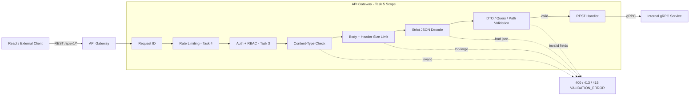
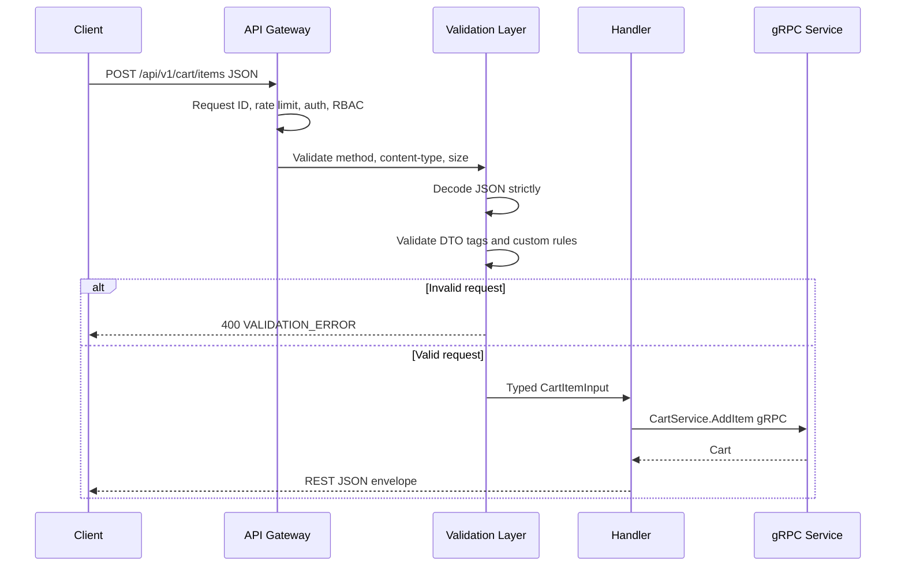
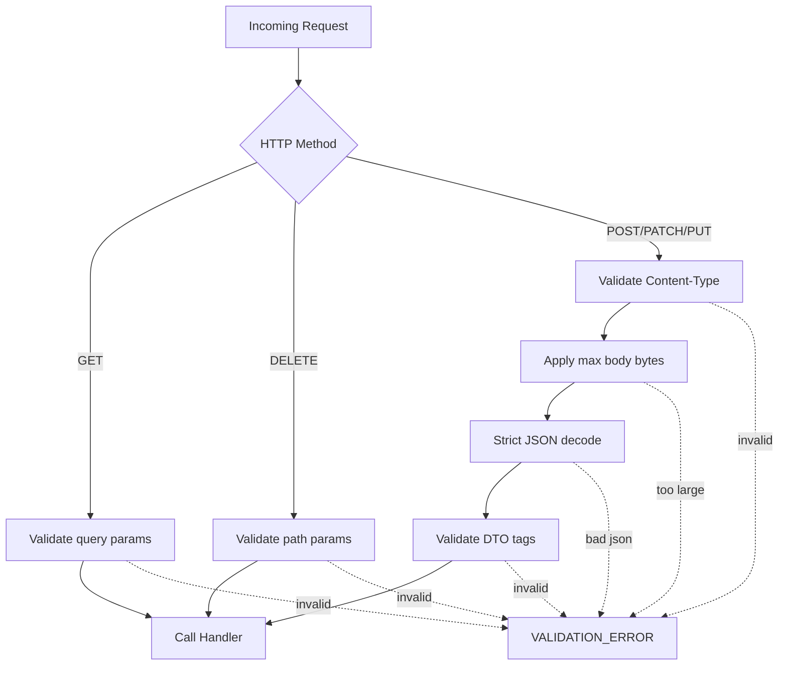

# 🚪 API Gateway Service - Task 5: Request Validation


## 📌 Task Summary

| Field | Detail |
|---|---|
| Task Name | Request validation |
| Source | `docs/01-micro-tasks.md` → `API Gateway` → Task 5 |
| Goal | DTO validation, size limits, content-type checks add karna |
| Priority | `P1` |
| Dependency | Route definitions |
| Output Type | Documentation-only implementation guide |
| Not Included | Business validation, database constraints, gRPC error mapping, full observability, frontend form validation, service-specific ownership checks |

> **Simple Hinglish goal:** API Gateway ko har public REST request ko service tak bhejne se pehle validate karna hai. Body ka size safe hai ya nahi, `Content-Type` correct hai ya nahi, JSON DTO required fields ke saath valid hai ya nahi, query/path params sane hain ya nahi - ye sab Gateway pe check hoga. Isse backend services ko clean input milega aur bad requests jaldi reject ho jayengi.

---

## ✅ Final Output Created

```text
TaskImplementation/
└── API Gateway Service/
    ├── task1.md
    ├── task2.md
    ├── task3.md
    ├── task4.md
    └── task5.md
```

### Why this structure?

| Path | Purpose |
|---|---|
| `TaskImplementation/` | Saare task-wise implementation guides ka central folder |
| `TaskImplementation/API Gateway Service/` | API Gateway service ke guides ka group |
| `task1.md` | Public REST route contract |
| `task2.md` | Gateway gRPC clients setup |
| `task3.md` | Auth middleware guide |
| `task4.md` | Redis rate limiting guide |
| `task5.md` | Sirf **API Gateway Service - Task 5** ka request validation guide |

> 🟢 **Scope rule:** Is task me actual `backend/services/api-gateway/` code create nahi kiya gaya. User request ka output sirf folder structure aur `task5.md` content hai. Backend implementation ke exact files/code examples niche documented hain.

---

## 🧭 Documents Studied

| Document | Kya use kiya gaya |
|---|---|
| `docs/01-micro-tasks.md` | Task 5 exact scope: DTO validation, size limits, content-type checks |
| `docs/02-system-architecture.md` | Gateway responsibility: body, query, headers, file size, content type validate karna |
| `docs/03-folder-structure.md` | Middleware order: request validation auth/RBAC ke baad aur handler se pehle |
| `docs/04-microservice-design.md` | API Gateway public entry point hai, business rules own nahi karta |
| `docs/06-auth-security.md` | Validation layers and security rules: IDs, body size, file type/size, money values |
| `docs/13-developer-guide.md` | REST response envelope and production checklist me input validation |
| `api/master-api.json` | Route ids, HTTP methods, paths, auth levels, request schemas |
| `TaskImplementation/API Gateway Service/task1.md` | Route definitions and auth matrix |
| `TaskImplementation/API Gateway Service/task2.md` | Handler → gRPC client mapping base |
| `TaskImplementation/API Gateway Service/task3.md` | Auth context available before validation |
| `TaskImplementation/API Gateway Service/task4.md` | Rate limiting runs before request validation |

---

## 🟦 Task 5 Boundary

### Included in Task 5

| Included | Explanation |
|---|---|
| DTO validation | JSON body ko typed request struct me decode karke field-level validation |
| Size limits | Body, query, path, header, and future file upload sizes ko cap karna |
| Content-Type checks | Mutating JSON routes pe `application/json` enforce karna |
| Query validation | Pagination, search, filters, dates, sort values validate karna |
| Path param validation | `{product_id}`, `{order_id}`, `{payment_id}` jaise IDs ka format check karna |
| Header validation | `Idempotency-Key`, webhook signature headers, request metadata limits |
| Unknown field rejection | Client typo ya unexpected payload ko silently ignore nahi karna |
| Consistent error envelope | Invalid request pe `VALIDATION_ERROR` JSON response return karna |
| Test strategy | Unit, middleware, handler, table-driven, and fuzz-style validation tests |

### Not included in Task 5

| Not Included | Future Task / Owner |
|---|---|
| Frontend form validation | User App / Seller App / Superadmin Frontend |
| Business ownership checks | Respective services, for example seller owns product |
| Stock, coupon, payment business rules | Product, CMS, Cart, Order, Payment services |
| gRPC error → REST error mapping | API Gateway Task 6 |
| Full logs, metrics, traces | API Gateway Task 7 |
| Redis rate limit counters | API Gateway Task 4 |
| File storage or virus scanning | Object storage/security pipeline later |
| Database constraints | Each service DB layer |

> 🔴 **Important:** Gateway validation ka kaam **shape, format, size, and basic contract** validate karna hai. Deep domain rules service layer me rahenge. Example: Gateway `coupon_code` ka format validate karega, but coupon active hai ya expired hai ye CMS/Cart service decide karegi.

---

## 🧩 Validation Architecture



**Hinglish explanation:**  
Request Gateway me aati hai. Pehle common middleware jaise request id, rate limiting, auth, RBAC run hote hain. Uske baad Task 5 validation layer request ko inspect karti hai. Agar payload invalid hai to Gateway wahi pe response return karta hai. Agar payload clean hai to handler typed DTO ko gRPC request me map karke service call karta hai.

---

## 🔁 Request Validation Sequence



---

## 🧱 Validation Layers

Project docs ke according validation 4 layers me hogi:

| Layer | Responsibility | Example |
|---|---|---|
| Frontend | UX-friendly instant checks | Email field invalid hai to form pe show karo |
| API Gateway | Public request contract validation | JSON size, required fields, query params, content type |
| Service usecase | Business validation | Seller product publish kar sakta hai ya nahi |
| Database | Final integrity constraints | Unique email, FK, non-null columns |

> 🟡 **Rule:** Gateway validation fail hoti hai to request service tak nahi jayegi. Service validation fail hoti hai to Gateway Task 6 ke error mapper se frontend-friendly error banega.

---

## 🗂️ Target Backend Implementation Structure

Task 5 ke backend implementation ke liye recommended target structure:

```text
backend/
└── services/
    └── api-gateway/
        ├── go.mod
        ├── cmd/
        │   └── server/
        │       └── main.go
        └── internal/
            ├── config/
            │   └── config.go
            ├── handlers/
            │   ├── auth_handler.go
            │   ├── cart_handler.go
            │   ├── product_handler.go
            │   ├── order_handler.go
            │   └── validation_helpers.go
            ├── middleware/
            │   ├── body_size.go
            │   └── content_type.go
            ├── routes/
            │   ├── routes.go
            │   └── validation_policy.go
            └── validation/
                ├── validator.go
                ├── decode.go
                ├── errors.go
                ├── rules.go
                ├── query.go
                ├── path.go
                ├── headers.go
                └── sanitize.go
```

### Folder responsibility

| Path | Responsibility |
|---|---|
| `internal/validation/validator.go` | `go-playground/validator` wrapper and custom validations |
| `internal/validation/decode.go` | Strict JSON decode, unknown field reject, body size integration |
| `internal/validation/errors.go` | Validation error detail model and conversion |
| `internal/validation/rules.go` | Common reusable rules: ID, enum, currency, date range, idempotency key |
| `internal/validation/query.go` | Query parsing: pagination, search, filters, date range |
| `internal/validation/path.go` | URL path parameter validation |
| `internal/validation/headers.go` | Content-Type, Idempotency-Key, webhook headers |
| `internal/validation/sanitize.go` | Safe trim/normalize helpers, no secret logging |
| `internal/middleware/body_size.go` | Global and route-specific body size limits |
| `internal/middleware/content_type.go` | JSON/multipart/webhook content type checks |
| `internal/routes/validation_policy.go` | Route id → validation policy registry |
| `internal/handlers/validation_helpers.go` | Handler convenience helpers |

> 🔵 **Design note:** Agar `backend/shared/validation/` package Platform Foundation se available ho, Gateway us shared wrapper ko import kar sakta hai. Gateway-specific route policies phir bhi `api-gateway/internal/validation/` me rahenge.

---

## 🧰 External Libraries / Tools

| Library / Tool | Used? | Why used | Install | Basic use |
|---|---:|---|---|---|
| Go standard library `encoding/json` | ✅ | JSON request body decode karne ke liye | Built-in | `json.NewDecoder(r.Body)` |
| Go standard library `net/http` | ✅ | `http.MaxBytesReader`, status codes, middleware | Built-in | Body size cap and HTTP response |
| Go standard library `mime` | ✅ | `Content-Type` parse karne ke liye | Built-in | `mime.ParseMediaType(header)` |
| `github.com/go-playground/validator/v10` | ✅ Recommended | Struct tags, custom field validation, nested DTO validation | `go get github.com/go-playground/validator/v10` | `validate.Struct(input)` |
| `github.com/go-chi/chi/v5` | ✅ If router is chi | Route params read karne ke liye | `go get github.com/go-chi/chi/v5` | `chi.URLParam(r, "product_id")` |
| `net/http/httptest` | ✅ | Middleware and handler tests | Built-in | `httptest.NewRecorder()` |

### Install commands

```bash
cd backend/services/api-gateway
go get github.com/go-playground/validator/v10
go get github.com/go-chi/chi/v5
go mod tidy
```

### Why not add heavy JSON schema runtime?

`api/master-api.json` source of truth hai, but Gateway Go handlers strongly typed DTOs use karenge. `go-playground/validator` lightweight hai, Go structs ke saath natural fit hai, aur custom rules easily add ho jate hain. Runtime JSON Schema validator later add kiya ja sakta hai agar contract tests/openapi generation formalize hota hai.

---

## 🧾 Validation Policy Matrix

| Request Type | Validation |
|---|---|
| `GET` with query | Query params parse + allowlist + range limits |
| `POST/PATCH/PUT` JSON | `Content-Type: application/json`, body size, strict decode, DTO tags |
| `DELETE` | Usually no body, path id validate |
| Webhook | Provider-specific content type, raw body max size, signature header presence |
| Future multipart upload | File count, file extension, MIME type, max total bytes |

### Suggested size limits

| Route Group | Max Body Size | Reason |
|---|---:|---|
| Auth login/signup/OTP | `64 KB` | Small credential payloads |
| Cart/wishlist/order commands | `128 KB` | Compact command payloads |
| Search/session event ingestion | `64 KB` | High volume, should stay small |
| Seller product/coupon/campaign write | `1 MB` | Product metadata can be larger |
| Admin settings/update/review | `256 KB` | Controlled admin payloads |
| Payment webhooks | `512 KB` | Provider payload can be nested |
| Future multipart image upload | `10 MB` per file | Only if upload route exists |

> 🟡 **Important:** Current `api/master-api.json` mostly image URLs accept karta hai, direct image upload route define nahi karta. File-upload validation rule future-ready hai, but Task 5 current implementation JSON-first rahega.

---

## 🧪 Route Schema Examples From `api/master-api.json`

| Route | Request Schema | Gateway Validation Focus |
|---|---|---|
| `POST /api/v1/auth/signup` | `SignupRequest` | email, password min length, full name, role enum |
| `POST /api/v1/cart/items` | `CartItemInput` | product id, variant id, quantity minimum |
| `GET /api/v1/search` | `SearchRequest` | q length, page/page_size, sort allowlist |
| `POST /api/v1/orders/checkout` | `CheckoutRequest` | address id, provider enum, idempotency key |
| `PATCH /api/v1/seller/products/{product_id}` | `ProductInput` + path id | product id, title, category id, variants |
| `POST /api/v1/webhooks/payments/{provider}` | `PaymentWebhookRequest` | provider param, raw body size, signature headers |
| `PATCH /api/v1/admin/settings/{key}` | `PlatformSettingInput` | key format, value object, reason required |

---

## 🚦 Step-by-Step Implementation

## Step 1: Validation rules ko route contract se map karo

Pehle `api/master-api.json` me har REST endpoint ka `id`, `method`, `path`, `auth`, and `request_schema` identify karo. Gateway ke route registration ke saath validation policy attach hogi.

```go
package routes

type ValidationPolicy struct {
    RouteID      string
    Method       string
    Path         string
    BodyRequired bool
    MaxBodyBytes int64
    ContentTypes []string
    RequireIDKey bool
}

var Policies = map[string]ValidationPolicy{
    "auth.signup": {
        RouteID:      "auth.signup",
        Method:       "POST",
        Path:         "/api/v1/auth/signup",
        BodyRequired: true,
        MaxBodyBytes: 64 << 10,
        ContentTypes: []string{"application/json"},
    },
    "cart.add_item": {
        RouteID:      "cart.add_item",
        Method:       "POST",
        Path:         "/api/v1/cart/items",
        BodyRequired: true,
        MaxBodyBytes: 128 << 10,
        ContentTypes: []string{"application/json"},
    },
    "order.checkout": {
        RouteID:      "order.checkout",
        Method:       "POST",
        Path:         "/api/v1/orders/checkout",
        BodyRequired: true,
        MaxBodyBytes: 128 << 10,
        ContentTypes: []string{"application/json"},
        RequireIDKey: true,
    },
}
```

**Explanation:**  
Policy registry se validation centralized hoti hai. Har handler manually random size limit decide nahi karega. Route id same rahega jo `api/master-api.json` me define hai.

---

## Step 2: Common validation error model banao

Frontend ko har invalid request ka same JSON shape chahiye. Developer guide ke envelope ko follow karte hue details array field-wise reason dega.

```go
package validation

type FieldError struct {
    Field   string `json:"field"`
    Reason  string `json:"reason"`
    Message string `json:"message,omitempty"`
}

type Error struct {
    Status  int          `json:"-"`
    Code    string       `json:"code"`
    Message string       `json:"message"`
    Details []FieldError `json:"details"`
}

func NewError(status int, details ...FieldError) *Error {
    return &Error{
        Status:  status,
        Code:    "VALIDATION_ERROR",
        Message: "Invalid request",
        Details: details,
    }
}
```

### Error response example

```json
{
  "data": null,
  "request_id": "req_123",
  "error": {
    "code": "VALIDATION_ERROR",
    "message": "Invalid request",
    "details": [
      {
        "field": "quantity",
        "reason": "min",
        "message": "quantity must be at least 1"
      }
    ]
  }
}
```

**Explanation:**  
Task 6 later gRPC errors map karega, but Task 5 ke local validation errors ko abhi se common envelope-compatible banana zaroori hai.

---

## Step 3: Content-Type check add karo

Mutating JSON endpoints ke liye `Content-Type` required hai. Browser kabhi `application/json; charset=utf-8` bhejta hai, isliye exact string compare nahi karna. `mime.ParseMediaType` use karo.

```go
package validation

import (
    "mime"
    "net/http"
)

func RequireContentType(r *http.Request, allowed ...string) *Error {
    if len(allowed) == 0 {
        return nil
    }

    raw := r.Header.Get("Content-Type")
    if raw == "" {
        return NewError(http.StatusUnsupportedMediaType, FieldError{
            Field:   "Content-Type",
            Reason:  "required",
            Message: "Content-Type header is required",
        })
    }

    mediaType, _, err := mime.ParseMediaType(raw)
    if err != nil {
        return NewError(http.StatusUnsupportedMediaType, FieldError{
            Field:   "Content-Type",
            Reason:  "invalid",
            Message: "Content-Type header is invalid",
        })
    }

    for _, item := range allowed {
        if mediaType == item {
            return nil
        }
    }

    return NewError(http.StatusUnsupportedMediaType, FieldError{
        Field:   "Content-Type",
        Reason:  "unsupported",
        Message: "Only supported request content types are allowed",
    })
}
```

**Explanation:**  
Wrong content type ko early reject karne se Gateway accidentally form data ya text payload ko JSON samajh kar parse nahi karega.

---

## Step 4: Body size limit enforce karo

`http.MaxBytesReader` body ko hard cap karta hai. Agar client limit se zyada payload bhejta hai to Gateway `413 Payload Too Large` return karega.

```go
package validation

import (
    "errors"
    "io"
    "net/http"
)

func LimitBody(w http.ResponseWriter, r *http.Request, maxBytes int64) {
    if maxBytes <= 0 {
        return
    }
    r.Body = http.MaxBytesReader(w, r.Body, maxBytes)
}

func IsBodyTooLarge(err error) bool {
    var maxBytesErr *http.MaxBytesError
    return errors.As(err, &maxBytesErr)
}

func DrainAndClose(body io.ReadCloser) {
    if body == nil {
        return
    }
    _, _ = io.Copy(io.Discard, io.LimitReader(body, 4<<10))
    _ = body.Close()
}
```

**Explanation:**  
Large body service tak jane se pehle block ho jata hai. Ye memory pressure, slow client abuse, and accidental huge payloads se Gateway ko protect karta hai.

---

## Step 5: Strict JSON decoder banao

Strict decoder unknown fields reject karega, empty body detect karega, multiple JSON objects reject karega.

```go
package validation

import (
    "encoding/json"
    "errors"
    "io"
    "net/http"
    "strings"
)

func DecodeJSON[T any](r *http.Request) (T, *Error) {
    var input T

    dec := json.NewDecoder(r.Body)
    dec.DisallowUnknownFields()

    if err := dec.Decode(&input); err != nil {
        if IsBodyTooLarge(err) {
            return input, NewError(http.StatusRequestEntityTooLarge, FieldError{
                Field:   "body",
                Reason:  "too_large",
                Message: "Request body is too large",
            })
        }

        if errors.Is(err, io.EOF) {
            return input, NewError(http.StatusBadRequest, FieldError{
                Field:   "body",
                Reason:  "required",
                Message: "Request body is required",
            })
        }

        if strings.Contains(err.Error(), "unknown field") {
            return input, NewError(http.StatusBadRequest, FieldError{
                Field:   "body",
                Reason:  "unknown_field",
                Message: err.Error(),
            })
        }

        return input, NewError(http.StatusBadRequest, FieldError{
            Field:   "body",
            Reason:  "invalid_json",
            Message: "Request body must be valid JSON",
        })
    }

    if err := dec.Decode(&struct{}{}); !errors.Is(err, io.EOF) {
        return input, NewError(http.StatusBadRequest, FieldError{
            Field:   "body",
            Reason:  "multiple_json_values",
            Message: "Request body must contain only one JSON object",
        })
    }

    return input, nil
}
```

**Explanation:**  
`DisallowUnknownFields` client-side bugs jaldi pakadta hai. Example: client `quantitty` bhej de instead of `quantity`, to Gateway request reject karega instead of silently ignoring.

---

## Step 6: Validator wrapper banao

`go-playground/validator/v10` DTO tags validate karega. Wrapper se app-specific custom rules register karna easy hoga.

```go
package validation

import (
    "net/http"
    "regexp"

    "github.com/go-playground/validator/v10"
)

type Validator struct {
    validate *validator.Validate
}

func NewValidator() *Validator {
    v := validator.New()
    _ = v.RegisterValidation("public_id", validatePublicID)
    _ = v.RegisterValidation("idempotency", validateIdempotencyKey)
    _ = v.RegisterValidation("currency", validateCurrency)
    return &Validator{validate: v}
}

func (v *Validator) Struct(input any) *Error {
    if err := v.validate.Struct(input); err != nil {
        validationErrs, ok := err.(validator.ValidationErrors)
        if !ok {
            return NewError(http.StatusBadRequest, FieldError{
                Field:   "body",
                Reason:  "invalid",
                Message: "Request validation failed",
            })
        }

        details := make([]FieldError, 0, len(validationErrs))
        for _, item := range validationErrs {
            details = append(details, FieldError{
                Field:   item.Field(),
                Reason:  item.Tag(),
                Message: fieldMessage(item),
            })
        }
        return NewError(http.StatusBadRequest, details...)
    }
    return nil
}

var publicIDPattern = regexp.MustCompile(`^[a-zA-Z0-9_-]{8,80}$`)

func validatePublicID(fl validator.FieldLevel) bool {
    value := fl.Field().String()
    return value == "" || publicIDPattern.MatchString(value)
}
```

**Explanation:**  
Direct validator import har handler me karne ke bajay wrapper use karne se custom rules, error format, and future translations central place pe maintain honge.

---

## Step 7: Custom validation rules define karo

Common ecommerce request fields ke liye reusable rules chahiye.

| Rule | Example Field | Validation |
|---|---|---|
| `public_id` | `product_id`, `order_id`, `address_id` | Safe length and characters |
| `idempotency` | `idempotency_key` | 16 to 128 chars, no spaces/control chars |
| `currency` | `Money.currency` | ISO-like uppercase code, for example `INR`, `USD` |
| `coupon_code` | `coupon_code` | Uppercase letters, numbers, `_`, `-` |
| `sku` | `ProductVariantInput.sku` | Seller SKU length and safe chars |
| `e164` | `phone` | International phone format where required |
| `date_range` | `from`, `to` | `from <= to`, max window for analytics |

```go
func validateIdempotencyKey(fl validator.FieldLevel) bool {
    value := fl.Field().String()
    if value == "" {
        return true
    }
    if len(value) < 16 || len(value) > 128 {
        return false
    }
    for _, r := range value {
        if r <= 32 || r == 127 {
            return false
        }
    }
    return true
}

func validateCurrency(fl validator.FieldLevel) bool {
    value := fl.Field().String()
    if len(value) != 3 {
        return false
    }
    for _, r := range value {
        if r < 'A' || r > 'Z' {
            return false
        }
    }
    return true
}
```

**Explanation:**  
Ye rules security aur data quality dono improve karte hain. ID fields me SQL injection ka direct risk gRPC/DB layers me controlled hoga, but weird path values ko Gateway pe reject karna still useful hai.

---

## Step 8: DTO structs me validation tags add karo

Gateway DTOs `api/master-api.json` schemas ke matching honi chahiye. Tags field-level validation define karenge.

### Auth DTO example

```go
type SignupRequest struct {
    Email    string `json:"email" validate:"required,email,max=255"`
    Phone    string `json:"phone,omitempty" validate:"omitempty,e164"`
    Password string `json:"password" validate:"required,min=8,max=128"`
    FullName string `json:"full_name" validate:"required,min=2,max=120"`
    Role     string `json:"role,omitempty" validate:"omitempty,oneof=buyer seller"`
}

type LoginRequest struct {
    Identifier string         `json:"identifier" validate:"required,min=3,max=255"`
    Password   string         `json:"password" validate:"required,min=1,max=128"`
    Device     map[string]any `json:"device,omitempty" validate:"omitempty"`
}
```

### Cart DTO example

```go
type CartItemInput struct {
    ProductID string `json:"product_id" validate:"required,public_id"`
    VariantID string `json:"variant_id" validate:"required,public_id"`
    Quantity  int32  `json:"quantity" validate:"required,min=1,max=99"`
}

type CartItemQuantityInput struct {
    Quantity int32 `json:"quantity" validate:"required,min=1,max=99"`
}
```

### Checkout DTO example

```go
type CheckoutRequest struct {
    AddressID      string `json:"address_id" validate:"required,public_id"`
    CouponCode     string `json:"coupon_code,omitempty" validate:"omitempty,max=64"`
    PaymentProvider string `json:"payment_provider" validate:"required,oneof=stripe razorpay cod"`
    IdempotencyKey string `json:"idempotency_key" validate:"required,idempotency"`
}
```

### Money DTO example

```go
type Money struct {
    Amount   int64  `json:"amount" validate:"required,min=0,max=999999999999"`
    Currency string `json:"currency" validate:"required,currency"`
}
```

**Explanation:**  
DTO tags Gateway validation ka primary source hain. Business-specific checks jaise payment provider enabled hai ya product stock available hai, service layer karegi.

---

## Step 9: Query parameter validation banao

GET endpoints mostly query params use karte hain. Query parsing explicit hona chahiye, free-form `map[string]string` pass nahi karna.

```go
package validation

import (
    "net/http"
    "strconv"
)

type Pagination struct {
    Page     int32
    PageSize int32
    Cursor   string
}

func ParsePagination(r *http.Request) (Pagination, *Error) {
    q := r.URL.Query()

    page := int32(1)
    pageSize := int32(20)

    if raw := q.Get("page"); raw != "" {
        parsed, err := strconv.Atoi(raw)
        if err != nil || parsed < 1 {
            return Pagination{}, NewError(http.StatusBadRequest, FieldError{
                Field:   "page",
                Reason:  "invalid",
                Message: "page must be a positive integer",
            })
        }
        page = int32(parsed)
    }

    if raw := q.Get("page_size"); raw != "" {
        parsed, err := strconv.Atoi(raw)
        if err != nil || parsed < 1 || parsed > 100 {
            return Pagination{}, NewError(http.StatusBadRequest, FieldError{
                Field:   "page_size",
                Reason:  "range",
                Message: "page_size must be between 1 and 100",
            })
        }
        pageSize = int32(parsed)
    }

    return Pagination{
        Page:     page,
        PageSize: pageSize,
        Cursor:   q.Get("cursor"),
    }, nil
}
```

### Search query DTO

```go
type SearchRequest struct {
    Q        string `validate:"omitempty,min=1,max=120"`
    Sort     string `validate:"omitempty,oneof=relevance price_asc price_desc newest rating"`
    Page     int32  `validate:"min=1"`
    PageSize int32  `validate:"min=1,max=100"`
}
```

**Explanation:**  
Query validation prevent karta hai ki search endpoint pe huge `page_size=100000` ya unsupported sort value service tak jaye.

---

## Step 10: Path param validation banao

Path params route se nikalenge. Agar router `chi` hai to `chi.URLParam` use hoga.

```go
package validation

import (
    "net/http"

    "github.com/go-chi/chi/v5"
)

func PathID(r *http.Request, name string) (string, *Error) {
    value := chi.URLParam(r, name)
    if value == "" {
        return "", NewError(http.StatusBadRequest, FieldError{
            Field:   name,
            Reason:  "required",
            Message: name + " is required",
        })
    }
    if !publicIDPattern.MatchString(value) {
        return "", NewError(http.StatusBadRequest, FieldError{
            Field:   name,
            Reason:  "invalid",
            Message: name + " format is invalid",
        })
    }
    return value, nil
}
```

**Explanation:**  
`/api/v1/products/{product_id}` jaise routes me product id clean hona chahiye. Handler ko invalid path value manually check nahi karni padegi.

---

## Step 11: Header validation add karo

Headers me especially `Idempotency-Key` checkout/payment/refund commands ke liye useful hai. Current schema me `idempotency_key` body me bhi hai, but Gateway should accept one canonical strategy and avoid mismatch.

```go
package validation

import "net/http"

func IdempotencyKey(r *http.Request, bodyValue string, required bool) (string, *Error) {
    headerValue := r.Header.Get("Idempotency-Key")

    if headerValue != "" && bodyValue != "" && headerValue != bodyValue {
        return "", NewError(http.StatusBadRequest, FieldError{
            Field:   "Idempotency-Key",
            Reason:  "mismatch",
            Message: "Header and body idempotency key must match",
        })
    }

    key := headerValue
    if key == "" {
        key = bodyValue
    }

    if required && key == "" {
        return "", NewError(http.StatusBadRequest, FieldError{
            Field:   "Idempotency-Key",
            Reason:  "required",
            Message: "Idempotency key is required",
        })
    }

    if key != "" && (len(key) < 16 || len(key) > 128) {
        return "", NewError(http.StatusBadRequest, FieldError{
            Field:   "Idempotency-Key",
            Reason:  "range",
            Message: "Idempotency key length is invalid",
        })
    }

    return key, nil
}
```

**Explanation:**  
Duplicate checkout/payment clicks ko safely handle karne me idempotency help karti hai. Gateway format enforce karega, final idempotent behavior Order/Payment service enforce karegi.

---

## Step 12: Normalization and sanitization rules define karo

Gateway safe normalization karega, but secrets ya opaque tokens mutate nahi karega.

| Field Type | Gateway Action |
|---|---|
| Email | `strings.TrimSpace`, lower-case domain/full email if product decision allows |
| Full name/title | Trim outer spaces, preserve internal spaces |
| Coupon code | Trim and uppercase if coupons are case-insensitive |
| Password | Do not trim silently, do not log |
| JWT/refresh token | Do not mutate, do not log |
| HTML-rich text | Gateway size/type check karega, rendering sanitization frontend/service side pe |
| URLs | Parse and allow scheme `https` for public image/avatar URLs |

```go
func NormalizeSignup(input SignupRequest) SignupRequest {
    input.Email = strings.ToLower(strings.TrimSpace(input.Email))
    input.FullName = strings.TrimSpace(input.FullName)
    input.Phone = strings.TrimSpace(input.Phone)
    return input
}
```

**Explanation:**  
Normalization se duplicate/dirty input kam hota hai. Lekin password ko trim karna dangerous ho sakta hai kyunki user ka actual password change ho jayega. Sensitive fields logs me kabhi nahi aane chahiye.

---

## Step 13: Handler helper create karo

Handler helper decode + validate + error response ko repeat hone se bachata hai.

```go
package handlers

import (
    "net/http"

    "github.com/example/ecommerce-platform/backend/services/api-gateway/internal/validation"
)

type ValidationResponder interface {
    WriteValidationError(w http.ResponseWriter, r *http.Request, err *validation.Error)
}

func DecodeAndValidate[T any](
    w http.ResponseWriter,
    r *http.Request,
    responder ValidationResponder,
    validator *validation.Validator,
    maxBytes int64,
) (T, bool) {
    var zero T

    validation.LimitBody(w, r, maxBytes)
    defer validation.DrainAndClose(r.Body)

    input, verr := validation.DecodeJSON[T](r)
    if verr != nil {
        responder.WriteValidationError(w, r, verr)
        return zero, false
    }

    if verr := validator.Struct(input); verr != nil {
        responder.WriteValidationError(w, r, verr)
        return zero, false
    }

    return input, true
}
```

**Explanation:**  
Har handler me 20 lines validation repeat karne ki zaroorat nahi. Helper type-safe hai, isliye handler directly `CartItemInput`, `CheckoutRequest`, etc. receive karega.

---

## Step 14: Handler me validation use karo

Cart add item route example:

```go
func (h *CartHandler) AddItem(w http.ResponseWriter, r *http.Request) {
    input, ok := DecodeAndValidate[CartItemInput](
        w,
        r,
        h.responder,
        h.validator,
        128<<10,
    )
    if !ok {
        return
    }

    claims := auth.MustClaimsFromContext(r.Context())

    grpcReq := &cartv1.AddItemRequest{
        UserId:    claims.UserID,
        ProductId: input.ProductID,
        VariantId: input.VariantID,
        Quantity:  input.Quantity,
    }

    cart, err := h.clients.Cart.AddItem(r.Context(), grpcReq)
    if err != nil {
        h.responder.WriteGRPCError(w, r, err)
        return
    }

    h.responder.WriteOK(w, r, cart)
}
```

**Explanation:**  
Gateway handler clean flow follow karega: validate → auth context read → DTO to gRPC map → service call → response. Invalid input service tak nahi jayega.

---

## Step 15: Query handler me validation use karo

Search route example:

```go
func (h *SearchHandler) SearchProducts(w http.ResponseWriter, r *http.Request) {
    pagination, verr := validation.ParsePagination(r)
    if verr != nil {
        h.responder.WriteValidationError(w, r, verr)
        return
    }

    query := strings.TrimSpace(r.URL.Query().Get("q"))
    if len(query) > 120 {
        h.responder.WriteValidationError(w, r, validation.NewError(http.StatusBadRequest, validation.FieldError{
            Field:   "q",
            Reason:  "max",
            Message: "q must be at most 120 characters",
        }))
        return
    }

    sort := r.URL.Query().Get("sort")
    if sort != "" && !allowedSort(sort) {
        h.responder.WriteValidationError(w, r, validation.NewError(http.StatusBadRequest, validation.FieldError{
            Field:   "sort",
            Reason:  "oneof",
            Message: "sort value is not supported",
        }))
        return
    }

    result, err := h.clients.Search.SearchProducts(r.Context(), &searchv1.SearchProductsRequest{
        Query:    query,
        Sort:     sort,
        Page:     pagination.Page,
        PageSize: pagination.PageSize,
    })
    if err != nil {
        h.responder.WriteGRPCError(w, r, err)
        return
    }

    h.responder.WriteOK(w, r, result)
}
```

**Explanation:**  
GET request body decode nahi hota. Query params explicitly parse hote hain and invalid values pe `400 VALIDATION_ERROR` return hota hai.

---

## Step 16: Webhook validation special case handle karo

Payment webhook JWT route nahi hota, provider signature based auth hota hai. Validation ko raw body preserve karni hogi because signature verification exact bytes pe hota hai.

```go
func (h *PaymentWebhookHandler) Handle(w http.ResponseWriter, r *http.Request) {
    provider, verr := validation.PathID(r, "provider")
    if verr != nil {
        h.responder.WriteValidationError(w, r, verr)
        return
    }

    validation.LimitBody(w, r, 512<<10)
    rawBody, err := io.ReadAll(r.Body)
    if err != nil {
        h.responder.WriteValidationError(w, r, validation.NewError(http.StatusRequestEntityTooLarge, validation.FieldError{
            Field:   "body",
            Reason:  "too_large",
            Message: "Webhook body is too large",
        }))
        return
    }

    signature := r.Header.Get("X-Provider-Signature")
    if signature == "" {
        h.responder.WriteValidationError(w, r, validation.NewError(http.StatusBadRequest, validation.FieldError{
            Field:   "X-Provider-Signature",
            Reason:  "required",
            Message: "Webhook signature is required",
        }))
        return
    }

    _, err = h.clients.Payment.HandleWebhook(r.Context(), &paymentv1.HandleWebhookRequest{
        Provider:  provider,
        Headers:   safeWebhookHeaders(r.Header),
        RawBody:   string(rawBody),
        Signature: signature,
    })
    if err != nil {
        h.responder.WriteGRPCError(w, r, err)
        return
    }

    h.responder.WriteOK(w, r, map[string]bool{"success": true})
}
```

**Explanation:**  
Webhook me body ko decode karke re-encode nahi karna chahiye before signature verification. Gateway basic checks karega, actual provider signature verification Payment Service ya webhook auth middleware karega as per Task 3 design.

---

## Step 17: Response status mapping define karo

| Failure | HTTP Status | Error Code | Example |
|---|---:|---|---|
| Missing/invalid JSON body | `400` | `VALIDATION_ERROR` | Malformed JSON |
| DTO field invalid | `400` | `VALIDATION_ERROR` | `quantity < 1` |
| Query/path invalid | `400` | `VALIDATION_ERROR` | `page_size > 100` |
| Body too large | `413` | `VALIDATION_ERROR` | Product payload above limit |
| Unsupported content type | `415` | `VALIDATION_ERROR` | `text/plain` on JSON route |
| Required header missing | `400` | `VALIDATION_ERROR` | Missing `Idempotency-Key` |

> 🔵 **Note:** `422 Unprocessable Entity` bhi valid option hai, but is project ke REST error convention me simple client input issues ke liye `400 VALIDATION_ERROR` easier and consistent rahega. Size/content-type ke standard HTTP statuses `413` and `415` use honge.

---

## Step 18: Middleware order me validation place karo

`docs/03-folder-structure.md` ke middleware order ke according:

```text
1. Request ID
2. Real IP / forwarded headers
3. Panic recovery
4. Structured logging
5. Metrics
6. Tracing
7. CORS
8. Rate limiting
9. Authentication
10. RBAC
11. Request validation
12. Handler
```

### Why validation auth ke baad?

| Reason | Explanation |
|---|---|
| Protected route context available | User/seller/admin context ke basis pe route-specific validation possible |
| Rate limit first | Huge abuse traffic pe earlier limiter ka benefit |
| RBAC before body work | Unauthorized user ke payload parse karne me CPU waste nahi |
| Handler clean | Handler ko already authenticated and validated request milti hai |

---

## Step 19: Tests likho

### Unit test cases

| Test | Expected |
|---|---|
| Valid DTO | No validation error |
| Missing required field | `VALIDATION_ERROR` with field name |
| Unknown JSON field | `unknown_field` |
| Invalid JSON | `invalid_json` |
| Multiple JSON objects | `multiple_json_values` |
| Body too large | HTTP `413` |
| Unsupported content type | HTTP `415` |
| Query `page_size=101` | HTTP `400` |
| Invalid path id | HTTP `400` |
| Password not logged | No sensitive value in error/log detail |

### Example table-driven test

```go
func TestCartItemInputValidation(t *testing.T) {
    validator := validation.NewValidator()

    tests := []struct {
        name    string
        input   CartItemInput
        wantErr bool
    }{
        {
            name: "valid",
            input: CartItemInput{
                ProductID: "prod_12345678",
                VariantID: "var_12345678",
                Quantity:  1,
            },
            wantErr: false,
        },
        {
            name: "quantity zero",
            input: CartItemInput{
                ProductID: "prod_12345678",
                VariantID: "var_12345678",
                Quantity:  0,
            },
            wantErr: true,
        },
    }

    for _, tt := range tests {
        t.Run(tt.name, func(t *testing.T) {
            err := validator.Struct(tt.input)
            if (err != nil) != tt.wantErr {
                t.Fatalf("validator.Struct() error = %v, wantErr %v", err, tt.wantErr)
            }
        })
    }
}
```

### Middleware test example

```go
func TestRequireContentTypeRejectsTextPlain(t *testing.T) {
    req := httptest.NewRequest(http.MethodPost, "/api/v1/cart/items", strings.NewReader(`{}`))
    req.Header.Set("Content-Type", "text/plain")

    err := validation.RequireContentType(req, "application/json")
    if err == nil {
        t.Fatal("expected validation error")
    }
    if err.Status != http.StatusUnsupportedMediaType {
        t.Fatalf("status = %d, want %d", err.Status, http.StatusUnsupportedMediaType)
    }
}
```

---

## Step 20: Security and privacy checklist

| Rule | Status |
|---|---|
| Password, OTP, JWT, refresh token error details me echo nahi honge | ✅ |
| Unknown fields reject honge | ✅ |
| Body size per route enforce hoga | ✅ |
| Query `page_size` max `100` hoga | ✅ |
| File upload future route pe type + size validate hoga | ✅ |
| Webhook raw body preserve hoga | ✅ |
| Money amount integer minor unit rahega | ✅ |
| HTML/string rendering sanitization service/frontend layer pe documented hai | ✅ |
| Service layer business validation still required hai | ✅ |

---

## 🧾 Complete DTO Validation Examples

### Product input

```go
type ProductInput struct {
    Title       string                `json:"title" validate:"required,min=3,max=180"`
    Description string                `json:"description,omitempty" validate:"omitempty,max=5000"`
    Brand       string                `json:"brand,omitempty" validate:"omitempty,max=120"`
    CategoryID  string                `json:"category_id" validate:"required,public_id"`
    Attributes  map[string]any        `json:"attributes,omitempty" validate:"omitempty"`
    Images      []string              `json:"images,omitempty" validate:"max=20,dive,url"`
    Variants    []ProductVariantInput `json:"variants" validate:"required,min=1,max=100,dive"`
}

type ProductVariantInput struct {
    SKU           string         `json:"sku" validate:"required,min=2,max=80"`
    Attributes    map[string]any `json:"attributes,omitempty" validate:"omitempty"`
    Price         Money          `json:"price" validate:"required"`
    StockQuantity int32          `json:"stock_quantity" validate:"min=0,max=1000000"`
}
```

### Address input

```go
type AddressInput struct {
    Name       string `json:"name" validate:"required,min=2,max=120"`
    Phone      string `json:"phone,omitempty" validate:"omitempty,e164"`
    Line1      string `json:"line1" validate:"required,min=3,max=180"`
    Line2      string `json:"line2,omitempty" validate:"omitempty,max=180"`
    City       string `json:"city" validate:"required,min=2,max=80"`
    State      string `json:"state" validate:"required,min=2,max=80"`
    PostalCode string `json:"postal_code" validate:"required,min=3,max=20"`
    Country    string `json:"country" validate:"required,len=2"`
    IsDefault  bool   `json:"is_default"`
}
```

### Admin status update

```go
type StatusUpdateRequest struct {
    Status string `json:"status" validate:"required,oneof=active blocked suspended approved rejected"`
    Reason string `json:"reason" validate:"required,min=3,max=500"`
}
```

---

## 🧪 Manual Testing Examples

### Valid cart request

```bash
curl -X POST http://localhost:8080/api/v1/cart/items \
  -H "Authorization: Bearer $ACCESS_TOKEN" \
  -H "Content-Type: application/json" \
  -d '{
    "product_id": "prod_12345678",
    "variant_id": "var_12345678",
    "quantity": 2
  }'
```

### Invalid content type

```bash
curl -X POST http://localhost:8080/api/v1/cart/items \
  -H "Authorization: Bearer $ACCESS_TOKEN" \
  -H "Content-Type: text/plain" \
  -d '{"quantity":2}'
```

Expected:

```json
{
  "data": null,
  "request_id": "req_123",
  "error": {
    "code": "VALIDATION_ERROR",
    "message": "Invalid request",
    "details": [
      {
        "field": "Content-Type",
        "reason": "unsupported",
        "message": "Only supported request content types are allowed"
      }
    ]
  }
}
```

### Invalid DTO field

```bash
curl -X POST http://localhost:8080/api/v1/cart/items \
  -H "Authorization: Bearer $ACCESS_TOKEN" \
  -H "Content-Type: application/json" \
  -d '{
    "product_id": "prod_12345678",
    "variant_id": "var_12345678",
    "quantity": 0
  }'
```

Expected: `400 VALIDATION_ERROR` with `quantity` detail.

---

## 📊 Validation Flow by Route Group



---

## 🧠 Beginner-Friendly Mental Model

Think of Gateway validation as a gate checklist:

| Gate Question | Example |
|---|---|
| Kya route ko body chahiye? | `POST /cart/items` yes, `GET /products` no |
| Kya content type correct hai? | JSON route pe `application/json` |
| Kya body size safe hai? | Login payload 64 KB se kam |
| Kya JSON valid hai? | Proper object, no unknown field |
| Kya required fields present hain? | `quantity`, `product_id`, `variant_id` |
| Kya value range sane hai? | `quantity >= 1`, `page_size <= 100` |
| Kya path/query params valid hain? | `product_id` format, `sort` allowlist |

Agar kisi gate pe fail hua, response immediately client ko jata hai. Agar sab pass hua, request service tak jati hai.

---

## ✅ Acceptance Checklist

| Requirement | Status |
|---|---|
| `TaskImplementation/` folder exists | ✅ |
| `TaskImplementation/API Gateway Service/` folder preserved | ✅ |
| `task5.md` created | ✅ |
| Step-by-step implementation Hinglish me documented | ✅ |
| DTO validation documented | ✅ |
| Size limits documented | ✅ |
| Content-Type checks documented | ✅ |
| Query/path/header validation documented | ✅ |
| External libraries/tools explained with install/use | ✅ |
| Folder structure included | ✅ |
| Code examples included | ✅ |
| Mermaid diagrams included | ✅ |
| Scope limited to API Gateway Service Task 5 | ✅ |
| No actual backend implementation files created | ✅ |

---

## 🚫 Out of Scope Reminder

Is task me ye cheeze intentionally create/implement nahi ki gayi:

- `backend/services/api-gateway/` actual Go files
- Product, Cart, Order, Payment, CMS, Auth service validation code
- Frontend form validation
- gRPC error mapping implementation
- Observability metrics/tracing/logging implementation
- Redis rate limiter implementation
- Webhook provider signature algorithm implementation
- File upload storage pipeline

> 🔴 **Reason:** Ye sab separate API Gateway tasks, frontend tasks, ya service-owned tasks hain. Task 5 ka focused output sirf Gateway request validation ka design and step-by-step implementation guide hai.

---

## 🏁 Final Result

API Gateway Service Task 5 complete hai as a structured implementation guide:

- REST request validation architecture define ho gayi.
- DTO validation, content-type checks, body size limits, query/path/header rules documented hain.
- Route policies `api/master-api.json` ke route ids se align hain.
- Common `VALIDATION_ERROR` response shape documented hai.
- Go code examples future implementation ke liye ready reference dete hain.
- Scope cleanly Task 5 tak limited hai.

> 🟢 **Final outcome:** Ab API Gateway ke future backend implementation me `internal/validation/`, `internal/middleware/body_size.go`, `internal/middleware/content_type.go`, and route-level validation policies bina ambiguity ke build ho sakte hain. Task 6 gRPC errors ko REST error format me map karega, while Task 5 client input ko service tak pahunchne se pehle clean and safe banata hai.
