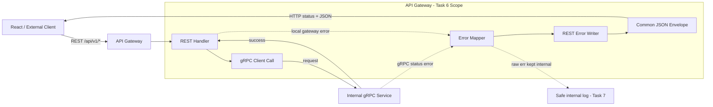
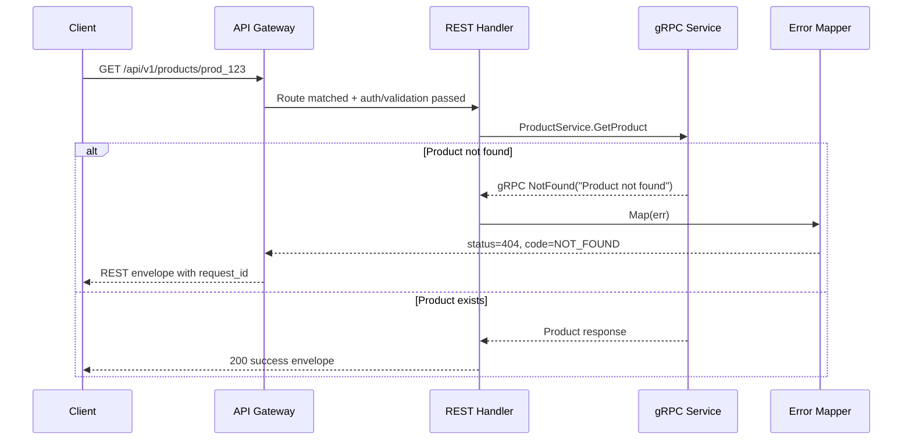
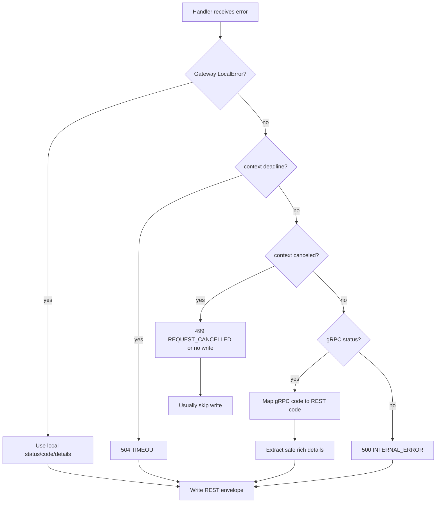

# 🚪 API Gateway Service - Task 6: Error Mapping


## 📌 Task Summary

| Field | Detail |
|---|---|
| Task Name | Error mapping |
| Source | `docs/01-micro-tasks.md` → `API Gateway` → Task 6 |
| Goal | gRPC errors ko REST error format me convert karna |
| Priority | `P1` |
| Dependency | Shared errors |
| Output Type | Documentation-only implementation guide |
| Not Included | Request validation rules, JWT/RBAC implementation, Redis rate limiting, full logs/metrics/traces, business-service logic, frontend UI error rendering |

> **Simple Hinglish goal:** API Gateway ko downstream gRPC service se jo bhi error mile, usko frontend-friendly REST JSON envelope me convert karna hai. Frontend ko har error ka same shape milega: `data: null`, `request_id`, aur `error.code/message/details`. Internal stack trace, DB error, token, ya service implementation detail kabhi client ko expose nahi hoga.

---

## ✅ Final Output Created

```text
TaskImplementation/
└── API Gateway Service/
    ├── task1.md
    ├── task2.md
    ├── task3.md
    ├── task4.md
    ├── task5.md
    └── task6.md
```

### Why this structure?

| Path | Purpose |
|---|---|
| `TaskImplementation/` | Saare task-wise implementation guides ka central folder |
| `TaskImplementation/API Gateway Service/` | API Gateway service ke guides ka group |
| `task1.md` | Public REST route contract |
| `task2.md` | Gateway gRPC clients setup |
| `task3.md` | Auth middleware guide |
| `task4.md` | Redis rate limiting guide |
| `task5.md` | Request validation guide |
| `task6.md` | Sirf **API Gateway Service - Task 6** ka gRPC → REST error mapping guide |

> 🟢 **Scope rule:** Is task me actual `backend/services/api-gateway/` code create nahi kiya gaya. User request ka output sirf required folder structure aur `task6.md` content hai. Backend implementation ke exact files/code examples niche documented hain.

---

## 🧭 Documents Studied

| Document | Kya use kiya gaya |
|---|---|
| `docs/01-micro-tasks.md` | Task 6 exact scope: gRPC errors ko REST error format me convert karna |
| `docs/02-system-architecture.md` | Gateway responsibility: error mapping and frontend-friendly JSON errors |
| `docs/03-folder-structure.md` | Gateway middleware order and response envelope expectations |
| `docs/04-microservice-design.md` | Gateway response shaping karega, business rules own nahi karega |
| `docs/06-auth-security.md` | Secure response behavior: validation, auth, headers, sensitive data leak avoid karna |
| `docs/13-developer-guide.md` | Common REST success/error envelope |
| `TaskImplementation/Platform Foundation/task3.md` | Shared `AppError` codes and gRPC/HTTP mapping baseline |
| `TaskImplementation/Platform Foundation/task5.md` | API Gateway base: response envelope and initial gRPC mapping |
| `TaskImplementation/API Gateway Service/task1.md` | Route definitions and common response shape |
| `TaskImplementation/API Gateway Service/task2.md` | Handler → gRPC client call flow |
| `TaskImplementation/API Gateway Service/task3.md` | Auth/RBAC errors should use same envelope |
| `TaskImplementation/API Gateway Service/task4.md` | Rate limit errors should use same envelope and retry headers |
| `TaskImplementation/API Gateway Service/task5.md` | Local validation errors should match Task 6 envelope |

---

## 🟦 Task 6 Boundary

### Included in Task 6

| Included | Explanation |
|---|---|
| gRPC status mapping | `codes.InvalidArgument`, `NotFound`, `Unavailable`, etc. ko HTTP status + REST app code me map karna |
| Common error envelope | Har error response me `data: null`, `request_id`, `error` object return karna |
| Safe public messages | Internal/raw service errors ko generic safe message me convert karna |
| Error details extraction | `BadRequest`, `ErrorInfo`, `PreconditionFailure`, `RetryInfo` jaise gRPC details ko safe REST details me convert karna |
| Local Gateway errors | Validation, auth, RBAC, rate limit, timeout jaise Gateway-generated errors ko same writer se return karna |
| Retry headers | `Retry-After` and rate-limit style headers ka pattern define karna |
| Handler integration | REST handler me gRPC call error ko mapper se response me convert karna |
| Test strategy | Unit, table-driven, handler, and security regression tests define karna |

### Not included in Task 6

| Not Included | Future Task / Owner |
|---|---|
| DTO validation implementation | API Gateway Task 5 |
| JWT verification and RBAC decisions | API Gateway Task 3 |
| Redis counters and limit algorithm | API Gateway Task 4 |
| Structured logs, metrics, traces full wiring | API Gateway Task 7 |
| gRPC-Web bridge config | API Gateway Task 8 |
| Service-side business validation | Respective microservices |
| Frontend toast/form rendering | User App / Seller Dashboard / Superadmin Panel |
| Sentry/Loki/Grafana dashboards | Observability/DevOps tasks |

> 🔴 **Important:** Task 6 ka kaam error ko translate karna hai, business decision lena nahi. Example: Order Service bole `FAILED_PRECONDITION` because order cancel nahi ho sakta. Gateway sirf usko `422 FAILED_PRECONDITION` REST response me shape karega.

---

## 🧩 Error Mapping Architecture



**Hinglish explanation:**  
Handler downstream service ko gRPC call karta hai. Agar service error return karti hai, handler raw error directly frontend ko nahi bhejta. Pehle `ErrorMapper` gRPC code, details, timeout, aur local errors ko REST-safe structure me convert karta hai. `ErrorWriter` same envelope me response return karta hai.

---

## 🔁 Error Flow Sequence



---

## 🧱 Error Ownership Model

| Error Source | Example | Owner | Gateway Behavior |
|---|---|---|---|
| Gateway validation | Bad JSON, missing required field | API Gateway Task 5 | Direct `400 VALIDATION_ERROR` |
| Gateway auth | Missing/expired token | API Gateway Task 3 | Direct `401 UNAUTHORIZED` |
| Gateway RBAC | Buyer calls seller route | API Gateway Task 3 | Direct `403 FORBIDDEN` |
| Gateway rate limit | Too many OTP attempts | API Gateway Task 4 | Direct `429 RATE_LIMITED` + retry headers |
| gRPC service validation | Service rejects domain input | Business service | Map `InvalidArgument` → `400 VALIDATION_ERROR` |
| gRPC service business state | Order cannot be cancelled now | Business service | Map `FailedPrecondition` → `422 FAILED_PRECONDITION` |
| gRPC service conflict | Duplicate email/order idempotency conflict | Business service | Map `AlreadyExists`/`Aborted` → `409 CONFLICT` |
| gRPC transport | Downstream unavailable | Platform/runtime | Map to `503 SERVICE_UNAVAILABLE` |
| Timeout | Gateway deadline exceeded | Gateway/runtime | Map to `504 TIMEOUT` |
| Unknown/internal | Panic, DB error, unexpected error | Service/runtime | Map to `500 INTERNAL_ERROR` with safe message |

> 🟡 **Rule:** Frontend ko internal source ka raw detail nahi chahiye. Frontend ko actionable `code`, safe `message`, optional `details`, aur `request_id` chahiye.

---

## 📦 Common REST Error Envelope

Developer guide ke according success/error dono response predictable shape me rahenge.

### Success response

```json
{
  "data": {
    "id": "prod_123"
  },
  "request_id": "req_123",
  "error": null
}
```

### Error response

```json
{
  "data": null,
  "request_id": "req_123",
  "error": {
    "code": "NOT_FOUND",
    "message": "Product not found",
    "details": []
  }
}
```

### Field validation details example

```json
{
  "data": null,
  "request_id": "req_123",
  "error": {
    "code": "VALIDATION_ERROR",
    "message": "Invalid request",
    "details": [
      {
        "field": "quantity",
        "reason": "min",
        "message": "quantity must be at least 1"
      }
    ]
  }
}
```

**Hinglish explanation:**  
Frontend `error.code` pe decision le sakta hai. Example: `UNAUTHORIZED` aaye to login redirect, `RATE_LIMITED` aaye to retry timer, `VALIDATION_ERROR` aaye to form fields pe inline errors.

---

## 🧾 REST Error Code Catalog

| REST Error Code | HTTP Status | Kab use hoga |
|---|---:|---|
| `VALIDATION_ERROR` | `400` | Request shape/field/query/path invalid |
| `UNAUTHORIZED` | `401` | Token missing, expired, invalid |
| `FORBIDDEN` | `403` | Role/permission allowed nahi |
| `NOT_FOUND` | `404` | Resource exist nahi karta ya user ke scope me nahi hai |
| `CONFLICT` | `409` | Duplicate, version conflict, idempotency conflict |
| `FAILED_PRECONDITION` | `422` | Request valid hai but current business state allow nahi karta |
| `RATE_LIMITED` | `429` | Gateway/service limit exceeded |
| `REQUEST_CANCELLED` | `499` | Client/request context cancel hua; usually response write nahi hota |
| `TIMEOUT` | `504` | Downstream deadline exceed hua |
| `SERVICE_UNAVAILABLE` | `503` | Downstream service temporarily unavailable |
| `BAD_GATEWAY` | `502` | Invalid/non-gRPC response from downstream/proxy |
| `NOT_IMPLEMENTED` | `501` | Route/service method not implemented |
| `INTERNAL_ERROR` | `500` | Unexpected error; safe generic message |

> 🔵 **Note:** `499` official Go `net/http` constant nahi hai. Isko mostly logs/metrics ke liye use karna hai. Agar client already disconnect ho chuka hai, Gateway response write nahi kar payega.

---

## 🔀 gRPC → REST Mapping Table

| gRPC Code | HTTP Status | REST Error Code | Public Message Strategy |
|---|---:|---|---|
| `InvalidArgument` | `400` | `VALIDATION_ERROR` | Service ka safe validation message ya `Invalid request` |
| `Unauthenticated` | `401` | `UNAUTHORIZED` | `Authentication required` |
| `PermissionDenied` | `403` | `FORBIDDEN` | `You do not have permission to perform this action` |
| `NotFound` | `404` | `NOT_FOUND` | Safe resource message |
| `AlreadyExists` | `409` | `CONFLICT` | Safe duplicate/conflict message |
| `Aborted` | `409` | `CONFLICT` | Retry/idempotency/version conflict message |
| `FailedPrecondition` | `422` | `FAILED_PRECONDITION` | Safe business-state message |
| `OutOfRange` | `400` | `VALIDATION_ERROR` | Range/limit message |
| `ResourceExhausted` | `429` | `RATE_LIMITED` | Limit exceeded + retry hint |
| `DeadlineExceeded` | `504` | `TIMEOUT` | `Request timed out` |
| `Unavailable` | `503` | `SERVICE_UNAVAILABLE` | `Service temporarily unavailable` |
| `Unimplemented` | `501` | `NOT_IMPLEMENTED` | `Feature is not implemented yet` |
| `Internal` | `500` | `INTERNAL_ERROR` | Generic only |
| `Unknown` | `500` | `INTERNAL_ERROR` | Generic only |
| `DataLoss` | `500` | `INTERNAL_ERROR` | Generic only |
| `Canceled` | `499` | `REQUEST_CANCELLED` | Usually log only |

### Why `FailedPrecondition` is `422`?

`FailedPrecondition` ka matlab request syntactically valid hai, but current resource state allow nahi karti.

Example:

- Order already shipped hai, cancel nahi ho sakta.
- Seller KYC pending hai, product publish nahi kar sakta.
- Payment already captured hai, same capture repeat nahi kar sakte.

Isliye `400` se zyada clear `422 FAILED_PRECONDITION` hai.

---

## 🗂️ Clean Folder Structure

### Actual documentation output

```text
TaskImplementation/
└── API Gateway Service/
    ├── task1.md
    ├── task2.md
    ├── task3.md
    ├── task4.md
    ├── task5.md
    └── task6.md
```

### Target backend implementation structure

Task 6 ke backend implementation ke liye recommended target structure:

```text
backend/
└── services/
    └── api-gateway/
        ├── go.mod
        └── internal/
            ├── response/
            │   ├── envelope.go
            │   ├── error_codes.go
            │   ├── error_writer.go
            │   └── request_id.go
            ├── errors/
            │   ├── mapper.go
            │   ├── grpc_mapper.go
            │   ├── local_mapper.go
            │   ├── details.go
            │   └── sanitizer.go
            └── handlers/
                ├── product_handler.go
                ├── cart_handler.go
                └── handler_errors.go
```

### Folder responsibility

| Path | Responsibility |
|---|---|
| `internal/response/envelope.go` | Common success/error response envelope structs |
| `internal/response/error_codes.go` | REST app error code constants |
| `internal/response/error_writer.go` | HTTP status + JSON envelope writer |
| `internal/response/request_id.go` | Request ID context read helper |
| `internal/errors/mapper.go` | Public `Map(ctx, err)` entrypoint |
| `internal/errors/grpc_mapper.go` | `status.FromError` based gRPC code mapping |
| `internal/errors/local_mapper.go` | Gateway-generated validation/auth/rate-limit error mapping |
| `internal/errors/details.go` | gRPC rich error details extraction |
| `internal/errors/sanitizer.go` | Safe public message and detail filtering |
| `internal/handlers/handler_errors.go` | Handler helper: `writeMappedError(...)` |

> 🟡 **Note:** Agar `backend/shared/errors/` package Platform Foundation Task 3 se available ho, Gateway uske `AppError` code constants reuse karega. Gateway-specific HTTP writing and gRPC detail extraction `api-gateway/internal/` me reh sakta hai.

---

## 🧰 External Libraries / Tools

| Library / Tool | Used? | Why used | Install | Basic use |
|---|---:|---|---|---|
| Go standard library `net/http` | ✅ | HTTP status, headers, response writing | Built-in | `w.WriteHeader(http.StatusNotFound)` |
| Go standard library `encoding/json` | ✅ | REST envelope JSON encode karna | Built-in | `json.NewEncoder(w).Encode(...)` |
| Go standard library `errors` | ✅ | `errors.Is` / wrapping detect karna | Built-in | `errors.Is(err, context.DeadlineExceeded)` |
| Go standard library `context` | ✅ | timeout/cancel detection | Built-in | `context.DeadlineExceeded` |
| `google.golang.org/grpc/status` | ✅ | gRPC error se status extract karna | Usually gRPC dependency ke saath | `status.FromError(err)` |
| `google.golang.org/grpc/codes` | ✅ | gRPC canonical codes compare karna | Usually gRPC dependency ke saath | `st.Code() == codes.NotFound` |
| `google.golang.org/genproto/googleapis/rpc/errdetails` | ✅ Recommended | Structured validation/retry/precondition details read karna | `go get google.golang.org/genproto/googleapis/rpc/errdetails` | `st.Details()` type switch |
| `google.golang.org/protobuf` | ✅ Transitive/required | Protobuf rich error details support | `go get google.golang.org/protobuf` | Details serialization support |
| `net/http/httptest` | ✅ | Handler/error-writer tests | Built-in | `httptest.NewRecorder()` |

### Install commands

```bash
cd backend/services/api-gateway

# Core gRPC dependency, usually already present from generated clients
go get google.golang.org/grpc

# Rich gRPC error details
go get google.golang.org/genproto/googleapis/rpc/errdetails

# Protobuf runtime, usually pulled transitively
go get google.golang.org/protobuf
```

### Why no heavy external REST error library?

Gateway ka response envelope project-specific hai:

- `data`
- `request_id`
- `error.code`
- `error.message`
- `error.details`

Isliye custom small mapper better hai. Heavy library se hidden behavior aur inconsistent JSON shape aa sakta hai.

---

## 🪜 Step-by-Step Implementation

## Step 1: Task boundary lock karo

Task 6 ka exact kaam:

1. gRPC service errors receive karna.
2. gRPC `codes.Code` identify karna.
3. Public-safe REST error code and HTTP status choose karna.
4. Rich error details ko safe JSON details me convert karna.
5. Common response envelope write karna.

Task 6 me ye implement nahi karna:

| Not Implemented | Kyu nahi |
|---|---|
| Request DTO validation rules | Already Task 5 ka scope |
| JWT parsing | Task 3 ka scope |
| Redis rate limit algorithm | Task 4 ka scope |
| Business validation | Respective service ka scope |
| Logs/metrics/traces dashboard | Task 7 ka scope |

---

## Step 2: Common response structs banao

Gateway ka response writer success aur error dono ke liye same envelope use karega.

```go
package response

type Envelope struct {
    Data      any        `json:"data"`
    RequestID string     `json:"request_id"`
    Error     *ErrorBody `json:"error"`
}

type ErrorBody struct {
    Code    string `json:"code"`
    Message string `json:"message"`
    Details any    `json:"details,omitempty"`
}

type FieldError struct {
    Field   string `json:"field"`
    Reason  string `json:"reason"`
    Message string `json:"message,omitempty"`
}
```

**Explanation:**  
`Details any` flexible rakha gaya hai kyunki validation errors array me aa sakte hain, rate limit details object ho sakta hai, aur precondition errors alag structure me aa sakte hain. Lekin sensitive raw objects direct assign nahi karne.

---

## Step 3: Error code constants define karo

String literals har handler me repeat nahi karne. Constants centralize karo.

```go
package response

type ErrorCode string

const (
    CodeValidation         ErrorCode = "VALIDATION_ERROR"
    CodeUnauthorized       ErrorCode = "UNAUTHORIZED"
    CodeForbidden          ErrorCode = "FORBIDDEN"
    CodeNotFound           ErrorCode = "NOT_FOUND"
    CodeConflict           ErrorCode = "CONFLICT"
    CodeFailedPrecondition ErrorCode = "FAILED_PRECONDITION"
    CodeRateLimited        ErrorCode = "RATE_LIMITED"
    CodeRequestCancelled   ErrorCode = "REQUEST_CANCELLED"
    CodeTimeout            ErrorCode = "TIMEOUT"
    CodeServiceUnavailable ErrorCode = "SERVICE_UNAVAILABLE"
    CodeBadGateway         ErrorCode = "BAD_GATEWAY"
    CodeNotImplemented     ErrorCode = "NOT_IMPLEMENTED"
    CodeInternal           ErrorCode = "INTERNAL_ERROR"
)
```

**Explanation:**  
Frontend enum bhi same names use kar sakta hai. Isse string typo avoid hota hai aur API contract stable rehta hai.

---

## Step 4: Mapped error model banao

Mapper HTTP writer se separate rahega. Mapper sirf decision dega: status, code, message, details, headers.

```go
package gatewayerrors

import "net/http"

type MappedError struct {
    Status  int
    Code    string
    Message string
    Details any
    Headers map[string]string
    Internal error
}

func internalError(err error) MappedError {
    return MappedError{
        Status:   http.StatusInternalServerError,
        Code:     "INTERNAL_ERROR",
        Message:  "Internal server error",
        Internal: err,
    }
}
```

**Explanation:**  
`Internal` field JSON me nahi jayega. Ye future Task 7 logs ke liye useful hai. Client ko sirf safe `Code`, `Message`, `Details` milenge.

---

## Step 5: REST error writer banao

```go
package response

import (
    "encoding/json"
    "net/http"
)

func WriteError(w http.ResponseWriter, r *http.Request, mapped MappedError) {
    w.Header().Set("Content-Type", "application/json")

    for key, value := range mapped.Headers {
        if value != "" {
            w.Header().Set(key, value)
        }
    }

    w.WriteHeader(mapped.Status)

    _ = json.NewEncoder(w).Encode(Envelope{
        Data:      nil,
        RequestID: RequestIDFromContext(r.Context()),
        Error: &ErrorBody{
            Code:    mapped.Code,
            Message: mapped.Message,
            Details: mapped.Details,
        },
    })
}
```

**Explanation:**  
Headers pehle set honge, phir status code, phir JSON body. `RequestIDFromContext` Task 7 observability se aur Platform Foundation middleware se align karta hai.

> 🔵 **Implementation note:** Code example me `MappedError` same package me ya imported type ho sakta hai. Actual project me import cycle avoid karne ke liye `response` package me writer interface ya small DTO define karna better rahega.

---

## Step 6: Request ID helper banao

```go
package response

import "context"

type requestIDKey struct{}

func RequestIDFromContext(ctx context.Context) string {
    value, _ := ctx.Value(requestIDKey{}).(string)
    if value == "" {
        return "unknown"
    }
    return value
}
```

**Explanation:**  
Real implementation me request ID middleware same key use karega. Agar request ID missing hai, response fail nahi hona chahiye; `unknown` fallback debugging ke liye enough hai.

---

## Step 7: Mapper entrypoint banao

Ek public function rakho jo local Gateway errors, context errors, aur gRPC errors sab handle kare.

```go
package gatewayerrors

import (
    "context"
    stderrors "errors"
)

func Map(ctx context.Context, err error) MappedError {
    if err == nil {
        return MappedError{}
    }

    if local, ok := mapLocalError(err); ok {
        return local
    }

    if stderrors.Is(err, context.DeadlineExceeded) {
        return timeoutError(err)
    }

    if stderrors.Is(err, context.Canceled) {
        return cancelledError(err)
    }

    if grpcMapped, ok := mapGRPCError(err); ok {
        return grpcMapped
    }

    return internalError(err)
}
```

**Explanation:**  
Order important hai. Local Gateway errors pehle detect karo, context timeout/cancel next, gRPC status next, unknown fallback last.

---

## Step 8: Context timeout/cancel map karo

```go
package gatewayerrors

import "net/http"

const StatusClientClosedRequest = 499

func timeoutError(err error) MappedError {
    return MappedError{
        Status:   http.StatusGatewayTimeout,
        Code:     "TIMEOUT",
        Message:  "Request timed out",
        Internal: err,
    }
}

func cancelledError(err error) MappedError {
    return MappedError{
        Status:   StatusClientClosedRequest,
        Code:     "REQUEST_CANCELLED",
        Message:  "Request was cancelled",
        Internal: err,
    }
}
```

**Explanation:**  
Gateway deadlines exceed hone par `504` return hota hai. Client disconnect case me actual response write possible nahi hota, but mapper/tests/logs ke liye `499` useful signal hai.

---

## Step 9: gRPC status extract karo

```go
package gatewayerrors

import (
    "net/http"

    "google.golang.org/grpc/codes"
    "google.golang.org/grpc/status"
)

func mapGRPCError(err error) (MappedError, bool) {
    st, ok := status.FromError(err)
    if !ok {
        return MappedError{}, false
    }

    details, headers := extractDetails(st)
    code, httpStatus, message := mapGRPCCode(st.Code(), st.Message())

    return MappedError{
        Status:   httpStatus,
        Code:     code,
        Message:  message,
        Details:  details,
        Headers:  headers,
        Internal: err,
    }, true
}

func mapGRPCCode(code codes.Code, msg string) (string, int, string) {
    switch code {
    case codes.InvalidArgument:
        return "VALIDATION_ERROR", http.StatusBadRequest, messageOrDefault(msg, "Invalid request")
    case codes.Unauthenticated:
        return "UNAUTHORIZED", http.StatusUnauthorized, "Authentication required"
    case codes.PermissionDenied:
        return "FORBIDDEN", http.StatusForbidden, "You do not have permission to perform this action"
    case codes.NotFound:
        return "NOT_FOUND", http.StatusNotFound, messageOrDefault(msg, "Resource not found")
    case codes.AlreadyExists, codes.Aborted:
        return "CONFLICT", http.StatusConflict, messageOrDefault(msg, "Request conflicts with current state")
    case codes.FailedPrecondition:
        return "FAILED_PRECONDITION", http.StatusUnprocessableEntity, messageOrDefault(msg, "Request cannot be processed in the current state")
    case codes.OutOfRange:
        return "VALIDATION_ERROR", http.StatusBadRequest, messageOrDefault(msg, "Value is out of allowed range")
    case codes.ResourceExhausted:
        return "RATE_LIMITED", http.StatusTooManyRequests, messageOrDefault(msg, "Too many requests")
    case codes.DeadlineExceeded:
        return "TIMEOUT", http.StatusGatewayTimeout, "Request timed out"
    case codes.Unavailable:
        return "SERVICE_UNAVAILABLE", http.StatusServiceUnavailable, "Service temporarily unavailable"
    case codes.Unimplemented:
        return "NOT_IMPLEMENTED", http.StatusNotImplemented, "Feature is not implemented yet"
    case codes.Canceled:
        return "REQUEST_CANCELLED", StatusClientClosedRequest, "Request was cancelled"
    case codes.Unknown, codes.Internal, codes.DataLoss:
        fallthrough
    default:
        return "INTERNAL_ERROR", http.StatusInternalServerError, "Internal server error"
    }
}

func messageOrDefault(msg string, fallback string) string {
    if msg == "" {
        return fallback
    }
    return sanitizePublicMessage(msg, fallback)
}
```

**Explanation:**  
`Internal`, `Unknown`, `DataLoss` ke liye service ka raw message frontend ko nahi bhejna. Safe generic message use karo. Validation/not found/precondition messages safe hone chahiye, phir bhi sanitizer use hoga.

---

## Step 10: Public message sanitizer banao

```go
package gatewayerrors

import "strings"

var unsafeFragments = []string{
    "panic:",
    "stack trace",
    "sql:",
    "mysql",
    "mongo",
    "redis",
    "password",
    "token",
    "secret",
    "authorization",
    "connection refused",
}

func sanitizePublicMessage(msg string, fallback string) string {
    trimmed := strings.TrimSpace(msg)
    if trimmed == "" {
        return fallback
    }

    lower := strings.ToLower(trimmed)
    for _, fragment := range unsafeFragments {
        if strings.Contains(lower, fragment) {
            return fallback
        }
    }

    if len(trimmed) > 300 {
        return fallback
    }

    return trimmed
}
```

**Explanation:**  
Ye sanitizer final security boundary nahi hai, but accidental leak reduce karta hai. Real rule ye hai: services public-safe gRPC messages bhejein, Gateway internal errors generic kare.

---

## Step 11: Rich gRPC error details extract karo

gRPC supports structured details. Gateway safe details ko frontend JSON me convert kar sakta hai.

```go
package gatewayerrors

import (
    "strconv"

    "google.golang.org/genproto/googleapis/rpc/errdetails"
    "google.golang.org/grpc/status"
)

type FieldError struct {
    Field   string `json:"field"`
    Reason  string `json:"reason"`
    Message string `json:"message,omitempty"`
}

type PreconditionViolation struct {
    Type        string `json:"type"`
    Subject     string `json:"subject,omitempty"`
    Description string `json:"description,omitempty"`
}

func extractDetails(st *status.Status) (any, map[string]string) {
    headers := map[string]string{}
    fieldErrors := make([]FieldError, 0)
    preconditions := make([]PreconditionViolation, 0)

    for _, detail := range st.Details() {
        switch d := detail.(type) {
        case *errdetails.BadRequest:
            for _, violation := range d.FieldViolations {
                fieldErrors = append(fieldErrors, FieldError{
                    Field:   violation.Field,
                    Reason:  "invalid",
                    Message: sanitizePublicMessage(violation.Description, "Invalid field"),
                })
            }

        case *errdetails.PreconditionFailure:
            for _, violation := range d.Violations {
                preconditions = append(preconditions, PreconditionViolation{
                    Type:        violation.Type,
                    Subject:     safeSubject(violation.Subject),
                    Description: sanitizePublicMessage(violation.Description, "Precondition failed"),
                })
            }

        case *errdetails.RetryInfo:
            if d.RetryDelay != nil {
                seconds := int(d.RetryDelay.AsDuration().Seconds())
                if seconds > 0 {
                    headers["Retry-After"] = strconv.Itoa(seconds)
                }
            }
        }
    }

    if len(fieldErrors) > 0 {
        return fieldErrors, headers
    }

    if len(preconditions) > 0 {
        return map[string]any{"preconditions": preconditions}, headers
    }

    return nil, headers
}

func safeSubject(subject string) string {
    if len(subject) > 120 {
        return ""
    }
    return sanitizePublicMessage(subject, "")
}
```

**Explanation:**  
`BadRequest` field violations frontend forms ke liye useful hain. `RetryInfo` se `Retry-After` header set hota hai. `PreconditionFailure` business state explain kar sakta hai. Raw resource names or internal ids ko safe rakhna zaroori hai.

---

## Step 12: Local Gateway errors ko same format me map karo

Task 3, Task 4, Task 5 ke Gateway errors bhi same writer use karenge.

```go
package gatewayerrors

type LocalError interface {
    StatusCode() int
    ErrorCode() string
    PublicMessage() string
    PublicDetails() any
    error
}

func mapLocalError(err error) (MappedError, bool) {
    local, ok := err.(LocalError)
    if !ok {
        return MappedError{}, false
    }

    return MappedError{
        Status:   local.StatusCode(),
        Code:     local.ErrorCode(),
        Message:  local.PublicMessage(),
        Details:  local.PublicDetails(),
        Internal: err,
    }, true
}
```

### Local error examples

| Local Error | Status | Code |
|---|---:|---|
| Missing JSON body | `400` | `VALIDATION_ERROR` |
| Body too large | `413` | `VALIDATION_ERROR` |
| Unsupported content type | `415` | `VALIDATION_ERROR` |
| Missing token | `401` | `UNAUTHORIZED` |
| Role denied | `403` | `FORBIDDEN` |
| Redis limiter blocked | `429` | `RATE_LIMITED` |

**Explanation:**  
Gateway ke andar multiple middleware errors generate karenge. Sab custom response likhne lage to shape inconsistent ho jayegi. Isliye common `LocalError` interface useful hai.

---

## Step 13: Handler helper banao

Har handler me same 4 lines repeat nahi karni.

```go
package handlers

import (
    "net/http"

    gatewayerrors "ecommerce/api-gateway/internal/errors"
    "ecommerce/api-gateway/internal/response"
)

func writeMappedError(w http.ResponseWriter, r *http.Request, err error) {
    mapped := gatewayerrors.Map(r.Context(), err)

    if mapped.Status == gatewayerrors.StatusClientClosedRequest {
        return
    }

    response.WriteError(w, r, mapped)
}
```

**Explanation:**  
Client disconnect case me response write avoid karna better hai. Normal error cases me same envelope writer use hota hai.

---

## Step 14: REST handler me integrate karo

Example: Product detail route.

```go
package handlers

import (
    "net/http"

    productv1 "ecommerce/proto/ecommerce/product/v1"
    "ecommerce/api-gateway/internal/response"
)

type ProductHandler struct {
    product productv1.ProductServiceClient
}

func (h *ProductHandler) GetProduct(w http.ResponseWriter, r *http.Request) {
    productID := productIDFromPath(r)

    grpcResp, err := h.product.GetProduct(r.Context(), &productv1.GetProductRequest{
        ProductId: productID,
    })
    if err != nil {
        writeMappedError(w, r, err)
        return
    }

    response.WriteJSON(w, r, http.StatusOK, mapProduct(grpcResp.Product))
}
```

**Explanation:**  
Handler ko gRPC code manually inspect nahi karna. Service error mapper central place pe rahega. Isse Product, Cart, Order, Payment sab handlers same behavior follow karenge.

---

## Step 15: Service-side error expectation document karo

Gateway tab clean mapping kar payega jab services canonical gRPC codes use karein.

| Service Situation | Service should return | Gateway result |
|---|---|---|
| DTO/domain field invalid | `InvalidArgument` + `BadRequest` details | `400 VALIDATION_ERROR` |
| User not logged in at service boundary | `Unauthenticated` | `401 UNAUTHORIZED` |
| User lacks permission | `PermissionDenied` | `403 FORBIDDEN` |
| Product/order/user not found | `NotFound` | `404 NOT_FOUND` |
| Duplicate resource | `AlreadyExists` | `409 CONFLICT` |
| Idempotency/version conflict | `Aborted` | `409 CONFLICT` |
| Business state blocks action | `FailedPrecondition` | `422 FAILED_PRECONDITION` |
| Service-level quota exceeded | `ResourceExhausted` + optional `RetryInfo` | `429 RATE_LIMITED` |
| Downstream dependency unavailable | `Unavailable` | `503 SERVICE_UNAVAILABLE` |
| Unexpected bug | `Internal` | `500 INTERNAL_ERROR` |

> 🟢 **Rule:** Services should not return raw DB errors as `status.Error(codes.Internal, err.Error())`. Use safe message and log raw error internally with request id.

---

## Step 16: Validation error details format align karo

Task 5 local validation and gRPC service validation dono frontend ko same details shape dene ki koshish karenge.

### Gateway Task 5 local validation error

```json
{
  "code": "VALIDATION_ERROR",
  "message": "Invalid request",
  "details": [
    {
      "field": "email",
      "reason": "email",
      "message": "email must be valid"
    }
  ]
}
```

### gRPC `BadRequest` converted error

```json
{
  "code": "VALIDATION_ERROR",
  "message": "Invalid request",
  "details": [
    {
      "field": "email",
      "reason": "invalid",
      "message": "email must be valid"
    }
  ]
}
```

**Explanation:**  
Reason exact same hona mandatory nahi, but frontend ko `field` aur `message` consistently milna chahiye.

---

## Step 17: Rate limit retry details align karo

Task 4 Gateway limiter aur downstream service quota dono same client behavior produce karenge.

### Response headers

```http
HTTP/1.1 429 Too Many Requests
Content-Type: application/json
Retry-After: 60
X-RateLimit-Limit: 10
X-RateLimit-Remaining: 0
X-RateLimit-Reset: 1710000000
```

### Response body

```json
{
  "data": null,
  "request_id": "req_123",
  "error": {
    "code": "RATE_LIMITED",
    "message": "Too many requests",
    "details": {
      "retry_after_seconds": 60
    }
  }
}
```

**Explanation:**  
`Retry-After` browser/app behavior ke liye standard header hai. Body details UI countdown ke liye useful hai.

---

## Step 18: Error detail safety rules add karo

Client ko ye kabhi return nahi karna:

| Unsafe Detail | Example |
|---|---|
| Stack trace | `goroutine 123...` |
| SQL/Mongo/Redis raw errors | `duplicate key value violates...`, connection strings |
| Internal hostnames | `cart-service.default.svc.cluster.local` |
| Tokens/secrets | JWT, refresh token, API key |
| Password/OTP/card values | Any raw credential or payment card data |
| Full provider payloads | Payment webhook raw body |
| Private PII | Full phone/email unless endpoint already owns that display |

### Safe details examples

| Safe Detail | Example |
|---|---|
| Field name | `quantity` |
| Validation reason | `min`, `required`, `invalid` |
| Retry seconds | `60` |
| Public resource type | `product`, `order` |
| Public-safe message | `Product not found` |

---

## Step 19: Recommended public messages

| Code | Recommended Message |
|---|---|
| `VALIDATION_ERROR` | `Invalid request` |
| `UNAUTHORIZED` | `Authentication required` |
| `FORBIDDEN` | `You do not have permission to perform this action` |
| `NOT_FOUND` | `{Resource} not found` |
| `CONFLICT` | `Request conflicts with current state` |
| `FAILED_PRECONDITION` | `Request cannot be processed in the current state` |
| `RATE_LIMITED` | `Too many requests` |
| `TIMEOUT` | `Request timed out` |
| `SERVICE_UNAVAILABLE` | `Service temporarily unavailable` |
| `BAD_GATEWAY` | `Bad gateway` |
| `NOT_IMPLEMENTED` | `Feature is not implemented yet` |
| `INTERNAL_ERROR` | `Internal server error` |

**Hinglish explanation:**  
Message short and user-safe hona chahiye. Detailed debugging ke liye `request_id` use karke logs me dekha jayega.

---

## Step 20: HTTP status behavior define karo

| Status | Retry? | Frontend Behavior |
|---:|---|---|
| `400` | No | Form/query correction |
| `401` | Maybe after refresh | Login/refresh flow |
| `403` | No | Permission denied UI |
| `404` | No | Empty/not found state |
| `409` | Maybe | Refresh resource, show conflict |
| `422` | No until state changes | Show business-state message |
| `429` | Yes after `Retry-After` | Cooldown/countdown |
| `500` | Maybe later | Generic error + request id |
| `502` | Yes | Temporary backend issue |
| `503` | Yes | Maintenance/temporary unavailable |
| `504` | Yes | Retry option |

---

## Step 21: Mermaid decision flow



---

## Step 22: Example mappings

### Example A: Product not found

Downstream:

```go
return nil, status.Error(codes.NotFound, "Product not found")
```

Gateway response:

```http
HTTP/1.1 404 Not Found
Content-Type: application/json
```

```json
{
  "data": null,
  "request_id": "req_123",
  "error": {
    "code": "NOT_FOUND",
    "message": "Product not found"
  }
}
```

### Example B: Cart quantity invalid

Downstream:

```go
st := status.New(codes.InvalidArgument, "Invalid request")
br := &errdetails.BadRequest{
    FieldViolations: []*errdetails.BadRequest_FieldViolation{
        {
            Field:       "quantity",
            Description: "quantity must be between 1 and 10",
        },
    },
}
err := st.WithDetails(br)
return nil, err.Err()
```

Gateway response:

```json
{
  "data": null,
  "request_id": "req_123",
  "error": {
    "code": "VALIDATION_ERROR",
    "message": "Invalid request",
    "details": [
      {
        "field": "quantity",
        "reason": "invalid",
        "message": "quantity must be between 1 and 10"
      }
    ]
  }
}
```

### Example C: Order cannot be cancelled

Downstream:

```go
return nil, status.Error(
    codes.FailedPrecondition,
    "Order cannot be cancelled after shipment",
)
```

Gateway response:

```json
{
  "data": null,
  "request_id": "req_123",
  "error": {
    "code": "FAILED_PRECONDITION",
    "message": "Order cannot be cancelled after shipment"
  }
}
```

### Example D: Payment Service unavailable

Downstream/transport:

```text
rpc error: code = Unavailable desc = connection error
```

Gateway response:

```json
{
  "data": null,
  "request_id": "req_123",
  "error": {
    "code": "SERVICE_UNAVAILABLE",
    "message": "Service temporarily unavailable"
  }
}
```

---

## Step 23: Panic recovery compatibility

Panic recovery middleware already middleware order me early stage pe rahega. Panic ko bhi same error envelope me convert karna chahiye.

```go
func Recovery(next http.Handler) http.Handler {
    return http.HandlerFunc(func(w http.ResponseWriter, r *http.Request) {
        defer func() {
            if recovered := recover(); recovered != nil {
                mapped := gatewayerrors.MappedError{
                    Status:  http.StatusInternalServerError,
                    Code:    "INTERNAL_ERROR",
                    Message: "Internal server error",
                }
                response.WriteError(w, r, mapped)
            }
        }()

        next.ServeHTTP(w, r)
    })
}
```

**Explanation:**  
Panic ka raw value client ko nahi bhejna. Future Task 7 me panic details request id ke saath structured logs me jayenge.

---

## Step 24: Middleware order me fit karo

`docs/03-folder-structure.md` ke according Gateway middleware order:

```text
1. Request ID
2. Real IP / forwarded headers
3. Panic recovery
4. Structured logging
5. Metrics
6. Tracing
7. CORS
8. Rate limiting
9. Authentication
10. RBAC
11. Request validation
12. Handler
13. Error mapping inside handler/error writer
```

**Hinglish explanation:**  
Error mapping separate middleware nahi bhi ho sakta. Practical pattern: middleware local errors `writeMappedError` se return karein, handlers gRPC errors `writeMappedError` se return karein. Panic recovery bhi same `response.WriteError` use kare.

---

## Step 25: Tests likho

### Unit tests

| Test Case | Expected |
|---|---|
| `codes.InvalidArgument` | `400 VALIDATION_ERROR` |
| `codes.Unauthenticated` | `401 UNAUTHORIZED` |
| `codes.PermissionDenied` | `403 FORBIDDEN` |
| `codes.NotFound` | `404 NOT_FOUND` |
| `codes.AlreadyExists` | `409 CONFLICT` |
| `codes.FailedPrecondition` | `422 FAILED_PRECONDITION` |
| `codes.ResourceExhausted` | `429 RATE_LIMITED` |
| `codes.Unavailable` | `503 SERVICE_UNAVAILABLE` |
| `codes.DeadlineExceeded` | `504 TIMEOUT` |
| `codes.Internal` with raw DB message | Safe generic `Internal server error` |
| `BadRequest` details | Field errors array converted |
| `RetryInfo` details | `Retry-After` header set |

### Example table-driven test

```go
func TestMapGRPCError(t *testing.T) {
    tests := []struct {
        name       string
        err        error
        wantStatus int
        wantCode   string
    }{
        {
            name:       "not found",
            err:        status.Error(codes.NotFound, "Product not found"),
            wantStatus: http.StatusNotFound,
            wantCode:   "NOT_FOUND",
        },
        {
            name:       "internal is sanitized",
            err:        status.Error(codes.Internal, "sql: password leaked"),
            wantStatus: http.StatusInternalServerError,
            wantCode:   "INTERNAL_ERROR",
        },
    }

    for _, tt := range tests {
        t.Run(tt.name, func(t *testing.T) {
            got := gatewayerrors.Map(context.Background(), tt.err)

            if got.Status != tt.wantStatus {
                t.Fatalf("status = %d, want %d", got.Status, tt.wantStatus)
            }
            if got.Code != tt.wantCode {
                t.Fatalf("code = %s, want %s", got.Code, tt.wantCode)
            }
        })
    }
}
```

### Handler test

```go
func TestWriteMappedErrorEnvelope(t *testing.T) {
    req := httptest.NewRequest(http.MethodGet, "/api/v1/products/missing", nil)
    rec := httptest.NewRecorder()

    err := status.Error(codes.NotFound, "Product not found")
    writeMappedError(rec, req, err)

    if rec.Code != http.StatusNotFound {
        t.Fatalf("status = %d", rec.Code)
    }

    var body response.Envelope
    if err := json.NewDecoder(rec.Body).Decode(&body); err != nil {
        t.Fatal(err)
    }

    if body.Data != nil {
        t.Fatal("data must be null for error response")
    }
    if body.Error == nil || body.Error.Code != "NOT_FOUND" {
        t.Fatalf("unexpected error body: %+v", body.Error)
    }
}
```

---

## Step 26: Security regression tests add karo

| Input Error | Must Not Leak |
|---|---|
| `status.Error(codes.Internal, "sql: password=secret")` | `password`, `secret`, `sql` |
| `status.Error(codes.Unknown, "panic: stack trace...")` | `panic`, `stack trace` |
| `status.Error(codes.Unavailable, "dial tcp cart-service: connection refused")` | hostname/internal network |
| Local panic recovery | recovered value |
| Payment webhook error | raw provider payload/signature |

### Example assertion

```go
func TestInternalErrorDoesNotLeakRawMessage(t *testing.T) {
    err := status.Error(codes.Internal, "sql: password=secret failed")

    got := gatewayerrors.Map(context.Background(), err)

    if got.Message != "Internal server error" {
        t.Fatalf("message leaked: %q", got.Message)
    }
}
```

---

## Step 27: Contract examples for frontend

Frontend can implement centralized API error handling:

| `error.code` | Frontend action |
|---|---|
| `UNAUTHORIZED` | Refresh token or redirect to login |
| `FORBIDDEN` | Show permission denied state |
| `VALIDATION_ERROR` | Attach field errors to form |
| `RATE_LIMITED` | Disable action until retry time |
| `NOT_FOUND` | Show empty/not found page |
| `CONFLICT` | Refresh data and show conflict message |
| `FAILED_PRECONDITION` | Show action-specific reason |
| `SERVICE_UNAVAILABLE` / `TIMEOUT` | Show retry option |
| `INTERNAL_ERROR` | Show generic message with request id |

**Hinglish explanation:**  
Frontend ko gRPC codes ke baare me kuch nahi pata hona chahiye. Frontend sirf REST app error codes pe depend karega.

---

## Step 28: Observability handoff for Task 7

Task 6 writer response generate karega. Task 7 observability in fields ko logs/metrics/traces me add karega:

| Field | Source |
|---|---|
| `request_id` | Request ID middleware |
| `route_id` | Route registry |
| `http_status` | Mapped error |
| `error_code` | Mapped error |
| `grpc_code` | gRPC status if available |
| `downstream_service` | Handler/client |
| `duration_ms` | Metrics/logging middleware |
| `user_id_hash` | Auth context if present |

> 🟡 **Rule:** Task 6 code should preserve `Internal error` for logging, but not serialize it to client.

---

## ✅ Definition of Done

| Requirement | Status |
|---|---|
| `TaskImplementation/API Gateway Service/task6.md` created | ✅ Done |
| Step-by-step Hinglish implementation guide added | ✅ Done |
| External libraries/tools documented | ✅ Done |
| Folder structure documented | ✅ Done |
| Code examples included | ✅ Done |
| Mermaid architecture/flow diagrams included | ✅ Done |
| gRPC → REST mapping table included | ✅ Done |
| Safe error message rules included | ✅ Done |
| Tests and security regression strategy included | ✅ Done |
| Scope limited to API Gateway Service Task 6 | ✅ Done |

---

## 🧯 Troubleshooting Guide

| Problem | Likely Cause | Fix |
|---|---|---|
| Frontend receives raw `rpc error: code = ...` | Handler returned raw error/string | Always call `writeMappedError` |
| Internal DB error visible to client | Service/Gateway used raw `err.Error()` | Sanitize internal/unknown errors |
| Missing `request_id` in error response | Request ID middleware not installed or wrong context key | Put Request ID middleware first |
| Validation details missing | Service not sending `BadRequest` details | Add gRPC rich error details in service |
| `Retry-After` missing on quota error | `RetryInfo` not attached or Task 4 local limiter not setting header | Attach retry seconds in mapper/local limiter |
| Wrong status for business-state error | Service returned `InvalidArgument` instead of `FailedPrecondition` | Fix service canonical code |
| Every downstream error becomes `500` | `status.FromError(err)` not used or error wrapped incorrectly | Preserve gRPC status errors and unwrap properly |

---

## 🏁 Final Notes

API Gateway Service Task 6 ke liye error mapping guide ready hai:

- Downstream gRPC errors REST envelope me convert honge.
- HTTP status, REST error code, message, details, and retry headers standardized hain.
- Internal errors safe generic message me return honge.
- Validation, auth, RBAC, rate limit, timeout, and service errors same response shape follow karenge.
- Frontend ko predictable `error.code` milega, aur debugging ke liye har response me `request_id` rahega.

> ✅ **Task 6 complete:** Documentation-level implementation guide ready hai. Actual backend, middleware, service, infra, frontend, ya observability files intentionally create nahi kiye gaye, kyunki current requested output sirf required folder structure aur `task6.md` content hai.
