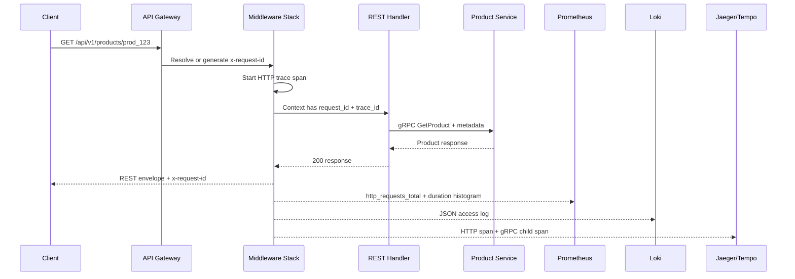

# 🚪 API Gateway Service - Task 7: Observability


## 📌 Task Summary

| Field | Detail |
|---|---|
| Task Name | Observability |
| Source | `docs/01-micro-tasks.md` → `API Gateway` → Task 7 |
| Goal | Request id, logs, metrics, traces har request me add karna |
| Priority | `P1` |
| Dependency | Platform Foundation logging/observability baseline |
| Output Type | Documentation-only implementation guide |
| Not Included | gRPC-Web bridge, new route contracts, auth/rate-limit/validation/error-mapping implementation, dashboards as actual JSON, Kubernetes manifests |

> **Simple Hinglish goal:** API Gateway se pass hone wali har request traceable honi chahiye. Client ko `request_id` mile, logs me same `request_id` and `trace_id` ho, Prometheus metrics request count/latency/error rate dikhaye, aur OpenTelemetry trace Gateway se downstream gRPC services tak continue ho. Production debugging me "ye request kahan slow/fail hui?" ka answer jaldi milna chahiye.

---

## ✅ Final Output Created

```text
TaskImplementation/
└── API Gateway Service/
    ├── task1.md
    ├── task2.md
    ├── task3.md
    ├── task4.md
    ├── task5.md
    ├── task6.md
    └── task7.md
```

### Why this structure?

| Path | Purpose |
|---|---|
| `TaskImplementation/` | Saare task-wise implementation guides ka central folder |
| `TaskImplementation/API Gateway Service/` | API Gateway service ke guides ka group |
| `task1.md` | Public REST route contract |
| `task2.md` | Gateway gRPC clients setup |
| `task3.md` | Auth middleware guide |
| `task4.md` | Redis rate limiting guide |
| `task5.md` | Request validation guide |
| `task6.md` | gRPC → REST error mapping guide |
| `task7.md` | Sirf **API Gateway Service - Task 7** ka observability guide |

> 🟢 **Scope rule:** Is task me actual `backend/services/api-gateway/` code create nahi kiya gaya. User request ka output sirf required folder structure aur `task7.md` content hai. Backend implementation ke exact files/code examples niche documented hain.

---

## 🧭 Documents Studied

| Document | Kya use kiya gaya |
|---|---|
| `docs/01-micro-tasks.md` | Task 7 exact scope: request id, logs, metrics, traces |
| `docs/02-system-architecture.md` | API Gateway public entry point hai; observability Gateway responsibility hai |
| `docs/03-folder-structure.md` | Gateway middleware order: Request ID → logging → metrics → tracing |
| `docs/04-microservice-design.md` | Gateway REST to gRPC bridge hai and business logic own nahi karta |
| `docs/12-logging-monitoring-scalability.md` | Required log fields, Prometheus metrics, OpenTelemetry traces, alerts |
| `docs/13-developer-guide.md` | Production readiness checklist: structured logs, metrics, traces |
| `TaskImplementation/Platform Foundation/task3.md` | Shared logger, tracing, request id, middleware baseline |
| `TaskImplementation/Platform Foundation/task5.md` | API Gateway base service observability hooks |
| `TaskImplementation/Platform Foundation/task6.md` | Full observability baseline: logs, metrics, traces, dashboards, alerts |
| `TaskImplementation/API Gateway Service/task2.md` | gRPC clients where trace/request metadata propagate hogi |
| `TaskImplementation/API Gateway Service/task3.md` | Auth context and safe user/session fields |
| `TaskImplementation/API Gateway Service/task4.md` | Rate-limit metrics and 429 signals |
| `TaskImplementation/API Gateway Service/task5.md` | Validation failures as observable 400 signals |
| `TaskImplementation/API Gateway Service/task6.md` | Error mapper fields: status, error code, gRPC code, downstream service |

---

## 🟦 Task 7 Boundary

### Included in Task 7

| Included | Explanation |
|---|---|
| Request ID middleware | Missing `x-request-id` generate karega, existing valid id preserve karega |
| Structured access logs | Har request complete hone par JSON log with route, status, latency, ids |
| Error logs | Task 6 mapped errors ko safe fields ke saath log karna |
| Prometheus metrics | Request count, latency, error count, gRPC client latency expose karna |
| OpenTelemetry traces | Incoming HTTP span and outbound gRPC child spans create karna |
| Context propagation | `x-request-id` and `traceparent` downstream services tak bhejna |
| `/metrics` endpoint | Prometheus scrape ke liye endpoint expose karna |
| Redaction rules | JWT, OTP, password, card data logs/traces me nahi jane dena |
| Debugging workflow | Request id → logs → trace → metrics correlation define karna |
| Test strategy | Middleware, metrics, trace propagation, redaction tests define karna |

### Not included in Task 7

| Not Included | Future Task / Owner |
|---|---|
| Public route definition changes | API Gateway Task 1 already covered |
| gRPC clients creation | API Gateway Task 2 |
| JWT/RBAC decisions | API Gateway Task 3 |
| Redis limiter algorithm | API Gateway Task 4 |
| DTO validation logic | API Gateway Task 5 |
| gRPC error mapping rules | API Gateway Task 6 |
| gRPC-Web bridge | API Gateway Task 8 |
| Actual Grafana dashboard JSON | Observability/DevOps implementation |
| Kubernetes `ServiceMonitor` / alerts deployment | Platform Foundation / K8s tasks |

> 🔴 **Important:** Observability debugging ke liye hai, data storage ke liye nahi. Full JWT, refresh token, OTP, passwords, payment card data, raw webhook secrets, ya large request/response bodies log nahi karne.

---

## 🧩 Observability Architecture

```mermaid
flowchart TB
    Client[React / External Client] -->|REST + optional x-request-id| Gateway[API Gateway]

    subgraph GatewayBox[API Gateway - Task 7 Scope]
        ReqID[Request ID Middleware]
        LogMW[Structured Logging Middleware]
        MetricMW[Prometheus Metrics Middleware]
        TraceMW[OpenTelemetry Tracing Middleware]
        Handler[REST Handler]
        GRPCClient[gRPC Client Interceptor]
        ErrorMapper[Task 6 Error Mapper]
    end

    Gateway --> ReqID --> LogMW --> MetricMW --> TraceMW --> Handler
    Handler --> GRPCClient
    Handler -.->|error| ErrorMapper

    GRPCClient -->|metadata: x-request-id + traceparent| Service[Internal gRPC Service]

    LogMW --> Logs[JSON stdout logs]
    MetricMW --> Metrics[/metrics endpoint]
    TraceMW --> Traces[OTLP traces]

    Logs --> Loki[Loki / log backend]
    Metrics --> Prom[Prometheus]
    Traces --> OTel[OpenTelemetry Collector]
    OTel --> Jaeger[Jaeger or Tempo]

    Prom --> Grafana[Grafana]
    Loki --> Grafana
    Jaeger --> Grafana
```

**Hinglish explanation:**  
Request Gateway me aate hi `request_id` attach hota hai. Logging, metrics, aur tracing middleware same request context use karte hain. Handler downstream gRPC service ko call karta hai to same `request_id` and trace context metadata ke through propagate hota hai. Later Grafana me metrics, Loki me logs, aur Jaeger/Tempo me trace same ids se correlate ho sakte hain.

---

## 🔁 Request Flow with Observability



**Debugging idea:** Agar user support ticket me `request_id=req_abc` deta hai, team Loki logs me same id search karegi, trace UI me `trace_id` dekhegi, aur Prometheus dashboard pe route latency/error rate confirm karegi.

---

## 🧱 Observability Data Contract

### Required log fields

| Field | Source | Example |
|---|---|---|
| `timestamp` | Logger | `2026-05-23T10:30:00Z` |
| `level` | Logger | `info`, `warn`, `error` |
| `service` | Config | `api-gateway` |
| `environment` | Config | `local`, `dev`, `staging`, `prod` |
| `request_id` | Request ID middleware | `req_01HXYZ` |
| `trace_id` | OpenTelemetry span | `4bf92f3577b34da6a3ce929d0e0e4736` |
| `span_id` | OpenTelemetry span | `00f067aa0ba902b7` |
| `method` | HTTP request | `GET` |
| `route` | Route template | `/api/v1/products/{product_id}` |
| `status` | Response recorder | `200` |
| `error_code` | Task 6 mapper | `NOT_FOUND` |
| `grpc_code` | gRPC status | `NotFound` |
| `downstream_service` | Handler/client | `product-service` |
| `latency_ms` | Middleware timer | `42` |
| `user_id_hash` | Auth context | `u_8f14e45f` |

### Required response/header behavior

| Item | Rule |
|---|---|
| Response header | `x-request-id` har response me return karo |
| Response body | Existing envelope me `request_id` include rahega |
| Trace headers | Incoming `traceparent` continue karo; missing ho to new trace start karo |
| Logs | One JSON object per event, stdout pe write karo |
| Metrics labels | Route template use karo, raw ids nahi |

---

## 🗂️ Clean Folder Structure

### Actual documentation output

```text
TaskImplementation/
└── API Gateway Service/
    ├── task1.md
    ├── task2.md
    ├── task3.md
    ├── task4.md
    ├── task5.md
    ├── task6.md
    └── task7.md
```

### Target backend implementation structure

Task 7 ke future backend implementation ke liye recommended structure:

```text
backend/
└── services/
    └── api-gateway/
        ├── go.mod
        ├── cmd/
        │   └── server/
        │       └── main.go
        └── internal/
            ├── observability/
            │   ├── config.go
            │   ├── request_id.go
            │   ├── logging.go
            │   ├── metrics.go
            │   ├── tracing.go
            │   ├── grpc_client_interceptor.go
            │   ├── status_recorder.go
            │   └── redaction.go
            ├── middleware/
            │   └── observability.go
            ├── routes/
            │   └── routes.go
            └── server/
                └── metrics_server.go
```

### Folder responsibility

| Path | Responsibility |
|---|---|
| `internal/observability/config.go` | Observability env vars load/validate |
| `internal/observability/request_id.go` | `x-request-id` generate, validate, context me store |
| `internal/observability/logging.go` | Access/error structured logs |
| `internal/observability/metrics.go` | Prometheus collectors and helper methods |
| `internal/observability/tracing.go` | OpenTelemetry provider and HTTP spans |
| `internal/observability/grpc_client_interceptor.go` | Outbound gRPC metrics/traces/log fields |
| `internal/observability/status_recorder.go` | HTTP status and response size capture |
| `internal/observability/redaction.go` | Sensitive fields mask/drop karna |
| `internal/middleware/observability.go` | Middleware chain wrapper |
| `internal/server/metrics_server.go` | `/metrics` endpoint expose karna |

> 🔵 **Design note:** Agar `backend/shared/logger`, `backend/shared/middleware`, `backend/shared/metrics`, ya `backend/shared/tracing` packages available hon, Gateway unko reuse karega. Gateway-specific route labels, downstream service labels, aur API error-code metrics `api-gateway/internal/observability/` me reh sakte hain.

---

## 🧰 External Libraries / Tools

| Tool / Library | What it is | Why used | Install / Use |
|---|---|---|---|
| Go standard library `net/http` | HTTP server toolkit | Middleware, headers, status recorder, `/metrics` route | Built-in |
| Go standard library `context` | Request-scoped values/deadlines | `request_id`, trace context, cancellation flow | Built-in |
| Go standard library `crypto/rand` | Secure random bytes | Safe request id generation | Built-in |
| Go standard library `crypto/sha256` | Hashing utility | `user_id_hash` create karne ke liye | Built-in |
| `go.uber.org/zap` | Fast structured logger | JSON logs with low overhead | `go get go.uber.org/zap` |
| `github.com/prometheus/client_golang` | Prometheus Go client | Counters, histograms, gauges define karne ke liye | `go get github.com/prometheus/client_golang/prometheus` |
| `promhttp` | Prometheus HTTP handler | `/metrics` endpoint serve karne ke liye | `go get github.com/prometheus/client_golang/prometheus/promhttp` |
| `go.opentelemetry.io/otel` | OpenTelemetry API | Traces, spans, context propagation | `go get go.opentelemetry.io/otel` |
| `go.opentelemetry.io/otel/sdk` | OpenTelemetry SDK | Tracer provider setup | `go get go.opentelemetry.io/otel/sdk` |
| `go.opentelemetry.io/otel/exporters/otlp/otlptrace` | OTLP trace exporter | Collector/Jaeger/Tempo ko traces bhejne ke liye | `go get go.opentelemetry.io/otel/exporters/otlp/otlptrace` |
| `go.opentelemetry.io/contrib/instrumentation/google.golang.org/grpc/otelgrpc` | gRPC instrumentation | Outbound gRPC trace propagation simplify karne ke liye | `go get go.opentelemetry.io/contrib/instrumentation/google.golang.org/grpc/otelgrpc` |
| Prometheus | Metrics scraper | Gateway `/metrics` scrape karega | Docker Compose service |
| Grafana | Dashboard UI | Metrics/logs/traces visualize karna | Docker Compose service |
| Loki | Log storage | JSON logs query karna | Docker Compose service |
| Jaeger/Tempo | Trace backend | Distributed traces inspect karna | Docker Compose service |
| OpenTelemetry Collector | Telemetry pipeline | Traces/logs/metrics collect and export karna | Docker Compose service |

### Install commands

```bash
cd backend/services/api-gateway

go get go.uber.org/zap
go get github.com/prometheus/client_golang/prometheus
go get github.com/prometheus/client_golang/prometheus/promhttp
go get go.opentelemetry.io/otel
go get go.opentelemetry.io/otel/sdk
go get go.opentelemetry.io/otel/exporters/otlp/otlptrace
go get go.opentelemetry.io/contrib/instrumentation/google.golang.org/grpc/otelgrpc
```

### Local tool usage

```bash
# Local stack future command
docker compose -f infra/compose/docker-compose.local.yml up -d

# Gateway metrics check
curl http://localhost:9090/metrics

# Sample request with known request id
curl -H "x-request-id: req_local_123" http://localhost:8080/api/v1/products
```

> 🟡 **Current task boundary:** Commands reference ke liye hain. Is task me dependencies install/run nahi ki gayi, kyunki requested output documentation-only guide hai.

---

## 🪜 Step-by-Step Implementation

## Step 1: Observability contract lock karo

Gateway ke liye contract ye rahega:

| Contract | Decision |
|---|---|
| Service name | `api-gateway` |
| Request id header | `x-request-id` |
| Trace propagation | W3C `traceparent` + `tracestate` |
| Log format | Structured JSON |
| Metrics format | Prometheus text exposition |
| Metrics path | `GET /metrics` |
| Trace exporter | OTLP to OpenTelemetry Collector |
| User field | Raw `user_id` nahi; hashed `user_id_hash` |
| Route labels | Template path, for example `/api/v1/products/{product_id}` |

**Explanation:**  
Contract fixed hone se logs, metrics, and traces same language bolte hain. Route template use karne se Prometheus cardinality safe rehti hai.

---

## Step 2: Observability config banao

Gateway startup pe observability config env vars se load hogi.

```go
package observability

type Config struct {
    ServiceName        string
    Environment        string
    LogLevel           string
    MetricsEnabled     bool
    MetricsPort        string
    TraceEnabled       bool
    TraceOTLPEndpoint  string
    TraceSampleRatio   float64
}

func DefaultConfig() Config {
    return Config{
        ServiceName:       "api-gateway",
        Environment:       "local",
        LogLevel:          "info",
        MetricsEnabled:    true,
        MetricsPort:       "9090",
        TraceEnabled:      true,
        TraceOTLPEndpoint: "otel-collector:4317",
        TraceSampleRatio:  1.0,
    }
}
```

### Example `.env`

```text
SERVICE_NAME=api-gateway
APP_ENV=local
LOG_LEVEL=info
METRICS_ENABLED=true
METRICS_PORT=9090
TRACE_ENABLED=true
TRACE_EXPORTER_OTLP_ENDPOINT=otel-collector:4317
TRACE_SAMPLE_RATIO=1.0
```

**Explanation:**  
Local me sampling `1.0` useful hai because har trace debug ho sakta hai. Production me high traffic ke liye `0.1` ya lower sampling use ho sakti hai.

---

## Step 3: Request ID middleware banao

Request id sabse pehle attach hona chahiye, taaki later middleware logs/errors me same id use kar sake.

```go
package observability

import (
    "context"
    "crypto/rand"
    "encoding/hex"
    "net/http"
    "regexp"
)

type requestIDKey struct{}

var validRequestID = regexp.MustCompile(`^[a-zA-Z0-9_:\-]{8,128}$`)

func RequestIDFromContext(ctx context.Context) string {
    id, _ := ctx.Value(requestIDKey{}).(string)
    return id
}

func WithRequestID(ctx context.Context, requestID string) context.Context {
    return context.WithValue(ctx, requestIDKey{}, requestID)
}

func RequestID(next http.Handler) http.Handler {
    return http.HandlerFunc(func(w http.ResponseWriter, r *http.Request) {
        requestID := r.Header.Get("x-request-id")
        if !validRequestID.MatchString(requestID) {
            requestID = newRequestID()
        }

        w.Header().Set("x-request-id", requestID)
        ctx := WithRequestID(r.Context(), requestID)
        next.ServeHTTP(w, r.WithContext(ctx))
    })
}

func newRequestID() string {
    b := make([]byte, 12)
    if _, err := rand.Read(b); err != nil {
        return "req_fallback"
    }
    return "req_" + hex.EncodeToString(b)
}
```

**Explanation:**  
Client ka request id valid ho to preserve karte hain. Invalid/missing ho to Gateway generate karta hai. Header and context dono me id set hota hai.

---

## Step 4: Status recorder banao

Logging and metrics ko final HTTP status and response size chahiye.

```go
package observability

import "net/http"

type StatusRecorder struct {
    http.ResponseWriter
    Status int
    Bytes  int
}

func NewStatusRecorder(w http.ResponseWriter) *StatusRecorder {
    return &StatusRecorder{ResponseWriter: w, Status: http.StatusOK}
}

func (r *StatusRecorder) WriteHeader(status int) {
    r.Status = status
    r.ResponseWriter.WriteHeader(status)
}

func (r *StatusRecorder) Write(b []byte) (int, error) {
    n, err := r.ResponseWriter.Write(b)
    r.Bytes += n
    return n, err
}
```

**Explanation:**  
Go `ResponseWriter` final status automatically expose nahi karta. Recorder wrap karke middleware accurate `status`, `bytes`, and `latency_ms` capture kar sakta hai.

---

## Step 5: Structured access logging add karo

Access log request complete hone ke baad one-line JSON event write karega.

```go
package observability

import (
    "context"
    "net/http"
    "time"
)

type Logger interface {
    Info(ctx context.Context, msg string, fields ...Field)
    Warn(ctx context.Context, msg string, fields ...Field)
    Error(ctx context.Context, msg string, fields ...Field)
}

type Field struct {
    Key   string
    Value any
}

func Logging(log Logger, serviceName string) func(http.Handler) http.Handler {
    return func(next http.Handler) http.Handler {
        return http.HandlerFunc(func(w http.ResponseWriter, r *http.Request) {
            started := time.Now()
            rec := NewStatusRecorder(w)

            next.ServeHTTP(rec, r)

            route := RouteTemplate(r)
            fields := []Field{
                {Key: "service", Value: serviceName},
                {Key: "request_id", Value: RequestIDFromContext(r.Context())},
                {Key: "method", Value: r.Method},
                {Key: "route", Value: route},
                {Key: "status", Value: rec.Status},
                {Key: "response_bytes", Value: rec.Bytes},
                {Key: "latency_ms", Value: time.Since(started).Milliseconds()},
            }

            if rec.Status >= 500 {
                log.Error(r.Context(), "http request failed", fields...)
                return
            }
            if rec.Status >= 400 {
                log.Warn(r.Context(), "http request rejected", fields...)
                return
            }
            log.Info(r.Context(), "http request completed", fields...)
        })
    }
}
```

**Explanation:**  
2xx/3xx success `info`, 4xx client/auth/validation issue `warn`, 5xx service/runtime issue `error`. Raw request body log nahi hoti.

---

## Step 6: Error mapper ke fields logs me connect karo

Task 6 mapped error already `status`, `error_code`, `grpc_code`, `downstream_service`, and internal error source preserve kar sakta hai. Task 7 ka kaam un fields ko safe log fields me add karna hai.

```go
log.Error(ctx, "gateway request failed",
    Field{Key: "request_id", Value: RequestIDFromContext(ctx)},
    Field{Key: "route", Value: route},
    Field{Key: "status", Value: mapped.Status},
    Field{Key: "error_code", Value: mapped.Code},
    Field{Key: "grpc_code", Value: mapped.GRPCCode},
    Field{Key: "downstream_service", Value: mapped.DownstreamService},
)
```

**Explanation:**  
Client ko safe error envelope milta hai. Internal raw error client ko nahi dikhta, but logs me enough safe debugging context hota hai.

---

## Step 7: Prometheus metrics define karo

Gateway ko HTTP and outbound gRPC dono metrics chahiye.

```go
package observability

import (
    "net/http"
    "strconv"
    "time"

    "github.com/prometheus/client_golang/prometheus"
    "github.com/prometheus/client_golang/prometheus/promhttp"
)

var HTTPRequestsTotal = prometheus.NewCounterVec(
    prometheus.CounterOpts{
        Name: "http_requests_total",
        Help: "Total HTTP requests handled by the gateway.",
    },
    []string{"service", "method", "route", "status_code", "error_code"},
)

var HTTPRequestDuration = prometheus.NewHistogramVec(
    prometheus.HistogramOpts{
        Name:    "http_request_duration_seconds",
        Help:    "HTTP request duration in seconds.",
        Buckets: prometheus.DefBuckets,
    },
    []string{"service", "method", "route"},
)

var GRPCClientRequestsTotal = prometheus.NewCounterVec(
    prometheus.CounterOpts{
        Name: "grpc_client_requests_total",
        Help: "Total outbound gRPC requests from the gateway.",
    },
    []string{"service", "target_service", "grpc_method", "grpc_code"},
)

var GRPCClientDuration = prometheus.NewHistogramVec(
    prometheus.HistogramOpts{
        Name:    "grpc_client_duration_seconds",
        Help:    "Outbound gRPC request duration in seconds.",
        Buckets: prometheus.DefBuckets,
    },
    []string{"service", "target_service", "grpc_method"},
)

func RegisterMetrics(reg *prometheus.Registry) {
    reg.MustRegister(
        HTTPRequestsTotal,
        HTTPRequestDuration,
        GRPCClientRequestsTotal,
        GRPCClientDuration,
    )
}

func MetricsHandler(reg *prometheus.Registry) http.Handler {
    return promhttp.HandlerFor(reg, promhttp.HandlerOpts{})
}

func ObserveHTTP(service, method, route string, status int, errorCode string, started time.Time) {
    HTTPRequestsTotal.WithLabelValues(
        service,
        method,
        route,
        strconv.Itoa(status),
        emptyToNone(errorCode),
    ).Inc()

    HTTPRequestDuration.WithLabelValues(service, method, route).
        Observe(time.Since(started).Seconds())
}

func emptyToNone(value string) string {
    if value == "" {
        return "none"
    }
    return value
}
```

**Explanation:**  
`route` label template hona chahiye, raw URL nahi. Example: `/api/v1/products/{product_id}` good hai, `/api/v1/products/prod_123` bad hai because product ids unlimited labels create karenge.

---

## Step 8: Metrics middleware add karo

Metrics middleware request count and duration observe karega.

```go
func Metrics(serviceName string) func(http.Handler) http.Handler {
    return func(next http.Handler) http.Handler {
        return http.HandlerFunc(func(w http.ResponseWriter, r *http.Request) {
            started := time.Now()
            rec := NewStatusRecorder(w)

            next.ServeHTTP(rec, r)

            route := RouteTemplate(r)
            errorCode := ErrorCodeFromContext(r.Context())
            ObserveHTTP(serviceName, r.Method, route, rec.Status, errorCode, started)
        })
    }
}
```

**Explanation:**  
Task 6 error writer context me `error_code` set kar sakta hai. Success requests me `error_code=none` rahega. Dashboard me route-wise 4xx/5xx easily visible honge.

---

## Step 9: OpenTelemetry tracing initialize karo

Gateway startup pe tracer provider initialize hoga.

```go
package observability

import (
    "context"

    "go.opentelemetry.io/otel"
    "go.opentelemetry.io/otel/exporters/otlp/otlptrace/otlptracegrpc"
    "go.opentelemetry.io/otel/propagation"
    "go.opentelemetry.io/otel/sdk/resource"
    sdktrace "go.opentelemetry.io/otel/sdk/trace"
    semconv "go.opentelemetry.io/otel/semconv/v1.26.0"
)

func InitTracing(ctx context.Context, cfg Config) (*sdktrace.TracerProvider, error) {
    exporter, err := otlptracegrpc.New(
        ctx,
        otlptracegrpc.WithEndpoint(cfg.TraceOTLPEndpoint),
        otlptracegrpc.WithInsecure(),
    )
    if err != nil {
        return nil, err
    }

    res, err := resource.New(ctx,
        resource.WithAttributes(
            semconv.ServiceName(cfg.ServiceName),
            semconv.DeploymentEnvironment(cfg.Environment),
        ),
    )
    if err != nil {
        return nil, err
    }

    provider := sdktrace.NewTracerProvider(
        sdktrace.WithResource(res),
        sdktrace.WithSampler(sdktrace.ParentBased(sdktrace.TraceIDRatioBased(cfg.TraceSampleRatio))),
        sdktrace.WithBatcher(exporter),
    )

    otel.SetTracerProvider(provider)
    otel.SetTextMapPropagator(propagation.NewCompositeTextMapPropagator(
        propagation.TraceContext{},
        propagation.Baggage{},
    ))

    return provider, nil
}
```

**Explanation:**  
`TraceContext` incoming browser/proxy trace ko continue karta hai. `ParentBased` sampler existing sampled traces ko respect karta hai.

---

## Step 10: HTTP tracing middleware add karo

Tracing middleware incoming request ke liye root/server span create karega.

```go
func Tracing(serviceName string) func(http.Handler) http.Handler {
    tracer := otel.Tracer(serviceName)

    return func(next http.Handler) http.Handler {
        return http.HandlerFunc(func(w http.ResponseWriter, r *http.Request) {
            ctx := otel.GetTextMapPropagator().Extract(r.Context(), propagation.HeaderCarrier(r.Header))
            route := RouteTemplate(r)

            ctx, span := tracer.Start(ctx, r.Method+" "+route)
            defer span.End()

            span.SetAttributes(
                attribute.String("http.method", r.Method),
                attribute.String("http.route", route),
                attribute.String("request_id", RequestIDFromContext(r.Context())),
            )

            rec := NewStatusRecorder(w)
            next.ServeHTTP(rec, r.WithContext(ctx))

            span.SetAttributes(attribute.Int("http.status_code", rec.Status))
            if rec.Status >= 500 {
                span.SetStatus(codes.Error, "gateway error")
            }
        })
    }
}
```

**Explanation:**  
Trace span route, status, and request id carry karta hai. Span name route template pe based hai, isliye trace UI readable rahega.

---

## Step 11: Outbound gRPC observability add karo

Gateway Task 2 me gRPC clients setup hue. Task 7 me outbound gRPC calls ko metrics and traces ke saath wrap karna hai.

```go
func UnaryClientObservability(serviceName, targetService string) grpc.UnaryClientInterceptor {
    tracer := otel.Tracer(serviceName)

    return func(
        ctx context.Context,
        method string,
        req any,
        reply any,
        cc *grpc.ClientConn,
        invoker grpc.UnaryInvoker,
        opts ...grpc.CallOption,
    ) error {
        started := time.Now()

        ctx, span := tracer.Start(ctx, "grpc "+method)
        defer span.End()

        md, _ := metadata.FromOutgoingContext(ctx)
        md = md.Copy()
        if requestID := RequestIDFromContext(ctx); requestID != "" {
            md.Set("x-request-id", requestID)
        }
        otel.GetTextMapPropagator().Inject(ctx, MetadataCarrier{MD: md})
        ctx = metadata.NewOutgoingContext(ctx, md)

        err := invoker(ctx, method, req, reply, cc, opts...)
        code := status.Code(err).String()

        GRPCClientRequestsTotal.WithLabelValues(serviceName, targetService, method, code).Inc()
        GRPCClientDuration.WithLabelValues(serviceName, targetService, method).
            Observe(time.Since(started).Seconds())

        span.SetAttributes(
            attribute.String("rpc.system", "grpc"),
            attribute.String("rpc.method", method),
            attribute.String("rpc.grpc.status_code", code),
            attribute.String("downstream_service", targetService),
        )
        if err != nil {
            span.RecordError(err)
            span.SetStatus(codes.Error, code)
        }

        return err
    }
}
```

**Explanation:**  
Gateway outbound call ko child span milta hai. Agar Product Service slow hai, trace me clearly dikhega ki Gateway handler fast tha but `ProductService.GetProduct` slow tha.

---

## Step 12: Metadata carrier helper banao

OpenTelemetry propagation ko gRPC metadata me inject/extract karne ke liye carrier helper useful hai.

```go
type MetadataCarrier struct {
    MD metadata.MD
}

func (c MetadataCarrier) Get(key string) string {
    values := c.MD.Get(key)
    if len(values) == 0 {
        return ""
    }
    return values[0]
}

func (c MetadataCarrier) Set(key, value string) {
    c.MD.Set(key, value)
}

func (c MetadataCarrier) Keys() []string {
    keys := make([]string, 0, len(c.MD))
    for key := range c.MD {
        keys = append(keys, key)
    }
    return keys
}
```

**Explanation:**  
HTTP headers and gRPC metadata alag types hain. Carrier helper OpenTelemetry ko common interface deta hai.

---

## Step 13: Middleware order final karo

`docs/03-folder-structure.md` ke according Gateway order:

| Order | Middleware | Task 7 role |
|---:|---|---|
| 1 | Request ID | Generate/preserve `x-request-id` |
| 2 | Real IP / forwarded headers | Logs/rate-limit ke liye correct client IP |
| 3 | Panic recovery | Panic ko safe error and error log me convert |
| 4 | Structured logging | Access/error logs |
| 5 | Metrics | Counters/histograms |
| 6 | Tracing | HTTP span and propagation |
| 7 | CORS | Browser preflight |
| 8 | Rate limiting | Task 4 counters, 429 signals |
| 9 | Authentication | Task 3 auth failures, user hash field |
| 10 | RBAC | Forbidden metrics/logs |
| 11 | Request validation | Task 5 validation metrics/logs |

### Router integration example

```go
r := chi.NewRouter()

r.Use(observability.RequestID)
r.Use(realip.Middleware)
r.Use(middleware.Recoverer)
r.Use(observability.Logging(log, "api-gateway"))
r.Use(observability.Metrics("api-gateway"))
r.Use(observability.Tracing("api-gateway"))
r.Use(cors.Handler(corsOptions))
r.Use(rateLimitMiddleware)
r.Use(authMiddleware)
r.Use(rbacMiddleware)
r.Use(validationMiddleware)
```

**Explanation:**  
Request ID first hai because baaki sab middleware ko id chahiye. Logging/metrics/tracing early hain taaki auth/validation/rate-limit failures bhi visible rahen.

---

## Step 14: `/metrics` endpoint expose karo

Prometheus scrape ke liye Gateway metrics endpoint separate port pe expose kar sakta hai.

```go
func StartMetricsServer(addr string, reg *prometheus.Registry, log Logger) *http.Server {
    mux := http.NewServeMux()
    mux.Handle("/metrics", MetricsHandler(reg))

    srv := &http.Server{
        Addr:    addr,
        Handler: mux,
    }

    go func() {
        if err := srv.ListenAndServe(); err != nil && err != http.ErrServerClosed {
            log.Error(context.Background(), "metrics server failed", Field{Key: "error", Value: err.Error()})
        }
    }()

    return srv
}
```

**Explanation:**  
Main API port aur metrics port separate rakhna production me common hai. Kubernetes/Prometheus only metrics port scrape karega.

---

## Step 15: Startup wiring karo

Main startup me logger, metrics registry, tracing provider, router, and metrics server initialize honge.

```go
func main() {
    ctx := context.Background()
    cfg := observability.DefaultConfig()

    log := logger.NewZapLogger(cfg.ServiceName, cfg.Environment, cfg.LogLevel)

    tracerProvider, err := observability.InitTracing(ctx, cfg)
    if err != nil {
        log.Warn(ctx, "tracing disabled", logger.Field{Key: "error", Value: err.Error()})
    }
    if tracerProvider != nil {
        defer tracerProvider.Shutdown(ctx)
    }

    registry := prometheus.NewRegistry()
    observability.RegisterMetrics(registry)

    metricsServer := observability.StartMetricsServer(":"+cfg.MetricsPort, registry, log)
    defer metricsServer.Shutdown(ctx)

    router := routes.New(routes.Dependencies{
        Logger:          log,
        MetricsRegistry: registry,
    })

    server.Start(ctx, router)
}
```

**Explanation:**  
Startup fail-fast config validate karega. Tracing backend down ho to local dev me Gateway completely fail karna zaruri nahi; production policy stricter ho sakti hai.

---

## Step 16: Redaction and privacy rules add karo

Observability fields me sensitive data nahi jana chahiye.

| Data | Logs? | Metrics? | Traces? | Rule |
|---|---:|---:|---:|---|
| Password | ❌ | ❌ | ❌ | Never |
| OTP | ❌ | ❌ | ❌ | Never |
| Full JWT | ❌ | ❌ | ❌ | Never |
| Refresh token | ❌ | ❌ | ❌ | Never |
| Card/CVV | ❌ | ❌ | ❌ | Never |
| Email/phone | ⚠️ | ❌ | ⚠️ | Mask/hash only |
| User id | ⚠️ | ❌ | ⚠️ | Hash before logging |
| Product/order id | ⚠️ | ❌ | ⚠️ | Logs okay if needed; metrics labels nahi |
| Request body | ❌ | ❌ | ❌ | Default no body logging |

### User hash example

```go
func HashUserID(userID, salt string) string {
    sum := sha256.Sum256([]byte(salt + ":" + userID))
    return "u_" + hex.EncodeToString(sum[:])[:12]
}
```

**Explanation:**  
Hash stable hota hai, isliye logs me same user ke requests correlate ho sakte hain. Raw user id expose nahi hota.

---

## Step 17: Gateway-specific metrics define karo

Common HTTP/gRPC metrics ke saath Gateway-specific signals useful hain.

| Metric | Type | Labels | Source |
|---|---|---|---|
| `gateway_rate_limited_total` | Counter | `route`, `limit_type` | Task 4 limiter |
| `gateway_auth_failures_total` | Counter | `route`, `reason` | Task 3 auth |
| `gateway_validation_failures_total` | Counter | `route`, `field_group` | Task 5 validation |
| `gateway_downstream_errors_total` | Counter | `target_service`, `grpc_code` | Task 6 mapper |
| `gateway_inflight_requests` | Gauge | `route` | Middleware |

**Explanation:**  
Ye metrics production debugging me high-signal hoti hain. Example: login failures spike, search route rate-limited spike, ya product-service `Unavailable` spike.

---

## Step 18: Dashboard starter panels define karo

Actual Grafana JSON Task 7 me create nahi hoga, but panels ka blueprint ready rahega.

| Panel | Query idea |
|---|---|
| Gateway RPS by route | `sum(rate(http_requests_total{service="api-gateway"}[5m])) by (route)` |
| Gateway 5xx rate | `sum(rate(http_requests_total{service="api-gateway",status_code=~"5.."}[5m])) / sum(rate(http_requests_total{service="api-gateway"}[5m]))` |
| Gateway p95 latency | `histogram_quantile(0.95, sum(rate(http_request_duration_seconds_bucket{service="api-gateway"}[5m])) by (le, route))` |
| Downstream gRPC p95 | `histogram_quantile(0.95, sum(rate(grpc_client_duration_seconds_bucket{service="api-gateway"}[5m])) by (le, target_service, grpc_method))` |
| Rate-limited requests | `sum(rate(gateway_rate_limited_total[5m])) by (route)` |
| Auth failures | `sum(rate(gateway_auth_failures_total[5m])) by (route, reason)` |
| Validation failures | `sum(rate(gateway_validation_failures_total[5m])) by (route)` |
| Downstream errors | `sum(rate(gateway_downstream_errors_total[5m])) by (target_service, grpc_code)` |

---

## Step 19: Alert rules define karo

```yaml
groups:
  - name: api-gateway.rules
    rules:
      - alert: GatewayHigh5xxRate
        expr: |
          sum(rate(http_requests_total{service="api-gateway",status_code=~"5.."}[5m]))
          /
          sum(rate(http_requests_total{service="api-gateway"}[5m]))
          > 0.02
        for: 5m
        labels:
          severity: critical
        annotations:
          summary: "API Gateway 5xx rate is above 2%"
          description: "Check Gateway logs and traces using request_id and trace_id."

      - alert: GatewayHighP95Latency
        expr: |
          histogram_quantile(
            0.95,
            sum(rate(http_request_duration_seconds_bucket{service="api-gateway"}[5m])) by (le)
          ) > 1.5
        for: 5m
        labels:
          severity: warning
        annotations:
          summary: "API Gateway p95 latency is high"
          description: "Open Gateway dashboard, then inspect slow traces by route."
```

**Explanation:**  
Alerts me next action mention hona chahiye. Engineer ko pata chale ki logs, traces, ya downstream dependency health kahan check karni hai.

---

## Step 20: Local verification flow

Future implementation ke baad ye checks run karne chahiye:

```bash
# 1. Local stack start
docker compose -f infra/compose/docker-compose.local.yml up -d

# 2. Gateway run
cd backend/services/api-gateway
go run ./cmd/server

# 3. Health check
curl http://localhost:8080/health/live
curl http://localhost:8080/health/ready

# 4. Metrics check
curl http://localhost:9090/metrics

# 5. Request id check
curl -i -H "x-request-id: req_local_123" http://localhost:8080/api/v1/products

# 6. Prometheus target check
curl http://localhost:9090/metrics | grep http_requests_total
```

### Expected results

| Check | Expected |
|---|---|
| Response header | `x-request-id: req_local_123` |
| Response body | JSON envelope me same `request_id` |
| Logs | One JSON access log with route/status/latency |
| Metrics | `http_requests_total` increment |
| Trace UI | HTTP span visible, downstream gRPC span if handler called service |

---

## 🧪 Test Strategy

| Test | What to verify |
|---|---|
| Request ID missing | Gateway generated id starts with `req_` and response header set hai |
| Request ID present | Valid incoming id preserve hota hai |
| Invalid request id | Unsafe/too-long id replace hota hai |
| Logging middleware | Status, route, method, latency fields present hain |
| Metrics middleware | Counter increment and histogram observe hota hai |
| Route template labels | Raw product/order/user ids metric labels me nahi aate |
| Trace middleware | Span route/status attributes ke saath create hota hai |
| gRPC interceptor | `x-request-id` and `traceparent` metadata propagate hota hai |
| Error mapping integration | `error_code` metrics/logs me set hota hai |
| Redaction | Authorization header, JWT, password, OTP logs/traces me absent hain |

### Request ID middleware test example

```go
func TestRequestIDPreservesValidIncomingID(t *testing.T) {
    handler := observability.RequestID(http.HandlerFunc(func(w http.ResponseWriter, r *http.Request) {
        got := observability.RequestIDFromContext(r.Context())
        if got != "req_test_123" {
            t.Fatalf("request id = %q", got)
        }
    }))

    req := httptest.NewRequest(http.MethodGet, "/api/v1/products", nil)
    req.Header.Set("x-request-id", "req_test_123")
    rec := httptest.NewRecorder()

    handler.ServeHTTP(rec, req)

    if rec.Header().Get("x-request-id") != "req_test_123" {
        t.Fatalf("response request id missing")
    }
}
```

---

## 🧯 Common Mistakes and Fixes

| Problem | Likely Cause | Fix |
|---|---|---|
| Logs missing `request_id` | Request ID middleware not first | Put Request ID at middleware order `1` |
| Logs missing `trace_id` | Tracing not initialized or context overwritten | Initialize OTel before router and pass request context |
| Prometheus has too many series | Raw path or ids used as labels | Use route templates only |
| Trace stops at Gateway | gRPC metadata propagation missing | Inject `traceparent` into outgoing metadata |
| 4xx not visible in metrics | Metrics middleware after auth/validation | Put metrics before auth/rate-limit/validation |
| Secrets appear in logs | Raw headers/body logged | Redact headers and avoid body logging |
| `/metrics` unavailable | Metrics server not started or wrong port | Check `METRICS_PORT` and server startup |
| Error visible in logs but not metrics | Error code not added to context | Task 6 writer should set `error_code` in context |

---

## ✅ Definition of Done

| Requirement | Status |
|---|---|
| `TaskImplementation/` folder exists | ✅ Done |
| `TaskImplementation/API Gateway Service/` folder exists | ✅ Done |
| `task7.md` created | ✅ Done |
| Task 7 scope documented only | ✅ Done |
| Step-by-step Hinglish implementation included | ✅ Done |
| External tools/libraries explained | ✅ Done |
| Clean folder structure included | ✅ Done |
| Code examples included | ✅ Done |
| Mermaid architecture/flow diagrams included | ✅ Done |
| Redaction/security rules included | ✅ Done |
| Testing and verification strategy included | ✅ Done |

---

## 🚫 Out of Scope for Task 7

- Actual backend code file creation
- New REST endpoints or route mappings
- JWT verification/RBAC implementation
- Redis rate limiter implementation
- Request validation implementation
- Error mapping implementation changes
- gRPC-Web bridge or Envoy config
- Real Grafana dashboard JSON or Prometheus alert deployment
- Kubernetes manifests or production rollout

> 🔴 **Reason:** User ne specifically required folder structure aur `task7.md` content generate karne ko bola. API Gateway Service Task 7 ka documentation scope observability wiring guide tak limited rakha gaya.

---

## ✅ Final Task 7 Standard

API Gateway Service Task 7 ke liye observability guide ready hai:

- Har request ke paas stable `request_id` hoga.
- Logs structured JSON honge with route, status, latency, request id, trace id, and safe error fields.
- Prometheus metrics route-wise request count, latency, and error signals expose karenge.
- OpenTelemetry traces Gateway se downstream gRPC services tak propagate honge.
- Sensitive data logs/metrics/traces me leak nahi hoga.
- Debugging flow clear hai: `request_id` se logs, `trace_id` se trace, metrics se aggregate health.

> 🟢 **Final outcome:** Task 7 ke baad API Gateway production debugging ke liye ready design rakhta hai. Next API Gateway Task 8 me gRPC-Web bridge configure kiya ja sakta hai, without changing this observability contract.
