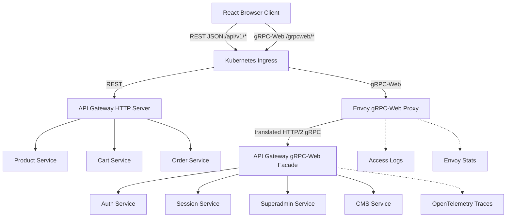
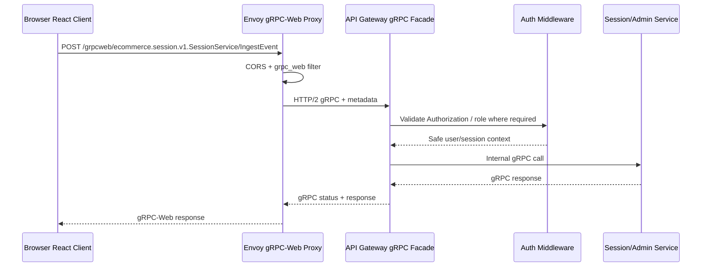
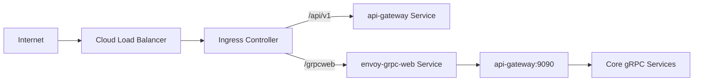

# 🚪 API Gateway Service - Task 8: gRPC-Web Bridge


## 📌 Task Summary

| Field | Detail |
|---|---|
| Task Name | gRPC-Web bridge |
| Source | `docs/01-micro-tasks.md` → `API Gateway` → Task 8 |
| Goal | Browser clients ke liye Envoy ya gateway bridge configure karna |
| Priority | `P2` |
| Dependency | Frontend |
| Output Type | Documentation-only implementation guide |
| Not Included | New business APIs, new proto contracts, frontend screens, service implementation, production Kubernetes rollout |

> **Simple Hinglish goal:** Browser directly native gRPC HTTP/2 call nahi kar sakta in normal frontend setup. Isliye API Gateway layer ke paas ek **gRPC-Web bridge** chahiye jo browser ke gRPC-Web requests ko internal gRPC calls me translate kare. Recommended approach: **Envoy gRPC-Web proxy**. Optional fallback: Gateway ke andar gRPC-Web compatible bridge. Isse selected analytics/admin/typed APIs browser se strongly typed clients ke through call ho sakenge.

---

## ✅ Final Output Created

```text
TaskImplementation/
└── API Gateway Service/
    ├── task1.md
    ├── task2.md
    ├── task3.md
    ├── task4.md
    ├── task5.md
    ├── task6.md
    ├── task7.md
    └── task8.md
```

### Why this structure?

| Path | Purpose |
|---|---|
| `TaskImplementation/` | Saare task-wise implementation guides ka central folder |
| `TaskImplementation/API Gateway Service/` | API Gateway service ke guides ka group |
| `task1.md` | Public REST route contract |
| `task2.md` | Gateway gRPC clients setup |
| `task3.md` | Auth middleware guide |
| `task4.md` | Redis rate limiting guide |
| `task5.md` | Request validation guide |
| `task6.md` | gRPC → REST error mapping guide |
| `task7.md` | Observability guide |
| `task8.md` | Sirf **API Gateway Service - Task 8** ka gRPC-Web bridge guide |

> 🟢 **Scope rule:** Is task me actual `backend/services/api-gateway/`, `infra/`, ya `frontend/` code create nahi kiya gaya. User request ka output sirf required folder structure aur `task8.md` content hai. Real implementation ke target files/config examples niche documented hain.

---

## 🧭 Documents Studied

| Document | Kya use kiya gaya |
|---|---|
| `docs/01-micro-tasks.md` | Task 8 exact scope: browser clients ke liye Envoy or gateway bridge |
| `docs/02-system-architecture.md` | Ingress → API Gateway and Ingress → Envoy gRPC-Web proxy architecture |
| `docs/03-folder-structure.md` | Proto generated TS clients location and Gateway middleware order |
| `docs/04-microservice-design.md` | Gateway public entry point hai; business logic service-owned rahegi |
| `docs/10-frontend-implementation.md` | gRPC-Web selected typed analytics/admin calls ke liye use hoga |
| `docs/11-devops-external-services.md` | Docker/Kubernetes service discovery patterns |
| `docs/13-developer-guide.md` | Buf generate, REST/gRPC development flow, production readiness |
| `api/master-api.json` | Project API style: REST through Gateway, internal gRPC, browser typed API through gRPC-Web |
| `TaskImplementation/Platform Foundation/task2.md` | Proto strategy and TypeScript generated client output |
| `TaskImplementation/Platform Foundation/task5.md` | API Gateway base and bridge responsibility context |
| `TaskImplementation/Platform Foundation/task8.md` | Edge namespace and future Envoy deployment shape |
| `TaskImplementation/API Gateway Service/task2.md` | Gateway downstream gRPC clients and metadata propagation |
| `TaskImplementation/API Gateway Service/task3.md` | Auth context/JWT metadata behavior |
| `TaskImplementation/API Gateway Service/task6.md` | gRPC errors should still become safe client errors |
| `TaskImplementation/API Gateway Service/task7.md` | Request id, logs, metrics, traces propagation through bridge |

---

## 🟦 Task 8 Boundary

### Included in Task 8

| Included | Explanation |
|---|---|
| Bridge decision | Envoy gRPC-Web proxy recommended; in-Gateway bridge fallback documented |
| Browser request path | Browser gRPC-Web request ko Envoy receive karega |
| Envoy translation | Envoy gRPC-Web/HTTP1.1 request ko internal HTTP/2 gRPC me convert karega |
| Upstream routing | Envoy API Gateway ke gRPC endpoint ya selected allowed gRPC services ko route karega |
| CORS for gRPC-Web | Browser preflight and allowed headers configure karna |
| Auth header forwarding | `Authorization`, `x-request-id`, `traceparent` safe forward karna |
| Proto TypeScript client strategy | Buf generated TS clients frontend package me use honge |
| Observability continuity | Request id and trace headers bridge se downstream propagate honge |
| Security allowlist | Sirf approved typed APIs expose honge; internal services open nahi honge |
| Testing strategy | Envoy config, frontend client, CORS, auth, and error scenarios verify karna |

### Not included in Task 8

| Not Included | Owner / Future Task |
|---|---|
| New proto messages/services | Platform Foundation proto task or service-specific tasks |
| Existing REST route changes | API Gateway Task 1 |
| Downstream gRPC client registry | API Gateway Task 2 |
| JWT/RBAC implementation | API Gateway Task 3 |
| Redis rate limiting | API Gateway Task 4 |
| Request DTO validation | API Gateway Task 5 |
| gRPC → REST error mapping for REST endpoints | API Gateway Task 6 |
| Logs/metrics/traces baseline | API Gateway Task 7 |
| Frontend screens/hooks full implementation | User App / Dashboard frontend tasks |
| Production Helm/Kubernetes rollout | Platform/DevOps tasks |

> 🔴 **Important:** gRPC-Web bridge ka matlab ye nahi ki saare internal gRPC services public ho gaye. Bridge ke through sirf **explicit allowlisted typed browser APIs** expose karne hain.

---

## 🧩 Recommended Architecture



**Hinglish explanation:**  
Normal public APIs REST rahenge through API Gateway. Selected typed browser APIs `/grpcweb/*` path pe jayenge. Ingress ye traffic Envoy ko bhejega. Envoy `grpc_web` filter se browser format ko internal gRPC format me convert karega. Recommended safe design me Envoy mostly **API Gateway gRPC facade** ko call karega, direct internal services ko nahi. Gateway phir auth/RBAC/context rules apply karke downstream services ko call karega.

---

## 🔁 Request Flow



**Flow ka simple meaning:**  
Browser generated TypeScript client se typed request bhejta hai. Envoy usko translate karta hai. Gateway facade request ko same project security model ke through pass karta hai. Service response typed format me browser tak wapas aata hai.

---

## 🧠 Decision: Envoy First, Gateway Bridge Fallback

| Option | Use | Pros | Cons | Decision |
|---|---|---|---|---|
| Envoy gRPC-Web proxy | Recommended default | Mature, battle-tested, browser CORS/filter support, Gateway code simple | Extra proxy config/deploy manage karna padega | ✅ Primary |
| Gateway in-process bridge | Fallback/local/simple deployments | Fewer infra components | Gateway code me proxy concerns mix ho sakte hain | 🟡 Optional |
| Direct browser to internal services | Avoid | Low Gateway load | Security boundary weak, internal APIs expose ho sakti hain | 🔴 Not recommended |

> 🟢 **Project decision:** Task 8 me primary pattern **Ingress → Envoy → API Gateway gRPC facade → services** rahega.

---

## 🗂️ Clean Folder Structure

### Actual documentation output

```text
TaskImplementation/
└── API Gateway Service/
    ├── task1.md
    ├── task2.md
    ├── task3.md
    ├── task4.md
    ├── task5.md
    ├── task6.md
    ├── task7.md
    └── task8.md
```

### Target future implementation structure

```text
infra/
├── envoy/
│   └── grpc-web/
│       ├── envoy.yaml
│       └── README.md
├── compose/
│   └── docker-compose.local.yml
└── k8s/
    └── base/
        └── edge/
            ├── envoy-grpc-web-configmap.yaml
            ├── envoy-grpc-web-deployment.yaml
            ├── envoy-grpc-web-service.yaml
            └── grpc-web-ingress.yaml

backend/
└── services/
    └── api-gateway/
        └── internal/
            ├── transport/
            │   └── grpcweb/
            │       ├── server.go
            │       ├── routes.go
            │       └── auth_interceptor.go
            └── config/
                └── grpcweb.go

frontend/
└── packages/
    └── proto-client/
        └── src/
            ├── grpc-web.ts
            └── gen/
```

### Folder responsibility

| Path | Responsibility |
|---|---|
| `infra/envoy/grpc-web/envoy.yaml` | Local/dev Envoy gRPC-Web proxy config |
| `infra/k8s/base/edge/*` | Future Kubernetes Envoy deployment/service/ingress templates |
| `backend/services/api-gateway/internal/transport/grpcweb/` | Optional Gateway gRPC facade or bridge handlers |
| `frontend/packages/proto-client/src/grpc-web.ts` | Browser gRPC-Web transport/client setup |
| `frontend/packages/proto-client/src/gen/` | Buf generated TypeScript protobuf code |

> 🔵 **Beginner tip:** Envoy ko translator samjho. Browser gRPC-Web bolta hai, internal services normal gRPC bolti hain. Envoy dono language ke beech adapter ka kaam karta hai.

---

## 🧰 External Libraries / Tools

Task 8 me actual install nahi kiya gaya. Future implementation ke liye required/recommended tools:

| Tool / Library | What it is | Why used | Install / Use |
|---|---|---|---|
| Envoy Proxy | L7 proxy with `grpc_web` filter | Browser gRPC-Web ko internal gRPC me translate karne ke liye | Docker image `envoyproxy/envoy` ya Kubernetes Deployment |
| gRPC-Web | Browser-compatible gRPC protocol | Browser se typed protobuf APIs call karne ke liye | Envoy filter + TS client transport |
| Buf CLI | Proto generation/linting tool | Go/TS generated clients consistent rakhne ke liye | `brew install bufbuild/buf/buf`, then `buf generate` |
| Buf ES plugin | TypeScript protobuf code generator | Frontend proto types generate karne ke liye | `buf.gen.yaml` remote plugin `buf.build/bufbuild/es` |
| Connect-ES transport or gRPC-Web client lib | Browser client transport | Generated TS client se HTTP calls perform karne ke liye | Example: `pnpm add @connectrpc/connect @connectrpc/connect-web` |
| Go gRPC | Gateway facade and internal service RPC | API Gateway typed gRPC endpoint expose/call karega | `go get google.golang.org/grpc` |
| OpenTelemetry | Trace propagation | gRPC-Web → Gateway → service trace continuity ke liye | Already covered by Task 7 strategy |

### Install examples

```bash
# Proto tooling
brew install bufbuild/buf/buf

# Frontend transport package example
cd frontend
pnpm add @connectrpc/connect @connectrpc/connect-web

# Gateway gRPC runtime, if not already installed
cd backend/services/api-gateway
go get google.golang.org/grpc
```

### Envoy local run example

```bash
docker run --rm \
  -p 8081:8081 \
  -v "$PWD/infra/envoy/grpc-web/envoy.yaml:/etc/envoy/envoy.yaml:ro" \
  envoyproxy/envoy:latest
```

> 🟡 **Note:** Exact package choice frontend proto generator pe depend karegi. Project docs already Buf ES plugin suggest karte hain, so `@connectrpc/connect-web` style transport clean fit hai.

---

## 🪜 Step-by-Step Implementation

## Step 1: Task boundary lock karo

Task 8 ka kaam sirf bridge layer define karna hai:

```text
Browser generated TS client
    ↓
gRPC-Web request
    ↓
Envoy grpc_web filter
    ↓
API Gateway gRPC facade
    ↓
Internal gRPC service
```

### Kyu?

| Reason | Benefit |
|---|---|
| REST APIs existing rahenge | Current frontend flows break nahi honge |
| Typed APIs selected rahenge | Sirf analytics/admin/live-style APIs gRPC-Web use karengi |
| Envoy bridge isolated rahega | Gateway HTTP router clean rahega |
| Gateway facade security apply karega | Direct internal services expose nahi honge |

---

## Step 2: Use cases choose karo

gRPC-Web har endpoint ke liye use nahi karna. REST still default hai.

| Use Case | Recommended API Style | Reason |
|---|---|---|
| Product listing/detail | REST | SEO/cache/simple browser needs |
| Cart and checkout | REST | Existing REST contracts and idempotency flows |
| Session event ingestion | gRPC-Web candidate | High-volume typed event payloads |
| Analytics dashboard metrics | gRPC-Web candidate | Typed dashboard queries useful |
| Superadmin operational calls | gRPC-Web candidate | Strong typing and strict contracts |
| Seller product form | REST first | File/media/form flow simpler |

> 🟢 **Rule:** gRPC-Web ko selective power tool ki tarah use karo, default public API replacement ki tarah nahi.

---

## Step 3: Public path convention define karo

Recommended public paths:

```text
/api/v1/*       -> REST JSON via API Gateway HTTP
/grpcweb/*     -> gRPC-Web via Envoy
/health/*      -> health/readiness
/metrics       -> metrics, internal only
```

### Why `/grpcweb/*`?

| Reason | Benefit |
|---|---|
| REST aur gRPC-Web clearly separate | Debugging easy |
| Ingress routing simple | Path based route bana sakte hain |
| Browser CORS policy specific | gRPC-Web headers separately allow ho sakte hain |
| Future migration safe | REST paths untouched rahenge |

---

## Step 4: Envoy listener configure karo

Envoy browser traffic receive karega, CORS handle karega, and `grpc_web` filter apply karega.

### `infra/envoy/grpc-web/envoy.yaml` example

```yaml
static_resources:
  listeners:
    - name: grpc_web_listener
      address:
        socket_address:
          address: 0.0.0.0
          port_value: 8081
      filter_chains:
        - filters:
            - name: envoy.filters.network.http_connection_manager
              typed_config:
                "@type": type.googleapis.com/envoy.extensions.filters.network.http_connection_manager.v3.HttpConnectionManager
                stat_prefix: grpc_web_ingress
                codec_type: AUTO
                route_config:
                  name: grpc_web_routes
                  virtual_hosts:
                    - name: grpc_web_api
                      domains:
                        - "*"
                      cors:
                        allow_origin_string_match:
                          - prefix: "http://localhost:"
                          - exact: "https://app.example.com"
                        allow_methods: "GET,POST,OPTIONS"
                        allow_headers: "authorization,content-type,x-grpc-web,x-user-agent,x-request-id,traceparent,tracestate"
                        expose_headers: "grpc-status,grpc-message,x-request-id,traceparent"
                        max_age: "86400"
                      routes:
                        - match:
                            prefix: "/grpcweb/"
                          route:
                            cluster: api_gateway_grpc
                            prefix_rewrite: "/"
                            timeout: 15s
                http_filters:
                  - name: envoy.filters.http.cors
                    typed_config:
                      "@type": type.googleapis.com/envoy.extensions.filters.http.cors.v3.Cors
                  - name: envoy.filters.http.grpc_web
                    typed_config:
                      "@type": type.googleapis.com/envoy.extensions.filters.http.grpc_web.v3.GrpcWeb
                  - name: envoy.filters.http.router
                    typed_config:
                      "@type": type.googleapis.com/envoy.extensions.filters.http.router.v3.Router

  clusters:
    - name: api_gateway_grpc
      connect_timeout: 2s
      type: STRICT_DNS
      lb_policy: ROUND_ROBIN
      http2_protocol_options: {}
      load_assignment:
        cluster_name: api_gateway_grpc
        endpoints:
          - lb_endpoints:
              - endpoint:
                  address:
                    socket_address:
                      address: api-gateway
                      port_value: 9090
```

**Hinglish explanation:**  
Listener port `8081` browser se gRPC-Web traffic lega. `cors` filter preflight handle karega. `grpc_web` filter request translate karega. `api_gateway_grpc` cluster internal Gateway gRPC endpoint `api-gateway:9090` ko point karega.

---

## Step 5: Envoy filter order samjho

Recommended HTTP filter order:

```text
1. CORS
2. gRPC-Web
3. Router
```

| Filter | Kaam |
|---|---|
| CORS | Browser preflight and allowed headers validate karta hai |
| gRPC-Web | Browser gRPC-Web body/headers ko normal gRPC me convert karta hai |
| Router | Request ko upstream cluster tak bhejta hai |

> 🔴 **Common mistake:** Agar `grpc_web` filter missing hai to browser request upstream tak weird HTTP/1.1 payload ki tarah jayegi and service fail karegi.

---

## Step 6: API Gateway gRPC facade expose karo

Gateway ke paas normal REST HTTP server ke saath ek gRPC server bhi ho sakta hai:

```text
HTTP :8080  -> REST /api/v1/*
gRPC :9090  -> Envoy se translated typed APIs
```

### Config example

```bash
SERVICE_NAME=api-gateway
HTTP_ADDR=:8080
GRPC_ADDR=:9090
GRPC_WEB_ENABLED=true
GRPC_WEB_ALLOWED_ORIGINS=http://localhost:5173,https://app.example.com
GRPC_WEB_EXPOSED_SERVICES=ecommerce.session.v1.SessionService,ecommerce.superadmin.v1.SuperadminService
```

### Go config shape

```go
type GRPCWebConfig struct {
    Enabled         bool
    GRPCAddr        string
    AllowedOrigins  []string
    ExposedServices []string
}
```

**Hinglish explanation:**  
Gateway ka gRPC facade direct browser ko expose nahi hota. Envoy uske aage rahega. Gateway facade sirf selected proto services register karega.

---

## Step 7: Gateway gRPC facade server skeleton

Future implementation me Gateway internal services ke generated clients reuse karega.

```go
package grpcweb

import (
    "net"

    "google.golang.org/grpc"
)

type Server struct {
    grpcServer *grpc.Server
    listener   net.Listener
}

func NewServer(addr string, register func(*grpc.Server)) (*Server, error) {
    lis, err := net.Listen("tcp", addr)
    if err != nil {
        return nil, err
    }

    srv := grpc.NewServer(
        grpc.ChainUnaryInterceptor(
            RequestIDUnaryInterceptor(),
            AuthUnaryInterceptor(),
            RBACUnaryInterceptor(),
            ObservabilityUnaryInterceptor(),
        ),
    )

    register(srv)

    return &Server{
        grpcServer: srv,
        listener:   lis,
    }, nil
}

func (s *Server) Run() error {
    return s.grpcServer.Serve(s.listener)
}

func (s *Server) Stop() {
    s.grpcServer.GracefulStop()
}
```

**Hinglish explanation:**  
Ye skeleton dikhata hai ki Gateway gRPC server pe bhi same security/observability interceptors lagenge. Browser typed API bypass route nahi banegi.

---

## Step 8: Service allowlist enforce karo

Bridge me sirf approved services expose karo.

```go
var allowedServices = map[string]bool{
    "ecommerce.session.v1.SessionService":       true,
    "ecommerce.superadmin.v1.SuperadminService": true,
    "ecommerce.cms.v1.CMSService":               true,
}
```

### Why allowlist?

| Risk | Allowlist ka benefit |
|---|---|
| Internal service accidentally public ho jana | Sirf named services register honge |
| Admin API buyer ko visible ho jana | RBAC + allowlist dono protection denge |
| Proto method expansion silently exposed | New service/method explicit review ke bina public nahi hoga |

> 🟡 **Rule:** New gRPC-Web service expose karne ke liye security review + route/method docs update mandatory honge.

---

## Step 9: Auth metadata forward karo

Browser gRPC-Web request headers:

```text
Authorization: Bearer <access_token>
x-request-id: req_123
traceparent: 00-...
content-type: application/grpc-web+proto
x-grpc-web: 1
```

Gateway facade ko headers gRPC metadata me milenge.

```go
func AuthUnaryInterceptor() grpc.UnaryServerInterceptor {
    return func(
        ctx context.Context,
        req any,
        info *grpc.UnaryServerInfo,
        handler grpc.UnaryHandler,
    ) (any, error) {
        md, _ := metadata.FromIncomingContext(ctx)
        authHeader := first(md.Get("authorization"))

        claims, err := validateBearerToken(authHeader)
        if err != nil {
            return nil, status.Error(codes.Unauthenticated, "unauthenticated")
        }

        ctx = withClaims(ctx, claims)
        return handler(ctx, req)
    }
}
```

**Hinglish explanation:**  
REST Task 3 auth rules yaha bhi apply honge. Difference sirf transport ka hai: REST me HTTP headers, gRPC me metadata.

---

## Step 10: RBAC per method define karo

gRPC-Web methods ke liye REST route jaisa auth matrix chahiye.

| gRPC Service / Method | Auth | Allowed Roles | Notes |
|---|---|---|---|
| `SessionService.IngestEvent` | Optional buyer/session | public or buyer | PII masking required |
| `SessionService.GetLiveSessions` | admin | `admin`, `superadmin` | Analytics dashboard only |
| `SuperadminService.ListUsers` | admin | `operations_admin`, `superadmin` | Admin panel |
| `SuperadminService.UpdatePlatformSetting` | superadmin | `superadmin` | High-risk operation |
| `CMSService.GetSellerAnalytics` | seller | `seller`, `seller_manager`, `superadmin` | Seller dashboard |

Example policy shape:

```go
type MethodPolicy struct {
    FullMethod   string
    AuthRequired bool
    Roles        []string
}

var methodPolicies = []MethodPolicy{
    {
        FullMethod:   "/ecommerce.session.v1.SessionService/GetLiveSessions",
        AuthRequired: true,
        Roles:        []string{"admin", "superadmin"},
    },
}
```

> 🔴 **Important:** gRPC-Web pe method-level RBAC mandatory hai, because route path REST jaisa visible/structured nahi hota.

---

## Step 11: CORS headers configure karo

gRPC-Web ko normal JSON REST se zyada headers chahiye.

### Required allowed headers

```text
authorization
content-type
x-grpc-web
x-user-agent
x-request-id
traceparent
tracestate
grpc-timeout
```

### Required exposed headers

```text
grpc-status
grpc-message
x-request-id
traceparent
```

**Hinglish explanation:**  
Browser tabhi gRPC-Web response properly read kar payega jab Envoy CORS me gRPC-specific headers expose karega. Warna request network tab me success dikhegi but client library response status parse nahi kar paayegi.

---

## Step 12: Frontend proto client setup karo

Generated TypeScript client package already planned hai:

```text
frontend/packages/proto-client/src/
├── grpc-web.ts
└── gen/
```

### Transport example

```ts
import { createPromiseClient } from "@connectrpc/connect";
import { createGrpcWebTransport } from "@connectrpc/connect-web";
import { SessionService } from "./gen/ecommerce/session/v1/session_connect";

export const grpcWebTransport = createGrpcWebTransport({
  baseUrl: import.meta.env.VITE_GRPC_WEB_BASE_URL ?? "http://localhost:8081/grpcweb",
  interceptors: [
    (next) => async (req) => {
      const token = localStorage.getItem("access_token");
      const requestId = crypto.randomUUID();

      if (token) {
        req.header.set("authorization", `Bearer ${token}`);
      }

      req.header.set("x-request-id", requestId);
      return next(req);
    },
  ],
});

export const sessionClient = createPromiseClient(SessionService, grpcWebTransport);
```

### Usage example

```ts
await sessionClient.ingestEvent({
  eventType: "PRODUCT_VIEW",
  pageUrl: window.location.pathname,
  occurredAt: new Date().toISOString(),
});
```

**Hinglish explanation:**  
Frontend REST client se alag gRPC-Web transport banega. Ye access token and request id metadata attach karega. Generated service client typed request/response provide karega.

---

## Step 13: Buf generation connect karo

`buf.gen.yaml` strategy me TypeScript output already planned hai.

```yaml
version: v2
plugins:
  - remote: buf.build/protocolbuffers/go
    out: backend/shared/gen/go
    opt: paths=source_relative
  - remote: buf.build/grpc/go
    out: backend/shared/gen/go
    opt: paths=source_relative
  - remote: buf.build/bufbuild/es
    out: frontend/packages/proto-client/src/gen
    opt: target=ts
```

Run:

```bash
buf lint
buf generate
```

> 🟣 **Note:** Generated files Task 8 me create nahi kiye gaye. Ye guide future implementation ko exact generation flow batata hai.

---

## Step 14: API Gateway facade routing pattern

Gateway facade method ideally thin adapter rahega:

```text
Browser gRPC-Web request
    ↓
Gateway facade method
    ↓
Auth/RBAC context check
    ↓
Downstream generated gRPC client call
    ↓
Return typed response
```

Example facade handler:

```go
type SessionFacadeServer struct {
    sessionv1.UnimplementedSessionServiceServer
    client sessionv1.SessionServiceClient
}

func (s *SessionFacadeServer) IngestEvent(
    ctx context.Context,
    req *sessionv1.IngestEventRequest,
) (*sessionv1.IngestEventResponse, error) {
    ctx, cancel := context.WithTimeout(ctx, 800*time.Millisecond)
    defer cancel()

    return s.client.IngestEvent(ctx, req)
}
```

**Hinglish explanation:**  
Gateway facade business logic nahi likhega. Ye request validate/authenticate karega and correct service ko forward karega. Domain decisions Session/Admin/CMS service me rahenge.

---

## Step 15: Error behavior define karo

gRPC-Web REST envelope use nahi karega. Isme normal gRPC status model rahega.

| gRPC Code | Browser Meaning | UI Action |
|---|---|---|
| `Unauthenticated` | Token missing/expired | Refresh token or login |
| `PermissionDenied` | Role allowed nahi | Permission denied UI |
| `InvalidArgument` | Bad request fields | Form field errors |
| `NotFound` | Resource missing | Empty/not found state |
| `ResourceExhausted` | Rate limited/quota | Retry later |
| `Unavailable` | Service down | Retry/backoff |
| `DeadlineExceeded` | Timeout | Retry or show slow service message |

### Go error example

```go
return nil, status.Error(codes.PermissionDenied, "permission denied")
```

### Frontend handling example

```ts
import { ConnectError, Code } from "@connectrpc/connect";

try {
  await adminClient.listUsers({ pageSize: 50 });
} catch (err) {
  if (err instanceof ConnectError && err.code === Code.PermissionDenied) {
    showPermissionDenied();
  }
  throw err;
}
```

> 🟡 **Difference from Task 6:** REST endpoints common JSON error envelope use karenge. gRPC-Web typed clients gRPC status/error model use karenge.

---

## Step 16: Observability propagate karo

Task 7 ke rules gRPC-Web path pe bhi apply honge.

| Signal | Required behavior |
|---|---|
| Request ID | Browser sends or Envoy/Gateway generates `x-request-id` |
| Logs | Envoy access log + Gateway structured log both include request id |
| Metrics | Envoy request stats + Gateway gRPC method metrics |
| Traces | `traceparent` continue through Envoy to Gateway and downstream service |
| Errors | gRPC code and method name safe labels me record hon |

### Metadata propagation example

```go
func RequestIDUnaryInterceptor() grpc.UnaryServerInterceptor {
    return func(
        ctx context.Context,
        req any,
        info *grpc.UnaryServerInfo,
        handler grpc.UnaryHandler,
    ) (any, error) {
        md, _ := metadata.FromIncomingContext(ctx)
        requestID := first(md.Get("x-request-id"))
        if requestID == "" {
            requestID = newRequestID()
        }

        ctx = context.WithValue(ctx, requestIDKey{}, requestID)
        grpc.SetHeader(ctx, metadata.Pairs("x-request-id", requestID))
        return handler(ctx, req)
    }
}
```

---

## Step 17: Security baseline add karo

| Security Rule | Implementation |
|---|---|
| No direct internal exposure | Envoy routes to API Gateway facade by default |
| Service allowlist | Only approved proto services registered |
| Method-level RBAC | Full gRPC method name based policy |
| Header allowlist | Only safe browser headers forwarded |
| No token logging | Authorization header redact |
| Request size limits | Envoy max request bytes and Gateway validation |
| TLS in production | Ingress TLS; internal mTLS later if required |
| CORS strict in prod | Exact origins, no wildcard with credentials |
| Deadlines | Gateway facade sets per-method timeouts |
| Rate limiting | Reuse Gateway policies or add Envoy rate-limit later |

### Envoy request size example

```yaml
common_http_protocol_options:
  max_request_headers_kb: 32
```

### Gateway method timeout examples

| Method Type | Timeout |
|---|---:|
| Event ingestion | `800ms` |
| Dashboard read | `1500ms` |
| Admin mutation | `3000ms` |
| Export/report trigger | `5000ms` |

---

## Step 18: Local Docker Compose connect karo

Future local compose shape:

```yaml
services:
  api-gateway:
    build:
      context: ../../
      dockerfile: backend/services/api-gateway/deploy/Dockerfile
    environment:
      HTTP_ADDR: ":8080"
      GRPC_ADDR: ":9090"
      GRPC_WEB_ENABLED: "true"
    ports:
      - "8080:8080"
      - "9090:9090"

  envoy-grpc-web:
    image: envoyproxy/envoy:latest
    volumes:
      - ../envoy/grpc-web/envoy.yaml:/etc/envoy/envoy.yaml:ro
    ports:
      - "8081:8081"
    depends_on:
      - api-gateway
```

Local URLs:

| URL | Purpose |
|---|---|
| `http://localhost:8080/api/v1/*` | REST API Gateway |
| `http://localhost:8081/grpcweb/*` | gRPC-Web through Envoy |
| `localhost:9090` | Internal Gateway gRPC, not browser direct |

---

## Step 19: Kubernetes routing shape define karo



### Ingress example

```yaml
apiVersion: networking.k8s.io/v1
kind: Ingress
metadata:
  name: edge-api-ingress
  namespace: edge
spec:
  rules:
    - host: api.example.com
      http:
        paths:
          - path: /api/v1
            pathType: Prefix
            backend:
              service:
                name: api-gateway
                port:
                  number: 80
          - path: /grpcweb
            pathType: Prefix
            backend:
              service:
                name: envoy-grpc-web
                port:
                  number: 8081
```

> 🟡 **Note:** Actual Kubernetes manifests Platform Foundation/DevOps task me apply honge. Task 8 sirf bridge-specific shape define karta hai.

---

## Step 20: Testing strategy banao

### Unit tests

| Test | Expected |
|---|---|
| Method policy lookup | Correct role policy returned |
| Auth metadata parser | Bearer token parse hota hai |
| Request id interceptor | Missing request id generate hota hai |
| Redaction helper | Authorization/log-sensitive metadata hidden |

### Integration tests

| Test | Expected |
|---|---|
| Browser preflight | Envoy correct CORS response deta hai |
| gRPC-Web unary call | Envoy translates and Gateway response deta hai |
| Missing token protected method | `Unauthenticated` |
| Wrong role admin method | `PermissionDenied` |
| Downstream unavailable | gRPC `Unavailable` safe message |
| Trace header present | Gateway/downstream trace linked |

### Manual curl-style checks

```bash
# Envoy config validate
docker run --rm \
  -v "$PWD/infra/envoy/grpc-web/envoy.yaml:/etc/envoy/envoy.yaml:ro" \
  envoyproxy/envoy:latest \
  --mode validate -c /etc/envoy/envoy.yaml
```

```bash
# Browser preflight check
curl -i -X OPTIONS http://localhost:8081/grpcweb/ecommerce.session.v1.SessionService/IngestEvent \
  -H "Origin: http://localhost:5173" \
  -H "Access-Control-Request-Method: POST" \
  -H "Access-Control-Request-Headers: authorization,content-type,x-grpc-web,x-request-id"
```

---

## Step 21: Rollout plan define karo

| Phase | Action | Safety Check |
|---|---|---|
| 1 | Generate TS clients only | No runtime behavior change |
| 2 | Run Gateway gRPC facade locally | Protected methods reject unauthenticated calls |
| 3 | Add Envoy locally | gRPC-Web call succeeds from browser |
| 4 | Add dev/staging ingress path | Only `/grpcweb/*` route affected |
| 5 | Enable one low-risk method | Monitor logs/metrics/traces |
| 6 | Add admin/session methods gradually | RBAC tests pass |
| 7 | Production enablement | Strict CORS, TLS, dashboards ready |

> 🟢 **Recommended first method:** `SessionService.IngestEvent`, because it is naturally browser-originated and can be validated with low UI disruption.

---

## Step 22: Troubleshooting guide

| Problem | Likely Cause | Fix |
|---|---|---|
| Browser CORS error | Missing `authorization` or `x-grpc-web` in allowed headers | Update Envoy CORS config |
| `415 Unsupported Media Type` style failure | Wrong gRPC-Web content type | Use generated gRPC-Web transport |
| `grpc-status` missing in browser | Exposed headers incomplete | Expose `grpc-status,grpc-message` |
| Envoy returns `503` | Upstream `api-gateway:9090` not reachable | Check service DNS/port |
| Gateway sees no auth metadata | Header not forwarded or lower-case mismatch | Read `authorization` metadata |
| Trace stops at Envoy | `traceparent` not allowed/forwarded | Add trace headers to CORS allowlist |
| Admin method accessible by buyer | Missing method policy | Add RBAC policy test |
| Huge payload accepted | No max message size | Configure Envoy/Gateway max bytes |
| Generated TS import fails | Buf output path mismatch | Check `frontend/packages/proto-client/src/gen` |

---

## 🧾 Example End-to-End Config Snapshot

### Envoy cluster

```yaml
clusters:
  - name: api_gateway_grpc
    type: STRICT_DNS
    connect_timeout: 2s
    lb_policy: ROUND_ROBIN
    http2_protocol_options: {}
    load_assignment:
      cluster_name: api_gateway_grpc
      endpoints:
        - lb_endpoints:
            - endpoint:
                address:
                  socket_address:
                    address: api-gateway.edge.svc.cluster.local
                    port_value: 9090
```

### Frontend env

```bash
VITE_API_BASE_URL=https://api.example.com/api/v1
VITE_GRPC_WEB_BASE_URL=https://api.example.com/grpcweb
```

### Gateway env

```bash
GRPC_WEB_ENABLED=true
GRPC_ADDR=:9090
GRPC_WEB_EXPOSED_SERVICES=ecommerce.session.v1.SessionService,ecommerce.superadmin.v1.SuperadminService
GRPC_WEB_ALLOWED_ORIGINS=https://app.example.com,https://admin.example.com
```

---

## ✅ Definition of Done

| Requirement | Status |
|---|---|
| `TaskImplementation/` folder exists | ✅ Done |
| `TaskImplementation/API Gateway Service/` folder exists | ✅ Done |
| `task8.md` created | ✅ Done |
| Task 8 scope documented only | ✅ Done |
| Step-by-step Hinglish implementation included | ✅ Done |
| External tools/libraries explained | ✅ Done |
| Clean folder structure included | ✅ Done |
| Code examples included | ✅ Done |
| Mermaid architecture/flow diagrams included | ✅ Done |
| Envoy primary bridge strategy documented | ✅ Done |
| Security, testing, rollout, troubleshooting included | ✅ Done |

---

## 🚫 Out of Scope for Task 8

- Actual Envoy config file creation in `infra/`
- Actual Kubernetes manifest creation
- Actual frontend generated client files
- Actual Gateway gRPC server implementation files
- New proto contract creation
- New business methods
- REST endpoint changes
- Production DNS/TLS/cert-manager setup
- Service mesh/mTLS rollout

> 🔴 **Reason:** User ne specifically required folder structure aur `task8.md` content generate karne ko bola. API Gateway Service Task 8 ka documentation scope gRPC-Web bridge design and implementation guide tak limited rakha gaya.

---

## ✅ Final Task 8 Standard

API Gateway Service Task 8 ke liye gRPC-Web bridge guide ready hai:

- Browser typed APIs `/grpcweb/*` path se expose honge.
- Envoy primary bridge hoga and `grpc_web` + CORS filters use karega.
- Envoy internal gRPC traffic API Gateway facade ko forward karega.
- Gateway facade same auth, RBAC, request id, tracing, and deadline discipline follow karega.
- Sirf allowlisted proto services/methods browser ke liye available honge.
- REST `/api/v1/*` flow untouched rahega.
- Frontend Buf generated TypeScript clients gRPC-Web transport ke saath use karega.

> 🟢 **Final outcome:** Task 8 ke baad project ke paas clear, beginner-friendly, and production-aware gRPC-Web bridge plan hai. Is plan ko follow karke future implementation browser typed APIs enable kar sakti hai without internal services ko unsafe tarike se public expose kiye.
