# 🔐 Auth Service - Task 1: Define Auth Flows


## 📌 Task Summary

| Field | Detail |
|---|---|
| Task Name | Define auth flows |
| Source | `docs/01-micro-tasks.md` → `Auth Service` → Task 1 |
| Priority | `P0` security foundation |
| Dependency | Platform foundation |
| Main Goal | Signup, login, OTP, refresh token, logout, password reset, aur MFA flows document karna |
| Core Boundary | Auth Service credentials, tokens, OTP, roles, aur auth sessions own karega. User profile User Service me rahega. |
| Output Type | Structured implementation guide |
| Not Included | MySQL migrations, password hashing implementation, JWT signing code, gRPC server, REST handlers, Redis implementation, real MFA provider setup |

> **Simple Hinglish goal:** Is task ka purpose Auth Service ke saare important authentication flows ko clearly define karna hai. Matlab user signup kaise karega, login ke baad token kaise milega, OTP kaise verify hoga, refresh token rotate kaise hoga, logout me kya revoke hoga, password reset ka secure path kya hoga, aur MFA future-ready kaise rahega.

---

## ✅ Final Output Created

```text
TaskImplementation/
├── Auth Service/
│   └── task1.md
├── Platform Foundation/
│   ├── task1.md
│   ├── task2.md
│   ├── task3.md
│   ├── task4.md
│   ├── task5.md
│   ├── task6.md
│   ├── task7.md
│   └── task8.md
└── User Service/
    └── task1.md
```

### Why this structure?

- `TaskImplementation/` project ke task-wise guides ka central folder hai.
- `Auth Service/` folder Auth Service ke implementation guides ko group karega.
- `task1.md` sirf **Auth Service - Task 1** ka guide hai.
- Existing `Platform Foundation/` aur `User Service/` guides ko untouched rakha gaya.
- Actual backend files, migrations, proto files, ya API implementation create nahi ki gayi, kyunki wo Task 1 ke scope ke bahar hain.

---

## 🧭 Implementation Approach

Is guide ko banate time project ke official docs ko source of truth maana gaya:

| Document | Kya use kiya gaya |
|---|---|
| `docs/01-micro-tasks.md` | Auth Service Task 1 ka exact scope, priority, dependency |
| `docs/02-system-architecture.md` | API Gateway, Auth Service, gRPC, JWT validation, request flow |
| `docs/03-folder-structure.md` | Future `backend/services/auth-service/` folder convention |
| `docs/04-microservice-design.md` | Auth Service responsibilities, APIs, tables, internal logic |
| `docs/05-database-design.md` | Auth DB tables, relationships, indexes |
| `database/draw.sql` | Future SQL field names for auth accounts, credentials, tokens, OTP, roles |
| `docs/06-auth-security.md` | JWT, OTP, RBAC, rate limiting, secrets, audit logging |
| `docs/08-session-management-system.md` | Auth login/logout ka Session Management Service se relation |
| `docs/10-frontend-implementation.md` | Signup, login, OTP, forgot password frontend expectations |
| `docs/12-logging-monitoring-scalability.md` | Sensitive logging rules and auth failure metrics |
| `api/master-api.json` | Public REST routes and gRPC method mapping |

---

## 🧱 Task Boundary

### ✅ Included in Task 1

- Auth Service ka ownership boundary define karna
- Signup flow document karna
- Login flow document karna
- OTP send/verify flow document karna
- Refresh token rotation flow document karna
- Logout and revoke flow document karna
- Password forgot/reset flow document karna
- MFA flow future-ready define karna
- JWT claims and token lifecycle define karna
- RBAC roles and assignment boundary document karna
- Rate limiting, account lock, audit, and logging rules define karna
- Future folder structure recommend karna
- External tools/libraries ka explanation dena
- Mermaid diagrams and code examples add karna

### 🚫 Not Included in Task 1

- `backend/services/auth-service/` code create karna
- MySQL migration files banana
- Password hashing ka real Go implementation add karna
- JWT signing key generate karna
- Redis rate limiter implement karna
- Notification Service call implement karna
- Session Service integration code likhna
- Gateway route handlers banana
- MFA TOTP/WebAuthn production setup karna
- Tests run karna ya CI update karna

> 🟢 **Rule:** Task 1 sirf auth flows ka contract aur implementation guide finalize karega. Auth DB schema Task 2, password hashing Task 3, JWT issuing Task 4, OTP verification Task 5, RBAC middleware Task 6, session link Task 7, and security tests Task 8 me implement honge.

---

## 🧠 Auth Service ka Role

Auth Service platform ka security gatekeeper hai. Iska kaam user profile manage karna nahi, balki identity prove karna, credentials validate karna, token issue karna, aur roles manage karna hai.

### Auth Service owns

| Area | Ownership |
|---|---|
| Login identity | `email`, `phone`, verification status |
| Credentials | Password hash, password algorithm, lock state |
| Access tokens | Short-lived JWT issue and validation metadata |
| Refresh tokens | Rotating refresh token hash, token family, revoke state |
| OTP challenges | OTP hash, expiry, attempts, purpose |
| Roles | Buyer, seller, admin, superadmin role assignments |
| Auth audit | Login failures, password reset, role changes, token reuse |

### Auth Service does not own

| Area | Owner Service | Reason |
|---|---|---|
| Full user profile | User Service | Name, avatar, addresses, seller profile profile-domain data hai |
| OTP delivery template | Notification Service | Email/SMS sending notification concern hai |
| Raw activity journey | Session Management Service | Analytics/session journey separate service hai |
| Public REST routing | API Gateway | Browser REST request Gateway receive karega |
| Product/order/payment permissions logic | Respective service | Domain-specific authorization service side verify hoga |

### Hinglish Explanation

Auth Service ko "identity and access control center" samjho. Ye decide karta hai ki user kaun hai, password sahi hai ya nahi, token valid hai ya nahi, aur user ke roles kya hain. Lekin user ka address, seller store name, ya order history Auth Service me nahi aayega.

---

## 🏗️ High-Level Architecture

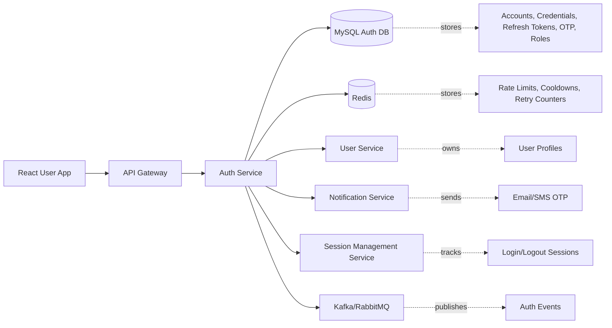

### Request ownership rule

| Step | Owner |
|---|---|
| Browser REST call | API Gateway |
| Internal auth workflow | Auth Service |
| Password/OTP/token persistence | Auth DB |
| Rate limit and cooldown | Redis |
| User profile creation | User Service |
| OTP delivery | Notification Service |
| Session analytics | Session Management Service |

---

## 🪜 Step-by-Step Implementation Guide

## Step 1: Auth boundaries finalize kiye

Sabse pehle Auth Service ke boundaries clear kiye gaye, taaki future tasks me password/profile/token data mix na ho.

### Boundary decision

| Data/Action | Auth Service? | Notes |
|---|---:|---|
| Password hash | ✅ | Plain password kabhi store nahi hoga |
| Email/phone login identity | ✅ | Unique identity and verification status |
| Full name | ❌ | User Service profile data |
| JWT access token | ✅ | Auth issue karega, Gateway validate karega |
| Refresh token | ✅ | Hash MySQL me store hoga |
| OTP challenge | ✅ | OTP hash and attempts Auth me |
| OTP email/SMS send | ❌ | Notification Service delivery karega |
| Role assignment | ✅ | Auth role source of truth |
| Seller KYC status | ❌ | User/Superadmin domain |

### Important security rule

```text
Password, OTP, refresh token, and JWT private key are sensitive.
Inhe logs, events, API responses, ya documentation examples me real value ke form me expose nahi karna.
```

---

## Step 2: Auth entities identify kiye

Task 1 me DB migration create nahi hui, but future schema ke liye conceptual entities define ki gayi.

### Core entities

| Entity | Purpose | Future table |
|---|---|---|
| `AuthAccount` | Login identity and verification state | `auth_accounts` |
| `Credential` | Password hash and lock metadata | `credentials` |
| `RefreshToken` | Rotating refresh token hash | `refresh_tokens` |
| `OTPChallenge` | OTP hash, purpose, expiry, attempts | `otp_challenges` |
| `RoleAssignment` | Account roles and scoped roles | `role_assignments` |

### Conceptual Go domain example

> Ye sirf guide example hai. Is task me actual Go file create nahi ki gayi.

```go
package domain

import "time"

type AccountStatus string

const (
    AccountStatusActive  AccountStatus = "active"
    AccountStatusBlocked AccountStatus = "blocked"
    AccountStatusDeleted AccountStatus = "deleted"
)

type AuthAccount struct {
    AccountID     string
    Email         *string
    Phone         *string
    EmailVerified bool
    PhoneVerified bool
    Status        AccountStatus
    CreatedAt     time.Time
    UpdatedAt     time.Time
}

type Credential struct {
    AccountID         string
    PasswordHash      string
    PasswordAlgo      string
    PasswordChangedAt *time.Time
    FailedAttempts    int
    LockedUntil       *time.Time
}
```

### Hinglish Explanation

`AuthAccount` user ki login identity hai. `Credential` password-related data rakhta hai. Inko separate rakhna useful hai kyunki future me passwordless login, social login, MFA, ya enterprise SSO add karna easy ho sakta hai.

---

## Step 3: Public API and gRPC mapping define kiya

Frontend direct Auth Service ko call nahi karega. Browser REST request API Gateway ko bhejega, Gateway internal gRPC se Auth Service ko call karega.

### REST to gRPC mapping

| REST API | Auth | gRPC Method | Purpose |
|---|---|---|---|
| `POST /api/v1/auth/signup` | public | `AuthService.Register` | New account create |
| `POST /api/v1/auth/login` | public | `AuthService.Login` | Password login |
| `POST /api/v1/auth/refresh` | public | `AuthService.RefreshToken` | Access token renew |
| `POST /api/v1/auth/logout` | buyer | `AuthService.Logout` | Refresh token/session revoke |
| `POST /api/v1/auth/otp/send` | public | `AuthService.CreateOTPChallenge` | OTP challenge create |
| `POST /api/v1/auth/otp/verify` | public | `AuthService.VerifyOTP` | OTP verify |
| `POST /api/v1/auth/password/forgot` | public | `AuthService.CreateOTPChallenge` | Password reset OTP start |
| `POST /api/v1/auth/password/reset` | public | `AuthService.ResetPassword` | Password update after OTP |

### Conceptual proto shape

```proto
syntax = "proto3";

package ecommerce.auth.v1;

service AuthService {
  rpc Register(SignupRequest) returns (AuthSessionResponse);
  rpc Login(LoginRequest) returns (AuthSessionResponse);
  rpc RefreshToken(RefreshTokenRequest) returns (TokenResponse);
  rpc Logout(LogoutRequest) returns (SuccessResponse);
  rpc VerifyAccessToken(TokenIntrospectionRequest) returns (TokenClaims);
  rpc CreateOTPChallenge(SendOTPRequest) returns (OTPChallengeResponse);
  rpc VerifyOTP(VerifyOTPRequest) returns (SuccessResponse);
  rpc AssignRole(AssignRoleRequest) returns (SuccessResponse);
  rpc RevokeRole(RevokeRoleRequest) returns (SuccessResponse);
  rpc ResetPassword(ResetPasswordRequest) returns (SuccessResponse);
}
```

> 🟡 **Note:** Actual proto file Platform Foundation proto strategy ke baad future task me create hoga. Task 1 me sirf contract understanding documented hai.

---

## Step 4: Signup flow define kiya

Signup ka goal hai account create karna, password hash store karna, default role assign karna, User Service me profile create karna, aur initial tokens/session return karna.

### Signup request fields

| Field | Required | Notes |
|---|---:|---|
| `email` | ✅ | Unique login identity |
| `phone` | ❌ | Optional login/contact identity |
| `password` | ✅ | Minimum 8 chars in current API contract |
| `full_name` | ✅ | User Service profile ke liye |
| `role` | ❌ | Allowed: `buyer`, `seller`; default `buyer` |

### Signup flow

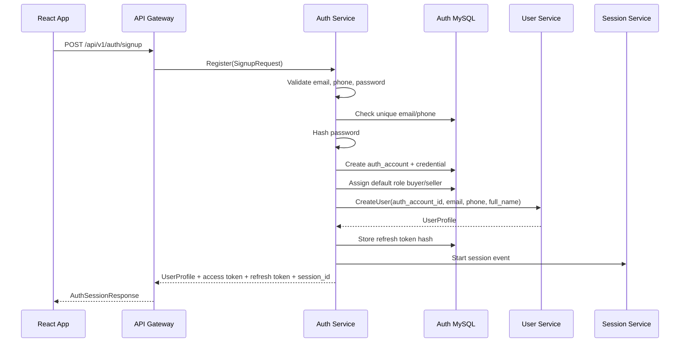

### Signup validation rules

| Rule | Why |
|---|---|
| Email format validate karo | Bad identity data avoid hoga |
| Password minimum length enforce karo | Weak passwords reduce honge |
| Duplicate email/phone block karo | One identity one account |
| Role allowlist use karo | User self-signup se admin role nahi le sakta |
| Plain password log mat karo | Critical secret leakage avoid |

### Signup response example

```json
{
  "user": {
    "user_id": "user_123",
    "auth_account_id": "auth_123",
    "email": "buyer@example.com",
    "phone": "+919999999999",
    "full_name": "Aarav Sharma",
    "status": "active"
  },
  "tokens": {
    "access_token": "jwt.access.token",
    "refresh_token": "opaque-refresh-token",
    "expires_in": 900
  },
  "session_id": "sess_123"
}
```

### Hinglish Explanation

Signup Auth Service se start hota hai kyunki password Auth ka concern hai. Auth account create hone ke baad Auth Service User Service ko profile create karne ke liye call karega. User Service password receive nahi karega.

---

## Step 5: Email/phone verification OTP flow define kiya

OTP flow ka goal hai email ya phone ownership verify karna. OTP plain text DB me store nahi hoga; sirf hash store hoga.

### OTP purposes

| Purpose | Use case |
|---|---|
| `signup` | Signup ke during verification |
| `login` | Passwordless ya step-up login |
| `password_reset` | Forgot password flow |
| `phone_verify` | Phone number verification |
| `email_verify` | Email verification |

### OTP send flow

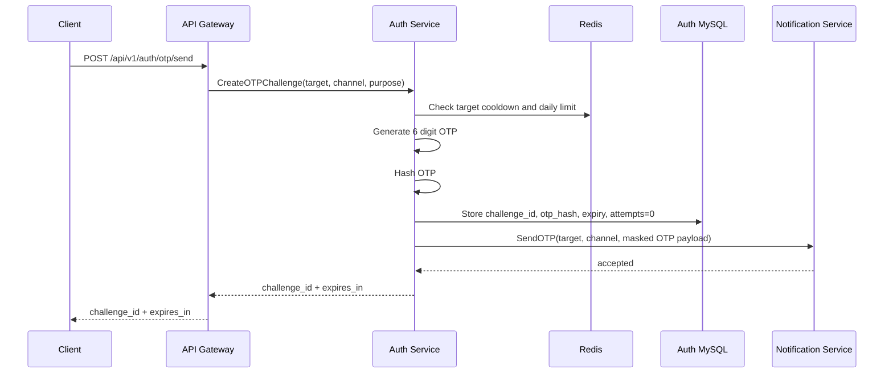

### OTP verify flow

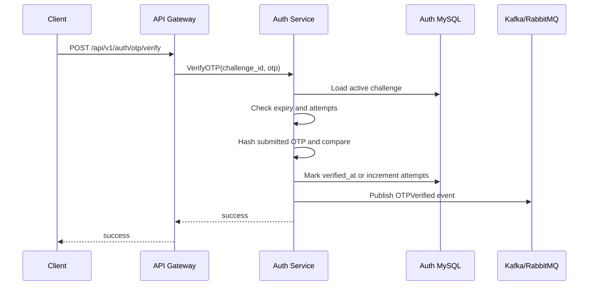

### OTP security rules

| Rule | Value |
|---|---|
| OTP length | Minimum 6 digits |
| Expiry | 5 minutes |
| Max attempts | 5 |
| Resend cooldown | 30 to 60 seconds |
| Storage | Hash only |
| Daily target limit | Required |
| Replay protection | `verified_at` set hone ke baad reuse block |

### OTP response example

```json
{
  "challenge_id": "otp_chal_123",
  "expires_in": 300
}
```

### Hinglish Explanation

OTP ek short-lived proof hai. User ko OTP dikhega, but database me OTP ka hash hi jayega. Agar DB leak bhi ho jaye, plain OTP recover nahi hona chahiye.

---

## Step 6: Login flow define kiya

Login ka goal hai identifier + password validate karna, failed attempts handle karna, access token issue karna, refresh token hash store karna, aur session start karna.

### Login request fields

| Field | Required | Notes |
|---|---:|---|
| `identifier` | ✅ | Email ya phone |
| `password` | ✅ | Plain password request me aayega, store/log nahi hoga |
| `device` | ❌ | Device metadata Session/Fraud use case ke liye |

### Login flow

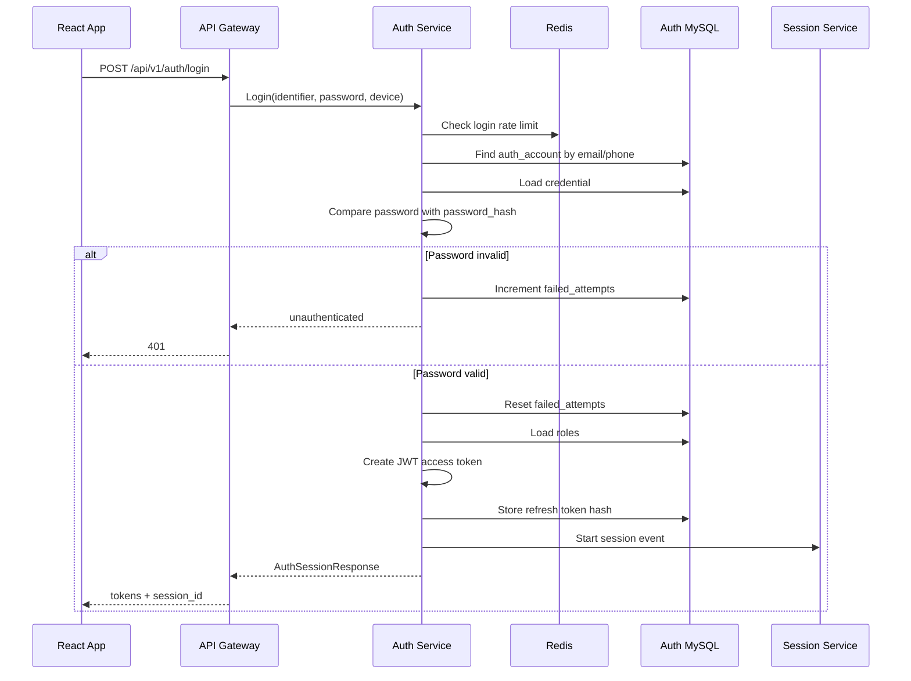

### Login failure handling

| Condition | Response |
|---|---|
| Unknown identifier | Generic `invalid credentials` |
| Wrong password | Generic `invalid credentials` |
| Account blocked | `account blocked` without sensitive details |
| Too many attempts | Temporary lock or rate limited |
| Deleted account | Login denied |

> 🔴 **Important:** "Email exists" ya "phone exists" type messages login/forgot password me avoid karne hain. Enumeration attack ka risk hota hai.

### Login success output

| Output | Detail |
|---|---|
| `access_token` | JWT, 15 minute TTL |
| `refresh_token` | Opaque token, hash DB me |
| `expires_in` | `900` seconds |
| `session_id` | Session Management Service link |
| `user` | User Service profile response |

---

## Step 7: JWT access token rules define kiye

Access token short-lived hoga and stateless API access ke liye use hoga. Gateway token validate karega, but sensitive service actions me backend service auth context verify kar sakti hai.

### JWT claims

```json
{
  "sub": "user_123",
  "sid": "sess_123",
  "roles": ["buyer"],
  "seller_id": "seller_456",
  "token_type": "access",
  "iat": 1760000000,
  "exp": 1760000900,
  "iss": "ecommerce-auth",
  "aud": "ecommerce-api"
}
```

### Token rules

| Rule | Value |
|---|---|
| Access token TTL | 15 minutes |
| Refresh token TTL | 7 to 30 days |
| JWT issuer | `ecommerce-auth` |
| JWT audience | `ecommerce-api` |
| Token type claim | Required: `access` |
| Key rotation | `kid` header support |
| Signing key storage | External secret manager / Kubernetes Secret |

### Conceptual Go claims example

```go
package domain

type TokenClaims struct {
    UserID    string
    SessionID string
    Roles     []string
    SellerID  *string
    TokenType string
    Issuer    string
    Audience  string
}
```

### Hinglish Explanation

Access token short time ke liye hota hai. Agar token leak bhi ho jaye, damage window small rahe. Long-lived access ke liye refresh token use hota hai, jo DB me hash form me track hota hai.

---

## Step 8: Refresh token rotation flow define kiya

Refresh token ka goal hai access token renew karna without user ko baar-baar password enter karwana. Har refresh request par old refresh token revoke/rotate hoga aur new refresh token issue hoga.

### Refresh flow

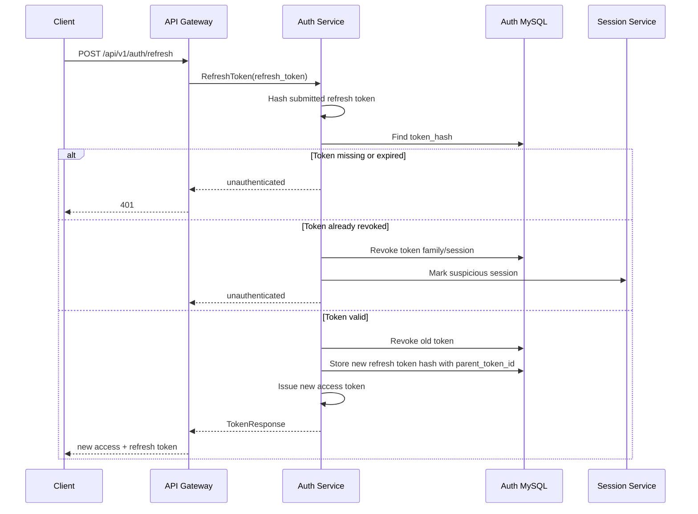

### Rotation rules

| Rule | Why |
|---|---|
| Store only refresh token hash | DB leak me token usable nahi hona chahiye |
| Rotate on every use | Replay detection possible hota hai |
| Track `parent_token_id` | Token family trace hoti hai |
| Reuse detect karo | Stolen refresh token signal |
| Reuse pe session revoke | Account protection |
| Expired token reject | Long-term access control |

### Refresh token state diagram

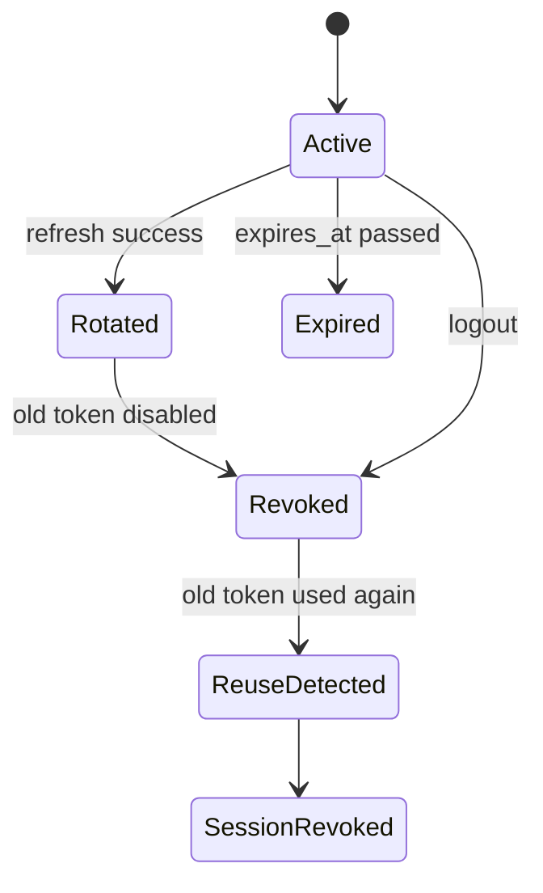

---

## Step 9: Logout flow define kiya

Logout ka goal hai current refresh token ya all-device token family revoke karna. Access token short-lived hai, isliye immediate access-token blacklist normally avoid ki ja sakti hai unless high-risk action ho.

### Logout request fields

| Field | Required | Notes |
|---|---:|---|
| `refresh_token` | ❌ | Current device logout ke liye useful |
| `all_devices` | ❌ | True ho to account ke active refresh tokens revoke |

### Logout flow

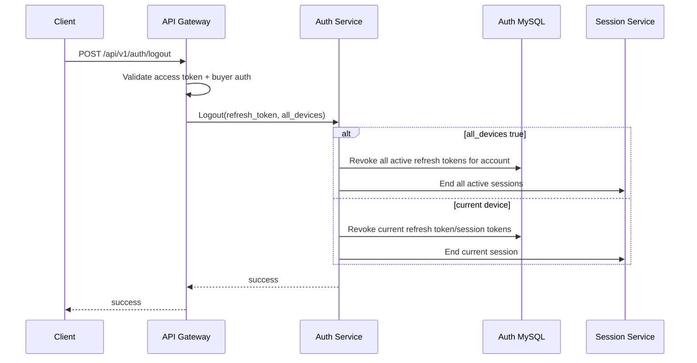

### Logout rules

| Rule | Detail |
|---|---|
| Current-device logout | Current refresh token/session revoke |
| All-device logout | Account ke active refresh tokens revoke |
| Access token handling | Short TTL ke kaaran normally expire hone diya ja sakta hai |
| Suspicious logout | Audit log create |
| Frontend action | Local token storage clear |

---

## Step 10: Password forgot/reset flow define kiya

Forgot password flow OTP challenge ke through chalega. Reset tabhi allow hoga jab OTP valid, unexpired, and unused ho.

### Password reset flow

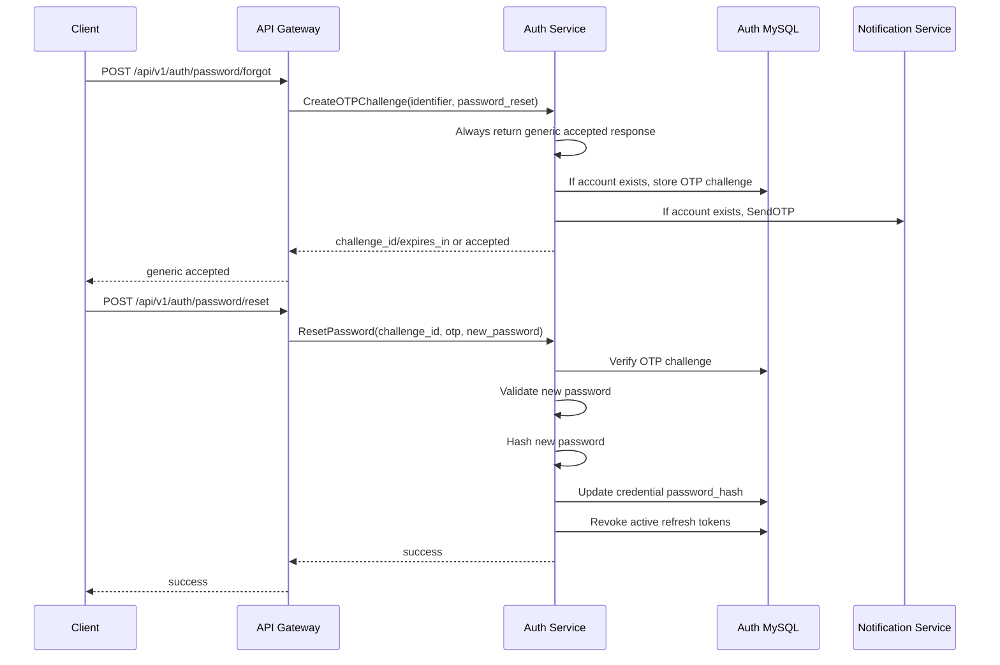

### Password reset rules

| Rule | Why |
|---|---|
| Generic forgot response | Account enumeration avoid |
| OTP required | Target ownership prove hota hai |
| New password validation | Weak password block |
| Password hash replace | Plain password store nahi hoga |
| Refresh tokens revoke | Old sessions force re-login |
| Audit log required | Security-sensitive action |

### Reset request example

```json
{
  "challenge_id": "otp_chal_123",
  "otp": "123456",
  "new_password": "new-strong-password"
}
```

---

## Step 11: MFA flow future-ready define kiya

MFA Task 1 me implement nahi hoga, but flow abhi define karna important hai taaki Auth Service design future me break na ho.

### Supported MFA idea

| MFA Type | Status | Notes |
|---|---|---|
| Email OTP | Planned via OTP challenge | Existing OTP model support karta hai |
| Phone SMS OTP | Planned via OTP challenge | Notification Service delivery karega |
| TOTP app | Future | Authenticator app secret encrypted storage chahiye |
| WebAuthn/passkeys | Future | Browser credential registration flow chahiye |

### MFA login flow

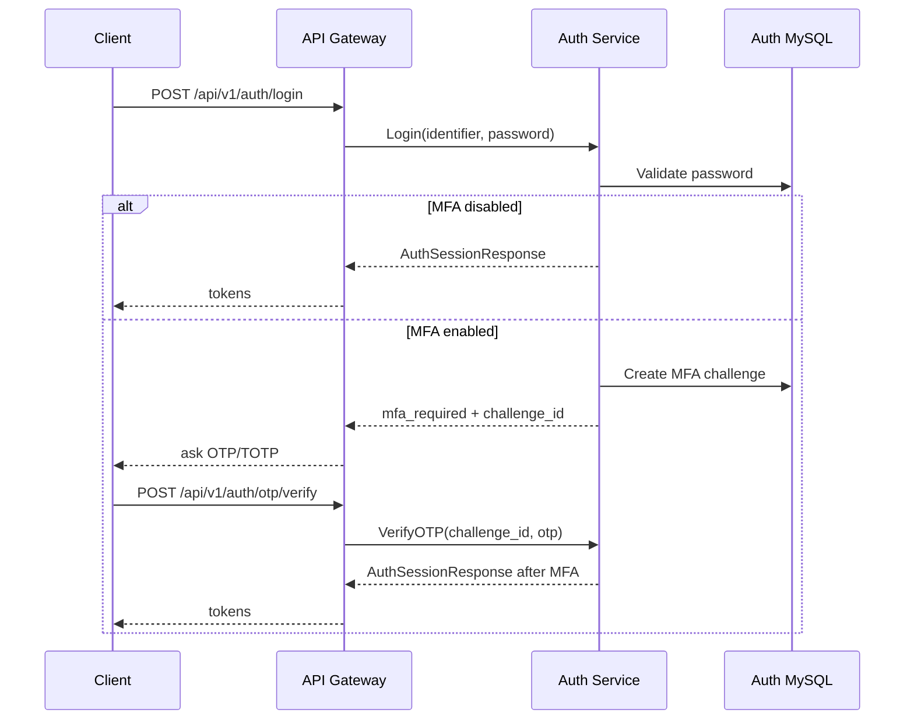

### MFA design decisions

| Decision | Reason |
|---|---|
| MFA challenge separate from password check | Password valid hone ke baad second factor required ho sakta hai |
| Token only after MFA complete | Partial login ko API access nahi milna chahiye |
| MFA attempts rate limited | Brute force avoid |
| Recovery codes future me | Account lockout support |

---

## Step 12: RBAC flow define kiya

RBAC ka source of truth Auth Service hoga. Gateway route-level role check karega, but services apne domain-specific permission checks bhi rakhenge.

### Roles

| Role | Scope |
|---|---|
| `buyer` | Customer account |
| `seller` | Seller owner |
| `seller_manager` | Seller team manager |
| `seller_catalog_editor` | Seller catalog operations |
| `seller_order_manager` | Seller order operations |
| `admin` | Platform admin |
| `operations_admin` | Operations admin |
| `finance_admin` | Payment/refund admin |
| `catalog_admin` | Catalog moderation admin |
| `superadmin` | Highest privilege |

### Role assignment rules

| Action | Allowed actor |
|---|---|
| Self-signup as buyer | Public |
| Self-signup as seller | Public, but seller profile approval later |
| Assign admin role | Superadmin/admin policy |
| Assign seller staff role | Seller owner or authorized seller manager |
| Revoke role | Admin/superadmin or scoped owner |

### RBAC flow

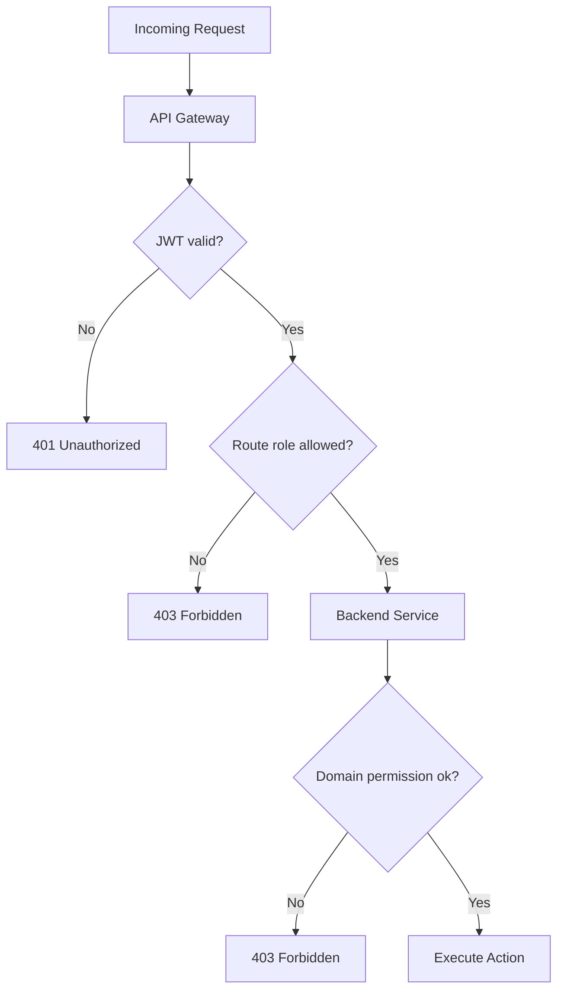

### Hinglish Explanation

Gateway pe route-level guard fast hai. Lekin seller apna product edit kar raha hai ya dusre seller ka, ye Product/CMS Service ko verify karna padega. Auth role sirf first gate hai.

---

## Step 13: Rate limiting and lockout rules define kiye

Auth endpoints abuse ke high-risk targets hote hain. Isliye Redis based rate limits and DB based failed attempt tracking required hoga.

### Rate limit examples

| Route Group | Limit Example |
|---|---|
| Login | 5 attempts per IP per 10 min |
| OTP send | 3 per target per 15 min |
| OTP verify | 5 attempts per challenge |
| Password forgot | 3 per target per 15 min |
| Refresh token | Reasonable per session/device limit |
| Admin role changes | Strict admin mutation limit |

### Lockout rules

| Condition | Action |
|---|---|
| Repeated wrong password | Increment `failed_attempts` |
| Too many failed attempts | Set `locked_until` |
| Successful login | Reset failed attempts |
| Suspicious refresh reuse | Revoke token family/session |
| OTP max attempts reached | Challenge locked/expired |

### Redis key examples

```text
auth:rate:login:ip:{ip_hash}
auth:rate:login:target:{target_hash}
auth:otp:cooldown:{target_hash}:{purpose}
auth:otp:daily:{target_hash}:{date}
auth:refresh:session:{session_id}
```

> 🟡 **Note:** Redis key examples me raw IP/email/phone store nahi karna. Hash use karna better hai.

---

## Step 14: Audit logging and observability define kiya

Auth logs high signal hone chahiye, but secrets kabhi log nahi hone chahiye.

### Audit events

| Event | Required? | Notes |
|---|---:|---|
| Signup success | ✅ | Account lifecycle |
| Login failure spike | ✅ | Attack detection |
| Login success | ✅ | Session trace |
| Password reset requested | ✅ | Security event |
| Password changed | ✅ | Active sessions revoke |
| Refresh token reuse | ✅ | High-risk event |
| Logout | ✅ | Session lifecycle |
| Role assigned/revoked | ✅ | Privilege change |
| OTP verified | ✅ | Verification proof |

### Never log

```text
password
otp
refresh_token
full JWT
JWT private key
raw authorization header
raw secret values
payment/card data
```

### Safe log example

```json
{
  "level": "warn",
  "event": "auth.login_failed",
  "request_id": "req_123",
  "account_id": "auth_123",
  "ip_hash": "hash_abc",
  "reason": "invalid_credentials",
  "created_at": "2026-05-19T00:00:00Z"
}
```

### Metrics to track later

| Metric | Purpose |
|---|---|
| `auth_signup_total` | Signup rate |
| `auth_login_success_total` | Healthy login traffic |
| `auth_login_failures_total` | Attack/spike detection |
| `auth_otp_sent_total` | OTP volume |
| `auth_otp_verify_failures_total` | OTP brute force detection |
| `auth_refresh_reuse_total` | Stolen token signal |
| `auth_role_changes_total` | Privilege audit |

---

## Step 15: External libraries/tools identify kiye

Task 1 documentation-only hai, isliye koi dependency install nahi ki gayi. Neeche future implementation ke liye recommended tools/libraries listed hain.

### Libraries/tools summary

| Tool/Library | What it is | Why used | Install |
|---|---|---|---|
| MySQL 8 | Relational database | Credentials, token audit, roles strongly consistent store karne ke liye | Docker Compose/K8s service |
| Redis | In-memory store | Rate limits, cooldowns, retry counters, short-lived auth state | Docker Compose/K8s service |
| `golang.org/x/crypto/argon2` | Argon2id hashing package | Password hashing ke liye recommended modern algorithm | `go get golang.org/x/crypto` |
| `golang.org/x/crypto/bcrypt` | bcrypt hashing package | Argon2id alternative, mature password hashing | `go get golang.org/x/crypto` |
| `github.com/golang-jwt/jwt/v5` | JWT library | Access token sign/parse/validate karne ke liye | `go get github.com/golang-jwt/jwt/v5` |
| `github.com/redis/go-redis/v9` | Redis Go client | Rate limit and OTP counters access karne ke liye | `go get github.com/redis/go-redis/v9` |
| `github.com/go-sql-driver/mysql` | MySQL Go driver | Auth DB connect/query karne ke liye | `go get github.com/go-sql-driver/mysql` |
| `github.com/google/uuid` | UUID generator | Account/session/token ids generate karne ke liye | `go get github.com/google/uuid` |
| Mermaid | Markdown diagram syntax | Architecture/flow diagrams readable banane ke liye | GitHub/Markdown viewer me built-in render |

### Install commands for future implementation

```bash
go get golang.org/x/crypto
go get github.com/golang-jwt/jwt/v5
go get github.com/redis/go-redis/v9
go get github.com/go-sql-driver/mysql
go get github.com/google/uuid
```

### Example: Password hashing usage

> Actual password hashing implementation Auth Service Task 3 me hoga. Ye sirf conceptual guide hai.

```go
package security

import "golang.org/x/crypto/bcrypt"

func HashPassword(password string) (string, error) {
    hash, err := bcrypt.GenerateFromPassword([]byte(password), bcrypt.DefaultCost)
    if err != nil {
        return "", err
    }
    return string(hash), nil
}

func CheckPassword(hash string, password string) bool {
    return bcrypt.CompareHashAndPassword([]byte(hash), []byte(password)) == nil
}
```

### Example: JWT issuing usage

> Actual JWT implementation Auth Service Task 4 me hoga.

```go
package security

import (
    "time"

    "github.com/golang-jwt/jwt/v5"
)

func NewAccessToken(userID string, sessionID string, roles []string, key []byte) (string, error) {
    claims := jwt.MapClaims{
        "sub":        userID,
        "sid":        sessionID,
        "roles":      roles,
        "token_type": "access",
        "iss":        "ecommerce-auth",
        "aud":        "ecommerce-api",
        "iat":        time.Now().Unix(),
        "exp":        time.Now().Add(15 * time.Minute).Unix(),
    }

    token := jwt.NewWithClaims(jwt.SigningMethodHS256, claims)
    return token.SignedString(key)
}
```

> 🔴 **Production note:** HS256 symmetric key simple example ke liye hai. Production me asymmetric signing like RS256/EdDSA with `kid` and JWKS public key publishing better rahega.

---

## Step 16: Future Auth Service folder structure define kiya

Task 1 me ye folders create nahi kiye gaye. Ye future implementation ke liye recommended structure hai, aligned with `docs/03-folder-structure.md`.

```text
backend/
└── services/
    └── auth-service/
        ├── cmd/
        │   └── server/
        │       └── main.go
        ├── internal/
        │   ├── domain/
        │   │   ├── account.go
        │   │   ├── credential.go
        │   │   ├── otp.go
        │   │   ├── token.go
        │   │   └── role.go
        │   ├── usecase/
        │   │   ├── signup.go
        │   │   ├── login.go
        │   │   ├── refresh.go
        │   │   ├── logout.go
        │   │   ├── otp_verify.go
        │   │   └── password_reset.go
        │   ├── repository/
        │   │   ├── mysql_account_repository.go
        │   │   ├── mysql_token_repository.go
        │   │   ├── mysql_otp_repository.go
        │   │   └── redis_rate_repository.go
        │   ├── transport/
        │   │   └── grpc/
        │   │       ├── server.go
        │   │       └── auth_handler.go
        │   ├── events/
        │   │   └── publisher.go
        │   └── config/
        │       └── config.go
        ├── migrations/
        │   ├── 001_create_auth_tables.up.sql
        │   └── 001_create_auth_tables.down.sql
        └── deploy/
            ├── Dockerfile
            └── k8s.yaml
```

### Folder responsibility

| Folder | Responsibility |
|---|---|
| `domain/` | Auth entities and pure business rules |
| `usecase/` | Signup, login, refresh, OTP, logout workflows |
| `repository/` | MySQL/Redis implementation |
| `transport/grpc/` | gRPC handlers and request mapping |
| `events/` | Auth events publish karna |
| `config/` | Env and service config load |
| `migrations/` | Auth DB schema |
| `deploy/` | Docker/Kubernetes runtime files |

> 🟡 **Important:** Ye target structure hai. Is Task 1 me sirf `TaskImplementation/Auth Service/task1.md` create kiya gaya.

---

## Step 17: Auth DB conceptual mapping define kiya

Task 2 me actual MySQL schema implement hoga. Task 1 me sirf mapping explain ki gayi hai.

### Future tables

| Table | Purpose | Key fields |
|---|---|---|
| `auth_accounts` | Login identity | `account_id`, `email`, `phone`, `email_verified`, `phone_verified`, `status` |
| `credentials` | Password metadata | `account_id`, `password_hash`, `password_algo`, `failed_attempts`, `locked_until` |
| `refresh_tokens` | Refresh token rotation | `token_id`, `account_id`, `session_id`, `token_hash`, `parent_token_id`, `revoked_at`, `expires_at` |
| `otp_challenges` | OTP verification | `challenge_id`, `target`, `channel`, `purpose`, `otp_hash`, `attempts`, `verified_at`, `expires_at` |
| `role_assignments` | RBAC source | `account_id`, `role`, `scope_type`, `scope_id`, `assigned_by`, `revoked_at` |

### Relationship diagram

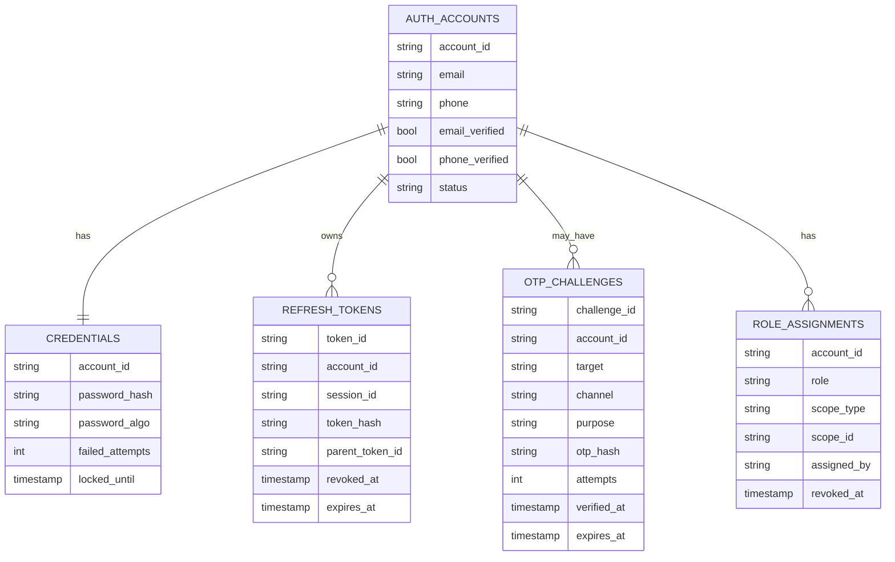

---

## Step 18: Session Management integration define kiya

Session Management Service independent hai, but Auth login/logout usko important events bhejega.

### Session touchpoints

| Auth action | Session action |
|---|---|
| Login success | Start session |
| Signup success | Start session |
| Refresh token reuse | Mark suspicious/revoke session |
| Logout current device | End current session |
| Logout all devices | End all active sessions |
| Password reset | Revoke/end old sessions |

### Event examples

```json
{
  "event_type": "AuthLoginSucceeded",
  "account_id": "auth_123",
  "user_id": "user_123",
  "session_id": "sess_123",
  "device_fingerprint_hash": "hash_device",
  "ip_hash": "hash_ip",
  "created_at": "2026-05-19T00:00:00Z"
}
```

```json
{
  "event_type": "RefreshTokenReuseDetected",
  "account_id": "auth_123",
  "session_id": "sess_123",
  "token_id": "rt_123",
  "created_at": "2026-05-19T00:00:00Z"
}
```

### Hinglish Explanation

Auth Service login/logout ka decision leta hai. Session Service user journey, device, active session, and analytics track karta hai. Dono ka connection events ya internal calls se hoga, but raw secrets share nahi honge.

---

## Step 19: Error handling define kiya

Auth errors intentionally generic hone chahiye, especially login and password reset me.

### Error mapping

| Scenario | gRPC code idea | REST status | Public message |
|---|---|---:|---|
| Missing/invalid credentials | `Unauthenticated` | `401` | Invalid credentials |
| Account blocked | `PermissionDenied` | `403` | Account cannot login |
| Rate limited | `ResourceExhausted` | `429` | Too many attempts |
| OTP expired | `InvalidArgument` | `400` | OTP expired |
| OTP attempts exceeded | `ResourceExhausted` | `429` | Too many OTP attempts |
| Refresh token expired | `Unauthenticated` | `401` | Login again |
| Role not allowed | `PermissionDenied` | `403` | Permission denied |

### Response rule

```json
{
  "error": {
    "code": "UNAUTHORIZED",
    "message": "Invalid credentials",
    "request_id": "req_123"
  }
}
```

> 🔴 **Security note:** Response me `password wrong`, `email not found`, `phone not verified but exists` jaise overly-specific messages avoid karne hain.

---

## Step 20: Security checklist finalize kiya

### Auth flow checklist

| Check | Status |
|---|---:|
| Signup flow documented | ✅ |
| Login flow documented | ✅ |
| OTP send/verify flow documented | ✅ |
| Refresh token rotation documented | ✅ |
| Logout revoke flow documented | ✅ |
| Password reset flow documented | ✅ |
| MFA future flow documented | ✅ |
| JWT claims documented | ✅ |
| RBAC roles documented | ✅ |
| Rate limit rules documented | ✅ |
| Audit/logging rules documented | ✅ |
| Scope limited to Auth Service Task 1 | ✅ |

### Secrets checklist

| Secret/data | Allowed in logs? |
|---|---:|
| Plain password | ❌ |
| OTP | ❌ |
| Refresh token | ❌ |
| Full JWT | ❌ |
| JWT private key | ❌ |
| DB password | ❌ |
| Raw email/phone in high-volume logs | ⚠️ Prefer hash/masking |

---

## 🧪 Future Test Scenarios

Task 8 me tests implement honge. Task 1 me expected test cases define kiye gaye.

### Critical tests

| Test | Expected |
|---|---|
| Signup duplicate email | Reject |
| Signup weak password | Reject |
| Login valid password | Tokens issued |
| Login wrong password | `401`, failed attempts increment |
| Account lockout | Too many attempts block temporarily |
| OTP expired | Verify fails |
| OTP replay | Already verified OTP cannot be reused |
| OTP max attempts | Challenge blocked |
| Refresh valid token | New access + refresh issued |
| Refresh old rotated token reuse | Session/token family revoked |
| Logout current device | Current refresh token revoked |
| Logout all devices | All account refresh tokens revoked |
| Password reset | Password changed and old sessions revoked |
| Role bypass attempt | `403` |
| Full JWT logging | Must not happen |

---

## 🚫 Out of Scope for Task 1

Is task me intentionally ye cheezein implement nahi ki gayi:

- Real Auth Service Go code
- Real MySQL migrations
- Real Redis rate limiter
- Real OTP generator
- Real JWT signing/validation
- Real Notification Service call
- Real User Service gRPC call
- Real Session Service event producer
- Real MFA/TOTP/WebAuthn setup
- Real tests
- CI/CD changes

> 🔴 **Reason:** Ye sab Auth Service ke later tasks ya Platform Foundation tasks me aayenge. Task 1 ka purpose sirf auth flow contract define karna hai.

---

## ✅ Final Task 1 Standard

Auth Service Task 1 ke baad team ke paas ye clear decisions available hain:

- Auth Service credentials, OTP, tokens, and roles ka owner hai.
- User Service profile ka owner hai.
- Notification Service OTP deliver karega, OTP verify nahi karega.
- Access token short-lived JWT hoga.
- Refresh token rotating and hashed store hoga.
- OTP plain text kabhi store nahi hoga.
- Password reset OTP based hoga and old sessions revoke karega.
- MFA future-ready design me challenge-based flow use hoga.
- Gateway route-level auth karega, services domain-level auth enforce karenge.
- Secrets and sensitive values logs me nahi jayenge.

Task 1 complete hai as a structured auth-flow documentation guide. Ab Task 2 me isi guide ke basis par Auth Service MySQL schema cleanly implement kiya ja sakta hai.
