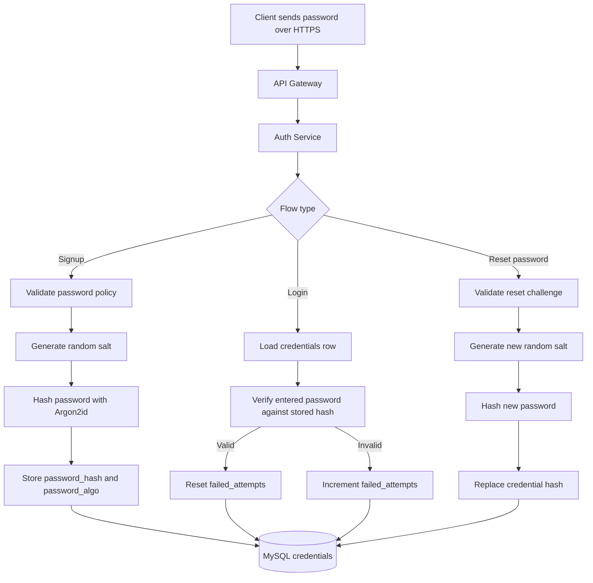
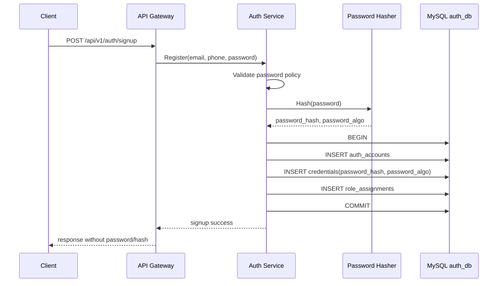
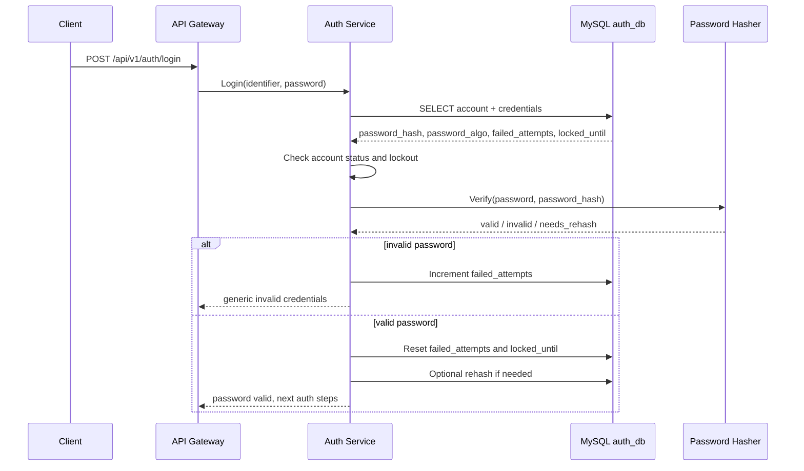
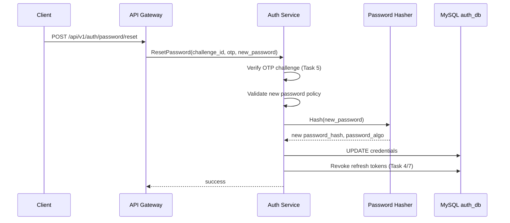
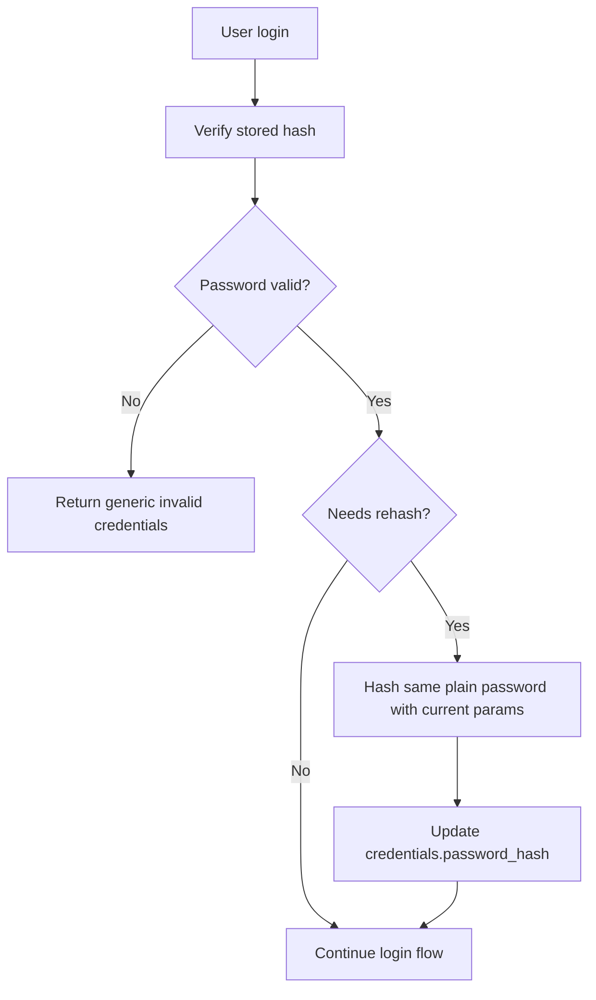
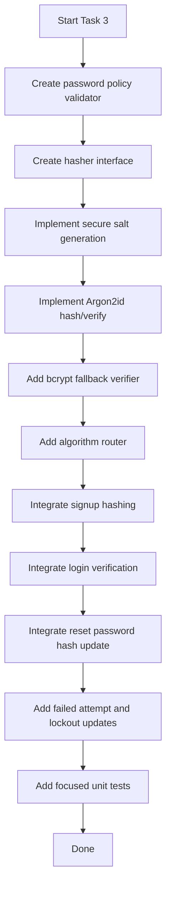

# 🔐 Auth Service - Task 3: Password Hashing


## 📌 Task Summary

| Field | Detail |
|---|---|
| Task Name | Password hashing |
| Source | `docs/01-micro-tasks.md` → `Auth Service` → Task 3 |
| Priority | `P0` security foundation |
| Dependency | Auth Service Task 2: Create MySQL schema |
| Main Goal | Argon2id or bcrypt with strong cost use karna, taaki plain password kabhi store na ho |
| Core Boundary | Auth Service password validation, password hashing, hash verification, and safe credential updates own karega |
| Output Type | Structured implementation guide |
| Not Included | JWT issuing, refresh token rotation, OTP verification, RBAC middleware, Session Service link, full gRPC/REST implementation |

> **Simple Hinglish goal:** Is task ka purpose password ko secure tarike se hash karna hai. User signup/reset ke time plain password request me aayega, but database me sirf strong hash store hoga. Login ke time plain password ko stored hash se compare kiya jayega without plain password save/log kiye.

---

## ✅ Final Output Created

```text
TaskImplementation/
├── Auth Service/
│   ├── task1.md
│   ├── task2.md
│   └── task3.md
├── Platform Foundation/
│   ├── task1.md
│   ├── task2.md
│   ├── task3.md
│   ├── task4.md
│   ├── task5.md
│   ├── task6.md
│   ├── task7.md
│   └── task8.md
└── User Service/
    └── task1.md
```

### Why this structure?

- `TaskImplementation/` project ke task-wise guides ka central folder hai.
- `Auth Service/` folder already present tha, isliye usko keep kiya gaya.
- `task3.md` sirf **Auth Service - Task 3** ka guide hai.
- Existing `task1.md`, `task2.md`, Platform Foundation guides, aur User Service guide untouched rakhe gaye.
- Actual backend code files create nahi ki gayi, kyunki request ka output sirf required folder structure and `task3.md` content hai.

---

## 🧭 Implementation Approach

Is guide ko banate time project ke official docs ko source of truth maana gaya:

| Document | Kya use kiya gaya |
|---|---|
| `docs/01-micro-tasks.md` | Auth Service Task 3 ka exact scope: Password hashing |
| `TaskImplementation/Auth Service/task1.md` | Signup, login, password reset flows me hashing touchpoints |
| `TaskImplementation/Auth Service/task2.md` | `credentials` table and password-related columns |
| `docs/04-microservice-design.md` | Auth Service responsibility: password hashing and credential validation |
| `docs/05-database-design.md` | Auth DB ownership and credentials table purpose |
| `database/draw.sql` | `password_hash`, `password_algo`, `password_changed_at`, `failed_attempts`, `locked_until` fields |
| `docs/06-auth-security.md` | Passwords/logging/secrets security rules |
| `api/master-api.json` | Signup/login/reset password request fields |

---

## 🧱 Task Boundary

### ✅ Included in Task 3

- Password hashing strategy define karna
- Argon2id ko preferred algorithm banana
- bcrypt ko fallback/legacy-compatible option rakhna
- Salt generation secure tarike se explain karna
- Password hash format define karna
- Signup ke time password hash create flow
- Login ke time password verify flow
- Password reset ke time hash replace flow
- Failed attempts and lockout update rules
- Hash upgrade / rehash strategy
- Go code examples for hasher interface
- MySQL `credentials` table integration examples
- External libraries/tools ka explanation
- Mermaid diagrams and beginner-friendly explanation
- Security checklist and edge cases

### 🚫 Not Included in Task 3

- JWT access token issue karna
- Refresh token create/rotate karna
- OTP delivery or verification implement karna
- RBAC role middleware banana
- API Gateway handlers banana
- Full Auth Service gRPC server banana
- Session Management Service events bhejna
- Production secret manager setup
- Real backend source files create karna

> 🟢 **Rule:** Task 3 ka scope password hashing and credential validation tak limited hai. JWT Task 4, OTP Task 5, RBAC Task 6, Session link Task 7, aur security tests Task 8 me aayenge.

---

## 🗂️ Target Implementation Folder Structure

Future me actual Auth Service implementation ka password hashing part yahan rahega:

```text
backend/
└── services/
    └── auth-service/
        ├── internal/
        │   ├── domain/
        │   │   └── credential.go
        │   ├── security/
        │   │   └── password/
        │   │       ├── hasher.go
        │   │       ├── argon2id.go
        │   │       ├── bcrypt.go
        │   │       └── policy.go
        │   ├── usecase/
        │   │   ├── signup.go
        │   │   ├── login.go
        │   │   └── reset_password.go
        │   └── repository/
        │       └── mysql_credential_repository.go
        └── migrations/
            ├── 001_create_auth_tables.up.sql
            └── 001_create_auth_tables.down.sql
```

### Folder responsibility

| Path | Responsibility |
|---|---|
| `internal/security/password/hasher.go` | Common hasher interface |
| `internal/security/password/argon2id.go` | Argon2id hash, verify, parse, rehash logic |
| `internal/security/password/bcrypt.go` | bcrypt fallback or legacy support |
| `internal/security/password/policy.go` | Password length/complexity/reuse validation |
| `internal/usecase/signup.go` | Signup ke time password hash create karega |
| `internal/usecase/login.go` | Login ke time stored hash verify karega |
| `internal/usecase/reset_password.go` | Reset ke time new hash save karega |
| `internal/repository/mysql_credential_repository.go` | `credentials` table read/write karega |

> 🟡 **Important:** Ye target structure hai. Is Task 3 me sirf `TaskImplementation/Auth Service/task3.md` create kiya gaya.

---

## 🧠 Password Hashing Concept

Password hashing ka goal password ko one-way format me convert karna hai. Hash reversible nahi hota. Agar DB leak bhi ho jaye, attacker ko original password directly nahi milna chahiye.

### Password hash vs encryption

| Concept | Reversible? | Use Case |
|---|---:|---|
| Hashing | ❌ No | Password storage |
| Encryption | ✅ Yes, key ke saath | Data ko later decrypt karna ho |

### Hinglish Explanation

Password ko encrypt nahi karna chahiye, kyunki encryption me key leak hui to passwords decrypt ho sakte hain. Password ko slow, salted, memory-hard hash se store karna chahiye. Login ke time user ka entered password same algorithm se verify hota hai.

---

## 🏆 Recommended Algorithm

### Preferred: Argon2id

Argon2id modern password hashing algorithm hai. Ye memory-hard hai, matlab attacker ko brute-force karne ke liye CPU ke saath memory bhi chahiye. Isliye GPU/ASIC based cracking expensive ho jati hai.

### Fallback: bcrypt

bcrypt mature and widely supported hai. Agar infra ya compatibility reason se Argon2id immediately use nahi kar sakte, bcrypt strong cost ke saath acceptable fallback hai.

| Algorithm | Status | Why |
|---|---|---|
| Argon2id | ✅ Preferred | Modern, memory-hard, GPU cracking ke against stronger |
| bcrypt | ✅ Fallback | Stable, simple, widely available |
| SHA-256 plain | ❌ Avoid | Fast hash hai, password storage ke liye weak |
| MD5/SHA-1 | ❌ Never | Broken/weak algorithms |

---

## ⚙️ Recommended Parameters

### Argon2id parameters

| Parameter | Recommended Value | Meaning |
|---|---:|---|
| Memory | `64 MiB` / `65536 KiB` | Hash compute karne ke liye memory requirement |
| Iterations | `3` | Hashing rounds |
| Parallelism | `2` | Threads/lanes |
| Salt length | `16 bytes` | Unique random salt |
| Key length | `32 bytes` | Final hash length |

### bcrypt parameters

| Parameter | Recommended Value | Meaning |
|---|---:|---|
| Cost | `12` | Hashing work factor |
| Max input | `72 bytes` | bcrypt ki practical password limit |

> 🟠 **Operational note:** Production hardware pe benchmark zaruri hai. Target ye hona chahiye ki single password hash roughly `100ms-500ms` ke range me rahe, taaki user experience acceptable ho aur brute force expensive bane.

---

## 🔒 Hash Storage Format

`credentials.password_hash` me self-contained hash string store hogi:

```text
$argon2id$v=19$m=65536,t=3,p=2$<salt_base64>$<hash_base64>
```

Example:

```text
$argon2id$v=19$m=65536,t=3,p=2$c2FsdF9leGFtcGxl$ZGVtb19oYXNoX2V4YW1wbGU
```

### Why self-contained format?

- Hash ke andar algorithm version store hota hai.
- Parameters store hote hain, jaise memory/time/parallelism.
- Salt store hota hai.
- Future me cost upgrade possible hota hai.
- Login verify ke time DB se only `password_hash` enough hota hai.

### `password_algo` column ka role

`password_algo` quick filtering and migration ke liye useful hai:

| Value | Meaning |
|---|---|
| `argon2id` | Preferred modern hash |
| `bcrypt` | Legacy/fallback hash |

---

## 🧩 Password Hashing Architecture



---

## 🪜 Step-by-Step Implementation Guide

## Step 1: Password policy define karo

Password hash karne se pehle password ko validate karna zaruri hai.

### Current API contract

`api/master-api.json` me signup and reset password ke liye password minimum length `8` defined hai.

```json
{
  "password": {
    "type": "string",
    "minLength": 8
  }
}
```

### Recommended policy

| Rule | Value | Reason |
|---|---:|---|
| Minimum length | `8` now, `12` preferred later | Long passwords stronger hote hain |
| Maximum length | `128` characters | Abuse and memory pressure avoid |
| Empty/space-only | Reject | Meaningless password avoid |
| Known leaked passwords | Future enhancement | Common password block |
| Password reuse | Future enhancement | Old password repeat avoid |

### Go example: policy validation

```go
package password

import (
    "errors"
    "strings"
    "unicode/utf8"
)

var (
    ErrPasswordTooShort = errors.New("password must be at least 8 characters")
    ErrPasswordTooLong  = errors.New("password must be at most 128 characters")
    ErrPasswordBlank    = errors.New("password cannot be blank")
)

func ValidatePolicy(plain string) error {
    trimmed := strings.TrimSpace(plain)
    if trimmed == "" {
        return ErrPasswordBlank
    }
    if utf8.RuneCountInString(plain) < 8 {
        return ErrPasswordTooShort
    }
    if utf8.RuneCountInString(plain) > 128 {
        return ErrPasswordTooLong
    }
    return nil
}
```

### Hinglish Explanation

Hashing weak password ko strong nahi banata. Agar user ka password `password123` hai, to hash strong hone ke baad bhi brute-force list me easily crack ho sakta hai. Isliye basic password policy pehle run hogi, phir hash create hoga.

---

## Step 2: Hasher interface banao

Usecase layer ko specific algorithm details nahi pata honi chahiye. Isliye ek common interface helpful hai.

```go
package password

type VerificationResult struct {
    Valid       bool
    NeedsRehash bool
    Algorithm   string
}

type Hasher interface {
    Hash(plain string) (encodedHash string, algorithm string, err error)
    Verify(plain string, encodedHash string) (VerificationResult, error)
}
```

### Why interface?

- Signup/login/reset usecases clean rahenge.
- Argon2id default ho sakta hai.
- bcrypt legacy hashes verify kiye ja sakte hain.
- Future me parameter upgrade easy hoga.

---

## Step 3: Secure random salt generate karo

Har password ke liye unique random salt generate karna mandatory hai.

```go
package password

import "crypto/rand"

func randomBytes(length uint32) ([]byte, error) {
    b := make([]byte, length)
    _, err := rand.Read(b)
    if err != nil {
        return nil, err
    }
    return b, nil
}
```

### Hinglish Explanation

Salt ka kaam same password ke same hash ko prevent karna hai. Agar do users ka password same bhi ho, random salt ki wajah se DB me unka `password_hash` different dikhega.

### Salt rules

| Rule | Status |
|---|---|
| Har password ke liye new salt | ✅ Required |
| Salt random hona chahiye | ✅ Required |
| Salt secret nahi hota | ✅ Hash string me store ho sakta hai |
| Same salt reuse nahi karna | ❌ Avoid |

---

## Step 4: Argon2id hasher implement karo

### Install external library

```bash
go get golang.org/x/crypto
```

### Why `golang.org/x/crypto/argon2`?

| Library | Type | Why used |
|---|---|---|
| `golang.org/x/crypto/argon2` | External Go crypto package | Argon2id password hashing ke liye official Go extended crypto package |
| `crypto/rand` | Go standard library | Secure salt generation |
| `crypto/subtle` | Go standard library | Constant-time hash comparison |
| `encoding/base64` | Go standard library | Salt/hash ko storage-friendly string banana |

### Argon2id code example

```go
package password

import (
    "crypto/subtle"
    "encoding/base64"
    "errors"
    "fmt"
    "strconv"
    "strings"

    "golang.org/x/crypto/argon2"
)

const AlgorithmArgon2id = "argon2id"

type Argon2idParams struct {
    Memory      uint32
    Iterations  uint32
    Parallelism uint8
    SaltLength  uint32
    KeyLength   uint32
}

type Argon2idHasher struct {
    params Argon2idParams
}

func NewArgon2idHasher() Argon2idHasher {
    return Argon2idHasher{
        params: Argon2idParams{
            Memory:      64 * 1024,
            Iterations:  3,
            Parallelism: 2,
            SaltLength:  16,
            KeyLength:   32,
        },
    }
}

func (h Argon2idHasher) Hash(plain string) (string, string, error) {
    if err := ValidatePolicy(plain); err != nil {
        return "", "", err
    }

    salt, err := randomBytes(h.params.SaltLength)
    if err != nil {
        return "", "", err
    }

    key := argon2.IDKey(
        []byte(plain),
        salt,
        h.params.Iterations,
        h.params.Memory,
        h.params.Parallelism,
        h.params.KeyLength,
    )

    encodedSalt := base64.RawStdEncoding.EncodeToString(salt)
    encodedKey := base64.RawStdEncoding.EncodeToString(key)

    encodedHash := fmt.Sprintf(
        "$argon2id$v=19$m=%d,t=%d,p=%d$%s$%s",
        h.params.Memory,
        h.params.Iterations,
        h.params.Parallelism,
        encodedSalt,
        encodedKey,
    )

    return encodedHash, AlgorithmArgon2id, nil
}

func (h Argon2idHasher) Verify(plain string, encodedHash string) (VerificationResult, error) {
    params, salt, expectedKey, err := decodeArgon2idHash(encodedHash)
    if err != nil {
        return VerificationResult{Valid: false, Algorithm: AlgorithmArgon2id}, err
    }

    actualKey := argon2.IDKey(
        []byte(plain),
        salt,
        params.Iterations,
        params.Memory,
        params.Parallelism,
        uint32(len(expectedKey)),
    )

    valid := subtle.ConstantTimeCompare(actualKey, expectedKey) == 1

    return VerificationResult{
        Valid:       valid,
        NeedsRehash: valid && h.needsRehash(params),
        Algorithm:   AlgorithmArgon2id,
    }, nil
}

func (h Argon2idHasher) needsRehash(params Argon2idParams) bool {
    return params.Memory != h.params.Memory ||
        params.Iterations != h.params.Iterations ||
        params.Parallelism != h.params.Parallelism ||
        params.KeyLength != h.params.KeyLength
}

func decodeArgon2idHash(encodedHash string) (Argon2idParams, []byte, []byte, error) {
    parts := strings.Split(encodedHash, "$")
    if len(parts) != 6 {
        return Argon2idParams{}, nil, nil, errors.New("invalid argon2id hash format")
    }
    if parts[1] != "argon2id" {
        return Argon2idParams{}, nil, nil, errors.New("unsupported password algorithm")
    }
    if parts[2] != "v=19" {
        return Argon2idParams{}, nil, nil, errors.New("unsupported argon2 version")
    }

    params, err := parseArgon2idParams(parts[3])
    if err != nil {
        return Argon2idParams{}, nil, nil, err
    }

    salt, err := base64.RawStdEncoding.DecodeString(parts[4])
    if err != nil {
        return Argon2idParams{}, nil, nil, err
    }

    key, err := base64.RawStdEncoding.DecodeString(parts[5])
    if err != nil {
        return Argon2idParams{}, nil, nil, err
    }

    params.SaltLength = uint32(len(salt))
    params.KeyLength = uint32(len(key))

    return params, salt, key, nil
}

func parseArgon2idParams(raw string) (Argon2idParams, error) {
    values := map[string]string{}
    for _, part := range strings.Split(raw, ",") {
        keyValue := strings.SplitN(part, "=", 2)
        if len(keyValue) != 2 {
            return Argon2idParams{}, errors.New("invalid argon2id params")
        }
        values[keyValue[0]] = keyValue[1]
    }

    memory, err := strconv.ParseUint(values["m"], 10, 32)
    if err != nil {
        return Argon2idParams{}, err
    }
    iterations, err := strconv.ParseUint(values["t"], 10, 32)
    if err != nil {
        return Argon2idParams{}, err
    }
    parallelism, err := strconv.ParseUint(values["p"], 10, 8)
    if err != nil {
        return Argon2idParams{}, err
    }

    return Argon2idParams{
        Memory:      uint32(memory),
        Iterations:  uint32(iterations),
        Parallelism: uint8(parallelism),
    }, nil
}
```

### Hinglish Explanation

`Hash()` signup/reset ke time use hoga. Ye password validate karega, random salt banayega, Argon2id se hash generate karega, aur self-contained string return karega.

`Verify()` login ke time use hoga. Ye DB se stored hash parse karega, same params and salt ke saath entered password hash karega, phir constant-time compare karega.

---

## Step 5: bcrypt fallback support add karo

bcrypt optional fallback hai. Iska use tab hoga jab legacy data migrate karna ho ya Argon2id unavailable ho.

### Install

```bash
go get golang.org/x/crypto
```

### bcrypt code example

```go
package password

import "golang.org/x/crypto/bcrypt"

const AlgorithmBcrypt = "bcrypt"
const bcryptCost = 12

type BcryptHasher struct{}

func (h BcryptHasher) Hash(plain string) (string, string, error) {
    if err := ValidatePolicy(plain); err != nil {
        return "", "", err
    }

    hash, err := bcrypt.GenerateFromPassword([]byte(plain), bcryptCost)
    if err != nil {
        return "", "", err
    }

    return string(hash), AlgorithmBcrypt, nil
}

func (h BcryptHasher) Verify(plain string, encodedHash string) (VerificationResult, error) {
    err := bcrypt.CompareHashAndPassword([]byte(encodedHash), []byte(plain))
    if err != nil {
        return VerificationResult{Valid: false, Algorithm: AlgorithmBcrypt}, nil
    }

    cost, err := bcrypt.Cost([]byte(encodedHash))
    if err != nil {
        return VerificationResult{Valid: true, Algorithm: AlgorithmBcrypt}, nil
    }

    return VerificationResult{
        Valid:       true,
        NeedsRehash: cost < bcryptCost,
        Algorithm:   AlgorithmBcrypt,
    }, nil
}
```

### bcrypt caution

| Rule | Reason |
|---|---|
| Cost `12` or higher after benchmark | Brute force expensive |
| Password > 72 bytes carefully handle karo | bcrypt input limit |
| New hashes ke liye Argon2id prefer karo | Stronger modern default |

---

## Step 6: Algorithm router banao

Login ke time DB me old bcrypt hash bhi ho sakta hai aur new Argon2id hash bhi. Router stored hash format ya `password_algo` ke basis par correct verifier choose karega.

```go
package password

import "strings"

type Router struct {
    argon2id Argon2idHasher
    bcrypt   BcryptHasher
}

func NewRouter() Router {
    return Router{
        argon2id: NewArgon2idHasher(),
        bcrypt:   BcryptHasher{},
    }
}

func (r Router) Hash(plain string) (string, string, error) {
    return r.argon2id.Hash(plain)
}

func (r Router) Verify(plain string, encodedHash string, algorithm string) (VerificationResult, error) {
    switch {
    case algorithm == AlgorithmArgon2id || strings.HasPrefix(encodedHash, "$argon2id$"):
        return r.argon2id.Verify(plain, encodedHash)
    case algorithm == AlgorithmBcrypt || strings.HasPrefix(encodedHash, "$2a$") ||
        strings.HasPrefix(encodedHash, "$2b$") || strings.HasPrefix(encodedHash, "$2y$"):
        return r.bcrypt.Verify(plain, encodedHash)
    default:
        return VerificationResult{Valid: false}, nil
    }
}
```

### Hinglish Explanation

Naye password always Argon2id se hash honge. Purane bcrypt password login ke time verify ho sakte hain. Agar bcrypt login valid ho jata hai, system background me ya same transaction me password ko Argon2id me rehash kar sakta hai.

---

## Step 7: Signup flow me hashing integrate karo

Signup me plain password request se aayega. Auth Service password validate karega, hash banayega, phir `credentials` table me hash save karega.



### SQL insert example

```sql
INSERT INTO credentials (
  account_id,
  password_hash,
  password_algo,
  password_changed_at
) VALUES (
  ?,
  ?,
  'argon2id',
  CURRENT_TIMESTAMP
);
```

### Go usecase example

```go
func (u SignupUsecase) CreateCredential(ctx context.Context, accountID string, plainPassword string) error {
    passwordHash, algorithm, err := u.passwordHasher.Hash(plainPassword)
    if err != nil {
        return err
    }

    credential := Credential{
        AccountID:         accountID,
        PasswordHash:      passwordHash,
        PasswordAlgo:      algorithm,
        PasswordChangedAt: time.Now().UTC(),
        FailedAttempts:    0,
    }

    return u.credentialRepo.Create(ctx, credential)
}
```

### Important rules

| Rule | Why |
|---|---|
| Plain password DB me store nahi hoga | Credential leak avoid |
| Hash API response me return nahi hoga | Sensitive data exposure avoid |
| Password logs me nahi aayega | Log leak high-risk hota hai |
| Signup transaction atomic hogi | Account without credential avoid |

---

## Step 8: Login flow me password verify karo

Login me identifier se account + credential load hoga. Phir entered password stored hash se verify hoga.



### Login lookup query

```sql
SELECT
  a.account_id,
  a.status,
  c.password_hash,
  c.password_algo,
  c.failed_attempts,
  c.locked_until
FROM auth_accounts a
JOIN credentials c ON c.account_id = a.account_id
WHERE a.email = ?
   OR a.phone = ?
LIMIT 1;
```

### Go login verification example

```go
func (u LoginUsecase) VerifyPassword(ctx context.Context, credential Credential, plainPassword string) error {
    if credential.LockedUntil != nil && credential.LockedUntil.After(time.Now().UTC()) {
        return ErrInvalidCredentials
    }

    result, err := u.passwordHasher.Verify(
        plainPassword,
        credential.PasswordHash,
        credential.PasswordAlgo,
    )
    if err != nil {
        return ErrInvalidCredentials
    }

    if !result.Valid {
        return u.recordFailedAttempt(ctx, credential.AccountID)
    }

    if err := u.credentialRepo.ResetFailedAttempts(ctx, credential.AccountID); err != nil {
        return err
    }

    if result.NeedsRehash {
        return u.rehashPassword(ctx, credential.AccountID, plainPassword)
    }

    return nil
}
```

### Generic error rule

```text
Wrong password: "Invalid credentials"
Unknown email: "Invalid credentials"
Blocked account: "Invalid credentials" or generic auth failure
```

> 🔴 **Security note:** Login response me `password wrong`, `email not found`, ya `account exists` jaise messages nahi dene. Ye account enumeration ka risk badhate hain.

---

## Step 9: Failed attempts and lockout handle karo

Task 2 schema me `credentials.failed_attempts` and `credentials.locked_until` fields already defined hain. Password hashing Task 3 me login failure ke saath in fields ka update rule document hoga.

### Recommended lockout policy

| Event | Action |
|---|---|
| First wrong password | `failed_attempts = 1` |
| Repeated wrong password | Increment `failed_attempts` |
| `failed_attempts >= 5` | Set `locked_until = now + 15 minutes` |
| Successful login | Reset `failed_attempts = 0`, `locked_until = NULL` |
| Password reset | Reset `failed_attempts = 0`, `locked_until = NULL` |

### SQL examples

```sql
UPDATE credentials
SET
  failed_attempts = failed_attempts + 1,
  locked_until = CASE
    WHEN failed_attempts + 1 >= 5 THEN DATE_ADD(CURRENT_TIMESTAMP, INTERVAL 15 MINUTE)
    ELSE locked_until
  END
WHERE account_id = ?;
```

```sql
UPDATE credentials
SET
  failed_attempts = 0,
  locked_until = NULL
WHERE account_id = ?;
```

### Hinglish Explanation

Password hash strong hai, but brute-force login API pe bhi protection chahiye. Failed attempts account-level throttling provide karte hain. Redis rate limiting API Gateway/Auth middleware me separately aa sakta hai, but credential-level lockout DB me audit-friendly rahega.

---

## Step 10: Password reset me new hash save karo

Password reset flow Task 5 ke OTP verification se linked hoga, but hash update rule Task 3 me clear karna zaruri hai.



### SQL update example

```sql
UPDATE credentials
SET
  password_hash = ?,
  password_algo = 'argon2id',
  password_changed_at = CURRENT_TIMESTAMP,
  failed_attempts = 0,
  locked_until = NULL
WHERE account_id = ?;
```

### Important reset rules

| Rule | Why |
|---|---|
| New password hash new salt ke saath banao | Old and new hashes unlinkable rahenge |
| Password reset ke baad failed attempts reset karo | Legit user locked na rahe |
| Old refresh tokens revoke karo | Stolen sessions invalidate karna important |
| Password reset audit event emit karo | Security traceability |

> 🟡 Token revocation actual implementation Task 4/7 ke scope me aayega. Task 3 only update point identify karta hai.

---

## Step 11: Hash upgrade / rehash strategy add karo

Time ke saath recommended Argon2id params change ho sakte hain. Old hash valid login ke baad upgrade ho sakta hai.



### Rehash triggers

| Trigger | Example |
|---|---|
| Algorithm migration | bcrypt → Argon2id |
| Argon2 memory increase | `32768` → `65536` |
| Iteration increase | `2` → `3` |
| Weak legacy format | Old hash without parameter metadata |

### Rehash SQL

```sql
UPDATE credentials
SET
  password_hash = ?,
  password_algo = ?,
  password_changed_at = password_changed_at,
  updated_at = CURRENT_TIMESTAMP
WHERE account_id = ?;
```

### Hinglish Explanation

Rehash user ko disturb kiye bina security improve karta hai. User jab valid password se login karta hai, tab Auth Service same plain password ko latest params se hash karke old hash replace kar sakta hai.

---

## Step 12: Repository methods define karo

Task 3 ke liye repository layer ko credential read/update support dena hoga.

```go
type CredentialRepository interface {
    Create(ctx context.Context, credential Credential) error
    FindByIdentifier(ctx context.Context, identifier string) (AccountCredential, error)
    UpdatePasswordHash(ctx context.Context, accountID string, passwordHash string, algorithm string) error
    IncrementFailedAttempts(ctx context.Context, accountID string, lockUntil *time.Time) error
    ResetFailedAttempts(ctx context.Context, accountID string) error
}
```

### Domain model example

```go
type Credential struct {
    AccountID         string
    PasswordHash      string
    PasswordAlgo      string
    PasswordChangedAt time.Time
    FailedAttempts    int
    LockedUntil       *time.Time
}

type AccountCredential struct {
    AccountID      string
    AccountStatus  string
    EmailVerified  bool
    PhoneVerified  bool
    Credential     Credential
}
```

### Repository safety rules

| Rule | Reason |
|---|---|
| Repository plain password accept nahi karega | DB layer ko secret value nahi chahiye |
| Only hash store/update hoga | Clear separation |
| Query logs me password/hash mask karo | Sensitive data leakage avoid |
| Failed attempts atomic update honge | Race condition avoid |

---

## Step 13: Observability and safe logging define karo

Password hashing code me logs useful hain, but sensitive data kabhi log nahi karna.

### Allowed logs

```json
{
  "event": "auth.password.verify_failed",
  "account_id": "auth_123",
  "request_id": "req_abc",
  "reason": "invalid_credentials"
}
```

### Not allowed logs

```json
{
  "password": "plain-password",
  "password_hash": "$argon2id$...",
  "otp": "123456",
  "refresh_token": "secret-token"
}
```

### Metrics

| Metric | Purpose |
|---|---|
| `auth_password_hash_duration_ms` | Hashing performance monitor |
| `auth_password_verify_duration_ms` | Login verification latency |
| `auth_login_failed_total` | Brute-force/fraud detection |
| `auth_account_lockout_total` | Lockout spike alert |
| `auth_password_rehash_total` | Migration progress |

### Hinglish Explanation

Auth logs debugging ke liye important hain, but password-related logs dangerous hote hain. Logs me only metadata rakho: account id, request id, result, reason category. Plain password, hash, token, OTP kabhi nahi.

---

## Step 14: Error handling define karo

Password verification failures intentionally generic hone chahiye.

| Case | Internal Reason | External Message |
|---|---|---|
| Unknown identifier | `account_not_found` | `Invalid credentials` |
| Wrong password | `password_mismatch` | `Invalid credentials` |
| Locked account | `account_locked` | `Invalid credentials` or `Try again later` |
| Unsupported hash | `unsupported_hash_algorithm` | `Invalid credentials` |
| Hash parser error | `invalid_hash_format` | `Invalid credentials` |
| Password policy fail | `weak_password` | Specific validation message allowed during signup/reset |

### Why signup/reset can be specific?

Signup/reset me password policy message user ko fix karne ke liye useful hai. Login me specificity risky hai kyunki attacker account existence infer kar sakta hai.

---

## Step 15: Security checklist apply karo

| Security Rule | Status |
|---|---:|
| Plain password DB me store nahi hota | ✅ |
| Plain password logs me nahi jata | ✅ |
| Har password ke liye unique random salt | ✅ |
| Argon2id preferred algorithm | ✅ |
| bcrypt fallback only when needed | ✅ |
| Constant-time comparison use hota hai | ✅ |
| Hash format self-contained hai | ✅ |
| Failed attempts tracked hain | ✅ |
| Lockout policy defined hai | ✅ |
| Password reset old sessions revoke point identify karta hai | ✅ |
| Hash upgrade strategy available hai | ✅ |

---

## 🛠️ External Libraries / Tools Used

| Tool/Library | Type | Why Used | Install |
|---|---|---|---|
| Go | Language/runtime | Auth Service backend implementation ke liye | `go version` |
| `golang.org/x/crypto/argon2` | External Go package | Argon2id password hashing | `go get golang.org/x/crypto` |
| `golang.org/x/crypto/bcrypt` | External Go package | bcrypt fallback/legacy verification | `go get golang.org/x/crypto` |
| `crypto/rand` | Go standard library | Secure salt generation | Built-in |
| `crypto/subtle` | Go standard library | Constant-time comparison | Built-in |
| `encoding/base64` | Go standard library | Salt/hash encode karna | Built-in |
| MySQL 8+ | Database | `credentials` table me hash store karna | Docker/package manager |

### Install and use

```bash
cd backend/services/auth-service
go get golang.org/x/crypto
go mod tidy
```

### Import examples

```go
import (
    "crypto/rand"
    "crypto/subtle"
    "encoding/base64"

    "golang.org/x/crypto/argon2"
    "golang.org/x/crypto/bcrypt"
)
```

---

## 🧪 Verification Plan

Task 3 ke actual implementation ke baad ye checks run karne chahiye:

| Test Case | Expected Result |
|---|---|
| Same password hash twice | Different hashes because salt different |
| Correct password verify | `Valid = true` |
| Wrong password verify | `Valid = false` |
| Malformed hash verify | Generic failure, no panic |
| Old weak params hash login | Valid + `NeedsRehash = true` |
| bcrypt hash login | Valid + rehash to Argon2id possible |
| Password shorter than 8 chars | Reject |
| Password longer than 128 chars | Reject |
| Failed login 5 times | Account credential locked temporarily |
| Successful login after failures | Failed attempts reset |
| Password reset | New hash stored, old password invalid |

### Unit test examples

```go
func TestArgon2idHashUsesUniqueSalt(t *testing.T) {
    hasher := NewArgon2idHasher()

    first, _, err := hasher.Hash("correct-horse-battery")
    require.NoError(t, err)

    second, _, err := hasher.Hash("correct-horse-battery")
    require.NoError(t, err)

    require.NotEqual(t, first, second)
}
```

```go
func TestArgon2idVerify(t *testing.T) {
    hasher := NewArgon2idHasher()

    encodedHash, _, err := hasher.Hash("correct-horse-battery")
    require.NoError(t, err)

    result, err := hasher.Verify("correct-horse-battery", encodedHash)
    require.NoError(t, err)
    require.True(t, result.Valid)

    result, err = hasher.Verify("wrong-password", encodedHash)
    require.NoError(t, err)
    require.False(t, result.Valid)
}
```

> 🟡 Test implementation Auth Service Task 8 me broaden hogi. Task 3 ke liye ye focused hasher tests enough starting point hain.

---

## 🔄 Signup, Login, Reset Integration Summary

| Flow | Password Step | DB Operation |
|---|---|---|
| Signup | Validate → hash with Argon2id | Insert into `credentials` |
| Login | Verify plain password against stored hash | Reset/increment attempts |
| Password reset | Validate → hash new password | Update `credentials` |
| Hash upgrade | Verify old hash → rehash if needed | Update `password_hash` |
| Account lockout | Wrong password count | Update `failed_attempts`, `locked_until` |

---

## 🚦 Implementation Order



### Beginner-friendly build sequence

1. Pehle `ValidatePolicy()` banao.
2. Phir `randomBytes()` secure salt helper banao.
3. Phir Argon2id `Hash()` implement karo.
4. Phir Argon2id `Verify()` implement karo.
5. Phir bcrypt fallback add karo.
6. Phir signup/reset usecase me `Hash()` call karo.
7. Phir login usecase me `Verify()` call karo.
8. Phir failed attempts and lockout DB updates add karo.
9. Finally unit tests se behavior verify karo.

---

## 📦 Clean Folder Structure After This Documentation Task

Actual generated task documentation structure:

```text
TaskImplementation/
└── Auth Service/
    ├── task1.md
    ├── task2.md
    └── task3.md
```

No backend implementation files were created in this task.

---

## ✅ Completion Checklist

| Requirement | Completed |
|---|---:|
| `TaskImplementation/` folder exists | ✅ |
| `TaskImplementation/Auth Service/` folder exists | ✅ |
| `task3.md` created | ✅ |
| Step-by-step implementation in Hinglish | ✅ |
| Password hashing scope only | ✅ |
| External libraries/tools explained | ✅ |
| Folder structure included | ✅ |
| Code examples included | ✅ |
| Mermaid diagrams included | ✅ |
| Beginner-friendly formatting | ✅ |
| No implementation beyond Auth Service Task 3 | ✅ |

---

## 🏁 Final Notes

Auth Service Task 3 ka core decision ye hai:

- New passwords **Argon2id** se hash honge.
- `credentials.password_hash` me self-contained encoded hash store hoga.
- `credentials.password_algo` me active algorithm name store hoga.
- Login ke time password verify hoga, plain password store/log nahi hoga.
- Failed attempts and temporary lockout brute-force risk reduce karenge.
- Legacy bcrypt hashes supported ho sakte hain, but valid login ke baad Argon2id me upgrade recommended hai.

Task 3 complete hai as a structured password hashing documentation guide. Ab Task 4 me JWT issuing cleanly design/implement kiya ja sakta hai.
