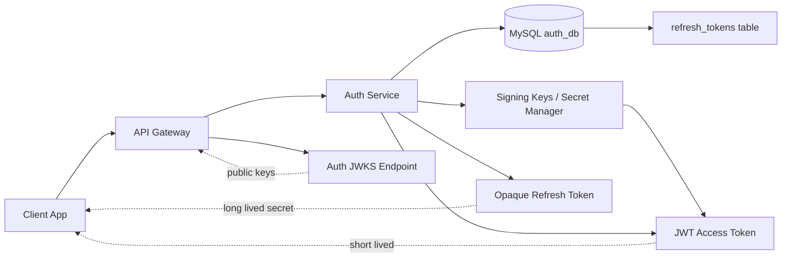
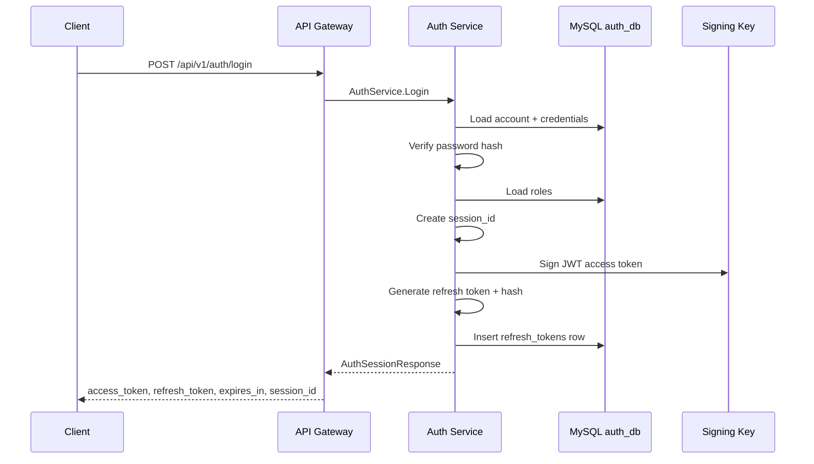
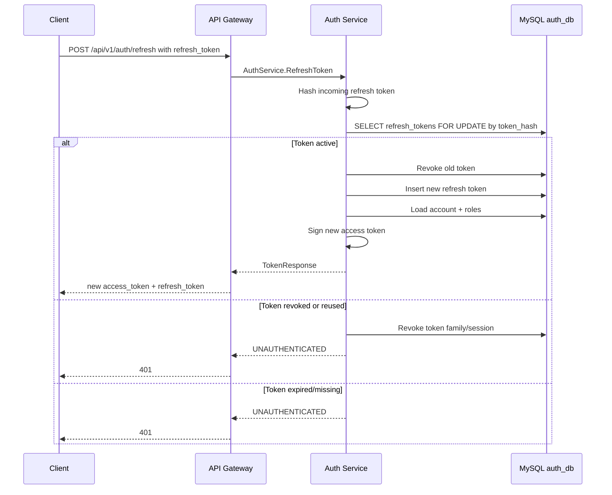
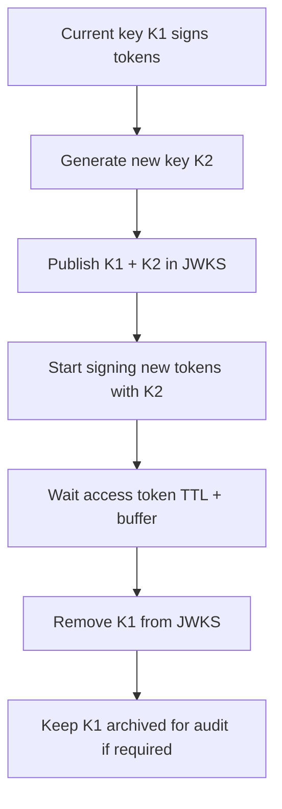
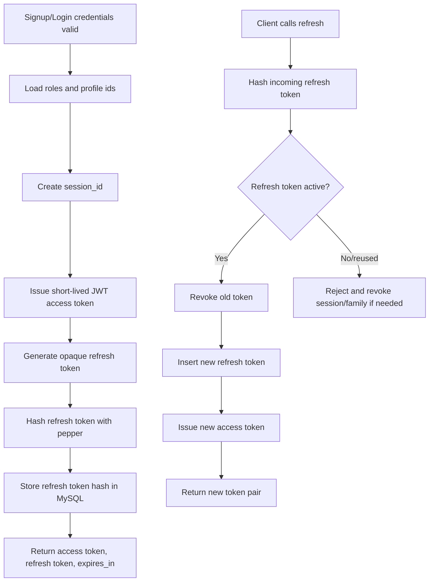

# 🔐 Auth Service - Task 4: JWT Issuing


## 📌 Task Summary

| Field | Detail |
|---|---|
| Task Name | JWT issuing |
| Source | `docs/01-micro-tasks.md` → `Auth Service` → Task 4 |
| Priority | `P0` security foundation |
| Dependency | Auth Service Task 3: Password hashing / Credentials |
| Main Goal | Short-lived access token issue karna, rotating refresh token banana, aur claims me user id, seller/tenant id, roles, session id rakhna |
| Core Boundary | Auth Service token issue, refresh rotation, token hash storage, signing keys, and JWKS publish karega |
| Output Type | Structured implementation guide |
| Not Included | OTP verification, RBAC middleware implementation, Session Service event integration, complete REST/Gateway code, production key manager setup |

> **Simple Hinglish goal:** Is task ka purpose login/signup ke baad secure token pair dena hai. Access token short-lived JWT hoga jo Gateway validate karega. Refresh token long-lived random secret hoga jo database me plain text nahi, sirf hash form me store hoga. Refresh ke time old token revoke hoga aur naya token issue hoga.

---

## ✅ Final Output Created

```text
TaskImplementation/
├── Auth Service/
│   ├── task1.md
│   ├── task2.md
│   ├── task3.md
│   └── task4.md
├── Platform Foundation/
│   ├── task1.md
│   ├── task2.md
│   ├── task3.md
│   ├── task4.md
│   ├── task5.md
│   ├── task6.md
│   ├── task7.md
│   └── task8.md
└── User Service/
    └── task1.md
```

### Why this structure?

- `TaskImplementation/` project ke task-wise implementation guides ka central folder hai.
- `Auth Service/` folder already present tha, isliye usko keep kiya gaya.
- `task4.md` sirf **Auth Service - Task 4** ka guide hai.
- Existing `task1.md`, `task2.md`, `task3.md`, Platform Foundation guides, aur User Service guide untouched rakhe gaye.
- Actual backend source files create nahi ki gayi, kyunki requested output sirf folder structure aur `task4.md` content generate karna hai.

---

## 🧭 Implementation Approach

Is guide ko banate time project ke official docs ko source of truth maana gaya:

| Document | Kya use kiya gaya |
|---|---|
| `docs/01-micro-tasks.md` | Auth Service Task 4 ka exact scope: JWT issuing |
| `TaskImplementation/Auth Service/task1.md` | Signup, login, refresh, logout token flows |
| `TaskImplementation/Auth Service/task2.md` | `refresh_tokens` table, token hash, session id, revoke fields |
| `TaskImplementation/Auth Service/task3.md` | Login credentials verify hone ke baad token issue touchpoint |
| `docs/02-system-architecture.md` | Gateway Auth Service se JWT validate/introspect karega |
| `docs/03-folder-structure.md` | Future `backend/services/auth-service/` folder convention |
| `docs/04-microservice-design.md` | Auth Service responsibility: JWT access token issue and refresh token rotation |
| `docs/05-database-design.md` | Auth DB tables and `refresh_tokens(token_hash)` index |
| `docs/06-auth-security.md` | JWT TTL, refresh rotation, `kid`, issuer/audience, secret rules |
| `docs/08-session-management-system.md` | Session id claim and future login/session relationship |
| `api/master-api.json` | `AuthService.Login`, `RefreshToken`, `VerifyAccessToken`, response schemas |

---

## 🧱 Task Boundary

### ✅ Included in Task 4

- Access token JWT issue strategy
- Refresh token generation and rotation strategy
- JWT claims contract define karna
- `kid` based signing key selection
- JWKS/public key publish strategy
- Refresh token hash storage and lookup
- Refresh token reuse detection
- Login/signup ke baad token pair issue flow
- `POST /api/v1/auth/refresh` internal flow
- `AuthService.VerifyAccessToken` introspection strategy
- Go code examples for token issuer, claims, refresh token hashing, and repository contract
- External libraries/tools explanation
- Mermaid architecture and sequence diagrams
- Security checklist and beginner-friendly implementation steps

### 🚫 Not Included in Task 4

- OTP generate/verify implementation
- RBAC middleware code for Gateway/services
- Full Session Management Service integration
- Complete Auth gRPC server implementation
- Complete API Gateway REST handlers
- Production KMS/Secrets Manager setup
- Actual private key creation/commit
- Full auth security test suite

> 🟢 **Rule:** Task 4 ka scope token issuing and refresh rotation tak limited hai. OTP Task 5, RBAC middleware Task 6, Session Service link Task 7, aur security tests Task 8 me aayenge.

---

## 🗂️ Target Implementation Folder Structure

Future me actual Auth Service implementation ka JWT/token part yahan rahega:

```text
backend/
└── services/
    └── auth-service/
        ├── internal/
        │   ├── domain/
        │   │   ├── token.go
        │   │   └── role.go
        │   ├── security/
        │   │   └── token/
        │   │       ├── claims.go
        │   │       ├── issuer.go
        │   │       ├── verifier.go
        │   │       ├── refresh.go
        │   │       ├── keys.go
        │   │       └── jwks.go
        │   ├── usecase/
        │   │   ├── login.go
        │   │   ├── signup.go
        │   │   ├── refresh.go
        │   │   └── verify_access_token.go
        │   ├── repository/
        │   │   ├── mysql_token_repository.go
        │   │   ├── mysql_account_repository.go
        │   │   └── mysql_role_repository.go
        │   ├── transport/
        │   │   └── grpc/
        │   │       └── auth_handler.go
        │   └── config/
        │       └── config.go
        └── migrations/
            ├── 001_create_auth_tables.up.sql
            └── 001_create_auth_tables.down.sql
```

### Folder responsibility

| Path | Responsibility |
|---|---|
| `internal/security/token/claims.go` | JWT claim struct and validation helpers |
| `internal/security/token/issuer.go` | Access token sign karega |
| `internal/security/token/verifier.go` | Access token verify/introspect karega |
| `internal/security/token/refresh.go` | Refresh token random generation and hashing |
| `internal/security/token/keys.go` | Signing key load, `kid`, rotation metadata |
| `internal/security/token/jwks.go` | Public keys JWKS format me expose karega |
| `internal/usecase/login.go` | Password verify ke baad token pair issue karega |
| `internal/usecase/signup.go` | Account create ke baad initial token pair issue karega |
| `internal/usecase/refresh.go` | Refresh token rotate karega |
| `internal/usecase/verify_access_token.go` | Internal introspection method implement karega |
| `internal/repository/mysql_token_repository.go` | `refresh_tokens` table read/write/revoke karega |

> 🟡 **Important:** Ye target structure hai. Is Task 4 me sirf `TaskImplementation/Auth Service/task4.md` create kiya gaya.

---

## 🔑 Token Architecture



### Hinglish Explanation

Access token JWT hota hai. Isme claims hote hain and Auth Service private key se sign karta hai. Gateway public key/JWKS se validate kar sakta hai, isliye har request pe Auth DB hit nahi hoti.

Refresh token JWT nahi hoga. Refresh token ek random opaque secret hoga. Client ko plain refresh token milega, lekin MySQL me sirf uska hash store hoga. Jab client refresh karega, Auth Service incoming token ka hash banakar DB row find karega.

---

## 🧩 Token Types

| Token | Format | TTL | Stored in DB? | Purpose |
|---|---|---:|---:|---|
| Access token | Signed JWT | `15 minutes` | ❌ No | API calls ke liye bearer token |
| Refresh token | Random opaque string | `7-30 days` | ✅ Hash only | New access token lene ke liye |
| JWKS public key | JSON Web Key Set | Cacheable | ❌ No sensitive data | Gateway ko JWT verify karne ke liye |

### Why access token short-lived?

Access token bearer token hota hai. Agar leak ho gaya, attacker expiry tak use kar sakta hai. Isliye TTL short rakha gaya: recommended `15 minutes`.

### Why refresh token rotate hota hai?

Refresh token long-lived hota hai, isliye har refresh request pe old token revoke karke new token issue karna safer hai. Agar old token dobara use hota hai, to possible theft/replay signal milta hai.

---

## 📦 External Libraries / Tools

| Library/Tool | What it is | Why used | Install |
|---|---|---|---|
| `github.com/golang-jwt/jwt/v5` | Go JWT signing/verification library | JWT claims create, `exp/iat/iss/aud` validate, `kid` header set karne ke liye | `go get github.com/golang-jwt/jwt/v5` |
| Go `crypto/rand` | Standard library secure random generator | Refresh token secret, `jti`, and nonce generate karne ke liye | No install needed |
| Go `crypto/hmac` + `crypto/sha256` | Standard library keyed hash utilities | Refresh token ka irreversible DB hash banane ke liye | No install needed |
| Go `encoding/base64` | Standard library encoder | Random bytes ko URL-safe token string me convert karne ke liye | No install needed |
| MySQL transaction support | Existing DB layer/driver capability | Old refresh token revoke + new token insert atomic karne ke liye | Project DB driver ke through |

### Install command

```bash
go get github.com/golang-jwt/jwt/v5
```

### Basic usage example

```go
token := jwt.NewWithClaims(jwt.SigningMethodRS256, claims)
token.Header["kid"] = keyID

signed, err := token.SignedString(privateKey)
if err != nil {
    return "", err
}
```

> 🔐 **Security note:** JWT private key, refresh token pepper, DB password, ya koi real secret codebase me commit nahi karna. Ye values Kubernetes Secret, External Secrets Operator, ya cloud secret manager se load honi chahiye.

---

## ⚙️ Recommended Config

Auth Service config me token-related settings explicit hone chahiye:

```env
JWT_ISSUER=ecommerce-auth
JWT_AUDIENCE=ecommerce-api
JWT_ACCESS_TTL=15m
JWT_SIGNING_ALG=RS256
JWT_KEY_ID=auth-key-2026-05
JWT_PRIVATE_KEY_PEM_PATH=/var/run/secrets/auth/jwt-private.pem
JWT_PUBLIC_KEY_PEM_PATH=/var/run/secrets/auth/jwt-public.pem
REFRESH_TOKEN_TTL=720h
REFRESH_TOKEN_PEPPER=replace-from-secret-manager
```

### Config fields explanation

| Field | Meaning |
|---|---|
| `JWT_ISSUER` | Token kis service ne issue kiya. Expected value: `ecommerce-auth` |
| `JWT_AUDIENCE` | Token kis API ke liye valid hai. Expected value: `ecommerce-api` |
| `JWT_ACCESS_TTL` | Access token validity. Recommended: `15m` |
| `JWT_SIGNING_ALG` | Signing algorithm. Recommended: `RS256` for broad JWKS support |
| `JWT_KEY_ID` | `kid` header value, key rotation ke liye |
| `JWT_PRIVATE_KEY_PEM_PATH` | Private key location, only Auth Service ke paas |
| `JWT_PUBLIC_KEY_PEM_PATH` | Public key location, JWKS publish ke liye |
| `REFRESH_TOKEN_TTL` | Refresh token expiry. Recommended: `7-30 days` |
| `REFRESH_TOKEN_PEPPER` | Token hash me server-side secret, DB leak impact reduce karta hai |

---

## 🧾 JWT Claims Contract

Access token me sirf woh data rahega jo Gateway and downstream services ko authorization context ke liye chahiye.

```json
{
  "sub": "user_123",
  "sid": "sess_123",
  "roles": ["buyer"],
  "seller_id": "seller_456",
  "tenant_id": "tenant_default",
  "token_type": "access",
  "jti": "jti_01HX...",
  "iat": 1760000000,
  "nbf": 1760000000,
  "exp": 1760000900,
  "iss": "ecommerce-auth",
  "aud": "ecommerce-api"
}
```

### Claim meaning

| Claim | Meaning | Required? |
|---|---|---:|
| `sub` | User Service ka public `user_id` | ✅ |
| `sid` | Current login session id | ✅ |
| `roles` | Assigned roles: `buyer`, `seller`, `admin`, etc. | ✅ |
| `seller_id` | Seller-scoped APIs ke liye seller profile id | Optional |
| `tenant_id` | Future multi-tenant support ke liye tenant/store context | Optional |
| `token_type` | Must be `access` | ✅ |
| `jti` | Unique JWT id, audit/debug/revocation support ke liye | ✅ |
| `iat` | Issued at | ✅ |
| `nbf` | Not before | ✅ |
| `exp` | Expiry | ✅ |
| `iss` | Issuer | ✅ |
| `aud` | Audience | ✅ |

### Important decisions

| Decision | Reason |
|---|---|
| `sub` me `user_id` rakho | API Gateway and domain services mostly user profile id se kaam karenge |
| `sid` mandatory rakho | Logout, suspicious activity, analytics link, and session tracking easy hoga |
| `roles` JWT me rakho | Gateway fast route-level role check kar payega |
| Critical permissions service-side verify karo | JWT role stale ho sakta hai until token expiry |
| Sensitive data JWT me mat rakho | JWT client ke paas hota hai, encrypt nahi hota, sirf signed hota hai |

---

## 🪜 Step-by-Step Implementation Guide

## Step 1: Token config define kiya

Sabse pehle Auth Service config me access token TTL, refresh token TTL, issuer, audience, signing key, and refresh token pepper add kiya.

### Target config struct

```go
package config

import "time"

type TokenConfig struct {
    Issuer              string
    Audience            string
    AccessTokenTTL      time.Duration
    RefreshTokenTTL     time.Duration
    SigningAlgorithm    string
    KeyID               string
    PrivateKeyPEMPath   string
    PublicKeyPEMPath    string
    RefreshTokenPepper  string
}
```

### Hinglish Explanation

Token behavior hardcode nahi karna chahiye. Local, staging, and production me TTL/key path alag ho sakte hain. Isliye config-driven setup rakha gaya.

---

## Step 2: Signing key load and `kid` support add kiya

JWT private key sirf Auth Service ke paas hogi. Gateway ko public key JWKS endpoint se milegi.

### Key loading example

```go
package token

import (
    "crypto/rsa"
    "os"

    "github.com/golang-jwt/jwt/v5"
)

type SigningKey struct {
    KeyID      string
    PrivateKey *rsa.PrivateKey
}

func LoadRSAPrivateKey(keyID string, path string) (*SigningKey, error) {
    pemBytes, err := os.ReadFile(path)
    if err != nil {
        return nil, err
    }

    privateKey, err := jwt.ParseRSAPrivateKeyFromPEM(pemBytes)
    if err != nil {
        return nil, err
    }

    return &SigningKey{
        KeyID:      keyID,
        PrivateKey: privateKey,
    }, nil
}
```

### Why `kid` zaruri hai?

`kid` token header me key identifier hota hai. Jab key rotate hoti hai, Gateway token ke `kid` se correct public key choose karta hai.

```json
{
  "alg": "RS256",
  "typ": "JWT",
  "kid": "auth-key-2026-05"
}
```

---

## Step 3: Claims struct banaya

Claims strongly typed hone chahiye, taaki token issue/verify dono places pe same contract follow ho.

```go
package token

import "github.com/golang-jwt/jwt/v5"

type AccessClaims struct {
    Roles     []string `json:"roles"`
    SellerID  string   `json:"seller_id,omitempty"`
    TenantID  string   `json:"tenant_id,omitempty"`
    SessionID string   `json:"sid"`
    TokenType string   `json:"token_type"`

    jwt.RegisteredClaims
}
```

### Registered claims mapping

| JWT field | Go field |
|---|---|
| `sub` | `RegisteredClaims.Subject` |
| `iss` | `RegisteredClaims.Issuer` |
| `aud` | `RegisteredClaims.Audience` |
| `iat` | `RegisteredClaims.IssuedAt` |
| `nbf` | `RegisteredClaims.NotBefore` |
| `exp` | `RegisteredClaims.ExpiresAt` |
| `jti` | `RegisteredClaims.ID` |

---

## Step 4: Access token issuer implement kiya

Credential verify hone ke baad Auth Service access token issue karega.

```go
package token

import (
    "time"

    "github.com/golang-jwt/jwt/v5"
)

type AccessTokenInput struct {
    UserID    string
    SessionID string
    Roles     []string
    SellerID  string
    TenantID  string
}

type Issuer struct {
    issuer   string
    audience string
    ttl      time.Duration
    key      *SigningKey
    now      func() time.Time
}

func (i *Issuer) IssueAccessToken(input AccessTokenInput) (string, int64, error) {
    now := i.now().UTC()
    expiresAt := now.Add(i.ttl)

    claims := AccessClaims{
        Roles:     input.Roles,
        SellerID:  input.SellerID,
        TenantID:  input.TenantID,
        SessionID: input.SessionID,
        TokenType: "access",
        RegisteredClaims: jwt.RegisteredClaims{
            Subject:   input.UserID,
            Issuer:    i.issuer,
            Audience:  jwt.ClaimStrings{i.audience},
            IssuedAt:  jwt.NewNumericDate(now),
            NotBefore: jwt.NewNumericDate(now),
            ExpiresAt: jwt.NewNumericDate(expiresAt),
            ID:        newTokenID(),
        },
    }

    t := jwt.NewWithClaims(jwt.SigningMethodRS256, claims)
    t.Header["kid"] = i.key.KeyID

    signed, err := t.SignedString(i.key.PrivateKey)
    if err != nil {
        return "", 0, err
    }

    return signed, int64(i.ttl.Seconds()), nil
}
```

### Hinglish Explanation

`IssueAccessToken` ek clean function hai: input me user/session/roles aate hain, output me signed JWT and `expires_in` seconds return hota hai. Token ke andar password, email OTP, refresh token, ya private data nahi dala gaya.

---

## Step 5: Secure refresh token generate kiya

Refresh token opaque random string hoga. Isko JWT nahi banana, kyunki refresh token ko server-side revoke/rotate karna hota hai.

```go
package token

import (
    "crypto/rand"
    "encoding/base64"
)

func NewRefreshToken() (string, error) {
    raw := make([]byte, 32)
    if _, err := rand.Read(raw); err != nil {
        return "", err
    }

    return base64.RawURLEncoding.EncodeToString(raw), nil
}
```

### Why 32 bytes?

32 random bytes = 256-bit entropy. Ye brute force ke against strong enough hai, assuming `crypto/rand` use ho raha hai.

---

## Step 6: Refresh token hash banaya

Plain refresh token DB me kabhi store nahi hoga. Incoming token ka HMAC-SHA256 hash store/compare hoga.

```go
package token

import (
    "crypto/hmac"
    "crypto/sha256"
    "encoding/hex"
)

func HashRefreshToken(plainToken string, pepper string) string {
    mac := hmac.New(sha256.New, []byte(pepper))
    mac.Write([]byte(plainToken))
    return hex.EncodeToString(mac.Sum(nil))
}
```

### Hinglish Explanation

Hash ka benefit: DB leak hone par attacker ko refresh token directly nahi milega. HMAC pepper ka benefit: sirf DB data se token verify nahi ho sakta, kyunki server-side pepper bhi chahiye.

---

## Step 7: Refresh token DB model define kiya

Task 2 ke `refresh_tokens` table ko token rotation ke liye use kiya jayega.

### Required DB fields

| Column | Use |
|---|---|
| `token_id` | Current refresh token row ka stable id |
| `account_id` | Auth account owner |
| `session_id` | Device/session scope |
| `token_hash` | HMAC-SHA256 hash of refresh token |
| `parent_token_id` | Rotation chain track karne ke liye |
| `revoked_at` | Token no longer valid |
| `expires_at` | Refresh token expiry |
| `created_at` | Audit and cleanup |

### Domain model example

```go
package domain

import "time"

type RefreshToken struct {
    TokenID       string
    AccountID     string
    SessionID     string
    TokenHash     string
    ParentTokenID string
    RevokedAt     *time.Time
    ExpiresAt     time.Time
    CreatedAt     time.Time
}

func (t RefreshToken) IsActive(now time.Time) bool {
    return t.RevokedAt == nil && now.Before(t.ExpiresAt)
}
```

---

## Step 8: Token repository contract banaya

Refresh rotation transaction ke andar honi chahiye. Isliye repository ko atomic methods provide karne chahiye.

```go
package repository

import (
    "context"
    "time"

    "ecommerce/auth-service/internal/domain"
)

type TokenRepository interface {
    FindRefreshTokenByHash(ctx context.Context, tokenHash string) (*domain.RefreshToken, error)
    InsertRefreshToken(ctx context.Context, token domain.RefreshToken) error
    RevokeRefreshToken(ctx context.Context, tokenID string, revokedAt time.Time) error
    RevokeSessionTokens(ctx context.Context, sessionID string, revokedAt time.Time) error
    RotateRefreshToken(ctx context.Context, oldTokenID string, next domain.RefreshToken) error
}
```

### Rotation transaction rule

```text
BEGIN
  SELECT old refresh token FOR UPDATE
  validate active + not expired
  UPDATE old token SET revoked_at = now
  INSERT new refresh token with parent_token_id = old token_id
COMMIT
```

### Why transaction?

Refresh endpoint pe same token se parallel requests aa sakti hain. Transaction + row lock ensure karta hai ki ek hi request success ho, baaki request revoked/reuse path me jayen.

---

## Step 9: Login/signup token pair issue flow banaya

Task 3 me password verify hone ke baad Task 4 ka token issuing start hota hai.



### Usecase pseudo-code

```go
func (uc *LoginUsecase) Login(ctx context.Context, req LoginRequest) (*AuthSessionResponse, error) {
    account, credential, err := uc.accounts.FindByIdentifier(ctx, req.Identifier)
    if err != nil {
        return nil, ErrInvalidCredentials
    }

    if err := uc.passwords.Verify(req.Password, credential.PasswordHash); err != nil {
        uc.accounts.RecordFailedAttempt(ctx, account.AccountID)
        return nil, ErrInvalidCredentials
    }

    roles, err := uc.roles.ActiveRoles(ctx, account.AccountID)
    if err != nil {
        return nil, err
    }

    sessionID := newSessionID()
    tokens, err := uc.tokens.IssuePair(ctx, IssuePairInput{
        AccountID: account.AccountID,
        UserID:    account.UserID,
        SessionID: sessionID,
        Roles:     roles,
        SellerID:  account.SellerID,
        TenantID:  "tenant_default",
    })
    if err != nil {
        return nil, err
    }

    return &AuthSessionResponse{
        Tokens:    tokens,
        SessionID: sessionID,
    }, nil
}
```

> 🟡 **Note:** `account.UserID` field yahan conceptual hai. Actual implementation me Auth account se User Service profile id mapping signup/user creation flow ke contract ke according resolve hogi.

---

## Step 10: `IssuePair` service banaya

Access token issue and refresh token insert ek reusable service me rakha gaya.

```go
type IssuePairInput struct {
    AccountID string
    UserID    string
    SessionID string
    Roles     []string
    SellerID  string
    TenantID  string
}

type TokenPair struct {
    AccessToken  string
    RefreshToken string
    ExpiresIn    int64
}

func (s *TokenService) IssuePair(ctx context.Context, input IssuePairInput) (*TokenPair, error) {
    accessToken, expiresIn, err := s.issuer.IssueAccessToken(AccessTokenInput{
        UserID:    input.UserID,
        SessionID: input.SessionID,
        Roles:     input.Roles,
        SellerID:  input.SellerID,
        TenantID:  input.TenantID,
    })
    if err != nil {
        return nil, err
    }

    refreshToken, err := NewRefreshToken()
    if err != nil {
        return nil, err
    }

    now := s.clock.Now().UTC()
    refreshRow := domain.RefreshToken{
        TokenID:   newRefreshTokenID(),
        AccountID: input.AccountID,
        SessionID: input.SessionID,
        TokenHash: HashRefreshToken(refreshToken, s.refreshPepper),
        ExpiresAt: now.Add(s.refreshTTL),
        CreatedAt: now,
    }

    if err := s.tokens.InsertRefreshToken(ctx, refreshRow); err != nil {
        return nil, err
    }

    return &TokenPair{
        AccessToken:  accessToken,
        RefreshToken: refreshToken,
        ExpiresIn:    expiresIn,
    }, nil
}
```

### Why separate service?

Login, signup, and refresh teeno flows ko token issue karna padta hai. Common `TokenService` se duplication kam hoti hai and security rules ek jagah enforce hote hain.

---

## Step 11: Refresh token rotation implement kiya

`POST /api/v1/auth/refresh` public route hai, kyunki expired access token ke baad bhi refresh call possible honi chahiye.



### Refresh usecase pseudo-code

```go
func (uc *RefreshUsecase) Refresh(ctx context.Context, plainRefreshToken string) (*TokenPair, error) {
    tokenHash := HashRefreshToken(plainRefreshToken, uc.refreshPepper)

    old, err := uc.tokens.FindRefreshTokenByHash(ctx, tokenHash)
    if err != nil {
        return nil, ErrInvalidRefreshToken
    }

    now := uc.clock.Now().UTC()
    if old.RevokedAt != nil {
        uc.tokens.RevokeSessionTokens(ctx, old.SessionID, now)
        return nil, ErrRefreshTokenReuse
    }

    if !now.Before(old.ExpiresAt) {
        return nil, ErrInvalidRefreshToken
    }

    account, err := uc.accounts.FindByAccountID(ctx, old.AccountID)
    if err != nil {
        return nil, err
    }

    roles, err := uc.roles.ActiveRoles(ctx, old.AccountID)
    if err != nil {
        return nil, err
    }

    nextPlain, err := NewRefreshToken()
    if err != nil {
        return nil, err
    }

    next := domain.RefreshToken{
        TokenID:       newRefreshTokenID(),
        AccountID:     old.AccountID,
        SessionID:     old.SessionID,
        TokenHash:     HashRefreshToken(nextPlain, uc.refreshPepper),
        ParentTokenID: old.TokenID,
        ExpiresAt:     now.Add(uc.refreshTTL),
        CreatedAt:     now,
    }

    if err := uc.tokens.RotateRefreshToken(ctx, old.TokenID, next); err != nil {
        return nil, err
    }

    accessToken, expiresIn, err := uc.issuer.IssueAccessToken(AccessTokenInput{
        UserID:    account.UserID,
        SessionID: old.SessionID,
        Roles:     roles,
        SellerID:  account.SellerID,
        TenantID:  account.TenantID,
    })
    if err != nil {
        return nil, err
    }

    return &TokenPair{
        AccessToken:  accessToken,
        RefreshToken: nextPlain,
        ExpiresIn:    expiresIn,
    }, nil
}
```

### Reuse detection logic

| Condition | Action |
|---|---|
| Token hash not found | Return `UNAUTHENTICATED` |
| Token expired | Return `UNAUTHENTICATED` |
| Token already revoked | Treat as reuse, revoke session/token family |
| Token active | Revoke old, insert new, issue access token |

---

## Step 12: JWT verifier / introspection banaya

Gateway normal requests me JWKS se local verification karega. Sensitive internal flows me `AuthService.VerifyAccessToken` call bhi support rahega.

```go
func (v *Verifier) VerifyAccessToken(tokenString string) (*AccessClaims, error) {
    parsed, err := jwt.ParseWithClaims(tokenString, &AccessClaims{}, func(t *jwt.Token) (any, error) {
        kid, _ := t.Header["kid"].(string)
        return v.keys.PublicKeyByID(kid)
    },
        jwt.WithIssuer(v.issuer),
        jwt.WithAudience(v.audience),
        jwt.WithExpirationRequired(),
    )
    if err != nil {
        return nil, err
    }

    claims, ok := parsed.Claims.(*AccessClaims)
    if !ok || !parsed.Valid {
        return nil, ErrInvalidAccessToken
    }

    if claims.TokenType != "access" {
        return nil, ErrInvalidAccessToken
    }

    return claims, nil
}
```

### Introspection output

`api/master-api.json` ke according `TokenClaims` response roughly aisa hoga:

```json
{
  "user_id": "user_123",
  "session_id": "sess_123",
  "roles": ["buyer"],
  "seller_id": "seller_456"
}
```

### Hinglish Explanation

Verifier token ka signature, issuer, audience, expiry, and token type check karta hai. Sirf decode karna enough nahi hai. JWT ko validate karna zaruri hai.

---

## Step 13: JWKS endpoint expose kiya

Gateway ko public key chahiye hoti hai. Auth Service ek JWKS endpoint expose karega, jisse Gateway `kid` ke basis pe public key cache kar sake.

### Endpoint

```http
GET /.well-known/jwks.json
```

### JWKS response example

```json
{
  "keys": [
    {
      "kty": "RSA",
      "kid": "auth-key-2026-05",
      "use": "sig",
      "alg": "RS256",
      "n": "<base64url-modulus>",
      "e": "AQAB"
    }
  ]
}
```

### Cache rule

| Header | Recommended |
|---|---|
| `Cache-Control` | `public, max-age=300` |
| Rotation overlap | Keep old public key until all old access tokens expire |
| Access token TTL | `15m`, so old key should remain at least `15m+buffer` |

---

## Step 14: API response shape align kiya

`api/master-api.json` me `TokenResponse` and `AuthSessionResponse` defined hain.

### Login/signup response

```json
{
  "user": {
    "user_id": "user_123",
    "email": "buyer@example.com",
    "status": "active",
    "roles": ["buyer"]
  },
  "tokens": {
    "access_token": "<jwt>",
    "refresh_token": "<opaque-refresh-token>",
    "expires_in": 900
  },
  "session_id": "sess_123"
}
```

### Refresh response

```json
{
  "access_token": "<new-jwt>",
  "refresh_token": "<new-opaque-refresh-token>",
  "expires_in": 900
}
```

### Important response rules

| Rule | Reason |
|---|---|
| `expires_in` seconds me return karo | Frontend token refresh scheduling simple hoti hai |
| Refresh response me user object zaruri nahi | Refresh ka kaam token renew karna hai |
| Refresh token response body me one time dikhega | DB me plain token store nahi hoga |
| Full JWT logs me print nahi karna | Token leakage risk |

---

## Step 15: Logout touchpoint define kiya

Logout Task 4 ka main feature nahi hai, but token lifecycle me revoke support zaruri hai. Full logout + Session Service link Task 7 me detail hoga.

### Current-device logout

```text
Input: refresh_token
Action:
1. Hash refresh_token
2. Find token row
3. Revoke active token row
4. Return success
```

### All-devices logout

```text
Input: account_id / user auth context
Action:
1. Find all active refresh tokens for account
2. Set revoked_at = now
3. Return success
```

### Boundary note

Access token stateless hai, isliye normally expiry tak valid rahega. High-risk immediate revocation ke liye short TTL + optional denylist/introspection strategy use ho sakti hai, but base Task 4 design refresh token revocation pe focused hai.

---

## 🧬 Key Rotation Flow



### Rotation rules

| Rule | Why |
|---|---|
| Never overwrite key without new `kid` | Gateway cache may validate old tokens |
| Publish old + new public keys during transition | Existing access tokens keep working |
| Private key stays only in Auth Service/secret manager | Signing control centralized rahega |
| Public key safe to expose via JWKS | Public key verify ke kaam aati hai, sign nahi kar sakti |

---

## 🧮 Refresh Token Table Operations

### Insert first refresh token after login

```sql
INSERT INTO refresh_tokens (
  token_id,
  account_id,
  session_id,
  token_hash,
  parent_token_id,
  expires_at,
  created_at
) VALUES (
  'rt_01HXFIRST',
  'auth_123',
  'sess_123',
  '<hmac_sha256_hash>',
  NULL,
  DATE_ADD(UTC_TIMESTAMP(), INTERVAL 30 DAY),
  UTC_TIMESTAMP()
);
```

### Find refresh token

```sql
SELECT
  token_id,
  account_id,
  session_id,
  token_hash,
  parent_token_id,
  revoked_at,
  expires_at,
  created_at
FROM refresh_tokens
WHERE token_hash = ?
LIMIT 1;
```

### Rotate refresh token in transaction

```sql
START TRANSACTION;

SELECT token_id, account_id, session_id, revoked_at, expires_at
FROM refresh_tokens
WHERE token_hash = ?
FOR UPDATE;

UPDATE refresh_tokens
SET revoked_at = UTC_TIMESTAMP()
WHERE token_id = ? AND revoked_at IS NULL;

INSERT INTO refresh_tokens (
  token_id,
  account_id,
  session_id,
  token_hash,
  parent_token_id,
  expires_at,
  created_at
) VALUES (?, ?, ?, ?, ?, ?, UTC_TIMESTAMP());

COMMIT;
```

### Cleanup expired tokens

```sql
DELETE FROM refresh_tokens
WHERE expires_at < UTC_TIMESTAMP() - INTERVAL 30 DAY;
```

> 🟠 **Operational note:** Delete policy compliance/forensics ke according tune hogi. Kuch systems expired token rows ko audit retention tak keep karte hain.

---

## 🛡️ Security Rules

| Area | Rule |
|---|---|
| Access token TTL | Short rakho, recommended `15m` |
| Refresh token storage | Plain token DB me kabhi store nahi |
| Refresh token rotation | Har refresh pe old revoke + new insert |
| Reuse detection | Revoked token use hone par session/family revoke |
| JWT algorithm | Allowlist only, e.g. `RS256`; `none` reject |
| `kid` handling | Unknown `kid` reject |
| Claims validation | `iss`, `aud`, `exp`, `nbf`, `token_type` mandatory |
| Logs | Full JWT, refresh token, password, OTP log nahi karna |
| Secrets | Private key and pepper secret manager se load |
| Clock skew | Small leeway, e.g. `30s-60s`, but long leeway avoid |

### Sensitive fields never log

```text
password
otp
refresh_token
access_token
authorization
jwt_private_key
refresh_token_pepper
token_hash
```

---

## 🚦 Error Handling

| Scenario | gRPC Code | REST Status | Message style |
|---|---|---:|---|
| Missing refresh token | `Unauthenticated` | `401` | `missing refresh token` |
| Invalid refresh token | `Unauthenticated` | `401` | `invalid refresh token` |
| Expired refresh token | `Unauthenticated` | `401` | `invalid refresh token` |
| Refresh token reused | `Unauthenticated` | `401` | `invalid refresh token` |
| Account blocked | `PermissionDenied` | `403` | `account is blocked` |
| Signing key unavailable | `Internal` | `500` | `token service unavailable` |

### Error response rule

User-facing error me exact security reason expose nahi karna. Example: token not found, expired, revoked, malformed sab external response me `invalid refresh token` ho sakta hai. Internal audit log me safe event type record karo.

---

## 📊 Observability

### Metrics

| Metric | Type | Use |
|---|---|---|
| `auth_access_tokens_issued_total` | Counter | Login/refresh volume |
| `auth_refresh_tokens_issued_total` | Counter | Refresh token creation |
| `auth_refresh_attempts_total` | Counter | Refresh endpoint usage |
| `auth_refresh_reuse_detected_total` | Counter | Possible token theft alert |
| `auth_token_issue_errors_total` | Counter | Key/signing/DB failures |
| `auth_jwks_requests_total` | Counter | Gateway JWKS fetch behavior |

### Audit events

| Event | When |
|---|---|
| `auth.login.token_issued` | Login/signup token pair issue |
| `auth.refresh.rotated` | Refresh token successful rotation |
| `auth.refresh.reuse_detected` | Revoked token used again |
| `auth.logout.revoked` | Refresh token revoked |
| `auth.key.rotated` | Signing key active `kid` changed |

### Log example

```json
{
  "level": "info",
  "event": "auth.refresh.rotated",
  "account_id": "auth_123",
  "session_id": "sess_123",
  "old_token_id": "rt_old",
  "new_token_id": "rt_new",
  "request_id": "req_123"
}
```

> 🔴 **Never:** `access_token`, `refresh_token`, `token_hash`, password, OTP, ya Authorization header log mat karo.

---

## 🧪 Verification Checklist

### Manual checks

| Check | Expected |
|---|---|
| Login success | Access token + refresh token + `expires_in=900` |
| JWT header | `alg=RS256`, `kid` present |
| JWT claims | `sub`, `sid`, `roles`, `token_type=access`, `iss`, `aud`, `exp` present |
| DB refresh row | `token_hash` stored, plain token absent |
| Refresh success | Old token revoked, new row inserted |
| Old refresh reuse | Request fails and session/family revoke action runs |
| Expired refresh token | Request fails with 401 |
| Wrong audience/issuer | Token verification fails |
| Unknown `kid` | Token verification fails |

### Unit test ideas

```text
IssueAccessToken_sets_required_claims
IssueAccessToken_sets_kid_header
VerifyAccessToken_rejects_wrong_audience
VerifyAccessToken_rejects_wrong_issuer
VerifyAccessToken_rejects_expired_token
NewRefreshToken_returns_unique_values
HashRefreshToken_is_stable_for_same_input
HashRefreshToken_changes_when_pepper_changes
Refresh_rotates_active_token
Refresh_rejects_revoked_token_reuse
Refresh_rejects_expired_token
```

> 🟡 **Note:** Full security test suite Auth Service Task 8 me detail hoga. Task 4 me test ideas and verification checklist documented hain.

---

## 🧯 Common Mistakes and Fixes

| Mistake | Risk | Fix |
|---|---|---|
| Refresh token JWT bana diya | Hard revoke/rotation complex ho jata hai | Opaque random refresh token use karo |
| Refresh token plain DB me store kiya | DB leak = active sessions leak | HMAC-SHA256 hash store karo |
| Access token TTL long rakha | Leaked token long time valid | `15m` TTL rakho |
| `iss/aud` validate nahi kiya | Dusre service/env token accept ho sakte hain | Verifier me issuer/audience mandatory karo |
| `kid` missing | Key rotation painful ho jati hai | JWT header me `kid` set karo |
| Token logs me print kiya | Credential leakage | Redaction middleware and logging denylist use karo |
| Parallel refresh handle nahi kiya | Same token multiple times rotate ho sakta hai | DB transaction + `SELECT FOR UPDATE` use karo |
| Role changes ke baad JWT stale | Old token expiry tak role old rahega | Short TTL + sensitive service-side role lookup |

---

## 🧠 End-to-End Flow Summary



### Simple mental model

```text
Access token = signed ID card, short validity.
Refresh token = secret renewal pass, stored only as hash, replaced every use.
```

---

## ✅ Completion Checklist

- [x] Auth Service Task 4 scope identify kiya
- [x] Existing `TaskImplementation/Auth Service/` folder keep kiya
- [x] `task4.md` guide create kiya
- [x] JWT claims contract define kiya
- [x] Access token TTL and signing strategy document ki
- [x] Refresh token opaque generation and hashing explain kiya
- [x] Refresh token rotation and reuse detection flow add kiya
- [x] JWKS and `kid` key rotation strategy document ki
- [x] External libraries/tools mention kiye
- [x] Folder structure, code examples, Mermaid diagrams, security checklist add kiye
- [x] OTP, RBAC middleware, Session Service link, and full tests ko future tasks ke liye out of scope rakha

---

## 🏁 Final Notes

Auth Service Task 4 ke baad system ke paas clear token issuing contract hai:

- Login/signup ke baad `AuthSessionResponse` me access token, refresh token, and session id milega.
- Access token JWT hoga, short-lived hoga, and `kid` ke saath sign hoga.
- Refresh token opaque random secret hoga, DB me sirf HMAC hash store hoga.
- Refresh endpoint old token revoke karke new refresh token issue karega.
- Gateway JWKS/public key se access token validate karega.
- Sensitive token values logs, DB plain fields, events, ya docs examples me expose nahi honge.

Next logical task: **Auth Service - Task 5: OTP verification**.
