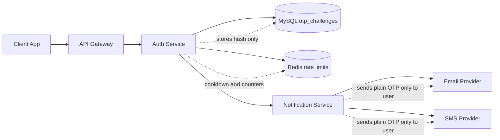
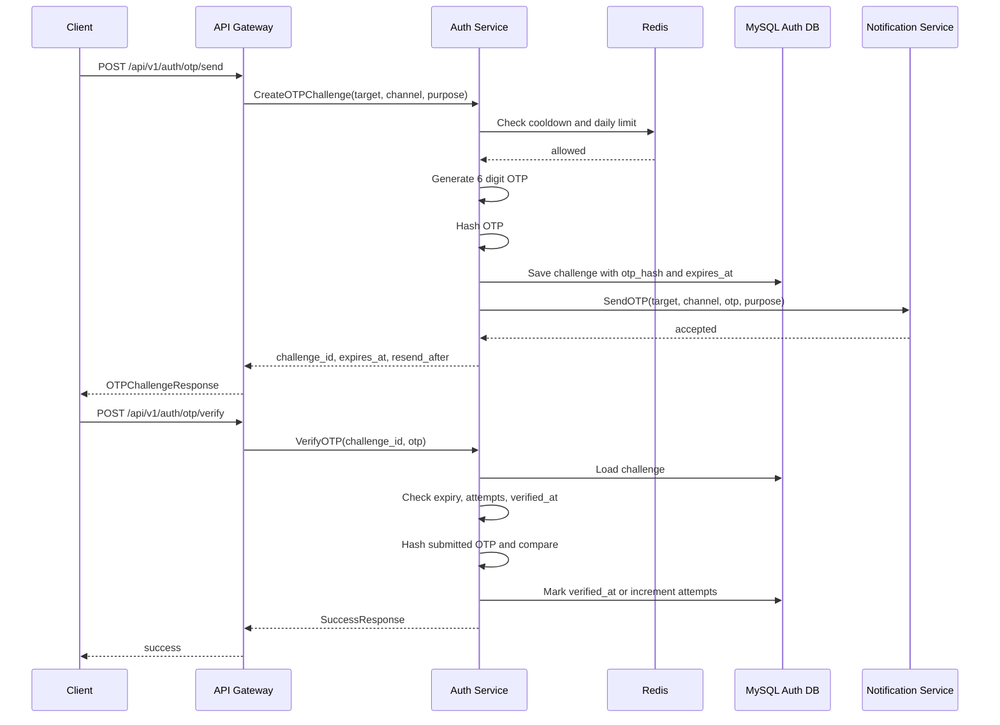
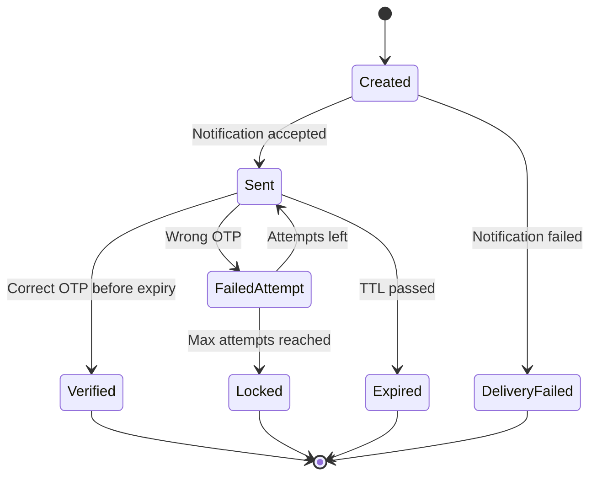

# 🔐 Auth Service - Task 5: OTP Verification


## 📌 Task Summary

| Field | Detail |
|---|---|
| Task Name | OTP verification |
| Source | `docs/01-micro-tasks.md` → `Auth Service` → Task 5 |
| Priority | `P1` security workflow |
| Dependency | Notification Service |
| Main Goal | Email and phone OTP generate, hash, expire, retry limit implement karna |
| Core Boundary | Auth Service OTP challenge create/verify karega. Notification Service sirf email/SMS delivery karega. |
| Output Type | Structured implementation guide |
| Not Included | RBAC middleware, JWT issuing, password hashing, Session Service events, complete production provider setup |

> **Simple Hinglish goal:** Is task ka purpose secure OTP flow banana hai. User email ya phone pe OTP maangega, Auth Service random OTP generate karega, database me OTP ka plain value nahi balki hash store karega, Notification Service ko OTP send karne bolega, aur verify request pe expiry, attempts, replay, and retry limits check karega.

---

## ✅ Final Output Created

```text
TaskImplementation/
├── Auth Service/
│   ├── task1.md
│   ├── task2.md
│   ├── task3.md
│   ├── task4.md
│   ├── task5.md
│   └── task6.md
├── Platform Foundation/
│   ├── task1.md
│   ├── task2.md
│   ├── task3.md
│   ├── task4.md
│   ├── task5.md
│   ├── task6.md
│   ├── task7.md
│   └── task8.md
└── User Service/
    └── task1.md
```

### Why this structure?

- `TaskImplementation/` project ke task-wise implementation guides ka central folder hai.
- `Auth Service/` folder already present tha, isliye usko keep kiya gaya.
- `task5.md` sirf **Auth Service - Task 5** ka guide hai.
- Existing `task1.md`, `task2.md`, `task3.md`, `task4.md`, `task6.md`, Platform Foundation guides, aur User Service guide untouched rakhe gaye.
- Actual backend source files create nahi ki gayi, kyunki requested output sirf folder structure aur `task5.md` content generate karna hai.

---

## 🧭 Implementation Approach

Is guide ko banate time project ke official docs ko source of truth maana gaya:

| Document | Kya use kiya gaya |
|---|---|
| `docs/01-micro-tasks.md` | Auth Service Task 5 ka exact scope: OTP verification |
| `TaskImplementation/Auth Service/task1.md` | Signup, login, password reset, email/phone verify OTP flows |
| `TaskImplementation/Auth Service/task2.md` | `otp_challenges` table and schema fields |
| `TaskImplementation/Auth Service/task3.md` | Password reset ke baad credential update boundary |
| `TaskImplementation/Auth Service/task4.md` | JWT task ke baad OTP task boundary clear rakhna |
| `docs/03-folder-structure.md` | Future `backend/services/auth-service/` folder convention |
| `docs/04-microservice-design.md` | Auth Service responsibilities and Notification Service dependency |
| `docs/05-database-design.md` | Auth DB indexes: `otp_challenges(target, purpose, expires_at)` |
| `docs/06-auth-security.md` | OTP length, expiry, attempts, cooldown, daily limit, and no-plain-storage rules |
| `docs/12-logging-monitoring-scalability.md` | Password/OTP/token logs me print na karne ka rule |
| `api/master-api.json` | REST routes and gRPC methods: `CreateOTPChallenge`, `VerifyOTP` |
| `database/draw.sql` | Existing `otp_challenges` DDL source |

---

## 🧱 Task Boundary

### ✅ Included in Task 5

- Email OTP and phone OTP support
- OTP generation strategy
- OTP hash storage strategy
- OTP expiry rule: `5 minutes`
- Max verification attempts: `5`
- Resend cooldown: `30-60 seconds`
- Per target daily limit
- `otp_challenges` DB usage
- Redis-based cooldown/rate limit strategy
- Notification Service `SendOTP` integration design
- `CreateOTPChallenge` usecase
- `VerifyOTP` usecase
- Signup, login, password reset, email verify, phone verify purposes
- Replay protection after successful verification
- Error handling and safe response rules
- Metrics, audit logs, and security checklist
- External libraries/tools explanation
- Mermaid diagrams and code examples

### 🚫 Not Included in Task 5

- JWT access token issue karna
- Refresh token rotation implement karna
- Password hashing algorithm implement karna
- RBAC middleware banana
- Session Management Service login/link events bhejna
- Notification Service ke provider adapters implement karna
- Frontend OTP screens banana
- Full production test suite banana
- Real backend source files create karna

> 🟢 **Rule:** Task 5 ka scope OTP challenge create/verify tak limited hai. Token issuing Task 4 ka kaam hai, RBAC Task 6, Session link Task 7, aur security tests Task 8 me cover honge.

---

## 🗂️ Target Implementation Folder Structure

Future me actual Auth Service implementation ka OTP part yahan rahega:

```text
backend/
└── services/
    └── auth-service/
        ├── internal/
        │   ├── domain/
        │   │   └── otp.go
        │   ├── security/
        │   │   └── otp/
        │   │       ├── generator.go
        │   │       ├── hasher.go
        │   │       └── policy.go
        │   ├── usecase/
        │   │   ├── create_otp_challenge.go
        │   │   └── verify_otp.go
        │   ├── repository/
        │   │   ├── mysql_otp_repository.go
        │   │   └── redis_otp_rate_repository.go
        │   ├── clients/
        │   │   └── notification_client.go
        │   ├── transport/
        │   │   └── grpc/
        │   │       └── auth_handler.go
        │   └── config/
        │       └── config.go
        └── migrations/
            ├── 001_create_auth_tables.up.sql
            └── 001_create_auth_tables.down.sql
```

### Folder responsibility

| Path | Responsibility |
|---|---|
| `internal/domain/otp.go` | OTP challenge entity, channel, purpose, status rules |
| `internal/security/otp/generator.go` | Cryptographically secure 6-digit OTP generate karega |
| `internal/security/otp/hasher.go` | OTP ko HMAC/SHA-256 style hash me convert karega |
| `internal/security/otp/policy.go` | Expiry, max attempts, cooldown, daily limit constants |
| `internal/usecase/create_otp_challenge.go` | OTP create, hash, DB save, notification send flow |
| `internal/usecase/verify_otp.go` | OTP compare, expiry, attempts, replay protection flow |
| `internal/repository/mysql_otp_repository.go` | `otp_challenges` table read/write/update karega |
| `internal/repository/redis_otp_rate_repository.go` | Cooldown, daily limit, verify throttle counters |
| `internal/clients/notification_client.go` | Notification Service `SendOTP` gRPC call wrapper |
| `internal/transport/grpc/auth_handler.go` | `CreateOTPChallenge` and `VerifyOTP` gRPC handlers |

> 🟡 **Important:** Ye target structure hai. Is Task 5 me sirf `TaskImplementation/Auth Service/task5.md` create kiya gaya.

---

## 🧠 OTP Concept

OTP ka full form hai **One-Time Password**. Ye short-lived code hota hai jo user ke email ya phone pe send hota hai. User prove karta hai ki uske paas target email/phone ka access hai.

### OTP kis kaam ke liye use hoga?

| Purpose | Example |
|---|---|
| `signup` | New user email/phone verify |
| `login` | Suspicious login ya passwordless/MFA style verification |
| `password_reset` | Forgot password ke baad reset authorize |
| `phone_verify` | Profile phone number verify |
| `email_verify` | Profile email address verify |

### Hinglish Explanation

OTP ko password jaisa treat karna hai. OTP chhota hota hai, isliye brute force ka risk high hota hai. Isliye plain OTP DB me store nahi karna, expiry short rakhni hai, attempts limit karne hain, resend cooldown lagana hai, aur successful verify ke baad same OTP dobara use nahi hona chahiye.

---

## 🏗️ OTP Architecture



### Ownership split

| Responsibility | Owner |
|---|---|
| OTP generate | Auth Service |
| OTP hash store | Auth Service / MySQL |
| OTP verify | Auth Service |
| Attempts/cooldown/rate limit | Auth Service / Redis |
| Email/SMS delivery | Notification Service |
| Provider retry/DLQ | Notification Service |
| Frontend OTP input screen | User App Frontend |

> 🔴 **Security rule:** Notification Service ko OTP delivery ke liye plain OTP mil sakta hai, but Notification Service bhi OTP ko logs me print nahi karega. Auth Service DB me only `otp_hash` store karega.

---

## 🔁 OTP End-to-End Flow



---

## 🧩 Database Model

Existing `database/draw.sql` me `otp_challenges` table already defined hai:

```sql
CREATE TABLE IF NOT EXISTS otp_challenges (
  id BIGINT UNSIGNED NOT NULL AUTO_INCREMENT,
  challenge_id VARCHAR(64) NOT NULL,
  account_id VARCHAR(64) NULL,
  target VARCHAR(255) NOT NULL,
  channel ENUM('email', 'phone') NOT NULL,
  purpose ENUM('signup', 'login', 'password_reset', 'phone_verify', 'email_verify') NOT NULL,
  otp_hash CHAR(64) NOT NULL,
  attempts INT NOT NULL DEFAULT 0,
  max_attempts INT NOT NULL DEFAULT 5,
  verified_at TIMESTAMP NULL,
  expires_at TIMESTAMP NOT NULL,
  created_at TIMESTAMP NOT NULL DEFAULT CURRENT_TIMESTAMP,
  PRIMARY KEY (id),
  UNIQUE KEY uk_otp_challenges_challenge_id (challenge_id),
  KEY idx_otp_target_purpose_expiry (target, purpose, expires_at),
  KEY idx_otp_account (account_id)
) ENGINE=InnoDB;
```

### Field explanation

| Field | Meaning |
|---|---|
| `challenge_id` | Public-safe ID jo client verify request me bhejega |
| `account_id` | Optional account link; signup me account create timing ke hisaab se null ho sakta hai |
| `target` | Normalized email ya phone |
| `channel` | `email` ya `phone` |
| `purpose` | OTP ka use case |
| `otp_hash` | Plain OTP ka secure hash |
| `attempts` | Wrong verification attempts count |
| `max_attempts` | Default `5` |
| `verified_at` | Successful verification timestamp; replay block ke liye |
| `expires_at` | OTP expiry, usually `created_at + 5 minutes` |

### Recommended query indexes

| Index | Why useful |
|---|---|
| `uk_otp_challenges_challenge_id` | Verify request me challenge fast load hoga |
| `idx_otp_target_purpose_expiry` | Active challenge lookup and cleanup fast hoga |
| `idx_otp_account` | Account-specific OTP audit and admin debugging me useful |

---

## 📦 External Libraries / Tools

| Library/Tool | What it is | Why used | Install |
|---|---|---|---|
| Go `crypto/rand` | Standard secure random package | OTP predictable nahi hona chahiye | Built-in, install nahi |
| Go `crypto/hmac` + `sha256` | Standard HMAC hashing packages | OTP hash deterministic and secret-pepper protected banane ke liye | Built-in, install nahi |
| MySQL | Relational DB | OTP audit, challenge state, expiry, attempts strongly consistent rakhne ke liye | Docker Compose / MySQL 8 |
| Redis | In-memory store | Cooldown, daily limit, and brute-force counters fast enforce karne ke liye | Docker Compose / Redis |
| gRPC | Internal service communication | Gateway → Auth and Auth → Notification typed calls ke liye | `go get google.golang.org/grpc` |
| `go-sql-driver/mysql` | Go MySQL driver | Auth Service repository MySQL se connect karega | `go get github.com/go-sql-driver/mysql` |
| `redis/go-redis/v9` | Go Redis client | Cooldown/rate limit keys manage karne ke liye | `go get github.com/redis/go-redis/v9` |
| `go-playground/validator/v10` | Struct validation library | Request DTO validation for channel, purpose, target | `go get github.com/go-playground/validator/v10` |

### Installation example

```bash
go get google.golang.org/grpc
go get github.com/go-sql-driver/mysql
go get github.com/redis/go-redis/v9
go get github.com/go-playground/validator/v10
```

> 🟣 **Note:** Task 5 me actual dependency install nahi ki gayi. Ye future Auth Service implementation ke liye recommended packages hain.

---

## ⚙️ OTP Policy

| Rule | Recommended Value | Why |
|---|---:|---|
| OTP length | `6 digits` | UX simple, security acceptable with rate limits |
| OTP expiry | `5 minutes` | Short attack window |
| Max verify attempts | `5` | Brute force risk reduce |
| Resend cooldown | `60 seconds` | Provider cost and spam control |
| Per target send limit | `3 per 15 min` | Abuse prevention |
| Daily target limit | `10 per day` | Long-running spam/brute force control |
| Hash algorithm | HMAC-SHA256 | DB leak me OTP recover hard |
| Store plain OTP? | Never | Security requirement |

### Why HMAC hash?

OTP sirf 6 digits ka hota hai. Agar normal SHA-256 hash store kar diya, attacker DB leak ke baad `000000` se `999999` tak brute force kar sakta hai. HMAC me server-side secret pepper use hota hai, isliye DB-only leak se OTP offline crack karna practical nahi rahega.

---

## 🔐 API Contract

`api/master-api.json` ke according OTP routes:

| REST Endpoint | gRPC Method | Auth | Purpose |
|---|---|---|---|
| `POST /api/v1/auth/otp/send` | `AuthService.CreateOTPChallenge` | `public` | OTP generate and send |
| `POST /api/v1/auth/otp/verify` | `AuthService.VerifyOTP` | `public` | OTP verify |
| `POST /api/v1/auth/password/forgot` | `AuthService.CreateOTPChallenge` | `public` | Password reset OTP send |

### Send OTP request example

```json
{
  "target": "user@example.com",
  "channel": "email",
  "purpose": "signup"
}
```

### OTP challenge response example

```json
{
  "challenge_id": "otp_chal_01HZX8G9A7K4",
  "expires_at": "2026-05-19T12:05:00Z",
  "resend_after_seconds": 60
}
```

### Verify OTP request example

```json
{
  "challenge_id": "otp_chal_01HZX8G9A7K4",
  "otp": "493820"
}
```

### Success response example

```json
{
  "success": true
}
```

> 🔴 **Safe response rule:** Wrong OTP, expired OTP, and unknown challenge ke errors me extra details expose mat karo. Attacker ko target/challenge existence guess karne me help nahi milni chahiye.

---

## 🪜 Step-by-Step Implementation Guide

## Step 1: OTP domain model define karo

Sabse pehle OTP ke allowed channel, purpose, aur status rules define honge.

```go
package domain

import "time"

type OTPChannel string

const (
    OTPChannelEmail OTPChannel = "email"
    OTPChannelPhone OTPChannel = "phone"
)

type OTPPurpose string

const (
    OTPPurposeSignup        OTPPurpose = "signup"
    OTPPurposeLogin         OTPPurpose = "login"
    OTPPurposePasswordReset OTPPurpose = "password_reset"
    OTPPurposePhoneVerify   OTPPurpose = "phone_verify"
    OTPPurposeEmailVerify   OTPPurpose = "email_verify"
)

type OTPChallenge struct {
    ChallengeID string
    AccountID   *string
    Target      string
    Channel     OTPChannel
    Purpose     OTPPurpose
    OTPHash     string
    Attempts    int
    MaxAttempts int
    VerifiedAt  *time.Time
    ExpiresAt   time.Time
    CreatedAt   time.Time
}

func (c OTPChallenge) IsExpired(now time.Time) bool {
    return !now.Before(c.ExpiresAt)
}

func (c OTPChallenge) IsVerified() bool {
    return c.VerifiedAt != nil
}

func (c OTPChallenge) AttemptsExhausted() bool {
    return c.Attempts >= c.MaxAttempts
}
```

### Hinglish Explanation

Domain model se business rules readable ho jate hain. `IsExpired`, `IsVerified`, aur `AttemptsExhausted` jaise methods usecase ko clean banate hain. Har jagah raw `if attempts >= 5` repeat karne ki zarurat nahi hoti.

---

## Step 2: OTP policy constants banao

Policy centralized rahegi taaki future me expiry/cooldown change karna easy ho.

```go
package otp

import "time"

type Policy struct {
    Length             int
    TTL                time.Duration
    MaxAttempts        int
    ResendCooldown     time.Duration
    SendLimitWindow    time.Duration
    SendLimitPerWindow int
    DailyLimit         int
}

func DefaultPolicy() Policy {
    return Policy{
        Length:             6,
        TTL:                5 * time.Minute,
        MaxAttempts:        5,
        ResendCooldown:     60 * time.Second,
        SendLimitWindow:    15 * time.Minute,
        SendLimitPerWindow: 3,
        DailyLimit:         10,
    }
}
```

### Why centralized?

- Email and phone OTP same default policy follow karenge.
- Password reset jaise sensitive purpose ke liye stricter policy override possible hai.
- Tests me short TTL inject karna easy ho jata hai.

---

## Step 3: Secure OTP generator banao

OTP `math/rand` se generate nahi karna. `crypto/rand` use karna hai.

```go
package otp

import (
    "crypto/rand"
    "fmt"
    "math/big"
)

type Generator struct {
    length int
}

func NewGenerator(length int) Generator {
    return Generator{length: length}
}

func (g Generator) Generate() (string, error) {
    max := big.NewInt(1_000_000)
    n, err := rand.Int(rand.Reader, max)
    if err != nil {
        return "", err
    }

    return fmt.Sprintf("%0*d", g.length, n.Int64()), nil
}
```

### Hinglish Explanation

`crypto/rand` OS secure randomness use karta hai. OTP predictable nahi hona chahiye, warna attacker OTP guess kar sakta hai. `fmt.Sprintf("%06d", n)` style padding se OTP always 6 digits ka banta hai, including leading zeros.

---

## Step 4: OTP hashing helper banao

Plain OTP DB me kabhi save nahi hoga. Hash ke liye HMAC-SHA256 with secret pepper use hoga.

```go
package otp

import (
    "crypto/hmac"
    "crypto/sha256"
    "encoding/hex"
)

type Hasher struct {
    pepper []byte
}

func NewHasher(pepper string) Hasher {
    return Hasher{pepper: []byte(pepper)}
}

func (h Hasher) Hash(challengeID string, code string) string {
    mac := hmac.New(sha256.New, h.pepper)
    mac.Write([]byte(challengeID))
    mac.Write([]byte(":"))
    mac.Write([]byte(code))
    return hex.EncodeToString(mac.Sum(nil))
}

func (h Hasher) Compare(challengeID string, code string, expectedHash string) bool {
    actual := h.Hash(challengeID, code)
    return hmac.Equal([]byte(actual), []byte(expectedHash))
}
```

### Why `challenge_id` hash input me add kiya?

Same OTP code different challenge me same hash na banaye. Isse hash uniqueness improve hoti hai aur replay/correlation risk reduce hota hai.

### Secret config

```text
OTP_HASH_PEPPER=<secret-from-secret-manager>
OTP_TTL_SECONDS=300
OTP_MAX_ATTEMPTS=5
OTP_RESEND_COOLDOWN_SECONDS=60
```

> 🔴 **Important:** `OTP_HASH_PEPPER` code, docs, git, Docker image, ya logs me commit nahi karna. Local me `.env.local`, production me Kubernetes Secret ya external secret manager use hoga.

---

## Step 5: Target normalize and validate karo

OTP target clean and normalized hona chahiye.

| Channel | Normalization |
|---|---|
| `email` | trim spaces, lowercase domain/local policy decide, valid email format |
| `phone` | E.164 format, example `+919876543210` |

```go
package otp

import (
    "errors"
    "net/mail"
    "strings"
)

func NormalizeEmail(input string) (string, error) {
    target := strings.TrimSpace(strings.ToLower(input))
    if target == "" {
        return "", errors.New("email is required")
    }
    if _, err := mail.ParseAddress(target); err != nil {
        return "", errors.New("invalid email")
    }
    return target, nil
}

func NormalizePhone(input string) (string, error) {
    target := strings.TrimSpace(input)
    if target == "" || !strings.HasPrefix(target, "+") {
        return "", errors.New("phone must be in E.164 format")
    }
    return target, nil
}
```

### Hinglish Explanation

Rate limit keys and DB lookup normalized target pe based hone chahiye. Agar `User@Example.com` and `user@example.com` ko separate treat kiya, attacker limits bypass kar sakta hai.

---

## Step 6: Redis cooldown and limits implement karo

Redis OTP abuse control ke liye use hoga.

### Suggested Redis keys

```text
otp:cooldown:{purpose}:{target_hash}
otp:send:window:{purpose}:{target_hash}
otp:send:daily:{purpose}:{target_hash}:{yyyyMMdd}
otp:verify:ip:{ip_hash}:{challenge_id}
```

### Why target hash key me?

Raw email/phone Redis keys me store karna avoid karo. Target ko SHA-256/HMAC se hash karke key banao taaki Redis dump leak me PII direct expose na ho.

```go
package repository

import (
    "context"
    "time"
)

type OTPRateRepository interface {
    CheckSendAllowed(ctx context.Context, purpose string, target string, now time.Time) error
    MarkSent(ctx context.Context, purpose string, target string, now time.Time) error
    MarkVerifyAttempt(ctx context.Context, challengeID string, ipHash string, now time.Time) error
}
```

### Limit behavior

| Situation | Action |
|---|---|
| Within resend cooldown | Return `429 TOO_MANY_REQUESTS` with `retry_after_seconds` |
| 15 min window exhausted | Return generic rate-limit error |
| Daily limit exhausted | Return generic rate-limit error |
| Verify too many attempts from same IP | Slow/block verify attempts |

---

## Step 7: MySQL OTP repository define karo

Repository DB details hide karega. Usecase ko SQL query strings ke baare me pata nahi hona chahiye.

```go
package repository

import (
    "context"
    "time"

    "ecommerce/auth-service/internal/domain"
)

type OTPRepository interface {
    Create(ctx context.Context, challenge domain.OTPChallenge) error
    FindByChallengeIDForUpdate(ctx context.Context, challengeID string) (domain.OTPChallenge, error)
    IncrementAttempts(ctx context.Context, challengeID string) error
    MarkVerified(ctx context.Context, challengeID string, verifiedAt time.Time) error
    ExpireOlderActiveChallenges(ctx context.Context, target string, purpose domain.OTPPurpose, now time.Time) error
}
```

### Suggested transaction rule

`VerifyOTP` me row lock use karo:

```sql
SELECT *
FROM otp_challenges
WHERE challenge_id = ?
FOR UPDATE;
```

### Why row lock?

Agar user same OTP verify request multiple tabs/devices se bhej de, race condition me same challenge multiple times verified na ho. Transaction + `FOR UPDATE` replay protection strong banata hai.

---

## Step 8: Notification Service client define karo

Auth Service OTP delivery khud nahi karega. Ye Notification Service ko typed request bhejega.

```go
package clients

import "context"

type SendOTPRequest struct {
    Target      string
    Channel     string
    Purpose     string
    OTP         string
    ChallengeID string
    ExpiresInSec int
}

type NotificationClient interface {
    SendOTP(ctx context.Context, req SendOTPRequest) error
}
```

### Hinglish Explanation

Auth Service ka kaam security decision hai. Notification Service ka kaam delivery hai. Is split se email/SMS provider change karna Auth Service ko touch kiye bina possible hota hai.

### Delivery failure behavior

| Failure | Recommended behavior |
|---|---|
| Notification Service unavailable | Challenge ko `delivery_failed` mark karne ke liye future status column useful hoga; current schema me generic error return karo |
| Provider accepted but delayed | Client ko challenge return karo; Notification Service retry handle karega |
| SMS provider fails permanently | Notification Service DLQ/audit me store karega |

> 🟠 **Schema note:** Current table me delivery status column nahi hai. MVP me challenge save + send call fail hua to transaction rollback or immediate cleanup strategy choose kar sakte ho. Later `delivery_status` add karna useful hoga.

---

## Step 9: `CreateOTPChallenge` usecase banao

Create flow me validation, rate limit, generate, hash, store, and notify steps honge.

```go
package usecase

import (
    "context"
    "time"

    "ecommerce/auth-service/internal/clients"
    "ecommerce/auth-service/internal/domain"
    "ecommerce/auth-service/internal/repository"
    otpsec "ecommerce/auth-service/internal/security/otp"
)

type CreateOTPChallengeUsecase struct {
    repo       repository.OTPRepository
    rateRepo   repository.OTPRateRepository
    notifier   clients.NotificationClient
    generator  otpsec.Generator
    hasher     otpsec.Hasher
    policy     otpsec.Policy
    idFactory  func() string
    clock      func() time.Time
}

type CreateOTPChallengeInput struct {
    AccountID *string
    Target    string
    Channel   domain.OTPChannel
    Purpose   domain.OTPPurpose
}

type CreateOTPChallengeOutput struct {
    ChallengeID        string
    ExpiresAt          time.Time
    ResendAfterSeconds int
}

func (uc CreateOTPChallengeUsecase) Execute(ctx context.Context, in CreateOTPChallengeInput) (CreateOTPChallengeOutput, error) {
    now := uc.clock()

    if err := uc.rateRepo.CheckSendAllowed(ctx, string(in.Purpose), in.Target, now); err != nil {
        return CreateOTPChallengeOutput{}, err
    }

    code, err := uc.generator.Generate()
    if err != nil {
        return CreateOTPChallengeOutput{}, err
    }

    challengeID := uc.idFactory()
    expiresAt := now.Add(uc.policy.TTL)
    codeHash := uc.hasher.Hash(challengeID, code)

    challenge := domain.OTPChallenge{
        ChallengeID: challengeID,
        AccountID:   in.AccountID,
        Target:      in.Target,
        Channel:     in.Channel,
        Purpose:     in.Purpose,
        OTPHash:     codeHash,
        Attempts:    0,
        MaxAttempts: uc.policy.MaxAttempts,
        ExpiresAt:   expiresAt,
        CreatedAt:   now,
    }

    if err := uc.repo.ExpireOlderActiveChallenges(ctx, in.Target, in.Purpose, now); err != nil {
        return CreateOTPChallengeOutput{}, err
    }
    if err := uc.repo.Create(ctx, challenge); err != nil {
        return CreateOTPChallengeOutput{}, err
    }

    err = uc.notifier.SendOTP(ctx, clients.SendOTPRequest{
        Target:       in.Target,
        Channel:      string(in.Channel),
        Purpose:      string(in.Purpose),
        OTP:          code,
        ChallengeID:  challengeID,
        ExpiresInSec: int(uc.policy.TTL.Seconds()),
    })
    if err != nil {
        return CreateOTPChallengeOutput{}, err
    }

    if err := uc.rateRepo.MarkSent(ctx, string(in.Purpose), in.Target, now); err != nil {
        return CreateOTPChallengeOutput{}, err
    }

    return CreateOTPChallengeOutput{
        ChallengeID:        challengeID,
        ExpiresAt:          expiresAt,
        ResendAfterSeconds: int(uc.policy.ResendCooldown.Seconds()),
    }, nil
}
```

### Step-by-step explanation

| Step | Kya hua | Why |
|---|---|---|
| 1 | Rate limit check | Spam and brute force block |
| 2 | Secure OTP generate | Predictable OTP avoid |
| 3 | `challenge_id` create | Client verify ke liye reference |
| 4 | OTP hash create | Plain OTP DB me nahi |
| 5 | Old active challenges expire | Latest OTP only use karna safer |
| 6 | DB me challenge save | Audit and verification state |
| 7 | Notification Service call | Email/SMS send |
| 8 | Redis sent counters update | Cooldown and quota enforce |
| 9 | Response return | Client ko only metadata milega, OTP nahi |

---

## Step 10: `VerifyOTP` usecase banao

Verify flow me challenge load, state checks, hash compare, attempts update, and verified mark hoga.

```go
package usecase

import (
    "context"
    "errors"
    "time"

    "ecommerce/auth-service/internal/repository"
    otpsec "ecommerce/auth-service/internal/security/otp"
)

var (
    ErrInvalidOTP = errors.New("invalid otp")
    ErrOTPExpired = errors.New("otp expired")
    ErrOTPAlreadyUsed = errors.New("otp already used")
    ErrOTPAttemptsExceeded = errors.New("otp attempts exceeded")
)

type VerifyOTPUsecase struct {
    repo      repository.OTPRepository
    rateRepo  repository.OTPRateRepository
    hasher    otpsec.Hasher
    clock     func() time.Time
}

type VerifyOTPInput struct {
    ChallengeID string
    OTP         string
    IPHash      string
}

func (uc VerifyOTPUsecase) Execute(ctx context.Context, in VerifyOTPInput) error {
    now := uc.clock()

    if err := uc.rateRepo.MarkVerifyAttempt(ctx, in.ChallengeID, in.IPHash, now); err != nil {
        return err
    }

    challenge, err := uc.repo.FindByChallengeIDForUpdate(ctx, in.ChallengeID)
    if err != nil {
        return ErrInvalidOTP
    }

    if challenge.IsVerified() {
        return ErrOTPAlreadyUsed
    }
    if challenge.IsExpired(now) {
        return ErrOTPExpired
    }
    if challenge.AttemptsExhausted() {
        return ErrOTPAttemptsExceeded
    }

    if !uc.hasher.Compare(challenge.ChallengeID, in.OTP, challenge.OTPHash) {
        _ = uc.repo.IncrementAttempts(ctx, challenge.ChallengeID)
        return ErrInvalidOTP
    }

    return uc.repo.MarkVerified(ctx, challenge.ChallengeID, now)
}
```

### Step-by-step explanation

| Step | Kya hua | Why |
|---|---|---|
| 1 | IP/challenge verify throttle | Automated guessing slow |
| 2 | Challenge load with lock | Race condition avoid |
| 3 | `verified_at` check | OTP replay block |
| 4 | `expires_at` check | Old OTP invalid |
| 5 | `attempts` check | Brute force block |
| 6 | Submitted OTP hash compare | Plain OTP compare/store nahi |
| 7 | Wrong OTP pe attempts increment | Max retry enforce |
| 8 | Correct OTP pe `verified_at` set | One-time use guarantee |

---

## Step 11: Account verification update karo

OTP successful hone ke baad purpose ke basis pe next action hoga.

| Purpose | Success action |
|---|---|
| `signup` | Account email/phone verified mark; signup complete |
| `email_verify` | `auth_accounts.email_verified = true` |
| `phone_verify` | `auth_accounts.phone_verified = true` |
| `password_reset` | Password reset flow ko allow karo |
| `login` | Login/MFA flow ko continue karo |

### Example usecase extension

```go
func (uc VerifyOTPUsecase) afterVerified(ctx context.Context, challengeID string) error {
    challenge, err := uc.repo.FindByChallengeIDForUpdate(ctx, challengeID)
    if err != nil {
        return err
    }

    switch challenge.Purpose {
    case "email_verify":
        return uc.accountRepo.MarkEmailVerified(ctx, *challenge.AccountID)
    case "phone_verify":
        return uc.accountRepo.MarkPhoneVerified(ctx, *challenge.AccountID)
    case "password_reset":
        return uc.resetRepo.MarkChallengeApproved(ctx, challenge.ChallengeID)
    default:
        return nil
    }
}
```

> 🟡 **Boundary note:** Password reset ka actual new password hashing Task 3 ke password hasher se hoga. Task 5 sirf reset OTP ko verify/approve karega.

---

## Step 12: gRPC handler map karo

Auth Service methods:

```text
AuthService.CreateOTPChallenge(SendOTPRequest) returns OTPChallengeResponse
AuthService.VerifyOTP(VerifyOTPRequest) returns SuccessResponse
```

```go
package grpc

func (h *AuthHandler) CreateOTPChallenge(ctx context.Context, req *authv1.SendOTPRequest) (*authv1.OTPChallengeResponse, error) {
    out, err := h.createOTP.Execute(ctx, usecase.CreateOTPChallengeInput{
        Target:  req.GetTarget(),
        Channel: domain.OTPChannel(req.GetChannel()),
        Purpose: domain.OTPPurpose(req.GetPurpose()),
    })
    if err != nil {
        return nil, mapAuthError(err)
    }

    return &authv1.OTPChallengeResponse{
        ChallengeId:        out.ChallengeID,
        ExpiresAt:          timestamppb.New(out.ExpiresAt),
        ResendAfterSeconds: int32(out.ResendAfterSeconds),
    }, nil
}

func (h *AuthHandler) VerifyOTP(ctx context.Context, req *authv1.VerifyOTPRequest) (*commonv1.SuccessResponse, error) {
    err := h.verifyOTP.Execute(ctx, usecase.VerifyOTPInput{
        ChallengeID: req.GetChallengeId(),
        OTP:         req.GetOtp(),
        IPHash:      ipHashFromContext(ctx),
    })
    if err != nil {
        return nil, mapAuthError(err)
    }

    return &commonv1.SuccessResponse{Success: true}, nil
}
```

### Error mapping

| Usecase error | gRPC code | REST status |
|---|---|---:|
| Invalid request | `InvalidArgument` | `400` |
| Invalid OTP | `Unauthenticated` | `401` |
| Expired OTP | `Unauthenticated` | `401` |
| Attempts exceeded | `ResourceExhausted` | `429` |
| Cooldown active | `ResourceExhausted` | `429` |
| Notification unavailable | `Unavailable` | `503` |

---

## Step 13: API Gateway route behavior

Gateway public routes expose karega:

```text
POST /api/v1/auth/otp/send
POST /api/v1/auth/otp/verify
POST /api/v1/auth/password/forgot
```

Gateway responsibilities:

- JSON request parse karna
- DTO validation karna
- IP/request id metadata attach karna
- Route-level rate limit lagana
- Auth Service gRPC call karna
- gRPC error ko REST envelope me map karna

### Gateway should not

- OTP generate nahi karega
- OTP hash/store nahi karega
- Notification provider directly call nahi karega
- OTP ko logs me print nahi karega

---

## 🧾 Request Validation Rules

| Field | Rule |
|---|---|
| `target` | Required, valid email or E.164 phone |
| `channel` | Required, one of `email`, `phone` |
| `purpose` | Required, allowed enum |
| `challenge_id` | Required, expected prefix/length |
| `otp` | Required, exactly 6 digits |

### Validation examples

```go
func ValidateOTPCode(code string) bool {
    if len(code) != 6 {
        return false
    }
    for _, ch := range code {
        if ch < '0' || ch > '9' {
            return false
        }
    }
    return true
}
```

```go
func ValidateChannelAndTarget(channel string, target string) error {
    switch channel {
    case "email":
        _, err := otp.NormalizeEmail(target)
        return err
    case "phone":
        _, err := otp.NormalizePhone(target)
        return err
    default:
        return errors.New("unsupported otp channel")
    }
}
```

---

## 🧪 Testing Strategy

Task 5 ka full security test suite Task 8 me aayega, but implementation ke time ye focused tests likhne chahiye.

### Unit tests

| Test | Expected |
|---|---|
| OTP generator length | Always 6 digits |
| OTP generator leading zero | `000123` style possible |
| HMAC hash deterministic | Same challenge + OTP same hash |
| HMAC compare constant-time | `hmac.Equal` used |
| Expired challenge rejected | Verify fails |
| Already verified challenge rejected | Replay blocked |
| Wrong OTP increments attempts | Attempts count increases |
| Max attempts reached | Further verify blocked |
| Correct OTP marks verified | `verified_at` set |

### Integration tests

| Test | Expected |
|---|---|
| Create OTP saves hash only | Plain OTP not in DB |
| Create OTP calls Notification Service | SendOTP called once |
| Notification failure handled | Safe error returned |
| Redis cooldown blocks resend | `429` style error |
| Concurrent verify requests | Only one succeeds |

### Example test skeleton

```go
func TestVerifyOTPRejectsReplay(t *testing.T) {
    repo := newFakeOTPRepo()
    hasher := otp.NewHasher("test-pepper")
    challengeID := "otp_chal_test"
    code := "123456"

    repo.Create(domain.OTPChallenge{
        ChallengeID: challengeID,
        OTPHash:     hasher.Hash(challengeID, code),
        MaxAttempts: 5,
        ExpiresAt:   time.Now().Add(5 * time.Minute),
    })

    uc := VerifyOTPUsecase{
        repo:   repo,
        hasher: hasher,
        clock:  time.Now,
    }

    require.NoError(t, uc.Execute(context.Background(), VerifyOTPInput{
        ChallengeID: challengeID,
        OTP:         code,
    }))

    err := uc.Execute(context.Background(), VerifyOTPInput{
        ChallengeID: challengeID,
        OTP:         code,
    })
    require.ErrorIs(t, err, ErrOTPAlreadyUsed)
}
```

---

## 📊 Observability

OTP flow high-risk hai, isliye logs and metrics carefully add karne honge.

### Logs

Allowed log fields:

| Field | Safe? |
|---|---:|
| `request_id` | ✅ |
| `challenge_id` | ✅ |
| `purpose` | ✅ |
| `channel` | ✅ |
| `target_hash` | ✅ |
| raw `target` email/phone | ⚠️ avoid/mask |
| raw OTP | ❌ never |
| `otp_hash` | ❌ never |

### Metrics

| Metric | Meaning |
|---|---|
| `auth_otp_challenges_created_total` | OTP send requests accepted |
| `auth_otp_delivery_failures_total` | Notification Service delivery failures |
| `auth_otp_verify_success_total` | Successful verifications |
| `auth_otp_verify_failure_total` | Wrong/expired/replayed OTP |
| `auth_otp_rate_limited_total` | Cooldown or quota block |
| `auth_otp_attempts_exceeded_total` | Max attempts exhausted |

### Audit events

| Event | When |
|---|---|
| `OTP_CHALLENGE_CREATED` | Challenge saved |
| `OTP_VERIFIED` | Correct OTP |
| `OTP_VERIFY_FAILED` | Wrong OTP |
| `OTP_EXPIRED` | Expired challenge used |
| `OTP_RATE_LIMITED` | Cooldown/quota hit |

> 🔴 **Logging rule:** OTP, password, refresh token, full JWT, card data, and raw secrets logs me kabhi nahi print karne.

---

## 🔒 Security Checklist

- [x] OTP `crypto/rand` se generate hoga
- [x] OTP minimum 6 digits ka hoga
- [x] OTP plain text DB me store nahi hoga
- [x] OTP hash HMAC-SHA256 with secret pepper use karega
- [x] OTP expiry default `5 minutes` hogi
- [x] Max attempts default `5` honge
- [x] Successful verify ke baad `verified_at` set hoga
- [x] Same OTP replay block hoga
- [x] Resend cooldown `30-60 seconds` hoga
- [x] Per target daily limit hoga
- [x] Target normalized hoga before rate limit and DB write
- [x] Redis keys raw email/phone expose nahi karenge
- [x] Notification Service dependency isolated client me rahegi
- [x] Logs me OTP, OTP hash, secrets, raw tokens nahi honge
- [x] Wrong/expired/unknown OTP responses safe and generic rahenge
- [x] Concurrent verify requests row lock se safe rahenge

---

## 🚦 Edge Cases

| Case | Expected behavior |
|---|---|
| User asks OTP repeatedly | Cooldown and send quota block |
| User enters old OTP after new OTP | Old challenge expired/invalid |
| User enters wrong OTP 5 times | Challenge locked/exhausted |
| User enters correct OTP after expiry | Reject as expired |
| User uses same OTP twice | Second request rejected |
| SMS provider down | Safe `503`, no OTP leaked |
| Email target capitalization differs | Normalize before lookup |
| Redis temporarily down | Prefer fail-closed for high-risk routes |
| DB row locked by concurrent verify | One verify wins, others fail/retry safely |

---

## 🧹 Cleanup Job

Expired OTP rows audit ke liye short time retain ho sakte hain, but indefinitely store nahi karne.

### Suggested cleanup query

```sql
DELETE FROM otp_challenges
WHERE expires_at < UTC_TIMESTAMP() - INTERVAL 7 DAY;
```

### Retention rule

| Data | Retention |
|---|---:|
| Active OTP challenge | Until expiry |
| Expired/verified OTP challenge | 7-30 days for audit |
| Aggregated metrics | Long-term |
| Raw OTP | Never stored |

---

## 🧩 Mermaid State Diagram



### Hinglish Explanation

OTP ek simple state machine follow karta hai. Create hone ke baad delivery accepted hoti hai, phir user verify karta hai. Wrong attempts count hote hain. Expiry ke baad OTP invalid hota hai. Verified state final hai, uske baad OTP dobara use nahi ho sakta.

---

## ✅ Definition of Done

Task 5 complete maana jayega jab:

- `CreateOTPChallenge` OTP generate, hash, persist, and notify flow define ho
- `VerifyOTP` expiry, attempts, replay, and hash compare rules define ho
- `otp_challenges` table usage clear ho
- Redis cooldown and daily limit strategy clear ho
- Notification Service dependency clear ho
- API routes and gRPC methods map ho
- Code examples beginner-friendly ho
- Mermaid architecture/flow/state diagrams included ho
- Security checklist complete ho
- Scope strictly Auth Service Task 5 tak limited ho

---

## 🧾 Quick Recap

```text
Client asks OTP
  -> Gateway forwards request
  -> Auth checks Redis limits
  -> Auth generates secure OTP
  -> Auth stores OTP hash in MySQL
  -> Auth asks Notification Service to send OTP
  -> Client submits OTP
  -> Auth checks expiry, attempts, replay
  -> Auth hashes submitted OTP and compares
  -> Auth marks challenge verified
```

### Final Hinglish Summary

Auth Service Task 5 me OTP ko secure, auditable, and brute-force resistant banaya gaya. Plain OTP sirf generation ke baad Notification Service ko delivery ke liye diya jayega; database me sirf hash rahega. Verification ke time expiry, attempts, rate limit, and replay checks mandatory rahenge. Isse signup, phone/email verify, login challenge, and password reset flows safe foundation pe build honge.
