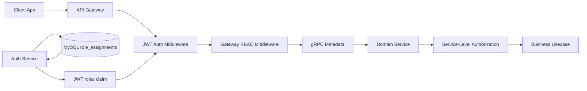
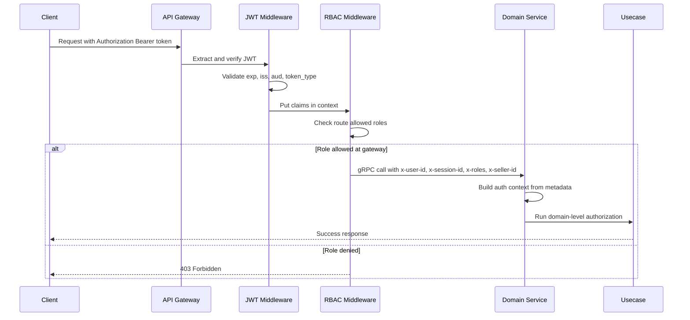
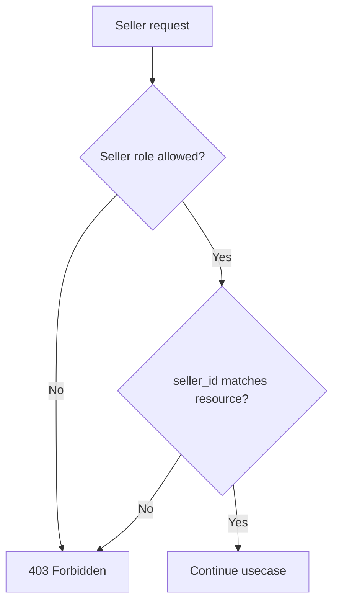
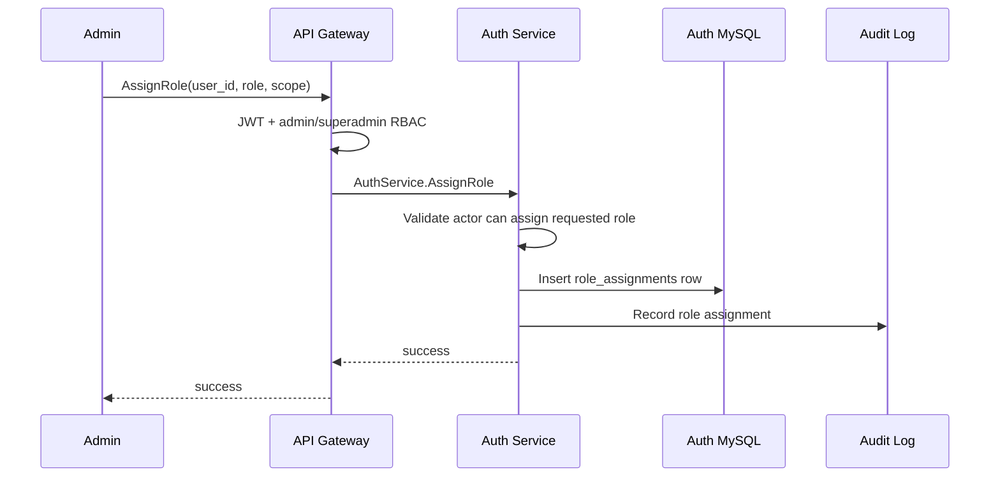

# 🔐 Auth Service - Task 6: RBAC Middleware


## 📌 Task Summary

| Field | Detail |
|---|---|
| Task Name | RBAC middleware |
| Source | `docs/01-micro-tasks.md` → `Auth Service` → Task 6 |
| Priority | `P0` security foundation |
| Dependency | Auth Service Task 4: JWT issuing |
| Main Goal | Buyer, Seller, Admin, aur Superadmin role checks centralize karna. Gateway aur services dono enforce karenge. |
| Core Boundary | Auth Service roles ka source of truth rahega. Gateway route-level RBAC karega, services domain-level authorization enforce karengi. |
| Output Type | Structured implementation guide |
| Not Included | Password hashing, JWT issuing, OTP verification, frontend UI, full production code, complete Superadmin permission service |

> **Simple Hinglish goal:** Is task ka purpose ye define karna hai ki platform me kaun sa user kaun sa route ya action access kar sakta hai. JWT valid hone ke baad RBAC middleware roles check karega. Gateway pe first gate lagega, aur service ke andar second gate lagega taaki role bypass possible na ho.

---

## ✅ Final Output Created

```text
TaskImplementation/
├── Auth Service/
│   ├── task1.md
│   ├── task2.md
│   ├── task3.md
│   ├── task4.md
│   └── task6.md
├── Platform Foundation/
│   ├── task1.md
│   ├── task2.md
│   ├── task3.md
│   ├── task4.md
│   ├── task5.md
│   ├── task6.md
│   ├── task7.md
│   └── task8.md
└── User Service/
    └── task1.md
```

### Why this structure?

- `TaskImplementation/` project ke task-wise guides ka central folder hai.
- `Auth Service/` folder already present tha, isliye usko keep kiya gaya.
- `task6.md` sirf **Auth Service - Task 6** ka guide hai.
- Existing `task1.md`, `task2.md`, `task3.md`, `task4.md`, Platform Foundation guides, aur User Service guide untouched rakhe gaye.
- `task5.md` create nahi kiya gaya, kyunki current request only **Auth Service - Task 6** ke liye hai.
- Actual backend files create nahi ki gayi. Ye file implementation guide hai, production code patch nahi.

---

## 🧭 Implementation Approach

Is guide ko banate time project ke official docs ko source of truth maana gaya:

| Document | Kya use kiya gaya |
|---|---|
| `docs/01-micro-tasks.md` | Auth Service Task 6 ka exact scope: RBAC middleware |
| `docs/02-system-architecture.md` | API Gateway JWT verify, role check, user context inject karega |
| `docs/04-microservice-design.md` | Auth Service responsibilities: role mapping, `AssignRole`, `RevokeRole`, `GetUserRoles` |
| `docs/05-database-design.md` | `role_assignments` table role source of truth hai |
| `docs/06-auth-security.md` | Role list, permission examples, Gateway + service-level RBAC enforcement |
| `docs/09-cms-superadmin.md` | Admin roles: operations, finance, catalog, superadmin |
| `api/master-api.json` | Auth levels: public, buyer, seller, admin, superadmin, webhook |
| `TaskImplementation/Auth Service/task4.md` | JWT claims me `roles`, `seller_id`, `session_id` available honge |
| `TaskImplementation/Platform Foundation/task3.md` | Shared `authctx` package pattern |
| `TaskImplementation/Platform Foundation/task5.md` | Gateway route groups, auth middleware, gRPC metadata propagation |

---

## 🧱 Task Boundary

### ✅ Included in Task 6

- RBAC role model define karna
- Auth levels map karna: `public`, `buyer`, `seller`, `admin`, `superadmin`, `webhook`
- Gateway route-level RBAC middleware design
- Service-level authorization helpers design
- Auth Service role assignment/revoke/get roles flow
- JWT roles and DB role source-of-truth relation explain karna
- Seller scoped authorization explain karna
- Admin and Superadmin high-risk checks explain karna
- gRPC metadata based auth context propagation explain karna
- Error handling, audit logging, cache, and security checklist
- External libraries/tools explanation
- Mermaid diagrams and code examples

### 🚫 Not Included in Task 6

- JWT signing ya refresh token rotation implement karna
- OTP verification implement karna
- Password hashing implement karna
- Superadmin Service ka full permission matrix implement karna
- Seller team invite UI banana
- Frontend route guards implement karna
- Real backend source files create karna
- Database migration create karna
- Security test files create karna

> 🟢 **Rule:** Task 6 ka scope RBAC middleware and authorization contract tak limited hai. Token issue Task 4 ka kaam hai, OTP Task 5 ka kaam hai, Session link Task 7 me aayega, aur full security tests Task 8 me cover honge.

---

## 🗂️ Target Implementation Folder Structure

Future me actual Auth Service + Gateway + shared authorization implementation ka structure kuch aisa ho sakta hai:

```text
backend/
├── services/
│   ├── auth-service/
│   │   ├── internal/
│   │   │   ├── domain/
│   │   │   │   └── role.go
│   │   │   ├── authorization/
│   │   │   │   ├── rbac.go
│   │   │   │   ├── permission.go
│   │   │   │   └── policy.go
│   │   │   ├── usecase/
│   │   │   │   ├── assign_role.go
│   │   │   │   ├── revoke_role.go
│   │   │   │   └── get_user_roles.go
│   │   │   ├── repository/
│   │   │   │   └── mysql_role_repository.go
│   │   │   └── transport/
│   │   │       └── grpc/
│   │   │           └── auth_handler.go
│   │   └── migrations/
│   │       └── 001_create_auth_tables.up.sql
│   └── api-gateway/
│       └── internal/
│           ├── middleware/
│           │   ├── auth.go
│           │   └── rbac.go
│           └── routes/
│               ├── buyer.go
│               ├── seller.go
│               └── admin.go
└── shared/
    ├── authctx/
    │   ├── claims.go
    │   └── context.go
    └── grpcx/
        └── auth_metadata.go
```

### Folder responsibility

| Path | Responsibility |
|---|---|
| `auth-service/internal/domain/role.go` | Role constants and role assignment entity |
| `auth-service/internal/authorization/rbac.go` | Auth Service ke central RBAC rules |
| `auth-service/internal/usecase/assign_role.go` | Admin/Superadmin role assignment flow |
| `auth-service/internal/usecase/revoke_role.go` | Role revoke flow |
| `auth-service/internal/usecase/get_user_roles.go` | Fresh DB role lookup |
| `auth-service/internal/repository/mysql_role_repository.go` | `role_assignments` table query/update |
| `api-gateway/internal/middleware/rbac.go` | REST route-level role gate |
| `shared/authctx/` | Validated user/session/role context helpers |
| `shared/grpcx/auth_metadata.go` | Gateway se services tak safe metadata pass karna |

> 🟡 **Important:** Ye target structure hai. Is Task 6 me sirf `TaskImplementation/Auth Service/task6.md` create kiya gaya.

---

## 🧠 RBAC Concept

RBAC ka full form hai **Role-Based Access Control**. Isme user ke paas ek ya multiple roles hote hain, aur har protected route/action ke liye allowed roles define hote hain.

### Simple model

```text
User -> Roles -> Allowed Route/Action
```

Example:

- Buyer cart update kar sakta hai.
- Seller apne seller account ke products manage kar sakta hai.
- Finance admin refund review kar sakta hai.
- Superadmin platform settings change kar sakta hai.

### Hinglish Explanation

JWT validation sirf ye batata hai ki user authenticated hai. RBAC ye batata hai ki user authorized hai ya nahi. Matlab:

- **Authentication:** "Ye user kaun hai?"
- **Authorization/RBAC:** "Is user ko ye kaam karne ki permission hai?"

---

## 🏗️ RBAC Architecture



### Two-layer enforcement

| Layer | Kya check karega | Why needed |
|---|---|---|
| Gateway RBAC | Route-level allowed roles | Unauthorized request service tak pahunchne se pehle block ho |
| Service RBAC | Domain-level ownership/scope | User allowed route pe hai, but kya specific resource uska hai? |

> 🔴 **Security rule:** Sirf Gateway RBAC enough nahi hai. Services ko bhi sensitive actions pe authorization verify karna hoga, because internal calls, bugs, ya misconfigured routes future me bypass risk bana sakte hain.

---

## 👥 Roles and Auth Levels

### Supported roles

| Role | Meaning |
|---|---|
| `buyer` | Normal customer |
| `seller` | Seller account owner |
| `seller_manager` | Seller team manager |
| `seller_catalog_editor` | Product/catalog manage karne wala seller staff |
| `seller_order_manager` | Seller orders manage karne wala staff |
| `admin` | General platform admin |
| `operations_admin` | Users, sellers, orders, support operations |
| `finance_admin` | Payments, refunds, reconciliation |
| `catalog_admin` | Product moderation, categories, search synonyms |
| `readonly_admin` | Read-only admin view |
| `superadmin` | Highest privilege platform owner |

### API auth levels

`api/master-api.json` ke according route auth levels:

| Auth Level | JWT Required? | Allowed Roles |
|---|---:|---|
| `public` | ❌ | No role needed |
| `buyer` | ✅ | `buyer`, `seller`, `admin`, `superadmin` |
| `seller` | ✅ | `seller`, `seller_manager`, `seller_catalog_editor`, `seller_order_manager`, `superadmin` |
| `admin` | ✅ | `admin`, `operations_admin`, `finance_admin`, `catalog_admin`, `superadmin` |
| `superadmin` | ✅ | `superadmin` |
| `webhook` | ❌ JWT nahi | Provider signature based auth |

### Permission examples

| Permission | Allowed Roles |
|---|---|
| `profile:read:self` | `buyer`, `seller`, `admin`, `superadmin` |
| `cart:write:self` | `buyer`, `seller` |
| `product:write:own_seller` | `seller`, `seller_manager`, `seller_catalog_editor`, `superadmin` |
| `order:manage:own_seller` | `seller`, `seller_manager`, `seller_order_manager`, `superadmin` |
| `payment:refund:review` | `finance_admin`, `superadmin` |
| `platform:settings:write` | `superadmin` |

---

## 🔁 RBAC Request Flow



---

## 🪜 Step-by-Step Implementation Guide

## Step 1: RBAC boundary finalize karo

Sabse pehle ye clear karo ki roles ka owner kaun hai aur checks kahan honge.

| Concern | Owner |
|---|---|
| Role assignment source of truth | Auth Service |
| Role storage | `auth_db.role_assignments` |
| JWT roles claim | Auth Service token issuer |
| REST route role check | API Gateway |
| Domain ownership check | Respective service |
| Admin high-risk audit | Superadmin Service / target service |

### Hinglish Explanation

Auth Service role decide karega, Gateway first access gate lagayega, aur service final business rule check karegi. Example: seller route pe seller role allowed hai, but Product Service ko verify karna padega ki product same seller ka hai ya nahi.

---

## Step 2: Role constants define karo

Roles string literals scattered nahi hone chahiye. Central constants use karne se typo bugs kam hote hain.

```go
package domain

type Role string

const (
    RoleBuyer               Role = "buyer"
    RoleSeller              Role = "seller"
    RoleSellerManager       Role = "seller_manager"
    RoleSellerCatalogEditor Role = "seller_catalog_editor"
    RoleSellerOrderManager  Role = "seller_order_manager"

    RoleAdmin           Role = "admin"
    RoleOperationsAdmin Role = "operations_admin"
    RoleFinanceAdmin    Role = "finance_admin"
    RoleCatalogAdmin    Role = "catalog_admin"
    RoleReadonlyAdmin   Role = "readonly_admin"
    RoleSuperadmin      Role = "superadmin"
)

func IsKnownRole(role Role) bool {
    switch role {
    case RoleBuyer, RoleSeller, RoleSellerManager, RoleSellerCatalogEditor,
        RoleSellerOrderManager, RoleAdmin, RoleOperationsAdmin, RoleFinanceAdmin,
        RoleCatalogAdmin, RoleReadonlyAdmin, RoleSuperadmin:
        return true
    default:
        return false
    }
}
```

### Why?

- Role typo jaise `super_admin` vs `superadmin` avoid hoga.
- JWT claims, DB rows, middleware, tests same constants use karenge.
- Future me new role add karna controlled rahega.

---

## Step 3: Auth level mapping centralize karo

Gateway ko har route ke liye allowed roles manually duplicate nahi karne chahiye. Auth level se role list resolve karo.

```go
package authorization

type AuthLevel string

const (
    AuthLevelPublic     AuthLevel = "public"
    AuthLevelBuyer      AuthLevel = "buyer"
    AuthLevelSeller     AuthLevel = "seller"
    AuthLevelAdmin      AuthLevel = "admin"
    AuthLevelSuperadmin AuthLevel = "superadmin"
    AuthLevelWebhook    AuthLevel = "webhook"
)

var RolesByAuthLevel = map[AuthLevel][]string{
    AuthLevelBuyer: {
        "buyer", "seller", "admin", "superadmin",
    },
    AuthLevelSeller: {
        "seller", "seller_manager", "seller_catalog_editor",
        "seller_order_manager", "superadmin",
    },
    AuthLevelAdmin: {
        "admin", "operations_admin", "finance_admin",
        "catalog_admin", "superadmin",
    },
    AuthLevelSuperadmin: {
        "superadmin",
    },
}
```

### Hinglish Explanation

Route bolega: "mujhe seller level access chahiye." Middleware mapping se decide karega ki seller level me kaun kaun roles allowed hain. Isse route code clean aur consistent rahega.

---

## Step 4: JWT claims se role context build karo

Task 4 ke JWT claims me roles already honge. RBAC middleware un claims ko context se read karega.

```go
package authctx

type Claims struct {
    UserID    string
    SessionID string
    SellerID  string
    Roles     []string
}

func (c Claims) HasRole(role string) bool {
    for _, current := range c.Roles {
        if current == role {
            return true
        }
    }
    return false
}

func (c Claims) HasAnyRole(allowed map[string]struct{}) bool {
    for _, role := range c.Roles {
        if _, ok := allowed[role]; ok {
            return true
        }
    }
    return false
}
```

### Important rule

JWT roles fast route checks ke liye useful hain. Lekin high-risk actions me service fresh DB role lookup ya Auth Service `GetUserRoles` call kar sakti hai, especially role revoke ke immediately baad.

---

## Step 5: Gateway auth middleware ke baad RBAC middleware lagao

Middleware order important hai:

```text
Request ID -> Recovery -> Rate Limit -> JWT Auth -> RBAC -> Handler
```

RBAC middleware JWT claims ke bina kaam nahi kar sakta, isliye `AuthRequired` ke baad run hoga.

```go
func RequireRoles(allowedRoles ...string) func(http.Handler) http.Handler {
    allowed := make(map[string]struct{}, len(allowedRoles))
    for _, role := range allowedRoles {
        allowed[role] = struct{}{}
    }

    return func(next http.Handler) http.Handler {
        return http.HandlerFunc(func(w http.ResponseWriter, r *http.Request) {
            claims, ok := authctx.FromContext(r.Context())
            if !ok {
                WriteError(w, r, ErrUnauthorized("missing auth context"))
                return
            }

            if !claims.HasAnyRole(allowed) {
                WriteError(w, r, ErrForbidden("insufficient role"))
                return
            }

            next.ServeHTTP(w, r)
        })
    }
}
```

### Error behavior

| Case | HTTP Status | Reason |
|---|---:|---|
| Missing token | `401 Unauthorized` | User authenticated nahi hai |
| Invalid/expired token | `401 Unauthorized` | Token trusted nahi hai |
| Valid token but role missing | `403 Forbidden` | User authenticated hai, but allowed nahi |

---

## Step 6: Route groups me auth levels apply karo

Example seller route:

```go
func registerSellerRoutes(r chi.Router, clients *Clients) {
    h := handlers.NewSellerProductHandler(clients.Product)

    r.Group(func(protected chi.Router) {
        protected.Use(AuthRequired)
        protected.Use(RequireRoles(
            "seller",
            "seller_manager",
            "seller_catalog_editor",
            "seller_order_manager",
            "superadmin",
        ))

        protected.Post("/seller/products", h.CreateProduct)
        protected.Patch("/seller/products/{product_id}", h.UpdateProduct)
    })
}
```

Example admin route:

```go
func registerAdminRoutes(r chi.Router, clients *Clients) {
    h := handlers.NewAdminHandler(clients.Superadmin)

    r.Group(func(protected chi.Router) {
        protected.Use(AuthRequired)
        protected.Use(RequireRoles(
            "admin",
            "operations_admin",
            "finance_admin",
            "catalog_admin",
            "superadmin",
        ))

        protected.Get("/admin/users", h.ListUsers)
        protected.Get("/admin/payments", h.ListPayments)
    })
}
```

### Hinglish Explanation

Gateway route group pe broad role gate lagta hai. Ye fast hai and unnecessary service calls bachata hai. But exact action permission still service/usecase me validate hoga.

---

## Step 7: gRPC metadata me safe auth context pass karo

Gateway full JWT forward nahi karega. Sirf validated safe claims metadata me pass honge.

```go
func ContextWithAuthMetadata(ctx context.Context, claims authctx.Claims) context.Context {
    md := metadata.Pairs(
        "x-user-id", claims.UserID,
        "x-session-id", claims.SessionID,
        "x-roles", strings.Join(claims.Roles, ","),
    )

    if claims.SellerID != "" {
        md.Append("x-seller-id", claims.SellerID)
    }

    return metadata.NewOutgoingContext(ctx, md)
}
```

### Metadata keys

| Key | Value |
|---|---|
| `x-user-id` | JWT `sub` |
| `x-session-id` | JWT `sid` |
| `x-roles` | Comma-separated roles |
| `x-seller-id` | Seller context if present |
| `x-request-id` | Request correlation id |

> 🔐 **Security note:** `Authorization` header ya full token internal logs/metadata me forward mat karo unless explicitly required for introspection. Minimal claims safer hain.

---

## Step 8: Service-side auth context interceptor banao

Har service incoming gRPC metadata se typed auth context banayegi.

```go
func AuthContextUnaryInterceptor(
    ctx context.Context,
    req any,
    info *grpc.UnaryServerInfo,
    handler grpc.UnaryHandler,
) (any, error) {
    md, ok := metadata.FromIncomingContext(ctx)
    if !ok {
        return handler(ctx, req)
    }

    claims := authctx.Claims{
        UserID:    first(md.Get("x-user-id")),
        SessionID: first(md.Get("x-session-id")),
        SellerID:  first(md.Get("x-seller-id")),
        Roles:     splitCSV(first(md.Get("x-roles"))),
    }

    if claims.UserID != "" {
        ctx = authctx.WithClaims(ctx, claims)
    }

    return handler(ctx, req)
}
```

### Why service interceptor?

- Usecase layer ko raw metadata parse nahi karna padega.
- Authorization helpers clean context se roles read kar sakte hain.
- Missing auth context detect karna consistent hoga.

---

## Step 9: Service-level authorization helpers banao

Services ke andar domain-level helper use karo.

```go
package authorization

import (
    "context"
    "errors"
)

var ErrUnauthenticated = errors.New("unauthenticated")
var ErrForbidden = errors.New("forbidden")

func RequireAnyRole(ctx context.Context, roles ...string) (authctx.Claims, error) {
    claims, ok := authctx.FromContext(ctx)
    if !ok || claims.UserID == "" {
        return authctx.Claims{}, ErrUnauthenticated
    }

    allowed := make(map[string]struct{}, len(roles))
    for _, role := range roles {
        allowed[role] = struct{}{}
    }

    if !claims.HasAnyRole(allowed) {
        return authctx.Claims{}, ErrForbidden
    }

    return claims, nil
}
```

Example Product Service usecase:

```go
func (uc *ProductUsecase) CreateProduct(ctx context.Context, input CreateProductInput) (*Product, error) {
    claims, err := authorization.RequireAnyRole(
        ctx,
        "seller",
        "seller_manager",
        "seller_catalog_editor",
        "superadmin",
    )
    if err != nil {
        return nil, err
    }

    if !claims.HasRole("superadmin") && claims.SellerID != input.SellerID {
        return nil, authorization.ErrForbidden
    }

    return uc.products.Create(ctx, input)
}
```

### Hinglish Explanation

Gateway ne route allow kar diya, but service ko still check karna hai ki seller same seller account ka product create/edit kar raha hai ya nahi. Ye ownership check Gateway nahi kar sakta kyunki domain data service ke paas hota hai.

---

## Step 10: Permission model add karo for fine-grained checks

Roles broad hain. Permissions specific actions ko represent karte hain.

```go
type Permission string

const (
    PermissionProfileReadSelf     Permission = "profile:read:self"
    PermissionCartWriteSelf       Permission = "cart:write:self"
    PermissionProductWriteOwn     Permission = "product:write:own_seller"
    PermissionOrderManageOwn      Permission = "order:manage:own_seller"
    PermissionPaymentRefundReview Permission = "payment:refund:review"
    PermissionPlatformWrite       Permission = "platform:settings:write"
)

var PermissionsByRole = map[string][]Permission{
    "buyer": {
        PermissionProfileReadSelf,
        PermissionCartWriteSelf,
    },
    "seller": {
        PermissionProfileReadSelf,
        PermissionProductWriteOwn,
        PermissionOrderManageOwn,
    },
    "finance_admin": {
        PermissionPaymentRefundReview,
    },
    "superadmin": {
        PermissionProfileReadSelf,
        PermissionProductWriteOwn,
        PermissionOrderManageOwn,
        PermissionPaymentRefundReview,
        PermissionPlatformWrite,
    },
}
```

### When to use permissions?

| Check type | Use roles | Use permissions |
|---|---:|---:|
| Route group access | ✅ | Optional |
| Simple endpoint access | ✅ | Optional |
| Finance/admin action | Optional | ✅ |
| Seller staff feature split | Optional | ✅ |
| High-risk platform setting | Optional | ✅ |

---

## Step 11: Seller scoped access enforce karo

Seller roles scoped hone chahiye. Seller staff ek seller account ke resources access karega, saare sellers ke nahi.



### Seller scope helper

```go
func RequireSellerScope(ctx context.Context, resourceSellerID string) (authctx.Claims, error) {
    claims, err := RequireAnyRole(
        ctx,
        "seller",
        "seller_manager",
        "seller_catalog_editor",
        "seller_order_manager",
        "superadmin",
    )
    if err != nil {
        return authctx.Claims{}, err
    }

    if claims.HasRole("superadmin") {
        return claims, nil
    }

    if claims.SellerID == "" || claims.SellerID != resourceSellerID {
        return authctx.Claims{}, ErrForbidden
    }

    return claims, nil
}
```

### Important examples

| Action | Required check |
|---|---|
| Seller creates product | Seller role + `claims.seller_id == input.seller_id` |
| Seller edits product | Seller role + product belongs to seller |
| Seller sees order | Seller role + order has seller line item |
| Superadmin edits product | Superadmin role, audit required |

---

## Step 12: Admin and Superadmin checks strict rakho

Admin routes broad ho sakte hain, but admin actions fine-grained hone chahiye.

| Action | Allowed Roles | Extra Control |
|---|---|---|
| List users | `admin`, `operations_admin`, `superadmin` | Mask sensitive fields |
| Block user | `operations_admin`, `superadmin` | Audit reason required |
| Review refund | `finance_admin`, `superadmin` | Audit + optional maker-checker |
| Update categories | `catalog_admin`, `superadmin` | Audit |
| Update platform setting | `superadmin` | Audit + optional approval |

Example:

```go
func (uc *AdminUsecase) UpdatePlatformSetting(ctx context.Context, input SettingInput) error {
    claims, err := authorization.RequireAnyRole(ctx, "superadmin")
    if err != nil {
        return err
    }

    if input.Reason == "" {
        return ErrAuditReasonRequired
    }

    return uc.settings.UpdateWithAudit(ctx, input, AuditActor{
        UserID: claims.UserID,
        Roles:  claims.Roles,
    })
}
```

### Hinglish Explanation

Admin hona enough nahi hota. Finance admin refunds handle karega, catalog admin categories/search/product moderation handle karega, aur platform settings sirf superadmin karega.

---

## Step 13: Auth Service role assignment flow banao

Role assignment Auth Service ka controlled usecase hoga.



### Assignment rules

| Requested Role | Who can assign? |
|---|---|
| `buyer` | System signup flow |
| `seller` | Seller onboarding / operations admin / superadmin |
| Seller staff roles | Seller owner/manager, with same seller scope |
| `operations_admin` | `superadmin` |
| `finance_admin` | `superadmin` |
| `catalog_admin` | `superadmin` |
| `superadmin` | Existing `superadmin` with strongest approval process |

### Usecase contract example

```go
type AssignRoleInput struct {
    ActorUserID  string
    TargetUserID string
    Role         string
    ScopeType    string
    ScopeID      string
    Reason       string
}

type RoleRepository interface {
    AssignRole(ctx context.Context, input AssignRoleInput) error
    RevokeRole(ctx context.Context, targetUserID, role, scopeType, scopeID string) error
    GetActiveRoles(ctx context.Context, userID string) ([]RoleAssignment, error)
}
```

### Security rules

- Unknown role reject karo.
- Actor apna privilege escalate nahi kar sakta.
- Role assignment audit mandatory hai.
- Duplicate active role avoid karo with unique constraint.
- Revoked roles JWT expiry tak claim me reh sakte hain; high-risk action fresh role lookup karega.

---

## Step 14: Role revoke flow define karo

Role revoke me row delete karna avoid karo. `revoked_at` set karo taaki audit trail rahe.

```sql
UPDATE role_assignments
SET revoked_at = CURRENT_TIMESTAMP
WHERE account_id = ?
  AND role = ?
  AND scope_type = ?
  AND scope_id = ?
  AND revoked_at IS NULL;
```

### Why soft revoke?

- Audit history preserve hoti hai.
- Security incident investigation easy hota hai.
- Mistaken assignment traceable hota hai.
- Compliance friendly pattern hai.

---

## Step 15: Fresh role lookup strategy add karo

Normal traffic ke liye JWT roles fast hain. Sensitive actions me fresh role lookup safer hai.

| Action type | JWT roles enough? | Fresh lookup? |
|---|---:|---:|
| Read own profile | ✅ | ❌ |
| Cart update | ✅ | ❌ |
| Seller product update | ✅ + seller scope | Optional |
| Refund approval | ❌ | ✅ |
| Platform setting change | ❌ | ✅ |
| Assign/revoke admin role | ❌ | ✅ |

### Fresh lookup example

```go
func (uc *RoleUsecase) RequireFreshRole(ctx context.Context, userID string, allowed ...string) error {
    roles, err := uc.roleRepo.GetActiveRoles(ctx, userID)
    if err != nil {
        return err
    }

    allowedSet := make(map[string]struct{}, len(allowed))
    for _, role := range allowed {
        allowedSet[role] = struct{}{}
    }

    for _, role := range roles {
        if _, ok := allowedSet[role.Role]; ok {
            return nil
        }
    }

    return authorization.ErrForbidden
}
```

---

## Step 16: Cache role checks carefully

Role lookup cache performance improve karta hai, but stale role risk create karta hai.

### Recommended cache policy

| Item | Recommendation |
|---|---|
| JWT access token TTL | 15 minutes |
| Gateway JWKS cache | Short TTL + `kid` refresh |
| Role lookup cache | 1-5 minutes max for non-critical checks |
| High-risk admin role check | No cache or very short cache |
| Role assignment/revoke | Invalidate cache immediately |

### Cache key examples

```text
rbac:roles:user:{user_id}
rbac:permissions:user:{user_id}
rbac:seller_scope:user:{user_id}:seller:{seller_id}
```

> 🟠 **Operational note:** Role revoke ke baad old access token expiry tak purane roles carry kar sakta hai. High-risk routes ke liye fresh DB lookup ya token revocation strategy use karo.

---

## Step 17: Error mapping consistent rakho

RBAC errors user-friendly but secure hone chahiye.

| Internal Error | HTTP | gRPC | Client Message |
|---|---:|---|---|
| Missing token | `401` | `Unauthenticated` | `authentication_required` |
| Expired token | `401` | `Unauthenticated` | `session_expired` |
| Missing role | `403` | `PermissionDenied` | `permission_denied` |
| Wrong seller scope | `403` | `PermissionDenied` | `permission_denied` |
| Admin reason missing | `400` | `InvalidArgument` | `reason_required` |

### Do not expose

- "User is finance_admin but missing refund permission" jaise internal details
- Full JWT token
- Raw role assignment DB row
- Internal policy names

---

## Step 18: Audit logging add karo

Role and admin actions security-sensitive hain.

### Audit required for

- Role assigned
- Role revoked
- Admin role changed
- Seller staff role changed
- Superadmin action
- Refund review
- User block/unblock
- Platform setting update

### Audit fields

| Field | Example |
|---|---|
| `actor_user_id` | `user_123` |
| `actor_roles` | `["superadmin"]` |
| `action` | `auth.role.assign` |
| `resource_type` | `auth_role_assignment` |
| `resource_id` | `role_assignment_456` |
| `target_user_id` | `user_789` |
| `request_id` | `req_abc` |
| `ip_hash` | Hashed IP |
| `reason` | Admin provided reason |
| `created_at` | Server timestamp |

### Log example

```json
{
  "level": "info",
  "event": "auth.role.assign",
  "actor_user_id": "user_123",
  "actor_roles": ["superadmin"],
  "target_user_id": "user_789",
  "role": "finance_admin",
  "request_id": "req_abc",
  "result": "success"
}
```

> 🔐 **Security note:** Logs me JWT, refresh token, password, OTP, raw IP, ya raw PII mat rakho.

---

## 📦 External Libraries / Tools

| Library/Tool | What it is | Why used | Install |
|---|---|---|---|
| Go `net/http` | Standard HTTP package | Gateway middleware banane ke liye | No install needed |
| Go `context` | Standard context package | Claims request/usecase context me carry karne ke liye | No install needed |
| `github.com/go-chi/chi/v5` | Lightweight Go router | Route groups and middleware chaining ke liye | `go get github.com/go-chi/chi/v5` |
| `google.golang.org/grpc` | Go gRPC framework | Gateway-to-service calls and interceptors ke liye | `go get google.golang.org/grpc` |
| `google.golang.org/grpc/metadata` | gRPC metadata utilities | `x-user-id`, `x-roles` pass karne ke liye | Comes with gRPC module |
| `github.com/go-sql-driver/mysql` | MySQL driver | `role_assignments` table se roles read/write karne ke liye | `go get github.com/go-sql-driver/mysql` |
| `github.com/golang-jwt/jwt/v5` | JWT library | Task 4 JWT verify/claims parsing ke liye prerequisite | `go get github.com/golang-jwt/jwt/v5` |

### Install commands

```bash
go get github.com/go-chi/chi/v5
go get google.golang.org/grpc
go get github.com/go-sql-driver/mysql
go get github.com/golang-jwt/jwt/v5
```

### How to use

- `chi` route groups me `Use(AuthRequired)` and `Use(RequireRoles(...))` add karo.
- `grpc/metadata` se Gateway safe claims downstream services ko bhejega.
- MySQL driver `role_assignments` table ke repository queries ke liye use hoga.
- JWT library Task 4 middleware me token parse/verify karegi; Task 6 us verified claims ko consume karega.

---

## 🧪 Verification Checklist

### Middleware checks

| Scenario | Expected |
|---|---|
| Public route without token | Allowed |
| Buyer route without token | `401` |
| Buyer route with buyer role | Allowed |
| Seller route with buyer role | `403` |
| Seller route with seller role | Allowed |
| Admin route with seller role | `403` |
| Superadmin route with admin role | `403` |
| Superadmin route with superadmin role | Allowed |
| Webhook route with JWT but no provider signature | Denied by webhook auth |

### Service checks

| Scenario | Expected |
|---|---|
| Seller edits own product | Allowed |
| Seller edits another seller product | `403` |
| `seller_catalog_editor` edits product | Allowed if same seller |
| `seller_order_manager` edits product catalog | `403` |
| Finance admin reviews refund | Allowed |
| Catalog admin reviews refund | `403` |
| Superadmin updates platform setting | Allowed with audit |

---

## 🧾 Example Test Cases

> Ye test code examples hain. Actual test files Task 8 me broaden honge.

```go
func TestRequireRoles_AllowsMatchingRole(t *testing.T) {
    ctx := authctx.WithClaims(context.Background(), authctx.Claims{
        UserID: "user_1",
        Roles:  []string{"seller"},
    })

    req := httptest.NewRequest(http.MethodGet, "/api/v1/seller/products", nil).WithContext(ctx)
    rr := httptest.NewRecorder()

    nextCalled := false
    next := http.HandlerFunc(func(w http.ResponseWriter, r *http.Request) {
        nextCalled = true
    })

    middleware := RequireRoles("seller", "superadmin")
    middleware(next).ServeHTTP(rr, req)

    if !nextCalled {
        t.Fatal("expected request to pass")
    }
}
```

```go
func TestRequireRoles_DeniesWrongRole(t *testing.T) {
    ctx := authctx.WithClaims(context.Background(), authctx.Claims{
        UserID: "user_1",
        Roles:  []string{"buyer"},
    })

    req := httptest.NewRequest(http.MethodPost, "/api/v1/admin/settings", nil).WithContext(ctx)
    rr := httptest.NewRecorder()

    middleware := RequireRoles("superadmin")
    middleware(http.HandlerFunc(func(w http.ResponseWriter, r *http.Request) {
        t.Fatal("handler should not run")
    })).ServeHTTP(rr, req)

    if rr.Code != http.StatusForbidden {
        t.Fatalf("expected 403, got %d", rr.Code)
    }
}
```

---

## 🛡️ Security Checklist

| Rule | Status |
|---|---|
| Gateway route-level RBAC defined | ✅ |
| Service-level domain RBAC defined | ✅ |
| Roles centralized as constants | ✅ |
| Auth levels mapped from API contract | ✅ |
| Seller scope check included | ✅ |
| Superadmin-only actions separated | ✅ |
| Role assignment audit required | ✅ |
| Fresh role lookup strategy documented | ✅ |
| JWT/full token not forwarded to services | ✅ |
| `401` vs `403` behavior explained | ✅ |
| Scope limited to Auth Service Task 6 | ✅ |

---

## 🚫 Common Mistakes Avoid Karna

| Mistake | Problem | Correct Approach |
|---|---|---|
| Sirf frontend role guard use karna | Frontend bypass ho sakta hai | Gateway + service RBAC mandatory |
| Sirf Gateway RBAC pe depend karna | Internal/service bypass risk | Service usecase checks bhi rakho |
| Roles string manually har jagah likhna | Typos and inconsistent behavior | Central constants use karo |
| Seller role ko global access dena | One seller dusre seller ka data dekh sakta hai | Seller scope/ownership check karo |
| Role revoke ke baad JWT immediately invalid maan lena | JWT stateless hota hai | Short TTL + fresh lookup for high-risk actions |
| Logs me token/PII rakhna | Security and compliance risk | Metadata only, hashed identifiers |

---

## 🧩 Final RBAC Summary

Auth Service Task 6 ke liye RBAC design complete hai:

- Auth Service role assignments ka source of truth hai.
- JWT claims fast route-level role checks ke liye roles carry karenge.
- Gateway `AuthRequired` ke baad `RequireRoles` middleware run karega.
- Services gRPC metadata se auth context build karke domain-level authorization enforce karengi.
- Seller actions me seller scope mandatory hoga.
- Admin actions me fine-grained roles and audit required honge.
- Superadmin platform-level highest privilege role rahega.

> ✅ **Task 6 complete:** Documentation-level implementation guide ready hai. Actual backend, migration, frontend, ya test files intentionally create nahi kiye gaye, kyunki current requested output sirf required folder structure aur `task6.md` content hai.
