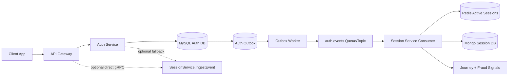
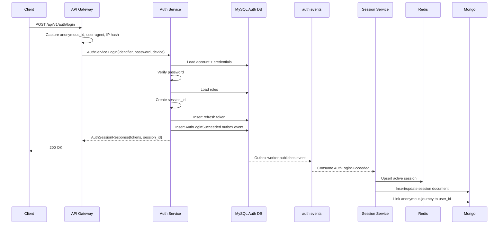
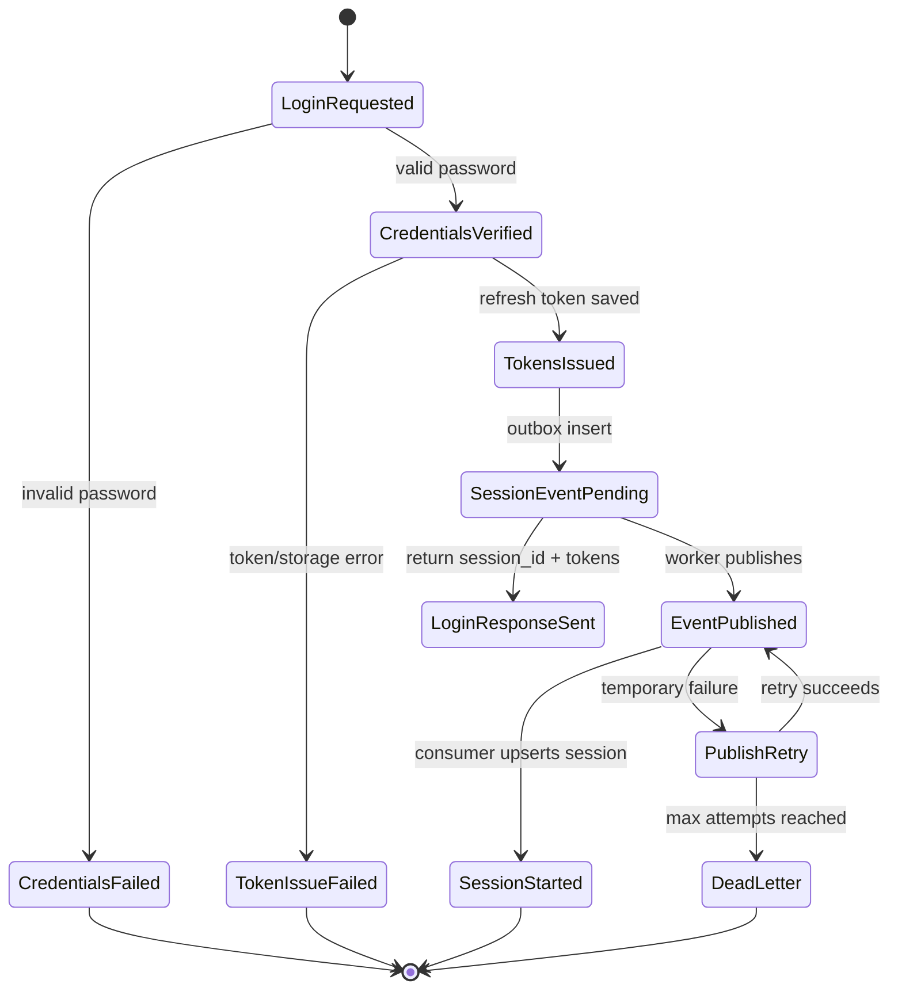
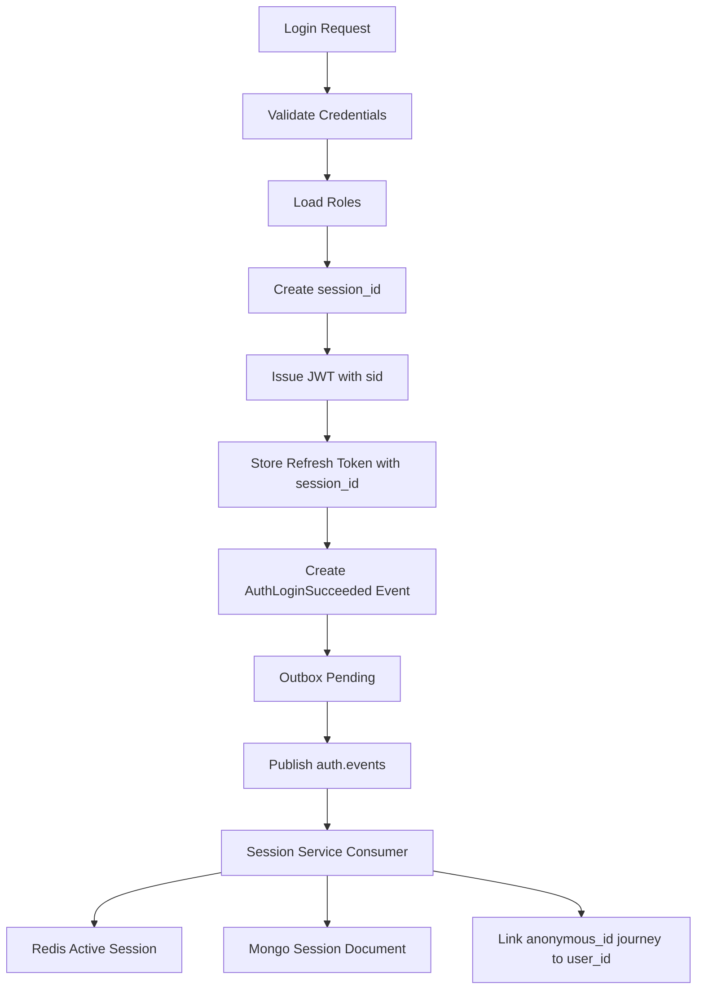

# 🔗 Auth Service - Task 7: Session Link


## 📌 Task Summary

| Field | Detail |
|---|---|
| Task Name | Session link |
| Source | `docs/01-micro-tasks.md` -> `Auth Service` -> Task 7 |
| Priority | `P1` core analytics and fraud signal |
| Dependency | Session Management Service |
| Main Goal | Login ke time Session Management Service ko session start event bhejna, taaki analytics, active sessions, journey linking, and fraud detection possible ho. |
| Core Boundary | Auth Service login decision lega. Session Service user journey/device/analytics maintain karega. |
| Output Type | Structured implementation guide |
| Not Included | Full Session Service implementation, dashboard UI, complete fraud engine, full security test suite |

> **Simple Hinglish goal:** Jab user login/signup kare, Auth Service ek `session_id` create karega, tokens issue karega, aur Session Management Service ko safe event bhejega. Is event se Session Service ko pata chalega ki anonymous browser activity ab kis logged-in user se link karni hai.

---

## ✅ Final Output Created

```text
TaskImplementation/
├── Auth Service/
│   ├── task1.md
│   ├── task2.md
│   ├── task3.md
│   ├── task4.md
│   ├── task5.md
│   ├── task6.md
│   └── task7.md
├── Platform Foundation/
│   ├── task1.md
│   ├── task2.md
│   ├── task3.md
│   ├── task4.md
│   ├── task5.md
│   ├── task6.md
│   ├── task7.md
│   └── task8.md
└── User Service/
    └── task1.md
```

### Why this structure?

- `TaskImplementation/` project ke implementation guides ka central folder hai.
- `TaskImplementation/Auth Service/` already present tha, isliye usko reuse kiya gaya.
- `task7.md` sirf **Auth Service - Task 7** ka guide hai.
- Existing `task1.md` to `task6.md` untouched rakhe gaye.
- Actual backend code files create nahi ki gayi. Ye file implementation guide hai.

---

## 🧭 Implementation Approach

Is guide ko banate time project docs ko source of truth maana gaya:

| Document | Kya use kiya gaya |
|---|---|
| `docs/01-micro-tasks.md` | Auth Service Task 7 ka exact scope: login ke time Session Service ko session start event bhejna |
| `docs/02-system-architecture.md` | API Gateway, Auth Service, Session Service, Redis, MongoDB, and MQ relation |
| `docs/04-microservice-design.md` | Auth Service login/token responsibility and Session Service independent responsibilities |
| `docs/05-database-design.md` | Session Service MongoDB + Redis storage strategy |
| `docs/06-auth-security.md` | Secure sessions, `session_id`, `ip_hash`, `device_fingerprint_hash`, logout/revoke controls |
| `docs/08-session-management-system.md` | Anonymous ID, user ID, session ID, event ingestion, journey tracking |
| `docs/11-devops-external-services.md` | `auth.events`, `session.events`, event envelope, retry, DLQ, idempotent consumer rules |
| `api/master-api.json` | `LoginRequest.device`, `AuthSessionResponse.session_id`, `SessionEventInput` schema |
| `TaskImplementation/Auth Service/task1.md` | Auth flow session touchpoints already defined |
| `TaskImplementation/Auth Service/task4.md` | Login flow already creates `session_id` and returns it with tokens |
| `TaskImplementation/Auth Service/task6.md` | Gateway/service auth context uses `session_id` after JWT validation |

---

## 🧱 Task Boundary

### ✅ Included in Task 7

- Login success ke baad Session Service ko start event bhejna
- Signup success ke baad same session-start pattern explain karna
- Logout and refresh-token-reuse ke minimal session touchpoints define karna
- Event envelope and payload design
- Anonymous ID -> logged-in user link explain karna
- Device metadata, IP hash, user-agent, and privacy-safe fields define karna
- Async event publishing with retry and DLQ design
- Optional direct gRPC `SessionService.IngestEvent` integration explain karna
- Outbox pattern explain karna for reliable event delivery
- Failure behavior define karna: Session Service down ho to login unnecessarily fail na ho
- Observability, metrics, logs, and tracing checklist
- Folder structure, code examples, Mermaid diagrams, and beginner-friendly steps

### 🚫 Not Included in Task 7

- Complete Session Management Service banana
- Session analytics dashboard banana
- Heatmap, funnel, retention APIs implement karna
- JWT issuing, password hashing, OTP verification, RBAC middleware dobara implement karna
- Full fraud detection engine banana
- Security tests ka full suite likhna, kyunki wo Auth Service Task 8 me cover hoga
- Frontend tracking SDK implement karna

> 🟢 **Rule:** Task 7 ka main kaam Auth login/signup/logout events ko Session Service se connect karna hai. Session Service ka internal analytics engine alag service ka scope hai.

---

## 🗂️ Target Implementation Folder Structure

Future actual implementation me files ka structure kuch aisa ho sakta hai:

```text
backend/
├── services/
│   ├── auth-service/
│   │   ├── internal/
│   │   │   ├── usecase/
│   │   │   │   ├── login.go
│   │   │   │   ├── signup.go
│   │   │   │   └── logout.go
│   │   │   ├── sessionlink/
│   │   │   │   ├── event.go
│   │   │   │   ├── linker.go
│   │   │   │   ├── grpc_linker.go
│   │   │   │   └── outbox_linker.go
│   │   │   ├── events/
│   │   │   │   ├── publisher.go
│   │   │   │   ├── rabbitmq_publisher.go
│   │   │   │   └── outbox_worker.go
│   │   │   ├── repository/
│   │   │   │   ├── mysql_token_repository.go
│   │   │   │   └── mysql_outbox_repository.go
│   │   │   └── transport/
│   │   │       └── grpc/
│   │   │           └── auth_handler.go
│   │   └── migrations/
│   │       └── 002_create_auth_outbox_events.up.sql
│   └── session-service/
│       └── internal/
│           ├── ingest/
│           │   └── auth_event_consumer.go
│           └── repository/
│               ├── mongo_session_repository.go
│               └── redis_active_session_repository.go
├── shared/
│   ├── events/
│   │   └── envelope.go
│   ├── privacy/
│   │   └── hash.go
│   └── grpcclient/
│       └── session_client.go
└── proto/
    └── ecommerce/
        └── session/
            └── v1/
                └── session.proto
```

### Folder responsibility

| Path | Responsibility |
|---|---|
| `auth-service/internal/sessionlink/event.go` | Session-related auth events ka typed payload |
| `auth-service/internal/sessionlink/linker.go` | Auth usecase ke liye small interface |
| `auth-service/internal/sessionlink/outbox_linker.go` | Event ko reliable outbox me save karna |
| `auth-service/internal/sessionlink/grpc_linker.go` | Optional direct Session Service call |
| `auth-service/internal/events/outbox_worker.go` | Outbox rows ko MQ pe publish karna |
| `auth-service/internal/repository/mysql_outbox_repository.go` | Outbox insert/mark-published queries |
| `session-service/internal/ingest/auth_event_consumer.go` | Auth events consume karke session start/end handle karna |
| `shared/events/envelope.go` | Common event envelope format |
| `shared/privacy/hash.go` | IP/device fingerprint ko hash karna |

> 🟡 **Important:** Ye target structure hai. Is task me actual source files nahi banaye gaye, sirf guide create kiya gaya.

---

## 🧠 Core Concept: Session Link Kya Hai?

Auth Service ka kaam hai:

- User identity verify karna
- Password/OTP/token security handle karna
- JWT and refresh token issue/revoke karna
- Role claims provide karna

Session Service ka kaam hai:

- Anonymous aur logged-in sessions track karna
- User journey events store karna
- Active sessions count maintain karna
- Device/browser/referrer metadata analyze karna
- Fraud/suspicious behavior signals generate karna

### Simple relationship

```text
Auth Service = "User kaun hai aur login valid hai?"
Session Service = "User ka session/device/journey kya kar raha hai?"
```

### Important fields

| Field | Owner | Purpose |
|---|---|---|
| `session_id` | Auth creates, Session tracks | One login/session scope |
| `anonymous_id` | Frontend SDK creates | Login se pehle browser/device journey |
| `user_id` | Auth/User domain | Login ke baad identity link |
| `account_id` | Auth Service | Auth account reference |
| `device_fingerprint_hash` | Gateway/Auth calculated or forwarded | Fraud signal without storing raw fingerprint |
| `ip_hash` | Gateway/Auth calculated | Privacy-safe IP correlation |
| `user_agent` | Gateway captured | Browser/device parsing by Session Service |

---

## 🏗️ Architecture Diagram



### Hinglish explanation

Login request Gateway se Auth Service tak aata hai. Auth Service credentials verify karta hai, `session_id` create karta hai, tokens issue karta hai, and same transaction ke aas-paas session-start event outbox me daal deta hai. Worker event ko `auth.events` queue/topic pe publish karta hai. Session Service event consume karke Redis me active session and MongoDB me session document update karta hai.

---

## 🔄 Login Session Start Flow



### Why async event?

| Choice | Result |
|---|---|
| Login waits for Session Service | Session Service slow/down ho to login UX break ho sakta hai |
| Async event with outbox | Login fast rahega, event retry ho sakta hai |
| Direct gRPC only | Simple hai, but event loss/retry carefully handle karna padega |

Recommended default: **Outbox + MQ**. Local MVP ke liye direct gRPC acceptable hai, but production me outbox safer hai.

---

## 🪜 Step-by-Step Implementation

## Step 1: Event Contract Define Karo

Sabse pehle Auth Service and Session Service ke beech ek stable event contract define karo.

### Event names

| Event Type | When emitted | Session action |
|---|---|---|
| `AuthLoginSucceeded` | Password/OTP login successful | Start logged-in session |
| `AuthSignupSucceeded` | Signup successful and tokens issued | Start logged-in session |
| `AuthLogoutSucceeded` | User logout current/all devices | End session(s) |
| `RefreshTokenReuseDetected` | Old refresh token reuse detected | Mark session suspicious and revoke session family |

### Event envelope

Project docs me common event envelope already define hai. Auth events bhi wahi pattern follow karenge:

```json
{
  "event_id": "evt_01HXAUTHLOGIN001",
  "event_type": "AuthLoginSucceeded",
  "version": 1,
  "occurred_at": "2026-05-19T04:00:00Z",
  "producer": "auth-service",
  "trace_id": "trace_123",
  "payload": {}
}
```

### Login payload

```json
{
  "account_id": "auth_123",
  "user_id": "user_123",
  "session_id": "sess_123",
  "anonymous_id": "anon_456",
  "roles": ["buyer"],
  "seller_id": null,
  "device": {
    "device_fingerprint_hash": "sha256_device_hash",
    "user_agent": "Mozilla/5.0 ...",
    "channel": "web",
    "locale": "en-US"
  },
  "network": {
    "ip_hash": "sha256_ip_hash"
  },
  "auth": {
    "method": "password",
    "mfa_used": false
  }
}
```

### Hinglish explanation

Payload me useful data bhejna hai, sensitive data nahi. Password, refresh token, access token, OTP, raw IP, raw device fingerprint, full cookie, ya authorization header kabhi event me nahi jayega.

---

## Step 2: Gateway Se Safe Metadata Capture Karo

Login request public hota hai, isliye user auth context available nahi hota. Gateway ko request metadata capture karke Auth Service ko forward karna chahiye.

### Metadata sources

| Source | Field | Use |
|---|---|---|
| Request body | `device` | Client supplied device info |
| Header/cookie | `anonymous_id` | Pre-login journey link |
| Header | `User-Agent` | Browser/device parse later |
| Header | `X-Forwarded-For` | IP hash banane ke liye |
| Gateway generated | `request_id`, `trace_id` | Observability |

### Example login request

```json
{
  "identifier": "buyer@example.com",
  "password": "user-entered-password",
  "device": {
    "anonymous_id": "anon_456",
    "fingerprint": "browser_generated_value",
    "channel": "web",
    "locale": "en-US"
  }
}
```

### Important security rules

| Rule | Why |
|---|---|
| Raw password only credential verification tak rahe | Logs/events me leak risk |
| Raw IP store na karo unless policy allows | Privacy protection |
| Device fingerprint hash karo | Tracking signal rahega, raw fingerprint nahi |
| `anonymous_id` validate karo | Malformed ID event poisoning avoid hoga |
| User-agent ko token claims me mat daalo | JWT small and privacy-safe rahega |

---

## Step 3: `session_id` Auth Service Me Create Karo

Task 4 me login flow already `session_id` create karta hai. Task 7 me usi `session_id` ko Session Service event ka primary reference banana hai.

```go
sessionID := newSessionID()
```

### ID rules

| Rule | Detail |
|---|---|
| Globally unique | `sess_` prefix + random/ULID style ID |
| Guessable nahi | Sequential integer avoid karo |
| JWT me `sid` claim | Gateway and services auth context me use karenge |
| Refresh token row me `session_id` | Logout/reuse detection session scoped rahega |
| Event payload me `session_id` | Session Service same session start/end track karega |

---

## Step 4: Session Link Interface Banao

Auth usecases ko Session Service implementation details nahi pata honi chahiye. Isliye ek chhota interface banao.

```go
package sessionlink

import "context"

type Linker interface {
    RecordLoginSucceeded(ctx context.Context, event LoginSucceededEvent) error
    RecordSignupSucceeded(ctx context.Context, event SignupSucceededEvent) error
    RecordLogoutSucceeded(ctx context.Context, event LogoutSucceededEvent) error
    RecordRefreshReuseDetected(ctx context.Context, event RefreshReuseDetectedEvent) error
}
```

### Why interface?

- Login usecase clean rahega.
- Local dev me direct gRPC implementation plug kar sakte ho.
- Production me outbox/MQ implementation plug kar sakte ho.
- Tests me fake linker use karke event payload assert kar sakte ho.

---

## Step 5: Event Structs Define Karo

```go
package sessionlink

import "time"

type LoginSucceededEvent struct {
    EventID    string
    TraceID    string
    OccurredAt time.Time

    AccountID string
    UserID    string
    SessionID string
    AnonymousID string

    Roles    []string
    SellerID string

    Device DeviceInfo
    Network NetworkInfo
    Auth AuthInfo
}

type DeviceInfo struct {
    DeviceFingerprintHash string
    UserAgent             string
    Channel               string
    Locale                string
}

type NetworkInfo struct {
    IPHash string
}

type AuthInfo struct {
    Method  string
    MFAUsed bool
}
```

### Hinglish explanation

Ye struct Auth Service ke andar event data ko typed banata hai. Random `map[string]any` se better hai, kyunki compile-time field mistakes pakad me aati hain.

---

## Step 6: Login Usecase Me Event Build Karo

Task 4 ka login flow token issue tak complete tha. Task 7 me token issue ke baad session link event add hoga.

```go
func (uc *LoginUsecase) Login(ctx context.Context, req LoginRequest) (*AuthSessionResponse, error) {
    account, credential, err := uc.accounts.FindByIdentifier(ctx, req.Identifier)
    if err != nil {
        return nil, ErrInvalidCredentials
    }

    if err := uc.passwords.Verify(req.Password, credential.PasswordHash); err != nil {
        uc.accounts.RecordFailedAttempt(ctx, account.AccountID)
        return nil, ErrInvalidCredentials
    }

    roles, err := uc.roles.ActiveRoles(ctx, account.AccountID)
    if err != nil {
        return nil, err
    }

    sessionID := newSessionID()
    tokens, err := uc.tokens.IssuePair(ctx, IssuePairInput{
        AccountID: account.AccountID,
        UserID:    account.UserID,
        SessionID: sessionID,
        Roles:     roles,
        SellerID:  account.SellerID,
    })
    if err != nil {
        return nil, err
    }

    event := sessionlink.LoginSucceededEvent{
        EventID:     newEventID(),
        TraceID:     TraceIDFromContext(ctx),
        OccurredAt:  uc.clock.Now(),
        AccountID:   account.AccountID,
        UserID:      account.UserID,
        SessionID:   sessionID,
        AnonymousID: req.Device.AnonymousID,
        Roles:       roles,
        SellerID:    account.SellerID,
        Device: sessionlink.DeviceInfo{
            DeviceFingerprintHash: HashDevice(req.Device.Fingerprint),
            UserAgent:             req.UserAgent,
            Channel:               req.Device.Channel,
            Locale:                req.Device.Locale,
        },
        Network: sessionlink.NetworkInfo{
            IPHash: HashIP(req.IPAddress),
        },
        Auth: sessionlink.AuthInfo{
            Method:  "password",
            MFAUsed: false,
        },
    }

    if err := uc.sessionLink.RecordLoginSucceeded(ctx, event); err != nil {
        uc.logger.Warn("session link event enqueue failed",
            "account_id", account.AccountID,
            "session_id", sessionID,
            "error", err,
        )
    }

    return &AuthSessionResponse{
        Tokens:    tokens,
        SessionID: sessionID,
    }, nil
}
```

### Important behavior

| Scenario | Behavior |
|---|---|
| Credentials wrong | No session event |
| Token issue failed | No login success event |
| Event enqueue failed | Log warning, login can still succeed |
| Outbox insert in same transaction failed | Treat as internal error if using strict outbox transaction |
| Event publish delayed | Session analytics updates later |

> 🟡 **Production note:** Agar outbox insert token transaction ka part hai, then event enqueue failure means transaction fail ho sakti hai. Agar direct gRPC best-effort use kar rahe ho, login should not fail just because Session Service down hai.

---

## Step 7: Outbox Pattern Add Karo

Outbox ka idea simple hai: Auth DB me token row and event row durable save karo, phir background worker event publish kare.

### Outbox table example

```sql
CREATE TABLE auth_outbox_events (
  event_id VARCHAR(64) PRIMARY KEY,
  event_type VARCHAR(80) NOT NULL,
  version INT NOT NULL,
  aggregate_type VARCHAR(80) NOT NULL,
  aggregate_id VARCHAR(64) NOT NULL,
  payload JSON NOT NULL,
  trace_id VARCHAR(128) NULL,
  status ENUM('pending', 'published', 'failed') NOT NULL DEFAULT 'pending',
  attempts INT NOT NULL DEFAULT 0,
  next_attempt_at TIMESTAMP NULL,
  published_at TIMESTAMP NULL,
  created_at TIMESTAMP NOT NULL DEFAULT CURRENT_TIMESTAMP,
  updated_at TIMESTAMP NOT NULL DEFAULT CURRENT_TIMESTAMP ON UPDATE CURRENT_TIMESTAMP,
  KEY idx_auth_outbox_pending (status, next_attempt_at, created_at),
  KEY idx_auth_outbox_aggregate (aggregate_type, aggregate_id)
);
```

### Transaction idea

```text
BEGIN
  Verify credentials already done
  Insert refresh_tokens row
  Insert auth_outbox_events row with AuthLoginSucceeded payload
COMMIT
```

### Why outbox?

| Problem | Outbox solution |
|---|---|
| Token created but event publish failed | Worker retry karega |
| App crash after DB commit | Pending event DB me safe rahega |
| MQ temporary down | Events `pending` rahenge |
| Duplicate publish | Consumer `event_id` se idempotent handle karega |

---

## Step 8: Publisher Worker Banao

Worker ka kaam pending outbox rows read karna, MQ pe publish karna, and row status update karna hai.

```go
func (w *OutboxWorker) RunOnce(ctx context.Context) error {
    events, err := w.repo.LockPending(ctx, 100, w.clock.Now())
    if err != nil {
        return err
    }

    for _, evt := range events {
        err := w.publisher.Publish(ctx, "auth.events", evt)
        if err != nil {
            nextAttempt := w.backoff.Next(evt.Attempts)
            _ = w.repo.MarkFailed(ctx, evt.EventID, nextAttempt)
            continue
        }

        _ = w.repo.MarkPublished(ctx, evt.EventID)
    }

    return nil
}
```

### Retry policy

| Attempt | Delay idea |
|---:|---|
| 1 | 5 seconds |
| 2 | 30 seconds |
| 3 | 2 minutes |
| 4 | 10 minutes |
| 5+ | DLQ/manual review |

### MQ naming

| Item | Name |
|---|---|
| Exchange/topic | `auth.events` |
| Routing key | `auth.login_succeeded` |
| Consumer | `session-service.auth-events` |
| DLQ | `auth.events.dlq` |

---

## Step 9: Session Service Consumer Contract Define Karo

Session Service ka actual implementation is task me nahi banega, but Auth Service ko pata hona chahiye ki consumer event ko kaise interpret karega.

### Consumer expected actions

| Event | Session Service action |
|---|---|
| `AuthLoginSucceeded` | `sessions` upsert, active session Redis me set, anonymous journey user se link |
| `AuthSignupSucceeded` | Same as login, plus first-session marker possible |
| `AuthLogoutSucceeded` | Active session end/revoke mark |
| `RefreshTokenReuseDetected` | Session suspicious flag, active session revoke |

### Session document idea

```json
{
  "session_id": "sess_123",
  "anonymous_id": "anon_456",
  "user_id": "user_123",
  "started_at": "2026-05-19T04:00:00Z",
  "last_seen_at": "2026-05-19T04:00:00Z",
  "ended_at": null,
  "revoked_at": null,
  "device": {
    "device_fingerprint_hash": "sha256_device_hash",
    "user_agent": "Mozilla/5.0 ...",
    "channel": "web",
    "locale": "en-US"
  },
  "network": {
    "ip_hash": "sha256_ip_hash"
  },
  "flags": {
    "suspicious": false
  }
}
```

### Redis active session key

```text
active_session:sess_123 -> user_id=user_123, last_seen_at=...
TTL: 30 minutes inactivity or configured active session window
```

---

## Step 10: Optional Direct gRPC Integration

Local MVP me agar MQ/outbox ready nahi hai, Auth Service direct Session Service ko `IngestEvent` call kar sakta hai.

### Existing schema relation

`api/master-api.json` me `SessionService.IngestEvent` and `SessionEventInput` available hai:

```json
{
  "event_type": "auth.login_succeeded",
  "anonymous_id": "anon_456",
  "session_id": "sess_123",
  "user_id": "user_123",
  "occurred_at": "2026-05-19T04:00:00Z",
  "path": "/auth/login",
  "properties": {
    "account_id": "auth_123",
    "roles": ["buyer"],
    "device_fingerprint_hash": "sha256_device_hash",
    "ip_hash": "sha256_ip_hash",
    "auth_method": "password"
  }
}
```

### gRPC client pseudo-code

```go
func (l *GRPCLinker) RecordLoginSucceeded(ctx context.Context, event LoginSucceededEvent) error {
    ctx, cancel := context.WithTimeout(ctx, 150*time.Millisecond)
    defer cancel()

    _, err := l.client.IngestEvent(ctx, &sessionv1.SessionEventInput{
        EventType:   "auth.login_succeeded",
        AnonymousId: event.AnonymousID,
        SessionId:   event.SessionID,
        UserId:      event.UserID,
        OccurredAt:  timestamppb.New(event.OccurredAt),
        Path:        "/auth/login",
        Properties: map[string]string{
            "account_id": event.AccountID,
            "ip_hash":    event.Network.IPHash,
            "channel":    event.Device.Channel,
        },
    })
    return err
}
```

### Direct gRPC rules

| Rule | Reason |
|---|---|
| Timeout short rakho, e.g. 100-200 ms | Login latency protect hoti hai |
| Error log karo, token leak mat karo | Observability without security risk |
| Retry request path me mat karo | User login slow hoga |
| Production me outbox prefer karo | Event reliability better hoti hai |

---

## Step 11: Logout Session Link Define Karo

Task 4 me logout token revoke touchpoint define tha. Task 7 me logout ke baad Session Service ko end event bhejna hai.

```json
{
  "event_id": "evt_logout_123",
  "event_type": "AuthLogoutSucceeded",
  "version": 1,
  "occurred_at": "2026-05-19T04:20:00Z",
  "producer": "auth-service",
  "trace_id": "trace_123",
  "payload": {
    "account_id": "auth_123",
    "user_id": "user_123",
    "session_id": "sess_123",
    "all_devices": false,
    "reason": "user_requested"
  }
}
```

### Logout behavior

| Logout type | Auth action | Session action |
|---|---|---|
| Current device | Current refresh token revoke | Current `session_id` ended |
| All devices | Account ke active refresh tokens revoke | User ke active sessions ended |
| Password reset cleanup | Old tokens revoke | Old sessions revoked/ended |

> 🟡 **Scope note:** Is guide me logout session event contract define kiya gaya hai. Full logout implementation details Task 4 token lifecycle and later security tests ke saath validate honge.

---

## Step 12: Refresh Token Reuse Fraud Signal Bhejo

Refresh token reuse high-risk signal hai. Task 4 me old refresh token reuse detect hote hi session/token family revoke hoti hai. Task 7 me same event Session Service ko bhejna hai.

```json
{
  "event_id": "evt_reuse_123",
  "event_type": "RefreshTokenReuseDetected",
  "version": 1,
  "occurred_at": "2026-05-19T04:30:00Z",
  "producer": "auth-service",
  "trace_id": "trace_789",
  "payload": {
    "account_id": "auth_123",
    "user_id": "user_123",
    "session_id": "sess_123",
    "token_id": "rt_123",
    "ip_hash": "sha256_ip_hash",
    "device_fingerprint_hash": "sha256_device_hash",
    "action_taken": "revoked_session_family"
  }
}
```

### Why useful?

- Session analytics suspicious session mark kar sakta hai.
- Superadmin session oversight me risk visible hoga.
- Future fraud engine same event consume kar sakta hai.
- User notification later trigger ho sakta hai.

---

## Step 13: Idempotency and Ordering Handle Karo

Events distributed system me duplicate aa sakte hain. Consumer ko idempotent banana mandatory hai.

### Idempotency keys

| Item | Key |
|---|---|
| Event | `event_id` |
| Session start | `session_id` |
| Logout current device | `session_id + logout event_id` |
| Logout all devices | `account_id + event_id` |
| Refresh reuse | `token_id + event_id` |

### Consumer duplicate handling

```text
IF event_id already_processed:
  ACK event
ELSE:
  apply session change
  mark event_id processed
  ACK event
```

### Ordering recommendation

| Case | Handling |
|---|---|
| Login event before page events | Normal |
| Page events before login event | Session Service links by `anonymous_id` later |
| Logout arrives before some delayed events | Journey can still store delayed events, active session remains ended |
| Duplicate login event | Upsert by `session_id` |

---

## Step 14: Privacy and Security Rules Apply Karo

Session events security-sensitive hote hain. Isliye minimal and hashed data bhejo.

### Never send

| Data | Reason |
|---|---|
| Password | Credential secret |
| Refresh token | Long-lived secret |
| Access token/JWT | Bearer token leak risk |
| OTP | Verification secret |
| Raw IP address | Privacy risk |
| Raw device fingerprint | Tracking/privacy risk |
| Authorization header | Token leak risk |
| Full cookies | Session hijack risk |

### Safe to send

| Data | Condition |
|---|---|
| `session_id` | Required |
| `anonymous_id` | Validate format |
| `user_id` | Required after successful login |
| `account_id` | Internal reference |
| `roles` | Useful for admin/seller session segmentation |
| `ip_hash` | Hash with server-side salt/pepper |
| `device_fingerprint_hash` | Hash with server-side salt/pepper |
| `user_agent` | Avoid logging if policy requires stricter masking |

### Hash helper example

```go
func HashWithPepper(value string, pepper []byte) string {
    mac := hmac.New(sha256.New, pepper)
    mac.Write([]byte(value))
    return hex.EncodeToString(mac.Sum(nil))
}
```

> 🔐 **Security note:** Pepper config secret manager/Kubernetes Secret se aayega. Pepper code me hardcode nahi hoga.

---

## Step 15: Config Add Karo

Auth Service ko Session Link ke liye kuch configs chahiye.

```dotenv
SESSION_LINK_MODE=outbox
AUTH_EVENTS_TOPIC=auth.events
SESSION_GRPC_ADDR=session-service:9090
SESSION_LINK_TIMEOUT_MS=150
SESSION_EVENT_PEPPER=change_me_in_secret_manager
OUTBOX_WORKER_BATCH_SIZE=100
OUTBOX_WORKER_INTERVAL_MS=1000
OUTBOX_MAX_ATTEMPTS=5
```

### Config explanation

| Config | Use |
|---|---|
| `SESSION_LINK_MODE` | `outbox`, `grpc`, ya `disabled` for local debugging |
| `AUTH_EVENTS_TOPIC` | MQ topic/queue name |
| `SESSION_GRPC_ADDR` | Direct gRPC fallback/MVP address |
| `SESSION_LINK_TIMEOUT_MS` | Direct gRPC call timeout |
| `SESSION_EVENT_PEPPER` | IP/device hash ke liye secret pepper |
| `OUTBOX_WORKER_BATCH_SIZE` | Worker ek run me kitne events publish kare |
| `OUTBOX_MAX_ATTEMPTS` | Failure ke baad DLQ/manual review threshold |

---

## Step 16: External Libraries and Tools

### Recommended libraries

| Library/Tool | Why used | Install |
|---|---|---|
| `google.golang.org/grpc` | Auth -> Session direct internal call ke liye, agar gRPC mode use ho | `go get google.golang.org/grpc` |
| `google.golang.org/protobuf` | Generated proto messages and timestamps ke liye | `go get google.golang.org/protobuf` |
| `github.com/rabbitmq/amqp091-go` | RabbitMQ publisher/consumer for `auth.events` | `go get github.com/rabbitmq/amqp091-go` |
| `github.com/segmentio/kafka-go` | Kafka alternative for high-throughput event stream | `go get github.com/segmentio/kafka-go` |
| `go.opentelemetry.io/otel` | Trace context propagate karne ke liye | `go get go.opentelemetry.io/otel` |
| `github.com/google/uuid` | Event IDs/session IDs generate karne ke liye if no internal ID helper exists | `go get github.com/google/uuid` |
| RabbitMQ | Simpler local event routing and DLQ | Docker Compose service from Platform Foundation |
| Kafka | High-volume stream and replay if team chooses Kafka | Docker Compose Kafka profile |
| Redis | Session Service active session hot state | Already in platform local stack |
| MongoDB | Session Service durable session/event storage | Already in platform local stack |

### Which MQ should we choose?

| Need | Better choice |
|---|---|
| Simple local routing | RabbitMQ |
| Replay and high-volume analytics | Kafka |
| Command style delivery | RabbitMQ |
| Event stream with many consumers | Kafka |

Project docs allow Kafka/RabbitMQ. Is guide me examples `auth.events` generic rakhe gaye hain, taaki dono me adapt ho sake.

---

## Step 17: RabbitMQ Publisher Example

```go
type RabbitPublisher struct {
    ch *amqp.Channel
}

func (p *RabbitPublisher) Publish(ctx context.Context, routingKey string, evt EventEnvelope) error {
    body, err := json.Marshal(evt)
    if err != nil {
        return err
    }

    return p.ch.PublishWithContext(ctx,
        "auth.events",
        routingKey,
        false,
        false,
        amqp.Publishing{
            ContentType:  "application/json",
            DeliveryMode: amqp.Persistent,
            MessageId:    evt.EventID,
            Timestamp:    evt.OccurredAt,
            Body:         body,
        },
    )
}
```

### Usage

```go
err := publisher.Publish(ctx, "auth.login_succeeded", envelope)
```

### Hinglish explanation

`DeliveryMode: amqp.Persistent` ka matlab message broker restart ke baad bhi message survive kar sakta hai, agar queue durable configured hai. `MessageId` me `event_id` dene se consumer duplicate detection easy hoti hai.

---

## Step 18: Kafka Publisher Example

```go
type KafkaPublisher struct {
    writer *kafka.Writer
}

func (p *KafkaPublisher) Publish(ctx context.Context, evt EventEnvelope) error {
    body, err := json.Marshal(evt)
    if err != nil {
        return err
    }

    return p.writer.WriteMessages(ctx, kafka.Message{
        Topic: "auth.events",
        Key:   []byte(evt.AggregateID),
        Value: body,
        Time:  evt.OccurredAt,
        Headers: []kafka.Header{
            {Key: "event_id", Value: []byte(evt.EventID)},
            {Key: "event_type", Value: []byte(evt.EventType)},
        },
    })
}
```

### Kafka partition key

`session_id` ya `account_id` ko key bana sakte ho. Isse same user/session ke related events same partition me jaane ke chances badhte hain, ordering better hoti hai.

---

## Step 19: Event Envelope Go Struct

```go
type EventEnvelope struct {
    EventID       string          `json:"event_id"`
    EventType     string          `json:"event_type"`
    Version       int             `json:"version"`
    OccurredAt    time.Time       `json:"occurred_at"`
    Producer      string          `json:"producer"`
    TraceID       string          `json:"trace_id,omitempty"`
    AggregateType string          `json:"aggregate_type"`
    AggregateID   string          `json:"aggregate_id"`
    Payload       json.RawMessage `json:"payload"`
}
```

### Example builder

```go
func NewAuthLoginEnvelope(event LoginSucceededEvent) (EventEnvelope, error) {
    payload, err := json.Marshal(event)
    if err != nil {
        return EventEnvelope{}, err
    }

    return EventEnvelope{
        EventID:       event.EventID,
        EventType:     "AuthLoginSucceeded",
        Version:       1,
        OccurredAt:    event.OccurredAt,
        Producer:      "auth-service",
        TraceID:       event.TraceID,
        AggregateType: "session",
        AggregateID:   event.SessionID,
        Payload:       payload,
    }, nil
}
```

---

## Step 20: API Response Same Rakho

`api/master-api.json` ke according login response me `session_id` already hai.

```json
{
  "user": {
    "user_id": "user_123",
    "email": "buyer@example.com",
    "full_name": "Buyer Name"
  },
  "tokens": {
    "access_token": "jwt_access_token",
    "refresh_token": "opaque_refresh_token",
    "expires_in": 900
  },
  "session_id": "sess_123"
}
```

### Rule

Auth API response me Session Service internal status expose mat karo.

| Bad response field | Why avoid |
|---|---|
| `session_event_published` | Internal async detail leak |
| `session_service_status` | Frontend ko unnecessary coupling |
| `fraud_score` | Security logic expose ho sakti hai |

Frontend ko sirf `session_id` chahiye so future events same session se link ho sakein.

---

## Step 21: Observability Add Karo

Session link silent failure nahi hona chahiye. Logs, metrics, traces mandatory hain.

### Logs

```json
{
  "level": "info",
  "service": "auth-service",
  "event": "auth.session_link.enqueued",
  "event_type": "AuthLoginSucceeded",
  "account_id": "auth_123",
  "session_id": "sess_123",
  "request_id": "req_123",
  "trace_id": "trace_123"
}
```

### Metrics

| Metric | Type | Meaning |
|---|---|---|
| `auth_session_link_events_total` | Counter | Total session link events created |
| `auth_session_link_publish_failures_total` | Counter | MQ/gRPC publish failures |
| `auth_session_link_outbox_pending` | Gauge | Pending outbox rows |
| `auth_session_link_outbox_oldest_age_seconds` | Gauge | Oldest pending event age |
| `auth_session_link_publish_duration_ms` | Histogram | Publish latency |
| `auth_refresh_reuse_detected_total` | Counter | Refresh token reuse fraud signal |

### Trace spans

| Span | Detail |
|---|---|
| `auth.login` | Full login usecase |
| `auth.token.issue_pair` | Token issue + refresh row |
| `auth.session_link.enqueue` | Outbox event insert |
| `auth.outbox.publish` | MQ publish |
| `session.auth_event.consume` | Session Service consumer |

---

## Step 22: Failure Handling

### Failure matrix

| Failure | Login response | What to do |
|---|---|---|
| Session Service down with direct gRPC | Login succeeds if best-effort mode | Log warning, metric increment |
| MQ down with outbox | Login succeeds if outbox insert succeeds | Worker retries later |
| Outbox DB insert fails inside transaction | Login fails or transaction rolls back | Return internal error |
| Event duplicate consumed | No user-visible issue | Consumer ignores duplicate by `event_id` |
| Event payload invalid | DLQ | Alert and fix producer/schema |
| Session consumer slow | Login unaffected | Monitor consumer lag |

### Recommended production policy

```text
Credential/token correctness is critical.
Session analytics link is important but should be async.
Fraud signals should be reliable through outbox and alerting.
```

---

## Step 23: Mermaid State Diagram



---

## Step 24: Data Flow Diagram



---

## Step 25: Acceptance Criteria

| Check | Expected |
|---|---|
| Login success creates `session_id` | `AuthSessionResponse.session_id` present |
| JWT contains `sid` | Access token claims include current session id |
| Refresh token row has `session_id` | Logout/reuse can identify session |
| Session event created | `AuthLoginSucceeded` event has `session_id`, `user_id`, `anonymous_id` |
| Sensitive data excluded | No password/token/OTP/raw IP in event |
| Event envelope valid | `event_id`, `event_type`, `version`, `occurred_at`, `producer`, `payload` present |
| Failure does not break login unnecessarily | Session Service outage does not block normal login in async mode |
| Consumer can be idempotent | Stable `event_id` and `session_id` available |
| Observability present | Logs/metrics/traces show enqueue and publish result |
| Logout/reuse touchpoints defined | End/revoke/suspicious events available |

---

## 🧪 Test Plan For Task 7

> Full security test suite Task 8 me aayega. Yahan Task 7 ke focused checks hain.

### Unit tests

| Test | Expected |
|---|---|
| Login event builder | Correct `event_type`, `session_id`, `user_id`, `anonymous_id` |
| Sensitive field guard | Password/token/OTP not present in marshalled event |
| Hash helper | Same input + pepper gives same hash |
| Outbox linker | Inserts pending event with valid envelope |
| gRPC linker timeout | Returns error quickly and does not hang |
| Logout event builder | `all_devices` and `session_id` set correctly |
| Refresh reuse event builder | `action_taken=revoked_session_family` |

### Integration tests

| Test | Expected |
|---|---|
| Successful login | Refresh token row + outbox row committed |
| MQ publish success | Outbox status becomes `published` |
| MQ publish failure | Attempts increment and `next_attempt_at` set |
| Duplicate event consume | Session Service processes once |
| Session Service down | Login still returns tokens in async mode |

### Manual smoke test idea

```bash
curl -X POST http://localhost:8080/api/v1/auth/login \
  -H "Content-Type: application/json" \
  -H "X-Anonymous-Id: anon_456" \
  -d '{
    "identifier": "buyer@example.com",
    "password": "correct-password",
    "device": {
      "anonymous_id": "anon_456",
      "channel": "web",
      "locale": "en-US"
    }
  }'
```

Expected:

```json
{
  "tokens": {
    "access_token": "...",
    "refresh_token": "...",
    "expires_in": 900
  },
  "session_id": "sess_123"
}
```

Then verify:

```sql
SELECT event_id, event_type, status
FROM auth_outbox_events
WHERE aggregate_id = 'sess_123';
```

Expected:

```text
AuthLoginSucceeded | pending or published
```

---

## 🧯 Common Mistakes

| Mistake | Problem | Correct approach |
|---|---|---|
| Login ko Session Service response pe hard-block karna | Analytics outage login outage ban sakta hai | Outbox/MQ async use karo |
| Access token event payload me bhejna | Token leak risk | Sirf `session_id` and safe metadata bhejo |
| Raw IP store karna | Privacy risk | `ip_hash` use karo |
| Event duplicate ignore na karna | Duplicate active sessions/journey entries | Idempotency by `event_id` |
| `anonymous_id` miss karna | Pre-login journey link nahi hoga | Gateway/frontend SDK se pass karo |
| `session_id` mismatch | JWT, refresh token, session analytics disconnected | Same generated `session_id` reuse karo |
| Event schema version na rakhna | Future changes risky | `version: 1` include karo |
| Logs me full payload dump karna | PII leak risk | Structured safe fields log karo |

---

## 🔐 Security Checklist

- [x] Password event me nahi jayega
- [x] Refresh token event me nahi jayega
- [x] Access token event me nahi jayega
- [x] OTP event me nahi jayega
- [x] Raw IP hash hoga
- [x] Device fingerprint hash hoga
- [x] `session_id` JWT `sid`, refresh token row, and event payload me same hoga
- [x] Event `event_id` unique hoga
- [x] Consumer idempotent hoga
- [x] Session Service failure normal login ko async mode me block nahi karega
- [x] Outbox backlog alertable hoga
- [x] Trace ID event envelope me pass hoga

---

## 📦 Clean Implementation Summary

```text
Login success
  -> Auth verifies credentials
  -> Auth creates session_id
  -> Auth issues access + refresh tokens
  -> Auth stores refresh token with session_id
  -> Auth creates AuthLoginSucceeded event
  -> Outbox worker publishes to auth.events
  -> Session Service consumes event
  -> Session Service starts active session and links anonymous journey
```

### Final outcome

- User login response me `session_id` milega.
- Session Service ko login ka trusted event milega.
- Analytics dashboard active sessions dikha sakega.
- Anonymous browsing journey logged-in user se link ho sakegi.
- Refresh token reuse fraud signal session layer tak pahunch sakega.
- Auth Service and Session Service loosely coupled rahenge.

---

## ✅ Done Definition

Task 7 complete maana jayega jab:

- `AuthLoginSucceeded` event contract documented ho
- Login flow me session event enqueue/publish point clear ho
- `session_id`, `anonymous_id`, device, and IP hash mapping defined ho
- Outbox/MQ preferred approach and gRPC fallback explained ho
- Logout/reuse session touchpoints documented ho
- External libraries/tools install and usage documented ho
- Mermaid architecture and flow diagrams included ho
- Sensitive data rules clear ho
- Folder structure and code examples beginner-friendly form me available ho

---

## 🧾 Short Recap

Auth Service Task 7 ka essence ye hai ki authentication ke baad platform ko session awareness mile. Auth Service login ko secure rakhta hai, Session Service behavior and analytics ko track karta hai. Dono ko direct database coupling ke bina event/gRPC contract se link karna clean microservice design hai.
