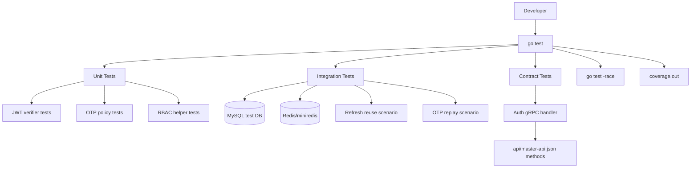
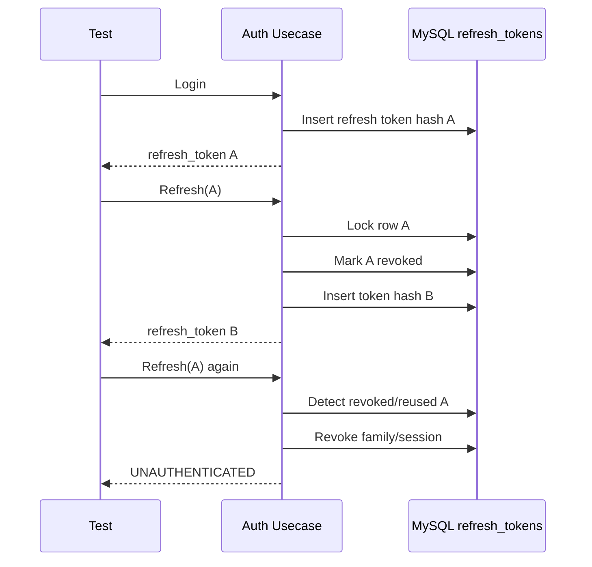
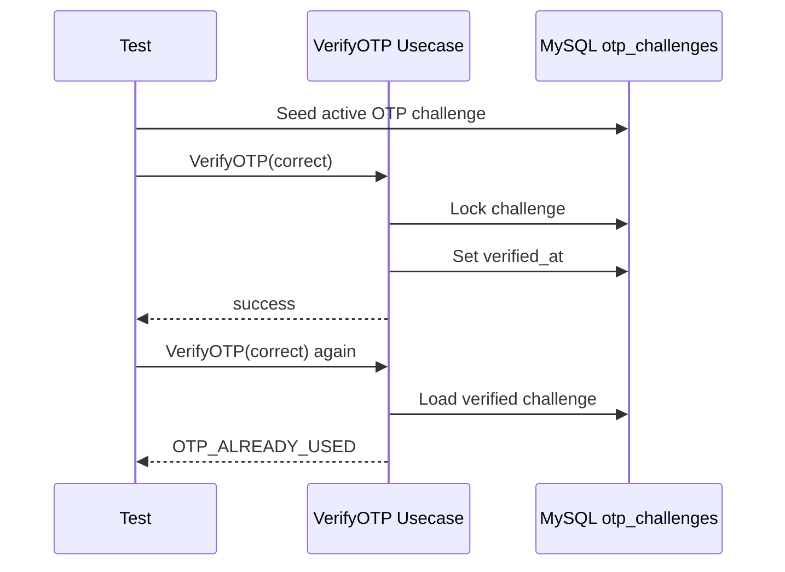
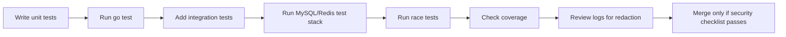
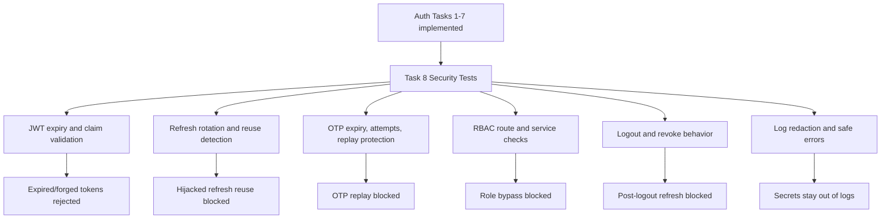

# 🔐 Auth Service - Task 8: Security Tests


## 📌 Task Summary

| Field | Detail |
|---|---|
| Task Name | Security tests |
| Source | `docs/01-micro-tasks.md` -> `Auth Service` -> Task 8 |
| Priority | `P1` high-risk auth validation |
| Dependency | Auth Service implementation from Tasks 1-7 |
| Main Goal | Token expiry, refresh reuse, OTP replay, aur role bypass ke test cases likhna |
| Core Boundary | Auth Service ke security behavior ko automated tests se prove karna. Business services, frontend, ya full production infra implement nahi karna. |
| Output Type | Structured implementation guide |
| Not Included | Actual backend source code patch, full CI pipeline change, frontend tests, performance/load testing, complete penetration test |

> **Simple Hinglish goal:** Auth bugs high risk hote hain. Is task ka purpose Auth Service ke most dangerous cases ko tests se lock karna hai: expired token accept na ho, refresh token reuse detect ho, OTP dobara use na ho, aur buyer/seller/admin role bypass na kar sake.

---

## ✅ Final Output Created

```text
TaskImplementation/
├── Auth Service/
│   ├── task1.md
│   ├── task2.md
│   ├── task3.md
│   ├── task4.md
│   ├── task5.md
│   ├── task6.md
│   ├── task7.md
│   └── task8.md
├── Platform Foundation/
│   ├── task1.md
│   ├── task2.md
│   ├── task3.md
│   ├── task4.md
│   ├── task5.md
│   ├── task6.md
│   ├── task7.md
│   └── task8.md
└── User Service/
    └── task1.md
```

### Why this structure?

- `TaskImplementation/` project ke task-wise implementation guides ka central folder hai.
- `TaskImplementation/Auth Service/` already present tha, isliye usko keep kiya gaya.
- `task8.md` sirf **Auth Service - Task 8** ka guide hai.
- Existing `task1.md` to `task7.md` untouched rakhe gaye.
- Actual backend files, migrations, proto files, ya CI files create nahi kiye gaye, kyunki requested output documentation guide hai.

---

## 🧭 Implementation Approach

Is guide ko banate time project ke official docs ko source of truth maana gaya:

| Document | Kya use kiya gaya |
|---|---|
| `docs/01-micro-tasks.md` | Auth Service Task 8 ka exact scope: token expiry, refresh reuse, OTP replay, role bypass tests |
| `docs/04-microservice-design.md` | Auth Service responsibilities: login, JWT, refresh rotation, OTP, RBAC, logout |
| `docs/05-database-design.md` | Auth DB tables: `refresh_tokens`, `otp_challenges`, `role_assignments` |
| `docs/06-auth-security.md` | JWT TTL, refresh reuse detection, OTP max attempts, RBAC rules, secrets, audit logging |
| `docs/11-devops-external-services.md` | Local services, queues, retry, DLQ, event envelope, testing infra context |
| `docs/12-logging-monitoring-scalability.md` | Logs me password, OTP, full JWT, refresh token, secrets na rakhne ka rule |
| `api/master-api.json` | Auth gRPC methods and schemas: `Login`, `RefreshToken`, `VerifyAccessToken`, `VerifyOTP`, `AssignRole`, `RevokeRole` |
| `database/draw.sql` | `refresh_tokens`, `otp_challenges`, `role_assignments` columns and indexes |
| `TaskImplementation/Auth Service/task4.md` | JWT issuing, access token expiry, refresh token rotation |
| `TaskImplementation/Auth Service/task5.md` | OTP expiry, attempts, replay protection |
| `TaskImplementation/Auth Service/task6.md` | RBAC middleware and role checks |
| `TaskImplementation/Auth Service/task7.md` | Session link behavior after login/logout/reuse |

---

## 🧱 Task Boundary

### ✅ Included in Task 8

- Unit test strategy for Auth security logic
- Integration test strategy for DB/Redis backed flows
- Contract test strategy for Auth gRPC methods
- Token expiry tests
- Wrong issuer/audience/signature tests
- Refresh token rotation and reuse tests
- OTP expiry, wrong OTP, max attempts, and replay tests
- RBAC route-level and service-level bypass tests
- Logout/revoke token tests
- Password reset token/OTP safety tests
- Sensitive log redaction tests
- Race/concurrency test ideas for refresh and OTP verification
- External testing libraries/tools explanation
- Mermaid diagrams and code examples

### 🚫 Not Included in Task 8

- Auth Service production code implement karna
- JWT signing logic dobara likhna
- Password hashing, OTP, RBAC, ya session link feature implement karna
- Frontend E2E auth screens test karna
- Full penetration testing report banana
- Production secret manager setup karna
- Kubernetes, Docker, ya CI pipeline files update karna
- Non-auth service business authorization implement karna

> 🟢 **Rule:** Task 8 ka kaam implementation ko security tests se verify karna hai. Feature behavior Tasks 1-7 me define ho chuka hai. Is guide me sirf Auth Service security test plan aur examples document kiye gaye hain.

---

## 🗂️ Target Test Folder Structure

Future actual implementation me Auth Service tests ka structure kuch aisa ho sakta hai:

```text
backend/
└── services/
    └── auth-service/
        ├── internal/
        │   ├── security/
        │   │   ├── jwt/
        │   │   │   ├── issuer.go
        │   │   │   ├── verifier.go
        │   │   │   └── verifier_test.go
        │   │   ├── password/
        │   │   │   ├── argon2id.go
        │   │   │   └── argon2id_test.go
        │   │   └── otp/
        │   │       ├── hasher.go
        │   │       ├── policy.go
        │   │       └── otp_test.go
        │   ├── usecase/
        │   │   ├── login.go
        │   │   ├── login_test.go
        │   │   ├── refresh_token.go
        │   │   ├── refresh_token_test.go
        │   │   ├── verify_otp.go
        │   │   ├── verify_otp_test.go
        │   │   ├── assign_role.go
        │   │   └── assign_role_test.go
        │   ├── authorization/
        │   │   ├── rbac.go
        │   │   └── rbac_test.go
        │   ├── repository/
        │   │   ├── mysql_refresh_token_repository.go
        │   │   ├── mysql_refresh_token_repository_test.go
        │   │   ├── mysql_otp_repository.go
        │   │   └── mysql_otp_repository_test.go
        │   └── transport/
        │       └── grpc/
        │           ├── auth_handler.go
        │           └── auth_handler_security_test.go
        ├── test/
        │   ├── fixtures/
        │   │   ├── accounts.go
        │   │   ├── tokens.go
        │   │   └── roles.go
        │   ├── testclock/
        │   │   └── clock.go
        │   ├── testdb/
        │   │   └── mysql.go
        │   ├── testredis/
        │   │   └── redis.go
        │   └── security/
        │       ├── token_expiry_test.go
        │       ├── refresh_reuse_test.go
        │       ├── otp_replay_test.go
        │       └── role_bypass_test.go
        └── go.mod
```

### Folder responsibility

| Path | Responsibility |
|---|---|
| `internal/security/jwt/verifier_test.go` | Expired, invalid issuer, invalid audience, wrong signature, unknown `kid` tests |
| `internal/usecase/refresh_token_test.go` | Rotation, reuse detection, revoked token, expired token tests |
| `internal/usecase/verify_otp_test.go` | OTP expiry, attempts, replay, concurrent verify tests |
| `internal/authorization/rbac_test.go` | Buyer/seller/admin/superadmin access matrix tests |
| `internal/transport/grpc/auth_handler_security_test.go` | gRPC error mapping and public/internal/admin method auth tests |
| `test/fixtures/` | Reusable accounts, roles, tokens, and challenge builders |
| `test/testclock/` | Time freeze/advance helper for expiry tests |
| `test/testdb/` | MySQL integration test setup |
| `test/testredis/` | Redis/miniredis setup for rate limit and OTP counters |
| `test/security/` | End-to-end-ish security scenarios grouped by risk |

> 🟡 **Important:** Ye target structure hai. Is Task 8 me sirf `TaskImplementation/Auth Service/task8.md` create kiya gaya.

---

## 🧠 Security Test Philosophy

Security tests normal happy-path tests jaise nahi hote. Inka kaam ye prove karna hai ki system wrong, malicious, stale, replayed, ya unauthorized request ko reject karta hai.

### Simple rule

```text
Happy path proves feature works.
Security tests prove attackers cannot misuse it.
```

### Auth Service ke high-risk areas

| Area | Main Risk | Test Focus |
|---|---|---|
| Access token | Expired/wrong token accepted | `exp`, `iss`, `aud`, signature, `kid` validation |
| Refresh token | Old token reuse se session hijack | Rotation, reuse detection, token family revoke |
| OTP | Same OTP replay ya brute force | Expiry, max attempts, `verified_at`, transaction lock |
| RBAC | Buyer/seller/admin role bypass | Route-level and service-level denial |
| Logout | Token still usable after logout | Refresh revoke and session end behavior |
| Logs | Secrets accidentally leak | Redaction assertions |

---

## 🏗️ Test Architecture



### Test layers

| Layer | Speed | Uses DB/Redis? | Example |
|---|---:|---:|---|
| Unit | Fast | No | JWT verifier rejects expired token |
| Integration | Medium | Yes | Refresh token reuse revokes session family |
| Contract | Medium | Optional | `RefreshToken` returns unauthenticated on reuse |
| Race/concurrency | Medium | Maybe | Two refresh requests with same token: only one succeeds |

---

## 🪜 Step-by-Step Implementation Guide

## Step 1: Security test scope lock karo

Sabse pehle exact risk list freeze karo, taaki tests random na ho jayein.

### Required Task 8 scenarios

| Scenario | Must Test? | Expected |
|---|---:|---|
| Access token expired | ✅ | Request reject with `UNAUTHENTICATED` or `401` |
| Refresh token reuse | ✅ | Request reject, token family/session revoke |
| OTP replay | ✅ | First verify success, second verify reject |
| Role bypass | ✅ | Wrong role gets `PERMISSION_DENIED` or `403` |

### Extra Auth security scenarios

| Scenario | Why useful |
|---|---|
| Wrong JWT issuer | Prevent token from another environment |
| Wrong JWT audience | Prevent token meant for another API |
| Wrong JWT signature | Prevent forged token |
| Unknown JWT `kid` | Prevent accepting unknown key |
| Refresh token expired | Prevent stale long-lived access |
| OTP max attempts reached | Prevent brute force |
| Logout revokes refresh token | Prevent post-logout reuse |
| Sensitive logs redacted | Prevent secret leakage |

---

## Step 2: Test categories define karo

Auth tests ko categories me split karo. Isse failures quickly samajh aate hain.

```text
auth/security/jwt
auth/security/refresh
auth/security/otp
auth/security/rbac
auth/security/logout
auth/security/logging
```

### Naming convention

| Pattern | Example |
|---|---|
| `Test<Component>_<Condition>_<Expected>` | `TestJWTVerifier_ExpiredToken_Rejects` |
| `Test<Usecase>_<Attack>_<Expected>` | `TestRefreshToken_ReusedToken_RevokesFamily` |
| `Test<RBAC>_<Role>_<Expected>` | `TestRBAC_BuyerCannotAccessSellerRoute` |

### Good test name rules

- Test name attack/condition bataye.
- Expected result name me visible ho.
- Generic names jaise `TestAuth` avoid karo.
- Security tests me "rejects", "denies", "revokes", "redacts" words useful hote hain.

---

## Step 3: Deterministic test clock banao

Token expiry aur OTP expiry tests time pe depend karte hain. Real `time.Now()` se flaky tests ban sakte hain. Isliye injectable clock use karo.

### Test clock example

```go
type FakeClock struct {
    now time.Time
}

func NewFakeClock(now time.Time) *FakeClock {
    return &FakeClock{now: now}
}

func (c *FakeClock) Now() time.Time {
    return c.now
}

func (c *FakeClock) Advance(d time.Duration) {
    c.now = c.now.Add(d)
}
```

### Hinglish explanation

Test me clock freeze karne se hum exactly bol sakte hain:

```text
Token 15 minutes ke liye valid hai.
Clock 16 minutes aage badhao.
Verifier reject kare.
```

Ye real waiting ke bina expiry behavior prove karta hai.

---

## Step 4: JWT access token expiry tests likho

Access token short-lived hota hai. Docs me recommended TTL `15 minutes` hai. Test ensure karega ki expired token accept na ho.

### Test cases

| Test | Expected |
|---|---|
| Valid token before `exp` | Accepted |
| Expired token after `exp` | Rejected |
| Missing `exp` | Rejected |
| Wrong `iss` | Rejected |
| Wrong `aud` | Rejected |
| Wrong signature | Rejected |
| Unknown `kid` | Rejected |
| `token_type != access` | Rejected |

### Code example

```go
func TestJWTVerifier_ExpiredToken_Rejects(t *testing.T) {
    clock := NewFakeClock(time.Date(2026, 5, 19, 10, 0, 0, 0, time.UTC))
    issuer := jwtsec.NewIssuer(jwtsec.IssuerConfig{
        Issuer:   "ecommerce-auth",
        Audience: "ecommerce-api",
        TTL:      15 * time.Minute,
        Clock:    clock,
        KeyID:    "test-key-1",
    })

    token, err := issuer.IssueAccessToken(context.Background(), jwtsec.ClaimsInput{
        UserID:    "user_123",
        SessionID: "sess_123",
        Roles:     []string{"buyer"},
    })
    require.NoError(t, err)

    clock.Advance(16 * time.Minute)

    verifier := jwtsec.NewVerifier(jwtsec.VerifierConfig{
        Issuer:   "ecommerce-auth",
        Audience: "ecommerce-api",
        Clock:    clock,
        KeySet:   issuer.PublicKeySet(),
    })

    _, err = verifier.VerifyAccessToken(context.Background(), token)
    require.ErrorIs(t, err, jwtsec.ErrTokenExpired)
}
```

### Important assertion

```text
Expired token ko grace period ke naam pe silently accept mat karo.
Only small clock skew allow karna ho to explicitly config me rakho.
```

---

## Step 5: JWT claims validation tests add karo

Token valid signature ke saath bhi unsafe ho sakta hai agar claims wrong hain.

### Claim checklist

| Claim | Required | Why |
|---|---:|---|
| `sub` / `user_id` | ✅ | User identity |
| `sid` / `session_id` | ✅ | Session trace and revoke context |
| `roles` | ✅ | RBAC checks |
| `iss` | ✅ | Issuer validation |
| `aud` | ✅ | Intended API audience |
| `iat` | ✅ | Issued time trace |
| `exp` | ✅ | Expiry enforcement |
| `token_type` | ✅ | Refresh token ko access token ke jaise use hone se rokna |

### Table driven test example

```go
func TestJWTVerifier_InvalidClaims_Rejects(t *testing.T) {
    cases := []struct {
        name   string
        mutate func(*jwtsec.AccessClaims)
    }{
        {
            name: "wrong issuer",
            mutate: func(c *jwtsec.AccessClaims) {
                c.Issuer = "other-auth"
            },
        },
        {
            name: "wrong audience",
            mutate: func(c *jwtsec.AccessClaims) {
                c.Audience = []string{"other-api"}
            },
        },
        {
            name: "missing subject",
            mutate: func(c *jwtsec.AccessClaims) {
                c.Subject = ""
            },
        },
        {
            name: "wrong token type",
            mutate: func(c *jwtsec.AccessClaims) {
                c.TokenType = "refresh"
            },
        },
    }

    for _, tc := range cases {
        t.Run(tc.name, func(t *testing.T) {
            token := signTestToken(t, tc.mutate)
            _, err := testVerifier.VerifyAccessToken(context.Background(), token)
            require.Error(t, err)
        })
    }
}
```

---

## Step 6: Refresh token rotation tests likho

Refresh token opaque random secret hota hai. DB me only hash store hota hai. Har successful refresh pe old token revoke hoga and new token issue hoga.

### Flow diagram



### Test cases

| Test | Expected |
|---|---|
| Active refresh token rotates | Old row revoked, new row inserted |
| Old refresh token reused | Request rejected |
| Reuse revokes family/session | All same session refresh tokens revoked |
| Expired refresh token | Request rejected |
| Unknown refresh token | Request rejected |
| Token hash stored, plain absent | DB never stores raw token |
| Parallel refresh same token | Only one request succeeds |

### Code example

```go
func TestRefreshToken_ReusedToken_RevokesTokenFamily(t *testing.T) {
    ctx := context.Background()
    clock := NewFakeClock(time.Date(2026, 5, 19, 10, 0, 0, 0, time.UTC))
    repo := newFakeRefreshTokenRepo()
    uc := newTestRefreshUsecase(repo, clock)

    loginResp, err := uc.Login(ctx, LoginInput{
        Identifier: "buyer@example.com",
        Password:   "correct-password",
        Device:     map[string]any{"browser": "chrome"},
    })
    require.NoError(t, err)

    oldRefresh := loginResp.RefreshToken

    firstRefresh, err := uc.RefreshToken(ctx, RefreshTokenInput{
        RefreshToken: oldRefresh,
    })
    require.NoError(t, err)
    require.NotEqual(t, oldRefresh, firstRefresh.RefreshToken)

    _, err = uc.RefreshToken(ctx, RefreshTokenInput{
        RefreshToken: oldRefresh,
    })
    require.ErrorIs(t, err, ErrRefreshTokenReused)

    rows := repo.ListBySession(loginResp.SessionID)
    for _, row := range rows {
        require.NotNil(t, row.RevokedAt)
    }
}
```

### Concurrency test idea

```go
func TestRefreshToken_ConcurrentReuse_OnlyOneSucceeds(t *testing.T) {
    refreshToken := seedActiveRefreshToken(t)

    var wg sync.WaitGroup
    results := make(chan error, 2)

    for i := 0; i < 2; i++ {
        wg.Add(1)
        go func() {
            defer wg.Done()
            _, err := refreshUC.RefreshToken(context.Background(), RefreshTokenInput{
                RefreshToken: refreshToken,
            })
            results <- err
        }()
    }

    wg.Wait()
    close(results)

    success := 0
    rejected := 0
    for err := range results {
        if err == nil {
            success++
            continue
        }
        if errors.Is(err, ErrRefreshTokenReused) || errors.Is(err, ErrRefreshTokenRevoked) {
            rejected++
        }
    }

    require.Equal(t, 1, success)
    require.Equal(t, 1, rejected)
}
```

> 🔴 **Critical:** Real implementation me refresh token row ko transaction ke andar `SELECT ... FOR UPDATE` se lock karna chahiye, warna two parallel refresh requests dono successful ho sakti hain.

---

## Step 7: OTP replay tests likho

OTP one-time hota hai. Same `challenge_id + otp` successful verify ke baad dobara use nahi hona chahiye.

### OTP replay flow



### Test cases

| Test | Expected |
|---|---|
| Correct OTP first time | Success, `verified_at` set |
| Correct OTP second time | Rejected as replay |
| Expired OTP | Rejected |
| Wrong OTP | Rejected, attempts increment |
| Max attempts exceeded | Rejected even if later correct |
| Unknown challenge | Generic reject |
| Concurrent same OTP verify | Only one succeeds |
| Plain OTP in DB | Never present |

### Code example

```go
func TestVerifyOTP_ReplayedChallenge_Rejects(t *testing.T) {
    ctx := context.Background()
    clock := NewFakeClock(time.Date(2026, 5, 19, 10, 0, 0, 0, time.UTC))
    repo := newFakeOTPRepo()
    hasher := otpsec.NewHasher("test-otp-pepper")
    uc := NewVerifyOTPUsecase(repo, hasher, clock)

    challengeID := "otp_chal_123"
    code := "123456"

    repo.Seed(OTPChallenge{
        ChallengeID: challengeID,
        Target:      "buyer@example.com",
        Purpose:     "login",
        OTPHash:     hasher.Hash(challengeID, code),
        Attempts:    0,
        MaxAttempts: 5,
        ExpiresAt:   clock.Now().Add(5 * time.Minute),
    })

    err := uc.Execute(ctx, VerifyOTPInput{
        ChallengeID: challengeID,
        OTP:         code,
    })
    require.NoError(t, err)

    err = uc.Execute(ctx, VerifyOTPInput{
        ChallengeID: challengeID,
        OTP:         code,
    })
    require.ErrorIs(t, err, ErrOTPAlreadyUsed)
}
```

### Max attempts example

```go
func TestVerifyOTP_MaxAttemptsReached_RejectsCorrectOTP(t *testing.T) {
    challenge := seedOTPChallenge(t, OTPSeed{
        Code:        "123456",
        MaxAttempts: 5,
    })

    for i := 0; i < 5; i++ {
        err := verifyOTP.Execute(context.Background(), VerifyOTPInput{
            ChallengeID: challenge.ChallengeID,
            OTP:         "000000",
        })
        require.ErrorIs(t, err, ErrInvalidOTP)
    }

    err := verifyOTP.Execute(context.Background(), VerifyOTPInput{
        ChallengeID: challenge.ChallengeID,
        OTP:         "123456",
    })
    require.ErrorIs(t, err, ErrOTPAttemptsExceeded)
}
```

---

## Step 8: RBAC role bypass tests likho

RBAC tests prove karte hain ki wrong role ke saath protected route/action access nahi hota.

### Role matrix

| User Role | Buyer Route | Seller Route | Admin Route | Superadmin Route |
|---|---:|---:|---:|---:|
| No token | ❌ | ❌ | ❌ | ❌ |
| `buyer` | ✅ | ❌ | ❌ | ❌ |
| `seller` | ✅ | ✅ own seller only | ❌ | ❌ |
| `seller_catalog_editor` | ✅ | ✅ catalog only | ❌ | ❌ |
| `seller_order_manager` | ✅ | ✅ orders only | ❌ | ❌ |
| `admin` | ✅ | conditional | ✅ | ❌ |
| `finance_admin` | ✅ | conditional | ✅ finance only | ❌ |
| `superadmin` | ✅ | ✅ | ✅ | ✅ |

### Code example

```go
func TestRBAC_BuyerCannotAccessSellerRoute(t *testing.T) {
    ctx := authctx.WithClaims(context.Background(), authctx.Claims{
        UserID:    "user_buyer",
        SessionID: "sess_123",
        Roles:     []string{"buyer"},
    })

    allowed := authorization.RequireAnyRole(ctx, "seller", "seller_catalog_editor", "superadmin")

    require.False(t, allowed)
}
```

### HTTP middleware example

```go
func TestRBACMiddleware_WrongRole_ReturnsForbidden(t *testing.T) {
    req := httptest.NewRequest(http.MethodPost, "/api/v1/seller/products", nil)
    req = req.WithContext(authctx.WithClaims(req.Context(), authctx.Claims{
        UserID: "user_123",
        Roles:  []string{"buyer"},
    }))

    rr := httptest.NewRecorder()

    middleware := RequireRoles("seller", "seller_catalog_editor", "superadmin")
    middleware(http.HandlerFunc(func(w http.ResponseWriter, r *http.Request) {
        t.Fatal("handler should not run")
    })).ServeHTTP(rr, req)

    require.Equal(t, http.StatusForbidden, rr.Code)
}
```

### Service-level ownership bypass example

```go
func TestSellerAuthorization_DifferentSeller_Denies(t *testing.T) {
    claims := authctx.Claims{
        UserID:   "user_seller_1",
        Roles:    []string{"seller"},
        SellerID: "seller_1",
    }

    err := authorization.RequireSellerScope(claims, "seller_2")

    require.ErrorIs(t, err, authorization.ErrForbidden)
}
```

> 🟡 **Note:** Gateway route-level RBAC first gate hai. Service-level ownership check second gate hai. Dono tests mandatory hain, kyunki internal gRPC call ya misconfigured route se bypass ho sakta hai.

---

## Step 9: Auth gRPC contract security tests add karo

`api/master-api.json` ke Auth methods ko auth level ke hisaab se test karo.

### Auth method matrix

| gRPC Method | Auth Level | Security Test |
|---|---|---|
| `Register` | public | Invalid input safe error, no secrets in response |
| `Login` | public | Wrong password generic error |
| `RefreshToken` | public | Reuse rejected |
| `Logout` | buyer | Missing/invalid token rejected |
| `VerifyAccessToken` | internal | External caller rejected |
| `CreateOTPChallenge` | public | Rate limit/cooldown enforced |
| `VerifyOTP` | public | Replay rejected |
| `AssignRole` | admin | Buyer/seller rejected |
| `RevokeRole` | admin | Buyer/seller rejected |
| `ResetPassword` | public | Valid OTP required |

### gRPC handler example

```go
func TestAuthHandler_AssignRole_BuyerRole_Denies(t *testing.T) {
    ctx := authctx.WithClaims(context.Background(), authctx.Claims{
        UserID: "user_buyer",
        Roles:  []string{"buyer"},
    })

    _, err := handler.AssignRole(ctx, &authv1.AssignRoleRequest{
        UserId: "user_target",
        Role:   "admin",
    })

    st, ok := status.FromError(err)
    require.True(t, ok)
    require.Equal(t, codes.PermissionDenied, st.Code())
}
```

---

## Step 10: Logout and revoke tests add karo

Logout ka expected behavior:

- Current refresh token revoke ho.
- `all_devices=true` ho to account ke active refresh tokens revoke ho.
- Access token short-lived hai, usko DB me store nahi kiya jaata.
- Session Service ko end event Task 7 pattern ke through enqueue ho sakta hai.

### Test cases

| Test | Expected |
|---|---|
| Logout with active refresh token | Token row `revoked_at` set |
| Logout then refresh with same token | Rejected |
| Logout all devices | All active tokens for account revoked |
| Logout without refresh token | Safe success or validation error as contract decides |
| Logout does not log token | Logs redacted |

### Code example

```go
func TestLogout_RevokedRefreshToken_CannotRefresh(t *testing.T) {
    session := loginAsBuyer(t)

    err := logoutUC.Execute(context.Background(), LogoutInput{
        RefreshToken: session.RefreshToken,
        AllDevices:   false,
    })
    require.NoError(t, err)

    _, err = refreshUC.RefreshToken(context.Background(), RefreshTokenInput{
        RefreshToken: session.RefreshToken,
    })
    require.ErrorIs(t, err, ErrRefreshTokenRevoked)
}
```

---

## Step 11: Sensitive log redaction tests likho

Security tests sirf behavior nahi, leakage bhi catch karte hain. Logs me secrets nahi aane chahiye.

### Never log these

| Sensitive Value | Why |
|---|---|
| Plain password | Credential leak |
| Password hash | Offline attack risk |
| OTP | Account takeover risk |
| Refresh token | Long-lived session hijack |
| Full access token | Temporary access leak |
| JWT private key | Platform-wide signing compromise |
| `Authorization` header | Full bearer token leak |

### Redaction test example

```go
func TestAuthLogging_LoginFailure_RedactsSensitiveFields(t *testing.T) {
    buf := bytes.NewBuffer(nil)
    logger := logtest.NewJSONLogger(buf)

    err := loginUC.WithLogger(logger).Login(context.Background(), LoginInput{
        Identifier: "buyer@example.com",
        Password:   "super-secret-password",
    })
    require.Error(t, err)

    output := buf.String()
    require.NotContains(t, output, "super-secret-password")
    require.NotContains(t, output, "Authorization")
    require.Contains(t, output, "login_failed")
    require.Contains(t, output, "request_id")
}
```

### Safe log fields

```json
{
  "level": "warn",
  "service": "auth-service",
  "event": "login_failed",
  "request_id": "req_123",
  "trace_id": "trace_123",
  "account_id_hash": "hash_abc",
  "reason": "invalid_credentials"
}
```

> 🔴 **Never:** `access_token`, `refresh_token`, OTP, plain password, password hash, private key, ya raw Authorization header logs me mat rakho.

---

## Step 12: Database integration tests plan karo

Auth Service MySQL tables security-critical hain:

- `refresh_tokens`
- `otp_challenges`
- `role_assignments`
- `credentials`
- `auth_accounts`

### Refresh token DB assertions

| Assertion | Expected |
|---|---|
| `token_hash` present | ✅ |
| Plain refresh token stored | ❌ |
| `revoked_at` set after rotation | ✅ |
| `parent_token_id` set for rotated token | ✅ |
| `expires_at` enforced | ✅ |

### OTP DB assertions

| Assertion | Expected |
|---|---|
| `otp_hash` present | ✅ |
| Plain OTP stored | ❌ |
| `attempts` increments on wrong OTP | ✅ |
| `verified_at` set on success | ✅ |
| Expired row rejected | ✅ |

### Role DB assertions

| Assertion | Expected |
|---|---|
| Active role lookup ignores `revoked_at` rows | ✅ |
| Revoked role cannot authorize | ✅ |
| Scoped seller role checks `scope_type/scope_id` | ✅ |
| Role assignment records `assigned_by` | ✅ |

---

## Step 13: Redis/rate limit tests plan karo

Redis Auth me short-lived counters ke liye use hota hai:

- Login attempt rate limits
- OTP resend cooldown
- OTP verify throttling
- Per target daily limit

### Test cases

| Test | Expected |
|---|---|
| OTP resend within cooldown | Reject or rate-limited |
| OTP resend after cooldown | Allowed |
| Daily OTP limit reached | Reject |
| Login attempts exceed IP limit | Reject temporarily |
| Redis unavailable | Safe fallback policy used |

### Example with miniredis

```go
func TestOTPRateLimit_ResendCooldown_Blocks(t *testing.T) {
    mr := miniredis.RunT(t)
    client := redis.NewClient(&redis.Options{
        Addr: mr.Addr(),
    })

    limiter := otp.NewRedisLimiter(client, 60*time.Second)

    allowed, err := limiter.AllowResend(context.Background(), "email:buyer@example.com")
    require.NoError(t, err)
    require.True(t, allowed)

    allowed, err = limiter.AllowResend(context.Background(), "email:buyer@example.com")
    require.NoError(t, err)
    require.False(t, allowed)
}
```

---

## Step 14: Error mapping tests likho

Security errors ko safe response dena chahiye. Attackers ko detailed reason nahi milna chahiye.

### Error mapping

| Internal Error | gRPC Code | REST Status | Public Message |
|---|---:|---:|---|
| Invalid credentials | `Unauthenticated` | `401` | Invalid credentials |
| Expired token | `Unauthenticated` | `401` | Authentication required |
| Refresh token reused | `Unauthenticated` | `401` | Authentication required |
| OTP invalid | `InvalidArgument` or `Unauthenticated` | `400` or `401` | Invalid or expired OTP |
| OTP max attempts | `ResourceExhausted` | `429` | Too many attempts |
| Missing role | `PermissionDenied` | `403` | Forbidden |
| Internal DB error | `Internal` | `500` | Internal error |

### Hinglish rule

```text
Client ko safe generic error do.
Logs/audit me reason category rakho.
Secrets ya exact DB state expose mat karo.
```

---

## Step 15: Race and replay tests run karo

Replay bugs usually concurrency me milte hain. Isliye targeted race tests useful hain.

### Commands

```bash
go test ./backend/services/auth-service/... -race
```

```bash
go test ./backend/services/auth-service/internal/usecase -run 'Refresh|OTP' -count=50
```

### What to catch

| Bug | Test signal |
|---|---|
| Two refreshes both succeed | Rotation race |
| Two OTP verifies both succeed | Replay race |
| Map-based fake repo unsafe | Race detector warning |
| Shared test clock mutated unsafely | Race detector warning |

---

## Step 16: Coverage threshold decide karo

Auth security logic should have stronger coverage than normal glue code.

### Recommended thresholds

| Area | Minimum Coverage |
|---|---:|
| JWT issuer/verifier | 90%+ |
| Refresh token usecase | 90%+ |
| OTP verify usecase | 90%+ |
| RBAC helpers | 95%+ |
| gRPC handler mapping | 75%+ |
| Repository integration tests | Key paths covered |

### Command

```bash
go test ./backend/services/auth-service/... -coverprofile=coverage.out
go tool cover -func=coverage.out
```

> 🟡 **Note:** Coverage number useful hai, but security tests me scenario quality zyada important hai. Ek missed refresh reuse test high coverage ke bawajood dangerous bug chhod sakta hai.

---

## 🧪 Core Test Suite Checklist

### JWT tests

| Test Case | Expected |
|---|---|
| Valid access token accepted | ✅ |
| Expired access token rejected | ✅ |
| Token without `exp` rejected | ✅ |
| Wrong issuer rejected | ✅ |
| Wrong audience rejected | ✅ |
| Wrong signature rejected | ✅ |
| Unknown `kid` rejected | ✅ |
| Refresh token used as access token rejected | ✅ |
| Token claims include `user_id`, `session_id`, `roles` | ✅ |

### Refresh token tests

| Test Case | Expected |
|---|---|
| Login creates refresh token hash | ✅ |
| Plain refresh token not stored | ✅ |
| Refresh rotates token | ✅ |
| Old token marked revoked | ✅ |
| Old token reuse rejected | ✅ |
| Reuse revokes session/family | ✅ |
| Expired refresh token rejected | ✅ |
| Parallel refresh only one succeeds | ✅ |

### OTP tests

| Test Case | Expected |
|---|---|
| OTP hash stored, plain OTP absent | ✅ |
| Correct OTP verifies once | ✅ |
| Replayed OTP rejected | ✅ |
| Expired OTP rejected | ✅ |
| Wrong OTP increments attempts | ✅ |
| Max attempts blocks verify | ✅ |
| Resend cooldown blocks rapid resend | ✅ |
| Concurrent verify only one succeeds | ✅ |

### RBAC tests

| Test Case | Expected |
|---|---|
| Missing token on protected route | `401` |
| Buyer route with buyer role | Allowed |
| Seller route with buyer role | `403` |
| Admin route with seller role | `403` |
| Superadmin route with admin role | `403` |
| Seller edits another seller product | `403` |
| Revoked role ignored | `403` |
| Superadmin allowed everywhere required | Allowed |

### Logging tests

| Test Case | Expected |
|---|---|
| Login failure log excludes password | ✅ |
| Refresh failure log excludes refresh token | ✅ |
| OTP failure log excludes OTP value | ✅ |
| Auth middleware log excludes Authorization header | ✅ |
| Error response excludes internal DB detail | ✅ |

---

## 🧰 External Libraries and Tools

Task 8 me testing tools use honge. Ye tools actual implementation ke time install kiye ja sakte hain.

| Tool/Library | What it is | Why used | Install |
|---|---|---|---|
| Go `testing` | Standard test package | Unit tests ke liye built-in framework | Built-in |
| `github.com/stretchr/testify` | Assertion helpers | `require.NoError`, `require.Equal`, readable tests | `go get github.com/stretchr/testify` |
| `go.uber.org/mock/gomock` | Mocking framework | gRPC clients/repositories mock karne ke liye | `go get go.uber.org/mock/gomock` |
| `github.com/alicebob/miniredis/v2` | In-memory Redis server | Redis rate limit tests without real Redis | `go get github.com/alicebob/miniredis/v2` |
| `github.com/testcontainers/testcontainers-go` | Containerized integration tests | MySQL/Redis real integration tests ke liye | `go get github.com/testcontainers/testcontainers-go` |
| `github.com/golang-jwt/jwt/v5` | JWT library | Test tokens sign/parse/verify karne ke liye | `go get github.com/golang-jwt/jwt/v5` |
| Go race detector | Runtime data race detector | Concurrent refresh/OTP tests me races catch karta hai | Built into `go test -race` |
| `httptest` | Standard HTTP test package | Gateway/RBAC middleware tests ke liye | Built-in |

### Install commands

```bash
cd backend/services/auth-service
go get github.com/stretchr/testify
go get go.uber.org/mock/gomock
go get github.com/alicebob/miniredis/v2
go get github.com/testcontainers/testcontainers-go
go get github.com/golang-jwt/jwt/v5
```

### How to use

```bash
# All Auth Service tests
go test ./backend/services/auth-service/...

# Security-only tests by name pattern
go test ./backend/services/auth-service/... -run 'Token|Refresh|OTP|RBAC|Role'

# Race-sensitive tests
go test ./backend/services/auth-service/... -race

# Coverage
go test ./backend/services/auth-service/... -coverprofile=coverage.out
go tool cover -func=coverage.out
```

> 🟡 **Important:** Agar repo me Go module path different ho, commands ko actual `go.mod` location se run karo.

---

## 🔄 Security Test Execution Flow



### Local order

1. Unit tests fast run karo.
2. Security scenario tests run karo.
3. Integration tests MySQL/Redis ke saath run karo.
4. Race detector run karo.
5. Coverage report dekho.
6. Logs manually spot-check karo.

---

## 📊 Suggested Security Metrics From Tests

Tests production metrics nahi hote, but test planning se production observability bhi clear hoti hai.

| Metric | Why |
|---|---|
| `auth_token_expired_total` | Expired token traffic detect |
| `auth_refresh_reuse_detected_total` | Session hijack signal |
| `auth_otp_replay_blocked_total` | OTP attack/retry signal |
| `auth_rbac_denied_total` | Unauthorized access attempts |
| `auth_login_failures_total` | Brute force/spike detection |
| `auth_sensitive_log_redaction_failures_total` | Test-only counter or CI gate idea |

---

## 🧾 Example Test Data Fixtures

### Account fixtures

```go
func BuyerAccountFixture() Account {
    return Account{
        AccountID: "acct_buyer_1",
        UserID:    "user_buyer_1",
        Email:     "buyer@example.com",
        Roles:     []string{"buyer"},
        Status:    "active",
    }
}

func SellerAccountFixture() Account {
    return Account{
        AccountID: "acct_seller_1",
        UserID:    "user_seller_1",
        Email:     "seller@example.com",
        Roles:     []string{"seller"},
        SellerID:  "seller_1",
        Status:    "active",
    }
}
```

### Refresh token fixture

```go
func ActiveRefreshTokenFixture(now time.Time) RefreshTokenRow {
    return RefreshTokenRow{
        TokenID:   "rt_123",
        AccountID: "acct_buyer_1",
        SessionID: "sess_123",
        TokenHash: "hash_of_test_refresh_token",
        ExpiresAt: now.Add(7 * 24 * time.Hour),
    }
}
```

### OTP fixture

```go
func ActiveOTPFixture(now time.Time) OTPChallenge {
    return OTPChallenge{
        ChallengeID: "otp_chal_123",
        Target:      "buyer@example.com",
        Channel:     "email",
        Purpose:     "login",
        OTPHash:     "hash_of_123456",
        Attempts:    0,
        MaxAttempts: 5,
        ExpiresAt:   now.Add(5 * time.Minute),
    }
}
```

---

## 🛡️ Security Checklist

| Rule | Status |
|---|---|
| Token expiry tests documented | ✅ |
| Refresh reuse tests documented | ✅ |
| OTP replay tests documented | ✅ |
| Role bypass tests documented | ✅ |
| JWT issuer/audience/signature tests included | ✅ |
| Refresh token hash-only DB assertion included | ✅ |
| OTP hash-only DB assertion included | ✅ |
| Concurrency/race tests included | ✅ |
| Sensitive log redaction tests included | ✅ |
| Error mapping tests included | ✅ |
| External tools and install commands documented | ✅ |
| Scope limited to Auth Service Task 8 | ✅ |

---

## 🚫 Common Mistakes Avoid Karna

| Mistake | Risk | Correct Approach |
|---|---|---|
| Sirf happy path auth tests likhna | Attack cases miss ho jayenge | Negative security tests mandatory |
| Real time wait karna | Tests slow/flaky | Fake clock use karo |
| Refresh token plain DB me assert karna | Bad design normalize ho jayega | Hash-only storage assert karo |
| OTP replay test skip karna | Same OTP multiple times valid ho sakta hai | `verified_at` and transaction behavior test karo |
| Sirf Gateway RBAC test karna | Service-level bypass possible | Service authorization tests bhi likho |
| Logs test ignore karna | Secrets CI/prod logs me leak ho sakte hain | Redaction tests add karo |
| Race detector na chalana | Concurrent refresh bugs miss honge | `go test -race` run karo |
| Error messages too detailed rakhna | Attackers ko hints milte hain | Public generic errors, internal reason logs |

---

## ✅ Definition of Done

Auth Service Task 8 complete tab maana jayega jab:

- Token expiry and invalid JWT tests pass.
- Refresh token rotation and reuse detection tests pass.
- OTP replay, expiry, attempts, and concurrent verify tests pass.
- RBAC bypass tests gateway and service level dono pe pass hon.
- Logout/revoke token tests pass.
- Sensitive logs redaction tests pass.
- Race detector critical security tests pe clean ho.
- Coverage report Auth security components ke liye acceptable ho.
- Tests deterministic hain, flaky nahi.
- Test names clear and beginner-friendly hain.

---

## 🧠 End-to-End Summary



Auth Service Task 8 ka core outcome ye hai ki Auth implementation ke dangerous edge cases automated tests se protected ho jayein. Jab future developer token, OTP, RBAC, ya logout logic change karega, tests turant batayenge ki security contract break hua ya nahi.

