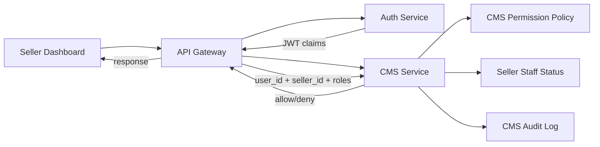
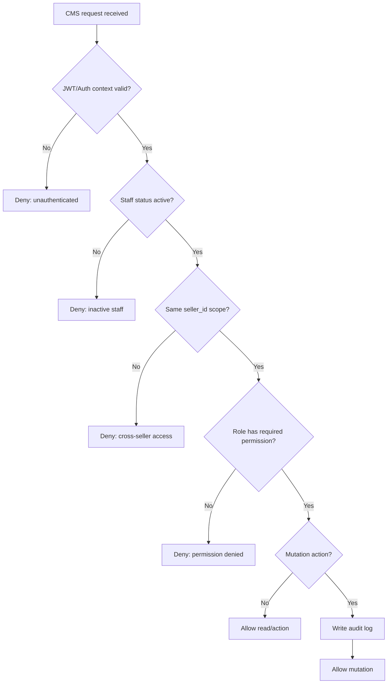
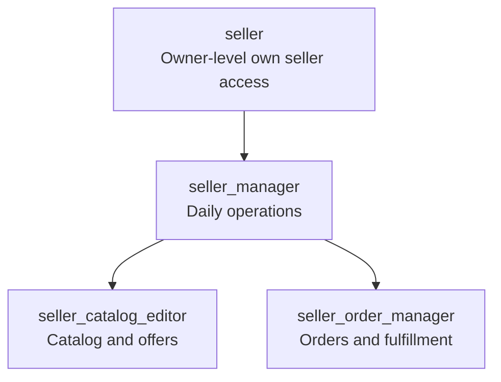

# 🧩 CMS Service - Task 1: Define Seller Permissions


## 📌 Task Summary

| Field | Detail |
|---|---|
| Task Name | Define seller permissions |
| Source | `docs/01-micro-tasks.md` → `CMS Service` → Task 1 |
| Goal | Seller manager, catalog editor, aur order manager roles define karna |
| Dependency | `Auth RBAC` |
| Priority | `P1` |
| Scope | Permission model, role matrix, access-control rules, and implementation reference |
| Not Included | MySQL migrations, coupon engine, campaigns, analytics APIs, product moderation workflow, CMS gRPC implementation |

> **Simple Hinglish goal:** CMS Service me seller apni team ko controlled access de sake. Har staff member ko sirf wahi kaam karne ki permission mile jo uske role ke hisaab se required hai. Is task me hum roles, permissions, scope rules, aur enforcement flow define kar rahe hain.

---

## ✅ Final Output Created

```text
TaskImplementation/
└── CMS Service/
    └── task1.md
```

### Why this structure?

- `TaskImplementation/` already project me task-wise implementation guides ke liye use ho raha hai.
- `CMS Service/` CMS related task guides ko group karega.
- `task1.md` sirf **CMS Service - Task 1** ke seller permission design ko document karta hai.

---

## 🧭 Requirement Source Mapping

| Document | Kya use kiya gaya |
|---|---|
| `docs/01-micro-tasks.md` | CMS Service Task 1 ka exact scope: seller permissions |
| `docs/04-microservice-design.md` | CMS Service responsibilities: seller staff permissions, audit logs, seller dashboard backend |
| `docs/06-auth-security.md` | Existing RBAC roles and JWT claims model |
| `docs/09-cms-superadmin.md` | Seller CMS modules: products, orders, offers, team management, audit activity |
| `docs/03-folder-structure.md` | Future CMS service folder placement reference |

---

## 🚦 Scope Boundary

### ✅ In Scope

- Seller-facing CMS roles define karna.
- Permission naming standard define karna.
- Role-to-permission matrix banana.
- Same-seller access scope rule define karna.
- Auth context/JWT claims ka use explain karna.
- Gateway and CMS Service enforcement flow define karna.
- Audit expectation define karna for permission-sensitive actions.

### 🚫 Out of Scope

- MySQL table migrations banana.
- Coupon validation engine implement karna.
- Product moderation state machine implement karna.
- Seller analytics APIs banana.
- gRPC server/client code generate karna.
- Frontend seller dashboard screens banana.

> 🔴 **Reason:** Ye sab CMS Service ke later tasks me aate hain. Task 1 ka kaam sirf permission foundation define karna hai.

---

## 🪜 Step-by-Step Implementation

## Step 1: Task requirement identify kiya

`docs/01-micro-tasks.md` me CMS Service ka Task 1 hai:

| S.No | Task Name | Detail | Dependency |
|---:|---|---|---|
| 1 | Define seller permissions | Seller manager, catalog editor, order manager roles define karo | Auth RBAC |

**Implementation decision:**

- CMS Service apna permission model define karega.
- Auth Service user authentication aur global role claims provide karega.
- CMS Service seller-specific scope validate karega.

> 🟢 **Why:** Auth Service ke paas identity hai, but CMS Service ko seller dashboard ke domain-specific actions samajh aate hain. Isliye final domain authorization CMS boundary me bhi verify hoga.

---

## Step 2: Seller actor model define kiya

CMS permissions ke liye pehle ye clear karna zaruri hai ki action perform kaun kar raha hai.

| Actor | Meaning |
|---|---|
| `seller` | Primary seller owner/account. Apne seller workspace ka highest access. |
| `seller_manager` | Seller team ka manager. Most daily operations manage kar sakta hai. |
| `seller_catalog_editor` | Product/catalog/coupon related work kar sakta hai. |
| `seller_order_manager` | Orders, shipment, cancellation/return support related work kar sakta hai. |

### Key identity fields

| Field | Purpose |
|---|---|
| `user_id` | Staff/user identity |
| `seller_id` | Seller workspace identity |
| `roles` | Auth RBAC se aane wale role names |
| `staff_status` | Staff active hai ya revoked |
| `request_id` | Audit and tracing ke liye |

### Auth context example

```json
{
  "user_id": "user_123",
  "seller_id": "seller_456",
  "roles": ["seller_catalog_editor"],
  "staff_status": "active",
  "request_id": "req_789"
}
```

**Explanation:**  
CMS Service har protected action ke time ye check karega ki actor ka `seller_id` requested resource ke `seller_id` se match karta hai ya nahi.

---

## Step 3: Seller roles define kiye

### Role 1: `seller`

Primary seller owner role.

| Property | Detail |
|---|---|
| Access Level | Full own-seller CMS access |
| Can manage staff? | Yes |
| Can update seller settings? | Yes |
| Can access audit logs? | Yes |
| Typical user | Business owner / seller account owner |

**Rule:** `seller` role ko owner treat kiya jayega, but sirf apne `seller_id` ke resources par.

---

### Role 2: `seller_manager`

Daily operations manager role.

| Property | Detail |
|---|---|
| Access Level | Broad operational access |
| Can manage staff? | Limited |
| Can manage catalog? | Yes |
| Can manage orders? | Yes |
| Can view analytics? | Yes |
| Typical user | Store manager / operations lead |

**Rule:** Manager day-to-day CMS operate karega, but owner-level actions jaise ownership transfer ya critical staff role changes future me restricted rahenge.

---

### Role 3: `seller_catalog_editor`

Catalog and merchandising role.

| Property | Detail |
|---|---|
| Access Level | Product/catalog/offers focused |
| Can manage products? | Yes |
| Can manage coupons/campaign drafts? | Yes |
| Can manage orders? | No |
| Can manage staff? | No |
| Typical user | Catalog executive / merchandising team |

**Rule:** Catalog editor ko order, staff, aur seller settings write access nahi milega.

---

### Role 4: `seller_order_manager`

Order operations role.

| Property | Detail |
|---|---|
| Access Level | Order handling focused |
| Can view orders? | Yes |
| Can update fulfillment fields? | Yes |
| Can manage products? | No |
| Can manage coupons? | No |
| Typical user | Fulfillment team / support operator |

**Rule:** Order manager product pricing, coupons, campaigns, ya staff permissions modify nahi karega.

---

## Step 4: Permission naming standard define kiya

Permission format:

```text
cms:<resource>:<action>
```

### Examples

| Permission | Meaning |
|---|---|
| `cms:products:read` | Seller products list/detail read karna |
| `cms:products:update` | Product draft/details update karna |
| `cms:orders:read` | Seller orders read karna |
| `cms:orders:update_fulfillment` | Shipment/fulfillment fields update karna |
| `cms:staff:invite` | Staff member invite karna |
| `cms:settings:update` | Seller settings update karna |

### Naming rules

- Prefix always `cms` rahega.
- Resource plural/simple noun hoga: `products`, `orders`, `staff`.
- Action verb hoga: `read`, `create`, `update`, `delete`, `invite`.
- Permissions lower snake-case style me honge.
- Wildcard permissions app code me avoid karni hain; explicit permissions safer hain.

> 🟡 **Why explicit permissions?** Jab role ka access clearly list hota hai, accidental over-permission ka risk kam hota hai.

---

## Step 5: Permission catalog build kiya

### Seller workspace permissions

| Permission | Description | Risk |
|---|---|---|
| `cms:settings:read` | Seller settings read | Low |
| `cms:settings:update` | Seller settings update | High |
| `cms:analytics:read` | Seller metrics/dashboard read | Medium |
| `cms:audit_logs:read` | Seller activity logs read | Medium |

### Staff permissions

| Permission | Description | Risk |
|---|---|---|
| `cms:staff:read` | Staff list read | Medium |
| `cms:staff:invite` | New staff invite | High |
| `cms:staff:update_role` | Staff role change | High |
| `cms:staff:remove` | Staff access revoke | High |

### Catalog permissions

| Permission | Description | Risk |
|---|---|---|
| `cms:products:read` | Own seller products read | Low |
| `cms:products:create` | Product draft create | Medium |
| `cms:products:update` | Product draft/details update | High |
| `cms:products:submit_review` | Product approval review ke liye submit | Medium |
| `cms:products:unpublish` | Product unpublish request/action | High |

### Offer and coupon permissions

| Permission | Description | Risk |
|---|---|---|
| `cms:coupons:read` | Coupons read | Low |
| `cms:coupons:create` | Coupon draft/create | High |
| `cms:coupons:update` | Coupon rules update | High |
| `cms:coupons:disable` | Coupon disable | Medium |
| `cms:campaigns:read` | Campaigns read | Low |
| `cms:campaigns:create` | Campaign create | High |
| `cms:campaigns:update` | Campaign update | High |
| `cms:campaigns:disable` | Campaign disable | Medium |

### Order permissions

| Permission | Description | Risk |
|---|---|---|
| `cms:orders:read` | Seller orders read | Medium |
| `cms:orders:update_fulfillment` | Shipment/tracking status update | High |
| `cms:orders:respond_return` | Return/cancellation support response | High |

> 🔵 **Note:** Coupon engine, campaign execution, product moderation, and order workflows later tasks me implement honge. Task 1 me sirf unke access permissions define kiye gaye hain.

---

## Step 6: Role-to-permission matrix banaya

Legend:

- ✅ Allowed
- ❌ Not allowed
- ⚠️ Limited / owner review recommended

| Permission | `seller` | `seller_manager` | `seller_catalog_editor` | `seller_order_manager` |
|---|---:|---:|---:|---:|
| `cms:settings:read` | ✅ | ✅ | ❌ | ❌ |
| `cms:settings:update` | ✅ | ⚠️ | ❌ | ❌ |
| `cms:analytics:read` | ✅ | ✅ | ✅ | ✅ |
| `cms:audit_logs:read` | ✅ | ✅ | ❌ | ❌ |
| `cms:staff:read` | ✅ | ✅ | ❌ | ❌ |
| `cms:staff:invite` | ✅ | ⚠️ | ❌ | ❌ |
| `cms:staff:update_role` | ✅ | ❌ | ❌ | ❌ |
| `cms:staff:remove` | ✅ | ❌ | ❌ | ❌ |
| `cms:products:read` | ✅ | ✅ | ✅ | ❌ |
| `cms:products:create` | ✅ | ✅ | ✅ | ❌ |
| `cms:products:update` | ✅ | ✅ | ✅ | ❌ |
| `cms:products:submit_review` | ✅ | ✅ | ✅ | ❌ |
| `cms:products:unpublish` | ✅ | ✅ | ✅ | ❌ |
| `cms:coupons:read` | ✅ | ✅ | ✅ | ❌ |
| `cms:coupons:create` | ✅ | ✅ | ✅ | ❌ |
| `cms:coupons:update` | ✅ | ✅ | ✅ | ❌ |
| `cms:coupons:disable` | ✅ | ✅ | ✅ | ❌ |
| `cms:campaigns:read` | ✅ | ✅ | ✅ | ❌ |
| `cms:campaigns:create` | ✅ | ✅ | ✅ | ❌ |
| `cms:campaigns:update` | ✅ | ✅ | ✅ | ❌ |
| `cms:campaigns:disable` | ✅ | ✅ | ✅ | ❌ |
| `cms:orders:read` | ✅ | ✅ | ❌ | ✅ |
| `cms:orders:update_fulfillment` | ✅ | ✅ | ❌ | ✅ |
| `cms:orders:respond_return` | ✅ | ✅ | ❌ | ✅ |

### Limited permission meaning

`⚠️ Limited` ka matlab:

- Action allowed ho sakta hai, but production me stricter rule lag sakta hai.
- Example: `seller_manager` staff invite kar sakta hai, but `seller` role assign nahi kar sakta.
- Example: `seller_manager` basic settings update kar sakta hai, but payout/billing settings owner-only rahenge.

---

## Step 7: Same-seller scope rule define kiya

CMS Service me sabse important rule:

```text
Actor can access resource only when actor.seller_id == resource.seller_id
```

### Scope examples

| Scenario | Decision | Reason |
|---|---|---|
| Staff of `seller_1` reads product of `seller_1` | Allow if permission exists | Same seller scope |
| Staff of `seller_1` reads order of `seller_2` | Deny | Cross-seller access |
| `seller_catalog_editor` updates own seller product | Allow | Role has catalog permission |
| `seller_order_manager` updates product | Deny | Role does not have catalog write permission |
| Revoked staff tries any CMS action | Deny | Staff status inactive |

### Deny-by-default rule

```text
If permission is missing, invalid, inactive, expired, cross-seller, or unknown → deny.
```

> 🔴 **Security rule:** Unknown role ya unknown permission ko kabhi allow nahi karna.

---

## Step 8: Auth RBAC integration define kiya

Auth Service JWT me roles and seller context provide karega. CMS Service us context ko trust karega only after Gateway/Auth validation.

### JWT claim reference

```json
{
  "sub": "user_123",
  "sid": "sess_123",
  "roles": ["seller_catalog_editor"],
  "seller_id": "seller_456",
  "token_type": "access",
  "iss": "ecommerce-auth",
  "aud": "ecommerce-api"
}
```

### Gateway responsibility

- JWT signature validate karega.
- Token expiry validate karega.
- Route-level role check karega.
- Request context me `user_id`, `seller_id`, `roles`, `request_id` pass karega.

### CMS Service responsibility

- Domain permission check karega.
- Same-seller scope validate karega.
- Staff status active hai ya nahi verify karega.
- High-risk mutations ke liye audit event create karega.

---

## Step 9: Enforcement flow design kiya



### Flow explanation

1. Seller dashboard API Gateway ko request bhejta hai.
2. Gateway JWT validate karta hai.
3. Gateway Auth claims ko request context me CMS Service tak pass karta hai.
4. CMS Service required permission identify karta hai.
5. CMS Service role matrix and seller scope check karta hai.
6. Mutation action hai to audit log entry create hoti hai.
7. Permission pass ho to action continue, warna `permission_denied`.

---

## Step 10: Permission decision flow define kiya



### Decision rules

- Authentication fail hua to service action start hi nahi karega.
- Staff revoked hai to role valid hone ke baad bhi access deny.
- Seller scope mismatch hai to always deny.
- Permission missing hai to deny.
- Mutation action allowed hai to audit mandatory.

---

## Step 11: Role hierarchy visualize kiya



> 🟡 **Important:** Ye hierarchy inheritance blindly implement nahi karti. Actual authorization explicit matrix se hoga. Diagram sirf mental model ke liye hai.

---

## Step 12: Policy object reference banaya

Ye sample JSON CMS permission policy ko clear dikhane ke liye hai. Is task me actual JSON config file create nahi ki gayi.

```json
{
  "seller": [
    "cms:settings:read",
    "cms:settings:update",
    "cms:analytics:read",
    "cms:audit_logs:read",
    "cms:staff:read",
    "cms:staff:invite",
    "cms:staff:update_role",
    "cms:staff:remove",
    "cms:products:read",
    "cms:products:create",
    "cms:products:update",
    "cms:products:submit_review",
    "cms:products:unpublish",
    "cms:coupons:read",
    "cms:coupons:create",
    "cms:coupons:update",
    "cms:coupons:disable",
    "cms:campaigns:read",
    "cms:campaigns:create",
    "cms:campaigns:update",
    "cms:campaigns:disable",
    "cms:orders:read",
    "cms:orders:update_fulfillment",
    "cms:orders:respond_return"
  ],
  "seller_manager": [
    "cms:settings:read",
    "cms:settings:update",
    "cms:analytics:read",
    "cms:audit_logs:read",
    "cms:staff:read",
    "cms:staff:invite",
    "cms:products:read",
    "cms:products:create",
    "cms:products:update",
    "cms:products:submit_review",
    "cms:products:unpublish",
    "cms:coupons:read",
    "cms:coupons:create",
    "cms:coupons:update",
    "cms:coupons:disable",
    "cms:campaigns:read",
    "cms:campaigns:create",
    "cms:campaigns:update",
    "cms:campaigns:disable",
    "cms:orders:read",
    "cms:orders:update_fulfillment",
    "cms:orders:respond_return"
  ],
  "seller_catalog_editor": [
    "cms:analytics:read",
    "cms:products:read",
    "cms:products:create",
    "cms:products:update",
    "cms:products:submit_review",
    "cms:products:unpublish",
    "cms:coupons:read",
    "cms:coupons:create",
    "cms:coupons:update",
    "cms:coupons:disable",
    "cms:campaigns:read",
    "cms:campaigns:create",
    "cms:campaigns:update",
    "cms:campaigns:disable"
  ],
  "seller_order_manager": [
    "cms:analytics:read",
    "cms:orders:read",
    "cms:orders:update_fulfillment",
    "cms:orders:respond_return"
  ]
}
```

---

## Step 13: Go implementation reference define kiya

Actual Go file is task me create nahi ki gayi. Ye snippet future CMS Service implementation ke liye reference hai.

### Permission constants

```go
package domain

type Role string
type Permission string

const (
    RoleSeller              Role = "seller"
    RoleSellerManager       Role = "seller_manager"
    RoleSellerCatalogEditor Role = "seller_catalog_editor"
    RoleSellerOrderManager  Role = "seller_order_manager"
)

const (
    PermissionSettingsRead          Permission = "cms:settings:read"
    PermissionSettingsUpdate        Permission = "cms:settings:update"
    PermissionAnalyticsRead         Permission = "cms:analytics:read"
    PermissionAuditLogsRead         Permission = "cms:audit_logs:read"
    PermissionStaffRead             Permission = "cms:staff:read"
    PermissionStaffInvite           Permission = "cms:staff:invite"
    PermissionStaffUpdateRole       Permission = "cms:staff:update_role"
    PermissionStaffRemove           Permission = "cms:staff:remove"
    PermissionProductsRead          Permission = "cms:products:read"
    PermissionProductsCreate        Permission = "cms:products:create"
    PermissionProductsUpdate        Permission = "cms:products:update"
    PermissionProductsSubmitReview  Permission = "cms:products:submit_review"
    PermissionProductsUnpublish     Permission = "cms:products:unpublish"
    PermissionCouponsRead           Permission = "cms:coupons:read"
    PermissionCouponsCreate         Permission = "cms:coupons:create"
    PermissionCouponsUpdate         Permission = "cms:coupons:update"
    PermissionCouponsDisable        Permission = "cms:coupons:disable"
    PermissionCampaignsRead         Permission = "cms:campaigns:read"
    PermissionCampaignsCreate       Permission = "cms:campaigns:create"
    PermissionCampaignsUpdate       Permission = "cms:campaigns:update"
    PermissionCampaignsDisable      Permission = "cms:campaigns:disable"
    PermissionOrdersRead            Permission = "cms:orders:read"
    PermissionOrdersUpdateFulfill   Permission = "cms:orders:update_fulfillment"
    PermissionOrdersRespondReturn   Permission = "cms:orders:respond_return"
)
```

### Policy map

```go
package domain

var RolePermissions = map[Role]map[Permission]bool{
    RoleSeller: {
        PermissionSettingsRead: true,
        PermissionSettingsUpdate: true,
        PermissionAnalyticsRead: true,
        PermissionAuditLogsRead: true,
        PermissionStaffRead: true,
        PermissionStaffInvite: true,
        PermissionStaffUpdateRole: true,
        PermissionStaffRemove: true,
        PermissionProductsRead: true,
        PermissionProductsCreate: true,
        PermissionProductsUpdate: true,
        PermissionProductsSubmitReview: true,
        PermissionProductsUnpublish: true,
        PermissionCouponsRead: true,
        PermissionCouponsCreate: true,
        PermissionCouponsUpdate: true,
        PermissionCouponsDisable: true,
        PermissionCampaignsRead: true,
        PermissionCampaignsCreate: true,
        PermissionCampaignsUpdate: true,
        PermissionCampaignsDisable: true,
        PermissionOrdersRead: true,
        PermissionOrdersUpdateFulfill: true,
        PermissionOrdersRespondReturn: true,
    },
    RoleSellerManager: {
        PermissionSettingsRead: true,
        PermissionSettingsUpdate: true,
        PermissionAnalyticsRead: true,
        PermissionAuditLogsRead: true,
        PermissionStaffRead: true,
        PermissionStaffInvite: true,
        PermissionProductsRead: true,
        PermissionProductsCreate: true,
        PermissionProductsUpdate: true,
        PermissionProductsSubmitReview: true,
        PermissionProductsUnpublish: true,
        PermissionCouponsRead: true,
        PermissionCouponsCreate: true,
        PermissionCouponsUpdate: true,
        PermissionCouponsDisable: true,
        PermissionCampaignsRead: true,
        PermissionCampaignsCreate: true,
        PermissionCampaignsUpdate: true,
        PermissionCampaignsDisable: true,
        PermissionOrdersRead: true,
        PermissionOrdersUpdateFulfill: true,
        PermissionOrdersRespondReturn: true,
    },
    RoleSellerCatalogEditor: {
        PermissionAnalyticsRead: true,
        PermissionProductsRead: true,
        PermissionProductsCreate: true,
        PermissionProductsUpdate: true,
        PermissionProductsSubmitReview: true,
        PermissionProductsUnpublish: true,
        PermissionCouponsRead: true,
        PermissionCouponsCreate: true,
        PermissionCouponsUpdate: true,
        PermissionCouponsDisable: true,
        PermissionCampaignsRead: true,
        PermissionCampaignsCreate: true,
        PermissionCampaignsUpdate: true,
        PermissionCampaignsDisable: true,
    },
    RoleSellerOrderManager: {
        PermissionAnalyticsRead: true,
        PermissionOrdersRead: true,
        PermissionOrdersUpdateFulfill: true,
        PermissionOrdersRespondReturn: true,
    },
}
```

### Authorization function

```go
package domain

type ActorContext struct {
    UserID      string
    SellerID    string
    Roles       []Role
    StaffStatus string
}

func CanAccess(actor ActorContext, resourceSellerID string, required Permission) bool {
    if actor.UserID == "" || actor.SellerID == "" {
        return false
    }

    if actor.StaffStatus != "active" {
        return false
    }

    if actor.SellerID != resourceSellerID {
        return false
    }

    for _, role := range actor.Roles {
        permissions, ok := RolePermissions[role]
        if !ok {
            continue
        }

        if permissions[required] {
            return true
        }
    }

    return false
}
```

**Explanation:**  
Function pehle identity validate karta hai, phir staff active check karta hai, phir seller scope match karta hai, aur last me required permission verify karta hai. Ye deny-by-default behavior follow karta hai.

---

## Step 14: API route permission mapping define kiya

Ye mapping future API Gateway/CMS handlers ke liye reference hai.

| Route | Required Permission |
|---|---|
| `GET /api/v1/seller/dashboard/summary` | `cms:analytics:read` |
| `GET /api/v1/seller/settings` | `cms:settings:read` |
| `PATCH /api/v1/seller/settings` | `cms:settings:update` |
| `GET /api/v1/seller/staff` | `cms:staff:read` |
| `POST /api/v1/seller/staff/invites` | `cms:staff:invite` |
| `PATCH /api/v1/seller/staff/{staff_id}/role` | `cms:staff:update_role` |
| `DELETE /api/v1/seller/staff/{staff_id}` | `cms:staff:remove` |
| `GET /api/v1/seller/products` | `cms:products:read` |
| `POST /api/v1/seller/products` | `cms:products:create` |
| `PATCH /api/v1/seller/products/{product_id}` | `cms:products:update` |
| `POST /api/v1/seller/products/{product_id}/submit-review` | `cms:products:submit_review` |
| `POST /api/v1/seller/products/{product_id}/unpublish` | `cms:products:unpublish` |
| `GET /api/v1/seller/coupons` | `cms:coupons:read` |
| `POST /api/v1/seller/coupons` | `cms:coupons:create` |
| `PATCH /api/v1/seller/coupons/{coupon_id}` | `cms:coupons:update` |
| `POST /api/v1/seller/coupons/{coupon_id}/disable` | `cms:coupons:disable` |
| `GET /api/v1/seller/campaigns` | `cms:campaigns:read` |
| `POST /api/v1/seller/campaigns` | `cms:campaigns:create` |
| `PATCH /api/v1/seller/campaigns/{campaign_id}` | `cms:campaigns:update` |
| `POST /api/v1/seller/campaigns/{campaign_id}/disable` | `cms:campaigns:disable` |
| `GET /api/v1/seller/orders` | `cms:orders:read` |
| `PATCH /api/v1/seller/orders/{order_id}/fulfillment` | `cms:orders:update_fulfillment` |
| `POST /api/v1/seller/orders/{order_id}/returns/respond` | `cms:orders:respond_return` |

> 🔵 **Note:** Routes are mapped for permission clarity only. Actual route implementation belongs to API Gateway/CMS later tasks.

---

## Step 15: Audit rules define kiye

CMS Service me permission-sensitive mutation actions audit honi chahiye.

### Audit required for

| Action Type | Examples |
|---|---|
| Staff changes | invite, role update, remove |
| Settings changes | seller profile/settings update |
| Catalog mutations | product create/update/submit/unpublish |
| Coupon/campaign mutations | create/update/disable |
| Order operations | fulfillment update, return response |

### Audit record shape

```json
{
  "actor_user_id": "user_123",
  "actor_seller_id": "seller_456",
  "actor_roles": ["seller_manager"],
  "action": "cms:orders:update_fulfillment",
  "resource_type": "order",
  "resource_id": "order_789",
  "resource_seller_id": "seller_456",
  "request_id": "req_abc",
  "decision": "allowed",
  "created_at": "2026-05-24T10:00:00Z"
}
```

**Explanation:**  
Audit logs debugging, dispute handling, and security review ke liye important hain. Task 1 me audit fields define kiye gaye, actual `cms_audit_logs` table later schema task me create hoga.

---

## 📁 Clean Folder Structure

### Created in this task

```text
TaskImplementation/
└── CMS Service/
    └── task1.md
```

### Future CMS Service placement reference

Ye structure docs ke according future implementation ke liye hai. Is task me ye files create nahi ki gayi.

```text
backend/
└── services/
    └── cms-service/
        ├── cmd/
        │   └── server/
        │       └── main.go
        ├── internal/
        │   ├── domain/
        │   │   ├── permission.go
        │   │   ├── role.go
        │   │   └── seller_staff.go
        │   ├── usecase/
        │   │   ├── authorize_seller_action.go
        │   │   └── manage_staff_permissions.go
        │   ├── repository/
        │   │   └── mysql_cms_repository.go
        │   └── transport/
        │       └── grpc/
        ├── migrations/
        └── deploy/
```

### Responsibility of future files

| File/Folder | Responsibility |
|---|---|
| `domain/permission.go` | Permission constants and policy map |
| `domain/role.go` | Seller role constants |
| `domain/seller_staff.go` | Staff domain model |
| `usecase/authorize_seller_action.go` | Authorization decision logic |
| `usecase/manage_staff_permissions.go` | Invite/update/remove staff workflow |
| `repository/mysql_cms_repository.go` | Staff and permissions persistence |
| `transport/grpc/` | Internal gRPC handlers |

---

## 🧪 Test Scenarios for Future Implementation

Task 1 documentation-only hai, but future implementation ke liye test cases abhi define kar diye gaye.

| Test Case | Expected Result |
|---|---|
| `seller` updates own settings | Allow |
| `seller_catalog_editor` updates settings | Deny |
| `seller_order_manager` reads own order | Allow |
| `seller_order_manager` updates product | Deny |
| `seller_catalog_editor` creates coupon | Allow |
| `seller_catalog_editor` reads order | Deny |
| Staff from `seller_1` reads `seller_2` order | Deny |
| Revoked staff with valid JWT tries action | Deny |
| Unknown role tries action | Deny |
| Missing `seller_id` in context | Deny |

### Go unit test style reference

```go
func TestCanAccessDeniesCrossSellerAccess(t *testing.T) {
    actor := domain.ActorContext{
        UserID:      "user_1",
        SellerID:    "seller_1",
        Roles:       []domain.Role{domain.RoleSellerOrderManager},
        StaffStatus: "active",
    }

    allowed := domain.CanAccess(
        actor,
        "seller_2",
        domain.PermissionOrdersRead,
    )

    if allowed {
        t.Fatal("expected cross-seller access to be denied")
    }
}
```

---

## 🛠️ External Libraries / Tools Used

### Runtime libraries

| Library | Used? | Reason |
|---|---:|---|
| New Go package | ❌ | Task 1 is documentation/design only |
| New Node package | ❌ | No frontend implementation in this task |
| New database driver | ❌ | No DB implementation in this task |
| Casbin/Oso/OPA | ❌ | Permission model is simple enough for explicit in-service policy in MVP |

### Documentation tools

| Tool | What it is | Why used | Install/Use |
|---|---|---|---|
| Mermaid | Markdown-friendly diagram syntax | Architecture and decision flow diagrams readable banane ke liye | GitHub/GitLab markdown me usually render hota hai. Local VS Code preview ke liye Mermaid preview extension use kar sakte ho. |
| Shields.io badges | Static badge image service | Task metadata visually clear dikhane ke liye | Install nahi chahiye. Markdown image URL directly use hota hai. |

### Optional local Mermaid preview

VS Code extension search:

```text
Markdown Preview Mermaid Support
```

Usage:

```text
Open task1.md → Open Markdown Preview → Mermaid diagrams render honge
```

> 🟢 **No dependency installed:** Is task me project ke `go.mod`, `package.json`, ya lock files me koi change nahi kiya gaya.

---

## 🔐 Security Rules Summary

| Rule | Status |
|---|---:|
| Deny by default | ✅ |
| Same seller scope required | ✅ |
| Unknown role denied | ✅ |
| Unknown permission denied | ✅ |
| Revoked staff denied | ✅ |
| Mutation audit required | ✅ |
| Owner-level staff changes restricted | ✅ |
| Gateway and service both enforce auth | ✅ |

---

## 🎯 Acceptance Checklist

| Requirement | Completed |
|---|---:|
| `TaskImplementation/` folder available | ✅ |
| `TaskImplementation/CMS Service/` folder created/kept | ✅ |
| `task1.md` created | ✅ |
| Step-by-step implementation included | ✅ |
| Hinglish explanation included | ✅ |
| External tools/libraries section included | ✅ |
| Clean folder structure included | ✅ |
| Code examples included | ✅ |
| Mermaid diagrams included | ✅ |
| Proper formatting with badges/emojis included | ✅ |
| Scope limited to CMS Service Task 1 | ✅ |

---

## ✅ Final Task 1 Standard

CMS Service ke seller permission MVP ke liye final roles:

```text
seller
seller_manager
seller_catalog_editor
seller_order_manager
```

Final authorization rule:

```text
Authenticated actor + active staff + same seller scope + required permission = allow
```

Otherwise:

```text
deny
```

> 🟢 **Task 1 complete:** Seller permissions clearly define ho gaye hain. Ab next CMS tasks MySQL schema, product moderation, coupon engine, campaigns, analytics, gRPC, aur audit logs ko isi permission foundation ke upar build kar sakte hain.
