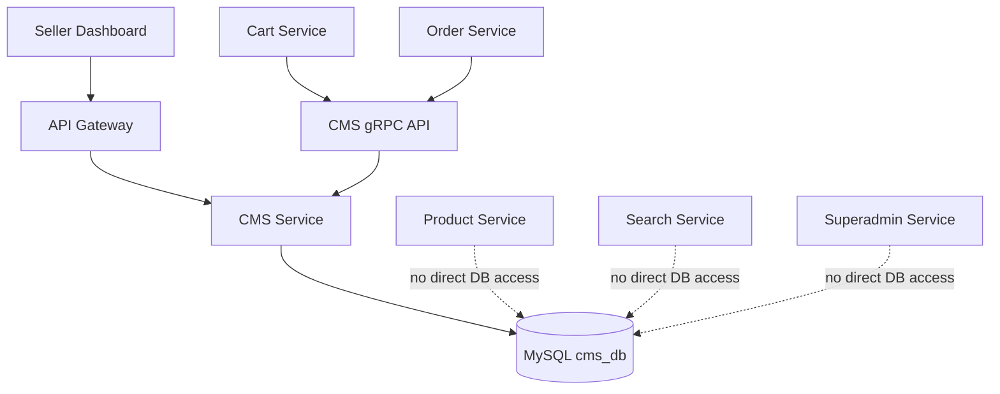
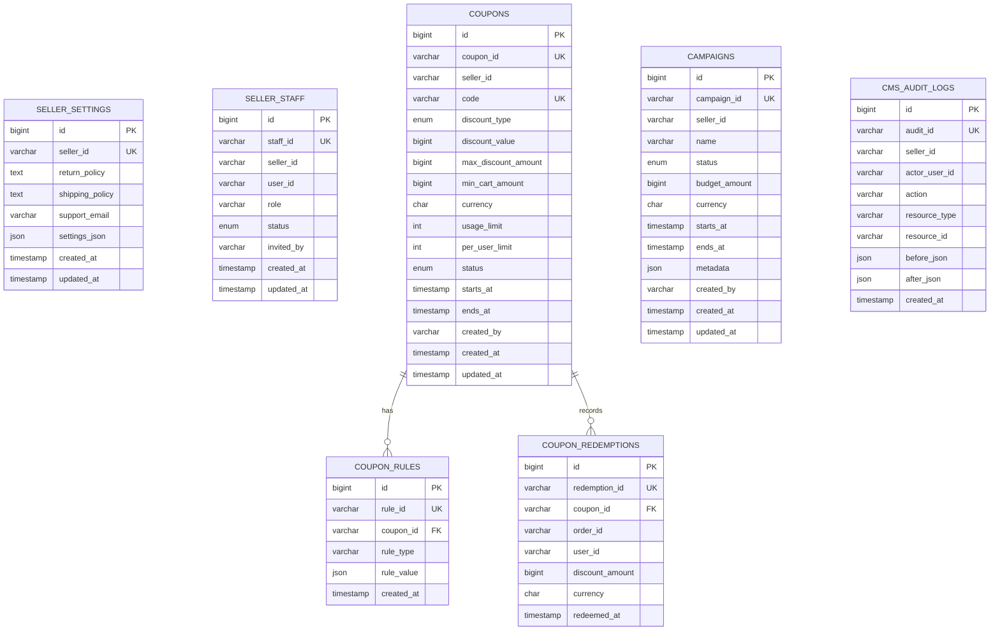
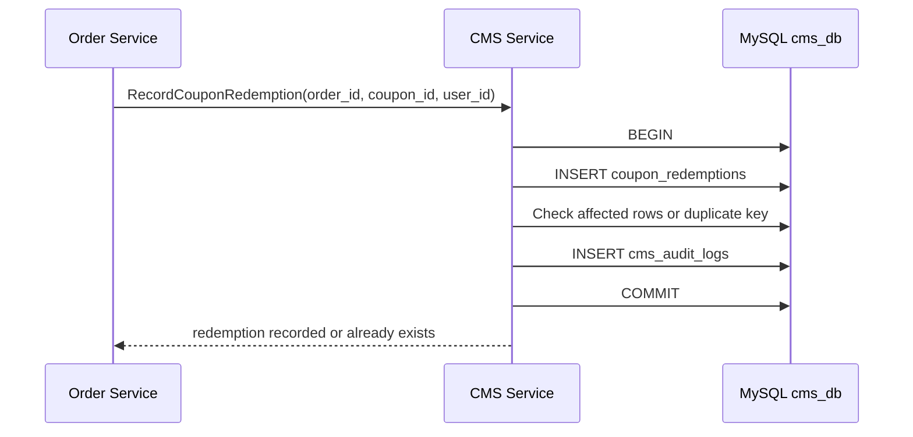
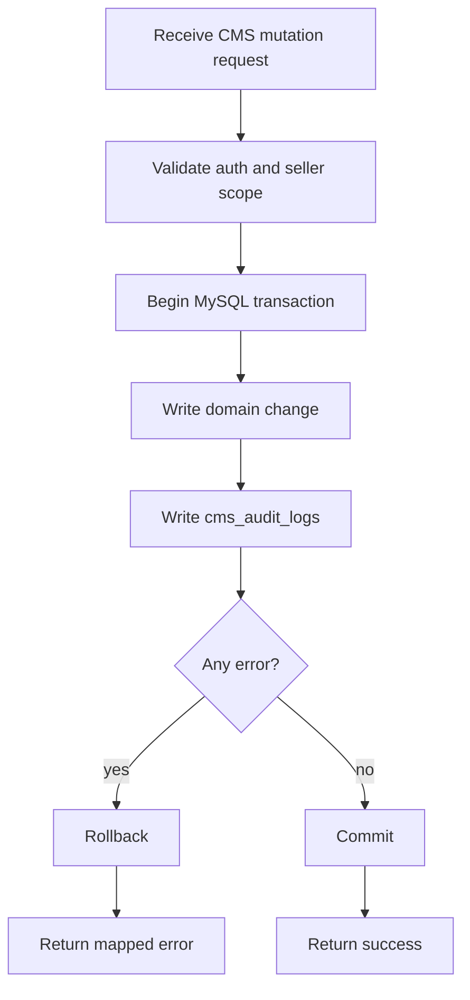
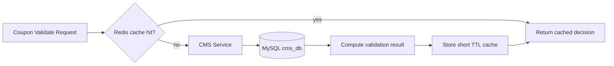

# 🧩 CMS Service - Task 2: Choose MySQL


## 📌 Task Summary

| Field | Detail |
|---|---|
| Task Name | Choose MySQL |
| Source | `docs/01-micro-tasks.md` -> `CMS Service` -> Task 2 |
| Goal | Coupons, offers, seller settings, aur workflows ke liye relational database choose karna |
| Dependency | CMS Service Task 1: `Define seller permissions` |
| Priority | `P1` |
| Scope | MySQL decision, CMS DB ownership, table blueprint, relationships, indexes, transaction rules, and future implementation guide |
| Not Included | New migrations, backend service code, coupon engine logic, campaign engine, analytics API, gRPC implementation |

> **Simple Hinglish goal:** CMS Service ko aisi database chahiye jahan seller settings, seller staff permissions, coupons, coupon rules, redemptions, campaigns, aur audit logs structured tarike se store ho sakein. Task 2 me hum MySQL ko choose kar rahe hain, kyunki CMS data relational hai, transactional updates chahiye, aur auditability important hai.

---

## ✅ Final Output Created

```text
TaskImplementation/
└── CMS Service/
    ├── task1.md
    └── task2.md
```

### Why this structure?

- `TaskImplementation/` project me task-wise implementation guides ke liye existing folder hai.
- `CMS Service/` folder already present tha, isliye usko preserve kiya gaya.
- `task2.md` sirf **CMS Service - Task 2** ka database decision and implementation guide hai.
- Existing code, migrations, aur service files ko modify nahi kiya gaya.

---

## 🧭 Requirement Source Mapping

| Document | Kya use kiya gaya |
|---|---|
| `docs/01-micro-tasks.md` | CMS Service Task 2 ka exact scope: `Choose MySQL` |
| `TaskImplementation/CMS Service/task1.md` | Previous dependency: seller permission model |
| `docs/02-system-architecture.md` | CMS Service ka MySQL CMS DB ke saath boundary |
| `docs/03-folder-structure.md` | Future `backend/services/cms-service/` placement reference |
| `docs/04-microservice-design.md` | CMS Service responsibilities and MySQL database choice |
| `docs/05-database-design.md` | CMS DB tables, relationships, indexes, and scalability notes |
| `database/draw.sql` | Existing reference DDL for `cms_db` |
| `docs/09-cms-superadmin.md` | Seller CMS modules: coupons, campaigns, settings, audit activity |

---

## 🚦 Scope Boundary

### ✅ In Scope

- MySQL choose karna as CMS Service primary database.
- Explain karna ki CMS data relational kyun hai.
- CMS Service DB ownership define karna.
- `cms_db` ka table blueprint document karna.
- Relationships, indexes, and transaction rules explain karna.
- Future migration and repository placement guide dena.
- MySQL tools/libraries ka purpose, install, and usage explain karna.

### 🚫 Out of Scope

- Actual migration file create karna.
- `backend/services/cms-service/` code scaffold banana.
- Coupon validation engine implement karna.
- Offer campaign business logic implement karna.
- Seller analytics API banana.
- gRPC proto/service implementation karna.
- Existing `database/draw.sql` ko change karna.

> 🔴 **Reason:** Task 2 ek database choice and schema strategy task hai. Real CMS tables/migrations implementation later CMS schema or service tasks me hoga.

---

## 🪜 Step-by-Step Implementation

## Step 1: Task requirement identify kiya

`docs/01-micro-tasks.md` me CMS Service ka Task 2 ye hai:

| S.No | Task Name | Detail | Dependency |
|---:|---|---|---|
| 2 | Choose MySQL | Coupons, offers, seller settings, workflows structured hain, relational model fit hai | Permissions |

**Implementation decision:**

- CMS Service ke liye **MySQL 8+** primary database choose kiya gaya.
- Reason ye hai ki CMS data me strong relationships, transactional writes, unique constraints, status workflows, and audit history chahiye.
- Previous Task 1 me seller permissions define hue the, aur Task 2 un permissions ko persist karne ke liye database foundation choose karta hai.

> 🟢 **Why:** Seller permissions, coupons, redemptions, and campaigns loosely connected JSON documents nahi hain. Inme ownership, uniqueness, status, validity windows, and audit trail required hai. MySQL ye sab cleanly handle karta hai.

---

## Step 2: CMS data nature ko analyze kiya

CMS Service ke core data modules:

| Module | Data Type | DB Need |
|---|---|---|
| Seller settings | One seller -> one settings record | Unique seller row |
| Seller staff | One seller -> many staff members | Role, status, unique seller-user pair |
| Coupons | Seller/platform coupon records | Code uniqueness, status, validity window |
| Coupon rules | One coupon -> many rules | Parent-child relation |
| Coupon redemptions | One coupon -> many redemption records | Idempotency, usage limit checks |
| Campaigns | Seller/platform campaign windows | Time range and status queries |
| CMS audit logs | One seller -> many action logs | Immutable history and filters |

### Data pattern observation

| Pattern | Example | MySQL Fit |
|---|---|---|
| Structured rows | coupon code, status, amount, dates | ✅ Strong |
| Parent-child relation | coupon -> coupon rules | ✅ Strong |
| Unique constraints | coupon code, seller staff pair | ✅ Strong |
| Transactional write | record redemption once per order | ✅ Strong |
| Query by time/status | active campaigns, active coupons | ✅ Strong |
| Audit trail | action logs by seller and resource | ✅ Strong |

---

## Step 3: MySQL ko final database choose kiya

### Final choice

```text
CMS Service Primary DB: MySQL 8+
Storage Engine: InnoDB
Character Set: utf8mb4
Collation: utf8mb4_unicode_ci
Database Name: cms_db
```

### MySQL kyun?

| Reason | Explanation |
|---|---|
| Relational model | Seller staff, coupons, rules, redemptions, campaigns linked data hai |
| Transactions | Coupon redemption and audit writes atomic hone chahiye |
| Constraints | Duplicate coupon code, duplicate staff mapping, duplicate redemption avoid karna easy |
| Indexing | Seller dashboard list pages fast ban sakti hain |
| Auditability | CMS changes traceable records me store ho sakte hain |
| Mature ecosystem | Go, migrations, monitoring, backups, replicas sab easily available |

### Why not MongoDB?

MongoDB product catalog ya session events ke liye useful hai, but CMS Task 2 me data mostly structured hai.

| Requirement | MongoDB Concern |
|---|---|
| Coupon code uniqueness | Possible hai, but relational checks clearer hain |
| Redemption idempotency | MySQL unique keys + transactions simpler hain |
| Seller staff role matrix | Relational model easier to query and audit |
| Campaign date window queries | MySQL indexes simple and predictable |
| Audit logs with filters | MySQL composite indexes fit well |

### Why not Redis as primary DB?

Redis cache ke liye best hai, source of truth ke liye nahi.

| Redis Use | Task 2 Decision |
|---|---|
| Coupon validation short TTL cache | Future optimization |
| Seller settings hot cache | Future optimization |
| Primary CMS data store | ❌ Not suitable |

---

## Step 4: Database ownership boundary define kiya

Project architecture ke according har microservice apni database own karegi.

### CMS Service ownership rule

```text
CMS Service owns cms_db.
Other services cannot directly query cms_db.
Other services must use CMS gRPC/API contracts.
```

### Boundary diagram



### Explanation

- Seller Dashboard REST request API Gateway par aayegi.
- Gateway auth context validate karega and CMS Service ko call karega.
- Cart/Order jaise internal services coupon/settings data ke liye CMS gRPC use karenge.
- Direct cross-service DB access avoid hoga, taaki ownership clear rahe.

> 🟡 **Important:** `seller_id`, `user_id`, `order_id`, `product_id` jaise IDs CMS DB me store honge, but external service DBs ke saath cross-service foreign key nahi banegi.

---

## Step 5: CMS DB table blueprint define kiya

Existing reference DDL `database/draw.sql` me CMS DB ke liye ye tables already documented hain:

| Table | Purpose |
|---|---|
| `seller_settings` | Seller specific policies, support email, flexible settings |
| `seller_staff` | Seller team members, role, and status |
| `coupons` | Coupon master data |
| `coupon_rules` | Coupon eligibility/scope rules |
| `coupon_redemptions` | Applied coupon redemption history |
| `campaigns` | Offer campaign windows, budgets, metadata |
| `cms_audit_logs` | Seller dashboard action logs |

### Clean table grouping

```text
cms_db
├── seller_settings
├── seller_staff
├── coupons
├── coupon_rules
├── coupon_redemptions
├── campaigns
└── cms_audit_logs
```

---

## Step 6: Relationship model design kiya

### Mermaid ER diagram



### Relationship explanation

| Relationship | Meaning |
|---|---|
| One seller -> one `seller_settings` | Har seller ka one active settings row |
| One seller -> many `seller_staff` | Seller ke multiple staff users ho sakte hain |
| One coupon -> many `coupon_rules` | Coupon me multiple eligibility rules ho sakte hain |
| One coupon -> many `coupon_redemptions` | Coupon multiple orders/users par redeem ho sakta hai |
| One seller -> many `campaigns` | Seller multiple campaigns run kar sakta hai |
| One seller -> many `cms_audit_logs` | Seller dashboard ke actions trace hote hain |

> 🔵 **Note:** `seller_id` external User Service domain se aata hai, but CMS DB me direct User DB foreign key nahi hogi. Microservice boundary maintain karna important hai.

---

## Step 7: Existing reference DDL ko map kiya

Task 2 me migration create nahi ki gayi, but `database/draw.sql` ka CMS section reference ke liye use hua.

### Database creation reference

```sql
CREATE DATABASE IF NOT EXISTS cms_db
  CHARACTER SET utf8mb4
  COLLATE utf8mb4_unicode_ci;

USE cms_db;
```

**Explanation:**  
`utf8mb4` full Unicode support deta hai. Seller policies, names, notes, aur metadata future me multiple languages support kar sakte hain.

### Seller settings table reference

```sql
CREATE TABLE IF NOT EXISTS seller_settings (
  id BIGINT UNSIGNED NOT NULL AUTO_INCREMENT,
  seller_id VARCHAR(64) NOT NULL,
  return_policy TEXT NULL,
  shipping_policy TEXT NULL,
  support_email VARCHAR(255) NULL,
  settings_json JSON NULL,
  created_at TIMESTAMP NOT NULL DEFAULT CURRENT_TIMESTAMP,
  updated_at TIMESTAMP NOT NULL DEFAULT CURRENT_TIMESTAMP ON UPDATE CURRENT_TIMESTAMP,
  PRIMARY KEY (id),
  UNIQUE KEY uk_seller_settings_seller_id (seller_id)
) ENGINE=InnoDB;
```

**Why built this way?**

- `seller_id` unique hai, kyunki har seller ka one main settings record hona chahiye.
- `return_policy` and `shipping_policy` text fields hain, kyunki seller policies long ho sakti hain.
- `settings_json` flexible field hai for future toggles without immediate schema change.
- `updated_at` automatic update hota hai, audit and debugging easy hoti hai.

---

## Step 8: Seller staff persistence design kiya

Task 1 me roles define hue the:

- `seller`
- `seller_manager`
- `seller_catalog_editor`
- `seller_order_manager`

Task 2 me un roles ko persist karne ke liye `seller_staff` table use hogi.

### Seller staff table reference

```sql
CREATE TABLE IF NOT EXISTS seller_staff (
  id BIGINT UNSIGNED NOT NULL AUTO_INCREMENT,
  staff_id VARCHAR(64) NOT NULL,
  seller_id VARCHAR(64) NOT NULL,
  user_id VARCHAR(64) NOT NULL,
  role VARCHAR(64) NOT NULL,
  status ENUM('invited', 'active', 'disabled') NOT NULL DEFAULT 'invited',
  invited_by VARCHAR(64) NULL,
  created_at TIMESTAMP NOT NULL DEFAULT CURRENT_TIMESTAMP,
  updated_at TIMESTAMP NOT NULL DEFAULT CURRENT_TIMESTAMP ON UPDATE CURRENT_TIMESTAMP,
  PRIMARY KEY (id),
  UNIQUE KEY uk_seller_staff_staff_id (staff_id),
  UNIQUE KEY uk_seller_staff_seller_user (seller_id, user_id),
  KEY idx_seller_staff_seller_status (seller_id, status)
) ENGINE=InnoDB;
```

### Why built this way?

| Field/Constraint | Reason |
|---|---|
| `staff_id` unique | Public stable staff identifier |
| `seller_id + user_id` unique | Same user ko same seller me duplicate staff row nahi milegi |
| `role` | Task 1 permission model ke roles store honge |
| `status` | Invite, active, disabled lifecycle support |
| `idx_seller_staff_seller_status` | Active staff list fast query hogi |

### Staff lookup example

```sql
SELECT staff_id, user_id, role, status
FROM seller_staff
WHERE seller_id = 'seller_456'
  AND status = 'active'
ORDER BY created_at DESC;
```

**Explanation:**  
Seller team page me active staff list dikhane ke liye ye query useful hogi.

---

## Step 9: Coupon tables ka relational model choose kiya

Coupon engine later task me implement hoga, but Task 2 me data store ka foundation define karna zaruri hai.

### Coupons table important fields

| Field | Purpose |
|---|---|
| `coupon_id` | Public coupon identifier |
| `seller_id` | Seller ownership, nullable in reference for possible platform-level coupon |
| `code` | Customer-facing coupon code |
| `discount_type` | `fixed` or `percentage` |
| `discount_value` | Minor unit amount or percentage value |
| `max_discount_amount` | Percentage coupon cap |
| `min_cart_amount` | Eligibility threshold |
| `usage_limit` | Global use cap |
| `per_user_limit` | Per user use cap |
| `status` | Draft, active, paused, expired |
| `starts_at`, `ends_at` | Validity window |

### Coupon indexes

```sql
UNIQUE KEY uk_coupons_coupon_id (coupon_id),
UNIQUE KEY uk_coupons_code (code),
KEY idx_coupons_seller_status (seller_id, status),
KEY idx_coupons_window (starts_at, ends_at)
```

### Why built this way?

- `code` unique hone se duplicate coupon conflicts avoid honge.
- `seller_id, status` index seller dashboard coupon list ke liye useful hai.
- `starts_at, ends_at` index active coupon validation me help karega.
- Amounts `BIGINT` me store honge, taaki floating point money bugs avoid ho.

### Active coupon lookup example

```sql
SELECT coupon_id, seller_id, code, discount_type, discount_value,
       max_discount_amount, min_cart_amount, currency,
       usage_limit, per_user_limit, status, starts_at, ends_at
FROM coupons
WHERE code = 'SAVE250'
  AND status = 'active'
  AND (starts_at IS NULL OR starts_at <= UTC_TIMESTAMP())
  AND (ends_at IS NULL OR ends_at >= UTC_TIMESTAMP())
LIMIT 1;
```

**Explanation:**  
Coupon validation ke time pehle coupon master row fetch hogi. Actual rule evaluation Task 4 me implement hogi.

---

## Step 10: Coupon rules ko separate table me rakha

Coupon rules flexible ho sakte hain:

- Product scope
- Category scope
- Seller scope
- New user only
- Cart minimum
- Per user limit
- Global usage limit

### Coupon rules table reference

```sql
CREATE TABLE IF NOT EXISTS coupon_rules (
  id BIGINT UNSIGNED NOT NULL AUTO_INCREMENT,
  rule_id VARCHAR(64) NOT NULL,
  coupon_id VARCHAR(64) NOT NULL,
  rule_type VARCHAR(64) NOT NULL,
  rule_value JSON NOT NULL,
  created_at TIMESTAMP NOT NULL DEFAULT CURRENT_TIMESTAMP,
  PRIMARY KEY (id),
  UNIQUE KEY uk_coupon_rules_rule_id (rule_id),
  KEY idx_coupon_rules_coupon (coupon_id),
  CONSTRAINT fk_coupon_rules_coupon
    FOREIGN KEY (coupon_id) REFERENCES coupons(coupon_id)
) ENGINE=InnoDB;
```

### Why JSON only for rule value?

Core coupon fields relational columns me hain. Flexible rule payload `JSON` me rakha gaya.

| Rule Type | Example `rule_value` |
|---|---|
| `category_scope` | `{"category_ids":["cat_1","cat_2"]}` |
| `product_scope` | `{"product_ids":["prod_1","prod_2"]}` |
| `new_user_only` | `{"enabled":true}` |
| `seller_scope` | `{"seller_ids":["seller_456"]}` |

### Rule fetch example

```sql
SELECT rule_type, rule_value
FROM coupon_rules
WHERE coupon_id = 'coupon_123'
ORDER BY id ASC;
```

**Explanation:**  
Rules parent coupon ke saath linked hain. Isse coupon master stable rehta hai aur rule set independently grow ho sakta hai.

---

## Step 11: Coupon redemption idempotency define kiya

Coupon redemption final write Order Service payment success ke baad record karega. Is write me duplicate apply avoid karna critical hai.

### Redemption table key decision

```sql
UNIQUE KEY uk_coupon_redemptions_coupon_order (coupon_id, order_id)
```

### Why important?

Same order ke liye same coupon do baar redeem nahi hona chahiye. Retry, webhook replay, ya network timeout ke case me unique key duplicate redemption block karegi.

### Redemption transaction flow



### Pseudo SQL

```sql
START TRANSACTION;

INSERT INTO coupon_redemptions (
  redemption_id,
  coupon_id,
  order_id,
  user_id,
  discount_amount,
  currency
) VALUES (
  'redemption_123',
  'coupon_123',
  'order_789',
  'user_456',
  2500,
  'INR'
);

INSERT INTO cms_audit_logs (
  audit_id,
  seller_id,
  actor_user_id,
  action,
  resource_type,
  resource_id,
  after_json
) VALUES (
  'audit_123',
  'seller_456',
  'system_order_service',
  'cms:coupon:redemption_recorded',
  'coupon_redemption',
  'redemption_123',
  JSON_OBJECT('coupon_id', 'coupon_123', 'order_id', 'order_789')
);

COMMIT;
```

> 🟣 **Note:** Ye code example future implementation ke liye hai. Task 2 me actual SQL migration ya repository code create nahi kiya gaya.

---

## Step 12: Campaigns ke liye time-window indexing choose kiya

Campaigns start/end time, budget, status, and seller ownership ke saath query honge.

### Campaign indexes

```sql
KEY idx_campaigns_seller_window (seller_id, starts_at, ends_at),
KEY idx_campaigns_status (status)
```

### Why built this way?

| Query | Index Benefit |
|---|---|
| Seller active campaigns | `seller_id, starts_at, ends_at` |
| Admin/list by status | `status` |
| Campaign calendar | `starts_at, ends_at` range logic |

### Active campaign query example

```sql
SELECT campaign_id, seller_id, name, status, budget_amount,
       currency, starts_at, ends_at, metadata
FROM campaigns
WHERE seller_id = 'seller_456'
  AND status = 'active'
  AND starts_at <= UTC_TIMESTAMP()
  AND ends_at >= UTC_TIMESTAMP()
ORDER BY starts_at ASC;
```

**Explanation:**  
Seller campaign calendar and active offers panel ke liye predictable indexed lookup milega.

---

## Step 13: Audit logs ko same CMS DB me rakha

CMS audit logs seller dashboard actions ke liye important hain:

- Coupon create/update/disable
- Campaign create/update/pause
- Staff invite/role update/remove
- Seller settings update
- Order fulfillment action reference

### Audit table reference

```sql
CREATE TABLE IF NOT EXISTS cms_audit_logs (
  id BIGINT UNSIGNED NOT NULL AUTO_INCREMENT,
  audit_id VARCHAR(64) NOT NULL,
  seller_id VARCHAR(64) NOT NULL,
  actor_user_id VARCHAR(64) NOT NULL,
  action VARCHAR(128) NOT NULL,
  resource_type VARCHAR(64) NOT NULL,
  resource_id VARCHAR(64) NOT NULL,
  before_json JSON NULL,
  after_json JSON NULL,
  created_at TIMESTAMP NOT NULL DEFAULT CURRENT_TIMESTAMP,
  PRIMARY KEY (id),
  UNIQUE KEY uk_cms_audit_logs_audit_id (audit_id),
  KEY idx_cms_audit_seller_created (seller_id, created_at),
  KEY idx_cms_audit_resource (resource_type, resource_id)
) ENGINE=InnoDB;
```

### Audit query examples

#### Seller audit timeline

```sql
SELECT audit_id, actor_user_id, action, resource_type, resource_id, created_at
FROM cms_audit_logs
WHERE seller_id = 'seller_456'
ORDER BY created_at DESC
LIMIT 50;
```

#### Resource history

```sql
SELECT audit_id, action, before_json, after_json, created_at
FROM cms_audit_logs
WHERE resource_type = 'coupon'
  AND resource_id = 'coupon_123'
ORDER BY created_at DESC;
```

**Explanation:**  
Dispute/debugging ke time seller ya support team dekh sakti hai ki kisne kya change kiya.

---

## Step 14: Index strategy final ki

`docs/05-database-design.md` ke CMS indexes:

| Index | Purpose |
|---|---|
| `coupons(code)` unique | Coupon validation by code |
| `coupons(seller_id, status)` | Seller coupon list |
| `coupon_redemptions(user_id, coupon_id)` | Per-user usage check |
| `campaigns(seller_id, starts_at, ends_at)` | Seller active campaign lookup |

Additional reference indexes from `database/draw.sql`:

| Index | Purpose |
|---|---|
| `seller_staff(seller_id, status)` | Active staff listing |
| `coupon_rules(coupon_id)` | Coupon rule fetch |
| `coupon_redemptions(coupon_id, order_id)` unique | Redemption idempotency |
| `campaigns(status)` | Status-based list/filter |
| `cms_audit_logs(seller_id, created_at)` | Seller audit timeline |
| `cms_audit_logs(resource_type, resource_id)` | Resource change history |

### Index decision rule

```text
Index wahi banega jo actual read path support kare.
Har extra index write cost badhata hai.
```

> 🟢 **Beginner tip:** Index book ke index page jaisa hota hai. Read fast hoti hai, but insert/update ke time MySQL ko index bhi maintain karna padta hai.

---

## Step 15: Transaction and consistency rules define kiye

CMS DB me kuch writes transactional hone chahiye:

| Workflow | Transaction Required? | Reason |
|---|---|---|
| Staff invite + audit log | ✅ Yes | Invite and audit together persist hon |
| Staff role update + audit log | ✅ Yes | Permission changes traceable hon |
| Coupon create + rules + audit log | ✅ Yes | Half-created coupon avoid karna |
| Coupon redemption + audit log | ✅ Yes | Duplicate/partial redemption avoid karna |
| Campaign update + audit log | ✅ Yes | Business change traceable ho |
| Seller settings update + audit log | ✅ Yes | Before/after policy trace ho |

### Transaction pattern



### Go pseudo-code example

```go
func (r *CMSRepository) CreateCouponWithRules(ctx context.Context, coupon Coupon, rules []CouponRule) error {
    tx, err := r.db.BeginTx(ctx, nil)
    if err != nil {
        return err
    }
    defer tx.Rollback()

    if err := insertCoupon(ctx, tx, coupon); err != nil {
        return err
    }

    for _, rule := range rules {
        if err := insertCouponRule(ctx, tx, rule); err != nil {
            return err
        }
    }

    if err := insertAuditLog(ctx, tx, coupon.AuditLog()); err != nil {
        return err
    }

    return tx.Commit()
}
```

> 🟣 **Note:** Ye future repository pattern ka example hai. Task 2 me Go file create nahi ki gayi.

---

## Step 16: Money and time handling decide kiya

### Money rule

```text
All money values store as BIGINT minor units.
Example: INR 250.00 -> 25000 paise
```

| Field | Type | Reason |
|---|---|---|
| `discount_value` | `BIGINT` | Fixed amount or percentage numeric value |
| `max_discount_amount` | `BIGINT` | Cap in minor units |
| `min_cart_amount` | `BIGINT` | Threshold in minor units |
| `budget_amount` | `BIGINT` | Campaign budget in minor units |
| `discount_amount` | `BIGINT` | Actual redemption discount |

**Why:** Floating point types (`FLOAT`, `DOUBLE`) money ke liye risky hain because rounding bugs aa sakte hain.

### Time rule

```text
Application UTC timestamps use karegi.
MySQL session time zone UTC set rahega.
```

| Field | Purpose |
|---|---|
| `starts_at` | Coupon/campaign active start |
| `ends_at` | Coupon/campaign active end |
| `created_at` | Row creation audit |
| `updated_at` | Last update audit |
| `redeemed_at` | Coupon redemption time |

---

## Step 17: JSON usage boundaries define kiye

MySQL JSON columns use honge, but sirf flexible metadata ke liye.

| Column | Why JSON |
|---|---|
| `seller_settings.settings_json` | Future seller preferences/toggles |
| `coupon_rules.rule_value` | Rule type wise variable payload |
| `campaigns.metadata` | Display/banner/targeting metadata |
| `cms_audit_logs.before_json` | Change snapshot |
| `cms_audit_logs.after_json` | Change snapshot |

### Rule

```text
Frequently filtered fields ko normal columns me rakho.
Flexible payload ko JSON me rakho.
```

### Good example

```json
{
  "category_ids": ["cat_101", "cat_202"],
  "include_subcategories": true
}
```

### Bad example

```json
{
  "status": "active",
  "starts_at": "2026-05-24T00:00:00Z",
  "ends_at": "2026-05-31T23:59:59Z"
}
```

**Why bad?**  
`status`, `starts_at`, and `ends_at` frequent filters hain. Inko JSON me rakhne se index/query complexity badhegi.

---

## Step 18: Future repository placement define kiya

Task 2 me files create nahi ki gayi, but future CMS implementation ke liye placement clear hai.

```text
backend/
└── services/
    └── cms-service/
        ├── cmd/
        │   └── server/
        │       └── main.go
        ├── internal/
        │   ├── domain/
        │   │   ├── coupon.go
        │   │   ├── campaign.go
        │   │   ├── seller_setting.go
        │   │   └── seller_staff.go
        │   ├── usecase/
        │   │   ├── validate_coupon.go
        │   │   ├── manage_campaign.go
        │   │   ├── manage_seller_settings.go
        │   │   └── manage_seller_staff.go
        │   ├── repository/
        │   │   └── mysql_cms_repository.go
        │   └── transport/
        │       └── grpc/
        ├── migrations/
        │   ├── 001_create_cms_tables.up.sql
        │   └── 001_create_cms_tables.down.sql
        └── deploy/
```

### Responsibility of future files

| File/Folder | Responsibility |
|---|---|
| `domain/coupon.go` | Coupon entity and status constants |
| `domain/campaign.go` | Campaign entity and status constants |
| `domain/seller_setting.go` | Seller settings model |
| `domain/seller_staff.go` | Staff model linked with Task 1 roles |
| `usecase/validate_coupon.go` | Coupon validation flow, later Task 4/7 |
| `usecase/manage_campaign.go` | Campaign create/update flow, later Task 5 |
| `repository/mysql_cms_repository.go` | MySQL queries and transactions |
| `migrations/` | Versioned CMS DB schema |
| `transport/grpc/` | Internal CMS gRPC handlers |

> 🔵 **Note:** Ye future placement reference hai. Current Task 2 me only documentation file create hui hai.

---

## 🧰 External Libraries / Tools Used

Task 2 me repo ke andar koi new package install nahi kiya gaya. Database technology and future tooling choices document kiye gaye hain.

| Tool/Library | Type | Used In This Task? | Why Used / Planned | Install |
|---|---|---:|---|---|
| MySQL 8+ | Database | ✅ Decision | CMS structured relational data store | Docker or native install |
| InnoDB | MySQL engine | ✅ Decision | Transactions, row locking, foreign keys inside CMS DB | Comes with MySQL |
| Mermaid | Markdown diagram syntax | ✅ Documentation | Architecture/ER/flow diagrams readable banane ke liye | Usually built into GitHub/Markdown viewers |
| MySQL CLI | DB client | ⚪ Future/local | Local DB inspect/run SQL | Comes with MySQL client package |
| `database/sql` | Go standard library | ⚪ Future code | DB abstraction in Go | Built into Go |
| `github.com/go-sql-driver/mysql` | Go driver | ⚪ Future code | Go service ko MySQL se connect karne ke liye | `go get github.com/go-sql-driver/mysql` |
| `golang-migrate/migrate` | Migration tool | ⚪ Future optional | Versioned DB migrations run karne ke liye | `go install -tags mysql github.com/golang-migrate/migrate/v4/cmd/migrate@latest` |

### MySQL local install/use example

#### Option A: Docker

```bash
docker run --name ecommerce-cms-mysql \
  -e MYSQL_ROOT_PASSWORD=root \
  -e MYSQL_DATABASE=cms_db \
  -p 3306:3306 \
  -d mysql:8.4
```

#### Connect with MySQL CLI

```bash
mysql -h 127.0.0.1 -P 3306 -u root -p cms_db
```

#### Run existing full reference SQL

```bash
mysql -h 127.0.0.1 -P 3306 -u root -p < database/draw.sql
```

> 🟡 **Note:** `database/draw.sql` full project relational schema reference hai. Task 2 ne is file ko change nahi kiya.

### Future Go driver usage example

```bash
go get github.com/go-sql-driver/mysql
```

```go
package main

import (
    "database/sql"

    _ "github.com/go-sql-driver/mysql"
)

func OpenCMSDB(dsn string) (*sql.DB, error) {
    return sql.Open("mysql", dsn)
}
```

Example DSN:

```text
cms_user:cms_password@tcp(localhost:3306)/cms_db?parseTime=true&charset=utf8mb4&loc=UTC
```

---

## 🔐 Security and Access Rules

### DB user principle

CMS Service ko apna dedicated DB user milna chahiye.

```sql
CREATE USER 'cms_user'@'%' IDENTIFIED BY 'strong_password_here';
GRANT SELECT, INSERT, UPDATE, DELETE ON cms_db.* TO 'cms_user'@'%';
FLUSH PRIVILEGES;
```

### Security rules

| Rule | Reason |
|---|---|
| Dedicated `cms_user` | Blast radius limited rahe |
| No root user in app | Production safety |
| Secrets env vars me | Credentials code me hardcode nahi honge |
| TLS in production | DB traffic encrypted rahe |
| Query parameterization | SQL injection avoid hoga |
| Seller scope check before query | Cross-seller data leak avoid hoga |

### Query parameter example

```go
row := db.QueryRowContext(
    ctx,
    "SELECT support_email FROM seller_settings WHERE seller_id = ?",
    sellerID,
)
```

**Explanation:**  
`?` placeholder SQL injection se protect karta hai, kyunki values query string me manually concatenate nahi hoti.

---

## ⚙️ Configuration Reference

Future CMS service `.env` style config:

```env
CMS_DB_HOST=localhost
CMS_DB_PORT=3306
CMS_DB_NAME=cms_db
CMS_DB_USER=cms_user
CMS_DB_PASSWORD=change_me
CMS_DB_MAX_OPEN_CONNS=25
CMS_DB_MAX_IDLE_CONNS=10
CMS_DB_CONN_MAX_LIFETIME_SECONDS=300
CMS_DB_TIMEZONE=UTC
```

### Config explanation

| Env Var | Meaning |
|---|---|
| `CMS_DB_HOST` | MySQL host |
| `CMS_DB_PORT` | MySQL port |
| `CMS_DB_NAME` | CMS database name |
| `CMS_DB_USER` | App DB user |
| `CMS_DB_PASSWORD` | DB password from secret manager |
| `CMS_DB_MAX_OPEN_CONNS` | Max parallel DB connections |
| `CMS_DB_MAX_IDLE_CONNS` | Idle pool size |
| `CMS_DB_CONN_MAX_LIFETIME_SECONDS` | Connection recycle window |
| `CMS_DB_TIMEZONE` | UTC recommended |

> 🟣 **Note:** Ye config reference future implementation ke liye hai. Task 2 me `.env` file create nahi ki gayi.

---

## 🚀 Scalability Plan

`docs/05-database-design.md` me CMS scalability notes:

- Coupon validation results short TTL cache ho sakte hain.
- Coupon redemption final write transactional and idempotent hona chahiye.
- Analytics aggregates use kare, raw orders scan na kare.

### Practical scaling path

| Stage | Approach |
|---|---|
| MVP | Single MySQL primary with proper indexes |
| Read-heavy seller dashboard | MySQL read replica for lists/analytics reads |
| Hot coupon validation | Redis short TTL cache, MySQL as source of truth |
| High audit volume | Partition/archive audit logs by month |
| Analytics growth | Pre-aggregated read model, not raw scan |

### Cache boundary



> 🟡 **Important:** Cache optimization future task me aayega. MySQL source of truth rahega.

---

## 🧪 Future Test Scenarios

Task 2 documentation-level implementation hai. Future migration/repository implementation ke liye ye test cases ready rahenge.

| Test Case | Expected Result |
|---|---|
| Insert one `seller_settings` per seller | Success |
| Insert duplicate `seller_settings.seller_id` | Unique constraint error |
| Add same staff user twice for same seller | Unique constraint error |
| List active staff by seller | Uses `idx_seller_staff_seller_status` |
| Create coupon with unique code | Success |
| Create duplicate coupon code | Unique constraint error |
| Fetch coupon rules by coupon id | Uses `idx_coupon_rules_coupon` |
| Record same coupon for same order twice | Duplicate blocked by `coupon_id, order_id` |
| Fetch active campaigns for seller | Uses seller-window index |
| Fetch seller audit timeline | Uses `seller_id, created_at` index |

### SQL validation examples

```sql
-- Duplicate seller settings should fail
INSERT INTO seller_settings (seller_id, support_email)
VALUES ('seller_456', 'support@example.com');

INSERT INTO seller_settings (seller_id, support_email)
VALUES ('seller_456', 'another@example.com');
```

```sql
-- Active seller staff lookup should be indexed
EXPLAIN
SELECT staff_id, user_id, role
FROM seller_staff
WHERE seller_id = 'seller_456'
  AND status = 'active';
```

---

## ✅ Acceptance Checklist

| Requirement | Status |
|---|---|
| `TaskImplementation/` folder exists | ✅ |
| `TaskImplementation/CMS Service/` folder kept | ✅ |
| `task2.md` created | ✅ |
| Step-by-step implementation in Hinglish | ✅ |
| MySQL choice clearly explained | ✅ |
| External tools/libraries mentioned | ✅ |
| Install/use examples included | ✅ |
| Clean folder structure included | ✅ |
| Code examples included | ✅ |
| Mermaid diagrams included | ✅ |
| Scope limited to CMS Service Task 2 | ✅ |
| No backend code or migrations added | ✅ |

---

## 🧾 Final Decision Summary

CMS Service Task 2 ke liye final database choice:

```text
Database: MySQL 8+
Engine: InnoDB
DB Name: cms_db
Reason: Structured relational CMS data, transactions, constraints, auditability
```

### Final CMS tables

| Table | Role |
|---|---|
| `seller_settings` | Seller configuration |
| `seller_staff` | Seller team and roles |
| `coupons` | Coupon master records |
| `coupon_rules` | Coupon eligibility rules |
| `coupon_redemptions` | Coupon usage history |
| `campaigns` | Offer campaign windows |
| `cms_audit_logs` | Seller action audit trail |

> 🟢 **Task 2 complete:** CMS Service ke liye MySQL database choice define ho gayi hai. Schema blueprint, relationships, indexes, transaction strategy, tools, and future implementation placement documented hain. No extra implementation beyond CMS Service Task 2 kiya gaya.
