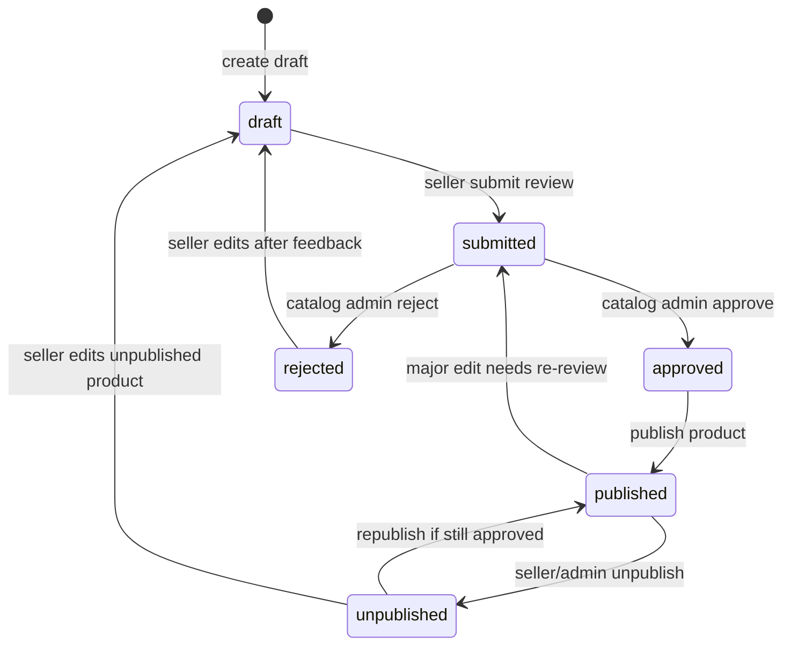
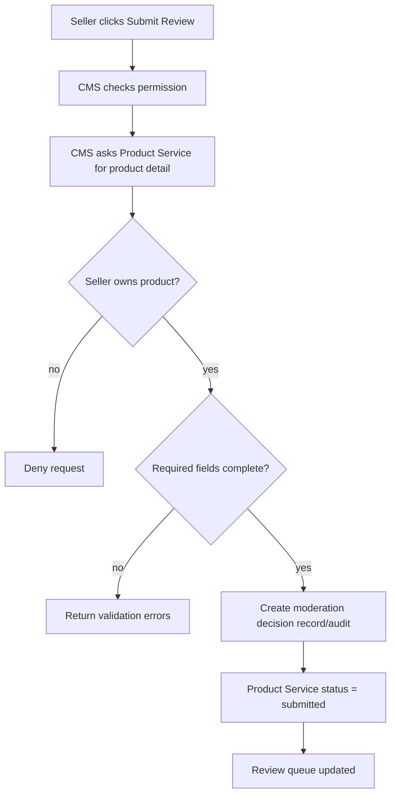
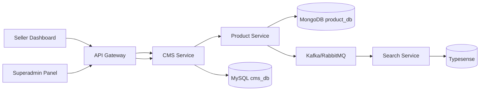
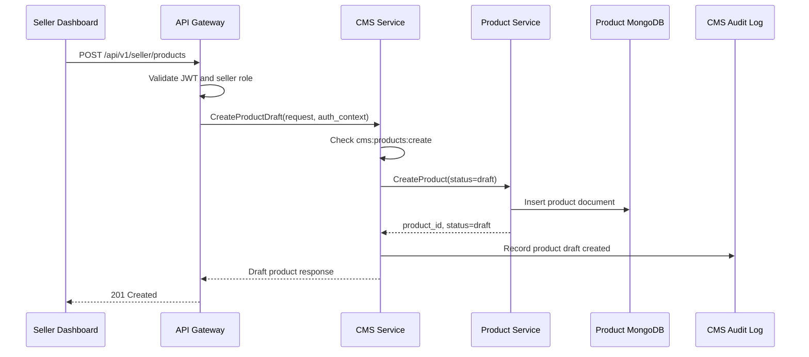
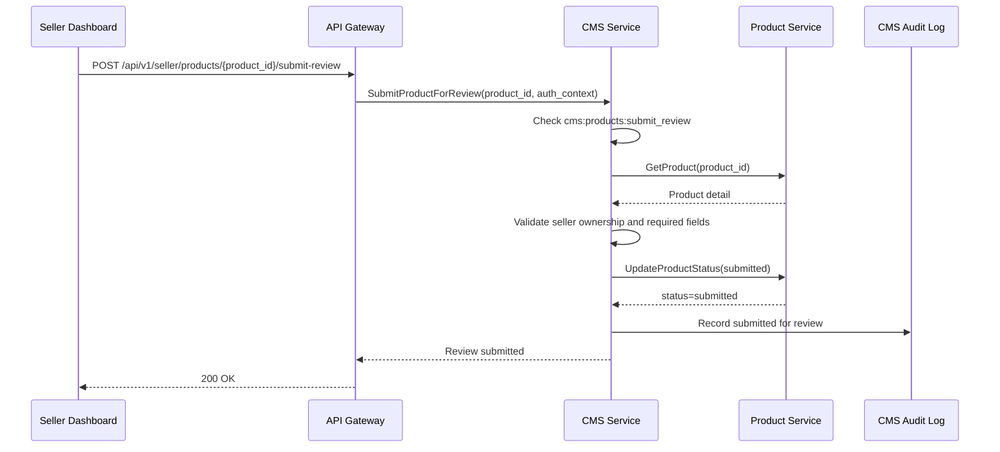
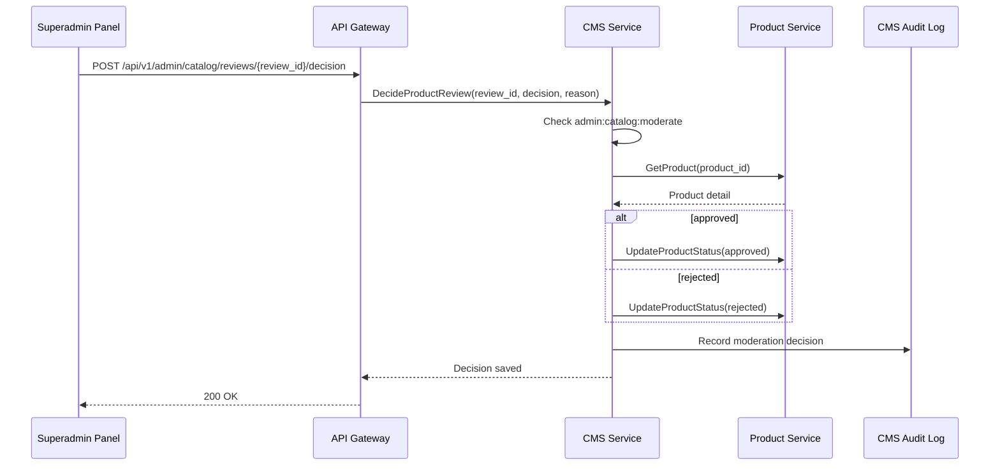
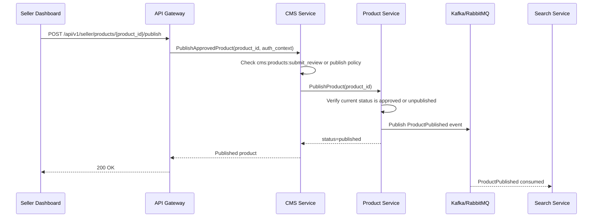
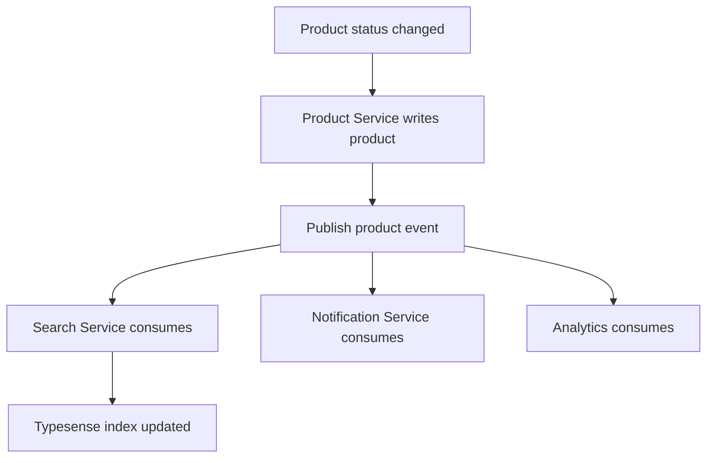
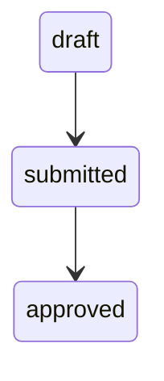

# 🧩 CMS Service - Task 3: Product Moderation Flow


## 📌 Task Summary

| Field | Detail |
|---|---|
| Task Name | Product moderation flow |
| Source | `docs/01-micro-tasks.md` -> `CMS Service` -> Task 3 |
| Goal | Seller draft, submit, approve/reject, publish states design karna |
| Dependency | `Product Service` |
| Priority | `P1` |
| Scope | Product moderation states, transitions, permissions, service boundary, API/gRPC contract reference, audit and event design |
| Not Included | Actual backend service code, migrations, Product Service implementation, Superadmin UI, coupon engine, campaign engine, analytics APIs |

> **Simple Hinglish goal:** Seller product ko directly live nahi karna chahiye. Pehle seller draft banayega, phir review ke liye submit karega, moderator approve/reject karega, aur approved product publish hoga. Is task me hum ye complete moderation workflow design kar rahe hain.

---

## ✅ Final Output Created

```text
TaskImplementation/
└── CMS Service/
    ├── task1.md
    ├── task2.md
    └── task3.md
```

### Why this structure?

- `TaskImplementation/` existing project pattern hai task-wise implementation guides ke liye.
- `CMS Service/` folder already present tha, isliye usko preserve kiya gaya.
- `task3.md` sirf **CMS Service - Task 3** ka product moderation flow document karta hai.
- Existing backend code, DB migrations, API contracts, ya service files ko modify nahi kiya gaya.

---

## 🧭 Requirement Source Mapping

| Document | Kya use kiya gaya |
|---|---|
| `docs/01-micro-tasks.md` | CMS Service Task 3 ka exact scope: `Product moderation flow` |
| `TaskImplementation/CMS Service/task1.md` | Seller roles and permissions: `cms:products:create`, `cms:products:update`, `cms:products:submit_review`, `cms:products:unpublish` |
| `TaskImplementation/CMS Service/task2.md` | CMS DB ownership, MySQL decision, audit logging pattern |
| `docs/02-system-architecture.md` | CMS Service -> Product Service communication and no cross-service DB access rule |
| `docs/03-folder-structure.md` | Future `backend/services/cms-service/` and `proto/ecommerce/cms/v1/cms.proto` placement reference |
| `docs/04-microservice-design.md` | Product Service product publish/unpublish responsibility and CMS Service seller product workflow responsibility |
| `docs/09-cms-superadmin.md` | Existing product management state diagram: draft, submitted, approved, rejected, published, unpublished |
| `database/mongodb-schema-design.md` | Product Service owns `products` collection and product `status` field |
| `api/master-api.json` | Existing seller product create/update/publish route references |

---

## 🚦 Scope Boundary

### ✅ In Scope

- Product moderation states define karna.
- Seller and moderator action flow design karna.
- State transition rules document karna.
- CMS Service and Product Service boundary clear karna.
- Required permissions map karna.
- Audit log and event expectations define karna.
- Future API/gRPC contract examples dena.
- Folder structure and implementation placement guide dena.

### 🚫 Out of Scope

- Actual Go service files create karna.
- MySQL/MongoDB migrations create karna.
- `api/master-api.json` update karna.
- Product Service repository or Mongo code implement karna.
- Superadmin catalog review UI banana.
- Search indexing consumer implement karna.
- Coupon, campaign, analytics, or CMS gRPC Task 7 implement karna.

> 🔴 **Reason:** Task 3 ka requirement flow design hai. Code, migrations, and full service contracts later implementation tasks me aayenge.

---

## 🪜 Step-by-Step Implementation

## Step 1: Task requirement identify kiya

`docs/01-micro-tasks.md` me CMS Service ka Task 3 ye hai:

| S.No | Task Name | Detail | Dependency |
|---:|---|---|---|
| 3 | Product moderation flow | Seller draft, submit, approve/reject, publish states design karo | Product Service |

**Implementation decision:**

- Product data ka source of truth **Product Service** rahega.
- CMS Service moderation workflow ka policy owner rahega.
- Seller dashboard CMS flow initiate karega, but final product status Product Service me update hoga.
- Admin/Superadmin catalog moderation approval/rejection action perform karega.

> 🟢 **Why:** Product Service catalog data own karta hai. CMS Service seller workflow, permissions, moderation policy, and audit trail coordinate karta hai. Direct Product DB access nahi hoga.

---

## Step 2: Service ownership clear kiya

Golden rule docs ke according:

```text
Har service apni database own karegi.
Dusri service ke DB ko directly read/write nahi karna.
Data chahiye to gRPC call ya event projection use karo.
```

### Ownership split

| Area | Owner Service | Reason |
|---|---|---|
| Product title, description, images, variants, price | Product Service | Catalog source of truth |
| Product status field | Product Service | Published/unpublished listing behavior Product domain ka part hai |
| Moderation workflow policy | CMS Service | Seller dashboard workflow CMS domain ka part hai |
| Moderator action history | CMS/Superadmin Service | Review traceability and audit ke liye |
| Public searchable index | Search Service | Product events consume karke index update karega |

### Boundary rule

```text
CMS Service -> Product Service gRPC call karega.
CMS Service -> Product MongoDB direct query nahi karega.
Product Service -> product status update karega.
```

---

## Step 3: Product moderation actors define kiye

| Actor | Role | Allowed moderation actions |
|---|---|---|
| Seller owner | `seller` | draft create/update, submit review, unpublish own product |
| Seller manager | `seller_manager` | draft create/update, submit review, unpublish own product |
| Catalog editor | `seller_catalog_editor` | draft create/update, submit review, unpublish own product |
| Order manager | `seller_order_manager` | Product moderation action nahi |
| Catalog admin | `catalog_admin` | approve/reject product review |
| Superadmin | `superadmin` | approve/reject, force unpublish, override high-risk cases |

### Permission mapping

| Action | Permission |
|---|---|
| Create product draft | `cms:products:create` |
| Update product draft | `cms:products:update` |
| Submit product for review | `cms:products:submit_review` |
| Unpublish own product | `cms:products:unpublish` |
| Review submitted product | `admin:catalog:moderate` |
| Force unpublish product | `admin:catalog:force_unpublish` |

> 🔵 **Note:** Seller permissions Task 1 me define ho chuki hain. Admin permissions Superadmin Service ke domain me detail honge, yahan sirf moderation boundary clear ki gayi hai.

---

## Step 4: Product states define kiye

CMS product moderation ke MVP states:

| State | Meaning | Visible to public? | Editable by seller? |
|---|---|---:|---:|
| `draft` | Seller ne product banaya but review ke liye submit nahi kiya | No | Yes |
| `submitted` | Seller ne moderation review ke liye bheja | No | Limited/No |
| `approved` | Moderator ne product approve kar diya | No, publish ke baad visible | Limited |
| `rejected` | Moderator ne product reject kiya with reason | No | Yes, correction ke baad |
| `published` | Product live hai and buyers ko visible hai | Yes | Limited |
| `unpublished` | Seller/admin ne live product temporarily remove kiya | No | Yes/limited |

### State naming decision

`docs/09-cms-superadmin.md` me ye states already documented hain:

```text
draft -> submitted -> approved/rejected -> published -> unpublished
```

Is task me wahi naming use ki gayi hai, taaki CMS dashboard, Product Service, and Superadmin moderation same language follow karein.

---

## Step 5: State transition rules design kiye



### Transition matrix

| From | To | Trigger | Actor | Required check |
|---|---|---|---|---|
| `none` | `draft` | Create product | Seller/catalog editor | Seller scope + create permission |
| `draft` | `submitted` | Submit review | Seller/catalog editor | Required product fields complete |
| `submitted` | `approved` | Approve review | Catalog admin/superadmin | Moderator permission |
| `submitted` | `rejected` | Reject review | Catalog admin/superadmin | Rejection reason required |
| `rejected` | `draft` | Edit rejected product | Seller/catalog editor | Same seller owns product |
| `approved` | `published` | Publish product | Seller/system | Product approved and valid |
| `published` | `unpublished` | Unpublish product | Seller/admin | Reason optional for seller, required for admin |
| `unpublished` | `published` | Republish product | Seller/system | Last approved version still valid |
| `published` | `submitted` | Major edit | Seller/catalog editor | Major fields changed |

### Invalid transitions

| Invalid transition | Reason |
|---|---|
| `draft` -> `published` | Review bypass ho jayega |
| `submitted` -> `published` | Approval missing hai |
| `rejected` -> `published` | Corrections and approval missing hain |
| `published` -> `approved` | Published product already approved state se aage hai |
| `unpublished` -> `submitted` without edits | Review queue clutter hoga |

---

## Step 6: Minor vs major edits define kiye

Published product edit ke time har change ko re-review ki zarurat nahi hoti. Isliye fields ko risk category me divide kiya gaya.

### Major edits: re-review required

| Field | Reason |
|---|---|
| `title` | Buyer-facing primary content |
| `description` | Claims, policy, banned content risk |
| `category_id` | Wrong category search/listing impact |
| `brand` | Trademark/brand misuse risk |
| `images` | Visual policy risk |
| `attributes` | Misleading product specs risk |
| `variants.sku` | Fulfillment and inventory consistency risk |

### Minor edits: direct update allowed

| Field | Reason |
|---|---|
| `stock_quantity` | Inventory operational change |
| `price.amount` | Seller pricing control |
| `mrp.amount` | Pricing update, with validation |
| `reserved_quantity` | System-managed inventory field |

> 🟡 **Important:** Price/MRP updates still validation ke saath honge. Agar platform policy future me price edits ko review-required banati hai, transition rule easily update ho sakta hai.

---

## Step 7: Required product validation rules define kiye

Product review submit karne se pehle minimum quality checks pass hone chahiye.

### Required fields

| Field | Validation |
|---|---|
| `title` | Required, trimmed, max length controlled |
| `description` | Required, meaningful text |
| `category_id` | Valid category id |
| `brand` | Required or explicitly marked generic |
| `images` | At least one image |
| `variants` | At least one variant |
| `variants.sku` | Unique SKU |
| `variants.price.amount` | Positive amount |
| `variants.price.currency` | Valid currency, default `INR` |
| `seller_id` | Must match auth seller scope |

### Review submission validation flow



---

## Step 8: End-to-end moderation flow design kiya

### Flow overview



### Explanation

1. Seller dashboard se product create/update request API Gateway par aati hai.
2. Gateway JWT validate karke seller context inject karta hai.
3. CMS Service seller permission and seller scope verify karta hai.
4. CMS Service Product Service ko gRPC call karta hai.
5. Product Service product document update karta hai.
6. CMS Service moderation/audit record store karta hai.
7. Approved/published status change ke baad Product Service product event publish karta hai.
8. Search Service event consume karke Typesense index update karta hai.

---

## Step 9: Sequence diagrams banaye

### 9.1 Seller creates draft



### 9.2 Seller submits for review



### 9.3 Admin approves or rejects



### 9.4 Product publish



---

## Step 10: API route design reference banaya

Existing `api/master-api.json` me Product Service ke seller create/update/publish routes referenced hain. Task 3 ke moderation design ke liye future routes ye ho sakte hain:

| Route | Method | Owner | Purpose |
|---|---|---|---|
| `/api/v1/seller/products` | `POST` | Product/CMS coordination | Draft create |
| `/api/v1/seller/products/{product_id}` | `PATCH` | Product/CMS coordination | Draft/update product |
| `/api/v1/seller/products/{product_id}/submit-review` | `POST` | CMS Service | Submit moderation review |
| `/api/v1/seller/products/{product_id}/publish` | `POST` | Product/CMS coordination | Publish approved product |
| `/api/v1/seller/products/{product_id}/unpublish` | `POST` | Product/CMS coordination | Remove product from public listing |
| `/api/v1/admin/catalog/reviews` | `GET` | CMS/Superadmin | Review queue |
| `/api/v1/admin/catalog/reviews/{review_id}/decision` | `POST` | CMS/Superadmin | Approve/reject product |

> 🔵 **Note:** Ye routes implementation suggestion hain. Is task me `api/master-api.json` update nahi kiya gaya.

---

## Step 11: gRPC contract reference design kiya

CMS Service ko Product Service ke saath typed internal calls chahiye. Future proto methods ka reference:

```proto
syntax = "proto3";

package ecommerce.cms.v1;

service CMSModerationService {
  rpc SubmitProductForReview(SubmitProductForReviewRequest)
      returns (ProductModerationResponse);

  rpc DecideProductReview(DecideProductReviewRequest)
      returns (ProductModerationResponse);

  rpc PublishApprovedProduct(PublishApprovedProductRequest)
      returns (ProductModerationResponse);

  rpc UnpublishProduct(UnpublishProductRequest)
      returns (ProductModerationResponse);
}

message SubmitProductForReviewRequest {
  string product_id = 1;
  string seller_id = 2;
  string actor_user_id = 3;
}

message DecideProductReviewRequest {
  string review_id = 1;
  string decision = 2; // approved or rejected
  string reason = 3;
  string actor_admin_id = 4;
}

message ProductModerationResponse {
  string product_id = 1;
  string status = 2;
  string review_id = 3;
}
```

### Product Service methods needed

```proto
service ProductService {
  rpc GetProduct(GetProductRequest) returns (Product);
  rpc CreateProduct(CreateProductRequest) returns (Product);
  rpc UpdateProduct(UpdateProductRequest) returns (Product);
  rpc UpdateProductStatus(UpdateProductStatusRequest) returns (Product);
  rpc PublishProduct(PublishProductRequest) returns (Product);
  rpc UnpublishProduct(UnpublishProductRequest) returns (Product);
}
```

> 🟡 **Important:** Actual proto files Task 3 me create nahi kiye gaye. Ye design reference future CMS gRPC/Product gRPC implementation ke liye hai.

---

## Step 12: Data model reference define kiya

Product canonical document Product Service ke MongoDB `products` collection me rahega.

### Product document moderation fields

```json
{
  "_id": "prod_123",
  "seller_id": "seller_456",
  "title": "Running Shoes",
  "status": "submitted",
  "moderation": {
    "review_id": "review_789",
    "submitted_by": "user_123",
    "submitted_at": "2026-05-24T10:00:00Z",
    "reviewed_by": null,
    "reviewed_at": null,
    "rejection_reason": null,
    "last_approved_version": null
  },
  "created_at": "2026-05-24T09:30:00Z",
  "updated_at": "2026-05-24T10:00:00Z"
}
```

### CMS moderation review record reference

Task 2 me CMS DB tables documented hain, but product review table abhi create nahi ki gayi. Future implementation me CMS DB me ye type ka table useful ho sakta hai:

```sql
CREATE TABLE product_moderation_reviews (
  id BIGINT UNSIGNED NOT NULL AUTO_INCREMENT,
  review_id VARCHAR(64) NOT NULL,
  product_id VARCHAR(64) NOT NULL,
  seller_id VARCHAR(64) NOT NULL,
  status ENUM('submitted', 'approved', 'rejected', 'cancelled') NOT NULL,
  submitted_by VARCHAR(64) NOT NULL,
  reviewed_by VARCHAR(64) NULL,
  rejection_reason VARCHAR(512) NULL,
  submitted_at TIMESTAMP NOT NULL DEFAULT CURRENT_TIMESTAMP,
  reviewed_at TIMESTAMP NULL,
  PRIMARY KEY (id),
  UNIQUE KEY uk_product_moderation_review_id (review_id),
  KEY idx_product_moderation_seller_status (seller_id, status),
  KEY idx_product_moderation_product (product_id)
) ENGINE=InnoDB;
```

> 🔴 **Scope reminder:** Ye SQL sirf example hai. Task 3 me migration file create nahi ki gayi kyunki user ne sirf task guide generate karne ko bola hai.

---

## Step 13: Review decision payload design kiya

### Submit review request

```json
{
  "product_id": "prod_123",
  "seller_id": "seller_456",
  "actor_user_id": "user_123"
}
```

### Approve request

```json
{
  "review_id": "review_789",
  "decision": "approved",
  "reason": "Product information and images are valid.",
  "actor_admin_id": "admin_111"
}
```

### Reject request

```json
{
  "review_id": "review_789",
  "decision": "rejected",
  "reason": "Primary image is blurry and product description is incomplete.",
  "actor_admin_id": "admin_111"
}
```

### Response

```json
{
  "product_id": "prod_123",
  "review_id": "review_789",
  "status": "rejected",
  "message": "Product rejected. Seller can edit and resubmit."
}
```

---

## Step 14: Audit logging design kiya

CMS product moderation me har sensitive action audit hona chahiye.

### Audited actions

| Action | Resource type | Actor |
|---|---|---|
| `cms:product:draft_created` | `product` | Seller |
| `cms:product:updated` | `product` | Seller |
| `cms:product:submitted_review` | `product_review` | Seller |
| `cms:product:approved` | `product_review` | Catalog admin |
| `cms:product:rejected` | `product_review` | Catalog admin |
| `cms:product:published` | `product` | Seller/system |
| `cms:product:unpublished` | `product` | Seller/admin |

### Audit log example

```json
{
  "audit_id": "audit_001",
  "seller_id": "seller_456",
  "actor_user_id": "user_123",
  "action": "cms:product:submitted_review",
  "resource_type": "product_review",
  "resource_id": "review_789",
  "before_json": {
    "status": "draft"
  },
  "after_json": {
    "status": "submitted"
  },
  "created_at": "2026-05-24T10:00:00Z"
}
```

### Why audit important hai?

- Seller disputes me proof milta hai.
- Moderator decision traceable hota hai.
- Security review ke time actor/action/resource clear hota hai.
- Product publish mistakes debug karna easy hota hai.

---

## Step 15: Events design kiye

Product status changes ke baad async events publish honge. Search, analytics, notification, and recommendation services future me consume kar sakte hain.

| Event | Producer | Consumers | Purpose |
|---|---|---|---|
| `ProductDraftCreated` | Product Service | CMS/Analytics | Draft tracking |
| `ProductSubmittedForReview` | CMS/Product | Superadmin/Notification | Review queue update |
| `ProductApproved` | CMS/Product | Notification | Seller ko approval info |
| `ProductRejected` | CMS/Product | Notification | Seller ko rejection reason |
| `ProductPublished` | Product Service | Search/Recommendation | Public index update |
| `ProductUnpublished` | Product Service | Search/Recommendation | Public index remove/update |

### Event envelope example

```json
{
  "event_id": "evt_123",
  "event_type": "ProductSubmittedForReview",
  "aggregate_type": "product",
  "aggregate_id": "prod_123",
  "seller_id": "seller_456",
  "occurred_at": "2026-05-24T10:00:00Z",
  "payload": {
    "product_id": "prod_123",
    "review_id": "review_789",
    "status": "submitted"
  }
}
```

### Event flow



---

## Step 16: Error handling rules define kiye

| Case | Error code | Message style |
|---|---|---|
| Seller does not own product | `PERMISSION_DENIED` | `Product does not belong to this seller` |
| Missing required fields | `VALIDATION_FAILED` | Field-wise validation errors |
| Invalid transition | `FAILED_PRECONDITION` | `Cannot publish product from draft state` |
| Review already decided | `ALREADY_EXISTS` or `FAILED_PRECONDITION` | `Review decision already recorded` |
| Product not found | `NOT_FOUND` | `Product not found` |
| Product Service unavailable | `UNAVAILABLE` | Retry-safe error |

### Validation error response example

```json
{
  "code": "VALIDATION_FAILED",
  "message": "Product is not ready for review.",
  "fields": [
    {
      "field": "images",
      "reason": "At least one product image is required."
    },
    {
      "field": "variants[0].price.amount",
      "reason": "Price must be greater than zero."
    }
  ]
}
```

---

## Step 17: Idempotency and race-condition rules define kiye

Moderation actions me duplicate clicks, retries, and concurrent admin decisions handle karna important hai.

| Scenario | Rule |
|---|---|
| Seller clicks submit twice | Same active review return karo, duplicate review create mat karo |
| Two admins decide same review | First decision wins, second request `FAILED_PRECONDITION` |
| Product edited while submitted | Either edit block karo or review cancel karke draft me move karo |
| Publish retry after timeout | If status already `published`, success response return karo |
| Unpublish retry | If already `unpublished`, success response return karo |

### Recommended transaction logic

```text
1. Load current product status.
2. Validate expected current status.
3. Write review/status change with compare-and-set behavior.
4. Write audit log.
5. Publish event after successful write.
```

---

## Step 18: Moderation policy checklist banaya

Reviewer product approve karne se pehle ye checks karega:

| Check | Description |
|---|---|
| Image quality | Product image clear and policy-compliant hai |
| Title quality | Spam, misleading claims, all-caps abuse nahi |
| Description | Product description complete and honest hai |
| Category | Product correct category me hai |
| Brand | Brand misuse ya fake branding nahi |
| Variant consistency | Size/color/sku/price data valid hai |
| Prohibited items | Platform banned items list violate nahi hoti |
| Duplicate listing | Same seller duplicate spam listing nahi kar raha |

### Decision rules

- **Approve** tabhi jab product buyer-facing quality checks pass kare.
- **Reject** ke time reason mandatory hoga.
- **Force unpublish** only admin/superadmin action hoga and reason mandatory hoga.
- **Major edit after publish** product ko re-review me bhej sakta hai.

---

## Step 19: Clean future folder structure define kiya

Task 3 me actual files create nahi ki gayi, but future implementation ke liye folder placement:

```text
backend/
└── services/
    └── cms-service/
        ├── cmd/
        │   └── server/
        │       └── main.go
        ├── internal/
        │   ├── domain/
        │   │   ├── product_moderation.go
        │   │   ├── moderation_state.go
        │   │   └── moderation_decision.go
        │   ├── usecase/
        │   │   ├── submit_product_review.go
        │   │   ├── decide_product_review.go
        │   │   ├── publish_product.go
        │   │   └── unpublish_product.go
        │   ├── repository/
        │   │   └── mysql_moderation_repository.go
        │   ├── clients/
        │   │   └── product_client.go
        │   ├── events/
        │   │   └── product_moderation_events.go
        │   └── transport/
        │       └── grpc/
        │           ├── server.go
        │           └── moderation_handler.go
        ├── migrations/
        │   ├── 002_create_product_moderation_reviews.up.sql
        │   └── 002_create_product_moderation_reviews.down.sql
        └── deploy/
```

### File purpose

| File/Folder | Purpose |
|---|---|
| `domain/product_moderation.go` | Review entity and business fields |
| `domain/moderation_state.go` | State constants and transition validation |
| `usecase/submit_product_review.go` | Seller submit review workflow |
| `usecase/decide_product_review.go` | Admin approve/reject workflow |
| `repository/mysql_moderation_repository.go` | Review records and audit writes |
| `clients/product_client.go` | Product Service gRPC wrapper |
| `events/product_moderation_events.go` | Event publish helpers |
| `transport/grpc/moderation_handler.go` | gRPC request handlers |

---

## Step 20: Code examples for future implementation

### 20.1 Moderation state constants

```go
package domain

type ProductStatus string

const (
	ProductStatusDraft       ProductStatus = "draft"
	ProductStatusSubmitted   ProductStatus = "submitted"
	ProductStatusApproved    ProductStatus = "approved"
	ProductStatusRejected    ProductStatus = "rejected"
	ProductStatusPublished   ProductStatus = "published"
	ProductStatusUnpublished ProductStatus = "unpublished"
)
```

### 20.2 Transition validation

```go
package domain

import "fmt"

var allowedProductTransitions = map[ProductStatus]map[ProductStatus]bool{
	ProductStatusDraft: {
		ProductStatusSubmitted: true,
	},
	ProductStatusSubmitted: {
		ProductStatusApproved: true,
		ProductStatusRejected: true,
	},
	ProductStatusRejected: {
		ProductStatusDraft: true,
	},
	ProductStatusApproved: {
		ProductStatusPublished: true,
	},
	ProductStatusPublished: {
		ProductStatusUnpublished: true,
		ProductStatusSubmitted:   true,
	},
	ProductStatusUnpublished: {
		ProductStatusPublished: true,
		ProductStatusDraft:     true,
	},
}

func CanTransitionProduct(from, to ProductStatus) bool {
	return allowedProductTransitions[from][to]
}

func ValidateProductTransition(from, to ProductStatus) error {
	if CanTransitionProduct(from, to) {
		return nil
	}
	return fmt.Errorf("invalid product status transition: %s to %s", from, to)
}
```

### 20.3 Submit review usecase pseudo-code

```go
func (uc *SubmitProductReviewUsecase) Execute(ctx context.Context, req SubmitReviewRequest) (*ModerationResult, error) {
	if err := uc.permissions.Require(ctx, req.Actor, "cms:products:submit_review"); err != nil {
		return nil, err
	}

	product, err := uc.productClient.GetProduct(ctx, req.ProductID)
	if err != nil {
		return nil, err
	}

	if product.SellerID != req.Actor.SellerID {
		return nil, ErrPermissionDenied
	}

	if err := ValidateProductReadyForReview(product); err != nil {
		return nil, err
	}

	if err := ValidateProductTransition(ProductStatus(product.Status), ProductStatusSubmitted); err != nil {
		return nil, err
	}

	review, err := uc.reviewRepo.CreateSubmittedReview(ctx, product.ID, product.SellerID, req.Actor.UserID)
	if err != nil {
		return nil, err
	}

	updated, err := uc.productClient.UpdateProductStatus(ctx, product.ID, string(ProductStatusSubmitted))
	if err != nil {
		return nil, err
	}

	_ = uc.audit.Record(ctx, AuditEntry{
		SellerID:     product.SellerID,
		ActorUserID:  req.Actor.UserID,
		Action:       "cms:product:submitted_review",
		ResourceType: "product_review",
		ResourceID:   review.ID,
	})

	return &ModerationResult{
		ProductID: updated.ID,
		ReviewID:  review.ID,
		Status:    updated.Status,
	}, nil
}
```

### 20.4 Product readiness validation

```go
func ValidateProductReadyForReview(product Product) error {
	var fields []FieldError

	if product.Title == "" {
		fields = append(fields, FieldError{Field: "title", Reason: "title is required"})
	}
	if product.Description == "" {
		fields = append(fields, FieldError{Field: "description", Reason: "description is required"})
	}
	if product.CategoryID == "" {
		fields = append(fields, FieldError{Field: "category_id", Reason: "category is required"})
	}
	if len(product.Images) == 0 {
		fields = append(fields, FieldError{Field: "images", Reason: "at least one image is required"})
	}
	if len(product.Variants) == 0 {
		fields = append(fields, FieldError{Field: "variants", Reason: "at least one variant is required"})
	}

	if len(fields) > 0 {
		return NewValidationError("product is not ready for review", fields)
	}
	return nil
}
```

> 🔵 **Note:** Ye snippets future backend implementation ke liye examples hain. Repository me actual Go files create nahi kiye gaye.

---

## 🧰 External Libraries / Tools Used

### Actual task execution

| Tool/Library | Used in this task? | Why |
|---|---:|---|
| Markdown | ✅ Yes | `task3.md` guide likhne ke liye |
| Mermaid | ✅ Yes | Architecture, state, and sequence diagrams markdown me render karne ke liye |
| MySQL | Reference only | CMS DB Task 2 decision and audit/review records ke liye |
| MongoDB | Reference only | Product Service product documents ka source of truth |
| gRPC/Protobuf | Reference only | Future CMS -> Product Service typed communication ke liye |
| Kafka/RabbitMQ | Reference only | Product status events async publish karne ke liye |
| Go | Reference only | Future backend service snippets ke liye |

### Install and usage guide

#### 1. Markdown

**What:** Documentation format.  
**Why:** Project task implementation guides markdown me maintained hain.  
**Install:** Usually install ki zarurat nahi hoti. VS Code, GitHub, GitLab, and many IDEs markdown support karte hain.

**Use:**

```text
TaskImplementation/CMS Service/task3.md
```

#### 2. Mermaid

**What:** Markdown-friendly diagrams syntax.  
**Why:** State machine, sequence, and architecture flow diagrams easy readable bante hain.  
**Install:** GitHub/GitLab markdown me built-in render ho sakta hai. VS Code me extension use kar sakte ho:

```text
Extension: Markdown Preview Mermaid Support
```

**Use:**

````markdown

````

#### 3. MySQL 8+

**What:** Relational database.  
**Why:** CMS audit/review records, seller settings, coupons, and workflows structured hain.  
**Install with Docker:**

```bash
docker run --name ecommerce-cms-mysql \
  -e MYSQL_ROOT_PASSWORD=root \
  -e MYSQL_DATABASE=cms_db \
  -p 3306:3306 \
  -d mysql:8
```

**Use:**

```bash
mysql -h 127.0.0.1 -P 3306 -u root -p cms_db
```

#### 4. MongoDB

**What:** Document database.  
**Why:** Product Service product attributes dynamic hain, isliye product documents MongoDB me fit hote hain.  
**Install with Docker:**

```bash
docker run --name ecommerce-product-mongo \
  -p 27017:27017 \
  -d mongo:7
```

**Use:**

```bash
mongosh mongodb://localhost:27017/product_db
```

#### 5. gRPC and Protobuf

**What:** Typed internal service communication.  
**Why:** CMS Service ko Product Service se product details/status update strongly typed contract ke through chahiye.  
**Install Go plugins:**

```bash
go install google.golang.org/protobuf/cmd/protoc-gen-go@latest
go install google.golang.org/grpc/cmd/protoc-gen-go-grpc@latest
```

**Use:**

```bash
protoc --go_out=. --go-grpc_out=. proto/ecommerce/cms/v1/cms.proto
```

#### 6. Kafka/RabbitMQ

**What:** Message queue/event streaming tool.  
**Why:** Product publish/unpublish events Search Service and other consumers tak async pahunchane ke liye.  
**Install:** Project docs mention Kafka/RabbitMQ as options. Local dev me Docker Compose preferred hoga.

**Use concept:**

```text
Product Service publishes ProductPublished
Search Service consumes ProductPublished
Typesense index updated
```

> 🟢 **Task 3 reality:** Is documentation task me koi external package install ya command run nahi ki gayi. Tools sirf design reference ke roop me explain kiye gaye hain.

---

## 🧪 Testing Strategy

Future implementation ke time ye tests required honge:

### Unit tests

| Test | Expected result |
|---|---|
| `draft -> submitted` | Allowed |
| `submitted -> approved` | Allowed |
| `submitted -> rejected` | Allowed |
| `draft -> published` | Blocked |
| `rejected -> published` | Blocked |
| Missing images on submit | Validation error |
| Wrong seller submits product | Permission denied |

### Integration tests

| Flow | Expected result |
|---|---|
| Seller creates draft and submits | Product status becomes `submitted` |
| Admin approves submitted product | Product status becomes `approved` |
| Seller publishes approved product | Product status becomes `published`, event emitted |
| Admin rejects submitted product | Product status becomes `rejected`, reason stored |
| Published product major edit | Product moves to `submitted` or creates review |

### Contract tests

| Contract | Check |
|---|---|
| CMS -> Product `GetProduct` | Product fields required by CMS available |
| CMS -> Product `UpdateProductStatus` | Status transition accepted/rejected correctly |
| Product event payload | Search Service gets product id, seller id, status |

---

## 🔐 Security and Access Rules

| Rule | Explanation |
|---|---|
| Seller scope mandatory | Seller sirf apne products moderate flow me submit kar sakta hai |
| Admin role mandatory | Approve/reject only catalog admin or superadmin karega |
| Rejection reason mandatory | Seller ko actionable feedback milega |
| Audit all decisions | Every publish/reject/approve traceable hoga |
| Direct DB access banned | CMS Product MongoDB direct access nahi karega |
| Public visibility only for `published` | Draft/submitted/approved/rejected products public listing me nahi dikhenge |

---

## 📊 Status Visibility Rules

| Status | Seller dashboard | Public user app | Search index | Admin review queue |
|---|---:|---:|---:|---:|
| `draft` | Yes | No | No | No |
| `submitted` | Yes | No | No | Yes |
| `approved` | Yes | No | No | Optional |
| `rejected` | Yes | No | No | Historical |
| `published` | Yes | Yes | Yes | No |
| `unpublished` | Yes | No | Removed/hidden | No |

---

## 🚀 Future Implementation Order

Recommended order jab real code implementation start ho:

1. Product status constants and transition validator Product/CMS shared contract me define karo.
2. Product Service me `UpdateProductStatus` method add karo.
3. CMS Service me moderation review repository add karo.
4. Submit review usecase implement karo.
5. Admin approve/reject usecase implement karo.
6. Publish/unpublish coordination implement karo.
7. Audit log write add karo.
8. Product events publish karo.
9. Search Service consumer ko published/unpublished status handle karne do.
10. Seller Dashboard and Superadmin UI status badges wire karo.

---

## ✅ Completion Checklist

| Requirement | Status |
|---|---:|
| `TaskImplementation/` folder present | ✅ |
| `TaskImplementation/CMS Service/` folder kept | ✅ |
| `task3.md` created | ✅ |
| Step-by-step implementation in Hinglish | ✅ |
| Product moderation states documented | ✅ |
| Seller draft/submit/approve/reject/publish flow covered | ✅ |
| Service boundary with Product Service explained | ✅ |
| External tools/libraries mentioned | ✅ |
| Install/use notes included | ✅ |
| Clean folder structure included | ✅ |
| Code examples included | ✅ |
| Mermaid diagrams included | ✅ |
| Scope limited to CMS Service Task 3 | ✅ |

---

## 🏁 Final Summary

CMS Service Task 3 ke liye final moderation flow:

```text
draft -> submitted -> approved -> published
draft -> submitted -> rejected -> draft
published -> unpublished -> published
published -> submitted, if major edit needs re-review
```

### Final design decision

| Area | Decision |
|---|---|
| Product source of truth | Product Service |
| Workflow coordinator | CMS Service |
| Public visibility | Only `published` products |
| Review decision actors | Catalog admin / superadmin |
| Seller action actors | Seller owner, manager, catalog editor |
| Audit requirement | Every moderation mutation audited |
| Events | Product status changes publish async events |

> 🟢 **Task 3 complete:** Product moderation flow clearly design ho gaya hai. Seller draft se submit karega, admin approve/reject karega, approved product publish hoga, aur published product hi buyer/search surface par visible hoga. No extra implementation beyond CMS Service Task 3 kiya gaya.
