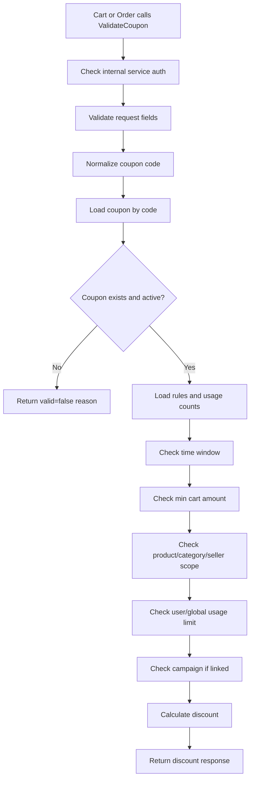
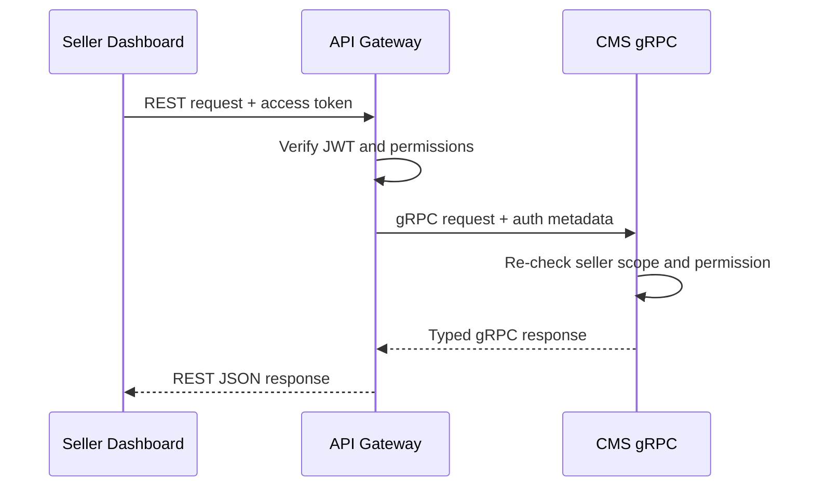
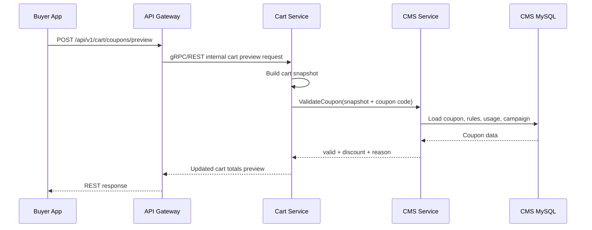
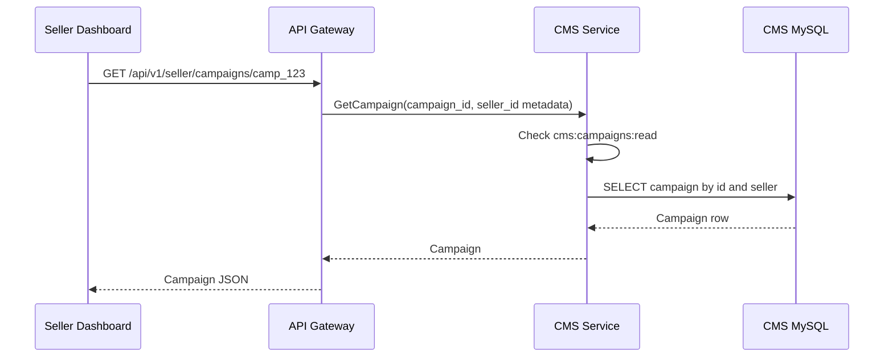
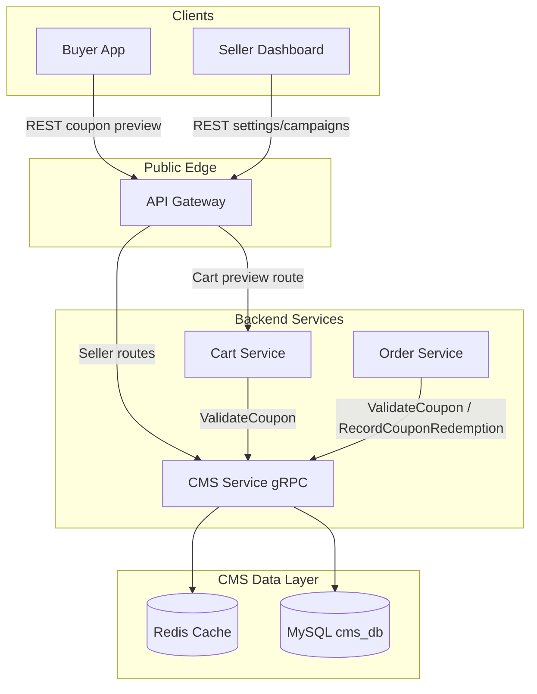
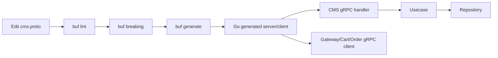
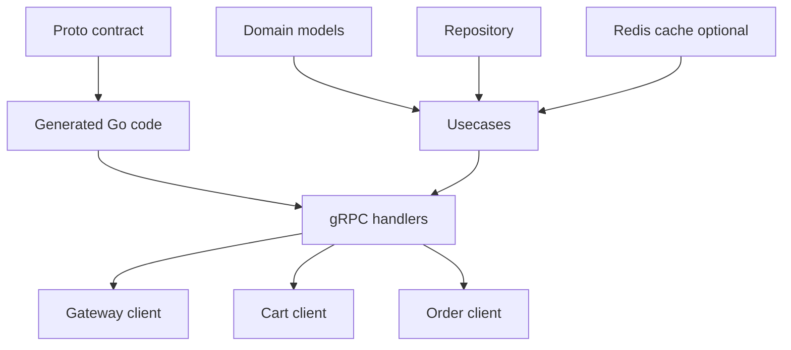

# 🛰️ CMS Service - Task 7: CMS gRPC


## 📌 Task Summary

| Field | Detail |
|---|---|
| Task Name | CMS gRPC |
| Source | `docs/01-micro-tasks.md` -> `CMS Service` -> Task 7 |
| Goal | `ValidateCoupon`, `GetSellerSettings`, aur campaign read methods ke gRPC contracts/implementation blueprint banana |
| Dependency | `Proto strategy` |
| Priority | `P1` |
| Primary Proto | `proto/ecommerce/cms/v1/cms.proto` |
| Main Service | `ecommerce.cms.v1.CMSService` |
| Main Methods | `ValidateCoupon`, `GetSellerSettings`, `GetCampaign`, `ListCampaigns` |
| Related Existing Methods | `CreateCoupon`, `UpdateCoupon`, `ListCoupons`, `CreateCampaign`, `GetSellerAnalytics`, `RecordCouponRedemption` |
| Scope | gRPC contract design, request/response models, handler mapping, auth metadata, deadlines, error mapping, cache strategy, observability, test checklist |
| Not Included | Actual backend code files, actual proto file creation, generated clients, API Gateway implementation, frontend UI, DB migrations, Task 8 audit log implementation |

> **Simple Hinglish goal:** CMS Service ke liye typed gRPC layer define karni hai jisse Cart/Order coupon validate kar sake, Seller Dashboard seller settings fetch kar sake, aur campaign data read kar sake. Is task me contract aur implementation guide banega. Actual service code ya generated proto files create nahi kiye gaye.

---

## ✅ Final Output Created

```text
TaskImplementation/
└── CMS Service/
    ├── task1.md
    ├── task2.md
    ├── task3.md
    ├── task4.md
    ├── task5.md
    ├── task6.md
    └── task7.md
```

### Why this structure?

- `TaskImplementation/` project ka task-wise documentation folder hai.
- `CMS Service/` folder already present tha, isliye usko preserve kiya gaya.
- `task7.md` sirf **CMS Service - Task 7** ka CMS gRPC implementation guide document karta hai.
- Existing backend service, proto folder, API spec, migrations, frontend files, ya previous task docs modify nahi kiye gaye.

---

## 🧭 Requirement Source Mapping

| Document | Kya use kiya gaya |
|---|---|
| `docs/01-micro-tasks.md` | CMS Service Task 7 ka exact scope: `CMS gRPC` |
| `docs/02-system-architecture.md` | Data ownership rule: CMS data gRPC only access hoga |
| `docs/03-folder-structure.md` | Future `backend/services/cms-service/` and `proto/ecommerce/cms/v1/cms.proto` placement |
| `docs/04-microservice-design.md` | CMS responsibilities and current gRPC service list |
| `docs/05-database-design.md` | CMS DB tables: `seller_settings`, `coupons`, `campaigns` |
| `docs/09-cms-superadmin.md` | Coupon validation output and seller CMS modules |
| `docs/12-logging-monitoring-scalability.md` | gRPC logs, metrics, traces, cache TTL guidance |
| `docs/13-developer-guide.md` | Backend flow: update proto -> generate clients -> handler -> tests |
| `api/master-api.json` | Existing `CMSService` methods and schema names |
| `TaskImplementation/Platform Foundation/task2.md` | Proto strategy, versioning, Buf workflow, generated client paths |
| `TaskImplementation/CMS Service/task1.md` | Permissions: settings/campaign/coupon access |
| `TaskImplementation/CMS Service/task2.md` | CMS MySQL schema and repository placement |
| `TaskImplementation/CMS Service/task4.md` | Coupon validation behavior and redemption boundary |
| `TaskImplementation/CMS Service/task5.md` | Campaign lifecycle and campaign-coupon relation |
| `TaskImplementation/CMS Service/task6.md` | Existing analytics method contract reference |

---

## 🚦 Scope Boundary

### ✅ In Scope

- CMS gRPC service contract blueprint.
- `ValidateCoupon` request/response design.
- `GetSellerSettings` request/response design.
- `GetCampaign` and `ListCampaigns` read-method design.
- Gateway/internal service to CMS gRPC flow.
- gRPC metadata/auth context rules.
- Error and reason-code mapping.
- Deadline, retry, and idempotency guidance.
- Go handler/usecase/repository code examples.
- Proto examples.
- Mermaid architecture and sequence diagrams.
- External tools/libraries explanation.
- Testing and production readiness checklist.

### 🚫 Out of Scope

- Actual `proto/ecommerce/cms/v1/cms.proto` file create karna.
- Actual generated Go/TypeScript client code create karna.
- Actual `backend/services/cms-service/` code implement karna.
- Actual MySQL migration file create karna.
- Actual API Gateway routes implement karna.
- Seller Dashboard React UI banana.
- Coupon create/update, campaign create/update, analytics internals ko dobara implement karna.
- Task 8 audit logs implement karna.

> 🔴 **Reason:** User ne required output me folder structure aur `task7.md` content manga hai. Isliye current output documentation-level implementation guide hai, production code changes nahi.

---

## 🪜 Step-by-Step Implementation

## Step 1: Task requirement identify kiya

`docs/01-micro-tasks.md` me CMS Service ka Task 7 ye hai:

| S.No | Task Name | Detail | Dependency |
|---:|---|---|---|
| 7 | CMS gRPC | Validate coupon, get seller settings, get campaign methods banao | Proto strategy |

**Implementation decision:**

- CMS Service ke business flows previous tasks me define ho chuke hain.
- Task 7 ka kaam in flows ko typed gRPC boundary dena hai.
- Public frontend direct CMS gRPC call nahi karega.
- Browser -> API Gateway REST call karega.
- API Gateway ya internal services -> CMS Service gRPC call karenge.

> 🟢 **Why:** gRPC strongly typed contract deta hai. Cart, Order, Gateway, aur CMS ke beech payload drift kam hota hai, aur service ownership clear rehti hai.

---

## Step 2: CMS gRPC consumers identify kiye

CMS gRPC ko multiple clients use karenge:

| Consumer | Method | Purpose |
|---|---|---|
| Cart Service | `ValidateCoupon` | Cart coupon preview |
| Order Service | `ValidateCoupon` | Checkout se pehle final coupon validation |
| Order Service | `RecordCouponRedemption` | Payment success ke baad redemption record |
| API Gateway | `GetSellerSettings` | Seller settings page ke liye data |
| API Gateway | `ListCampaigns` | Seller campaign list |
| API Gateway | `GetCampaign` | Seller campaign detail |
| API Gateway | `GetSellerAnalytics` | Seller dashboard summary |

### Direct DB access rule

```text
Cart Service  -> CMS gRPC -> CMS DB
Order Service -> CMS gRPC -> CMS DB
Gateway       -> CMS gRPC -> CMS DB

Cart/Order/Gateway -> CMS DB direct access ❌
```

> 🔵 **Important:** CMS data ka owner CMS Service hai. Other services CMS DB ko directly query nahi karenge.

---

## Step 3: gRPC method surface final kiya

Task 7 ka focus read/validation methods par hai.

| Method | Auth | Caller | Mutates DB? | Task 7 behavior |
|---|---|---|---:|---|
| `ValidateCoupon` | Internal service auth | Cart, Order | ❌ No | Coupon eligibility and discount return karega |
| `GetSellerSettings` | Seller auth | Gateway | ❌ No | Seller return/shipping policies return karega |
| `GetCampaign` | Seller/Internal auth | Gateway, CMS internals | ❌ No | Single campaign detail return karega |
| `ListCampaigns` | Seller auth | Gateway | ❌ No | Seller campaigns paginated return karega |

### Related but not deeply implemented here

| Method | Why mentioned |
|---|---|
| `RecordCouponRedemption` | `api/master-api.json` me existing hai; detailed behavior Task 4 me documented hai |
| `CreateCoupon`, `UpdateCoupon`, `ListCoupons` | Existing CMS API methods hain; Task 7 service contract me fit hote hain |
| `CreateCampaign` | Task 5 ka mutation flow hai; Task 7 me sirf contract placement mention hai |
| `GetSellerAnalytics` | Task 6 ka analytics method hai; Task 7 me CMSService consistency ke liye mention hai |

> 🟡 **Note:** `api/master-api.json` currently `ListCampaigns` and `CreateCampaign` mention karta hai. Task 7 wording "get campaign methods" ke liye recommended gRPC read method `GetCampaign` bhi define kiya gaya hai. Is task me API file edit nahi ki gayi.

---

## Step 4: Proto package strategy apply ki

Platform Foundation Task 2 ke according proto source root ye rahega:

```text
proto/
└── ecommerce/
    └── cms/
        └── v1/
            └── cms.proto
```

### Proto naming

| Part | Value |
|---|---|
| Proto syntax | `proto3` |
| Package | `ecommerce.cms.v1` |
| Go package alias | `cmsv1` |
| Service name | `CMSService` |
| Version folder | `v1` |

### Proto header example

```proto
syntax = "proto3";

package ecommerce.cms.v1;

option go_package = "github.com/<org>/<repo>/backend/shared/gen/go/ecommerce/cms/v1;cmsv1";

import "google/protobuf/timestamp.proto";
import "google/protobuf/struct.proto";
import "ecommerce/common/v1/money.proto";
import "ecommerce/common/v1/pagination.proto";
```

**Explanation:**

- `package ecommerce.cms.v1` generated code ko stable namespace deta hai.
- `go_package` Go imports clean banata hai.
- `money.proto` currency-safe amounts ke liye reuse hota hai.
- `pagination.proto` list campaign response me reuse hota hai.
- `timestamp.proto` start/end/update times ke liye use hota hai.
- `struct.proto` optional campaign metadata ke liye use ho sakta hai.

---

## Step 5: CMSService proto contract design kiya

### Recommended service block

```proto
service CMSService {
  rpc ValidateCoupon(ValidateCouponRequest) returns (ValidateCouponResponse);

  rpc GetSellerSettings(GetSellerSettingsRequest) returns (SellerSettings);

  rpc GetCampaign(GetCampaignRequest) returns (Campaign);
  rpc ListCampaigns(ListCampaignsRequest) returns (ListCampaignsResponse);
}
```

### Full CMSService compatibility reference

Future full `CMSService` me existing API master ke methods bhi rahenge:

```proto
service CMSService {
  rpc ValidateCoupon(ValidateCouponRequest) returns (ValidateCouponResponse);
  rpc RecordCouponRedemption(RecordCouponRedemptionRequest) returns (SuccessResponse);

  rpc CreateCoupon(CreateCouponRequest) returns (Coupon);
  rpc UpdateCoupon(UpdateCouponRequest) returns (Coupon);
  rpc ListCoupons(ListCouponsRequest) returns (ListCouponsResponse);

  rpc CreateCampaign(CreateCampaignRequest) returns (Campaign);
  rpc GetCampaign(GetCampaignRequest) returns (Campaign);
  rpc ListCampaigns(ListCampaignsRequest) returns (ListCampaignsResponse);

  rpc GetSellerSettings(GetSellerSettingsRequest) returns (SellerSettings);
  rpc UpdateSellerSettings(UpdateSellerSettingsRequest) returns (SellerSettings);

  rpc GetSellerAnalytics(GetSellerAnalyticsRequest) returns (SellerAnalyticsResponse);
}
```

> 🟢 **Task 7 focus:** Is guide me deep detail `ValidateCoupon`, `GetSellerSettings`, `GetCampaign`, and `ListCampaigns` par hai. Baaki methods previous tasks ke business design se connect hote hain.

---

## Step 6: ValidateCoupon contract design kiya

`ValidateCoupon` side-effect free method hai. Ye coupon preview/checkout validation karta hai, redemption record nahi.

### Request design

```proto
message ValidateCouponRequest {
  string coupon_code = 1;
  string user_id = 2;
  string cart_id = 3;
  string order_id = 4;
  ecommerce.common.v1.Money cart_subtotal = 5;
  repeated CartLineSnapshot items = 6;
  string currency = 7;
  google.protobuf.Timestamp requested_at = 8;
}

message CartLineSnapshot {
  string product_id = 1;
  string variant_id = 2;
  string seller_id = 3;
  string category_id = 4;
  int32 quantity = 5;
  ecommerce.common.v1.Money line_total = 6;
}
```

### Response design

```proto
message ValidateCouponResponse {
  bool valid = 1;
  string coupon_id = 2;
  ecommerce.common.v1.Money discount = 3;
  string reason = 4;
  string campaign_id = 5;
  repeated string applied_rule_codes = 6;
}
```

### Why cart snapshot request me hai?

CMS Service ko coupon rules evaluate karne ke liye cart context chahiye:

| Needed Data | Why |
|---|---|
| `cart_subtotal` | Minimum cart amount and percentage discount calculation |
| `items.product_id` | Product scoped coupon |
| `items.category_id` | Category scoped coupon |
| `items.seller_id` | Seller scoped coupon |
| `items.line_total` | Eligible item subtotal calculate karne ke liye |
| `user_id` | Per-user usage limit check |

> 🔵 **Important:** CMS Service Cart DB, Product DB, ya Order DB direct query nahi karega. Cart/Order Service normalized snapshot bhejenge.

### Example JSON request

```json
{
  "couponCode": "SAVE10",
  "userId": "user_123",
  "cartId": "cart_456",
  "cartSubtotal": {
    "amount": 250000,
    "currency": "INR"
  },
  "currency": "INR",
  "items": [
    {
      "productId": "prod_101",
      "variantId": "var_101_red_m",
      "sellerId": "seller_55",
      "categoryId": "cat_tshirts",
      "quantity": 2,
      "lineTotal": {
        "amount": 250000,
        "currency": "INR"
      }
    }
  ]
}
```

### Example valid response

```json
{
  "valid": true,
  "couponId": "coupon_123",
  "discount": {
    "amount": 25000,
    "currency": "INR"
  },
  "reason": "",
  "campaignId": "camp_2026_summer",
  "appliedRuleCodes": ["min_cart_amount", "seller_scope", "percentage_discount"]
}
```

### Example invalid response

```json
{
  "valid": false,
  "couponId": "coupon_123",
  "discount": {
    "amount": 0,
    "currency": "INR"
  },
  "reason": "min_cart_not_met",
  "campaignId": "",
  "appliedRuleCodes": []
}
```

> 🟡 **Important:** Business invalid coupon ko gRPC error mat banao. `valid=false` with `reason` return karo. gRPC error sirf technical/auth/input failure ke liye use hoga.

---

## Step 7: ValidateCoupon flow build kiya

### Validation pipeline



### Why no DB mutation?

Cart coupon preview baar-baar call ho sakta hai. Agar preview pe redemption count increment kar diya, to coupon incorrectly exhaust ho sakta hai.

```text
Preview validation  -> no write
Checkout validation -> no write
Payment success     -> RecordCouponRedemption write
```

---

## Step 8: GetSellerSettings contract design kiya

Seller settings seller dashboard ke return policy and shipping policy ko expose karega.

### Request design

```proto
message GetSellerSettingsRequest {
  string seller_id = 1;
}

message SellerSettings {
  string seller_id = 1;
  string return_policy = 2;
  string shipping_policy = 3;
  google.protobuf.Timestamp updated_at = 4;
}
```

### Auth rule

| Caller | Allowed? | Rule |
|---|---:|---|
| Seller owner | ✅ | `seller_id` auth context se match hona chahiye |
| Seller staff with `cms:settings:read` | ✅ | Active staff and permission required |
| Other seller | ❌ | `PermissionDenied` |
| Internal service | ✅ Optional | Service identity allowlist required |

### Example request

```json
{
  "sellerId": "seller_55"
}
```

### Example response

```json
{
  "sellerId": "seller_55",
  "returnPolicy": "Returns accepted within 7 days for unused items.",
  "shippingPolicy": "Ships in 2 business days.",
  "updatedAt": "2026-05-24T05:00:00Z"
}
```

### Missing settings behavior

Recommended MVP behavior:

| DB State | gRPC Response |
|---|---|
| Settings row exists | Return row |
| Settings row missing but seller exists | Return safe empty/default settings |
| Seller invalid or access denied | `NotFound` or `PermissionDenied` |

> 🟢 **Why default response useful hai:** New seller onboarding me settings row abhi create nahi hui ho sakti. Dashboard blank policy edit screen show kar sakta hai.

---

## Step 9: Campaign read contracts design kiye

Task 5 ne campaign lifecycle define kiya tha. Task 7 us data ko gRPC read contract deta hai.

### GetCampaign request

```proto
message GetCampaignRequest {
  string campaign_id = 1;
  string seller_id = 2;
}
```

### Campaign message

```proto
message Campaign {
  string campaign_id = 1;
  string seller_id = 2;
  string name = 3;
  CampaignStatus status = 4;
  google.protobuf.Timestamp starts_at = 5;
  google.protobuf.Timestamp ends_at = 6;
  ecommerce.common.v1.Money budget = 7;
  ecommerce.common.v1.Money spent = 8;
  repeated string coupon_ids = 9;
  google.protobuf.Struct metadata = 10;
  google.protobuf.Timestamp created_at = 11;
  google.protobuf.Timestamp updated_at = 12;
}

enum CampaignStatus {
  CAMPAIGN_STATUS_UNSPECIFIED = 0;
  CAMPAIGN_STATUS_DRAFT = 1;
  CAMPAIGN_STATUS_ACTIVE = 2;
  CAMPAIGN_STATUS_PAUSED = 3;
  CAMPAIGN_STATUS_COMPLETED = 4;
}
```

### ListCampaigns request/response

```proto
message ListCampaignsRequest {
  string seller_id = 1;
  CampaignStatus status = 2;
  ecommerce.common.v1.PageRequest page = 3;
}

message ListCampaignsResponse {
  repeated Campaign campaigns = 1;
  ecommerce.common.v1.PageResponse page = 2;
}
```

### Example GetCampaign response

```json
{
  "campaignId": "camp_2026_summer",
  "sellerId": "seller_55",
  "name": "Summer Sale",
  "status": "CAMPAIGN_STATUS_ACTIVE",
  "startsAt": "2026-06-01T00:00:00Z",
  "endsAt": "2026-06-30T23:59:59Z",
  "budget": {
    "amount": 1000000,
    "currency": "INR"
  },
  "spent": {
    "amount": 275000,
    "currency": "INR"
  },
  "couponIds": ["coupon_123"]
}
```

### Campaign read rules

| Rule | Behavior |
|---|---|
| Seller user reads campaign | Seller id must match auth context |
| Seller staff reads campaign | `cms:campaigns:read` required |
| Internal validation reads campaign | Service identity required |
| Campaign not found | `NotFound` |
| Campaign belongs to another seller | Prefer `NotFound` to avoid data leak |

---

## Step 10: Auth metadata design kiya

gRPC request body me user identity trust nahi karni chahiye. Trusted identity metadata se aayegi.

### Recommended metadata

| Metadata Key | Example | Purpose |
|---|---|---|
| `x-request-id` | `req_abc123` | Request tracing |
| `x-trace-id` | `trace_abc123` | Distributed tracing |
| `x-user-id` | `user_123` | Authenticated user |
| `x-seller-id` | `seller_55` | Active seller scope |
| `x-roles` | `seller_owner,seller_staff` | Role checks |
| `x-permissions` | `cms:campaigns:read` | Permission checks |
| `x-service-name` | `cart-service` | Internal caller identity |

### Auth mode by method

| Method | Auth Mode | Enforcement |
|---|---|---|
| `ValidateCoupon` | Internal | `x-service-name` in allowlist: Cart/Order |
| `GetSellerSettings` | Seller | seller scope and `cms:settings:read` |
| `GetCampaign` | Seller/Internal | seller scope or internal service allowlist |
| `ListCampaigns` | Seller | seller scope and `cms:campaigns:read` |

### Metadata flow



> 🟡 **Important:** Gateway auth check useful hai, but CMS Service ko bhi authorization enforce karna chahiye. Defense-in-depth.

---

## Step 11: REST to gRPC mapping define kiya

### Public REST and internal gRPC

| REST Route | Gateway Action | CMS gRPC Method | Auth |
|---|---|---|---|
| `POST /api/v1/cart/coupons/preview` | Cart Service ko route karega | Cart -> `ValidateCoupon` | Buyer via Cart + internal CMS |
| `GET /api/v1/seller/settings` | Seller context attach karega | `GetSellerSettings` | Seller |
| `GET /api/v1/seller/campaigns` | Query params map karega | `ListCampaigns` | Seller |
| `GET /api/v1/seller/campaigns/{campaign_id}` | Path id map karega | `GetCampaign` | Seller |

### Cart coupon preview flow



### Seller campaign detail flow



---

## Step 12: gRPC error mapping decide kiya

Business invalid coupon and technical failure different cheezein hain.

### gRPC status code table

| Scenario | gRPC Code | Response Pattern |
|---|---|---|
| Coupon code not found | `OK` | `valid=false`, `reason=coupon_not_found` |
| Coupon inactive | `OK` | `valid=false`, `reason=coupon_inactive` |
| Min cart not met | `OK` | `valid=false`, `reason=min_cart_not_met` |
| Request missing required field | `InvalidArgument` | gRPC error |
| Unauthenticated caller | `Unauthenticated` | gRPC error |
| Seller permission missing | `PermissionDenied` | gRPC error |
| Campaign not found | `NotFound` | gRPC error for `GetCampaign` |
| DB temporary down | `Unavailable` | gRPC error |
| Unexpected bug | `Internal` | gRPC error |
| Deadline exceeded | `DeadlineExceeded` | gRPC error |

### Coupon reason codes

| Reason Code | Meaning |
|---|---|
| `coupon_not_found` | Code invalid hai |
| `coupon_inactive` | Coupon status active nahi hai |
| `coupon_not_started` | Start time future me hai |
| `coupon_expired` | End time past me hai |
| `currency_mismatch` | Cart and coupon currency mismatch |
| `min_cart_not_met` | Cart subtotal minimum se kam hai |
| `product_scope_mismatch` | Cart me eligible product nahi |
| `category_scope_mismatch` | Cart me eligible category nahi |
| `seller_scope_mismatch` | Cart me eligible seller item nahi |
| `user_usage_limit_reached` | User ne limit use kar li |
| `global_usage_limit_reached` | Coupon global usage cap hit |
| `campaign_not_active` | Linked campaign active nahi |
| `campaign_budget_exhausted` | Campaign budget cap hit |

### Go error example

```go
if req.GetCouponCode() == "" {
    return nil, status.Error(codes.InvalidArgument, "coupon_code is required")
}

if !authCtx.IsInternalService("cart-service", "order-service") {
    return nil, status.Error(codes.PermissionDenied, "internal service not allowed")
}
```

---

## Step 13: Go handler layer design kiya

Future implementation me generated `cmsv1.CMSServiceServer` interface implement hoga.

### Target handler structure

```text
backend/
└── services/
    └── cms-service/
        └── internal/
            └── transport/
                └── grpc/
                    ├── server.go
                    ├── mapper.go
                    ├── coupon_handler.go
                    ├── seller_settings_handler.go
                    └── campaign_handler.go
```

### Server struct example

```go
package grpc

import (
    cmsv1 "github.com/<org>/<repo>/backend/shared/gen/go/ecommerce/cms/v1"
    "github.com/<org>/<repo>/backend/services/cms-service/internal/usecase"
)

type Server struct {
    cmsv1.UnimplementedCMSServiceServer

    coupons  *usecase.CouponUsecase
    settings *usecase.SellerSettingsUsecase
    campaigns *usecase.CampaignUsecase
}

func NewServer(
    coupons *usecase.CouponUsecase,
    settings *usecase.SellerSettingsUsecase,
    campaigns *usecase.CampaignUsecase,
) *Server {
    return &Server{
        coupons: coupons,
        settings: settings,
        campaigns: campaigns,
    }
}
```

**Explanation:**

- `transport/grpc` sirf request/response mapping karega.
- Business logic `usecase` layer me rahegi.
- DB queries `repository` layer me rahegi.
- Generated proto types domain layer me leak na hon, isliye mapper functions use honge.

---

## Step 14: ValidateCoupon handler example banaya

```go
func (s *Server) ValidateCoupon(
    ctx context.Context,
    req *cmsv1.ValidateCouponRequest,
) (*cmsv1.ValidateCouponResponse, error) {
    authCtx, err := authctx.FromIncomingGRPC(ctx)
    if err != nil {
        return nil, status.Error(codes.Unauthenticated, "missing auth context")
    }

    if !authCtx.IsInternalService("cart-service", "order-service") {
        return nil, status.Error(codes.PermissionDenied, "caller is not allowed")
    }

    input, err := mapValidateCouponRequest(req)
    if err != nil {
        return nil, status.Error(codes.InvalidArgument, err.Error())
    }

    result, err := s.coupons.ValidateCoupon(ctx, input)
    if err != nil {
        return nil, mapUsecaseError(err)
    }

    return mapValidateCouponResponse(result), nil
}
```

### Handler responsibility

| Responsibility | Handler karega? |
|---|---:|
| Metadata extract | ✅ |
| Permission check | ✅ |
| Request shape validation | ✅ |
| Business rule calculation | ❌ Usecase |
| SQL query | ❌ Repository |
| Proto response mapping | ✅ |

---

## Step 15: ValidateCoupon usecase example banaya

```go
type ValidateCouponInput struct {
    CouponCode   string
    UserID       string
    CartID       string
    OrderID      string
    Currency     string
    CartSubtotal Money
    Items        []CartLineSnapshot
    RequestedAt  time.Time
}

type ValidateCouponResult struct {
    Valid            bool
    CouponID         string
    Discount         Money
    Reason           string
    CampaignID       string
    AppliedRuleCodes []string
}

func (u *CouponUsecase) ValidateCoupon(
    ctx context.Context,
    in ValidateCouponInput,
) (*ValidateCouponResult, error) {
    code := NormalizeCouponCode(in.CouponCode)

    coupon, err := u.repo.FindCouponByCode(ctx, code)
    if errors.Is(err, ErrNotFound) {
        return InvalidCoupon("coupon_not_found", in.Currency), nil
    }
    if err != nil {
        return nil, err
    }

    rules, err := u.repo.ListCouponRules(ctx, coupon.CouponID)
    if err != nil {
        return nil, err
    }

    usage, err := u.repo.GetCouponUsage(ctx, coupon.CouponID, in.UserID)
    if err != nil {
        return nil, err
    }

    return u.engine.Evaluate(ctx, coupon, rules, usage, in)
}
```

**Explanation:**

- Coupon code normalize hota hai, jaise trim + uppercase.
- Coupon missing business-invalid case hai, technical error nahi.
- Rules and usage CMS DB se aate hain.
- Actual discount calculation `engine.Evaluate` me isolated hai.

---

## Step 16: Seller settings handler example banaya

```go
func (s *Server) GetSellerSettings(
    ctx context.Context,
    req *cmsv1.GetSellerSettingsRequest,
) (*cmsv1.SellerSettings, error) {
    authCtx, err := authctx.FromIncomingGRPC(ctx)
    if err != nil {
        return nil, status.Error(codes.Unauthenticated, "missing auth context")
    }

    sellerID := req.GetSellerId()
    if sellerID == "" {
        sellerID = authCtx.SellerID
    }

    if !authCtx.CanAccessSeller(sellerID, "cms:settings:read") {
        return nil, status.Error(codes.PermissionDenied, "seller settings access denied")
    }

    settings, err := s.settings.GetSellerSettings(ctx, sellerID)
    if err != nil {
        return nil, mapUsecaseError(err)
    }

    return mapSellerSettings(settings), nil
}
```

### Why seller id fallback?

Seller dashboard requests me seller id auth context se aa sakta hai. Path/query seller id optional rakhna safer hai.

```text
Trusted seller scope = auth metadata
Untrusted seller scope = client request body/path
```

---

## Step 17: Campaign handler example banaya

```go
func (s *Server) GetCampaign(
    ctx context.Context,
    req *cmsv1.GetCampaignRequest,
) (*cmsv1.Campaign, error) {
    authCtx, err := authctx.FromIncomingGRPC(ctx)
    if err != nil {
        return nil, status.Error(codes.Unauthenticated, "missing auth context")
    }

    if req.GetCampaignId() == "" {
        return nil, status.Error(codes.InvalidArgument, "campaign_id is required")
    }

    sellerID := req.GetSellerId()
    if sellerID == "" {
        sellerID = authCtx.SellerID
    }

    if !authCtx.CanAccessSeller(sellerID, "cms:campaigns:read") &&
        !authCtx.IsInternalService("cart-service", "order-service") {
        return nil, status.Error(codes.PermissionDenied, "campaign access denied")
    }

    campaign, err := s.campaigns.GetCampaign(ctx, sellerID, req.GetCampaignId())
    if err != nil {
        return nil, mapUsecaseError(err)
    }

    return mapCampaign(campaign), nil
}
```

### Campaign list handler

```go
func (s *Server) ListCampaigns(
    ctx context.Context,
    req *cmsv1.ListCampaignsRequest,
) (*cmsv1.ListCampaignsResponse, error) {
    authCtx, err := authctx.FromIncomingGRPC(ctx)
    if err != nil {
        return nil, status.Error(codes.Unauthenticated, "missing auth context")
    }

    sellerID := req.GetSellerId()
    if sellerID == "" {
        sellerID = authCtx.SellerID
    }

    if !authCtx.CanAccessSeller(sellerID, "cms:campaigns:read") {
        return nil, status.Error(codes.PermissionDenied, "campaign list access denied")
    }

    result, err := s.campaigns.ListCampaigns(ctx, ListCampaignsInput{
        SellerID: sellerID,
        Status:   mapCampaignStatus(req.GetStatus()),
        Page:     mapPageRequest(req.GetPage()),
    })
    if err != nil {
        return nil, mapUsecaseError(err)
    }

    return mapListCampaignsResponse(result), nil
}
```

---

## Step 18: Repository queries define kiye

Task 7 me actual SQL file create nahi ki gayi, but future implementation ke liye queries clear honi chahiye.

### Coupon lookup

```sql
SELECT
  coupon_id,
  seller_id,
  code,
  discount_type,
  discount_value,
  min_cart_amount,
  max_discount_amount,
  status,
  starts_at,
  ends_at,
  usage_limit
FROM coupons
WHERE code = ?
LIMIT 1;
```

### Coupon rules

```sql
SELECT
  rule_id,
  coupon_id,
  rule_type,
  rule_value
FROM coupon_rules
WHERE coupon_id = ?
ORDER BY rule_id ASC;
```

### Seller settings

```sql
SELECT
  seller_id,
  return_policy,
  shipping_policy,
  updated_at
FROM seller_settings
WHERE seller_id = ?
LIMIT 1;
```

### Campaign get

```sql
SELECT
  campaign_id,
  seller_id,
  name,
  status,
  starts_at,
  ends_at,
  budget_amount,
  budget_currency,
  metadata,
  created_at,
  updated_at
FROM campaigns
WHERE campaign_id = ?
  AND seller_id = ?
LIMIT 1;
```

### Campaign list

```sql
SELECT
  campaign_id,
  seller_id,
  name,
  status,
  starts_at,
  ends_at,
  budget_amount,
  budget_currency,
  metadata,
  created_at,
  updated_at
FROM campaigns
WHERE seller_id = ?
  AND (? = '' OR status = ?)
ORDER BY starts_at DESC
LIMIT ?
OFFSET ?;
```

> 🟢 **Index support:** `docs/05-database-design.md` already recommends `campaigns(seller_id, starts_at, ends_at)` and `coupons(code)` indexing.

---

## Step 19: Cache strategy design kiya

CMS gRPC read calls low latency hone chahiye. Redis optional cache layer use ho sakta hai.

| Data | Cache Key | TTL | Invalidation |
|---|---|---:|---|
| Seller settings | `cms:seller_settings:{seller_id}` | 10 min | Settings update |
| Coupon by code | `cms:coupon_code:{code}` | 30-60 sec | Coupon update/disable |
| Coupon rules | `cms:coupon_rules:{coupon_id}` | 30-60 sec | Coupon rule update |
| Campaign detail | `cms:campaign:{seller_id}:{campaign_id}` | 60 sec | Campaign update/pause |
| Campaign list | `cms:campaign_list:{seller_id}:{status}:{page}` | 30 sec | Campaign create/update |

### Cache safety rules

- Cache key me seller scope include karo jahan seller data hai.
- Invalid coupon response ko long TTL ke saath cache mat karo.
- Coupon usage counts short TTL ya DB read through rakho, kyunki redemption change hota hai.
- Campaign budget/spend checks stale nahi hone chahiye. Final redemption path DB consistency use karega.

---

## Step 20: Deadline and retry policy define ki

### Recommended deadlines

| Method | Deadline | Why |
|---|---:|---|
| `ValidateCoupon` | 250-400 ms | Cart/checkout path latency sensitive hai |
| `GetSellerSettings` | 150-300 ms | Dashboard read fast hona chahiye |
| `GetCampaign` | 200-300 ms | Detail page read |
| `ListCampaigns` | 300-500 ms | Paginated list thoda heavier ho sakta hai |

### Retry guidance

| Method | Retry? | Reason |
|---|---:|---|
| `ValidateCoupon` | ✅ only on `Unavailable` and short timeout | Side-effect free |
| `GetSellerSettings` | ✅ | Read-only |
| `GetCampaign` | ✅ | Read-only |
| `ListCampaigns` | ✅ | Read-only |
| `RecordCouponRedemption` | ⚠️ idempotency required | Mutation hai |

### Cart client example

```go
ctx, cancel := context.WithTimeout(ctx, 300*time.Millisecond)
defer cancel()

resp, err := cmsClient.ValidateCoupon(ctx, &cmsv1.ValidateCouponRequest{
    CouponCode:   "SAVE10",
    UserId:       userID,
    CartId:       cartID,
    CartSubtotal: subtotal,
    Items:        items,
    Currency:     "INR",
})
if err != nil {
    return nil, fmt.Errorf("validate coupon: %w", err)
}
```

> 🔵 **Checkout rule:** Coupon validation failure due to CMS timeout should not silently apply discount. Checkout should fail gracefully or ask user to retry coupon validation.

---

## Step 21: Architecture diagram banaya



### Contract-first workflow



---

## Step 22: Clean future implementation folder structure define kiya

Current task me sirf documentation file create hui hai. Future actual implementation ke liye recommended structure:

```text
ecommerce-platform/
├── proto/
│   └── ecommerce/
│       └── cms/
│           └── v1/
│               └── cms.proto
├── backend/
│   ├── shared/
│   │   └── gen/
│   │       └── go/
│   │           └── ecommerce/
│   │               └── cms/
│   │                   └── v1/
│   │                       ├── cms.pb.go
│   │                       └── cms_grpc.pb.go
│   └── services/
│       └── cms-service/
│           ├── cmd/
│           │   └── server/
│           │       └── main.go
│           ├── internal/
│           │   ├── domain/
│           │   │   ├── coupon.go
│           │   │   ├── campaign.go
│           │   │   ├── seller_setting.go
│           │   │   └── money.go
│           │   ├── usecase/
│           │   │   ├── validate_coupon.go
│           │   │   ├── get_seller_settings.go
│           │   │   └── get_campaign.go
│           │   ├── repository/
│           │   │   ├── mysql_cms_repository.go
│           │   │   └── redis_cms_cache.go
│           │   └── transport/
│           │       └── grpc/
│           │           ├── server.go
│           │           ├── mapper.go
│           │           ├── coupon_handler.go
│           │           ├── seller_settings_handler.go
│           │           └── campaign_handler.go
│           ├── migrations/
│           └── deploy/
└── frontend/
    └── packages/
        └── proto-client/
            └── src/
                └── gen/
                    └── ecommerce/
                        └── cms/
                            └── v1/
```

### File responsibility

| File/Folder | Responsibility |
|---|---|
| `proto/ecommerce/cms/v1/cms.proto` | CMS gRPC contract source of truth |
| `backend/shared/gen/go/...` | Generated Go proto and gRPC code |
| `transport/grpc/server.go` | CMSService server registration and dependencies |
| `transport/grpc/*_handler.go` | Method-level request mapping and auth checks |
| `transport/grpc/mapper.go` | Proto <-> domain conversion |
| `usecase/validate_coupon.go` | Coupon validation business flow |
| `usecase/get_seller_settings.go` | Seller settings read flow |
| `usecase/get_campaign.go` | Campaign read/list flow |
| `repository/mysql_cms_repository.go` | MySQL queries |
| `repository/redis_cms_cache.go` | Optional cache read/write |

---

## Step 23: External libraries and tools document kiye

Is documentation-only task me koi package install nahi kiya gaya. Real CMS gRPC implementation ke time ye tools/libraries use honge:

### 1. Protocol Buffers

| Field | Detail |
|---|---|
| What | Language-neutral schema format for typed messages |
| Why used | CMS request/response contracts stable and strongly typed banane ke liye |
| Install | Usually `protoc` or Buf remote plugins ke through |
| Use | `.proto` files define karo, generated code banao |

```bash
protoc --version
```

### 2. gRPC Go

| Field | Detail |
|---|---|
| What | High-performance RPC framework for Go |
| Why used | Gateway/Cart/Order -> CMS internal calls fast and typed banane ke liye |
| Install | `go get google.golang.org/grpc` |
| Use | Generated `CMSServiceServer` implement karo and client call karo |

```bash
go get google.golang.org/grpc
```

### 3. Go protobuf plugins

| Field | Detail |
|---|---|
| What | `protoc-gen-go` and `protoc-gen-go-grpc` generated Go code banate hain |
| Why used | Proto messages and service interfaces Go me generate karne ke liye |
| Install | `go install ...@latest` |
| Use | `protoc` or `buf generate` |

```bash
go install google.golang.org/protobuf/cmd/protoc-gen-go@latest
go install google.golang.org/grpc/cmd/protoc-gen-go-grpc@latest
```

### 4. Buf CLI

| Field | Detail |
|---|---|
| What | Proto linting, breaking-change checks, and generation tool |
| Why used | Proto workflow consistent, CI-friendly, and multi-language generation easy |
| Install | `brew install bufbuild/buf/buf` or official Buf install method |
| Use | `buf lint`, `buf breaking`, `buf generate` |

```bash
buf lint
buf breaking --against ".git#branch=main"
buf generate
```

### 5. grpcurl

| Field | Detail |
|---|---|
| What | CLI tool for manually calling gRPC services |
| Why used | Local smoke test and debugging |
| Install | `brew install grpcurl` or download binary |
| Use | Call CMS gRPC method from terminal |

```bash
grpcurl -plaintext \
  -d '{"couponCode":"SAVE10","currency":"INR"}' \
  localhost:9098 \
  ecommerce.cms.v1.CMSService/ValidateCoupon
```

### 6. MySQL 8+

| Field | Detail |
|---|---|
| What | Relational database |
| Why used | CMS coupons, campaigns, seller settings, staff, audit records structured hain |
| Install | Docker/Compose or managed MySQL |
| Use | CMS repository queries |

```bash
docker run --name ecommerce-cms-mysql \
  -e MYSQL_ROOT_PASSWORD=root \
  -e MYSQL_DATABASE=cms_db \
  -p 3306:3306 \
  -d mysql:8
```

### 7. Redis

| Field | Detail |
|---|---|
| What | In-memory cache |
| Why used | Seller settings, coupon rules, campaign detail read latency reduce karne ke liye |
| Install | Docker/Compose |
| Use | Short TTL cache with seller-scoped keys |

```bash
docker run --name ecommerce-redis \
  -p 6379:6379 \
  -d redis:7
```

---

## Step 24: Observability plan banaya

### Structured logs

CMS gRPC logs me ye fields hone chahiye:

| Field | Example |
|---|---|
| `service` | `cms-service` |
| `grpc_method` | `CMSService.ValidateCoupon` |
| `request_id` | `req_abc123` |
| `trace_id` | `trace_abc123` |
| `caller_service` | `cart-service` |
| `seller_id` | hashed or scoped id |
| `coupon_code_hash` | raw coupon code log nahi |
| `campaign_id` | `camp_123` |
| `latency_ms` | `42` |
| `grpc_code` | `OK` |
| `reason` | `min_cart_not_met` |

### Metrics

| Metric | Type | Purpose |
|---|---|---|
| `cms_grpc_requests_total` | Counter | Method-wise traffic |
| `cms_grpc_request_duration_ms` | Histogram | p50/p95/p99 latency |
| `cms_grpc_errors_total` | Counter | gRPC status code errors |
| `cms_validate_coupon_total` | Counter | Coupon validation volume |
| `cms_validate_coupon_invalid_total` | Counter | Invalid reason trend |
| `cms_seller_settings_cache_hit_total` | Counter | Settings cache effectiveness |
| `cms_campaign_get_total` | Counter | Campaign detail read volume |
| `cms_campaign_list_total` | Counter | Campaign list read volume |
| `cms_repository_query_duration_ms` | Histogram | MySQL query performance |

### Trace spans

```text
Gateway request
  -> CMSService.GetCampaign
    -> Auth metadata parse
    -> CampaignUsecase.GetCampaign
    -> Redis GET
    -> MySQL SELECT campaigns
```

> 🔴 **Do not log:** JWT, refresh token, OTP, passwords, payment data, full raw metadata, or sensitive customer PII.

---

## Step 25: Security checklist define ki

| Security Check | Required |
|---|---:|
| `ValidateCoupon` internal service auth only | ✅ |
| Seller settings read requires seller scope | ✅ |
| Campaign read requires seller scope or internal allowlist | ✅ |
| Permissions rechecked inside CMS Service | ✅ |
| Request seller id never blindly trusted | ✅ |
| Coupon code normalized and length-limited | ✅ |
| gRPC metadata size limited | ✅ |
| Deadlines enforced | ✅ |
| Raw coupon codes not logged | ✅ |
| Cache keys seller scoped | ✅ |
| Cross-seller campaign reads return `NotFound` or `PermissionDenied` | ✅ |
| TLS/mTLS planned for production service-to-service calls | ✅ |

### Input validation rules

| Field | Rule |
|---|---|
| `coupon_code` | Trim, uppercase, max length like 64 |
| `cart_subtotal.amount` | Must be >= 0 |
| `currency` | ISO-style uppercase code, e.g. `INR` |
| `items.quantity` | Must be > 0 |
| `seller_id` | Required from auth context for seller methods |
| `campaign_id` | Required for `GetCampaign` |
| pagination limit | Max cap, e.g. 100 |

---

## Step 26: Testing strategy banayi

### Proto contract tests

| Test | Expected |
|---|---|
| `buf lint` | Proto style valid |
| `buf breaking --against main` | No backward-incompatible changes |
| `buf generate` | Go/TS generated code compiles |

### Handler tests

| Test Case | Expected |
|---|---|
| ValidateCoupon without auth metadata | `Unauthenticated` |
| ValidateCoupon from unsupported service | `PermissionDenied` |
| ValidateCoupon missing coupon code | `InvalidArgument` |
| ValidateCoupon invalid business rule | `OK` + `valid=false` |
| GetSellerSettings wrong seller | `PermissionDenied` |
| GetCampaign other seller campaign | `NotFound` or `PermissionDenied` |
| ListCampaigns pagination limit too high | Cap or `InvalidArgument` |

### Usecase tests

| Test Case | Expected |
|---|---|
| Fixed coupon valid cart | Correct fixed discount |
| Percentage coupon with cap | Max cap applied |
| Minimum cart not met | `min_cart_not_met` |
| Category mismatch | `category_scope_mismatch` |
| User usage exhausted | `user_usage_limit_reached` |
| Campaign paused | `campaign_not_active` |
| Seller settings missing | Default settings response |
| Campaign status filter | Only matching campaigns |

### Repository integration tests

| Test Case | Expected |
|---|---|
| Coupon code lookup uses unique code | Single row |
| Seller settings lookup by seller id | Correct row |
| Campaign get by campaign + seller | No cross-seller leak |
| Campaign list pagination | Stable order and count |

### Local smoke test examples

```bash
buf lint
buf generate
go test ./backend/services/cms-service/...
grpcurl -plaintext localhost:9098 list ecommerce.cms.v1.CMSService
```

---

## Step 27: Implementation order define kiya

Future real implementation ke time recommended order:

1. `proto/ecommerce/cms/v1/cms.proto` create/update karo.
2. `buf lint` run karo.
3. `buf breaking --against ".git#branch=main"` run karo.
4. `buf generate` se Go/TS clients generate karo.
5. CMS domain structs align karo: coupon, campaign, seller settings.
6. Repository interfaces define karo.
7. MySQL repository methods implement karo.
8. Optional Redis cache layer add karo.
9. Usecases implement karo.
10. gRPC handlers implement karo.
11. API Gateway CMS client wiring karo.
12. Cart/Order CMS client wiring karo for `ValidateCoupon`.
13. Tests add karo.
14. Observability metrics/logs/traces add karo.
15. Local smoke test with `grpcurl`.

### Minimal implementation dependency graph



---

## Step 28: Backward compatibility rules add kiye

Proto changes production me careful hone chahiye.

| Rule | Why |
|---|---|
| Existing field numbers reuse mat karo | Old clients wrong data parse kar sakte hain |
| Field delete karne ke baad `reserved` use karo | Future accidental reuse avoid hota hai |
| New fields optional/default safe rakho | Old clients break nahi hote |
| RPC rename mat karo | Clients compile/runtime break honge |
| Response me business reason codes stable rakho | Frontend and services predictable behavior expect karte hain |
| Enum me first value `UNSPECIFIED` rakho | Proto default safe hota hai |

### Reserved field example

```proto
message ValidateCouponResponse {
  reserved 7;
  reserved "legacy_message";

  bool valid = 1;
  string coupon_id = 2;
  ecommerce.common.v1.Money discount = 3;
  string reason = 4;
}
```

---

## Step 29: Common mistakes avoid kiye

| Mistake | Better Approach |
|---|---|
| Coupon invalid ko gRPC error banana | `OK` + `valid=false` + reason |
| CMS se Cart DB direct query karna | Cart snapshot request me bhejo |
| Seller id request body se blindly trust karna | Auth metadata seller scope use karo |
| Generated proto code manually edit karna | `.proto` update karke regenerate karo |
| Campaign metadata raw JSON pe depend karna | Common fields proto me first-class rakho |
| No deadlines | Client timeout mandatory rakho |
| Raw coupon code logs | Hash or redact coupon code |
| Cache without seller id | Cross-seller leak ka risk |
| Preview pe redemption write karna | Redemption only payment success ke baad |

---

## Step 30: Final verification checklist

| Requirement | Status |
|---|---:|
| `TaskImplementation/` folder present | ✅ |
| `TaskImplementation/CMS Service/` folder preserved | ✅ |
| `task7.md` created | ✅ |
| Hinglish step-by-step guide included | ✅ |
| External tools/libraries documented | ✅ |
| Clean folder structure included | ✅ |
| Code examples included | ✅ |
| Mermaid diagrams included | ✅ |
| Scope limited to CMS Service Task 7 | ✅ |
| No backend/proto/generated/API implementation added | ✅ |

---

## ✅ Final Task 7 Standard

CMS Service Task 7 ke liye gRPC implementation blueprint ready hai:

| Area | Final Decision |
|---|---|
| Service | `ecommerce.cms.v1.CMSService` |
| Contract file | `proto/ecommerce/cms/v1/cms.proto` |
| Main validation method | `ValidateCoupon` |
| Seller settings method | `GetSellerSettings` |
| Campaign read methods | `GetCampaign`, `ListCampaigns` |
| Coupon invalid behavior | gRPC `OK` with `valid=false` and stable `reason` |
| Auth | Metadata-based seller/internal auth |
| Transport layer | Thin gRPC handlers, business logic in usecases |
| Data access | CMS repository only; no cross-service DB access |
| Cache | Redis optional, short TTL, seller-scoped keys |
| Observability | Structured logs, Prometheus metrics, OpenTelemetry traces |

> 🟢 **Task 7 complete:** CMS gRPC ke liye contract design, request/response schema, auth metadata, method flows, Go handler/usecase examples, repository query examples, cache strategy, observability, testing, tools, diagrams, and folder structure documented hain. No implementation beyond CMS Service Task 7 kiya gaya.
