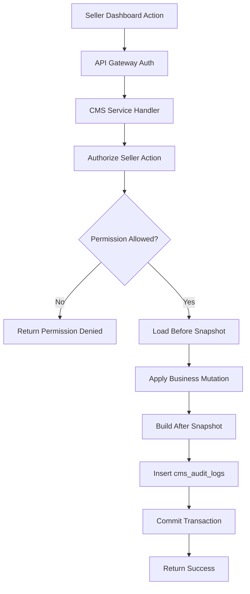
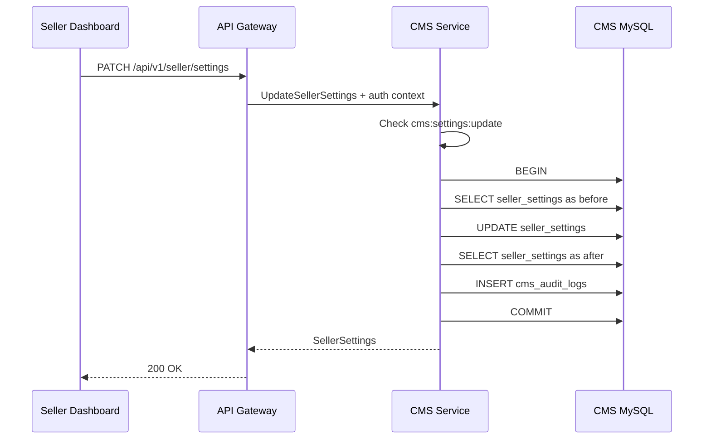
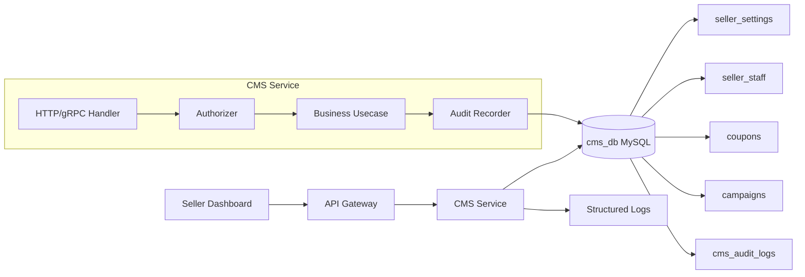
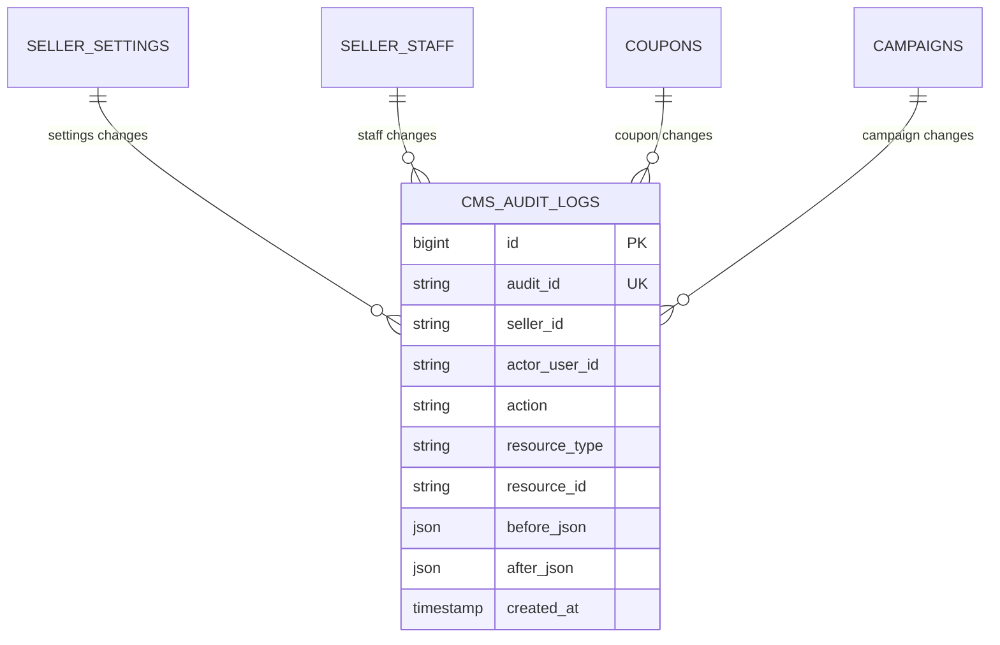

# 🧾 CMS Service - Task 8: Audit Logs


## 📌 Task Summary

| Field | Detail |
|---|---|
| Task Name | Audit logs |
| Source | `docs/01-micro-tasks.md` -> `CMS Service` -> Task 8 |
| Goal | Seller dashboard actions audit karna, taaki disputes, debugging, aur security review me traceability mile |
| Dependency | `Schema` |
| Priority | `P1` |
| Main Table | `cms_audit_logs` |
| Main Permission | `cms:audit_logs:read` |
| Main Domain Model | `domain.AuditEvent` |
| Main Usecase Hook | `usecase.AuditRecorder` |
| Existing MVP Sink | `repository.LoggerAuditRecorder` |
| Recommended Persistent Sink | `repository.MySQLAuditRecorder` |
| Scope | Audit event model, audit schema, write flow, list/read API, security rules, code examples, diagrams, tools, tests |
| Not Included | Coupon/campaign business logic changes, seller dashboard frontend UI, Product/Order service implementation, Superadmin audit logs, cross-service event streaming |

> **Simple Hinglish goal:** CMS Service me seller dashboard ke important actions ka permanent record store karna hai. Kaun actor tha, kis seller workspace me action hua, kya action hua, kis resource par hua, request id kya thi, aur before/after summary kya thi - ye sab traceable hona chahiye.

---

## ✅ Final Output Created

```text
TaskImplementation/
└── CMS Service/
    ├── task1.md
    ├── task2.md
    ├── task3.md
    ├── task4.md
    ├── task5.md
    ├── task6.md
    ├── task7.md
    └── task8.md
```

### Why this structure?

- `TaskImplementation/` project ka task-wise documentation folder hai.
- `CMS Service/` folder already present tha, isliye usko preserve kiya gaya.
- `task8.md` sirf **CMS Service - Task 8** ka audit log implementation guide document karta hai.
- Existing backend code, migrations, API specs, frontend files, ya previous task docs modify nahi kiye gaye.

---

## 🧭 Requirement Source Mapping

| Document / File | Kya use kiya gaya |
|---|---|
| `docs/01-micro-tasks.md` | CMS Service Task 8 ka exact scope: `Audit logs` |
| `docs/05-database-design.md` | CMS DB table list me `cms_audit_logs` and indexes |
| `docs/09-cms-superadmin.md` | Seller CMS module: Audit Activity |
| `docs/12-logging-monitoring-scalability.md` | Structured logs, request id, trace id, PII redaction rules |
| `docs/13-developer-guide.md` | Backend flow: domain -> usecase -> repository -> transport -> tests |
| `database/draw.sql` | Existing `cms_audit_logs` reference DDL |
| `TaskImplementation/CMS Service/task1.md` | Audit permissions and mutation audit expectation |
| `TaskImplementation/CMS Service/task2.md` | MySQL choice and audit table blueprint |
| `TaskImplementation/CMS Service/task3.md` | Product moderation audit pattern |
| `TaskImplementation/CMS Service/task5.md` | Campaign mutation audit expectation |
| `TaskImplementation/CMS Service/task7.md` | CMS gRPC boundary and Task 8 excluded scope |
| `backend/services/cms-service/internal/domain/audit.go` | Existing `AuditEvent` model |
| `backend/services/cms-service/internal/usecase/authorize_seller_action.go` | Existing `AuditRecorder` interface and mutation audit hook |
| `backend/services/cms-service/internal/repository/logger_audit_repository.go` | Existing structured logger audit sink |

---

## 🚦 Scope Boundary

### ✅ In Scope

- Seller dashboard audit log model define karna.
- Audit-worthy actions identify karna.
- `cms_audit_logs` table ka persistent storage design explain karna.
- Existing logger-based audit sink ko explain karna.
- Production-ready MySQL audit recorder ka implementation blueprint dena.
- Mutations ke saath audit write ka transaction pattern define karna.
- Seller audit timeline/list API ka contract define karna.
- Permission, privacy, retention, and observability rules document karna.
- Code examples and Mermaid diagrams provide karna.
- External tools/libraries explain karna.

### 🚫 Out of Scope

- Actual backend code files create/update karna.
- Actual SQL migration file create karna.
- Seller Dashboard React audit timeline banana.
- Superadmin audit logs implement karna.
- Admin audit export/reporting implement karna.
- Cross-service centralized audit warehouse banana.
- Product, Order, Coupon, Campaign business flows ko change karna.

> 🔴 **Reason:** User ka requested output folder structure and `task8.md` content hai. Isliye ye task documentation-level implementation guide hai, production code change nahi.

---

## 🪜 Step-by-Step Implementation

## Step 1: Task requirement identify kiya

`docs/01-micro-tasks.md` me CMS Service ka Task 8 ye hai:

| S.No | Task Name | Detail | Dependency |
|---:|---|---|---|
| 8 | Audit logs | Seller dashboard actions audit karo. Disputes me traceability milegi. | Schema |

**Implementation decision:**

- Audit logs CMS Service ke andar rahenge, kyunki seller dashboard actions ka owner CMS Service hai.
- Har seller-scoped mutation action ka audit record create hoga.
- Audit records immutable honge: insert-only, update/delete avoid.
- Seller audit timeline read karne ke liye `cms:audit_logs:read` permission required hogi.

> 🟢 **Why:** Jab seller bole "mere coupon/campaign/settings kisne change kiye?", to audit log exact actor, action, resource, request, aur timestamp batayega.

---

## Step 2: Audit log ka purpose clear kiya

Audit logs normal application logs se different hote hain.

| Type | Purpose | Retention | Example |
|---|---|---|---|
| Application logs | Debugging and ops monitoring | Short/medium | `cms.http.started` |
| Audit logs | Compliance, dispute traceability, security review | Long | `cms:campaigns:update` by `user_123` |

### Audit log answers these questions

| Question | Audit field |
|---|---|
| Kisne action kiya? | `actor_user_id`, `actor_roles` |
| Kis seller workspace me action hua? | `seller_id` / `resource_seller_id` |
| Kya action hua? | `action` |
| Kis resource par hua? | `resource_type`, `resource_id` |
| Request trace ka id kya tha? | `request_id`, `trace_id` |
| Action allowed tha ya denied? | `decision` |
| Pehle aur baad me kya change hua? | `before_json`, `after_json` |
| Kab hua? | `created_at` |

> 🔵 **Simple rule:** Audit log user-facing dispute ka evidence hai. Isliye ye structured, searchable, aur immutable hona chahiye.

---

## Step 3: Audit-worthy CMS actions identify kiye

Task 8 ka focus **seller dashboard actions** par hai. Sabse important actions mutation actions hain.

### Mandatory audit actions

| Area | Actions | Permissions |
|---|---|---|
| Seller settings | Update return/shipping/support settings | `cms:settings:update` |
| Staff management | Invite staff, update role, remove staff | `cms:staff:invite`, `cms:staff:update_role`, `cms:staff:remove` |
| Products | Create/update product, submit review, unpublish | `cms:products:create`, `cms:products:update`, `cms:products:submit_review`, `cms:products:unpublish` |
| Coupons | Create/update/disable coupon | `cms:coupons:create`, `cms:coupons:update`, `cms:coupons:disable` |
| Campaigns | Create/update/disable campaign | `cms:campaigns:create`, `cms:campaigns:update`, `cms:campaigns:disable` |
| Orders | Update fulfillment, respond return | `cms:orders:update_fulfillment`, `cms:orders:respond_return` |

### Optional audit actions

| Area | Action | Why optional |
|---|---|---|
| Audit timeline read | Seller views audit logs | Useful for sensitive monitoring, but can become high-volume |
| Analytics read | Seller views revenue metrics | Mostly read-only; app logs may be enough |
| Coupon validation | Cart/Order internal preview | High-volume; better tracked as metrics/logs, not seller audit |

> 🟡 **Decision:** MVP me mutation actions mandatory audit honge. Sensitive read audit later add kar sakte hain if compliance requirement aaye.

---

## Step 4: Existing audit hook understand kiya

Current CMS service code me already audit foundation present hai:

```text
backend/services/cms-service/
└── internal/
    ├── domain/
    │   └── audit.go
    ├── usecase/
    │   └── authorize_seller_action.go
    └── repository/
        └── logger_audit_repository.go
```

### Existing domain model

```go
type AuditDecision string

const (
    AuditDecisionAllowed AuditDecision = "allowed"
    AuditDecisionDenied  AuditDecision = "denied"
)

type AuditEvent struct {
    AuditID          string
    ActorUserID      string
    ActorSellerID    string
    ActorRoles       []Role
    Action           Permission
    ResourceType     string
    ResourceID       string
    ResourceSellerID string
    RequestID        string
    Decision         AuditDecision
    CreatedAt        time.Time
}
```

### Existing recorder interface

```go
type AuditRecorder interface {
    Record(ctx context.Context, event domain.AuditEvent) error
}
```

### Existing mutation audit hook

```go
decision := AuthorizationDecision{
    RequiredPermission: input.RequiredPermission,
    AuditRequired:      domain.IsMutationPermission(input.RequiredPermission),
    RequestID:          input.requestID(),
}
```

**Explanation:**

- `domain.IsMutationPermission(...)` decide karta hai ki action audit-worthy hai ya nahi.
- Agar mutation allowed hai, authorizer audit recorder ko call karta hai.
- Agar audit write fail ho jaye, existing behavior fail-closed hai: action deny ho sakta hai.

> 🟢 **Good foundation:** Task 8 ke liye current service me audit interface and logger sink already available hai. Production hardening ke liye persistent MySQL sink add karna recommended hai.

---

## Step 5: Audit event shape final kiya

Task 8 ke liye audit event ko two levels me sochna better hai:

1. **Minimum event** jo current code support karta hai.
2. **Persistent event** jo DB me long-term dispute traceability ke liye store hoga.

### Minimum event fields

| Field | Required | Purpose |
|---|---:|---|
| `audit_id` | ✅ | Unique audit identifier |
| `actor_user_id` | ✅ | Action perform karne wala user/staff |
| `actor_seller_id` | ✅ | Actor ka seller workspace |
| `actor_roles` | ✅ | Effective role list |
| `action` | ✅ | Permission/action name |
| `resource_type` | ✅ | Resource type: `coupon`, `campaign`, `settings`, `order` |
| `resource_id` | ✅ | Resource identifier |
| `resource_seller_id` | ✅ | Resource ka seller owner |
| `request_id` | ✅ | API request trace |
| `decision` | ✅ | `allowed` or `denied` |
| `created_at` | ✅ | UTC timestamp |

### Persistent fields for dispute traceability

| Field | Required | Purpose |
|---|---:|---|
| `before_json` | Optional | Change se pehle resource summary |
| `after_json` | Optional | Change ke baad resource summary |
| `reason` | Optional | Seller/admin entered reason |
| `ip_hash` | Optional | Privacy-safe network clue |
| `user_agent_hash` | Optional | Device/browser clue without raw PII |
| `trace_id` | Optional | Distributed tracing join |

> 🔵 **Privacy note:** Raw IP, JWT, password, OTP, card data, full address, and secrets audit log me store nahi karne.

---

## Step 6: MySQL audit table use kiya

`database/draw.sql` me CMS audit table already defined hai:

```sql
CREATE TABLE IF NOT EXISTS cms_audit_logs (
  id BIGINT UNSIGNED NOT NULL AUTO_INCREMENT,
  audit_id VARCHAR(64) NOT NULL,
  seller_id VARCHAR(64) NOT NULL,
  actor_user_id VARCHAR(64) NOT NULL,
  action VARCHAR(128) NOT NULL,
  resource_type VARCHAR(64) NOT NULL,
  resource_id VARCHAR(64) NOT NULL,
  before_json JSON NULL,
  after_json JSON NULL,
  created_at TIMESTAMP NOT NULL DEFAULT CURRENT_TIMESTAMP,
  PRIMARY KEY (id),
  UNIQUE KEY uk_cms_audit_logs_audit_id (audit_id),
  KEY idx_cms_audit_seller_created (seller_id, created_at),
  KEY idx_cms_audit_resource (resource_type, resource_id)
) ENGINE=InnoDB;
```

### Field explanation

| Column | Explanation |
|---|---|
| `id` | Internal auto increment primary key |
| `audit_id` | Public/stable unique audit id |
| `seller_id` | Seller workspace scope |
| `actor_user_id` | Staff/user who performed action |
| `action` | Permission-like action string |
| `resource_type` | Business object type |
| `resource_id` | Business object id |
| `before_json` | Previous state summary |
| `after_json` | New state summary |
| `created_at` | Audit timestamp |

### Index strategy

| Index | Query supported |
|---|---|
| `uk_cms_audit_logs_audit_id` | Exact audit lookup |
| `idx_cms_audit_seller_created` | Seller activity timeline |
| `idx_cms_audit_resource` | Resource change history |

> 🟢 **Why MySQL:** Audit logs seller/coupon/campaign/staff data ke saath relationally queryable hain. MySQL unique keys and indexes clean traceability dete hain.

---

## Step 7: Recommended schema hardening define ki

Existing schema MVP ke liye enough hai, but production Task 8 me ye additional columns useful rahenge:

```sql
ALTER TABLE cms_audit_logs
  ADD COLUMN actor_roles_json JSON NULL AFTER actor_user_id,
  ADD COLUMN request_id VARCHAR(128) NULL AFTER resource_id,
  ADD COLUMN trace_id VARCHAR(128) NULL AFTER request_id,
  ADD COLUMN decision ENUM('allowed', 'denied') NOT NULL DEFAULT 'allowed' AFTER trace_id,
  ADD COLUMN reason VARCHAR(512) NULL AFTER decision,
  ADD COLUMN ip_hash CHAR(64) NULL AFTER reason,
  ADD COLUMN user_agent_hash CHAR(64) NULL AFTER ip_hash,
  ADD KEY idx_cms_audit_request (request_id),
  ADD KEY idx_cms_audit_actor_created (actor_user_id, created_at),
  ADD KEY idx_cms_audit_action_created (action, created_at);
```

### Why these columns?

| Column | Why useful |
|---|---|
| `actor_roles_json` | Dispute time par effective role visible hota hai |
| `request_id` | Gateway/service logs ke saath join hota hai |
| `trace_id` | Distributed trace se exact call path milta hai |
| `decision` | Denied attempts bhi store karne ka option milta hai |
| `reason` | Manual reason note ya deny reason |
| `ip_hash` | Privacy-safe suspicious activity clue |
| `user_agent_hash` | Device pattern investigation |

> 🟡 **MVP decision:** Existing `cms_audit_logs` table se start kar sakte hain. Production me above hardening migration add karna better hai.

---

## Step 8: Audit write flow design kiya

Mutation ke saath audit write same logical operation ka part hona chahiye.



### Flow explanation

1. Seller dashboard action API Gateway ko request bhejta hai.
2. Gateway JWT verify karke seller context pass karta hai.
3. CMS Service permission check karta hai.
4. Mutation se pehle resource ka compact `before_json` snapshot banaya jata hai.
5. Business update apply hota hai.
6. Update ke baad `after_json` snapshot banaya jata hai.
7. Audit log insert hota hai.
8. Transaction commit hota hai.

> 🔴 **Important:** Business mutation success but audit insert fail ho gaya to traceability toot sakti hai. High-risk mutations me audit failure par transaction rollback karna safer hai.

---

## Step 9: Same transaction pattern define kiya

Audit log ko mutation ke saath same DB transaction me insert karna best hai.



### Why transaction?

| Problem without transaction | Transaction benefit |
|---|---|
| Mutation saved but audit missing | Both save or both rollback |
| Before/after mismatch | Snapshot same operation se linked |
| Concurrent updates confusing | DB isolation predictable behavior deta hai |
| Duplicate retry creates confusion | `audit_id` unique and request id help karte hain |

---

## Step 10: Audit domain model ka production version design kiya

Recommended domain model:

```go
package domain

import "time"

type AuditEntry struct {
    AuditID          string
    SellerID         string
    ActorUserID      string
    ActorRoles       []Role
    Action           Permission
    ResourceType     string
    ResourceID       string
    RequestID        string
    TraceID          string
    Decision         AuditDecision
    Before           map[string]any
    After            map[string]any
    Reason           string
    IPHash           string
    UserAgentHash    string
    CreatedAt        time.Time
}
```

### Design notes

- `SellerID` always resource seller scope hoga.
- `ActorUserID` actor identity hoga, seller id nahi.
- `Before` and `After` compact snapshots honge, full large object dump nahi.
- `RequestID` API Gateway se propagate hoga.
- `CreatedAt` always UTC hoga.

---

## Step 11: MySQL repository interface design kiya

Usecase layer DB implementation se independent rahega.

```go
type AuditLogRepository interface {
    Insert(ctx context.Context, tx *sql.Tx, entry domain.AuditEntry) error
    ListBySeller(ctx context.Context, filter AuditLogFilter) ([]domain.AuditEntry, PageInfo, error)
}

type AuditLogFilter struct {
    SellerID      string
    ActorUserID   string
    Action        string
    ResourceType  string
    ResourceID    string
    From          time.Time
    To            time.Time
    PageSize      int
    Cursor        string
}
```

### Why interface?

- Usecase easily test hota hai.
- MySQL implementation replace/extend karna easy hota hai.
- Future me audit logs archive storage ya OpenSearch projection add kar sakte hain.

---

## Step 12: MySQL audit insert code example

Production persistent recorder ka simplified example:

```go
type MySQLAuditRecorder struct {
    db *sql.DB
}

func NewMySQLAuditRecorder(db *sql.DB) *MySQLAuditRecorder {
    return &MySQLAuditRecorder{db: db}
}

func (r *MySQLAuditRecorder) Record(ctx context.Context, event domain.AuditEvent) error {
    _, err := r.db.ExecContext(ctx, `
        INSERT INTO cms_audit_logs (
            audit_id,
            seller_id,
            actor_user_id,
            action,
            resource_type,
            resource_id,
            before_json,
            after_json,
            created_at
        ) VALUES (?, ?, ?, ?, ?, ?, ?, ?, ?)
    `,
        event.AuditID,
        event.ResourceSellerID,
        event.ActorUserID,
        event.Action.String(),
        event.ResourceType,
        event.ResourceID,
        nil,
        nil,
        event.CreatedAt,
    )
    return err
}
```

### Explanation

- `ResourceSellerID` DB ke `seller_id` me store hota hai.
- `Action` permission string ke form me store hota hai.
- `before_json` and `after_json` current `AuditEvent` me nahi hain, isliye MVP recorder nil pass karega.
- Full mutation usecases ke andar richer `AuditEntry` use karke before/after store karna better hoga.

---

## Step 13: Before/after snapshot pattern define kiya

Audit me full DB row dump karna zaruri nahi. Compact summary enough hoti hai.

### Seller settings update snapshot

```json
{
  "before": {
    "return_policy": "7 days return",
    "shipping_policy": "Ships in 3 days",
    "support_email": "old-support@example.com"
  },
  "after": {
    "return_policy": "10 days return",
    "shipping_policy": "Ships in 2 days",
    "support_email": "support@example.com"
  }
}
```

### Coupon update snapshot

```json
{
  "before": {
    "status": "active",
    "discount_type": "percentage",
    "discount_value": 10,
    "max_discount_amount": 50000
  },
  "after": {
    "status": "paused",
    "discount_type": "percentage",
    "discount_value": 10,
    "max_discount_amount": 50000
  }
}
```

### Snapshot rules

| Rule | Why |
|---|---|
| Store summary, not entire object | Audit table manageable rahegi |
| Redact secrets and tokens | Security risk avoid |
| Store money in minor units | API/DB consistency |
| Keep field names stable | Audit UI simple rahega |
| Avoid huge arrays | Row size and query performance safe |

---

## Step 14: Usecase implementation example

Seller settings update ka pseudo implementation:

```go
func (u *UpdateSellerSettingsUsecase) Execute(ctx context.Context, in UpdateSettingsInput) (SellerSettings, error) {
    decision, err := u.authorizer.Authorize(ctx, usecase.AuthorizeInput{
        Actor:              in.Actor,
        ResourceSellerID:   in.SellerID,
        RequiredPermission: domain.PermissionSettingsUpdate,
        ResourceType:       "settings",
        ResourceID:         in.SellerID,
        RequestID:          in.RequestID,
    })
    if err != nil {
        return SellerSettings{}, err
    }

    tx, err := u.db.BeginTx(ctx, nil)
    if err != nil {
        return SellerSettings{}, err
    }
    defer tx.Rollback()

    before, err := u.settingsRepo.GetForUpdate(ctx, tx, in.SellerID)
    if err != nil {
        return SellerSettings{}, err
    }

    after := before.Apply(in.Patch)
    if err := u.settingsRepo.Update(ctx, tx, after); err != nil {
        return SellerSettings{}, err
    }

    audit := domain.AuditEntry{
        AuditID:      NewAuditID(),
        SellerID:     in.SellerID,
        ActorUserID:  in.Actor.UserID,
        ActorRoles:   decision.EffectiveRoles,
        Action:       domain.PermissionSettingsUpdate,
        ResourceType: "settings",
        ResourceID:   in.SellerID,
        RequestID:    in.RequestID,
        Decision:     domain.AuditDecisionAllowed,
        Before:       before.AuditSnapshot(),
        After:        after.AuditSnapshot(),
        CreatedAt:    u.now(),
    }
    if err := u.auditRepo.Insert(ctx, tx, audit); err != nil {
        return SellerSettings{}, fmt.Errorf("%w: %v", domain.ErrAuditWriteFailed, err)
    }

    if err := tx.Commit(); err != nil {
        return SellerSettings{}, err
    }
    return after, nil
}
```

### Explanation

- Pehle permission check hota hai.
- Same transaction me before snapshot, update, after snapshot, and audit insert hota hai.
- Audit insert fail hua to mutation commit nahi hoti.
- `decision.EffectiveRoles` audit me store karke future role changes ke baad bhi historical role visible rehta hai.

---

## Step 15: Audit timeline read API define ki

Seller Dashboard me "Audit Activity" screen ke liye read endpoint useful hoga.

### REST endpoint

```text
GET /api/v1/seller/audit-logs
```

### Permission

```text
cms:audit_logs:read
```

### Query params

| Param | Example | Meaning |
|---|---|---|
| `from` | `2026-05-01T00:00:00Z` | Start time |
| `to` | `2026-05-24T23:59:59Z` | End time |
| `actor_user_id` | `user_123` | Actor filter |
| `action` | `cms:campaigns:update` | Action filter |
| `resource_type` | `campaign` | Resource type filter |
| `resource_id` | `camp_123` | Resource id filter |
| `page_size` | `20` | Page size |
| `cursor` | `audit_abc` | Pagination cursor |

### Response example

```json
{
  "audit_logs": [
    {
      "audit_id": "audit_01JXYZ",
      "seller_id": "seller_123",
      "actor_user_id": "user_456",
      "actor_roles": ["seller_manager"],
      "action": "cms:campaigns:update",
      "resource_type": "campaign",
      "resource_id": "camp_789",
      "request_id": "req_abc",
      "decision": "allowed",
      "before": {
        "status": "draft"
      },
      "after": {
        "status": "active"
      },
      "created_at": "2026-05-24T10:30:00Z"
    }
  ],
  "next_cursor": null
}
```

> 🔵 **Same seller rule:** API response me sirf authenticated actor ke `seller_id` ke audit logs return honge. Query/body seller id par trust nahi karna.

---

## Step 16: Audit list SQL query design ki

Basic seller timeline:

```sql
SELECT
  audit_id,
  seller_id,
  actor_user_id,
  action,
  resource_type,
  resource_id,
  before_json,
  after_json,
  created_at
FROM cms_audit_logs
WHERE seller_id = ?
  AND created_at >= ?
  AND created_at < ?
ORDER BY created_at DESC, id DESC
LIMIT ?;
```

Resource history:

```sql
SELECT
  audit_id,
  actor_user_id,
  action,
  before_json,
  after_json,
  created_at
FROM cms_audit_logs
WHERE seller_id = ?
  AND resource_type = ?
  AND resource_id = ?
ORDER BY created_at DESC, id DESC
LIMIT ?;
```

Actor activity:

```sql
SELECT
  audit_id,
  action,
  resource_type,
  resource_id,
  created_at
FROM cms_audit_logs
WHERE seller_id = ?
  AND actor_user_id = ?
ORDER BY created_at DESC, id DESC
LIMIT ?;
```

### Query safety rules

- Always include `seller_id = ?`.
- `page_size` max cap rakho, for example `100`.
- `from/to` range default last 30 days.
- `ORDER BY created_at DESC, id DESC` stable timeline deta hai.
- JSON fields ko list response me compact rakho.

---

## Step 17: gRPC contract reference define ki

Task 7 me CMS gRPC boundary define ho chuki hai. Task 8 ke liye optional method:

```proto
service CMSService {
  rpc ListAuditLogs(ListAuditLogsRequest) returns (ListAuditLogsResponse);
}

message ListAuditLogsRequest {
  string seller_id = 1;
  string actor_user_id = 2;
  string action = 3;
  string resource_type = 4;
  string resource_id = 5;
  google.protobuf.Timestamp from = 6;
  google.protobuf.Timestamp to = 7;
  int32 page_size = 8;
  string cursor = 9;
}

message AuditLog {
  string audit_id = 1;
  string seller_id = 2;
  string actor_user_id = 3;
  repeated string actor_roles = 4;
  string action = 5;
  string resource_type = 6;
  string resource_id = 7;
  string request_id = 8;
  string decision = 9;
  google.protobuf.Struct before = 10;
  google.protobuf.Struct after = 11;
  google.protobuf.Timestamp created_at = 12;
}

message ListAuditLogsResponse {
  repeated AuditLog audit_logs = 1;
  string next_cursor = 2;
}
```

### Important mapping rule

Even if request me `seller_id` aaye, CMS Service auth context ke seller id se scope enforce karega:

```text
request.seller_id must equal auth.seller_id
```

> 🟡 **Note:** Actual proto file create/update is not done in this task output. Ye implementation guide ka contract reference hai.

---

## Step 18: Architecture diagram banaya



### Explanation

- Seller dashboard public REST call karta hai.
- API Gateway authentication and auth context pass karta hai.
- CMS Service seller-scope permission check karta hai.
- Business mutation ke saath audit record create hota hai.
- Permanent audit history `cms_audit_logs` me store hoti hai.

---

## Step 19: Audit table relation diagram banaya



> 🔵 **Relation note:** `cms_audit_logs.resource_type + resource_id` polymorphic reference hai. Ye direct foreign key nahi hai, kyunki resource multiple tables/services se ho sakta hai.

---

## Step 20: Current logger audit sink explain kiya

Current repo me `LoggerAuditRecorder` present hai:

```go
func (r *LoggerAuditRecorder) Record(ctx context.Context, event domain.AuditEvent) error {
    r.logger.InfoContext(ctx, "cms.audit",
        slog.String("audit_id", event.AuditID),
        slog.String("actor_user_id", event.ActorUserID),
        slog.String("actor_seller_id", event.ActorSellerID),
        slog.Any("actor_roles", domain.RoleStrings(event.ActorRoles)),
        slog.String("action", event.Action.String()),
        slog.String("resource_type", event.ResourceType),
        slog.String("resource_id", event.ResourceID),
        slog.String("resource_seller_id", event.ResourceSellerID),
        slog.String("request_id", event.RequestID),
        slog.String("decision", string(event.Decision)),
        slog.Time("created_at", event.CreatedAt),
    )
    return nil
}
```

### Logger sink ka use

| Environment | Use |
|---|---|
| Local dev | Quick visibility |
| Unit tests | Fake/spy recorder easy |
| Early MVP | Structured logs in stdout |
| Production | Useful as secondary sink, but DB persistent sink required |

> 🟡 **Important:** Logs rotate/expire ho sakte hain. Dispute traceability ke liye MySQL `cms_audit_logs` persistent source of truth hona chahiye.

---

## Step 21: Fail-open vs fail-closed decision

Audit write fail hone par do choices hoti hain:

| Strategy | Behavior | Risk |
|---|---|---|
| Fail-open | Mutation allow, audit missing | Traceability gap |
| Fail-closed | Mutation reject, audit required | User action fail ho sakta hai |

### Task 8 decision

```text
High-risk seller dashboard mutations -> fail-closed
Low-risk/non-critical logs -> fail-open allowed
```

### Examples

| Action | Strategy |
|---|---|
| Staff role update | Fail-closed |
| Coupon disable | Fail-closed |
| Campaign budget update | Fail-closed |
| Settings update | Fail-closed |
| Audit timeline read viewed | Fail-open or app log only |

> 🟢 **Existing code alignment:** Current `Authorizer` audit write failure ko `ErrAuditWriteFailed` me wrap karta hai, jo fail-closed behavior support karta hai.

---

## Step 22: Permission enforcement define ki

Audit log list/read action protected hoga:

```text
Permission: cms:audit_logs:read
```

### Role access

| Role | Can read audit logs? |
|---|---:|
| `seller` | ✅ |
| `seller_manager` | ✅ |
| `seller_catalog_editor` | ❌ |
| `seller_order_manager` | ❌ |

### Why catalog/order staff cannot read?

Audit logs me staff changes, settings changes, and sensitive business actions visible ho sakte hain. Isliye owner/manager level access better hai.

---

## Step 23: Privacy and redaction rules define kiye

Audit logs valuable hain, but sensitive bhi hote hain.

### Never store

| Data | Reason |
|---|---|
| Passwords | Credential leak risk |
| OTP | Account takeover risk |
| Full JWT / refresh token | Session hijack risk |
| Payment card data | Compliance risk |
| API keys/secrets | Infrastructure risk |
| Raw IP address | Privacy concern |
| Full user address | PII minimization |

### Safe alternatives

| Need | Safe value |
|---|---|
| IP clue | `sha256(ip + salt)` |
| User agent clue | `sha256(user_agent + salt)` |
| Changed policy | Compact text summary |
| Money value | Minor units + currency |
| Actor identity | Internal `user_id` |

### Redaction helper example

```go
func RedactAuditSnapshot(input map[string]any) map[string]any {
    blocked := map[string]struct{}{
        "password":      {},
        "otp":           {},
        "access_token":  {},
        "refresh_token": {},
        "api_key":       {},
        "card_number":   {},
    }

    out := make(map[string]any, len(input))
    for key, value := range input {
        if _, sensitive := blocked[strings.ToLower(key)]; sensitive {
            out[key] = "[REDACTED]"
            continue
        }
        out[key] = value
    }
    return out
}
```

---

## Step 24: Audit ID generation define kiya

Current code `crypto/rand` se random audit id banata hai:

```go
func newAuditID() string {
    var bytes [16]byte
    if _, err := rand.Read(bytes[:]); err != nil {
        return fmt.Sprintf("audit_%d", time.Now().UTC().UnixNano())
    }
    return "audit_" + hex.EncodeToString(bytes[:])
}
```

### Why random id?

| Reason | Detail |
|---|---|
| Unique | Collision risk low |
| Non-sequential public id | Guessing harder |
| Simple | Extra external ID library required nahi |

### Alternative

ULID/UUID bhi use kar sakte hain. But current code me stdlib random id enough hai.

---

## Step 25: External libraries/tools explain kiye

| Tool / Library | Type | Why used | Install / Use |
|---|---|---|---|
| MySQL 8+ | Database | `cms_audit_logs` persistent structured storage ke liye | Docker/local managed MySQL |
| `github.com/go-sql-driver/mysql` | Go driver | Go `database/sql` se MySQL connect karne ke liye | `go get github.com/go-sql-driver/mysql` |
| Go `database/sql` | Standard library | Transactions, prepared queries, context-aware DB calls | Go built-in |
| Go `log/slog` | Standard library | Structured audit/application logs | Go 1.21+ built-in |
| Go `crypto/rand` | Standard library | Secure audit id randomness | Go built-in |
| Mermaid | Markdown diagram format | Architecture/flow diagrams readable banane ke liye | Markdown viewer/GitHub supports it |
| OpenTelemetry | Optional observability | Trace id propagation and spans | Add only when platform observability task implements it |
| Prometheus | Optional metrics | Audit write failure/count metrics | Add only when metrics infra ready ho |

### Current repo dependency

`backend/services/cms-service/go.mod` already includes:

```go
require github.com/go-sql-driver/mysql v1.9.3
```

### Local install example

```bash
cd backend/services/cms-service
go get github.com/go-sql-driver/mysql
go mod tidy
```

> 🟢 **No new package required for this documentation output.** Persistent MySQL implementation ke time driver already available hai.

---

## Step 26: Clean implementation folder structure define ki

### Created in this task

```text
TaskImplementation/
└── CMS Service/
    └── task8.md
```

### Future production implementation placement

```text
backend/
└── services/
    └── cms-service/
        ├── internal/
        │   ├── domain/
        │   │   └── audit.go
        │   ├── usecase/
        │   │   ├── authorize_seller_action.go
        │   │   └── list_audit_logs.go
        │   ├── repository/
        │   │   ├── logger_audit_repository.go
        │   │   └── mysql_audit_repository.go
        │   └── transport/
        │       ├── grpc/
        │       │   └── audit_handler.go
        │       └── http/
        │           └── audit_handler.go
        └── migrations/
            ├── 00X_create_cms_audit_logs.up.sql
            └── 00X_create_cms_audit_logs.down.sql
```

### File responsibilities

| File | Responsibility |
|---|---|
| `domain/audit.go` | Audit event/entity and decision constants |
| `usecase/list_audit_logs.go` | Seller audit timeline read logic |
| `repository/logger_audit_repository.go` | Structured log sink |
| `repository/mysql_audit_repository.go` | Persistent MySQL audit sink |
| `transport/grpc/audit_handler.go` | gRPC request/response mapping |
| `transport/http/audit_handler.go` | REST endpoint mapping if CMS exposes HTTP |
| `migrations/*cms_audit_logs*` | DB schema creation/hardening |

---

## Step 27: Observability metrics define kiye

Recommended metrics:

| Metric | Type | Meaning |
|---|---|---|
| `cms_audit_write_total` | Counter | Total audit write attempts |
| `cms_audit_write_failed_total` | Counter | Failed audit writes |
| `cms_audit_write_latency_ms` | Histogram | Audit insert latency |
| `cms_audit_read_total` | Counter | Audit list/read requests |
| `cms_audit_read_latency_ms` | Histogram | Audit read query latency |
| `cms_audit_denied_total` | Counter | Denied actions audited |

### Structured log fields

```json
{
  "message": "cms.audit",
  "service": "cms-service",
  "request_id": "req_abc",
  "trace_id": "trace_123",
  "audit_id": "audit_01JXYZ",
  "seller_id": "seller_123",
  "actor_user_id": "user_456",
  "action": "cms:campaigns:update",
  "resource_type": "campaign",
  "resource_id": "camp_789",
  "decision": "allowed"
}
```

---

## Step 28: Retention and archival policy define ki

Audit logs long-term useful hote hain, but table infinite grow nahi honi chahiye.

| Data age | Storage |
|---|---|
| 0-90 days | Hot MySQL table |
| 90 days-1 year | MySQL partition/archive table |
| 1+ year | Object storage export or cold archive |

### Retention rules

- Minimum retention business/legal requirement se decide hogi.
- Delete operation direct nahi chalega; archival job controlled hoga.
- Monthly partitioning high-volume scale par useful hoga.
- Export files encrypted hone chahiye.

> 🟡 **MVP:** Start with indexed MySQL table. Partitioning/archive later traffic ke basis par add kar sakte hain.

---

## Step 29: Error mapping define ki

| Error | HTTP | gRPC | Meaning |
|---|---:|---|---|
| `ErrUnauthenticated` | 401 | `Unauthenticated` | Login/auth missing |
| `ErrForbidden` | 403 | `PermissionDenied` | Role allowed nahi |
| `ErrInvalidSellerScope` | 400 | `InvalidArgument` | Seller scope invalid |
| `ErrAuditWriteFailed` | 500 | `Internal` | Audit persistence failed |
| DB timeout | 503 | `Unavailable` | Temporary DB issue |

### Audit write failure response

```json
{
  "error": {
    "code": "AUDIT_WRITE_FAILED",
    "message": "Audit write failed"
  },
  "request_id": "req_abc"
}
```

> 🔴 **Security note:** Response me internal DB details expose nahi karni.

---

## Step 30: Testing strategy define ki

### Unit tests

| Test | Expected |
|---|---|
| Mutation permission calls audit recorder | Recorder receives event |
| Read permission does not require audit | No audit event |
| Audit recorder failure fails closed | `ErrAuditWriteFailed` |
| Cross-seller action denied | No mutation |
| Role without permission denied | No mutation |
| Snapshot redaction removes secrets | Sensitive fields redacted |

### Repository tests

| Test | Expected |
|---|---|
| Insert audit log | Row stored |
| Duplicate audit id | Unique constraint error |
| List by seller | Only own seller logs returned |
| List by resource | Correct resource timeline |
| Date filter | Correct time-window rows |
| Pagination | Stable next cursor |

### Integration tests

| Flow | Expected |
|---|---|
| Update seller settings | Settings changed and audit row inserted |
| Create coupon | Coupon row and audit row inserted |
| Disable campaign | Campaign status changed and audit row inserted |
| Audit DB down | High-risk mutation fails |
| Cross-seller audit list | Other seller logs hidden |

### Existing test reference

Current CMS service already has this important behavior test:

```text
TestAuthorizerFailsClosedWhenAuditRecorderFails
```

Is test ka goal hai: mutation allowed nahi honi chahiye jab audit recorder fail ho.

---

## Step 31: Security checklist banayi

| Check | Status |
|---|---|
| Seller scope enforced on every audit read | Required |
| Mutation actions audited | Required |
| Audit records immutable | Required |
| Secrets redacted from snapshots | Required |
| `request_id` propagated | Required |
| Audit writes fail-closed for high-risk mutations | Required |
| Audit list permission `cms:audit_logs:read` | Required |
| Page size capped | Required |
| Raw IP/JWT/password not stored | Required |
| Audit write failures logged/alerted | Required |

---

## Step 32: Beginner-friendly implementation order

Production me Task 8 implement karte waqt recommended order:

1. Migration add karo for `cms_audit_logs`.
2. `domain.AuditEntry` me before/after/request metadata add karo.
3. `MySQLAuditRecorder` implement karo.
4. Existing `LoggerAuditRecorder` ko secondary sink ya local fallback rakho.
5. Mutating usecases me before/after snapshot generate karo.
6. Mutation + audit insert same transaction me rakho.
7. `ListAuditLogs` usecase add karo.
8. REST/gRPC handler add karo.
9. Permission `cms:audit_logs:read` enforce karo.
10. Unit, repository, and integration tests likho.
11. Metrics/logs/alerts add karo.
12. Retention/archive policy document karo.

---

## 📦 Sample Audit Records

### Settings update

```json
{
  "audit_id": "audit_c5fb52b4f8e3441db74b3db6d41b881a",
  "seller_id": "seller_123",
  "actor_user_id": "user_456",
  "actor_roles": ["seller"],
  "action": "cms:settings:update",
  "resource_type": "settings",
  "resource_id": "seller_123",
  "request_id": "req_001",
  "decision": "allowed",
  "before": {
    "shipping_policy": "Ships in 3 days"
  },
  "after": {
    "shipping_policy": "Ships in 2 days"
  },
  "created_at": "2026-05-24T12:00:00Z"
}
```

### Campaign disable

```json
{
  "audit_id": "audit_6e99a34ff3ee49cd884437f7ff7e81b1",
  "seller_id": "seller_123",
  "actor_user_id": "user_789",
  "actor_roles": ["seller_manager"],
  "action": "cms:campaigns:disable",
  "resource_type": "campaign",
  "resource_id": "camp_123",
  "request_id": "req_002",
  "decision": "allowed",
  "before": {
    "status": "active"
  },
  "after": {
    "status": "paused"
  },
  "created_at": "2026-05-24T12:05:00Z"
}
```

---

## 🧩 Final Implementation Summary

| Area | Decision |
|---|---|
| Source of truth | `cms_audit_logs` in CMS MySQL DB |
| Audit trigger | Seller dashboard mutation actions |
| Existing hook | `AuditRecorder` inside CMS authorizer |
| Existing local sink | `LoggerAuditRecorder` using `slog` |
| Production sink | `MySQLAuditRecorder` recommended |
| Read permission | `cms:audit_logs:read` |
| Read API | `GET /api/v1/seller/audit-logs` / `CMSService.ListAuditLogs` |
| Scope rule | Always filter by authenticated seller id |
| Failure mode | Fail-closed for high-risk mutations |
| Privacy | Redact secrets, avoid raw PII |
| Retention | Hot MySQL first, archive later |

> 🟢 **Task 8 complete:** CMS Service audit logs ke liye requirement mapping, schema, event model, write/read flow, security, privacy, code examples, diagrams, tools, tests, and production checklist documented hain. No implementation beyond **CMS Service - Task 8** kiya gaya.
