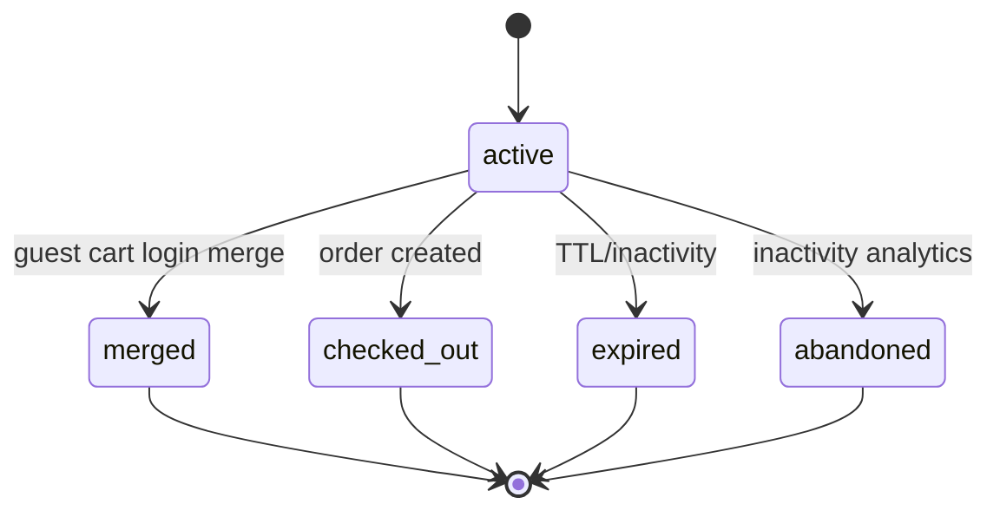
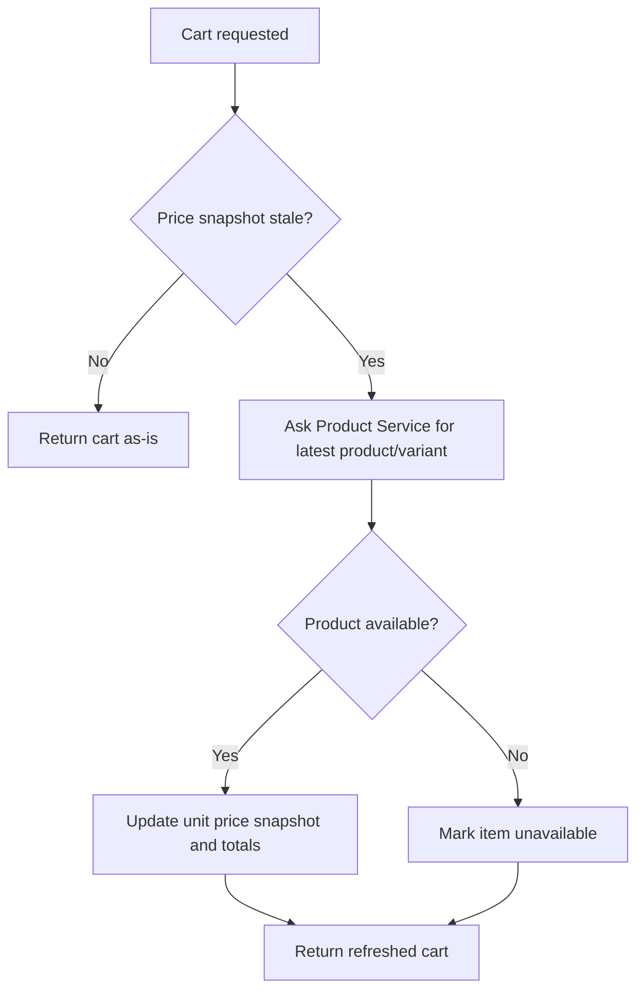
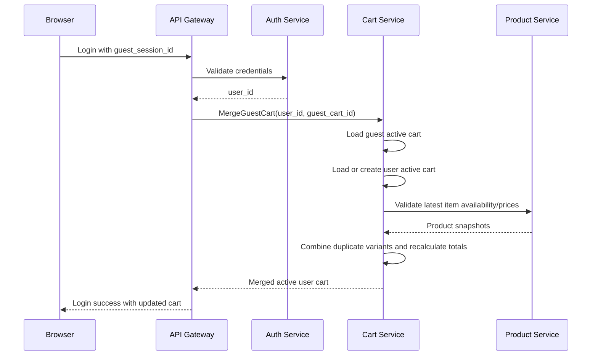
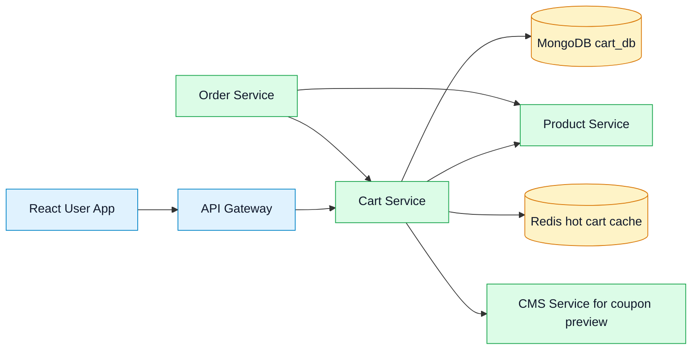
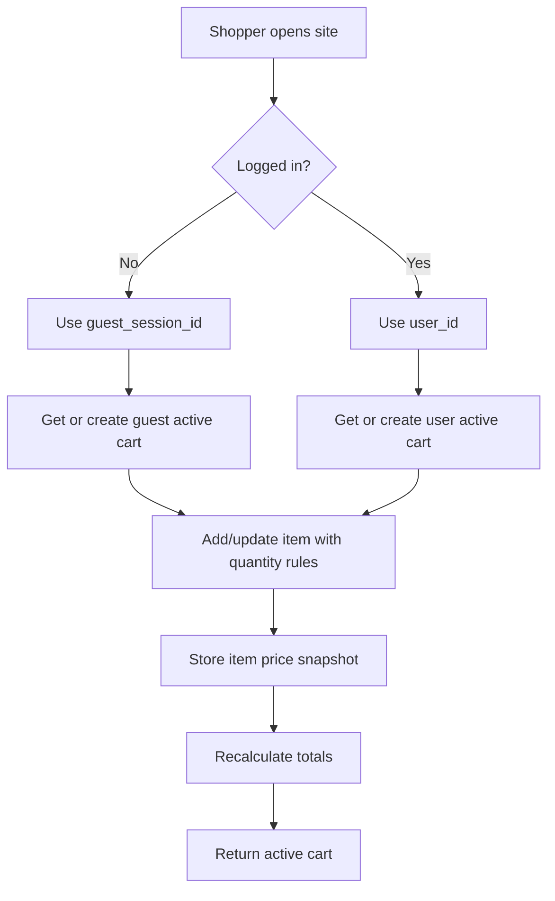

# 🛒 Cart Service - Task 1: Define Cart Rules


## 📌 Task Summary

| Field | Detail |
|---|---|
| Task Name | Define cart rules |
| Source | `docs/01-micro-tasks.md` → `Cart Service` → Task 1 |
| Priority | `P0` foundation/blocker |
| Dependency | Platform foundation |
| Main Goal | Guest cart, logged-in cart, merge, quantity limit, aur price refresh rules define karna |
| Output Type | Documentation-only implementation guide |
| Not Included | MongoDB/Redis setup, collection creation, gRPC implementation, REST handler, coupon engine, checkout implementation |

> **Simple Hinglish goal:** Is task ka purpose Cart Service ke core behavior rules clear karna hai. Abhi actual backend code ya database schema create nahi kiya gaya, kyunki ye Task 1 sirf cart rules define karta hai. Future tasks isi guide ko implementation contract ki tarah use karenge.

---

## ✅ Final Output Created

```text
TaskImplementation/
└── Cart Service/
    └── task1.md
```

### Why this structure?

- `TaskImplementation/` project ke task-wise implementation guides ka central folder hai.
- `Cart Service/` folder Cart Service ke tasks ko group karega.
- `task1.md` sirf **Cart Service - Task 1** ke rules aur implementation guide ke liye banaya gaya hai.

---

## 🧭 Implementation Approach

Is guide ko banane ke liye existing project documentation study ki gayi:

| Document | Kya use kiya gaya |
|---|---|
| `docs/01-micro-tasks.md` | Cart Service Task 1 ka exact scope, dependency, priority |
| `docs/02-system-architecture.md` | Cart Service ka API Gateway, Product Service, MongoDB, Redis ke saath relation |
| `docs/03-folder-structure.md` | Future `backend/services/cart-service` folder layout |
| `docs/04-microservice-design.md` | Cart responsibilities, gRPC methods, REST routes, internal logic |
| `database/mongodb-schema-design.md` | Future cart document shape and indexes reference |
| `api/master-api.json` | Public API and gRPC method mapping |

---

## 🪜 Step-by-Step Implementation

## Step 1: Task Boundary Clear Kiya

Cart Service Task 1 ka kaam **rules define karna** hai, runtime implementation nahi.

### Included

- Guest cart ownership rules
- Logged-in user cart ownership rules
- Guest-to-user cart merge rules
- Quantity limit and validation rules
- Price snapshot and price refresh rules
- Cart status and ownership safety rules
- Future implementation ke liye code examples and flow diagrams

### Not Included

- MongoDB collection create karna
- Redis cache implement karna
- `AddItem`, `RemoveItem`, `MergeGuestCart` ka actual Go code likhna
- gRPC server ya API Gateway route implement karna
- Coupon discount engine implement karna
- Checkout, inventory reserve, ya order creation implement karna

> 🟢 **Reason:** `docs/01-micro-tasks.md` ke according Cart Task 2 DB/cache choice hai, Task 3 collection design hai, Task 4 add item flow hai, Task 7 merge implementation hai. Task 1 sirf behavior contract define karega.

---

## Step 2: Cart Actors Define Kiye

Cart Service do tarah ke shoppers ko support karega:

| Actor | Identity Source | Cart Key | Typical Use |
|---|---|---|---|
| Guest shopper | Browser/session cookie | `guest_session_id` | User login ke bina products cart me add karta hai |
| Logged-in buyer | Auth JWT claims | `user_id` | Authenticated buyer apna persistent cart use karta hai |

### Rule

- Guest cart **session based** hoga.
- Logged-in cart **user based** hoga.
- Ek active cart either `guest_session_id` se identify hoga ya `user_id` se.
- Same cart document me normally dono owner fields active nahi honi chahiye, except merge/audit transition ke short internal step me.

### Ownership Decision Table

| Request Context | Cart Lookup Rule |
|---|---|
| `user_id` available hai | Active logged-in cart by `user_id` |
| `user_id` nahi hai, `guest_session_id` available hai | Active guest cart by `guest_session_id` |
| Dono missing hain | Request reject: cart owner unknown |
| Dono available hain during login | Guest cart ko logged-in cart me merge karo |

---

## Step 3: Cart Status Rules Define Kiye

Cart ka lifecycle predictable hona chahiye, taaki stale carts, checkout carts, aur deleted carts mix na hon.

| Status | Meaning | Mutations Allowed? |
|---|---|---|
| `active` | Current editable cart | ✅ Yes |
| `merged` | Guest cart user cart me merge ho chuka hai | ❌ No |
| `checked_out` | Cart order creation me use ho chuka hai | ❌ No |
| `expired` | Inactive cart cleanup ke liye stale mark hua | ❌ No |
| `abandoned` | Analytics/reporting ke liye inactive cart | ❌ No by default |

### Status Rule

- User ke liye ek time par **sirf one active cart** hona chahiye.
- Guest session ke liye ek time par **sirf one active cart** hona chahiye.
- `merged`, `checked_out`, `expired`, aur `abandoned` carts read-only honge.



---

## Step 4: Guest Cart Rules Define Kiye

Guest cart ka main goal hai login friction kam karna. Buyer product browse karte time login ke bina cart bana sakta hai.

### Guest Cart Rules

| Rule | Decision |
|---|---|
| Owner field | `guest_session_id` required |
| `user_id` | `null` rahega jab tak merge nahi hota |
| Expiry | Guest cart inactive hone ke baad expire hoga |
| Checkout | Checkout ke liye login required hoga |
| Merge | Login ke time guest cart user cart me merge hoga |
| Security | Guest cart access session token/cookie se validate hoga |

### Guest Cart Example

```json
{
  "cart_id": "cart_guest_123",
  "user_id": null,
  "guest_session_id": "sess_abc123",
  "status": "active",
  "items": [],
  "totals": {
    "subtotal": 0,
    "discount": 0,
    "total": 0,
    "currency": "INR"
  }
}
```

### Beginner Explanation

Guest cart browser ke temporary identity se attach hota hai. Agar user login nahi karta, cart session ke saath chalega. Agar user login karta hai, guest cart ka data uske user cart me safely merge hoga.

---

## Step 5: Logged-In Cart Rules Define Kiye

Logged-in cart user ke account se attached rahega, isliye device change hone par bhi cart recover ho sakta hai.

### Logged-In Cart Rules

| Rule | Decision |
|---|---|
| Owner field | `user_id` required |
| `guest_session_id` | Normal active logged-in cart me `null` |
| Persistence | User ke account ke saath durable rahega |
| Access | Sirf same authenticated user apna cart access kar sakta hai |
| Merge support | Login ke time guest cart items user cart me combine honge |

### Logged-In Cart Example

```json
{
  "cart_id": "cart_user_123",
  "user_id": "user_123",
  "guest_session_id": null,
  "status": "active",
  "items": [
    {
      "item_id": "item_1",
      "product_id": "prod_123",
      "variant_id": "var_1",
      "quantity": 2
    }
  ]
}
```

---

## Step 6: Quantity Limit Rules Define Kiye

Quantity rules cart abuse, inventory mismatch, accidental huge orders, aur UX errors se bachate hain.

### Final Quantity Rules

| Rule | Value / Decision |
|---|---|
| Minimum quantity | `1` |
| Maximum quantity per item | `10` |
| Maximum total unique items per cart | `100` |
| Quantity type | Positive integer only |
| Quantity zero | Item remove action ke through handle hoga, update quantity me allowed nahi |
| Negative quantity | Reject |
| Decimal quantity | Reject |

### Why max `10` per item?

- Retail e-commerce me normal buyers ke liye `10` safe default hai.
- Bulk buying later B2B flow me alag rules se support ho sakta hai.
- Inventory reservation aur abuse control easier hota hai.

### Quantity Validation Example

```go
package cart

const (
    MinItemQuantity      = 1
    MaxItemQuantity      = 10
    MaxUniqueCartItems   = 100
)

func ValidateQuantity(quantity int) error {
    if quantity < MinItemQuantity {
        return ErrQuantityTooSmall
    }
    if quantity > MaxItemQuantity {
        return ErrQuantityTooLarge
    }
    return nil
}
```

> 🟡 **Note:** Ye code example future implementation ke liye reference hai. Task 1 me actual Go file create nahi ki gayi.

---

## Step 7: Duplicate Item Rules Define Kiye

Cart me duplicate product variant rows create nahi honi chahiye. Same product and variant repeat add karne par quantity combine hogi.

### Duplicate Matching Key

```text
product_id + variant_id
```

### Rules

| Scenario | Expected Behavior |
|---|---|
| Same `product_id` + same `variant_id` add hota hai | Existing item quantity increase karo |
| Same product but different variant | New cart item create karo |
| Quantity combine max limit cross karta hai | Reject ya max limit validation error return karo |
| Product inactive/deleted hai | Add/update reject karo |

### Merge Quantity Example

```go
func CombineQuantity(existingQty int, incomingQty int) (int, error) {
    nextQty := existingQty + incomingQty
    if nextQty > MaxItemQuantity {
        return existingQty, ErrQuantityTooLarge
    }
    return nextQty, nil
}
```

### Beginner Explanation

Agar user same size/color variant baar-baar add karta hai, cart me duplicate lines nahi banengi. Bas quantity update hogi. Isse cart clean dikhega aur totals calculate karna simple rahega.

---

## Step 8: Price Snapshot Rules Define Kiye

Cart item me product ka price snapshot store hoga, taaki cart page stable dikhe. Lekin final checkout se pehle fresh price validate hoga.

### Price Fields

| Field | Purpose |
|---|---|
| `unit_price.amount` | Cart me add karte time ka item price |
| `unit_price.currency` | Currency, e.g. `INR` |
| `title_snapshot` | Product title cart display ke liye |
| `image_url_snapshot` | Product thumbnail cart display ke liye |
| `price_refreshed_at` | Last fresh product price check timestamp |

### Price Refresh Rules

| Event | Rule |
|---|---|
| Item add | Product Service se current price snapshot lo |
| Cart view | Agar price stale hai to refresh eligible mark karo |
| Quantity update | Current product availability and price validate karo |
| Checkout start | Order Service fresh price and stock validate karega |
| Price changed | User ko updated total dikhaya jayega |
| Product unavailable | Item unavailable mark hoga, checkout block hoga |

### Recommended Staleness Window

| Context | Refresh Decision |
|---|---|
| Cart page open | Price older than `15 minutes` ho to refresh check |
| Checkout start | Always fresh validation |
| Background badge count | Price refresh required nahi |

### Price Refresh Flow



### Price Snapshot Example

```json
{
  "item_id": "item_1",
  "product_id": "prod_123",
  "variant_id": "var_1",
  "seller_id": "seller_456",
  "title_snapshot": "Running Shoes",
  "image_url_snapshot": "https://cdn.example.com/prod_123/main.jpg",
  "unit_price": {
    "amount": 299900,
    "currency": "INR"
  },
  "quantity": 2,
  "price_refreshed_at": "2026-05-24T00:00:00Z"
}
```

---

## Step 9: Cart Merge Rules Define Kiye

Guest cart merge login ke time hoga. Goal hai guest cart items lose na hon aur logged-in cart duplicate na ho.

### Merge Trigger

```text
Guest user adds items → User logs in → Auth/Gateway calls CartService.MergeGuestCart
```

### Merge Rules

| Rule | Decision |
|---|---|
| Source cart | Guest active cart by `guest_session_id` or `guest_cart_id` |
| Target cart | User active cart by `user_id` |
| Duplicate variant | Quantities combine hongi |
| Quantity limit cross | Item merge reject nahi hoga; capped/review behavior define karo |
| Recommended overflow behavior | Cap at max quantity and add warning |
| Source cart after merge | Status `merged` |
| Target cart after merge | Status `active`, owner `user_id` |
| Audit | Merge event future `cart_audit_events` me record hoga |

### Overflow Decision

Agar guest cart me quantity `8` hai aur user cart me same variant quantity `5` hai:

```text
8 + 5 = 13
Max allowed = 10
Final quantity = 10
Warning = "Quantity adjusted to max allowed limit"
```

Ye user-friendly hai kyunki login ke baad cart fail nahi hota, but system max limit enforce karta hai.

### Merge Flow Diagram



### Merge Pseudocode

```go
func MergeGuestCart(userCart Cart, guestCart Cart) (Cart, []CartWarning) {
    warnings := []CartWarning{}

    for _, guestItem := range guestCart.Items {
        existing := userCart.FindItemByVariant(guestItem.ProductID, guestItem.VariantID)
        if existing == nil {
            userCart.Items = append(userCart.Items, guestItem)
            continue
        }

        combinedQty := existing.Quantity + guestItem.Quantity
        if combinedQty > MaxItemQuantity {
            existing.Quantity = MaxItemQuantity
            warnings = append(warnings, CartWarning{
                Code: "QUANTITY_CAPPED",
                ItemID: existing.ItemID,
            })
            continue
        }

        existing.Quantity = combinedQty
    }

    guestCart.Status = CartStatusMerged
    userCart.RecalculateTotals()
    return userCart, warnings
}
```

> 🟡 **Note:** Ye sirf future implementation example hai. Task 1 me actual merge usecase file create nahi ki gayi.

---

## Step 10: Totals Calculation Rules Define Kiye

Cart total simple and deterministic hona chahiye.

### Formula

```text
subtotal = sum(unit_price.amount * quantity)
discount = coupon preview discount, if valid
total = subtotal - discount
```

### Rules

| Rule | Decision |
|---|---|
| Currency | Cart ke items same currency me hone chahiye |
| Amount type | Integer minor units, e.g. paise/cents |
| Floating point | Avoid karo |
| Discount finalization | Order Service checkout time final validate karega |
| Cart total below zero | Never allowed |

### Total Calculation Example

```go
func CalculateSubtotal(items []CartItem) int64 {
    var subtotal int64
    for _, item := range items {
        subtotal += item.UnitPrice.Amount * int64(item.Quantity)
    }
    return subtotal
}
```

### Beginner Explanation

Money ke liye float use nahi karna chahiye, kyunki rounding bugs aa sakte hain. Isliye `2999.00 INR` ko `299900` paise/minor units me store karna safer hai.

---

## Step 11: Coupon Boundary Define Kiya

Coupon preview Cart Service me visible ho sakta hai, but final coupon apply checkout/order phase me validate hoga.

| Area | Responsibility |
|---|---|
| Cart Service | Coupon preview dikhana, estimated discount calculate karna |
| CMS Service | Coupon rule validate karna |
| Order Service | Final checkout amount lock karna |

### Rule

- Cart me coupon preview **temporary** hoga.
- Coupon preview successful hone ka matlab final checkout guarantee nahi hai.
- Checkout ke time coupon expiry, usage limit, min cart amount, product/category/seller scope fresh validate honge.

> 🔵 **Scope note:** Actual coupon preview implementation Cart Service Task 6 me aayega. Task 1 me sirf boundary define ki gayi hai.

---

## Step 12: Cart Expiry Rule Define Kiya

Expiry ka detailed cleanup job Task 8 me aayega, but Task 1 me basic rule clear hona zaruri hai.

| Cart Type | Recommended Expiry |
|---|---|
| Guest cart | `30 days` inactive |
| Logged-in active cart | `90 days` inactive |
| Merged guest cart | Immediately read-only and cleanup eligible |
| Checked-out cart | Retain for audit/reference as per retention policy |

### Rule

- Expired cart checkout ke liye use nahi hoga.
- Expired cart ko mutate nahi karna.
- User agar wapas aata hai to new active cart create hoga.

---

## Step 13: Validation and Error Rules Define Kiye

Validation rules early define karne se APIs consistent rahengi.

| Error Case | Expected Error |
|---|---|
| Missing `product_id` | `INVALID_PRODUCT_ID` |
| Missing `variant_id` | `INVALID_VARIANT_ID` |
| Quantity `< 1` | `QUANTITY_TOO_SMALL` |
| Quantity `> 10` | `QUANTITY_TOO_LARGE` |
| Cart owner missing | `CART_OWNER_REQUIRED` |
| Cart not found | `CART_NOT_FOUND` |
| Cart not active | `CART_NOT_ACTIVE` |
| Product unavailable | `PRODUCT_UNAVAILABLE` |
| Price changed | `PRICE_CHANGED` warning, not always hard error |

### API Input Reference

`api/master-api.json` ke according add item input:

```json
{
  "product_id": "prod_123",
  "variant_id": "var_1",
  "quantity": 1
}
```

Quantity update input:

```json
{
  "quantity": 2
}
```

---

## Step 14: Security and Ownership Rules Define Kiye

Cart data user-specific hai, isliye ownership strict honi chahiye.

### Security Rules

| Rule | Decision |
|---|---|
| Logged-in cart access | JWT `user_id` must match cart `user_id` |
| Guest cart access | Valid `guest_session_id` required |
| Cross-user access | Always reject |
| Admin direct mutation | Not allowed in normal cart APIs |
| Seller access | Seller cannot read buyer carts directly |
| Internal service access | gRPC metadata auth required in future implementation |

### Reason

Cart me buyer intent, product choices, coupon attempts, aur pricing snapshot hote hain. Ye private data hai, isliye cart ownership bypass high-risk bug mana jayega.

---

## Step 15: API and gRPC Boundary Align Kiya

Task 1 code implement nahi karta, but future routes ke behavior rules align karta hai.

| REST API | gRPC Method | Auth | Task 1 Rule Impact |
|---|---|---|---|
| `GET /api/v1/cart` | `CartService.GetCart` | buyer | Owner lookup and price refresh rule |
| `POST /api/v1/cart/items` | `CartService.AddItem` | buyer | Quantity, duplicate item, price snapshot rules |
| `PATCH /api/v1/cart/items/{item_id}` | `CartService.UpdateItemQuantity` | buyer | Quantity validation, price refresh rule |
| `DELETE /api/v1/cart/items/{item_id}` | `CartService.RemoveItem` | buyer | Active cart ownership rule |
| `POST /api/v1/cart/merge` | `CartService.MergeGuestCart` | buyer | Guest-to-user merge rule |
| `POST /api/v1/cart/coupons/preview` | `CartService.ApplyCouponPreview` | buyer | Coupon boundary rule |

---

## 🧱 Clean Folder Structure

### Created in this task

```text
TaskImplementation/
└── Cart Service/
    └── task1.md
```

### Future Cart Service code structure

This is the target structure from project docs. It is **not created in Task 1**.

```text
backend/
└── services/
    └── cart-service/
        ├── cmd/
        │   └── server/
        │       └── main.go
        ├── internal/
        │   ├── domain/
        │   │   └── cart.go
        │   ├── usecase/
        │   │   ├── add_item.go
        │   │   ├── remove_item.go
        │   │   ├── merge_cart.go
        │   │   └── price_cart.go
        │   ├── repository/
        │   │   ├── mongo_cart_repository.go
        │   │   └── redis_cart_cache.go
        │   └── transport/
        │       └── grpc/
        └── deploy/
```

---

## 🏗️ Architecture Diagram



> 🔵 **Task 1 focus:** Diagram me MongoDB/Redis shown hain because architecture docs me Cart Service ke dependencies defined hain. Actual DB/cache setup Task 2 and Task 3 me hoga.

---

## 🔄 Main Cart Flow



---

## 🧪 Rule Test Cases

Future implementation me ye test cases cover karne chahiye:

| Test Case | Expected Result |
|---|---|
| Guest adds item with quantity `1` | Guest active cart created |
| Guest adds same variant twice | Quantity combines |
| User adds quantity `0` | Reject `QUANTITY_TOO_SMALL` |
| User adds quantity `11` | Reject `QUANTITY_TOO_LARGE` |
| Guest cart merges into empty user cart | All items copied |
| Guest cart merges with duplicate user item | Quantity combines/caps at `10` |
| Expired cart mutation request | Reject `CART_NOT_ACTIVE` |
| Checkout starts with stale price | Fresh Product Service validation required |
| Product unavailable during refresh | Item marked unavailable |

### Example Unit Test Shape

```go
func TestValidateQuantityRejectsTooLargeQuantity(t *testing.T) {
    err := ValidateQuantity(11)
    require.ErrorIs(t, err, ErrQuantityTooLarge)
}
```

> 🟡 **Note:** Test code future implementation ke liye example hai. Task 1 me test file create nahi ki gayi.

---

## 🧰 External Libraries / Tools Used

Task 1 me koi runtime backend library install nahi ki gayi. Ye markdown documentation task hai.

| Tool | What it is | Why used | Install / Use |
|---|---|---|---|
| Markdown | Documentation format | Beginner-friendly structured guide likhne ke liye | GitHub/GitLab/VS Code me directly render hota hai |
| Mermaid | Markdown-friendly diagram syntax | Architecture, lifecycle, sequence flow diagrams ke liye | GitHub supports it automatically. Local render ke liye optional: `npm install -g @mermaid-js/mermaid-cli` |
| Shields.io badges | Badge image service | Task status, priority, scope visually clear karne ke liye | Install nahi chahiye. Markdown image URL use hota hai |

### Mermaid local usage example

```bash
npm install -g @mermaid-js/mermaid-cli
mmdc -i cart-flow.mmd -o cart-flow.png
```

> 🟢 **No required install:** Is repository me Task 1 complete karne ke liye koi dependency install karna necessary nahi hai.

---

## 📋 Final Cart Rules Checklist

| Rule Area | Status |
|---|---|
| Guest cart identity rule defined | ✅ |
| Logged-in cart identity rule defined | ✅ |
| One active cart per owner rule defined | ✅ |
| Cart statuses defined | ✅ |
| Quantity min/max defined | ✅ |
| Duplicate variant combine rule defined | ✅ |
| Guest-to-user merge rule defined | ✅ |
| Price snapshot rule defined | ✅ |
| Price refresh rule defined | ✅ |
| Coupon boundary defined | ✅ |
| Expiry baseline defined | ✅ |
| Security ownership rule defined | ✅ |
| Out-of-scope implementation clearly marked | ✅ |

---

## 🚫 Out of Scope for Task 1

| Not Implemented | Planned Task |
|---|---|
| MongoDB plus Redis final setup | Cart Service Task 2 |
| `carts` collection schema creation | Cart Service Task 3 |
| Add item actual usecase | Cart Service Task 4 |
| Remove item actual usecase | Cart Service Task 5 |
| Coupon preview actual logic | Cart Service Task 6 |
| Merge cart actual service implementation | Cart Service Task 7 |
| Cleanup/expiry job | Cart Service Task 8 |
| Checkout conversion | Order Service Task 3 |

> 🔴 **Reason:** Is task ka scope sirf cart behavior rules define karna hai. Agar isme database, APIs, ya service code implement kar diya jaye to later tasks ka boundary break ho jayega.

---

## ✅ Final Task 1 Standard

Cart Service ke liye final rule contract:

1. Guest carts `guest_session_id` se identify honge.
2. Logged-in carts `user_id` se identify honge.
3. One owner ke liye one active cart rule follow hoga.
4. Same product variant duplicate row nahi banayega; quantity combine hogi.
5. Quantity `1` se `10` ke beech allowed hogi.
6. Cart me product title, image, and unit price snapshot store hoga.
7. Cart view/update par stale prices refresh eligible honge.
8. Checkout se pehle fresh price and stock validation mandatory hogi.
9. Guest login ke baad guest cart user cart me merge hoga.
10. Merged/expired/checked-out carts read-only rahenge.

Task 1 complete hai as a structured cart rules guide. Future Cart Service tasks isi rule contract ke basis par MongoDB/Redis, collection schema, usecases, APIs, tests, aur cleanup jobs implement karenge.
