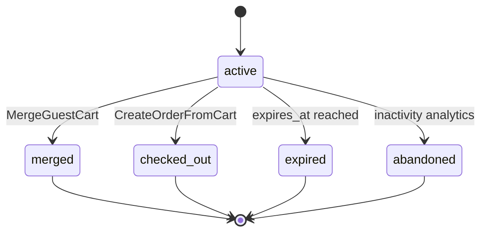
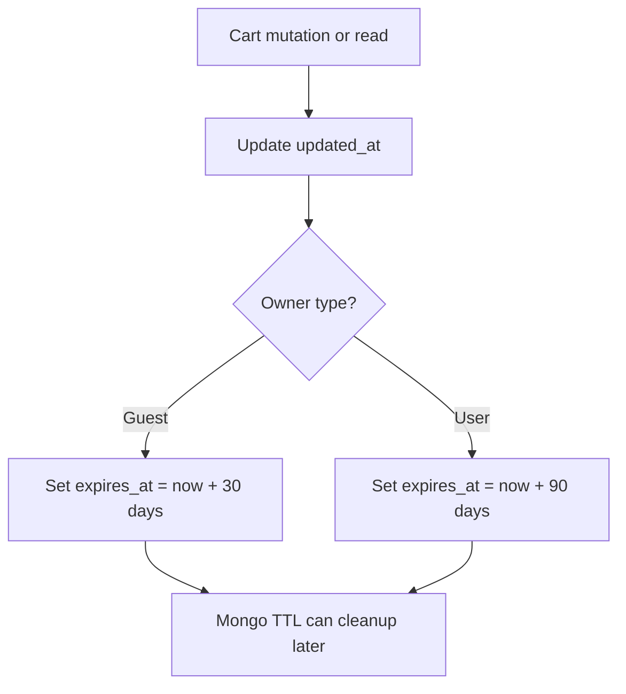
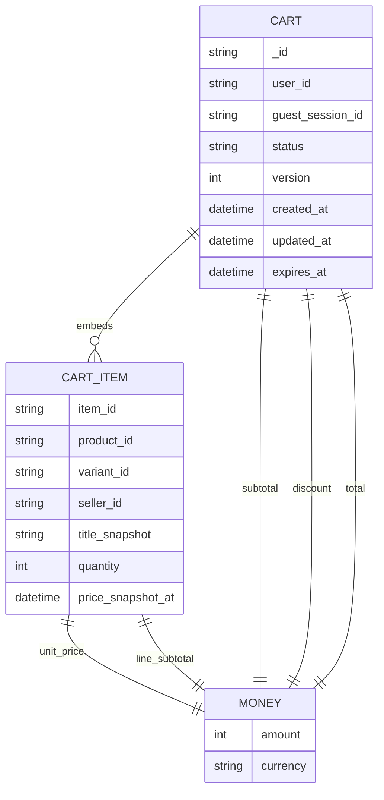
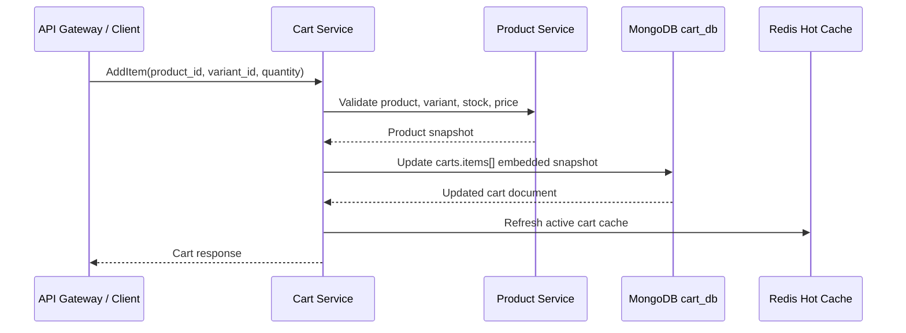
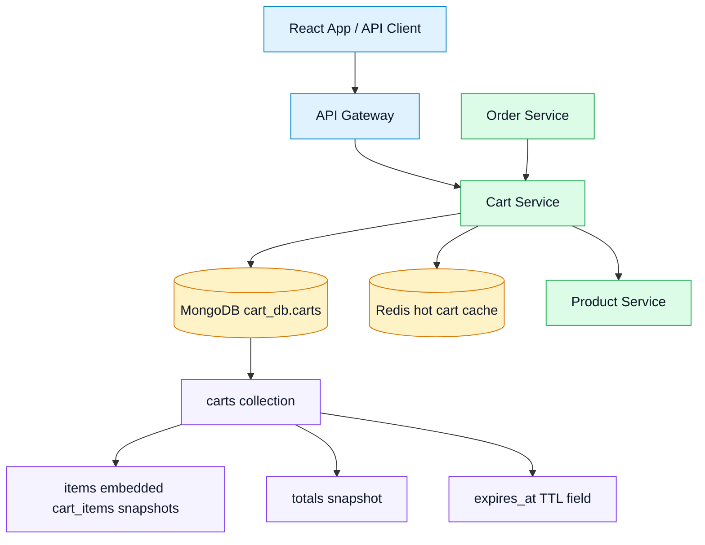

# 🛒 Cart Service - Task 3: Cart Collections


## 📌 Task Summary

| Field | Detail |
|---|---|
| Task Name | Cart collections |
| Source | `docs/01-micro-tasks.md` → `Cart Service` → Task 3 |
| Priority | `P0` foundation/blocker |
| Dependency | Cart Service Task 2: Choose MongoDB plus Redis |
| Main Goal | `carts` collection aur embedded `cart_items` snapshots ka schema design karna |
| Output Type | Documentation-only implementation guide |
| Not Included | Actual MongoDB collection create/run karna, repository code likhna, add/remove item flow implement karna, coupon logic banana |

> **Simple Hinglish goal:** Is task me Cart Service ke MongoDB document ka final structure define kiya gaya hai. `carts` collection source of truth hogi, aur cart ke items same document ke andar embedded `items[]` array me rahenge. Is file me schema, indexes, examples, diagrams, aur future implementation reference diya gaya hai, but actual backend code ya DB command run nahi kiya gaya.

---

## ✅ Final Output Created

```text
TaskImplementation/
└── Cart Service/
    ├── task1.md
    ├── task2.md
    └── task3.md
```

### Why this structure?

- `TaskImplementation/` project ke task-wise implementation guides ka central folder hai.
- `Cart Service/` Cart Service ke saare task guides ko group karta hai.
- `task3.md` sirf **Cart Service - Task 3** ka MongoDB collection/schema guide hai.

---

## 🧭 Implementation Approach

Is guide ko banane se pehle existing project documentation study ki gayi:

| Document | Kya use kiya gaya |
|---|---|
| `docs/01-micro-tasks.md` | Task 3 ka exact scope: `carts`, `cart_items`, embedded item snapshots design |
| `TaskImplementation/Cart Service/task1.md` | Cart rules: owner, status, quantity limit, price snapshot, merge behavior |
| `TaskImplementation/Cart Service/task2.md` | MongoDB source of truth and Redis hot cache decision |
| `docs/04-microservice-design.md` | Cart responsibilities, collections, gRPC methods, REST routes |
| `docs/05-database-design.md` | Cart = MongoDB + Redis service-owned data strategy |
| `database/mongodb-schema-design.md` | Existing `cart_db`, `carts` document, indexes, TTL reference |
| `api/master-api.json` | Cart API response and request contract mapping |

---

## 🪜 Step-by-Step Implementation

## Step 1: Task Boundary Clear Kiya

Cart Service Task 3 ka kaam **MongoDB schema and collection design** hai.

### Included

- `cart_db` database ka ownership define karna
- `carts` collection ka document structure define karna
- Embedded `cart_items` snapshots ka schema define karna
- Money, totals, owner, status, timestamps, expiry fields define karna
- Indexes and uniqueness rules define karna
- MongoDB validation and future repository structs ka reference dena
- Diagrams, sample documents, and query examples document karna

### Not Included

- MongoDB me collection actually create karna
- Actual `mongo_cart_repository.go` file banana
- Redis cache implementation
- `AddItem`, `UpdateItemQuantity`, `RemoveItem` usecases implement karna
- Coupon preview business logic implement karna
- Guest cart merge implementation
- Expiry cleanup scheduler/job banana

> 🟢 **Reason:** `docs/01-micro-tasks.md` ke according Task 3 sirf collection design hai. Add item Task 4, remove item Task 5, coupon preview Task 6, merge Task 7, aur cleanup Task 8 me aayega.

---

## Step 2: Database Ownership Define Kiya

Cart Service apna MongoDB database own karega:

```text
Database: cart_db
Primary collection: carts
```

### Ownership Rule

```text
Sirf Cart Service direct cart_db access karega.
Dusri services gRPC/API ke through Cart Service se data lengi.
```

### Why?

| Reason | Explanation |
|---|---|
| Service boundary clean | Order, Wishlist, Gateway direct MongoDB read nahi karenge |
| Business rules centralized | Quantity, status, owner checks Cart Service me rahenge |
| Schema change safer | Cart schema badalne par dusri services break nahi hongi |
| Audit/debug easy | Cart mutation path ek service ke through control hoga |

---

## Step 3: Collection Strategy Decide Kiya

Task detail me `carts`, `cart_items`, aur embedded snapshots mentioned hain. MongoDB ke liye final design ye hai:

```text
carts collection
└── items[] embedded cart_items snapshots
```

### Final Decision

| Option | Decision | Reason |
|---|---|---|
| Separate `cart_items` collection | ❌ MVP me nahi | Cart read ke liye extra query/join style lookup avoid karna hai |
| Embedded `items[]` inside `carts` | ✅ Yes | Cart page normally full cart load karta hai, embedded document fast and simple hai |
| Future split to `cart_items` collection | 🟡 Optional later | Agar cart item count unusually large ho ya item-level analytics heavy ho |

> 🟣 **Important:** Is guide me `cart_items` ka matlab embedded item subdocuments hai. Separate MongoDB `cart_items` collection Task 3 me create nahi ki ja rahi.

### Why embedded item snapshots?

- Cart read mostly full cart ke saath hota hai.
- One active cart me max `100` unique items ka Task 1 rule already hai.
- Product title, image, price snapshot cart page ko stable UX dete hain.
- MongoDB document model nested cart items ke liye natural fit hai.

---

## Step 4: `carts` Collection Document Shape Define Kiya

`carts` collection ka ek document complete cart snapshot represent karega.

### High-Level Shape

```json
{
  "_id": "cart_123",
  "user_id": "user_123",
  "guest_session_id": null,
  "status": "active",
  "items": [],
  "coupon_code": null,
  "coupon_preview": null,
  "totals": {},
  "version": 1,
  "created_at": "2026-05-24T00:00:00Z",
  "updated_at": "2026-05-24T00:00:00Z",
  "expires_at": "2026-08-22T00:00:00Z"
}
```

### Field Details

| Field | Type | Required | Meaning |
|---|---|---:|---|
| `_id` | string | ✅ | Cart id, API response me `cart_id` banega |
| `user_id` | string/null | Conditional | Logged-in buyer cart owner |
| `guest_session_id` | string/null | Conditional | Guest cart owner |
| `status` | string | ✅ | `active`, `merged`, `checked_out`, `expired`, `abandoned` |
| `items` | array | ✅ | Embedded cart item snapshots |
| `coupon_code` | string/null | ❌ | Future coupon preview ke liye selected code |
| `coupon_preview` | object/null | ❌ | Future Task 6 discount preview snapshot |
| `totals` | object | ✅ | Subtotal, discount, total, currency |
| `version` | int | ✅ | Optimistic concurrency ke liye version counter |
| `created_at` | datetime | ✅ | Cart create time |
| `updated_at` | datetime | ✅ | Last mutation time |
| `expires_at` | datetime | ✅ | TTL cleanup reference |
| `merged_into_cart_id` | string/null | ❌ | Guest cart merge ke baad target cart reference |
| `checked_out_order_id` | string/null | ❌ | Checkout ke baad created order reference |

### Owner Rule

Cart active state me either `user_id` hoga ya `guest_session_id`:

```text
Logged-in cart: user_id present, guest_session_id null
Guest cart:     guest_session_id present, user_id null
```

Dono missing honge to document invalid maana jayega.

---

## Step 5: Embedded `cart_items` Snapshot Schema Define Kiya

Cart item product ka live reference nahi, balki cart-time snapshot rakhega.

### Embedded Item Shape

```json
{
  "item_id": "item_1",
  "product_id": "prod_123",
  "variant_id": "var_1",
  "seller_id": "seller_456",
  "sku_snapshot": "SHOE-BLK-9",
  "title_snapshot": "Running Shoes",
  "image_url_snapshot": "https://cdn.example.com/prod_123/main.jpg",
  "variant_snapshot": {
    "size": "9",
    "color": "Black"
  },
  "unit_price": {
    "amount": 299900,
    "currency": "INR"
  },
  "quantity": 2,
  "line_subtotal": {
    "amount": 599800,
    "currency": "INR"
  },
  "price_snapshot_at": "2026-05-24T00:00:00Z",
  "added_at": "2026-05-24T00:00:00Z",
  "updated_at": "2026-05-24T00:00:00Z"
}
```

### Item Field Details

| Field | Type | Required | Meaning |
|---|---|---:|---|
| `item_id` | string | ✅ | Cart line item id |
| `product_id` | string | ✅ | Product Service ka product id |
| `variant_id` | string | ✅ | Product variant id |
| `seller_id` | string | ✅ | Seller ownership reference |
| `sku_snapshot` | string/null | ❌ | SKU display/debug snapshot |
| `title_snapshot` | string | ✅ | Cart UI title |
| `image_url_snapshot` | string/null | ❌ | Cart thumbnail |
| `variant_snapshot` | object | ❌ | Size/color/attributes display snapshot |
| `unit_price` | object | ✅ | Add-time price snapshot |
| `quantity` | int | ✅ | Quantity, min `1`, max `10` |
| `line_subtotal` | object | ✅ | `unit_price.amount * quantity` |
| `price_snapshot_at` | datetime | ✅ | Price snapshot freshness check ke liye |
| `added_at` | datetime | ✅ | First add time |
| `updated_at` | datetime | ✅ | Last quantity/snapshot update time |

### Duplicate Item Rule

Same cart me same `product_id + variant_id` duplicate item line nahi banegi.

```text
Same product_id + same variant_id => quantity combine/update
Same product_id + different variant_id => new item line
```

---

## Step 6: Money and Totals Structure Define Kiya

Money values integer minor units me store honge.

```text
INR 2999.00 => amount: 299900
```

### Money Object

```json
{
  "amount": 299900,
  "currency": "INR"
}
```

### Totals Object

```json
{
  "subtotal": {
    "amount": 599800,
    "currency": "INR"
  },
  "discount": {
    "amount": 0,
    "currency": "INR"
  },
  "total": {
    "amount": 599800,
    "currency": "INR"
  },
  "currency": "INR",
  "item_count": 2,
  "unique_item_count": 1
}
```

### Totals Rules

| Rule | Decision |
|---|---|
| Currency | Ek cart me same currency items honge |
| Subtotal | All `line_subtotal.amount` ka sum |
| Discount | Coupon preview discount, default `0` |
| Total | `subtotal - discount`, never below `0` |
| Item count | Quantities ka sum |
| Unique item count | `items.length` |

> 🔵 **API mapping note:** `api/master-api.json` me `subtotal`, `discount`, aur `total` `Money` response fields hain. MongoDB me `totals.subtotal`, `totals.discount`, `totals.total` se API response map hoga.

---

## Step 7: Full Logged-In Cart Example Banaya

```json
{
  "_id": "cart_user_123",
  "user_id": "user_123",
  "guest_session_id": null,
  "status": "active",
  "items": [
    {
      "item_id": "item_1",
      "product_id": "prod_123",
      "variant_id": "var_1",
      "seller_id": "seller_456",
      "sku_snapshot": "SHOE-BLK-9",
      "title_snapshot": "Running Shoes",
      "image_url_snapshot": "https://cdn.example.com/prod_123/main.jpg",
      "variant_snapshot": {
        "size": "9",
        "color": "Black"
      },
      "unit_price": {
        "amount": 299900,
        "currency": "INR"
      },
      "quantity": 2,
      "line_subtotal": {
        "amount": 599800,
        "currency": "INR"
      },
      "price_snapshot_at": "2026-05-24T00:00:00Z",
      "added_at": "2026-05-24T00:00:00Z",
      "updated_at": "2026-05-24T00:00:00Z"
    }
  ],
  "coupon_code": null,
  "coupon_preview": null,
  "totals": {
    "subtotal": {
      "amount": 599800,
      "currency": "INR"
    },
    "discount": {
      "amount": 0,
      "currency": "INR"
    },
    "total": {
      "amount": 599800,
      "currency": "INR"
    },
    "currency": "INR",
    "item_count": 2,
    "unique_item_count": 1
  },
  "version": 1,
  "created_at": "2026-05-24T00:00:00Z",
  "updated_at": "2026-05-24T00:00:00Z",
  "expires_at": "2026-08-22T00:00:00Z"
}
```

---

## Step 8: Full Guest Cart Example Banaya

```json
{
  "_id": "cart_guest_123",
  "user_id": null,
  "guest_session_id": "sess_abc123",
  "status": "active",
  "items": [],
  "coupon_code": null,
  "coupon_preview": null,
  "totals": {
    "subtotal": {
      "amount": 0,
      "currency": "INR"
    },
    "discount": {
      "amount": 0,
      "currency": "INR"
    },
    "total": {
      "amount": 0,
      "currency": "INR"
    },
    "currency": "INR",
    "item_count": 0,
    "unique_item_count": 0
  },
  "version": 1,
  "created_at": "2026-05-24T00:00:00Z",
  "updated_at": "2026-05-24T00:00:00Z",
  "expires_at": "2026-06-23T00:00:00Z"
}
```

### Beginner Explanation

Guest cart user account se linked nahi hota. Isliye `user_id` null hai aur `guest_session_id` present hai. Login ke baad Task 7 me ye guest cart user cart me merge hoga.

---

## Step 9: Cart Status Fields Design Kiye

Task 1 ke lifecycle ko schema me support karne ke liye `status` field use hoga.

| Status | Meaning | Schema Impact |
|---|---|---|
| `active` | Current editable cart | Mutations allowed |
| `merged` | Guest cart user cart me merge ho chuka | `merged_into_cart_id` set ho sakta hai |
| `checked_out` | Cart se order create ho chuka | `checked_out_order_id` set ho sakta hai |
| `expired` | Cart stale ho chuka | Mutations blocked |
| `abandoned` | Inactive analytics state | Mutations blocked by default |



---

## Step 10: Indexes Design Kiye

Indexes fast lookup, one active cart rule, aur cleanup ke liye important hain.

### Required Indexes

```javascript
db.carts.createIndex(
  { user_id: 1, status: 1 },
  { name: "idx_carts_user_status" }
)

db.carts.createIndex(
  { guest_session_id: 1, status: 1 },
  { name: "idx_carts_guest_status" }
)

db.carts.createIndex(
  { expires_at: 1 },
  {
    name: "idx_carts_expires_at_ttl",
    expireAfterSeconds: 0
  }
)
```

### One Active Cart Per Owner Indexes

Task 1 rule ke hisaab se ek owner ke liye one active cart hona chahiye. Iske liye future implementation me partial unique indexes use karne chahiye:

```javascript
db.carts.createIndex(
  { user_id: 1 },
  {
    name: "uniq_active_cart_per_user",
    unique: true,
    partialFilterExpression: {
      status: "active",
      user_id: { $type: "string" }
    }
  }
)

db.carts.createIndex(
  { guest_session_id: 1 },
  {
    name: "uniq_active_cart_per_guest_session",
    unique: true,
    partialFilterExpression: {
      status: "active",
      guest_session_id: { $type: "string" }
    }
  }
)
```

### Optional Query Indexes

```javascript
db.carts.createIndex(
  { "items.product_id": 1, "items.variant_id": 1 },
  { name: "idx_carts_item_product_variant" }
)

db.carts.createIndex(
  { updated_at: -1 },
  { name: "idx_carts_updated_at" }
)
```

### Index Purpose Table

| Index | Why used |
|---|---|
| `idx_carts_user_status` | Logged-in active cart fast find |
| `idx_carts_guest_status` | Guest active cart fast find |
| `idx_carts_expires_at_ttl` | Expired cart cleanup support |
| `uniq_active_cart_per_user` | Same user ke duplicate active carts block |
| `uniq_active_cart_per_guest_session` | Same guest session ke duplicate active carts block |
| `idx_carts_item_product_variant` | Future debugging/item lookup support |
| `idx_carts_updated_at` | Future abandoned cart/cleanup queries |

> 🟡 **Note:** TTL index MongoDB deletion ko eventually handle karta hai, exact second par delete guarantee nahi hoti. Business logic ko `expires_at <= now` cart ko inactive/expired treat karna chahiye.

---

## Step 11: MongoDB Collection Validation Plan Kiya

Future implementation me MongoDB JSON Schema validator use kiya ja sakta hai. Ye example reference hai, is task me run nahi kiya gaya.

```javascript
db.createCollection("carts", {
  validator: {
    $jsonSchema: {
      bsonType: "object",
      required: ["_id", "status", "items", "totals", "version", "created_at", "updated_at", "expires_at"],
      properties: {
        _id: {
          bsonType: "string"
        },
        user_id: {
          bsonType: ["string", "null"]
        },
        guest_session_id: {
          bsonType: ["string", "null"]
        },
        status: {
          enum: ["active", "merged", "checked_out", "expired", "abandoned"]
        },
        items: {
          bsonType: "array",
          maxItems: 100
        },
        version: {
          bsonType: "int",
          minimum: 1
        }
      }
    }
  }
})
```

### Why validator useful hai?

- Invalid status DB me enter nahi hota.
- `items` array max limit guard milta hai.
- Required fields missing hone par early error milta hai.
- Schema mistakes development phase me jaldi catch hoti hain.

> 🔴 **Important:** Mongo validator business rules ka replacement nahi hai. Quantity max, owner checks, duplicate variant logic, totals recalculation still Cart Service code me enforce honge.

---

## Step 12: Future Go Domain Structs Design Kiye

Ye code examples future implementation ke liye reference hain. Is Task 3 me ye files create nahi ki gayi.

```go
package domain

import "time"

type CartStatus string

const (
	CartStatusActive     CartStatus = "active"
	CartStatusMerged     CartStatus = "merged"
	CartStatusCheckedOut CartStatus = "checked_out"
	CartStatusExpired    CartStatus = "expired"
	CartStatusAbandoned  CartStatus = "abandoned"
)

type Money struct {
	Amount   int64  `bson:"amount" json:"amount"`
	Currency string `bson:"currency" json:"currency"`
}

type Cart struct {
	ID                string      `bson:"_id" json:"cart_id"`
	UserID            *string     `bson:"user_id,omitempty" json:"user_id,omitempty"`
	GuestSessionID    *string     `bson:"guest_session_id,omitempty" json:"guest_session_id,omitempty"`
	Status            CartStatus  `bson:"status" json:"status"`
	Items             []CartItem  `bson:"items" json:"items"`
	CouponCode        *string     `bson:"coupon_code,omitempty" json:"coupon_code,omitempty"`
	CouponPreview     *CouponView `bson:"coupon_preview,omitempty" json:"coupon_preview,omitempty"`
	Totals            CartTotals  `bson:"totals" json:"totals"`
	Version           int         `bson:"version" json:"version"`
	CreatedAt         time.Time   `bson:"created_at" json:"created_at"`
	UpdatedAt         time.Time   `bson:"updated_at" json:"updated_at"`
	ExpiresAt         time.Time   `bson:"expires_at" json:"expires_at"`
	MergedIntoCartID   *string     `bson:"merged_into_cart_id,omitempty" json:"merged_into_cart_id,omitempty"`
	CheckedOutOrderID  *string     `bson:"checked_out_order_id,omitempty" json:"checked_out_order_id,omitempty"`
}
```

### Cart Item Struct

```go
package domain

import "time"

type CartItem struct {
	ItemID           string            `bson:"item_id" json:"item_id"`
	ProductID        string            `bson:"product_id" json:"product_id"`
	VariantID        string            `bson:"variant_id" json:"variant_id"`
	SellerID         string            `bson:"seller_id" json:"seller_id"`
	SKUSnapshot      *string           `bson:"sku_snapshot,omitempty" json:"sku_snapshot,omitempty"`
	TitleSnapshot    string            `bson:"title_snapshot" json:"title_snapshot"`
	ImageURLSnapshot *string           `bson:"image_url_snapshot,omitempty" json:"image_url_snapshot,omitempty"`
	VariantSnapshot  map[string]string `bson:"variant_snapshot,omitempty" json:"variant_snapshot,omitempty"`
	UnitPrice        Money             `bson:"unit_price" json:"unit_price"`
	Quantity         int               `bson:"quantity" json:"quantity"`
	LineSubtotal     Money             `bson:"line_subtotal" json:"line_subtotal"`
	PriceSnapshotAt  time.Time         `bson:"price_snapshot_at" json:"price_snapshot_at"`
	AddedAt          time.Time         `bson:"added_at" json:"added_at"`
	UpdatedAt        time.Time         `bson:"updated_at" json:"updated_at"`
}
```

### Totals Struct

```go
package domain

type CartTotals struct {
	Subtotal        Money  `bson:"subtotal" json:"subtotal"`
	Discount        Money  `bson:"discount" json:"discount"`
	Total           Money  `bson:"total" json:"total"`
	Currency        string `bson:"currency" json:"currency"`
	ItemCount       int    `bson:"item_count" json:"item_count"`
	UniqueItemCount int    `bson:"unique_item_count" json:"unique_item_count"`
}

type CouponView struct {
	CouponID string `bson:"coupon_id" json:"coupon_id"`
	Code     string `bson:"code" json:"code"`
	Valid    bool   `bson:"valid" json:"valid"`
	Discount Money  `bson:"discount" json:"discount"`
	Reason   string `bson:"reason,omitempty" json:"reason,omitempty"`
}
```

---

## Step 13: Future Repository Query Examples Define Kiye

Ye examples future `mongo_cart_repository.go` implementation me use honge. Is task me actual repository file nahi banayi gayi.

### Find Active Cart by User

```go
filter := bson.M{
	"user_id": userID,
	"status": "active",
}
```

### Find Active Guest Cart

```go
filter := bson.M{
	"guest_session_id": guestSessionID,
	"status": "active",
}
```

### Optimistic Update Filter

```go
filter := bson.M{
	"_id":     cartID,
	"status":  "active",
	"version": currentVersion,
}

update := bson.M{
	"$set": bson.M{
		"items":      updatedItems,
		"totals":     updatedTotals,
		"updated_at": now,
		"expires_at": newExpiry,
	},
	"$inc": bson.M{
		"version": 1,
	},
}
```

### Why `version` useful hai?

Cart fast mutable data hai. Agar buyer ek hi time multiple tabs se quantity update kare, `version` stale update detect karne me help karega.

```text
Tab A loaded version 1
Tab B loaded version 1
Tab A updates cart -> version 2
Tab B tries update with version 1 -> conflict detect
```

---

## Step 14: Expiry Design Define Kiya

Task 1 rules:

| Cart Type | Expiry |
|---|---|
| Guest cart | `30 days` inactive |
| Logged-in active cart | `90 days` inactive |
| Merged guest cart | Cleanup eligible |
| Checked-out cart | Retain for audit/reference as policy decides |

### Schema Support

```json
{
  "expires_at": "2026-08-22T00:00:00Z",
  "updated_at": "2026-05-24T00:00:00Z",
  "status": "active"
}
```

### Expiry Flow



> 🔵 **Scope note:** Actual cleanup job Cart Service Task 8 me aayega. Task 3 sirf `expires_at` field and TTL index design karta hai.

---

## Step 15: API Response Mapping Define Kiya

MongoDB document internal fields ko API response me clean shape me map kiya jayega.

### MongoDB to API Mapping

| MongoDB Field | API Field |
|---|---|
| `_id` | `cart_id` |
| `user_id` | `user_id` |
| `items` | `items` |
| `totals.subtotal` | `subtotal` |
| `totals.discount` | `discount` |
| `totals.total` | `total` |

### Example API Response

```json
{
  "cart_id": "cart_user_123",
  "user_id": "user_123",
  "items": [
    {
      "item_id": "item_1",
      "product_id": "prod_123",
      "variant_id": "var_1",
      "title_snapshot": "Running Shoes",
      "quantity": 2,
      "unit_price": {
        "amount": 299900,
        "currency": "INR"
      }
    }
  ],
  "subtotal": {
    "amount": 599800,
    "currency": "INR"
  },
  "discount": {
    "amount": 0,
    "currency": "INR"
  },
  "total": {
    "amount": 599800,
    "currency": "INR"
  }
}
```

---

## Step 16: Cart Schema Flow Diagram Banaya



### Explanation

- `CART` actual MongoDB document hai.
- `CART_ITEM` separate collection nahi, embedded array item hai.
- `MONEY` reusable object shape hai.
- Cart read karne par items and totals ek hi document me milte hain.

---

## Step 17: Add/Update Future Mutation Schema Flow Samjha

Task 4/5 me mutation code aayega, but schema ko support karna abhi zaruri hai.



### Schema ka role

- Product Service se snapshot aaye to `items[]` me store hoga.
- Quantity update ho to same embedded item update hoga.
- Totals same document me recalculate honge.
- Cache refresh Task 2 strategy ke hisaab se hoga.

---

## Step 18: External Libraries and Tools

Task 3 me koi dependency install nahi ki gayi, because output only `task3.md` documentation hai. Future implementation ke liye recommended tools/libraries:

| Tool / Library | What it is | Why used | Install / Use |
|---|---|---|---|
| MongoDB `mongo:7` | Document database server | `cart_db.carts` collection store karne ke liye | Docker Compose service from Platform Foundation Task 4 |
| `mongosh` | MongoDB shell | Collection, indexes, sample query verify karne ke liye | MongoDB image ke andar available hota hai |
| `go.mongodb.org/mongo-driver` | Official MongoDB Go driver | Go Cart Service se MongoDB read/write karne ke liye | `go get go.mongodb.org/mongo-driver/mongo` |
| `github.com/google/uuid` | UUID generator | Future cart/item ids generate karne ke liye | `go get github.com/google/uuid` |
| Mermaid | Markdown diagram syntax | Architecture/schema/flow diagrams render karne ke liye | GitHub/Markdown viewer usually render karta hai |
| Redis `redis:7.2-alpine` | In-memory cache server | Task 2 cache strategy ke liye, Task 3 schema ke saath cache mapping | Docker Compose service from Platform Foundation Task 4 |

### Future Install Commands

```bash
go get go.mongodb.org/mongo-driver/mongo
go get github.com/google/uuid
```

### Future MongoDB Index Commands

```bash
mongosh "$MONGO_URI" --eval 'db.carts.createIndex({ user_id: 1, status: 1 }, { name: "idx_carts_user_status" })'
mongosh "$MONGO_URI" --eval 'db.carts.createIndex({ guest_session_id: 1, status: 1 }, { name: "idx_carts_guest_status" })'
mongosh "$MONGO_URI" --eval 'db.carts.createIndex({ expires_at: 1 }, { name: "idx_carts_expires_at_ttl", expireAfterSeconds: 0 })'
```

> 🟡 **Note:** Commands future implementation ke liye reference hain. Is Task 3 me commands run nahi kiye gaye.

---

## 🧱 Clean Folder Structure

### Created in this task

```text
TaskImplementation/
└── Cart Service/
    ├── task1.md
    ├── task2.md
    └── task3.md
```

### Future Cart Service code structure

This is target structure from project docs. It is **not created in Task 3**.

```text
backend/
└── services/
    └── cart-service/
        ├── cmd/
        │   └── server/
        │       └── main.go
        ├── internal/
        │   ├── domain/
        │   │   └── cart.go
        │   ├── usecase/
        │   │   ├── add_item.go
        │   │   ├── remove_item.go
        │   │   ├── merge_cart.go
        │   │   └── price_cart.go
        │   ├── repository/
        │   │   ├── mongo_cart_repository.go
        │   │   └── redis_cart_cache.go
        │   └── transport/
        │       └── grpc/
        │           └── server.go
        └── deploy/
```

### Future database structure

```text
cart_db
└── carts
    ├── cart document
    ├── items[] embedded cart item snapshots
    ├── totals object
    ├── coupon preview placeholder
    └── expiry/status metadata
```

---

## 🏗️ Architecture Diagram



---

## 🧪 Verification Checklist

Since Task 3 documentation-only hai, verification ka focus scope and completeness par hai:

| Check | Status |
|---|---|
| `TaskImplementation/Cart Service/task3.md` created | ✅ |
| Task 3 scope documented | ✅ |
| `cart_db` ownership documented | ✅ |
| `carts` collection schema documented | ✅ |
| Embedded `cart_items` snapshots documented | ✅ |
| Money and totals structure documented | ✅ |
| Guest and logged-in cart examples added | ✅ |
| Indexes and TTL design documented | ✅ |
| Future Go structs added as examples | ✅ |
| Mermaid diagrams added | ✅ |
| External tools/libraries explained | ✅ |
| No backend code implemented beyond Task 3 | ✅ |

---

## 🚫 Out of Scope for Task 3

| Not Implemented | Belongs To |
|---|---|
| Actual MongoDB collection creation | Future DB migration/setup work |
| Actual MongoDB repository code | Cart Service implementation tasks |
| Redis cache read/write code | Cart Service Task 2 future implementation |
| Product validation and stock check | Cart Service Task 4 |
| Add item mutation logic | Cart Service Task 4 |
| Remove item and quantity zero cleanup | Cart Service Task 5 |
| Coupon validation/discount calculation | Cart Service Task 6 |
| Guest cart merge logic | Cart Service Task 7 |
| Expiry cleanup scheduler/job | Cart Service Task 8 |
| Checkout conversion | Order Service Task 3 |

> 🔴 **Reason:** Agar Task 3 me repository, mutation, coupon, merge, ya cleanup logic implement kar diya jaye, to future task boundaries break ho jayenge.

---

## ✅ Final Task 3 Standard

Cart Service ke liye final collection/schema standard:

1. Cart Service ka durable database `cart_db` hoga.
2. Primary MongoDB collection `carts` hogi.
3. Cart items separate collection nahi, `items[]` embedded snapshots honge.
4. `_id` cart id hoga, API response me `cart_id` map hoga.
5. Active cart owner either `user_id` ya `guest_session_id` se identify hoga.
6. One active cart per owner partial unique indexes se protect hoga.
7. Product title, image, variant, seller, price snapshot item ke andar store hoga.
8. Money values integer minor units me store honge.
9. Totals cart document me snapshot ke roop me store honge.
10. `version` optimistic concurrency ke liye use hoga.
11. `expires_at` TTL cleanup and expiry checks ke liye use hoga.
12. Redis cache MongoDB schema ka fast copy rakhega, source of truth nahi banega.

Task 3 complete hai as a structured Cart Service MongoDB collection design guide. Future Cart Service tasks isi schema ke basis par add item, remove item, coupon preview, merge, cache invalidation, tests, aur cleanup jobs implement karenge.
