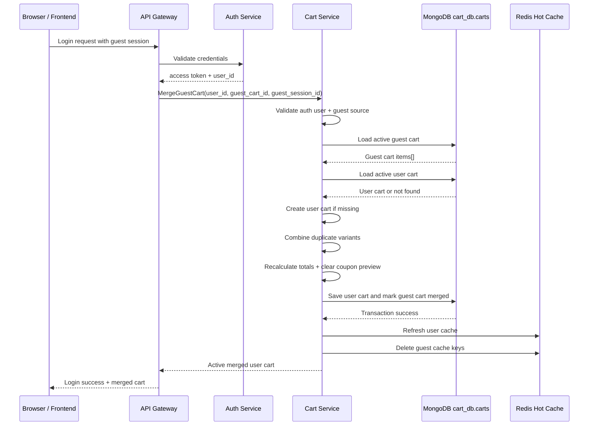
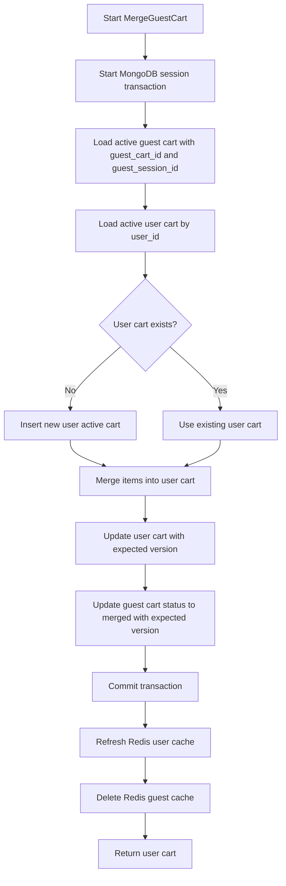
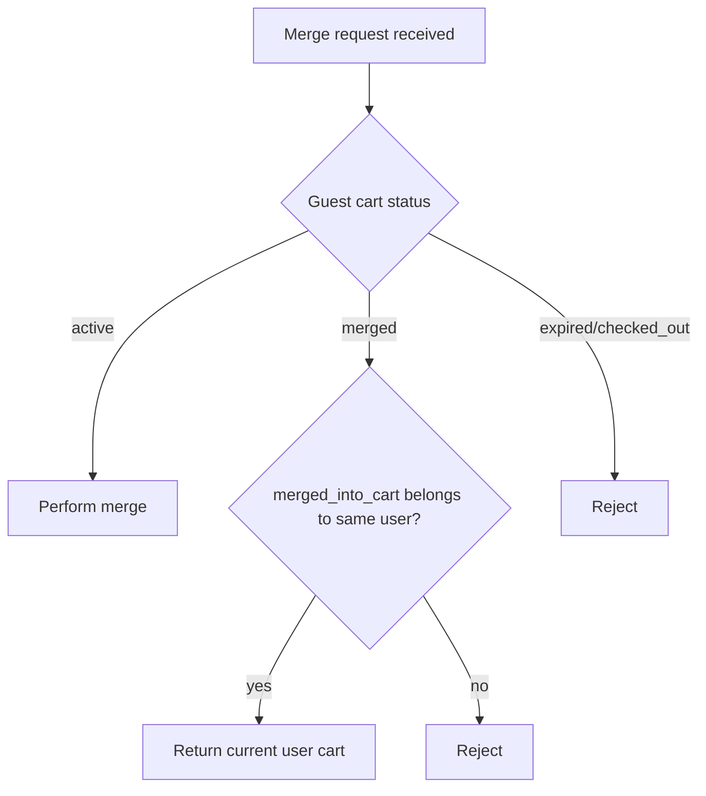
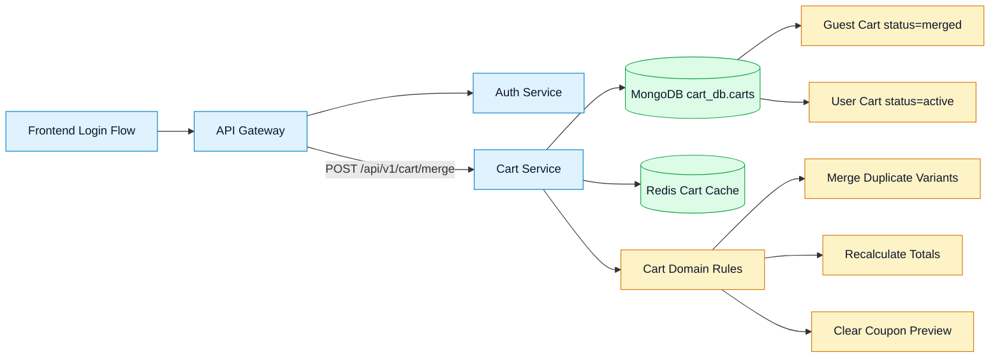
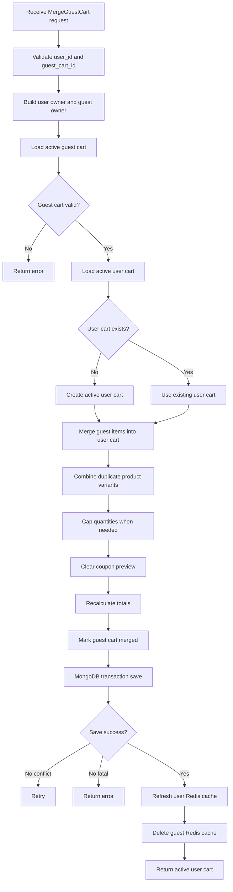

# 🛒 Cart Service - Task 7: Cart Merge


## 📌 Task Summary

| Field | Detail |
|---|---|
| Task Name | Cart merge |
| Source | `docs/01-micro-tasks.md` → `Cart Service` → Task 7 |
| Priority | `P1` buyer experience feature |
| Dependency | Auth Service and Session Management Service |
| Main Goal | Guest session cart ko login user cart me merge karna, duplicate variants ki quantity combine karna |
| Output Type | Documentation-only implementation guide |
| Not Included | Auth login implementation, Session Service implementation, actual backend source file creation, cart expiry cleanup job |

> **Simple Hinglish goal:** Is task ka purpose `MergeGuestCart` flow ko clearly design karna hai. Jab guest buyer login karta hai, uske browser/session cart ke items logged-in user ke active cart me merge honge. Same `product_id + variant_id` already user cart me hai to quantity combine hogi. Quantity max limit cross kare to cap/warning rule apply hoga, guest cart `merged` status me mark hoga, user cart active rahega, MongoDB source of truth update hoga, Redis user cache refresh hoga, aur guest cache invalidate hoga.

---

## ✅ Final Output Created

```text
TaskImplementation/
└── Cart Service/
    ├── task1.md
    ├── task2.md
    ├── task3.md
    ├── task4.md
    ├── task5.md
    ├── task6.md
    └── task7.md
```

### Why this structure?

- `TaskImplementation/` project ke task-wise implementation guides ka central folder hai.
- `Cart Service/` Cart Service ke saare task guides ko group karta hai.
- `task7.md` sirf **Cart Service - Task 7** ka Cart Merge guide hai.
- Is task me sirf documentation artifact create kiya gaya hai; backend source code create nahi kiya gaya.

---

## 🧭 Implementation Approach

Is guide ko banane se pehle existing project documentation and code shape study ki gayi:

| Document / File | Kya use kiya gaya |
|---|---|
| `docs/01-micro-tasks.md` | Task 7 ka exact scope: guest session cart ko login user cart me merge karna |
| `docs/04-microservice-design.md` | Cart Service responsibilities, `MergeGuestCart`, REST route `POST /api/v1/cart/merge` |
| `api/master-api.json` | `MergeCartRequest`, `CartService.MergeGuestCart`, response schema `Cart` |
| `TaskImplementation/Cart Service/task1.md` | Merge rules: duplicate variants combine, quantity cap warning, guest cart status `merged` |
| `TaskImplementation/Cart Service/task2.md` | MongoDB source of truth and Redis cache invalidation strategy |
| `TaskImplementation/Cart Service/task3.md` | `merged_into_cart_id`, active-cart indexes, status lifecycle |
| `TaskImplementation/Cart Service/task4.md` | Add item owner resolution, optimistic versioning, product snapshot rules |
| `TaskImplementation/Cart Service/task5.md` | Totals recalculation and mutation safety |
| `TaskImplementation/Cart Service/task6.md` | Coupon preview stale hone par clear/revalidate boundary |
| `backend/services/cart-service/internal/domain/cart.go` | Existing domain fields: `CartStatusMerged`, `MergedIntoCartID`, owner fields, totals |
| `backend/services/cart-service/internal/repository/redis_cart_cache.go` | Existing cache keys: user active cart, guest active cart, summaries |

---

## 🪜 Step-by-Step Implementation

## Step 1: Task Boundary Clear Kiya

Cart Service Task 7 ka kaam **guest-to-user cart merge flow** define karna hai.

### Included

- `POST /api/v1/cart/merge` and `CartService.MergeGuestCart` contract explain karna
- Login ke baad `user_id` auth context se read karna
- Guest cart ko `guest_cart_id` ya trusted `guest_session_id` se identify karna
- Guest active cart load karna
- User active cart load karna; missing ho to create karna
- Duplicate `product_id + variant_id` lines combine karna
- Quantity max limit cross hone par cap/warning behavior define karna
- Merged cart totals recalculate karna
- Stale coupon preview clear karna
- Guest cart ko `merged` status me mark karna
- `merged_into_cart_id` set karna
- MongoDB update atomically/transactionally karna
- Redis user cache refresh and guest cache invalidate karna
- Error handling, tests, observability, and future code structure document karna

### Not Included

- Auth Service login/token generation implement karna
- Session Management Service cookie/session lifecycle implement karna
- Product Service inventory reserve karna
- Checkout/order creation karna
- Cart expiry cleanup scheduler banana
- Actual backend source files create karna

> 🟢 **Reason:** `docs/01-micro-tasks.md` ke according Task 7 only cart merge hai. Login Auth Service karega, session identity Session Service/Gateway pass karega, aur checkout Order Service karega.

---

## Step 2: API Contract Samjha

Cart merge buyer login ke baad API Gateway ke through call hoga.

| Layer | Contract |
|---|---|
| REST | `POST /api/v1/cart/merge` |
| Internal gRPC | `CartService.MergeGuestCart` |
| Request schema | `MergeCartRequest` |
| Response schema | `Cart` |
| Auth | `buyer` required, because target user must be logged-in |

### REST Request

```http
POST /api/v1/cart/merge
Authorization: Bearer <access_token>
Content-Type: application/json

{
  "guest_cart_id": "cart_guest_123"
}
```

### Gateway Context

Gateway ko request ke saath ye context Cart Service ko pass karna chahiye:

| Context | Source | Required? | Use |
|---|---|---:|---|
| `user_id` | JWT/Auth middleware | ✅ Yes | Target user cart identify karne ke liye |
| `guest_session_id` | Guest session cookie/header | 🟡 Recommended | Guest cart ownership verify karne ke liye |
| `guest_cart_id` | Request body | ✅ Yes as per API schema | Source guest cart load karne ke liye |

### Response Body

```json
{
  "cart_id": "cart_user_456",
  "user_id": "user_123",
  "items": [
    {
      "item_id": "item_user_1",
      "product_id": "prod_101",
      "variant_id": "var_blue_m",
      "quantity": 3
    }
  ],
  "subtotal": {
    "amount": 149700,
    "currency": "INR"
  },
  "discount": {
    "amount": 0,
    "currency": "INR"
  },
  "total": {
    "amount": 149700,
    "currency": "INR"
  }
}
```

> 🔵 **Mapping note:** API response current `Cart` schema follow karega. Internal implementation warning list log/audit me rakh sakti hai, but public schema me warning field abhi defined nahi hai.

---

## Step 3: High-Level Merge Flow Design Kiya

Merge flow ka goal hai: guest cart ke useful items preserve karna and logged-in user cart ko final active cart banana.



### Beginner Explanation

Guest user ne login se pehle cart me items add kiye. Login ke baad un items ko lose nahi karna. Cart Service guest cart ko source maan ke user cart me items copy/combine karta hai. Phir guest cart editable nahi rahta, kyunki ab final cart user account se attached hai.

---

## Step 4: Merge Ownership Rules Define Kiye

Merge me two carts involved hote hain:

| Role | Meaning | Owner |
|---|---|---|
| Source cart | Guest active cart jisko merge karna hai | `guest_session_id` |
| Target cart | Logged-in user ka active cart | `user_id` |

### Ownership Rules

| Rule | Decision |
|---|---|
| User auth | Required, bina `user_id` merge reject |
| Guest cart ownership | `guest_cart_id` trusted session ke guest cart se match hona chahiye |
| Active status | Source and target carts editable state me hone chahiye |
| Target missing | New active user cart create karo |
| Source after merge | `status = "merged"` |
| Target after merge | `status = "active"` and `user_id` owner |
| Active cart uniqueness | Ek user ke paas sirf one active cart |

### Valid Merge State

```text
Before:
guest cart: status=active, user_id=null, guest_session_id=sess_abc
user cart:  status=active, user_id=user_123, guest_session_id=null

After:
guest cart: status=merged, merged_into_cart_id=cart_user_456
user cart:  status=active, merged items available
```

---

## Step 5: Request Validation Rules Banaye

Cart Service ko DB mutation se pehle request validate karni chahiye.

| Field / Context | Rule | Error |
|---|---|---|
| `user_id` | Required from authenticated buyer | `UNAUTHENTICATED` |
| `guest_cart_id` | Required, non-empty string | `INVALID_ARGUMENT` |
| `guest_session_id` | Recommended for ownership check | `PERMISSION_DENIED` if mismatch |
| Source cart | Must exist and be `active` guest cart | `NOT_FOUND` / `FAILED_PRECONDITION` |
| Target user cart | Must be active if exists | `FAILED_PRECONDITION` |
| Same cart id | Source and target cannot be same cart | `INVALID_ARGUMENT` |

### Validation Code Example

```go
type MergeGuestCartCommand struct {
	UserID         string
	GuestSessionID string
	GuestCartID    string
}

func ValidateMergeGuestCartCommand(cmd MergeGuestCartCommand) error {
	if strings.TrimSpace(cmd.UserID) == "" {
		return ErrUserIDRequired
	}
	if strings.TrimSpace(cmd.GuestCartID) == "" {
		return ErrGuestCartIDRequired
	}
	return nil
}
```

### Why `user_id` mandatory hai?

Merge ka result user account cart me jana hai. Agar user logged-in nahi hai, to target cart identify nahi hoga. Guest-only request me merge ka meaning nahi banta.

---

## Step 6: Guest Cart Load Rule Define Kiya

Guest cart source cart hai. Isko carefully load karna zaruri hai.

### Repository Method Shape

```go
type CartRepository interface {
	FindActiveByOwner(ctx context.Context, owner CartOwner) (*Cart, error)
	FindActiveGuestCartByID(ctx context.Context, cartID string, guestSessionID string) (*Cart, error)
	FindActiveUserCart(ctx context.Context, userID string) (*Cart, error)
	CreateActiveCart(ctx context.Context, cart *Cart) error
	MergeGuestIntoUser(ctx context.Context, userCart *Cart, guestCart *Cart, expectedUserVersion int64, expectedGuestVersion int64) error
}
```

### Guest Cart Query

```js
{
  _id: "cart_guest_123",
  status: "active",
  guest_session_id: "sess_abc123"
}
```

### Ownership Check

`guest_cart_id` alone enough nahi hai. Agar attacker kisi aur ka guest cart id guess/send kare, to ownership bypass ho sakta hai. Isliye `guest_session_id` cookie/header se match karna safer hai.

| Case | Result |
|---|---|
| Cart id exists and session matches | ✅ Merge allowed |
| Cart id exists but session mismatch | ❌ Reject |
| Cart already merged | 🟡 Idempotent response possible if same target, otherwise reject |
| Cart checked out/expired | ❌ Reject |

---

## Step 7: User Cart Load or Create Rule Define Kiya

Target cart logged-in user ka active cart hoga.

### Decision Table

| User Active Cart | Guest Cart | Action |
|---|---|---|
| Exists | Has items | Merge into existing user cart |
| Exists | Empty | Mark guest merged, return user cart |
| Missing | Has items | Create active user cart, then copy guest items |
| Missing | Empty | Create/return empty active user cart as per product decision |

### Create Target Cart Example

```go
userOwner := CartOwner{
	Type:   CartOwnerTypeUser,
	UserID: cmd.UserID,
}

userCart, err := NewActiveCart(
	newCartID,
	userOwner,
	guestCart.Totals.Currency,
	now,
	now.Add(cartTTL),
)
```

### Why target cart create karna useful hai?

Login ke baad frontend ko consistent user cart milta hai. Agar guest cart items hain but user cart missing hai, to direct copy/merge se active user cart ban jata hai.

---

## Step 8: Duplicate Variant Merge Rule Banaya

Duplicate ka definition same rahega:

```text
Duplicate line = same product_id + same variant_id
```

### Merge Rules

| Situation | Action |
|---|---|
| Guest item user cart me nahi hai | Item copy karo |
| Same product and variant already hai | Quantity combine karo |
| Combined quantity <= max | Final quantity combined value |
| Combined quantity > max | Quantity cap at `MaxItemQuantity` and warning log |
| Unique item count > max | Extra items skip/warning or reject as product decision |

### Quantity Example

```text
User cart item quantity  = 5
Guest cart item quantity = 8
Max item quantity        = 10

Combined raw quantity    = 13
Final quantity           = 10
Warning                  = QUANTITY_CAPPED
```

### Merge Function Example

```go
type CartMergeWarning struct {
	Code      string
	ProductID string
	VariantID string
	Message   string
}

func MergeGuestItemsIntoUserCart(userCart *Cart, guestCart *Cart, now time.Time) ([]CartMergeWarning, error) {
	if userCart.Status != CartStatusActive || guestCart.Status != CartStatusActive {
		return nil, ErrCartNotActive
	}

	warnings := []CartMergeWarning{}
	index := make(map[string]int, len(userCart.Items))
	for i, item := range userCart.Items {
		index[item.ProductID+"\x00"+item.VariantID] = i
	}

	for _, guestItem := range guestCart.Items {
		key := guestItem.ProductID + "\x00" + guestItem.VariantID
		userIdx, exists := index[key]
		if !exists {
			if len(userCart.Items) >= MaxUniqueItemsPerCart {
				warnings = append(warnings, CartMergeWarning{
					Code:      "UNIQUE_ITEM_LIMIT_REACHED",
					ProductID: guestItem.ProductID,
					VariantID: guestItem.VariantID,
					Message:   "Item skipped because cart item limit reached",
				})
				continue
			}
			copied := guestItem
			copied.UpdatedAt = now.UTC()
			userCart.Items = append(userCart.Items, copied)
			index[key] = len(userCart.Items) - 1
			continue
		}

		userItem := &userCart.Items[userIdx]
		combinedQty := userItem.Quantity + guestItem.Quantity
		if combinedQty > MaxItemQuantity {
			combinedQty = MaxItemQuantity
			warnings = append(warnings, CartMergeWarning{
				Code:      "QUANTITY_CAPPED",
				ProductID: guestItem.ProductID,
				VariantID: guestItem.VariantID,
				Message:   "Quantity adjusted to max allowed limit",
			})
		}

		userItem.Quantity = combinedQty
		userItem.LineSubtotal = NewMoney(
			userItem.UnitPrice.Amount*int64(combinedQty),
			userItem.UnitPrice.Currency,
		)
		userItem.UpdatedAt = now.UTC()
	}

	return warnings, nil
}
```

> 🟡 **Note:** Code example future implementation blueprint hai. Is task me actual Go source file create nahi ki gayi.

---

## Step 9: Price Snapshot Decision Define Kiya

Merge ke time product prices ko kaise handle karna hai ye important hai, kyunki guest cart old ho sakta hai.

### Recommended MVP Decision

```text
Merge me existing cart snapshots preserve karo.
Checkout se pehle Order Service fresh price and stock validate karega.
```

### Why?

| Reason | Explanation |
|---|---|
| Fast login UX | Login ke immediately baad merge slow Product Service calls pe depend nahi karega |
| Existing rule align | Cart Task 1 already bolta hai checkout se pehle fresh validation hoga |
| Stable display | Cart me add-time title/image/price snapshot preserve hota hai |
| Safe final amount | Order Service final checkout amount fresh validate karega |

### Optional Future Enhancement

Later phase me Cart Service merge ke baad async price refresh trigger kar sakta hai:

```text
Merge success -> emit CartMerged event -> price refresh worker updates stale snapshots
```

Task 7 MVP me event/worker implement nahi karna.

---

## Step 10: Coupon Preview Merge Rule Define Kiya

Cart content change hone ke baad old coupon preview stale ho sakta hai. Isliye merge ke baad coupon preview clear karna safest default hai.

### Rule

```text
After merge:
coupon_code = null
coupon_preview = null
totals.discount = 0
totals.total = recalculated subtotal
```

### Why?

Example: User cart me coupon `SAVE500` valid tha minimum cart `₹1000` ke liye. Guest cart merge hone ke baad seller/category scope change ho sakta hai. Coupon engine fresh validate kare bina old discount trust nahi karna chahiye.

### Code Example

```go
func (c *Cart) ClearCouponPreview() {
	if c == nil {
		return
	}
	c.CouponCode = nil
	c.CouponPreview = nil
	if c.Totals.Currency != "" {
		c.Totals.Discount = NewMoney(0, c.Totals.Currency)
	}
}
```

> 🟢 **User experience:** Frontend merge ke baad coupon input blank/cleared dikha sakta hai. Buyer coupon dubara apply karega, then Task 6 `ApplyCouponPreview` fresh validation karega.

---

## Step 11: Totals Recalculate Kiya

Merge ke baad user cart totals always fresh calculate honge.

### Totals Fields

| Field | Meaning |
|---|---|
| `subtotal` | All line subtotals ka sum |
| `discount` | Merge ke baad zero, kyunki coupon preview clear hai |
| `total` | `subtotal - discount` |
| `item_count` | Quantities ka total |
| `unique_item_count` | `items[]` length |

### Code Example

```go
userCart.ClearCouponPreview()

currency := userCart.Totals.Currency
if currency == "" && len(userCart.Items) > 0 {
	currency = userCart.Items[0].UnitPrice.Currency
}

if err := userCart.RecalculateTotals(currency); err != nil {
	return nil, err
}
userCart.Touch(now, now.Add(cartTTL))
```

### Mixed Currency Rule

Cart MVP me one cart one currency safe hai. Agar guest cart aur user cart currencies different hain:

| Case | Recommended Result |
|---|---|
| Same currency | Merge allowed |
| Different currency | Reject with `MIXED_CURRENCY_CART` or start region/currency migration flow later |

---

## Step 12: Guest Cart Mark Merged Kiya

Merge success ke baad guest cart editable nahi rahega.

### Guest Cart Final State

```json
{
  "cart_id": "cart_guest_123",
  "guest_session_id": "sess_abc123",
  "status": "merged",
  "merged_into_cart_id": "cart_user_456",
  "updated_at": "2026-05-24T00:00:00Z"
}
```

### Why status `merged` important hai?

| Reason | Explanation |
|---|---|
| Idempotency | Repeat merge calls handle karna easier hota hai |
| Debugging | Pata chalta hai guest cart kis user cart me gaya |
| Cleanup | Task 8 expiry/cleanup job merged carts delete/archive kar sakta hai |
| Security | Old guest session se cart mutate nahi hoga |

### Domain Helper Example

```go
func (c *Cart) MarkMerged(targetCartID string, now time.Time) error {
	if c == nil {
		return ErrInvalidCart
	}
	if c.Status != CartStatusActive {
		return ErrCartNotActive
	}
	if strings.TrimSpace(targetCartID) == "" {
		return ErrInvalidCart
	}
	c.Status = CartStatusMerged
	c.MergedIntoCartID = &targetCartID
	c.UpdatedAt = now.UTC()
	return nil
}
```

---

## Step 13: MongoDB Transaction Strategy Define Kiya

Merge me two documents update hote hain:

1. User active cart update
2. Guest cart mark `merged`

In dono ko same logical operation me save karna chahiye.

### Recommended Strategy

```text
Use MongoDB transaction when local/prod MongoDB is configured as a replica set.
Fallback MVP: ordered writes with version guards and retry, but production should use transaction.
```

### Transaction Flow



### Repository Pseudocode

```go
func (r *MongoCartRepository) MergeGuestIntoUser(
	ctx context.Context,
	userCart *Cart,
	guestCart *Cart,
	expectedUserVersion int64,
	expectedGuestVersion int64,
) error {
	return r.withTransaction(ctx, func(tx mongo.SessionContext) error {
		if err := r.saveActiveCartWithVersion(tx, userCart, expectedUserVersion); err != nil {
			return err
		}
		if err := r.markGuestCartMerged(tx, guestCart.ID, userCart.ID, expectedGuestVersion); err != nil {
			return err
		}
		return nil
	})
}
```

### Version Guards

| Document | Guard |
|---|---|
| User cart | `_id`, `status=active`, `version=expectedUserVersion` |
| Guest cart | `_id`, `status=active`, `version=expectedGuestVersion` |

Version conflict aaye to usecase limited retry karega, same Task 4 add item pattern jaisa.

---

## Step 14: Redis Cache Update Rule Define Kiya

MongoDB transaction success ke baad cache update hoga.

### Cache Keys

| Key | Action |
|---|---|
| `cart:active:user:{user_id}` | Set refreshed merged user cart |
| `cart:summary:user:{user_id}` | Set refreshed summary |
| `cart:active:guest:{guest_session_id}` | Delete/invalidate |
| `cart:summary:guest:{guest_session_id}` | Delete/invalidate |

### Cache Interface Example

```go
type CartCache interface {
	SetActiveCart(ctx context.Context, owner CartOwner, cart *Cart) error
	SetCartSummary(ctx context.Context, owner CartOwner, summary CartSummary) error
	DeleteActiveCart(ctx context.Context, owner CartOwner) error
	DeleteCartSummary(ctx context.Context, owner CartOwner) error
}
```

### Cache Refresh Pseudocode

```go
func refreshMergeCache(ctx context.Context, cache CartCache, userOwner CartOwner, guestOwner CartOwner, userCart *Cart) {
	_ = cache.SetActiveCart(ctx, userOwner, userCart)
	_ = cache.SetCartSummary(ctx, userOwner, BuildCartSummary(userCart))
	_ = cache.DeleteActiveCart(ctx, guestOwner)
	_ = cache.DeleteCartSummary(ctx, guestOwner)
}
```

### Important Rule

```text
Cache failure should not rollback successful MongoDB merge.
```

Redis hot cache hai, source of truth nahi. Agar cache delete fail ho jaye, logs/metrics emit karo; future read MongoDB se correct state recover kar sakta hai.

---

## Step 15: Usecase Flow Compose Kiya

`MergeGuestCartUsecase` ka job orchestration hai: validation, load, merge, save, cache.

### Usecase Pseudocode

```go
type MergeGuestCartUsecase struct {
	repository CartRepository
	cache      CartCache
	ids        IDGenerator
	clock      Clock
	logger     *slog.Logger
	cartTTL    time.Duration
	maxAttempts int
}

func (u *MergeGuestCartUsecase) MergeGuestCart(ctx context.Context, cmd MergeGuestCartCommand) (*Cart, error) {
	cmd = normalizeMergeCommand(cmd)
	if err := ValidateMergeGuestCartCommand(cmd); err != nil {
		return nil, err
	}

	userOwner := CartOwner{Type: CartOwnerTypeUser, UserID: cmd.UserID}
	guestOwner := CartOwner{Type: CartOwnerTypeGuest, GuestSessionID: cmd.GuestSessionID}

	for attempt := 1; attempt <= u.maxAttempts; attempt++ {
		userCart, guestCart, err := u.loadMergeCarts(ctx, cmd, userOwner)
		if err != nil {
			return nil, err
		}

		expectedUserVersion := userCart.Version
		expectedGuestVersion := guestCart.Version
		now := u.clock.Now().UTC()

		warnings, err := MergeGuestItemsIntoUserCart(userCart, guestCart, now)
		if err != nil {
			return nil, err
		}
		userCart.ClearCouponPreview()
		if err := userCart.RecalculateTotals(userCart.Totals.Currency); err != nil {
			return nil, err
		}
		userCart.Touch(now, now.Add(u.cartTTL))

		if err := guestCart.MarkMerged(userCart.ID, now); err != nil {
			return nil, err
		}

		err = u.repository.MergeGuestIntoUser(ctx, userCart, guestCart, expectedUserVersion, expectedGuestVersion)
		if err == nil {
			u.logWarnings(warnings)
			refreshMergeCache(ctx, u.cache, userOwner, guestOwner, userCart)
			return userCart, nil
		}
		if !errors.Is(err, ErrCartVersionConflict) {
			return nil, err
		}
	}

	return nil, ErrCartVersionConflict
}
```

### Normalization

```go
func normalizeMergeCommand(cmd MergeGuestCartCommand) MergeGuestCartCommand {
	cmd.UserID = strings.TrimSpace(cmd.UserID)
	cmd.GuestSessionID = strings.TrimSpace(cmd.GuestSessionID)
	cmd.GuestCartID = strings.TrimSpace(cmd.GuestCartID)
	return cmd
}
```

---

## Step 16: Idempotency Behavior Decide Kiya

Login request retry ho sakti hai. Network issue ke baad frontend same merge call repeat kar sakta hai.

### Recommended Idempotency Rule

| Condition | Behavior |
|---|---|
| Guest cart active | Normal merge |
| Guest cart already `merged` into same user cart | Return target user cart |
| Guest cart already `merged` into different cart/user | Reject with `PERMISSION_DENIED` or `FAILED_PRECONDITION` |
| Guest cart expired | Return current user cart or reject based on product decision; safer default reject |

### Why idempotency useful hai?

Repeat request se duplicate quantities nahi badhni chahiye. Agar first merge successful tha but response lost ho gaya, second call same result return kare, not double add.



---

## Step 17: Error Mapping Define Kiya

| Scenario | gRPC Code | HTTP Code | Error Code |
|---|---:|---:|---|
| Missing `user_id` | `UNAUTHENTICATED` | `401` | `USER_AUTH_REQUIRED` |
| Missing `guest_cart_id` | `INVALID_ARGUMENT` | `400` | `GUEST_CART_ID_REQUIRED` |
| Guest session mismatch | `PERMISSION_DENIED` | `403` | `GUEST_CART_ACCESS_DENIED` |
| Guest cart not found | `NOT_FOUND` | `404` | `GUEST_CART_NOT_FOUND` |
| Guest cart not active | `FAILED_PRECONDITION` | `409` | `GUEST_CART_NOT_ACTIVE` |
| User cart not active/corrupt | `FAILED_PRECONDITION` | `409` | `USER_CART_NOT_ACTIVE` |
| Quantity capped | Success + warning log | `200` | `QUANTITY_CAPPED` |
| Unique item limit reached | Success + warning log or `409` | `200/409` | `CART_ITEM_LIMIT_REACHED` |
| Version conflict after retries | `ABORTED` | `409` | `CART_VERSION_CONFLICT` |
| MongoDB unavailable | `UNAVAILABLE` | `503` | `CART_STORE_UNAVAILABLE` |
| Redis failure | Success + warning log | `200` | `CACHE_REFRESH_FAILED` |

### Error Response Example

```json
{
  "error": {
    "code": "GUEST_CART_ACCESS_DENIED",
    "message": "guest cart does not belong to this session"
  }
}
```

---

## Step 18: Architecture Diagram



### Diagram Explanation

- Frontend login flow complete hone ke baad merge trigger hota hai.
- API Gateway authenticated `user_id` and guest session context pass karta hai.
- Cart Service MongoDB me guest and user carts update karta hai.
- Redis cache me user cart refreshed and guest keys invalidated hote hain.

---

## Step 19: Clean Future Folder Structure

Task 7 actual backend implementation future me is structure me fit hogi:

```text
backend/
└── services/
    └── cart-service/
        ├── cmd/
        │   └── server/
        │       └── main.go
        ├── internal/
        │   ├── domain/
        │   │   ├── cart.go
        │   │   ├── cart_mutation.go
        │   │   ├── cart_merge.go
        │   │   ├── owner.go
        │   │   └── errors.go
        │   ├── repository/
        │   │   ├── mongo_cart_repository.go
        │   │   └── redis_cart_cache.go
        │   ├── usecase/
        │   │   ├── merge_guest_cart.go
        │   │   └── add_item.go
        │   └── transport/
        │       ├── grpc/
        │       │   └── server.go
        │       └── http/
        │           ├── handler.go
        │           ├── dto.go
        │           └── routes.go
        ├── migrations/
        │   └── mongo/
        │       └── 001_create_carts_collection.up.js
        ├── go.mod
        └── go.sum
```

### File Responsibility

| File | Responsibility |
|---|---|
| `internal/domain/cart_merge.go` | Merge duplicate item rules, warnings, mark guest merged |
| `internal/usecase/merge_guest_cart.go` | Request validation, load carts, retry, save, cache |
| `internal/repository/mongo_cart_repository.go` | Transactional merge persistence |
| `internal/repository/redis_cart_cache.go` | User cache set and guest cache delete |
| `internal/transport/grpc/server.go` | `CartService.MergeGuestCart` handler |
| `internal/transport/http/handler.go` | Optional local REST handler for `POST /api/v1/cart/merge` |

---

## Step 20: External Libraries / Tools

Task 7 guide me koi new runtime dependency mandatory nahi hai. Future implementation existing Cart Service stack ke saath chalegi.

| Library / Tool | Type | Why Used | Install / Use |
|---|---|---|---|
| Go standard library | Runtime | `context`, `errors`, `strings`, `time`, `log/slog` for usecase/domain code | Go ke saath built-in |
| `go.mongodb.org/mongo-driver` | External library | MongoDB transaction, collection reads/writes, version guarded updates | `go get go.mongodb.org/mongo-driver` |
| `github.com/redis/go-redis/v9` | External library | Redis user cart cache refresh and guest cache invalidation | `go get github.com/redis/go-redis/v9` |
| `google.golang.org/grpc` | External library | Internal `CartService.MergeGuestCart` service contract | `go get google.golang.org/grpc` |
| Protobuf generated code | Build artifact/tooling | Typed `MergeCartRequest` and `Cart` messages | Use project proto generation pipeline |
| Mermaid | Documentation format | Markdown-friendly sequence/flow diagrams | GitHub/Markdown renderer support; no app dependency |

### Install Commands

```bash
cd backend/services/cart-service
go get go.mongodb.org/mongo-driver
go get github.com/redis/go-redis/v9
go get google.golang.org/grpc
go mod tidy
```

### Important Note

Existing project already has MongoDB and Redis dependencies in Cart Service. Task 7 documentation does not install anything, because this task output is only `task7.md`.

---

## Step 21: Testing Strategy Define Kiya

### Domain Tests

```text
TestMergeGuestItemsCopiesNewItems
TestMergeGuestItemsCombinesDuplicateVariantQuantity
TestMergeGuestItemsCapsQuantityAtMax
TestMergeGuestItemsSkipsWhenUniqueItemLimitReached
TestMergeGuestItemsRejectsInactiveCart
TestMarkMergedSetsStatusAndTargetCartID
TestMergeClearsCouponPreviewAndRecalculatesTotals
TestMergeRejectsMixedCurrencyCart
```

### Usecase Tests

```text
TestMergeGuestCartRequiresAuthenticatedUser
TestMergeGuestCartRequiresGuestCartID
TestMergeGuestCartRejectsGuestSessionMismatch
TestMergeGuestCartCreatesUserCartWhenMissing
TestMergeGuestCartMergesIntoExistingUserCart
TestMergeGuestCartMarksGuestCartMerged
TestMergeGuestCartIsIdempotentForAlreadyMergedGuestCart
TestMergeGuestCartRetriesVersionConflict
TestMergeGuestCartReturnsCartWhenRedisInvalidationFails
```

### Repository Tests

```text
TestMongoMergeGuestIntoUserUpdatesBothDocuments
TestMongoMergeGuestIntoUserUsesVersionGuards
TestMongoMergeGuestIntoUserRollsBackOnGuestUpdateFailure
TestMongoFindActiveGuestCartByIDRequiresSessionMatch
```

### Manual Test Flow

```bash
# 1. Guest add item
POST /api/v1/cart/items
Header: X-Guest-Session-ID: sess_abc

# 2. User login
POST /api/v1/auth/login

# 3. Merge guest cart
POST /api/v1/cart/merge
Authorization: Bearer <access_token>
Header: X-Guest-Session-ID: sess_abc
Body: {"guest_cart_id":"cart_guest_123"}

# 4. Verify user cart
GET /api/v1/cart
Authorization: Bearer <access_token>
```

---

## Step 22: Observability Plan

### Logs

| Event | Fields |
|---|---|
| `cart.merge.started` | `user_id`, `guest_cart_id`, `guest_session_id_hash` |
| `cart.merge.completed` | `user_id`, `guest_cart_id`, `target_cart_id`, `item_count`, `warnings_count` |
| `cart.merge.version_conflict` | `guest_cart_id`, `target_cart_id`, `attempt` |
| `cart.merge.guest_access_denied` | `guest_cart_id`, `user_id` |
| `cart.merge.cache_refresh_failed` | `target_cart_id`, `cache_key_type`, `error` |

### Metrics

| Metric | Type | Meaning |
|---|---|---|
| `cart_merge_requests_total` | Counter | Total merge requests |
| `cart_merge_success_total` | Counter | Successful merges |
| `cart_merge_conflicts_total` | Counter | Version conflict count |
| `cart_merge_duration_ms` | Histogram | Merge latency |
| `cart_merge_quantity_capped_total` | Counter | Quantity cap warnings |
| `cart_merge_guest_cache_delete_failed_total` | Counter | Redis delete failures |

### Tracing Spans

```text
CartService.MergeGuestCart
  ├── Mongo.FindActiveGuestCart
  ├── Mongo.FindActiveUserCart
  ├── Cart.MergeItems
  ├── Mongo.MergeGuestIntoUserTransaction
  └── Redis.RefreshMergedCartCache
```

---

## Step 23: Security Checklist

| Check | Reason |
|---|---|
| Authenticated `user_id` required | Guest cart ko kisi random account me merge nahi karna |
| Guest session ownership validate | Cart id guessing se data leak/merge prevent hota hai |
| Source cart active hona chahiye | Old merged/expired carts repeat mutate nahi honge |
| Target cart owner same user hona chahiye | Cross-user cart overwrite avoid hota hai |
| Request body amount/quantity trust nahi karna | Cart Service MongoDB source cart se values lega |
| Redis guest keys delete | Old browser session stale cart na dikhaye |
| Logs me raw session token avoid | Sensitive session value leak nahi honi chahiye |

---

## Step 24: Edge Cases

| Edge Case | Expected Behavior |
|---|---|
| Guest cart empty | Mark guest merged and return user cart |
| User cart missing | Create user cart, copy guest items |
| User cart has duplicate variant | Combine quantity |
| Quantity exceeds max | Cap at max and log warning |
| Unique item limit exceeds | Skip extra items with warning or reject; MVP recommended warning/skip |
| Guest cart already merged into same user cart | Return current user cart |
| Guest cart already merged elsewhere | Reject |
| Guest and user currencies differ | Reject as mixed currency |
| Coupon preview present | Clear coupon preview and discount |
| Redis unavailable | Return success after MongoDB save, log warning |
| Mongo version conflict | Retry limited attempts |

---

## Step 25: Final Merge Algorithm



### Compact Pseudocode

```text
MergeGuestCart(user_id, guest_cart_id, guest_session_id)
  validate user_id and guest_cart_id
  load active guest cart by guest_cart_id + guest_session_id
  load active user cart by user_id
  if user cart missing:
      create active user cart
  for each guest item:
      if same product_id + variant_id exists in user cart:
          quantity = min(user_qty + guest_qty, MaxItemQuantity)
      else:
          append guest item to user cart
  clear coupon preview
  recalculate totals
  mark guest cart as merged into user cart
  save user cart + guest cart in MongoDB transaction
  refresh user cache
  delete guest cache
  return user cart
```

---

## ✅ Acceptance Checklist

| Requirement | Status |
|---|---|
| `TaskImplementation/` folder present | ✅ Done |
| `TaskImplementation/Cart Service/` folder kept | ✅ Done |
| `task7.md` created | ✅ Done |
| Step-by-step implementation in Hinglish | ✅ Done |
| Clear explanation of each part | ✅ Done |
| External libraries/tools mentioned with install/use | ✅ Done |
| Clean folder structure included | ✅ Done |
| Code examples included | ✅ Done |
| Mermaid diagrams included | ✅ Done |
| Beginner-friendly formatting, badges, emojis | ✅ Done |
| Scope limited to Cart Service Task 7 | ✅ Done |

---

## 🚫 Explicitly Not Implemented

| Not Implemented | Why |
|---|---|
| Auth login flow | Auth Service responsibility |
| Session cookie creation | Session Management Service / Gateway responsibility |
| Product inventory reservation | Checkout/Order Service responsibility |
| Coupon final redemption | Order/CMS final apply responsibility |
| Cart expiry cleanup | Cart Service Task 8 |
| Actual Go source changes | User requested required folder/file output only |

---

## 🧠 Key Takeaways

1. Cart merge login ke baad guest cart items preserve karne ke liye hota hai.
2. Merge target always logged-in user active cart hoga.
3. Source guest cart merge ke baad `merged` status me mark hoga.
4. Duplicate variants `product_id + variant_id` se identify honge.
5. Duplicate quantities combine hongi, but `MaxItemQuantity` cap enforce hoga.
6. Coupon preview merge ke baad clear karna safest default hai.
7. MongoDB transaction recommended hai because two cart documents update hote hain.
8. Redis source of truth nahi hai; cache failure merge success ko fail nahi karega.
9. Repeated merge call idempotent hona chahiye, duplicate quantity increase nahi karni chahiye.
10. Checkout ke time Order Service price/stock fresh validate karega.

---

## 🏁 Final Result

Cart Service Task 7 ka final documented implementation standard:

```text
Guest login flow
  -> Authenticated user_id available
  -> POST /api/v1/cart/merge
  -> CartService.MergeGuestCart
  -> Load guest active cart
  -> Load/create user active cart
  -> Merge items
  -> Combine duplicate variants
  -> Cap quantity if needed
  -> Clear coupon preview
  -> Recalculate totals
  -> Mark guest cart merged
  -> Save in MongoDB
  -> Refresh Redis user cache
  -> Delete Redis guest cache
  -> Return active user cart
```

Task 7 complete hai as a structured, beginner-friendly Cart Merge flow guide. Future Cart Service implementation isi document ko domain, usecase, repository, cache, API handler, tests, and observability blueprint ki tarah follow karegi.
