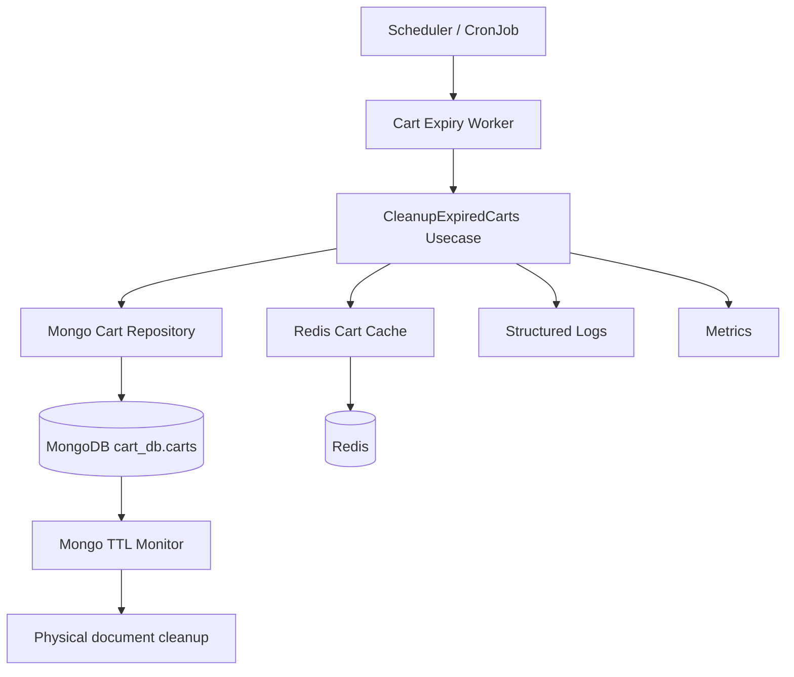
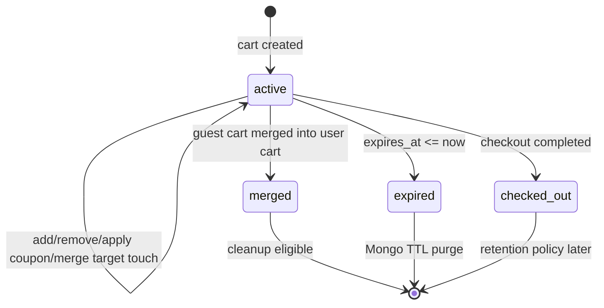
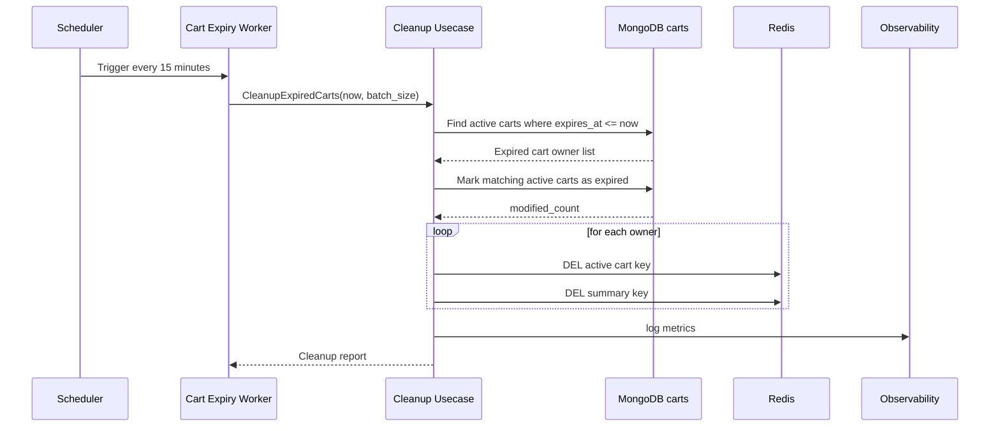
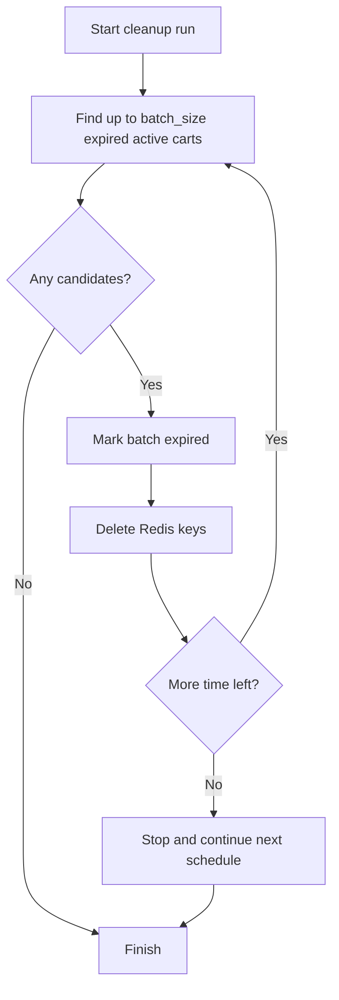

# 🛒 Cart Service - Task 8: Cart Expiry


## 📌 Task Summary

| Field | Detail |
|---|---|
| Task Name | Cart expiry |
| Source | `docs/01-micro-tasks.md` -> `Cart Service` -> Task 8 |
| Priority | `P2` cleanup, storage control, stale price control |
| Dependency | Scheduler |
| Main Goal | Inactive carts cleanup job banana, taaki stale carts, stale price snapshots, and storage growth control me rahe |
| Output Type | Documentation-only implementation guide |
| Not Included | Checkout/order flow, product price refresh, inventory reservation, coupon redemption, Auth/Session implementation, actual backend source file creation |

> **Simple Hinglish goal:** Is task ka purpose Cart Service ke inactive/expired carts ko safely cleanup karne ka design banana hai. Cart Service already `expires_at`, cart statuses, MongoDB TTL index, and Redis cache TTL use karta hai. Task 8 me hum scheduler based cleanup flow define karenge jo expired active carts ko `expired` mark karega, Redis active cart/summary cache invalidate karega, aur MongoDB TTL index ko final storage cleanup safety net ki tarah use karega.

---

## ✅ Final Output Created

```text
TaskImplementation/
└── Cart Service/
    ├── task1.md
    ├── task2.md
    ├── task3.md
    ├── task4.md
    ├── task5.md
    ├── task6.md
    ├── task7.md
    └── task8.md
```

### Why this structure?

- `TaskImplementation/` project ke task-wise implementation guides ka central folder hai.
- `Cart Service/` folder already present tha, isliye usko keep kiya gaya.
- `task8.md` sirf **Cart Service - Task 8** ka Cart Expiry guide hai.
- Is task me sirf requested documentation artifact create kiya gaya hai; backend runtime code create/change nahi kiya gaya.

---

## 🧭 Implementation Approach

Is guide ko banane se pehle existing docs and Cart Service code shape study ki gayi:

| Document / File | Kya use kiya gaya |
|---|---|
| `docs/01-micro-tasks.md` | Task 8 ka exact scope: inactive carts cleanup job |
| `docs/04-microservice-design.md` | Cart Service responsibilities me cart expiration defined hai |
| `database/mongodb-schema-design.md` | `cart_db.carts`, `expires_at`, TTL index reference |
| `TaskImplementation/Cart Service/task1.md` | Expiry rules: guest 30 days, logged-in 90 days, merged cleanup eligible |
| `TaskImplementation/Cart Service/task2.md` | MongoDB source of truth, Redis hot cache, TTL strategy |
| `TaskImplementation/Cart Service/task3.md` | `expires_at`, `status`, `idx_carts_expires_at_ttl`, lifecycle |
| `TaskImplementation/Cart Service/task4.md` | Mutations refresh `expires_at` and Redis cache |
| `TaskImplementation/Cart Service/task5.md` | Zero quantity cleanup separate from inactive cart cleanup |
| `TaskImplementation/Cart Service/task6.md` | Coupon preview stale hone par clear/revalidate boundary |
| `TaskImplementation/Cart Service/task7.md` | Merged guest carts cleanup eligible hain |
| `backend/services/cart-service/internal/domain/cart.go` | Existing statuses: `active`, `merged`, `checked_out`, `expired`, `abandoned` |
| `backend/services/cart-service/internal/domain/collection.go` | Existing collection spec includes TTL index |
| `backend/services/cart-service/internal/repository/mongo_schema.go` | Existing `expires_at` TTL index definition |
| `backend/services/cart-service/internal/repository/redis_cart_cache.go` | Existing Redis keys: active cart and summary per owner |
| `backend/services/cart-service/internal/config/config.go` | Existing `CART_EXPIRY_TTL` and cache TTL config |

---

## 🧱 Task Boundary

### Included in Task 8

- Cart expiry policy define karna
- Inactive/expired cart cleanup scheduler ka design banana
- `expires_at <= now` carts ko expired treat karna
- Active expired carts ko `status = "expired"` mark karna
- Redis active cart and summary keys invalidate karna
- MongoDB TTL index ko final physical cleanup safety net ki tarah explain karna
- Batch processing, idempotency, retries, and concurrency rules define karna
- Config/env variables define karna
- Tests, logs, metrics, and runbook document karna
- Future code structure and code examples provide karna

### Not Included in Task 8

- Product Service se fresh price sync karna
- Checkout inventory reservation
- Order creation
- Coupon final apply
- Auth login/session lifecycle
- Wishlist move-to-cart flow
- Search/recommendation analytics
- Production Kubernetes manifests create karna
- Actual backend files create/change karna

> 🟢 **Rule:** Task 8 sirf Cart Service expiry/cleanup design tak limited rahega. Cart ke bahar ke services ko implement nahi karna.

---

## 🧠 Core Concept

Cart mutable hot data hai. Buyer kabhi items add karta hai aur checkout nahi karta. Aise carts agar forever store honge to:

| Problem | Impact |
|---|---|
| Stale price snapshot | Cart me old product price dikhta rahega |
| Stale stock assumption | Buyer unavailable product checkout karne ki try karega |
| MongoDB storage growth | Old carts collection ko heavy bana denge |
| Redis stale keys | Cart badge/count outdated ho sakta hai |
| Active cart uniqueness issue | Old active cart new cart creation ko block kar sakta hai |

Expiry job ka goal hai stale carts ko gracefully inactive banana and cache se remove karna.

---

## 🔁 Expiry Policy

Existing task rules ke basis par recommended policy:

| Cart Type | Expiry Rule | Cleanup Behavior |
|---|---|---|
| Guest active cart | `30 days` inactive | Expire and invalidate guest Redis keys |
| Logged-in active cart | `90 days` inactive | Expire and invalidate user Redis keys |
| Merged guest cart | Merge ke baad read-only | Cleanup eligible, Mongo TTL can purge |
| Checked-out cart | Audit/order reference ke liye retain as policy decides | Task 8 me delete nahi karna |
| Expired cart | Mutations blocked | TTL index final storage cleanup karega |

### Important Existing Config Note

Current Cart Service config me single cart expiry value already available hai:

```env
CART_EXPIRY_TTL=2160h
```

`2160h` approx `90 days` hota hai. Future implementation me exact guest/user split ke liye ye config add ki ja sakti hai:

```env
CART_USER_EXPIRY_TTL=2160h
CART_GUEST_EXPIRY_TTL=720h
CART_CLEANUP_INTERVAL=15m
CART_CLEANUP_BATCH_SIZE=500
CART_CLEANUP_LOCK_TTL=10m
```

> 🔵 **Scope note:** New env variables future implementation suggestion hain. Is documentation task me runtime config file modify nahi ki gayi.

---

## 🏗️ High-Level Architecture



### Hinglish Explanation

- Scheduler fixed interval par cleanup worker trigger karega.
- Worker Cart Service ke cleanup usecase ko call karega.
- Usecase MongoDB me expired active carts dhundhega.
- Expired active carts `status = "expired"` me mark honge.
- Same owners ke Redis active cart and summary keys delete honge.
- MongoDB TTL index physical delete eventually karega.
- Logs and metrics se pata chalega kitne carts expire hue, kitne cache keys delete hue, aur errors kaha aaye.

---

## 🔄 Cart Lifecycle With Expiry



### Simple Explanation

- `active` cart editable hota hai.
- Har mutation par `updated_at` and `expires_at` refresh hota hai.
- Jab `expires_at` past me chala jata hai, cart business-wise expired maana jayega.
- Cleanup job expired active cart ko read-only state me shift karega.
- Mongo TTL index final delete eventually karega.

---

## 🪜 Step-by-Step Implementation Guide

## Step 1: Existing Schema Support Confirm Kiya

Cart Service schema already expiry ke liye ready hai.

### Existing Important Fields

```go
type Cart struct {
    ID             string
    UserID         *string
    GuestSessionID *string
    Status         CartStatus
    Items          []CartItem
    Totals         CartTotals
    Version        int64
    CreatedAt      time.Time
    UpdatedAt      time.Time
    ExpiresAt      time.Time
}
```

### Existing Status Values

```go
const (
    CartStatusActive     CartStatus = "active"
    CartStatusMerged     CartStatus = "merged"
    CartStatusCheckedOut CartStatus = "checked_out"
    CartStatusExpired    CartStatus = "expired"
    CartStatusAbandoned  CartStatus = "abandoned"
)
```

### Why useful hai?

- `expires_at` se system ko exact expiry cutoff milta hai.
- `status` se mutation rules simple ho jate hain.
- `version` optimistic concurrency ke liye use hota hai.
- `updated_at` cleanup/debugging/reporting ke liye useful hai.

---

## Step 2: MongoDB TTL Index Role Clear Kiya

Existing repository schema me TTL index already planned hai:

```go
{
    Keys:    bson.D{{Key: "expires_at", Value: 1}},
    Options: options.Index().
        SetName("idx_carts_expires_at_ttl").
        SetExpireAfterSeconds(0),
}
```

### TTL Index Kya Karega?

MongoDB TTL monitor `expires_at <= now` documents ko eventually delete karta hai.

### Important Behavior

| Point | Detail |
|---|---|
| Exact timing guaranteed? | ❌ Nahi, Mongo TTL monitor usually periodic hota hai |
| Business logic depend kare? | ❌ Nahi, app ko `expires_at <= now` ko expired treat karna chahiye |
| Storage cleanup ke liye useful? | ✅ Haan |
| Cache cleanup karega? | ❌ Nahi, Redis keys manually/TTL se handle honge |

> 🔴 **Important:** Mongo TTL physical delete karta hai, but Redis cache invalidate nahi karta. Isliye scheduler still useful hai.

---

## Step 3: Cleanup Strategy Decide Kiya

Recommended strategy **dual layer cleanup** hai:

| Layer | Responsibility |
|---|---|
| Cart Expiry Scheduler | Business cleanup: active expired carts mark, Redis cache invalidate, logs/metrics |
| MongoDB TTL Index | Physical storage cleanup safety net |
| Redis TTL | Cache self-healing, stale key auto expire |

### Why dual layer?

Sirf Mongo TTL use karne se cart eventually delete ho jayega, but service ko expiry event/log/metric/cache invalidation ka control nahi milega. Scheduler se behavior observable and predictable banega.

---

## Step 4: Cleanup Flow Design Kiya



### Beginner Explanation

Scheduler ek alarm clock ki tarah hai. Har 15 minutes Cart Expiry Worker uthta hai, MongoDB se expired carts list karta hai, unhe `expired` mark karta hai, aur Redis me un users/guests ka old cart cache delete karta hai.

---

## Step 5: Expired Candidate Query Define Ki

Cleanup job ko pehle owners collect karne chahiye, taaki Redis cache invalidate ho sake.

### Mongo Query Example

```go
filter := bson.M{
    "status":     "active",
    "expires_at": bson.M{"$lte": now},
}

projection := bson.M{
    "_id":              1,
    "user_id":          1,
    "guest_session_id": 1,
    "version":          1,
}
```

### Why owner list pehle?

Update ke baad bhi owner fields mil sakte hain, but clean and predictable flow ke liye pehle candidates read karna better hai. Redis keys owner based hain:

| Owner Type | Active Key | Summary Key |
|---|---|---|
| User | `cart:active:user:<user_id>` | `cart:summary:user:<user_id>` |
| Guest | `cart:active:guest:<guest_session_id>` | `cart:summary:guest:<guest_session_id>` |

---

## Step 6: Repository Method Design Kiya

Future implementation me repository interface kuch aisa ho sakta hai:

```go
type ExpiredCartCandidate struct {
    CartID         string
    UserID         *string
    GuestSessionID *string
    Version        int64
}

type CartExpiryRepository interface {
    FindExpiredActiveCarts(
        ctx context.Context,
        now time.Time,
        limit int64,
    ) ([]ExpiredCartCandidate, error)

    MarkCartsExpired(
        ctx context.Context,
        cartIDs []string,
        now time.Time,
    ) (int64, error)
}
```

### Mongo Update Example

```go
filter := bson.M{
    "_id":    bson.M{"$in": cartIDs},
    "status": "active",
    "expires_at": bson.M{"$lte": now},
}

update := bson.M{
    "$set": bson.M{
        "status":     "expired",
        "updated_at": now,
    },
    "$inc": bson.M{"version": 1},
}

result, err := collection.UpdateMany(ctx, filter, update)
```

### Safety Points

- Filter me `status = active` zaruri hai, taaki merged/checked_out carts accidentally update na hon.
- Filter me `expires_at <= now` zaruri hai, taaki just-refreshed carts expire na ho jayein.
- `$inc version` se stale writers detect kar sakte hain.
- Empty `cartIDs` aaye to DB call skip karo.

---

## Step 7: Usecase Design Kiya

Usecase scheduler independent hona chahiye. Matlab same usecase in-process ticker, Kubernetes CronJob, ya CLI command se call ho sake.

```go
type CleanupExpiredCartsUsecase struct {
    repository CartExpiryRepository
    cache      CartCache
    clock      Clock
    logger     *slog.Logger
    batchSize  int64
}

type CleanupExpiredCartsReport struct {
    ScannedCount        int
    ExpiredCount        int64
    CacheDeleteFailures int
}
```

### Usecase Pseudocode

```go
func (u *CleanupExpiredCartsUsecase) Execute(ctx context.Context) (CleanupExpiredCartsReport, error) {
    now := u.clock.Now().UTC()

    candidates, err := u.repository.FindExpiredActiveCarts(ctx, now, u.batchSize)
    if err != nil {
        return CleanupExpiredCartsReport{}, err
    }
    if len(candidates) == 0 {
        return CleanupExpiredCartsReport{}, nil
    }

    cartIDs := make([]string, 0, len(candidates))
    for _, candidate := range candidates {
        cartIDs = append(cartIDs, candidate.CartID)
    }

    expiredCount, err := u.repository.MarkCartsExpired(ctx, cartIDs, now)
    if err != nil {
        return CleanupExpiredCartsReport{}, err
    }

    failures := 0
    for _, candidate := range candidates {
        owner, ok := ownerFromCandidate(candidate)
        if !ok {
            continue
        }
        if err := u.cache.DeleteActiveCart(ctx, owner); err != nil {
            failures++
            u.logger.Warn("cart.expiry.cache_delete_active_failed", "cart_id", candidate.CartID, "error", err)
        }
        if err := u.cache.DeleteCartSummary(ctx, owner); err != nil {
            failures++
            u.logger.Warn("cart.expiry.cache_delete_summary_failed", "cart_id", candidate.CartID, "error", err)
        }
    }

    return CleanupExpiredCartsReport{
        ScannedCount:        len(candidates),
        ExpiredCount:        expiredCount,
        CacheDeleteFailures: failures,
    }, nil
}
```

### Why cache error se cleanup fail nahi karna?

MongoDB source of truth hai. Agar Redis temporarily fail ho, cart already expired mark ho gaya. Redis key short TTL se self-heal karegi. Isliye cache delete failure log/metric me capture karo, but whole cleanup ko rollback mat karo.

---

## Step 8: Scheduler Options Define Kiye

Task dependency `Scheduler` hai. Do common options hain:

| Option | Best For | Pros | Cons |
|---|---|---|---|
| Kubernetes CronJob | Production/deployed environments | One run per schedule, isolated worker, simple retries | Kubernetes needed |
| In-process ticker | Local/dev/simple deploy | No extra infra, easy start | Multiple service replicas duplicate job run kar sakte hain |

### Recommended Default

Production ke liye **Kubernetes CronJob** better hai. Local/dev ke liye in-process command ya manual CLI run enough hai.

### In-Process Ticker Example

```go
func RunExpiryScheduler(ctx context.Context, interval time.Duration, cleanup func(context.Context) error) error {
    if interval <= 0 {
        return fmt.Errorf("cleanup interval must be greater than zero")
    }

    ticker := time.NewTicker(interval)
    defer ticker.Stop()

    for {
        select {
        case <-ctx.Done():
            return ctx.Err()
        case <-ticker.C:
            runCtx, cancel := context.WithTimeout(ctx, 2*time.Minute)
            err := cleanup(runCtx)
            cancel()
            if err != nil {
                slog.Error("cart.expiry.cleanup_failed", "error", err)
            }
        }
    }
}
```

### Kubernetes CronJob Example

```yaml
apiVersion: batch/v1
kind: CronJob
metadata:
  name: cart-expiry-cleanup
  namespace: core
spec:
  schedule: "*/15 * * * *"
  concurrencyPolicy: Forbid
  successfulJobsHistoryLimit: 3
  failedJobsHistoryLimit: 3
  jobTemplate:
    spec:
      template:
        spec:
          restartPolicy: OnFailure
          containers:
            - name: cart-expiry-cleanup
              image: ecommerce/cart-service:latest
              args: ["cart-expiry-worker"]
              envFrom:
                - configMapRef:
                    name: cart-service-config
                - secretRef:
                    name: cart-service-secret
```

> 🟡 **Note:** Ye YAML example future deployment ke liye hai. Is task me actual Kubernetes manifest create nahi kiya gaya.

---

## Step 9: Distributed Locking Rule Define Kiya

Agar multiple scheduler replicas accidentally run ho jayein, duplicate cleanup avoid karne ke liye lock use kar sakte hain.

### Redis Lock Concept

```text
SET cart:lock:expiry-cleanup <worker_id> NX EX 600
```

| Part | Meaning |
|---|---|
| `NX` | Lock sirf tab set hoga jab key exist nahi karti |
| `EX 600` | Lock 10 minutes me auto expire hoga |
| `<worker_id>` | Current worker identity |

### Hinglish Rule

Ek time par sirf one cleanup worker active hona chahiye. Agar lock nahi mila, worker silently skip karega and next schedule ka wait karega.

### Lock Use Pseudocode

```go
acquired, err := redisClient.SetNX(ctx, "cart:lock:expiry-cleanup", workerID, 10*time.Minute).Result()
if err != nil {
    return err
}
if !acquired {
    logger.Info("cart.expiry.lock_not_acquired")
    return nil
}
defer releaseLockSafely(ctx, workerID)
```

> 🔵 **Alternative:** Kubernetes CronJob me `concurrencyPolicy: Forbid` already duplicate run reduce karta hai. Redis lock still useful safety layer hai.

---

## Step 10: Cache Invalidation Design Kiya

Existing Redis cache methods:

```go
DeleteActiveCart(ctx, owner)
DeleteCartSummary(ctx, owner)
```

### Owner Conversion Example

```go
func ownerFromCandidate(candidate ExpiredCartCandidate) (domain.CartOwner, bool) {
    if candidate.UserID != nil && strings.TrimSpace(*candidate.UserID) != "" {
        return domain.UserCartOwner(*candidate.UserID), true
    }
    if candidate.GuestSessionID != nil && strings.TrimSpace(*candidate.GuestSessionID) != "" {
        return domain.GuestCartOwner(*candidate.GuestSessionID), true
    }
    return domain.CartOwner{}, false
}
```

### Why both active and summary keys delete karne hain?

| Key | Delete Reason |
|---|---|
| Active cart key | Expired cart UI me active cart ki tarah nahi dikhna chahiye |
| Summary key | Cart badge/count stale nahi rehna chahiye |

---

## Step 11: Read/Mutation Guard Define Kiya

Cleanup job ke alawa normal Cart Service reads/mutations me bhi expiry check hona chahiye.

### Rule

```go
func IsExpired(cart *domain.Cart, now time.Time) bool {
    return cart.Status == domain.CartStatusActive && !cart.ExpiresAt.After(now)
}
```

### Behavior

| Operation | Expired Active Cart Milne Par |
|---|---|
| `GET /api/v1/cart` | Empty cart ya `cart_expired` response, product decision ke basis par |
| `AddItem` | Old cart use na karo; new active cart create karo |
| `RemoveItem` | Reject with `CART_NOT_ACTIVE` / `CART_EXPIRED` |
| `ApplyCouponPreview` | Reject and clear stale cache |
| `MergeGuestCart` | Expired guest cart merge reject |

> 🔴 **Important:** Business logic TTL delete ka wait na kare. `expires_at <= now` means cart expired.

---

## Step 12: Config Design Kiya

Future implementation ke liye recommended config:

```go
type CartExpiryConfig struct {
    UserExpiryTTL     time.Duration
    GuestExpiryTTL    time.Duration
    CleanupInterval   time.Duration
    CleanupBatchSize  int64
    CleanupLockTTL    time.Duration
    CleanupRunTimeout time.Duration
}
```

### Env Variables

```env
CART_USER_EXPIRY_TTL=2160h
CART_GUEST_EXPIRY_TTL=720h
CART_CLEANUP_INTERVAL=15m
CART_CLEANUP_BATCH_SIZE=500
CART_CLEANUP_LOCK_TTL=10m
CART_CLEANUP_RUN_TIMEOUT=2m
```

### Defaults

| Config | Default | Reason |
|---|---:|---|
| `CART_USER_EXPIRY_TTL` | `2160h` | 90 days logged-in cart |
| `CART_GUEST_EXPIRY_TTL` | `720h` | 30 days guest cart |
| `CART_CLEANUP_INTERVAL` | `15m` | Frequent enough, low DB pressure |
| `CART_CLEANUP_BATCH_SIZE` | `500` | Batch avoids huge update spikes |
| `CART_CLEANUP_LOCK_TTL` | `10m` | Prevent duplicate workers |
| `CART_CLEANUP_RUN_TIMEOUT` | `2m` | Cleanup job should not hang forever |

---

## Step 13: Batch Processing Design Kiya

Large stores me thousands of expired carts ho sakte hain. One giant update se DB pressure badh sakta hai.

### Batch Flow



### Batch Rules

- Har batch max `500` carts.
- Har cleanup run max `2 minutes`.
- Agar data zyada hai, next scheduler run baaki carts handle karega.
- Logs me scanned, expired, failed cache deletes count aana chahiye.

---

## Step 14: Idempotency and Race Conditions Handle Kiye

Cleanup job safe repeatable hona chahiye.

| Race Case | Safe Behavior |
|---|---|
| Cart mutation expiry ke same time hui | Update filter `expires_at <= now` and `status=active` stale update block karega |
| Two workers same cart expire karte hain | One update wins; second `modified_count=0` harmless |
| Mongo update success, Redis delete fail | Log warning; Redis TTL self-heals |
| TTL monitor cart delete kar de before scheduler | Candidate missing; skip |
| User opens expired cart | Read path `expires_at` check kare |

### Core Safety Filter

```go
filter := bson.M{
    "_id":        bson.M{"$in": cartIDs},
    "status":     "active",
    "expires_at": bson.M{"$lte": now},
}
```

Ye filter cleanup ko idempotent banata hai.

---

## Step 15: Observability Define Ki

Cleanup background job invisible nahi hona chahiye. Logs and metrics mandatory hain.

### Structured Logs

| Event | Fields |
|---|---|
| `cart.expiry.cleanup_started` | `worker_id`, `batch_size`, `now` |
| `cart.expiry.batch_expired` | `scanned_count`, `expired_count`, `duration_ms` |
| `cart.expiry.cache_delete_failed` | `cart_id`, `owner_type`, `error` |
| `cart.expiry.cleanup_finished` | `total_scanned`, `total_expired`, `cache_delete_failures`, `duration_ms` |
| `cart.expiry.cleanup_failed` | `error`, `duration_ms` |

### Metrics

| Metric | Type | Purpose |
|---|---|---|
| `cart_expiry_runs_total` | Counter | Cleanup runs count |
| `cart_expiry_expired_total` | Counter | Total expired carts |
| `cart_expiry_cache_delete_failures_total` | Counter | Redis invalidation failures |
| `cart_expiry_run_duration_seconds` | Histogram | Job duration |
| `cart_expiry_candidates_scanned_total` | Counter | Scanned candidates |
| `cart_expiry_lock_skipped_total` | Counter | Duplicate worker skipped |

---

## Step 16: Error Handling Rules Define Kiye

| Error | Action |
|---|---|
| Mongo unavailable | Job fail, log error, retry next schedule |
| Redis unavailable | Mongo expiry continue, log warning for cache delete |
| Context timeout | Stop current run, next schedule continue |
| Invalid config | Worker startup fail fast |
| Lock not acquired | Skip without error |
| Partial batch failure | Report partial result and retry next run |

### Why fail fast on invalid config?

Background jobs silently wrong config ke saath chalenge to cleanup kabhi hoga hi nahi. Startup par config validate karna safer hai.

---

## Step 17: API Impact Define Kiya

Task 8 public API add nahi karta. Existing APIs ka behavior expiry-aware hona chahiye.

| API | Expiry Impact |
|---|---|
| `GET /api/v1/cart` | Expired cart return nahi karna |
| `POST /api/v1/cart/items` | Expired active cart reuse nahi karna; new active cart create karna |
| `DELETE /api/v1/cart/items/{item_id}` | Expired cart mutate reject |
| `POST /api/v1/cart/coupons/preview` | Expired cart par coupon preview reject |
| `POST /api/v1/cart/merge` | Expired guest cart merge reject |

### Error Response Example

```json
{
  "error": {
    "code": "CART_EXPIRED",
    "message": "Cart expired due to inactivity. Please add items again."
  }
}
```

> 🔵 **Note:** Exact API error code existing error mapping ke saath align hona chahiye. Agar `CART_EXPIRED` separate code nahi hai, `CART_NOT_ACTIVE` use kiya ja sakta hai.

---

## Step 18: Future Code Folder Structure

Task 8 implementation ke liye recommended future backend structure:

```text
backend/
└── services/
    └── cart-service/
        ├── cmd/
        │   ├── server/
        │   │   └── main.go
        │   └── cart-expiry-worker/
        │       └── main.go
        ├── internal/
        │   ├── config/
        │   │   ├── config.go
        │   │   └── config_test.go
        │   ├── domain/
        │   │   ├── cart.go
        │   │   └── cart_expiry.go
        │   ├── repository/
        │   │   ├── mongo_cart_repository.go
        │   │   ├── mongo_cart_expiry_repository.go
        │   │   └── redis_cart_cache.go
        │   ├── scheduler/
        │   │   ├── expiry_scheduler.go
        │   │   └── redis_lock.go
        │   └── usecase/
        │       ├── cleanup_expired_carts.go
        │       └── cleanup_expired_carts_test.go
        └── migrations/
            └── mongo/
                └── 001_create_carts_collection.up.js
```

### Responsibility

| Path | Responsibility |
|---|---|
| `cmd/cart-expiry-worker/main.go` | Standalone cleanup worker entrypoint |
| `internal/domain/cart_expiry.go` | Expiry helper functions and report structs |
| `internal/repository/mongo_cart_expiry_repository.go` | Find/mark expired cart DB queries |
| `internal/scheduler/expiry_scheduler.go` | Ticker/Cron compatible runner |
| `internal/scheduler/redis_lock.go` | Optional distributed lock |
| `internal/usecase/cleanup_expired_carts.go` | Business cleanup orchestration |
| `internal/usecase/cleanup_expired_carts_test.go` | Unit tests for expiry behavior |

> 🟡 **Current task output:** Ye future implementation structure document kiya gaya hai. Actual source files create nahi kiye gaye.

---

## 🧰 External Libraries / Tools Used

Task 8 ke liye mandatory new library required nahi hai. Existing project stack enough hai.

| Tool / Library | What it is | Why used | Install | Use |
|---|---|---|---|---|
| Go `time`, `context`, `log/slog` | Go standard library packages | Scheduler timing, cancellation, structured logs | Install nahi chahiye | `time.NewTicker`, `context.WithTimeout`, `slog.Info` |
| `go.mongodb.org/mongo-driver` | Official MongoDB Go driver | Expired carts query/update and TTL index management | `go get go.mongodb.org/mongo-driver/mongo` | `Find`, `UpdateMany`, `CreateMany` indexes |
| `github.com/redis/go-redis/v9` | Redis Go client | Cache invalidation and optional distributed lock | `go get github.com/redis/go-redis/v9` | `Del`, `SetNX` |
| MongoDB TTL Index | MongoDB automatic expiry feature | Physical cleanup of stale cart documents | MongoDB server feature, no app install | `createIndex({ expires_at: 1 }, { expireAfterSeconds: 0 })` |
| Kubernetes CronJob | Kubernetes scheduled job resource | Production scheduler option | Kubernetes cluster + `kubectl` | `kubectl apply -f cart-expiry-cronjob.yaml` |
| `robfig/cron/v3` | Optional Go cron library | Only needed if cron expressions must run inside Go process | `go get github.com/robfig/cron/v3` | `cron.New().AddFunc("*/15 * * * *", fn)` |

### Install Commands

```bash
cd backend/services/cart-service
go get go.mongodb.org/mongo-driver/mongo
go get github.com/redis/go-redis/v9
```

Optional cron library:

```bash
cd backend/services/cart-service
go get github.com/robfig/cron/v3
```

> 🟢 **Recommendation:** Start with Go standard library ticker or Kubernetes CronJob. `robfig/cron/v3` tabhi use karo jab in-process cron expressions truly needed hon.

---

## 🧪 Test Strategy

Task 8 implementation ke tests focused hone chahiye.

### Unit Tests

| Test Case | Expected |
|---|---|
| No expired carts | Report zero counts, no cache delete |
| Expired user cart | Mark expired and delete user active/summary keys |
| Expired guest cart | Mark expired and delete guest active/summary keys |
| Non-expired active cart | No update |
| Checked-out cart with old `expires_at` | Not updated by active-only filter |
| Redis delete fails | Cleanup still succeeds with warning count |
| Mongo update fails | Cleanup returns error |
| Lock not acquired | Worker skips run |

### Repository Tests

```go
func TestMarkCartsExpiredOnlyTouchesActiveExpiredCarts(t *testing.T) {
    now := time.Date(2026, 5, 25, 0, 0, 0, 0, time.UTC)

    // Arrange:
    // - active cart with expires_at before now
    // - active cart with expires_at after now
    // - checked_out cart with expires_at before now
    //
    // Act:
    // - MarkCartsExpired(ctx, ids, now)
    //
    // Assert:
    // - only expired active cart status changed to "expired"
}
```

### Usecase Tests

```go
func TestCleanupExpiredCartsInvalidatesRedisForExpiredOwners(t *testing.T) {
    // Arrange fake repository candidates:
    // - user cart candidate
    // - guest cart candidate
    //
    // Act cleanup usecase
    //
    // Assert:
    // - repository MarkCartsExpired called
    // - cache DeleteActiveCart called twice
    // - cache DeleteCartSummary called twice
}
```

### Integration Tests

| Test | Tool |
|---|---|
| Mongo TTL index exists | MongoDB test container/local Mongo |
| Expired active carts update in batches | Mongo integration test |
| Redis keys deleted | Redis test container/local Redis |
| Worker timeout honored | Fake slow repo/usecase |

---

## 🛡️ Security and Data Safety

| Concern | Rule |
|---|---|
| User data leak | Cleanup logs me full item/product details log nahi karne |
| PII | `user_id` allowed as internal identifier, but no email/phone |
| Accidental delete | Scheduler first mark expired, physical delete TTL handles later |
| Checked-out carts | Active-only filter use karo, checked-out untouched rahe |
| Manual run | Admin/operator command dry-run mode support kar sakta hai |

### Dry Run Example

```bash
cart-expiry-worker --dry-run --batch-size=100
```

Dry run sirf count/log karega, Mongo update/Redis delete nahi karega.

---

## 🚦 Operational Runbook

### Local Manual Check

```bash
mongosh "$CART_MONGO_URI" --eval '
db.carts.countDocuments({
  status: "active",
  expires_at: { $lte: new Date() }
})
'
```

### TTL Index Verify

```bash
mongosh "$CART_MONGO_URI" --eval '
db.carts.getIndexes().filter(i => i.name === "idx_carts_expires_at_ttl")
'
```

### Redis Key Check

```bash
redis-cli KEYS "cart:active:user:*"
redis-cli KEYS "cart:summary:user:*"
redis-cli KEYS "cart:active:guest:*"
redis-cli KEYS "cart:summary:guest:*"
```

### Worker Run Example

```bash
cd backend/services/cart-service
go run ./cmd/cart-expiry-worker
```

> 🟡 **Note:** `cmd/cart-expiry-worker` future implementation path hai. Current task me ye file create nahi ki gayi.

---

## ✅ Acceptance Criteria

| Requirement | Status |
|---|---|
| `TaskImplementation/` folder present | ✅ Done |
| `TaskImplementation/Cart Service/` folder kept | ✅ Done |
| `task8.md` created | ✅ Done |
| Step-by-step Hinglish guide included | ✅ Done |
| Each part explanation included | ✅ Done |
| External libraries/tools mentioned with install/use | ✅ Done |
| Clean folder structure included | ✅ Done |
| Code examples included | ✅ Done |
| Mermaid diagrams included | ✅ Done |
| Scope limited to Cart Service Task 8 | ✅ Done |
| No backend runtime implementation added | ✅ Done |

---

## 🧾 Final Task 8 Standard

Cart Service Task 8 ka final documented implementation standard:

1. `expires_at` Cart Service ka business expiry source hoga.
2. Active cart expired maana jayega jab `expires_at <= now`.
3. Scheduler expired active carts ko `status = "expired"` mark karega.
4. Cleanup job Redis active cart and summary cache delete karega.
5. MongoDB TTL index final physical cleanup safety net rahega.
6. Cleanup batch based, idempotent, and retry-safe hoga.
7. Checked-out carts active-only filter ke kaaran untouched rahenge.
8. Cache delete failure cleanup ko fail nahi karega.
9. Logs and metrics cleanup visibility ke liye mandatory honge.
10. Production scheduler ke liye Kubernetes CronJob recommended hai.

---

## 🎯 Completion Note

Task 8 complete hai as a structured, beginner-friendly Cart Expiry implementation guide. Future Cart Service implementation isi document ko scheduler, repository, usecase, cache invalidation, config, tests, and operations blueprint ki tarah follow karegi.
