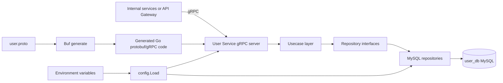
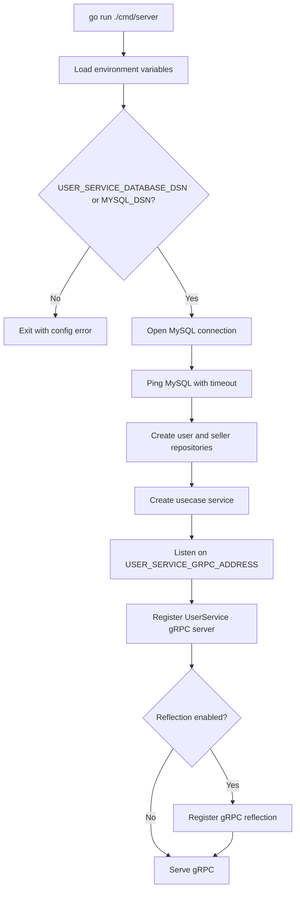
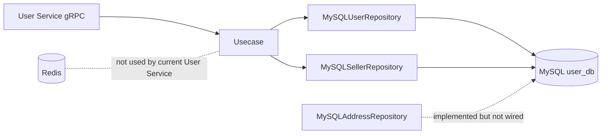

# User Service Dependency Setup Guide

Service Name: User Service

This document is the main dependency guide for the User Service. It is based on the actual project files in `docs/`, `TaskImplementation/User Service/`, `backend/services/user-service/`, `proto/`, `api/master-api.json`, database migrations, and module files.

Note: "Not clearly found in project files." ka matlab hai ki docs me idea ho sakta hai, but actual source/config file current project me clearly available nahi hai.

## 1. Service Overview

User Service profile-related data ka owner hai. Ye Auth Service ka replacement nahi hai.

User Service owns:

| Area | Current project status |
|---|---|
| User profile | Implemented in domain/usecase/repository/gRPC |
| Seller profile read | Implemented in repository/usecase/gRPC |
| Address persistence | Repository and DB tables implemented, but usecase/gRPC wiring missing |
| KYC metadata persistence | Repository and DB table implemented, but usecase/gRPC wiring missing |
| REST profile APIs | Planned in docs/API contract, but API Gateway code not clearly found |
| Events/audit expansion | Documented in tasks, but not implemented in code |

Primary backend entrypoint:

```text
backend/services/user-service/cmd/server/main.go
```

The running service starts a gRPC server and connects to MySQL.

## 2. All Detected Dependencies

| Dependency | Required/Optional | Why User Service uses it | Evidence |
|---|---|---|---|
| Go 1.24 | Required | Backend service code run/build/test karne ke liye | `backend/services/user-service/go.mod` |
| Go Modules | Required | Go dependencies and checksums manage karta hai | `go.mod`, `go.sum` |
| Go Workspace | Required for local multi-module dev | User Service local generated proto module ko use karta hai | `backend/go.work` |
| MySQL 8 compatible DB | Required at runtime | `user_db` stores users, addresses, seller profiles, KYC metadata | migrations and repository code |
| MySQL Go driver | Required | Go app ko MySQL se connect karne ke liye | `github.com/go-sql-driver/mysql` |
| gRPC | Required | Internal service-to-service API expose karta hai | proto, generated code, gRPC server |
| Protocol Buffers | Required | Typed request/response contract define karta hai | `proto/ecommerce/user/v1/user.proto` |
| Buf | Required only when proto changes | Proto lint/generate workflow | `proto/buf.yaml`, `proto/buf.gen.yaml` |
| go-sqlmock | Test dependency | Repository unit tests real DB ke bina run hote hain | `go.mod` |
| Environment variables | Required | DSN, gRPC address, DB pool, logging config | `internal/config/config.go` |
| Docker | Optional local dependency | MySQL container run karne ke liye useful, but no service Dockerfile found | no Dockerfile/compose found |

Not detected as current User Service runtime dependencies:

| Item | Status | Finding |
|---|---|---|
| Redis | Not Applicable | User Service code me Redis client/env usage not clearly found. |
| Kafka/RabbitMQ | Not Applicable | Events are documented in Task 8, but no event publisher/outbox code found. |
| Frontend source | Not clearly found | `frontend/*` me source/package files not clearly found; only `dist`, `.vite`, and `node_modules` artifacts. |
| API Gateway implementation | Partial | `backend/services/api-gateway/.env` exists, but gateway Go source code not clearly found. |

## 3. Dependency Flow



## 4. Service Startup Flow



## 5. Backend To DB/gRPC/Redis Flow



## 6. Setup Order

| Order | Step | Notes |
|---:|---|---|
| 1 | Install Go 1.24 compatible toolchain | Required for backend and tests. |
| 2 | Download Go modules | `go mod download` inside `backend/services/user-service`. |
| 3 | Start MySQL | Native MySQL or Docker MySQL. |
| 4 | Create DB/user permissions | `user_db` and runtime DB user must exist or migration user must have create permissions. |
| 5 | Apply migrations | Run `001_create_user_tables.up.sql`. |
| 6 | Export environment variables | Code reads OS env. It does not load `.env` automatically. |
| 7 | Start User Service backend | Suggested command based on project structure: `go run ./cmd/server`. |
| 8 | Verify gRPC | Use `grpcurl` if installed and reflection enabled. |
| 9 | Run tests | `go test ./...` passes in the current workspace. |

## 7. Backend Start Process

Suggested command based on project structure:

```bash
cd backend/services/user-service
set -a
. ./.env
set +a
go run ./cmd/server
```

Alternative without `.env` file:

```bash
cd backend/services/user-service
export USER_SERVICE_DATABASE_DSN='ecommerce_user:Ecom8880User@tcp(127.0.0.1:3306)/user_db?parseTime=true&charset=utf8mb4&loc=UTC'
export USER_SERVICE_GRPC_ADDRESS=':50052'
go run ./cmd/server
```

Verify:

```bash
grpcurl -plaintext localhost:50052 list
grpcurl -plaintext localhost:50052 describe ecommerce.user.v1.UserService
```

## 8. Frontend Start Process

Frontend source for User Service API integration is not clearly found in project files.

What was found:

| Path | Finding |
|---|---|
| `frontend/user-app/dist/` | Built artifact exists |
| `frontend/seller-dashboard/dist/` | Built artifact exists |
| `frontend/superadmin-panel/dist/` | Built artifact exists |
| `frontend/*/package.json` | Not clearly found |
| `frontend/*/src` | Not clearly found |
| User profile API integration code | Not clearly found |

So no frontend start command can be confirmed from source files. If frontend source is restored later, add package docs and env variables there.

## 9. gRPC/Proto Setup

Current proto file:

```text
proto/ecommerce/user/v1/user.proto
```

Current generated Go code:

```text
backend/shared/gen/go/ecommerce/user/v1/user.pb.go
backend/shared/gen/go/ecommerce/user/v1/user_grpc.pb.go
```

Current implemented gRPC methods:

| Method | Implemented in proto | Implemented in gRPC server |
|---|---:|---:|
| `CreateUser` | Yes | Yes |
| `GetUser` | Yes | Yes |
| `UpdateUserProfile` | Yes | Yes |
| `GetSellerProfile` | Yes | Yes |

Planned in docs/API contract but missing from current proto/server:

| Method | Finding |
|---|---|
| `BatchGetUsers` | Not clearly found in proto/server |
| `ListUserAddresses` | Repository exists, but proto/server missing |
| `CreateAddress` | Repository exists, but proto/server missing |
| `UpdateAddress` | Repository exists, but proto/server missing |
| `DeleteAddress` | Repository exists, but proto/server missing |
| `UpdateSellerProfile` | Repository method exists, but usecase/proto/server missing |
| `UpdateUserStatus` | Documented in service docs, not clearly found in proto/server |

Suggested command based on project structure if proto changes:

```bash
cd proto
buf generate
```

## 10. Docker Setup

No checked-in User Service Dockerfile or docker-compose file was found.

Docker is only an optional local setup path for MySQL. Suggested command based on project structure:

```bash
docker run --name ecommerce-user-mysql \
  -e MYSQL_ROOT_PASSWORD=root \
  -e MYSQL_DATABASE=user_db \
  -e MYSQL_USER=ecommerce_user \
  -e MYSQL_PASSWORD=Ecom8880User \
  -p 3306:3306 \
  -d mysql:8
```

If host port `3306` is busy, use `3307:3306` and update the DSN port to `3307`.

## 11. Database Setup

Migration files:

```text
backend/services/user-service/migrations/001_create_user_tables.up.sql
backend/services/user-service/migrations/001_create_user_tables.down.sql
```

Tables created:

| Table | Purpose |
|---|---|
| `users` | User profile mirror and status |
| `user_addresses` | Shipping/billing address records |
| `seller_profiles` | Seller profile and approval status |
| `seller_kyc_documents` | KYC metadata and review status |

Suggested command based on project structure:

```bash
mysql -h 127.0.0.1 -P 3306 -u root -p < backend/services/user-service/migrations/001_create_user_tables.up.sql
```

Verify:

```bash
mysql -h 127.0.0.1 -P 3306 -u ecommerce_user -p user_db -e "SHOW TABLES;"
```

## 12. Environment Variables

The code loads environment variables from OS env using `os.Getenv`. It does not automatically parse `.env`.

| Variable | Required | Default | Purpose |
|---|---:|---|---|
| `USER_SERVICE_DATABASE_DSN` | Yes | None | Main MySQL DSN |
| `MYSQL_DSN` | Conditional | None | Fallback if main DSN is blank |
| `USER_SERVICE_GRPC_ADDRESS` | No | `:50052` | gRPC listen address |
| `USER_SERVICE_GRPC_REFLECTION` | No | `true` | Enables gRPC reflection |
| `USER_SERVICE_SHUTDOWN_TIMEOUT` | No | `10s` | Graceful shutdown timeout |
| `USER_SERVICE_DB_MAX_OPEN_CONNS` | No | `25` | DB pool max open |
| `USER_SERVICE_DB_MAX_IDLE_CONNS` | No | `25` | DB pool max idle |
| `USER_SERVICE_DB_CONN_MAX_LIFETIME` | No | `5m` | DB connection lifetime |
| `USER_SERVICE_DB_PING_TIMEOUT` | No | `5s` | Startup DB ping timeout |
| `USER_SERVICE_LOG_LEVEL` | No | `info` | JSON log level |

## 13. Ports Table

| Port | Used by | Required for User Service? | Notes |
|---:|---|---:|---|
| `50052` | User Service gRPC | Yes | Default from `USER_SERVICE_GRPC_ADDRESS=:50052` |
| `3306` | MySQL | Yes | Standard local MySQL port |
| `3307` | MySQL alternate | Optional | Use only if `3306` is busy |
| `8080` | API Gateway HTTP | Integration only | `.env` exists, gateway source not clearly found |
| `6379` | Redis | No | User Service does not use Redis currently |

## 14. Missing / Incomplete Implementation Audit

| Area | Status | Finding | Suggested Fix |
|------|--------|---------|---------------|
| Task implementation incomplete | Partial | Backend code covers domain, MySQL repository, current gRPC methods. Task 5-8 are documented but source implementation not clearly found. | Implement remaining tasks in source after dependency docs, starting with proto/usecase gaps. |
| Dependency not installed | Partial | Go modules are present and tests pass. Local MySQL, Docker, Buf, grpcurl cannot be assumed installed. | Add onboarding commands and verify locally with `go version`, `mysql --version`, `grpcurl -version`, `buf --version`. |
| go.mod dependency missing | Completed | Required Go modules for current code are present. | Keep `go.mod` updated when adding new imports. |
| go.sum not updated | Completed | `go test ./...` passed and checksums exist. | Run `go mod tidy` after dependency changes. |
| Service not registered in go.work | Completed | `backend/go.work` includes `./services/user-service` and `./shared/gen/go`. | Keep workspace updated when modules are added. |
| Dockerfile missing | Missing | No User Service Dockerfile found. | Add service Dockerfile in future DevOps task. |
| docker-compose service missing | Missing | No compose file found for User Service/MySQL. | Add local compose with MySQL healthcheck and optional service container. |
| .env.example missing | Missing | No `.env.example` found. | Create sanitized `.env.example` later. Do not put real passwords. |
| Environment variables missing | Partial | `.env` exists locally, but code needs exported OS env and no example file exists. | Document `set -a; . ./.env; set +a` or add config loader consciously. |
| Config not loaded | Partial | `internal/config/config.go` loads OS env and validates key values. It does not auto-load `.env`. | Keep OS-env loading or add an explicit dev-only `.env` loader if desired. |
| Migration missing | Completed | `001_create_user_tables.up.sql` exists. | Add migration version tracking tool if more migrations arrive. |
| Migration rollback missing | Completed | `001_create_user_tables.down.sql` exists. | Test rollback in a disposable DB. |
| Migration version tracking | Missing | No `golang-migrate`, `goose`, or schema version table setup found. | Standardize one migration runner. |
| MySQL table/index/foreign key missing | Completed | Baseline tables, unique keys, indexes, and FKs exist. | Add future indexes only with measured query needs. |
| Repository not wired | Partial | User and seller repositories are wired in `main.go`. Address repository exists but is not wired into usecase/server. | Extend usecase constructor and gRPC methods when address APIs are implemented. |
| Usecase/service not wired | Partial | Current usecase supports create/get/update profile and get seller profile. Address, seller update, KYC workflows, user status are not wired. | Add usecase methods matching API/proto scope. |
| Handler/controller not wired | Partial | gRPC handler is wired. REST/API Gateway handler not clearly found. | Implement API Gateway handlers and routes for profile/address/seller APIs. |
| Routes not registered | Missing | No API Gateway route registration source found. | Add gateway router and user handler registration. |
| gRPC proto missing | Partial | Current proto exists but lacks planned address, seller update, batch get, and status methods. | Update proto carefully and regenerate code. |
| Generated protobuf code missing | Partial | Generated Go code exists for current proto only. Planned methods are not generated. | Run `buf generate` after proto updates. |
| gRPC server not registered | Completed | `RegisterUserServiceServer` is called in `cmd/server/main.go`. | Keep registration close to server startup. |
| gRPC client not configured | Partial | API Gateway `.env` has `USER_GRPC_ADDR=localhost:50052`, but client code not clearly found. | Implement gateway gRPC client wrapper. |
| Frontend API integration missing | Missing | Frontend source integration not clearly found in project files. | Restore/add frontend source and profile API client. |
| Frontend env missing | Missing | Frontend env files/manifests not clearly found. | Add sanitized frontend env examples when source exists. |
| Health check missing | Missing | No gRPC health service or HTTP health endpoint found. | Add `grpc_health_v1` health service or gateway health integration. |
| Logging missing | Partial | Structured `slog` and gRPC logging/recovery interceptors exist. No central logging/metrics/tracing found. | Add metrics/tracing and avoid PII in logs. |
| Validation missing | Partial | Domain validation and lightweight gRPC required-field checks exist. Full Task 6 gateway/usecase validation coverage is partial. | Add field-level validation for all planned operations. |
| Redis dependency | Not Applicable | No Redis usage in current User Service code. | Do not add Redis until cache/rate limit feature needs it. |
| Event/MQ dependency | Not Applicable | Task 8 events are documented only; no outbox/MQ code found. | Add outbox and MQ dependency only when event feature is implemented. |

## 15. Final Checklist

| Check | Status |
|---|---|
| `TaskImplementation/Dependency/` exists | Done |
| Main dependency guide created | Done |
| Separate dependency files created for actual/current dependencies | Done |
| Backend code was not modified | Done |
| Business logic was not modified | Done |
| Existing task markdown files were not overwritten | Done |
| User Service gRPC dependency documented | Done |
| MySQL setup and migration documented | Done |
| Environment variables documented | Done |
| Missing Docker/compose/frontend/gateway gaps documented | Done |
| `go test ./...` checked for current backend | Passed |

