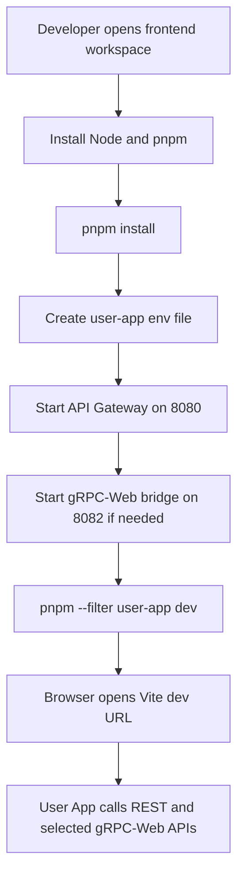
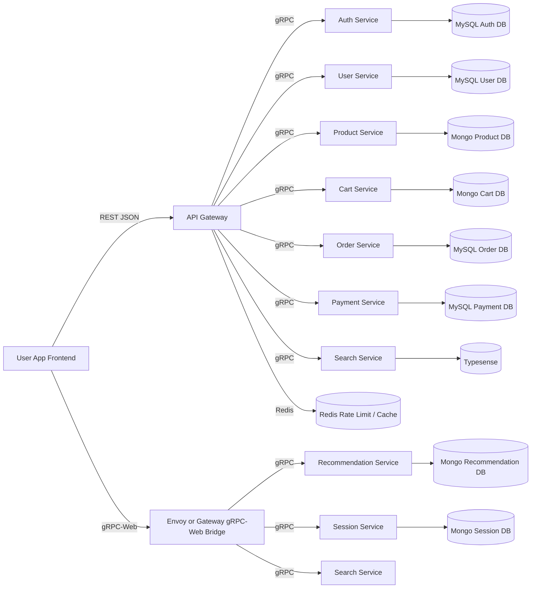

# User App Frontend - Main Dependency Documentation

Service Name: `User App Frontend`

This document is based on the current project files under `docs/`, `TaskImplementation/User App Frontend/`, `frontend/user-app/`, `frontend/packages/proto-client/`, `api/master-api.json`, `backend/`, and `database/`.

Important note: backend source code, original `.proto` files, Dockerfiles, docker-compose files, and migration folders were not clearly found in project files. Frontend source code and generated TypeScript protobuf files are present.

## 1. Service Overview

`User App Frontend` buyer-facing React app hai. Iska kaam users ko product browse, auth, cart, checkout, profile, addresses, orders, wishlist, search, recommendations, and session tracking UI provide karna hai.

Frontend direct database se connect nahi karta. Browser mostly REST API Gateway ko call karta hai through `VITE_API_BASE_URL`. Selected typed calls gRPC-Web se hoti hain through `VITE_GRPC_WEB_BASE_URL`.

Current implementation location:

| Area | Path |
|------|------|
| App source | `frontend/user-app/src/` |
| App package | `frontend/user-app/package.json` |
| Frontend workspace | `frontend/package.json`, `frontend/pnpm-workspace.yaml` |
| Shared generated proto client | `frontend/packages/proto-client/` |
| Env example | `frontend/user-app/.env.example` |
| API contract | `api/master-api.json` |
| Task docs | `TaskImplementation/User App Frontend/*.md` |

## 2. All Detected Dependencies

| Dependency | Status | Required? | Where Used | Notes |
|------------|--------|-----------|------------|-------|
| Node.js `>=22.13.0` | Completed | Required | `frontend/package.json`, `frontend/user-app/package.json` | Runtime for tooling. |
| pnpm `>=11.5.0` | Completed | Required | `frontend/package.json`, `frontend/pnpm-workspace.yaml` | Workspace package manager. |
| React `19.2.6` + React DOM | Completed | Required | `frontend/user-app/src/main.tsx`, pages/components | UI rendering. |
| TypeScript `6.0.3` | Completed | Required | `tsconfig*.json`, package scripts | Strict typing and build. |
| Vite `8.0.14` | Completed | Required | `vite.config.ts`, `package.json` | Dev server and build. |
| Tailwind CSS `4.3.0` | Completed | Required | `vite.config.ts`, `globals.css` | Styling. |
| React Router DOM `7.16.0` | Completed | Required | `src/routes/index.tsx` | Routing. |
| lucide-react `1.17.0` | Completed | Optional but used | app shell/features | Icons. |
| Fetch API / REST API Gateway | Completed frontend side | Required | `src/lib/http.ts`, feature `api/*.ts` | Gateway runtime must be running separately. |
| TanStack React Query `5.100.14` | Completed | Required | `src/lib/query-client.ts`, feature hooks | Server-state cache. |
| Zustand `5.0.14` | Completed | Required | `src/stores/*.ts` | UI/auth/session state. |
| React Hook Form | Completed | Required | auth/profile/address/checkout forms | Form state. |
| Zod | Completed | Required | `features/*/*schema*.ts` | Validation schemas. |
| @hookform/resolvers | Completed | Required | form components/pages | Connects Zod to React Hook Form. |
| @connectrpc/connect | Completed | Required for gRPC-Web | `src/lib/grpc-client.ts`, `grpc-errors.ts` | Typed RPC client. |
| @connectrpc/connect-web | Completed | Required for gRPC-Web | `src/lib/grpc-client.ts` | Browser gRPC-Web transport. |
| @bufbuild/protobuf | Completed | Required for generated proto | generated `*_pb.ts` files | Protobuf runtime. |
| @ecommerce/proto-client | Completed | Required for gRPC-Web | workspace package | Shared generated TS proto client. |
| gRPC-Web bridge / Envoy or gateway bridge | Partial | Required if gRPC features enabled | `VITE_GRPC_WEB_BASE_URL` | Config not clearly found in project files. |
| Vitest + jsdom + Testing Library | Completed | Dev required | `vitest.config.ts`, tests | Unit/component tests. |
| ESLint + TypeScript ESLint | Completed | Dev required | `eslint.config.js` | Linting. |
| Docker | Missing actual files | Optional/planned | docs only | No Dockerfile/compose found. |
| MySQL / MongoDB / Redis / Typesense | Not Applicable direct frontend | Backend required | docs/database/backend env | Frontend does not connect directly. |

## 3. Dependency Flow

```mermaid
flowchart LR
    Browser[Browser] --> UserApp[User App Frontend]
    UserApp --> React[React + React DOM]
    UserApp --> Router[React Router]
    UserApp --> Query[React Query]
    UserApp --> Zustand[Zustand Stores]
    UserApp --> Forms[React Hook Form + Zod]
    UserApp --> HTTP[REST HTTP Client]
    UserApp --> GRPC[gRPC-Web Client]

    HTTP --> ApiGateway[API Gateway at VITE_API_BASE_URL]
    GRPC --> GrpcBridge[gRPC-Web Bridge at VITE_GRPC_WEB_BASE_URL]
    GRPC --> ProtoClient[@ecommerce/proto-client]
    ProtoClient --> Generated[Generated TS Protobuf Files]

    ApiGateway --> Auth[Auth Service]
    ApiGateway --> User[User Service]
    ApiGateway --> Product[Product Service]
    ApiGateway --> Cart[Cart Service]
    ApiGateway --> Order[Order Service]
    ApiGateway --> Payment[Payment Service]
    ApiGateway --> Search[Search Service]
    ApiGateway --> Wishlist[Wishlist Service]
    ApiGateway --> Notification[Notification Service]

    GrpcBridge --> Recommendation[Recommendation Service]
    GrpcBridge --> SearchGrpc[Search Service]
    GrpcBridge --> Session[Session Service]
```

## 4. Setup Order

1. Install Node.js `>=22.13.0`.
2. Enable/install pnpm `>=11.5.0`.
3. From `frontend/`, install workspace packages.
4. Create frontend local env from `.env.example`.
5. Start backend API Gateway on `http://localhost:8080`.
6. Start gRPC-Web bridge on `http://localhost:8082`, if gRPC-Web features are needed.
7. Start `user-app` Vite dev server.
8. Run typecheck, lint, tests, and build.

Suggested command based on project structure:

```bash
cd frontend
corepack enable
pnpm install
cp user-app/.env.example user-app/.env.local
pnpm --filter user-app dev
```

## 5. Service Startup Flow



## 6. Backend Start Process

Backend start command is not clearly found in project files.

What is clearly found:

| Backend Area | Finding |
|--------------|---------|
| `backend/go.work` | Exists, but only includes `./services/auth-service`. |
| Backend service `.env` files | Found under `backend/services/*/.env`. |
| Go source files | Not clearly found in current project files. |
| API Gateway env | `HTTP_ADDR=:8080`, internal gRPC target env keys exist. |
| Docker Compose | Not clearly found in project files. |

Suggested command based on project structure, only after backend source exists:

```bash
cd backend
go work sync
go run ./services/api-gateway/cmd/server
```

If this command fails, reason likely hai ki API Gateway Go source files current tree me missing hain.

## 7. Frontend Start Process

Exact commands from package scripts:

```bash
cd frontend
pnpm install
pnpm --filter user-app dev
```

Other useful commands:

```bash
pnpm --filter user-app typecheck
pnpm --filter user-app lint
pnpm --filter user-app test
pnpm --filter user-app build
pnpm --filter user-app preview
```

Root workspace shortcuts:

```bash
cd frontend
pnpm dev:user
pnpm build:user
pnpm lint:user
pnpm typecheck:user
```

## 8. gRPC / Proto Setup

gRPC-Web frontend setup is present.

| Item | Status | Path |
|------|--------|------|
| gRPC-Web transport | Completed | `frontend/user-app/src/lib/grpc-client.ts` |
| gRPC interceptors | Completed | `frontend/user-app/src/lib/grpc-interceptors.ts` |
| gRPC error mapping | Completed | `frontend/user-app/src/lib/grpc-errors.ts` |
| Shared proto client package | Completed | `frontend/packages/proto-client/` |
| Generated TS protobuf files | Completed for selected services | `frontend/packages/proto-client/src/gen/ecommerce/...` |
| Original `.proto` files | Missing | Not clearly found in project files. |
| Buf config | Missing | Not clearly found in project files. |
| Envoy/gRPC-Web bridge config | Missing | Not clearly found in project files. |

Detected gRPC-Web services:

| Service | Method Used | Frontend Wrapper |
|---------|-------------|------------------|
| `RecommendationService` | `getRecommendations` | `features/recommendation/api/recommendation.grpc.ts` |
| `SearchService` | `autocomplete` | `features/search/api/autocomplete.grpc.ts` |
| `SessionService` | `ingestEvent` | `features/analytics/api/session-events.grpc.ts` |

## 9. Docker Setup

Docker is documented as planned in `docs/11-devops-external-services.md`, but actual Dockerfiles and docker-compose files were not clearly found in project files.

Status for this service:

| Item | Status | Finding |
|------|--------|---------|
| Frontend Dockerfile | Missing | No `Dockerfile` found. |
| docker-compose service | Missing | No compose file found. |
| Nginx config for static app | Missing | Referenced in docs, file not found. |

Suggested command based on project structure, after Docker files are added:

```bash
docker compose -f infra/compose/docker-compose.local.yml up -d
```

## 10. Database Setup

`User App Frontend` has no direct DB dependency.

Frontend talks to API Gateway and gRPC-Web bridge. Backend services own data:

| Data System | Directly Used By Frontend? | Backend Context |
|-------------|----------------------------|-----------------|
| MySQL | No | Auth, User, Order, Payment, CMS, Admin data per docs/database. |
| MongoDB | No | Product, Cart, Wishlist, Recommendation, Session, Notification data per docs/database. |
| Redis | No | API Gateway rate limits, sessions/cache per docs/env. |
| Typesense | No | Search Service index. |

Migrations folder was not clearly found in project files. `database/draw.sql` has MySQL schema design, but it is not split into service up/down migrations.

## 11. Environment Variables

Frontend env variables are defined in `frontend/user-app/.env.example`.

| Variable | Required? | Default / Example | Purpose |
|----------|-----------|-------------------|---------|
| `VITE_API_BASE_URL` | Required | `http://localhost:8080` | REST API Gateway base URL. |
| `VITE_GRPC_WEB_BASE_URL` | Required for gRPC-Web | `http://localhost:8082` | gRPC-Web bridge base URL. |
| `VITE_GRPC_WEB_TIMEOUT_MS` | Optional | `5000` | Default gRPC-Web timeout. |
| `VITE_APP_ENV` | Optional | `local` | Must be `local`, `development`, `staging`, or `production`. |
| `VITE_PAYMENT_PROVIDERS` | Optional | `stripe,razorpay` | Payment provider names shown by checkout UI. |

Security note: Vite env vars with `VITE_` prefix browser bundle me expose hote hain. Secret keys yahan kabhi mat rakho.

## 12. Ports Table

| Component | Port / URL | Source | Status |
|-----------|------------|--------|--------|
| User App Vite dev server | `http://localhost:5173` | Vite default, no custom port found | Suggested |
| User App Vite preview | `http://localhost:4173` | Vite default | Suggested |
| API Gateway REST | `http://localhost:8080` | `frontend/user-app/.env.example`, `backend/services/api-gateway/.env` | Detected |
| gRPC-Web bridge | `http://localhost:8082` | `frontend/user-app/.env.example` | Env detected, bridge config missing |
| API Gateway internal Auth gRPC | `localhost:50051` | `backend/services/api-gateway/.env` | Backend env only |
| API Gateway internal User gRPC | `localhost:50052` | `backend/services/api-gateway/.env` | Backend env only |
| API Gateway internal Cart gRPC | `localhost:50054` | `backend/services/api-gateway/.env` | Backend env only |
| API Gateway internal Search gRPC | `localhost:50058` | `backend/services/api-gateway/.env` | Backend env only |
| API Gateway Redis | `localhost:6379` | `backend/services/api-gateway/.env` | Backend env only |

## 13. Backend to DB / gRPC / Redis Flow

Frontend does not call DB directly. The expected backend flow from docs is:



## 14. Missing / Incomplete Implementation Audit

| Area | Status | Finding | Suggested Fix |
|------|--------|---------|---------------|
| Task implementation incomplete | Partial | Frontend source exists for tasks 1-8, but task markdown says docs were originally created before source. Backend/runtime pieces are not clearly found. | Keep task docs updated with current source status. Add backend/runtime implementation docs when available. |
| Dependency not installed | Completed | `frontend/pnpm-lock.yaml` and `node_modules` are present for frontend dependencies. | Run `pnpm install` after dependency changes. |
| go.mod dependency missing | Not Applicable | User App Frontend is not a Go module. Backend Go source/go.mod files are not clearly found. | Add backend `go.mod` files when backend services are implemented. |
| go.sum not updated | Not Applicable | No backend Go module source clearly found for this frontend service. | Run `go mod tidy` in each backend service when Go modules exist. |
| Service not registered in go.work | Not Applicable | Frontend service does not belong in `go.work`. Current `backend/go.work` only references `./services/auth-service`. | Register backend Go modules in `go.work` when their source exists. |
| Dockerfile missing | Missing | No Dockerfile found for `frontend/user-app`. | Add frontend Dockerfile or infra Dockerfile for production static build. |
| docker-compose service missing | Missing | No docker-compose file found. | Add local compose for API Gateway, gRPC-Web bridge, backend services, and data services. |
| `.env.example` missing | Completed | `frontend/user-app/.env.example` exists. Backend services have `.env`, but `.env.example` not clearly found. | Keep frontend `.env.example` updated; add backend `.env.example` files without secrets. |
| Environment variables missing | Completed | Required frontend env keys exist. | Create local `.env.local` before dev run. |
| Config not loaded | Completed | `src/lib/env.ts` reads and validates frontend env. | Add tests for invalid env values if needed. |
| Migration missing | Not Applicable | Frontend has no DB. Backend migrations folder not clearly found. | Add service-owned up/down migrations for MySQL services. |
| Migration rollback missing | Not Applicable | Frontend has no DB. Rollback migrations not clearly found. | Add `.down.sql` migrations for backend schema changes. |
| MySQL table/index/foreign key missing | Not Applicable | Frontend does not own MySQL tables. `database/draw.sql` contains design-level MySQL schema. | Convert design SQL into service migrations when backend is implemented. |
| Repository not wired | Not Applicable | No frontend repository layer. Backend repository code not clearly found. | Wire repositories in backend services when source exists. |
| Usecase/service not wired | Not Applicable | Frontend has feature hooks/pages, not backend usecases. Backend source not clearly found. | Wire backend usecases in service constructors when source exists. |
| Handler/controller not wired | Partial | Frontend routes are wired. Backend gateway handlers not clearly found. | Implement API Gateway handlers/routes for `api/master-api.json`. |
| Routes not registered | Completed frontend side | `src/routes/index.tsx` registers user app routes. Backend route registration not clearly found. | Add gateway route registration and tests when backend exists. |
| gRPC proto missing | Missing | Original `.proto` files not found. | Add `proto/ecommerce/.../*.proto` and Buf config. |
| Generated protobuf code missing | Partial | Generated TS files exist for recommendation/search/session only. | Generate TS clients for all browser-safe gRPC-Web services needed by frontend. |
| gRPC server not registered | Missing | Backend gRPC server registration not clearly found. | Register backend gRPC servers when backend source exists. |
| gRPC client not configured | Completed frontend side | `src/lib/grpc-client.ts` creates recommendation/search/session clients. | Add bridge/server config and smoke tests. |
| Frontend API integration missing | Completed | Feature REST API wrappers exist for auth/products/cart/orders/profile/wishlist/payment. | Add MSW/API mock tests for all critical flows. |
| Frontend env missing | Completed | `.env.example` exists and `env.ts` has defaults/validation. | Document production env values in deployment docs. |
| Health check missing | Missing | No frontend health file/route or Docker health check found. | Add static `/health` asset or deployment-level health check. |
| Logging missing | Partial | Error normalization exists. Structured frontend logging/telemetry not clearly found. | Add safe client logging/analytics policy without leaking PII. |
| Validation missing | Partial | Zod form schemas and gRPC input guards exist. Backend request validation not clearly found. | Add backend gateway validation and expand frontend schema coverage. |
| Payment provider integration incomplete | Partial | `VITE_PAYMENT_PROVIDERS` exists, but no Stripe/Razorpay SDK dependency found. | Add provider SDK only when real payment integration is implemented. |
| gRPC-Web bridge missing | Missing | Env points to `8082`, but Envoy/gateway bridge config not found. | Add Envoy config or gateway gRPC-Web bridge and CORS config. |

## 15. Final Checklist

| Checklist | Status |
|-----------|--------|
| Service-specific dependency docs created | Completed |
| `TaskImplementation/Dependency/` folder created | Completed |
| Main dependency file created | Completed |
| Frontend dependencies documented | Completed |
| REST API Gateway dependency documented | Completed |
| gRPC-Web dependency documented | Completed |
| Protobuf dependency documented | Completed |
| Environment variables documented | Completed |
| Docker gap documented | Completed |
| Database direct dependency status documented | Completed |
| Missing/incomplete audit included | Completed |
| No business logic modified | Completed |
