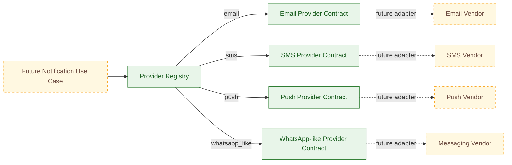
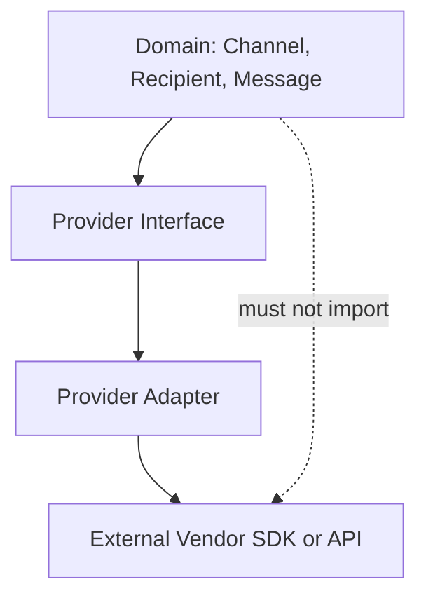
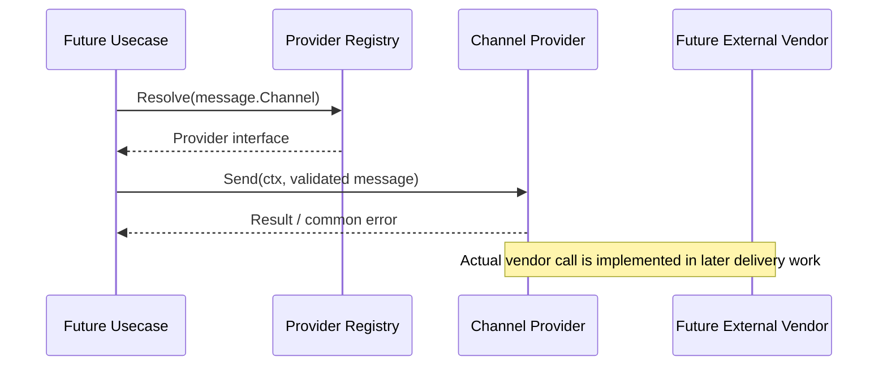
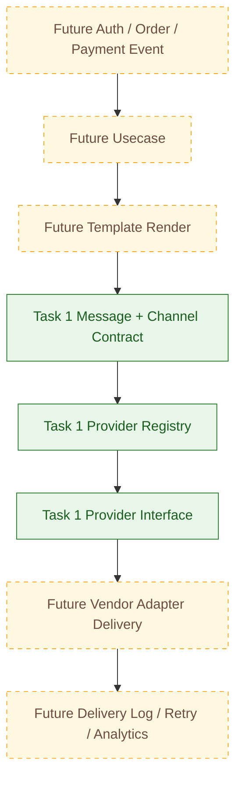
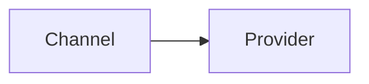

# 🔔 Notification Service - Task 1: Define Channels


## 📌 Task Summary

| Field | Detail |
|---|---|
| Task Name | Define channels |
| Requirement Source | `docs/01-micro-tasks.md` → `Notification Service` → Task 1 |
| Original Goal | Email, SMS, push, WhatsApp-like provider abstraction define karo |
| Dependency | Platform foundation |
| Priority | P1 |
| Deliverable | Channel aur provider contracts ka clean, implementable design |
| Implementation Type | Documentation + reference code design only |

> **Simple Hinglish goal:** Notification Service ko kisi ek email/SMS vendor se tightly bind nahi karna hai. Pehle common channel aur provider contract define karenge, jisse future me OTP, order update, payment message ya price-drop notification same service pattern se different channels par bheje ja sakein.

---

## ✅ Output Created

Is task ke request ke according repository me sirf ye documentation artifact create kiya gaya:

```text
TaskImplementation/
└── Notification Service/
    └── task1.md
```

> 🟢 **Important:** Neeche diya gaya Go structure aur code implementation blueprint/reference example hai. Is task output me `backend/services/notification-service/` source files, database, provider integration, ya runtime service create nahi ki gayi.

---

## 📚 Project Docs Se Kya Samjha

| Document | Task 1 ke liye relevant decision |
|---|---|
| `docs/01-micro-tasks.md` | Task 1 ka exact scope: Email, SMS, push, WhatsApp-like abstraction |
| `docs/02-system-architecture.md` | Notification Service asynchronous ecosystem ka part hai; services independent ownership follow karti hain |
| `docs/03-folder-structure.md` | Future Go service me `internal/domain/` aur `internal/provider/` locations recommended hain |
| `docs/04-microservice-design.md` | Notification Service ka broad purpose templates, logs aur retries bhi hai, lekin wo Task 1 ke baad aate hain |
| `docs/05-database-design.md` | MongoDB future Notification persistence choice hai; channel definition ke liye DB abhi required nahi |
| `docs/11-devops-external-services.md` | Mailpit/email testing aur message queue future integration context provide karte hain |
| `docs/13-developer-guide.md` | Go clean layer rule: domain ko transport ya DB details se independent rakhna hai |

---

## 🚧 Scope Boundary

Task 1 ka kaam **contract define karna** hai, notification feature end-to-end chalana nahi.

### Included In Task 1

| Included | Kyon |
|---|---|
| Supported channel names: `email`, `sms`, `push`, `whatsapp_like` | Service ki common vocabulary set hoti hai |
| Channel-specific recipient/content contract | Har channel ko required input clear hota hai |
| Provider interface | Vendor replace/add karna simple hota hai |
| Provider registry/router concept | Channel se correct adapter choose karne ka predictable pattern |
| Common provider error/result model | Calling code ko vendor-specific errors handle nahi karne padte |
| Reference unit tests | Abstraction ka expected behaviour clear hota hai |

### Not Included In Task 1

| Deferred Item | Kis Later Task Ka Part Hai |
|---|---|
| MongoDB collections aur delivery log storage | Notification Service - Task 2 |
| Template rendering, template variables | Notification Service - Task 3 |
| Real OTP email/SMS delivery flow | Notification Service - Task 4 |
| Kafka/RabbitMQ consumers | Notification Service - Task 5 |
| Retry scheduling aur dead-letter queue | Notification Service - Task 6 |
| Opt-in/opt-out preferences | Notification Service - Task 7 |
| Delivered/opened metrics analytics | Notification Service - Task 8 |

> 🔴 **Boundary rule:** Is guide me provider `Send` contract define hota hai, lekin kisi real vendor ko network call karke notification bhejne ka implementation nahi hota.

---

## 🧠 Core Concepts

### Channel Kya Hai?

`Channel` batata hai message user tak kis medium se jayega. Example: email inbox, SMS number, mobile push token, ya WhatsApp-like messaging number.

### Provider Kya Hai?

`Provider` ek adapter hai jo common service request ko external vendor-compatible delivery request me convert karega. Example ke liye future me email ke liye SMTP/API vendor, SMS ke liye SMS gateway, aur push ke liye push gateway plug kiya ja sakta hai.

### Abstraction Kyon Zaruri Hai?

| Without Abstraction | With Abstraction |
|---|---|
| Business flow vendor-specific SDK directly call karega | Business flow sirf common `Provider` interface call karega |
| Vendor change par OTP/order logic edit hoga | Sirf provider adapter replace hoga |
| Testing ke liye real vendor ya complex mocks chahiye | Fake provider easily inject ho sakta hai |
| Errors different formats me leak honge | Common result/error vocabulary milegi |

---

## 📬 Supported Channel Definitions

| Channel Constant | Display Name | Destination | Minimum Content | Future Typical Use |
|---|---|---|---|---|
| `email` | Email | Valid email address | Subject + text body; optional HTML body | OTP, receipts, order detail |
| `sms` | SMS | E.164 phone number, e.g. `+919876543210` | Short text body | OTP, urgent status |
| `push` | Push Notification | Device registration token | Title + body; optional data map | App order updates, offers |
| `whatsapp_like` | WhatsApp-like | E.164 phone number | Text or provider-approved template reference later | Transaction alerts |

### Design Decisions

| Decision | Explanation In Hinglish |
|---|---|
| Internal constant `whatsapp_like` use hoga | Service contract kisi single branded/vendor API par depend nahi karega |
| Email aur push me richer content allowed hoga | In channels ka UI subject/title aur metadata render kar sakta hai |
| SMS body minimal rahegi | SMS length aur cost constraints future implementation ko affect karenge |
| Phone internally E.164 format me expected hoga | Multiple countries aur providers ke liye consistent input milta hai |

---

## 🏗️ Target Design Architecture

Ye diagram Task 1 me define hone wali abstraction ko show karta hai. Dashed nodes future tasks hain, current implementation output nahi.



### Separation Rule



`domain` ko external vendor SDK, MongoDB, queue, gRPC ya HTTP handler ka knowledge nahi hona chahiye. Isi separation se service testable aur maintainable rehti hai.

---

## 📁 Clean Implementation Folder Structure

Jab Notification Service source implementation begin ho, Task 1 definitions ko project convention ke saath is tarah organize kiya ja sakta hai:

```text
backend/
└── services/
    └── notification-service/
        ├── cmd/
        │   └── server/
        │       └── main.go                  # Future service bootstrap
        └── internal/
            ├── domain/
            │   ├── channel.go               # Task 1: channel enum/capabilities
            │   └── message.go               # Task 1: recipient/content request types
            └── provider/
                ├── provider.go              # Task 1: interface, result and errors
                ├── registry.go              # Task 1: channel-to-provider resolver
                ├── email_provider.go        # Task 1: email adapter contract/skeleton
                ├── sms_provider.go          # Task 1: SMS adapter contract/skeleton
                ├── push_provider.go         # Task 1: push adapter contract/skeleton
                └── whatsapp_provider.go     # Task 1: WhatsApp-like adapter skeleton
```

### Files Intentionally Absent In Task 1

```text
internal/repository/mongo_notification_repository.go   # Task 2
internal/usecase/send_otp.go                           # Task 4
internal/events/consumer.go                            # Task 5
internal/retry/                                        # Task 6
```

> 🟡 Existing architecture doc me future full-service folder examples hain. Upar ka structure usi convention ko Task 1 ke limited abstraction scope me narrow karta hai.

---

## 🪜 Step-by-Step Implementation

## Step 1: Channel Vocabulary Freeze Karo

Sabse pehle supported values ko typed constants banao. String literals ko usecase ke andar repeat karne se typo aur unsupported channel bugs aa sakte hain.

### Reference Code: `internal/domain/channel.go`

```go
package domain

import "fmt"

// Channel user tak notification pahunchne ka medium represent karta hai.
type Channel string

const (
	ChannelEmail        Channel = "email"
	ChannelSMS          Channel = "sms"
	ChannelPush         Channel = "push"
	ChannelWhatsAppLike Channel = "whatsapp_like"
)

func (c Channel) IsSupported() bool {
	switch c {
	case ChannelEmail, ChannelSMS, ChannelPush, ChannelWhatsAppLike:
		return true
	default:
		return false
	}
}

func ParseChannel(value string) (Channel, error) {
	channel := Channel(value)
	if !channel.IsSupported() {
		return "", fmt.Errorf("unsupported notification channel: %s", value)
	}
	return channel, nil
}
```

### Kaise Built Hua?

| Part | Reason |
|---|---|
| `type Channel string` | JSON/event/config me readable string rahega, Go me type safety bhi milegi |
| Constants | Har layer exactly same canonical names use karegi |
| `IsSupported()` | Input boundary par unknown channel reject karne ke kaam aayega |
| `ParseChannel()` | Raw input ko validated domain value me convert karta hai |

---

## Step 2: Channel Capability Model Define Karo

Sab channels same content support nahi karte. Email ko subject/HTML chahiye ho sakta hai; push ko title aur device token; SMS mostly text based hota hai. Capabilities future validation ko generic banayengi.

### Reference Code: `internal/domain/channel.go` Extension

```go
package domain

type ChannelCapabilities struct {
	RequiresSubject bool
	SupportsHTML    bool
	SupportsData    bool
	RecipientKind   string
}

func (c Channel) Capabilities() (ChannelCapabilities, error) {
	switch c {
	case ChannelEmail:
		return ChannelCapabilities{
			RequiresSubject: true,
			SupportsHTML:    true,
			RecipientKind:   "email_address",
		}, nil
	case ChannelSMS:
		return ChannelCapabilities{
			RecipientKind: "phone_e164",
		}, nil
	case ChannelPush:
		return ChannelCapabilities{
			SupportsData:  true,
			RecipientKind: "device_token",
		}, nil
	case ChannelWhatsAppLike:
		return ChannelCapabilities{
			RecipientKind: "phone_e164",
		}, nil
	default:
		return ChannelCapabilities{}, ErrUnsupportedChannel
	}
}
```

### Iska Benefit

- Validator ko vendor-specific logic ke bajay channel rule pata chalega.
- Future template engine ko clear rahega kis channel ko kaunsa render output chahiye.
- Push ke custom data aur email HTML ko SMS par accidentally bhejne se roka ja sakta hai.

> 🟡 `ErrUnsupportedChannel` common domain/provider errors ke step me define hoga.

---

## Step 3: Common Message Contract Banao

Provider ko ek predictable input object milna chahiye. Recipient aur content separate rakhne se sensitive destination fields aur message body cleanly validate/mask ho sakte hain.

### Reference Code: `internal/domain/message.go`

```go
package domain

type Recipient struct {
	Email       string
	PhoneE164   string
	DeviceToken string
}

type Content struct {
	Subject  string
	TextBody string
	HTMLBody string
	Title    string
	Data     map[string]string
}

type Message struct {
	Channel       Channel
	Recipient     Recipient
	Content       Content
	CorrelationID string
}
```

### Field Explanation

| Field | Use |
|---|---|
| `Channel` | Provider registry ko adapter select karne deta hai |
| `Recipient.Email` | Sirf email channel destination |
| `Recipient.PhoneE164` | SMS aur WhatsApp-like destination |
| `Recipient.DeviceToken` | Push destination |
| `Content.Subject` / `HTMLBody` | Email-compatible content |
| `Content.Title` / `Data` | Push-compatible content |
| `Content.TextBody` | Common plain-text content |
| `CorrelationID` | Future logs/traces me same request ko locate karne ke liye non-provider identifier |

### Deliberately Missing Fields

| Missing Field | Reason |
|---|---|
| `TemplateID` / variables | Template engine Task 3 ka concern hai |
| `OTP` value | OTP sending workflow Task 4 me aayega |
| `RetryCount` | Retry/DLQ Task 6 me aayega |
| `UserPreference` | Preferences Task 7 me aayengi |

---

## Step 4: Input Validation Rules Define Karo

Task 1 me validation ka purpose vendor network request chalana nahi, balki provider contract ke valid inputs declare karna hai.

### Validation Matrix

| Channel | Required Destination | Required Content | Invalid Example |
|---|---|---|---|
| Email | Non-empty email address | `Subject`, `TextBody` | Email blank, only push title supplied |
| SMS | E.164 phone number | `TextBody` | Phone without country prefix |
| Push | Non-empty device token | `Title`, `TextBody` | Phone number as push destination |
| WhatsApp-like | E.164 phone number | `TextBody` | Empty text body |

### Reference Code: Validation Shape

```go
package domain

import (
	"errors"
	"strings"
)

var (
	ErrUnsupportedChannel = errors.New("unsupported notification channel")
	ErrInvalidRecipient   = errors.New("invalid notification recipient")
	ErrInvalidContent     = errors.New("invalid notification content")
)

func (m Message) Validate() error {
	if !m.Channel.IsSupported() {
		return ErrUnsupportedChannel
	}

	switch m.Channel {
	case ChannelEmail:
		if strings.TrimSpace(m.Recipient.Email) == "" {
			return ErrInvalidRecipient
		}
		if strings.TrimSpace(m.Content.Subject) == "" ||
			strings.TrimSpace(m.Content.TextBody) == "" {
			return ErrInvalidContent
		}
	case ChannelSMS, ChannelWhatsAppLike:
		if !strings.HasPrefix(m.Recipient.PhoneE164, "+") {
			return ErrInvalidRecipient
		}
		if strings.TrimSpace(m.Content.TextBody) == "" {
			return ErrInvalidContent
		}
	case ChannelPush:
		if strings.TrimSpace(m.Recipient.DeviceToken) == "" {
			return ErrInvalidRecipient
		}
		if strings.TrimSpace(m.Content.Title) == "" ||
			strings.TrimSpace(m.Content.TextBody) == "" {
			return ErrInvalidContent
		}
	}

	return nil
}
```

### Beginner Note

Ye lightweight validation contract samjhane ke liye hai. Full email parser, strict E.164 validation, message size limits aur vendor policy checks actual implementation/testing ke time refine honge, bina Task 1 ke channel design ko change kiye.

---

## Step 5: Provider Interface Define Karo

Har channel adapter ek common interface implement karega. Usecase ko ye nahi pata hona chahiye ki actual vendor ka SDK, HTTP API ya SMTP transport kya hai.

### Reference Code: `internal/provider/provider.go`

```go
package provider

import (
	"context"
	"errors"

	"github.com/example/ecommerce-platform/backend/services/notification-service/internal/domain"
)

var (
	ErrProviderUnavailable = errors.New("notification provider unavailable")
	ErrProviderRejected    = errors.New("notification provider rejected message")
)

type DeliveryStatus string

const (
	StatusAccepted DeliveryStatus = "accepted"
	StatusRejected DeliveryStatus = "rejected"
)

type Result struct {
	Channel           domain.Channel
	ProviderName      string
	ProviderMessageID string
	Status            DeliveryStatus
}

type Provider interface {
	Name() string
	Channel() domain.Channel
	Send(ctx context.Context, message domain.Message) (Result, error)
}
```

### Interface Explanation

| Method / Type | Explanation |
|---|---|
| `Name()` | Debug/config ke liye adapter identity, jaise future `mailpit` ya a chosen vendor |
| `Channel()` | Registry ko batata hai adapter kis medium ko support karta hai |
| `Send(...)` | Common delivery operation contract; real API call later delivery task me implement hogi |
| `Result` | Vendor response ko normalized basic shape deta hai |
| `ErrProviderUnavailable` | Temporary provider/downstream issue ko generic error banata hai |
| `ErrProviderRejected` | Provider ne request reject ki, jaise invalid destination/content |

> 🟢 Context first argument project ke Go coding standard se aligned hai. Isse future timeout/cancellation propagate ki ja sakti hai.

---

## Step 6: Provider Adapter Boundary Define Karo

Har vendor ke liye application layer edit karne ke bajay adapter apna channel implement karega. Task 1 me interface boundary important hai; SDK selection aur real outbound request future work hai.

### Email Adapter Contract Example

```go
package provider

import (
	"context"

	"github.com/example/ecommerce-platform/backend/services/notification-service/internal/domain"
)

// EmailClient future email vendor/SMTP wrapper ka narrow boundary hai.
type EmailClient interface {
	Deliver(ctx context.Context, to, subject, textBody, htmlBody string) (string, error)
}

type EmailProvider struct {
	name   string
	client EmailClient
}

func (p *EmailProvider) Name() string            { return p.name }
func (p *EmailProvider) Channel() domain.Channel { return domain.ChannelEmail }
```

### Remaining Adapter Shapes

```go
type SMSClient interface {
	Deliver(ctx context.Context, phoneE164, textBody string) (string, error)
}

type PushClient interface {
	Deliver(
		ctx context.Context,
		deviceToken string,
		title string,
		textBody string,
		data map[string]string,
	) (string, error)
}

type WhatsAppLikeClient interface {
	Deliver(ctx context.Context, phoneE164, textBody string) (string, error)
}
```

### Kaise Scale Karega?

| Future Change | Task 1 Abstraction Ka Response |
|---|---|
| Email vendor replace karna | New `EmailClient` implementation wire karo; domain unchanged |
| Do SMS vendors fallback me rakhna | Multiple SMS provider instances/config later add kar sakte hain |
| Push data payload add karna | `Content.Data` already provider-neutral field hai |
| Vendor failure retry karna | Common error ko Task 6 retry policy consume karegi |

---

## Step 7: Channel-To-Provider Registry Define Karo

Registry ka role sirf correct channel ke liye configured provider resolve karna hai. Ye templates generate nahi karta, events consume nahi karta, aur retries execute nahi karta.

### Reference Code: `internal/provider/registry.go`

```go
package provider

import (
	"fmt"

	"github.com/example/ecommerce-platform/backend/services/notification-service/internal/domain"
)

type Registry struct {
	byChannel map[domain.Channel]Provider
}

func NewRegistry(providers ...Provider) (*Registry, error) {
	registry := &Registry{byChannel: make(map[domain.Channel]Provider)}

	for _, item := range providers {
		channel := item.Channel()
		if !channel.IsSupported() {
			return nil, fmt.Errorf("register provider %q: %w", item.Name(), domain.ErrUnsupportedChannel)
		}
		if _, exists := registry.byChannel[channel]; exists {
			return nil, fmt.Errorf("provider already registered for channel %q", channel)
		}
		registry.byChannel[channel] = item
	}

	return registry, nil
}

func (r *Registry) Resolve(channel domain.Channel) (Provider, error) {
	item, ok := r.byChannel[channel]
	if !ok {
		return nil, fmt.Errorf("no provider configured for channel %q", channel)
	}
	return item, nil
}
```

### Registry Flow Diagram



### Design Limitation (Intentional)

Task 1 registry ek channel ke liye ek selected provider rakhta hai. Priority-based fallback, weighted routing, circuit breaker aur retry orchestration abhi include nahi hain, kyunki wo delivery reliability scope ko prematurely introduce karenge.

---

## Step 8: Configuration Contract Document Karo

Real secret values kabhi code ya docs me store nahi karne hain. Task 1 me sirf configuration naming convention define karna enough hai.

### Future Environment Variable Shape

```dotenv
# Channel enablement
NOTIFICATION_EMAIL_ENABLED=true
NOTIFICATION_SMS_ENABLED=false
NOTIFICATION_PUSH_ENABLED=false
NOTIFICATION_WHATSAPP_LIKE_ENABLED=false

# Provider selection; real vendor choose hone ke baad values final hongi
NOTIFICATION_EMAIL_PROVIDER=mailpit
NOTIFICATION_SMS_PROVIDER=replace_me
NOTIFICATION_PUSH_PROVIDER=replace_me
NOTIFICATION_WHATSAPP_LIKE_PROVIDER=replace_me

# Secret examples - source control me actual value commit mat karo
NOTIFICATION_EMAIL_API_KEY=secret_from_vault
NOTIFICATION_SMS_API_KEY=secret_from_vault
```

### Config Rules

| Rule | Explanation |
|---|---|
| Channel aur provider ko separate config rakho | Channel disabled ho sakta hai even if vendor configured hai |
| Credentials environment/secret manager se lo | Git history me tokens leak nahi hone chahiye |
| Disabled channel resolve/send reject kare | Accidental message delivery avoid hoti hai |
| Provider name logs me aa sakta hai, API key nahi | Debugging useful, secret safe |

---

## Step 9: Error Aur Security Contract Define Karo

Notification data me personally identifiable information (PII) ho sakti hai. Abstraction stage par hi safety rule likhne se later implementation secure banti hai.

### Common Error Categories

| Error | Meaning | Future Caller Behaviour |
|---|---|---|
| `ErrUnsupportedChannel` | Requested channel known nahi hai | Request reject; retry nahi |
| `ErrInvalidRecipient` | Destination missing/invalid hai | Validation error; retry nahi |
| `ErrInvalidContent` | Required content missing hai | Caller/template correction |
| `ErrProviderUnavailable` | Provider temporarily unavailable hai | Task 6 me retry candidate |
| `ErrProviderRejected` | Provider ne payload reject kiya | Log reason safely; usually no blind retry |

### Security Rules

| Data | Logging Rule |
|---|---|
| Email address | Mask karo: `p***@example.com` |
| Phone number | Last digits ke alawa mask karo: `******3210` |
| Device token | Full token kabhi log nahi; short fingerprint use karo |
| API key / auth token | Never log/store in delivery payload |
| OTP body | Plain OTP logs me kabhi mat daalo |

> 🔐 Task 1 me logging system implement nahi hota, lekin provider contract ko is policy ke according design karna mandatory expectation hai.

---

## Step 10: Tests Ka Blueprint Banao

Provider abstraction useful tab hai jab behaviour easily testable ho. Real vendor ke bina fake provider se registry aur domain validation test ki ja sakti hai.

### Reference Fake Provider

```go
type fakeProvider struct {
	name    string
	channel domain.Channel
}

func (f fakeProvider) Name() string            { return f.name }
func (f fakeProvider) Channel() domain.Channel { return f.channel }
func (f fakeProvider) Send(context.Context, domain.Message) (provider.Result, error) {
	return provider.Result{
		Channel:      f.channel,
		ProviderName: f.name,
		Status:       provider.StatusAccepted,
	}, nil
}
```

### Minimum Unit Test Cases

| Test | Expected Result |
|---|---|
| `ParseChannel("email")` | `ChannelEmail`, no error |
| `ParseChannel("fax")` | Unsupported-channel error |
| Valid email message validation | Pass |
| Email without subject | `ErrInvalidContent` |
| SMS without `+` phone prefix | `ErrInvalidRecipient` |
| Push without device token | `ErrInvalidRecipient` |
| Register and resolve each channel | Same fake provider returned |
| Duplicate providers for same channel | Registry construction fails |
| Resolve non-configured supported channel | Clear configuration error |

### Future Test Command

Go service source files jab actual repository me implement ho jayengi, normal unit test command ye hoga:

```bash
go test ./backend/services/notification-service/...
```

> 🟡 Is documentation-only output me notification Go package create nahi hua hai, isliye above command abhi Task 1 artifact ke against run karne ke liye applicable nahi hai.

---

## 🔄 Future End-to-End Flow Context

Neeche wala flow sirf dikhata hai Task 1 abstraction future tasks me kahan fit hogi. Yellow/future steps is task me implemented nahi hain.



---

## 🛠️ External Libraries And Tools

### Task 1 Me Actual Dependency Usage

| Library / Tool | Used In This Deliverable? | Why / Notes |
|---|---:|---|
| Markdown | ✅ Yes | Implementation guide likhne ke liye |
| Mermaid | ✅ Yes | Markdown-friendly architecture aur flow diagrams ke liye |
| Shields.io badges | ✅ Yes | Task status/scope visually readable banane ke liye |
| Go standard library (`context`, `errors`, `fmt`, `strings`) | Reference snippets only | Interfaces aur simple validation examples ke liye; third-party install nahi chahiye |
| MongoDB client | ❌ No | Task 2 scope |
| Email/SMS/push vendor SDK | ❌ No | Real sending Task 4/later delivery implementation ka scope |
| Kafka/RabbitMQ client | ❌ No | Task 5 scope |

### Mermaid Kaise Use Hota Hai?

Mermaid koi backend runtime dependency nahi hai. GitHub jaise supported Markdown viewer fenced `mermaid` blocks ko diagram ke roop me render karte hain:

````markdown

````

**Install:** Is repository task ke liye koi install required nahi. Local editor preview ke liye Mermaid-supporting Markdown extension optional hai.

### Shields.io Badges Kaise Use Hote Hain?

Badges normal Markdown image links hain:

```markdown

```

**Install:** Koi install nahi; internet-enabled Markdown viewer image render kar dega. Offline mode me sirf badge image unavailable ho sakti hai, documentation content unaffected rahega.

### Future Provider Tools Ke Baare Me Note

Project docs local email testing ke liye **Mailpit** mention karte hain. Mailpit real emails bhejne ke bajay local inbox capture karne ke kaam aa sakta hai, lekin wo Task 1 ke output me configure/install nahi kiya gaya.

Future local setup example, jab email adapter implementation scope me aaye:

```bash
docker run --rm -p 1025:1025 -p 8025:8025 axllent/mailpit
```

| Tool | Future Why | Future Use |
|---|---|---|
| Mailpit | Dev environment me accidental real email avoid karke email inspect karna | SMTP adapter ko `localhost:1025` point karna; UI `localhost:8025` par dekhna |
| Vendor Go SDK / HTTP client | Real email/SMS/push delivery | Provider choose hone aur sending task start hone ke baad hi install/use karna |

> 🔴 Provider SDK ka naam abhi intentionally finalize nahi kiya gaya. Task 1 vendor-neutral abstraction define karta hai.

---

## 🧪 Example Usage (Contract Demonstration Only)

Ye example show karta hai ki future calling code abstraction ko kaise use karega. Isme template rendering, DB logging aur real adapter delivery intentionally nahi hai.

```go
message := domain.Message{
	Channel: domain.ChannelEmail,
	Recipient: domain.Recipient{
		Email: "buyer@example.com",
	},
	Content: domain.Content{
		Subject:  "Your order update",
		TextBody: "Your order has been packed.",
	},
	CorrelationID: "request_123",
}

if err := message.Validate(); err != nil {
	return err
}

selected, err := registry.Resolve(message.Channel)
if err != nil {
	return err
}

result, err := selected.Send(ctx, message)
```

### Is Example Me Kya Hota Hai?

1. Caller common `Message` construct karta hai.
2. Domain validation required channel fields verify karti hai.
3. Registry `email` provider interface return karta hai.
4. Caller common `Send` method call karta hai.
5. Actual external delivery adapter aur result persistence future tasks me complete hongi.

---

## ✅ Definition Of Done Checklist

| Check | Status |
|---|---:|
| Notification Service Task 1 ka requirement identify kiya | ✅ |
| Email channel defined | ✅ |
| SMS channel defined | ✅ |
| Push channel defined | ✅ |
| WhatsApp-like channel defined | ✅ |
| Vendor-neutral provider interface documented | ✅ |
| Channel registry/routing pattern documented | ✅ |
| Validation and common error expectations documented | ✅ |
| Security/PII boundaries documented | ✅ |
| Folder structure provided | ✅ |
| Code examples provided | ✅ |
| Mermaid architecture/flow diagrams provided | ✅ |
| External libraries/tools and usage explained | ✅ |
| MongoDB/templates/OTP/events/retries/preferences/analytics excluded | ✅ |

---

## 🎯 Final Result

Notification Service ke liye ab ek clear Task 1 blueprint ready hai:

- Four channel identities stable hain: `email`, `sms`, `push`, `whatsapp_like`.
- Domain message contract channel-specific destinations aur content expectations clear karta hai.
- `Provider` interface future vendor adapters ko business workflow se isolate karta hai.
- `Registry` channel ke basis par configured provider resolve karne ka simple design deta hai.
- Security, validation, tests aur future boundaries pehle se documented hain.

Is foundation ke baad hi later tasks safely MongoDB persistence, templates, OTP dispatch, event consumers, retry/DLQ, preferences aur analytics add karenge.
