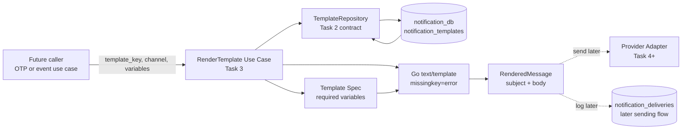
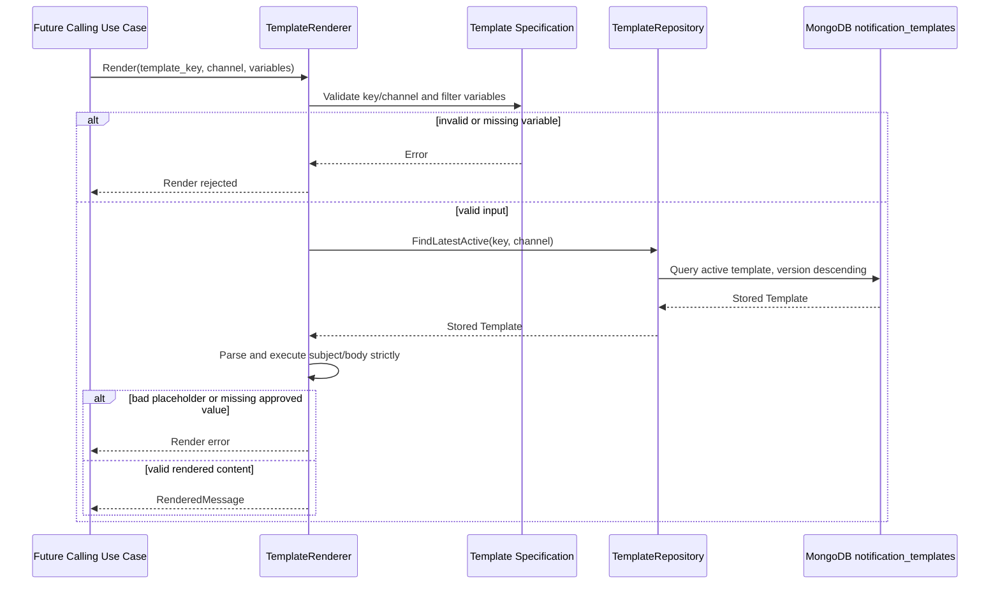

# 🔔 Notification Service - Task 3: Template Engine


## 📌 Task Summary

| Field | Detail |
|---|---|
| Task Name | Template engine |
| Requirement Source | `docs/01-micro-tasks.md` → `Notification Service` → Task 3 |
| Original Goal | OTP, order updates, payment aur promotional templates variables ke saath banao |
| Dependency | Notification Service - Task 2: MongoDB choice and `notification_templates` |
| Priority | `P1` |
| Runtime Design | Go standard library `text/template` based strict renderer |
| Included Template Families | OTP, order update, payment update, promotional offer |
| Deliverable | Template rendering implementation blueprint and usage guide |
| Implementation Type | Documentation + reference code/design only |

> **Simple Hinglish goal:** MongoDB me stored active template ko `template_key` aur `channel` se load karke, approved variables jaise customer name, order id ya OTP se safe tarike se final subject/body render karna hai. Is Task me message provider ko actually send nahi karna hai.

---

## ✅ Output Created

Request ke according repository me sirf ye documentation artifact add kiya gaya:

```text
TaskImplementation/
└── Notification Service/
    ├── task1.md                         # Existing: channel abstraction guide
    ├── task2.md                         # Existing: MongoDB persistence guide
    └── task3.md                         # Current: template engine guide
```

> 🟢 **Important:** Neeche diya gaya Go code, MongoDB seed data aur test plan implementable reference blueprint hai. Is output me `backend/services/notification-service/`, MongoDB data, dependencies, provider adapters, APIs ya running service physically create nahi kiye gaye.

---

## 📚 Project Docs Se Kya Samjha

| Document | Task 3 ke liye relevant decision |
|---|---|
| `docs/01-micro-tasks.md` | Exact task: OTP, order update, payment aur promotional templates variables ke saath banana |
| `docs/02-system-architecture.md` | Notification Service apna Mongo Notification DB own karega; other services direct DB query nahi karenge |
| `docs/03-folder-structure.md` | Source implementation ka home `backend/services/notification-service/internal/` hoga |
| `docs/04-microservice-design.md` | Notification Service templates manage karega aur future gRPC responsibility me `RenderTemplate` listed hai |
| `docs/05-database-design.md` | Notification data MongoDB me rahega because template/provider payload flexible hai |
| `database/mongodb-schema-design.md` | `notification_db.notification_templates` me `template_key`, `channel`, `subject`, `body`, `status`, `version` fields defined hain |
| `TaskImplementation/Notification Service/task1.md` | Allowed channels: `email`, `sms`, `push`, `whatsapp_like` |
| `TaskImplementation/Notification Service/task2.md` | Latest active template lookup repository me hoga; variable interpolation Task 3 ka responsibility hai |

---

## 🚧 Scope Boundary

Task 3 ka kaam **template define, validate aur render karna** hai. Rendered content ko external vendor tak bhejna ya delivery lifecycle run karna abhi nahi hoga.

### Included In Task 3

| Included | Kyon |
|---|---|
| Four required template families | Requirement ko directly satisfy karte hain |
| Channel-specific subject/body examples | Email aur SMS/push content format alag ho sakta hai |
| Strict variable contract | Missing ya typo variable ke saath broken message send hone se pehle error milega |
| Latest active MongoDB template read | Task 2 storage ko renderer ke saath connect karta hai |
| Go renderer use case design | Business logic repository/provider se separate rahegi |
| Rendering tests and security checks | OTP aur user-facing text reliably handle hoga |

### Not Included In Task 3

| Deferred Item | Later Task / Reason |
|---|---|
| Actual email/SMS provider call for OTP | Notification Service - Task 4 |
| Auth Service se live OTP integration | Task 4 dependency |
| Order/payment/user event consumers | Notification Service - Task 5 |
| Retry, scheduling aur DLQ | Notification Service - Task 6 |
| Marketing opt-in/opt-out enforcement | Notification Service - Task 7 |
| Sent/delivered/opened analytics | Notification Service - Task 8 |
| Admin REST/gRPC transport implementation | Template engine use case ke outside; documented API contract later wire hoga |
| Real service source files or MongoDB inserts | Requested output sirf `task3.md` hai |

> 🔴 **Boundary rule:** Task 3 ka successful result `RenderedMessage` hai, `sent` delivery record ya provider response nahi.

---

## 🔗 Existing Contracts Jo Reuse Honge

### Task 1: Channels

| Channel Value | Task 3 Rendering Output |
|---|---|
| `email` | `subject` + `body` render honge |
| `sms` | Short `body`; `subject` empty rahega |
| `push` | Current stored model me `body`; title support future additive template field ho sakta hai |
| `whatsapp_like` | Text `body`; provider-approved template constraints sending stage par handle honge |

### Task 2: Stored Template Shape

Task 2 ka template document Task 3 ke input ke roop me reuse hoga:

```json
{
  "_id": "tpl_order_paid_email",
  "template_key": "order_paid",
  "channel": "email",
  "subject": "Your order is confirmed",
  "body": "Hi {{.name}}, your order {{.order_id}} is confirmed.",
  "status": "active",
  "version": 1,
  "created_at": "2026-05-18T00:00:00Z",
  "updated_at": "2026-05-18T00:00:00Z"
}
```

### ⚠️ Placeholder Syntax Clarification

Task 2 ke example me `{{name}}` placeholder intent dikhaya gaya tha. Is Task 3 design me Go `text/template` use hoga, isliye executable stored templates me variable syntax **dot ke saath** hogi:

| Conceptual Placeholder | Renderable Go Template Placeholder |
|---|---|
| `{{name}}` | `{{.name}}` |
| `{{order_id}}` | `{{.order_id}}` |
| `{{otp}}` | `{{.otp}}` |

> 🟡 Existing seed/example content ko real implementation me save ya migrate karte waqt `{{.variable}}` format me normalize karna hoga. Renderer silent string replacement nahi karega.

---

## 🧭 Rendering Behaviour

### Input Aur Output

| Item | Example |
|---|---|
| Input template key | `order_status_update` |
| Input channel | `email` |
| Input variables | `name=Riya`, `order_id=ORD-1042`, `status=Shipped` |
| Loaded template subject | `Order {{.order_id}} is {{.status}}` |
| Loaded template body | `Hi {{.name}}, your order {{.order_id}} is now {{.status}}.` |
| Rendered subject | `Order ORD-1042 is Shipped` |
| Rendered body | `Hi Riya, your order ORD-1042 is now Shipped.` |

### Rules

| Rule | Behaviour |
|---|---|
| Active version only | Repository newest `status=active` version return karega |
| Known template key only | Undefined template family reject hogi |
| Approved variables only | Har template key ka fixed variable allowlist hoga |
| Missing variable error | `missingkey=error` ke saath incomplete output return nahi hoga |
| Subject conditional | Email subject required/render hoga; non-email me empty subject acceptable hai |
| No provider action | Renderer content return karega, delivery trigger nahi karega |
| Sensitive content logging | OTP aur fully rendered body logs me print nahi honge |

---

## 🗺️ Architecture Diagram



**Hinglish explanation:** Renderer ko caller sirf template identity, channel aur variables deta hai. Renderer repository se active version leta hai, allowlisted variables se subject/body banata hai aur final content return kar deta hai. Provider aur delivery log dotted lines me hain because wo Task 3 execute nahi karta.

---

## 📁 Clean Implementation Folder Structure

### Actual Task Output

```text
TaskImplementation/
└── Notification Service/
    ├── task1.md
    ├── task2.md
    └── task3.md
```

### Future Source Structure For This Blueprint

Project ke documented Go service layout me Task 3 implementation is tarah fit hogi:

```text
backend/
└── services/
    └── notification-service/
        ├── cmd/
        │   └── server/
        │       └── main.go                              # Future dependency wiring
        └── internal/
            ├── domain/
            │   ├── channel.go                           # Task 1: channel constants
            │   ├── template.go                          # Task 2: stored template
            │   └── rendered_message.go                  # Task 3: output contract
            ├── repository/
            │   ├── notification_repository.go           # Task 2: lookup interface
            │   └── mongo_notification_repository.go     # Task 2: Mongo adapter
            └── usecase/
                ├── template_spec.go                     # Task 3: variable allowlists
                ├── render_template.go                   # Task 3: renderer
                └── render_template_test.go              # Task 3: unit tests
```

### Intentionally Absent In Task 3

```text
internal/usecase/send_otp.go              # Task 4
internal/events/consumer.go               # Task 5
internal/retry/                           # Task 6
internal/domain/preference.go             # Task 7
internal/analytics/                       # Task 8
```

---

## Step 1: Template Families Aur Variables Define Karo

Random variable maps pass karne se typo aur data leak ka risk hota hai. Pehle business templates ka clear contract define karenge.

| Template Key | Purpose | Recommended Channels | Required Variables |
|---|---|---|---|
| `otp_verification` | Login/signup OTP batana | `email`, `sms` | `otp`, `expires_in_minutes` |
| `order_status_update` | Order state update batana | `email`, `sms`, `push` | `name`, `order_id`, `status` |
| `payment_status_update` | Payment success/failure result batana | `email`, `sms` | `name`, `order_id`, `payment_status`, `amount` |
| `promotional_offer` | Offer/campaign information batana | `email`, `push` | `name`, `offer_title`, `coupon_code`, `valid_until` |

> 🔵 Task 2 ka existing `order_paid` example ek valid specialized order confirmation key hai. Actual catalog me use case ke hisaab se `order_paid` ko separately register kiya ja sakta hai; Task 3 ke required four families upar clearly cover kiye gaye hain.

### Variable Safety Decisions

| Decision | Hinglish Reason |
|---|---|
| OTP template me `name` required nahi | OTP flow ko minimum sensitive input ke saath render kar sakte hain |
| Amount caller se already display-ready string aayega | Renderer currency calculation/business logic nahi karega |
| Variables plain text honge | Template execution data access ya network operation nahi karega |
| Caller ke extra values renderer ignore karega | Accidentally passed secrets output me appear nahi honge |
| Template missing required key reference kare to error | Broken content provider stage tak nahi jayega |

---

## Step 2: MongoDB Me Renderable Templates Ka Shape Rakho

Task 2 ki `notification_templates` collection hi reuse hogi. Task 3 ke liye body aur email subject me Go-compatible placeholders store honge.

### OTP Email Template

```javascript
db.notification_templates.insertOne({
  _id: "tpl_otp_verification_email_v1",
  template_key: "otp_verification",
  channel: "email",
  subject: "Your verification code",
  body: "Your verification code is {{.otp}}. It expires in {{.expires_in_minutes}} minutes.",
  status: "active",
  version: 1,
  created_at: ISODate("2026-05-27T00:00:00Z"),
  updated_at: ISODate("2026-05-27T00:00:00Z")
})
```

### OTP SMS Template

```javascript
db.notification_templates.insertOne({
  _id: "tpl_otp_verification_sms_v1",
  template_key: "otp_verification",
  channel: "sms",
  body: "Your code is {{.otp}}. Valid for {{.expires_in_minutes}} minutes.",
  status: "active",
  version: 1,
  created_at: ISODate("2026-05-27T00:00:00Z"),
  updated_at: ISODate("2026-05-27T00:00:00Z")
})
```

### Order Update Email Template

```javascript
db.notification_templates.insertOne({
  _id: "tpl_order_status_update_email_v1",
  template_key: "order_status_update",
  channel: "email",
  subject: "Order {{.order_id}} is {{.status}}",
  body: "Hi {{.name}}, your order {{.order_id}} is now {{.status}}.",
  status: "active",
  version: 1,
  created_at: ISODate("2026-05-27T00:00:00Z"),
  updated_at: ISODate("2026-05-27T00:00:00Z")
})
```

### Payment Update Email Template

```javascript
db.notification_templates.insertOne({
  _id: "tpl_payment_status_update_email_v1",
  template_key: "payment_status_update",
  channel: "email",
  subject: "Payment {{.payment_status}} for order {{.order_id}}",
  body: "Hi {{.name}}, payment of {{.amount}} for order {{.order_id}} is {{.payment_status}}.",
  status: "active",
  version: 1,
  created_at: ISODate("2026-05-27T00:00:00Z"),
  updated_at: ISODate("2026-05-27T00:00:00Z")
})
```

### Promotional Push Template

```javascript
db.notification_templates.insertOne({
  _id: "tpl_promotional_offer_push_v1",
  template_key: "promotional_offer",
  channel: "push",
  body: "Hi {{.name}}, {{.offer_title}}! Use {{.coupon_code}} before {{.valid_until}}.",
  status: "active",
  version: 1,
  created_at: ISODate("2026-05-27T00:00:00Z"),
  updated_at: ISODate("2026-05-27T00:00:00Z")
})
```

### MongoDB Read Path

Task 2 me defined compound index latest active template selection ko support karta hai:

```javascript
db.notification_templates.createIndex(
  { template_key: 1, channel: 1, version: -1 }
)
```

Renderer repository se ye type ka lookup request karega:

```javascript
db.notification_templates.find({
  template_key: "order_status_update",
  channel: "email",
  status: "active"
}).sort({ version: -1 }).limit(1)
```

> 🟢 Template ka naya wording publish karna ho to existing active document overwrite karne ke bajay new `version` add karna audit aur rollback ke liye clearer hota hai.

---

## Step 3: Domain Input/Output Contract Banao

Renderer ka API small aur predictable rakhenge. Wo raw provider request nahi banayega.

### Reference Code: `internal/domain/rendered_message.go`

```go
package domain

type TemplateKey string

const (
	TemplateOTPVerification     TemplateKey = "otp_verification"
	TemplateOrderStatusUpdate   TemplateKey = "order_status_update"
	TemplatePaymentStatusUpdate TemplateKey = "payment_status_update"
	TemplatePromotionalOffer    TemplateKey = "promotional_offer"
)

type RenderRequest struct {
	TemplateKey TemplateKey
	Channel     Channel
	Variables   map[string]string
}

type RenderedMessage struct {
	TemplateID      string
	TemplateKey     TemplateKey
	TemplateVersion int
	Channel         Channel
	Subject         string
	Body            string
}
```

### Har Field Ka Role

| Field | Kyon Chahiye |
|---|---|
| `TemplateKey` | Business message family identify karta hai |
| `Channel` | Correct channel-specific document load karta hai |
| `Variables` | Runtime values provide karta hai, e.g. OTP/order status |
| `TemplateID`, `TemplateVersion` | Render outcome ko chosen template revision se trace karne deta hai |
| `Subject`, `Body` | Future provider ko diya ja sakne wala rendered content |

> 🟡 `RenderedMessage` me recipient, provider id, attempts ya delivery status add nahi kiya gaya because wo sending/delivery tasks ki responsibility hai.

---

## Step 4: Template Specification Se Approved Data Filter Karo

Har template key ko sirf required variables milenge. Caller accidentally `password`, `token` ya unnecessary personal data bheje bhi, renderer use template context me expose nahi karega.

### Reference Code: `internal/usecase/template_spec.go`

```go
package usecase

import (
	"fmt"

	"github.com/example/ecommerce-platform/backend/services/notification-service/internal/domain"
)

type templateSpec struct {
	requiredVariables []string
	allowedChannels    map[domain.Channel]bool
}

var templateSpecs = map[domain.TemplateKey]templateSpec{
	domain.TemplateOTPVerification: {
		requiredVariables: []string{"otp", "expires_in_minutes"},
		allowedChannels: map[domain.Channel]bool{
			domain.ChannelEmail: true,
			domain.ChannelSMS:   true,
		},
	},
	domain.TemplateOrderStatusUpdate: {
		requiredVariables: []string{"name", "order_id", "status"},
		allowedChannels: map[domain.Channel]bool{
			domain.ChannelEmail: true,
			domain.ChannelSMS:   true,
			domain.ChannelPush:  true,
		},
	},
	domain.TemplatePaymentStatusUpdate: {
		requiredVariables: []string{"name", "order_id", "payment_status", "amount"},
		allowedChannels: map[domain.Channel]bool{
			domain.ChannelEmail: true,
			domain.ChannelSMS:   true,
		},
	},
	domain.TemplatePromotionalOffer: {
		requiredVariables: []string{"name", "offer_title", "coupon_code", "valid_until"},
		allowedChannels: map[domain.Channel]bool{
			domain.ChannelEmail: true,
			domain.ChannelPush:  true,
		},
	},
}

func approvedVariables(req domain.RenderRequest) (map[string]string, error) {
	spec, ok := templateSpecs[req.TemplateKey]
	if !ok {
		return nil, fmt.Errorf("unsupported template key: %s", req.TemplateKey)
	}
	if !spec.allowedChannels[req.Channel] {
		return nil, fmt.Errorf("channel %s not allowed for template %s", req.Channel, req.TemplateKey)
	}

	approved := make(map[string]string, len(spec.requiredVariables))
	for _, name := range spec.requiredVariables {
		value, ok := req.Variables[name]
		if !ok || value == "" {
			return nil, fmt.Errorf("required template variable is missing: %s", name)
		}
		approved[name] = value
	}
	return approved, nil
}
```

### Ye Kaise Protect Karta Hai?

| Problem | Protection |
|---|---|
| OTP without expiry passed | Request validation fail |
| Promotional message SMS par accidentally render karne ka attempt | Channel allowlist fail |
| Caller ne `access_token` extra pass kiya | Filtered render context me include nahi hoga |
| Stored template ne unknown `.secret` reference kiya | `missingkey=error` rendering fail karega |

---

## Step 5: Repository Contract Reuse Karke Active Template Load Karo

Task 3 new database logic duplicate nahi karega. Task 2 repository interface ko use case me inject karenge:

### Reference Interface: `internal/repository/notification_repository.go`

```go
package repository

import (
	"context"

	"github.com/example/ecommerce-platform/backend/services/notification-service/internal/domain"
)

type TemplateRepository interface {
	FindLatestActive(
		ctx context.Context,
		templateKey string,
		channel domain.Channel,
	) (domain.Template, error)
}
```

| Layer | Task 3 Me Responsibility |
|---|---|
| `repository` | MongoDB se latest active `Template` fetch kare |
| `usecase` | Key/channel/variables validate karke content render kare |
| `domain` | Request aur rendered output types define kare |
| `provider` | Is Task me call nahi hoga |

---

## Step 6: Strict Template Renderer Implement Karo

Go ka `text/template` plain text email, SMS aur push bodies ke liye appropriate hai. `Option("missingkey=error")` missing map variables ko silently `<no value>` banne se rokti hai.

### Reference Code: `internal/usecase/render_template.go`

```go
package usecase

import (
	"bytes"
	"context"
	"fmt"
	"text/template"

	"github.com/example/ecommerce-platform/backend/services/notification-service/internal/domain"
	"github.com/example/ecommerce-platform/backend/services/notification-service/internal/repository"
)

type TemplateRenderer struct {
	templates repository.TemplateRepository
}

func NewTemplateRenderer(templates repository.TemplateRepository) *TemplateRenderer {
	return &TemplateRenderer{templates: templates}
}

func (r *TemplateRenderer) Render(
	ctx context.Context,
	req domain.RenderRequest,
) (domain.RenderedMessage, error) {
	variables, err := approvedVariables(req)
	if err != nil {
		return domain.RenderedMessage{}, err
	}

	stored, err := r.templates.FindLatestActive(ctx, string(req.TemplateKey), req.Channel)
	if err != nil {
		return domain.RenderedMessage{}, fmt.Errorf("load active template: %w", err)
	}

	if stored.Body == "" {
		return domain.RenderedMessage{}, fmt.Errorf("template body is empty")
	}
	if req.Channel == domain.ChannelEmail && stored.Subject == "" {
		return domain.RenderedMessage{}, fmt.Errorf("email template subject is empty")
	}

	subject, err := renderText("subject", stored.Subject, variables)
	if err != nil {
		return domain.RenderedMessage{}, err
	}
	body, err := renderText("body", stored.Body, variables)
	if err != nil {
		return domain.RenderedMessage{}, err
	}

	return domain.RenderedMessage{
		TemplateID:      stored.ID,
		TemplateKey:     req.TemplateKey,
		TemplateVersion: stored.Version,
		Channel:         req.Channel,
		Subject:         subject,
		Body:            body,
	}, nil
}

func renderText(part, source string, variables map[string]string) (string, error) {
	if source == "" {
		return "", nil
	}

	parsed, err := template.New(part).
		Option("missingkey=error").
		Parse(source)
	if err != nil {
		return "", fmt.Errorf("parse template %s: %w", part, err)
	}

	var output bytes.Buffer
	if err := parsed.Execute(&output, variables); err != nil {
		return "", fmt.Errorf("render template %s: %w", part, err)
	}
	return output.String(), nil
}
```

### Renderer Build Explanation

| Code Part | Hinglish Explanation |
|---|---|
| `approvedVariables(req)` | Template family aur channel validate karke sirf allowed runtime data rakhta hai |
| `FindLatestActive(...)` | MongoDB-backed repository se current active wording lata hai |
| Email `Subject` check | User ko blank subject email banne se rokti hai |
| `text/template` parse | Stored content syntax valid hai ya nahi check karta hai |
| `missingkey=error` | `{{.order_id}}` value missing ho to error deta hai |
| `RenderedMessage` return | Provider-independent final content banata hai; send nahi karta |

### HTML Email Note

Current MongoDB design `body` ko plain text content ki tarah define karta hai, isliye reference implementation `text/template` use karta hai. Agar later task me HTML email body explicitly add hoti hai, HTML content ke rendering ke liye Go ka `html/template` use karna chahiye taaki inserted variables escaped rahen.

---

## Step 7: Render Flow Samjho

### Order Update Example

```go
message, err := renderer.Render(ctx, domain.RenderRequest{
	TemplateKey: domain.TemplateOrderStatusUpdate,
	Channel:     domain.ChannelEmail,
	Variables: map[string]string{
		"name":     "Riya",
		"order_id": "ORD-1042",
		"status":   "Shipped",
	},
})
```

Expected result:

```text
Subject: Order ORD-1042 is Shipped
Body:    Hi Riya, your order ORD-1042 is now Shipped.
```

### OTP Example

```go
message, err := renderer.Render(ctx, domain.RenderRequest{
	TemplateKey: domain.TemplateOTPVerification,
	Channel:     domain.ChannelSMS,
	Variables: map[string]string{
		"otp":                "482991",
		"expires_in_minutes": "5",
	},
})
```

Expected result:

```text
Subject:
Body:    Your code is 482991. Valid for 5 minutes.
```

> 🔐 OTP example samjhane ke liye rendered value show karta hai. Production logs aur monitoring events me OTP/body print nahi honi chahiye.

---

## 🔄 Sequence Diagram



---

## Step 8: Errors Ko Clear Banao

Template rendering user-facing delivery se pehle fail ho sakti hai, isliye error categories useful hain.

| Condition | Example Error Behaviour | Meaning |
|---|---|---|
| Unknown key | `unsupported template key: welcome_unknown` | Catalog me registered nahi |
| Invalid channel | `channel sms not allowed for template promotional_offer` | Channel rule violated |
| Missing runtime variable | `required template variable is missing: otp` | Caller input incomplete |
| Template not found | Repository not-found wrapped as `load active template` | Active Mongo document absent |
| Empty email subject | `email template subject is empty` | Stored channel template invalid |
| Parse error | `parse template body` | Mongo content has invalid template syntax |
| Execution error | `render template body` | Stored content references unavailable variable |

### Operational Rule

Render failures ke logs me ye metadata safe tarike se include ho sakta hai:

```text
template_key, channel, template_id, version, error_category, correlation_id
```

Ye values logs me nahi jane chahiye:

```text
otp, rendered_body, access_token, phone_number, full_email_address
```

---

## Step 9: Tests Likho

Task 3 ka core pure rendering logic hai, isliye unit tests fast aur valuable hain. MongoDB ya provider ko unit test ke liye run karna required nahi; fake repository enough hai.

### Required Test Cases

| Test | Input | Expected Result |
|---|---|---|
| Valid OTP SMS | OTP + expiry supplied | Rendered body correct; subject empty |
| Valid order email | Name/order/status supplied | Subject and body variables interpolate |
| Valid payment email | Amount and status supplied | Payment text render succeeds |
| Valid promotional push | Offer fields supplied | Push body render succeeds |
| Missing variable | OTP absent | Render rejected |
| Disallowed channel | Promotional template + SMS | Render rejected before DB call |
| Unknown stored placeholder | Body contains `{{.password}}` | Strict render rejected |
| Invalid stored syntax | Body contains broken braces | Parse rejected |
| Empty email subject | Email stored subject empty | Render rejected |
| Extra secret variable | Caller passes `access_token` | It is filtered; never rendered |

### Reference Unit Test: `internal/usecase/render_template_test.go`

```go
package usecase

import (
	"context"
	"testing"

	"github.com/example/ecommerce-platform/backend/services/notification-service/internal/domain"
)

type fakeTemplateRepository struct {
	template domain.Template
}

func (f fakeTemplateRepository) FindLatestActive(
	_ context.Context,
	_ string,
	_ domain.Channel,
) (domain.Template, error) {
	return f.template, nil
}

func TestRenderOrderEmail(t *testing.T) {
	renderer := NewTemplateRenderer(fakeTemplateRepository{template: domain.Template{
		ID:      "tpl_order_email_v1",
		Subject: "Order {{.order_id}} is {{.status}}",
		Body:    "Hi {{.name}}, your order {{.order_id}} is now {{.status}}.",
		Version: 1,
	}})

	got, err := renderer.Render(context.Background(), domain.RenderRequest{
		TemplateKey: domain.TemplateOrderStatusUpdate,
		Channel:     domain.ChannelEmail,
		Variables: map[string]string{
			"name": "Riya", "order_id": "ORD-1042", "status": "Shipped",
		},
	})
	if err != nil {
		t.Fatalf("Render() error = %v", err)
	}
	if got.Subject != "Order ORD-1042 is Shipped" {
		t.Fatalf("subject = %q", got.Subject)
	}
	if got.Body != "Hi Riya, your order ORD-1042 is now Shipped." {
		t.Fatalf("body = %q", got.Body)
	}
}

func TestRenderRejectsMissingOTP(t *testing.T) {
	renderer := NewTemplateRenderer(fakeTemplateRepository{template: domain.Template{
		Body: "Your code is {{.otp}}.",
	}})

	_, err := renderer.Render(context.Background(), domain.RenderRequest{
		TemplateKey: domain.TemplateOTPVerification,
		Channel:     domain.ChannelSMS,
		Variables:   map[string]string{"expires_in_minutes": "5"},
	})
	if err == nil {
		t.Fatal("Render() expected missing OTP error")
	}
}
```

### Future Verification Commands

Jab documented service Go module/source files actually exist karenge:

```bash
go test ./backend/services/notification-service/...
go test -race ./backend/services/notification-service/...
```

> 🟡 Current documentation-only output me Go package create nahi hua hai, isliye commands abhi is artifact par run karne ke liye applicable nahi hain.

---

## 🛡️ Security And Reliability Checklist

| Check | Implementation Rule |
|---|---|
| OTP secrecy | OTP aur rendered OTP body ko application logs me record mat karo |
| Extra inputs | Allowlist ke bahar ke variables template execution context me copy mat karo |
| Missing fields | Incomplete variable set ko reject karo; broken notification send mat karo |
| Template injection impact | Template editing admin-controlled rahe; end user ko template source provide karne ka option mat do |
| HTML escaping | Future HTML body ke liye `html/template`, plain string concatenation nahi |
| Version traceability | Render outcome me template id/version retain karo for later delivery tracing |
| Database boundary | Template read sirf Notification Service repository ke through ho |
| Promotion compliance | Rendering possible hona sending permission nahi hai; opt-in enforcement Task 7 me hoga |
| OTP lifecycle | Renderer OTP create/verify/expire nahi karta; wo Auth/OTP workflow concern hai |

---

## 🧰 Libraries And Tools

### Runtime / Code Dependencies

| Library / Tool | External? | Why Used | Installation / Usage |
|---|---:|---|---|
| Go `text/template` | No, standard library | Plain-text subject/body me variables safely execute karne ke liye | Alag install nahi; Go import: `import "text/template"` |
| Go `bytes` | No, standard library | Render output buffer me collect karne ke liye | Alag install nahi; Go import: `import "bytes"` |
| MongoDB | Yes, Task 2 dependency | Versioned channel templates ko store/load karne ke liye | Local/project Mongo setup Task 2 follow kare; collection `notification_templates` use hogi |
| MongoDB Shell (`mongosh`) | Yes, development tool | Upar diye seed aur lookup commands manually run/verify karne ke liye | MongoDB tools install ke baad `mongosh "$NOTIFICATION_MONGO_URI"` se connect karke commands run karo |
| MongoDB Go Driver | Yes, Task 2 repository dependency | Future Go repository se MongoDB query ke liye | Service module exist hone par `go get go.mongodb.org/mongo-driver/mongo` |
| Mermaid | Documentation renderer only | Markdown me architecture/flow diagrams readable banane ke liye | GitHub-compatible Markdown viewer diagram render kar sakta hai; runtime service dependency nahi |

### Kya External Template Library Chahiye?

**Nahi.** Is Task ke plain-text templates aur simple variable interpolation ke liye Go ka built-in `text/template` sufficient hai:

```go
parsed, err := template.New("body").
	Option("missingkey=error").
	Parse("Hi {{.name}}, order {{.order_id}} is {{.status}}.")
```

External engine add karne se dependency surface aur template behaviour complexity badhegi, jabki current requirement simple variable replacement se satisfy hoti hai.

### Future MongoDB Driver Usage

Task 2 repository ko actual Go source me implement karne ke baad renderer ko repository inject hoga:

```bash
cd backend/services/notification-service
go get go.mongodb.org/mongo-driver/mongo
go test ./...
```

> 🔵 MongoDB driver installation Task 3 ka newly executed change nahi hai; renderer ko stored templates dene wali Task 2 repository ki future runtime dependency hai.

---

## 🧪 Manual Example Matrix

| Scenario | Stored Body | Variables | Render Result |
|---|---|---|---|
| OTP SMS | `Code: {{.otp}}. Valid {{.expires_in_minutes}} min.` | `otp=482991`, `expires_in_minutes=5` | `Code: 482991. Valid 5 min.` |
| Order Email | `Hi {{.name}}, {{.order_id}} is {{.status}}.` | `name=Riya`, `order_id=ORD-1042`, `status=Packed` | `Hi Riya, ORD-1042 is Packed.` |
| Payment Email | `{{.amount}} payment is {{.payment_status}}.` | `amount=₹1,299`, `payment_status=successful` | `₹1,299 payment is successful.` |
| Promotion Push | `Use {{.coupon_code}} before {{.valid_until}}.` | `coupon_code=SAVE20`, `valid_until=31 May` plus required fields | `Use SAVE20 before 31 May.` |
| Missing order id | `Order {{.order_id}} shipped.` | No `order_id` | Error; no rendered output |

---

## ✅ Task 3 Completion Checklist

| Checklist Item | Status |
|---|---:|
| `TaskImplementation/Notification Service/task3.md` created | ✅ |
| Requirement source and dependency identified | ✅ |
| Scope restricted to template engine only | ✅ |
| OTP template behaviour documented | ✅ |
| Order update template behaviour documented | ✅ |
| Payment template behaviour documented | ✅ |
| Promotional template behaviour documented | ✅ |
| Variable syntax and strict validation explained | ✅ |
| MongoDB template lookup relation explained | ✅ |
| Go code examples provided | ✅ |
| Unit test examples provided | ✅ |
| External tools/libraries and installation guidance provided | ✅ |
| Folder structure provided | ✅ |
| Mermaid architecture and flow diagrams provided | ✅ |
| Sending, events, retries, preferences and analytics excluded | ✅ |

---

## 🎯 Final Outcome

Notification Service - Task 3 ke liye ek clear template engine blueprint ready hai:

- MongoDB me versioned, channel-specific OTP, order, payment aur promotional templates store honge.
- Go `text/template` renderer `{{.variable}}` syntax aur `missingkey=error` ke saath strict output banayega.
- Template specification sirf approved variables expose karegi, jisse typo aur unnecessary sensitive-data leakage ka risk kam hoga.
- Renderer `RenderedMessage` return karega; provider sending aur delivery tracking later tasks ke liye intentionally deferred hain.

Is design ke baad Task 4 OTP delivery flow rendered OTP email/SMS content ko provider abstraction ke saath safely connect kar sakta hai.
