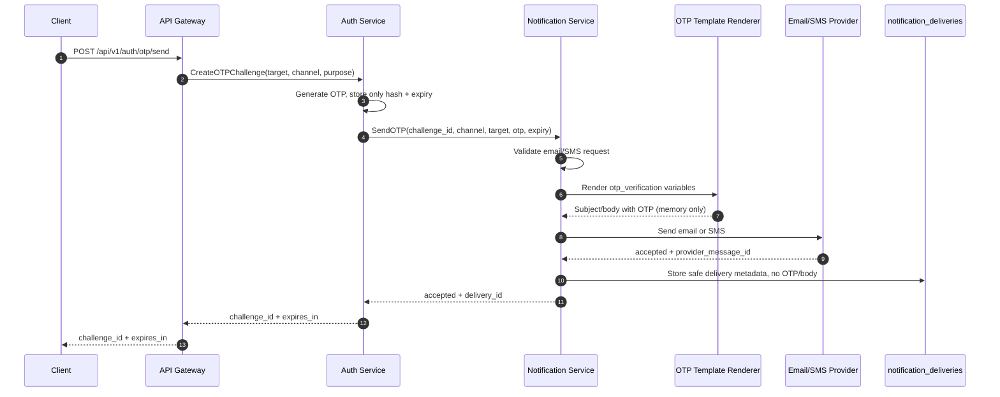
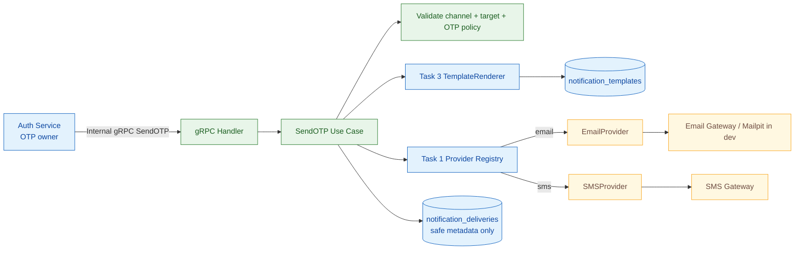

# 🔔 Notification Service - Task 4: Send OTP


## 📌 Task Summary

| Field | Detail |
|---|---|
| Task Name | Send OTP |
| Requirement Source | `docs/01-micro-tasks.md` -> `Notification Service` -> Task 4 |
| Original Goal | Auth Service ke OTP request ke liye email/SMS send method implement karo |
| Dependency | Auth Service; Task 1 channel/provider contract; Task 2 delivery storage; Task 3 OTP template rendering |
| Priority | `P0` |
| Supported OTP Channels | `email`, `sms` |
| Internal Operation | `NotificationService.SendOTP` |
| Deliverable | Secure OTP delivery implementation blueprint aur step-by-step guide |
| Implementation Type | Documentation + reference code/design only |

> **Simple Hinglish goal:** Auth Service OTP generate karke uska hash apne storage me safely rakhega. Notification Service ko short-lived plaintext OTP sirf delivery ke liye milega, wo `otp_verification` template render karega aur email ya SMS provider ko message bhejega. Notification Service OTP ko database ya logs me kabhi store nahi karega.

---

## ✅ Output Created

Request ke according repository me sirf ye documentation artifact add kiya gaya:

```text
TaskImplementation/
└── Notification Service/
    ├── task1.md                         # Existing: channels/provider contract
    ├── task2.md                         # Existing: MongoDB/templates/delivery storage
    ├── task3.md                         # Existing: template engine
    └── task4.md                         # Current: OTP email/SMS delivery guide
```

> 🟢 **Important:** Neeche ka source structure, Go code, protobuf, Mongo write aur provider integration ek implementable reference blueprint hai. Is output me `backend/services/notification-service/` ka koi source file, proto, dependency, database record ya running integration create/modify nahi ki gayi.

---

## 📚 Project Requirements Se Kya Samjha

| Source | Task 4 ke liye decision |
|---|---|
| `docs/01-micro-tasks.md` | Exact scope `Send OTP`: Auth Service OTP request ke liye email/SMS send method; `P0` |
| `docs/04-microservice-design.md` | Notification Service ki gRPC responsibility me `SendOTP` included hai |
| `docs/06-auth-security.md` | Email OTP aur phone SMS OTP supported; OTP plaintext store nahi hoga; OTP minimum 6 digits; expiry 5 minutes |
| `docs/06-auth-security.md` | Client -> Gateway -> Auth -> Notification `SendOTP` flow defined hai |
| `docs/06-auth-security.md` | Logs me OTP, password, full token ya raw secrets nahi aane chahiye; internal gRPC production me mTLS use kar sakta hai |
| `api/master-api.json` | Public OTP endpoint Auth Service own karta hai; Notification `SendOTP` internal method hai |
| `docs/03-folder-structure.md` | Notification implementation ke liye `internal/usecase/send_otp.go`, providers aur `transport/grpc/` intended locations hain |
| `database/mongodb-schema-design.md` | `notification_deliveries` status/provider/message id store kar sakta hai |
| `TaskImplementation/Notification Service/task1.md` | Common `email`/`sms` channel aur provider abstraction reuse hogi |
| `TaskImplementation/Notification Service/task2.md` | `notification_db.notification_deliveries` minimal delivery trace ke liye reuse hoga |
| `TaskImplementation/Notification Service/task3.md` | `otp_verification` template aur strict renderer final subject/body banayenge |

---

## 🚧 Scope Boundary

Task 4 ka kaam **Auth Service dwara diya gaya OTP email ya SMS channel se dispatch karna** hai. Authentication policy aur general notification platform features is task ka part nahi hain.

### Included In Task 4

| Included | Kyon |
|---|---|
| Internal `SendOTP` request/response contract | Auth aur Notification ke beech typed handoff clear hota hai |
| Sirf `email` aur `sms` OTP channels accept karna | Requirement precisely inhi channels ka hai |
| OTP request validation | Invalid recipient/channel/code provider tak nahi jayega |
| Task 3 `otp_verification` template render karna | OTP content hard-code ya duplicate nahi hota |
| Task 1 provider registry se email/SMS adapter choose karna | Delivery vendor-independent rehti hai |
| Provider ko one-time message send karna | Task 4 ka actual delivery responsibility |
| OTP-free delivery metadata write guidance | Operations traceable rehti hain without secret storage |
| gRPC handler, error mapping aur unit test blueprint | Auth integration safely implement ki ja sakti hai |

### Explicitly Not Included

| Deferred / Owned Elsewhere | Reason |
|---|---|
| OTP generate, hash, store, expire ya verify karna | Auth Service responsibility hai |
| OTP resend cooldown, per-target rate limit, max verify attempts | Auth/Gateway security policy responsibility hai |
| Client-facing `/api/v1/auth/otp/send` endpoint | Gateway -> Auth flow ka part hai, Notification public endpoint nahi hai |
| Order/payment/user event notification consumers | Notification Service - Task 5 |
| Automatic retry scheduler aur dead-letter queue | Notification Service - Task 6 |
| User marketing preferences | Notification Service - Task 7; security OTP transactional message hai |
| Delivery/open analytics pipeline | Notification Service - Task 8 |
| Push ya WhatsApp-like OTP delivery | Task 4 requirement sirf email/SMS bolta hai |

> 🔴 **Boundary rule:** Notification Service OTP ko create ya verify nahi karega. Wo plaintext OTP ko memory me sirf render/send duration tak handle karega; DB record, error message aur application log me OTP kabhi nahi jayega.

---

## 🔐 Ownership Aur Security Rules

### Auth Service Own Karta Hai

| Auth Responsibility | Detail |
|---|---|
| OTP generation | Cryptographically safe minimum 6-digit code create karna |
| OTP hash storage | Database/Redis me plaintext nahi, sirf hash store karna |
| Challenge identity | `challenge_id` generate karke verification se bind karna |
| Expiry/purpose | Login, signup, password reset, email/phone verify rules enforce karna |
| Abuse controls | Resend cooldown, send rate limits aur verify attempt limit enforce karna |
| Verification | Submitted OTP compare karke accepted/rejected decision lena |

### Notification Service Own Karta Hai

| Notification Responsibility | Detail |
|---|---|
| Delivery validation | Channel aur recipient provider contract ke according validate karna |
| Content rendering | `otp_verification` template me OTP aur expiry inject karna |
| Provider routing | Email ya SMS configured provider resolve karke send karna |
| Delivery result | Provider acceptance/reference ko Auth Service tak return karna |
| Safe trace | Delivery metadata store karna, lekin OTP/body/raw target store na karna |

### Never Persist Or Log

```text
otp                  # Plain verification code
rendered OTP body    # Isme OTP included hota hai
full email/phone     # PII; zarurat ho to masked/hashed reference use karo
provider secret/key  # Configuration secret
raw provider error   # Secret message content leak kar sakta hai
```

---

## 🧭 End-to-End Flow



### Flow Ka Meaning

| Stage | Hinglish Explanation |
|---|---|
| OTP creation | Auth code create aur hashed challenge persist karta hai, kyunki verification Auth ka concern hai |
| Temporary handoff | Plain OTP Notification ko internal secure request me milta hai because message bhejne ke liye actual code chahiye |
| Rendering | Stored template se consistent text banta hai; rendered body memory se bahar expose nahi hoti |
| Provider acceptance | `accepted` ka meaning vendor ne request receive kar li; user ne message read kiya iska proof nahi |
| Safe delivery log | Operational status trace hota hai, secret OTP nahi |

---

## 🏗️ Task 4 Architecture



---

## 📁 Clean Implementation Folder Structure

### Actual Documentation Output

```text
TaskImplementation/
└── Notification Service/
    ├── task1.md
    ├── task2.md
    ├── task3.md
    └── task4.md
```

### Reference Source Layout For Implementing Only Task 4

Ye layout existing project convention aur Task 1-3 contracts ko compose karta hai. Is guide ke through files physically create nahi kiye ja rahe.

```text
api/
└── proto/
    └── ecommerce/
        └── notification/
            └── v1/
                └── notification.proto              # Task 4: internal SendOTP RPC contract

backend/
└── services/
    └── notification-service/
        ├── cmd/
        │   └── server/
        │       └── main.go                          # Future wiring: gRPC server/dependencies
        └── internal/
            ├── domain/
            │   ├── channel.go                       # Task 1: email/sms constants
            │   ├── message.go                       # Task 1: recipient/content validation
            │   ├── rendered_message.go              # Task 3: renderer output
            │   └── otp_delivery.go                  # Task 4: request/result model
            ├── provider/
            │   ├── provider.go                      # Task 1: Send contract
            │   ├── registry.go                      # Task 1: resolve channel adapter
            │   ├── email_provider.go                # Task 4 uses email delivery
            │   └── sms_provider.go                  # Task 4 uses SMS delivery
            ├── repository/
            │   ├── notification_repository.go       # Task 2/4: delivery writer contract
            │   └── mongo_notification_repository.go # Task 2/4: safe delivery record
            ├── usecase/
            │   ├── render_template.go               # Task 3 dependency
            │   ├── send_otp.go                      # Task 4: orchestration method
            │   └── send_otp_test.go                 # Task 4: unit tests
            └── transport/
                └── grpc/
                    ├── notification_handler.go      # Task 4: internal SendOTP handler
                    └── notification_handler_test.go # Task 4: boundary tests
```

### Intentionally Absent From Task 4

```text
internal/events/consumer.go               # Task 5
internal/retry/                           # Task 6
internal/domain/preference.go             # Task 7
internal/analytics/                       # Task 8
```

---

## 🪜 Step-by-Step Implementation

## Step 1: Internal `SendOTP` Contract Define Karo

Public client directly Notification Service ko OTP nahi bhejega. Client ka request Auth Service receive karega, Auth OTP/challenge create karega, fir Notification Service ka internal RPC invoke karega.

### Reference Protobuf Contract

```proto
syntax = "proto3";

package ecommerce.notification.v1;

option go_package = "github.com/example/ecommerce-platform/api/gen/go/ecommerce/notification/v1;notificationv1";

service NotificationService {
  rpc SendOTP(SendOTPRequest) returns (SendOTPResponse);
}

enum OTPChannel {
  OTP_CHANNEL_UNSPECIFIED = 0;
  OTP_CHANNEL_EMAIL = 1;
  OTP_CHANNEL_SMS = 2;
}

message SendOTPRequest {
  string challenge_id = 1;        // Auth-generated trace id; OTP nahi.
  string user_id = 2;             // Signup flow me empty ho sakta hai.
  OTPChannel channel = 3;
  string target = 4;              // Email address ya E.164 phone.
  string otp = 5;                 // Transit-only; store/log kabhi nahi.
  int32 expires_in_minutes = 6;
  string purpose = 7;             // signup, login, password_reset, etc.
  string correlation_id = 8;
}

message SendOTPResponse {
  string delivery_id = 1;
  string status = 2;              // accepted
}
```

### Contract Decisions

| Field | Why Needed | Safety Rule |
|---|---|---|
| `challenge_id` | Auth challenge ko delivery trace se correlate karne ke liye | Log me safe internal id ho sakta hai; raw OTP nahi |
| `user_id` | Existing-account flow me user trace | Signup se pehle optional rakho |
| `channel` | Sirf email vs SMS route select karna | Push/WhatsApp reject honge |
| `target` | Message kahan send karna hai | Raw target log/DB me store mat karo |
| `otp` | Template me verification code render karna | Memory-only value |
| `expires_in_minutes` | User ko expiry communicate karna | Auth-owned expiry se derive hoga |
| `purpose` | Audit context aur future wording option | OTP body me unnecessary expose mat karo |
| `correlation_id` | Distributed request tracing | OTP-free identifier use karo |

> 🔵 `api/master-api.json` me Notification `SendOTP` ko internal operation ke roop me list kiya gaya hai. Dedicated request type upar security boundary ko explicit banata hai; alternatively generic `SendNotificationRequest` use ho to exactly yahi validation/redaction rules enforce karni hongi.

---

## Step 2: OTP Domain Request Aur Validation Banao

Transport DTO ko directly provider me pass nahi karna chahiye. Pehle use case ke domain request me map karke validate karo.

### Reference Code: `internal/domain/otp_delivery.go`

```go
package domain

import (
	"errors"
	"fmt"
	"regexp"
	"strings"
)

var otpDigits = regexp.MustCompile(`^[0-9]{6,}$`)

var ErrInvalidOTPRequest = errors.New("invalid OTP delivery request")

type SendOTPRequest struct {
	ChallengeID     string
	UserID          string
	Channel         Channel
	Target          string
	OTP             string
	ExpiresInMinutes int
	Purpose         string
	CorrelationID   string
}

type SendOTPResult struct {
	DeliveryID string
	Status     string
}

func (r SendOTPRequest) Validate() error {
	if strings.TrimSpace(r.ChallengeID) == "" {
		return fmt.Errorf("%w: challenge id is required", ErrInvalidOTPRequest)
	}
	if r.Channel != ChannelEmail && r.Channel != ChannelSMS {
		return fmt.Errorf("%w: OTP supports email or sms only", ErrInvalidOTPRequest)
	}
	if !otpDigits.MatchString(strings.TrimSpace(r.OTP)) {
		return fmt.Errorf("%w: OTP must contain at least 6 digits", ErrInvalidOTPRequest)
	}
	if r.ExpiresInMinutes <= 0 {
		return fmt.Errorf("%w: expiry is required", ErrInvalidOTPRequest)
	}
	if strings.TrimSpace(r.Target) == "" {
		return fmt.Errorf("%w: target is required", ErrInvalidOTPRequest)
	}
	return nil
}
```

### Kaise Built Hua?

| Validation | Reason |
|---|---|
| `ChannelEmail` ya `ChannelSMS` only | Requirement ke bahar ka OTP path accidentally enable nahi hota |
| Minimum 6 numeric digits | Auth security document ki minimum OTP requirement ko boundary par defend karta hai |
| Positive expiry | Expired/meaningless message bhejne ka basic guard |
| `ChallengeID` required | Delivery ko Auth challenge se trace kar sakte hain without storing secret |
| Target present | Format validation agle message mapping step me channel-wise hogi |

> 🟡 Auth Service policy ka final owner hai. Notification validation defence-in-depth hai, replacement for Auth rate limits, expiry storage ya verification nahi.

---

## Step 3: Template Renderer Ko Narrow OTP Input Do

Task 3 ka `TemplateRenderer` already `otp_verification` template render karne ke liye design hua tha. Task 4 me wahi reuse hoga; provider code ke andar OTP text hard-code nahi karna hai.

### Stored Template Examples

```javascript
// Email
{
  template_key: "otp_verification",
  channel: "email",
  subject: "Your verification code",
  body: "Your verification code is {{.otp}}. It expires in {{.expires_in_minutes}} minutes.",
  status: "active",
  version: 1
}

// SMS
{
  template_key: "otp_verification",
  channel: "sms",
  body: "Your code is {{.otp}}. Valid for {{.expires_in_minutes}} minutes.",
  status: "active",
  version: 1
}
```

### Renderer Call

```go
rendered, err := s.renderer.Render(ctx, domain.RenderRequest{
	TemplateKey: domain.TemplateOTPVerification,
	Channel:     req.Channel,
	Variables: map[string]string{
		"otp":                req.OTP,
		"expires_in_minutes": strconv.Itoa(req.ExpiresInMinutes),
	},
})
if err != nil {
	return domain.SendOTPResult{}, fmt.Errorf("render OTP template: %w", err)
}
```

### Security Explanation

| Rule | Implementation |
|---|---|
| Minimal variables | Renderer ko sirf `otp` aur `expires_in_minutes` do |
| No target/body logging | `rendered.Body` aur request `Target` ko structured log fields me mat bhejo |
| Strict template | Task 3 ka `missingkey=error` malformed OTP message send hone se rokega |
| Plain text lifespan | `rendered` local variable provider send tak use hogi; persist nahi hogi |

---

## Step 4: Rendered Content Ko Validated Message Me Convert Karo

Task 1 ke `domain.Message` contract se email address aur E.164 SMS number ki validation already centralize ho sakti hai.

### Reference Mapper

```go
func otpMessage(req domain.SendOTPRequest, rendered domain.RenderedMessage) (domain.Message, error) {
	message := domain.Message{
		Channel:       req.Channel,
		CorrelationID: req.CorrelationID,
		Content: domain.Content{
			Subject:  rendered.Subject,
			TextBody: rendered.Body,
		},
	}

	switch req.Channel {
	case domain.ChannelEmail:
		message.Recipient.Email = strings.TrimSpace(req.Target)
	case domain.ChannelSMS:
		message.Recipient.PhoneE164 = strings.TrimSpace(req.Target)
	default:
		return domain.Message{}, domain.ErrUnsupportedChannel
	}

	if err := message.Validate(); err != nil {
		return domain.Message{}, err
	}
	return message, nil
}
```

### Validation Result

| Request | Result |
|---|---|
| Email + valid email target + subject/body | Email message allowed |
| SMS + `+919876543210` + text body | SMS message allowed |
| SMS + local/non-E.164 phone value | Reject before provider |
| Email OTP template without subject | Reject before provider |
| Push or WhatsApp-like request | Reject as Task 4 out of scope |

---

## Step 5: Provider Registry Se Send Karo

Use case vendor ka naam hard-code nahi karega. Channel ke according Task 1 registry se provider milega; configured adapter email client ya SMS client ko invoke karega.

### Required Interfaces

```go
type OTPRenderer interface {
	Render(ctx context.Context, req domain.RenderRequest) (domain.RenderedMessage, error)
}

type ProviderRegistry interface {
	Resolve(channel domain.Channel) (provider.Provider, error)
}

type DeliveryRepository interface {
	RecordOTPDelivery(ctx context.Context, record OTPDeliveryRecord) error
}
```

### Core Use Case: `internal/usecase/send_otp.go`

```go
package usecase

import (
	"context"
	"fmt"
	"strconv"
	"strings"
	"time"

	"github.com/example/ecommerce-platform/backend/services/notification-service/internal/domain"
	"github.com/example/ecommerce-platform/backend/services/notification-service/internal/provider"
)

type SendOTPService struct {
	renderer   OTPRenderer
	providers  ProviderRegistry
	deliveries DeliveryRepository
	now        func() time.Time
	newID      func() string
}

func (s *SendOTPService) Send(ctx context.Context, req domain.SendOTPRequest) (domain.SendOTPResult, error) {
	if err := req.Validate(); err != nil {
		return domain.SendOTPResult{}, err
	}

	rendered, err := s.renderer.Render(ctx, domain.RenderRequest{
		TemplateKey: domain.TemplateOTPVerification,
		Channel:     req.Channel,
		Variables: map[string]string{
			"otp":                req.OTP,
			"expires_in_minutes": strconv.Itoa(req.ExpiresInMinutes),
		},
	})
	if err != nil {
		return domain.SendOTPResult{}, fmt.Errorf("render OTP template: %w", err)
	}

	message, err := otpMessage(req, rendered)
	if err != nil {
		return domain.SendOTPResult{}, fmt.Errorf("build OTP message: %w", err)
	}

	sender, err := s.providers.Resolve(req.Channel)
	if err != nil {
		return domain.SendOTPResult{}, fmt.Errorf("resolve OTP provider: %w", err)
	}

	deliveryID := s.newID()
	result, err := sender.Send(ctx, message)
	record := newOTPDeliveryRecord(deliveryID, req, result, err, s.now())
	if saveErr := s.deliveries.RecordOTPDelivery(ctx, record); saveErr != nil {
		return domain.SendOTPResult{}, fmt.Errorf("record OTP delivery outcome: %w", saveErr)
	}
	if err != nil {
		return domain.SendOTPResult{}, fmt.Errorf("send OTP: %w", err)
	}

	return domain.SendOTPResult{
		DeliveryID: deliveryID,
		Status:     string(result.Status),
	}, nil
}
```

### Use Case Ka Build Order

| Order | Work | Output |
|---:|---|---|
| 1 | Validate input | Bad request immediately stop |
| 2 | Render template | Email subject/SMS text memory me ready |
| 3 | Create `domain.Message` | Recipient/content channel contract pass |
| 4 | Resolve provider | Configured email ya SMS adapter selected |
| 5 | Call provider | Provider `accepted` ya sanitized failure deta hai |
| 6 | Write safe result | Provider reference/status stored, OTP omitted |
| 7 | Return status | Auth ko delivery acceptance pata chalta hai |

> 🔴 Use case ke errors me `req.OTP`, `message.Content.TextBody` ya raw `req.Target` format na karo. Wrapped errors operation batayenge, sensitive payload nahi.

---

## Step 6: OTP-Free Delivery Metadata Store Karo

Task 2 ki `notification_deliveries` collection send attempt trace karne ke kaam aayegi. OTP notification ke record me message body ya OTP payload nahi rakhna hai.

### Safe MongoDB Document Example

```javascript
{
  _id: "delivery_otp_01JXYZ",
  user_id: "user_123",                 // Optional for pre-signup OTP.
  channel: "email",
  template_key: "otp_verification",
  status: "accepted",
  provider: "configured_email_provider",
  provider_message_id: "provider_msg_123",
  attempts: 1,
  payload: {
    challenge_id: "challenge_123",
    purpose: "login",
    correlation_id: "request_456"
  },
  created_at: ISODate("2026-05-27T00:00:00Z"),
  updated_at: ISODate("2026-05-27T00:00:00Z")
}
```

### Never Store This Variant

```javascript
// ❌ Unsafe: OTP aur rendered body database me expose ho rahe hain.
payload: {
  otp: "482991",
  target: "person@example.com",
  body: "Your verification code is 482991."
}
```

### Status Guidance

| Status | Meaning In Task 4 |
|---|---|
| `accepted` | Provider ne email/SMS send request accept ki |
| `rejected` | Provider ne invalid/unacceptable delivery request reject ki |
| `failed` | Provider unavailable ya send attempt error hua |
| `delivered` / `opened` | Task 4 me claim nahi karna; provider event/analytics later scope hai |

---

## Step 7: gRPC Handler Me Safe Mapping Karo

Handler ka role sirf protobuf request ko domain request me map karna, use case call karna aur sanitized gRPC status return karna hai. Provider logic handler me nahi likhna.

### Reference Handler

```go
func (h *NotificationHandler) SendOTP(
	ctx context.Context,
	in *notificationv1.SendOTPRequest,
) (*notificationv1.SendOTPResponse, error) {
	channel, err := otpChannelFromProto(in.GetChannel())
	if err != nil {
		return nil, status.Error(codes.InvalidArgument, "unsupported OTP channel")
	}

	result, err := h.sendOTP.Send(ctx, domain.SendOTPRequest{
		ChallengeID:     in.GetChallengeId(),
		UserID:          in.GetUserId(),
		Channel:         channel,
		Target:          in.GetTarget(),
		OTP:             in.GetOtp(),
		ExpiresInMinutes: int(in.GetExpiresInMinutes()),
		Purpose:         in.GetPurpose(),
		CorrelationID:   in.GetCorrelationId(),
	})
	if err != nil {
		// Error response me OTP ya raw target return/log nahi hona chahiye.
		return nil, mapSendOTPError(err)
	}

	return &notificationv1.SendOTPResponse{
		DeliveryId: result.DeliveryID,
		Status:     result.Status,
	}, nil
}
```

### Error Mapping

| Internal Failure | gRPC Code | Auth Service Behaviour |
|---|---|---|
| Invalid channel/target/expiry | `InvalidArgument` | Challenge response success mat return karo |
| Template missing/malformed | `FailedPrecondition` | Alert/configuration fix; plaintext OTP expose nahi |
| Provider disabled/not configured | `FailedPrecondition` | Configuration issue surface karo |
| Provider temporarily unavailable | `Unavailable` | Auth user ko generic send failure de; retries Task 6 tak automatic assume mat karo |
| Deadline/cancellation | `DeadlineExceeded` / `Canceled` | Caller request lifecycle respect karo |
| Delivery record write failure | `Internal` | Status trace missing hone par acceptance hide karne ki policy explicitly decide/test karo |

---

## Step 8: Auth Service Integration Rule Apply Karo

Auth Service ka public response sirf `challenge_id` aur expiry return karega. OTP itself response me expose nahi hoga.

### Internal Call Pseudocode

```go
otp := secureOTPGenerator.Generate()
otpHash := hashOTP(otp)

challenge := saveChallenge(target, otpHash, expiresAt, purpose)

_, err := notificationClient.SendOTP(ctx, &notificationv1.SendOTPRequest{
	ChallengeId:      challenge.ID,
	Channel:          toNotificationChannel(channel),
	Target:           target,
	Otp:              otp, // Internal transit only.
	ExpiresInMinutes: 5,
	Purpose:          purpose,
	CorrelationId:    requestID,
})
if err != nil {
	return genericOTPSendFailure()
}

return OTPChallengeResponse{
	ChallengeID: challenge.ID,
	ExpiresIn:   300,
}
```

### Important Behaviour Choices

| Choice | Why |
|---|---|
| Auth saves hash before send | Verify path ke paas challenge state ready hoti hai |
| Send failure ko explicitly handle karo | Client ko nonexistent delivery ka false success nahi dena |
| Existing challenge ko failed-send state/expiry policy do | Undelivered active OTP confusion avoid hoti hai |
| Client response generic rakho | Account enumeration aur provider internals leak nahi hote |

---

## Step 9: Configuration Aur Provider Wiring

Task 4 existing provider abstraction ko use karta hai. Deployment me email aur SMS ke provider settings secrets/environment se aayenge.

### Environment Shape

```dotenv
# Channel selection
NOTIFICATION_EMAIL_ENABLED=true
NOTIFICATION_EMAIL_PROVIDER=mailpit
NOTIFICATION_SMS_ENABLED=true
NOTIFICATION_SMS_PROVIDER=chosen_sms_gateway

# Development email target
MAILPIT_SMTP_HOST=localhost
MAILPIT_SMTP_PORT=1025

# Production/SMS secrets example names only; value secret manager se load karo.
NOTIFICATION_EMAIL_API_KEY=replace_from_secret_store
NOTIFICATION_SMS_API_KEY=replace_from_secret_store

# MongoDB delivery trace from Task 2
NOTIFICATION_MONGO_URI=mongodb://localhost:27017/notification_db
NOTIFICATION_MONGO_DATABASE=notification_db
```

### Configuration Rules

| Rule | Explanation |
|---|---|
| Enabled channel needs provider | Email/SMS enabled ho to registry ko corresponding provider milna chahiye |
| Secrets source control me nahi | `.env.example` sirf placeholder rakhega |
| Local email testing me Mailpit | Real inbox ko accidental OTP email avoid karke captured message inspect kar sakte hain |
| SMS local testing | Fake/stub `SMSClient` ya provider test credential use karo; hard-coded network calls nahi |
| Request deadline | Auth -> Notification gRPC aur provider call par timeout lagao |

---

## Step 10: Tests Se Behaviour Lock Karo

OTP flow security-sensitive hai, isliye happy path ke saath reject aur redaction behaviours bhi test honge.

### Unit Test Matrix

| Test | Expected Result |
|---|---|
| Valid email OTP request | Email provider once called; response `accepted` |
| Valid E.164 SMS OTP request | SMS provider once called; response `accepted` |
| Push/WhatsApp-like OTP channel | Validation error; provider not called |
| Invalid email / invalid phone format | Validation error; provider not called |
| Less than 6 digits / empty OTP | Validation error; provider not called |
| Missing OTP template variable or inactive template | Render error; provider not called |
| Provider unavailable | Sanitized error; safe failure metadata only |
| Delivery document capture | Stored payload has no `otp`, rendered body or target |
| gRPC error response | Error text does not contain OTP or raw target |
| Context deadline | Provider work stops and caller receives deadline error |

### Reference Happy Path Unit Test

```go
func TestSendOTPSendsEmailWithoutPersistingSecret(t *testing.T) {
	renderer := fakeRenderer{message: domain.RenderedMessage{
		Subject: "Your verification code",
		Body:    "Your verification code is 482991.",
	}}
	sender := &fakeProvider{result: provider.Result{
		Channel:           domain.ChannelEmail,
		ProviderName:      "mailpit",
		ProviderMessageID: "msg_123",
		Status:            provider.StatusAccepted,
	}}
	repo := &fakeDeliveryRepository{}
	service := newTestSendOTPService(renderer, sender, repo)

	got, err := service.Send(context.Background(), domain.SendOTPRequest{
		ChallengeID:     "challenge_123",
		Channel:         domain.ChannelEmail,
		Target:          "person@example.com",
		OTP:             "482991",
		ExpiresInMinutes: 5,
		Purpose:         "login",
		CorrelationID:   "request_456",
	})
	if err != nil {
		t.Fatalf("Send() error = %v", err)
	}
	if got.Status != "accepted" {
		t.Fatalf("status = %q", got.Status)
	}
	if strings.Contains(repo.savedPayload, "482991") ||
		strings.Contains(repo.savedPayload, "person@example.com") {
		t.Fatal("delivery record contains OTP secret or raw recipient")
	}
}
```

### Reference Validation Test

```go
func TestSendOTPRejectsUnsupportedChannel(t *testing.T) {
	service := newTestSendOTPService(fakeRenderer{}, &fakeProvider{}, &fakeDeliveryRepository{})

	_, err := service.Send(context.Background(), domain.SendOTPRequest{
		ChallengeID:     "challenge_123",
		Channel:         domain.ChannelPush,
		Target:          "device-token",
		OTP:             "482991",
		ExpiresInMinutes: 5,
	})
	if err == nil {
		t.Fatal("Send() expected unsupported OTP channel error")
	}
}
```

---

## 🧰 External Libraries And Tools

### Runtime And Development Dependencies

| Library / Tool | External? | Why Used In Task 4 | Install / Use |
|---|---:|---|---|
| Go standard library (`context`, `strconv`, `regexp`, `strings`) | No | Validation, cancellation aur template variables prepare karne ke liye | Go ke saath built-in; alag installation nahi |
| Go `text/template` | No | Task 3 ke OTP email/SMS template render karne ke liye | `import "text/template"`; external package nahi |
| gRPC for Go (`google.golang.org/grpc`) | Yes, jab RPC implement hoga | Auth Service se internal typed `SendOTP` call receive karne ke liye | Service module me `go get google.golang.org/grpc` |
| Protocol Buffers / `protoc` Go plugins | Yes, jab proto generate hoga | `SendOTP` request/response se Go stubs generate karne ke liye | `go install google.golang.org/protobuf/cmd/protoc-gen-go@latest` aur `go install google.golang.org/grpc/cmd/protoc-gen-go-grpc@latest`; `protoc --go_out=. --go-grpc_out=. notification.proto` |
| MongoDB | Yes, Task 2 dependency | OTP-free delivery acceptance/failure metadata store karne ke liye | Project/local MongoDB run karo; `notification_db.notification_deliveries` use karo |
| MongoDB Go Driver | Yes, jab repository implement hogi | Go delivery repository se MongoDB insert/update karne ke liye | Module ke andar `go get go.mongodb.org/mongo-driver/mongo` |
| Mailpit | Optional external dev tool | Local email OTP ko real email vendor ke bina inbox UI me inspect karne ke liye | Mailpit run karke SMTP adapter ko `localhost:1025` point karo; UI commonly `localhost:8025` par inspect hota hai |
| SMS gateway SDK/API | Provider choice ke baad only | Production SMS actual deliver karne ke liye | Project docs koi vendor select nahi karte; selected adapter Task 1 `SMSClient` interface implement karega |
| Mermaid | Documentation only | Markdown architecture aur sequence flow display karne ke liye | Markdown viewer/GitHub rendering; runtime dependency nahi |

### Tools Select Karne Ka Reason

| Choice | Reasoning |
|---|---|
| Provider-neutral interface retain karna | Requirement vendor specify nahi karti; business flow email/SMS vendor se coupled nahi hota |
| Mailpit only for local email | Developer OTP delivery inspect kar sakta hai without production email spend/risk |
| SMS vendor undecided rakhna | Kisi unsupported external vendor ko assumption se implementation me force nahi karna |
| gRPC internal contract | Existing architecture synchronous internal service commands ke liye gRPC choose karti hai |
| Mongo record minimal rakhna | Delivery debugging milegi, OTP secrecy violate nahi hogi |

---

## 🛡️ Security And Reliability Checklist

| Check | Task 4 Implementation Rule |
|---|---|
| Plain OTP storage | Notification database, cache aur log me OTP kabhi persist nahi karo |
| Hash ownership | Hashed OTP bhi Auth Service own kare; Notification verification store na bane |
| Request transport | Auth -> Notification internal network secure karo; production me mTLS/service mesh support karo |
| Target privacy | Raw email/phone log aur delivery payload me avoid karo; correlation/challenge id use karo |
| Error sanitization | Provider raw error body return/log nahi; generic categorized error use karo |
| Template privacy | Rendered OTP body store ya structured log nahi karo |
| Channel restriction | Only email/SMS allow; unsupported channel fail closed |
| Provider response | `accepted` ko `delivered` mat label karo |
| Timeout | gRPC/provider request deadline honor karo |
| Rate limiting | Auth/Gateway OTP send limit enforce kare; Notification bypass public endpoint expose na kare |
| Secrets | Provider API keys environment/secret manager se lo, repository me values commit nahi |
| Testing | Test assertions ensure persistence/logging path OTP include na kare |

---

## 🧪 Verification Commands (When Blueprint Is Implemented)

Jab referenced Go/protobuf/source files actually implement ho jayein, focused validation is tarah run ho sakti hai:

```bash
cd backend/services/notification-service
go test ./...
go test -race ./...
go vet ./...
```

Local email smoke test ke liye development SMTP provider ko Mailpit se wire karke Auth Service ka OTP request flow exercise karo. Result me:

| Verify | Expected |
|---|---|
| Mailpit captured email | OTP message receive hota hai |
| SMS fake client test | Exactly one message request receive hota hai |
| Mongo delivery record | Status/provider reference hai; OTP/body/raw target absent hai |
| Application logs | Challenge/correlation trace ho sakta hai; OTP absent hai |

> 🟡 Is requested output me implementation code ya running dependency create nahi hui, isliye commands is documentation artifact par execute karke Task 4 behaviour test nahi kiya ja sakta.

---

## ✅ Task 4 Completion Checklist

| Checklist Item | Status |
|---|---:|
| `TaskImplementation/Notification Service/task4.md` created | ✅ |
| Exact Task 4 requirement and `P0` priority identified | ✅ |
| Dependency on Auth Service explained | ✅ |
| Email/SMS-only scope maintained | ✅ |
| OTP ownership and no-plaintext-storage rule explained | ✅ |
| Internal `SendOTP` contract provided | ✅ |
| Domain validation and message mapping shown | ✅ |
| Template renderer and provider routing integration shown | ✅ |
| Safe delivery metadata example provided | ✅ |
| gRPC handler/error mapping explained | ✅ |
| Folder structure included | ✅ |
| Mermaid architecture and sequence diagrams included | ✅ |
| Libraries/tools, reasons and installation/usage documented | ✅ |
| Unit/security testing guidance included | ✅ |
| Tasks 5-8 and unrelated feature implementation excluded | ✅ |

---

## 🎯 Final Outcome

Notification Service - Task 4 ke liye secure `SendOTP` blueprint ready hai:

- Auth Service OTP generate/hash/verify karega aur Notification ko sirf delivery ke liye transient plaintext code dega.
- Notification Service `otp_verification` template render karke sirf `email` ya `sms` provider ko send karega.
- Provider response se `accepted` delivery trace banega, lekin OTP, rendered body aur raw recipient persistence/logging se bahar rahenge.
- Internal gRPC boundary, input validation, error mapping, configuration aur tests Task 4 implementation ko beginner-friendly aur production-conscious banate hain.

Is scope me event consumers, retries/DLQ, notification preferences aur analytics intentionally implement nahi hote.
