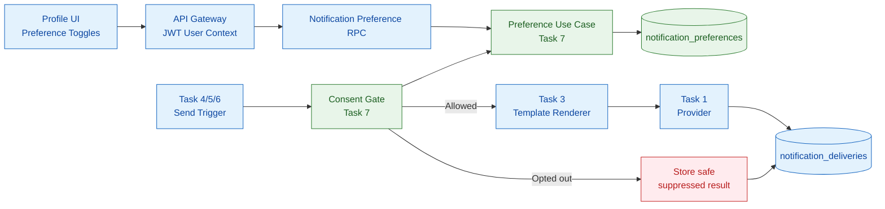
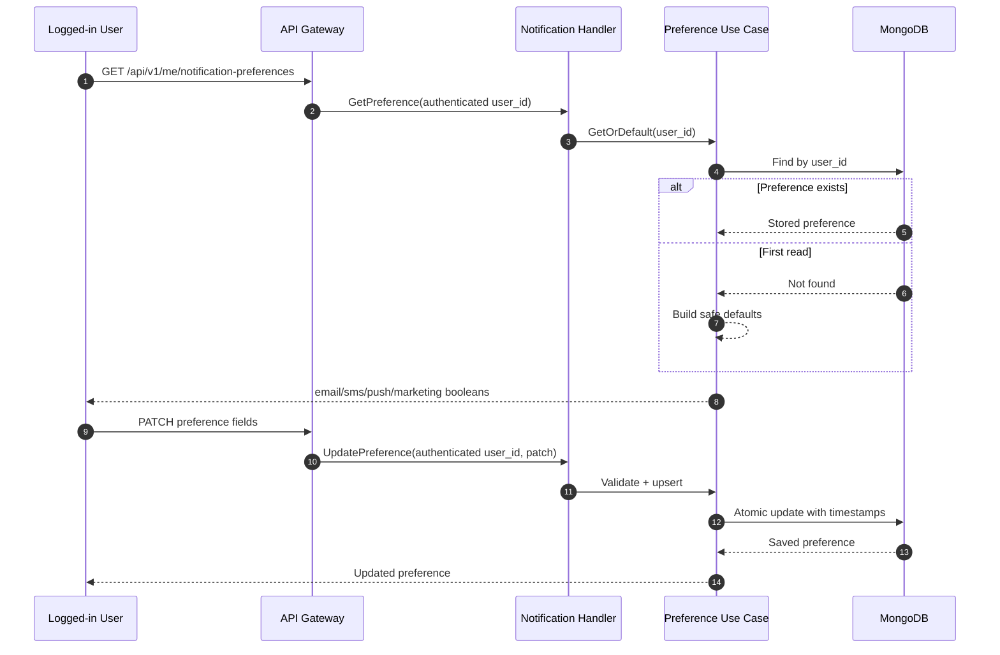
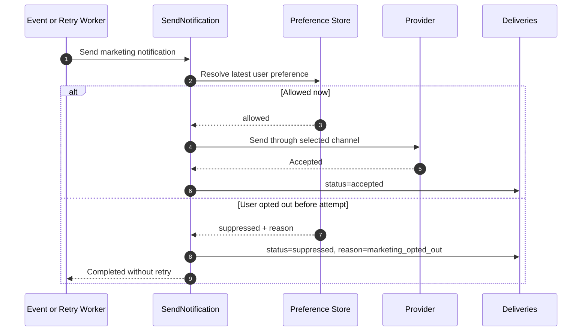
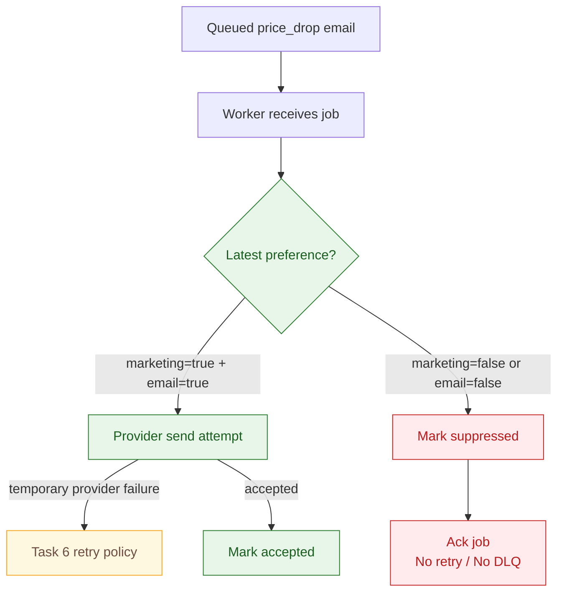

# 🔔 Notification Service - Task 7: User Preferences


## 📌 Task Summary

| Field | Detail |
|---|---|
| Task Name | User preferences |
| Requirement Source | `docs/01-micro-tasks.md` -> `Notification Service` -> Task 7 |
| Original Goal | User opt-in/opt-out aur channel preference respect karo; compliance ke liye important hai |
| Dependency | User Service |
| Priority | `P2` |
| Persistence | Service-owned MongoDB collection: `notification_db.notification_preferences` |
| Public APIs | `GET /api/v1/me/notification-preferences`, `PATCH /api/v1/me/notification-preferences` |
| Internal RPCs | `GetNotificationPreference`, `UpdateNotificationPreference` |
| Enforcement Point | Notification render/send se pehle aur queued retry attempt se pehle preference gate |
| Reused Building Blocks | Channels (Task 1), MongoDB (Task 2), templates (Task 3), OTP rule (Task 4), event triggers (Task 5), retries (Task 6) |
| Deliverable | Beginner-friendly Task 7 implementation blueprint with reference code |
| Implementation Type | Documentation + reference code/design only |

> **Simple Hinglish goal:** User ko control milna chahiye ki usse marketing notifications chahiye ya nahi, aur kaunse channel (`email`, `sms`, `push`) par message receive karna hai. Notification Service user ki saved choice ko provider call se **pehle** check karega. Opted-out message send nahi hoga; uska safe `suppressed` result traceable rahega.

---

## ✅ Output Created

Request ke according repository me sirf ye Task 7 documentation artifact add kiya gaya:

```text
TaskImplementation/
└── Notification Service/
    ├── task1.md                         # Existing: channels/provider abstraction
    ├── task2.md                         # Existing: MongoDB template/delivery storage
    ├── task3.md                         # Existing: template engine
    ├── task4.md                         # Existing: Send OTP flow
    ├── task5.md                         # Existing: async event consumers
    ├── task6.md                         # Existing: retry and DLQ
    └── task7.md                         # Current: user preference enforcement guide
```

> 🟢 **Important:** Neeche ka Go code, MongoDB collection validator, gRPC/API contract, UI example aur tests ek implementable reference blueprint hain. Is output me `backend/services/notification-service/`, migrations, APIs, frontend, dependencies, databases ya running integration physically create/modify nahi kiye gaye.

---

## 📚 Project Requirements Se Kya Samjha

| Source | Task 7 ke liye decision |
|---|---|
| `docs/01-micro-tasks.md` | Exact Task 7: opt-in/opt-out aur channel preference enforce karna; dependency `User Service`; priority `P2` |
| `docs/04-microservice-design.md` | Notification Service `notification_preferences` collection own karega aur preference read/update responsibility uski hai |
| `docs/04-microservice-design.md` | Price-drop notification supported responsibility hai; promotional/optional messages ko consent chahiye |
| `docs/03-folder-structure.md` | Implementation ka home `backend/services/notification-service/internal/` aur `transport/grpc/` convention follow karega |
| `docs/05-database-design.md` | Notification flexible metadata MongoDB me persist hota hai |
| `database/mongodb-schema-design.md` | `notification_db.notification_preferences` collection aur unique `{ user_id: 1 }` index already specified hain |
| `api/master-api.json` | Buyer-authenticated GET/PATCH preference routes, gRPC method names aur four response booleans defined hain |
| `docs/10-frontend-implementation.md` | User Profile module me notification preferences page required hai |
| `TaskImplementation/Notification Service/task1.md` | Internal channels `email`, `sms`, `push`, `whatsapp_like` defined hain |
| `TaskImplementation/Notification Service/task4.md` | OTP security message marketing preference ke barabar nahi hai; user-requested OTP flow ko safely preserve karna hai |
| `TaskImplementation/Notification Service/task5.md` | Event-driven send trigger ko provider call se pehle preference check integrate karna hai |
| `TaskImplementation/Notification Service/task6.md` | Delayed retry ke waqt latest opt-out dobara check karna hai, taaki opt-out ke baad queued marketing send na ho |

### Contract Clarification: `whatsapp_like`

Task 1 me `whatsapp_like` internal channel defined hai, lekin current public schema `NotificationPreference` me sirf ye fields hain:

```json
{
  "email_enabled": true,
  "sms_enabled": false,
  "push_enabled": true,
  "marketing_enabled": false
}
```

Isliye Task 7 baseline me:

| Channel | Preference Behaviour |
|---|---|
| `email`, `sms`, `push` | Public preference toggle se controlled |
| `whatsapp_like` | Marketing ke liye default deny; public API me additive field approve/add hone tak user opt-in assume nahi karna |

> 🟡 **Why:** Compliance feature me missing consent ko `true` infer karna unsafe hai. Future me `whatsapp_like_enabled` add karna separate additive API/schema decision hoga, Task 7 ke current contract ko silently change nahi karega.

---

## 🚧 Scope Boundary

Task 7 ka kaam **user ke saved notification choices ko store, expose aur message send decision me enforce karna** hai. Ye campaign product, vendor analytics ya identity system nahi hai.

### Included In Task 7

| Included | Kyon |
|---|---|
| Preference domain model | Allowed settings aur safe defaults ek jagah defined rehte hain |
| MongoDB `notification_preferences` storage blueprint | Notification Service apna consent projection own karega |
| Authenticated GET/PATCH API and gRPC handling | User apni preference dekh/update kar sakega |
| Marketing global opt-in plus channel toggles | Opt-out ko actual delivery path me enforce kiya ja sakega |
| Notification purpose classification | OTP, transactional aur marketing message ko same rule se galat block/send nahi karenge |
| Send-time consent gate | Provider ko opted-out request kabhi forward nahi hogi |
| Queue/retry re-check | Update ke baad already queued optional message bhi suppress ho sakega |
| Suppressed delivery audit metadata | Compliance/debugging proof milega without content leakage |
| Security, validation aur tests | User A user B ki settings edit na kar sake; behaviour reliable rahe |

### Explicitly Not Included

| Deferred / Owned Elsewhere | Reason |
|---|---|
| Real provider adapter implementation | Notification Service - Task 1 / provider integration concern |
| Template creation or rendering logic | Notification Service - Task 3 |
| OTP generation, verification, rate limits | Auth Service and Task 4 |
| Event consumer topology or producer events | Notification Service - Task 5 |
| Retry queue/DLQ declaration | Notification Service - Task 6 |
| Sent/opened/campaign reporting | Notification Service - Task 8 |
| Legal advice or region-specific consent policy | Product/legal approval required; engineering enforcement hook yahan banta hai |
| Admin marketing campaign UI | Separate future product scope |
| `whatsapp_like_enabled` public contract extension | Current API schema me absent hai |
| Backend/frontend files, migration execution, installed packages | Requested output sirf `task7.md` artifact hai |

> 🔴 **Boundary rule:** Marketing notification tabhi provider tak jayegi jab `marketing_enabled=true` **aur** requested channel enabled ho. Missing preference ya missing channel consent ko marketing opt-in nahi maana jayega.

---

## 🧠 Beginner Concepts

| Term | Simple Hinglish Meaning |
|---|---|
| Preference | User ki saved choice: email/SMS/push enable hai ya nahi aur marketing allowed hai ya nahi |
| Opt-in | User ne actively permission di |
| Opt-out | User ne permission hata di ya channel off kar diya |
| Channel toggle | Kisi medium par message bhejna permitted hai ya nahi |
| Purpose | Message kyon bhejna hai: `security`, `transactional`, ya `marketing` |
| Suppressed | Notification intentionally send nahi hui because preference/policy ne roka |
| Consent gate | Provider call se just pehle permission evaluate karne wala use case |
| Default preference | User ke first read par safe starting choices, jab DB record abhi nahi bana |

---

## 🧭 Consent Policy Decision

Current API me separate transactional-versus-marketing channel toggles nahi hain. Isliye ek clear MVP rule freeze karna zaruri hai.

### Notification Purpose Categories

| Purpose | Example Template / Trigger | Rule |
|---|---|---|
| `security` | User-requested OTP (`otp_verification`) | Marketing setting bypass; sirf valid Auth-initiated OTP flow me `email` ya `sms` channel use hoga |
| `transactional` | `order_paid`, `order_status_update`, `payment_failed` | `marketing_enabled` ignore hoga, lekin selected outbound channel enabled hona chahiye |
| `marketing` | `promotional_offer`, `price_drop` | `marketing_enabled=true` and selected channel enabled, dono mandatory |

### Default Preference

Naye/existing user ke liye jab preference document absent ho, Task 7 baseline:

```json
{
  "email_enabled": true,
  "sms_enabled": false,
  "push_enabled": false,
  "marketing_enabled": false
}
```

| Default | Reason |
|---|---|
| Email transactional default `true` | Verified account email par essential order/payment updates ka practical starting route milta hai |
| SMS and push `false` | Phone cost/device-token channels ke liye explicit user selection better hai |
| Marketing `false` | Promotional contact ke liye opt-in ko explicit rakhta hai |

> 🟠 Production launch se pehle legal/product team applicable jurisdiction aur account onboarding consent wording approve kare. Engineering rule safe default aur enforcement provide karta hai; legal basis decide nahi karta.

### Decision Matrix

| Purpose | Channel Enabled? | Marketing Enabled? | Send? | Result Code |
|---|---:|---:|---:|---|
| `security` OTP requested through Auth on email/SMS | Any stored toggle | Any | Yes | `security_requested` |
| `security` OTP on push/WhatsApp-like | Any stored toggle | Any | No | `security_channel_not_allowed` |
| `transactional` | Yes | No/Yes | Yes | `transactional_channel_allowed` |
| `transactional` | No | No/Yes | No | `channel_opted_out` |
| `marketing` | Yes | Yes | Yes | `marketing_consent_present` |
| `marketing` | Yes | No | No | `marketing_opted_out` |
| `marketing` | No | Yes/No | No | `channel_opted_out` |
| `marketing` on `whatsapp_like` | No exposed opt-in field | Yes/No | No | `channel_consent_unavailable` |

### No Silent Channel Fallback

Agar marketing email disabled hai, service apne aap SMS ya push try nahi karegi. Alternative channel par bhejne ke liye us channel ka consent aur calling rule explicitly select hona chahiye.

```text
Requested: promotional_offer via email
email_enabled=false, sms_enabled=true

Result: email suppressed
Not allowed: automatically send SMS
```

---

## 🏗️ Architecture

### Preference-Aware Notification Flow



### GET/PATCH Preference Flow



### Event/Retry Consent Re-Check



**Hinglish explanation:** Queue me message pehle aa gaya ho aur user uske baad opt-out kare, tab retry/send attempt latest preference dobara padhega. Preference suppression provider failure nahi hai, isliye use Task 6 retry/DLQ me nahi bhejna.

---

## 📁 Clean Implementation Folder Structure

### Actual Documentation Output

```text
TaskImplementation/
└── Notification Service/
    ├── task1.md
    ├── task2.md
    ├── task3.md
    ├── task4.md
    ├── task5.md
    ├── task6.md
    └── task7.md
```

### Reference Source Layout For Implementing Only Task 7

Neeche ka layout existing Go notification-service design ke saath Task 7 ko fit karta hai. Ye source files is documentation-only output me physically create nahi ki ja rahi hain.

```text
api/
└── proto/
    └── notification/
        └── v1/
            └── notification.proto                    # Task 7: preference RPC contract

backend/
└── services/
    └── notification-service/
        ├── .env.example                              # Existing Mongo configuration reused
        ├── migrations/
        │   └── 002_create_notification_preferences.up.js   # Task 7: collection + index
        └── internal/
            ├── domain/
            │   ├── channel.go                        # Existing Task 1 dependency
            │   ├── delivery.go                       # Existing Task 2; add suppressed state when implemented
            │   └── preference.go                     # Task 7: preference and consent policy
            ├── repository/
            │   ├── notification_repository.go        # Task 7: PreferenceRepository contract
            │   └── mongo_notification_repository.go  # Task 7: Mongo get/upsert
            ├── usecase/
            │   ├── manage_preference.go              # Task 7: GET/PATCH application logic
            │   └── consent_gate.go                   # Task 7: allow/suppress before send
            └── transport/
                └── grpc/
                    └── preference_handler.go         # Task 7: authenticated RPC adapter

frontend/
└── user-app/
    └── src/
        └── features/
            └── profile/
                └── NotificationPreferences.tsx       # Task 7 API consumer concept
```

### Intentionally Absent From Task 7

```text
internal/analytics/                                   # Task 8
provider/new_vendor_sdk_adapter.go                    # Provider integration concern
events/new_business_event_consumer.go                 # Task 5 concern
retry/new_queue_topology.go                           # Task 6 concern
admin/campaign_manager.go                             # Separate future product scope
```

---

## 🪜 Step-by-Step Implementation

## Step 1: Preference Rules Freeze Karo

Code likhne se pehle product rule typed vocabulary me convert karo. Har sending flow ko batana hoga ki message kis purpose ka hai.

### Reference Code: `internal/domain/preference.go`

```go
package domain

import (
	"fmt"
	"time"
)

type NotificationPurpose string

const (
	PurposeSecurity      NotificationPurpose = "security"
	PurposeTransactional NotificationPurpose = "transactional"
	PurposeMarketing     NotificationPurpose = "marketing"
)

type Preference struct {
	UserID           string    `bson:"user_id" json:"user_id"`
	EmailEnabled     bool      `bson:"email_enabled" json:"email_enabled"`
	SMSEnabled       bool      `bson:"sms_enabled" json:"sms_enabled"`
	PushEnabled      bool      `bson:"push_enabled" json:"push_enabled"`
	MarketingEnabled bool      `bson:"marketing_enabled" json:"marketing_enabled"`
	UpdatedAt        time.Time `bson:"updated_at" json:"updated_at"`
}

func DefaultPreference(userID string, now time.Time) Preference {
	return Preference{
		UserID:           userID,
		EmailEnabled:     true,
		SMSEnabled:       false,
		PushEnabled:      false,
		MarketingEnabled: false,
		UpdatedAt:        now,
	}
}

type ConsentDecision struct {
	Allowed bool
	Reason  string
}

func (p Preference) Decide(purpose NotificationPurpose, channel Channel) (ConsentDecision, error) {
	if purpose == PurposeSecurity {
		switch channel {
		case ChannelEmail, ChannelSMS:
			return ConsentDecision{Allowed: true, Reason: "security_requested"}, nil
		default:
			return ConsentDecision{Allowed: false, Reason: "security_channel_not_allowed"}, nil
		}
	}

	if channel == ChannelWhatsAppLike {
		// Current public API does not expose an explicit WhatsApp-like opt-in.
		return ConsentDecision{Allowed: false, Reason: "channel_consent_unavailable"}, nil
	}

	channelAllowed, err := p.channelEnabled(channel)
	if err != nil {
		return ConsentDecision{}, err
	}
	if !channelAllowed {
		return ConsentDecision{Allowed: false, Reason: "channel_opted_out"}, nil
	}

	if purpose == PurposeMarketing && !p.MarketingEnabled {
		return ConsentDecision{Allowed: false, Reason: "marketing_opted_out"}, nil
	}
	return ConsentDecision{Allowed: true, Reason: "preference_allowed"}, nil
}

func (p Preference) channelEnabled(channel Channel) (bool, error) {
	switch channel {
	case ChannelEmail:
		return p.EmailEnabled, nil
	case ChannelSMS:
		return p.SMSEnabled, nil
	case ChannelPush:
		return p.PushEnabled, nil
	case ChannelWhatsAppLike:
		return false, nil
	default:
		return false, fmt.Errorf("unsupported preference channel: %q", channel)
	}
}
```

### Kaise Built Hua?

| Part | Explanation |
|---|---|
| `NotificationPurpose` | Template name par scattered `if` lagane ke bajay policy category explicit hoti hai |
| `DefaultPreference` | Missing DB document par marketing ko accidentally enable nahi karta |
| `Decide` | Ek centralized consent gate; event, direct send aur retry same behaviour use karte hain |
| Security branch | OTP marketing campaign nahi hai; valid user-requested email/SMS authentication message ko marketing opt-out block nahi karega |
| Channel check | Transactional aur marketing dono me channel choice respect hoti hai |
| WhatsApp-like deny | Consent field absent hone par marketing/transactional send assume nahi hota |

> 🔐 `PurposeSecurity` sirf trusted Auth `SendOTP` route assign kare. Internal generic `SendNotification` caller ko arbitrary message ko security bolkar preference bypass karne ki permission nahi milni chahiye.

---

## Step 2: Template/Event Ko Purpose Se Map Karo

Preference gate tabhi reliable hogi jab caller apni message category fake na kar sake. Isliye mapping service-owned allowlist me rakho.

### Reference Mapping

```go
package usecase

import (
	"fmt"

	"github.com/example/ecommerce-platform/backend/services/notification-service/internal/domain"
)

func purposeForTemplate(templateKey string) (domain.NotificationPurpose, error) {
	switch templateKey {
	case "otp_verification":
		return domain.PurposeSecurity, nil
	case "order_paid", "order_status_update", "payment_succeeded", "payment_failed":
		return domain.PurposeTransactional, nil
	case "promotional_offer", "price_drop":
		return domain.PurposeMarketing, nil
	default:
		return "", fmt.Errorf("template has no notification purpose policy: %q", templateKey)
	}
}
```

### Mapping Rules

| Template/Event Family | Purpose | Preference Effect |
|---|---|---|
| Auth-owned OTP | `security` | Only secure Auth route may bypass marketing/channel preference |
| Order/payment status | `transactional` | Marketing master switch irrelevant; chosen channel toggle respected |
| Offer/price drop | `marketing` | Global marketing opt-in plus channel toggle required |
| Unknown template | None | Reject; developer must intentionally classify before enabling send |

**Beginner note:** New promotional template create karte waqt usko transactional declare karke consent bypass karna bug bhi hai aur compliance risk bhi. Review/test me mapping verify karna mandatory rakho.

---

## Step 3: MongoDB Preference Collection Add Karo

Project schema already `notification_preferences` collection aur unique `user_id` index require karta hai. Task 7 implementation me collection validator bhi add karo, taaki malformed preference store na ho.

### Example Preference Document

```json
{
  "_id": "pref_user_123",
  "user_id": "user_123",
  "email_enabled": true,
  "sms_enabled": false,
  "push_enabled": true,
  "marketing_enabled": false,
  "consent_source": "profile_settings",
  "created_at": "2026-05-27T09:00:00Z",
  "updated_at": "2026-05-27T09:15:00Z"
}
```

| Field | Purpose |
|---|---|
| `_id` | Stable preference document id |
| `user_id` | User Service/Auth identity se linked owner; one document per user |
| Boolean settings | Current API schema ka persisted form |
| `consent_source` | Change kahan se aaya, jaise `profile_settings` ya future onboarding |
| Timestamps | Operational audit aur troubleshooting ke liye |

### Reference Migration: `migrations/002_create_notification_preferences.up.js`

```javascript
"use strict";

const databaseName = process.env.NOTIFICATION_MONGO_DATABASE || "notification_db";
const collectionName = "notification_preferences";
const notificationDB = db.getSiblingDB(databaseName);

const preferenceValidator = {
  $jsonSchema: {
    bsonType: "object",
    required: [
      "_id",
      "user_id",
      "email_enabled",
      "sms_enabled",
      "push_enabled",
      "marketing_enabled",
      "consent_source",
      "created_at",
      "updated_at"
    ],
    properties: {
      _id: { bsonType: "string", minLength: 1 },
      user_id: { bsonType: "string", minLength: 1 },
      email_enabled: { bsonType: "bool" },
      sms_enabled: { bsonType: "bool" },
      push_enabled: { bsonType: "bool" },
      marketing_enabled: { bsonType: "bool" },
      consent_source: { enum: ["profile_settings", "onboarding", "support_request"] },
      created_at: { bsonType: "date" },
      updated_at: { bsonType: "date" }
    }
  }
};

if (notificationDB.getCollectionInfos({ name: collectionName }).length === 0) {
  assert.commandWorked(notificationDB.createCollection(collectionName, {
    validator: preferenceValidator,
    validationLevel: "strict",
    validationAction: "error"
  }));
} else {
  assert.commandWorked(notificationDB.runCommand({
    collMod: collectionName,
    validator: preferenceValidator,
    validationLevel: "strict",
    validationAction: "error"
  }));
}

notificationDB.getCollection(collectionName).createIndex(
  { user_id: 1 },
  { name: "unique_notification_preference_user", unique: true }
);
```

### Index Kyon Zaruri Hai?

| Index | Benefit |
|---|---|
| `{ user_id: 1 }` unique | Ek user ki do conflicting active preference rows create nahi hongi |
| User lookup fast | Har send attempt ka consent read predictable rahega |

> 🟢 Preferences Notification Service ke database me rahengi. User Service profile own karta hai, lekin dusri service ko `notification_db` directly read/write nahi karna chahiye.

---

## Step 4: Repository Contract Banao

Domain/use case ko Mongo queries ka detail nahi pata hona chahiye. Existing repository layer ko preference interface se extend karo.

### Reference Interface: `internal/repository/notification_repository.go`

```go
package repository

import (
	"context"

	"github.com/example/ecommerce-platform/backend/services/notification-service/internal/domain"
)

type PreferenceRepository interface {
	FindPreferenceByUserID(ctx context.Context, userID string) (domain.Preference, error)
	UpsertPreference(ctx context.Context, preference domain.Preference) (domain.Preference, error)
}
```

### Expected Repository Behaviour

| Operation | Behaviour |
|---|---|
| `FindPreferenceByUserID` | Unique `user_id` se setting load kare; not-found use case ko signal kare |
| `UpsertPreference` | Same user document insert/update kare; duplicate race unique index se protected ho |
| Mongo timeout/error | Send operation ko fail-closed decision de for marketing; silently send mat karo |

### Atomic Upsert Concept

```go
filter := bson.M{"user_id": preference.UserID}
update := bson.M{
	"$set": bson.M{
		"email_enabled":     preference.EmailEnabled,
		"sms_enabled":       preference.SMSEnabled,
		"push_enabled":      preference.PushEnabled,
		"marketing_enabled": preference.MarketingEnabled,
		"consent_source":    "profile_settings",
		"updated_at":        preference.UpdatedAt,
	},
	"$setOnInsert": bson.M{
		"_id":        "pref_" + preference.UserID,
		"user_id":    preference.UserID,
		"created_at": preference.UpdatedAt,
	},
}
```

**Hinglish explanation:** `$setOnInsert` first save ke identity fields banata hai, aur `$set` har update me new toggle values/timestamp persist karta hai. Client ko `_id` ya kisi aur user ka `user_id` provide karne ka control nahi diya jayega.

---

## Step 5: GET Aur PATCH Preference API Implement Karo

`api/master-api.json` ke hisaab se public user routes Gateway ke through Notification Service RPC invoke karenge.

### REST Contract

| Method | Path | Auth | Kaam |
|---|---|---|---|
| `GET` | `/api/v1/me/notification-preferences` | `buyer` | Current user ki setting return karo; absent record par defaults |
| `PATCH` | `/api/v1/me/notification-preferences` | `buyer` | Current user ke selected setting fields update karo |

### Example GET Response

```json
{
  "email_enabled": true,
  "sms_enabled": false,
  "push_enabled": false,
  "marketing_enabled": false
}
```

### Example PATCH Request

```http
PATCH /api/v1/me/notification-preferences
Authorization: Bearer <access-token>
Content-Type: application/json

{
  "push_enabled": true,
  "marketing_enabled": true
}
```

### Important PATCH Boolean Rule

Boolean field me `false` real update hai. Plain protobuf `bool` absent aur explicit `false` ko confuse kar sakta hai. Handler ko presence preserve karni hogi.

### Reference Proto Shape

```proto
syntax = "proto3";

package ecommerce.notification.v1;

option go_package = "github.com/example/ecommerce-platform/api/gen/go/ecommerce/notification/v1;notificationv1";

service NotificationService {
  rpc GetNotificationPreference(GetNotificationPreferenceRequest)
      returns (NotificationPreference);
  rpc UpdateNotificationPreference(UpdateNotificationPreferenceRequest)
      returns (NotificationPreference);
}

message GetNotificationPreferenceRequest {}

message UpdateNotificationPreferenceRequest {
  optional bool email_enabled = 1;
  optional bool sms_enabled = 2;
  optional bool push_enabled = 3;
  optional bool marketing_enabled = 4;
}

message NotificationPreference {
  bool email_enabled = 1;
  bool sms_enabled = 2;
  bool push_enabled = 3;
  bool marketing_enabled = 4;
}
```

### Authentication Boundary

```text
Browser PATCH body                 -> only preference values
Gateway validated JWT user context -> user_id
Notification RPC handler           -> update that authenticated user_id only
```

| Secure Rule | Why |
|---|---|
| Request body me `user_id` accept mat karo | User doosre account ki preference modify nahi kar sakega |
| Buyer auth required | Anonymous caller settings nahi padh/sakhta |
| Internal send callers GET/PATCH expose na karein | Preference editing user-authenticated action rahe |
| Log only setting change metadata | Access token/contact content logs me nahi aayega |

### Preference Use Case Pseudocode

```go
type ManagePreference struct {
	repo PreferenceRepository
	now  func() time.Time
}

func (u *ManagePreference) Get(ctx context.Context, userID string) (domain.Preference, error) {
	pref, err := u.repo.FindPreferenceByUserID(ctx, userID)
	if errors.Is(err, repository.ErrNotFound) {
		return domain.DefaultPreference(userID, u.now()), nil
	}
	return pref, err
}

func (u *ManagePreference) Update(ctx context.Context, userID string, patch PreferencePatch) (domain.Preference, error) {
	current, err := u.Get(ctx, userID)
	if err != nil {
		return domain.Preference{}, err
	}
	patch.Apply(&current) // pointer/optional fields preserve explicit false
	current.UpdatedAt = u.now()
	return u.repo.UpsertPreference(ctx, current)
}
```

---

## Step 6: Send Pipeline Me Consent Gate Lagao

Task 7 ki sabse important implementation yahi hai: preference sirf UI me save kar dena enough nahi, actual provider path ko block karna zaruri hai.

### Reference Consent Gate

```go
package usecase

import (
	"context"
	"fmt"

	"github.com/example/ecommerce-platform/backend/services/notification-service/internal/domain"
)

type PreferenceReader interface {
	Get(ctx context.Context, userID string) (domain.Preference, error)
}

type ConsentGate struct {
	preferences PreferenceReader
}

func (g *ConsentGate) Evaluate(
	ctx context.Context,
	userID string,
	channel domain.Channel,
	templateKey string,
	trustedOTP bool,
) (domain.ConsentDecision, error) {
	purpose, err := purposeForTemplate(templateKey)
	if err != nil {
		return domain.ConsentDecision{}, err
	}
	if purpose == domain.PurposeSecurity && !trustedOTP {
		return domain.ConsentDecision{}, fmt.Errorf("security-purpose send requires trusted OTP path")
	}
	if purpose == domain.PurposeSecurity {
		// OTP is a trusted, requested security operation; only Task 4 channels
		// are accepted and a preference-store outage does not imply marketing.
		switch channel {
		case domain.ChannelEmail, domain.ChannelSMS:
			return domain.ConsentDecision{Allowed: true, Reason: "security_requested"}, nil
		default:
			return domain.ConsentDecision{Allowed: false, Reason: "security_channel_not_allowed"}, nil
		}
	}

	pref, err := g.preferences.Get(ctx, userID)
	if err != nil {
		// In particular, marketing should never be sent when consent cannot be proven.
		return domain.ConsentDecision{}, fmt.Errorf("load notification consent: %w", err)
	}
	return pref.Decide(purpose, channel)
}
```

### Send Orchestration

```go
decision, err := consentGate.Evaluate(
	ctx,
	request.UserID,
	request.Channel,
	request.TemplateKey,
	request.FromTrustedOTPFlow,
)
if err != nil {
	return SendResult{}, err
}

if !decision.Allowed {
	// Store metadata only: template/channel/status/reason; no rendered content.
	return recordSuppressedDelivery(ctx, request, decision.Reason)
}

rendered, err := renderer.Render(ctx, request.TemplateKey, request.Channel, request.Variables)
if err != nil {
	return SendResult{}, err
}
return sender.Send(ctx, request, rendered)
```

### Why Gate Render Se Pehle?

| Gate Placement | Result |
|---|---|
| Provider ke baad check | Too late; opted-out message already chala gaya |
| Render ke baad check | Send blocked hota hai, par unnecessary sensitive/personalized content memory/log risk badhta hai |
| Render/provider se pehle check | Minimum data process hota hai aur provider never receives opted-out request |

### Suppressed Delivery Status

Existing delivery lifecycle ko implementation ke waqt `suppressed` state se extend karo:

```go
const DeliveryStatusSuppressed DeliveryStatus = "suppressed"
```

Example safe record:

```json
{
  "_id": "delivery_evt_price_drop_123_email",
  "user_id": "user_123",
  "channel": "email",
  "template_key": "price_drop",
  "status": "suppressed",
  "suppression_reason": "marketing_opted_out",
  "attempts": 0,
  "created_at": "2026-05-27T10:00:00Z",
  "updated_at": "2026-05-27T10:00:00Z"
}
```

> 🔐 Suppressed record me rendered promotional body, recipient address, OTP, access token ya raw preference payload copy karne ki zarurat nahi hai.

---

## Step 7: Previous Notification Tasks Ke Saath Integrate Karo

### Task-by-Task Integration

| Previous Task | Task 7 Me Integration Rule |
|---|---|
| Task 1: Channels | `email`, `sms`, `push` toggles evaluate honge; `whatsapp_like` explicit future opt-in tak deny rahega |
| Task 2: MongoDB | New `notification_preferences` collection same service-owned database me add hogi; delivery me `suppressed` metadata aa sakta hai |
| Task 3: Templates | Template ko purpose allowlist me classify karo; consent gate allowed ho tabhi render karo |
| Task 4: OTP | Only trusted Auth OTP operation security exception use kare; marketing flag OTP ko block nahi kare |
| Task 5: Events | Price-drop/promotional events ko marketing gate; order/payment event ko transactional channel gate se pass karo |
| Task 6: Retry/DLQ | Har provider attempt se pehle latest preference re-check; suppression successful terminal outcome hai, retryable failure nahi |

### Queue Behaviour Example



### Retry Aur Opt-Out Scenario

| Time | Event | Correct Behaviour |
|---|---|---|
| `10:00` | User marketing email allowed; price-drop send starts | Provider temporary timeout |
| `10:00` | Task 6 schedules retry | Retry job waits |
| `10:01` | User disables marketing | Preference immediately persisted |
| `10:02` | Retry worker wakes up | Task 7 latest preference reads `false` |
| `10:02` | Decision | Delivery `suppressed`; provider call nahi; no additional retry |

---

## Step 8: User Service Aur Frontend Boundary Samjho

Task dependency `User Service` hai, lekin database ownership rule maintain karna zaruri hai.

### Ownership Table

| Concern | Owner |
|---|---|
| User profile, account status, addresses | User Service |
| Authenticated user identity in request | Auth/Gateway context |
| Notification preference booleans | Notification Service |
| Notification preference page | User App frontend using Gateway API |
| Sending decision | Notification Service consent gate |

### User Service Integration Rule

Preference write par authenticated `user_id` already trusted context se milega. Agar business rule active/deleted user verify karna require kare, Notification Service User Service ka internal `GetUser`/status contract call kar sakta hai; **User Service database directly read nahi karega**. High-volume send attempt par synchronous profile lookup add karna Task 7 requirement nahi hai.

### Beginner-Friendly UI Sketch

```tsx
type NotificationPreference = {
  email_enabled: boolean;
  sms_enabled: boolean;
  push_enabled: boolean;
  marketing_enabled: boolean;
};

async function updatePreferences(patch: Partial<NotificationPreference>) {
  const response = await fetch("/api/v1/me/notification-preferences", {
    method: "PATCH",
    headers: { "Content-Type": "application/json" },
    body: JSON.stringify(patch),
  });
  if (!response.ok) throw new Error("Preference update failed");
  return (await response.json()) as NotificationPreference;
}
```

### UI Copy Guidance

| Toggle | Clear User-Facing Meaning |
|---|---|
| Marketing updates | "Receive offers and price-drop notifications" |
| Email | "Allow eligible notifications by email" |
| SMS | "Allow eligible notifications by SMS" |
| Push | "Allow eligible notifications in app/device push" |

> 🟡 UI me OTP/essential security notice ko marketing toggle ke neeche hide mat karo. User ko clearly samajh aana chahiye ki requested verification code promotional communication nahi hai.

---

## Step 9: Validation, Security Aur Compliance Safeguards

| Guard | Implementation Rule |
|---|---|
| Authorization | GET/PATCH current authenticated buyer ke preference par hi operate kare |
| No client `user_id` override | Identity JWT/RPC metadata se read ho |
| Explicit marketing consent | Missing DB row -> `marketing_enabled=false` |
| Fail closed for marketing | Preference DB read failed ho to marketing provider call mat karo |
| OTP bypass restricted | Sirf Auth-owned OTP handler `security` category invoke kare |
| Latest check at attempt time | Scheduled/retry message opt-out ke baad send na ho |
| Minimum persistence | Consent booleans/reason/timestamps store karo; notification content unnecessary copy mat karo |
| Safe logs | `user_id` trace metadata aur reason code log ho sakte hain; contact address/body/token/OTP nahi |
| No auto-fallback | Disabled email ko consent ke bina SMS/push me convert nahi karo |
| Unknown category denied | New template classify/test hone tak provider call block karo |
| Audit metadata | `updated_at` and `consent_source` maintain karo |

### Preference-Read Error Decision

| Purpose | Preference Store Unavailable | Reason |
|---|---|---|
| Marketing | Block/fail safely | Consent prove nahi ho rahi |
| Transactional | Fail and retry through existing reliability path, product policy ke according | Channel permission unknown hai |
| Auth-requested OTP | Secure OTP availability policy separate ho sakti hai; error observable rakho | Account access flow high importance hai, lekin bypass trusted route only |

---

## Step 10: Testing Strategy

### Unit Tests: Preference Decision

| Test Case | Expected Result |
|---|---|
| Default preference + promotional email | Suppressed: `marketing_opted_out` |
| Marketing enabled and email enabled + promotional email | Allowed |
| Marketing enabled but email disabled | Suppressed: `channel_opted_out` |
| Marketing disabled + order paid email and email enabled | Allowed, because transactional |
| Transactional SMS while SMS disabled | Suppressed |
| Trusted OTP with marketing disabled | Allowed |
| Generic caller claims OTP without trusted flag | Error/rejected |
| WhatsApp-like marketing while marketing true | Suppressed/no explicit channel consent |
| Unknown template mapping | Error, provider not called |

### Repository Tests

| Test Case | Expected Result |
|---|---|
| First update | One document inserted with user unique index |
| Second update same user | Existing document changed, duplicate row nahi |
| Explicit `false` PATCH | Stored value false hoti hai; omitted field unchanged |
| Read missing preference | Use case safe default return karta hai |
| Two concurrent first writes | Unique index conflicting duplicates prevent karta hai |

### Integration Tests

| Flow | Verification |
|---|---|
| GET after no record | Marketing false default response |
| Authenticated PATCH | Only own preference updated |
| Unauthorized GET/PATCH | `401`/`403`, no DB modification |
| Marketing event while opted out | Provider fake adapter call count `0`, suppressed record saved |
| Transactional message allowed | Fake provider exactly once invoked |
| Opt-out during delayed retry | Retry attempt does not call provider and becomes suppressed |
| OTP flow | OTP content never in preference/delivery logs |

### Reference Go Test Shape

```go
func TestPreferenceDecide_MarketingRequiresGlobalAndChannelConsent(t *testing.T) {
	pref := domain.Preference{
		EmailEnabled:     true,
		MarketingEnabled: false,
	}

	got, err := pref.Decide(domain.PurposeMarketing, domain.ChannelEmail)
	if err != nil {
		t.Fatal(err)
	}
	if got.Allowed || got.Reason != "marketing_opted_out" {
		t.Fatalf("expected marketing suppression, got %+v", got)
	}
}

func TestConsentGate_TrustedOTPDoesNotUseMarketingOptIn(t *testing.T) {
	// Arrange a preference with marketing disabled.
	// Evaluate otp_verification through trusted Auth OTP path.
	// Assert allowed and provider path can proceed without logging OTP.
}
```

### Verification Commands Once Source Is Implemented

```bash
cd backend/services/notification-service
go test ./...
go test -race ./...

# After MongoDB is running and the Task 7 migration exists:
mongosh "$NOTIFICATION_MONGO_URI" migrations/002_create_notification_preferences.up.js
mongosh "$NOTIFICATION_MONGO_URI" --eval \
  'db.getSiblingDB("notification_db").notification_preferences.getIndexes()'
```

---

## 🧰 External Libraries / Tools

### Task 7 Ke Liye Kya Chahiye?

| Tool / Library | New For Task 7? | Why Used | Install / Use |
|---|---:|---|---|
| MongoDB | Existing architecture dependency | `notification_preferences` document storage aur unique user index | Local/managed MongoDB start karo; `notification_db` use karo |
| MongoDB Shell (`mongosh`) | Development tool | Migration aur indexes manually run/inspect karne ke liye | MongoDB Shell install karke `mongosh "$NOTIFICATION_MONGO_URI"` run karo |
| Go Mongo Driver `go.mongodb.org/mongo-driver/v2` | Already present in notification service module | Go repository se Mongo read/upsert ke liye | Existing `go.mod` dependency reuse; missing ho to `go get go.mongodb.org/mongo-driver/v2` |
| Protocol Buffers + gRPC Go plugins | Required only when RPC code generate hoga | Typed preference GET/PATCH internal contract generate karne ke liye | `go install google.golang.org/protobuf/cmd/protoc-gen-go@latest` and `go install google.golang.org/grpc/cmd/protoc-gen-go-grpc@latest` |
| Go standard library | No install | Domain policy, validation, timestamps aur unit tests ke liye sufficient | Go toolchain ke saath available |

### MongoDB Use Example

```bash
mongosh "$NOTIFICATION_MONGO_URI"
```

```javascript
use notification_db

db.notification_preferences.findOne({ user_id: "user_123" })
db.notification_preferences.getIndexes()
```

### Go Driver Use Example

```go
collection := database.Collection("notification_preferences")
result := collection.FindOne(ctx, bson.M{"user_id": userID})
```

### Kya Install Nahi Karna Hai

| Not Needed Just For Task 7 | Reason |
|---|---|
| New email/SMS SDK | Preference gate provider integration nahi banati |
| New queue plugin | Retry topology Task 6 concern hai |
| Analytics SDK | Opens/conversions Task 8 concern hain |
| Separate consent database | Existing `notification_db.notification_preferences` project contract hai |

---

## ⚙️ Configuration Notes

Task 7 existing Mongo connection reuse karega. Sirf optional collection-name configuration add ki ja sakti hai:

```dotenv
NOTIFICATION_MONGO_URI=mongodb://localhost:27017/notification_db
NOTIFICATION_MONGO_DATABASE=notification_db
NOTIFICATION_MONGO_PREFERENCES_COLLECTION=notification_preferences
```

| Config | Meaning |
|---|---|
| `NOTIFICATION_MONGO_URI` | Existing Notification Mongo connection |
| `NOTIFICATION_MONGO_DATABASE` | Service-owned DB name |
| `NOTIFICATION_MONGO_PREFERENCES_COLLECTION` | Preference collection override for test/deployment |

> 🔐 Database credential ko committed `.env` me store mat karo; secret store/deployment secret use karo.

---

## 📈 Observability Without Task 8 Overreach

Task 7 me compliance enforcement visible honi chahiye, lekin full campaign analytics Task 8 me rahegi.

| Minimal Metric / Log | Purpose |
|---|---|
| `notification_preference_updates_total{field}` | Toggle update operations observe karna |
| `notification_suppressed_total{reason,channel,purpose}` | Opt-out correctly enforce ho raha hai ya nahi dekhna |
| `notification_preference_read_errors_total` | Consent-store outage alert |
| Structured log: `decision=suppressed`, `reason`, `template_key`, `trace_id` | Debugging without content leakage |

### Do Not Log

```text
OTP plaintext
Rendered message body
Provider credentials
JWT/access token
Full recipient email/phone
```

---

## ✅ Implementation Checklist

| Checklist Item | Status In This Guide |
|---|---:|
| Task 7 exact requirement identify kiya | ✅ |
| Existing GET/PATCH and RPC contracts document kiye | ✅ |
| Preference defaults aur purpose rules freeze kiye | ✅ |
| OTP versus marketing boundary explain ki | ✅ |
| Current `whatsapp_like` schema gap safely handle kiya | ✅ |
| `notification_preferences` Mongo design/index diya | ✅ |
| Domain/repository/usecase reference code diya | ✅ |
| Provider se pehle consent gate placement diya | ✅ |
| Event retry ke waqt latest opt-out re-check diya | ✅ |
| Auth/security and data-minimization safeguards diye | ✅ |
| External tools, installation aur usage explain kiya | ✅ |
| Architecture/flow diagrams add kiye | ✅ |
| Testing and verification plan diya | ✅ |
| Task 8 analytics/campaign scope implement nahi ki | ✅ |

---

## 🏁 Final Result

Notification Service - Task 7 ke liye implementation blueprint ready hai:

- User preference `notification_db.notification_preferences` me one-record-per-user format me store hogi.
- Authenticated user `GET/PATCH /api/v1/me/notification-preferences` ke through apni settings manage karega.
- Marketing message ko global marketing opt-in aur requested channel consent dono chahiye.
- Transactional message selected channel toggle respect karega; trusted Auth OTP marketing setting se incorrectly block nahi hoga.
- Send aur retry attempt se pehle latest preference gate evaluate hogi; opt-out par provider call nahi hoga aur safe `suppressed` outcome record hoga.
- Current public API me `whatsapp_like` preference absent hone ke karan us channel par inferred marketing consent allow nahi ki gayi.

Is scope me actual backend/frontend code, migrations, queue/provider integration aur delivery analytics intentionally create ya modify nahi hote; deliverable sirf Task 7 ka complete implementation guide hai.
