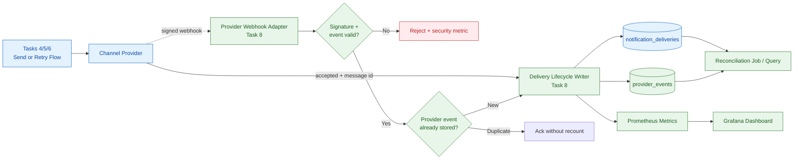
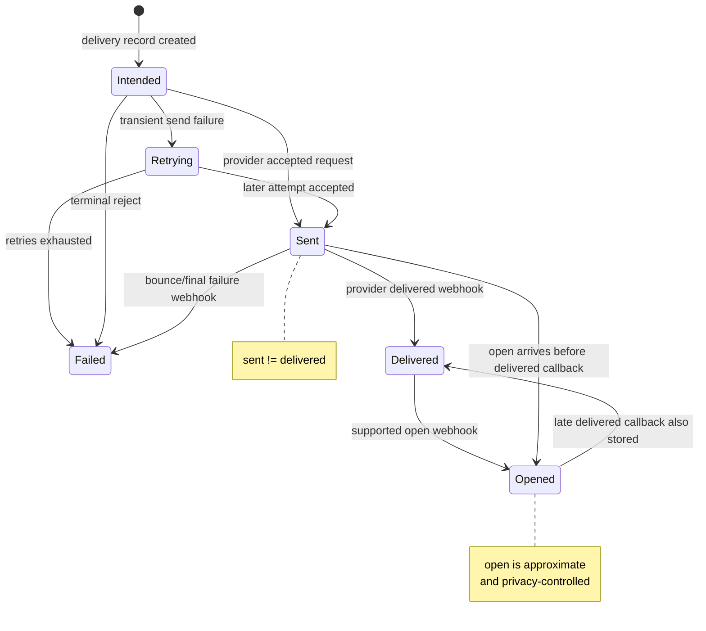
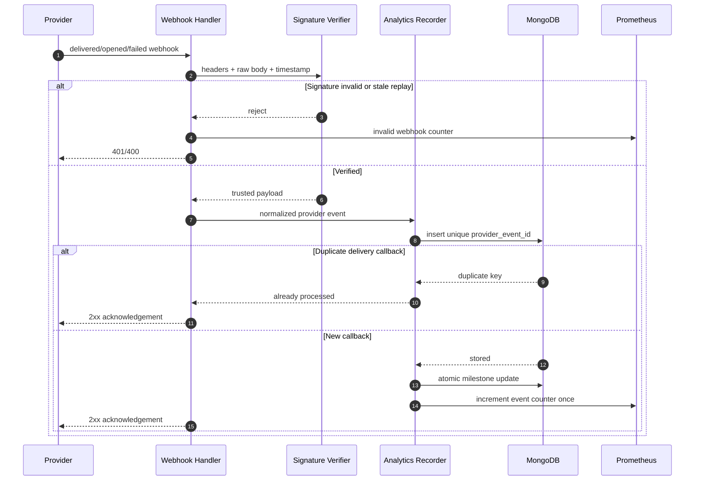
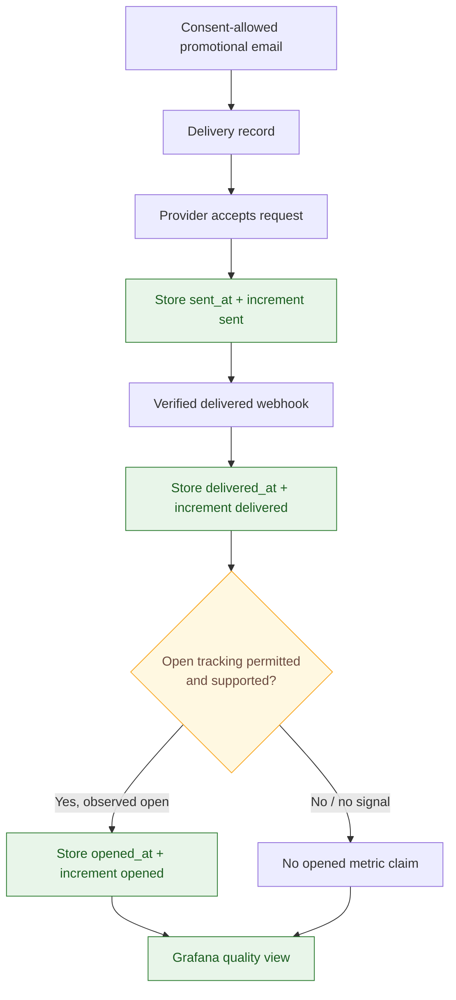

# 📊 Notification Service - Task 8: Delivery Analytics


## 📌 Task Summary

| Field | Detail |
|---|---|
| Task Name | Delivery analytics |
| Requirement Source | `docs/01-micro-tasks.md` -> `Notification Service` -> Task 8 |
| Original Goal | `sent`, `delivered`, `failed`, `opened` metrics collect karo; campaign quality measure hogi |
| Dependency | Monitoring |
| Priority | `P2` |
| Existing Persistence Base | `notification_db.notification_deliveries` and documented `provider_events` collection |
| Metrics Export | Internal Prometheus scrape endpoint, for example `/metrics` |
| Dashboard Consumer | Grafana/monitoring layer; no new public buyer API required |
| Reused Building Blocks | Channels (Task 1), delivery records (Task 2), templates (Task 3), send flow (Task 4/5), retry/DLQ (Task 6), preferences (Task 7) |
| Deliverable | Beginner-friendly implementation blueprint with reference code and diagrams |
| Implementation Type | Documentation + reference code/design only |

> **Simple Hinglish goal:** Notification bhejna enough nahi hai; hume reliably pata hona chahiye ki provider ne message accept kiya (`sent`), user ke endpoint tak deliver confirm hua (`delivered`), permanently fail hua (`failed`), aur supported/consented channel par open signal mila (`opened`). Task 8 delivery lifecycle ko measurable banata hai without user content ya secrets ko metrics me expose kiye.

---

## ✅ Output Created

Request ke according repository me sirf required documentation artifact add kiya gaya:

```text
TaskImplementation/
└── Notification Service/
    ├── task1.md                         # Existing: channel/provider abstraction
    ├── task2.md                         # Existing: MongoDB template/delivery storage
    ├── task3.md                         # Existing: template engine
    ├── task4.md                         # Existing: OTP sending guide
    ├── task5.md                         # Existing: async event consumers
    ├── task6.md                         # Existing: retry and DLQ
    ├── task7.md                         # Existing: preferences/consent
    └── task8.md                         # Current: delivery analytics guide
```

> 🟢 **Important:** Neeche diye gaye Go files, MongoDB migration, webhook adapters, metrics endpoint aur Grafana queries **implementation blueprint/reference examples** hain. Is output me `backend/services/notification-service/`, monitoring setup, API contracts, database, dependencies ya runtime configuration physically create/modify nahi kiye gaye.

---

## 📚 Project Requirements Se Kya Samjha

| Source | Task 8 ke liye decision |
|---|---|
| `docs/01-micro-tasks.md` | Exact Task 8 scope: sent, delivered, failed, opened metrics; dependency Monitoring; priority `P2` |
| `docs/03-folder-structure.md` | Future source location `backend/services/notification-service/internal/` aur gRPC service convention follow karegi |
| `docs/04-microservice-design.md` | Notification Service delivery logs/retries own karta hai; Mongo collections list me `provider_events` already defined hai |
| `docs/05-database-design.md` | Async notification send checkout ko block nahi karega; analytics ko independent rehna chahiye |
| `database/mongodb-schema-design.md` | `notification_deliveries` me `status`, `provider`, `provider_message_id`, attempts and timestamps existing base fields hain |
| `docs/12-logging-monitoring-scalability.md` | Metrics ke liye Prometheus use karna hai; async notifications aur failure isolation project rules hain |
| `api/master-api.json` | Existing contract delivery status/preferences expose karta hai; Notification Analytics ke liye naya public REST route currently defined nahi hai |
| `TaskImplementation/Notification Service/task2.md` | Delivery storage aur provider-message lookup index Task 8 callbacks ke liye base provide karte hain |
| `TaskImplementation/Notification Service/task5.md` | Provider acceptance ko delivered/opened label nahi karna; events idempotent handle karne hain |
| `TaskImplementation/Notification Service/task6.md` | Retry attempts transient failure hote hain; `failed` quality metric ko final failure/DLQ outcome represent karna chahiye |
| `TaskImplementation/Notification Service/task7.md` | Suppressed/opted-out message provider delivery failure nahi hai; analytics me separately track hoga |

### Contract Clarification: Analytics Endpoint

Current API master contract me notification analytics dashboard REST/gRPC endpoint listed nahi hai. Task 8 ki Monitoring dependency ke hisaab se baseline output:

| Need | Baseline Implementation Decision |
|---|---|
| Operational counters | Notification service internal `/metrics` endpoint Prometheus scrape karega |
| Dashboard | Grafana Prometheus queries se sent/delivered/failed/opened cards aur rates show karega |
| Durable investigation | MongoDB delivery and provider event records se audit/query hogi |
| Public/admin API | Existing approved API contract ko silently extend nahi karenge; separate contract task/approval ke baad add hoga |

---

## 🚧 Scope Boundary

Task 8 ka kaam **already-triggered notification delivery outcomes ko accurately record, count aur observe karna** hai. Ye new messaging product ya campaign management module nahi hai.

### Included In Task 8

| Included | Kyon |
|---|---|
| Four business outcomes: `sent`, `delivered`, `failed`, `opened` | Requirement ka exact metric set cover hota hai |
| Delivery milestone fields and lifecycle rules | Callback order/out-of-order events safely handle ho sakein |
| Normalized `provider_events` record design | Vendor-specific webhook payload ko common vocabulary milti hai |
| Provider event signature verification and deduplication | Fake callbacks aur repeated webhooks metric corrupt na karein |
| Prometheus counter/histogram reference implementation | Monitoring dependency fulfil hoti hai |
| Grafana/PromQL quality formulas | Campaign/message quality readable ban sakti hai |
| MongoDB aggregation example | Durable reporting aur reconciliation possible hota hai |
| Open-tracking privacy rules | `opened` measurement user trust aur accuracy boundaries ke saath use hoti hai |
| Tests, alerts and operational reconciliation | Analytics silently inaccurate na rahe |

### Explicitly Not Included

| Deferred / Owned Elsewhere | Reason |
|---|---|
| Channel/provider abstraction | Task 1 ka concern |
| Template creation/render engine | Task 3 ka concern |
| OTP delivery workflow | Task 4 ka concern |
| Order/payment/user event consumers | Task 5 ka concern |
| Retry queue and DLQ topology | Task 6 ka concern |
| Preference editing or consent policy UI | Task 7 ka concern |
| New email/SMS/push vendor integration | Vendor onboarding separate implementation concern hai |
| Marketing campaign CRUD, targeting or budget engine | CMS/product scope; Task 8 sirf outcome measurement hai |
| New public/admin analytics REST or gRPC API | Current `api/master-api.json` me approved route nahi hai |
| Session analytics or conversion funnel | Session Management Service ka domain hai |
| Actual Go files, Mongo migrations, monitoring dashboards or package installation | Requested output sirf `task8.md` artifact hai |

> 🔴 **Boundary rule:** Task 8 message send nahi karta aur retry decision replace nahi karta. Ye successfully sent ya finally failed delivery aur provider callbacks ko safe, deduplicated metrics me convert karta hai.

---

## 🧠 Beginner Concepts

| Term | Simple Hinglish Meaning |
|---|---|
| Delivery | Ek intended notification ka stored record, jaise order confirmation email |
| Provider | External system jo email/SMS/push actually deliver karne ki koshish karta hai |
| Provider webhook | Provider ka server-to-server callback: delivered, bounced/failed, opened jaisi update |
| Metric | Count ya timing jo monitoring system query/show kar sakta hai |
| Counter | Sirf badhne wali value; e.g. total delivered messages |
| Label | Metric ko group/filter karne ka bounded dimension, e.g. `channel=email` |
| High cardinality | Bahut zyada unique label values, e.g. `user_id`; Prometheus ko expensive bana deta hai |
| Idempotency | Same webhook repeat aaye to result/count dobara apply na hona |
| Milestone | Delivery ka observed timestamp: `sent_at`, `delivered_at`, `failed_at`, `opened_at` |
| Reconciliation | Stored records aur monitoring counts ko compare karke missing/duplicate handling detect karna |

---

## 📏 Metric Semantics Freeze Karo

Sabse important implementation decision ye hai ki four metric names ka exact meaning ambiguous na rahe.

| Metric Event | Kab Record Hoga | Source | Important Rule |
|---|---|---|---|
| `sent` | Provider outbound request accept karta hai aur stable `provider_message_id` milta hai, ya provider ke documented sent event se confirm hota hai | Send worker/provider adapter | Task 6 ka `accepted` state analytics me one-time `sent` event ban sakta hai; ye delivery proof nahi hai |
| `delivered` | Provider callback destination delivery confirm karta hai | Verified provider webhook | `sent` ke equal assume mat karo |
| `failed` | Provider terminal reject/bounce report karta hai, ya retries exhausted hoke delivery final failure/DLQ me jati hai | Verified webhook or Task 6 terminal outcome | Har temporary retry failure ko business `failed` counter me mat count karo |
| `opened` | Provider-supported open event verified receive hota hai, aur tracking legally/product-policy ke according enabled thi | Verified provider webhook | Email privacy proxy/image blocking ke karan approximate signal hai |

### Status Versus Milestone

Earlier delivery flow `pending`, `accepted`, `retry_scheduled`, `dead_lettered`, `suppressed` jaise processing states use kar sakta hai. Task 8 unko erase nahi karega. Analytics ke liye **milestone timestamps** add karna safer hai.

```text
Processing status: retry/sending operation abhi kis state me hai
Analytics milestone: real-world outcome kab observe hua
```

| Scenario | Processing Status Example | Analytics Fields |
|---|---|---|
| Provider accepted request | `accepted` | `sent_at` set |
| Callback says delivered | `delivered` or retained terminal representation | `sent_at`, `delivered_at` set |
| Open callback delivery callback se pehle arrive hua | Status ko unsafe reverse mat karo | `opened_at` set; later `delivered_at` independently set ho sakta hai |
| Provider temporary unavailable, retry pending | `retry_scheduled` | No `failed_at` yet |
| Four attempts exhausted | `dead_lettered` | `failed_at` set once |
| User opt-out ne marketing send roka | `suppressed` | Not `failed`; optional separate suppression operational metric |

> 🟡 **Key accuracy rule:** Provider request accepted hona `sent` hai, `delivered` nahi. Open event ko guaranteed human read bhi nahi bolna chahiye.

---

## 🏗️ Architecture

### Delivery Analytics Components



### Milestone Lifecycle



### Signed Webhook Processing Sequence



---

## 📁 Clean Implementation Folder Structure

### Actual Documentation Output

```text
TaskImplementation/
└── Notification Service/
    └── task8.md
```

### Target Source Structure When Task 8 Is Implemented

Ye future source layout existing Go service convention aur Monitoring dependency se aligned hai:

```text
backend/
└── services/
    └── notification-service/
        ├── cmd/
        │   └── server/
        │       └── main.go                         # Metrics + provider webhook wiring
        ├── migrations/
        │   └── 003_add_delivery_analytics.up.js   # Analytics fields/provider_events indexes
        └── internal/
            ├── domain/
            │   ├── delivery.go                     # Existing delivery + milestone fields
            │   └── delivery_event.go               # Task 8 normalized event types
            ├── analytics/
            │   ├── recorder.go                     # Validate/deduplicate/apply event
            │   ├── metrics.go                      # Prometheus counters/histograms
            │   └── report.go                       # Mongo durable aggregation query
            ├── repository/
            │   └── mongo_notification_repository.go # Provider event insert + milestone update
            └── transport/
                └── http/
                    ├── provider_webhook.go          # Provider callback endpoint adapter
                    └── metrics.go                   # Internal /metrics exposure

monitoring/
├── prometheus/
│   └── rules/
│       └── notification-alerts.yml                  # Failure/webhook health alerts
└── grafana/
    └── dashboards/
        └── notification-delivery.json               # Quality panels when implemented
```

### Files Intentionally Absent From Task 8

```text
internal/provider/new_email_vendor.go                # New provider integration is not Task 8
internal/retry/new_retry_policy.go                    # Task 6 owns retry policy
internal/preferences/                                 # Task 7 owns user consent settings
transport/http/admin_campaign_analytics.go            # No approved public/admin analytics API
frontend/analytics-dashboard/                        # UI implementation not requested
```

---

## 🪜 Step-by-Step Implementation

## Step 1: Normalized Analytics Events Define Karo

Har vendor alag event name bhej sakta hai: `delivered`, `delivery.success`, `bounce`, `open`, etc. Domain layer ko vendor string se couple nahi karna; adapter unhe four canonical analytics events me convert karega.

### Reference Code: `internal/domain/delivery_event.go`

```go
package domain

import (
	"errors"
	"time"
)

type DeliveryEventType string

const (
	EventSent      DeliveryEventType = "sent"
	EventDelivered DeliveryEventType = "delivered"
	EventFailed    DeliveryEventType = "failed"
	EventOpened    DeliveryEventType = "opened"
)

func (t DeliveryEventType) IsSupported() bool {
	switch t {
	case EventSent, EventDelivered, EventFailed, EventOpened:
		return true
	default:
		return false
	}
}

type ProviderEvent struct {
	ID                string            `bson:"_id" json:"id"`
	Provider          string            `bson:"provider" json:"provider"`
	ProviderEventID   string            `bson:"provider_event_id" json:"provider_event_id"`
	ProviderMessageID string            `bson:"provider_message_id,omitempty" json:"provider_message_id,omitempty"`
	DeliveryID        string            `bson:"delivery_id" json:"delivery_id"`
	Type              DeliveryEventType `bson:"type" json:"type"`
	Channel           Channel           `bson:"channel" json:"channel"`
	TemplateKey       string            `bson:"template_key" json:"template_key"`
	OccurredAt        time.Time         `bson:"occurred_at" json:"occurred_at"`
	ReceivedAt        time.Time         `bson:"received_at" json:"received_at"`
	FailureCode       string            `bson:"failure_code,omitempty" json:"failure_code,omitempty"`
}

func (e ProviderEvent) Validate() error {
	if e.ID == "" || e.Provider == "" || e.ProviderEventID == "" ||
		e.DeliveryID == "" {
		return errors.New("provider event identifiers are required")
	}
	if !e.Type.IsSupported() || !e.Channel.IsSupported() {
		return errors.New("unsupported delivery event or channel")
	}
	if e.OccurredAt.IsZero() || e.ReceivedAt.IsZero() {
		return errors.New("provider event timestamps are required")
	}
	return nil
}
```

### Kaise Built Hua?

| Part | Reason |
|---|---|
| `DeliveryEventType` | Dashboard aur storage same four names use karte hain |
| `ProviderEventID` | Webhook duplicate redelivery ko dedupe karne ka stable key |
| `ProviderMessageID` | External provider callback ko existing delivery se correlate karta hai; provider acceptance se pehle internal terminal failure me absent ho sakta hai |
| `OccurredAt` and `ReceivedAt` | Provider outcome kab hua aur service ko kab mila, dono debugging ke liye useful |
| `FailureCode` | Sanitized reason group karta hai; raw provider payload metrics/log me nahi jata |
| No recipient/body variables | Analytics event me PII/message content store karne ki need nahi |

> 🟣 **Design note:** Internal send worker successful provider acceptance ko bhi normalized `sent` event ke form me recorder ko de sakta hai. Isse four metrics ek consistent pipeline se count honge.

---

## Step 2: Delivery Milestones Add Karo

Existing `notification_deliveries` document ko replace karne ki zarurat nahi. Task 8 optional lifecycle milestone fields add karega, jisse out-of-order callbacks aur durable reporting manageable rahe.

### Extended Delivery Document Example

```json
{
  "_id": "delivery_123",
  "user_id": "user_123",
  "channel": "email",
  "template_key": "promotional_offer",
  "campaign_id": "campaign_summer_2026",
  "status": "delivered",
  "provider": "email_provider",
  "provider_message_id": "msg_123",
  "attempts": 1,
  "sent_at": "2026-05-27T10:00:00Z",
  "delivered_at": "2026-05-27T10:00:06Z",
  "opened_at": "2026-05-27T10:03:20Z",
  "created_at": "2026-05-27T09:59:59Z",
  "updated_at": "2026-05-27T10:03:20Z"
}
```

| New Field | Required? | Meaning |
|---|---:|---|
| `sent_at` | No | First verified provider acceptance/sent milestone |
| `delivered_at` | No | First provider-confirmed delivery milestone |
| `failed_at` | No | First final failure milestone; transient retry errors nahi |
| `opened_at` | No | First supported, policy-allowed open event |
| `failure_code` | No | Sanitized terminal category, e.g. `hard_bounce`, `invalid_recipient`, `retry_exhausted` |
| `campaign_id` | No | Existing marketing send ke paas safe campaign identifier ho to report grouping; Task 8 campaign CRUD create nahi karta |

### Milestone Rules

| Rule | Why |
|---|---|
| Timestamp first event par set hoga, duplicate callback par overwrite nahi hoga | First observed milestone consistent aur deduped rahega |
| `sent_at` ke bina received `delivered` event valid ho sakta hai | Callback ordering/network delay out of order ho sakta hai |
| `opened_at` `delivered_at` se pehle arrive kar sakta hai | Provider streams ordering guarantee na dein |
| `failed_at` only terminal outcome par set hoga | Temporary outage campaign failure rate artificially inflate nahi karega |
| `suppressed` record ko `failed_at` nahi milega | User consent enforcement provider quality failure nahi hai |
| One delivery ka same milestone metric once emit hoga | Retries/webhook duplicates rate distort nahi karenge |

### Reference Go Extension: `internal/domain/delivery.go`

```go
type Delivery struct {
	ID                string         `bson:"_id" json:"id"`
	UserID            string         `bson:"user_id" json:"user_id"`
	Channel           Channel        `bson:"channel" json:"channel"`
	TemplateKey       string         `bson:"template_key" json:"template_key"`
	CampaignID        string         `bson:"campaign_id,omitempty" json:"campaign_id,omitempty"`
	Status            DeliveryStatus `bson:"status" json:"status"`
	Provider          string         `bson:"provider,omitempty" json:"provider,omitempty"`
	ProviderMessageID string         `bson:"provider_message_id,omitempty" json:"provider_message_id,omitempty"`
	Attempts          int            `bson:"attempts" json:"attempts"`
	SentAt            *time.Time     `bson:"sent_at,omitempty" json:"sent_at,omitempty"`
	DeliveredAt       *time.Time     `bson:"delivered_at,omitempty" json:"delivered_at,omitempty"`
	FailedAt          *time.Time     `bson:"failed_at,omitempty" json:"failed_at,omitempty"`
	OpenedAt          *time.Time     `bson:"opened_at,omitempty" json:"opened_at,omitempty"`
	FailureCode       string         `bson:"failure_code,omitempty" json:"failure_code,omitempty"`
	CreatedAt         time.Time      `bson:"created_at" json:"created_at"`
	UpdatedAt         time.Time      `bson:"updated_at" json:"updated_at"`
}
```

**How this part was built:** Task 2 ke existing delivery identity/status/provider fields reuse kiye gaye. Analytics-specific milestones additive rakhe gaye, taaki earlier send/retry implementation ko redesign kiye bina delivery quality reliably calculate ho.

---

## Step 3: `provider_events` Collection Design Karo

Project architecture already Notification Service collections me `provider_events` list karti hai. Task 8 is collection ko webhook audit/deduplication source ke roop me use karega.

### Normalized Document Example

```json
{
  "_id": "provider_event_email_evt_456",
  "provider": "email_provider",
  "provider_event_id": "evt_456",
  "provider_message_id": "msg_123",
  "delivery_id": "delivery_123",
  "type": "delivered",
  "channel": "email",
  "template_key": "promotional_offer",
  "campaign_id": "campaign_summer_2026",
  "occurred_at": "2026-05-27T10:00:06Z",
  "received_at": "2026-05-27T10:00:07Z"
}
```

### Recommended Indexes

```javascript
db.provider_events.createIndex(
  { provider: 1, provider_event_id: 1 },
  { name: "provider_event_dedup", unique: true }
)

db.provider_events.createIndex(
  { delivery_id: 1, type: 1, occurred_at: 1 },
  { name: "delivery_event_timeline" }
)

db.provider_events.createIndex(
  { template_key: 1, channel: 1, type: 1, occurred_at: 1 },
  { name: "template_channel_quality" }
)

db.notification_deliveries.createIndex(
  { campaign_id: 1, created_at: 1 },
  { name: "campaign_delivery_range", sparse: true }
)
```

### Optional Retention Index

Raw normalized provider events volume grow kar sakte hain. Product/compliance retention approve hone ke baad limited raw-event retention use ho sakti hai:

```javascript
// Example only: 90 days. Final retention policy approval ke baad hi apply karo.
db.provider_events.createIndex(
  { received_at: 1 },
  { name: "provider_event_retention", expireAfterSeconds: 7776000 }
)
```

| Storage Item | Long-Term Need |
|---|---|
| Delivery milestone fields | Longer-lived quality/support record ho sakte hain |
| Raw normalized webhook events | Bounded retention cost/privacy ke liye useful hai |
| Raw vendor body/signature | Default me persist mat karo; sanitized fields enough hain |
| Prometheus time series | Monitoring retention/config ke according maintain hogi |

> 🟠 **Retention rule:** TTL value business, legal aur support needs se approve karwao. Documentation example ko silently production retention policy mat samjho.

---

## Step 4: Provider Callback Ko Securely Normalize Karo

`delivered`, `failed` aur `opened` usually provider webhook se aate hain. Public internet se aane wale callback ko trusted data assume karna metric manipulation aur security risk hai.

### Webhook Processing Rules

| Check | Implementation Rule |
|---|---|
| Signature | Provider-specific signing secret/public key se raw body verify karo |
| Timestamp/replay window | Bahut old signed payload reject karo, e.g. configured five-minute acceptance window where supported |
| Body size | Small maximum request body enforce karo |
| Event mapping | Allowlisted provider event names ko canonical four event types me map karo |
| Correlation | `provider_message_id` se existing delivery find karo |
| Unknown message ID | Safe outcome log/metric; customer content expose na karo |
| Duplicate provider event | Unique index conflict ko successful idempotent acknowledgement treat karo |
| Response | Valid/duplicate webhook ko quick `2xx`; temporary DB failure ko retry-able response do |

### Reference Interfaces: `internal/analytics/recorder.go`

```go
package analytics

import (
	"context"

	"github.com/example/ecommerce-platform/backend/services/notification-service/internal/domain"
)

type ProviderWebhookNormalizer interface {
	VerifyAndNormalize(headers map[string]string, body []byte) (domain.ProviderEvent, error)
}

type ApplyResult struct {
	Duplicate        bool
	MilestoneChanged bool
}

type EventRepository interface {
	FindDeliveryByProviderMessageID(ctx context.Context, provider, messageID string) (domain.Delivery, error)
	// Store event and mutate its first milestone in one Mongo transaction.
	RecordEventAndApplyMilestone(ctx context.Context, event domain.ProviderEvent) (ApplyResult, error)
}

type Metrics interface {
	ObserveDeliveryEvent(event domain.ProviderEvent)
	ObserveDuplicate(provider string, eventType domain.DeliveryEventType)
	ObserveInvalidWebhook(provider, reason string)
}
```

### Reference Recorder Logic

```go
func (r *Recorder) Record(ctx context.Context, event domain.ProviderEvent) error {
	if err := event.Validate(); err != nil {
		return err
	}

	result, err := r.repo.RecordEventAndApplyMilestone(ctx, event)
	if err != nil {
		return err
	}
	if result.Duplicate {
		r.metrics.ObserveDuplicate(event.Provider, event.Type)
		return nil
	}
	if result.MilestoneChanged {
		r.metrics.ObserveDeliveryEvent(event)
	}
	return nil
}
```

### Vendor-to-Domain Mapping Example

| Incoming Provider Event | Canonical Type | Behaviour |
|---|---|---|
| `accepted`, adapter send success | `sent` | Set `sent_at` once |
| `delivered` | `delivered` | Set `delivered_at` once |
| `bounce`, `permanent_failure`, exhausted retry outcome | `failed` | Set `failed_at` and sanitized `failure_code` once |
| `open` | `opened` | Set `opened_at` once only when open tracking permitted |
| `click`, `complaint`, `unsubscribe` | Not part of required four | Do not quietly count as Task 8 metric; separate reviewed extension later |

**How this part was built:** Provider adapter sirf vendor translation/signature verification handle karta hai; analytics recorder vendor-neutral rehta hai. Ye Task 1 ke abstraction principle aur Task 5 ke idempotency rule ko extend karta hai.

---

## Step 5: Atomic, Idempotent Milestone Updates Karo

Webhook provider retry kar sakta hai, aur service crash ke baad event dobara receive ho sakta hai. Provider event insert aur delivery milestone update ko **same MongoDB transaction** me commit karo. Agar insert commit ho jaye lekin milestone fail ho, to retry duplicate samajh kar outcome lose kar sakta hai.

### Transaction Boundary

```text
Mongo transaction begin
  1. provider_events me unique event insert attempt karo
  2. duplicate ho to transaction end: Duplicate=true, recount nahi
  3. new ho to guarded delivery milestone update karo
Mongo transaction commit
  4. commit ke baad hi Prometheus event observe karo
```

| Concern | Safe Decision |
|---|---|
| Event insert succeeds, delivery update fails | Transaction abort; callback retry complete work dobara kar sakega |
| Delivery milestone already applied by different provider event | New event audit ke liye store ho sakta hai; `MilestoneChanged=false`, business counter recount nahi |
| Transaction support | Production MongoDB replica set use karo; project operational notes bhi replica sets recommend karte hain |
| Internal `sent` record | Send worker stable event key, e.g. `sent:<delivery_id>`, ke saath isi atomic recorder path ko call kare |

### Mongo Update Idea

```javascript
// Transaction ke andar first delivered milestone update ka example.
db.notification_deliveries.updateOne(
  {
    _id: "delivery_123",
    delivered_at: { $exists: false }
  },
  {
    $set: {
      delivered_at: ISODate("2026-05-27T10:00:06Z"),
      updated_at: ISODate("2026-05-27T10:00:07Z")
    }
  }
)
```

### Update Matrix

| Canonical Event | Filter Guard | Set Fields | Metric Emit Kab |
|---|---|---|---|
| `sent` | `sent_at` absent | `sent_at`, provider/message identity if missing | Update modified exactly one record |
| `delivered` | `delivered_at` absent | `delivered_at` | Update modified exactly one record |
| `failed` | `failed_at` absent and no prior final outcome policy conflict | `failed_at`, `failure_code` | Update modified exactly one record |
| `opened` | `opened_at` absent | `opened_at` | Update modified exactly one record |

### Edge Cases

| Edge Case | Decision |
|---|---|
| Duplicate `delivered` webhook | Event unique insert/guard stops second count |
| `opened` before `delivered` | Store open independently; late delivered still applies |
| `delivered` after recorded final `failed` | Store contradictory provider event for investigation; do not silently rewrite terminal outcome without explicit reconciliation policy |
| Retry attempt transiently failed | Operational retry metric only; no Task 8 `failed` event |
| DLQ after retry exhaustion | Stable internal event key, e.g. `failed:<delivery_id>:retry_exhausted`, se one `failed` event emit karo; provider message id absent ho sakta hai |
| Preference suppression | Optional `notification_suppressed_total`; never map to provider `failed` |

> 🔴 **Do not count from HTTP request arrival alone:** Metric tab increment karo jab deduplication and milestone mutation confirm ho jaye. Otherwise duplicate webhook ya DB error dashboard numbers ko wrong bana sakta hai.

> 🟡 **Prometheus durability note:** DB transaction commit ke turant baad process crash ho jaye to durable Mongo milestone saved ho sakta hai but in-memory Prometheus increment miss ho sakta hai. Baseline me scheduled reconciliation is gap ko detect karegi; strict long-term reporting Mongo milestones se generate karo, ya later reviewed metrics-outbox exporter add karo.

---

## Step 6: Prometheus Metrics Expose Karo

Prometheus fast operational dashboards aur alerting ke liye suitable hai. MongoDB durable records investigation/reconciliation ke liye source rahenge.

### Recommended Metrics

| Metric | Type | Labels | Purpose |
|---|---|---|---|
| `notification_delivery_events_total` | Counter | `event`, `channel`, `provider`, `template_key` | Required sent/delivered/failed/opened totals |
| `notification_provider_webhooks_total` | Counter | `provider`, `outcome` | accepted/duplicate/invalid/unmatched webhook health |
| `notification_provider_webhook_processing_seconds` | Histogram | `provider` | Webhook latency and DB degradation |
| `notification_delivery_event_lag_seconds` | Histogram | `event`, `channel`, `provider` | Provider event time se receive time tak delay |

### Label Safety Rules

| Allowed Bounded Label | Never Use As Prometheus Label |
|---|---|
| `event=sent|delivered|failed|opened` | `user_id` |
| `channel=email|sms|push|whatsapp_like` | `delivery_id` |
| Reviewed provider name allowlist | `provider_message_id` |
| Reviewed template key allowlist | Email, phone, device token |
| Optional small failure category on separate alert metric | Arbitrary raw error/message body |
| Dashboard query filter stored in Mongo for campaign drilldown | Unbounded `campaign_id` unless cardinality policy explicitly approves it |

### Reference Code: `internal/analytics/metrics.go`

```go
package analytics

import (
	"github.com/example/ecommerce-platform/backend/services/notification-service/internal/domain"
	"github.com/prometheus/client_golang/prometheus"
)

type PrometheusMetrics struct {
	events *prometheus.CounterVec
	hooks  *prometheus.CounterVec
	lag    *prometheus.HistogramVec
}

func NewPrometheusMetrics(reg prometheus.Registerer) *PrometheusMetrics {
	m := &PrometheusMetrics{
		events: prometheus.NewCounterVec(prometheus.CounterOpts{
			Name: "notification_delivery_events_total",
			Help: "Count of deduplicated notification delivery milestone events.",
		}, []string{"event", "channel", "provider", "template_key"}),
		hooks: prometheus.NewCounterVec(prometheus.CounterOpts{
			Name: "notification_provider_webhooks_total",
			Help: "Count of provider webhook processing outcomes.",
		}, []string{"provider", "outcome"}),
		lag: prometheus.NewHistogramVec(prometheus.HistogramOpts{
			Name:    "notification_delivery_event_lag_seconds",
			Help:    "Seconds between provider occurrence and ingestion.",
			Buckets: []float64{1, 5, 15, 60, 300, 1800},
		}, []string{"event", "channel", "provider"}),
	}
	reg.MustRegister(m.events, m.hooks, m.lag)
	return m
}

func (m *PrometheusMetrics) ObserveDeliveryEvent(e domain.ProviderEvent) {
	m.events.WithLabelValues(string(e.Type), string(e.Channel), e.Provider, e.TemplateKey).Inc()
	m.lag.WithLabelValues(string(e.Type), string(e.Channel), e.Provider).
		Observe(e.ReceivedAt.Sub(e.OccurredAt).Seconds())
}
```

### Metrics Endpoint Wiring Example

```go
import (
	"net/http"

	"github.com/prometheus/client_golang/prometheus/promhttp"
)

func RegisterInternalMetrics(mux *http.ServeMux) {
	mux.Handle("/metrics", promhttp.Handler())
}
```

> 🟡 **Security note:** `/metrics` public buyer traffic ke liye expose mat karo. Internal network/service monitor scrape access tak restrict karo.

---

## Step 7: Campaign Quality Dashboard Define Karo

Task requirement campaign quality measure karna bolta hai. Task 8 campaign create/target nahi karega; ye available dimensions (`template_key`, channel, provider, time range, aur safe stored `campaign_id` where provided) par outcome quality show karega.

### Quality Formulas

| Card / Rate | Formula | Meaning |
|---|---|---|
| Sent | `sent` count | Provider tak successfully handed-off messages |
| Delivered | `delivered` count | Destination delivery provider-confirmed |
| Failed | `failed` count | Final unsuccessful deliveries |
| Opened | `opened` count | Supported/allowed tracked opens |
| Delivery Rate | `delivered / sent * 100` | Handoff ke baad reach quality |
| Final Failure Rate | `failed / sent * 100` | Permanent failure quality issue |
| Open Rate | `opened / delivered * 100` | Delivered message engagement indicator, approximate |

### Example PromQL Queries

```promql
# Selected range me sent total
sum(increase(notification_delivery_events_total{event="sent"}[$__range]))
```

```promql
# Channel-wise delivery rate; denominator zero handling dashboard layer me karo
100 *
sum by (channel) (increase(notification_delivery_events_total{event="delivered"}[$__range]))
/
sum by (channel) (increase(notification_delivery_events_total{event="sent"}[$__range]))
```

```promql
# Email promotional template open rate
100 *
sum(increase(notification_delivery_events_total{event="opened",channel="email",template_key="promotional_offer"}[$__range]))
/
sum(increase(notification_delivery_events_total{event="delivered",channel="email",template_key="promotional_offer"}[$__range]))
```

```promql
# Provider/channel final failure spike
sum by (provider, channel) (
  increase(notification_delivery_events_total{event="failed"}[15m])
)
```

### Dashboard Panels

| Panel | Filter / Breakdown | Beginner Ko Kya Dikhega |
|---|---|---|
| Four KPI cards | Time range, channel, provider, template | Sent/delivered/failed/opened current totals |
| Delivery rate time series | Channel/provider | Koi provider degrade ho raha hai ya nahi |
| Failure distribution | Provider/channel/template | Problem message-type ya provider isolate karna |
| Open rate trend | Email/push where supported | Message engagement signal |
| Webhook invalid/duplicate health | Provider | Integration/signature/retry issue detect karna |
| Event ingestion lag | Provider/event | Webhook late aa rahe hain ya service slow hai |

### Durable Mongo Aggregation Example

Prometheus restart/retention ke beyond audit ya a specific stored campaign report ke liye deliveries query ki ja sakti hain:

```javascript
db.notification_deliveries.aggregate([
  {
    $match: {
      campaign_id: "campaign_summer_2026",
      created_at: {
        $gte: ISODate("2026-05-01T00:00:00Z"),
        $lt: ISODate("2026-06-01T00:00:00Z")
      }
    }
  },
  {
    $group: {
      _id: "$channel",
      sent: { $sum: { $cond: [{ $ne: [{ $type: "$sent_at" }, "missing"] }, 1, 0] } },
      delivered: { $sum: { $cond: [{ $ne: [{ $type: "$delivered_at" }, "missing"] }, 1, 0] } },
      failed: { $sum: { $cond: [{ $ne: [{ $type: "$failed_at" }, "missing"] }, 1, 0] } },
      opened: { $sum: { $cond: [{ $ne: [{ $type: "$opened_at" }, "missing"] }, 1, 0] } }
    }
  }
])
```

**How this part was built:** Prometheus dashboards operational visibility dete hain, while Mongo milestone data durable report/reconciliation path deta hai. User/campaign IDs ko Prometheus labels me bhejne ke bajay controlled database query me filter karna cardinality aur privacy risk reduce karta hai.

---

## Step 8: Open Tracking Ko Honest Aur Privacy-Safe Rakho

`opened` sabse sensitive aur least exact metric hai. Email opens aksar tracking pixel ya provider-side signal par depend karte hain; privacy protection tools image prefetch kar sakte hain, aur image blocking real open miss kar sakta hai.

### Channel Capability Matrix

| Channel | `sent` | `delivered` | `failed` | `opened` |
|---|---:|---:|---:|---:|
| Email | Usually available | Provider dependent | Usually available | Approximate; tracking/config/consent dependent |
| SMS | Usually available | Provider dependent | Usually available | Generally unavailable; open invent mat karo |
| Push | Usually available | Platform/provider dependent | Usually available | Provider/app event design dependent |
| WhatsApp-like | Provider dependent | Provider dependent | Provider dependent | Provider capability/policy dependent |

### Privacy And Accuracy Rules

| Rule | Kyon |
|---|---|
| Open tracking product/privacy policy approve hone par hi enable karo | Engagement tracking user expectations aur applicable rules affect kar sakta hai |
| Transactional/OTP email me unnecessary pixel automatically add mat karo | Security message ke liye tracking purpose alag ho sakta hai |
| Dashboard me `opened` ko “observed opens” label karo | Human-read guarantee imply nahi hoti |
| Unsupported channel ke opens ko `0` quality judgement ke roop me compare mat karo | Metric available hi nahi hota |
| IP/user-agent/raw tracking URL ko normal analytics record me store mat karo | PII/fingerprinting surface reduce hota hai |
| Opt-out/deletion/retention rules follow karo | Task 7 aur platform privacy expectations preserve hoti hain |

> 🟠 **Beginner note:** “No open event” ka meaning “user ne message nahi padha” nahi hota. Itna hi pata hai ki system ne tracked open observe nahi kiya.

---

## Step 9: Monitoring Configuration Aur Alerts Add Karo

Monitoring dependency ka practical output metrics scrape aur meaningful alerts hai. Actual monitoring files is documentation-only deliverable me create nahi ki ja rahi.

### Reference Environment Shape

```dotenv
# Internal analytics/metrics
NOTIFICATION_METRICS_ENABLED=true
NOTIFICATION_METRICS_PATH=/metrics

# Provider callback safety - actual values secret manager se lo
NOTIFICATION_WEBHOOK_MAX_BODY_BYTES=65536
NOTIFICATION_WEBHOOK_REPLAY_WINDOW_SECONDS=300
NOTIFICATION_EMAIL_WEBHOOK_SIGNING_SECRET=secret_from_vault

# Open tracking requires explicit product/privacy decision
NOTIFICATION_EMAIL_OPEN_TRACKING_ENABLED=false
```

### Prometheus Scrape Concept

```yaml
scrape_configs:
  - job_name: notification-service
    metrics_path: /metrics
    static_configs:
      - targets: ["notification-service:8081"]
```

### Alert Suggestions

| Alert | Example Condition | Action |
|---|---|---|
| Delivery failure spike | Final failure rate suddenly exceeds approved threshold | Provider/channel/template breakdown investigate karo |
| Invalid webhook signature | Any sustained `invalid_signature` outcomes | Secret/config/attack possibility immediately check karo |
| Webhook unmatched messages | Provider event existing delivery se map nahi hota | Send-to-callback correlation/config check karo |
| Callback lag high | Provider ingestion latency expected SLA se above | Provider delay ya handler/DB health inspect karo |
| Delivered events vanish | Sent non-zero but delivered callbacks unexpectedly absent | Webhook subscription/routing verify karo |

> Thresholds channel/provider historical baseline se calibrate hone chahiye. Documentation arbitrary production paging threshold enforce nahi karti.

---

## Step 10: Tests Aur Verification Plan Banao

Analytics me silent wrong count bahut dangerous hai: dashboard green dikh sakta hai jab real messages fail ho rahe hon. Unit, integration aur operational checks teeno chahiye.

### Unit Test Matrix

| Test Case | Expected Result |
|---|---|
| Accepted send normalized as `sent` | `sent_at` once set and sent counter increments once |
| Valid delivered webhook | `delivered_at` set and delivered counter increments |
| Same delivered event repeat | No second milestone update; no second delivery event count |
| Open callback delivered se pehle | `opened_at` safely set; later delivered accepted |
| Temporary send failure with retry scheduled | Required `failed` metric increment nahi hota |
| Retry exhausted/DLQ final outcome | One `failed` event with sanitized `retry_exhausted` code |
| Suppressed marketing send | Provider failed counter increment nahi hota |
| Invalid signature | No DB mutation; invalid webhook health counter increments |
| Unknown provider message id | No unrelated delivery update; unmatched outcome observed |
| Unsupported `open` channel | Open event rejected/ignored according to capability policy |
| Event includes sensitive raw fields | Store/log path redacts or rejects prohibited fields |
| High-cardinality input | User/delivery/message id Prometheus label me use nahi hote |

### Repository/Integration Checks

| Check | Verification |
|---|---|
| Unique provider event index | Duplicate `{provider, provider_event_id}` insert fails idempotently |
| Message ID lookup | Existing `{provider, provider_message_id}` index callback correlation support karta hai |
| Atomic milestone update | Parallel duplicate webhook me exactly one modified update result |
| Metrics scrape | `/metrics` includes four event label values after fixture processing |
| Dashboard formulas | Fixture counts se rates mathematically expected values return karte hain |
| Retention | TTL enabled ho to only approved raw provider events expire; delivery milestone unexpectedly delete nahi hota |

### Manual Local Walkthrough

| Step | Action |
|---:|---|
| 1 | MongoDB and local monitoring stack start karo |
| 2 | Fixture delivery with provider message id insert karo |
| 3 | Signed fixture `sent`/accepted event ya send-worker result recorder ko do |
| 4 | Signed `delivered` webhook fixture post karo |
| 5 | Same delivered webhook dobara post karo |
| 6 | Signed policy-supported `opened` fixture post karo |
| 7 | Mongo me one delivery milestones and deduped provider events inspect karo |
| 8 | Prometheus metrics me `sent=1`, `delivered=1`, `opened=1`, duplicate recount absent verify karo |
| 9 | Invalid signature fixture bhej kar DB unchanged and invalid webhook metric verify karo |
| 10 | Terminal failed fixture separately run karke failed count/report verify karo |

### Reconciliation Check

Scheduled operational check Mongo milestone counts aur Prometheus increase trends ko compare kar sakti hai:

```text
Mongo delivered milestones in reporting window ~= Prometheus delivered event increases
```

Exact equality retention/restart/scrape windows ke kaaran dashboard design par depend karegi, lekin large unexplained mismatch investigation trigger hona chahiye.

---

## 🧰 External Libraries And Tools

Is requested output me packages install nahi kiye gaye. Jab Task 8 source implementation start ho, ye dependencies relevant hongi:

| Library / Tool | External? | What It Is | Why Used In Task 8 | Install / Use |
|---|---:|---|---|---|
| Go standard library (`net/http`, `crypto/hmac`, `crypto/sha256`, `encoding/json`, `time`) | No | Go built-ins | Webhook HTTP handling, basic HMAC verification, JSON decode and timestamps | Go ke saath built-in; extra install nahi |
| MongoDB | Yes, existing project dependency | Document database | Deliveries and normalized `provider_events` durable store/deduplicate karne ke liye | Existing local Mongo stack use karo; DB `notification_db` |
| MongoDB Go Driver (`go.mongodb.org/mongo-driver/v2`) | Yes, already present in visible service base | Official Go client | Atomic milestone updates aur unique event insert ke liye | Existing notification-service module dependency reuse karo |
| Prometheus | Yes | Time-series monitoring system | Required delivery event counters scrape/query karne ke liye | Platform monitoring stack me run karo; service `/metrics` scrape configure karo |
| `github.com/prometheus/client_golang/prometheus` | Yes, when source is implemented | Go Prometheus client | Counter/histogram register and expose karne ke liye | `cd backend/services/notification-service` then `go get github.com/prometheus/client_golang/prometheus github.com/prometheus/client_golang/prometheus/promhttp` |
| Grafana | Yes, monitoring layer | Dashboard visualization tool | Delivery rate, failure rate and observed open rate panels display karne ke liye | Prometheus datasource configure karke PromQL panels add karo |
| Provider webhook signing feature | Provider capability | Vendor callback authenticity mechanism | Delivered/failed/opened events trust karne se pehle verify karna | Selected provider docs se signing secret/key configure karo; secret vault me store karo |
| Mermaid | Documentation only | Markdown diagram syntax | Architecture aur callback flows visually explain karne ke liye | GitHub/Markdown Mermaid renderer; runtime dependency nahi |

### Prometheus Go Client Install And Use

```bash
cd backend/services/notification-service
go get github.com/prometheus/client_golang/prometheus
go get github.com/prometheus/client_golang/prometheus/promhttp
```

Implementation ke baad typical verification:

```bash
go test ./...
curl http://localhost:8081/metrics
```

### Mongo Index Use

Mongo shell/migration se unique indexes apply hone ke baad duplicate event processing intentionally harmless banegi:

```javascript
db.provider_events.getIndexes()
db.notification_deliveries.find(
  { provider: "email_provider", provider_message_id: "msg_123" },
  { _id: 1, sent_at: 1, delivered_at: 1, failed_at: 1, opened_at: 1 }
)
```

> 🟢 Current artifact documentation-only hai, isliye above installation, migration, curl aur tests is Task 8 output ke dauran execute nahi kiye gaye.

---

## 🔐 Security, Privacy Aur Reliability Checklist

| Check | Task 8 Rule |
|---|---|
| Callback authenticity | Provider signature verification ke bina event apply/count nahi hoga |
| Replay/duplicate safety | Provider event unique index plus milestone guard required |
| Secret management | Signing secret `.env` committed value me nahi; secret manager/runtime injection use karo |
| PII avoidance | Metrics labels/logs/provider event docs me recipient/body/token store nahi karo |
| Raw payload | Default store/log nahi; strictly sanitized fields extract karo |
| Cardinality control | User, message, delivery, arbitrary campaign identifiers metric labels nahi |
| Consent | Open tracking Task 7 preference and approved privacy/product policy ke saath align hoga |
| Semantic accuracy | `sent != delivered`; `opened` observed signal hai, guaranteed read nahi |
| Retry correctness | Transient attempts business `failed` count inflate nahi karenge |
| Suppression correctness | Opt-out suppression provider failure me count nahi hogi |
| Unknown callback | Unmatched event safely report hoga, random document mutate nahi |
| Internal endpoint | `/metrics` public exposure se protect hoga |
| Retention | Provider event TTL policy approval ke baad configured hogi |
| Reconciliation | Persistent milestones vs operational counters periodically compare honge |

---

## 🔍 Beginner-Friendly End-to-End Walkthrough

### Example: Promotional Email Successfully Deliver Aur Open Hui

1. Existing notification pipeline consent allow hone ke baad `promotional_offer` email intent create karti hai.
2. Delivery record `delivery_123` MongoDB me provider call ke liye ready hota hai.
3. Email provider request accept karke `msg_123` deta hai.
4. Analytics recorder one-time `sent` milestone store karta hai aur `notification_delivery_events_total{event="sent"}` increment karta hai.
5. Provider signed `delivered` webhook bhejta hai.
6. Webhook adapter signature validate karke event ko canonical `delivered` me normalize karta hai.
7. Unique `provider_event_id` insert hota hai; `delivered_at` first time set hota hai; delivered metric count hota hai.
8. Email open tracking approved/enabled ho aur provider observed open bheje, to signed `opened` event process hota hai.
9. `opened_at` set hota hai aur observed-open counter increment hota hai.
10. Same webhook provider retry kare to unique guard duplicate ko acknowledge karta hai but dashboard count badhta nahi.
11. Grafana time-range query sent, delivery rate aur observed open rate show kar sakti hai.



### Example: Provider Temporarily Fail Hua, Later Success Mila

```text
Attempt 1 unavailable -> Task 6 retry scheduled -> no final failed analytics count
Attempt 2 accepted -> sent metric once
Later delivered callback -> delivered metric once
```

### Example: Provider Permanently Bounce Return Karta Hai

```text
Sent recorded -> signed hard-bounce/terminal callback -> failed_at set once
failed metric increments once with safe stored failure_code
duplicate bounce callback -> acknowledged, not recounted
```

---

## ✅ Definition Of Done Checklist

| Requirement / Check | Status In This Guide |
|---|---:|
| `TaskImplementation/` folder already present and kept | ✅ |
| `TaskImplementation/Notification Service/` folder already present and kept | ✅ |
| Required `task8.md` created | ✅ |
| Notification Service Task 8 canonical scope identified | ✅ |
| Dependency `Monitoring` and priority `P2` reflected | ✅ |
| Hinglish step-by-step implementation provided | ✅ |
| `sent`, `delivered`, `failed`, `opened` semantics clearly defined | ✅ |
| Delivery milestone and provider event storage design included | ✅ |
| Webhook verification/deduplication explained | ✅ |
| Prometheus metrics and safe labels included | ✅ |
| Grafana/PromQL campaign-quality approach included | ✅ |
| Open-tracking privacy/accuracy limitations covered | ✅ |
| Clean target folder structure included | ✅ |
| Go, MongoDB, PromQL and config code examples included | ✅ |
| Mermaid architecture, lifecycle and walkthrough diagrams included | ✅ |
| External tools/libraries with install/use instructions included | ✅ |
| Testing, alerts, security and reconciliation plan included | ✅ |
| No backend/API/database/monitoring implementation files changed by this artifact | ✅ |
| Scope limited to Notification Service - Task 8 | ✅ |

---

## 🚫 Out Of Scope For Task 8

Ye work intentionally implement nahi kiya gaya:

- Actual Go application files, migration scripts, dashboards, alert YAML or dependencies create/install karna
- New provider adapter/vendor account setup
- Real webhook public endpoint deploy ya DNS/TLS configuration
- New public/admin analytics API contract add karna
- Campaign creation, targeting, scheduling, coupon or budget management
- Retry/DLQ policy change karna
- User preference UI/consent policy redefine karna
- Session/conversion analytics implement karna
- Open tracking ko approval ke bina default-on karna
- Production retention period ya alert thresholds unilaterally decide karna

> 🔴 **Reason:** User ne required folder structure aur complete `task8.md` content generate karne ko kaha hai. Isliye implementation guidance complete hai, lekin source/runtime changes intentionally nahi kiye gaye.

---

## 🏁 Final Result

Notification Service - Task 8 ke liye structured implementation guide ready hai:

- `sent`, `delivered`, `failed` aur `opened` ka accurate, non-ambiguous lifecycle define ho gaya.
- Existing Mongo delivery base ko additive milestone fields aur normalized `provider_events` se extend karne ka design diya gaya.
- Signed webhook verification, duplicate protection aur terminal failure semantics campaign-quality numbers ko reliable rakhte hain.
- Prometheus/Grafana operational dashboard path aur Mongo durable reconciliation path dono documented hain.
- Open tracking ko approximate, privacy-controlled signal ke roop me clearly constrain kiya gaya hai.

> ✅ **Task 8 complete:** Documentation-level delivery analytics blueprint add ho gaya. Notification Service ke beyond ya Task 8 ke outside koi implementation scope introduce nahi kiya gaya.
