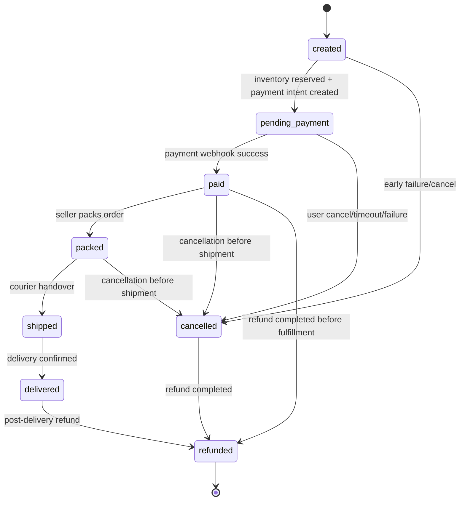
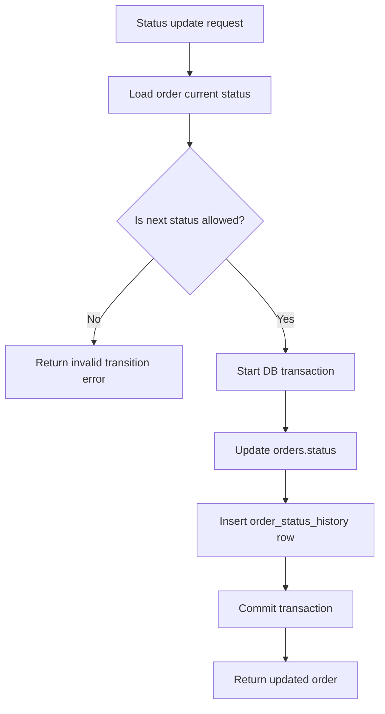
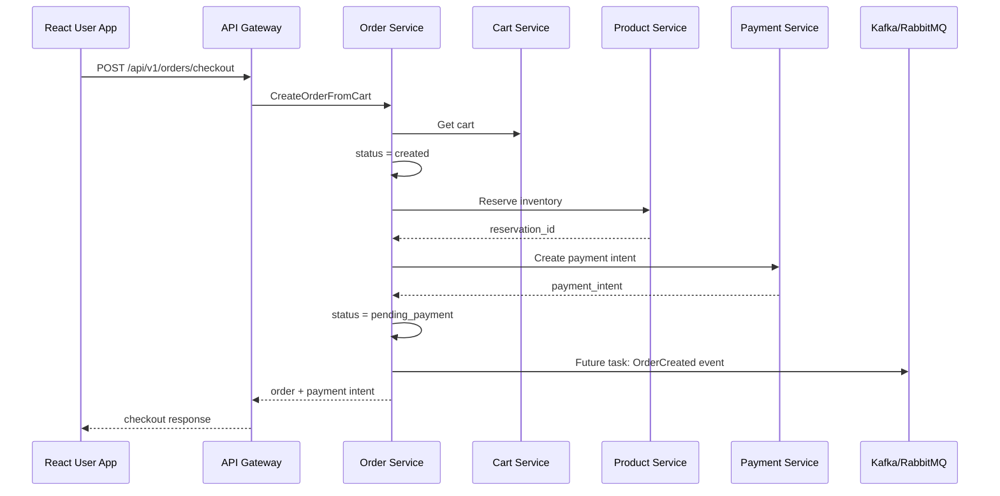
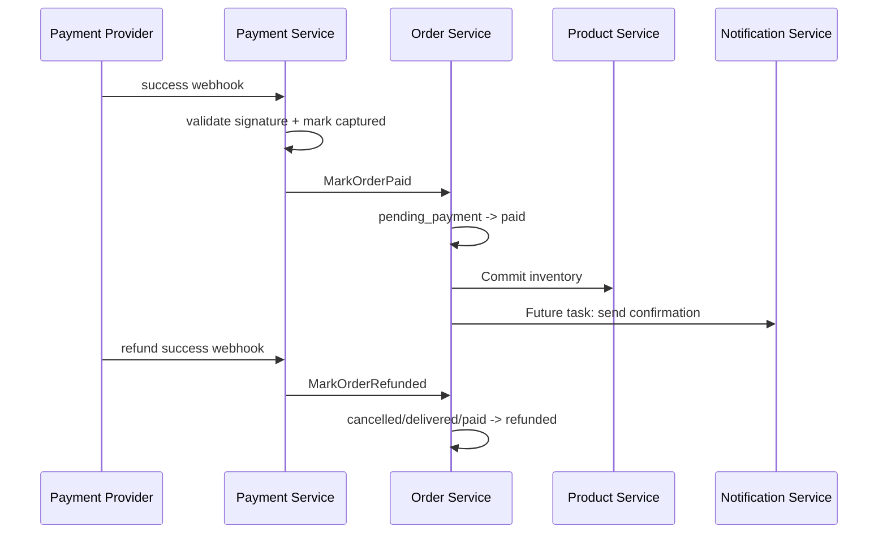
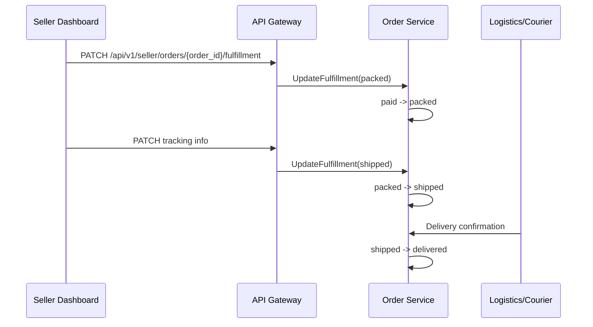
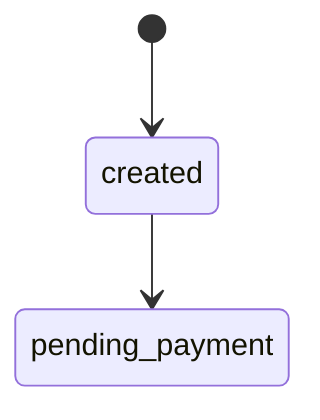

# 📦 Order Service - Task 1: Define Order Lifecycle


## 📌 Task Summary

| Field | Detail |
|---|---|
| Task Name | Define order lifecycle |
| Source | `docs/01-micro-tasks.md` → `Order Service` → Task 1 |
| Priority | `P0` foundation/blocker |
| Dependency | Platform foundation |
| Main Goal | Order ke states aur valid transitions define karna |
| Output Type | Documentation-only implementation guide |
| Not Included | MySQL schema, gRPC implementation, payment integration, checkout flow, events, idempotency storage |

> **Simple Hinglish goal:** Is task ka purpose ye decide karna hai ki order apni life me kaun-kaun se statuses se guzrega, kaunsa status kab set hoga, aur kaunsi status movement allowed ya blocked hogi. Ye future Order Service implementation ke liye base contract hai.

---

## ✅ Final Output Created

```text
TaskImplementation/
└── Order Service/
    └── task1.md
```

### Why this structure?

- `TaskImplementation/` project ke task-wise implementation guides ka central folder hai.
- `Order Service/` folder Order Service related tasks ko group karega.
- `task1.md` sirf **Order Service - Task 1** ka guide hai.

> 🟢 **Important:** Is task me backend source code, DB migration, proto file, ya runtime service create nahi kiya gaya. Ye lifecycle definition guide hai jo future implementation ko direction dega.

---

## 🧭 Implementation Approach

Is guide ko banate time project ke existing docs ko base banaya gaya:

| Document | Kya use kiya gaya |
|---|---|
| `docs/01-micro-tasks.md` | Exact task name, status list, dependency, priority |
| `docs/02-system-architecture.md` | Checkout request flow aur Order/Payment/Product interaction |
| `docs/03-folder-structure.md` | Future `backend/services/order-service/` layout |
| `docs/04-microservice-design.md` | Order Service responsibilities, APIs, internal logic |
| `docs/05-database-design.md` | Order tables, status history, idempotency index idea |
| `docs/07-payment-system.md` | Payment success/failure/refund lifecycle alignment |

---

## 🧱 Task Boundary

### ✅ Included in Task 1

- Order statuses define karna
- Har status ka meaning explain karna
- Allowed status transitions define karna
- Invalid transitions block karne ka rule define karna
- Status history/audit ka conceptual model define karna
- Checkout, payment, fulfillment, cancellation, refund ke saath lifecycle relation explain karna
- Beginner-friendly code examples dena
- Mermaid diagrams banana

### 🚫 Not Included in Task 1

- Actual `orders` table migration create karna
- `order_items` schema implement karna
- `order_status_history` table create karna
- `CreateOrderFromCart` gRPC method implement karna
- Payment Service integration implement karna
- Product inventory reservation implement karna
- Idempotency key storage implement karna
- Kafka/RabbitMQ events publish karna

> 🔴 **Reason:** Ye sab later Order Service tasks me covered hain. Task 1 sirf lifecycle ko clearly define karta hai.

---

## 🪜 Step-by-Step Implementation

## Step 1: Requirement ko identify kiya

`docs/01-micro-tasks.md` ke Order Service section me Task 1 ye define karta hai:

> Created, pending payment, paid, packed, shipped, delivered, cancelled, refunded states define karo.

Iska matlab Order Service ko ek **state machine** chahiye. State machine ka kaam hai:

- Current order status store karna
- Next allowed status validate karna
- Wrong status movement block karna
- Audit ke liye status history maintain karna

Example:

- `created` se `pending_payment` allowed hai.
- `pending_payment` se `paid` allowed hai.
- `delivered` se `packed` allowed nahi hai.

---

## Step 2: Status naming convention decide kiya

Backend code, database, proto, aur API response me consistent naming chahiye. Isliye statuses ko lowercase `snake_case` string ke form me define kiya gaya.

| Display Name | Internal Value | Reason |
|---|---|---|
| Created | `created` | Order shell create ho gaya |
| Pending Payment | `pending_payment` | Payment intent create ho gaya, payment wait ho rahi hai |
| Paid | `paid` | Provider webhook se payment confirm ho gayi |
| Packed | `packed` | Seller/warehouse ne item pack kar diya |
| Shipped | `shipped` | Courier ko handover ho gaya |
| Delivered | `delivered` | Customer ko order deliver ho gaya |
| Cancelled | `cancelled` | Order cancel ho gaya |
| Refunded | `refunded` | Payment refund complete ho gaya |

> 🟢 **Rule:** Database me bhi same string values store karni chahiye, taaki debugging aur reporting simple rahe.

---

## Step 3: Canonical lifecycle statuses define kiye

## 1. `created`


### Meaning

Order ka initial record create ho gaya hai. Ye status short-lived hota hai. Usually checkout request receive hone ke baad order shell create hota hai, phir inventory/payment steps ke basis pe aage move hota hai.

### Kab set hoga?

- Cart validate hone ke baad order shell create karte time
- Price snapshot capture karte time
- Order ID generate hone ke baad

### Important rules

- Price snapshot yahin freeze hona start hota hai.
- Order items ka data Product Service se snapshot form me aayega.
- Order abhi payable nahi maana jayega jab tak `pending_payment` me na jaye.

---

## 2. `pending_payment`


### Meaning

Order create ho chuka hai aur payment ka wait kar raha hai. Payment intent create ho sakta hai, but payment final nahi hai.

### Kab set hoga?

- Inventory reserve successfully ho gayi
- Payment Service ne payment intent create kar diya
- Frontend ko payment UI open karna hai

### Important rules

- Is state me order duplicate create nahi hona chahiye.
- Payment final status frontend callback se decide nahi hoga.
- Payment ka source of truth provider webhook hoga.
- Pending payment timeout future task me define hoga.

---

## 3. `paid`


### Meaning

Payment provider webhook se payment capture/confirm ho gayi. Order financially confirmed hai.

### Kab set hoga?

- Payment Service provider webhook validate kare
- Payment status `captured` ya equivalent final success ho
- Order Service ko trusted internal update mile

### Important rules

- Frontend success page se direct `paid` set nahi karna.
- Paid hone ke baad inventory commit ho sakti hai.
- Seller fulfillment ab start ho sakta hai.

---

## 4. `packed`


### Meaning

Seller ya warehouse ne order items pack kar diye hain. Order shipment ke liye ready hai.

### Kab set hoga?

- Seller dashboard se fulfillment update aaye
- Warehouse system packing complete mark kare

### Important rules

- Sirf `paid` order pack ho sakta hai.
- Unpaid order pack nahi hona chahiye.
- Packed order cancel karna business policy ke basis pe allowed ho sakta hai, but refund process required hoga agar payment ho chuki hai.

---

## 5. `shipped`


### Meaning

Order courier/logistics partner ko handover ho gaya. Shipment tracking active ho sakti hai.

### Kab set hoga?

- Seller fulfillment update me courier/tracking info add ho
- Logistics integration pickup confirm kare

### Important rules

- Sirf `packed` order ship ho sakta hai.
- Shipped ke baad normal cancellation block rahegi.
- Return/refund flow future tasks me handle hoga.

---

## 6. `delivered`


### Meaning

Customer ko order successfully deliver ho gaya.

### Kab set hoga?

- Logistics partner delivered status bheje
- Seller/operations admin delivery confirm kare

### Important rules

- Sirf `shipped` order delivered ho sakta hai.
- Delivered ke baad order fulfillment complete maana jayega.
- Delivered order ke baad refund possible ho sakta hai, but wo return/refund policy ke under hoga.

---

## 7. `cancelled`


### Meaning

Order cancel ho gaya. Fulfillment stop ho jayega.

### Kab set hoga?

- User payment se pehle cancel kare
- Seller/operations admin valid reason se cancel kare
- Inventory/payment setup fail ho aur order continue nahi kar sakta

### Important rules

- `pending_payment` order cancel karne pe inventory reservation release hogi.
- `paid` ya `packed` order cancel karne pe refund trigger karna padega.
- `shipped` order cancel nahi hoga; return/refund flow future scope me handle hoga.

---

## 8. `refunded`


### Meaning

Customer ko payment refund complete ho gaya. Ye financial final state hai.

### Kab set hoga?

- Payment Service refund success confirm kare
- Refund provider webhook/confirmation trusted source se aaye

### Important rules

- Refund tabhi possible hai jab payment already successful thi.
- `refunded` state ke baad fulfillment state me wapas nahi ja sakte.
- Partial refund future Payment Service task ka part ho sakta hai; Task 1 me sirf full `refunded` status define kiya gaya hai.

---

## Step 4: Allowed transitions define kiye

Order status random jump nahi kar sakta. Har transition validate hoga.

## Transition Table

| Current Status | Allowed Next Status | Business Meaning |
|---|---|---|
| `created` | `pending_payment` | Order ready hai aur payment wait start hoti hai |
| `created` | `cancelled` | Early failure/cancel before payment |
| `pending_payment` | `paid` | Payment webhook success |
| `pending_payment` | `cancelled` | User cancel, timeout, ya payment setup failure |
| `paid` | `packed` | Seller fulfillment start |
| `paid` | `cancelled` | Payment ke baad cancel, refund required |
| `paid` | `refunded` | Direct refund completed before fulfillment |
| `packed` | `shipped` | Courier handover |
| `packed` | `cancelled` | Packing ke baad cancellation, refund required |
| `shipped` | `delivered` | Delivery confirmed |
| `delivered` | `refunded` | Post-delivery refund completed |
| `cancelled` | `refunded` | Cancelled paid order ka refund complete |
| `refunded` | none | Final financial state |

## Blocked transition examples

| Invalid Transition | Why blocked? |
|---|---|
| `created` → `paid` | Payment intent/webhook step skip ho jayega |
| `pending_payment` → `packed` | Unpaid order fulfill nahi karna |
| `paid` → `delivered` | Packing/shipping audit missing ho jayega |
| `shipped` → `cancelled` | Shipped order return/refund policy me jayega |
| `delivered` → `pending_payment` | Completed order payment wait me wapas nahi ja sakta |
| `refunded` → `paid` | Refund final hone ke baad reverse transition unsafe hai |

---

## Step 5: Lifecycle state diagram banaya



### Diagram explanation

- Order `created` se start hota hai.
- Payment wait phase `pending_payment` hai.
- Payment webhook success ke baad `paid` set hota hai.
- Fulfillment path: `paid` → `packed` → `shipped` → `delivered`.
- Cancellation path shipment se pehle allowed hai.
- Refund financial closure ke liye `refunded` status use hota hai.

---

## Step 6: Status owner define kiya

Har status ko kaun set karega ye clear hona chahiye. Isse future implementation me authorization aur service boundary clean rahegi.

| Status | Primary Owner | Trigger Source |
|---|---|---|
| `created` | Order Service | Checkout request |
| `pending_payment` | Order Service | Payment intent created |
| `paid` | Order Service via Payment Service | Payment webhook success |
| `packed` | Seller/Order Service | Seller fulfillment update |
| `shipped` | Seller/Order Service | Courier tracking update |
| `delivered` | Order Service | Logistics/seller/admin delivery confirmation |
| `cancelled` | Order Service | Buyer/seller/admin/system cancellation |
| `refunded` | Order Service via Payment Service | Refund success confirmation |

> 🟡 **Security note:** Buyer direct `paid`, `packed`, `shipped`, `delivered`, ya `refunded` set nahi kar sakta. Buyer sirf allowed cancellation request kar sakta hai.

---

## Step 7: Status history model define kiya

Current status `orders.status` me store hoga, but har transition ka audit `order_status_history` me append-only record ke form me jaana chahiye.

### Required history fields

| Field | Purpose |
|---|---|
| `id` | History record ka unique ID |
| `order_id` | Kis order ka status change hua |
| `from_status` | Previous status |
| `to_status` | New status |
| `reason` | Status change ka reason |
| `actor_type` | `system`, `buyer`, `seller`, `admin`, `payment_service`, `logistics` |
| `actor_id` | User/service/admin ID, nullable for system |
| `metadata` | Extra JSON details jaise tracking ID, payment ID |
| `created_at` | Transition timestamp |

### Why history important hai?

- Customer support ko order timeline dikh sakti hai.
- Admin dispute investigate kar sakta hai.
- Payment/refund audit maintain hota hai.
- Invalid status changes trace kiye ja sakte hain.
- Seller dashboard me fulfillment timeline clear hoti hai.

---

## Step 8: Transition validation rule define kiya

Order Service me har status update se pehle validation mandatory hoga:



### Rule

> 🟢 **Only allowed transitions table ke according hi status update hoga.**

Isse accidental bugs avoid honge, jaise:

- Unpaid order ship kar dena
- Delivered order ko pending payment me wapas bhejna
- Refunded order ko paid mark kar dena

---

## Step 9: Checkout flow ke saath lifecycle align kiya

`docs/02-system-architecture.md` ke checkout flow ke according Order Service Cart, Product, Payment aur MQ ke saath interact karega. Task 1 me implementation nahi hai, but lifecycle ko us flow ke saath align kiya gaya.



### Explanation

- Order initially `created` hota hai.
- Inventory reserve aur payment intent ke baad `pending_payment` hota hai.
- `OrderCreated` event future Task 8 me publish hoga, Task 1 me implement nahi.
- Payment success ke liye frontend callback trust nahi karna; webhook-based update hoga.

---

## Step 10: Payment success/refund ke saath lifecycle align kiya



### Explanation

- Payment final status provider webhook se decide hota hai.
- Payment captured hone ke baad Order Service `paid` set karega.
- Refund complete hone ke baad Order Service `refunded` set karega.
- Actual Payment Service implementation later task me hoga.

---

## Step 11: Fulfillment flow ke saath lifecycle align kiya



### Explanation

- Fulfillment sirf paid order pe start hoga.
- Seller direct `delivered` mark nahi karega unless future policy allow kare.
- Tracking/shipment data Task 2+ schema and Task 5+ APIs me implement hoga.

---

## 🧩 Code Examples

> ⚠️ **Note:** Ye snippets reference examples hain. Is task me actual Go files create nahi kiye gaye.

## Example 1: Go status enum

```go
package domain

type OrderStatus string

const (
	OrderStatusCreated        OrderStatus = "created"
	OrderStatusPendingPayment OrderStatus = "pending_payment"
	OrderStatusPaid           OrderStatus = "paid"
	OrderStatusPacked         OrderStatus = "packed"
	OrderStatusShipped        OrderStatus = "shipped"
	OrderStatusDelivered      OrderStatus = "delivered"
	OrderStatusCancelled      OrderStatus = "cancelled"
	OrderStatusRefunded       OrderStatus = "refunded"
)
```

### Explanation

- `OrderStatus` custom type banaya gaya, taaki random string usage kam ho.
- Constants centralized rahenge.
- Same values DB/API/proto mapping me use hongi.

---

## Example 2: Allowed transition map

```go
package domain

var allowedOrderTransitions = map[OrderStatus]map[OrderStatus]bool{
	OrderStatusCreated: {
		OrderStatusPendingPayment: true,
		OrderStatusCancelled:      true,
	},
	OrderStatusPendingPayment: {
		OrderStatusPaid:      true,
		OrderStatusCancelled: true,
	},
	OrderStatusPaid: {
		OrderStatusPacked:    true,
		OrderStatusCancelled: true,
		OrderStatusRefunded:  true,
	},
	OrderStatusPacked: {
		OrderStatusShipped:   true,
		OrderStatusCancelled: true,
	},
	OrderStatusShipped: {
		OrderStatusDelivered: true,
	},
	OrderStatusDelivered: {
		OrderStatusRefunded: true,
	},
	OrderStatusCancelled: {
		OrderStatusRefunded: true,
	},
	OrderStatusRefunded: {},
}

func CanTransitionOrderStatus(from OrderStatus, to OrderStatus) bool {
	nextStatuses, ok := allowedOrderTransitions[from]
	if !ok {
		return false
	}

	return nextStatuses[to]
}
```

### Explanation

- Map me status machine encode hai.
- Unknown current status automatically invalid maana jayega.
- `refunded` ke baad koi next status allowed nahi hai.

---

## Example 3: Transition validation function

```go
package domain

import "fmt"

func ValidateOrderStatusTransition(from OrderStatus, to OrderStatus) error {
	if from == to {
		return fmt.Errorf("order status is already %s", to)
	}

	if !CanTransitionOrderStatus(from, to) {
		return fmt.Errorf("invalid order status transition: %s to %s", from, to)
	}

	return nil
}
```

### Explanation

- Same status repeat update block hota hai.
- Invalid transition clean error return karta hai.
- Usecase layer DB update se pehle ye validation call karegi.

---

## Example 4: Future SQL shape for status history

```sql
-- Reference only. Actual migration Order Service Task 2 me create hogi.
CREATE TABLE order_status_history (
    id BIGINT PRIMARY KEY AUTO_INCREMENT,
    order_id BIGINT NOT NULL,
    from_status VARCHAR(40) NULL,
    to_status VARCHAR(40) NOT NULL,
    reason VARCHAR(255) NULL,
    actor_type VARCHAR(40) NOT NULL,
    actor_id VARCHAR(80) NULL,
    metadata JSON NULL,
    created_at TIMESTAMP NOT NULL DEFAULT CURRENT_TIMESTAMP
);
```

### Explanation

- `from_status` first entry ke liye nullable ho sakta hai.
- `to_status` mandatory hai.
- `metadata` JSON field extra context store karega.
- Actual table, indexes, foreign keys Task 2 me implement honge.

---

## Example 5: Future proto enum style

```proto
// Reference only. Actual proto implementation future proto/service task me hoga.
enum OrderStatus {
  ORDER_STATUS_UNSPECIFIED = 0;
  ORDER_STATUS_CREATED = 1;
  ORDER_STATUS_PENDING_PAYMENT = 2;
  ORDER_STATUS_PAID = 3;
  ORDER_STATUS_PACKED = 4;
  ORDER_STATUS_SHIPPED = 5;
  ORDER_STATUS_DELIVERED = 6;
  ORDER_STATUS_CANCELLED = 7;
  ORDER_STATUS_REFUNDED = 8;
}
```

### Explanation

- Proto enum me `UNSPECIFIED = 0` safe default hota hai.
- API layer enum ko string response me map kar sakti hai.
- Actual proto contract Platform Foundation proto strategy ke rules follow karega.

---

## 📁 Clean Folder Structure

## Created in this task

```text
TaskImplementation/
└── Order Service/
    └── task1.md
```

## Future implementation target structure

`docs/03-folder-structure.md` ke according future Order Service ka code roughly aise organize hoga:

```text
backend/
└── services/
    └── order-service/
        ├── cmd/
        │   └── server/
        │       └── main.go
        ├── internal/
        │   ├── domain/
        │   │   ├── order.go
        │   │   ├── order_item.go
        │   │   └── fulfillment.go
        │   ├── usecase/
        │   │   ├── create_order_from_cart.go
        │   │   ├── cancel_order.go
        │   │   └── update_fulfillment.go
        │   ├── repository/
        │   │   ├── mysql_order_repository.go
        │   │   └── mysql_idempotency_repository.go
        │   ├── transport/
        │   │   └── grpc/
        │   └── events/
        ├── migrations/
        └── deploy/
```

### Lifecycle code future me kaha jayega?

| Concern | Future File |
|---|---|
| Status constants | `internal/domain/order.go` |
| Transition validation | `internal/domain/order.go` or `internal/domain/order_status.go` |
| Status update usecase | `internal/usecase/update_fulfillment.go`, `cancel_order.go`, payment handlers |
| History persistence | `internal/repository/mysql_order_repository.go` |
| Schema | `migrations/` |

> 🟡 **Note:** Upar wala future structure create nahi kiya gaya, kyunki Task 1 documentation-only lifecycle definition hai.

---

## 🔗 Integration Rules

## Order and Cart

| Rule | Explanation |
|---|---|
| Cart snapshot required | Order create time cart items ka snapshot lena hoga |
| Price immutable | Order item price later product price change se affect nahi hoga |
| Cart clear future task | Successful checkout ke baad cart cleanup later flow me hoga |

## Order and Product Inventory

| Rule | Explanation |
|---|---|
| Reserve before `pending_payment` | Payment lene se pehle stock reserve hona chahiye |
| Commit after `paid` | Payment success ke baad inventory decrement/commit hoga |
| Release on cancel | Payment se pehle cancel ho to reservation release hogi |

## Order and Payment

| Rule | Explanation |
|---|---|
| Webhook is source of truth | Frontend callback se `paid` set nahi karna |
| Refund confirmation required | `refunded` tabhi set hoga jab Payment Service confirm kare |
| Payment retry later | Retry logic Payment Coordination task me implement hoga |

## Order and Fulfillment

| Rule | Explanation |
|---|---|
| Only paid orders can be packed | Seller unpaid order fulfill nahi karega |
| Packed before shipped | Shipment audit ke liye packing step mandatory hai |
| Shipped before delivered | Delivery directly paid se nahi hogi |

---

## 🧪 Test Scenarios for Future Implementation

> Task 1 me tests run nahi hue, because no source code was added. Ye future implementation ke acceptance test cases hain.

| Test Case | Expected Result |
|---|---|
| `created` → `pending_payment` | Allowed |
| `pending_payment` → `paid` | Allowed |
| `paid` → `packed` | Allowed |
| `packed` → `shipped` | Allowed |
| `shipped` → `delivered` | Allowed |
| `paid` → `delivered` | Blocked |
| `pending_payment` → `packed` | Blocked |
| `refunded` → `paid` | Blocked |
| Unknown status → `paid` | Blocked |
| Same status update | Blocked or treated as idempotent based on future usecase policy |

---

## 🧰 External Libraries / Tools Used

## 1. Markdown


### What is it?

Markdown ek lightweight documentation format hai jisme headings, tables, code blocks, badges, aur diagrams readable format me likhe ja sakte hain.

### Why used?

- Beginner-friendly docs ke liye best
- GitHub/GitLab me directly render hota hai
- Code examples aur tables clean dikhte hain

### Install kaise kare?

Markdown ke liye separate install required nahi hota. `.md` file normal text file hoti hai.

### Use kaise kare?

- GitHub/GitLab me file open karo
- VS Code me Markdown preview use karo:

```text
Ctrl + Shift + V
```

---

## 2. Mermaid


### What is it?

Mermaid markdown-friendly diagram syntax hai. Isse flowchart, sequence diagram, aur state diagram text se ban sakte hain.

### Why used?

- Architecture aur lifecycle diagrams code-like format me maintainable rehte hain
- Image files create karne ki need nahi hoti
- GitHub Mermaid diagrams render kar sakta hai

### Install kaise kare?

GitHub par install required nahi hai. Local VS Code preview ke liye optional extension use kar sakte ho:

```text
Markdown Preview Mermaid Support
```

### Use kaise kare?

Markdown me fenced code block use karo:

````markdown

````

---

## 3. Shields.io Badges


### What is it?

Shields.io badge images generate karta hai jo docs me status, priority, dependency, scope jaise metadata visually show karte hain.

### Why used?

- Task status visually clear hota hai
- Docs readable aur professional lagte hain
- Metadata top of file pe instantly visible hota hai

### Install kaise kare?

Install required nahi hai. Badge image URL directly Markdown me use hota hai.

### Use kaise kare?

```markdown

```

---

## Runtime dependencies

| Dependency Type | Used? | Notes |
|---|---:|---|
| Go package | No | No backend code added |
| NPM package | No | No frontend code added |
| Database migration tool | No | Schema task later |
| Kafka/RabbitMQ client | No | Events task later |
| Payment SDK | No | Payment task later |

---

## ⚠️ Important Design Notes

## Payment failed status

`docs/07-payment-system.md` me failure flow ke context me `payment_failed` mention hai. Task 1 ka required status list specifically ye statuses define karta hai:

```text
created, pending_payment, paid, packed, shipped, delivered, cancelled, refunded
```

Is guide me `payment_failed` ko canonical Task 1 status nahi banaya gaya. Payment failure ko future **Order Service - Task 4: Payment coordination** me finalize kiya jayega. Possible future options:

- `pending_payment` me retry allow karna
- `cancelled` mark karke inventory release karna
- Dedicated `payment_failed` status add karna

> 🟡 **Current Task 1 decision:** Core lifecycle sirf requested eight statuses tak limited rahega.

---

## Cancellation and refund difference

| Status | Meaning |
|---|---|
| `cancelled` | Fulfillment/order processing stop ho gaya |
| `refunded` | Customer ka paisa successfully refund ho gaya |

### Example

- User unpaid order cancel karta hai: `pending_payment` → `cancelled`
- User paid order cancel karta hai: `paid` → `cancelled` → `refunded`

Isliye `cancelled` aur `refunded` same cheez nahi hain.

---

## Status vs payment status

Order status aur payment status alag concepts hain:

| Type | Example Values | Owner |
|---|---|---|
| Order status | `created`, `paid`, `shipped`, `delivered` | Order Service |
| Payment status | `initiated`, `captured`, `failed`, `refunded` | Payment Service |

Order Service payment result consume karke apna order status update karega.

---

## ✅ Acceptance Criteria

| Requirement | Status |
|---|---|
| `TaskImplementation/` folder exists | ✅ Done |
| `TaskImplementation/Order Service/` folder created | ✅ Done |
| `task1.md` created inside Order Service folder | ✅ Done |
| Step-by-step implementation in Hinglish | ✅ Done |
| Lifecycle statuses defined | ✅ Done |
| Allowed transitions documented | ✅ Done |
| Mermaid diagrams included | ✅ Done |
| External tools/libraries explained | ✅ Done |
| Folder structure included | ✅ Done |
| Code examples included | ✅ Done |
| Nothing beyond Task 1 implemented | ✅ Done |

---

## 🚫 Out of Scope for Task 1

These items must be implemented only in later tasks:

| Future Task | Work |
|---|---|
| Order Service Task 2 | MySQL schema for orders, items, history, shipments, idempotency |
| Order Service Task 3 | Cart to order flow |
| Order Service Task 4 | Payment coordination |
| Order Service Task 5 | gRPC service implementation |
| Order Service Task 6 | Seller order view |
| Order Service Task 7 | Idempotency enforcement |
| Order Service Task 8 | Order events publishing |

> 🔴 **Do not create service code, DB tables, events, or APIs in Task 1.**

---

## 🏁 Final Task 1 Standard

Order Service ka lifecycle standard ye hai:

```text
created
  -> pending_payment
  -> paid
  -> packed
  -> shipped
  -> delivered
```

Cancellation/refund alternate paths:

```text
created -> cancelled
pending_payment -> cancelled
paid -> cancelled -> refunded
packed -> cancelled -> refunded
paid -> refunded
delivered -> refunded
```

### Final rule

> ✅ Har order status update **allowed transition table** se validate hoga, aur har successful transition ka append-only history record maintain hoga.

Task 1 complete hai as a lifecycle definition guide. Ab future tasks me schema, checkout, payment coordination, gRPC APIs, seller views, idempotency, aur events isi lifecycle standard ko follow karenge.
