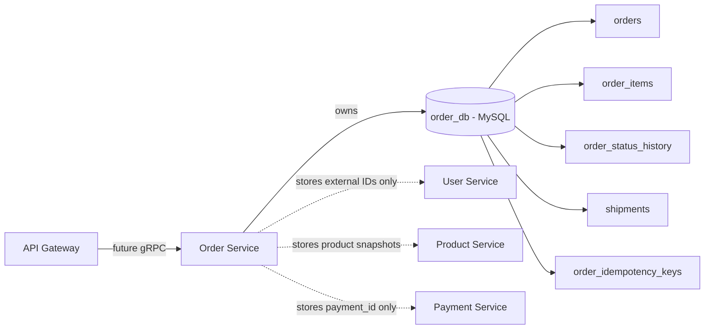
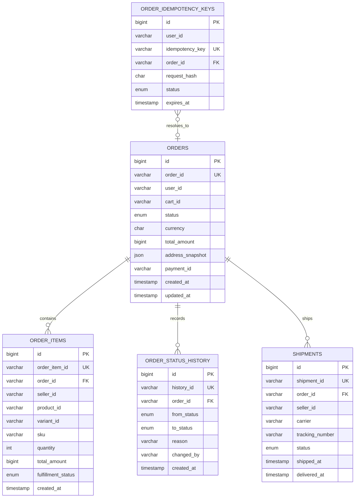
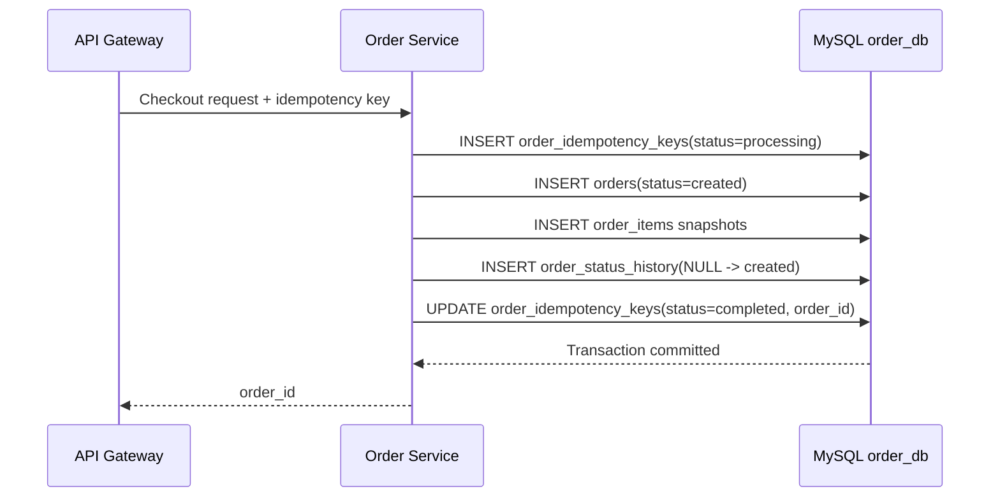
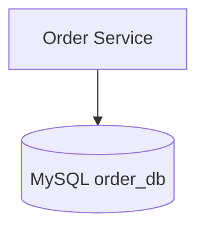

# 🧾 Order Service - Task 2: Create MySQL Schema


## 📌 Task Summary

| Field | Detail |
|---|---|
| Task Name | Create MySQL schema |
| Source | `docs/01-micro-tasks.md` → `Order Service` → Task 2 |
| Priority | `P0` foundation/blocker |
| Dependency | Order Service Task 1: Define order lifecycle |
| Main Goal | Order ke transactional data ke liye MySQL relational schema design karna |
| Output Type | Documentation-only implementation guide with migration-ready SQL examples |
| Main Tables | `orders`, `order_items`, `order_status_history`, `shipments`, `order_idempotency_keys` |
| Not Included | Cart-to-order business flow, payment integration, gRPC handlers, repository code, event publishing |

> **Simple Hinglish goal:** Is task ka kaam Order Service ke liye database foundation banana hai. Orders financial aur fulfillment workflow se linked hote hain, isliye hume relational, transactional, auditable MySQL schema chahiye jisme order, order items, status history, shipment, aur idempotency data clearly store ho.

---

## ✅ Final Output Created

```text
TaskImplementation/
└── Order Service/
    ├── task1.md
    └── task2.md
```

### Why this structure?

- `TaskImplementation/` project ke task-wise implementation guides ka central folder hai.
- `Order Service/` folder Order Service related tasks ko group karta hai.
- `task2.md` sirf **Order Service - Task 2** ka guide hai.
- Existing `task1.md` ko preserve kiya gaya.

> 🟢 **Important:** Is task me backend source code ya actual migration file create nahi ki gayi. User-requested output sirf `TaskImplementation/Order Service/task2.md` hai, isliye SQL implementation ko migration-ready examples ke form me document kiya gaya.

---

## 🧭 Requirement Sources Studied

| Document | Kya use kiya gaya |
|---|---|
| `docs/01-micro-tasks.md` | Task 2 ka exact scope: Order Service MySQL schema |
| `docs/02-system-architecture.md` | Checkout flow, service ownership, idempotency need |
| `docs/03-folder-structure.md` | Future `backend/services/order-service/migrations/` location |
| `docs/04-microservice-design.md` | Order Service responsibilities and table list |
| `docs/05-database-design.md` | Order DB tables, indexes, consistency strategy |
| `database/draw.sql` | Existing reference DDL for Order DB |
| `TaskImplementation/Order Service/task1.md` | Canonical order lifecycle statuses |

---

## 🧱 Task Boundary

### ✅ Included in Task 2

- Order Service ke liye MySQL database ownership define karna
- `order_db` database design karna
- `orders` table design karna
- `order_items` table design karna
- `order_status_history` audit table design karna
- `shipments` fulfillment/shipping table design karna
- `order_idempotency_keys` table design karna
- Primary keys, unique keys, foreign keys, indexes define karna
- Amount storage, snapshot fields, status enums explain karna
- Up/down migration SQL examples dena
- Mermaid ER and flow diagrams add karna
- Verification checklist dena

### 🚫 Not Included in Task 2

- `CreateOrderFromCart` implementation
- Cart Service se cart fetch karna
- Product Service inventory reserve karna
- Payment Service payment intent create karna
- gRPC service handlers banana
- Repository/usecase Go code likhna
- Seller order API implement karna
- Kafka/RabbitMQ order events publish karna
- Outbox table create karna

> 🔴 **Reason:** Ye sab future Order Service tasks me covered hain. Task 2 ka focus sirf durable relational schema hai.

---

## 🧩 High-Level Architecture



### Key idea

Order Service apni database ka owner hai. Dusri services ke tables par direct foreign key nahi hogi. Example:

- `orders.user_id` User Service ka ID hai, but User DB se FK nahi.
- `order_items.product_id` Product Service ka ID hai, but Product DB se FK nahi.
- `orders.payment_id` Payment Service ka ID hai, but Payment DB se FK nahi.

> 🟢 **Rule:** Cross-service data access gRPC/events se hoga, database join se nahi.

---

## 🗂️ Clean Folder Structure

### Created for this task

```text
TaskImplementation/
└── Order Service/
    ├── task1.md
    └── task2.md
```

### Future backend schema location

Jab actual Order Service backend implementation start hogi, migration files yaha jaayengi:

```text
backend/
└── services/
    └── order-service/
        ├── cmd/
        │   └── server/
        │       └── main.go
        ├── internal/
        │   ├── domain/
        │   │   ├── order.go
        │   │   ├── order_item.go
        │   │   └── fulfillment.go
        │   ├── usecase/
        │   ├── repository/
        │   │   ├── mysql_order_repository.go
        │   │   └── mysql_idempotency_repository.go
        │   └── transport/
        │       └── grpc/
        └── migrations/
            ├── 001_create_order_tables.up.sql
            └── 001_create_order_tables.down.sql
```

> 🟡 **Note:** Upar wala backend structure reference hai. Is Task 2 me sirf documentation file create hui hai.

---

## 🪜 Step-by-Step Implementation

## Step 1: Requirement identify kiya

`docs/01-micro-tasks.md` ke Order Service section me Task 2 ye bolta hai:

> Create MySQL schema. Orders transactional hote hain, isliye MySQL with relational tables best hai.

Iska direct output hai:

- `orders`
- `order_items`
- `order_status_history`
- `shipments`
- `order_idempotency_keys`

Ye tables checkout, payment, fulfillment, cancellation, seller order view, aur idempotency ke future workflows ko support karenge.

---

## Step 2: MySQL choose kiya

Order data ke liye MySQL suitable hai because:

| Reason | Explanation |
|---|---|
| Transactions | Order create karte time order + items + history same transaction me insert honge |
| Relational data | One order has many items, history rows, shipments |
| Auditability | Status history append-only table me store ho sakti hai |
| Query patterns | User orders, seller orders, status-based admin views fast indexes se nikal sakte hain |
| Financial workflow | Payment/refund ke saath consistency important hai |

> 🟢 **Decision:** Order Service ka source of truth MySQL `order_db` hoga.

---

## Step 3: Data ownership boundary define kiya

Microservice architecture me har service apni database own karti hai.

| Field | Owned By | Order DB me kaise store hoga |
|---|---|---|
| `user_id` | User Service | Plain string reference |
| `cart_id` | Cart Service | Plain string reference |
| `product_id` | Product Service | Plain string reference |
| `variant_id` | Product Service | Plain string reference |
| `seller_id` | User/CMS/Product boundary | Plain string reference |
| `payment_id` | Payment Service | Plain string reference |

### Why no cross-service foreign keys?

Agar Order DB directly User DB/Product DB/Payment DB ko FK karega, to services tightly coupled ho jayengi. Isliye Order Service sirf external IDs store karega aur required details snapshots me save karega.

Example:

- Product ka title future me change ho sakta hai.
- Order item me old purchased title visible rehna chahiye.
- Isliye `title_snapshot`, `image_url_snapshot`, `unit_amount` freeze kiye jaate hain.

---

## Step 4: Lifecycle statuses ko schema me map kiya

Task 1 me canonical statuses define hue:

| Status | DB Value |
|---|---|
| Created | `created` |
| Pending Payment | `pending_payment` |
| Paid | `paid` |
| Packed | `packed` |
| Shipped | `shipped` |
| Delivered | `delivered` |
| Cancelled | `cancelled` |
| Refunded | `refunded` |

> 🟡 **Note:** `database/draw.sql` reference me `payment_failed` bhi dikhta hai, but Task 1 me ise canonical status nahi maana gaya. Payment failure handling Order Service Task 4 me finalize hogi, isliye Task 2 schema Task 1 ke canonical statuses par aligned hai.

---

## Step 5: ER model design kiya



---

## Step 6: `orders` table banaya

`orders` table order ka main header record store karega.

### Important columns

| Column | Purpose |
|---|---|
| `id` | Internal auto-increment DB primary key |
| `order_id` | Public stable order identifier, APIs/events me use hoga |
| `user_id` | Buyer/user reference |
| `cart_id` | Source cart reference |
| `status` | Task 1 lifecycle status |
| `currency` | ISO currency code like `INR`, `USD` |
| `subtotal_amount` | Items ka subtotal in minor units |
| `discount_amount` | Coupon/offer discount in minor units |
| `shipping_amount` | Shipping fee in minor units |
| `tax_amount` | Tax amount in minor units |
| `total_amount` | Final payable amount in minor units |
| `address_snapshot` | Delivery address JSON snapshot |
| `coupon_code` | Applied coupon code, nullable |
| `payment_id` | Payment Service reference, nullable |
| `created_at`, `updated_at` | Audit timestamps |

### Why amount as `BIGINT`?

Money ko floating point me store nahi karna chahiye. `999.99` jaise decimal values rounding bugs de sakte hain. Isliye amount minor unit me store hoga:

| Display Amount | Stored Value |
|---|---:|
| INR 999.00 | `99900` paise |
| USD 15.49 | `1549` cents |

---

## Step 7: `order_items` table banaya

One order me multiple items ho sakte hain. Multi-seller marketplace me ek order ke andar different sellers ke items bhi ho sakte hain.

### Important columns

| Column | Purpose |
|---|---|
| `order_item_id` | Public stable order item ID |
| `order_id` | Parent order reference |
| `seller_id` | Seller order view ke liye important |
| `product_id`, `variant_id` | Product/variant references |
| `sku` | Purchased SKU snapshot |
| `title_snapshot` | Product title at purchase time |
| `image_url_snapshot` | Product image at purchase time |
| `quantity` | Purchased quantity |
| `unit_amount` | Unit price snapshot |
| `discount_amount`, `tax_amount`, `total_amount` | Item-level financial values |
| `fulfillment_status` | Seller/fulfillment status per item |

### Why snapshot fields?

Product details future me update ho sakti hain. But customer ka invoice/order detail same rehna chahiye jo purchase time par tha.

Example:

- Product title checkout ke baad change ho gaya.
- Old order detail me old title dikhna chahiye.
- Isliye `title_snapshot` immutable rahega.

---

## Step 8: `order_status_history` table banaya

Order ka current status `orders.status` me hota hai, but status ka complete audit trail `order_status_history` me hoga.

### Example history

| from_status | to_status | reason |
|---|---|---|
| `NULL` | `created` | Checkout started |
| `created` | `pending_payment` | Payment intent created |
| `pending_payment` | `paid` | Payment captured |
| `paid` | `packed` | Seller packed item |

### Why separate history table?

- Debugging easy hoti hai.
- Customer support order timeline dekh sakta hai.
- Payment/refund disputes me audit trail available hota hai.
- Future event publishing ke liye reliable source mil sakta hai.

> 🟢 **Rule:** App code ko history rows update/delete nahi karni chahiye. New status change ke liye new row insert hogi.

---

## Step 9: `shipments` table banaya

Marketplace me ek order split shipments me ja sakta hai. Example: seller A ka item alag package, seller B ka item alag package.

### Important columns

| Column | Purpose |
|---|---|
| `shipment_id` | Public stable shipment ID |
| `order_id` | Parent order |
| `seller_id` | Shipment kis seller/package se related hai |
| `carrier` | Courier partner name |
| `tracking_number` | Courier tracking number |
| `status` | Shipment status |
| `shipped_at` | Courier handover timestamp |
| `delivered_at` | Delivery timestamp |

### Shipment status values

| Status | Meaning |
|---|---|
| `pending` | Shipment record created but not shipped |
| `packed` | Package ready hai |
| `shipped` | Courier handover ho gaya |
| `delivered` | Customer ko deliver ho gaya |
| `failed` | Delivery/shipment failed |

---

## Step 10: `order_idempotency_keys` table banaya

Checkout APIs retry ho sakti hain:

- Browser double-click
- Network timeout
- Gateway retry
- Mobile app retry

Agar same request repeat ho, duplicate order create nahi hona chahiye. Isliye idempotency key table required hai.

### Important columns

| Column | Purpose |
|---|---|
| `user_id` | Key per user scope me unique hogi |
| `idempotency_key` | Client/Gateway provided retry-safe key |
| `request_hash` | Request body ka hash, taaki same key different payload ke saath reuse na ho |
| `order_id` | Created order reference, nullable while processing |
| `status` | `processing`, `completed`, `failed` |
| `expires_at` | Old keys cleanup ke liye TTL-like timestamp |

### Unique rule

```text
(user_id, idempotency_key) must be unique
```

> 🟡 **Note:** Task 2 sirf table banata hai. Idempotency enforcement logic Order Service Task 7 me implement hogi.

---

## Step 11: Indexing strategy add ki

| Query Need | Index |
|---|---|
| Buyer apne orders list kare | `idx_orders_user_created (user_id, created_at)` |
| Admin/status dashboard orders filter kare | `idx_orders_status_created (status, created_at)` |
| Payment Service order lookup kare | `idx_orders_payment_id (payment_id)` |
| Order detail items fetch kare | `idx_order_items_order (order_id)` |
| Seller apne order items dekhe | `idx_order_items_seller_created (seller_id, created_at)` |
| Product-level order history/debug | `idx_order_items_product (product_id)` |
| Order timeline load kare | `idx_order_status_history_order_created (order_id, created_at)` |
| Seller shipments filter kare | `idx_shipments_seller_status (seller_id, status)` |
| Checkout duplicate prevent kare | `uk_order_idempotency_user_key (user_id, idempotency_key)` |
| Expired idempotency cleanup | `idx_order_idempotency_expires (expires_at)` |

---

## 🧾 Migration-Ready SQL: Up

Future file path:

```text
backend/services/order-service/migrations/001_create_order_tables.up.sql
```

```sql
-- Order Service Database
-- Target: MySQL 8+
-- Rule: Order Service owns this schema. Other services must use service APIs/events.
-- Cross-service foreign keys are intentionally avoided.

SET NAMES utf8mb4;
SET time_zone = '+00:00';

CREATE DATABASE IF NOT EXISTS order_db
  CHARACTER SET utf8mb4
  COLLATE utf8mb4_unicode_ci;

USE order_db;

CREATE TABLE IF NOT EXISTS orders (
  id BIGINT UNSIGNED NOT NULL AUTO_INCREMENT,
  order_id VARCHAR(64) NOT NULL,
  user_id VARCHAR(64) NOT NULL,
  cart_id VARCHAR(64) NULL,
  status ENUM(
    'created',
    'pending_payment',
    'paid',
    'packed',
    'shipped',
    'delivered',
    'cancelled',
    'refunded'
  ) NOT NULL DEFAULT 'created',
  currency CHAR(3) NOT NULL,
  subtotal_amount BIGINT NOT NULL DEFAULT 0,
  discount_amount BIGINT NOT NULL DEFAULT 0,
  shipping_amount BIGINT NOT NULL DEFAULT 0,
  tax_amount BIGINT NOT NULL DEFAULT 0,
  total_amount BIGINT NOT NULL DEFAULT 0,
  address_snapshot JSON NOT NULL,
  coupon_code VARCHAR(64) NULL,
  payment_id VARCHAR(64) NULL,
  created_at TIMESTAMP NOT NULL DEFAULT CURRENT_TIMESTAMP,
  updated_at TIMESTAMP NOT NULL DEFAULT CURRENT_TIMESTAMP ON UPDATE CURRENT_TIMESTAMP,
  PRIMARY KEY (id),
  UNIQUE KEY uk_orders_order_id (order_id),
  KEY idx_orders_user_created (user_id, created_at),
  KEY idx_orders_status_created (status, created_at),
  KEY idx_orders_payment_id (payment_id),
  CONSTRAINT chk_orders_amounts_non_negative CHECK (
    subtotal_amount >= 0
    AND discount_amount >= 0
    AND shipping_amount >= 0
    AND tax_amount >= 0
    AND total_amount >= 0
  )
) ENGINE=InnoDB;

CREATE TABLE IF NOT EXISTS order_items (
  id BIGINT UNSIGNED NOT NULL AUTO_INCREMENT,
  order_item_id VARCHAR(64) NOT NULL,
  order_id VARCHAR(64) NOT NULL,
  seller_id VARCHAR(64) NOT NULL,
  product_id VARCHAR(64) NOT NULL,
  variant_id VARCHAR(64) NOT NULL,
  sku VARCHAR(128) NOT NULL,
  title_snapshot VARCHAR(512) NOT NULL,
  image_url_snapshot VARCHAR(1024) NULL,
  quantity INT NOT NULL,
  currency CHAR(3) NOT NULL,
  unit_amount BIGINT NOT NULL,
  discount_amount BIGINT NOT NULL DEFAULT 0,
  tax_amount BIGINT NOT NULL DEFAULT 0,
  total_amount BIGINT NOT NULL,
  fulfillment_status ENUM(
    'pending',
    'packed',
    'shipped',
    'delivered',
    'cancelled',
    'returned'
  ) NOT NULL DEFAULT 'pending',
  created_at TIMESTAMP NOT NULL DEFAULT CURRENT_TIMESTAMP,
  PRIMARY KEY (id),
  UNIQUE KEY uk_order_items_order_item_id (order_item_id),
  KEY idx_order_items_order (order_id),
  KEY idx_order_items_seller_created (seller_id, created_at),
  KEY idx_order_items_product (product_id),
  CONSTRAINT fk_order_items_order
    FOREIGN KEY (order_id) REFERENCES orders(order_id),
  CONSTRAINT chk_order_items_quantity_positive CHECK (quantity > 0),
  CONSTRAINT chk_order_items_amounts_non_negative CHECK (
    unit_amount >= 0
    AND discount_amount >= 0
    AND tax_amount >= 0
    AND total_amount >= 0
  )
) ENGINE=InnoDB;

CREATE TABLE IF NOT EXISTS order_status_history (
  id BIGINT UNSIGNED NOT NULL AUTO_INCREMENT,
  history_id VARCHAR(64) NOT NULL,
  order_id VARCHAR(64) NOT NULL,
  from_status ENUM(
    'created',
    'pending_payment',
    'paid',
    'packed',
    'shipped',
    'delivered',
    'cancelled',
    'refunded'
  ) NULL,
  to_status ENUM(
    'created',
    'pending_payment',
    'paid',
    'packed',
    'shipped',
    'delivered',
    'cancelled',
    'refunded'
  ) NOT NULL,
  reason VARCHAR(512) NULL,
  changed_by VARCHAR(64) NULL,
  created_at TIMESTAMP NOT NULL DEFAULT CURRENT_TIMESTAMP,
  PRIMARY KEY (id),
  UNIQUE KEY uk_order_status_history_id (history_id),
  KEY idx_order_status_history_order_created (order_id, created_at),
  CONSTRAINT fk_order_status_history_order
    FOREIGN KEY (order_id) REFERENCES orders(order_id)
) ENGINE=InnoDB;

CREATE TABLE IF NOT EXISTS shipments (
  id BIGINT UNSIGNED NOT NULL AUTO_INCREMENT,
  shipment_id VARCHAR(64) NOT NULL,
  order_id VARCHAR(64) NOT NULL,
  seller_id VARCHAR(64) NOT NULL,
  carrier VARCHAR(128) NULL,
  tracking_number VARCHAR(128) NULL,
  status ENUM(
    'pending',
    'packed',
    'shipped',
    'delivered',
    'failed'
  ) NOT NULL DEFAULT 'pending',
  shipped_at TIMESTAMP NULL,
  delivered_at TIMESTAMP NULL,
  created_at TIMESTAMP NOT NULL DEFAULT CURRENT_TIMESTAMP,
  updated_at TIMESTAMP NOT NULL DEFAULT CURRENT_TIMESTAMP ON UPDATE CURRENT_TIMESTAMP,
  PRIMARY KEY (id),
  UNIQUE KEY uk_shipments_shipment_id (shipment_id),
  KEY idx_shipments_order (order_id),
  KEY idx_shipments_seller_status (seller_id, status),
  KEY idx_shipments_tracking (carrier, tracking_number),
  CONSTRAINT fk_shipments_order
    FOREIGN KEY (order_id) REFERENCES orders(order_id)
) ENGINE=InnoDB;

CREATE TABLE IF NOT EXISTS order_idempotency_keys (
  id BIGINT UNSIGNED NOT NULL AUTO_INCREMENT,
  user_id VARCHAR(64) NOT NULL,
  idempotency_key VARCHAR(128) NOT NULL,
  order_id VARCHAR(64) NULL,
  request_hash CHAR(64) NOT NULL,
  status ENUM('processing', 'completed', 'failed') NOT NULL DEFAULT 'processing',
  created_at TIMESTAMP NOT NULL DEFAULT CURRENT_TIMESTAMP,
  expires_at TIMESTAMP NOT NULL,
  PRIMARY KEY (id),
  UNIQUE KEY uk_order_idempotency_user_key (user_id, idempotency_key),
  KEY idx_order_idempotency_expires (expires_at),
  KEY idx_order_idempotency_order (order_id),
  CONSTRAINT fk_order_idempotency_order
    FOREIGN KEY (order_id) REFERENCES orders(order_id)
) ENGINE=InnoDB;
```

---

## 🧯 Migration-Ready SQL: Down

Future file path:

```text
backend/services/order-service/migrations/001_create_order_tables.down.sql
```

```sql
-- Rollback Order Service tables.
-- Drop child tables before parent tables because of foreign keys.

USE order_db;

DROP TABLE IF EXISTS order_idempotency_keys;
DROP TABLE IF EXISTS shipments;
DROP TABLE IF EXISTS order_status_history;
DROP TABLE IF EXISTS order_items;
DROP TABLE IF EXISTS orders;
```

> 🟢 **Reason:** `orders` parent table hai. Isliye rollback me child tables pehle drop honge.

---

## 🔄 Checkout Write Flow Supported by Schema



### Important transaction rule

Order create ke time ye writes ek DB transaction me honi chahiye:

1. Idempotency key lock/create
2. Order header insert
3. Order items insert
4. Initial status history insert
5. Idempotency row complete

Agar transaction fail hoti hai, partial order data nahi rehna chahiye.

---

## 🧪 SQL Usage Examples

### Example 1: Buyer order list

```sql
SELECT
  order_id,
  status,
  currency,
  total_amount,
  created_at
FROM orders
WHERE user_id = ?
ORDER BY created_at DESC
LIMIT 20;
```

Uses index:

```text
idx_orders_user_created (user_id, created_at)
```

---

### Example 2: Seller order items

```sql
SELECT
  order_item_id,
  order_id,
  product_id,
  variant_id,
  title_snapshot,
  quantity,
  fulfillment_status,
  created_at
FROM order_items
WHERE seller_id = ?
ORDER BY created_at DESC
LIMIT 50;
```

Uses index:

```text
idx_order_items_seller_created (seller_id, created_at)
```

---

### Example 3: Order timeline

```sql
SELECT
  from_status,
  to_status,
  reason,
  changed_by,
  created_at
FROM order_status_history
WHERE order_id = ?
ORDER BY created_at ASC;
```

Uses index:

```text
idx_order_status_history_order_created (order_id, created_at)
```

---

### Example 4: Idempotency key lookup

```sql
SELECT
  order_id,
  request_hash,
  status,
  expires_at
FROM order_idempotency_keys
WHERE user_id = ?
  AND idempotency_key = ?;
```

Uses unique key:

```text
uk_order_idempotency_user_key (user_id, idempotency_key)
```

---

## 🧰 External Libraries / Tools Used

### 1. MySQL 8+

| Field | Detail |
|---|---|
| What | Relational database |
| Why | Orders transactional, relational, auditable, and payment-linked hote hain |
| Used for | `order_db`, tables, constraints, indexes, transactions |

#### Install with Docker

```bash
docker run --name ecommerce-mysql \
  -e MYSQL_ROOT_PASSWORD=root \
  -e MYSQL_DATABASE=order_db \
  -p 3306:3306 \
  -d mysql:8.4
```

#### Use with MySQL CLI

```bash
mysql -h 127.0.0.1 -P 3306 -uroot -proot
```

Then SQL run kar sakte ho:

```sql
USE order_db;
SHOW TABLES;
```

> 🟡 **Project note:** Docs me Docker Compose local stack planned hai. Agar future me `infra/compose/docker-compose.local.yml` available ho, to MySQL us compose stack se run karna better hoga.

---

### 2. Markdown + Mermaid

| Field | Detail |
|---|---|
| What | Markdown documentation and Mermaid diagrams |
| Why | Architecture, ER model, aur flow diagrams readable banane ke liye |
| Install | GitHub/GitLab many Mermaid diagrams automatically render karte hain |
| Local Use | VS Code Markdown Preview Mermaid Support extension use kar sakte ho |

Example:



---

### 3. Migration Runner

| Field | Detail |
|---|---|
| What | Future DB migration execution tool |
| Why | Up/down migrations repeatable aur reviewable banane ke liye |
| Current Status | Specific tool repo me finalize nahi hai |
| Possible Options | `golang-migrate`, `goose`, or custom `backend/tools/migration-runner` |

> 🟢 **Task 2 decision:** Migration tool install nahi kiya gaya. SQL examples tool-agnostic rakhe gaye hain.

---

## 🔐 Data Integrity Rules

| Rule | Implementation |
|---|---|
| Public IDs unique hone chahiye | `uk_orders_order_id`, `uk_order_items_order_item_id`, `uk_shipments_shipment_id` |
| Order items parent order ke bina nahi honge | `fk_order_items_order` |
| Status history parent order ke bina nahi hogi | `fk_order_status_history_order` |
| Shipments parent order ke bina nahi honge | `fk_shipments_order` |
| Same checkout retry duplicate order nahi banayega | `uk_order_idempotency_user_key` |
| Amount negative nahi hona chahiye | `CHECK` constraints |
| Quantity zero/negative nahi honi chahiye | `chk_order_items_quantity_positive` |
| Cross-service tight coupling avoid hoga | No FK to User/Product/Payment DB |

---

## ⚖️ Design Decisions

### Decision 1: `VARCHAR(64)` public IDs

`order_id`, `order_item_id`, `shipment_id`, `user_id`, `product_id` sab string IDs rakhe gaye.

Reason:

- Distributed services easily IDs generate kar sakte hain.
- API responses me internal numeric DB ID expose nahi hota.
- Future ULID/UUID/custom ID format support hota hai.

---

### Decision 2: `JSON` address snapshot

Address User Service me owned ho sakta hai, but order ke time address freeze hona chahiye.

Reason:

- User baad me address edit kare to old order ka shipping address change nahi hona chahiye.
- JSON field flexible hai: line1, line2, city, state, country, postal code, phone, receiver name, etc.

Example snapshot:

```json
{
  "name": "Parag Sharma",
  "phone": "+919999999999",
  "line1": "A-101, Example Heights",
  "line2": "Near Metro Station",
  "city": "Delhi",
  "state": "Delhi",
  "postal_code": "110001",
  "country": "IN"
}
```

---

### Decision 3: Item-level fulfillment status

Order-level status exists, but item-level fulfillment bhi important hai.

Reason:

- Multi-seller order split ho sakta hai.
- Seller A item packed ho sakta hai, seller B item pending ho sakta hai.
- Seller dashboard ko seller-specific item status chahiye.

---

### Decision 4: Separate `shipments` table

Shipment ko order se separate table me rakha.

Reason:

- One order can have multiple packages.
- Tracking number, carrier, shipped/delivered timestamps shipment-specific hote hain.
- Split fulfillment future-ready rahega.

---

### Decision 5: Idempotency schema Task 2 me include

Task 7 idempotency enforcement logic hai, but table Task 2 me include karna zaruri hai because schema foundation yahin banta hai.

Reason:

- Checkout duplicate order prevention P0 hai.
- Unique key DB level par honi chahiye.
- Future usecase logic isi table par depend karega.

---

## ✅ Verification Checklist

Jab future me migration actual file ke roop me apply hogi, ye checks run karne chahiye:

```sql
SHOW DATABASES LIKE 'order_db';
SHOW TABLES FROM order_db;
```

Expected tables:

```text
orders
order_items
order_status_history
shipments
order_idempotency_keys
```

Index verification:

```sql
SHOW INDEX FROM orders;
SHOW INDEX FROM order_items;
SHOW INDEX FROM order_status_history;
SHOW INDEX FROM shipments;
SHOW INDEX FROM order_idempotency_keys;
```

Foreign key verification:

```sql
SELECT
  table_name,
  constraint_name,
  referenced_table_name
FROM information_schema.key_column_usage
WHERE table_schema = 'order_db'
  AND referenced_table_name IS NOT NULL;
```

Expected internal references:

| Table | References |
|---|---|
| `order_items` | `orders(order_id)` |
| `order_status_history` | `orders(order_id)` |
| `shipments` | `orders(order_id)` |
| `order_idempotency_keys` | `orders(order_id)` |

---

## 🚦 Acceptance Criteria

| Criteria | Status |
|---|---|
| `TaskImplementation/` folder exists | ✅ Done |
| `TaskImplementation/Order Service/` folder exists | ✅ Done |
| `task2.md` created inside Order Service folder | ✅ Done |
| Task 2 scope limited to MySQL schema | ✅ Done |
| All 5 Order DB tables documented | ✅ Done |
| Up migration SQL example included | ✅ Done |
| Down migration SQL example included | ✅ Done |
| ER diagram included | ✅ Done |
| Checkout DB write flow diagram included | ✅ Done |
| External tools/libraries documented | ✅ Done |
| No beyond-Task-2 backend implementation added | ✅ Done |

---

## 🔮 Relation to Future Order Service Tasks

| Future Task | How Task 2 supports it |
|---|---|
| Task 3: Cart to order flow | `orders`, `order_items`, initial `order_status_history` rows |
| Task 4: Payment coordination | `payment_id`, `status`, status history |
| Task 5: Implement order gRPC | Tables become repository persistence layer |
| Task 6: Seller order view | `order_items.seller_id`, `shipments.seller_id` indexes |
| Task 7: Idempotency | `order_idempotency_keys` unique key and status |
| Task 8: Emit order events | Status changes can drive future event publishing |

> 🔴 **Not added now:** Outbox/event table is intentionally not included because event publishing is Task 8.

---

## 🧠 Final Summary

Order Service Task 2 ke liye MySQL schema foundation define ho gayi:

- `orders` main order header store karega.
- `order_items` immutable item snapshots store karega.
- `order_status_history` audit trail store karega.
- `shipments` split fulfillment/tracking support karega.
- `order_idempotency_keys` duplicate checkout prevent karne ke liye DB-level foundation dega.

Is schema ka design Task 1 lifecycle ke saath aligned hai, MySQL transactions ke liye ready hai, aur future checkout/payment/seller/idempotency/event tasks ke liye clean base provide karta hai.
