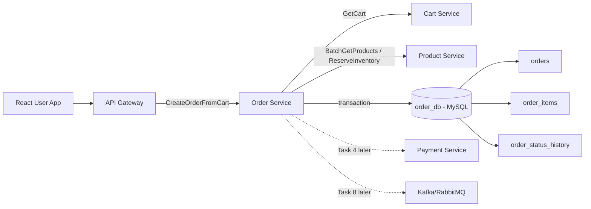
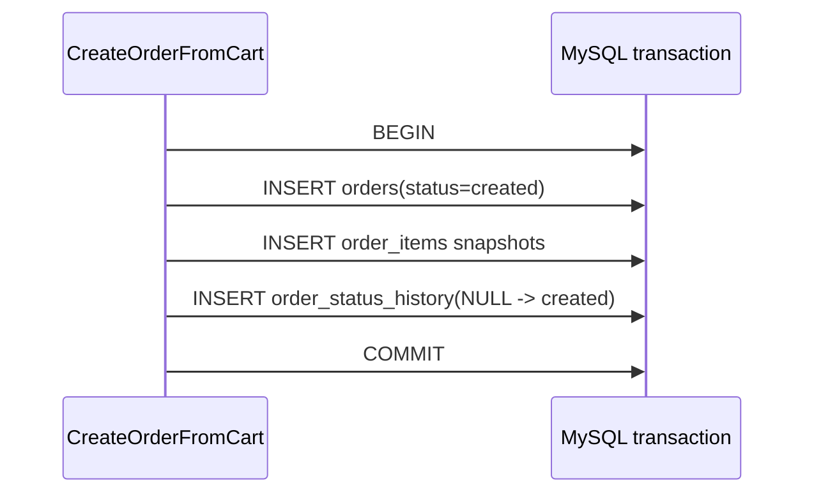
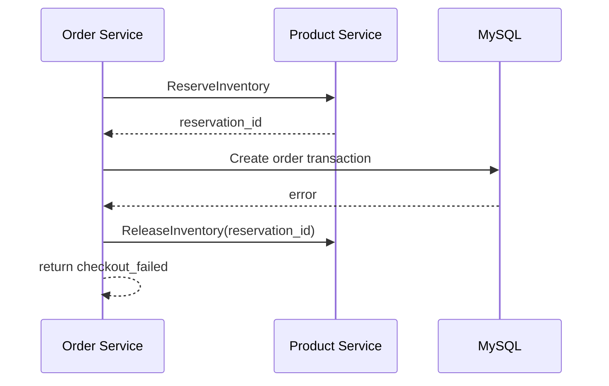
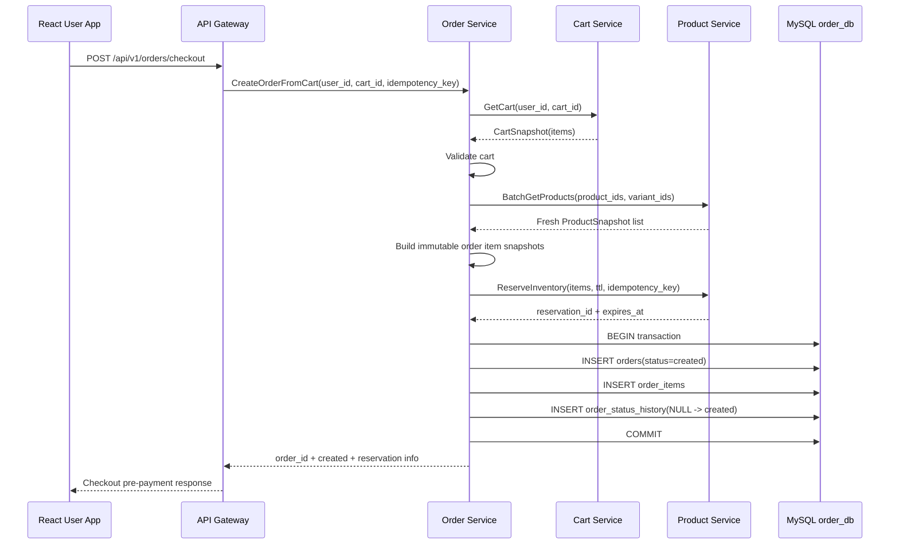
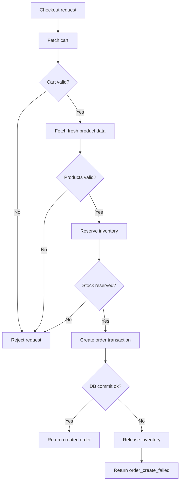

# 🛒 Order Service - Task 3: Cart to Order Flow


## 📌 Task Summary

| Field | Detail |
|---|---|
| Task Name | Cart to order flow |
| Source | `docs/01-micro-tasks.md` → `Order Service` → Task 3 |
| Priority | `P0` foundation/blocker |
| Dependencies | Cart Service and Product Service |
| Main Goal | Cart validate karna, fresh price snapshot lena, inventory reserve karna, aur order create karna |
| Output Type | Documentation-only implementation guide with implementation-ready code examples |
| Main Flow | `GetCart` → validate → refresh product/price → reserve inventory → create order transaction |
| Not Included | Payment intent creation, payment webhook handling, idempotency replay enforcement, gRPC server wiring, order events |

> **Simple Hinglish goal:** Is task ka kaam checkout ke first core step ko design karna hai. User ke cart ko blindly order me convert nahi karna. Pehle cart valid hai ya nahi check hoga, Product Service se latest price/availability verify hogi, inventory reserve hogi, phir MySQL transaction me order + order items + status history save honge.

---

## ✅ Final Output Created

```text
TaskImplementation/
└── Order Service/
    ├── task1.md
    ├── task2.md
    └── task3.md
```

### Why this structure?

- `TaskImplementation/` task-wise implementation guides ka central folder hai.
- `Order Service/` folder Order Service ke saare tasks ko group karta hai.
- `task1.md` lifecycle guide hai.
- `task2.md` MySQL schema guide hai.
- `task3.md` sirf **Order Service - Task 3** ka cart-to-order flow guide hai.
- Existing `task1.md` and `task2.md` preserve kiye gaye.

> 🟢 **Important:** Is task me backend source code files create nahi ki gayi. User-requested output sirf `TaskImplementation/Order Service/task3.md` hai, isliye implementation ko beginner-friendly guide, diagrams, and code examples ke form me document kiya gaya.

---

## 🧭 Requirement Sources Studied

| Document | Kya use kiya gaya |
|---|---|
| `docs/01-micro-tasks.md` | Task 3 ka exact scope: cart validate, price snapshot, inventory reserve, order create |
| `docs/02-system-architecture.md` | Checkout request flow: Gateway → Order → Cart/Product/Payment |
| `docs/03-folder-structure.md` | Future `backend/services/order-service/internal/usecase/create_order_from_cart.go` location |
| `docs/04-microservice-design.md` | Order, Cart, and Product Service responsibilities |
| `docs/05-database-design.md` | Saga-style checkout consistency and immutable order snapshots |
| `docs/07-payment-system.md` | Payment work Task 4 me separate rahega |
| `TaskImplementation/Order Service/task1.md` | Canonical order lifecycle statuses |
| `TaskImplementation/Order Service/task2.md` | Order DB schema: `orders`, `order_items`, `order_status_history` |

---

## 🧱 Task Boundary

### ✅ Included in Task 3

- Checkout request ka cart-to-order usecase define karna
- Cart Service se active cart fetch karna
- Cart empty/stale/invalid cases validate karna
- Product Service se latest product, variant, seller, price, currency, and availability verify karna
- Cart prices ko trust na karke fresh price snapshot banana
- Inventory reserve karna with short TTL
- MySQL transaction me order header create karna
- MySQL transaction me order items snapshot create karna
- Initial `order_status_history` row insert karna
- Failure handling and compensation rules define karna
- Future Go interfaces, structs, and pseudocode examples dena
- Mermaid architecture/flow diagrams add karna

### 🚫 Not Included in Task 3

- Payment Service ko payment intent request bhejna
- `pending_payment` transition finalize karna
- Payment webhook success/failure handle karna
- `paid`, `payment_failed`, refund, retry logic implement karna
- Full checkout idempotency replay enforcement implement karna
- Actual gRPC server method wire karna
- API Gateway REST route implement karna
- Kafka/RabbitMQ `OrderCreated` event publish karna
- Cart clear karna after successful payment
- Product inventory commit karna after payment success

> 🔴 **Reason:** Payment coordination Task 4 me aayega, gRPC implementation Task 5 me aayega, idempotency enforcement Task 7 me aayega, aur order events Task 8 me aayenge. Task 3 ka focus sirf pre-payment cart-to-order conversion hai.

---

## 🧩 High-Level Architecture



### Key idea

Task 3 Order Service ko checkout ka orchestrator banata hai:

- Cart Service cart ka current state deta hai.
- Product Service latest product price and stock validate karta hai.
- Order Service immutable purchase snapshot save karta hai.
- Payment Service abhi call nahi hota; woh Task 4 ka scope hai.

---

## 🗂️ Clean Folder Structure

### Created for this task

```text
TaskImplementation/
└── Order Service/
    ├── task1.md
    ├── task2.md
    └── task3.md
```

### Future backend implementation location

Jab actual Order Service code implement hoga, Task 3 ka code roughly yaha rahega:

```text
backend/
└── services/
    └── order-service/
        ├── cmd/
        │   └── server/
        │       └── main.go
        ├── internal/
        │   ├── clients/
        │   │   ├── cart_client.go
        │   │   └── product_client.go
        │   ├── domain/
        │   │   ├── order.go
        │   │   ├── order_item.go
        │   │   └── money.go
        │   ├── usecase/
        │   │   └── create_order_from_cart.go
        │   ├── repository/
        │   │   ├── mysql_order_repository.go
        │   │   └── transaction.go
        │   └── transport/
        │       └── grpc/
        │           └── order_handler.go
        └── migrations/
            ├── 001_create_order_tables.up.sql
            └── 001_create_order_tables.down.sql
```

> 🟡 **Note:** Upar wala backend structure reference hai. Is Task 3 me actual backend folders/files create nahi kiye gaye.

---

## 🪜 Step-by-Step Implementation

## Step 1: Requirement identify kiya

`docs/01-micro-tasks.md` ke Order Service section me Task 3 ye bolta hai:

> Cart validate karo, price snapshot lo, inventory reserve karo, order create karo.

Iska matlab Order Service ko ye kaam karne hain:

1. User ka cart load karo.
2. Cart empty ya invalid hai to order create mat karo.
3. Product Service se latest product/variant data lao.
4. Cart ke purane price ko trust mat karo.
5. Fresh price snapshot calculate karo.
6. Inventory reserve karo.
7. MySQL transaction me order save karo.

---

## Step 2: Payment scope separate rakha

Checkout architecture me payment bhi aata hai, but Task 3 payment implementation nahi karega.

| Flow Part | Task |
|---|---|
| Cart validate | Task 3 |
| Price snapshot | Task 3 |
| Inventory reserve | Task 3 |
| Order create | Task 3 |
| Payment intent create | Task 4 |
| Payment success webhook | Task 4 |
| Order gRPC server wiring | Task 5 |
| Idempotency replay enforcement | Task 7 |
| Order events publish | Task 8 |

### Status decision

Task 1 ke according:

- `created` initial order record hai.
- `pending_payment` tab set hoga jab payment flow ready ho.

Isliye Task 3 me created order ka safe status:

```text
created
```

Task 4 payment intent create karke order ko aage `pending_payment` me move karega.

> 🟢 **Rule:** Task 3 payment ke bina `paid` ya `pending_payment` set nahi karega.

---

## Step 3: Checkout command define kiya

Usecase ka input clean aur explicit hona chahiye. Gateway authenticated buyer context Order Service ko pass karega.

```go
type CreateOrderFromCartCommand struct {
    UserID         string
    CartID         string
    SessionID      string
    IdempotencyKey string
    ShippingAddress AddressSnapshot
    CouponCode     string
}
```

### Field explanation

| Field | Why needed |
|---|---|
| `UserID` | Buyer ownership validate karne ke liye |
| `CartID` | Specific cart fetch karne ke liye |
| `SessionID` | Audit/debug/fraud journey ke liye |
| `IdempotencyKey` | Future duplicate checkout prevention ke liye |
| `ShippingAddress` | Order time address snapshot freeze karne ke liye |
| `CouponCode` | Future coupon finalization ke liye, actual coupon engine later |

> 🟡 **Note:** Task 7 me `IdempotencyKey` full enforce hoga. Task 3 me command shape idempotency-ready rakha gaya hai.

---

## Step 4: Cart Service se cart fetch kiya

Order Service cart data ka owner nahi hai. Cart Service se active cart fetch hoga.

```go
type CartClient interface {
    GetCart(ctx context.Context, req GetCartRequest) (*CartSnapshot, error)
}

type GetCartRequest struct {
    UserID string
    CartID string
}

type CartSnapshot struct {
    CartID   string
    UserID   string
    Currency string
    Items    []CartItemSnapshot
}

type CartItemSnapshot struct {
    ProductID string
    VariantID string
    Quantity  int32
}
```

### Validation rules

| Rule | Error |
|---|---|
| Cart missing | `cart_not_found` |
| Cart belongs to another user | `cart_forbidden` |
| Cart empty | `cart_empty` |
| Quantity <= 0 | `invalid_quantity` |
| Duplicate variant rows | Merge or reject as `duplicate_cart_item` |

### Simple validation example

```go
func validateCart(cart *CartSnapshot, userID string) error {
    if cart == nil {
        return ErrCartNotFound
    }
    if cart.UserID != userID {
        return ErrCartForbidden
    }
    if len(cart.Items) == 0 {
        return ErrCartEmpty
    }

    seen := map[string]bool{}
    for _, item := range cart.Items {
        if item.ProductID == "" || item.VariantID == "" {
            return ErrInvalidCartItem
        }
        if item.Quantity <= 0 {
            return ErrInvalidQuantity
        }

        key := item.ProductID + ":" + item.VariantID
        if seen[key] {
            return ErrDuplicateCartItem
        }
        seen[key] = true
    }

    return nil
}
```

---

## Step 5: Product Service se fresh product data liya

Cart me stored price UX ke liye useful ho sakta hai, but checkout ke time source of truth Product Service hoga.

```go
type ProductClient interface {
    BatchGetProducts(ctx context.Context, req BatchGetProductsRequest) (*BatchGetProductsResponse, error)
    ReserveInventory(ctx context.Context, req ReserveInventoryRequest) (*ReserveInventoryResponse, error)
}

type BatchGetProductsRequest struct {
    Items []ProductLookupItem
}

type ProductLookupItem struct {
    ProductID string
    VariantID string
}

type ProductSnapshot struct {
    ProductID string
    VariantID string
    SellerID  string
    SKU       string
    Title     string
    ImageURL  string
    Currency  string
    UnitAmount int64
    Published bool
    InStock   bool
}
```

### Why fresh product data?

| Cart data issue | Product refresh se kya solve hota hai |
|---|---|
| Product unpublished ho gaya | Checkout block hoga |
| Variant disabled ho gaya | Checkout block hoga |
| Price change ho gaya | Latest price snapshot save hoga |
| Seller changed/unavailable | Order item snapshot correct hoga |
| Stock low ho gaya | ReserveInventory fail karega |

---

## Step 6: Product validation rules apply kiye

Fresh product response ke baad har cart item validate hoga.

| Rule | Explanation |
|---|---|
| Product found | Missing product order me nahi ja sakta |
| Product published | Draft/unpublished product checkout nahi hoga |
| Variant active | Disabled variant block hoga |
| Currency same | Mixed currency order reject hoga |
| Unit amount non-negative | Negative price invalid hai |
| Seller ID present | Seller order view ke liye required hai |
| Quantity available | Final check reservation me hoga |

### Validation code example

```go
func validateProductForCheckout(product ProductSnapshot, cartItem CartItemSnapshot, orderCurrency string) error {
    if product.ProductID == "" || product.VariantID == "" {
        return ErrProductNotFound
    }
    if !product.Published {
        return ErrProductUnavailable
    }
    if !product.InStock {
        return ErrOutOfStock
    }
    if product.Currency != orderCurrency {
        return ErrCurrencyMismatch
    }
    if product.UnitAmount < 0 {
        return ErrInvalidPrice
    }
    if product.SellerID == "" {
        return ErrMissingSeller
    }
    if cartItem.Quantity <= 0 {
        return ErrInvalidQuantity
    }

    return nil
}
```

---

## Step 7: Immutable order item snapshot banaya

Order item snapshot ka purpose hai ki future product changes old order ko affect na karein.

Example:

- User ne "Blue Running Shoes" ₹2,999 me buy kiya.
- Next day title "Premium Blue Running Shoes" ho gaya.
- Price ₹3,499 ho gaya.
- Old order me original title and original price hi dikhna chahiye.

```go
type OrderItem struct {
    OrderItemID       string
    OrderID           string
    SellerID          string
    ProductID         string
    VariantID         string
    SKU               string
    TitleSnapshot     string
    ImageURLSnapshot  string
    Quantity          int32
    Currency          string
    UnitAmount        int64
    DiscountAmount    int64
    TaxAmount         int64
    TotalAmount       int64
    FulfillmentStatus string
}
```

### Snapshot fields

| Field | Source | Why snapshot |
|---|---|---|
| `title_snapshot` | Product Service | Invoice/order detail stable rahe |
| `image_url_snapshot` | Product Service | Old order UI stable rahe |
| `sku` | Product Service | Seller fulfillment/debug ke liye |
| `unit_amount` | Product Service | Purchased price freeze ho |
| `seller_id` | Product Service | Seller order view and fulfillment ke liye |

---

## Step 8: Totals calculate kiye

Money ko integer minor units me store karna chahiye.

```text
₹2,999.50 => 299950 paise
$19.99   => 1999 cents
```

### Calculation rule

```go
lineTotal := (unitAmount * int64(quantity)) - discountAmount + taxAmount
```

### Amount fields

| Field | Meaning |
|---|---|
| `subtotal_amount` | Items ka raw total before discount/tax/shipping |
| `discount_amount` | Coupon/item discount total |
| `shipping_amount` | Shipping charge |
| `tax_amount` | Tax total |
| `total_amount` | Final payable amount |

### Calculation code example

```go
func buildOrderItem(cartItem CartItemSnapshot, product ProductSnapshot, orderID string) OrderItem {
    quantity := cartItem.Quantity
    subtotal := product.UnitAmount * int64(quantity)

    return OrderItem{
        OrderItemID:       newID("oi"),
        OrderID:           orderID,
        SellerID:          product.SellerID,
        ProductID:         product.ProductID,
        VariantID:         product.VariantID,
        SKU:               product.SKU,
        TitleSnapshot:     product.Title,
        ImageURLSnapshot:  product.ImageURL,
        Quantity:          quantity,
        Currency:          product.Currency,
        UnitAmount:        product.UnitAmount,
        DiscountAmount:    0,
        TaxAmount:         0,
        TotalAmount:       subtotal,
        FulfillmentStatus: "pending",
    }
}
```

> 🟡 **Note:** Coupon finalization CMS Task/Order later integration me add hogi. Task 3 calculation ko discount-ready rakhta hai, but coupon engine implement nahi karta.

---

## Step 9: Inventory reserve kiya

Order create karne se pehle Product Service inventory reserve karega. Isse race condition avoid hoti hai.

### Why reservation?

Without reservation:

1. User A and User B same last item checkout start karte hain.
2. Dono order create kar dete hain.
3. Sirf ek ko stock milta hai.
4. Dusre ko bad UX and refund problem.

With reservation:

1. Product Service atomic reserve karta hai.
2. Agar stock available hai to reservation ID return hoti hai.
3. Agar stock nahi hai to order create nahi hota.

```go
type ReserveInventoryRequest struct {
    UserID         string
    CartID         string
    IdempotencyKey string
    Items          []ReserveInventoryItem
}

type ReserveInventoryItem struct {
    ProductID string
    VariantID string
    Quantity  int32
}

type ReserveInventoryResponse struct {
    ReservationID string
    ExpiresAt     time.Time
}
```

### Reservation rules

| Rule | Explanation |
|---|---|
| Short TTL | Payment complete na ho to stock automatically release ho |
| Atomic reserve | Same variant oversell na ho |
| Idempotency-aware | Retry se duplicate reservation na bane |
| Release on failure | DB/order creation fail ho to reservation release ho |
| Commit later | Payment success ke baad Task 4/Payment flow inventory commit karega |

> 🟢 **Decision:** Task 3 inventory reserve karega, but inventory commit nahi karega. Commit payment success ke baad hoga.

---

## Step 10: Order aggregate build kiya

Order header + items ek aggregate ke form me build hoga.

```go
type Order struct {
    OrderID         string
    UserID          string
    CartID          string
    Status          string
    Currency        string
    SubtotalAmount  int64
    DiscountAmount  int64
    ShippingAmount  int64
    TaxAmount       int64
    TotalAmount     int64
    AddressSnapshot AddressSnapshot
    CouponCode      string
    Items           []OrderItem
}
```

### Initial values

| Field | Value |
|---|---|
| `status` | `created` |
| `currency` | Cart/Product currency |
| `payment_id` | `NULL` |
| `fulfillment_status` | `pending` |
| `created_at` | DB current timestamp |
| `updated_at` | DB current timestamp |

---

## Step 11: MySQL transaction me order create kiya

Task 2 schema ke tables use honge:

- `orders`
- `order_items`
- `order_status_history`

### Transaction write order



### Why transaction?

Agar order header insert ho jaye but items fail ho jayein, to broken order create ho jayega. Transaction ensure karta hai:

- Order header and items together save hon.
- History row missing na ho.
- Failure pe partial data rollback ho.

### Repository interface

```go
type OrderRepository interface {
    CreateOrderWithItems(ctx context.Context, order Order) error
}
```

### Transaction pseudocode

```go
func (r *MySQLOrderRepository) CreateOrderWithItems(ctx context.Context, order Order) error {
    tx, err := r.db.BeginTx(ctx, nil)
    if err != nil {
        return err
    }
    defer tx.Rollback()

    if err := r.insertOrder(ctx, tx, order); err != nil {
        return err
    }

    for _, item := range order.Items {
        if err := r.insertOrderItem(ctx, tx, item); err != nil {
            return err
        }
    }

    history := OrderStatusHistory{
        HistoryID:  newID("osh"),
        OrderID:    order.OrderID,
        FromStatus: "",
        ToStatus:   "created",
        Reason:     "cart_to_order_created",
        ChangedBy:  order.UserID,
    }
    if err := r.insertStatusHistory(ctx, tx, history); err != nil {
        return err
    }

    return tx.Commit()
}
```

> 🟡 **Note:** `defer tx.Rollback()` commit ke baad no-op hota hai. Ye Go transaction pattern partial failure se protect karta hai.

---

## Step 12: Failure pe inventory release rule define kiya

Inventory reserve ho chuki ho aur DB transaction fail ho jaye, to reservation release karna zaruri hai.



### Compensation rules

| Failure | Action |
|---|---|
| Cart fetch fail | No reservation, no DB write |
| Product validation fail | No reservation, no DB write |
| Inventory reserve fail | No DB write |
| DB transaction fail after reserve | Release inventory reservation |
| Release inventory fail | Log critical error and rely on reservation TTL |

> 🟢 **Rule:** Reservation TTL safety net hai, but Order Service ko best-effort release call karna chahiye.

---

## Step 13: Usecase orchestration implement kiya

Complete flow ek usecase method me coordinate hoga.

```go
type CreateOrderFromCartUsecase struct {
    carts    CartClient
    products ProductClient
    orders   OrderRepository
}

func (uc *CreateOrderFromCartUsecase) Execute(
    ctx context.Context,
    cmd CreateOrderFromCartCommand,
) (*CreateOrderFromCartResult, error) {
    cart, err := uc.carts.GetCart(ctx, GetCartRequest{
        UserID: cmd.UserID,
        CartID: cmd.CartID,
    })
    if err != nil {
        return nil, err
    }

    if err := validateCart(cart, cmd.UserID); err != nil {
        return nil, err
    }

    products, err := uc.products.BatchGetProducts(ctx, buildProductLookup(cart.Items))
    if err != nil {
        return nil, err
    }

    order, err := buildOrderFromCart(cmd, cart, products)
    if err != nil {
        return nil, err
    }

    reservation, err := uc.products.ReserveInventory(ctx, ReserveInventoryRequest{
        UserID:         cmd.UserID,
        CartID:         cmd.CartID,
        IdempotencyKey: cmd.IdempotencyKey,
        Items:          buildReservationItems(cart.Items),
    })
    if err != nil {
        return nil, err
    }

    if err := uc.orders.CreateOrderWithItems(ctx, order); err != nil {
        // Best-effort compensation. TTL is backup if this call fails.
        _ = uc.products.ReleaseInventory(ctx, reservation.ReservationID)
        return nil, err
    }

    return &CreateOrderFromCartResult{
        OrderID:       order.OrderID,
        Status:        order.Status,
        Currency:      order.Currency,
        TotalAmount:   order.TotalAmount,
        ReservationID: reservation.ReservationID,
        ReservedUntil: reservation.ExpiresAt,
    }, nil
}
```

> 🟡 **Note:** `ReleaseInventory` Product Service method docs me listed hai. Task 3 guide me interface use kiya gaya hai because failure compensation ke liye zaruri hai.

---

## Step 14: Response shape define kiya

Task 3 ka response payment intent include nahi karega. Payment Task 4 me add hoga.

```go
type CreateOrderFromCartResult struct {
    OrderID       string
    Status        string
    Currency      string
    TotalAmount   int64
    ReservationID string
    ReservedUntil time.Time
}
```

### Example response

```json
{
  "order_id": "ord_01HZX9K9W2ZQ6V4F8J3A2B1C0D",
  "status": "created",
  "currency": "INR",
  "total_amount": 299900,
  "reservation_id": "res_01HZX9KAH7MJ3BM3G9KQQ7PVWD",
  "reserved_until": "2026-05-26T10:15:00Z"
}
```

### Frontend meaning

At Task 3 level, frontend ko sirf ye pata chalega:

- Order snapshot create ho gaya.
- Inventory temporarily reserved hai.
- Payment flow next step me start hoga.

Task 4 ke baad response me payment intent/client secret jaisa data include ho sakta hai.

---

## Step 15: Checkout sequence finalize kiya



---

## Step 16: Error mapping define kiya

Order Service internal errors ko clean application errors me map karega.

| Situation | Error Code | HTTP/gRPC idea |
|---|---|---|
| Cart not found | `cart_not_found` | `NOT_FOUND` |
| Cart empty | `cart_empty` | `FAILED_PRECONDITION` |
| Cart belongs to another user | `cart_forbidden` | `PERMISSION_DENIED` |
| Product missing/unpublished | `product_unavailable` | `FAILED_PRECONDITION` |
| Variant not available | `variant_unavailable` | `FAILED_PRECONDITION` |
| Price/currency invalid | `price_validation_failed` | `FAILED_PRECONDITION` |
| Inventory unavailable | `inventory_unavailable` | `RESOURCE_EXHAUSTED` |
| DB transaction failed | `order_create_failed` | `INTERNAL` |

### Beginner-friendly rule

Client ko raw DB error, stack trace, ya Product Service internal error expose nahi karna. User-facing message simple hona chahiye:

```json
{
  "code": "inventory_unavailable",
  "message": "Some items are no longer available. Please review your cart."
}
```

---

## 🧮 Data Mapping

### Cart item to order item

| Order Item Field | Source |
|---|---|
| `order_item_id` | Order Service ID generator |
| `order_id` | Order Service generated order ID |
| `seller_id` | Product Service |
| `product_id` | Cart/Product Service |
| `variant_id` | Cart/Product Service |
| `sku` | Product Service |
| `title_snapshot` | Product Service current title |
| `image_url_snapshot` | Product Service current image |
| `quantity` | Cart Service |
| `currency` | Product Service |
| `unit_amount` | Product Service latest price |
| `total_amount` | Order Service calculation |
| `fulfillment_status` | Default `pending` |

### Order header mapping

| Order Field | Source |
|---|---|
| `order_id` | Order Service ID generator |
| `user_id` | Gateway/Auth context |
| `cart_id` | Command/cart |
| `status` | Default `created` |
| `currency` | Product/cart validated currency |
| `subtotal_amount` | Sum of item subtotals |
| `discount_amount` | 0 for Task 3 baseline |
| `shipping_amount` | 0 or configured shipping placeholder |
| `tax_amount` | 0 for Task 3 baseline |
| `total_amount` | subtotal - discount + shipping + tax |
| `address_snapshot` | Request/User selected address |
| `coupon_code` | Optional command value |
| `payment_id` | `NULL` until Task 4 |

---

## 🧪 Example: Building Order from Cart

```go
func buildOrderFromCart(
    cmd CreateOrderFromCartCommand,
    cart *CartSnapshot,
    products *BatchGetProductsResponse,
) (Order, error) {
    orderID := newID("ord")
    productByVariant := indexProducts(products.Items)

    order := Order{
        OrderID:         orderID,
        UserID:          cmd.UserID,
        CartID:          cart.CartID,
        Status:          "created",
        Currency:        cart.Currency,
        AddressSnapshot: cmd.ShippingAddress,
        CouponCode:      cmd.CouponCode,
    }

    for _, cartItem := range cart.Items {
        product, ok := productByVariant[cartItem.ProductID+":"+cartItem.VariantID]
        if !ok {
            return Order{}, ErrProductNotFound
        }

        if err := validateProductForCheckout(product, cartItem, cart.Currency); err != nil {
            return Order{}, err
        }

        orderItem := buildOrderItem(cartItem, product, orderID)
        order.Items = append(order.Items, orderItem)
        order.SubtotalAmount += product.UnitAmount * int64(cartItem.Quantity)
        order.TaxAmount += orderItem.TaxAmount
        order.DiscountAmount += orderItem.DiscountAmount
    }

    order.TotalAmount = order.SubtotalAmount - order.DiscountAmount + order.ShippingAmount + order.TaxAmount
    if order.TotalAmount < 0 {
        return Order{}, ErrInvalidOrderTotal
    }

    return order, nil
}
```

### Explanation

- `orderID` ek baar generate hota hai.
- Har order item same `orderID` se linked hota hai.
- Product data indexed hai taaki cart item lookup easy ho.
- Amounts integer me calculate hote hain.
- Negative total block hota hai.

---

## 🧾 SQL Write Examples

Task 2 me full schema already documented hai. Task 3 me write examples focus karte hain.

### Insert order header

```sql
INSERT INTO orders (
  order_id,
  user_id,
  cart_id,
  status,
  currency,
  subtotal_amount,
  discount_amount,
  shipping_amount,
  tax_amount,
  total_amount,
  address_snapshot,
  coupon_code,
  payment_id
) VALUES (?, ?, ?, 'created', ?, ?, ?, ?, ?, ?, ?, ?, NULL);
```

### Insert order item snapshot

```sql
INSERT INTO order_items (
  order_item_id,
  order_id,
  seller_id,
  product_id,
  variant_id,
  sku,
  title_snapshot,
  image_url_snapshot,
  quantity,
  currency,
  unit_amount,
  discount_amount,
  tax_amount,
  total_amount,
  fulfillment_status
) VALUES (?, ?, ?, ?, ?, ?, ?, ?, ?, ?, ?, ?, ?, ?, 'pending');
```

### Insert initial history row

```sql
INSERT INTO order_status_history (
  history_id,
  order_id,
  from_status,
  to_status,
  reason,
  changed_by
) VALUES (?, ?, NULL, 'created', 'cart_to_order_created', ?);
```

---

## 🔁 Saga and Consistency Model

Task 3 distributed transaction use nahi karega. Microservices ke beech saga-style coordination rahegi.



### Why saga?

Order DB and Product inventory DB alag services ke under hain. Ek single ACID transaction dono DBs par nahi chalegi. Isliye:

- Product reservation pehle hota hai.
- Order DB transaction local ACID hoti hai.
- Failure pe compensation call `ReleaseInventory` hota hai.
- Reservation TTL backup safety net hota hai.

---

## 🧰 External Libraries / Tools

### Used directly for this documentation

| Tool | What | Why used | Install |
|---|---|---|---|
| Mermaid | Markdown-friendly diagrams | Architecture, sequence, and flow visually explain karne ke liye | No local install needed if viewer supports Mermaid |
| Shields.io badges | README-style visual badges | Task metadata readable banane ke liye | No install needed |
| Markdown | Documentation format | Git-friendly beginner guide ke liye | No install needed |

### Recommended for future backend implementation

| Library/Tool | What | Why used |
|---|---|---|
| `google.golang.org/grpc` | Go gRPC framework | Order → Cart/Product internal calls ke liye |
| `google.golang.org/protobuf` | Protobuf runtime | Typed request/response contracts ke liye |
| `github.com/go-sql-driver/mysql` | MySQL driver for Go | `database/sql` se `order_db` access karne ke liye |
| `github.com/golang-migrate/migrate/v4` | DB migration tool | Task 2 schema apply/rollback karne ke liye |
| `github.com/google/uuid` or shared ID generator | Unique ID generation | `order_id`, `order_item_id`, `history_id` generate karne ke liye |

### Install examples

```bash
go get google.golang.org/grpc
go get google.golang.org/protobuf
go get github.com/go-sql-driver/mysql
go get github.com/golang-migrate/migrate/v4
go get github.com/google/uuid
```

### Usage examples

MySQL driver import:

```go
import (
    "database/sql"

    _ "github.com/go-sql-driver/mysql"
)

func openDB(dsn string) (*sql.DB, error) {
    return sql.Open("mysql", dsn)
}
```

gRPC client call idea:

```go
conn, err := grpc.DialContext(ctx, productAddr, grpc.WithInsecure())
if err != nil {
    return err
}
defer conn.Close()

client := productv1.NewProductServiceClient(conn)
resp, err := client.BatchGetProducts(ctx, req)
```

> 🟡 **Note:** Actual dependency installation is not done in this task because no backend source code was requested.

---

## 🛡️ Production Rules

| Area | Rule |
|---|---|
| Cart validation | Empty, duplicate, invalid quantity, wrong user carts block karo |
| Price source | Cart stored price trust mat karo; Product Service se fresh price lo |
| Money | Float use mat karo; integer minor units use karo |
| Inventory | Order create se pehle reserve karo |
| DB writes | Order + items + history same transaction me save karo |
| Payment | Task 3 me payment status set mat karo |
| Idempotency | Command idempotency-ready rakho; full enforcement Task 7 me |
| Logs | Full address, token, payment data log mat karo |
| Errors | Internal DB/gRPC details client ko expose mat karo |
| Compensation | DB failure ke baad inventory release best-effort call karo |

---

## 🧪 Future Test Scenarios

> Task 3 me tests run nahi hue, because no source code was added. Ye future implementation ke acceptance test cases hain.

| Test Case | Expected Result |
|---|---|
| Valid cart with available stock | Order created with `created` status |
| Empty cart | `cart_empty` error |
| Cart owned by another user | `cart_forbidden` error |
| Product missing | `product_unavailable` error |
| Product unpublished | `product_unavailable` error |
| Variant out of stock | `inventory_unavailable` error |
| Product currency differs from cart | `price_validation_failed` or `currency_mismatch` |
| DB insert fails after inventory reserve | `ReleaseInventory` called |
| Price changed since cart add | Latest Product Service price saved in order item |
| Product title changes after order | Existing order item snapshot remains unchanged |

### Unit test example outline

```go
func TestCreateOrderFromCart_ValidCartCreatesOrder(t *testing.T) {
    carts := fakeCartClientWithItems()
    products := fakeProductClientWithAvailableInventory()
    repo := fakeOrderRepository()

    uc := CreateOrderFromCartUsecase{
        carts:    carts,
        products: products,
        orders:   repo,
    }

    result, err := uc.Execute(context.Background(), CreateOrderFromCartCommand{
        UserID:         "user_123",
        CartID:         "cart_123",
        IdempotencyKey: "checkout_abc",
        ShippingAddress: AddressSnapshot{
            Country: "IN",
            City:    "Delhi",
        },
    })

    require.NoError(t, err)
    require.Equal(t, "created", result.Status)
    require.NotEmpty(t, result.OrderID)
    require.True(t, repo.CreateCalled)
}
```

---

## 🔍 Observability Notes

Task 3 checkout flow multiple services touch karta hai. Debugging ke liye request context carry karna important hai.

| Signal | What to capture |
|---|---|
| Logs | `request_id`, `user_id`, `cart_id`, `order_id`, error code |
| Metrics | checkout attempts, cart validation failures, inventory reserve failures, order create failures |
| Traces | Gateway → Order → Cart → Product → MySQL spans |

### Example structured log

```json
{
  "level": "info",
  "service": "order-service",
  "message": "order created from cart",
  "request_id": "req_123",
  "user_id": "user_123",
  "cart_id": "cart_123",
  "order_id": "ord_123",
  "status": "created"
}
```

> 🟡 **Note:** Address details, raw JWT, payment data, and full cart payload logs me store nahi karna.

---

## 🚦 Acceptance Criteria

| Criteria | Status |
|---|---|
| `TaskImplementation/` folder exists | ✅ Done |
| `TaskImplementation/Order Service/` folder exists | ✅ Done |
| Existing `task1.md` preserved | ✅ Done |
| Existing `task2.md` preserved | ✅ Done |
| `task3.md` created inside Order Service folder | ✅ Done |
| Step-by-step implementation in Hinglish included | ✅ Done |
| Cart validation flow documented | ✅ Done |
| Fresh price snapshot flow documented | ✅ Done |
| Inventory reservation flow documented | ✅ Done |
| Transactional order creation documented | ✅ Done |
| Failure compensation documented | ✅ Done |
| Mermaid diagrams included | ✅ Done |
| External libraries/tools explained | ✅ Done |
| Folder structure included | ✅ Done |
| Code examples included | ✅ Done |
| No beyond-Task-3 backend implementation added | ✅ Done |

---

## 🔮 Relation to Future Order Service Tasks

| Future Task | How Task 3 connects |
|---|---|
| Task 4: Payment coordination | Created order and reserved inventory will be used to create payment intent |
| Task 5: Implement order gRPC | `CreateOrderFromCart` usecase will be exposed through gRPC |
| Task 6: Seller order view | `order_items.seller_id` snapshots support seller-specific order listing |
| Task 7: Idempotency | `IdempotencyKey` command field and DB table will prevent duplicate checkout |
| Task 8: Emit order events | Successful order creation can publish `OrderCreated` later |

> 🔴 **Not added now:** Payment intent, payment status transitions, event publishing, and full idempotency replay are intentionally left for their own tasks.

---

## 🧠 Final Summary

Order Service Task 3 ka implementation blueprint ready hai:

- Cart Service se cart fetch and validate hoga.
- Product Service se fresh product/price data verify hoga.
- Cart price ko trust nahi kiya jayega.
- Immutable order item snapshots create honge.
- Inventory reserve hogi with short TTL.
- Order header, order items, and initial status history MySQL transaction me save honge.
- Failure pe inventory release compensation follow hogi.
- Payment coordination Task 4 me continue hogi.

Task 3 complete hai as a cart-to-order flow implementation guide. Ye Task 1 lifecycle and Task 2 schema ke upar built hai, aur future payment, gRPC, idempotency, seller view, and event tasks ke liye clean foundation provide karta hai.
