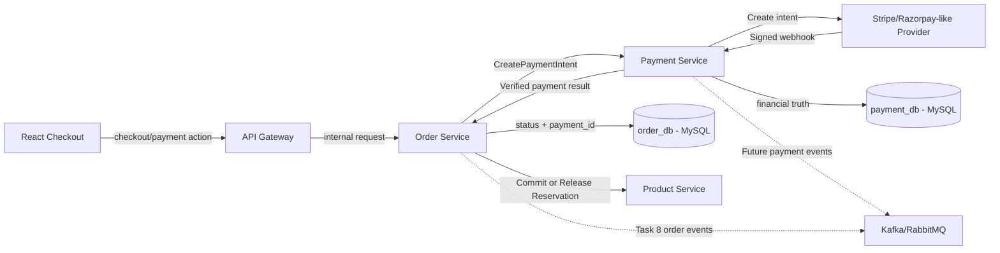
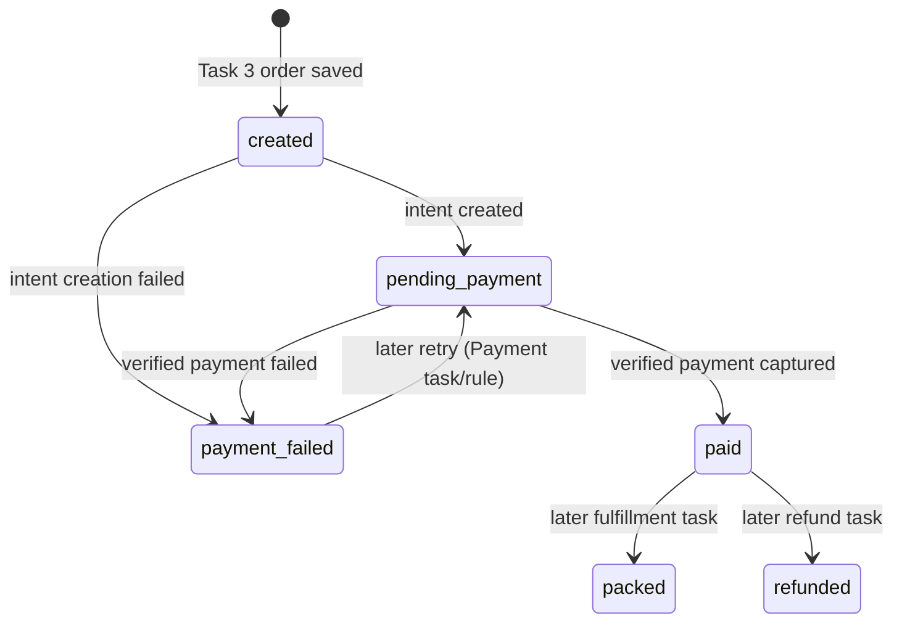
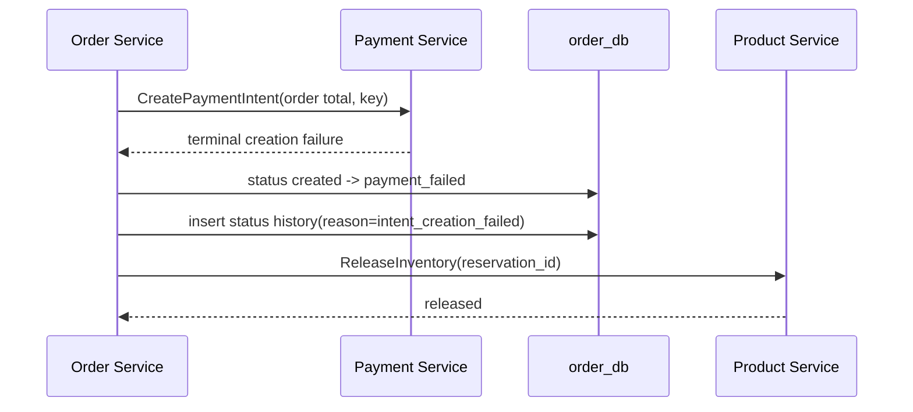
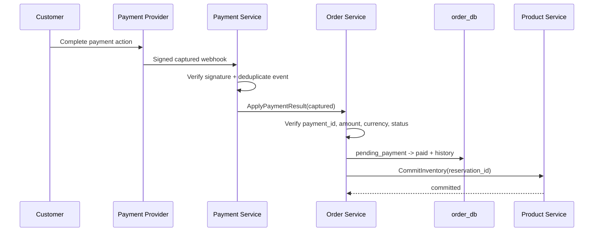
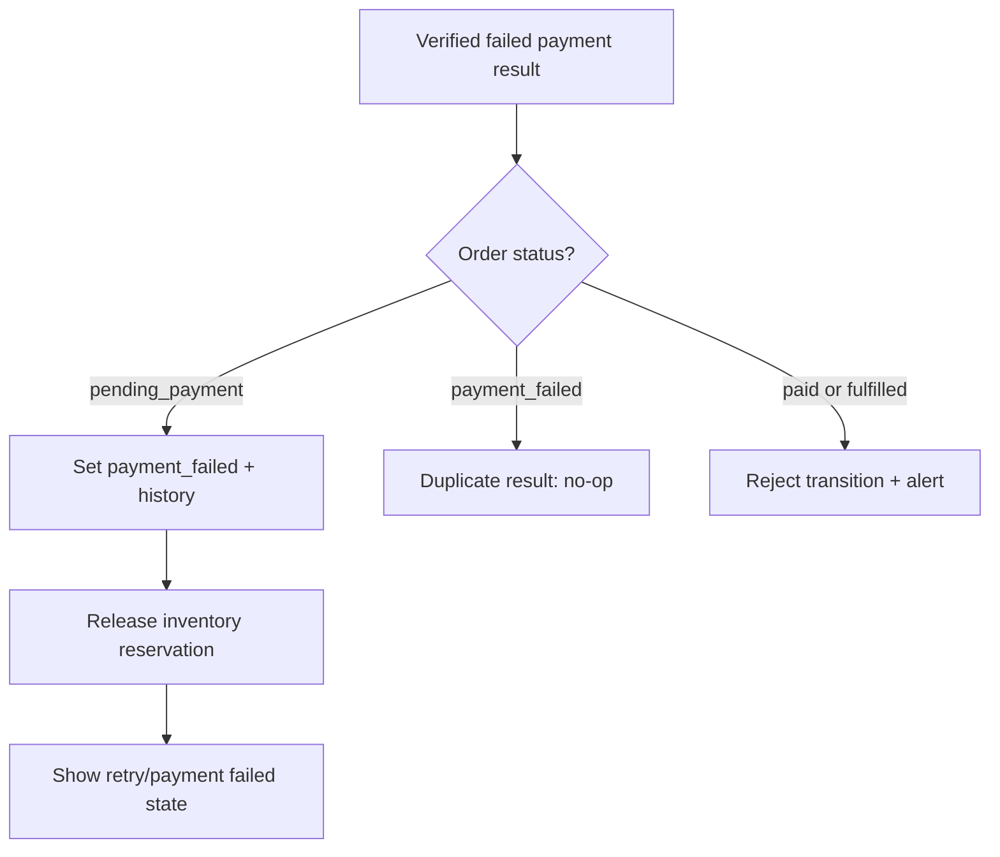

# 💳 Order Service - Task 4: Payment Coordination


## 📌 Task Summary

| Field | Detail |
|---|---|
| Task Name | Payment coordination |
| Source | `docs/01-micro-tasks.md` → `Order Service` → Task 4 |
| Priority | `P0` foundation/blocker |
| Dependency | Payment Service |
| Previous Handoff | Task 3 se `created` order aur temporary inventory reservation milti hai |
| Main Goal | Payment Service ko payment intent request bhejna aur trusted payment result ke basis par order status update karna |
| Output Type | Documentation-only implementation guide with implementation-ready examples |
| Main Flow | `created` → create payment intent → `pending_payment` → webhook-confirmed result → `paid` / `payment_failed` |
| Not Included | Payment provider SDK/webhook implementation, full gRPC server wiring, checkout idempotency storage enforcement, event publication, refunds |

> **Simple Hinglish goal:** Cart se order aur stock reservation Task 3 me ban chuke hain. Ab Task 4 me Order Service us order ko Payment Service ke paas payable banayega. Payment intent successfully banne par order `pending_payment` hoga. Payment ka final result browser se trust nahi hoga; Payment Service ke verified result se order `paid` ya `payment_failed` hoga.

---

## ✅ Final Output Created

```text
TaskImplementation/
└── Order Service/
    ├── task1.md
    ├── task2.md
    ├── task3.md
    └── task4.md
```

### Why this structure?

- `TaskImplementation/` task-wise implementation guides ka central folder hai.
- `Order Service/` Order Service ke sequential guides ko group karta hai.
- `task4.md` sirf **Order Service - Task 4** ka payment coordination design explain karta hai.
- Existing Task 1, Task 2, aur Task 3 documentation preserve ki gayi hai.

> 🟢 **Important:** User-requested output documentation file hai. Is task me actual Go service, proto, SQL migration, webhook handler, queue producer, ya provider integration file create nahi ki gayi.

---

## 🧭 Requirement Sources Studied

| Document | Kya use kiya gaya |
|---|---|
| `docs/01-micro-tasks.md` | Exact Task 4 requirement: Payment Service ko intent request aur result-based order status update |
| `docs/02-system-architecture.md` | Checkout sequence aur rule ki payment success frontend callback se final nahi hogi |
| `docs/03-folder-structure.md` | Future `order-service` aur `payment-service` backend folder ownership |
| `docs/04-microservice-design.md` | Order Service ki payment coordination responsibility aur Payment Service ownership |
| `docs/05-database-design.md` | Saga-style checkout, payment failure compensation, inventory commit flow |
| `docs/07-payment-system.md` | Payment states, success/failure/retry rules, security, and idempotency expectations |
| `database/draw.sql` | Reference `orders.payment_id`, `payment_failed`, aur Payment DB records |
| `TaskImplementation/Order Service/task1.md` | Base order lifecycle |
| `TaskImplementation/Order Service/task2.md` | Order MySQL fields and status history foundation |
| `TaskImplementation/Order Service/task3.md` | `created` order and reserved inventory handoff |

---

## 🧱 Task Boundary

### ✅ Included in Task 4

- Task 3 ke `created` order ko payment ke liye coordinate karna
- Order Service aur Payment Service ki ownership boundary clear karna
- Payment intent request ka input/output contract explain karna
- Server-calculated order amount aur currency Payment Service ko pass karna
- Intent success par `payment_id` save karke order ko `pending_payment` karna
- Payment Service se trusted success/failure result receive karne ka flow define karna
- Verified success par order ko `paid` mark karna
- Payment failure par order ko `payment_failed` mark karke inventory release karna
- Verified success ke baad reserved inventory commit karne ka coordination rule define karna
- Duplicate/out-of-order result ke liye safe transition rules define karna
- Payment result audit history aur error handling examples dena
- Mermaid diagrams, Go/SQL examples, testing checklist, aur tooling guidance dena

### 🚫 Not Included in Task 4

- Stripe/Razorpay-like provider account setup ya provider SDK implementation
- Card number, CVV, UPI credential, ya payment method data store karna
- Payment webhook HTTP endpoint/signature verification implement karna
- Payment Service ka schema/migration ya provider abstraction code create karna
- `CreateOrderFromCart`, `GetOrder`, `MarkOrderPaid` ke actual gRPC server files banana
- Full checkout idempotency repository enforcement implement karna
- Kafka/RabbitMQ `OrderCreated` ya `OrderPaid` events publish karna
- Refund, partial refund, cancellation, reconciliation, ya seller fulfillment implement karna

> 🔴 **Scope rule:** Payment Service payment transaction aur provider truth own karta hai. Order Service sirf apne order ko payment result ke saath safely coordinate karta hai.

---

## 🔗 Task 3 Se Task 4 Handoff

Task 3 complete hone ke baad Order Service ke paas ye data available maana gaya hai:

| Available Data | Meaning |
|---|---|
| `order_id` | Order Service generated immutable order reference |
| `status = created` | Order snapshot save hai, abhi payment initiate nahi hui |
| `user_id` | Authenticated buyer |
| `currency` | Validated order currency, jaise `INR` |
| `total_amount` | Server-calculated smallest-unit total, jaise paise |
| `reservation_id` | Product Service ka temporary stock reservation ID |
| `reserved_until` | Payment complete karne ke liye reservation expiry time |
| `payment_id = NULL` | Payment Task 4 me attach hogi |

> 🟡 **Persistence gap resolved in this guide:** Task 3 response reservation details return karta hai, lekin Task 2 ke documented `orders` table me in values ke durable columns nahi hain. Payment result baad me asynchronously aata hai, isliye actual Task 4 implementation me reservation reference Order Service ke durable data me add karna mandatory hoga. Neeche migration-ready alignment example diya gaya hai.

### Task 4 ka output

| Payment Situation | Order Service Result |
|---|---|
| Intent create ho gaya | `payment_id` attach, status `pending_payment`, frontend ko provider action details return |
| Intent create fail ho gaya | Order `payment_failed`, reserved inventory release |
| Provider-verified payment capture success | Order `paid`, inventory commit request |
| Provider-verified payment fail | Order `payment_failed`, inventory release request |
| Browser sirf success screen bheje | Status update nahi; verified result ka wait |

---

## 🧩 High-Level Architecture



### Ownership samjho

| Responsibility | Owner | Why |
|---|---|---|
| Order amount snapshot | Order Service | Purchased order ka business total yahi own karta hai |
| Payment intent/provider call | Payment Service | Payment provider complexity isolate rahegi |
| Provider webhook verification | Payment Service | Financial security and source of truth |
| Order `status` and history | Order Service | Order lifecycle iska domain hai |
| Payment `status`, attempts, refunds | Payment Service | Financial audit iska domain hai |
| Inventory reserve/commit/release | Product Service | Stock ownership Product Service ka hai |

> 🟢 **Key principle:** Order DB aur Payment DB ko directly join ya cross-write nahi kiya jaayega. Coordination service APIs se hogi.

---

## 🚦 Payment-Aware Order Status Decision

Task 1 ne base order lifecycle define kiya tha. Project ke payment requirement documents aur `database/draw.sql` payment failure ke liye `payment_failed` explicitly use karte hain. Isliye Task 4 payment branch me ek result status formalize karta hai:

| Status | Is Task me Meaning |
|---|---|
| `created` | Order snapshot aur stock reservation ready; intent abhi create nahi hua |
| `pending_payment` | Payment intent attach ho gaya; trusted result ka wait hai |
| `paid` | Payment Service ne provider-verified capture success notify kiya |
| `payment_failed` | Intent create ya verified payment attempt fail ho gaya; stock release hona hai |

> 🟡 **Compatibility note:** `payment_failed` Task 1 ke fulfillment path ko replace nahi karta. Ye Task 4 me required payment-result branch hai, jo `docs/07-payment-system.md` aur reference DDL ke saath alignment ke liye add hota hai.

### Valid transitions for Task 4

| Current Status | Trigger | Next Status | Allowed? |
|---|---|---|---|
| `created` | Payment intent created | `pending_payment` | ✅ Yes |
| `created` | Payment intent creation terminally failed | `payment_failed` | ✅ Yes |
| `pending_payment` | Verified captured result | `paid` | ✅ Yes |
| `pending_payment` | Verified failed result | `payment_failed` | ✅ Yes |
| `pending_payment` | Browser reports success | No update | ❌ Never trust browser |
| `paid` | Duplicate captured result | Remain `paid` | ✅ Idempotent no-op |
| `payment_failed` | Late failure result | Remain `payment_failed` | ✅ Idempotent no-op |
| `paid` | Failed result arrives later | No update/manual review | ❌ Do not downgrade paid order |
| `packed` / `shipped` / `delivered` | Payment initiation | No update | ❌ Invalid phase |

### Status diagram



> 🟠 **Retry note:** Diagram me retry relation dikhaya gaya hai taaki lifecycle understandable rahe, lekin payment retry endpoint aur retry-attempt implementation **Order Service Task 4 ka deliverable nahi** hai.

---

## 💾 Required Persistence Alignment for Task 4

Task 2 ne core order schema design kiya, aur Task 3 ne stock reservation result introduce kiya. Task 4 asynchronous payment result handle karta hai, isliye implementation ke time do minimal persistence alignments required honge:

| Alignment | Why Task 4 ko chahiye? |
|---|---|
| Status enums me `payment_failed` include karna | Source payment flow failed result ko isi state me map karta hai |
| `inventory_reservation_id` save karna | Verified payment result ke baad correct reservation commit/release karni hai |
| `inventory_reserved_until` save karna | Expired reservation par payment initiation block karni hai |

### Migration-ready SQL example

```sql
-- Illustrative Task 4 alignment; no migration file is created in this documentation task.
ALTER TABLE orders
  MODIFY COLUMN status ENUM(
    'created',
    'pending_payment',
    'paid',
    'packed',
    'shipped',
    'delivered',
    'cancelled',
    'refunded',
    'payment_failed'
  ) NOT NULL DEFAULT 'created',
  ADD COLUMN inventory_reservation_id VARCHAR(64) NULL AFTER payment_id,
  ADD COLUMN inventory_reserved_until TIMESTAMP NULL AFTER inventory_reservation_id,
  ADD KEY idx_orders_inventory_reservation (inventory_reservation_id);

ALTER TABLE order_status_history
  MODIFY COLUMN from_status ENUM(
    'created',
    'pending_payment',
    'paid',
    'packed',
    'shipped',
    'delivered',
    'cancelled',
    'refunded',
    'payment_failed'
  ) NULL,
  MODIFY COLUMN to_status ENUM(
    'created',
    'pending_payment',
    'paid',
    'packed',
    'shipped',
    'delivered',
    'cancelled',
    'refunded',
    'payment_failed'
  ) NOT NULL;
```

### Reservation save rule

Task 3 se Task 4 handoff ko durable banane ke liye actual order-create transaction me reservation result bhi order row me persist hoga:

```sql
INSERT INTO orders (
  order_id,
  user_id,
  cart_id,
  status,
  currency,
  total_amount,
  address_snapshot,
  payment_id,
  inventory_reservation_id,
  inventory_reserved_until
) VALUES (?, ?, ?, 'created', ?, ?, ?, NULL, ?, ?);
```

> 🟢 **Why necessary:** Webhook processing browser response ya in-memory variable par depend nahi kar sakti. Durable reservation reference se Task 4 restart/retry ke baad bhi correct inventory action kar sakta hai.

---

## 🗂️ Clean Folder Structure

### Created in this task

```text
TaskImplementation/
└── Order Service/
    ├── task1.md
    ├── task2.md
    ├── task3.md
    └── task4.md
```

### Future implementation location described by this guide

```text
backend/
└── services/
    ├── order-service/
    │   ├── cmd/
    │   │   └── server/
    │   │       └── main.go
    │   ├── internal/
    │   │   ├── clients/
    │   │   │   ├── payment_client.go
    │   │   │   └── product_client.go
    │   │   ├── domain/
    │   │   │   ├── order.go
    │   │   │   └── payment_coordination.go
    │   │   ├── usecase/
    │   │   │   ├── initiate_order_payment.go
    │   │   │   └── apply_payment_result.go
    │   │   ├── repository/
    │   │   │   └── mysql_order_repository.go
    │   │   └── transport/
    │   │       └── grpc/
    │   │           └── payment_result_handler.go
    │   └── migrations/
    └── payment-service/
        └── internal/
            ├── provider/
            ├── usecase/
            │   ├── create_payment_intent.go
            │   └── handle_webhook.go
            └── transport/
                └── http/
                    └── webhook_handler.go
```

> 🟡 **Note:** Ye future reference tree hai. Task 4 output me backend folders ya files create nahi kiye gaye.

---

## 🪜 Step-by-Step Implementation

## Step 1: Exact payment coordination requirement identify ki

`docs/01-micro-tasks.md` me Task 4 ka instruction hai:

> Payment Service ko payment intent request bhejo, result ke basis pe order status update karo.

Is requirement ko do distinct actions me divide kiya gaya:

1. **Initiation path:** `created` order ke amount/currency ko Payment Service tak bhejkar payment intent banana.
2. **Result path:** Payment Service ke provider-verified result ke baad Order Service status ko safely update karna.

### Why do paths separate hain?

Payment intent create hone ka matlab payment successful hona nahi hai. Intent ke baad customer ko OTP, UPI approval, card authentication, ya provider UI action complete karna pad sakta hai. Isliye:

- Intent success = `pending_payment`
- Verified capture success = `paid`

---

## Step 2: Order Service ko orchestrator rakha

Checkout me Order Service buyer ke order ka business owner hai. Payment Service ko request bhejne se pehle Order Service apne saved order ko validate karega.

### Precondition checks

| Check | Reason | Failure Result |
|---|---|---|
| `order_id` exists | Unknown order charge nahi hona chahiye | `order_not_found` |
| Authenticated `user_id` order owner hai | Kisi aur ke order par payment block | `order_forbidden` |
| Status `created` hai | Same order ke invalid phase me new intent block | `order_not_payable` |
| `total_amount > 0` | Zero/negative charge invalid | `invalid_order_amount` |
| Currency allowed hai | Provider mismatch avoid | `unsupported_currency` |
| Reservation expire nahi hui | Out-of-stock order pay nahi karwana | `inventory_reservation_expired` |

### Conceptual Go validation

```go
func validateOrderForPayment(order Order, userID string, now time.Time) error {
    if order.OrderID == "" {
        return ErrOrderNotFound
    }
    if order.UserID != userID {
        return ErrOrderForbidden
    }
    if order.Status != "created" {
        return ErrOrderNotPayable
    }
    if order.TotalAmount <= 0 {
        return ErrInvalidOrderAmount
    }
    if order.Currency != "INR" && order.Currency != "USD" {
        return ErrUnsupportedCurrency
    }
    if !order.ReservedUntil.After(now) {
        return ErrInventoryReservationExpired
    }
    return nil
}
```

> 🟢 **Security rule:** Amount frontend request se recalculate ya override nahi hoga. Task 3 me persisted `orders.total_amount` hi payment charge amount hai.

---

## Step 3: Payment Service client contract define kiya

Order Service ko provider-specific code nahi pata hona chahiye. Uske liye ek clean Payment Service client port use hoga.

```go
type PaymentClient interface {
    CreatePaymentIntent(
        ctx context.Context,
        req CreatePaymentIntentRequest,
    ) (*CreatePaymentIntentResponse, error)
}

type CreatePaymentIntentRequest struct {
    OrderID        string
    UserID         string
    Amount         int64
    Currency       string
    IdempotencyKey string
    ReturnURL      string
}

type CreatePaymentIntentResponse struct {
    PaymentID          string
    Status             string
    Provider           string
    ProviderIntentRef  string
    ClientActionToken  string
    ExpiresAt          time.Time
}
```

### Request field mapping

| Payment Request Field | Source | Rule |
|---|---|---|
| `OrderID` | Saved order | Same ID se reconciliation possible |
| `UserID` | Authenticated order owner | Payment ownership trace |
| `Amount` | `orders.total_amount` | Smallest currency unit; client value trust nahi karna |
| `Currency` | `orders.currency` | Validated ISO currency |
| `IdempotencyKey` | Order payment attempt key | Duplicate intent/charge prevent karne ke liye |
| `ReturnURL` | Approved frontend route/config | Provider redirect ke baad UX only |

### Amount example

```go
// INR 2,999.00 is stored and sent as 299900 paise.
req := CreatePaymentIntentRequest{
    OrderID:        order.OrderID,
    UserID:         order.UserID,
    Amount:         order.TotalAmount,
    Currency:       order.Currency,
    IdempotencyKey: "payment_intent:" + order.OrderID + ":1",
}
```

> 🔴 **Never do this:** Browser se aaya `"amount": 1` provider ko forward karna. Client request tamper ho sakti hai.

---

## Step 4: Payment intent idempotency key pass ki

Network timeout ke time Order Service ko ye pata nahi hota ki Payment Service/provider ne intent create kiya ya nahi. Repeat request duplicate payment intent create na kare, isliye initiation request idempotent honi chahiye.

### Recommended key format

```text
payment_intent:{order_id}:{attempt_no}
```

Example:

```text
payment_intent:ord_01HZX9K9W2ZQ6V4F8J3A2B1C0D:1
```

| Case | Expected behavior |
|---|---|
| First request succeeds | Payment Service new intent create aur response return kare |
| Same key retry due to timeout | Same existing intent response return kare |
| Customer intentionally retries failed attempt later | New attempt number, separate Payment Service rule |
| Same key with changed amount | Reject as idempotency conflict |

> 🟡 **Boundary:** Task 4 key ko contract me require/pass karta hai. Order checkout key ka full persistence and enforcement Order Service Task 7 me implement hoga; Payment Service apni payment-intent uniqueness own karega.

---

## Step 5: Intent request bhejkar `pending_payment` transition ki

Payment intent successfully create hone ke baad Order Service ko:

1. Payment Service response validate karna hai.
2. `orders.payment_id` attach karna hai.
3. `orders.status` ko `pending_payment` set karna hai.
4. `order_status_history` me audit row insert karni hai.
5. Frontend ke liye safe payment-action information return karni hai.

### Response validation rules

| Rule | Why |
|---|---|
| `PaymentID` empty nahi | Order ko financial record se link karna hai |
| Payment initial status expected (`initiated` / `requires_action`) | Captured claim intent API response se blindly accept nahi karna |
| Client action token only frontend ko safe field ke roop me return | Provider secret expose nahi karna |
| Provider raw response/order logs me store nahi | Sensitive data leakage avoid |

### Repository operation

```go
type OrderRepository interface {
    GetForPayment(ctx context.Context, orderID string) (Order, error)
    AttachPaymentIntent(
        ctx context.Context,
        orderID string,
        paymentID string,
        changedBy string,
    ) error
}
```

### Atomic SQL example

```sql
START TRANSACTION;

UPDATE orders
SET payment_id = ?,
    status = 'pending_payment'
WHERE order_id = ?
  AND status = 'created'
  AND payment_id IS NULL;

-- Application must confirm exactly one order row was updated.
-- If not, ROLLBACK and do not write the history row.

INSERT INTO order_status_history (
  history_id,
  order_id,
  from_status,
  to_status,
  reason,
  changed_by
) VALUES (?, ?, 'created', 'pending_payment', 'payment_intent_created', 'order-service');

COMMIT;
```

### Why local transaction?

Payment Service apna financial record pehle hi own kar chuka hoga. Order DB me payment link aur lifecycle history ek saath commit honi chahiye, warna:

- `orders.status` updated ho sakta hai but timeline missing rahegi.
- Audit/debugging difficult ho jayegi.

---

## Step 6: Intent creation failure ka compensation define kiya

Task 3 ne inventory temporarily reserve ki thi. Agar payable intent create nahi hota, reservation indefinitely hold nahi rehni chahiye.



### Failure classifications

| Situation | Order action | Inventory action |
|---|---|---|
| Provider rejects valid request terminally | Mark `payment_failed` | Release reservation |
| Payment Service validates amount/currency as invalid | Mark `payment_failed`; investigate input | Release reservation |
| Network timeout; result unknown | Do not immediately mark final failure | Retry same idempotency key / query Payment Service |
| Order DB fails after intent exists | Record operational alert; retry attach operation | Do not create a second intent |

> 🟠 **Important:** Timeout ko terminal failure assume karna unsafe hai. Provider me intent ban chuka ho sakta hai; same idempotency key se reconciliation/retry karna chahiye.

---

## Step 7: Checkout response ko payment-ready banaya

Intent successfully attach hone ke baad Gateway/frontend ko safe response diya ja sakta hai:

```go
type InitiateOrderPaymentResult struct {
    OrderID           string
    OrderStatus       string
    PaymentID         string
    PaymentStatus     string
    Provider          string
    ClientActionToken string
    ExpiresAt         time.Time
}
```

### Example API response

```json
{
  "order_id": "ord_01HZX9K9W2ZQ6V4F8J3A2B1C0D",
  "order_status": "pending_payment",
  "payment_id": "pay_01HZX9MB1RD2SV5YS71K3WK0AA",
  "payment_status": "requires_action",
  "provider": "razorpay_like",
  "client_action_token": "provider_safe_checkout_token",
  "expires_at": "2026-05-26T10:15:00Z"
}
```

### Frontend ko kya karna hai?

- `client_action_token` se provider checkout UI initiate kar sakta hai.
- Success/failure UI show kar sakta hai.
- Final paid order state ke liye Order API poll/refetch kar sakta hai.

### Frontend ko kya nahi karna hai?

- `paid` status directly set karne ki request nahi bhejni.
- Order amount change nahi karna.
- Provider secret ya card details Order Service ko nahi bhejni.

---

## Step 8: Final payment result ke liye trusted inbound path rakha

Payment success ka trusted source provider webhook hai, lekin webhook verify karna **Payment Service** ka kaam hai. Flow:

1. Provider Payment Service webhook endpoint ko event bhejta hai.
2. Payment Service signature verify karta hai.
3. Payment Service duplicate provider event ID ignore karta hai.
4. Payment DB me `captured` ya `failed` result record hota hai.
5. Payment Service Order Service ko authenticated internal result deta hai.
6. Order Service matching `payment_id` aur valid current status verify karke lifecycle change karta hai.

### Result contract example

```go
type ApplyPaymentResultCommand struct {
    PaymentID       string
    OrderID         string
    Result          string // "captured" or "failed"
    Amount          int64
    Currency        string
    ProviderEventID string
    OccurredAt      time.Time
}
```

### Inbound validation

| Validation | Failure behavior |
|---|---|
| Call authenticated internal Payment Service se aaye | Unauthorized call reject |
| `order_id` exists | Unknown payment result reject/manual investigation |
| `payment_id` order se match kare | Mismatch reject and alert |
| Amount saved order total ke equal ho | Do not mark paid; finance/security alert |
| Currency match kare | Do not mark paid; alert |
| Current order status transition allow kare | Duplicate ko no-op, invalid transition reject |
| Provider result verified by Payment Service ho | Unverified client result accept nahi |

> 🔴 **Financial rule:** Amount mismatch ke saath captured payment aaye to order ko automatically `paid` mat mark karo. Ye reconciliation/manual review case hai.

---

## Step 9: Verified success par order `paid` aur inventory committed ki

Provider webhook verified aur Payment Service me payment `captured` hone par order financially confirmed hai.

### Success transaction

```sql
START TRANSACTION;

UPDATE orders
SET status = 'paid'
WHERE order_id = ?
  AND payment_id = ?
  AND status = 'pending_payment';

-- Application checks rows affected:
-- 1 means first successful transition.
-- 0 requires duplicate/already-paid or invalid-state handling.
-- INSERT below runs only when exactly one row changed.

INSERT INTO order_status_history (
  history_id,
  order_id,
  from_status,
  to_status,
  reason,
  changed_by
) VALUES (?, ?, 'pending_payment', 'paid', 'payment_captured_verified', 'payment-service');

COMMIT;
```

### Success flow diagram



### Inventory commit rule

| Action | Kab hoga? | Why |
|---|---|---|
| `ReserveInventory` | Task 3, payment se pehle | Simultaneous checkout race block |
| `CommitInventory` | Verified payment success ke baad | Paid order ke liye stock final decrement |
| `ReleaseInventory` | Payment terminally fail ho | Unpaid hold ko available stock me return |

> 🟡 **Distributed consistency:** Order paid transaction aur Product inventory commit ek single database transaction nahi hain. Commit failure par retry/alert chahiye; paid order ko unpaid nahi banana.

---

## Step 10: Verified failure par order `payment_failed` aur inventory released ki

Payment Service jab verified failed result deta hai, Order Service unpaid order ko failure state me move karega.

### Failure SQL example

```sql
START TRANSACTION;

UPDATE orders
SET status = 'payment_failed'
WHERE order_id = ?
  AND payment_id = ?
  AND status = 'pending_payment';

-- INSERT below runs only when exactly one row changed.

INSERT INTO order_status_history (
  history_id,
  order_id,
  from_status,
  to_status,
  reason,
  changed_by
) VALUES (?, ?, 'pending_payment', 'payment_failed', ?, 'payment-service');

COMMIT;
```

### Failure flow



### Failure reason examples

| Internal Reason | User-facing message |
|---|---|
| `provider_payment_failed` | Payment unsuccessful. Please try another payment method. |
| `payment_expired` | Payment session expired. Please retry payment. |
| `intent_creation_failed` | Unable to start payment. Please retry checkout. |
| `amount_mismatch` | Payment is under review. Support will update the order. |

> 🟢 **Rule:** Raw provider error, stack trace, or sensitive response frontend ko expose nahi karna.

---

## Step 11: Duplicate aur out-of-order results safe banaye

Payment webhooks retry ho sakte hain. Ek hi captured event multiple baar indirectly Order Service tak pahunch sakta hai. Status update idempotent hona zaroori hai.

### Handling table

| Existing Order Status | Incoming Result | Behavior |
|---|---|---|
| `pending_payment` | `captured` | Transition to `paid`, commit stock |
| `paid` | `captured` duplicate | Success no-op; stock dobara commit nahi |
| `pending_payment` | `failed` | Transition to `payment_failed`, release stock |
| `payment_failed` | `failed` duplicate | Success no-op; stock dobara release nahi |
| `paid` | `failed` late/out-of-order | Reject lifecycle downgrade; alert |
| `payment_failed` | `captured` late | Manual review/reconciliation; auto stock action nahi |

### Conditional update pattern

```go
func (uc *ApplyPaymentResultUsecase) applyCaptured(ctx context.Context, cmd ApplyPaymentResultCommand) error {
    order, err := uc.orders.GetForPayment(ctx, cmd.OrderID)
    if err != nil {
        return err
    }
    if order.PaymentID != cmd.PaymentID {
        return ErrPaymentOrderMismatch
    }
    if order.Status == "paid" {
        return nil // Duplicate success: already applied.
    }
    if order.Status != "pending_payment" {
        return ErrInvalidPaymentTransition
    }
    if order.TotalAmount != cmd.Amount || order.Currency != cmd.Currency {
        return ErrPaymentAmountMismatch
    }

    changed, err := uc.orders.MarkPaidIfPending(ctx, order.OrderID, cmd.PaymentID)
    if err != nil || !changed {
        return err
    }
    return uc.inventory.CommitInventory(ctx, order.ReservationID)
}
```

> 🟠 **Production consideration:** Inventory commit request bhi idempotent operation key ke saath bhejni chahiye, jaise `inventory_commit:{order_id}`.

---

## Step 12: Initiation usecase ka full pseudocode banaya

```go
type InitiateOrderPaymentUsecase struct {
    orders    OrderRepository
    payments  PaymentClient
    inventory InventoryClient
    clock     Clock
}

func (uc *InitiateOrderPaymentUsecase) Execute(
    ctx context.Context,
    orderID string,
    userID string,
) (*InitiateOrderPaymentResult, error) {
    order, err := uc.orders.GetForPayment(ctx, orderID)
    if err != nil {
        return nil, err
    }

    if err := validateOrderForPayment(order, userID, uc.clock.Now()); err != nil {
        return nil, err
    }

    intentKey := "payment_intent:" + order.OrderID + ":1"
    intent, err := uc.payments.CreatePaymentIntent(ctx, CreatePaymentIntentRequest{
        OrderID:        order.OrderID,
        UserID:         order.UserID,
        Amount:         order.TotalAmount,
        Currency:       order.Currency,
        IdempotencyKey: intentKey,
    })
    if err != nil {
        if isUnknownOutcome(err) {
            return nil, ErrPaymentIntentPendingResolution
        }

        if markErr := uc.orders.MarkPaymentFailedFromCreated(
            ctx, order.OrderID, "intent_creation_failed",
        ); markErr != nil {
            return nil, markErr
        }
        _ = uc.inventory.ReleaseInventory(ctx, order.ReservationID)
        return nil, ErrPaymentIntentCreationFailed
    }

    if err := validatePaymentIntent(intent); err != nil {
        return nil, err
    }
    if err := uc.orders.AttachPaymentIntent(
        ctx, order.OrderID, intent.PaymentID, "order-service",
    ); err != nil {
        return nil, err
    }

    return &InitiateOrderPaymentResult{
        OrderID:           order.OrderID,
        OrderStatus:       "pending_payment",
        PaymentID:         intent.PaymentID,
        PaymentStatus:     intent.Status,
        Provider:          intent.Provider,
        ClientActionToken: intent.ClientActionToken,
        ExpiresAt:         intent.ExpiresAt,
    }, nil
}
```

### Is pseudocode me kya important hai?

| Block | Explanation |
|---|---|
| `GetForPayment` | Persisted server amount load hota hai |
| `validateOrderForPayment` | Wrong owner/status/expired reservation block hoti hai |
| `CreatePaymentIntent` | Payment Service se only allowed sync dependency |
| Unknown outcome branch | Timeout par duplicate charge risk avoid karta hai |
| Failure compensation | Terminal intent failure par stock release |
| `AttachPaymentIntent` | Payment ID aur `pending_payment` history atomically save |

---

## Step 13: Payment result usecase ka pseudocode banaya

```go
type ApplyPaymentResultUsecase struct {
    orders    OrderRepository
    inventory InventoryClient
}

func (uc *ApplyPaymentResultUsecase) Execute(
    ctx context.Context,
    cmd ApplyPaymentResultCommand,
) error {
    order, err := uc.orders.GetForPayment(ctx, cmd.OrderID)
    if err != nil {
        return err
    }

    if order.PaymentID != cmd.PaymentID {
        return ErrPaymentOrderMismatch
    }
    if order.TotalAmount != cmd.Amount || order.Currency != cmd.Currency {
        return ErrPaymentAmountMismatch
    }

    switch cmd.Result {
    case "captured":
        if order.Status == "paid" {
            return nil
        }
        if order.Status != "pending_payment" {
            return ErrInvalidPaymentTransition
        }
        if err := uc.orders.MarkPaid(ctx, order.OrderID, order.PaymentID); err != nil {
            return err
        }
        return uc.inventory.CommitInventory(ctx, order.ReservationID)

    case "failed":
        if order.Status == "payment_failed" {
            return nil
        }
        if order.Status != "pending_payment" {
            return ErrInvalidPaymentTransition
        }
        if err := uc.orders.MarkPaymentFailed(
            ctx, order.OrderID, order.PaymentID, "provider_payment_failed",
        ); err != nil {
            return err
        }
        return uc.inventory.ReleaseInventory(ctx, order.ReservationID)

    default:
        return ErrUnsupportedPaymentResult
    }
}
```

### Design explanation

- Result apply karne se pehle order/payment binding check hoti hai.
- Amount/currency mismatch payment fraud ya data bug signal ho sakta hai.
- Duplicate final status harmless no-op hai.
- Inventory call final order result ke according hoti hai.
- `authorized`, refund, ya partial refund states yahan implement nahi hote; woh later payment/refund workflows ke concern hain.

---

## 🔄 Complete Task 4 Sequence

```mermaid
sequenceDiagram
    autonumber
    participant GW as API Gateway
    participant Order as Order Service
    participant ODB as order_db
    participant Product as Product Service
    participant Payment as Payment Service
    participant Provider as Payment Provider

    Note over Order,Product: Task 3 already created order and reserved stock
    GW->>Order: Initiate payment for created order
    Order->>ODB: Load order total, currency, reservation
    Order->>Order: Validate payable order
    Order->>Payment: CreatePaymentIntent(order_id, amount, key)
    Payment->>Provider: Create provider intent
    Provider-->>Payment: intent requiring customer action
    Payment-->>Order: payment_id + client action
    Order->>ODB: Attach payment_id; created -> pending_payment
    Order-->>GW: Payment-ready response

    Provider->>Payment: Signed captured/failed webhook
    Payment->>Payment: Verify + store financial result
    Payment->>Order: Trusted payment result

    alt captured
        Order->>ODB: pending_payment -> paid + history
        Order->>Product: CommitInventory(reservation_id)
    else failed
        Order->>ODB: pending_payment -> payment_failed + history
        Order->>Product: ReleaseInventory(reservation_id)
    end
```

---

## 📦 Data Mapping

### Order to payment intent

| Payment Input | Order Source | Example |
|---|---|---|
| `order_id` | `orders.order_id` | `ord_01HZX9K9...` |
| `user_id` | `orders.user_id` | `usr_1001` |
| `amount` | `orders.total_amount` | `299900` |
| `currency` | `orders.currency` | `INR` |
| `idempotency_key` | Generated per payment attempt | `payment_intent:ord_...:1` |
| Metadata order reference | `orders.order_id` only | Avoid sensitive item/customer detail |

### Payment result to order status

| Payment Service Status/Result | Order Status Update | Inventory Action |
|---|---|---|
| Intent `initiated` / `requires_action` | `pending_payment` | Keep reservation |
| Verified `captured` | `paid` | Commit reservation |
| Verified `failed` | `payment_failed` | Release reservation |
| `authorized` only | Remain `pending_payment` unless business capture rule is finalized | Keep reservation |
| `refunded` / `partially_refunded` | Later refund workflow | Outside Task 4 |

---

## 🧾 Status History Examples

### Happy path timeline

| From | To | Reason | Changed By |
|---|---|---|---|
| `NULL` | `created` | `cart_to_order_created` | `order-service` |
| `created` | `pending_payment` | `payment_intent_created` | `order-service` |
| `pending_payment` | `paid` | `payment_captured_verified` | `payment-service` |

### Failed payment timeline

| From | To | Reason | Changed By |
|---|---|---|---|
| `NULL` | `created` | `cart_to_order_created` | `order-service` |
| `created` | `pending_payment` | `payment_intent_created` | `order-service` |
| `pending_payment` | `payment_failed` | `provider_payment_failed` | `payment-service` |

### Intent creation failure timeline

| From | To | Reason | Changed By |
|---|---|---|---|
| `NULL` | `created` | `cart_to_order_created` | `order-service` |
| `created` | `payment_failed` | `intent_creation_failed` | `order-service` |

---

## ⚠️ Error Mapping

| Situation | Internal Error Code | Gateway/User Result |
|---|---|---|
| Order missing | `order_not_found` | `NOT_FOUND` |
| Wrong buyer | `order_forbidden` | `PERMISSION_DENIED` |
| Wrong current state | `order_not_payable` | `FAILED_PRECONDITION` |
| Reservation expired | `inventory_reservation_expired` | Ask user to review cart again |
| Payment intent terminal failure | `payment_intent_creation_failed` | Payment could not start; stock released |
| Payment timeout/unknown | `payment_intent_pending_resolution` | Retry safely; do not create new order |
| Payment/order ID mismatch | `payment_order_mismatch` | Internal alert; reject update |
| Captured amount mismatch | `payment_amount_mismatch` | Under review; do not mark paid |
| Invalid final transition | `invalid_payment_transition` | Ignore/review duplicate or late result |

### Safe user error example

```json
{
  "code": "payment_intent_creation_failed",
  "message": "Payment could not be started. Please try again."
}
```

---

## 🔒 Security Rules

| Rule | Why mandatory hai |
|---|---|
| Amount/currency Order DB se lo | Client tampering block karna |
| Provider webhook Payment Service verify kare | Fake payment success prevent karna |
| Browser callback se `paid` set mat karo | Client financial source of truth nahi hai |
| Card/CVV/provider secret Order Service logs ya DB me mat store karo | PCI/security exposure reduce karna |
| Payment result internal authentication enforce karo | Unauthorized lifecycle update block |
| `payment_id`, `order_id`, amount, currency match validate karo | Wrong order paid marking prevent |
| Logs me tokens redact karo | Sensitive credential leakage avoid |
| Duplicate result idempotently process karo | Double stock decrement/release prevent |

---

## 📈 Observability Guidance

Payment coordination production me highly visible honi chahiye, but sensitive fields log nahi hone chahiye.

### Suggested structured logs

```json
{
  "service": "order-service",
  "operation": "apply_payment_result",
  "order_id": "ord_01HZX9K9W2ZQ6V4F8J3A2B1C0D",
  "payment_id": "pay_01HZX9MB1RD2SV5YS71K3WK0AA",
  "result": "captured",
  "transition": "pending_payment_to_paid",
  "request_id": "req_123",
  "trace_id": "trace_456"
}
```

### Suggested metrics

| Metric | Why |
|---|---|
| `order_payment_intent_requests_total` | Payment initiation traffic |
| `order_payment_intent_failures_total` | Provider/Payment dependency health |
| `order_payment_results_total{result}` | Success/failure conversion |
| `order_payment_amount_mismatch_total` | Financial/security alert |
| `order_inventory_commit_failures_total` | Paid-with-uncommitted-stock risk |
| `order_payment_pending_duration_seconds` | Stuck pending payments detect |

> 🟡 **Scope note:** Metrics/log standards platform observability work ko follow karenge; yahan Task 4 ke important signals define kiye gaye hain.

---

## 🧪 Test Scenarios

### Unit test checklist

| Scenario | Expected Result |
|---|---|
| Valid `created` order + intent success | Payment attach; `pending_payment` history written |
| Wrong user attempts payment | Reject; Payment Service call nahi |
| Order already `pending_payment` | New intent automatically create nahi |
| Expired stock reservation | Reject; payment initiate nahi |
| Terminal intent failure | Mark `payment_failed`; release inventory |
| Intent timeout/unknown outcome | No final failure; same key resolution required |
| Valid captured result | Mark `paid`; commit inventory once |
| Valid failed result | Mark `payment_failed`; release inventory once |
| Duplicate captured after already paid | No-op; inventory commit repeat nahi |
| Captured result amount mismatch | Reject paid transition; alert |
| Browser claims success without verified result | Order remains `pending_payment` |

### Example unit test shape

```go
func TestApplyPaymentResult_CapturedMarksPaidAndCommitsInventory(t *testing.T) {
    repo := &fakeOrderRepository{
        order: Order{
            OrderID:       "ord_1",
            PaymentID:     "pay_1",
            Status:        "pending_payment",
            Currency:      "INR",
            TotalAmount:   299900,
            ReservationID: "res_1",
        },
    }
    inventory := &fakeInventoryClient{}
    uc := ApplyPaymentResultUsecase{orders: repo, inventory: inventory}

    err := uc.Execute(context.Background(), ApplyPaymentResultCommand{
        OrderID:   "ord_1",
        PaymentID: "pay_1",
        Result:    "captured",
        Currency:  "INR",
        Amount:    299900,
    })

    require.NoError(t, err)
    require.Equal(t, "paid", repo.order.Status)
    require.Equal(t, 1, inventory.commitCalls)
}
```

### Integration test ideas

| Integration Test | Check |
|---|---|
| Order Service ↔ mocked Payment Service intent | Request amount/key and attached `payment_id` |
| Order DB transaction | Status and history commit together |
| Duplicate payment result | Conditional update prevents repeat side effect |
| Product Service commit/release client | Correct call per trusted result |

---

## 🧰 External Libraries / Tools

### Tools used directly in this documentation output

| Tool | What hai? | Why used? | Install / Use |
|---|---|---|---|
| Markdown | Text documentation format | Git-friendly structured guide banane ke liye | Koi install required nahi; `.md` viewer/editor me open karo |
| Mermaid | Markdown-friendly diagram syntax | Architecture, state aur sequence flows visually dikhane ke liye | GitHub/supporting viewer me code block render hota hai; local preview ke liye Mermaid-enabled Markdown extension use kar sakte hain |
| Shields.io | Hosted badge image service | Priority/status/scope ko visually readable banane ke liye | Install nahi; Markdown image URL use hota hai |

### Future Go implementation ke liye recommended libraries

> 🟡 **Important:** Neeche wali dependencies is documentation task me install nahi ki gayi hain. Ye actual backend implementation ke time use hongi.

| Library / Tool | What hai? | Why use hoga? | Install command |
|---|---|---|---|
| `google.golang.org/grpc` | Go gRPC runtime | Order → Payment/Product internal calls ke liye | `go get google.golang.org/grpc` |
| `google.golang.org/protobuf` | Generated protobuf message runtime | Typed request/result contracts ke liye | `go get google.golang.org/protobuf` |
| `github.com/go-sql-driver/mysql` | MySQL driver for Go | Order status/payment ID transaction save karne ke liye | `go get github.com/go-sql-driver/mysql` |
| `github.com/stretchr/testify` | Go testing assertions/mocks helpers | Payment branches ke focused unit tests ke liye | `go get github.com/stretchr/testify` |

### Usage examples

#### gRPC Payment client use

```go
resp, err := paymentClient.CreatePaymentIntent(ctx, &paymentv1.CreatePaymentIntentRequest{
    OrderId:        order.OrderID,
    UserId:         order.UserID,
    Amount:         order.TotalAmount,
    Currency:       order.Currency,
    IdempotencyKey: intentKey,
})
```

#### MySQL transaction use

```go
tx, err := db.BeginTx(ctx, nil)
if err != nil {
    return err
}
defer tx.Rollback()

// Update order status and append history inside tx.

return tx.Commit()
```

### External provider/library ownership

Order Service directly Stripe/Razorpay-like SDK install nahi karega. Provider SDK aur webhook verification **Payment Service** ke andar honge. Isse:

- Order domain provider-neutral rehta hai.
- Payment keys/secrets ek secure boundary me rehte hain.
- Provider replace karna Order Service ko change kiye bina possible hota hai.

---

## 🚫 Scope Protection Checklist

| Tempting Extra Work | Is Task me kyun nahi? | Correct Future Owner |
|---|---|---|
| Public checkout gRPC endpoints implement karna | Service transport implementation separate task hai | Order Service Task 5 |
| Seller items split/view | Payment coordination concern nahi | Order Service Task 6 |
| Checkout request replay database enforcement | Separate explicit requirement | Order Service Task 7 |
| `OrderPaid` event publish karna | Message queue event emission separate task hai | Order Service Task 8 |
| Provider webhook/signature implementation | Order Service provider own nahi karta | Payment Service webhook task |
| Refund after paid cancellation | Payment coordination initiation/result se beyond hai | Payment refund flow |

---

## ✅ Acceptance Criteria

| Criteria | Status |
|---|---|
| `TaskImplementation/` folder already retained | ✅ Done |
| `TaskImplementation/Order Service/` folder already retained | ✅ Done |
| `TaskImplementation/Order Service/task4.md` created | ✅ Done |
| Exact payment coordination requirement documented | ✅ Done |
| Hinglish step-by-step explanation included | ✅ Done |
| Intent request and trusted result flows explained | ✅ Done |
| `created`, `pending_payment`, `paid`, `payment_failed` transition rules documented | ✅ Done |
| Required durable reservation/status persistence alignment documented | ✅ Done |
| Inventory commit/release coordination explained | ✅ Done |
| Security, errors, idempotency, and tests included | ✅ Done |
| Clean folder structure included | ✅ Done |
| Go/SQL/JSON code examples included | ✅ Done |
| Mermaid diagrams and visual badges included | ✅ Done |
| External tools/libraries and install/use guidance included | ✅ Done |
| No implementation beyond Order Service Task 4 added | ✅ Done |

---

## 🔮 Relation to Other Tasks

| Task | Relation with Task 4 |
|---|---|
| Task 1: Lifecycle | Base statuses deta hai; Task 4 payment failure branch formalize karta hai |
| Task 2: MySQL schema | Core `payment_id`/history foundation deta hai; Task 4 required payment-failure and reservation alignment document karta hai |
| Task 3: Cart to order | `created` order aur inventory reservation Task 4 ko hand over karta hai |
| Task 5: Order gRPC | Documented usecases ko actual transport endpoints me expose karega |
| Task 7: Idempotency | Checkout replay aur order-level uniqueness enforce karega |
| Task 8: Order events | Paid/failed/cancelled lifecycle changes se async events publish karega |
| Payment Service | Intent, provider webhook verification, financial status, refunds own karta hai |

---

## 🧠 Final Summary

Order Service Task 4 ka payment coordination flow define ho gaya:

1. Task 3 ka `created` order server-side amount aur active reservation ke saath validate hota hai.
2. Order Service idempotency-ready request se Payment Service ko payment intent banane ko kehta hai.
3. Intent milne par order `pending_payment` hota hai aur `payment_id` auditably attach hoti hai.
4. Browser payment success ko financial proof nahi maana jaata.
5. Payment Service ke verified `captured` result par order `paid` hota hai aur inventory commit hoti hai.
6. Verified failure par order `payment_failed` hota hai aur inventory release hoti hai.
7. Duplicate, mismatch, timeout, security, error mapping, tools, aur testing rules beginner-friendly examples ke saath documented hain.

Ye guide sirf **Order Service - Task 4** ko cover karti hai; provider implementation, gRPC transport wiring, events, refunds, aur future order features apne respective tasks me rahenge.
