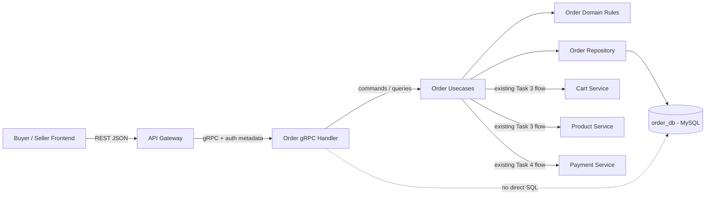
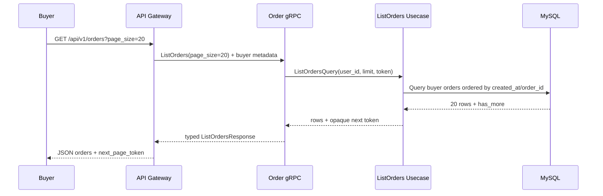
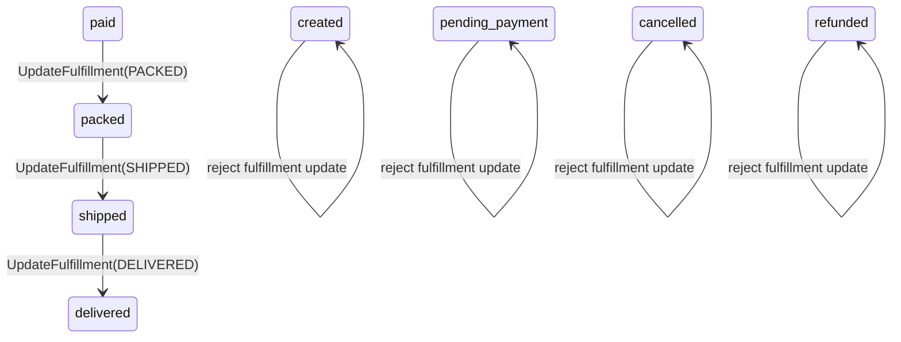
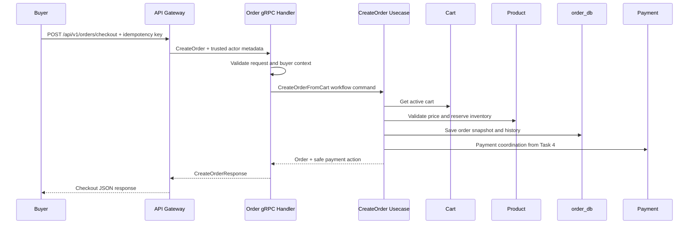
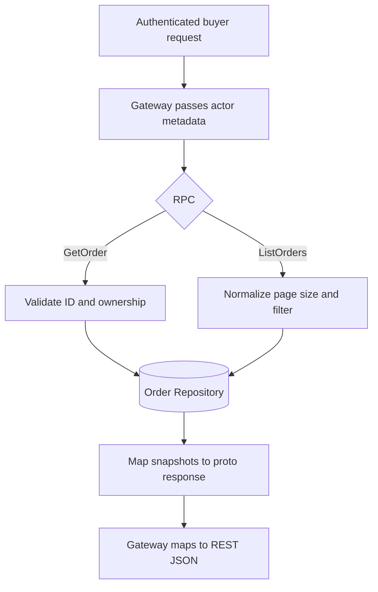

# 🔌 Order Service - Task 5: Implement Order gRPC


## 📌 Task Summary

| Field | Detail |
|---|---|
| Task Name | Implement order gRPC |
| Source | `docs/01-micro-tasks.md` → `Order Service` → Task 5 |
| Priority | `P1` core business feature |
| Dependency | Platform Foundation: Proto strategy |
| Previous Handoff | Task 1 lifecycle, Task 2 schema, Task 3 cart-to-order usecase, Task 4 payment coordination |
| Main Goal | Order application capabilities ko typed internal gRPC API ke through expose karna |
| Required Operations | `CreateOrder`, `GetOrder`, `ListOrders`, `UpdateFulfillment` |
| Project Naming Alignment | Wire RPC `CreateOrder` hoga; existing `CreateOrderFromCart` naam underlying cart-based usecase ko describe karega |
| Output Type | Documentation-only implementation guide with implementation-ready examples |
| Not Included | Actual proto/Go files, seller order view, idempotency enforcement, event emission, public REST handler |

> **Simple Hinglish goal:** Task 3 aur Task 4 me order banane aur payment coordinate karne ka business flow define ho chuka hai. Task 5 me hum us logic ko dobara handler ke andar nahi likhenge. Hum ek clean gRPC boundary design karenge jisse API Gateway ya trusted internal services typed request bhej kar order create, read, list, aur fulfillment update kar sakein.

---

## ✅ Final Output Created

```text
TaskImplementation/
└── Order Service/
    ├── task1.md
    ├── task2.md
    ├── task3.md
    ├── task4.md
    └── task5.md
```

- `TaskImplementation/` existing task guide root ko retain karta hai.
- `Order Service/` existing sequential Order Service guides ko retain karta hai.
- `task5.md` sirf **Order Service - Task 5** ki implementation guide hai.

> 🟢 **Important:** Requested output documentation file hai. Is task me `proto/`, `backend/`, migration, generated stub, gateway, event, ya runtime code file create/edit nahi ki gayi.

---

## 🧭 Requirement Sources Studied

| Source | Task 5 ke liye liya gaya decision |
|---|---|
| `docs/01-micro-tasks.md` | Task 5 ka exact scope: `CreateOrder`, `GetOrder`, `ListOrders`, `UpdateFulfillment` gRPC methods |
| `docs/02-system-architecture.md` | Gateway → Order internal gRPC flow, deadline rule, checkout sequence |
| `docs/03-folder-structure.md` | `proto/ecommerce/order/v1/order.proto`, generated Go code, aur `internal/transport/grpc/` locations |
| `docs/04-microservice-design.md` | Existing checkout workflow vocabulary: `CreateOrderFromCart`, plus read/fulfillment operations |
| `docs/13-developer-guide.md` | Proto update → generated clients → handler → test workflow |
| `TaskImplementation/Platform Foundation/task2.md` | Versioned proto packages, Buf generation, and `ecommerce.<service>.v1` convention |
| `TaskImplementation/Order Service/task1.md` | Allowed order lifecycle transitions |
| `TaskImplementation/Order Service/task2.md` | `orders`, `order_items`, `order_status_history`, `shipments` persistence base |
| `TaskImplementation/Order Service/task3.md` | `CreateOrderFromCart` application workflow and price/inventory rules |
| `TaskImplementation/Order Service/task4.md` | Payment-related state handoff and trusted internal result boundary |

---

## 🧱 Task Boundary

### ✅ Included in Task 5

- Versioned Order gRPC contract ka recommended design
- Task-required create/read/list/fulfillment operations ka transport contract
- `CreateOrder` versus `CreateOrderFromCart` naming alignment
- Generated gRPC server interface ko Order Service handler se implement karne ka pattern
- Proto request ko usecase command me map karna
- Usecase result ko proto response me map karna
- Buyer context, seller/internal context, validation, deadlines, and error codes
- Pagination-aware buyer order list contract
- Fulfillment update transport flow and lifecycle guard handoff
- Unit/integration/contract test examples
- Required tools/libraries, install commands, and usage workflow

### 🚫 Not Included in Task 5

| Outside Scope | Correct Owner / Task |
|---|---|
| Cart validation, price snapshot, and inventory reserve logic dobara implement karna | Already specified in Order Task 3 |
| Payment provider/webhook logic implement karna | Payment Service and Order Task 4 boundary |
| Seller-specific `ListSellerOrders` query aur multi-seller splitting | Order Task 6 |
| Duplicate checkout rokne ke liye durable idempotency enforcement | Order Task 7 |
| `OrderCreated`, `OrderPaid`, `OrderDelivered` events publish karna | Order Task 8 |
| Gateway ka public REST `/api/v1/orders/...` handler banana | Platform/Gateway implementation |
| Actual backend/proto source files create karna | Current requested output documentation-only hai |

> 🔴 **Scope rule:** gRPC handler protocol adapter hai. Handler request parse/map karega aur existing application usecase invoke karega; business rules handler me duplicate nahi honge.

---

## 🔎 Naming Alignment: `CreateOrder` vs `CreateOrderFromCart`

Requirement table me method ko **`CreateOrder`** diya gaya hai. Project ke detailed service design aur checkout flow me same buyer action ko checkout-specific naam **`CreateOrderFromCart`** se describe kiya gaya hai.

| Requirement Operation | Task 5 gRPC RPC | Underlying Usecase | Reason |
|---|---|---|---|
| `CreateOrder` | `CreateOrder` | `CreateOrderFromCart` | Task 5 ke exact RPC requirement ko honor karta hai aur Task 3 workflow reuse karta hai |
| `GetOrder` | `GetOrder` | `GetOrder` | Same name already consistent hai |
| `ListOrders` | `ListOrders` | `ListOrders` | Same name already consistent hai |
| `UpdateFulfillment` | `UpdateFulfillment` | `UpdateFulfillment` | Same name already consistent hai |

> 🟡 **Decision:** Duplicate `CreateOrder` aur `CreateOrderFromCart` RPCs expose nahi karne. Task 5 contract me required wire method `CreateOrder` hoga; handler ke peeche Task 3 ka cart-based `CreateOrderFromCart` workflow execute hoga. Isse exact requirement bhi meet hoti hai aur existing business meaning bhi preserve hota hai.

---

## 🔗 Earlier Tasks Se Handoff

Task 5 transport layer neeche wali existing application responsibilities ko call karegi:

| Capability | Pehle Define Hua | gRPC Handler Kya Karega |
|---|---|---|
| Order lifecycle transition | Task 1 | Domain error ko gRPC status me map karega |
| Order/item/history persistence | Task 2 | Read/list result ko proto response me map karega |
| Cart se order create | Task 3 | `CreateOrder` request ko `CreateOrderFromCart` usecase ko dega |
| Payment coordination | Task 4 | Create response me allowed payment handoff return karega; provider logic nahi likhega |

---

## 🧩 Architecture

### Runtime Boundary



### Layer Responsibility

| Layer | Responsibility | Kya nahi karega |
|---|---|---|
| API Gateway | REST auth/routing aur generated gRPC client call | Order lifecycle decide nahi karega |
| gRPC Transport | Proto validate/map, context pass, errors map | DB queries ya payment rules nahi likhega |
| Usecase | Checkout/read/list/fulfillment workflow | Proto transport details nahi jaane |
| Domain | Status transitions aur order invariants | gRPC metadata handle nahi kare |
| Repository | MySQL reads/writes aur transaction | Request auth decision nahi kare |

---

## 🗂️ Clean Implementation Folder Structure

### Deliverable created in this task

```text
TaskImplementation/
└── Order Service/
    └── task5.md
```

### Target code structure described by this guide

> Neeche wala structure actual implementation ke waqt create hoga; current task output me ye files add nahi ki gayi hain.

```text
proto/
├── buf.yaml
├── buf.gen.yaml
└── ecommerce/
    ├── common/
    │   └── v1/
    │       ├── money.proto
    │       ├── pagination.proto
    │       └── auth_context.proto
    └── order/
        └── v1/
            └── order.proto

backend/
├── shared/
│   └── gen/
│       └── go/ecommerce/order/v1/
│           ├── order.pb.go
│           └── order_grpc.pb.go
└── services/
    └── order-service/
        ├── go.mod
        ├── cmd/
        │   └── server/
        │       └── main.go
        └── internal/
            ├── authctx/
            │   └── context.go
            ├── domain/
            │   ├── order.go
            │   └── fulfillment.go
            ├── usecase/
            │   ├── contracts.go
            │   ├── create_order_from_cart.go
            │   ├── get_order.go
            │   ├── list_orders.go
            │   └── update_fulfillment.go
            ├── repository/
            │   └── mysql_order_repository.go
            └── transport/
                └── grpc/
                    ├── server.go
                    ├── order_handler.go
                    ├── mapper.go
                    ├── validation.go
                    └── error_mapping.go
```

### Important placement decisions

| Location | Why |
|---|---|
| `proto/ecommerce/order/v1/order.proto` | Contract centralized, versioned, aur consumers ke liye discoverable hai |
| `backend/shared/gen/go/...` | Generated contract ek shared import point deta hai |
| `internal/transport/grpc/` | Transport mapping business logic se separate rehti hai |
| `internal/usecase/` | Task 3/4 workflows transport-independent rehte hain |
| `internal/repository/` | Order DB sirf Order Service access karta hai |

---

## 🪜 Step-by-Step Implementation

## Step 1: Contract-First Approach Rakho

Pehle decide karo ki internal consumers ko exactly kya request/response milega. Task 5 ka primary consumer API Gateway hoga; trusted service calls bhi isi typed contract se aayenge.

### Method contract

| RPC | Caller | Intent | Minimum Authorization |
|---|---|---|---|
| `CreateOrder` | Gateway for buyer | Validated cart se checkout order create/start karna | Authenticated buyer |
| `GetOrder` | Gateway for buyer/admin | Ek order detail read karna | Buyer owns order ya authorized admin |
| `ListOrders` | Gateway for buyer | Current buyer ke orders paginate karna | Authenticated buyer |
| `UpdateFulfillment` | Gateway/internal fulfillment actor | Valid next fulfillment status apply karna | Authorized seller/admin/internal actor |

**Hinglish explanation:** Proto API me caller `user_id` ko freely claim nahi kar sakta. Gateway authentication ke baad signed/trusted metadata inject karega aur Order Service us context ke against request validate karega.

---

## Step 2: Versioned Proto Contract Define Karo

Platform proto convention ke according package `ecommerce.order.v1` rahega. `v1` ka matlab contract ko backward-compatible tarike se evolve karna hai.

### `order.proto` implementation example

```proto
syntax = "proto3";

package ecommerce.order.v1;

option go_package = "github.com/example/ecommerce-platform/backend/shared/gen/go/ecommerce/order/v1;orderv1";

import "google/protobuf/timestamp.proto";

service OrderService {
  // Handler existing cart-based create-order workflow ko delegate karta hai.
  rpc CreateOrder(CreateOrderRequest) returns (CreateOrderResponse);
  rpc GetOrder(GetOrderRequest) returns (GetOrderResponse);
  rpc ListOrders(ListOrdersRequest) returns (ListOrdersResponse);
  rpc UpdateFulfillment(UpdateFulfillmentRequest) returns (UpdateFulfillmentResponse);
}

enum OrderStatus {
  ORDER_STATUS_UNSPECIFIED = 0;
  ORDER_STATUS_CREATED = 1;
  ORDER_STATUS_PENDING_PAYMENT = 2;
  ORDER_STATUS_PAID = 3;
  ORDER_STATUS_PACKED = 4;
  ORDER_STATUS_SHIPPED = 5;
  ORDER_STATUS_DELIVERED = 6;
  ORDER_STATUS_CANCELLED = 7;
  ORDER_STATUS_REFUNDED = 8;
  ORDER_STATUS_PAYMENT_FAILED = 9;
}

message Money {
  int64 minor_units = 1;
  string currency = 2;
}

message AddressSnapshot {
  string recipient_name = 1;
  string phone = 2;
  string line1 = 3;
  string line2 = 4;
  string city = 5;
  string state = 6;
  string postal_code = 7;
  string country_code = 8;
}

message OrderItem {
  string order_item_id = 1;
  string product_id = 2;
  string variant_id = 3;
  string seller_id = 4;
  string product_name = 5;
  int32 quantity = 6;
  Money unit_price = 7;
  Money line_total = 8;
}

message Order {
  string order_id = 1;
  string user_id = 2;
  OrderStatus status = 3;
  repeated OrderItem items = 4;
  Money total = 5;
  AddressSnapshot shipping_address = 6;
  string payment_id = 7;
  google.protobuf.Timestamp created_at = 8;
  google.protobuf.Timestamp updated_at = 9;
}

message CreateOrderRequest {
  string cart_id = 1;
  AddressSnapshot shipping_address = 2;
  string idempotency_key = 3;
}

message PaymentAction {
  string payment_id = 1;
  string client_action_token = 2;
  google.protobuf.Timestamp expires_at = 3;
}

message CreateOrderResponse {
  Order order = 1;
  PaymentAction payment_action = 2;
}

message GetOrderRequest {
  string order_id = 1;
}

message GetOrderResponse {
  Order order = 1;
}

message ListOrdersRequest {
  int32 page_size = 1;
  string page_token = 2;
  OrderStatus status_filter = 3;
}

message ListOrdersResponse {
  repeated Order orders = 1;
  string next_page_token = 2;
}

message UpdateFulfillmentRequest {
  string order_id = 1;
  OrderStatus target_status = 2;
  string tracking_number = 3;
  string carrier = 4;
  string note = 5;
}

message UpdateFulfillmentResponse {
  Order order = 1;
}
```

### Proto design explanation

| Design | Why |
|---|---|
| `Money.minor_units` uses `int64` | Currency totals me floating-point rounding error nahi aayega |
| `AddressSnapshot` request me hai | Purchase-time shipping detail immutable snapshot ban sakti hai |
| Request me `user_id` nahi | Buyer identity trusted auth metadata se aayegi, client payload se nahi |
| `idempotency_key` contract me hai | Checkout retry key carry karna zaroori hai; durable enforcement Task 7 ka kaam hai |
| `OrderStatus` enum typed hai | Arbitrary invalid string status transport se enter nahi hoga |
| `payment_action` create response me optional-purpose field hai | Task 4 ke payment handoff ko carry kar sake, provider implementation expose kiye bina |
| `page_token` cursor-style hai | Growing order history me offset pagination ke inconsistent pages se bachne ka design |

> 🟡 **Shared proto note:** Actual platform implementation me `Money` aur pagination messages `ecommerce/common/v1` se import kiye ja sakte hain, jaise proto strategy define karti hai. Example ko ek jagah readable rakhne ke liye messages yahan visible hain.

---

## Step 3: RPC Ownership Aur Data Rules Fix Karo

### `CreateOrder`

| Input | Rule |
|---|---|
| Auth context | `buyer` role aur trusted `user_id` mandatory |
| `cart_id` | Blank nahi; buyer ke active cart se belong karna usecase validate karega |
| `shipping_address` | Required fields validate honge |
| `idempotency_key` | Blank nahi; enforcement Task 7 me, contract Task 5 me carry hoga |

| Output | Meaning |
|---|---|
| `order` | Server-calculated order snapshot |
| `payment_action` | Payment coordination successful hone par client ke next action ke liye safe details |

### `GetOrder`

| Rule | Explanation |
|---|---|
| `order_id` required | Empty lookup reject karo |
| Ownership check mandatory | Buyer sirf apna order dekh sake |
| Internal/admin access | Trusted role policy se allow hoga; arbitrary metadata se nahi |
| Item snapshot return | Current product title/price ke bajay purchased snapshot return hoga |

### `ListOrders`

| Rule | Explanation |
|---|---|
| User identity metadata se | Request me kisi aur buyer ka ID inject nahi hoga |
| `page_size` cap | Example: default `20`, maximum `100` |
| Status filter optional | Valid enum hi accept karo |
| Token opaque | Client DB timestamp/ID parsing assume na kare |

### `UpdateFulfillment`

| Rule | Explanation |
|---|---|
| Authorized actor only | Seller/admin/internal fulfillment identity validate honi chahiye |
| Allowed statuses only | Task 5 endpoint `packed`, `shipped`, `delivered` update expose kare |
| Domain transition check | Example: `paid → packed → shipped → delivered`; invalid jump reject |
| History write | Status update ke saath audit trail repository transaction me append ho |
| Seller item split | Seller-specific partial order projection Task 6 me rahega |

---

## Step 4: Generate Typed gRPC Stubs

Contract likhne ke baad generated Go server/client types use honge. Handwritten request structs ke saath network boundary banana unnecessary duplication create karta hai.

### Generation workflow

```bash
buf lint
buf generate
```

Expected generated files:

```text
backend/shared/gen/go/ecommerce/order/v1/
├── order.pb.go
└── order_grpc.pb.go
```

| Generated File | Kya deta hai |
|---|---|
| `order.pb.go` | Proto messages aur enums ke Go types |
| `order_grpc.pb.go` | `OrderServiceServer`, registration function, aur client interface |

> 🟢 **Rule:** Generated `.pb.go` files manually edit nahi karne. Contract change karo, phir generation command rerun karo.

---

## Step 5: Usecase Ports Define Karo

Transport ko concrete MySQL repository aur Cart/Payment clients ka knowledge nahi chahiye. Handler narrow usecase interfaces receive karega.

### `contracts.go` example

```go
package usecase

import (
	"context"
	"time"
)

type CreateOrderCommand struct {
	UserID          string
	CartID          string
	IdempotencyKey  string
	ShippingAddress AddressSnapshot
}

type CreateOrderResult struct {
	Order         OrderView
	PaymentAction *PaymentActionView
}

type GetOrderQuery struct {
	ActorID string
	OrderID string
	Roles   []string
}

type ListOrdersQuery struct {
	UserID       string
	PageSize     int
	PageToken    string
	StatusFilter string
}

type UpdateFulfillmentCommand struct {
	ActorID        string
	Roles          []string
	OrderID        string
	TargetStatus   string
	TrackingNumber string
	Carrier        string
	Note           string
	OccurredAt     time.Time
}

type CreateOrderUsecase interface {
	Execute(context.Context, CreateOrderCommand) (CreateOrderResult, error)
}

type GetOrderUsecase interface {
	Execute(context.Context, GetOrderQuery) (OrderView, error)
}

type ListOrdersUsecase interface {
	Execute(context.Context, ListOrdersQuery) (OrderPage, error)
}

type UpdateFulfillmentUsecase interface {
	Execute(context.Context, UpdateFulfillmentCommand) (OrderView, error)
}
```

**Kaise built hai:** Handler proto fields se command banayega. Usecase ko proto enum, generated server, ya metadata implementation pata nahi chalegi. Isi wajah se application logic unit-test karna easy rahega.

---

## Step 6: Auth Context Metadata Se Read Karo

API Gateway public JWT validate karke internal gRPC metadata me authenticated actor details forward karega. Order Service ko sensitive operations par is trusted context ko enforce karna hoga.

### Recommended metadata

| Metadata Key | Example | Use |
|---|---|---|
| `x-user-id` | `usr_123` | Buyer/actor identity |
| `x-roles` | `buyer` or `seller,order_manager` | Authorization |
| `x-request-id` | `req_abc` | Logs/traces correlation |
| `x-session-id` | `sess_456` | Audit and security correlation |

### Context extraction example

```go
type Actor struct {
	UserID    string
	Roles     []string
	RequestID string
	SessionID string
}

func actorFromContext(ctx context.Context) (Actor, error) {
	md, ok := metadata.FromIncomingContext(ctx)
	if !ok {
		return Actor{}, ErrUnauthenticated
	}

	userID := first(md.Get("x-user-id"))
	if userID == "" {
		return Actor{}, ErrUnauthenticated
	}

	return Actor{
		UserID:    userID,
		Roles:     strings.Split(first(md.Get("x-roles")), ","),
		RequestID: first(md.Get("x-request-id")),
		SessionID: first(md.Get("x-session-id")),
	}, nil
}
```

> 🔴 **Security rule:** Request body se aaye `user_id`, seller ownership, ya role ko authorization proof nahi maana jayega. Internal metadata bhi mTLS/interceptor/trusted network policy ke saath protect honi chahiye.

---

## Step 7: gRPC Server Construct Karo

Generated interface implement karne ke liye handler me embedded unimplemented server aur injected usecases rakho.

### `server.go` example

```go
package grpc

import (
	orderv1 "github.com/example/ecommerce-platform/backend/shared/gen/go/ecommerce/order/v1"
	"github.com/example/ecommerce-platform/backend/services/order-service/internal/usecase"
)

type Server struct {
	orderv1.UnimplementedOrderServiceServer
	createOrder       usecase.CreateOrderUsecase
	getOrder          usecase.GetOrderUsecase
	listOrders        usecase.ListOrdersUsecase
	updateFulfillment usecase.UpdateFulfillmentUsecase
}

func NewServer(
	createOrder usecase.CreateOrderUsecase,
	getOrder usecase.GetOrderUsecase,
	listOrders usecase.ListOrdersUsecase,
	updateFulfillment usecase.UpdateFulfillmentUsecase,
) *Server {
	return &Server{
		createOrder:       createOrder,
		getOrder:          getOrder,
		listOrders:        listOrders,
		updateFulfillment: updateFulfillment,
	}
}
```

### Why injection?

| Benefit | Explanation |
|---|---|
| Testability | Handler tests fake usecases ke saath bina MySQL ke run kar sakte hain |
| Separation | Handler transport ka code hai; workflow usecase me rehta hai |
| Maintainability | RPC contract badalne par domain logic unnecessarily rewrite nahi hota |

---

## Step 8: `CreateOrder` Handler Map Karo

`CreateOrder` RPC Task 3 ke `CreateOrderFromCart` workflow aur Task 4 ke payment handoff ko invoke karta hai; handler un rules ko reimplement nahi karta.

### Handler example

```go
func (s *Server) CreateOrder(
	ctx context.Context,
	req *orderv1.CreateOrderRequest,
) (*orderv1.CreateOrderResponse, error) {
	actor, err := actorFromContext(ctx)
	if err != nil {
		return nil, toStatusError(err)
	}
	if !hasRole(actor.Roles, "buyer") {
		return nil, status.Error(codes.PermissionDenied, "buyer role required")
	}
	if err := validateCreateOrderRequest(req); err != nil {
		return nil, toStatusError(err)
	}

	result, err := s.createOrder.Execute(ctx, usecase.CreateOrderCommand{
		UserID:         actor.UserID,
		CartID:         req.GetCartId(),
		IdempotencyKey: req.GetIdempotencyKey(),
		ShippingAddress: usecase.AddressSnapshot{
			RecipientName: req.GetShippingAddress().GetRecipientName(),
			Phone:         req.GetShippingAddress().GetPhone(),
			Line1:         req.GetShippingAddress().GetLine1(),
			City:          req.GetShippingAddress().GetCity(),
			State:         req.GetShippingAddress().GetState(),
			PostalCode:    req.GetShippingAddress().GetPostalCode(),
			CountryCode:   req.GetShippingAddress().GetCountryCode(),
		},
	})
	if err != nil {
		return nil, toStatusError(err)
	}

	return &orderv1.CreateOrderResponse{
		Order:         mapOrder(result.Order),
		PaymentAction: mapPaymentAction(result.PaymentAction),
	}, nil
}
```

### Handler ke andar kya hua?

1. Trusted actor context read hua.
2. Buyer role validate hui.
3. Required proto fields validate hue.
4. Proto request ko clean usecase command me convert kiya.
5. Existing create-order workflow call hua.
6. Domain result ko typed proto response me convert kiya.

### Handler ke andar kya nahi hua?

- Cart ka price manually calculate nahi hua.
- Product inventory directly reserve nahi hui.
- MySQL query execute nahi hui.
- Payment provider SDK call nahi hua.
- Duplicate key persistence implement nahi hui.

---

## Step 9: `GetOrder` Handler Implement Karo

Read endpoint bhi authorization-sensitive hai. Kisi user ko sirf `order_id` guess karke dusre buyer ka order nahi milna chahiye.

```go
func (s *Server) GetOrder(
	ctx context.Context,
	req *orderv1.GetOrderRequest,
) (*orderv1.GetOrderResponse, error) {
	actor, err := actorFromContext(ctx)
	if err != nil {
		return nil, toStatusError(err)
	}
	if req.GetOrderId() == "" {
		return nil, status.Error(codes.InvalidArgument, "order_id is required")
	}

	order, err := s.getOrder.Execute(ctx, usecase.GetOrderQuery{
		ActorID: actor.UserID,
		OrderID: req.GetOrderId(),
		Roles:   actor.Roles,
	})
	if err != nil {
		return nil, toStatusError(err)
	}

	return &orderv1.GetOrderResponse{Order: mapOrder(order)}, nil
}
```

| Situation | Safe result |
|---|---|
| Buyer owns order | Order snapshot return |
| Order missing | `NotFound` |
| Buyer does not own order | `PermissionDenied` ya policy-defined masked `NotFound` |
| DB unavailable | `Unavailable` without leaking SQL details |

---

## Step 10: `ListOrders` Pagination Implement Karo

Buyer listing me `user_id` auth context se aata hai. Request me page controls aur optional status filter aate hain.

```go
const (
	defaultPageSize = 20
	maxPageSize     = 100
)

func (s *Server) ListOrders(
	ctx context.Context,
	req *orderv1.ListOrdersRequest,
) (*orderv1.ListOrdersResponse, error) {
	actor, err := actorFromContext(ctx)
	if err != nil {
		return nil, toStatusError(err)
	}

	pageSize, err := normalizePageSize(req.GetPageSize(), defaultPageSize, maxPageSize)
	if err != nil {
		return nil, toStatusError(err)
	}

	page, err := s.listOrders.Execute(ctx, usecase.ListOrdersQuery{
		UserID:       actor.UserID,
		PageSize:     pageSize,
		PageToken:    req.GetPageToken(),
		StatusFilter: mapStatusFromProto(req.GetStatusFilter()),
	})
	if err != nil {
		return nil, toStatusError(err)
	}

	return &orderv1.ListOrdersResponse{
		Orders:        mapOrders(page.Orders),
		NextPageToken: page.NextPageToken,
	}, nil
}
```

### Pagination flow



> 🟡 **Task boundary:** `ListOrders` buyer history hai. Seller ke item-scoped order list ke liye `ListSellerOrders` Task 6 me detail hoga.

---

## Step 11: `UpdateFulfillment` Handler Implement Karo

Fulfillment endpoint status transition request accept karta hai, lekin final permission aur transition rule usecase/domain layer enforce karte hain.

```go
func (s *Server) UpdateFulfillment(
	ctx context.Context,
	req *orderv1.UpdateFulfillmentRequest,
) (*orderv1.UpdateFulfillmentResponse, error) {
	actor, err := actorFromContext(ctx)
	if err != nil {
		return nil, toStatusError(err)
	}
	if !hasAnyRole(actor.Roles, "seller", "order_manager", "admin", "logistics") {
		return nil, status.Error(codes.PermissionDenied, "fulfillment role required")
	}
	if err := validateFulfillmentRequest(req); err != nil {
		return nil, toStatusError(err)
	}

	order, err := s.updateFulfillment.Execute(ctx, usecase.UpdateFulfillmentCommand{
		ActorID:        actor.UserID,
		Roles:          actor.Roles,
		OrderID:        req.GetOrderId(),
		TargetStatus:   mapStatusFromProto(req.GetTargetStatus()),
		TrackingNumber: req.GetTrackingNumber(),
		Carrier:        req.GetCarrier(),
		Note:           req.GetNote(),
		OccurredAt:     time.Now().UTC(),
	})
	if err != nil {
		return nil, toStatusError(err)
	}

	return &orderv1.UpdateFulfillmentResponse{Order: mapOrder(order)}, nil
}
```

### Fulfillment status flow



### Validation examples

| Request | Result |
|---|---|
| `paid → packed` by authorized actor | Accept |
| `packed → shipped` without tracking number | Reject if shipping policy requires tracking |
| `paid → delivered` direct jump | `FailedPrecondition` |
| `cancelled → shipped` | `FailedPrecondition` |
| Buyer calls fulfillment update | `PermissionDenied` |

> 🟠 **Multi-seller note:** Task 5 transport method expose karta hai. Seller ke sirf apne item/parcel ko update karne aur split-order aggregation ka full implementation Task 6 ke scope me rahega.

---

## Step 12: Proto ↔ Domain Mapping Centralize Karo

Mapping functions alag file me rakhne se handlers short aur consistent rahenge.

### Status mapping example

```go
func mapStatusToProto(status domain.OrderStatus) orderv1.OrderStatus {
	switch status {
	case domain.OrderStatusCreated:
		return orderv1.OrderStatus_ORDER_STATUS_CREATED
	case domain.OrderStatusPendingPayment:
		return orderv1.OrderStatus_ORDER_STATUS_PENDING_PAYMENT
	case domain.OrderStatusPaid:
		return orderv1.OrderStatus_ORDER_STATUS_PAID
	case domain.OrderStatusPacked:
		return orderv1.OrderStatus_ORDER_STATUS_PACKED
	case domain.OrderStatusShipped:
		return orderv1.OrderStatus_ORDER_STATUS_SHIPPED
	case domain.OrderStatusDelivered:
		return orderv1.OrderStatus_ORDER_STATUS_DELIVERED
	case domain.OrderStatusCancelled:
		return orderv1.OrderStatus_ORDER_STATUS_CANCELLED
	case domain.OrderStatusRefunded:
		return orderv1.OrderStatus_ORDER_STATUS_REFUNDED
	case domain.OrderStatusPaymentFailed:
		return orderv1.OrderStatus_ORDER_STATUS_PAYMENT_FAILED
	default:
		return orderv1.OrderStatus_ORDER_STATUS_UNSPECIFIED
	}
}
```

### Order mapping example

```go
func mapMoney(amount int64, currency string) *orderv1.Money {
	return &orderv1.Money{MinorUnits: amount, Currency: currency}
}

func mapOrder(order usecase.OrderView) *orderv1.Order {
	return &orderv1.Order{
		OrderId:   order.OrderID,
		UserId:    order.UserID,
		Status:    mapStatusToProto(order.Status),
		Items:     mapItems(order.Items),
		Total:     mapMoney(order.TotalMinorUnits, order.Currency),
		PaymentId: order.PaymentID,
		CreatedAt: timestamppb.New(order.CreatedAt),
		UpdatedAt: timestamppb.New(order.UpdatedAt),
	}
}
```

**Why built this way:** DB/internal domain values change karne par transport response mapping ek predictable place par update hoti hai. Proto types ko domain entity ke andar mix karne se clean architecture break hoti.

---

## Step 13: Validation Rules Add Karo

Transport-level validation cheap malformed requests ko early reject karti hai. Business-level validation fir bhi usecase/domain me mandatory rahegi.

| RPC | Transport Validation | Business Validation |
|---|---|---|
| Create | non-empty cart/key, shipping fields format | cart ownership, fresh price, inventory, order/payment workflow |
| Get | non-empty `order_id` | owner/admin access, record exists |
| List | valid page size, enum parse | actor-specific filtering and cursor query |
| Update fulfillment | order ID, allowed requested status, required shipment fields | actor ownership, legal status transition, transactional history update |

### Validation example

```go
func validateFulfillmentRequest(req *orderv1.UpdateFulfillmentRequest) error {
	if req.GetOrderId() == "" {
		return ErrInvalidOrderID
	}

	switch req.GetTargetStatus() {
	case orderv1.OrderStatus_ORDER_STATUS_PACKED:
		return nil
	case orderv1.OrderStatus_ORDER_STATUS_SHIPPED:
		if req.GetTrackingNumber() == "" || req.GetCarrier() == "" {
			return ErrTrackingRequired
		}
		return nil
	case orderv1.OrderStatus_ORDER_STATUS_DELIVERED:
		return nil
	default:
		return ErrInvalidFulfillmentStatus
	}
}
```

---

## Step 14: Domain Errors Ko gRPC Codes Me Map Karo

Clients ko raw SQL errors, internal client failures, ya stack trace nahi bhejni. Stable gRPC status codes Gateway ko clean REST response banana allow karte hain.

| Domain Situation | gRPC Code | Example Gateway HTTP Mapping |
|---|---|---|
| Auth metadata missing/invalid | `Unauthenticated` | `401 Unauthorized` |
| Role/ownership denied | `PermissionDenied` | `403 Forbidden` |
| Required field invalid | `InvalidArgument` | `400 Bad Request` |
| Order not found | `NotFound` | `404 Not Found` |
| Invalid lifecycle transition | `FailedPrecondition` | `409 Conflict` |
| Retry conflict / duplicate work | `AlreadyExists` or `Aborted` | `409 Conflict` |
| Database or downstream temporarily down | `Unavailable` | `503 Service Unavailable` |
| Request deadline exceeded | `DeadlineExceeded` | `504 Gateway Timeout` |
| Unknown internal error | `Internal` | `500 Internal Server Error` |

### Mapping example

```go
func toStatusError(err error) error {
	switch {
	case errors.Is(err, domain.ErrUnauthenticated):
		return status.Error(codes.Unauthenticated, "authentication required")
	case errors.Is(err, domain.ErrForbidden):
		return status.Error(codes.PermissionDenied, "operation not allowed")
	case errors.Is(err, domain.ErrOrderNotFound):
		return status.Error(codes.NotFound, "order not found")
	case errors.Is(err, domain.ErrInvalidInput):
		return status.Error(codes.InvalidArgument, "invalid request")
	case errors.Is(err, domain.ErrInvalidTransition):
		return status.Error(codes.FailedPrecondition, "order status transition is not allowed")
	case errors.Is(err, domain.ErrTemporarilyUnavailable):
		return status.Error(codes.Unavailable, "order service temporarily unavailable")
	default:
		return status.Error(codes.Internal, "internal order service error")
	}
}
```

---

## Step 15: Deadlines, Interceptors, Aur Observability Wire Karo

gRPC server ko sirf functional nahi, diagnosable aur protected bhi hona chahiye.

### Interceptor chain


| Concern | Implementation Idea |
|---|---|
| Deadline | Gateway checkout call aur reads par finite deadline set kare; handler `ctx` downstream pass kare |
| Recovery | Panic ko `Internal` me convert karo aur safe log emit karo |
| Request ID | `x-request-id` propagate ya generate karke logs me include karo |
| Trace | Gateway → Order → dependency spans correlate karo |
| Metrics | RPC latency/count/status measure karo |
| Logging | `order_id`, RPC, status code, actor ID log karo; address/payment secrets log mat karo |

### Useful metrics

| Metric | Purpose |
|---|---|
| `grpc_server_requests_total{service,method,code}` | RPC success/failure count |
| `grpc_server_duration_seconds{method}` | Slow endpoint diagnose karna |
| `order_create_failures_total{reason}` | Checkout problem detect karna |
| `fulfillment_transition_rejected_total{reason}` | Invalid update patterns monitor karna |

---

## Step 16: Server Registration Aur Startup Wire Karo

Transport implementation ko runnable service me register karne ka shape:

```go
func run(ctx context.Context, cfg Config) error {
	listener, err := net.Listen("tcp", cfg.GRPCAddress)
	if err != nil {
		return err
	}

	grpcServer := grpc.NewServer(
		grpc.ChainUnaryInterceptor(
			recoveryInterceptor(),
			requestIDInterceptor(),
			authContextInterceptor(),
			loggingInterceptor(),
		),
	)

	orderHandler := ordergrpc.NewServer(
		createOrderUsecase,
		getOrderUsecase,
		listOrdersUsecase,
		updateFulfillmentUsecase,
	)

	orderv1.RegisterOrderServiceServer(grpcServer, orderHandler)
	return grpcServer.Serve(listener)
}
```

### Configuration example

```env
SERVICE_NAME=order-service
ORDER_GRPC_ADDR=:9094
ORDER_MYSQL_DSN=order_user:password@tcp(mysql:3306)/order_db?parseTime=true
CART_GRPC_TARGET=cart-service:9090
PRODUCT_GRPC_TARGET=product-service:9090
PAYMENT_GRPC_TARGET=payment-service:9090
```

> 🟡 **Secret rule:** Real DSN password secret manager/environment secret se load hoga; repository ya logs me hard-code nahi hoga.

---

## 🔁 End-to-End Flows

### Create Order Flow



### Read/List Flow



### Fulfillment Update Flow

```mermaid
sequenceDiagram
    participant Actor as Seller/Admin/Internal Actor
    participant GW as Gateway
    participant H as Order gRPC Handler
    participant U as UpdateFulfillment Usecase
    participant D as Domain State Machine
    participant DB as order_db

    Actor->>GW: PATCH fulfillment status
    GW->>H: UpdateFulfillment + trusted roles
    H->>H: Validate actor and proto input
    H->>U: UpdateFulfillmentCommand
    U->>D: Validate current -> target status
    D-->>U: Allowed
    U->>DB: Update order/shipment + append history in transaction
    DB-->>U: Updated order
    U-->>H: Order view
    H-->>GW: UpdateFulfillmentResponse
```

---

## 📦 External Libraries / Tools

### Used for this documentation deliverable

| Tool | Kya hai | Kyun use hua | Install / Use |
|---|---|---|---|
| Markdown | Text documentation format | Git-friendly readable guide | Markdown viewer me file open karein |
| Mermaid | Markdown-friendly diagram syntax | Architecture aur sequence diagrams readable banane ke liye | Mermaid-enabled Markdown renderer; separate backend dependency nahi |
| Shields.io badges | Hosted badge images | Scope/status visually scan karne ke liye | Markdown image URLs directly render hote hain |

### Recommended for actual Task 5 code implementation

| Library / Tool | What | Why Needed | Install |
|---|---|---|---|
| Protocol Buffers | Typed RPC schema format | Stable request/response contract define karne ke liye | Buf workflow plugins se generate karein |
| Buf CLI | Proto lint/generation/breaking checks tool | Contract-first workflow consistent rakhne ke liye | Official Buf install ya `brew install bufbuild/buf/buf` |
| `google.golang.org/grpc` | Go gRPC runtime | Server, client, interceptors, status codes ke liye | `go get google.golang.org/grpc` |
| `google.golang.org/protobuf` | Go protobuf runtime | Generated messages aur timestamps ke liye | `go get google.golang.org/protobuf` |
| `github.com/go-sql-driver/mysql` | Go MySQL driver | Repository layer se `order_db` access ke liye | `go get github.com/go-sql-driver/mysql` |

### Install and use commands

```bash
# Proto contract validation and generation
buf lint
buf generate

# Go service runtime dependencies
go get google.golang.org/grpc
go get google.golang.org/protobuf
go get github.com/go-sql-driver/mysql

# Backend tests after actual source implementation
go test ./...
```

### Basic gRPC use example

Gateway-generated client roughly is tarah call karega:

```go
ctx, cancel := context.WithTimeout(parentCtx, 1500*time.Millisecond)
defer cancel()

ctx = metadata.AppendToOutgoingContext(
	ctx,
	"x-user-id", authenticatedUserID,
	"x-roles", "buyer",
	"x-request-id", requestID,
)

resp, err := orderClient.CreateOrder(ctx, &orderv1.CreateOrderRequest{
	CartId:         cartID,
	IdempotencyKey: idempotencyKey,
	ShippingAddress: address,
})
```

> 🟢 **Dependency note:** Libraries upar actual implementation ke liye listed hain. Current requested deliverable me dependencies install nahi ki gayi, kyunki koi executable Order Service source create nahi kiya gaya.

---

## 🧪 Testing Strategy

Task 5 transport layer ke tests business workflow ko duplicate test nahi karenge; woh contract mapping, access checks, status codes, and usecase invocation verify karenge.

### Unit tests: gRPC handler

| Test | Expected Result |
|---|---|
| Create with buyer metadata and valid request | Create usecase correct `UserID`, cart, address, key ke saath called |
| Create without auth metadata | `Unauthenticated` |
| Create without idempotency key | `InvalidArgument` |
| Get own order | Mapped response returned |
| Get forbidden order | `PermissionDenied`/policy-defined `NotFound` |
| List with `page_size=0` | Default page size use hota hai |
| List with too large page size | Capped ya `InvalidArgument`, chosen policy consistently tested |
| Update fulfillment as buyer | `PermissionDenied` |
| Update with invalid target status | `InvalidArgument` |
| Domain rejects `paid → delivered` | `FailedPrecondition` |

### Handler unit test example

```go
func TestCreateOrder_UsesAuthenticatedBuyer(t *testing.T) {
	fake := &fakeCreateOrderUsecase{
		result: usecase.CreateOrderResult{
			Order: usecase.OrderView{OrderID: "ord_123"},
		},
	}
	server := NewServer(fake, nil, nil, nil)

	ctx := metadata.NewIncomingContext(context.Background(), metadata.Pairs(
		"x-user-id", "usr_123",
		"x-roles", "buyer",
	))
	req := &orderv1.CreateOrderRequest{
		CartId:         "cart_123",
		IdempotencyKey: "checkout_key_123",
		ShippingAddress: &orderv1.AddressSnapshot{
			RecipientName: "A User",
			Phone:         "9999999999",
			Line1:         "Street 1",
			City:          "Delhi",
			State:         "Delhi",
			PostalCode:    "110001",
			CountryCode:   "IN",
		},
	}

	resp, err := server.CreateOrder(ctx, req)

	require.NoError(t, err)
	require.Equal(t, "usr_123", fake.got.UserID)
	require.Equal(t, "ord_123", resp.GetOrder().GetOrderId())
}
```

### Integration tests

| Integration Test | Verify |
|---|---|
| Generated client → in-memory gRPC server | Contract registration and response mapping |
| Get/List with test repository | Snapshot and pagination mapping |
| Fulfillment update with transaction repository | Order status plus history write behavior |
| Gateway → Order service test | Metadata/deadline/error mapping compatibility |

### Contract quality checks

```bash
buf lint
buf breaking --against ".git#branch=main"
buf generate
go test ./...
```

> 🟡 **Verification note:** Ye future source implementation ke commands aur test cases hain. Documentation-only change hone ke karan is task me executable order gRPC tests run nahi kiye gaye.

---

## 🛡️ Production Checklist

| Area | Rule |
|---|---|
| Contract | Versioned `ecommerce.order.v1` package use karo |
| Generated code | `.pb.go` manually edit mat karo |
| Auth | Actor identity trusted context se lo, payload se nahi |
| Authorization | Get/list ownership aur fulfillment actor role enforce karo |
| Money | Amount integer minor units me transmit karo |
| Snapshots | Order response purchased price/title/address snapshots return kare |
| State transitions | Domain state machine bypass mat karo |
| Pagination | Max page size enforce aur token opaque rakho |
| Errors | Stable gRPC status bhejo, SQL/internal error leak mat karo |
| Deadlines | RPC context deadlines propagate karo |
| Logs | Request/order IDs log karo; address phone/payment secret avoid karo |
| Idempotency | Create key contract me require karo; persistence enforcement Task 7 me |
| Events | Handler se order events emit add mat karo; Task 8 ka scope hai |

---

## 🚫 Scope Protection Checklist

| Tempting Addition | Task 5 Me Kyun Nahi | Correct Follow-up |
|---|---|---|
| Separate `CreateOrder` plus `CreateOrderFromCart` RPC | Same action ka duplicate contract confusing hoga | Required `CreateOrder` RPC delegates to cart-based usecase |
| Seller-specific list filters/query joins | Seller projection and split handling separate concern hai | Task 6 |
| Idempotency table claim/check/store implementation | Transport sirf key carry karta hai | Task 7 |
| Kafka/RabbitMQ producer call from handler | Async order event publication separate feature hai | Task 8 |
| Payment webhook endpoint | Financial verification Payment Service boundary hai | Payment Service / Task 4 integration |
| Public REST handlers | Gateway owns public HTTP boundary | API Gateway work |

---

## ✅ Acceptance Criteria

| Criteria | Status |
|---|---|
| Existing `TaskImplementation/` folder retained | ✅ Done |
| Existing `TaskImplementation/Order Service/` folder retained | ✅ Done |
| `TaskImplementation/Order Service/task5.md` created | ✅ Done |
| Exact Task 5 operations addressed | ✅ Done |
| `CreateOrder` RPC / `CreateOrderFromCart` usecase alignment explained | ✅ Done |
| Hinglish step-by-step guide included | ✅ Done |
| Clean folder structure included | ✅ Done |
| Architecture, flow, and state diagrams included in Mermaid | ✅ Done |
| Proto and Go examples included | ✅ Done |
| Libraries/tools with why/install/use instructions included | ✅ Done |
| Auth, validation, errors, deadlines, observability documented | ✅ Done |
| Testing strategy documented | ✅ Done |
| No implementation beyond Order Service Task 5 added | ✅ Done |

---

## 🔮 Relation to Other Order Tasks

| Task | Task 5 Se Relation |
|---|---|
| Task 1: Lifecycle | `UpdateFulfillment` valid transitions ke liye domain base |
| Task 2: MySQL schema | Read/list/update usecases ki persistence base |
| Task 3: Cart to order | `CreateOrder` RPC ka underlying `CreateOrderFromCart` workflow |
| Task 4: Payment coordination | Create checkout response ke payment handoff ka application behavior |
| Task 6: Seller order view | Future seller-scoped listing/splitting, Task 5 me nahi |
| Task 7: Idempotency | Create RPC se received key ko durably enforce karega |
| Task 8: Order events | Successful lifecycle operations ke baad async events publish karega |

---

## 🧠 Final Summary

Order Service Task 5 ke liye gRPC implementation blueprint ready hai:

1. Versioned `ecommerce.order.v1` contract internal API boundary banata hai.
2. Task-required `CreateOrder` RPC existing cart-based `CreateOrderFromCart` workflow ko delegate karta hai.
3. `GetOrder`, `ListOrders`, aur `UpdateFulfillment` typed requests/responses ke saath exposed hain.
4. Handler sirf auth context, validation, mapping, usecase invocation, aur gRPC errors handle karta hai.
5. Task 3/4 business flows reuse hote hain; handler me checkout ya payment rules duplicate nahi hote.
6. Security, pagination, deadlines, generated-code workflow, tests, aur tooling beginner-friendly examples ke saath defined hain.

> ✅ **Task 5 complete as requested:** Sirf `TaskImplementation/Order Service/task5.md` documentation deliverable create hua hai. Seller views, durable idempotency enforcement, event publishing, actual proto/backend code, aur Gateway REST implementation is scope me add nahi kiye gaye.
