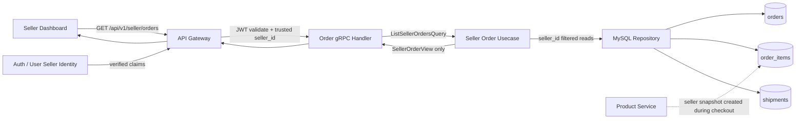
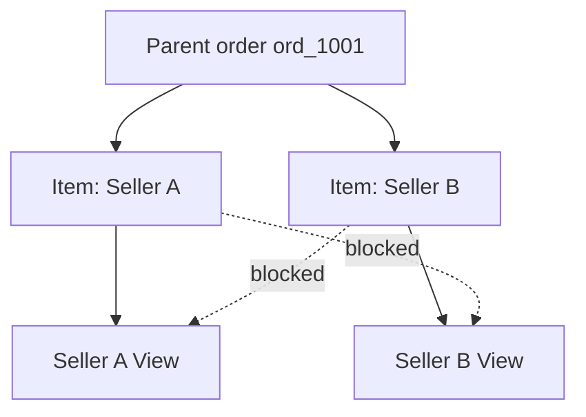
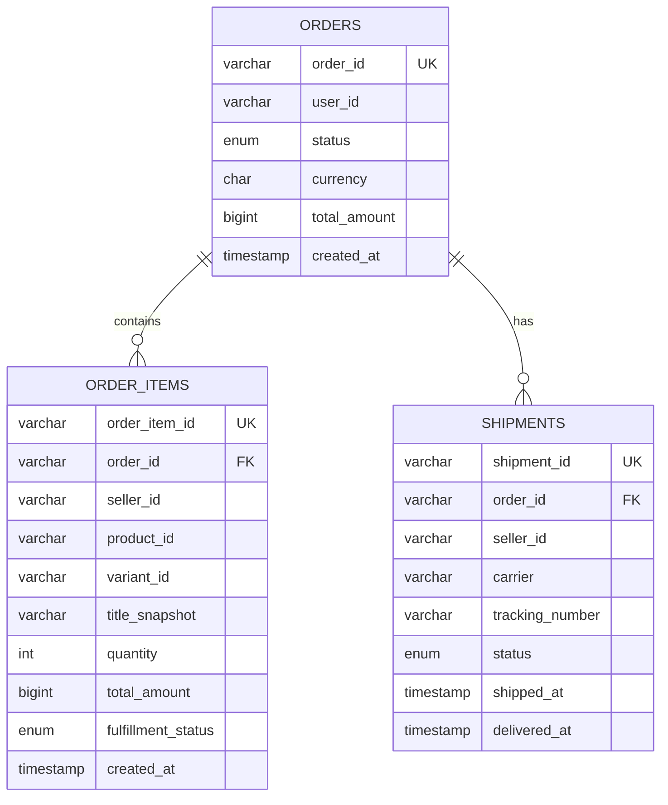
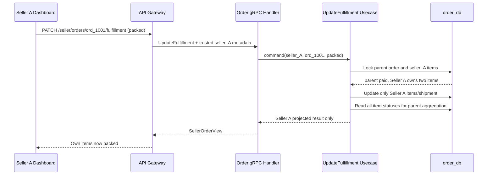
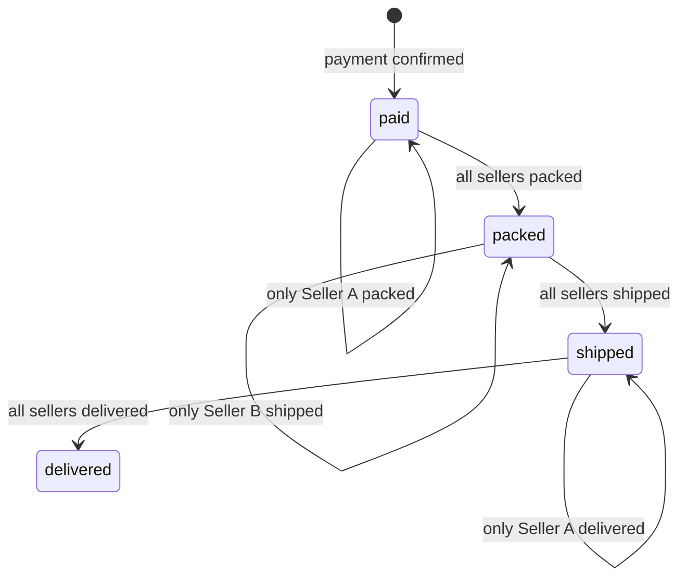
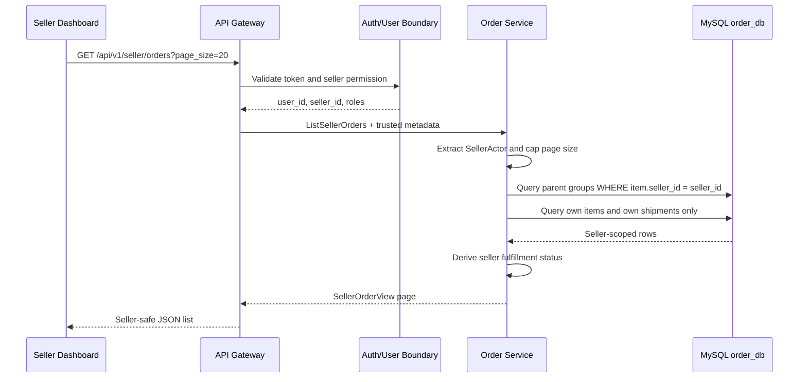

# 🏪 Order Service - Task 6: Seller Order View


## 📌 Task Summary

| Field | Detail |
|---|---|
| Task Name | Seller order view |
| Source | `docs/01-micro-tasks.md` → `Order Service` → Task 6 |
| Priority | `P1` core business feature |
| Dependency | User Service and Product Service |
| Previous Handoff | Task 2 seller-aware schema; Task 3 immutable item snapshots; Task 5 gRPC transport boundary |
| Main Goal | Seller ko sirf apne sold items aur apne shipment/fulfillment actions dikhana |
| Required Multi-Seller Rule | Ek buyer order me multiple sellers ho sakte hain; har seller ko usi parent order ka isolated item projection milega |
| Existing API Alignment | `GET /api/v1/seller/orders` → `OrderService.ListSellerOrders`; `PATCH /api/v1/seller/orders/{order_id}/fulfillment` → `OrderService.UpdateFulfillment` |
| Output Type | Documentation-only implementation guide with implementation-ready examples |
| Not Included | Actual Go/proto/API/migration/frontend files, payment/refund changes, idempotency, order events |

> **Simple Hinglish goal:** Buyer ne agar ek checkout me Seller A aur Seller B dono ke products kharide, to parent order ek hi rahega. Lekin Seller A ke dashboard me sirf Seller A ke items, amount aur shipment status dikhne chahiye. Seller B ka item, amount ya fulfillment action Seller A ko kabhi expose nahi hoga.

---

## ✅ Final Output Created

```text
TaskImplementation/
└── Order Service/
    ├── task1.md
    ├── task2.md
    ├── task3.md
    ├── task4.md
    ├── task5.md
    └── task6.md
```

### Why this structure?

- `TaskImplementation/` existing task-wise documentation root ko retain karta hai.
- `Order Service/` existing sequential Order Service guides ko retain karta hai.
- `task6.md` sirf **Order Service - Task 6** ki seller order view implementation guide hai.
- Existing Task 1 to Task 5 files ko change nahi kiya gaya.

> 🟢 **Important:** Requested deliverable documentation file hai. Is task me actual `backend/`, `proto/`, `api/`, SQL migration, frontend, ya runtime configuration file create/edit nahi ki gayi.

---

## 🧭 Requirement Sources Studied

| Source | Task 6 ke liye liya gaya decision |
|---|---|
| `docs/01-micro-tasks.md` | Exact requirement: seller apne items ke orders dekhe aur multi-seller splitting handle ho |
| `docs/03-folder-structure.md` | Future `order-service/internal/usecase`, `repository`, aur `transport/grpc` placement |
| `docs/04-microservice-design.md` | Order Service multi-seller grouping own karta hai; `ListSellerOrders` aur seller fulfillment REST routes required hain |
| `docs/05-database-design.md` | One order ke multiple shipments aur seller-indexed order item query pattern |
| `docs/06-auth-security.md` | JWT me trusted `seller_id` aur roles; seller authorization service side bhi enforce hogi |
| `docs/09-cms-superadmin.md` | Seller panel ka Order Management module shipment updates aur seller order visibility chahta hai |
| `docs/10-frontend-implementation.md` | Seller dashboard operational table/status UI ka consumer hoga |
| `api/master-api.json` | Seller list/update REST-to-gRPC mapping aur `ListSellerOrders` operation already defined hai |
| `database/draw.sql` | `order_items.seller_id`, item `fulfillment_status`, aur `shipments.seller_id` persistence base |
| `TaskImplementation/Order Service/task1.md` | Parent order lifecycle transitions |
| `TaskImplementation/Order Service/task2.md` | Seller-aware MySQL tables and indexes |
| `TaskImplementation/Order Service/task3.md` | Purchased product/seller snapshots ka checkout source |
| `TaskImplementation/Order Service/task4.md` | Paid order ke baad fulfillment allow karne ki payment boundary |
| `TaskImplementation/Order Service/task5.md` | gRPC handler/auth/error/pagination pattern and Task 6 handoff |

---

## 🧱 Task Boundary

### ✅ Included in Task 6

- `ListSellerOrders` seller-scoped query aur response projection design
- Authenticated seller identity ko trusted context se lena
- `order_items.seller_id` ke basis par data isolation
- Ek parent buyer order ko seller-wise logical views me split karna
- Seller items ka snapshot data aur seller subtotal return karna
- Seller-owned shipment/tracking status return karna
- Existing `UpdateFulfillment` ko seller ownership ke saath safely apply karne ka flow
- Multi-seller fulfillment ke baad parent order status aggregation rule
- Generic seller API response ko privacy-safe seller projection banane ka contract guidance
- Pagination, filtering, validation, gRPC errors, observability, and tests
- Go, proto, and SQL implementation examples
- Libraries/tools ke install aur usage instructions

### 🚫 Not Included in Task 6

| Outside Scope | Correct Owner / Later Work |
|---|---|
| Actual Go source, proto generation, API schema, ya migration file add karna | Current output documentation-only hai |
| Cart se order create karna ya prices validate karna | Order Service Task 3 |
| Payment intent/webhook/refund implementation | Payment Service / Order Task 4 boundary |
| Checkout duplicate prevention | Order Service Task 7 |
| `OrderPaid` ya fulfillment events publish karna | Order Service Task 8 |
| Seller dashboard React page implement karna | Seller Dashboard task |
| Seller KYC/profile/role creation implement karna | User/Auth/CMS services |
| Product ownership rewrite karna | Product Service |
| Commission, payout, revenue settlement splitting | Payment/CMS/finance capability, is task ka view scope nahi |
| One seller ke multiple parcels ka public API extension | Future fulfillment enhancement |

> 🔴 **Scope rule:** Task 6 order ko financially split nahi karta. Parent order aur payment ek buyer checkout ke records rahenge; seller view ek secure, seller-scoped projection hoga.

---

## 🔗 Earlier Tasks Se Handoff

| Capability | Already Defined In | Task 6 Ka Use |
|---|---|---|
| Parent statuses: `paid`, `packed`, `shipped`, `delivered` | Task 1 | Aggregated parent fulfillment ko legally advance karna |
| `order_items.seller_id` | Task 2 | Seller ownership filter ka source |
| `order_items.fulfillment_status` | Task 2 | Har seller/item ki fulfillment progress |
| `shipments.seller_id` | Task 2 | Seller ke parcel/tracking ko isolate karna |
| Seller indexes | Task 2 | Seller list and shipment filter query support |
| Immutable item snapshots | Task 3 | Product Service lookup ke bina historical purchased item dikhana |
| Payment result → `paid` | Task 4 | Paid hone se pehle packing/shipping block karna |
| gRPC handler/auth conventions | Task 5 | `ListSellerOrders` aur seller-safe fulfillment transport implement karna |

### Dependency ka practical meaning

| Dependency | Task 6 ko kya chahiye | Is task me kya implement nahi hoga |
|---|---|---|
| User/Auth boundary | Trusted active seller identity and `seller_id` claim/context | Signup, seller approval, JWT issuing |
| Product boundary | Checkout time par validated item ka `seller_id` snapshot | Product CRUD ya ownership transfer |

> 🟡 **Historical ownership rule:** Purchased `order_items.seller_id` immutable snapshot hai. Product future me transfer/unpublish ho jaye, tab bhi old order original fulfillment seller ke scope me hi rahega.

---

## 🔐 Critical Contract Refinement

Project API inventory me seller endpoints generic schemas use karte hue listed hain:

| Endpoint | Existing Named Response |
|---|---|
| `GET /api/v1/seller/orders` | `OrderListResponse` |
| `PATCH /api/v1/seller/orders/{order_id}/fulfillment` | `Order` |

Buyer-facing `Order` normally parent order ke **saare items** contain kar sakta hai. Multi-seller case me same generic payload bina filtering return karna security bug hoga.

### Required implementation decision

| Unsafe Approach | Safe Task 6 Decision |
|---|---|
| Full buyer `Order` Seller A ko return karna | `SellerOrderView` return karo jisme sirf Seller A ke items hon |
| Parent `total_amount` expose karna | Sirf `seller_items_total` expose karo |
| `user_id`, `payment_id`, other seller shipments expose karna | Seller list response me omit karo |
| Payload ke `seller_id` par trust karna | Trusted auth context ka `seller_id` use karo |

> 🔴 **Security rule:** Seller-visible response ka type dedicated seller projection hona chahiye, ya generic `Order` mapping explicitly actor-scoped honi chahiye. Preferred implementation dedicated `SellerOrderView` hai, kyunki accidental data leakage ka risk kam hota hai.

---

## 🧩 Multi-Seller Concept

### Example checkout

Buyer ne ek checkout me ye items purchase kiye:

| Parent `order_id` | Item | Seller | Item Total | Seller Status |
|---|---|---|---:|---|
| `ord_1001` | Running Shoes | `seller_A` | INR 2,499.00 | `pending` |
| `ord_1001` | Shoe Laces | `seller_A` | INR 199.00 | `pending` |
| `ord_1001` | Sports Bottle | `seller_B` | INR 599.00 | `pending` |

### Seller projections

| Viewer | Visible Items | Visible Seller Total | Hidden Data |
|---|---|---:|---|
| Seller A | Running Shoes, Shoe Laces | INR 2,698.00 | Seller B bottle and INR 599.00 |
| Seller B | Sports Bottle | INR 599.00 | Seller A products and INR 2,698.00 |

### Parent versus seller view

| Record/View | Meaning | Stored or Derived? |
|---|---|---|
| `orders` parent row | Buyer checkout/payment lifecycle | Stored |
| `order_items` rows | Purchased lines with owning seller | Stored |
| `shipments` rows | Seller/package fulfillment tracking | Stored |
| `SellerOrderView` | Current seller ke items grouped under parent order | Derived response projection |
| `seller_items_total` | Current seller item totals ka sum | Derived from seller-filtered items |

> 🟢 **Decision:** Task 6 me new child-order table ki requirement nahi hai. Existing `order_items.seller_id` aur `shipments.seller_id` se safe logical split ban sakta hai.

---

## 🏗️ Architecture

### Seller order listing boundary



### Isolation rule



### Service responsibility

| Layer | Is Task Me Responsibility | Kya Nahi Karega |
|---|---|---|
| Gateway/Auth | JWT verify, seller route permission, trusted seller context forward | SQL filter decide nahi karega |
| gRPC Transport | Context extract, input normalize, seller response map, errors map | Other seller rows return nahi karega |
| Usecase | Seller query orchestration, split aggregation, fulfillment rule | Proto or REST details nahi jaane |
| Repository | Every seller operation me SQL ownership filter/transaction | Cross-service DB read nahi karega |
| Domain | Valid item/parent fulfillment progression | Payment provider logic nahi karega |

---

## 🗂️ Clean Folder Structure

### Deliverable created in this task

```text
TaskImplementation/
└── Order Service/
    └── task6.md
```

### Target code structure described by this guide

> Neeche listed paths actual implementation ke liye recommended hain. Current requested output me ye code files create nahi ki gayi.

```text
proto/
└── ecommerce/
    └── order/
        └── v1/
            └── order.proto                       # Add seller-scoped RPC messages

backend/
└── services/
    └── order-service/
        ├── cmd/
        │   └── server/
        │       └── main.go
        └── internal/
            ├── domain/
            │   ├── order.go
            │   ├── order_item.go
            │   ├── fulfillment.go
            │   └── seller_order.go               # Seller projection/domain rules
            ├── usecase/
            │   ├── list_seller_orders.go         # Task 6 query usecase
            │   └── update_fulfillment.go         # Extend with seller scoping
            ├── repository/
            │   ├── mysql_order_repository.go
            │   └── mysql_seller_order_repository.go
            └── transport/
                └── grpc/
                    ├── order_handler.go
                    ├── seller_order_handler.go
                    ├── mapper.go
                    ├── auth_context.go
                    └── error_mapping.go
```

### Placement decisions

| Location | Why |
|---|---|
| `order.proto` | Existing Order gRPC contract me `ListSellerOrders` API design already expected hai |
| `domain/seller_order.go` | Seller-visible projection and derived seller status clearly model hota hai |
| `usecase/list_seller_orders.go` | Query workflow buyer list se distinct aur security-sensitive hai |
| `usecase/update_fulfillment.go` | Task 5 operation reuse hota hai, lekin Task 6 seller ownership enforce karta hai |
| `repository/mysql_seller_order_repository.go` | Seller-filtered SQL ko accidental generic reads se separate rakhna easy hai |
| `transport/grpc/seller_order_handler.go` | Seller metadata extraction and safe mapping obvious rehti hai |

---

## 🗃️ Existing Data Model Ka Use

Task 2 / reference DDL me required persistence fields already available hain:



### Which stored values are seller-visible?

| Stored Data | Seller List View | Reason |
|---|---:|---|
| `orders.order_id` | ✅ | Seller ko order reference chahiye |
| `orders.status` | ✅ limited operational status | Payment/fulfillment eligibility samajhne ke liye |
| `orders.total_amount` | ❌ | Isme other sellers ka value include ho sakta hai |
| `orders.user_id` | ❌ | List screen ko buyer identity expose karne ki zarurat nahi |
| `orders.payment_id` | ❌ | Seller fulfillment ke liye financial identifier required nahi |
| `order_items` where matching `seller_id` | ✅ | Seller ka purchased work queue |
| Other sellers' `order_items` | ❌ | Strict isolation |
| Own `shipments` | ✅ | Tracking/dispatch work |
| Other sellers' `shipments` | ❌ | Strict isolation |
| Full `address_snapshot` | ❌ in list view | Data minimization; shipping-label/detail capability separate policy se expose hogi |

> 🟡 **Privacy decision:** Seller order *list* operational summary hai. Delivery address/contact ko default list payload me mat bhejo. Packaging/shipping label ke liye future authorized detail operation minimal required delivery fields expose kar sakta hai.

---

## 🪜 Step-by-Step Implementation

## Step 1: Exact Requirement Ko Operation Me Map Karo

Task requirement ke do parts hain:

| Requirement Sentence | Implementation Capability |
|---|---|
| Seller apne items ke orders dekh sake | `ListSellerOrders` authenticated seller query |
| Multi-seller order splitting handle karo | Seller-filtered item/shipment projection and scoped fulfillment |

Project design already ye routes and RPC expectation deta hai:

| Public REST Route | Internal gRPC Call | Task 6 Behavior |
|---|---|---|
| `GET /api/v1/seller/orders` | `OrderService.ListSellerOrders` | Paginated seller projection list |
| `PATCH /api/v1/seller/orders/{order_id}/fulfillment` | `OrderService.UpdateFulfillment` | Sirf current seller ke items/shipment update |

**Hinglish explanation:** Buyer order history aur seller order queue same data ka same view nahi hain. Buyer ko full purchased order dikhta hai; seller ko apna fulfillable slice dikhega.

---

## Step 2: Seller Identity Trusted Context Se Lo

Client query me `seller_id=seller_A` bhejne dena authorization nahi hai. Seller identity Auth/Gateway se verified context me aani chahiye.

### Trusted metadata

| Metadata Key | Example | Use |
|---|---|---|
| `x-user-id` | `usr_501` | Action karne wala staff/user |
| `x-seller-id` | `seller_A` | Data partition key; mandatory for seller route |
| `x-roles` | `seller_order_manager` | Permission check |
| `x-request-id` | `req_d81` | Logs/traces/audit correlation |
| `x-session-id` | `sess_91` | Security correlation |

### Allowed roles

| Role | List Own Seller Orders | Update Own Fulfillment |
|---|---:|---:|
| `seller` | ✅ | ✅ |
| `seller_manager` | ✅ | ✅ if CMS permission grants order handling |
| `seller_order_manager` | ✅ | ✅ |
| `seller_catalog_editor` | ❌ | ❌ |
| `buyer` | ❌ | ❌ |
| Admin operations | Separate admin policy/API | Separate admin policy/API |

### Go context extraction example

```go
type SellerActor struct {
	UserID    string
	SellerID  string
	Roles     []string
	RequestID string
	SessionID string
}

func sellerActorFromContext(ctx context.Context) (SellerActor, error) {
	md, ok := metadata.FromIncomingContext(ctx)
	if !ok {
		return SellerActor{}, ErrUnauthenticated
	}

	actor := SellerActor{
		UserID:    first(md.Get("x-user-id")),
		SellerID:  first(md.Get("x-seller-id")),
		Roles:     strings.Split(first(md.Get("x-roles")), ","),
		RequestID: first(md.Get("x-request-id")),
		SessionID: first(md.Get("x-session-id")),
	}
	if actor.UserID == "" || actor.SellerID == "" {
		return SellerActor{}, ErrUnauthenticated
	}
	if !hasAnyRole(actor.Roles, "seller", "seller_manager", "seller_order_manager") {
		return SellerActor{}, ErrPermissionDenied
	}
	return actor, nil
}
```

> 🔴 **Mandatory rule:** `ListSellerOrdersRequest` aur fulfillment request body me arbitrary `seller_id` accept karke ownership decide mat karo. `seller_id` always verified actor context se inject hoga.

---

## Step 3: Seller-Safe Read Model Define Karo

Seller ke response me buyer-facing parent object reuse karne ke bajay focused view define karo.

### Domain projection example

```go
type SellerOrderView struct {
	OrderID                 string
	ParentOrderStatus       string
	SellerFulfillmentStatus string
	Currency                string
	SellerItemsTotal        int64
	Items                   []SellerOrderItemView
	Shipments               []SellerShipmentView
	CreatedAt               time.Time
}

type SellerOrderItemView struct {
	OrderItemID       string
	ProductID         string
	VariantID         string
	SKU               string
	TitleSnapshot     string
	ImageURLSnapshot  string
	Quantity          int
	UnitAmount        int64
	TotalAmount       int64
	FulfillmentStatus string
}

type SellerShipmentView struct {
	ShipmentID     string
	Status         string
	Carrier        string
	TrackingNumber string
	ShippedAt      *time.Time
	DeliveredAt    *time.Time
}
```

### Why separate view?

| Field Choice | Explanation |
|---|---|
| No `UserID` | Seller queue list ke liye unnecessary buyer exposure avoid hota hai |
| No `PaymentID` | Seller ko provider/payment internals ki zarurat nahi |
| No parent `TotalAmount` | Other sellers ki commercial data reveal nahi hoti |
| `SellerItemsTotal` | Seller ke visible items ka sum useful aur safe hai |
| `TitleSnapshot`, `UnitAmount` | Purchased truth render hota hai; current Product Service value nahi |
| `SellerFulfillmentStatus` | Seller ko apna operational progress clear dikhta hai |

---

## Step 4: Seller Fulfillment Projection Status Define Karo

Stored item status values Task 2 ke according `pending`, `packed`, `shipped`, `delivered`, `cancelled`, `returned` hain. Seller ke paas multiple own items ho sakte hain; UI ko combined state chahiye.

### Projection-only statuses

| Seller Items Situation | `seller_fulfillment_status` |
|---|---|
| Saare own items `pending` | `pending` |
| Kuch packed, kuch pending | `partially_packed` |
| Saare active items `packed` | `packed` |
| Kuch shipped, remaining packed/pending | `partially_shipped` |
| Saare active items `shipped` | `shipped` |
| Kuch delivered, remaining shipped | `partially_delivered` |
| Saare active items `delivered` | `delivered` |

> 🟢 **No schema change needed:** `partially_*` values response projection hain; inko `order_items.fulfillment_status` enum me persist nahi karna.

### Derivation example

```go
func deriveSellerFulfillmentStatus(items []SellerOrderItemView) string {
	if allItemsAtLeast(items, "delivered") {
		return "delivered"
	}
	if anyItem(items, "delivered") {
		return "partially_delivered"
	}
	if allItemsAtLeast(items, "shipped") {
		return "shipped"
	}
	if anyItem(items, "shipped") {
		return "partially_shipped"
	}
	if allItemsAtLeast(items, "packed") {
		return "packed"
	}
	if anyItem(items, "packed") {
		return "partially_packed"
	}
	return "pending"
}
```

**Hinglish explanation:** Seller A ka progress Seller B se independent visible hoga. Parent order kab globally `shipped` hoga, wo baad me all-seller aggregation decide karega.

---

## Step 5: gRPC Contract Ko Seller Projection Ke Saath Extend Karo

Task 5 transport foundation me `ListSellerOrders` intentionally Task 6 ke liye pending tha. Task 6 me us RPC ko seller-safe response ke saath expose karna hai.

### `order.proto` implementation example

```proto
syntax = "proto3";

package ecommerce.order.v1;

import "google/protobuf/timestamp.proto";

service OrderService {
  // Other Task 5 RPCs remain unchanged.
  rpc ListSellerOrders(ListSellerOrdersRequest)
      returns (ListSellerOrdersResponse);

  // Existing Task 5 operation; seller route maps its result safely.
  rpc UpdateFulfillment(UpdateFulfillmentRequest)
      returns (UpdateFulfillmentResponse);
}

enum SellerFulfillmentStatus {
  SELLER_FULFILLMENT_STATUS_UNSPECIFIED = 0;
  SELLER_FULFILLMENT_STATUS_PENDING = 1;
  SELLER_FULFILLMENT_STATUS_PARTIALLY_PACKED = 2;
  SELLER_FULFILLMENT_STATUS_PACKED = 3;
  SELLER_FULFILLMENT_STATUS_PARTIALLY_SHIPPED = 4;
  SELLER_FULFILLMENT_STATUS_SHIPPED = 5;
  SELLER_FULFILLMENT_STATUS_PARTIALLY_DELIVERED = 6;
  SELLER_FULFILLMENT_STATUS_DELIVERED = 7;
}

enum ItemFulfillmentStatus {
  ITEM_FULFILLMENT_STATUS_UNSPECIFIED = 0;
  ITEM_FULFILLMENT_STATUS_PENDING = 1;
  ITEM_FULFILLMENT_STATUS_PACKED = 2;
  ITEM_FULFILLMENT_STATUS_SHIPPED = 3;
  ITEM_FULFILLMENT_STATUS_DELIVERED = 4;
  ITEM_FULFILLMENT_STATUS_CANCELLED = 5;
  ITEM_FULFILLMENT_STATUS_RETURNED = 6;
}

enum ShipmentStatus {
  SHIPMENT_STATUS_UNSPECIFIED = 0;
  SHIPMENT_STATUS_PENDING = 1;
  SHIPMENT_STATUS_PACKED = 2;
  SHIPMENT_STATUS_SHIPPED = 3;
  SHIPMENT_STATUS_DELIVERED = 4;
  SHIPMENT_STATUS_FAILED = 5;
}

message SellerMoney {
  int64 minor_units = 1;
  string currency = 2;
}

message SellerOrderItem {
  string order_item_id = 1;
  string product_id = 2;
  string variant_id = 3;
  string sku = 4;
  string title_snapshot = 5;
  string image_url_snapshot = 6;
  int32 quantity = 7;
  SellerMoney unit_price = 8;
  SellerMoney line_total = 9;
  ItemFulfillmentStatus fulfillment_status = 10;
}

message SellerShipment {
  string shipment_id = 1;
  ShipmentStatus status = 2;
  string carrier = 3;
  string tracking_number = 4;
  google.protobuf.Timestamp shipped_at = 5;
  google.protobuf.Timestamp delivered_at = 6;
}

message SellerOrderView {
  string order_id = 1;
  string parent_order_status = 2;
  SellerFulfillmentStatus seller_fulfillment_status = 3;
  SellerMoney seller_items_total = 4;
  repeated SellerOrderItem items = 5;
  repeated SellerShipment shipments = 6;
  google.protobuf.Timestamp created_at = 7;
}

message ListSellerOrdersRequest {
  int32 page_size = 1;
  string page_token = 2;
  SellerFulfillmentStatus fulfillment_filter = 3;
}

message ListSellerOrdersResponse {
  repeated SellerOrderView orders = 1;
  string next_page_token = 2;
}

message UpdateFulfillmentRequest {
  string order_id = 1;
  SellerFulfillmentStatus target_status = 2;
  string tracking_number = 3;
  string carrier = 4;
  string note = 5;
}

message UpdateFulfillmentResponse {
  // Seller-facing route must map only authenticated seller-owned items.
  SellerOrderView seller_order = 1;
}
```

### Contract decisions

| Design Decision | Why |
|---|---|
| Request me `seller_id` nahi | Spoofing surface eliminate hoti hai |
| Dedicated `SellerOrderView` | Buyer/full order type se accidental cross-seller leak avoid hota hai |
| `seller_items_total` | Parent total reveal kiye bina operational value return hoti hai |
| Snapshot item fields | Order history stable rehti hai |
| `page_token` opaque | Large seller order queue ke liye safe cursor pagination |
| Fulfillment response seller view | Mutation response bhi data isolation rule follow karta hai |

> 🟡 **API inventory alignment:** Actual contract wiring ke waqt `api/master-api.json` me named generic seller response schema ko `SellerOrderListResponse` / `SellerOrderView` equivalent se refine karna hoga. Is documentation task me API file intentionally edit nahi ki gayi.

---

## Step 6: Usecase Contracts Banao

Transport se seller identity clean query/command ke roop me application layer me jayegi.

```go
type ListSellerOrdersQuery struct {
	SellerID          string
	ActorUserID       string
	PageSize          int
	PageToken         string
	FulfillmentFilter string
}

type SellerOrderPage struct {
	Orders        []SellerOrderView
	NextPageToken string
}

type UpdateSellerFulfillmentCommand struct {
	SellerID        string
	ActorUserID     string
	OrderID         string
	TargetStatus    string
	Carrier         string
	TrackingNumber  string
	Note            string
	RequestID       string
	OccurredAt      time.Time
}

type ListSellerOrdersUsecase interface {
	Execute(context.Context, ListSellerOrdersQuery) (SellerOrderPage, error)
}

type UpdateSellerFulfillmentUsecase interface {
	Execute(context.Context, UpdateSellerFulfillmentCommand) (SellerOrderView, error)
}
```

### Important distinction

| Type | Data Source | Rule |
|---|---|---|
| `SellerID` | Trusted metadata | Repository filter me mandatory |
| `ActorUserID` | Trusted metadata | Audit/logging ke liye |
| `OrderID` | URL/request | Sirf seller filter ke saath access allowed |
| `TargetStatus` | Request | Valid transition and parent paid guard required |

---

## Step 7: Seller List Repository Query Likho

Seller list ka fundamental condition har read par ye hai:

```sql
order_items.seller_id = authenticated_seller_id
```

### Page-level grouped query example

```sql
SELECT
  o.order_id,
  o.status AS parent_order_status,
  o.currency,
  o.created_at,
  SUM(oi.total_amount) AS seller_items_total,
  COUNT(oi.order_item_id) AS seller_item_count
FROM orders AS o
INNER JOIN order_items AS oi
  ON oi.order_id = o.order_id
WHERE oi.seller_id = ?
  AND (
    ? IS NULL
    OR o.created_at < ?
    OR (o.created_at = ? AND o.order_id < ?)
  )
GROUP BY
  o.order_id,
  o.status,
  o.currency,
  o.created_at
ORDER BY o.created_at DESC, o.order_id DESC
LIMIT ?;
```

### Parameter meaning

| Placeholder | Value |
|---:|---|
| 1 | Authenticated `seller_id` |
| 2 to 5 | Decoded cursor values; first page par cursor condition disabled |
| 6 | `page_size + 1` for detecting next page |

### Why group at parent order level?

Seller A ke same parent order me do items hon to seller dashboard table me usually ek order row chahiye, jiske detail me uske do items hon. `GROUP BY o.order_id` seller subtotal aur item count nikalta hai.

### Fetch only visible items for returned parent IDs

```sql
SELECT
  order_item_id,
  order_id,
  product_id,
  variant_id,
  sku,
  title_snapshot,
  image_url_snapshot,
  quantity,
  currency,
  unit_amount,
  total_amount,
  fulfillment_status
FROM order_items
WHERE seller_id = ?
  AND order_id IN (?, ?, ?)
ORDER BY order_id, created_at, order_item_id;
```

### Fetch only visible shipments

```sql
SELECT
  shipment_id,
  order_id,
  status,
  carrier,
  tracking_number,
  shipped_at,
  delivered_at
FROM shipments
WHERE seller_id = ?
  AND order_id IN (?, ?, ?)
ORDER BY order_id, created_at, shipment_id;
```

> 🔴 **SQL security rule:** Detail hydration me `WHERE order_id IN (...)` akela kabhi use na karein. `seller_id = ?` condition items aur shipments dono queries me compulsory rahegi.

### Query and index alignment

| Query Need | Existing Index From Task 2 |
|---|---|
| Seller item queue | `idx_order_items_seller_created (seller_id, created_at)` |
| Parent items join | `idx_order_items_order (order_id)` |
| Own shipment filters | `idx_shipments_seller_status (seller_id, status)` |

> 🟡 **Performance note:** Existing schema Task 6 ka baseline support karta hai. Production `EXPLAIN` me grouped pagination slow mile to reviewed follow-up migration me a composite covering index consider hoga; documentation task silently schema alter nahi karta.

---

## Step 8: Usecase Me Seller Rows Ko Assemble Karo

Repository parent summaries, own items, aur own shipments return karegi. Usecase map banakar har order ka seller projection assemble karega.

```go
func (uc *ListSellerOrders) Execute(
	ctx context.Context,
	q ListSellerOrdersQuery,
) (SellerOrderPage, error) {
	if q.SellerID == "" {
		return SellerOrderPage{}, ErrUnauthenticated
	}

	summaries, next, err := uc.repo.ListSellerOrderSummaries(ctx, q)
	if err != nil {
		return SellerOrderPage{}, err
	}
	if len(summaries) == 0 {
		return SellerOrderPage{Orders: []SellerOrderView{}}, nil
	}

	orderIDs := summaryOrderIDs(summaries)
	items, err := uc.repo.ListSellerItemsForOrders(ctx, q.SellerID, orderIDs)
	if err != nil {
		return SellerOrderPage{}, err
	}
	shipments, err := uc.repo.ListSellerShipmentsForOrders(ctx, q.SellerID, orderIDs)
	if err != nil {
		return SellerOrderPage{}, err
	}

	views := assembleSellerViews(summaries, items, shipments)
	for i := range views {
		views[i].SellerFulfillmentStatus =
			deriveSellerFulfillmentStatus(views[i].Items)
	}

	return SellerOrderPage{Orders: views, NextPageToken: next}, nil
}
```

### Why batched hydration?

| Approach | Result |
|---|---|
| Har order row ke liye alag items query | N+1 database calls, queue grow hote hi slow |
| Page summaries + one items query + one shipments query | Fixed small number of reads per page |

---

## Step 9: `ListSellerOrders` gRPC Handler Implement Karo

Handler seller identity verify karega, page input normalize karega, usecase call karega, aur dedicated safe message map karega.

```go
const (
	defaultSellerPageSize = 20
	maxSellerPageSize     = 100
)

func (s *Server) ListSellerOrders(
	ctx context.Context,
	req *orderv1.ListSellerOrdersRequest,
) (*orderv1.ListSellerOrdersResponse, error) {
	actor, err := sellerActorFromContext(ctx)
	if err != nil {
		return nil, toStatusError(err)
	}

	pageSize, err := normalizePageSize(
		req.GetPageSize(),
		defaultSellerPageSize,
		maxSellerPageSize,
	)
	if err != nil {
		return nil, toStatusError(err)
	}

	page, err := s.listSellerOrders.Execute(ctx, usecase.ListSellerOrdersQuery{
		SellerID:          actor.SellerID,
		ActorUserID:       actor.UserID,
		PageSize:          pageSize,
		PageToken:         req.GetPageToken(),
		FulfillmentFilter: mapSellerFilter(req.GetFulfillmentFilter()),
	})
	if err != nil {
		return nil, toStatusError(err)
	}

	return &orderv1.ListSellerOrdersResponse{
		Orders:        mapSellerOrders(page.Orders),
		NextPageToken: page.NextPageToken,
	}, nil
}
```

### Handler guarantees

| Guarantee | Kaise |
|---|---|
| Seller cannot switch store through query | Request me seller ID accept hi nahi hota |
| Page abuse controlled | Maximum page size enforce hota hai |
| Other seller data not mapped | `mapSellerOrders` dedicated projection map karta hai |
| Internal DB errors not leaked | Stable gRPC error mapping use hoti hai |

---

## Step 10: Pagination and Filters Rakho

Seller dashboard me newest orders pehle dikhne chahiye. Offset (`page=200`) rapidly changing work queue me duplicates/skips de sakta hai; opaque cursor better rahega.

### Cursor content concept

```json
{
  "created_at": "2026-05-26T10:00:00Z",
  "order_id": "ord_1001"
}
```

Actual response me is JSON ko opaque encoded/signed token ke roop me return karna chahiye; client ko token parse/edit nahi karna.

### Allowed seller filters

| Filter | Meaning | Data Source |
|---|---|---|
| none | All current seller orders | Own item projection |
| `pending` | Seller ke items fulfillment start nahi hue | Derived/item status |
| `packed` | Own package packed queue | Derived/item or shipment status |
| `shipped` | Own dispatched packages | Own shipment status |
| `delivered` | Own delivered orders | Own item/shipment status |

> 🟡 **Filter rule:** Parent order `status` se seller fulfillment filter mat implement karo. Seller A shipped ho sakta hai jab parent order Seller B ki wajah se abhi globally `packed` ho.

---

## Step 11: Split Fulfillment Ownership Enforce Karo

Task 5 ne `UpdateFulfillment` transport expose kiya. Task 6 ka essential addition ye hai ki seller mutation sirf us seller ke rows touch kare.

### Update command flow



### Transaction requirements

Within one MySQL transaction:

1. Parent order lock/read karo.
2. Verify parent fulfillment eligible hai, normally payment-confirmed `paid` or a later fulfillment state.
3. `order_items` rows `order_id + authenticated seller_id` ke saath lock karo.
4. Zero matching items hon to masked `NotFound`/permission policy return karo.
5. Har own item ka valid next transition validate karo.
6. Sirf own item rows update karo.
7. Own shipment row create/find/update karo.
8. All sellers ke item statuses internally aggregate karke parent status advance karna hai ya nahi decide karo.
9. Parent change hua to `order_status_history` append karo.
10. Commit ke baad seller-filtered response load/return karo.

### Seller-owned update SQL example

```sql
SELECT
  o.status
FROM orders AS o
WHERE o.order_id = ?
FOR UPDATE;

SELECT
  order_item_id,
  fulfillment_status
FROM order_items
WHERE order_id = ?
  AND seller_id = ?
FOR UPDATE;

UPDATE order_items
SET fulfillment_status = 'packed'
WHERE order_id = ?
  AND seller_id = ?
  AND fulfillment_status = 'pending';
```

### Shipment update guard

```sql
UPDATE shipments
SET
  status = 'shipped',
  carrier = ?,
  tracking_number = ?,
  shipped_at = CURRENT_TIMESTAMP
WHERE shipment_id = ?
  AND order_id = ?
  AND seller_id = ?;
```

> 🔴 **Mutation rule:** `UPDATE order_items SET ... WHERE order_id = ?` jaisi query seller route me forbidden hai. Isse Seller A accidentally Seller B ka fulfillment bhi update kar sakta hai.

### MVP shipment assumption

Task 2 schema multiple shipment rows support karta hai. Existing public fulfillment route me sirf `order_id` hai, `shipment_id` nahi.

| Current Task 6 MVP | Later Enhancement |
|---|---|
| One operational shipment per seller per parent order maintain karo | Same seller ke multiple parcels ke liye `shipment_id`-scoped route/contract add karo |
| Parent row lock ke andar missing seller shipment create karo | Parcel-level UI and partial dispatch support karo |
| Existing row ko tracking/status update karo | Multi-label/carrier workflow introduce karo |

---

## Step 12: Parent Order Status Ko Correctly Aggregate Karo

Multi-seller me Seller A ka update directly parent ko `shipped` nahi bana sakta jab Seller B abhi pending ho.

### Aggregation rule

| All Active Order Items State | Parent Order Fulfillment State |
|---|---|
| Payment successful, at least one item pending | `paid` |
| Every active item at least packed | `packed` |
| Every active item at least shipped | `shipped` |
| Every active item delivered | `delivered` |

### Example

| Action | Seller A Items | Seller B Items | Parent Order Status |
|---|---|---|---|
| Payment captured | `pending` | `pending` | `paid` |
| Seller A packs | `packed` | `pending` | `paid` |
| Seller B packs | `packed` | `packed` | `packed` |
| Seller B ships | `packed` | `shipped` | `packed` |
| Seller A ships | `shipped` | `shipped` | `shipped` |
| Both delivered | `delivered` | `delivered` | `delivered` |

### State flow



### Aggregation code example

```go
func nextParentStatus(current string, items []OrderItem) (string, bool) {
	switch {
	case allActiveAtLeast(items, "delivered") && current == "shipped":
		return "delivered", true
	case allActiveAtLeast(items, "shipped") && current == "packed":
		return "shipped", true
	case allActiveAtLeast(items, "packed") && current == "paid":
		return "packed", true
	default:
		return current, false
	}
}
```

> 🟠 **Cancellation/return boundary:** Partial seller cancellation, returns, and refund impact need additional business rules. Task 6 view/update implementation unapproved cancellation or return behavior invent nahi karega.

---

## Step 13: Fulfillment Domain Validation Add Karo

### Own item transitions

| Current Item Status | Requested Status | Allowed? | Extra Requirement |
|---|---|---:|---|
| `pending` | `packed` | ✅ | Parent payment confirmed |
| `packed` | `shipped` | ✅ | `carrier` and `tracking_number` required |
| `shipped` | `delivered` | ✅ | Delivery confirmation policy |
| `pending` | `shipped` | ❌ | Packing step skip nahi hoga |
| `packed` | `delivered` | ❌ | Shipping step skip nahi hoga |
| `delivered` | `packed` | ❌ | Reverse progression blocked |
| Any | `cancelled` / `returned` | Not in this task | Cancellation/return rules separate |

### Validation example

```go
func validateSellerTransition(from, to, carrier, tracking string) error {
	allowed := map[string]string{
		"pending": "packed",
		"packed":  "shipped",
		"shipped": "delivered",
	}
	if allowed[from] != to {
		return ErrInvalidFulfillmentTransition
	}
	if to == "shipped" && (carrier == "" || tracking == "") {
		return ErrTrackingRequired
	}
	return nil
}
```

### Payment eligibility guard

| Parent Status | Seller Can Pack/Ship? | Reason |
|---|---:|---|
| `created` | ❌ | Payment not initiated/final |
| `pending_payment` | ❌ | Payment unconfirmed |
| `payment_failed` | ❌ | Fulfillment must not start |
| `paid` | ✅ | Paid items fulfillable |
| `packed` / `shipped` | ✅ for valid remaining progression | Other seller may be ahead/behind |
| `cancelled` / `refunded` | ❌ | Operational action blocked |

---

## Step 14: Error Mapping Consistent Rakho

| Situation | Domain Result | gRPC Code | REST Meaning |
|---|---|---|---|
| Seller metadata missing | `ErrUnauthenticated` | `Unauthenticated` | `401` |
| User has no seller-order role | `ErrPermissionDenied` | `PermissionDenied` | `403` |
| Requested order has no own items | Masked not found policy | `NotFound` | `404` |
| Page token invalid | `ErrInvalidPageToken` | `InvalidArgument` | `400` |
| Shipping without tracking | `ErrTrackingRequired` | `InvalidArgument` | `400` |
| Parent unpaid | `ErrOrderNotPaid` | `FailedPrecondition` | `409` |
| Invalid item transition | `ErrInvalidFulfillmentTransition` | `FailedPrecondition` | `409` |
| Concurrent update conflict | `ErrConflict` | `Aborted` | `409` / retry |
| MySQL temporarily unavailable | internal unavailable | `Unavailable` | `503` |

> 🟢 **Information-hiding rule:** Seller ko “order exists but belongs to Seller B” batana necessary nahi hai. `NotFound` return karna order enumeration risk reduce karta hai.

---

## Step 15: Response Example Samjho

### Seller A ko returned list response

```json
{
  "orders": [
    {
      "order_id": "ord_1001",
      "parent_order_status": "paid",
      "seller_fulfillment_status": "pending",
      "seller_items_total": {
        "minor_units": 269800,
        "currency": "INR"
      },
      "items": [
        {
          "order_item_id": "oi_1",
          "product_id": "prod_shoe",
          "title_snapshot": "Running Shoes",
          "quantity": 1,
          "line_total": { "minor_units": 249900, "currency": "INR" },
          "fulfillment_status": "pending"
        },
        {
          "order_item_id": "oi_2",
          "product_id": "prod_lace",
          "title_snapshot": "Shoe Laces",
          "quantity": 1,
          "line_total": { "minor_units": 19900, "currency": "INR" },
          "fulfillment_status": "pending"
        }
      ],
      "shipments": [],
      "created_at": "2026-05-26T10:00:00Z"
    }
  ],
  "next_page_token": ""
}
```

### Response me intentionally absent fields

```text
Seller B ka Sports Bottle item
Parent full order total
Buyer user_id
Payment ID / payment provider detail
Other seller shipment tracking
Full buyer address in list response
```

---

## Step 16: Observability and Audit Guidance

Seller order routes business-sensitive hain. Logs useful hon, lekin buyer/payment/private data leak na karein.

### Log fields

| Safe Field | Example |
|---|---|
| `service` | `order-service` |
| `operation` | `ListSellerOrders` |
| `seller_id` | Prefer hashed or access-controlled operational ID |
| `actor_user_id` | Prefer hashed |
| `order_id` | Mutation troubleshooting ke liye |
| `request_id` | Trace correlation |
| `result_count` | Listing diagnostics |
| `target_status` | Fulfillment change monitoring |
| `duration_ms` | Latency |

### Never log

| Sensitive Field | Why |
|---|---|
| Address snapshot / phone | Buyer PII |
| Payment token/client secret | Financial security |
| Full other-seller item payload | Tenant isolation |
| JWT/raw metadata | Credential leakage |

### Useful metrics

| Metric | Meaning |
|---|---|
| `seller_order_list_requests_total{result}` | Seller queue request outcomes |
| `seller_order_list_duration_seconds` | Query/API latency |
| `seller_fulfillment_updates_total{target_status,result}` | Update activity/failures |
| `seller_scope_denied_total{reason}` | Suspicious cross-scope access attempts |
| `parent_fulfillment_aggregations_total{status}` | Global lifecycle advances |

### Audit event example

```json
{
  "operation": "seller_fulfillment_update",
  "seller_id": "seller_A",
  "actor_user_id": "usr_501",
  "order_id": "ord_1001",
  "target_status": "shipped",
  "request_id": "req_d81",
  "occurred_at": "2026-05-26T12:20:00Z"
}
```

> 🟡 **Task boundary:** Ye audit/log/metric behavior implementation guidance hai. Task 8 ke order message-queue events is task me publish nahi kiye jaate.

---

## 🔄 End-to-End Flows

### Seller list flow



### Two sellers progressing one order

```mermaid
sequenceDiagram
    participant A as Seller A
    participant B as Seller B
    participant O as Order Service
    participant DB as order_db

    A->>O: Update ord_1001 to packed
    O->>DB: UPDATE items WHERE order_id=ord_1001 AND seller_id=A
    O->>DB: Aggregate all order items
    DB-->>O: B still pending
    O-->>A: A view = packed; parent = paid

    B->>O: Update ord_1001 to packed
    O->>DB: UPDATE items WHERE order_id=ord_1001 AND seller_id=B
    O->>DB: Aggregate all order items
    DB-->>O: All items packed
    O->>DB: UPDATE parent paid -> packed + history
    O-->>B: B view = packed; parent = packed
```

---

## 🧰 External Libraries and Tools

### Used in this documentation deliverable

| Tool | What It Is | Why Used | Install / Use |
|---|---|---|---|
| Markdown | Text documentation format | Structured, versionable implementation guide | Repository Markdown viewer me `task6.md` open karein |
| Mermaid | Markdown-friendly diagram syntax | Architecture, isolation, and flow visualize karne ke liye | Mermaid-enabled Markdown renderer use karein; backend package nahi |
| Shields.io badges | Markdown badge images | Scope/status ko quickly readable banane ke liye | Badge image URL Markdown me directly render hota hai |

### Recommended when actual Task 6 code is implemented

| Library / Tool | What It Is | Why Needed | Install |
|---|---|---|---|
| Protocol Buffers | Typed RPC contract language | Seller-specific request/response schema define karne ke liye | Buf/protoc generation workflow use karein |
| Buf CLI | Proto lint and generation tool | Contract changes validate/generate karne ke liye | Official Buf installer or `brew install bufbuild/buf/buf` |
| `google.golang.org/grpc` | Go gRPC runtime | `ListSellerOrders` handler, metadata, status codes | `go get google.golang.org/grpc` |
| `google.golang.org/protobuf` | Generated message runtime | Proto messages/timestamps | `go get google.golang.org/protobuf` |
| `github.com/go-sql-driver/mysql` | MySQL driver for Go | Seller-filtered repository queries and transactions | `go get github.com/go-sql-driver/mysql` |
| `github.com/stretchr/testify` | Go test assertions/mocks helper | Isolation and handler tests readable banane ke liye | `go get github.com/stretchr/testify` |
| MySQL 8+ | Relational datastore | Existing `orders`, `order_items`, `shipments` queries/transactions | Project local stack/managed DB through config |

### Install and use commands

> Ye commands tab run honge jab actual Order Service source/proto implementation create ki jaayegi. Current documentation task me koi dependency install nahi ki gayi.

```bash
# Proto validation/generation, after seller messages are added to the real contract
buf lint
buf generate

# Run inside the future backend/services/order-service Go module
go get google.golang.org/grpc
go get google.golang.org/protobuf
go get github.com/go-sql-driver/mysql
go get github.com/stretchr/testify

# Actual service tests
go test ./...
```

### Basic gRPC use example

Gateway trusted metadata ke saath call karega:

```go
ctx, cancel := context.WithTimeout(parentCtx, 1500*time.Millisecond)
defer cancel()

ctx = metadata.AppendToOutgoingContext(
	ctx,
	"x-user-id", authenticatedUserID,
	"x-seller-id", authenticatedSellerID,
	"x-roles", "seller_order_manager",
	"x-request-id", requestID,
)

resp, err := orderClient.ListSellerOrders(ctx, &orderv1.ListSellerOrdersRequest{
	PageSize: 20,
	PageToken: pageToken,
})
```

---

## 🧪 Testing Strategy

Task 6 ka highest risk cross-seller leakage aur accidental cross-seller mutation hai. Tests ko happy path ke saath isolation prove karni hogi.

### Unit tests: usecase and projection

| Test Case | Expected Result |
|---|---|
| One seller has two items in one parent order | One `SellerOrderView`, two own items, correct own total |
| Same parent order has Seller A and Seller B items | Seller A response me Seller B ka item absent |
| Mixed own item statuses | Correct `partially_*` derived status |
| Empty own list | Empty page, no error |
| Cursor with second page | Stable order and correct next token |

### Unit tests: handler and auth

| Test Case | Expected gRPC Result |
|---|---|
| Valid `x-seller-id` + `seller_order_manager` | Usecase receives metadata seller ID |
| Missing `x-seller-id` | `Unauthenticated` |
| Buyer calls seller list | `PermissionDenied` |
| Request attempts any fake seller ID field | Ignored/not present in contract |
| Invalid page token | `InvalidArgument` |
| Page size above maximum | Capped or rejected consistently |

### Integration/security tests: repository

| Test Case | Expected Result |
|---|---|
| DB order includes A and B items; query as A | Rows contain only A item IDs |
| Shipments exist for A and B; query as A | Only A tracking returned |
| Seller A updates packed | A item updates; B item remains `pending`; parent remains `paid` |
| Seller B then updates packed | B updates; parent becomes `packed`; history appended once |
| Seller A tries B-only order ID | `NotFound`; no row changed |
| Ship without carrier/tracking | No row changed; validation error |
| Concurrent fulfillment retries | No illegal double transition/history duplication |

### Go test example

```go
func TestListSellerOrders_DoesNotExposeOtherSellerItems(t *testing.T) {
	repo := newFakeSellerRepo(
		summary("ord_1001"),
		[]SellerOrderItemView{
			{OrderItemID: "oi_A", TitleSnapshot: "Shoe", TotalAmount: 249900},
		},
	)
	uc := NewListSellerOrders(repo)

	page, err := uc.Execute(context.Background(), ListSellerOrdersQuery{
		SellerID: "seller_A",
		PageSize: 20,
	})

	require.NoError(t, err)
	require.Len(t, page.Orders, 1)
	require.Len(t, page.Orders[0].Items, 1)
	require.Equal(t, "oi_A", page.Orders[0].Items[0].OrderItemID)
	for _, item := range page.Orders[0].Items {
		require.NotEqual(t, "oi_B", item.OrderItemID)
	}
}
```

### Manual API verification scenarios

| Scenario | Verify |
|---|---|
| Login as Seller A and open order queue | Only A item snapshots/subtotal display |
| Use same parent `order_id` visible to A and B | Both dashboards show their own different slices |
| Inspect network response | No other seller line item, parent total, buyer ID, payment ID |
| Seller A marks packed | Seller B dashboard row remains unchanged |
| Both sellers complete same stage | Parent operational status advances only after both |

---

## 🛡️ Production Checklist

| Area | Rule |
|---|---|
| Authentication | Seller ID verified context se aaye |
| Authorization | Seller order role service-side check ho |
| Reads | Every seller item/shipment SQL query me `seller_id` filter ho |
| Mutations | Every seller update me `order_id AND seller_id` ownership predicate ho |
| Response | Dedicated `SellerOrderView`; generic buyer order payload return na ho |
| Data minimization | Buyer/payment/other-seller data list response me omit ho |
| Amounts | Seller total sirf visible item sums se calculate ho; integer minor units use ho |
| Snapshots | Historical product fields order snapshot se render hon |
| Fulfillment | Unpaid parent par packing/shipping reject ho |
| Aggregation | Parent status tabhi advance ho jab all active seller items required stage par hon |
| Concurrency | Fulfillment updates transaction/locks ke through safe hon |
| Pagination | Bounded page size and opaque cursor |
| Errors | Cross-seller existence leak avoid karne ke liye safe not-found behavior |
| Logs | PII/payment secret/other seller payload redact ho |
| Events | Task 8 se pehle order MQ publication add na ho |

---

## 🚫 Scope Protection Checklist

| Tempting Addition | Task 6 Me Kyun Nahi | Correct Follow-up |
|---|---|---|
| Parent order ko physically per seller duplicate karna | Existing item/shipment model projection ke liye enough hai; payment integrity complicate hogi | Settlement/order decomposition only with new business requirement |
| Full buyer `Order` seller response me return karna | Cross-seller/privacy leak risk | Dedicated seller projection |
| Product Service live read for title/price | Purchased snapshot truth already stored hai | Product lookup only separate enrichment requirement par |
| Buyer address list payload me add karna | Minimum data principle violate hota hai | Authorized shipping-detail/label operation separately design karo |
| Seller cancellation/refund implement karna | Cancellation financial rules specified nahi | Dedicated future order/payment task |
| Same seller multi-parcel route invent karna | Existing route `shipment_id` carry nahi karta | Future fulfillment API enhancement |
| Idempotency enforcement add karna | Checkout retry concern hai | Task 7 |
| Events publish karna | Async publication explicit separate task hai | Task 8 |
| Seller Dashboard UI build karna | Backend view contract ka scope nahi | Seller Dashboard Order Manager task |

---

## ✅ Acceptance Criteria

| Criteria | Status |
|---|---|
| Existing `TaskImplementation/` retained | ✅ Done |
| Existing `TaskImplementation/Order Service/` retained | ✅ Done |
| `TaskImplementation/Order Service/task6.md` created | ✅ Done |
| Exact seller order view requirement explained | ✅ Done |
| Multi-seller item isolation design included | ✅ Done |
| Seller-safe response projection documented | ✅ Done |
| API generic-response leakage concern and resolution documented | ✅ Done |
| Seller authentication/authorization flow documented | ✅ Done |
| Existing schema/index usage documented | ✅ Done |
| Seller list SQL examples included | ✅ Done |
| Seller-only fulfillment mutation and parent aggregation documented | ✅ Done |
| Proto and Go examples included | ✅ Done |
| Folder structure included | ✅ Done |
| Architecture/state/sequence diagrams included in Mermaid | ✅ Done |
| Libraries/tools with why/install/use included | ✅ Done |
| Tests and production security checklist included | ✅ Done |
| No implementation beyond Order Service Task 6 added | ✅ Done |

---

## 🔮 Relation to Other Order Tasks

| Task | Task 6 Se Relation |
|---|---|
| Task 1: Lifecycle | Parent status aggregation allowed transitions respect karega |
| Task 2: MySQL schema | Seller item and shipment fields/indexes Task 6 reads/updates support karte hain |
| Task 3: Cart to order | Seller ID and purchased product snapshot item rows me freeze hote hain |
| Task 4: Payment coordination | Parent paid hone par hi seller fulfillment start hota hai |
| Task 5: gRPC | Task 6 `ListSellerOrders` aur seller-safe fulfillment behavior complete karta hai |
| Task 7: Idempotency | Checkout duplicate control, seller view ke scope se separate |
| Task 8: Events | Future fulfillment/order changes ko async publish kar sakta hai |

---

## 🧠 Final Summary

Order Service Task 6 ke liye seller order view blueprint ready hai:

1. Parent buyer order ek hi financial/lifecycle record rahega.
2. `order_items.seller_id` aur `shipments.seller_id` se seller-specific logical split banega.
3. `ListSellerOrders` trusted `seller_id` se filter karke dedicated `SellerOrderView` return karega.
4. Seller ko sirf own items, own item total, aur own shipments dikhenge; other seller/buyer/payment data hidden rahega.
5. `UpdateFulfillment` sirf authenticated seller ke item/shipment rows update karega.
6. Parent `packed`, `shipped`, ya `delivered` status tabhi advance hoga jab all seller items corresponding stage complete kar lein.
7. Tools, proto/Go/SQL examples, diagrams, error handling, security rules, and tests implementation ke liye clearly documented hain.

> ✅ **Task 6 complete as requested:** Sirf `TaskImplementation/Order Service/task6.md` documentation deliverable create hua hai. Actual backend/proto/API/schema/frontend implementation, idempotency, events, payments, refunds, aur extra features intentionally add nahi kiye gaye.
