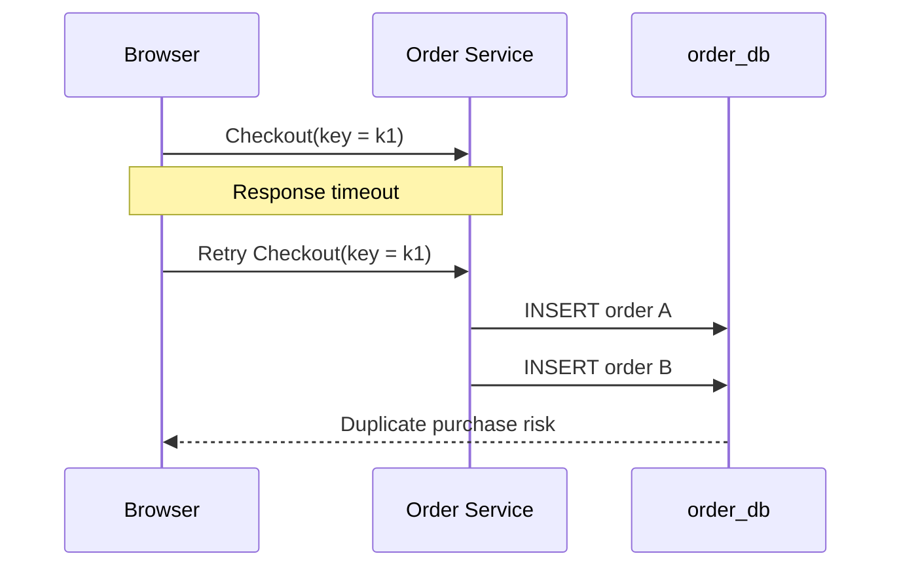
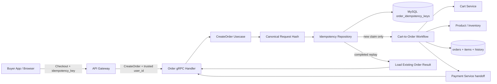
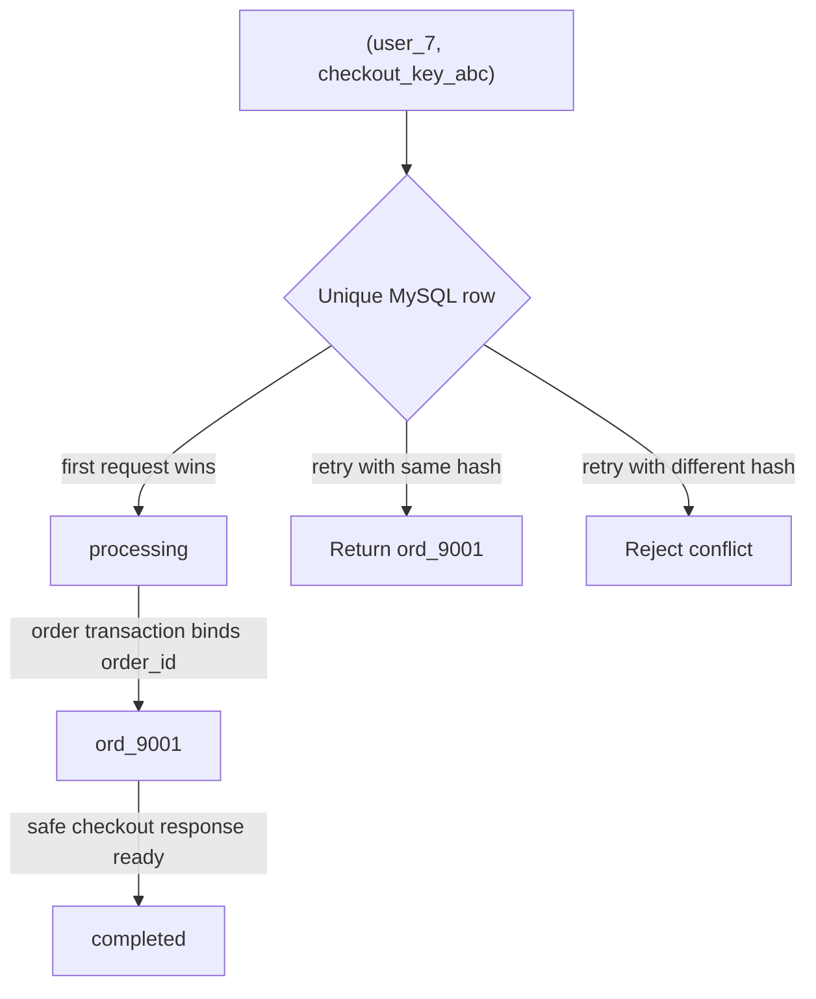
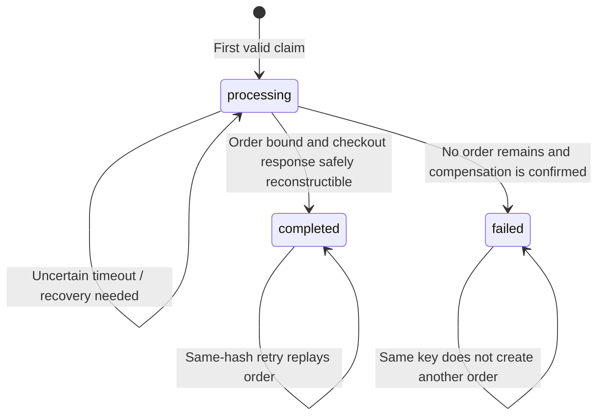
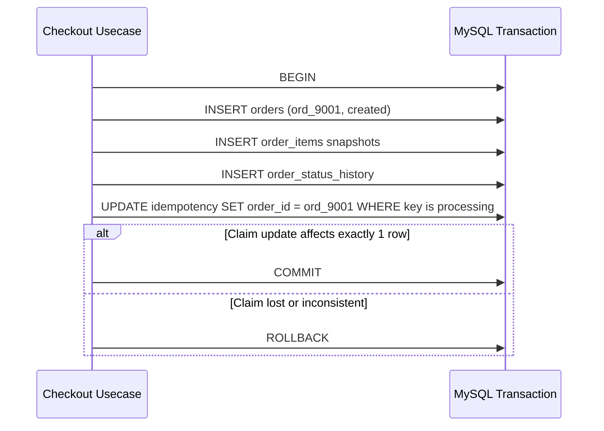
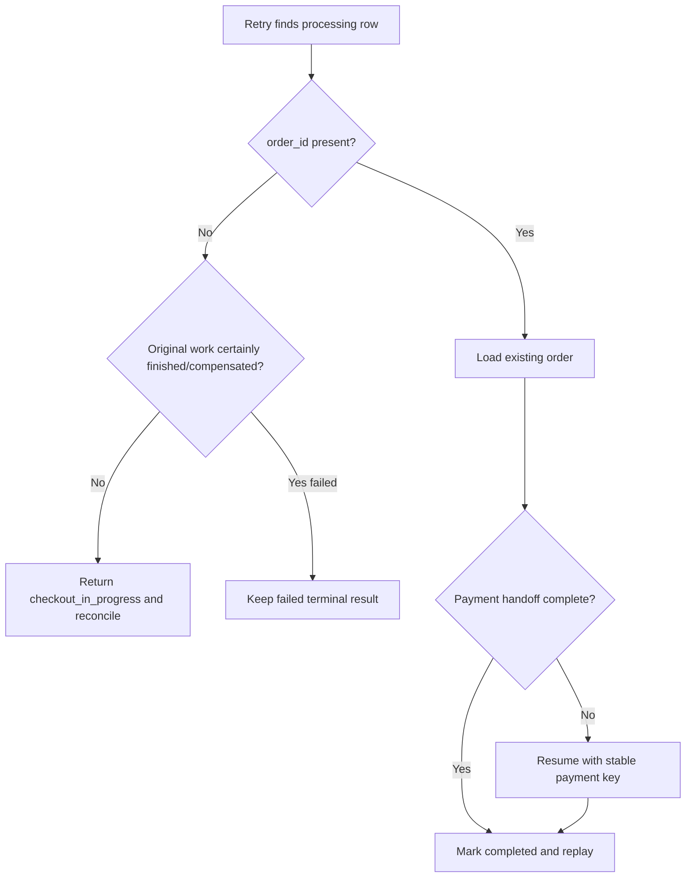
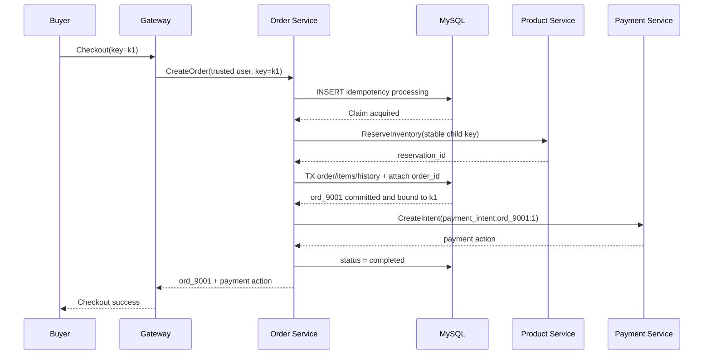
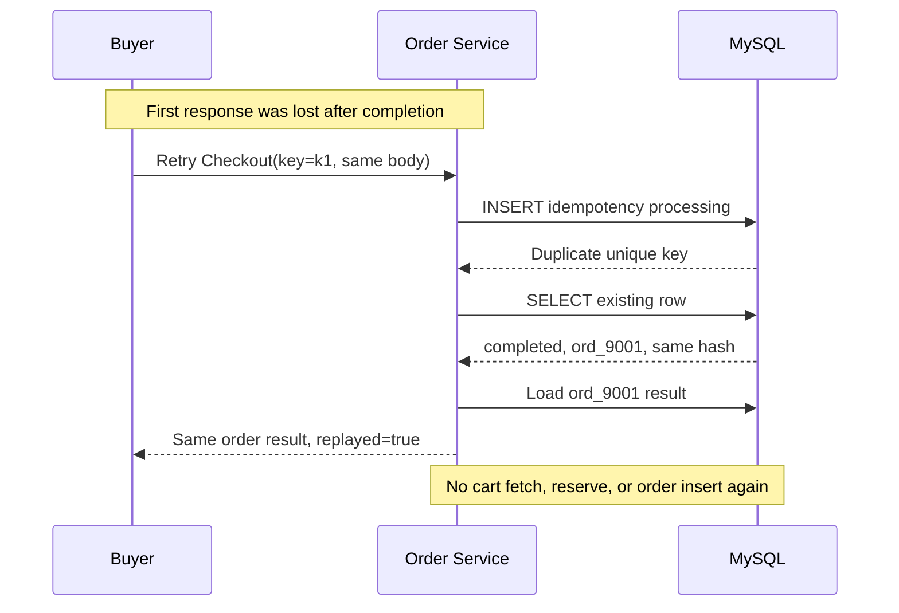

# 🔁 Order Service - Task 7: Idempotency Enforcement


## 📌 Task Summary

| Field | Detail |
|---|---|
| Task Name | Idempotency |
| Source | `docs/01-micro-tasks.md` → `Order Service` → Task 7 |
| Priority | `P0` checkout correctness requirement |
| Dependency | Order Service Task 2 schema, especially `order_idempotency_keys` |
| Protected Operation | Buyer checkout: `POST /api/v1/orders/checkout` → Order `CreateOrder` / `CreateOrderFromCart` workflow |
| Main Goal | Same checkout retry se duplicate order create na ho |
| Core Rule | Same buyer + same key + same request = same order result; same key + changed request = reject |
| Output Type | Documentation-only implementation guide with implementation-ready examples |
| Not Included | Actual Go/proto/API/migration files, Payment Service implementation, inventory internals, events |

> **Simple Hinglish goal:** User payment page par double-click kare, mobile network timeout ke baad request retry ho, ya Gateway request dubara bheje, tab Order Service ko dusra order nahi banana hai. Ek checkout request ke liye ek idempotency key hogi; Order Service us key ko database me claim karke usi order ko safely replay karega.

---

## ✅ Final Output Created

```text
TaskImplementation/
└── Order Service/
    ├── task1.md
    ├── task2.md
    ├── task3.md
    ├── task4.md
    ├── task5.md
    ├── task6.md
    └── task7.md
```

### Why this structure?

- `TaskImplementation/` existing task-wise documentation root ko retain karta hai.
- `Order Service/` existing sequential Order Service guides ko retain karta hai.
- `task7.md` sirf **Order Service - Task 7** ki idempotency enforcement guide hai.
- Task 1 to Task 6 ki files ko modify nahi kiya gaya.

> 🟢 **Important:** Requested deliverable documentation file hai. Is task me actual `backend/`, `proto/`, `api/`, SQL migration, frontend, queue, ya runtime configuration file create/edit nahi ki gayi.

---

## 🧭 Requirement Sources Studied

| Source | Task 7 ke liye liya gaya decision |
|---|---|
| `docs/01-micro-tasks.md` | Exact requirement: checkout retry par duplicate order na bane; idempotency key store aur enforce ho |
| `docs/02-system-architecture.md` | Checkout aur inventory reserve dono idempotency key ke saath chalenge |
| `docs/03-folder-structure.md` | Future repository placement: `mysql_idempotency_repository.go` under Order Service |
| `docs/04-microservice-design.md` | Order create ke liye idempotency key required hai; Order Service `order_idempotency_keys` own karta hai |
| `docs/05-database-design.md` | `(user_id, idempotency_key)` unique index Order DB ka required constraint hai |
| `database/draw.sql` | Existing table columns: `request_hash`, `order_id`, `processing/completed/failed`, `expires_at` |
| `api/master-api.json` | `CheckoutRequest` me `idempotency_key` required hai aur checkout Order Service ko route hota hai |
| `TaskImplementation/Order Service/task2.md` | Idempotency table ka schema foundation already documented hai |
| `TaskImplementation/Order Service/task3.md` | Cart validate → product refresh → inventory reserve → order transaction workflow protect karna hai |
| `TaskImplementation/Order Service/task4.md` | Payment intent ko apna deterministic key milta hai; checkout-level enforcement Task 7 ka ownership hai |
| `TaskImplementation/Order Service/task5.md` | Public wire RPC `CreateOrder` existing cart-based usecase ko invoke karta hai aur key carry karta hai |
| `TaskImplementation/Order Service/task6.md` | Seller order projection idempotency scope se separate hai |

---

## 🧱 Task Boundary

### ✅ Included in Task 7

- Checkout par `idempotency_key` mandatory validate karna
- Authenticated `user_id` ke saath key scope define karna
- Same logical request ka deterministic `request_hash` calculate karna
- MySQL unique constraint se first request ko atomic claim dena
- Concurrent duplicate request ko second order banane se rokna
- Completed request retry par existing `order_id` se response replay karna
- Same key ko different payload ke saath use karne par conflict return karna
- `processing`, `completed`, aur `failed` result rules define karna
- Task 3 inventory reservation aur Task 4 payment handoff ke saath safe integration explain karna
- Timeout/crash/TTL cleanup rules, logs, metrics, aur tests document karna
- Go and SQL implementation examples dena

### 🚫 Not Included in Task 7

| Outside Scope | Correct Owner / Reason |
|---|---|
| Actual Go source ya migration create karna | Current requested output documentation-only hai |
| Cart validation, price snapshot, totals calculation ko redesign karna | Order Service Task 3 already owns this flow |
| Payment provider intent/webhook idempotency implement karna | Payment Service / Order Task 4 boundary |
| Product Service ke reservation table/logic implement karna | Product/Inventory operations owner |
| Seller dashboard queries ya fulfillment change karna | Order Service Task 6 |
| `OrderCreated` / `OrderPaid` events emit karna | Order Service Task 8 |
| Redis distributed lock introduce karna | MySQL unique constraint required correctness boundary ke liye enough hai |
| API contract ya proto file add/edit karna | Task 5 contract already key carry karne ke liye documented hai |

> 🔴 **Scope rule:** Task 7 ka target exactly duplicate **checkout order creation** rokna hai. Ye payment charge, webhook, coupon redemption, inventory internals, ya event consumer idempotency ko secretly implement nahi karta.

---

## 🔗 Earlier Tasks Se Handoff

| Capability | Already Defined In | Task 7 Ka Use |
|---|---|---|
| `order_idempotency_keys` table | Task 2 / `database/draw.sql` | Durable key claim, state, hash aur created order mapping |
| `CreateOrderFromCartCommand.IdempotencyKey` | Task 3 | Protected workflow input |
| Inventory reservation key passed downstream | Task 3 | Retry ke waqt duplicate reservation risk reduce karna |
| Payment intent deterministic key | Task 4 | Created order ke baad payment call safely repeat karna |
| `CreateOrder` RPC key contract | Task 5 | Transport se usecase tak key pahunchana |
| Seller-specific reads | Task 6 | Idempotency logic se unaffected read path |

### Why Task 7 ab zaroori hai?

Task 3 me key field aur Task 2 me table ready the, lekin enforcement ke bina ye situation possible hai:



Task 7 ke baad database me ek key ka sirf ek winner hoga, isliye second request order-create flow enter hi nahi karegi.

---

## 🧠 Idempotency Ka Simple Meaning

**Idempotency** ka matlab hai: same action ko retry karne se business result repeat ho sakta hai, lekin naya side effect create nahi hona chahiye.

### Checkout examples

| Request Situation | Correct Result |
|---|---|
| First request: buyer + `key_101` + same cart/address | Ek new order create hoga |
| Same request network retry with `key_101` | Wahi existing order return hoga |
| Double-click se do parallel requests with `key_101` | Ek request process karegi; doosri replay/in-progress response legi |
| Same buyer + `key_101`, lekin changed address/coupon/cart | `idempotency_conflict` reject hoga |
| Different buyer same text key use kare | Allowed; key scope buyer-specific hai |
| Buyer intentionally new checkout kare | New idempotency key required hogi |

### Identity rule

```text
Unique scope = (authenticated_user_id, idempotency_key)
```

`user_id` request body se trust nahi hoga. Gateway/Auth se verified actor context se liya jayega, jaise Task 5 transport guide define karti hai.

---

## 🏗️ Architecture

### Checkout idempotency boundary



### One key, one order invariant



### Responsibility split

| Layer | Task 7 Responsibility | Kya Nahi Karega |
|---|---|---|
| Gateway / gRPC transport | Key required validation, trusted buyer context pass, application error map | Duplicate check memory me decide nahi karega |
| Usecase | Hash calculate, claim result branch, winner-only workflow run, replay return | Raw SQL ya provider details own nahi karega |
| Idempotency repository | Atomic claim/read/state updates via MySQL | Cart/payment business logic nahi karega |
| Order repository transaction | New order aur claimed key ko same local transaction me bind karna | Cross-service distributed transaction nahi banayega |
| Product/Inventory client | Winner ke stable downstream key par reservation call | Order idempotency row own nahi karega |
| Payment client | Created order ke stable payment-intent key par handoff | Checkout key ownership replace nahi karega |

---

## 🗂️ Clean Folder Structure

### Deliverable created in this task

```text
TaskImplementation/
└── Order Service/
    └── task7.md                         # This implementation guide only
```

### Target implementation structure described by this guide

> Neeche ka tree future code placement explain karta hai. Current documentation task me ye source files create nahi ki gayi.

```text
backend/
└── services/
    └── order-service/
        ├── cmd/
        │   └── server/
        │       └── main.go
        ├── internal/
        │   ├── domain/
        │   │   ├── order.go
        │   │   └── idempotency.go               # Key status and decisions
        │   ├── usecase/
        │   │   └── create_order_from_cart.go    # Claim wraps checkout flow
        │   ├── repository/
        │   │   ├── mysql_order_repository.go    # Create order + bind claim tx
        │   │   └── mysql_idempotency_repository.go
        │   └── transport/
        │       └── grpc/
        │           └── order_handler.go         # Error mapping
        └── migrations/
            └── ...                              # Task 2 schema ownership

proto/
└── ecommerce/
    └── order/
        └── v1/
            └── order.proto                      # Task 5 CreateOrder contract
```

---

## 🔐 Idempotency Contract

### Existing public input alignment

`api/master-api.json` already requires checkout input me `idempotency_key`:

```json
{
  "address_id": "addr_1001",
  "payment_provider": "razorpay",
  "coupon_code": "SAVE10",
  "idempotency_key": "checkout_01JABC123XYZ"
}
```

Task 5 ke gRPC mapping me yahi value `CreateOrderRequest.idempotency_key` se usecase tak jayegi.

### Key validation rules

| Rule | Example / Reason |
|---|---|
| Required | Empty key par checkout start nahi hoga |
| Maximum `128` characters | Existing MySQL column `VARCHAR(128)` se align |
| Client-generated unique value | UUID/ULID-style value retry ke liye stable rahegi |
| Same buyer workflow me reuse only | New intended purchase ke liye new key |
| Raw key logs me avoid karo | Untrusted high-cardinality/customer input ko logs/metrics labels me expose nahi karna |

### Request hash rules

Only key check enough nahi hai. Agar client same key ke saath address ya coupon change kar de, purana order silently return karna confusing aur unsafe hoga. Isliye request ke business payload ka SHA-256 hash store hota hai.

| Hash me include karo | Hash me include mat karo |
|---|---|
| `cart_id` or resolved checkout cart reference | `idempotency_key` itself |
| shipping address input/reference | trace ID, request ID |
| coupon code after normalization | timestamp |
| selected payment provider | network retry count |
| currency/other create-time choice, if input me present | mutable service responses fetched later |

> 🟡 **Why not cart contents fetched later?** Retry ke time cart change ho sakta hai. Idempotency ka purpose pehle completed purchase ka same result return karna hai, newly fetched cart se request ka meaning replace karna nahi. Input identity stable rakho; winner workflow purchase snapshots save karega.

---

## 🗄️ Existing Database Foundation

Task 2 aur `database/draw.sql` me required table already designed hai:

```sql
CREATE TABLE IF NOT EXISTS order_idempotency_keys (
  id BIGINT UNSIGNED NOT NULL AUTO_INCREMENT,
  user_id VARCHAR(64) NOT NULL,
  idempotency_key VARCHAR(128) NOT NULL,
  order_id VARCHAR(64) NULL,
  request_hash CHAR(64) NOT NULL,
  status ENUM('processing', 'completed', 'failed') NOT NULL DEFAULT 'processing',
  created_at TIMESTAMP NOT NULL DEFAULT CURRENT_TIMESTAMP,
  expires_at TIMESTAMP NOT NULL,
  PRIMARY KEY (id),
  UNIQUE KEY uk_order_idempotency_user_key (user_id, idempotency_key),
  KEY idx_order_idempotency_expires (expires_at)
) ENGINE=InnoDB;
```

### Column usage in Task 7

| Column | Enforcement Meaning |
|---|---|
| `user_id` | Verified buyer identity; key isolation boundary |
| `idempotency_key` | Retry token received through checkout contract |
| `request_hash` | Same key ke payload mismatch ko detect karta hai |
| `order_id` | Winner ke created order ko retries ke liye map karta hai |
| `status = processing` | Ek request ne key claim kar li; work chal raha hai ya recover hona hai |
| `status = completed` | Response/result existing order se safely replay ho sakta hai |
| `status = failed` | Attempt terminally fail aur compensate ho chuka; same key naya order nahi banayegi |
| `expires_at` | Retention/cleanup candidate timestamp; active work ko blindly delete karne ka permission nahi |

### Why unique index correctness boundary hai?

Application me pehle `SELECT`, phir `INSERT` karne se two simultaneous requests dono ko "key missing" dikhegi. Unique index par direct claim karne se MySQL decide karta hai kaun winner hai:

```text
UNIQUE (user_id, idempotency_key)
```

| Concurrent Attempt | Insert Result | Action |
|---|---|---|
| Request A | Insert succeeds | Workflow execute kare |
| Request B | Duplicate key (`1062`) | Existing row read karke replay/in-progress/conflict decide kare |

---

## 🔄 Status Model



### State behavior table

| Stored Row Situation | Incoming Same-Hash Request | Result |
|---|---|---|
| No row | Claim `processing`, execute checkout exactly once | New workflow |
| `processing`, no `order_id` | Work may still be active; do not enter create flow again | `checkout_in_progress`, retry later |
| `processing`, `order_id` present | Order exists; never insert another order | Resume safe post-order handoff or return processing |
| `completed`, `order_id` present | Load same saved order/result | Successful replay |
| `failed`, no `order_id` | Do not silently retry as new purchase | Stable failed response; new intent needs new key |
| Any status, different `request_hash` | Key used for another request body | `idempotency_conflict` |

> 🔴 **Important:** `processing` ko timeout dekhkar immediately new order permission mat do. Service crash ke baad order commit ho chuka ho sakta hai; blind retry duplicate purchase banayega.

---

## 🛠️ Step-by-Step Implementation

## Step 1: Checkout entry par key validate karo

Checkout handler trusted actor identity nikalega aur request key ko usecase me pass karega. Invalid input par database claim bhi nahi banana.

```go
func validateIdempotencyKey(key string) error {
	key = strings.TrimSpace(key)
	if key == "" {
		return ErrIdempotencyKeyRequired
	}
	if len(key) > 128 {
		return ErrIdempotencyKeyInvalid
	}
	return nil
}
```

### Explanation

| Check | Why |
|---|---|
| Blank reject | Retry identify karne ka stable token hi nahi hoga |
| Length reject | MySQL truncate/error ambiguity avoid hoti hai |
| Buyer from auth context | Attacker dusre user ki key se order replay nahi kar sakta |

Recommended application errors:

| Condition | gRPC Code | REST Mapping |
|---|---|---|
| Key missing/invalid | `InvalidArgument` | `400 Bad Request` |
| Same key, changed payload | `AlreadyExists` or `FailedPrecondition` | `409 Conflict` |
| Existing request still running | `Aborted` | `409 Conflict` with retry hint |

---

## Step 2: Canonical request hash banao

Hash deterministic hona chahiye: same logical input har retry par same bytes banaye. Go struct marshal stable field order deta hai; arbitrary map use karne ke bajaye explicit fingerprint struct use karo.

```go
type CheckoutFingerprint struct {
	CartID          string          `json:"cart_id"`
	ShippingAddress AddressSnapshot `json:"shipping_address"`
}

func checkoutRequestHash(cmd CreateOrderCommand) (string, error) {
	body, err := json.Marshal(CheckoutFingerprint{
		CartID:          strings.TrimSpace(cmd.CartID),
		ShippingAddress: normalizeAddress(cmd.ShippingAddress),
	})
	if err != nil {
		return "", err
	}

	sum := sha256.Sum256(body)
	return hex.EncodeToString(sum[:]), nil
}
```

### Explanation

- `request_hash` ka output 64 hexadecimal characters hota hai, existing `CHAR(64)` column se exact match.
- Task 5 ke documented usecase contract me `CartID` aur `ShippingAddress` create-time business input hain, isliye example unko hash karta hai.
- Agar final transport Task 3/API inventory se `coupon_code` ya `payment_provider` bhi command me wire kare, to release se pehle un normalized fields ko fingerprint me include karna mandatory hoga.
- Address ya cart badalne par hash badlega aur same key misuse reject hoga.
- `UserID` hash ke andar optional hai because uniqueness scope me already `user_id` separate column hai; repository dono ko saath query karegi.

---

## Step 3: Domain decision aur repository interface define karo

Usecase ko MySQL duplicate-key detail pata nahi honi chahiye. Repository clean decision return karegi.

```go
type ClaimDecision string

const (
	ClaimAcquired   ClaimDecision = "acquired"
	ClaimReplay     ClaimDecision = "replay"
	ClaimInProgress ClaimDecision = "in_progress"
	ClaimResume     ClaimDecision = "resume"
	ClaimFailed     ClaimDecision = "failed"
)

type IdempotencyClaim struct {
	UserID         string
	Key            string
	RequestHash    string
	OrderID        string
	Status         string
	Decision       ClaimDecision
	ExpiresAt      time.Time
}

type IdempotencyRepository interface {
	Claim(ctx context.Context, userID, key, requestHash string, expiresAt time.Time) (IdempotencyClaim, error)
	Complete(ctx context.Context, userID, key, orderID string) error
	MarkFailed(ctx context.Context, userID, key string) error
}
```

Application errors:

```go
var (
	ErrIdempotencyConflict = errors.New("idempotency key reused with different checkout input")
	ErrCheckoutInProgress  = errors.New("checkout with this idempotency key is processing")
	ErrCheckoutFailed      = errors.New("checkout with this idempotency key already failed")
)
```

### Explanation

Transport sirf error map karega, usecase business branch choose karega, aur repository SQL race handle karegi. Is separation se duplicate protection testable aur readable rehti hai.

---

## Step 4: MySQL me atomic claim implement karo

First request ek `processing` row insert karne ki try karegi. Same buyer/key already present ho to MySQL unique index duplicate-key error dega; uske baad stored row inspect hogi.

### Claim SQL

```sql
INSERT INTO order_idempotency_keys
  (user_id, idempotency_key, request_hash, status, expires_at)
VALUES
  (?, ?, ?, 'processing', ?);
```

### Existing claim lookup SQL

```sql
SELECT request_hash, order_id, status, expires_at
FROM order_idempotency_keys
WHERE user_id = ? AND idempotency_key = ?;
```

### Go repository example

```go
func (r *MySQLIdempotencyRepository) Claim(
	ctx context.Context,
	userID, key, hash string,
	expiresAt time.Time,
) (IdempotencyClaim, error) {
	_, err := r.db.ExecContext(ctx, `
		INSERT INTO order_idempotency_keys
			(user_id, idempotency_key, request_hash, status, expires_at)
		VALUES (?, ?, ?, 'processing', ?)`,
		userID, key, hash, expiresAt,
	)
	if err == nil {
		return IdempotencyClaim{
			UserID: userID, Key: key, RequestHash: hash,
			Status: "processing", Decision: ClaimAcquired, ExpiresAt: expiresAt,
		}, nil
	}
	if !isDuplicateKey(err) {
		return IdempotencyClaim{}, err
	}

	var stored IdempotencyClaim
	err = r.db.QueryRowContext(ctx, `
		SELECT request_hash, COALESCE(order_id, ''), status, expires_at
		FROM order_idempotency_keys
		WHERE user_id = ? AND idempotency_key = ?`,
		userID, key,
	).Scan(&stored.RequestHash, &stored.OrderID, &stored.Status, &stored.ExpiresAt)
	if err != nil {
		return IdempotencyClaim{}, err
	}
	stored.UserID, stored.Key = userID, key

	if stored.RequestHash != hash {
		return IdempotencyClaim{}, ErrIdempotencyConflict
	}
	switch {
	case stored.Status == "completed":
		stored.Decision = ClaimReplay
	case stored.Status == "processing" && stored.OrderID != "":
		stored.Decision = ClaimResume
	case stored.Status == "processing":
		stored.Decision = ClaimInProgress
	case stored.Status == "failed":
		stored.Decision = ClaimFailed
	}
	return stored, nil
}
```

Duplicate-key helper project ke existing Go/MySQL style ko follow kar sakta hai:

```go
func isDuplicateKey(err error) bool {
	var mysqlErr *mysql.MySQLError
	return errors.As(err, &mysqlErr) && mysqlErr.Number == 1062
}
```

> 🟢 **Key point:** Check-then-insert application lock nahi hai. `INSERT` plus database unique constraint hi concurrent calls ke beech atomic winner decide karega.

---

## Step 5: Claimed key ke winner ko hi Task 3 flow chalane do

Task 3 ka existing business flow intact rahega:

```text
GetCart → validate → refresh product/price → reserve inventory → create order transaction
```

Task 7 is flow ke entrance par gate lagata hai:

```go
func (uc *CreateOrderUsecase) Execute(
	ctx context.Context,
	cmd CreateOrderCommand,
) (CreateOrderResult, error) {
	if err := validateIdempotencyKey(cmd.IdempotencyKey); err != nil {
		return CreateOrderResult{}, err
	}

	hash, err := checkoutRequestHash(cmd)
	if err != nil {
		return CreateOrderResult{}, err
	}

	claim, err := uc.idempotency.Claim(
		ctx, cmd.UserID, cmd.IdempotencyKey, hash, time.Now().Add(24*time.Hour),
	)
	if err != nil {
		return CreateOrderResult{}, err
	}

	switch claim.Decision {
	case ClaimReplay:
		return uc.loadCheckoutResult(ctx, claim.OrderID)
	case ClaimResume:
		return uc.resumeAfterCreatedOrder(ctx, cmd, claim.OrderID)
	case ClaimInProgress:
		return CreateOrderResult{}, ErrCheckoutInProgress
	case ClaimFailed:
		return CreateOrderResult{}, ErrCheckoutFailed
	case ClaimAcquired:
		return uc.executeClaimedCheckout(ctx, cmd, claim)
	default:
		return CreateOrderResult{}, errors.New("unknown idempotency decision")
	}
}
```

### Explanation

| Branch | Kya Hoga |
|---|---|
| `ClaimAcquired` | Sirf first winner cart/inventory/order creation execute karega |
| `ClaimReplay` | Cart dobara read ya inventory reserve nahi hogi; existing result load hoga |
| `ClaimResume` | Order already created hai; only safe incomplete post-order coordination resume hogi |
| `ClaimInProgress` | Duplicate concurrent request wait/retry response legi, side effect nahi karegi |
| `ClaimFailed` | Same key ko second purchase me turn nahi kiya jayega |

---

## Step 6: Inventory reservation ko stable downstream key do

Task 3 already inventory reservation ko idempotency-aware banane ka rule define karti hai. Winner process timeout ke baad recover ho, tab Product/Inventory boundary ko bhi same stable operation key milni chahiye.

```go
func childOperationKey(prefix, userID, checkoutKey string) string {
	sum := sha256.Sum256([]byte(userID + ":" + checkoutKey))
	return prefix + ":" + hex.EncodeToString(sum[:])
}

reservation, err := uc.products.ReserveInventory(ctx, ReserveInventoryRequest{
	UserID:         cmd.UserID,
	CartID:         cmd.CartID,
	IdempotencyKey: childOperationKey("order-reservation", cmd.UserID, cmd.IdempotencyKey),
	Items:          buildReservationItems(cart.Items),
})
```

### Why derived key?

| Benefit | Detail |
|---|---|
| Stable retries | Same checkout recovery same reservation identity carry karegi |
| Bounded length | Prefix plus SHA-256 known-size value hai |
| Boundary clarity | Checkout key aur inventory operation key ka purpose visible rehta hai |
| Raw client key isolation | Internal downstream calls me arbitrary raw input forward nahi karna padta |

> 🟡 **Ownership note:** Task 7 stable key send karne ka Order Service rule document karti hai. Product Service is key ko internally kaise enforce karega, woh Product/Inventory task ka implementation hai.

---

## Step 7: Order creation aur key-to-order binding ek local transaction me karo

Sabse dangerous crash window ye hai:

1. `orders` row commit ho jaye.
2. Service crash ho jaye before `order_idempotency_keys.order_id` update.
3. Retry ko lage order exist nahi karta aur naya order create ho jaye.

Isliye order insert aur claimed key par `order_id` attach karna **same MySQL transaction** me hona chahiye.

### Transaction flow



### Bind SQL inside order transaction

```sql
UPDATE order_idempotency_keys
SET order_id = ?
WHERE user_id = ?
  AND idempotency_key = ?
  AND request_hash = ?
  AND status = 'processing'
  AND order_id IS NULL;
```

### Repository shape

```go
type OrderRepository interface {
	CreateOrderAndAttachClaim(
		ctx context.Context,
		order Order,
		claim IdempotencyClaim,
	) error
	LoadCheckoutResult(ctx context.Context, orderID string) (CreateOrderResult, error)
}
```

```go
func (r *MySQLOrderRepository) CreateOrderAndAttachClaim(
	ctx context.Context,
	order Order,
	claim IdempotencyClaim,
) error {
	tx, err := r.db.BeginTx(ctx, nil)
	if err != nil {
		return err
	}
	defer tx.Rollback()

	if err := r.insertOrder(ctx, tx, order); err != nil {
		return err
	}
	if err := r.insertItemsAndInitialHistory(ctx, tx, order); err != nil {
		return err
	}

	result, err := tx.ExecContext(ctx, `
		UPDATE order_idempotency_keys
		SET order_id = ?
		WHERE user_id = ? AND idempotency_key = ?
		  AND request_hash = ? AND status = 'processing'
		  AND order_id IS NULL`,
		order.OrderID, claim.UserID, claim.Key, claim.RequestHash,
	)
	if err != nil {
		return err
	}
	affected, err := result.RowsAffected()
	if err != nil || affected != 1 {
		return ErrCheckoutInProgress
	}

	return tx.Commit()
}
```

### Explanation

- Task 3 ke order header, items aur status history transaction ko preserve kiya.
- Task 7 ne same transaction me key-to-order binding add ki.
- Order committed hai to mapping committed hai; mapping absent hai to order insert rollback hai.
- Inventory external service me hai, isliye reservation failure compensation/TTL Task 3 ke saga rule ke according hi chalega.

---

## Step 8: Payment handoff ke baad completion mark karo

Task 4 / Task 5 ke checkout response me payment handoff included ho sakta hai. Order once created ho gaya to retry ko new order kabhi nahi banana; payment coordination deterministic `order_id` based key se safely continue hogi.

```text
payment_intent:{order_id}:1
```

### Completion SQL

```sql
UPDATE order_idempotency_keys
SET status = 'completed'
WHERE user_id = ?
  AND idempotency_key = ?
  AND order_id = ?
  AND status = 'processing';
```

### Usecase placement example

```go
func (uc *CreateOrderUsecase) executeClaimedCheckout(
	ctx context.Context,
	cmd CreateOrderCommand,
	claim IdempotencyClaim,
) (CreateOrderResult, error) {
	order, reservation, err := uc.prepareAndReserve(ctx, cmd)
	if err != nil {
		// Sirf confirmed terminal pre-order result (for example invalid cart or
		// definite out-of-stock) ko failed mark karo. Timeout remains processing.
		if isConfirmedTerminalBeforeOrder(err) {
			_ = uc.idempotency.MarkFailed(ctx, claim.UserID, claim.Key)
		}
		return CreateOrderResult{}, err
	}

	if err := uc.orders.CreateOrderAndAttachClaim(ctx, order, claim); err != nil {
		releaseErr := uc.products.ReleaseInventory(ctx, reservation.ReservationID)
		// DB timeout me commit outcome unknown ho sakta hai. Failed tabhi set
		// karo jab rollback definite aur reservation release confirmed ho.
		if isConfirmedRollback(err) && releaseErr == nil {
			_ = uc.idempotency.MarkFailed(ctx, claim.UserID, claim.Key)
		}
		return CreateOrderResult{}, err
	}

	result, err := uc.coordinatePaymentForExistingOrder(ctx, order.OrderID)
	if err != nil {
		// Order exists. Key stays processing for safe resume; no new order is permitted.
		return CreateOrderResult{}, err
	}

	if err := uc.idempotency.Complete(ctx, claim.UserID, claim.Key, order.OrderID); err != nil {
		return CreateOrderResult{}, err
	}
	return result, nil
}
```

> 🔴 **Critical difference:** Order create hone ke baad payment timeout par key ko `failed` karke naya order allow nahi karna. `order_id` already attached hai; retry same order ki safe payment coordination resume/replay karegi.

---

## Step 9: Successful retry par existing result replay karo

Completed key retry par:

1. `request_hash` same hona verify ho chuka hoga.
2. Stored `order_id` load karo.
3. Saved order/payment-safe response reconstruct karo.
4. Cart refresh, inventory reserve, order insert dobara mat chalao.

```go
func (uc *CreateOrderUsecase) loadCheckoutResult(
	ctx context.Context,
	orderID string,
) (CreateOrderResult, error) {
	if orderID == "" {
		return CreateOrderResult{}, ErrCheckoutInProgress
	}
	return uc.orders.LoadCheckoutResult(ctx, orderID)
}
```

### Replay response example

```json
{
  "order": {
    "order_id": "ord_9001",
    "status": "pending_payment",
    "total": {
      "currency": "INR",
      "minor_units": 299900
    }
  },
  "idempotency_replayed": true
}
```

> 🟡 **Response note:** Provider secrets/card details Order Service me store ya replay nahi honge. Payment action ko re-fetch/reconstruct karne ka contract Payment coordination boundary follow karega; Task 7 ka invariant same order return karna hai.

---

## Step 10: Same key, changed payload reject karo

Example:

| Attempt | Key | Address | Coupon | Result |
|---|---|---|---|---|
| Original | `checkout_k1` | `addr_home` | `SAVE10` | `ord_9001` create |
| Retry | `checkout_k1` | `addr_office` | `SAVE10` | Reject conflict |

```json
{
  "code": "idempotency_conflict",
  "message": "This idempotency key was already used for a different checkout request."
}
```

### Why reject rather than return old order?

- User ko galat address wale purchase ka misleading success response nahi milta.
- Client bug immediately visible hota hai.
- Security and audit me request mutation hide nahi hoti.

Client correction rule:

```text
Changed intended purchase = create a fresh idempotency key.
Retry of same intended purchase = reuse the original key.
```

---

## Step 11: Failure, timeout aur recovery rules define karo

Distributed checkout me MySQL ke bahar Product aur Payment calls bhi hain. Har failure ko `failed` bolna safe nahi hota.

### Failure decisions

| Failure Point | `order_id` Bound? | Key State | Retry Rule |
|---|---:|---|---|
| Input/hash validation fail before claim | No | No row | Correct input/key ke saath retry |
| Cart invalid / no stock; no side effect remains | No | `failed` after confirmed outcome | Same key stable failure; new intended attempt needs new key |
| Inventory reserved, DB order insert fails, release confirmed/TTL accepted | No | `failed` after compensation decision | No duplicate order |
| Order transaction commits | Yes | Keep `processing` until response ready | Never recreate order |
| Payment request timeout after order exists | Yes | Keep `processing` | Same `order_id` se deterministic payment resume |
| Completing key update timeout | Yes | Row reload karo | `completed` ho sakta hai; new order forbidden |

### Recovery flow



### Expiration and cleanup

Existing schema me `expires_at` cleanup support karta hai. Recommended initial retention:

```text
ORDER_IDEMPOTENCY_TTL = 24h
```

| Cleanup Rule | Why |
|---|---|
| `completed` / `failed` rows retention ke baad cleanup eligible hain | Table growth control |
| Active `processing` row ko blind delete mat karo | In-flight/crashed order duplicate ho sakta hai |
| `processing` expired row reconciliation queue/manual job ke liye flag karo | Unknown outcome safely inspect karna zaroori hai |
| TTL business retry window se chhoti mat rakho | Slow browser/payment redirect retries ko protect karna |

> 🟡 **Operational choice:** Production business ko retries/audit ke liye 24 hours se longer retention chahiye ho sakti hai. Table `expires_at` policy ko configurable rakho; Task 7 me cleanup worker implement nahi kiya gaya.

---

## Step 12: Transport error mapping aur client behavior

### gRPC-to-REST mapping

| Application Error | gRPC | HTTP | Client Action |
|---|---|---:|---|
| `ErrIdempotencyKeyRequired` | `InvalidArgument` | `400` | New valid key provide karo |
| `ErrIdempotencyConflict` | `AlreadyExists` | `409` | Changed purchase ke liye new key generate karo |
| `ErrCheckoutInProgress` | `Aborted` | `409` | Same key ke saath backoff retry karo |
| `ErrCheckoutFailed` | `FailedPrecondition` | `409` | Error show karo; user explicitly retry kare to new key |
| Database unavailable | `Unavailable` | `503` | Same key reuse karke retry karo |

### Retry safety rule for frontend/Gateway

```text
Transport timeout or 5xx = same idempotency key reuse karo.
User request content change = new idempotency key banao.
```

Gateway in-memory cache/lock idempotency correctness ka source nahi hoga, kyunki multiple instances aur restarts ke across durable MySQL enforcement required hai.

---

## 🧵 End-to-End Sequences

### First successful checkout



### Retry after response timeout



### Two parallel requests

```mermaid
sequenceDiagram
    participant A as Request A
    participant B as Request B
    participant DB as MySQL
    participant Flow as Checkout Flow

    par Arrive together
        A->>DB: INSERT (user, k1)
        B->>DB: INSERT (user, k1)
    end
    DB-->>A: Insert succeeds
    DB-->>B: Duplicate key
    A->>Flow: Execute winner workflow
    B->>DB: Read status=processing
    DB-->>B: In progress; do not create order
```

---

## 🧪 Testing Strategy

### Must-have test matrix

| Test | Setup | Expected Assertion |
|---|---|---|
| First checkout | Fresh key | One key row and one order created |
| Completed retry | Same key + same payload | Same order ID returned; no second reserve/order call |
| Payload conflict | Same key + changed address/coupon | Conflict; original order unchanged |
| Per-user scope | Two buyers use same text key | Each buyer may create own order |
| Parallel same key | Two goroutines hit fresh key | Exactly one order row created |
| Processing without order | Existing processing key | In-progress; no workflow invocation |
| Processing with order | Existing key bound to order | No new order; resume/replay branch |
| Failure before order | Stock failure | Terminal key behavior defined; no order created |
| DB failure after reserve | Reserve succeeds, order transaction fails | Release attempted; key does not make duplicate order |
| Payment timeout after order | Order already attached | Key is not reset to create a new order |
| Expired processing | Old processing row | Not blindly deleted/recreated |

### Usecase replay test example

```go
func TestCreateOrder_RetryReplaysCompletedOrder(t *testing.T) {
	idem := &fakeIdempotencyRepository{
		claim: IdempotencyClaim{
			Decision: ClaimReplay,
			OrderID:  "ord_9001",
		},
	}
	orders := &fakeOrderRepository{
		result: CreateOrderResult{OrderID: "ord_9001"},
	}
	products := &fakeProductClient{}

	uc := CreateOrderUsecase{idempotency: idem, orders: orders, products: products}
	got, err := uc.Execute(context.Background(), validCreateCommand("key_1"))

	require.NoError(t, err)
	require.Equal(t, "ord_9001", got.OrderID)
	require.Equal(t, 0, products.reserveCalls)
	require.Equal(t, 0, orders.createCalls)
}
```

### Concurrency integration test idea

```go
func TestCreateOrder_SameKeyConcurrentRequestsCreateOneOrder(t *testing.T) {
	// Real MySQL test database me same user/key ke saath two goroutines run karo.
	// Assert:
	// 1. order_idempotency_keys me exactly one scoped key row hai.
	// 2. orders me checkout ke liye exactly one order hai.
	// 3. Result IDs replay/resume hone ke baad same hain.
}
```

### Recommended verification commands for future source implementation

```bash
go test ./...
go test -race ./...
```

> 🟢 **Current deliverable note:** Is documentation task me executable Order Service source present/create nahi hua, isliye above tests run nahi kiye gaye. Ye actual implementation ke acceptance tests hain.

---

## 📈 Observability and Security

### Logs

| Log Field | Include? | Reason |
|---|---:|---|
| `order_id` | Yes, when known | Retry/recovery trace |
| Hashed/redacted key identifier | Yes | Raw customer input expose kiye bina correlation |
| `claim_decision` | Yes | `acquired`, `replay`, `in_progress`, `conflict` diagnose karna |
| `request_hash` full value | Avoid in normal info log | Debug ke liye restricted context enough |
| Payment secret/card detail | Never | Sensitive information boundary |

### Metrics

| Metric | Meaning |
|---|---|
| `order_checkout_idempotency_claim_total{decision="acquired"}` | New checkout attempts |
| `order_checkout_idempotency_claim_total{decision="replay"}` | Successful retry protection |
| `order_checkout_idempotency_claim_total{decision="conflict"}` | Client misuse/bug signal |
| `order_checkout_idempotency_claim_total{decision="in_progress"}` | Concurrent retries/timeouts |
| `order_checkout_idempotency_processing_expired_total` | Recovery attention needed |

> 🔴 **Metrics rule:** `idempotency_key` ya `user_id` ko metric label mat banao; cardinality aur data exposure dono badhenge.

### Security checklist

| Rule | Why |
|---|---|
| `user_id` trusted auth context se lo | Cross-user order replay prevent hota hai |
| Key length/input validate karo | Storage abuse aur malformed keys control hote hain |
| Request hash mismatch reject karo | Key hijack/mutated checkout hidden nahi rahta |
| MySQL parameterized queries use karo | SQL injection prevent hoti hai |
| Raw key/payment secrets logs me mat rakho | Sensitive/debug leakage reduce hoti hai |

---

## 📦 External Libraries and Tools

### Task 7 me needed/reused tools

| Library / Tool | Type | Why Used | Install / Usage |
|---|---|---|---|
| Go `crypto/sha256`, `encoding/hex`, `encoding/json` | Standard library | Deterministic request hash aur internal derived key | Install nahi chahiye; Go imports se directly use |
| Go `database/sql` | Standard library | MySQL transactions aur parameterized queries | Install nahi chahiye |
| `github.com/go-sql-driver/mysql` | Go MySQL driver | MySQL connectivity aur duplicate error `1062` identify karna; project ke Auth Service me bhi same driver pattern present hai | Future Order Service module me `go get github.com/go-sql-driver/mysql@v1.9.3` |
| MySQL / InnoDB | Database | Durable unique constraint and local ACID transaction | Project database environment/migrations ke through run; schema Task 2 me defined hai |
| gRPC / Protobuf | Existing transport stack | `CreateOrder` key ko usecase tak carry aur errors map karna | Task 5 implementation dependency; Task 7 koi new RPC introduce nahi karta |
| Mermaid | Markdown diagram syntax | Architecture aur retry flow visually explain karna | GitHub/compatible Markdown renderer me fenced `mermaid` block render hota hai; runtime install nahi |

### Future Go imports example

```go
import (
	"context"
	"crypto/sha256"
	"database/sql"
	"encoding/hex"
	"encoding/json"
	"errors"
	"strings"
	"time"

	"github.com/go-sql-driver/mysql"
)
```

### Installation commands for future runtime implementation

```bash
cd backend/services/order-service
go get github.com/go-sql-driver/mysql@v1.9.3
go mod tidy
go test ./...
```

> 🟡 **Dependency note:** Current Task 7 output sirf Markdown guide hai. Is task ko document karne ke liye koi package install nahi kiya gaya aur existing Go modules change nahi kiye gaye.

---

## ⚠️ Common Mistakes Avoid Karna

| Mistake | Problem | Correct Task 7 Approach |
|---|---|---|
| Key ko sirf Gateway memory me cache karna | Restart/multiple pods par duplicate order | Durable MySQL unique row |
| `SELECT` then separate `INSERT` without unique constraint | Race condition | Insert-and-handle-duplicate |
| Key ko global unique rakhna without user scope | Two buyers accidentally conflict kar sakte hain | `(user_id, idempotency_key)` unique |
| Same key changed body ko old success return karna | Wrong address/coupon silently accepted | `request_hash` conflict reject |
| Order insert aur `order_id` bind separate commits me karna | Crash window duplicate order bana sakti hai | Same local DB transaction |
| Payment timeout ke baad fresh order create karna | Multiple orders/charges risk | Bound order resume with stable payment key |
| Expired `processing` row delete karke retry allow karna | Unknown committed work duplicate ho sakta hai | Reconcile first |
| Raw keys metric labels me use karna | High cardinality/data exposure | Decision metrics and redacted identifier |

---

## ✅ Acceptance Checklist

| Requirement | Status in This Guide |
|---|---:|
| Existing `TaskImplementation/Order Service/` retained | ✅ |
| `TaskImplementation/Order Service/task7.md` created | ✅ |
| Hinglish step-by-step implementation | ✅ |
| Task 7 exact requirement and dependency documented | ✅ |
| Unique key and request hash enforcement explained | ✅ |
| Concurrent retry, replay, conflict, crash handling covered | ✅ |
| Folder structure included | ✅ |
| Go and SQL code examples included | ✅ |
| Mermaid architecture/flow diagrams included | ✅ |
| Libraries/tools with purpose and install/use included | ✅ |
| Beginner-friendly tables, badges, and readability included | ✅ |
| No actual source/API/schema/event/payment implementation added | ✅ |
| No behavior beyond Order Service Task 7 documented as delivered work | ✅ |

---

## 🔮 Relation to Next Order Service Task

| Future Task | Task 7 Se Handoff |
|---|---|
| Task 8: Emit order events | Idempotently created order ke baad `OrderCreated` publish karna hoga; event/outbox implementation Task 8 ka scope rahega |

Task 7 khud event publish nahi karti. Ye sirf guarantee banati hai ki retry ke karan do alag orders na banen, jisse future event emission bhi duplicate business orders se polluted na ho.

---

## ✅ Final Task 7 Standard

Order Service Task 7 ka implementation blueprint ready hai:

1. Checkout input me required idempotency key receive aur validate hogi.
2. Authenticated buyer + key par MySQL unique claim create hogi.
3. `request_hash` same key ko changed checkout payload ke saath reuse hone se rokega.
4. Sirf claim winner Cart → Inventory → Order workflow execute karega.
5. Order transaction claimed key ke saath `order_id` atomically bind karegi.
6. Completed retry existing order replay karegi; concurrent/incomplete retry second order nahi banayegi.
7. Payment timeout, failure, cleanup, logs aur tests ke safety rules clear hain.

> ✅ **Task 7 complete as requested:** Sirf `TaskImplementation/Order Service/task7.md` documentation deliverable create hua hai. Actual backend/proto/API/schema changes, payment/inventory internals, events, UI, aur future functionality intentionally add nahi ki gayi.
