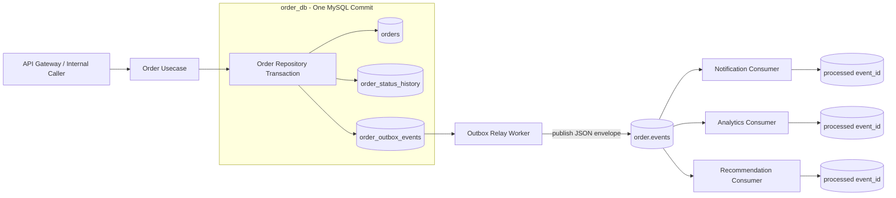
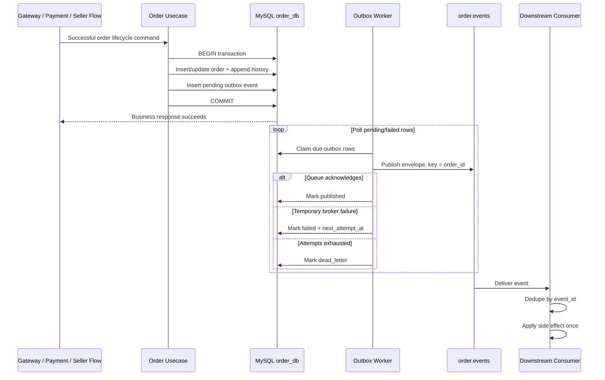
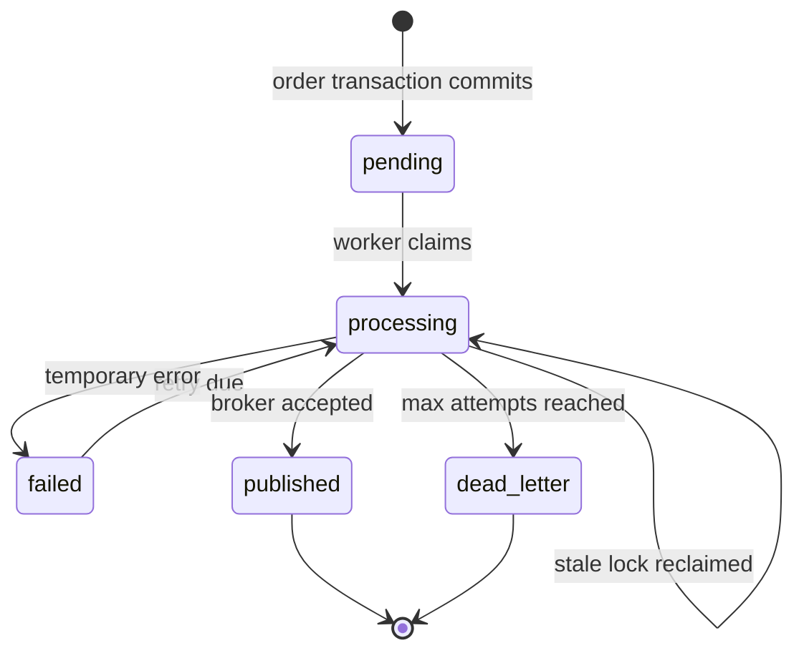
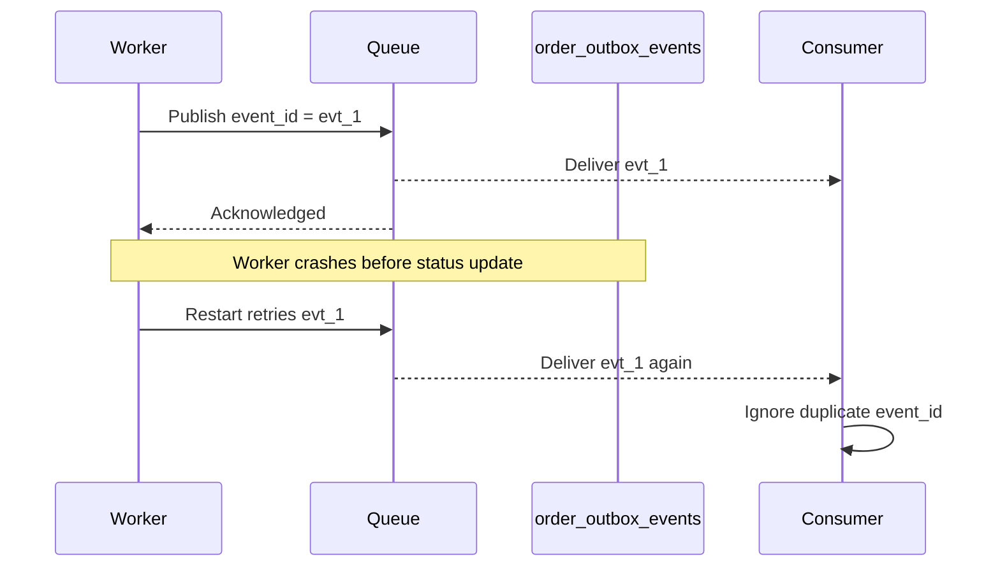

# 📣 Order Service - Task 8: Emit Order Events


## 📌 Task Summary

| Field | Detail |
|---|---|
| Task Name | Emit order events |
| Source | `docs/01-micro-tasks.md` → `Order Service` → Task 8 |
| Priority | `P1` core business integration |
| Dependency | Message queue: Kafka recommended by project docs, RabbitMQ acceptable |
| Required Events | `OrderCreated`, `OrderPaid`, `OrderCancelled`, `OrderDelivered` |
| Topic / Stream | `order.events` |
| Main Goal | Order lifecycle ke important successful changes ko reliably downstream services tak publish karna |
| Reliability Choice | MySQL transactional outbox + asynchronous publisher worker |
| Delivery Semantics | At-least-once publish; consumers `event_id` se idempotent honge |
| Output Type | Documentation-only implementation guide with implementation-ready examples |
| Not Included | Actual Go/SQL/config/queue infrastructure changes, consumer services, extra order features |

> **Simple Hinglish goal:** Order banne, payment successful hone, cancel hone, ya deliver hone ke baad Notification, Analytics, Recommendation jaise downstream systems ko update chahiye. Order Service event directly request handler se blindly publish nahi karega. Pehle order change aur event record ek hi MySQL transaction me safely save hoga, phir background worker us event ko `order.events` queue par publish karega.

---

## ✅ Final Output Created

```text
TaskImplementation/
└── Order Service/
    ├── task1.md
    ├── task2.md
    ├── task3.md
    ├── task4.md
    ├── task5.md
    ├── task6.md
    ├── task7.md
    └── task8.md
```

### Why this structure?

- `TaskImplementation/` existing task-wise documentation root ko retain karta hai.
- `Order Service/` already present tha, isliye existing guides safe rakhe gaye.
- `task8.md` sirf **Order Service - Task 8** ki event emission implementation guide hai.
- Task 1 to Task 7 guides aur executable backend files ko is deliverable me edit nahi kiya gaya.

> 🟢 **Important:** User-requested output ek Markdown implementation guide hai. Neeche SQL aur Go examples actual implementation ko explain karte hain; is task output me runtime source, migration, configuration, queue, proto, ya dependency file create/edit nahi ki gayi.

---

## 🧭 Requirement Sources Studied

| Source | Task 8 ke liye liya gaya decision |
|---|---|
| `docs/01-micro-tasks.md` | Exact requirement: `OrderCreated`, `OrderPaid`, `OrderCancelled`, `OrderDelivered` publish karne hain |
| `docs/02-system-architecture.md` | Checkout architecture me Order Service message queue ko `OrderCreated` publish karta hai; Kafka/RabbitMQ async communication boundary hai |
| `docs/03-folder-structure.md` | Message producer/consumer placement `internal/events/` ke andar hona chahiye |
| `docs/04-microservice-design.md` | Order Service lifecycle, cancellation, fulfillment aur payment coordination ka owner hai |
| `docs/05-database-design.md` | MySQL-backed important service events ke liye outbox pattern recommended hai |
| `docs/11-devops-external-services.md` | Topic `order.events`, common event envelope, Kafka recommendation, idempotent consumer/DLQ/retry rules |
| `TaskImplementation/Order Service/task1.md` | Canonical lifecycle statuses aur allowed state changes |
| `TaskImplementation/Order Service/task2.md` | Existing `orders` and `order_status_history` foundation; outbox explicitly Task 8 ke liye chhoda gaya |
| `TaskImplementation/Order Service/task3.md` | Successful cart-to-order save ke baad `OrderCreated` handoff |
| `TaskImplementation/Order Service/task4.md` | Verified payment result se `OrderPaid` handoff |
| `TaskImplementation/Order Service/task6.md` | Fulfillment completion se future order event handoff |
| `TaskImplementation/Order Service/task7.md` | Checkout idempotency duplicate business orders ko prevent karti hai; Task 8 event emission add karta hai |
| `backend/services/order-service/` | Current workspace me order domain, creation usecase, MySQL transaction aur lifecycle constants ka foundation available hai |
| `backend/services/auth-service/` | Existing outbox table/worker/envelope pattern ko Order Service event design ke liye consistent local reference maana gaya |

---

## 🧱 Task Boundary

### ✅ Included in Task 8

- Chaar required event names aur unke exact lifecycle triggers define karna
- `order.events` topic/stream aur versioned JSON envelope define karna
- Event payload me safe, useful aur minimal business fields choose karna
- Transactional outbox pattern explain karna
- `order_outbox_events` migration-ready table example dena
- Order creation aur status-transition transaction ke saath outbox insert ka integration pattern
- Background outbox publisher worker ka lock, retry, backoff aur dead-letter behavior
- Kafka publisher example aur RabbitMQ alternative explain karna
- Ordering, duplicate delivery, idempotent consumer aur schema-version rules
- Environment configuration, logs, metrics aur tests document karna
- Clean target folder structure aur Mermaid flows provide karna

### 🚫 Not Included in Task 8

| Outside Scope | Correct Owner / Reason |
|---|---|
| Actual `.go`, `.sql`, `go.mod`, environment, Docker, or infrastructure changes | Requested output documentation-only hai |
| `OrderPacked`, `OrderShipped`, `OrderRefunded` event add karna | Task requirement me chaar events hi defined hain |
| Cart validation, inventory reservation, pricing rewrite | Task 3 concern |
| Payment provider webhook verification | Payment Service / Task 4 boundary |
| Seller dashboard projection or fulfillment UI | Task 6 / frontend concern |
| Checkout key enforcement redesign | Task 7 concern |
| Notification email/SMS send karna | Notification Service consumer ka work |
| Recommendation/analytics projections implement karna | Downstream consumer services ka work |
| Message broker cluster deploy karna | Platform/DevOps task |
| Exactly-once distributed processing claim karna | Queue publish at-least-once hoga; consumer idempotency mandatory hai |

> 🔴 **Scope rule:** Task 8 sirf Order Service se committed lifecycle facts publish karta hai. Event ko consume karke email bhejna, inventory commit karna, analytics update karna, ya naye order states introduce karna is guide me implemented feature nahi hai.

---

## 🔗 Earlier Tasks Se Handoff

| Capability | Defined Earlier | Task 8 Ka Use |
|---|---|---|
| Statuses `created`, `paid`, `cancelled`, `delivered` | Task 1 / `internal/domain/order.go` | Event trigger state identify karna |
| `orders` current state | Task 2 migration | Aggregate snapshot ka source |
| `order_status_history` append-only audit | Task 2 | Status event ke unique cause/transition ko link karna |
| Created order transaction | Task 3 / current `mysql_order_repository.go` | Same transaction me `OrderCreated` outbox row add karna |
| Verified payment update | Task 4 | Successful `paid` transition ke saath `OrderPaid` add karna |
| Seller fulfillment aggregation | Task 6 | Parent order `delivered` banne par `OrderDelivered` add karna |
| Idempotent checkout | Task 7 | Ek logical order create par duplicate `OrderCreated` business facts avoid karna |

### Important clarification

`OrderCreated` ka meaning yaha **order record successfully committed in `created` state** hai. Payment intent ready ya payment successful hona `OrderCreated` ka meaning nahi hai. Payment confirmation ke liye alag `OrderPaid` event publish hota hai.

---

## 🎯 Event Trigger Matrix

| Event Type | Publish Kab Hoga | Allowed Source Transition | Example Downstream Use |
|---|---|---|---|
| `OrderCreated` | New order aur initial history DB me successfully commit hon | `NULL → created` | Analytics funnel, initial order acknowledgement |
| `OrderPaid` | Trusted Payment Service result ke basis par payment-backed state commit ho | `pending_payment → paid` | Notification, inventory commit workflow |
| `OrderCancelled` | Valid cancellation transition DB me commit ho | `created/pending_payment/paid/packed → cancelled`, according to domain rules | Reservation release/refund coordination notification |
| `OrderDelivered` | Entire parent order delivered status commit ho | `shipped → delivered` | Delivery notification, recommendations/review invitation |

### Event creation rule

```text
Valid lifecycle transition committed + matching required Task 8 event
= one pending outbox row in the same MySQL transaction
```

| Situation | Event Result |
|---|---|
| DB transaction rollback | Event row bhi rollback; kuch publish nahi hoga |
| Same idempotent checkout response replay | Naya `OrderCreated` row nahi |
| Duplicate payment callback does not change state | Naya `OrderPaid` row nahi |
| Worker publish ke baad crash before marking published | Same `event_id` redeliver ho sakta hai; consumer dedupe karega |
| Invalid status transition rejected | Event nahi banega |

---

## 🏗️ Architecture

### Reliable event publishing architecture



### Hinglish explanation

- Order usecase business action perform karta hai.
- Repository order state aur outbox event ko **same transaction** me write karta hai.
- Transaction commit hone ke baad event durable hai, chahe queue temporarily unavailable ho.
- Worker pending rows poll karke Kafka/RabbitMQ par message send karta hai.
- Consumer duplicate message aa sakne ki possibility ke liye `event_id` remember karke idempotently process karta hai.

### Direct publish kyun avoid karna hai?

```mermaid
sequenceDiagram
    participant O as Order Service
    participant DB as MySQL
    participant MQ as Message Queue

    rect rgb(255, 232, 232)
        Note over O,MQ: Unsafe dual write
        O->>DB: COMMIT order = paid
        DB-->>O: success
        O-xMQ: Publish fails / process crashes
        Note over DB,MQ: Order paid hai, but OrderPaid lost
    end

    rect rgb(225, 245, 225)
        Note over O,MQ: Transactional outbox
        O->>DB: BEGIN; UPDATE order + INSERT outbox; COMMIT
        DB-->>O: success
        O->>MQ: Worker retries until publish succeeds
        MQ-->>O: accepted
    end
```

> 🟢 **Decision:** MySQL state and queue message ko atomic distributed transaction banane ki jagah local transactional outbox use hoga. Ye project ke database design guidance aur existing Auth Service outbox approach ke saath align karta hai.

---

## 🗂️ Clean Folder Structure

### Deliverable created in this task

```text
TaskImplementation/
└── Order Service/
    └── task8.md                          # This guide only
```

### Target runtime structure described by this guide

> Neeche paths implementation-ready placement batate hain. Current deliverable me in runtime files ko create ya edit nahi kiya gaya.

```text
backend/
└── services/
    └── order-service/
        ├── cmd/
        │   └── server/
        │       └── main.go                       # Worker lifecycle wire karega
        ├── internal/
        │   ├── config/
        │   │   └── config.go                     # Topic, broker, worker settings
        │   ├── domain/
        │   │   ├── order.go                      # Existing lifecycle
        │   │   └── outbox.go                     # Event/outbox model
        │   ├── orderevents/
        │   │   └── event.go                      # Four order envelope builders
        │   ├── usecase/
        │   │   ├── create_order_from_cart.go    # OrderCreated trigger
        │   │   ├── mark_order_paid.go            # OrderPaid trigger
        │   │   ├── cancel_order.go               # OrderCancelled trigger
        │   │   └── update_fulfillment.go         # OrderDelivered trigger
        │   ├── repository/
        │   │   ├── mysql_order_repository.go    # State + outbox in one tx
        │   │   └── mysql_outbox_repository.go   # Pending lock/state updates
        │   └── events/
        │       ├── publisher.go                  # Publisher interface / Kafka adapter
        │       └── outbox_worker.go              # Retryable relay loop
        └── migrations/
            ├── 001_create_order_tables.up.sql   # Existing schema foundation
            ├── 002_create_order_outbox_events.up.sql
            └── 002_create_order_outbox_events.down.sql
```

### Folder responsibility

| Path | Responsibility |
|---|---|
| `internal/orderevents/event.go` | Stable event names, envelope and privacy-safe payload builders |
| `internal/domain/outbox.go` | Outbox row/status ka transport-independent model |
| `internal/repository/mysql_order_repository.go` | Business DB mutation ke same transaction me event row save karna |
| `internal/repository/mysql_outbox_repository.go` | Worker ke liye poll, claim, publish/fail/dead-letter state updates |
| `internal/events/publisher.go` | Broker-specific publish adapter |
| `internal/events/outbox_worker.go` | Asynchronous relay, retry and backoff |
| `internal/config/config.go` | Broker/topic/worker configuration validation |
| `migrations/002_create_order_outbox_events.*.sql` | Durable outbox storage add/rollback |

---

## 📦 Event Contract

### Topic and partition rule

| Setting | Decision | Why |
|---|---|---|
| Topic | `order.events` | Project-defined event stream name |
| Producer | `order-service` | Event ownership clear rahe |
| Version | `1` | Future backward-compatible evolution possible ho |
| Aggregate type | `order` | Consumer ko entity type pata chale |
| Aggregate ID | `order_id` | Ek order ke events correlate hon |
| Kafka message key | `order_id` | Same order ke events same partition me ordered rahen |
| Delivery | At-least-once | Outbox retry loss avoid karega; duplicate handling consumers ka rule hoga |

### Common envelope

Project event envelope se aligned JSON shape:

```json
{
  "event_id": "evt_ord_A1B2C3",
  "event_type": "OrderPaid",
  "version": 1,
  "occurred_at": "2026-05-26T10:15:00Z",
  "producer": "order-service",
  "trace_id": "trace_checkout_901",
  "aggregate_type": "order",
  "aggregate_id": "ord_1001",
  "payload": {}
}
```

| Field | Meaning | Rule |
|---|---|---|
| `event_id` | Unique delivery identity | Consumer deduplication key; retry me same rahega |
| `event_type` | Business fact name | Exactly required four names me se ek |
| `version` | Schema version | Start at `1`; breaking payload change par new version |
| `occurred_at` | Business commit/transition UTC time | Outbox publish attempt time nahi |
| `producer` | Source service | Always `order-service` |
| `trace_id` | Request/distributed trace correlation | Optional, secrets/PII nahi |
| `aggregate_type` | Entity category | Always `order` |
| `aggregate_id` | Order identity | `order_id`; ordering key bhi yahi |
| `payload` | Consumer-needed business facts | Minimal and privacy-safe |

### Payload data safety

| Include Kar Sakte Hain | Event Me Include Nahi Karna |
|---|---|
| `order_id`, `user_id`, status, currency, minor-unit totals | Full shipping address, phone number |
| Purchased item identifiers, seller IDs and quantity for `OrderCreated` if consumer needs them | Card/CVV/provider secrets/client secret |
| `payment_id` internal reference on `OrderPaid` when workflow requires it | JWT, auth token, raw request headers |
| Cancellation reason code/actor type | Free-form reason containing PII |
| Delivery timestamp | Entire unfiltered database record |

> 🟡 **Money rule:** Amount fields minor units me publish karo, for example INR 2,999.00 ko `299900` as integer. Float rounding bugs avoid honge.

---

## 📨 Required Event Examples

### 1. `OrderCreated`

Trigger: initial order transaction successfully commits `created`.

```json
{
  "event_id": "evt_ord_created_1001",
  "event_type": "OrderCreated",
  "version": 1,
  "occurred_at": "2026-05-26T10:00:00Z",
  "producer": "order-service",
  "trace_id": "trace_checkout_901",
  "aggregate_type": "order",
  "aggregate_id": "ord_1001",
  "payload": {
    "order_id": "ord_1001",
    "user_id": "user_1",
    "status": "created",
    "currency": "INR",
    "total_amount": 299900,
    "items": [
      {
        "order_item_id": "oi_1",
        "seller_id": "seller_1",
        "product_id": "product_1",
        "variant_id": "variant_1",
        "quantity": 1,
        "total_amount": 299900
      }
    ]
  }
}
```

### 2. `OrderPaid`

Trigger: Payment Service se trusted verified result receive hone ke baad valid `paid` state commits.

```json
{
  "event_id": "evt_ord_paid_1001",
  "event_type": "OrderPaid",
  "version": 1,
  "occurred_at": "2026-05-26T10:02:15Z",
  "producer": "order-service",
  "trace_id": "trace_payment_455",
  "aggregate_type": "order",
  "aggregate_id": "ord_1001",
  "payload": {
    "order_id": "ord_1001",
    "user_id": "user_1",
    "payment_id": "pay_900",
    "status": "paid",
    "currency": "INR",
    "total_amount": 299900
  }
}
```

### 3. `OrderCancelled`

Trigger: lifecycle validation allow kare aur cancellation transaction commits.

```json
{
  "event_id": "evt_ord_cancelled_1002",
  "event_type": "OrderCancelled",
  "version": 1,
  "occurred_at": "2026-05-26T10:06:00Z",
  "producer": "order-service",
  "aggregate_type": "order",
  "aggregate_id": "ord_1002",
  "payload": {
    "order_id": "ord_1002",
    "user_id": "user_1",
    "previous_status": "pending_payment",
    "status": "cancelled",
    "reason_code": "buyer_requested",
    "actor_type": "buyer"
  }
}
```

### 4. `OrderDelivered`

Trigger: seller fulfillment aggregation ke baad parent order validly `delivered` commit hota hai.

```json
{
  "event_id": "evt_ord_delivered_1001",
  "event_type": "OrderDelivered",
  "version": 1,
  "occurred_at": "2026-05-29T15:30:00Z",
  "producer": "order-service",
  "aggregate_type": "order",
  "aggregate_id": "ord_1001",
  "payload": {
    "order_id": "ord_1001",
    "user_id": "user_1",
    "previous_status": "shipped",
    "status": "delivered",
    "delivered_at": "2026-05-29T15:30:00Z"
  }
}
```

---

## 🔁 End-to-End Event Flow



### Beginner-friendly reading

1. User-facing request ko broker ke response ka wait nahi karna padta.
2. Business success tabhi return hota hai jab order change ke saath event durable outbox me stored ho.
3. Queue down ho to order event lost nahi hota; pending/failed row baad me retry hoti hai.
4. Queue acknowledgement ke baad worker row ko `published` mark karta hai.
5. Publish acknowledgement aur DB mark ke beech crash duplicate delivery bana sakta hai; isliye consumer `event_id` dedupe karta hai.

---

## 🛠️ Step-by-Step Implementation

## Step 1: Event facts aur reliability policy final karo

Sabse pehle chaar event names ko stable contract treat karo:

```go
const (
	EventTypeOrderCreated   = "OrderCreated"
	EventTypeOrderPaid      = "OrderPaid"
	EventTypeOrderCancelled = "OrderCancelled"
	EventTypeOrderDelivered = "OrderDelivered"

	OrderEventsTopic = "order.events"
	EventVersion     = 1
)
```

### Kya build hua?

- Event names request/spec se exactly match karte hain.
- Status change sirf commit hone ke baad business fact maana jata hai.
- Delivery guarantee ko honestly **at-least-once** define kiya gaya.

### Kyun?

Agar event name ya meaning har producer/consumer apne hisaab se guess karega, integration brittle ho jayega. Stable facts downstream services ko loosely coupled rakhte hain.

---

## Step 2: Versioned envelope aur safe payload builders banao

Recommended target file: `internal/orderevents/event.go`

```go
package orderevents

import (
	"encoding/json"
	"time"
)

const (
	ProducerOrderService = "order-service"
	EventVersion         = 1
	AggregateTypeOrder   = "order"
)

type Envelope struct {
	EventID       string          `json:"event_id"`
	EventType     string          `json:"event_type"`
	Version       int             `json:"version"`
	OccurredAt    time.Time       `json:"occurred_at"`
	Producer      string          `json:"producer"`
	TraceID       string          `json:"trace_id,omitempty"`
	AggregateType string          `json:"aggregate_type"`
	AggregateID   string          `json:"aggregate_id"`
	Payload       json.RawMessage `json:"payload"`
}

type OrderPaidPayload struct {
	OrderID     string `json:"order_id"`
	UserID      string `json:"user_id"`
	PaymentID   string `json:"payment_id"`
	Status      string `json:"status"`
	Currency    string `json:"currency"`
	TotalAmount int64  `json:"total_amount"`
}
```

Builder ka intent:

```go
func BuildOrderPaidEnvelope(
	eventID string,
	traceID string,
	occurredAt time.Time,
	payload OrderPaidPayload,
) ([]byte, error) {
	body, err := json.Marshal(payload)
	if err != nil {
		return nil, err
	}
	return json.Marshal(Envelope{
		EventID:       eventID,
		EventType:     "OrderPaid",
		Version:       EventVersion,
		OccurredAt:    occurredAt.UTC(),
		Producer:      ProducerOrderService,
		TraceID:       traceID,
		AggregateType: AggregateTypeOrder,
		AggregateID:   payload.OrderID,
		Payload:       body,
	})
}
```

### Kya build hua?

- Same envelope chaar event types ke liye reuse hoga.
- Typed payload accidental wrong/missing fields reduce karta hai.
- UTC timestamp aur schema version event ko auditable banate hain.

### Safety checks

| Check | Reason |
|---|---|
| Empty `event_id` / `order_id` reject karo | Undeduplicatable message publish na ho |
| Unknown event type reject karo | Contract typos prevent hon |
| `occurred_at` zero timestamp reject karo | Audit timeline usable rahe |
| Address/card/token fields payload type me rakho hi mat | PII/security leak prevent ho |
| Amount negative ho to reject karo | Corrupt financial fact publish na ho |

---

## Step 3: Transactional outbox table add karo

Recommended migration file: `migrations/002_create_order_outbox_events.up.sql`

```sql
USE order_db;

CREATE TABLE IF NOT EXISTS order_outbox_events (
  event_id VARCHAR(64) NOT NULL,
  event_type VARCHAR(80) NOT NULL,
  version INT NOT NULL,
  aggregate_type VARCHAR(80) NOT NULL,
  aggregate_id VARCHAR(64) NOT NULL,
  routing_key VARCHAR(120) NOT NULL,
  deduplication_key VARCHAR(160) NOT NULL,
  source_history_id VARCHAR(64) NULL,
  payload JSON NOT NULL,
  trace_id VARCHAR(128) NULL,
  status ENUM(
    'pending',
    'processing',
    'published',
    'failed',
    'dead_letter'
  ) NOT NULL DEFAULT 'pending',
  attempts INT NOT NULL DEFAULT 0,
  next_attempt_at TIMESTAMP NULL,
  published_at TIMESTAMP NULL,
  locked_at TIMESTAMP NULL,
  locked_by VARCHAR(128) NULL,
  last_error VARCHAR(1024) NULL,
  created_at TIMESTAMP NOT NULL DEFAULT CURRENT_TIMESTAMP,
  updated_at TIMESTAMP NOT NULL DEFAULT CURRENT_TIMESTAMP ON UPDATE CURRENT_TIMESTAMP,
  PRIMARY KEY (event_id),
  UNIQUE KEY uk_order_outbox_deduplication (deduplication_key),
  KEY idx_order_outbox_pending (status, next_attempt_at, created_at),
  KEY idx_order_outbox_locked (status, locked_at),
  KEY idx_order_outbox_aggregate (aggregate_type, aggregate_id, created_at),
  KEY idx_order_outbox_type_created (event_type, created_at),
  CONSTRAINT fk_order_outbox_source_history
    FOREIGN KEY (source_history_id) REFERENCES order_status_history(history_id)
) ENGINE=InnoDB;
```

Rollback example:

```sql
USE order_db;

DROP TABLE IF EXISTS order_outbox_events;
```

### Column explanation

| Column | Use |
|---|---|
| `event_id` | Queue-level identity and consumer dedupe key |
| `event_type` / `version` | Contract dispatch and schema evolution |
| `aggregate_id` | `order_id`; correlation and Kafka partition key |
| `routing_key` | `order.created`, `order.paid`, `order.cancelled`, `order.delivered` |
| `deduplication_key` | Same business transition se second outbox event prevent karta hai |
| `source_history_id` | Status transition audit row ke saath event traceability |
| `payload` | Publish hone wala complete envelope JSON |
| `status`, `attempts`, timings | Worker state/retry management |
| `locked_at`, `locked_by` | Multiple service replicas same row publish na karein |
| `last_error` | Operations/debugging ke liye truncated broker failure |

### Deduplication key examples

| Event | `deduplication_key` |
|---|---|
| `OrderCreated` | `ord_1001:created` |
| `OrderPaid` | `osh_paid_1001:OrderPaid` |
| `OrderCancelled` | `osh_cancel_1002:OrderCancelled` |
| `OrderDelivered` | `osh_delivered_1001:OrderDelivered` |

> 🟢 **Reason:** Task 7 duplicate order creation reduce karti hai, lekin repeated payment/fulfillment callbacks bhi ho sakte hain. Unique outbox business key ek committed transition ko accidentally do event rows me convert hone se rokta hai.

---

## Step 4: Outbox domain model define karo

Recommended target file: `internal/domain/outbox.go`

```go
package domain

import "time"

type OutboxStatus string

const (
	OutboxPending    OutboxStatus = "pending"
	OutboxProcessing OutboxStatus = "processing"
	OutboxPublished  OutboxStatus = "published"
	OutboxFailed     OutboxStatus = "failed"
	OutboxDeadLetter OutboxStatus = "dead_letter"
)

type OutboxEvent struct {
	EventID          string
	EventType        string
	Version          int
	AggregateType    string
	AggregateID      string
	RoutingKey       string
	DeduplicationKey string
	SourceHistoryID  string
	Payload          []byte
	TraceID          string
	Status           OutboxStatus
	Attempts         int
	NextAttemptAt    *time.Time
	CreatedAt        time.Time
}
```

### Kya build hua?

- Database row aur worker ke beech clean domain shape.
- Existing Auth Service ke outbox statuses ke saath consistent mental model.
- Event builder broker SDK se independent rehta hai.

---

## Step 5: `OrderCreated` ko order insert ke same transaction me save karo

Current Order Service foundation me repository order, items aur initial status history ko ek MySQL transaction me insert karne ka pattern rakhti hai. Task 8 implementation me isi transaction me fourth write, outbox insert, add hogi.

Recommended interface refinement:

```go
type OrderRepository interface {
	CreateOrderWithItemsAndEvent(
		ctx context.Context,
		order domain.Order,
		event domain.OutboxEvent,
	) error
}
```

Repository transaction example:

```go
func (r *MySQLOrderRepository) CreateOrderWithItemsAndEvent(
	ctx context.Context,
	order domain.Order,
	event domain.OutboxEvent,
) error {
	tx, err := r.db.BeginTx(ctx, &sql.TxOptions{Isolation: sql.LevelReadCommitted})
	if err != nil {
		return fmt.Errorf("begin create order transaction: %w", err)
	}
	defer tx.Rollback()

	if err := insertOrder(ctx, tx, order); err != nil {
		return err
	}
	for _, item := range order.Items {
		if err := insertOrderItem(ctx, tx, item); err != nil {
			return err
		}
	}
	if err := insertInitialHistory(ctx, tx, order.InitialHistory); err != nil {
		return err
	}
	if err := insertOutboxEvent(ctx, tx, event); err != nil {
		return err
	}

	return tx.Commit()
}
```

Outbox insert example:

```go
func insertOutboxEvent(ctx context.Context, tx *sql.Tx, event domain.OutboxEvent) error {
	_, err := tx.ExecContext(ctx, `
		INSERT INTO order_outbox_events (
			event_id, event_type, version, aggregate_type, aggregate_id,
			routing_key, deduplication_key, source_history_id, payload,
			trace_id, status, created_at
		) VALUES (?, ?, ?, ?, ?, ?, ?, ?, ?, ?, 'pending', ?)
	`, event.EventID, event.EventType, event.Version, event.AggregateType,
		event.AggregateID, event.RoutingKey, event.DeduplicationKey,
		event.SourceHistoryID, event.Payload, event.TraceID, event.CreatedAt.UTC())
	if err != nil {
		return fmt.Errorf("insert order outbox event: %w", err)
	}
	return nil
}
```

### Kya build hua?

- Order committed hai to `OrderCreated` eventually publish hone ke liye durable hai.
- Outbox insert fail hota hai to order transaction bhi fail hogi; silent event loss nahi hoga.
- Usecase ko Kafka availability se couple nahi kiya gaya.

---

## Step 6: Status transition ke saath matching events atomically store karo

Payment, cancellation aur delivery usecases status change karenge. Har usecase ka repository path same pattern follow karega:

```go
func (r *MySQLOrderRepository) TransitionWithEvent(
	ctx context.Context,
	orderID string,
	from domain.OrderStatus,
	to domain.OrderStatus,
	history domain.OrderStatusHistoryEntry,
	event domain.OutboxEvent,
) error {
	tx, err := r.db.BeginTx(ctx, &sql.TxOptions{Isolation: sql.LevelReadCommitted})
	if err != nil {
		return err
	}
	defer tx.Rollback()

	result, err := tx.ExecContext(ctx, `
		UPDATE orders
		SET status = ?, updated_at = UTC_TIMESTAMP()
		WHERE order_id = ? AND status = ?
	`, to.String(), orderID, from.String())
	if err != nil {
		return err
	}
	rows, err := result.RowsAffected()
	if err != nil || rows != 1 {
		return domain.ErrInvalidOrderStatusTransition
	}

	if err := insertStatusHistory(ctx, tx, history); err != nil {
		return err
	}
	if err := insertOutboxEvent(ctx, tx, event); err != nil {
		return err
	}
	return tx.Commit()
}
```

### Transition mapping

```go
func eventTypeForStatus(to domain.OrderStatus) (string, bool) {
	switch to {
	case domain.OrderStatusPaid:
		return "OrderPaid", true
	case domain.OrderStatusCancelled:
		return "OrderCancelled", true
	case domain.OrderStatusDelivered:
		return "OrderDelivered", true
	default:
		return "", false
	}
}
```

### Critical rule

`packed`, `shipped`, ya `refunded` transitions valid lifecycle transitions ho sakti hain, lekin **Task 8 required events me listed nahi hain**. Isliye unke liye is task me naye event types publish mat karo.

---

## Step 7: Pending events claim karne wala repository banao

Worker multiple Order Service pods me run kar sakta hai. Ek event row ko ek time par sirf ek worker publish attempt kare.

Recommended query behavior:

```sql
START TRANSACTION;

SELECT event_id
FROM order_outbox_events
WHERE (
    status IN ('pending', 'failed')
    AND (next_attempt_at IS NULL OR next_attempt_at <= UTC_TIMESTAMP())
  )
  OR (
    status = 'processing'
    AND locked_at < UTC_TIMESTAMP() - INTERVAL 5 MINUTE
  )
ORDER BY created_at ASC
LIMIT 100
FOR UPDATE SKIP LOCKED;

-- Selected ids ke liye:
UPDATE order_outbox_events
SET status = 'processing',
    locked_at = UTC_TIMESTAMP(),
    locked_by = ?,
    attempts = attempts + 1
WHERE event_id IN (...);

COMMIT;
```

### State flow



### Kya build hua?

- Parallel pods safely batch process kar sakti hain.
- Worker crash ke baad stale processing lock recover ho sakta hai.
- Broker transient failure permanent event loss nahi banta.

---

## Step 8: Outbox worker implement karo

Recommended target file: `internal/events/outbox_worker.go`

```go
type Publisher interface {
	Publish(ctx context.Context, topic string, key []byte, payload []byte) error
}

type WorkerConfig struct {
	Topic            string
	BatchSize        int
	Interval         time.Duration
	MaxAttempts      int
	InitialBackoff   time.Duration
	MaxBackoff       time.Duration
	StaleLockTimeout time.Duration
}

func (w *OutboxWorker) RunOnce(ctx context.Context) error {
	events, err := w.repo.LockDueEvents(ctx, w.cfg.BatchSize, w.clock.Now())
	if err != nil {
		return err
	}
	for _, event := range events {
		err := w.publisher.Publish(
			ctx,
			w.cfg.Topic,
			[]byte(event.AggregateID), // Kafka ordering key = order_id
			event.Payload,
		)
		if err == nil {
			_ = w.repo.MarkPublished(ctx, event.EventID, w.clock.Now())
			continue
		}
		if event.Attempts >= w.cfg.MaxAttempts {
			_ = w.repo.MarkDeadLetter(ctx, event.EventID, err.Error())
			continue
		}
		nextAttempt := w.clock.Now().Add(w.backoff(event.Attempts))
		_ = w.repo.MarkFailed(ctx, event.EventID, nextAttempt, err.Error())
	}
	return nil
}
```

### Suggested retry defaults

| Config | Example Default | Reason |
|---|---:|---|
| Poll interval | `1s` | User-facing path ko block kiye bina near-real-time publish |
| Batch size | `100` | Throughput and DB lock duration ka practical balance |
| Max attempts | `8` | Temporary broker outage tolerate karna |
| Initial backoff | `5s` | Immediate retry storm avoid karna |
| Max backoff | `10m` | Broker outage me pressure bound rakhna |
| Stale lock timeout | `5m` | Crashed worker row recover karna |

> 🟡 **Operational note:** Dead-letter event ko silently delete nahi karna. Alert generate karo aur after root-cause fix controlled replay tooling use karo. Replay tooling is guide ka implementation deliverable nahi hai.

---

## Step 9: Kafka publisher adapter connect karo

Project docs Kafka ko high-throughput event streaming ke liye recommended choice batate hain. Direct Go Kafka adapter ke liye ek practical external library `github.com/segmentio/kafka-go` ho sakti hai.

Recommended target file: `internal/events/kafka_publisher.go`

```go
package events

import (
	"context"

	kafka "github.com/segmentio/kafka-go"
)

type KafkaPublisher struct {
	writer *kafka.Writer
}

func NewKafkaPublisher(brokers []string, topic string) *KafkaPublisher {
	return &KafkaPublisher{writer: &kafka.Writer{
		Addr:     kafka.TCP(brokers...),
		Topic:    topic,
		Balancer: &kafka.Hash{},
	}}
}

func (p *KafkaPublisher) Publish(
	ctx context.Context,
	_ string,
	key []byte,
	payload []byte,
) error {
	return p.writer.WriteMessages(ctx, kafka.Message{
		Key:   key,
		Value: payload,
	})
}

func (p *KafkaPublisher) Close() error {
	return p.writer.Close()
}
```

### Kya build hua?

- Worker generic `Publisher` interface se broker adapter call karta hai.
- Kafka key `order_id` hone ke karan one order ka event ordering preserve karna possible hota hai.
- Broker implementation usecase/repository se separate rehta hai.

### RabbitMQ alternative

Agar platform Kafka ke badle RabbitMQ choose kare, envelope/outbox/retry design same rahega. Sirf adapter `github.com/rabbitmq/amqp091-go` se exchange `order.events` par routing keys publish kare:

```text
order.created
order.paid
order.cancelled
order.delivered
```

> 🟢 **Choice rule:** Ek environment me ek approved broker adapter select karo. Same business transaction ko Kafka aur RabbitMQ dono par duplicate fan-out karke dual source mat banao.

---

## Step 10: Configuration aur startup wiring add karo

Recommended environment shape:

```env
ORDER_EVENTS_ENABLED=true
ORDER_EVENTS_TOPIC=order.events
ORDER_KAFKA_BROKERS=localhost:9092
ORDER_OUTBOX_BATCH_SIZE=100
ORDER_OUTBOX_INTERVAL=1s
ORDER_OUTBOX_MAX_ATTEMPTS=8
ORDER_OUTBOX_INITIAL_BACKOFF=5s
ORDER_OUTBOX_MAX_BACKOFF=10m
ORDER_OUTBOX_STALE_LOCK_TIMEOUT=5m
```

### Startup responsibilities

| Startup Step | Expected Behavior |
|---|---|
| Load configuration | Empty topic/brokers or invalid durations fail fast |
| Open MySQL | Business and outbox repositories same Order DB use karte hain |
| Build broker publisher | Connection/publisher lifecycle graceful shutdown se close ho |
| Build worker | Validated retry settings inject hon |
| Start worker goroutine | Server context cancel hone par polling stop ho |
| Shut down | In-flight publish timeout ke saath cleanly finish/cancel ho |

Wiring concept:

```go
publisher := events.NewKafkaPublisher(cfg.Events.Brokers, cfg.Events.Topic)
defer publisher.Close()

worker, err := events.NewOutboxWorker(outboxRepo, publisher, cfg.Events.Worker, logger)
if err != nil {
	return err
}
go worker.Run(serverContext)
```

### Feature-switch rule

Production-ready runtime me event emission disable karna dangerous ho sakta hai, kyunki downstream workflow miss ho jayega. Local unit-test configuration ke liye fake publisher use karo; production me `ORDER_EVENTS_ENABLED=false` allow karna ho to loud startup warning/monitoring mandatory rakho.

---

## Step 11: Consumer idempotency contract document karo

Outbox publish lost events prevent karta hai, but exactly-once consumer side effect guarantee nahi deta.

### Possible duplicate scenario



### Consumer rule

Har consumer apni storage me processed event identity unique enforce kare:

```sql
CREATE TABLE processed_events (
  consumer_name VARCHAR(80) NOT NULL,
  event_id VARCHAR(64) NOT NULL,
  processed_at TIMESTAMP NOT NULL DEFAULT CURRENT_TIMESTAMP,
  PRIMARY KEY (consumer_name, event_id)
);
```

| Consumer | Example Idempotent Side Effect |
|---|---|
| Notification | Same `OrderPaid` event par second email/SMS na bheje |
| Analytics | Same order conversion twice increment na kare |
| Recommendation | Purchase interaction double score na kare |

> 🟡 **Boundary:** Consumer tables/code Order Service Task 8 me create nahi hote. Ye published event contract safely use karne ka mandatory integration rule hai.

---

## Step 12: Tests aur verification plan banao

### Unit tests

| Test | Verify Kya Hoga |
|---|---|
| `BuildOrderCreatedEnvelope` | Correct type/version/producer/order aggregate/payload |
| `BuildOrderPaidEnvelopeRejectsInvalidAmount` | Bad financial data publish na ho |
| `EnvelopeOmitsSensitiveAddressAndTokenData` | Privacy boundary |
| `EventTypeForStatus` | Sirf `paid`, `cancelled`, `delivered` status event mapping |
| `WorkerPublishesUsingOrderIDKey` | Per-order partition ordering |
| `WorkerMarksFailedAndRetries` | Temporary queue failure handling |
| `WorkerDeadLettersAfterLimit` | Poison/permanent publish failure control |

### Repository integration tests

| Test | Verify Kya Hoga |
|---|---|
| Order create success | `orders`, initial history and one pending `OrderCreated` row all commit |
| Order create outbox insert failure | Entire order transaction rolls back |
| Paid transition success | Status/history and one `OrderPaid` row commit |
| Duplicate paid callback | Status unchanged; second event row create nahi hoti |
| Cancelled/delivered transitions | Correct event and source history relation |
| Invalid transition | No state mutation and no outbox insert |
| Parallel workers | `SKIP LOCKED` se same row concurrently publish nahi hoti |

### Broker/component tests

| Test | Verify Kya Hoga |
|---|---|
| Publish `OrderCreated` to test `order.events` topic | Valid JSON envelope visible |
| Broker unavailable then recovery | Pending/failed row eventually `published` hoti hai |
| Consumer receives duplicate `event_id` | Side effect once execute hota hai |
| Ordering for `ord_1001` | Created before paid/delivered consume sequence me dikhe |

### Example commands for future actual implementation

```bash
cd backend/services/order-service
go test ./...
go vet ./...
```

Kafka topic verification, when Kafka local stack available ho:

```bash
bin/kafka-topics.sh --create \
  --topic order.events \
  --bootstrap-server localhost:9092

bin/kafka-console-consumer.sh \
  --topic order.events \
  --bootstrap-server localhost:9092 \
  --from-beginning
```

> 🟢 **Current deliverable note:** Is Markdown task ke liye runtime event code ya migration add nahi hua, isliye above future implementation tests is documentation creation step me execute karne wale acceptance tests nahi hain.

---

## 🧰 External Libraries / Tools

### Is deliverable me actually kya use hua?

`task8.md` create karne ke liye koi third-party runtime dependency install nahi ki gayi. Neeche tools/libraries **actual Task 8 runtime implementation** ke liye recommended/allowed choices hain.

| Tool / Library | What it is | Why used | Install / Setup | Basic Use |
|---|---|---|---|---|
| MySQL 8+ | Relational database already chosen for orders | Order update aur outbox row ko one ACID transaction me store karne ke liye | Project local stack / managed MySQL | `order_outbox_events` migration apply karo |
| Apache Kafka | Durable event streaming broker | Project docs ke recommended high-throughput `order.events` transport ke liye | Project Docker/platform setup or Apache Kafka setup | Topic create/consume with Kafka CLI |
| `github.com/segmentio/kafka-go` | Go Kafka client adapter option | Go worker se Kafka message publish karne ke liye | `go get github.com/segmentio/kafka-go` | `kafka.Writer.WriteMessages(...)` |
| RabbitMQ | Alternative message broker allowed by docs | Simpler routing/queue deployment select hone par alternative | Project Docker/platform setup or RabbitMQ install | Exchange/routing-key based publish |
| `github.com/rabbitmq/amqp091-go` | RabbitMQ official tutorial-used Go AMQP client | RabbitMQ adapter implement karne ke liye, only if Kafka not selected | `go get github.com/rabbitmq/amqp091-go` | Channel se publish with routing key |
| Go standard `encoding/json` | Standard library JSON encoder | Versioned event envelope serialize karne ke liye | Go ke saath built in | `json.Marshal(envelope)` |
| Go standard `database/sql` | Standard DB API | Order + outbox transaction boundaries ke liye | Go ke saath built in; MySQL driver implementation me required hoga | `BeginTx`, `ExecContext`, `Commit` |

### Kafka path install and use

Project docs Kafka recommend karte hain; agar runtime Kafka adapter select hota hai:

```bash
cd backend/services/order-service
go get github.com/segmentio/kafka-go
go mod tidy
go test ./...
```

Minimal use:

```go
writer := &kafka.Writer{
	Addr:  kafka.TCP("localhost:9092"),
	Topic: "order.events",
}
err := writer.WriteMessages(ctx, kafka.Message{
	Key:   []byte(orderID),
	Value: envelopeJSON,
})
```

### RabbitMQ alternative install and use

Sirf tab use karo jab platform broker choice RabbitMQ ho:

```bash
cd backend/services/order-service
go get github.com/rabbitmq/amqp091-go
go mod tidy
go test ./...
```

Minimal concept:

```go
err := channel.PublishWithContext(
	ctx,
	"order.events",
	"order.paid",
	false,
	false,
	amqp.Publishing{ContentType: "application/json", Body: envelopeJSON},
)
```

### Implementation reference links

- Project source of truth: `docs/01-micro-tasks.md`, `docs/05-database-design.md`, `docs/11-devops-external-services.md`
- Apache Kafka quickstart: <https://kafka.apache.org/39/getting-started/quickstart/>
- Go Kafka adapter documentation: <https://pkg.go.dev/github.com/segmentio/kafka-go>
- RabbitMQ Go tutorial: <https://www.rabbitmq.com/tutorials/tutorial-one-go>

---

## 📊 Observability and Operations

### Structured logs

| Log Name | Useful Fields |
|---|---|
| `order.outbox.created` | `event_id`, `event_type`, `order_id`, `trace_id` |
| `order.outbox.publish_succeeded` | `event_id`, `event_type`, `topic`, `attempts` |
| `order.outbox.publish_failed` | `event_id`, `event_type`, `attempts`, safe error |
| `order.outbox.dead_lettered` | `event_id`, `event_type`, `attempts` |
| `order.event.transition_skipped` | `order_id`, attempted status, reason |

### Metrics

| Metric | Why Monitor |
|---|---|
| `order_outbox_pending_total` | Publish backlog growing hai ya nahi |
| `order_outbox_oldest_pending_seconds` | Customer-impacting event delay |
| `order_outbox_published_total{event_type}` | Business event output rate |
| `order_outbox_publish_failures_total` | Broker/integration failures |
| `order_outbox_dead_letter_total` | Manual action requiring failures |
| `order_outbox_publish_latency_seconds` | DB commit to broker publication lag |

### Alert examples

| Condition | Severity | Action |
|---|---|---|
| Oldest pending age > 5 minutes | Warning | Broker connectivity/worker health inspect karo |
| Dead-letter event > 0 | Critical | Event type/error inspect; downstream delay communicate karo |
| `OrderPaid` rate unexpectedly zero during checkout traffic | Critical | Payment-to-order transition aur publisher path inspect karo |

### Security rules

| Rule | Reason |
|---|---|
| Payload logs me full JSON by default print mat karo | Sensitive business/user data exposure reduce |
| Broker TLS/auth secrets environment/secret manager se lo | Credentials source me commit na hon |
| Trace IDs allowed, tokens not allowed | Debugging possible without authentication leakage |
| Outbox DB access Order Service tak limited rakho | Service ownership boundary maintain |

---

## ⚠️ Common Mistakes Avoid Karna

| Mistake | Problem | Correct Approach |
|---|---|---|
| Handler se DB commit ke baad direct Kafka publish | Crash/network failure se event permanently lose ho sakta hai | Same transaction me outbox row insert |
| Queue publish successful hone se pehle order transaction commit assume karna | Phantom event: consumer ko non-existent state mil sakta hai | Event only committed DB fact se create karo |
| Retry par new `event_id` banana | Consumers duplicate fact detect nahi kar paayenge | Same outbox row/same `event_id` retry karo |
| Kafka key random rakhna | One order ke events partitions me reorder ho sakte hain | Key = `order_id` |
| Consumer ko exactly-once assume karna | Duplicate notification/count side effect | Consumer processed `event_id` unique store |
| Full address/payment secret event payload me send karna | Privacy/security incident | Minimal allow-listed payload |
| Every lifecycle state ka event silently add karna | Task scope aur consumer contract expand ho jata hai | Sirf required four events |
| Outbox dead letters delete kar dena | Business integration loss hidden rahega | Retain, alert, controlled replay |
| `OrderCreated` ko `OrderPaid` samajhna | Premature paid workflow/notification | Event meanings separately document/enforce |

---

## ✅ Acceptance Checklist

| Requirement | Status in This Guide |
|---|---:|
| Existing `TaskImplementation/Order Service/` retained | ✅ |
| `TaskImplementation/Order Service/task8.md` created | ✅ |
| Hinglish step-by-step implementation included | ✅ |
| Exact four required order events documented | ✅ |
| `order.events` message queue stream defined | ✅ |
| Reliable transactional outbox approach explained | ✅ |
| MySQL migration example included | ✅ |
| Go domain, repository, worker and publisher examples included | ✅ |
| Event payload/envelope and data-safety guidance included | ✅ |
| Architecture and flow Mermaid diagrams included | ✅ |
| External tools/libraries: what, why, install and use included | ✅ |
| Test, observability, retry and consumer idempotency guidance included | ✅ |
| Scope explicitly limited to Order Service Task 8 | ✅ |
| No executable feature beyond the requested Markdown deliverable added | ✅ |

---

## ✅ Final Task 8 Standard

Order Service Task 8 ka implementation blueprint ye standard follow karega:

1. `OrderCreated`, `OrderPaid`, `OrderCancelled`, aur `OrderDelivered` hi required emitted business facts hain.
2. Har event versioned JSON envelope me `order.events` stream par publish hoga.
3. Order state/history mutation aur pending outbox row ek hi MySQL transaction me commit honge.
4. Background worker pending rows ko Kafka ya selected RabbitMQ adapter se asynchronously publish karega.
5. `order_id` ordering/correlation key hoga aur `event_id` duplicate delivery protection ka key hoga.
6. Worker retry/backoff/dead-letter behavior rakhega; consumer side effects idempotent honge.
7. Event payload minimal hoga aur address, token, card/provider secret jaise sensitive values carry nahi karega.

> ✅ **Task 8 complete as requested:** Sirf `TaskImplementation/Order Service/task8.md` documentation deliverable add kiya gaya hai. Actual backend code, migration execution, dependency installation, broker setup, consumers, APIs, UI, aur Order Service Task 8 se beyond functionality intentionally add nahi ki gayi.
