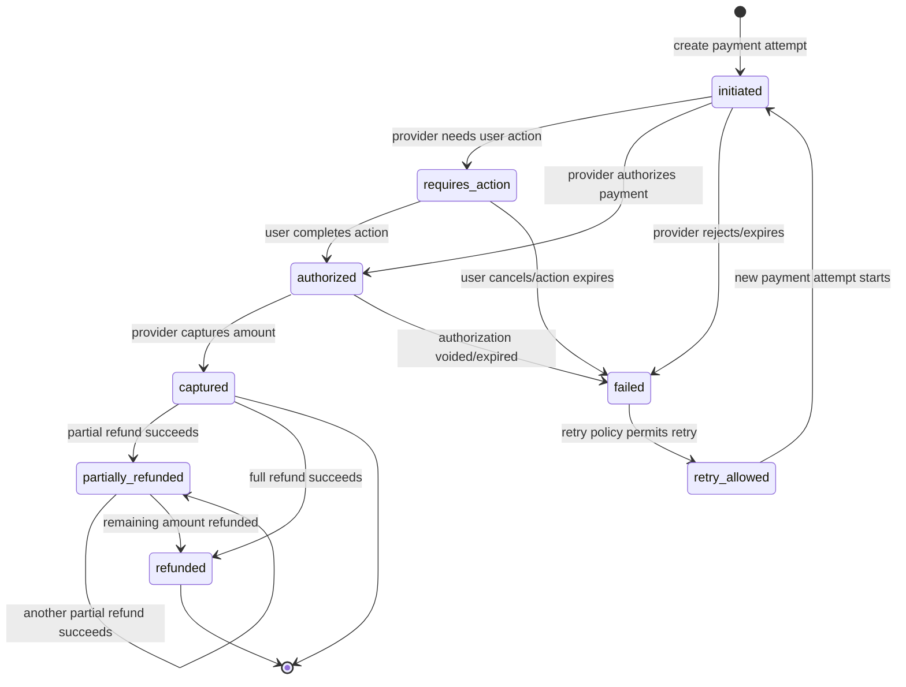
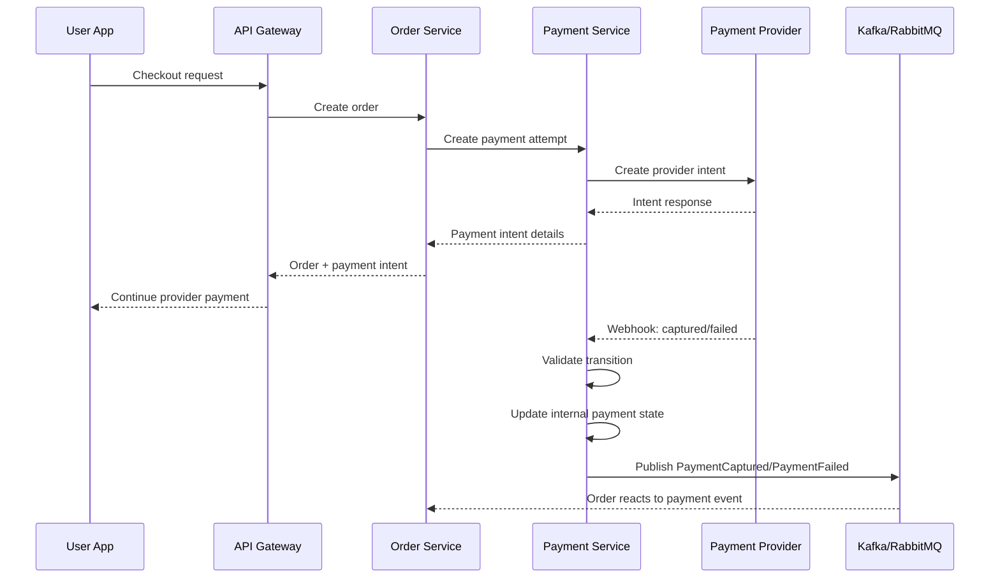
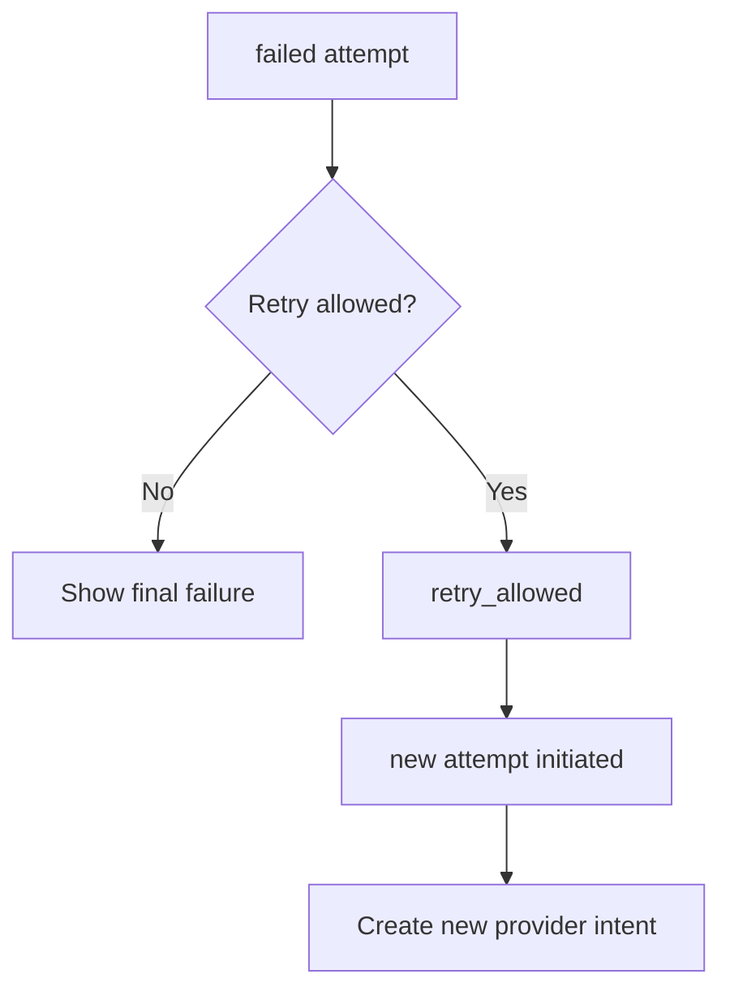
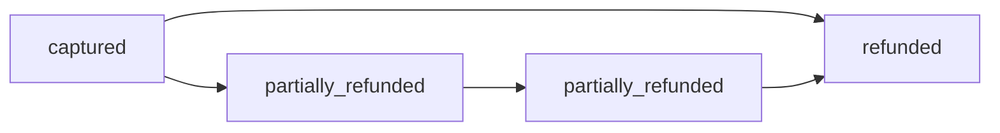
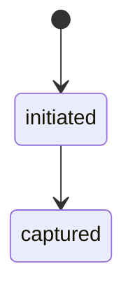

# 💳 Payment Service - Task 1: Define Payment State Machine


## 📌 Task Summary

| Field | Detail |
|---|---|
| Task Name | Define payment state machine |
| Source | `docs/01-micro-tasks.md` → `Payment Service` → Task 1 |
| Priority | `P0` foundation/blocker |
| Dependency | Order lifecycle |
| Main Goal | Payment ke states aur allowed transitions clearly define karna |
| Output Type | Documentation-only implementation guide |
| Not Included | MySQL schema, provider abstraction code, payment intent API, webhook handler, refund API, reconciliation job |

> **Simple Hinglish goal:** Is task ka kaam Payment Service ke core status rules define karna hai. Payment kab `initiated`, `authorized`, `captured`, `failed`, `partially_refunded`, ya `refunded` hoga, aur kaun sa transition allowed hai, ye sab clear kiya gaya hai. Ye future Payment Service implementation ke liye foundation banega.

---

## ✅ Final Output Created

```text
TaskImplementation/
└── Payment Service/
    └── task1.md
```

### Why this structure?

| Path | Purpose |
|---|---|
| `TaskImplementation/` | Saare task-wise implementation guides ka central folder |
| `TaskImplementation/Payment Service/` | Payment Service related task guides ka group |
| `task1.md` | Sirf **Payment Service - Task 1** ka complete guide |

> 🟢 **Boundary:** Is task me runtime service code, migrations, provider SDK integration, ya API endpoints create nahi kiye gaye. Sirf state machine design document create kiya gaya hai.

---

## 🧭 Implementation Approach

Payment state machine define karne ke liye existing project docs ko base banaya gaya:

| Document | Kya use kiya gaya |
|---|---|
| `docs/01-micro-tasks.md` | Payment Service Task 1 ka exact scope, dependency, priority |
| `docs/07-payment-system.md` | Payment architecture, state diagram, success/failure/retry/refund rules |
| `docs/04-microservice-design.md` | Payment Service responsibilities, APIs, webhook source-of-truth rule |
| `docs/05-database-design.md` | Future tables aur idempotency/index expectations samjhe |
| `docs/02-system-architecture.md` | Checkout flow me Order Service → Payment Service relation samjha |
| `docs/06-auth-security.md` | Card data platform server par store nahi hoga rule align kiya |
| `docs/11-devops-external-services.md` | Provider config and external payment gateway flow samjha |

---

## 🪜 Step-by-Step Implementation

## Step 1: Task Boundary Clear Kiya

Task 1 ka focus **state machine definition** hai. Matlab hum ye decide karte hain ki payment ka lifecycle kaise move karega.

### Included

- Payment states define kiye
- Allowed transitions define kiye
- Invalid transitions identify kiye
- Order lifecycle ke saath status mapping define ki
- Provider webhook ka role explain kiya
- Retry and refund ka state-level behavior explain kiya
- Code examples diye jo future implementation me use ho sakte hain

### Not Included

- `payments` MySQL table banana
- `payment_attempts` ya `refunds` schema banana
- Stripe/Razorpay SDK integrate karna
- `CreatePaymentIntent` implement karna
- Webhook signature verification code likhna
- Actual refund API banana
- Reconciliation job banana

> 🟡 **Reason:** Ye sab Payment Service ke later tasks hain. Agar Task 1 me hi schema/provider/API code add kar denge to scope mix ho jayega.

---

## Step 2: Core Payment States Define Kiye

Payment state machine ke core states ye honge:

| State | Meaning | User-facing interpretation | Final? |
|---|---|---|---:|
| `initiated` | Payment process start ho chuka hai, provider intent create ya create-request phase me hai | Payment start ho gaya hai | ❌ |
| `requires_action` | Provider ko user action chahiye, jaise OTP, 3DS, UPI approval, redirect confirmation | User ko payment complete karna hai | ❌ |
| `authorized` | Provider ne amount authorize kar diya hai, but final capture abhi pending ho sakta hai | Payment approved, confirmation pending | ❌ |
| `captured` | Provider ne money capture/charge complete kar diya hai | Payment successful | ✅ for payment success |
| `failed` | Provider ne payment fail mark kar diya ya attempt expire ho gaya | Payment failed | ✅ for this attempt |
| `retry_allowed` | Failed attempt ke baad same order ke liye new attempt allowed hai | User retry kar sakta hai | ❌ |
| `partially_refunded` | Captured payment ka kuch amount refund ho chuka hai | Partial refund done | ❌ |
| `refunded` | Captured payment ka full amount refund ho chuka hai | Full refund done | ✅ |

### Core vs helper states

`docs/01-micro-tasks.md` me main states mention hain:

- `initiated`
- `authorized`
- `captured`
- `failed`
- `refunded`
- `partially_refunded`

`docs/07-payment-system.md` ke state diagram me do helper states bhi hain:

- `requires_action`
- `retry_allowed`

Is guide me dono helper states include kiye gaye hain kyunki real payment providers me redirect/OTP/3DS/UPI approval aur retry flow common hote hain.

---

## Step 3: State Machine Diagram Banaya



### Diagram explanation

- Payment always `initiated` se start hota hai.
- Provider agar user action maangta hai to payment `requires_action` me jaata hai.
- Provider approval ke baad payment `authorized` hota hai.
- Real success tab maana jayega jab payment `captured` ho.
- Refund sirf `captured` payment par possible hai.
- `failed` attempt ko directly success me flip nahi karna chahiye; retry ke liye new attempt create hoga.

> 🔴 **Important:** Frontend success screen ko final accounting proof nahi maana jayega. Final status provider webhook ya trusted provider response se decide hoga.

---

## Step 4: Allowed Transitions Table Define Kiya

| Current State | Event | Next State | Trigger Source | Notes |
|---|---|---|---|---|
| `[new]` | `payment_attempt_created` | `initiated` | Order Service / Payment Service | Checkout ke time payment attempt create hota hai |
| `initiated` | `provider_requires_action` | `requires_action` | Provider response/webhook | OTP, 3DS, redirect, UPI approval |
| `initiated` | `provider_authorized` | `authorized` | Provider response/webhook | Amount authorized, capture pending |
| `initiated` | `provider_captured` | `captured` | Provider webhook | Some providers authorize + capture ek saath karte hain |
| `initiated` | `provider_failed` | `failed` | Provider response/webhook | Declined, expired, cancelled |
| `requires_action` | `action_completed` | `authorized` | Provider webhook | User action successful |
| `requires_action` | `action_failed` | `failed` | Provider webhook | User cancelled/timeout |
| `authorized` | `provider_captured` | `captured` | Provider webhook | Money captured |
| `authorized` | `authorization_failed` | `failed` | Provider webhook | Authorization voided/expired |
| `captured` | `partial_refund_succeeded` | `partially_refunded` | Provider refund webhook | Refund amount < captured amount |
| `captured` | `full_refund_succeeded` | `refunded` | Provider refund webhook | Refund amount == captured amount |
| `partially_refunded` | `partial_refund_succeeded` | `partially_refunded` | Provider refund webhook | More refund, still not full |
| `partially_refunded` | `full_refund_succeeded` | `refunded` | Provider refund webhook | Remaining amount refunded |
| `failed` | `retry_requested` | `retry_allowed` | User/Order Service policy | New attempt allowed after policy check |
| `retry_allowed` | `new_attempt_created` | `initiated` | Payment Service | New payment attempt starts |

---

## Step 5: Invalid Transitions Define Kiye

Invalid transitions ko block karna zaruri hai, warna financial records inconsistent ho sakte hain.

| Invalid Transition | Why blocked |
|---|---|
| `failed` → `captured` | Failed attempt ko success me convert karna unsafe hai; new attempt create hona chahiye |
| `captured` → `authorized` | Captured payment already final success hai, peeche nahi ja sakta |
| `refunded` → `captured` | Full refund ke baad same payment ko paid nahi dikhana chahiye |
| `initiated` → `refunded` | Refund only captured payment par valid hai |
| `authorized` → `partially_refunded` | Refund capture ke baad hi possible hai |
| `partially_refunded` → `captured` | Partial refund ke baad captured-only state me rollback unsafe hai |
| `refunded` → `partially_refunded` | Full refund final hai |

### Duplicate webhook handling

Duplicate webhook invalid nahi hai, but duplicate status update avoid karni hai.

Example:

- Current state: `captured`
- Incoming webhook: `provider_captured`
- Action: no-op, existing status keep karo

> 🟢 **Rule:** Same provider event id repeat aaye to webhook idempotency se no-op hona chahiye.

---

## Step 6: Payment State and Order State Mapping Define Kiya

Payment Service apni status ownership rakhega, but Order Service ko checkout lifecycle update chahiye.

| Payment State | Suggested Order State | Explanation |
|---|---|---|
| `initiated` | `pending_payment` | Order created hai, payment start hua hai |
| `requires_action` | `pending_payment` | User action pending hai |
| `authorized` | `pending_payment` or `payment_authorized` | Business policy pe depend karega; paid tab nahi jab tak capture nahi hota |
| `captured` | `paid` | Payment successful, order fulfillment start ho sakta hai |
| `failed` | `payment_failed` | Inventory release ya retry flow trigger ho sakta hai |
| `retry_allowed` | `payment_failed` | User ko retry option diya ja sakta hai |
| `partially_refunded` | `partially_refunded` | Order paid tha, kuch amount return hua |
| `refunded` | `refunded` | Full amount return ho chuka hai |

> 🟡 **Note:** Order Service apna lifecycle own karega. Payment Service event publish karega; Order Service us event ke basis par apna status update karega.

---

## Step 7: Provider Event Mapping Define Kiya

Different providers different event names use kar sakte hain. Payment Service ke andar provider-specific events ko internal states me normalize karna hoga.

| Provider-style Event | Internal Event | Internal State |
|---|---|---|
| `payment_intent.created` | `payment_attempt_created` | `initiated` |
| `payment_intent.requires_action` | `provider_requires_action` | `requires_action` |
| `payment_intent.authorized` | `provider_authorized` | `authorized` |
| `payment_intent.succeeded` | `provider_captured` | `captured` |
| `payment.captured` | `provider_captured` | `captured` |
| `payment_intent.payment_failed` | `provider_failed` | `failed` |
| `payment.cancelled` | `provider_failed` | `failed` |
| `refund.partially_processed` | `partial_refund_succeeded` | `partially_refunded` |
| `refund.succeeded` | `full_refund_succeeded` | `refunded` |

### Why normalization needed?

Hinglish me simple explanation:

Provider A event ko `payment_intent.succeeded` bol sakta hai, Provider B usi outcome ko `payment.captured` bol sakta hai. Payment Service ke business logic ko provider naming se free rakhne ke liye hum internal events use karenge.

---

## Step 8: State Ownership Flow Define Kiya



### Flow explanation

1. User checkout start karta hai.
2. Order Service pending order banata hai.
3. Payment Service payment attempt `initiated` karta hai.
4. Provider intent create hota hai.
5. User provider UI/SDK/redirect se payment complete karta hai.
6. Provider webhook Payment Service ko final result deta hai.
7. Payment Service transition validate karta hai.
8. Payment Service event publish karta hai.
9. Order Service apna lifecycle update karta hai.

---

## Step 9: Domain Rules Define Kiye

### Rule 1: Captured is success

`authorized` ko final paid status nahi maana jayega. Final payment success state `captured` hai.

### Rule 2: Refund only after capture

Refund states only `captured` ya `partially_refunded` se start honge.

### Rule 3: Failed attempt immutable rahega

Failed payment attempt ko overwrite nahi karna. Retry ke liye new attempt create karna.

### Rule 4: Provider webhook source of truth hai

Frontend callback sirf UX signal hai. Accounting status trusted provider webhook/provider response se hi update hoga.

### Rule 5: Amount server-side computed hoga

Client se amount trust nahi karna. Order Service ka server-side amount Payment Service ko diya jayega.

### Rule 6: Card data store nahi hoga

Platform server card number, CVV, raw payment credentials store nahi karega.

---

## Step 10: Future Code Shape Define Kiya

Task 1 me actual Go file create nahi ki gayi, lekin future implementation ke liye recommended shape ye hai:

```text
backend/
└── services/
    └── payment-service/
        ├── cmd/
        │   └── server/
        │       └── main.go
        ├── internal/
        │   ├── domain/
        │   │   ├── payment.go
        │   │   ├── payment_state.go
        │   │   ├── refund.go
        │   │   └── webhook_event.go
        │   ├── usecase/
        │   │   ├── create_payment_intent.go
        │   │   ├── handle_webhook.go
        │   │   └── refund_payment.go
        │   ├── provider/
        │   │   ├── provider.go
        │   │   ├── stripe_like.go
        │   │   └── razorpay_like.go
        │   ├── repository/
        │   │   └── mysql_payment_repository.go
        │   └── transport/
        │       ├── grpc/
        │       └── http/
        │           └── webhook_handler.go
        ├── migrations/
        └── deploy/
```

> 🟠 **Task 1 boundary:** Ye folder structure guide me explain kiya gaya hai, but actual backend files is task me create nahi kiye gaye.

---

## 🧩 Code Examples

Neeche examples future implementation ke liye hain. Ye examples state machine ko understandable banate hain.

### Example 1: Payment status enum

```go
package domain

type PaymentStatus string

const (
    PaymentStatusInitiated         PaymentStatus = "initiated"
    PaymentStatusRequiresAction    PaymentStatus = "requires_action"
    PaymentStatusAuthorized        PaymentStatus = "authorized"
    PaymentStatusCaptured          PaymentStatus = "captured"
    PaymentStatusFailed            PaymentStatus = "failed"
    PaymentStatusRetryAllowed      PaymentStatus = "retry_allowed"
    PaymentStatusPartiallyRefunded PaymentStatus = "partially_refunded"
    PaymentStatusRefunded          PaymentStatus = "refunded"
)
```

**Explanation:**  
Status ko string constants me define karne se DB, events, logs, API response, aur tests me same naming use hogi.

---

### Example 2: Allowed transition map

```go
package domain

var allowedPaymentTransitions = map[PaymentStatus]map[PaymentStatus]bool{
    PaymentStatusInitiated: {
        PaymentStatusRequiresAction: true,
        PaymentStatusAuthorized:     true,
        PaymentStatusCaptured:       true,
        PaymentStatusFailed:         true,
    },
    PaymentStatusRequiresAction: {
        PaymentStatusAuthorized: true,
        PaymentStatusFailed:     true,
    },
    PaymentStatusAuthorized: {
        PaymentStatusCaptured: true,
        PaymentStatusFailed:   true,
    },
    PaymentStatusCaptured: {
        PaymentStatusPartiallyRefunded: true,
        PaymentStatusRefunded:          true,
    },
    PaymentStatusPartiallyRefunded: {
        PaymentStatusPartiallyRefunded: true,
        PaymentStatusRefunded:          true,
    },
    PaymentStatusFailed: {
        PaymentStatusRetryAllowed: true,
    },
    PaymentStatusRetryAllowed: {
        PaymentStatusInitiated: true,
    },
}
```

**Explanation:**  
Ye map ek central rulebook hai. Service me kahin bhi payment status update ho, pehle isi transition map se validate hoga.

---

### Example 3: Transition validation function

```go
package domain

import "fmt"

func CanTransitionPayment(from, to PaymentStatus) bool {
    if from == to {
        return true
    }

    nextStates, ok := allowedPaymentTransitions[from]
    if !ok {
        return false
    }

    return nextStates[to]
}

func ValidatePaymentTransition(from, to PaymentStatus) error {
    if CanTransitionPayment(from, to) {
        return nil
    }

    return fmt.Errorf("invalid payment transition: %s -> %s", from, to)
}
```

**Explanation:**  
`from == to` duplicate webhook/no-op ke liye allowed rakha gaya hai. Agar same event repeat aaye, system crash ya duplicate update nahi karega.

---

### Example 4: Provider event to state mapping

```go
package domain

type ProviderEventType string

const (
    ProviderEventRequiresAction ProviderEventType = "provider_requires_action"
    ProviderEventAuthorized     ProviderEventType = "provider_authorized"
    ProviderEventCaptured       ProviderEventType = "provider_captured"
    ProviderEventFailed         ProviderEventType = "provider_failed"
    ProviderEventPartialRefund  ProviderEventType = "partial_refund_succeeded"
    ProviderEventFullRefund     ProviderEventType = "full_refund_succeeded"
)

func NextStatusFromProviderEvent(event ProviderEventType) (PaymentStatus, bool) {
    switch event {
    case ProviderEventRequiresAction:
        return PaymentStatusRequiresAction, true
    case ProviderEventAuthorized:
        return PaymentStatusAuthorized, true
    case ProviderEventCaptured:
        return PaymentStatusCaptured, true
    case ProviderEventFailed:
        return PaymentStatusFailed, true
    case ProviderEventPartialRefund:
        return PaymentStatusPartiallyRefunded, true
    case ProviderEventFullRefund:
        return PaymentStatusRefunded, true
    default:
        return "", false
    }
}
```

**Explanation:**  
Provider-specific webhook ko pehle internal event me normalize karna hai, fir us event se next internal status decide karna hai.

---

### Example 5: Table-driven tests

```go
package domain

import "testing"

func TestCanTransitionPayment(t *testing.T) {
    tests := []struct {
        name string
        from PaymentStatus
        to   PaymentStatus
        want bool
    }{
        {
            name: "initiated to authorized is allowed",
            from: PaymentStatusInitiated,
            to:   PaymentStatusAuthorized,
            want: true,
        },
        {
            name: "captured to refunded is allowed",
            from: PaymentStatusCaptured,
            to:   PaymentStatusRefunded,
            want: true,
        },
        {
            name: "failed to captured is blocked",
            from: PaymentStatusFailed,
            to:   PaymentStatusCaptured,
            want: false,
        },
        {
            name: "refunded to captured is blocked",
            from: PaymentStatusRefunded,
            to:   PaymentStatusCaptured,
            want: false,
        },
    }

    for _, tt := range tests {
        t.Run(tt.name, func(t *testing.T) {
            got := CanTransitionPayment(tt.from, tt.to)
            if got != tt.want {
                t.Fatalf("CanTransitionPayment(%q, %q) = %v, want %v", tt.from, tt.to, got, tt.want)
            }
        })
    }
}
```

**Explanation:**  
State machine bugs financial systems me high-risk hote hain. Isliye transitions table-driven tests se cover karna important hai.

---

## 🔐 Security and Consistency Rules

| Rule | Why important |
|---|---|
| Webhook signature verify mandatory | Fake payment success block karne ke liye |
| Provider event id idempotent hona chahiye | Duplicate webhook se duplicate update/refund avoid karne ke liye |
| Client amount trust nahi karna | Price tampering avoid karne ke liye |
| Card/CVV store nahi karna | PCI/security risk avoid karne ke liye |
| Status transition validate karna | Financial record corrupt hone se bachane ke liye |
| Logs me secrets redact karna | Provider keys/card data leak avoid karne ke liye |

---

## 🔁 Retry Rules

Retry ka matlab same failed attempt ko success banana nahi hai. Retry ka matlab same order ke liye **new payment attempt** banana hai.



### Retry checklist

| Check | Rule |
|---|---|
| Order active hai? | Cancelled/delivered/refunded order ke liye retry nahi |
| Max attempts exceed hua? | Configurable max retry count hona chahiye |
| Idempotency key available hai? | Duplicate provider intent avoid karne ke liye required |
| Previous attempt final hai? | `failed` ke baad hi retry allow |

---

## 💸 Refund State Rules

Refund implementation Task 6 me aayega, but Task 1 state machine me refund states define karna zaruri hai.



### Refund rules

| Rule | Explanation |
|---|---|
| Refund only `captured` payment par | Failed/initiated payment refund nahi ho sakta |
| Partial refund cumulative track hoga | Multiple partial refunds possible hain |
| Full refund final state hai | `refunded` ke baad aur refund nahi |
| Refund records immutable honge | Audit and reconciliation ke liye |

---

## 📣 Events to Publish Later

Task 1 me events implement nahi kiye gaye, but state machine ke basis par future events ye ho sakte hain:

| State Change | Event Name | Consumers |
|---|---|---|
| `initiated` | `PaymentInitiated` | Order, Analytics |
| `requires_action` | `PaymentActionRequired` | Order, Notification |
| `authorized` | `PaymentAuthorized` | Order |
| `captured` | `PaymentCaptured` | Order, Notification, Analytics |
| `failed` | `PaymentFailed` | Order, Notification |
| `partially_refunded` | `PaymentPartiallyRefunded` | Order, Superadmin, Notification |
| `refunded` | `PaymentRefunded` | Order, Superadmin, Notification |

> 🟡 **Note:** Event contracts/proto definitions future tasks me honge. Yahan sirf event meaning document kiya gaya hai.

---

## 🧪 Testing Strategy for Future Implementation

Task 1 documentation-only hai, but future code me ye tests required honge:

| Test Type | What to test |
|---|---|
| Unit test | Valid transitions allowed hain |
| Unit test | Invalid transitions block ho rahe hain |
| Unit test | Duplicate webhook same state par no-op hai |
| Unit test | Provider event mapping correct hai |
| Integration test | Captured webhook order ko paid event bhejta hai |
| Integration test | Failed webhook retry flow trigger karta hai |
| Integration test | Partial and full refund state correct update hote hain |

---

## 🧰 External Libraries / Tools Used

### 1. Mermaid

| Field | Detail |
|---|---|
| What | Markdown-friendly diagram syntax |
| Why used | State machine, checkout flow, retry/refund flow visually explain karne ke liye |
| Installed? | ❌ No project install required |
| How to use | GitHub/GitLab/compatible Markdown viewer Mermaid blocks render kar deta hai |

Example:

````markdown

````

Optional local render:

```bash
npm install -g @mermaid-js/mermaid-cli
mmdc -i diagram.mmd -o diagram.svg
```

> 🟡 **Note:** Mermaid CLI optional hai. Is task ke liye install nahi kiya gaya.

### 2. Shields.io badges

| Field | Detail |
|---|---|
| What | Markdown badge image service |
| Why used | Task status, priority, dependency, guide scope visually show karne ke liye |
| Installed? | ❌ No install required |
| How to use | Markdown image URL directly use hota hai |

Example:

```markdown

```

### 3. Go standard library examples

| Field | Detail |
|---|---|
| What | `fmt`, `testing` jaise Go standard library packages |
| Why used | Future implementation examples simple aur dependency-free rakhne ke liye |
| Installed? | Go runtime/toolchain needed only when actual code likha jayega |
| How to use | `go test ./...` future service implementation ke time run hoga |

> 🟢 **Important:** Task 1 me koi external runtime dependency add nahi ki gayi.

---

## 🧾 Clean Implementation Folder Structure

### Actual output for this task

```text
TaskImplementation/
├── Platform Foundation/
│   ├── task1.md
│   ├── task2.md
│   ├── task3.md
│   ├── task4.md
│   ├── task5.md
│   ├── task6.md
│   ├── task7.md
│   └── task8.md
└── Payment Service/
    └── task1.md
```

### Future Payment Service implementation structure

```text
backend/services/payment-service/
├── cmd/server/main.go
├── internal/
│   ├── domain/
│   │   ├── payment.go
│   │   ├── payment_state.go
│   │   ├── refund.go
│   │   └── webhook_event.go
│   ├── usecase/
│   │   ├── create_payment_intent.go
│   │   ├── handle_webhook.go
│   │   └── refund_payment.go
│   ├── provider/
│   │   ├── provider.go
│   │   ├── stripe_like.go
│   │   └── razorpay_like.go
│   ├── repository/
│   │   └── mysql_payment_repository.go
│   └── transport/
│       ├── grpc/
│       └── http/
│           └── webhook_handler.go
├── migrations/
└── deploy/
```

> 🟠 **Clarification:** Future structure project docs se align karta hai, but Task 1 me sirf `TaskImplementation/Payment Service/task1.md` create hua hai.

---

## ✅ Acceptance Checklist

| Requirement | Status |
|---|---:|
| `TaskImplementation/` folder available | ✅ |
| `TaskImplementation/Payment Service/` folder created/kept | ✅ |
| `task1.md` created | ✅ |
| Hinglish step-by-step guide included | ✅ |
| Payment states clearly defined | ✅ |
| Allowed transitions documented | ✅ |
| Invalid transitions documented | ✅ |
| Mermaid diagrams included | ✅ |
| External tools/libraries explained | ✅ |
| Folder structure included | ✅ |
| Code examples included | ✅ |
| Scope limited to Payment Service Task 1 | ✅ |

---

## 🚫 Out of Scope for Task 1

Ye items intentionally implement nahi kiye gaye:

- Payment MySQL schema
- Payment repository implementation
- Provider abstraction code
- Stripe/Razorpay SDK setup
- Payment intent creation API
- Webhook HTTP handler
- Webhook signature verification implementation
- Refund API or refund DB table
- Retry API endpoint
- Reconciliation batch job
- Kubernetes/Docker deployment

> 🔴 **Reason:** Ye sab Payment Service ke Task 2 onwards me aayenge. Task 1 ka purpose sirf payment state machine foundation define karna hai.

---

## ✅ Final Task 1 Standard

Payment Service ke liye final state machine standard:

```text
initiated
├── requires_action
│   ├── authorized
│   └── failed
├── authorized
│   ├── captured
│   └── failed
├── captured
│   ├── partially_refunded
│   └── refunded
└── failed
    └── retry_allowed
        └── initiated (new attempt)
```

### Final rule summary

- Payment `initiated` se start hoga.
- User/provider action pending ho to `requires_action`.
- Provider approval ho to `authorized`.
- Real success sirf `captured`.
- Failure `failed`.
- Failed attempt retry ke liye new attempt banayega.
- Refund sirf captured payment par.
- Partial refund `partially_refunded`.
- Full refund `refunded`.
- Provider webhook/payment provider trusted response status ka source of truth hoga.

Task 1 complete hai as a payment state machine documentation guide. Future Payment Service tasks is foundation ke upar schema, provider abstraction, payment intent, webhook, refund, retry, aur reconciliation implement karenge.
