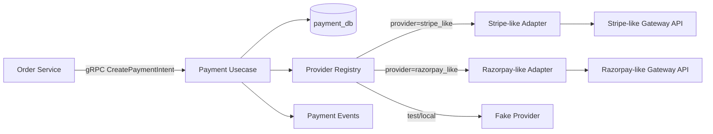
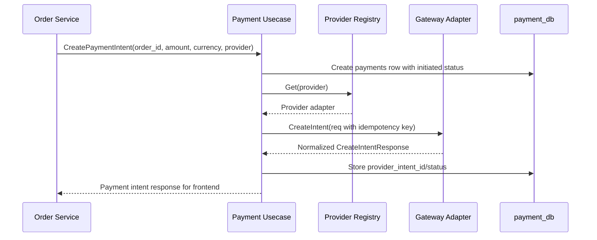
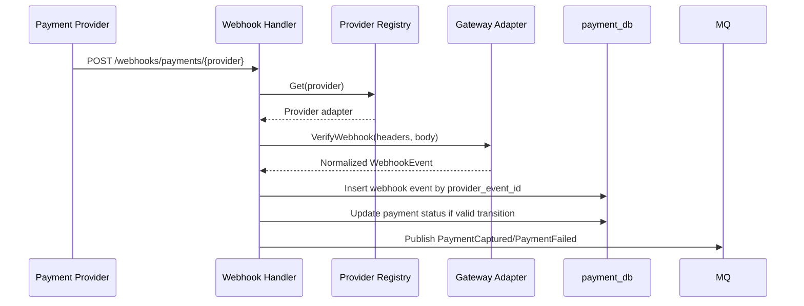
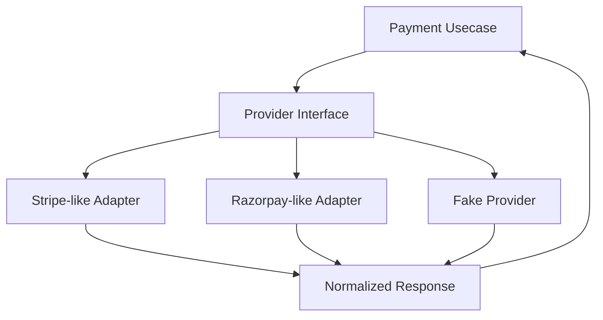

# 💳 Payment Service - Task 3: Gateway Abstraction


## 📌 Task Summary

| Field | Detail |
|---|---|
| Task Name | Gateway abstraction |
| Source | `docs/01-micro-tasks.md` -> `Payment Service` -> Task 3 |
| Priority | `P0` foundation/blocker |
| Dependency | Payment Service Task 2: MySQL schema |
| Main Goal | Stripe/Razorpay-like payment providers ke liye common interface define karna |
| Output Type | Documentation-only implementation guide |
| Not Included | Real provider SDK integration, payment intent usecase, webhook handler implementation, refund flow implementation, retry policy, reconciliation job |

> **Simple Hinglish goal:** Payment Service ko directly Stripe ya Razorpay ke code se tightly couple nahi karna. Is task me hum ek clean provider abstraction design karte hain jisse future me Stripe, Razorpay, mock/fake provider, ya kisi aur gateway ko easily plug/swap kiya ja sake.

---

## ✅ Final Output Created

```text
TaskImplementation/
└── Payment Service/
    ├── task1.md
    ├── task2.md
    └── task3.md
```

### Why this structure?

| Path | Purpose |
|---|---|
| `TaskImplementation/` | Saare task-wise implementation guides ka central folder |
| `TaskImplementation/Payment Service/` | Payment Service related task guides ka group |
| `task3.md` | Sirf **Payment Service - Task 3** ka complete gateway abstraction guide |

> 🟢 **Boundary:** Is task me actual backend service files, migrations, SDK installation, ya payment gateway calls add nahi kiye gaye. Output sirf required `task3.md` guide hai.

---

## 🧭 Source Documents Studied

| Document | Kya use kiya gaya |
|---|---|
| `docs/01-micro-tasks.md` | Task 3 ka exact scope: `Gateway abstraction` |
| `docs/07-payment-system.md` | Provider interface, idempotency keys, webhook source-of-truth rule |
| `docs/04-microservice-design.md` | Payment Service responsibilities and provider-specific implementation boundary |
| `docs/05-database-design.md` | Payment tables, provider ids, webhook idempotency and reconciliation expectations |
| `docs/03-folder-structure.md` | Future Payment Service folder layout: `internal/provider/` |
| `docs/06-auth-security.md` | Card data platform server par store na karne ka security rule |
| `docs/11-devops-external-services.md` | Payment gateway config: public key, secret key, webhook secret, currencies, capture mode |
| `TaskImplementation/Payment Service/task1.md` | Payment state machine and provider event mapping foundation |
| `TaskImplementation/Payment Service/task2.md` | MySQL schema fields: provider, provider ids, idempotency, webhook events |

---

## 🪜 Step-by-Step Implementation

## Step 1: Task Boundary Clear Kiya

Task 3 ka focus **provider abstraction** hai. Matlab Payment Service ke andar ek common contract banega jiske peeche provider-specific details hide rahengi.

### Included in Task 3

- Common `Provider` interface define kiya
- Provider request/response structs define kiye
- Provider status normalization design kiya
- Provider registry/factory design kiya
- Stripe-like and Razorpay-like adapters ka blueprint diya
- Fake provider testing strategy define ki
- Provider config and secret handling explain kiya
- Error mapping, idempotency, metadata and observability rules define kiye

### Not Included in Task 3

- Real `CreatePaymentIntent` usecase implementation
- Actual Stripe/Razorpay SDK calls
- Provider webhook HTTP handler
- Webhook signature verification implementation details
- Refund business flow
- Retry handling
- Reconciliation report processing
- New database migration files

> 🟡 **Reason:** Gateway abstraction foundation hai. Actual payment intent creation Task 4 me aayega, webhook handler Task 5 me, refund flow Task 6 me, retry Task 7 me, aur reconciliation Task 8 me.

---

## Step 2: Provider Abstraction Ka Role Samjha

Payment providers ka API style different hota hai:

| Concern | Stripe-like provider | Razorpay-like provider | Payment Service ko kya chahiye |
|---|---|---|---|
| Intent/order object | Payment Intent | Order | Common `CreateIntent` response |
| Client-side token | `client_secret` | `order_id`/checkout options | Generic frontend payload |
| Status names | `requires_action`, `succeeded` | `created`, `paid`, `failed` | Internal payment states |
| Webhook signature | Provider-specific header | Provider-specific header | Common `VerifyWebhook` method |
| Refund API | Refund object | Refund object | Common `Refund` response |

Abstraction ka kaam hai:

- Payment Service ke usecases ko provider SDK details se bachana
- Provider swap ko config-level decision banana
- Tests me fake provider use karna easy banana
- Status, error, idempotency aur metadata ko consistent rakhna

---

## Step 3: High-Level Architecture Define Ki



### Diagram explanation

- Order Service Payment Service ko payment intent create karne ke liye call karega.
- Payment usecase provider name ke basis par registry se adapter lega.
- Adapter provider-specific SDK/API call karega.
- Usecase ko sirf normalized response milega.
- DB me `provider`, `provider_intent_id`, `provider_payment_id`, `status`, `idempotency_key` store honge.

> 🔴 **Important:** Payment status ka final truth provider webhook hoga. Task 3 sirf provider abstraction banata hai, final status update logic Task 5 me handle hoga.

---

## Step 4: Future Implementation Folder Structure Plan Kiya

`docs/03-folder-structure.md` ke according future Payment Service me provider abstraction yahan rahega:

```text
backend/
└── services/
    └── payment-service/
        ├── cmd/
        │   └── server/
        │       └── main.go
        └── internal/
            ├── domain/
            │   ├── payment.go
            │   ├── refund.go
            │   └── webhook_event.go
            ├── usecase/
            │   ├── create_payment_intent.go
            │   ├── handle_webhook.go
            │   └── refund_payment.go
            ├── provider/
            │   ├── provider.go
            │   ├── registry.go
            │   ├── errors.go
            │   ├── status_mapper.go
            │   ├── stripe_like.go
            │   ├── razorpay_like.go
            │   └── fake_provider.go
            ├── repository/
            │   └── mysql_payment_repository.go
            └── transport/
                ├── grpc/
                └── http/
                    └── webhook_handler.go
```

### File responsibilities

| File | Responsibility |
|---|---|
| `provider.go` | Common provider interface and request/response structs |
| `registry.go` | Provider lookup by name |
| `errors.go` | Provider error codes and retry flags |
| `status_mapper.go` | Provider status -> internal status conversion |
| `stripe_like.go` | Stripe-like adapter implementation |
| `razorpay_like.go` | Razorpay-like adapter implementation |
| `fake_provider.go` | Unit/integration test friendly fake provider |

> 🟣 **Note:** Ye structure future implementation plan hai. Current task me sirf documentation file create hua hai.

---

## Step 5: Common Provider Interface Design Kiya

Provider interface ka goal hai ki Payment usecase ko ye na pata ho ki backend me Stripe use ho raha hai ya Razorpay.

```go
package provider

import "context"

type Provider interface {
    Name() string

    CreateIntent(ctx context.Context, req CreateIntentRequest) (CreateIntentResponse, error)
    Capture(ctx context.Context, req CaptureRequest) (CaptureResponse, error)
    Refund(ctx context.Context, req RefundRequest) (RefundResponse, error)
    VerifyWebhook(ctx context.Context, req VerifyWebhookRequest) (WebhookEvent, error)
}
```

### Method explanation

| Method | Purpose | Task relation |
|---|---|---|
| `Name` | Adapter ka stable provider key return karega | Task 3 |
| `CreateIntent` | Provider side intent/order create karega | Task 4 me use hoga |
| `Capture` | Manual capture mode ke liye amount capture karega | Future capture policy |
| `Refund` | Full/partial refund request bhejega | Task 6 me use hoga |
| `VerifyWebhook` | Provider webhook signature validate karke normalized event dega | Task 5 me use hoga |

> 🟢 **Design rule:** Interface usecase ke needs ke hisaab se small rakha gaya hai. Provider SDK ke har method ko expose nahi karna.

---

## Step 6: Money and Request Models Define Kiye

Payment amount always **minor unit** me hoga:

- INR paise
- USD cents
- EUR cents

Floating point use nahi karna because money precision bug aa sakta hai.

```go
package provider

type Money struct {
    AmountMinor int64
    Currency    string
}

type Customer struct {
    UserID string
    Email  string
    Phone  string
    Name   string
}

type CreateIntentRequest struct {
    PaymentID      string
    OrderID        string
    UserID         string
    Amount         Money
    Customer       Customer
    IdempotencyKey string
    CaptureMode    CaptureMode
    Metadata       map[string]string
}

type CaptureMode string

const (
    CaptureModeAutomatic CaptureMode = "automatic"
    CaptureModeManual    CaptureMode = "manual"
)
```

### Why these fields?

| Field | Why needed |
|---|---|
| `PaymentID` | Local `payments.payment_id` provider metadata me map karne ke liye |
| `OrderID` | Provider dashboard/reconciliation me order trace karne ke liye |
| `UserID` | Audit and customer mapping ke liye |
| `Amount` | Server-side verified amount |
| `Customer` | Provider checkout/customer object ke liye safe details |
| `IdempotencyKey` | Duplicate provider intent prevent karne ke liye |
| `CaptureMode` | Automatic vs manual capture support |
| `Metadata` | Safe non-secret trace fields provider side store karne ke liye |

> 🔴 **Security rule:** Card number, CVV, OTP, raw bank details, provider secret key ya token is request model me kabhi nahi aayenge.

---

## Step 7: Provider Response Models Define Kiye

Provider response ko normalized format me convert karna zaruri hai.

```go
package provider

import "encoding/json"

type IntentStatus string

const (
    IntentStatusInitiated      IntentStatus = "initiated"
    IntentStatusRequiresAction IntentStatus = "requires_action"
    IntentStatusAuthorized     IntentStatus = "authorized"
    IntentStatusCaptured       IntentStatus = "captured"
    IntentStatusFailed         IntentStatus = "failed"
)

type CreateIntentResponse struct {
    Provider             string
    ProviderIntentID     string
    ProviderPaymentID    string
    Status               IntentStatus
    ClientSecret         string
    RedirectURL          string
    FrontendPayload      map[string]string
    RawProviderResponse  json.RawMessage
}
```

### Field explanation

| Field | Meaning |
|---|---|
| `Provider` | `stripe_like`, `razorpay_like`, etc. |
| `ProviderIntentID` | Provider side intent/order id |
| `ProviderPaymentID` | Provider payment id, agar create time par available ho |
| `Status` | Internal normalized payment status |
| `ClientSecret` | Frontend SDK ko pass hone wala safe token, provider dependent |
| `RedirectURL` | Redirect based provider flow ke liye |
| `FrontendPayload` | Provider-specific safe checkout fields |
| `RawProviderResponse` | Audit/debug ke liye sanitized raw response |

> 🟡 **Note:** `RawProviderResponse` me secrets, card data, CVV, full token ya PII-heavy payload store nahi karna.

---

## Step 8: Capture and Refund Contracts Define Kiye

Payment providers automatic capture ya manual capture dono support kar sakte hain.

```go
package provider

import "encoding/json"

type CaptureRequest struct {
    PaymentID          string
    ProviderIntentID   string
    ProviderPaymentID  string
    Amount             Money
    IdempotencyKey     string
    Metadata           map[string]string
}

type CaptureResponse struct {
    ProviderPaymentID   string
    Status              IntentStatus
    CapturedAmount      Money
    RawProviderResponse json.RawMessage
}

type RefundRequest struct {
    PaymentID          string
    RefundID           string
    ProviderPaymentID  string
    Amount             Money
    Reason             string
    IdempotencyKey     string
    Metadata           map[string]string
}

type RefundStatus string

const (
    RefundStatusProcessing RefundStatus = "processing"
    RefundStatusSucceeded  RefundStatus = "succeeded"
    RefundStatusFailed     RefundStatus = "failed"
)

type RefundResponse struct {
    ProviderRefundID    string
    Status              RefundStatus
    RefundedAmount      Money
    RawProviderResponse json.RawMessage
}
```

### Why capture/refund Task 3 me mention hai?

Task 3 abstraction ko future-safe banana hai. Refund flow actual Task 6 me implement hoga, but interface me refund capability ka contract abhi define karna useful hai because provider adapters ka shape clear ho jata hai.

> 🟢 **Boundary:** Contract define karna Task 3 ka part hai. Refund business logic implement karna Task 6 ka part hai.

---

## Step 9: Webhook Contract Define Kiya

Webhook verification provider-specific hoti hai. Isliye common interface me `VerifyWebhook` method diya gaya.

```go
package provider

import "encoding/json"

type VerifyWebhookRequest struct {
    Headers map[string]string
    Body    []byte
}

type WebhookEventType string

const (
    WebhookEventPaymentRequiresAction WebhookEventType = "payment.requires_action"
    WebhookEventPaymentAuthorized     WebhookEventType = "payment.authorized"
    WebhookEventPaymentCaptured       WebhookEventType = "payment.captured"
    WebhookEventPaymentFailed         WebhookEventType = "payment.failed"
    WebhookEventRefundSucceeded       WebhookEventType = "refund.succeeded"
    WebhookEventRefundFailed          WebhookEventType = "refund.failed"
)

type WebhookEvent struct {
    Provider          string
    ProviderEventID   string
    Type              WebhookEventType
    ProviderIntentID  string
    ProviderPaymentID string
    ProviderRefundID  string
    Amount            Money
    OccurredAtUnix    int64
    RawPayload        json.RawMessage
}
```

### Webhook design rules

| Rule | Reason |
|---|---|
| Signature verification adapter me hogi | Har provider ka signing algorithm/header different hota hai |
| Event type normalized hoga | Usecase ko provider-specific event names nahi pata hone chahiye |
| Provider event id mandatory hoga | `payment_webhook_events(provider, provider_event_id)` idempotency ke liye |
| Raw payload sanitized hoga | Debugging and audit ke liye useful |

> 🔴 **Important:** Webhook endpoint implementation Task 5 me aayega. Task 3 me sirf contract define kiya gaya hai.

---

## Step 10: Provider Status Normalization Design Kiya

Internal Payment Service states Task 1 se align honge:

| Provider result | Internal `IntentStatus` | Payment DB status |
|---|---|---|
| Intent/order created | `initiated` | `initiated` |
| 3DS/OTP/UPI action needed | `requires_action` | `requires_action` |
| Authorized but not captured | `authorized` | `authorized` |
| Paid/succeeded/captured | `captured` | `captured` |
| Declined/cancelled/expired | `failed` | `failed` |

### Example mapper

```go
package provider

func NormalizeStripeLikeStatus(status string) (IntentStatus, bool) {
    switch status {
    case "requires_action", "requires_confirmation":
        return IntentStatusRequiresAction, true
    case "requires_capture":
        return IntentStatusAuthorized, true
    case "succeeded":
        return IntentStatusCaptured, true
    case "canceled", "payment_failed":
        return IntentStatusFailed, true
    case "requires_payment_method", "processing":
        return IntentStatusInitiated, true
    default:
        return "", false
    }
}

func NormalizeRazorpayLikeStatus(status string) (IntentStatus, bool) {
    switch status {
    case "created", "attempted":
        return IntentStatusInitiated, true
    case "authorized":
        return IntentStatusAuthorized, true
    case "paid", "captured":
        return IntentStatusCaptured, true
    case "failed":
        return IntentStatusFailed, true
    default:
        return "", false
    }
}
```

> 🟡 **Rule:** Unknown provider status ko silently success nahi banana. Unknown status should become a provider error or safe pending state, depending on usecase policy.

---

## Step 11: Provider Registry/Factory Design Kiya

Payment usecase provider name se adapter resolve karega.

```go
package provider

import "fmt"

type Registry struct {
    providers map[string]Provider
}

func NewRegistry(providers ...Provider) (*Registry, error) {
    registry := &Registry{
        providers: make(map[string]Provider, len(providers)),
    }

    for _, p := range providers {
        name := p.Name()
        if name == "" {
            return nil, fmt.Errorf("payment provider name is required")
        }
        if _, exists := registry.providers[name]; exists {
            return nil, fmt.Errorf("duplicate payment provider registered: %s", name)
        }
        registry.providers[name] = p
    }

    return registry, nil
}

func (r *Registry) Get(name string) (Provider, error) {
    provider, ok := r.providers[name]
    if !ok {
        return nil, fmt.Errorf("unsupported payment provider: %s", name)
    }
    return provider, nil
}
```

### Registry benefits

| Benefit | Explanation |
|---|---|
| Clean provider selection | `provider=stripe_like` ya `provider=razorpay_like` config/request se resolve hoga |
| Testable design | Tests me `fake_provider` register kar sakte hain |
| No switch sprawl | Usecase me large provider-specific `switch` avoid hoga |
| Startup validation | Duplicate or missing provider startup pe fail ho sakta hai |

---

## Step 12: Provider Config Design Kiya

Provider credentials and behavior config se aayenge. Secrets source production me secret manager hoga.

```go
package provider

type Config struct {
    DefaultProvider   string
    AllowedProviders  []string
    AllowedCurrencies []string
    CaptureMode       CaptureMode
    Providers         map[string]ProviderConfig
}

type ProviderConfig struct {
    PublicKey     string
    SecretKey     string
    WebhookSecret string
    BaseURL       string
    TimeoutMillis int
}
```

### Example environment variables

```bash
PAYMENT_DEFAULT_PROVIDER=stripe_like
PAYMENT_ALLOWED_PROVIDERS=stripe_like,razorpay_like
PAYMENT_ALLOWED_CURRENCIES=INR,USD
PAYMENT_CAPTURE_MODE=automatic

STRIPE_LIKE_PUBLIC_KEY=pk_test_xxx
STRIPE_LIKE_SECRET_KEY=sk_test_xxx
STRIPE_LIKE_WEBHOOK_SECRET=whsec_xxx

RAZORPAY_LIKE_PUBLIC_KEY=rzp_test_xxx
RAZORPAY_LIKE_SECRET_KEY=rzp_secret_xxx
RAZORPAY_LIKE_WEBHOOK_SECRET=rzp_whsec_xxx
```

### Config rules

| Rule | Why |
|---|---|
| Startup par required secrets validate karo | Missing key runtime checkout failure ban sakti hai |
| Public key frontend-safe hai | Frontend SDK initialization ke liye use ho sakta hai |
| Secret key only backend me rahegi | Provider API calls ke liye |
| Webhook secret only backend me rahega | Signature verification ke liye |
| Allowed currencies whitelist hogi | Accidental unsupported currency block karne ke liye |

---

## Step 13: Stripe-like Adapter Blueprint Banaya

Stripe-like adapter `Provider` interface implement karega.

```go
package provider

import (
    "context"
    "encoding/json"
)

type StripeLikeProvider struct {
    publicKey     string
    secretKey     string
    webhookSecret string
}

func NewStripeLikeProvider(cfg ProviderConfig) *StripeLikeProvider {
    return &StripeLikeProvider{
        publicKey:     cfg.PublicKey,
        secretKey:     cfg.SecretKey,
        webhookSecret: cfg.WebhookSecret,
    }
}

func (p *StripeLikeProvider) Name() string {
    return "stripe_like"
}

func (p *StripeLikeProvider) CreateIntent(ctx context.Context, req CreateIntentRequest) (CreateIntentResponse, error) {
    // Task 4 me actual provider SDK/API call yahan aayega.
    // Task 3 me sirf adapter boundary define ki gayi hai.
    return CreateIntentResponse{
        Provider:         p.Name(),
        ProviderIntentID: "pi_example",
        Status:           IntentStatusRequiresAction,
        ClientSecret:     "client_secret_example",
        FrontendPayload: map[string]string{
            "publishable_key": p.publicKey,
        },
        RawProviderResponse: json.RawMessage(`{"id":"pi_example","status":"requires_action"}`),
    }, nil
}
```

### Stripe-like mapping notes

| Stripe-like concept | Internal concept |
|---|---|
| Payment Intent | Provider intent |
| `client_secret` | `ClientSecret` |
| `requires_action` | `requires_action` |
| `requires_capture` | `authorized` |
| `succeeded` | `captured` |

> 🟡 **Note:** Ye sample real SDK call nahi hai. Real SDK integration Task 4 ya provider adapter implementation step me aayega.

---

## Step 14: Razorpay-like Adapter Blueprint Banaya

Razorpay-like provider me order object create hota hai, jise frontend checkout me use karta hai.

```go
package provider

import (
    "context"
    "encoding/json"
)

type RazorpayLikeProvider struct {
    publicKey     string
    secretKey     string
    webhookSecret string
}

func NewRazorpayLikeProvider(cfg ProviderConfig) *RazorpayLikeProvider {
    return &RazorpayLikeProvider{
        publicKey:     cfg.PublicKey,
        secretKey:     cfg.SecretKey,
        webhookSecret: cfg.WebhookSecret,
    }
}

func (p *RazorpayLikeProvider) Name() string {
    return "razorpay_like"
}

func (p *RazorpayLikeProvider) CreateIntent(ctx context.Context, req CreateIntentRequest) (CreateIntentResponse, error) {
    // Task 4 me actual provider order creation yahan implement hoga.
    return CreateIntentResponse{
        Provider:         p.Name(),
        ProviderIntentID: "order_example",
        Status:           IntentStatusInitiated,
        FrontendPayload: map[string]string{
            "key":      p.publicKey,
            "order_id": "order_example",
            "currency": req.Amount.Currency,
        },
        RawProviderResponse: json.RawMessage(`{"id":"order_example","status":"created"}`),
    }, nil
}
```

### Razorpay-like mapping notes

| Razorpay-like concept | Internal concept |
|---|---|
| Order | Provider intent |
| Checkout key | Frontend payload public key |
| `created` | `initiated` |
| `authorized` | `authorized` |
| `captured`/`paid` | `captured` |
| `failed` | `failed` |

---

## Step 15: Fake Provider Testing Strategy Define Ki

Fake provider tests ke liye useful hoga. Isse real payment gateway hit nahi hota.

```go
package provider

import (
    "context"
    "encoding/json"
)

type FakeProvider struct {
    CreateIntentStatus IntentStatus
    Err                error
}

func (p *FakeProvider) Name() string {
    return "fake"
}

func (p *FakeProvider) CreateIntent(ctx context.Context, req CreateIntentRequest) (CreateIntentResponse, error) {
    if p.Err != nil {
        return CreateIntentResponse{}, p.Err
    }

    status := p.CreateIntentStatus
    if status == "" {
        status = IntentStatusInitiated
    }

    return CreateIntentResponse{
        Provider:         p.Name(),
        ProviderIntentID: "fake_intent_" + req.PaymentID,
        Status:           status,
        FrontendPayload: map[string]string{
            "mode": "fake",
        },
        RawProviderResponse: json.RawMessage(`{"provider":"fake"}`),
    }, nil
}
```

### Fake provider use cases

| Test | Fake provider behavior |
|---|---|
| Successful intent | Return `initiated` or `requires_action` |
| Immediate capture provider | Return `captured` |
| Provider failure | Return provider error |
| Unsupported currency | Return validation error |
| Timeout simulation | Return retryable timeout error |

> 🟢 **Benefit:** Unit tests fast, deterministic aur free rahenge. CI pipeline real card/payment sandbox par depend nahi karegi.

---

## Step 16: Provider Error Model Define Kiya

Provider errors ko normalized domain error me map karna chahiye.

```go
package provider

type ErrorCode string

const (
    ErrorCodeValidation       ErrorCode = "provider_validation_error"
    ErrorCodeAuthentication   ErrorCode = "provider_authentication_error"
    ErrorCodeRateLimited      ErrorCode = "provider_rate_limited"
    ErrorCodeTimeout          ErrorCode = "provider_timeout"
    ErrorCodeUnavailable      ErrorCode = "provider_unavailable"
    ErrorCodeDeclined         ErrorCode = "payment_declined"
    ErrorCodeUnknownStatus    ErrorCode = "provider_unknown_status"
)

type Error struct {
    Code       ErrorCode
    Message    string
    Provider   string
    Retryable  bool
    StatusCode int
}

func (e *Error) Error() string {
    return e.Message
}
```

### Error mapping table

| Provider issue | Internal code | Retryable? | User-facing idea |
|---|---|---:|---|
| Invalid amount/currency | `provider_validation_error` | No | Payment request invalid |
| Bad secret key | `provider_authentication_error` | No | Internal configuration issue |
| Rate limit | `provider_rate_limited` | Yes | Try again shortly |
| Network timeout | `provider_timeout` | Yes | Payment provider slow |
| Provider down | `provider_unavailable` | Yes | Payment provider unavailable |
| Card/UPI declined | `payment_declined` | No | Payment failed, user can retry with another method |
| Unknown status | `provider_unknown_status` | No | Manual review/log alert |

> 🔴 **Important:** Provider errors logs me secret key, raw card data, full token, OTP ya CVV nahi jaana chahiye.

---

## Step 17: Idempotency Contract Define Kiya

Task 2 schema me `payments(provider, idempotency_key)` unique key already planned hai. Task 3 abstraction us key ko provider call tak forward karega.

### Idempotency key formats

| Operation | Key format |
|---|---|
| Payment intent | `payment_intent:{order_id}:{attempt_no}` |
| Webhook event | `webhook:{provider}:{event_id}` |
| Refund | `refund:{payment_id}:{refund_key}` |

### Create intent rule

```go
func BuildPaymentIntentIdempotencyKey(orderID string, attemptNo int) string {
    return fmt.Sprintf("payment_intent:%s:%d", orderID, attemptNo)
}
```

> 🟡 **Note:** Same idempotency key ke saath repeated request duplicate charge nahi banani chahiye. Provider adapter ko ye key provider SDK/API me pass karni hogi.

---

## Step 18: Metadata Contract Define Kiya

Provider metadata me safe tracing fields store honge.

```go
metadata := map[string]string{
    "payment_id":     paymentID,
    "order_id":       orderID,
    "user_id":        userID,
    "request_id":     requestID,
    "idempotency_key": idempotencyKey,
}
```

### Metadata rules

| Allowed | Not allowed |
|---|---|
| `payment_id` | Card number |
| `order_id` | CVV |
| `user_id` | OTP |
| `request_id` | Provider secret key |
| `idempotency_key` | Access token/refresh token |
| `service_name` | Raw address/PII-heavy payload |

> 🟢 **Why:** Metadata reconciliation, provider dashboard debugging, support tooling aur trace correlation me help karta hai.

---

## Step 19: Create Intent Flow Me Abstraction Ka Use



### Flow explanation

1. Order Service server-side amount ke saath Payment Service ko call karega.
2. Payment Service DB me initial payment row create karega.
3. Provider registry selected provider adapter return karega.
4. Adapter provider-specific request banakar gateway ko call karega.
5. Adapter normalized response return karega.
6. Payment Service provider ids and status persist karega.
7. Frontend ko safe client payload milega.

> 🔴 **Boundary:** Ye flow Task 4 me implement hoga. Task 3 me sirf provider abstraction ready ki gayi hai.

---

## Step 20: Webhook Flow Me Abstraction Ka Use



### Webhook abstraction value

- Handler ko provider-specific signature header names ya payload shape nahi pata honi chahiye.
- Adapter `WebhookEvent` normalize karega.
- DB idempotency duplicate webhook ko no-op karegi.

> 🟡 **Note:** Actual webhook processing Task 5 ka scope hai.

---

## Step 21: External Libraries/Tools

### Used in this Task 3 documentation

| Library/Tool | Used? | Why |
|---|---:|---|
| Go standard library | Yes, in examples | `context`, `encoding/json`, `fmt` interface examples ke liye enough hain |
| Stripe SDK | No | Real SDK integration Task 4/adapter implementation me aayega |
| Razorpay SDK | No | Real SDK integration Task 4/adapter implementation me aayega |
| Mermaid | Yes, in Markdown | Architecture and sequence diagrams readable banane ke liye |

### Optional future SDK installation

Task 3 me SDK install nahi kiya gaya. Jab real adapter implement karna ho, tab official provider SDKs add kiye ja sakte hain.

#### Stripe-like Go SDK example

```bash
go get github.com/stripe/stripe-go/v82
```

Usage idea:

```go
// Example only. Real implementation Task 4 me aayega.
// stripe.Key = cfg.SecretKey
// intent, err := paymentintent.New(params)
```

#### Razorpay-like Go SDK example

```bash
go get github.com/razorpay/razorpay-go
```

Usage idea:

```go
// Example only. Real implementation Task 4 me aayega.
// client := razorpay.NewClient(cfg.PublicKey, cfg.SecretKey)
// order, err := client.Order.Create(data, nil)
```

### Why SDKs optional rakhe?

| Reason | Explanation |
|---|---|
| Scope control | Task 3 sirf abstraction define karta hai |
| Provider-agnostic design | Interface first approach se SDK lock-in kam hota hai |
| Testability | Fake provider bina external network ke tests run kar sakta hai |
| Security | Secrets and live keys actual implementation time par configure honge |

---

## Step 22: Security Rules Add Kiye

Payment provider abstraction high-risk boundary hai, isliye security rules clear hone chahiye.

| Rule | Explanation |
|---|---|
| Card data store nahi hoga | Hosted checkout/provider SDK card details handle karega |
| Secret key backend-only | Frontend ko sirf public key/client secret/safe payload milega |
| Webhook signature mandatory | Fake success events block karne ke liye |
| Amount server-side | Client supplied amount trust nahi karna |
| Currency whitelist | Unsupported currency block karni hai |
| Logs sanitized | Provider secrets, tokens, card data redact honge |
| Idempotency required | Duplicate charges avoid karne ke liye |

### Sanitized logging example

```go
logger.Info("payment provider intent created",
    "provider", res.Provider,
    "payment_id", req.PaymentID,
    "order_id", req.OrderID,
    "provider_intent_id", res.ProviderIntentID,
    "status", res.Status,
)
```

> 🔴 **Never log:** `secret_key`, `webhook_secret`, card number, CVV, OTP, full token, raw auth headers.

---

## Step 23: Observability Rules Define Kiye

Provider boundary par logs, metrics and traces useful honge.

| Signal | Example |
|---|---|
| Log | `payment provider intent created` |
| Metric | `payment_provider_request_total{provider,operation,status}` |
| Metric | `payment_provider_latency_ms{provider,operation}` |
| Trace span | `payment.provider.CreateIntent` |
| Error field | `provider_error_code` |

### Trace attributes

```text
payment.provider = stripe_like
payment.operation = create_intent
payment.currency = INR
payment.capture_mode = automatic
payment.status = requires_action
```

> 🟢 **Why:** Checkout issues debug karne me immediately pata chalega ki delay Payment Service me tha ya provider call me.

---

## Step 24: Validation Rules Define Kiye

Provider adapter call se pehle usecase level validation honi chahiye.

| Validation | Rule |
|---|---|
| Amount | `AmountMinor > 0` |
| Currency | 3-letter ISO code and allowed list me hona chahiye |
| Payment ID | Empty nahi hona chahiye |
| Order ID | Empty nahi hona chahiye |
| User ID | Empty nahi hona chahiye |
| Provider | Registered provider hona chahiye |
| Idempotency key | Empty nahi hona chahiye |
| Capture mode | `automatic` ya `manual` |

Example:

```go
func ValidateCreateIntentRequest(req CreateIntentRequest) error {
    if req.PaymentID == "" {
        return fmt.Errorf("payment_id is required")
    }
    if req.OrderID == "" {
        return fmt.Errorf("order_id is required")
    }
    if req.Amount.AmountMinor <= 0 {
        return fmt.Errorf("amount must be greater than zero")
    }
    if len(req.Amount.Currency) != 3 {
        return fmt.Errorf("currency must be ISO-4217 code")
    }
    if req.IdempotencyKey == "" {
        return fmt.Errorf("idempotency_key is required")
    }
    return nil
}
```

---

## Step 25: Testing Plan Define Kiya

| Test type | Kya test hoga |
|---|---|
| Unit test | Registry duplicate provider reject karta hai |
| Unit test | Unknown provider error return hota hai |
| Unit test | Status mapper provider statuses correctly normalize karta hai |
| Unit test | Fake provider success/failure paths |
| Unit test | Validation invalid amount/currency reject karti hai |
| Contract test | Provider adapters common interface satisfy karte hain |
| Security test | Logs/secrets sanitize behavior |
| Integration test | Task 4 me fake provider ke saath create intent flow |

### Example tests

```go
package provider_test

import (
    "testing"

    "your/module/internal/provider"
)

func TestRegistryRejectsUnknownProvider(t *testing.T) {
    registry, err := provider.NewRegistry(&provider.FakeProvider{})
    if err != nil {
        t.Fatalf("NewRegistry() error = %v", err)
    }

    _, err = registry.Get("missing")
    if err == nil {
        t.Fatal("expected error for missing provider")
    }
}

func TestNormalizeStripeLikeStatus(t *testing.T) {
    got, ok := provider.NormalizeStripeLikeStatus("succeeded")
    if !ok {
        t.Fatal("expected status to be recognized")
    }
    if got != provider.IntentStatusCaptured {
        t.Fatalf("got %q, want %q", got, provider.IntentStatusCaptured)
    }
}
```

---

## Step 26: Provider Swap Example

Provider swap config se possible hona chahiye.

```bash
# Stripe-like default
PAYMENT_DEFAULT_PROVIDER=stripe_like
```

```bash
# Razorpay-like default
PAYMENT_DEFAULT_PROVIDER=razorpay_like
```

Usecase level idea:

```go
selectedProvider := req.Provider
if selectedProvider == "" {
    selectedProvider = cfg.DefaultProvider
}

gateway, err := registry.Get(selectedProvider)
if err != nil {
    return CreatePaymentIntentResult{}, err
}
```

### Provider selection rules

| Source | Priority |
|---|---:|
| Admin/config forced provider | Highest |
| Request provider if allowed | Medium |
| Default provider config | Fallback |

> 🟡 **Important:** Buyer/frontend ko arbitrary provider name choose karne ka unrestricted control nahi dena. Gateway/API layer allowed provider validation karega.

---

## Step 27: Clean Responsibility Split Define Kiya

| Layer | Responsibility |
|---|---|
| `domain` | Payment states, entities, transition rules |
| `usecase` | Payment flow orchestration, DB transaction, provider call |
| `provider` | Provider-specific API/signature/status mapping |
| `repository` | MySQL persistence |
| `transport/grpc` | Internal API request/response mapping |
| `transport/http` | Webhook HTTP endpoint |

### Provider package should not do

- Directly update database
- Publish domain events
- Read Order Service data
- Decide order status
- Store raw card data
- Own retry business policy

> 🟢 **Design rule:** Provider adapter ka kaam external gateway se baat karna and response normalize karna hai. Business decision usecase/domain layer karegi.

---

## Step 28: Implementation Checklist

| Item | Status |
|---|---:|
| Task 3 scope identified from docs | ✅ |
| Existing Payment Task 1 and Task 2 guides studied | ✅ |
| Provider abstraction goal documented | ✅ |
| Common `Provider` interface designed | ✅ |
| Request/response contracts documented | ✅ |
| Status normalization documented | ✅ |
| Registry/factory pattern documented | ✅ |
| Stripe-like adapter blueprint included | ✅ |
| Razorpay-like adapter blueprint included | ✅ |
| Fake provider testing strategy included | ✅ |
| Idempotency rules included | ✅ |
| Security and logging rules included | ✅ |
| Mermaid diagrams included | ✅ |
| External libraries/tools explained | ✅ |
| Scope limited to Payment Service Task 3 | ✅ |

---

## 🚫 Not Implemented Beyond Task 3

| Not done | Why |
|---|---|
| Actual `CreatePaymentIntent` usecase | Payment Service Task 4 |
| Real Stripe/Razorpay SDK API calls | Task 4/provider implementation phase |
| Webhook HTTP handler | Payment Service Task 5 |
| Refund flow | Payment Service Task 6 |
| Retry handling | Payment Service Task 7 |
| Reconciliation job | Payment Service Task 8 |
| New DB migrations | Already covered by Task 2 schema guide |
| Frontend checkout integration | Frontend checkout task, not Payment Task 3 |

---

## 🧠 Final Mental Model

Payment Service ka provider abstraction ek **adapter boundary** hai:



### Final rules

- Payment usecase provider SDK ko directly import nahi karega.
- Provider-specific API details `internal/provider/` ke andar rahengi.
- Provider status internal status me normalize hoga.
- Idempotency key har money-moving provider call me pass hogi.
- Webhook signature verification provider adapter contract ka part hoga.
- Card data platform server par store nahi hoga.
- Fake provider tests ke liye first-class adapter hoga.

**Task 3 complete hai as a gateway abstraction documentation guide.** Future tasks is abstraction ke upar real payment intent, webhook, refund, retry aur reconciliation flows implement karenge.
