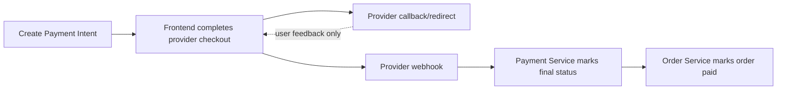
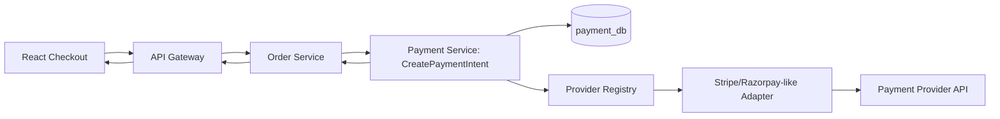
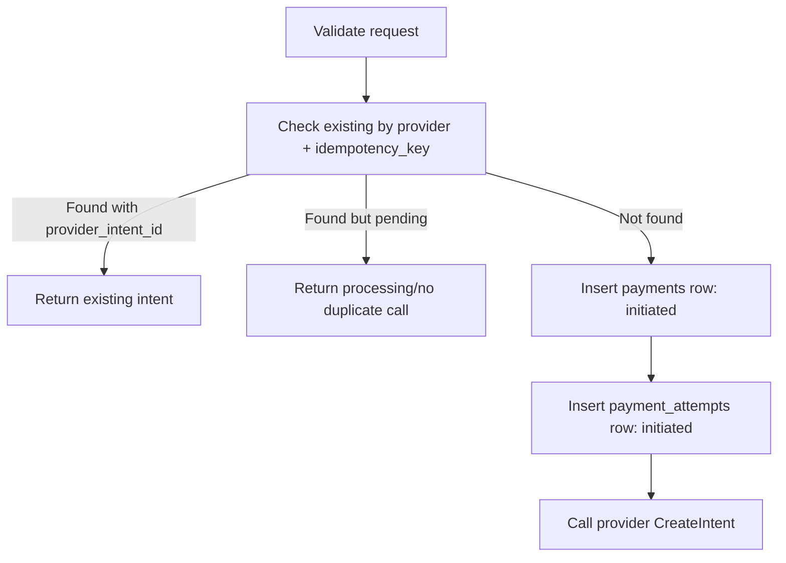
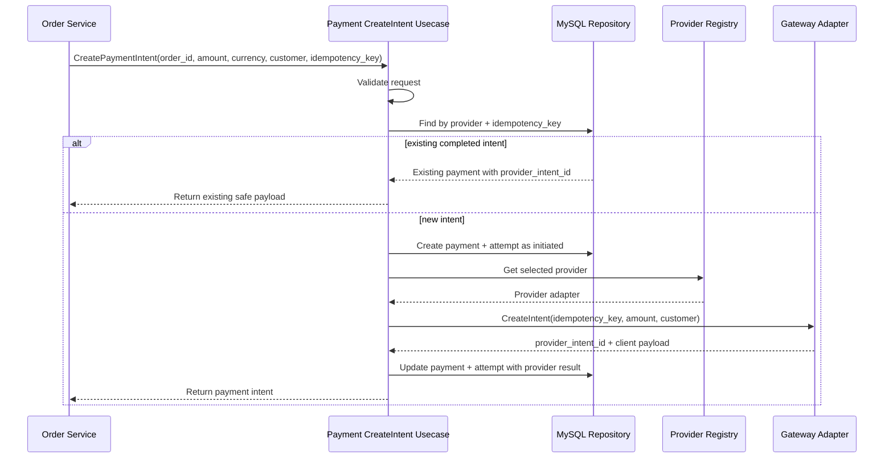
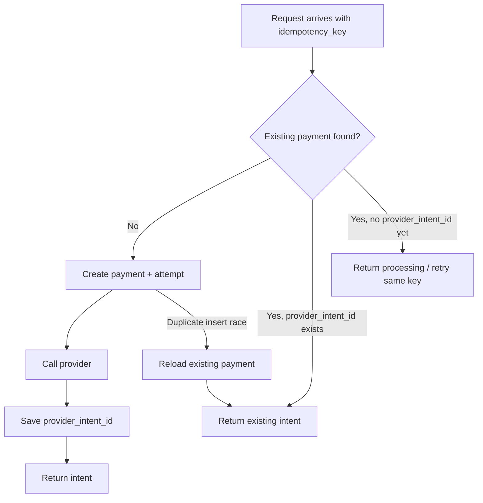
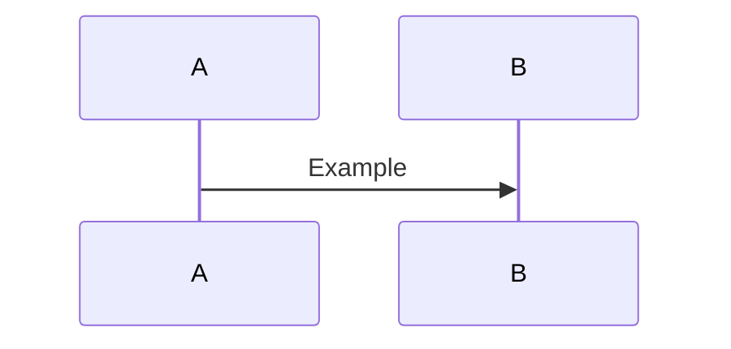
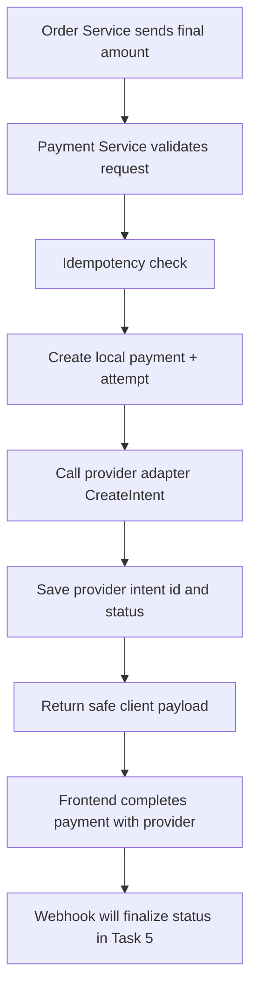

# 💳 Payment Service - Task 4: Create Payment Intent


## 📌 Task Summary

| Field | Detail |
|---|---|
| Task Name | Create payment intent |
| Source | `docs/01-micro-tasks.md` -> `Payment Service` -> Task 4 |
| Priority | `P0` foundation/blocker |
| Dependency | Order Service, Payment Service Task 2 schema, Payment Service Task 3 gateway abstraction |
| Main Goal | Order amount, currency, customer details, aur idempotency key ke saath provider payment intent create karna |
| Output Type | Documentation-only implementation guide |
| Not Included | Webhook handler, refund flow, retry policy, reconciliation job, frontend checkout UI, real provider secret setup |

> **Simple Hinglish goal:** Jab Order Service checkout ke time Payment Service ko call kare, tab Payment Service safe tarike se payment record banaye, provider adapter se payment intent/order create kare, idempotency enforce kare, aur frontend ke liye safe client payload return kare. Final payment success abhi bhi webhook se confirm hoga, frontend callback se nahi.

---

## ✅ Final Output Created

```text
TaskImplementation/
└── Payment Service/
    ├── task1.md
    ├── task2.md
    ├── task3.md
    └── task4.md
```

### Why this structure?

| Path | Purpose |
|---|---|
| `TaskImplementation/` | Saare task-wise implementation guides ka central folder |
| `TaskImplementation/Payment Service/` | Payment Service related task guides ka group |
| `task4.md` | Sirf **Payment Service - Task 4** ka complete create payment intent guide |

> 🟢 **Boundary:** Is task me actual backend service files, migrations, webhook handler, refund API, ya provider SDK integration code create nahi kiya gaya. Output sirf required `task4.md` guide hai.

---

## 🧭 Source Documents Studied

| Document | Kya use kiya gaya |
|---|---|
| `docs/01-micro-tasks.md` | Task 4 ka exact scope: `Create payment intent` |
| `docs/07-payment-system.md` | Payment intent idempotency, provider flow, webhook source-of-truth rule |
| `docs/04-microservice-design.md` | Payment Service responsibilities, gRPC method list, internal logic boundaries |
| `docs/05-database-design.md` | Payment DB tables, relationships, consistency and failure handling |
| `docs/02-system-architecture.md` | Checkout flow: Order Service -> Payment Service -> response to browser |
| `docs/03-folder-structure.md` | Future Payment Service folder layout and `create_payment_intent.go` location |
| `docs/11-devops-external-services.md` | Provider config: public key, secret key, webhook secret, allowed currencies, capture mode |
| `TaskImplementation/Payment Service/task1.md` | Payment states and allowed transitions |
| `TaskImplementation/Payment Service/task2.md` | `payments`, `payment_attempts`, idempotency indexes |
| `TaskImplementation/Payment Service/task3.md` | Provider interface, registry, status normalization, fake provider |

---

## 🪜 Step-by-Step Implementation

## Step 1: Task Boundary Clear Kiya

Task 4 ka focus **CreatePaymentIntent usecase** par hai. Ye usecase checkout ke time run hota hai.

### Included in Task 4

- `CreatePaymentIntent` request/response contract define kiya
- Amount, currency, customer, provider and idempotency validation define ki
- Payment row and payment attempt row creation flow explain kiya
- Provider abstraction ke through `CreateIntent` call ka design diya
- Provider response ko DB me persist karne ka flow define kiya
- Safe frontend payload return karne ka contract banaya
- Duplicate request handling and idempotency decision flow explain kiya
- Error handling, logging, metrics, tests and verification plan document kiya

### Not Included in Task 4

- Provider webhook HTTP handler
- Webhook signature verification implementation
- Final `captured` status confirmation flow
- Full/partial refund APIs
- Payment retry policy and max retry count
- Daily reconciliation job
- Superadmin payment operations UI
- Frontend provider SDK screen implementation

> 🟡 **Reason:** Task 4 intent create karta hai. Payment ka final truth provider webhook se aayega, jo Task 5 ka scope hai.

---

## Step 2: Create Payment Intent Ka Role Samjha

Payment intent ek provider-side object hota hai jo frontend checkout ko payment complete karne ke liye required data deta hai.

| Concept | Meaning |
|---|---|
| `payment_id` | Platform ka internal payment identifier |
| `provider_intent_id` | Provider ka intent/order/session id |
| `client_secret` / checkout payload | Frontend SDK ko payment complete karne ke liye safe token/data |
| `idempotency_key` | Same checkout request repeat hone par duplicate charge prevent karne ki key |
| `status` | Initial provider status, jaise `initiated` ya `requires_action` |

### Important rule

Frontend payment complete kar sakta hai, but **Order paid tabhi maana jayega jab provider webhook success confirm karega**.



> 🔴 **Do not:** Frontend success redirect ko final accounting proof mat maana. Webhook source of truth rahega.

---

## Step 3: High-Level Architecture Define Ki



### Diagram explanation

1. Browser checkout start karta hai.
2. API Gateway auth/session validate karke Order Service ko call karta hai.
3. Order Service order amount server-side compute karke Payment Service ko call karta hai.
4. Payment Service local DB me payment record create karta hai.
5. Provider registry selected adapter return karta hai.
6. Adapter provider intent/order create karta hai.
7. Payment Service safe intent payload Order Service ko return karta hai.
8. Browser provider SDK ke through payment complete karta hai.

---

## Step 4: Future Implementation Folder Structure Plan Kiya

Actual service implementation future me repo ke existing folder standards ke according yahan rahegi:

```text
backend/
└── services/
    └── payment-service/
        ├── cmd/
        │   └── server/
        │       └── main.go
        └── internal/
            ├── domain/
            │   ├── payment.go
            │   └── payment_status.go
            ├── usecase/
            │   └── create_payment_intent.go
            ├── provider/
            │   ├── provider.go
            │   ├── registry.go
            │   ├── stripe_like.go
            │   ├── razorpay_like.go
            │   └── fake_provider.go
            ├── repository/
            │   └── mysql_payment_repository.go
            └── transport/
                └── grpc/
                    └── payment_handler.go
```

### File responsibilities

| File | Responsibility |
|---|---|
| `domain/payment.go` | Payment entity, amount, status fields |
| `domain/payment_status.go` | Allowed states from Task 1 |
| `usecase/create_payment_intent.go` | Task 4 orchestration logic |
| `provider/provider.go` | Task 3 common provider interface |
| `provider/registry.go` | Provider selection by config/request |
| `repository/mysql_payment_repository.go` | `payments` and `payment_attempts` persistence |
| `transport/grpc/payment_handler.go` | gRPC request/response mapping |

> 🟣 **Note:** Current deliverable me ye runtime files create nahi kiye gaye. Ye implementation guide future coding ke liye exact map deta hai.

---

## Step 5: gRPC Contract Design Kiya

Payment Service internal microservice call ke liye `CreatePaymentIntent` expose karega.

```proto
syntax = "proto3";

package payment.v1;

service PaymentService {
  rpc CreatePaymentIntent(CreatePaymentIntentRequest)
      returns (CreatePaymentIntentResponse);
}

message CreatePaymentIntentRequest {
  string order_id = 1;
  string user_id = 2;
  int64 amount = 3;          // minor unit: paise/cents
  string currency = 4;       // ISO-4217, example: INR
  Customer customer = 5;
  string idempotency_key = 6;
  string provider = 7;       // optional; fallback default provider
  map<string, string> metadata = 8;
}

message Customer {
  string name = 1;
  string email = 2;
  string phone = 3;
}

message CreatePaymentIntentResponse {
  string payment_id = 1;
  string order_id = 2;
  string provider = 3;
  string provider_intent_id = 4;
  string status = 5;
  int64 amount = 6;
  string currency = 7;
  PaymentClientPayload client_payload = 8;
}

message PaymentClientPayload {
  string public_key = 1;
  string client_secret = 2;
  string provider_order_id = 3;
  string checkout_session_id = 4;
  map<string, string> extra = 5;
}
```

### Contract notes

| Field | Rule |
|---|---|
| `amount` | Always server-side computed and minor unit me |
| `currency` | Allowed currency list me hona chahiye |
| `customer` | Provider checkout prefill ke liye safe fields |
| `idempotency_key` | Mandatory; duplicate intent prevent karta hai |
| `provider` | Optional, but final provider allowed list se validate hoga |
| `client_payload` | Frontend-safe data only; backend secret never return |

---

## Step 6: Request Validation Rules Define Kiye

Provider call se pehle Payment Service input validate karega.

| Validation | Rule |
|---|---|
| `order_id` | Empty nahi hona chahiye |
| `user_id` | Empty nahi hona chahiye |
| `amount` | `> 0`, minor unit me |
| `currency` | 3-letter uppercase ISO code and allowed list me |
| `idempotency_key` | Empty nahi hona chahiye |
| `provider` | Empty ho to default provider; non-empty ho to registered/allowed provider |
| `customer.email` | Optional, but invalid format ho to reject or sanitize |
| `customer.phone` | Optional, provider-compatible format me normalize |

### Go validation example

```go
package usecase

import (
    "fmt"
    "strings"
)

var allowedCurrencies = map[string]bool{
    "INR": true,
    "USD": true,
}

func ValidateCreatePaymentIntentInput(in CreatePaymentIntentInput) error {
    if strings.TrimSpace(in.OrderID) == "" {
        return fmt.Errorf("order_id is required")
    }
    if strings.TrimSpace(in.UserID) == "" {
        return fmt.Errorf("user_id is required")
    }
    if in.Amount <= 0 {
        return fmt.Errorf("amount must be greater than zero")
    }

    currency := strings.ToUpper(strings.TrimSpace(in.Currency))
    if len(currency) != 3 || !allowedCurrencies[currency] {
        return fmt.Errorf("currency is not allowed")
    }

    if strings.TrimSpace(in.IdempotencyKey) == "" {
        return fmt.Errorf("idempotency_key is required")
    }

    return nil
}
```

> 🔴 **Security rule:** Amount browser se trust nahi karna. Order Service cart, coupon, tax, shipping calculate karke final amount bhejega.

---

## Step 7: Idempotency Key Strategy Define Ki

Task 2 schema me `payments(provider, idempotency_key)` unique key planned hai. Task 4 usko actively use karega.

### Recommended key format

```text
payment_intent:{order_id}:attempt_{attempt_no}
```

Example:

```text
payment_intent:ord_1001:attempt_1
```

### Key builder example

```go
package usecase

import "fmt"

func BuildPaymentIntentIdempotencyKey(orderID string, attemptNo int) string {
    return fmt.Sprintf("payment_intent:%s:attempt_%d", orderID, attemptNo)
}
```

### Idempotency behavior

| Situation | Expected behavior |
|---|---|
| First request | Create payment row, call provider, return intent |
| Same key repeated after success | Return existing intent payload, no new provider call |
| Same key repeated while first call in progress | Return `processing`/existing pending response, no duplicate provider call |
| Same order new attempt | New idempotency key with next `attempt_no` |
| Different provider same key | Avoid unless intentional; provider selection should be stable per attempt |

> 🟢 **Rule:** Same idempotency key ka matlab same payment operation. Is key ko provider API tak forward karna mandatory hai.

---

## Step 8: Payment and Attempt Records Create Kiye

Provider call se pehle local audit record create hona chahiye. Isse agar provider call fail bhi ho jaye to trace available rahega.



### SQL example: insert payment

```sql
INSERT INTO payments (
  payment_id,
  order_id,
  user_id,
  provider,
  status,
  currency,
  amount,
  captured_amount,
  refunded_amount,
  idempotency_key
) VALUES (
  ?,
  ?,
  ?,
  ?,
  'initiated',
  ?,
  ?,
  0,
  0,
  ?
);
```

### SQL example: insert attempt

```sql
INSERT INTO payment_attempts (
  attempt_id,
  payment_id,
  status
) VALUES (
  ?,
  ?,
  'initiated'
);
```

> 🟡 **Transaction note:** Payment row and attempt row ek short DB transaction me create karo. Provider API call ko long DB transaction ke andar hold mat karo.

---

## Step 9: Provider Adapter Se Intent Create Kiya

Task 3 ke provider abstraction ka `CreateIntent` method Task 4 me use hoga.

```go
type Provider interface {
    Name() string
    CreateIntent(ctx context.Context, req CreateIntentRequest) (CreateIntentResponse, error)
}
```

### Provider request mapping

| Payment Service field | Provider request field |
|---|---|
| `payment_id` | Metadata/reference id |
| `order_id` | Metadata/order reference |
| `amount` | Provider amount minor unit |
| `currency` | Provider currency |
| `customer` | Prefill/customer details |
| `idempotency_key` | Provider idempotency header/key |
| `capture_mode` | Automatic/manual capture setting |

### Example provider request

```go
providerReq := provider.CreateIntentRequest{
    PaymentID:      payment.PaymentID,
    OrderID:        input.OrderID,
    UserID:         input.UserID,
    Amount: provider.Money{
        AmountMinor: input.Amount,
        Currency:    input.Currency,
    },
    Customer: provider.Customer{
        UserID: input.UserID,
        Name:   input.Customer.Name,
        Email:  input.Customer.Email,
        Phone:  input.Customer.Phone,
    },
    IdempotencyKey: input.IdempotencyKey,
    CaptureMode:    provider.CaptureModeAutomatic,
    Metadata: map[string]string{
        "payment_id": payment.PaymentID,
        "order_id":   input.OrderID,
        "user_id":    input.UserID,
    },
}
```

> 🔴 **Never send:** Card number, CVV, OTP, raw auth token, provider secret key, ya unnecessary PII metadata me mat bhejo.

---

## Step 10: Provider Response Normalize Kiya

Provider response ko internal shape me convert karna zaruri hai.

```go
type CreateIntentResponse struct {
    Provider          string
    ProviderIntentID  string
    ProviderPaymentID string
    Status            IntentStatus
    ClientSecret      string
    ProviderOrderID   string
    CheckoutSessionID string
    RawResponse        map[string]any
}
```

### Status mapping for create intent

| Provider result | Internal status | Meaning |
|---|---|---|
| Intent/order created, user action needed | `requires_action` | Frontend provider checkout continue karega |
| Authorized but not captured | `authorized` | Capture/webhook pending |
| Captured synchronously | `captured` | Record update ho sakta hai, but Order finalization webhook se hi |
| Declined/invalid | `failed` | Intent create nahi hua ya provider ne reject kiya |
| Unknown/pending | `initiated` | Later webhook/status check needed |

> 🟡 **Important:** Agar provider response `captured` bole tab bhi Order Service ko final paid mark karne ka primary signal webhook/event pipeline se aana chahiye. Task 4 sirf intent response return karta hai.

---

## Step 11: Provider IDs DB Me Persist Kiye

Provider call ke baad Payment Service local payment row update karega.

```sql
UPDATE payments
SET
  provider_intent_id = ?,
  provider_payment_id = ?,
  status = ?,
  failure_code = NULL,
  failure_message = NULL
WHERE payment_id = ?;
```

Attempt row bhi update hogi:

```sql
UPDATE payment_attempts
SET
  provider_attempt_id = ?,
  status = ?,
  raw_provider_response = ?
WHERE attempt_id = ?;
```

### Field mapping

| DB field | Value source |
|---|---|
| `payments.provider_intent_id` | Provider intent/order/session id |
| `payments.provider_payment_id` | Provider payment id, agar response me available ho |
| `payments.status` | Normalized intent status |
| `payment_attempts.provider_attempt_id` | Provider attempt/session id |
| `payment_attempts.raw_provider_response` | Sanitized provider response JSON |

> 🟢 **Audit rule:** Raw response me secrets/card data store nahi karna. Sirf sanitized provider response save karna.

---

## Step 12: Safe Client Payload Return Kiya

Payment Service frontend ke liye sirf safe data return karega.

### Response JSON example

```json
{
  "payment_id": "pay_1001",
  "order_id": "ord_1001",
  "provider": "razorpay_like",
  "provider_intent_id": "provider_order_abc123",
  "status": "requires_action",
  "amount": 259900,
  "currency": "INR",
  "client_payload": {
    "public_key": "rzp_test_public_key",
    "provider_order_id": "provider_order_abc123",
    "client_secret": "",
    "checkout_session_id": "",
    "extra": {
      "merchant_name": "Ecommerce",
      "theme_color": "#2563eb"
    }
  }
}
```

### Client payload rules

| Allowed in response | Not allowed in response |
|---|---|
| Public key | Secret key |
| Client secret/order id | Webhook secret |
| Payment id | Raw provider auth headers |
| Amount/currency | Card/CVV data |
| Checkout session id | Internal DB credentials |

---

## Step 13: End-to-End Sequence Define Kiya



### Why this order?

- Validation pehle hoti hai, taaki invalid requests provider tak na jayein.
- DB audit record provider call se pehle banta hai.
- Provider call abstraction ke through hota hai, direct SDK se nahi.
- Provider IDs persist hone ke baad hi response return hota hai.
- Duplicate request existing record return karta hai, duplicate charge nahi banata.

---

## Step 14: Usecase Pseudo Implementation Banaya

```go
package usecase

import (
    "context"
    "errors"
    "time"
)

type CreatePaymentIntentUsecase struct {
    repo              PaymentRepository
    providers         ProviderRegistry
    defaultProvider   string
    publicKeyProvider PublicKeyProvider
    clock             func() time.Time
}

func (uc *CreatePaymentIntentUsecase) Execute(
    ctx context.Context,
    in CreatePaymentIntentInput,
) (CreatePaymentIntentOutput, error) {
    if err := ValidateCreatePaymentIntentInput(in); err != nil {
        return CreatePaymentIntentOutput{}, err
    }

    providerName := in.Provider
    if providerName == "" {
        providerName = uc.defaultProvider
    }

    existing, err := uc.repo.FindByProviderIdempotencyKey(ctx, providerName, in.IdempotencyKey)
    if err == nil && existing.ProviderIntentID != "" {
        return uc.outputFromExisting(existing), nil
    }
    if err == nil && existing.ProviderIntentID == "" {
        return CreatePaymentIntentOutput{}, ErrPaymentIntentProcessing
    }
    if !errors.Is(err, ErrPaymentNotFound) {
        return CreatePaymentIntentOutput{}, err
    }

    payment := NewInitiatedPayment(in, providerName, uc.clock())
    attempt := NewPaymentAttempt(payment.PaymentID)

    if err := uc.repo.CreatePaymentWithAttempt(ctx, payment, attempt); err != nil {
        if errors.Is(err, ErrDuplicateIdempotencyKey) {
            return uc.loadExistingIntent(ctx, providerName, in.IdempotencyKey)
        }
        return CreatePaymentIntentOutput{}, err
    }

    gateway, err := uc.providers.Get(providerName)
    if err != nil {
        _ = uc.repo.MarkIntentFailed(ctx, payment.PaymentID, attempt.AttemptID, "provider_not_configured", err.Error())
        return CreatePaymentIntentOutput{}, err
    }

    providerRes, err := gateway.CreateIntent(ctx, BuildProviderIntentRequest(payment, attempt, in))
    if err != nil {
        _ = uc.repo.MarkIntentFailed(ctx, payment.PaymentID, attempt.AttemptID, "provider_error", err.Error())
        return CreatePaymentIntentOutput{}, err
    }

    if err := uc.repo.MarkIntentCreated(ctx, payment.PaymentID, attempt.AttemptID, providerRes); err != nil {
        return CreatePaymentIntentOutput{}, err
    }

    return uc.outputFromProviderResponse(payment, providerName, providerRes), nil
}
```

### Pseudo code explanation

| Block | Kya karta hai |
|---|---|
| Validate | Bad request ko provider/API se pehle stop karta hai |
| Provider selection | Request provider ya default provider decide karta hai |
| Idempotency lookup | Duplicate request par existing intent return karta hai |
| Create local records | `payments` and `payment_attempts` audit rows banata hai |
| Provider call | Task 3 adapter ke through external provider call karta hai |
| Persist result | Provider IDs/status DB me save karta hai |
| Response | Safe payload return karta hai |

---

## Step 15: Repository Interface Define Kiya

Usecase ko SQL details nahi pata honi chahiye, isliye repository contract use hoga.

```go
type PaymentRepository interface {
    FindByProviderIdempotencyKey(
        ctx context.Context,
        provider string,
        idempotencyKey string,
    ) (PaymentRecord, error)

    CreatePaymentWithAttempt(
        ctx context.Context,
        payment PaymentRecord,
        attempt PaymentAttemptRecord,
    ) error

    MarkIntentCreated(
        ctx context.Context,
        paymentID string,
        attemptID string,
        providerRes provider.CreateIntentResponse,
    ) error

    MarkIntentFailed(
        ctx context.Context,
        paymentID string,
        attemptID string,
        failureCode string,
        failureMessage string,
    ) error
}
```

### Repository rules

| Rule | Why |
|---|---|
| Use DB transactions for multi-table writes | Payment and attempt consistent rahen |
| Detect duplicate key explicitly | Idempotency conflict cleanly handle ho |
| Store sanitized provider response | Debugging possible, secrets safe |
| Keep provider call out of DB transaction | Long locks avoid honge |

---

## Step 16: Idempotency Duplicate Flow Define Kiya



### Beginner-friendly example

User checkout button double-click karta hai:

1. First request DB row create karta hai.
2. Second request same `idempotency_key` ke saath aata hai.
3. Unique index duplicate payment create hone se rokta hai.
4. Payment Service existing intent return karta hai.
5. User ko duplicate charge nahi lagta.

---

## Step 17: Error Handling Rules Define Kiye

| Error type | DB status | Response behavior |
|---|---|---|
| Validation error | No row create | Return invalid request error |
| Unknown provider | Mark payment/attempt failed if row created | Return provider config error |
| Provider authentication issue | `failed` | Alert/config fix needed |
| Provider validation issue | `failed` | Return failed intent error |
| Provider timeout | `failed` or `initiated` with review policy | Do not duplicate call with same key |
| Duplicate idempotency key | Existing status | Return existing/processing response |
| DB insert failure | No provider call | Return internal error |
| DB update failure after provider success | Needs manual reconciliation | Alert; provider id may exist outside DB |

### Provider failure update example

```sql
UPDATE payments
SET
  status = 'failed',
  failure_code = ?,
  failure_message = ?
WHERE payment_id = ?;

UPDATE payment_attempts
SET
  status = 'failed',
  failure_code = ?,
  failure_message = ?
WHERE attempt_id = ?;
```

> 🟡 **Careful point:** Provider timeout ambiguous hota hai. Same idempotency key se retry/check karna safe hai, but automatic retry policy Task 7 me detail hogi.

---

## Step 18: Security Rules Add Kiye

Payment intent creation high-risk boundary hai.

| Rule | Explanation |
|---|---|
| Card data platform server par nahi aayega | Hosted checkout/provider SDK card details handle karega |
| Backend secret key never returned | Frontend ko only public key/client secret/order id milega |
| Amount server-side only | Browser amount tamper karke discount nahi le sakta |
| Idempotency mandatory | Duplicate charges prevent honge |
| Currency whitelist | Unsupported/incorrect currency reject hogi |
| Provider metadata limited | Secrets/PII-heavy data provider metadata me nahi jayega |
| Logs sanitized | Secret, token, CVV, OTP, card data redact honge |
| Request auth via Order Service | Direct buyer-controlled internal call allowed nahi |

### Sanitized log example

```go
logger.Info("payment intent created",
    "payment_id", payment.PaymentID,
    "order_id", payment.OrderID,
    "provider", payment.Provider,
    "provider_intent_id", providerRes.ProviderIntentID,
    "status", providerRes.Status,
    "currency", payment.Currency,
)
```

> 🔴 **Never log:** `secret_key`, `webhook_secret`, full `client_secret`, card number, CVV, OTP, raw authorization headers.

---

## Step 19: Observability Rules Define Kiye

Create intent flow checkout latency ka important part hai.

| Signal | Example |
|---|---|
| Log | `payment intent created` |
| Log | `payment intent idempotency hit` |
| Metric | `payment_intent_create_total{provider,status}` |
| Metric | `payment_provider_latency_ms{provider,operation}` |
| Metric | `payment_intent_failure_total{provider,error_code}` |
| Trace span | `payment.create_intent` |
| Trace span | `payment.provider.create_intent` |

### Trace attributes

```text
payment.provider = razorpay_like
payment.operation = create_intent
payment.currency = INR
payment.amount_minor = 259900
payment.status = requires_action
```

> 🟢 **Why:** Agar checkout slow/fail ho raha hai, team quickly dekh paayegi ki issue DB, provider, ya validation layer me hai.

---

## Step 20: External Libraries/Tools

### Used in this Task 4 documentation

| Library/Tool | Used? | Why |
|---|---:|---|
| Markdown | Yes | Structured implementation guide likhne ke liye |
| Mermaid | Yes | Architecture and sequence diagrams markdown-friendly format me banane ke liye |
| Shields.io badges | Yes | Visual status/priority/scope badges ke liye |
| Go standard library | Yes, examples only | `context`, `fmt`, `errors`, `time` examples ke liye |
| MySQL | Yes, schema/query examples | Task 2 payment tables ke saath intent persistence explain karne ke liye |

### Mermaid install/use

GitHub/GitLab markdown me Mermaid usually built-in render hota hai.

Local VS Code preview ke liye optional extension:

```text
Markdown Preview Mermaid Support
```

Usage:

````markdown

````

### Future Go/MySQL driver

Actual Go service me MySQL use karne ke liye common driver:

```bash
go get github.com/go-sql-driver/mysql
```

Usage idea:

```go
import (
    "database/sql"

    _ "github.com/go-sql-driver/mysql"
)

db, err := sql.Open("mysql", dsn)
```

### Optional future provider SDKs

Task 4 guide provider abstraction use karta hai. Real adapter implementation me official SDK add kiye ja sakte hain.

#### Stripe-like SDK

```bash
go get github.com/stripe/stripe-go/v82
```

Use case:

```go
// Example only:
// params := &stripe.PaymentIntentParams{Amount: stripe.Int64(amount), Currency: stripe.String("inr")}
// params.SetIdempotencyKey(idempotencyKey)
// intent, err := paymentintent.New(params)
```

#### Razorpay-like SDK

```bash
go get github.com/razorpay/razorpay-go
```

Use case:

```go
// Example only:
// client := razorpay.NewClient(publicKey, secretKey)
// order, err := client.Order.Create(data, nil)
```

> 🟡 **Scope note:** Is task me koi external dependency install nahi ki gayi. Ye commands future real provider adapter implementation ke liye documented hain.

---

## Step 21: API Request/Response Examples

### Order Service -> Payment Service request

```json
{
  "order_id": "ord_1001",
  "user_id": "usr_501",
  "amount": 259900,
  "currency": "INR",
  "customer": {
    "name": "Aarav Sharma",
    "email": "aarav@example.com",
    "phone": "+919999999999"
  },
  "idempotency_key": "payment_intent:ord_1001:attempt_1",
  "provider": "razorpay_like",
  "metadata": {
    "checkout_session_id": "sess_abc123"
  }
}
```

### Payment Service -> Order Service response

```json
{
  "payment_id": "pay_1001",
  "order_id": "ord_1001",
  "provider": "razorpay_like",
  "provider_intent_id": "order_provider_789",
  "status": "requires_action",
  "amount": 259900,
  "currency": "INR",
  "client_payload": {
    "public_key": "rzp_test_public",
    "provider_order_id": "order_provider_789",
    "client_secret": "",
    "checkout_session_id": "",
    "extra": {
      "prefill_name": "Aarav Sharma"
    }
  }
}
```

---

## Step 22: Testing Plan Define Kiya

| Test type | Kya test hoga |
|---|---|
| Unit test | Invalid amount reject hota hai |
| Unit test | Unsupported currency reject hoti hai |
| Unit test | Empty idempotency key reject hoti hai |
| Unit test | Default provider select hota hai jab request provider empty hai |
| Unit test | Unknown provider error cleanly return hota hai |
| Unit test | Existing idempotency key duplicate provider call nahi karta |
| Unit test | Provider success DB me provider intent id save karta hai |
| Unit test | Provider failure payment and attempt failed mark karta hai |
| Integration test | Fake provider ke saath create intent end-to-end |
| Security test | Logs me secret/client secret/card data nahi aata |

### Fake provider test example

```go
func TestCreatePaymentIntentReturnsProviderPayload(t *testing.T) {
    fakeProvider := provider.NewFakeProvider(provider.CreateIntentResponse{
        Provider:         "fake",
        ProviderIntentID: "fake_intent_123",
        Status:           provider.IntentStatusRequiresAction,
        ClientSecret:     "fake_client_secret",
    })

    uc := NewCreatePaymentIntentUsecase(repo, provider.NewRegistry(fakeProvider), "fake")

    out, err := uc.Execute(context.Background(), CreatePaymentIntentInput{
        OrderID:        "ord_1001",
        UserID:         "usr_1001",
        Amount:         259900,
        Currency:       "INR",
        IdempotencyKey: "payment_intent:ord_1001:attempt_1",
    })
    if err != nil {
        t.Fatalf("Execute() error = %v", err)
    }
    if out.ProviderIntentID != "fake_intent_123" {
        t.Fatalf("provider intent mismatch")
    }
}
```

---

## Step 23: Verification Commands Plan Kiye

Future implementation ke baad verification commands:

```bash
go test ./backend/services/payment-service/...
```

MySQL idempotency check:

```sql
SELECT payment_id, order_id, provider, provider_intent_id, status, idempotency_key
FROM payments
WHERE provider = 'razorpay_like'
  AND idempotency_key = 'payment_intent:ord_1001:attempt_1';
```

Attempt audit check:

```sql
SELECT attempt_id, payment_id, provider_attempt_id, status, created_at
FROM payment_attempts
WHERE payment_id = 'pay_1001';
```

Expected result:

- `payments` me one row per provider + idempotency key
- `payment_attempts` me one initiated/succeeded/failed attempt row
- Duplicate same key par second payment row create nahi hota
- Provider response ke IDs safely persist hote hain

---

## Step 24: Clean Folder Structure of This Deliverable

```text
TaskImplementation/
└── Payment Service/
    ├── task1.md   # Payment state machine
    ├── task2.md   # MySQL schema
    ├── task3.md   # Gateway abstraction
    └── task4.md   # Create payment intent
```

### Task sequence relation

| Task | Task 4 me kaise use hua |
|---|---|
| Task 1 | `initiated`, `requires_action`, `authorized`, `captured`, `failed` statuses |
| Task 2 | `payments`, `payment_attempts`, idempotency unique key |
| Task 3 | Provider interface and registry |
| Task 4 | Intent create orchestration |
| Task 5 | Future webhook final status update |
| Task 6 | Future refund flow |
| Task 7 | Future retry handling |
| Task 8 | Future reconciliation |

---

## Step 25: Implementation Checklist

| Item | Status |
|---|---:|
| Task 4 scope identified from docs | ✅ |
| Existing Payment Task 1, Task 2, Task 3 guides studied | ✅ |
| Create payment intent flow documented | ✅ |
| gRPC contract example included | ✅ |
| Validation rules included | ✅ |
| Idempotency key strategy included | ✅ |
| DB insert/update examples included | ✅ |
| Provider abstraction usage included | ✅ |
| Safe client payload explained | ✅ |
| Duplicate request handling documented | ✅ |
| Error handling rules included | ✅ |
| Security and observability rules included | ✅ |
| External libraries/tools explained | ✅ |
| Mermaid diagrams included | ✅ |
| Scope limited to Payment Service Task 4 | ✅ |

---

## 🚫 Not Implemented Beyond Task 4

| Not done | Why |
|---|---|
| Webhook handler | Payment Service Task 5 |
| Provider webhook signature verification | Payment Service Task 5 |
| Refund API | Payment Service Task 6 |
| Failed payment retry policy | Payment Service Task 7 |
| Reconciliation worker | Payment Service Task 8 |
| Frontend payment step UI | User App Frontend checkout task |
| Admin payment operations | Superadmin Panel payment operations task |
| Real provider live keys setup | DevOps/external service setup task |
| New DB migration | Task 2 already documents schema |

---

## 🧠 Final Mental Model

Create payment intent flow ko simple words me:



### Final rules

- Order amount server-side computed hoga.
- Payment intent creation idempotent hoga.
- Provider abstraction ke through external gateway call hoga.
- Payment and attempt audit rows preserve honge.
- Frontend ko only safe client payload milega.
- Secret key, webhook secret, card data, CVV, OTP kabhi expose/store nahi honge.
- Final payment success webhook se confirm hoga.

**Task 4 complete hai as a create payment intent documentation guide.** Future Task 5 is intent ke provider webhook ko verify/process karke payment ko final status me update karega.
