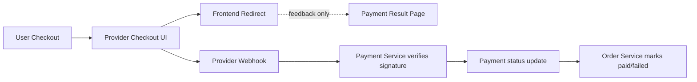
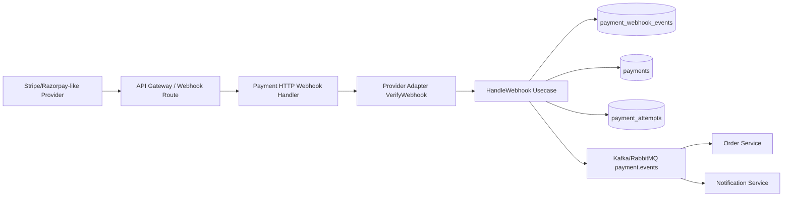
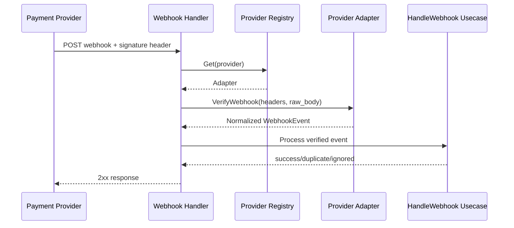
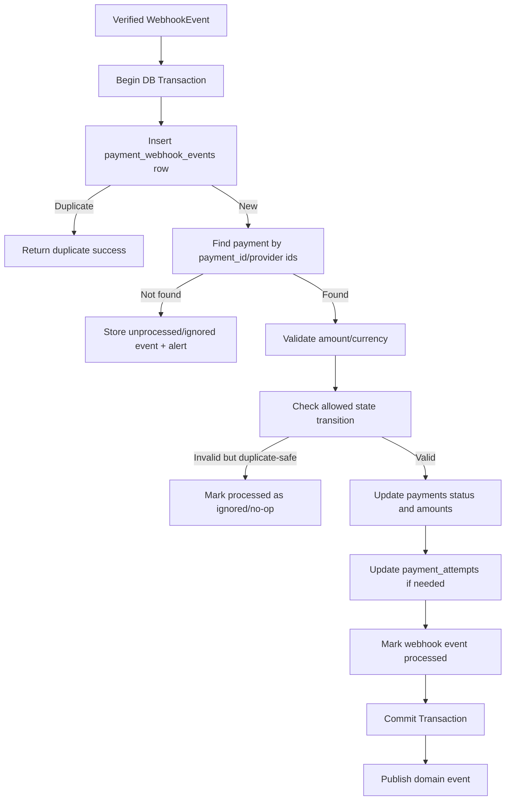
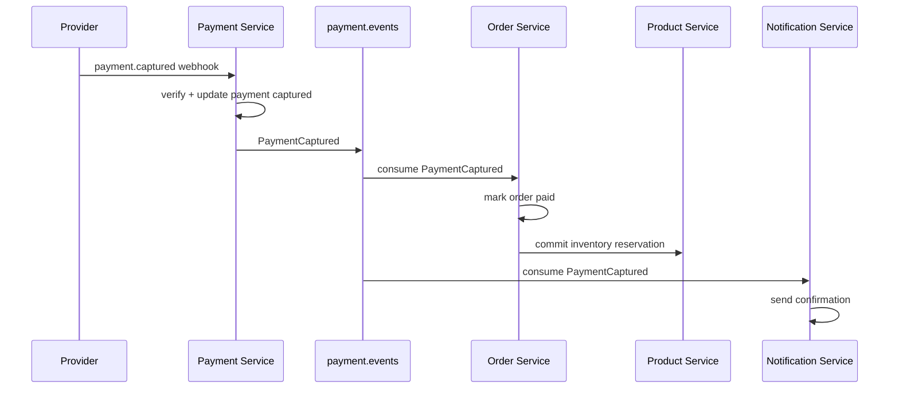
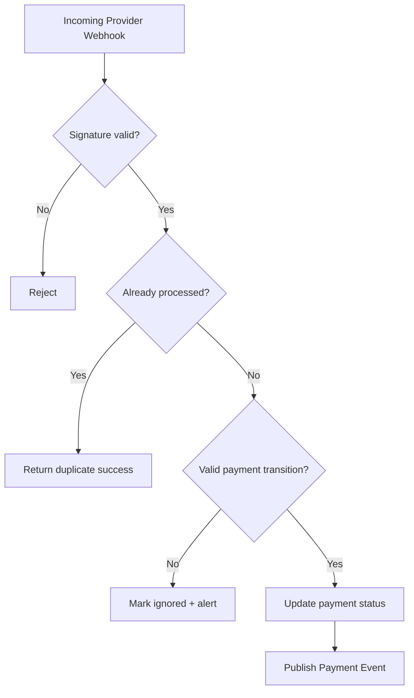

# 💳 Payment Service - Task 5: Webhook Handler


## 📌 Task Summary

| Field | Detail |
|---|---|
| Task Name | Webhook handler |
| Source | `docs/01-micro-tasks.md` -> `Payment Service` -> Task 5 |
| Priority | `P0` foundation/blocker |
| Dependency | Gateway provider, Payment Service Task 3 provider abstraction, Payment Service Task 4 payment intent |
| Main Goal | Provider webhook signature verify karna, duplicate webhook safely handle karna, payment status update karna |
| Output Type | Documentation-only implementation guide |
| Not Included | Refund flow, retry handling, reconciliation job, admin payment UI, real provider account setup |

> **Simple Hinglish goal:** Payment provider jab success/failure event bhejta hai, Payment Service us webhook ko verify karega, event ko idempotently store karega, payment status ko valid state transition ke saath update karega, aur Order/Notification systems ko event publish karega. Final payment truth provider webhook hi hoga, frontend callback nahi.

---

## ✅ Final Output Created

```text
TaskImplementation/
└── Payment Service/
    ├── task1.md
    ├── task2.md
    ├── task3.md
    ├── task4.md
    └── task5.md
```

### Why this structure?

| Path | Purpose |
|---|---|
| `TaskImplementation/` | Saare task-wise implementation guides ka central folder |
| `TaskImplementation/Payment Service/` | Payment Service related task guides ka group |
| `task5.md` | Sirf **Payment Service - Task 5** ka complete webhook handler guide |

> 🟢 **Boundary:** Is task me actual backend service files, migrations, provider SDK install, ya real webhook endpoint deploy nahi kiya gaya. User request ke hisaab se output sirf required `task5.md` implementation guide hai.

---

## 🧭 Source Documents Studied

| Document | Kya use kiya gaya |
|---|---|
| `docs/01-micro-tasks.md` | Task 5 ka exact scope: provider webhook signature verify, payment status update |
| `docs/07-payment-system.md` | Webhook source-of-truth rule, success/failure flow, idempotency keys |
| `docs/04-microservice-design.md` | Payment Service responsibilities, webhook REST API, internal logic boundary |
| `docs/05-database-design.md` | `payment_webhook_events` table, unique provider event id, idempotent processing |
| `database/draw.sql` | Existing `payment_webhook_events`, `payments`, `payment_attempts` table design |
| `docs/03-folder-structure.md` | Future `handle_webhook.go` and `http/webhook_handler.go` location |
| `docs/11-devops-external-services.md` | Provider config: secret key, webhook secret, public key, capture mode |
| `api/master-api.json` | Route `POST /api/v1/webhooks/payments/{provider}` -> `PaymentService.HandleWebhook` |
| `TaskImplementation/Payment Service/task1.md` | Payment states and allowed transitions |
| `TaskImplementation/Payment Service/task2.md` | MySQL schema and webhook idempotency table |
| `TaskImplementation/Payment Service/task3.md` | Provider abstraction and `VerifyWebhook` contract |
| `TaskImplementation/Payment Service/task4.md` | Payment intent creation and provider metadata storage |

---

## 🪜 Step-by-Step Implementation

## Step 1: Task Boundary Clear Kiya

Task 5 ka focus **incoming provider webhook ko safely process karna** hai.

### Included in Task 5

- Webhook HTTP/gRPC boundary define ki
- Raw request body preserve karne ka rule define kiya
- Provider signature verification flow explain kiya
- Provider event ko normalized internal event me convert karna define kiya
- `payment_webhook_events` table ke through idempotency enforce ki
- Payment status update with allowed state transition define kiya
- Duplicate webhook ko no-op response dena explain kiya
- Order/Notification ke liye payment events publish karna define kiya
- Security, observability, error handling, tests and verification plan document kiya

### Not Included in Task 5

- New payment intent creation
- Refund request creation and provider refund call
- Failed payment retry policy
- Daily reconciliation job
- Superadmin payment operation screens
- Real Stripe/Razorpay account configuration
- Frontend payment result page

> 🟡 **Reason:** Task 5 webhook source-of-truth flow handle karta hai. Refund Task 6, retry Task 7, aur reconciliation Task 8 me aayenge.

---

## Step 2: Webhook Ka Role Samjha

Payment providers async webhook bhejte hain kyunki payment completion immediately frontend callback se reliable nahi hoti.

| Source | Trust Level | Use |
|---|---|---|
| Frontend redirect/callback | Low | User ko success/failure screen dikhane ke liye |
| Provider API response | Medium | Intent create/update ka immediate status |
| Provider webhook with valid signature | High | Final payment status update ke liye |

### Core rule

> 🔴 **Payment final status provider webhook se decide hoga.** Frontend success redirect ko `paid` proof nahi maana jayega.



---

## Step 3: High-Level Webhook Architecture Define Ki



### Diagram explanation

1. Provider webhook endpoint hit karta hai: `POST /api/v1/webhooks/payments/{provider}`.
2. Handler raw body and headers read karta hai.
3. Provider adapter signature verify karta hai.
4. Event normalized format me convert hota hai.
5. `payment_webhook_events` me provider event id unique key ke saath store hota hai.
6. Duplicate event ho to existing result ke saath safe success response return hota hai.
7. New event valid hai to payment status transactionally update hota hai.
8. Payment domain event publish hota hai so Order/Notification react kar saken.

---

## Step 4: Clean Future Folder Structure Plan Kiya

Actual service implementation future me project standards ke according yahan rahegi:

```text
backend/
└── services/
    └── payment-service/
        ├── cmd/
        │   └── server/
        │       └── main.go
        ├── internal/
        │   ├── domain/
        │   │   ├── payment.go
        │   │   ├── payment_status.go
        │   │   └── webhook_event.go
        │   ├── usecase/
        │   │   ├── create_payment_intent.go
        │   │   └── handle_webhook.go
        │   ├── provider/
        │   │   ├── provider.go
        │   │   ├── registry.go
        │   │   ├── stripe_like.go
        │   │   ├── razorpay_like.go
        │   │   └── fake_provider.go
        │   ├── repository/
        │   │   └── mysql_payment_repository.go
        │   └── transport/
        │       ├── grpc/
        │       │   └── payment_handler.go
        │       └── http/
        │           └── webhook_handler.go
        ├── migrations/
        └── deploy/
```

### File responsibilities

| File | Responsibility |
|---|---|
| `domain/webhook_event.go` | Normalized webhook event model |
| `usecase/handle_webhook.go` | Signature verified event ko process karna |
| `provider/provider.go` | `VerifyWebhook` interface contract |
| `provider/stripe_like.go` | Stripe-like signature and event mapping |
| `provider/razorpay_like.go` | Razorpay-like signature and event mapping |
| `repository/mysql_payment_repository.go` | Webhook event insert, payment lookup/update transaction |
| `transport/http/webhook_handler.go` | Raw HTTP request receive karna |
| `transport/grpc/payment_handler.go` | Gateway se gRPC `HandleWebhook` request receive karna |

> 🟣 **Note:** Current deliverable documentation-only hai. Runtime code files create nahi kiye gaye.

---

## Step 5: API Contract Confirm Kiya

`api/master-api.json` ke according webhook route:

```http
POST /api/v1/webhooks/payments/{provider}
```

| Field | Value |
|---|---|
| Service | `payment-service` |
| gRPC | `PaymentService.HandleWebhook` |
| Auth | `webhook` |
| Request schema | `PaymentWebhookRequest` |
| Response schema | `SuccessResponse` |

### Request shape

```json
{
  "provider": "stripe_like",
  "headers": {
    "Stripe-Signature": "t=1710000000,v1=..."
  },
  "raw_body": "{\"id\":\"evt_123\",\"type\":\"payment_intent.succeeded\"}"
}
```

### Important raw body rule

Signature verification ke liye **exact raw body bytes** chahiye. JSON parse karke re-serialize karne se signature fail ho sakti hai.

```go
body, err := io.ReadAll(r.Body)
if err != nil {
    return err
}

req := HandleWebhookRequest{
    Provider: providerFromPath,
    Headers: flattenHeaders(r.Header),
    RawBody: body,
}
```

> 🔴 **Important:** Webhook handler me pehle body parse mat karo. Pehle raw bytes provider adapter ko do, phir verified event parse karo.

---

## Step 6: gRPC Contract Design Kiya

Payment webhook API Gateway se Payment Service tak gRPC call ke form me ja sakta hai.

```proto
syntax = "proto3";

package ecommerce.payment.v1;

service PaymentService {
  rpc HandleWebhook(HandleWebhookRequest) returns (HandleWebhookResponse);
}

message HandleWebhookRequest {
  string provider = 1;
  map<string, string> headers = 2;
  bytes raw_body = 3;
  string received_at = 4;
}

message HandleWebhookResponse {
  bool success = 1;
  string webhook_event_id = 2;
  string provider_event_id = 3;
  string processing_status = 4; // processed, duplicate, ignored
}
```

### Contract notes

| Field | Rule |
|---|---|
| `provider` | URL path se aayega, allowed provider list se validate hoga |
| `headers` | Signature verification ke liye provider-specific headers preserve honge |
| `raw_body` | Exact provider payload bytes |
| `received_at` | Gateway/Payment Service received timestamp |
| `processing_status` | Duplicate webhook ko bhi successful response milega |

---

## Step 7: Provider Interface Extend Nahi, Reuse Kiya

Task 3 me provider abstraction already define hai. Task 5 usi `VerifyWebhook` method ko use karega.

```go
type Provider interface {
    CreateIntent(ctx context.Context, req CreateIntentRequest) (CreateIntentResponse, error)
    Capture(ctx context.Context, req CaptureRequest) (CaptureResponse, error)
    Refund(ctx context.Context, req RefundRequest) (RefundResponse, error)
    VerifyWebhook(ctx context.Context, headers map[string]string, body []byte) (WebhookEvent, error)
}
```

### Normalized event

Provider-specific payload ko internal normalized event me convert karna zaruri hai.

```go
type WebhookEvent struct {
    ProviderEventID   string
    Type              WebhookEventType
    PaymentID         string
    OrderID           string
    ProviderIntentID  string
    ProviderPaymentID string
    Amount            int64
    Currency          string
    OccurredAt        time.Time
    RawPayload        []byte
}

type WebhookEventType string

const (
    WebhookEventPaymentRequiresAction WebhookEventType = "payment.requires_action"
    WebhookEventPaymentAuthorized     WebhookEventType = "payment.authorized"
    WebhookEventPaymentCaptured       WebhookEventType = "payment.captured"
    WebhookEventPaymentFailed         WebhookEventType = "payment.failed"
)
```

### Why normalized event?

| Problem | Solution |
|---|---|
| Stripe and Razorpay event names different hote hain | Internal event names fixed rakho |
| Provider payload bulky hota hai | Usecase ko sirf required fields do |
| Payment lookup multiple ids se ho sakta hai | `payment_id`, `provider_intent_id`, `provider_payment_id` normalize karo |
| Future provider add karna hai | New adapter add karo, usecase same rahega |

---

## Step 8: Signature Verification Flow Define Kiya



### Signature verification rules

| Rule | Why |
|---|---|
| Verify before parsing business fields | Tampered payload reject hoga |
| Use provider webhook secret from secrets/config | Hardcoded secret avoid hoga |
| Enforce timestamp tolerance if provider supports it | Replay attack reduce hoga |
| Use constant-time compare for HMAC | Timing attack risk kam hota hai |
| Log only event ids, not secret/signature value | Sensitive data leak avoid hoga |

### Stripe-like HMAC example

```go
func verifyHMACSHA256(secret string, signedPayload []byte, expectedHex string) bool {
    mac := hmac.New(sha256.New, []byte(secret))
    mac.Write(signedPayload)
    actual := mac.Sum(nil)

    expected, err := hex.DecodeString(expectedHex)
    if err != nil {
        return false
    }

    return hmac.Equal(actual, expected)
}
```

> 🟢 **Note:** HMAC verification ke liye Go standard library `crypto/hmac`, `crypto/sha256`, and `encoding/hex` enough hain. Extra library mandatory nahi hai.

---

## Step 9: Webhook Idempotency Design Kiya

Payment providers same webhook multiple times bhej sakte hain. Isliye duplicate event processing block karna mandatory hai.

### Database table

Task 2 schema me table already planned hai:

```sql
CREATE TABLE IF NOT EXISTS payment_webhook_events (
  id BIGINT UNSIGNED NOT NULL AUTO_INCREMENT,
  webhook_event_id VARCHAR(64) NOT NULL,
  provider VARCHAR(64) NOT NULL,
  provider_event_id VARCHAR(128) NOT NULL,
  event_type VARCHAR(128) NOT NULL,
  processed BOOLEAN NOT NULL DEFAULT FALSE,
  payload JSON NOT NULL,
  received_at TIMESTAMP NOT NULL DEFAULT CURRENT_TIMESTAMP,
  processed_at TIMESTAMP NULL,
  PRIMARY KEY (id),
  UNIQUE KEY uk_webhook_provider_event (provider, provider_event_id),
  UNIQUE KEY uk_webhook_event_id (webhook_event_id),
  KEY idx_webhook_processed_received (processed, received_at)
) ENGINE=InnoDB;
```

### Idempotency key

```text
webhook:{provider}:{provider_event_id}
```

### Duplicate handling rule

| Scenario | Action |
|---|---|
| New `provider_event_id` | Insert event row and process |
| Duplicate `provider_event_id`, already processed | Return `200 OK`, status `duplicate` |
| Duplicate `provider_event_id`, not processed | Safe retry processing with lock or return `202` depending implementation |
| Same payment already in final state | No-op and mark webhook processed |

> 🔴 **Important:** Duplicate webhook par `4xx/5xx` return karne se provider retry storm create kar sakta hai. Verified duplicate ko successful response dena chahiye.

---

## Step 10: Transaction Flow Define Kiya

Payment status update and webhook event processed mark atomic transaction me honi chahiye.



### Transaction steps

1. `BEGIN`
2. Insert webhook event row with unique `(provider, provider_event_id)`.
3. If duplicate key error, read existing event and return duplicate success.
4. Lookup payment using `payment_id`, `provider_intent_id`, or `provider_payment_id`.
5. Validate amount and currency against local payment.
6. Apply allowed status transition from Task 1.
7. Update `payments.status`, `captured_amount`, failure fields as needed.
8. Update latest `payment_attempts.status` if attempt mapping exists.
9. Mark webhook event `processed = true`, set `processed_at`.
10. `COMMIT`
11. Publish event to message queue after commit.

> 🟡 **Why publish after commit?** Agar DB rollback ho gaya but event publish ho gaya, to Order Service payment paid samajh sakta hai while Payment DB paid nahi hai. Commit ke baad publish safer hai.

---

## Step 11: Payment Lookup Strategy Define Ki

Webhook event provider ke basis par different ids bhej sakta hai. Payment Service flexible lookup rakhega.

| Lookup priority | Field | Source |
|---:|---|---|
| 1 | `payment_id` | Provider metadata set during Task 4 intent creation |
| 2 | `provider_intent_id` | Intent/order id |
| 3 | `provider_payment_id` | Provider payment/charge id |
| 4 | `order_id + provider` | Fallback only if unique and safe |

### Repository example

```go
func (r *PaymentRepository) FindPaymentForWebhook(
    ctx context.Context,
    tx Tx,
    event WebhookEvent,
) (Payment, error) {
    if event.PaymentID != "" {
        return r.FindByPaymentIDForUpdate(ctx, tx, event.PaymentID)
    }

    if event.ProviderPaymentID != "" {
        return r.FindByProviderPaymentIDForUpdate(ctx, tx, event.ProviderPaymentID)
    }

    if event.ProviderIntentID != "" {
        return r.FindByProviderIntentIDForUpdate(ctx, tx, event.ProviderIntentID)
    }

    return Payment{}, ErrPaymentNotFound
}
```

### Locking rule

Use `SELECT ... FOR UPDATE` inside transaction. Same payment par two webhook events parallel aaye to race condition avoid hogi.

---

## Step 12: Status Mapping Define Kiya

Provider event ko internal payment status me map karna hoga.

| Normalized webhook event | Current allowed states | Next payment status | Order impact |
|---|---|---|---|
| `payment.requires_action` | `initiated` | `requires_action` | No final order update |
| `payment.authorized` | `initiated`, `requires_action` | `authorized` | Order still pending payment |
| `payment.captured` | `initiated`, `requires_action`, `authorized` | `captured` | Order can become `paid` |
| `payment.failed` | `initiated`, `requires_action`, `authorized` | `failed` | Order can become `payment_failed` |

### Status transition code example

```go
func NextStatusFromWebhook(current PaymentStatus, event WebhookEventType) (PaymentStatus, bool) {
    switch event {
    case WebhookEventPaymentRequiresAction:
        return PaymentStatusRequiresAction, current == PaymentStatusInitiated

    case WebhookEventPaymentAuthorized:
        return PaymentStatusAuthorized,
            current == PaymentStatusInitiated || current == PaymentStatusRequiresAction

    case WebhookEventPaymentCaptured:
        return PaymentStatusCaptured,
            current == PaymentStatusInitiated ||
                current == PaymentStatusRequiresAction ||
                current == PaymentStatusAuthorized

    case WebhookEventPaymentFailed:
        return PaymentStatusFailed,
            current == PaymentStatusInitiated ||
                current == PaymentStatusRequiresAction ||
                current == PaymentStatusAuthorized

    default:
        return "", false
    }
}
```

### Already-final no-op examples

| Current state | Incoming event | Action |
|---|---|---|
| `captured` | `payment.captured` | No-op, mark webhook processed |
| `failed` | `payment.failed` | No-op, mark webhook processed |
| `captured` | `payment.failed` | Ignore and alert, captured should not downgrade |
| `refunded` | `payment.captured` | Ignore and alert, refund final state should not roll back |

---

## Step 13: Amount and Currency Validation Define Ki

Webhook payload tamper ya provider mismatch se bachne ke liye amount/currency validate karna important hai.

| Check | Rule |
|---|---|
| Currency | Event currency local payment currency ke equal honi chahiye |
| Amount | Captured amount local amount se zyada nahi hona chahiye |
| Provider | Event provider local payment provider se match kare |
| Payment id | Provider metadata payment id agar present hai to local record se match kare |

### Validation example

```go
func validateWebhookPaymentMatch(payment Payment, event WebhookEvent) error {
    if event.Currency != "" && event.Currency != payment.Currency {
        return ErrCurrencyMismatch
    }

    if event.Amount > 0 && event.Amount > payment.Amount {
        return ErrAmountMismatch
    }

    if event.PaymentID != "" && event.PaymentID != payment.PaymentID {
        return ErrPaymentMismatch
    }

    return nil
}
```

> 🔴 **Important:** Amount frontend se trust nahi karna. Local `payments.amount` server-side source rahega.

---

## Step 14: Domain Events Publish Karna Define Kiya

Webhook processing ke baad Order Service and Notification Service ko inform karna hoga.

### Topic

```text
payment.events
```

### Event types

| Payment status | Domain event | Consumer |
|---|---|---|
| `captured` | `PaymentCaptured` | Order Service, Notification Service |
| `failed` | `PaymentFailed` | Order Service, Notification Service |
| `authorized` | `PaymentAuthorized` | Order Service if manual capture flow exists |
| `requires_action` | `PaymentRequiresAction` | Optional analytics/session |

### Event payload example

```json
{
  "event_id": "evt_internal_01HV...",
  "event_type": "PaymentCaptured",
  "payment_id": "pay_01HV...",
  "order_id": "ord_01HV...",
  "provider": "stripe_like",
  "provider_payment_id": "pi_123",
  "amount": 249900,
  "currency": "INR",
  "occurred_at": "2026-05-26T10:30:00Z"
}
```

### Publish rule

```go
if result.StatusChanged {
    err := eventBus.Publish(ctx, "payment.events", PaymentEvent{
        Type:      eventTypeForStatus(result.NewStatus),
        PaymentID: result.PaymentID,
        OrderID:   result.OrderID,
        Amount:    result.Amount,
        Currency:  result.Currency,
    })
    if err != nil {
        logger.Error("payment event publish failed", "payment_id", result.PaymentID, "error", err)
    }
}
```

> 🟡 **Production note:** Best reliability ke liye transactional outbox pattern use karna recommended hai. Is task guide me concept mention hai; full outbox implementation platform events task ke saath align hogi.

---

## Step 15: HTTP Handler Pseudocode Banaya

HTTP handler ka kaam request receive karna, raw body preserve karna, provider resolve karna, aur usecase call karna hai.

```go
func (h *WebhookHTTPHandler) ServeHTTP(w http.ResponseWriter, r *http.Request) {
    ctx := r.Context()
    providerName := chi.URLParam(r, "provider")

    rawBody, err := io.ReadAll(http.MaxBytesReader(w, r.Body, h.maxBodyBytes))
    if err != nil {
        writeJSON(w, http.StatusBadRequest, errorResponse("invalid_webhook_body"))
        return
    }

    result, err := h.usecase.HandleWebhook(ctx, HandleWebhookRequest{
        Provider: providerName,
        Headers:  flattenHeaders(r.Header),
        RawBody:  rawBody,
    })
    if err != nil {
        status := mapWebhookErrorToHTTP(err)
        writeJSON(w, status, errorResponse(errorCode(err)))
        return
    }

    writeJSON(w, http.StatusOK, map[string]any{
        "success": true,
        "status":  result.ProcessingStatus,
    })
}
```

### Handler rules

| Rule | Reason |
|---|---|
| Use max body size | Payload abuse avoid hoga |
| Read raw body once | Signature verification ke liye exact bytes milenge |
| Do not require user JWT | Provider webhook user session ke bina aata hai |
| Validate provider path | Unknown providers reject honge |
| Return 2xx for verified duplicate | Provider retries stop honge |

---

## Step 16: Usecase Pseudocode Banaya

Usecase provider verification, idempotency, DB transaction, status transition and event publish orchestrate karega.

```go
func (u *HandleWebhookUsecase) HandleWebhook(
    ctx context.Context,
    req HandleWebhookRequest,
) (HandleWebhookResult, error) {
    provider, err := u.providers.Get(req.Provider)
    if err != nil {
        return HandleWebhookResult{}, ErrUnsupportedProvider
    }

    event, err := provider.VerifyWebhook(ctx, req.Headers, req.RawBody)
    if err != nil {
        return HandleWebhookResult{}, ErrInvalidWebhookSignature
    }

    var result HandleWebhookResult

    err = u.repo.WithTransaction(ctx, func(tx Tx) error {
        inserted, webhookRow, err := u.repo.InsertWebhookEvent(ctx, tx, InsertWebhookEventParams{
            Provider:        req.Provider,
            ProviderEventID: event.ProviderEventID,
            EventType:       string(event.Type),
            Payload:         event.RawPayload,
        })
        if err != nil {
            return err
        }

        if !inserted && webhookRow.Processed {
            result = HandleWebhookResult{
                ProviderEventID:  event.ProviderEventID,
                ProcessingStatus: "duplicate",
            }
            return nil
        }

        payment, err := u.repo.FindPaymentForWebhook(ctx, tx, event)
        if err != nil {
            return err
        }

        if err := validateWebhookPaymentMatch(payment, event); err != nil {
            return err
        }

        nextStatus, ok := NextStatusFromWebhook(payment.Status, event.Type)
        if !ok {
            result = buildIgnoredResult(payment, event)
            return u.repo.MarkWebhookProcessed(ctx, tx, webhookRow.WebhookEventID)
        }

        updated, err := u.repo.UpdatePaymentStatusFromWebhook(ctx, tx, payment.PaymentID, nextStatus, event)
        if err != nil {
            return err
        }

        if err := u.repo.MarkWebhookProcessed(ctx, tx, webhookRow.WebhookEventID); err != nil {
            return err
        }

        result = buildProcessedResult(updated, event)
        return nil
    })
    if err != nil {
        return HandleWebhookResult{}, err
    }

    if result.ShouldPublish {
        u.publishPaymentEvent(ctx, result)
    }

    return result, nil
}
```

---

## Step 17: SQL Repository Operations Define Kiye

### Insert webhook event

```sql
INSERT INTO payment_webhook_events (
  webhook_event_id,
  provider,
  provider_event_id,
  event_type,
  processed,
  payload
) VALUES (?, ?, ?, ?, FALSE, ?);
```

If duplicate error on `uk_webhook_provider_event`, fetch existing event:

```sql
SELECT webhook_event_id, provider, provider_event_id, event_type, processed, processed_at
FROM payment_webhook_events
WHERE provider = ? AND provider_event_id = ?;
```

### Lock payment row

```sql
SELECT payment_id, order_id, provider, provider_payment_id, provider_intent_id,
       status, currency, amount, captured_amount, refunded_amount
FROM payments
WHERE payment_id = ?
FOR UPDATE;
```

Fallback lookup:

```sql
SELECT payment_id, order_id, provider, provider_payment_id, provider_intent_id,
       status, currency, amount, captured_amount, refunded_amount
FROM payments
WHERE provider = ? AND provider_payment_id = ?
FOR UPDATE;
```

### Update captured payment

```sql
UPDATE payments
SET status = 'captured',
    provider_payment_id = COALESCE(NULLIF(?, ''), provider_payment_id),
    captured_amount = ?,
    failure_code = NULL,
    failure_message = NULL
WHERE payment_id = ?;
```

### Update failed payment

```sql
UPDATE payments
SET status = 'failed',
    failure_code = ?,
    failure_message = ?
WHERE payment_id = ?;
```

### Mark webhook processed

```sql
UPDATE payment_webhook_events
SET processed = TRUE,
    processed_at = CURRENT_TIMESTAMP
WHERE webhook_event_id = ?;
```

---

## Step 18: Error Handling Define Kiya

Webhook errors carefully map karne honge. Provider ko retry karwana hai ya stop karwana hai, ye HTTP status se decide hota hai.

| Error | HTTP/gRPC response | Provider retry? | Reason |
|---|---:|---:|---|
| Unsupported provider | `404` / `InvalidArgument` | No | Unknown route/config |
| Invalid signature | `400` / `Unauthenticated` | No | Tampered or wrong secret |
| Malformed body | `400` / `InvalidArgument` | No | Bad payload |
| Duplicate verified event | `200` / success | No | Already processed |
| Payment not found | `202` or `200 ignored` | Maybe internal retry | Event can be stored for investigation |
| Amount/currency mismatch | `200 ignored` + alert | No | Do not keep provider retrying forever |
| Database temporary error | `500` / `Unavailable` | Yes | Retry may succeed later |
| Event publish failed | `200` + internal retry/outbox | No | DB update already done |

### Recommended response body

```json
{
  "success": true,
  "status": "processed",
  "provider_event_id": "evt_123"
}
```

> 🟡 **Practical tip:** Once signature is valid and webhook event is safely stored, prefer internal retry/alert over making provider retry endlessly.

---

## Step 19: External Libraries / Tools

Current deliverable me koi new package install nahi kiya gaya, kyunki ye documentation-only task hai. Future runtime implementation me ye tools useful honge:

| Tool/Library | What it is | Why used | Install |
|---|---|---|---|
| Go `crypto/hmac` | Standard library HMAC package | Stripe-like webhook signature verify karne ke liye | No install needed |
| Go `crypto/sha256` | Standard library SHA-256 package | HMAC SHA-256 digest calculate karne ke liye | No install needed |
| Go `encoding/json` | Standard JSON parser | Verified payload parse karne ke liye | No install needed |
| MySQL | Relational database | Payment and webhook financial audit records ke liye | Docker Compose or local MySQL |
| Kafka/RabbitMQ | Message broker | `PaymentCaptured` / `PaymentFailed` events publish karne ke liye | Docker Compose service |
| Provider SDK | Stripe/Razorpay-like official SDK | Provider-specific webhook parsing helpers ke liye | Provider ke official docs ke hisaab se |

### Go standard library usage

```go
import (
    "crypto/hmac"
    "crypto/sha256"
    "encoding/hex"
    "encoding/json"
    "io"
    "net/http"
)
```

### Example provider SDK install commands

Stripe-like Go SDK:

```bash
go get -u github.com/stripe/stripe-go/v85
```

Razorpay-like Go SDK:

```bash
go get github.com/razorpay/razorpay-go
```

> 🟡 **Version note:** SDK versions time ke saath change hote hain. Production implementation se pehle provider ke official Go SDK docs/release notes check karna chahiye.

### Why provider SDK optional hai?

| Approach | Benefit | Tradeoff |
|---|---|---|
| Official SDK | Signature parsing and event structures maintained by provider | Provider dependency add hoti hai |
| Manual HMAC verification | Lightweight and transparent | Provider-specific edge cases manually handle karne padte hain |
| Fake provider | Tests fast and deterministic | Real provider compatibility test separately chahiye |

> 🟢 **Recommendation:** Production adapter me official provider SDK use karo if provider maintained SDK stable hai. Unit tests me fake provider use karo so CI real network/secrets par depend na kare.

---

## Step 20: Security Controls Define Kiye

Payment webhook high-risk endpoint hai. Isliye security rules strict hone chahiye.

| Control | Implementation |
|---|---|
| Signature verification | Provider adapter validates `headers + raw_body` |
| Secret management | `PAYMENT_<PROVIDER>_WEBHOOK_SECRET` env/secret manager se load |
| Replay protection | Signature timestamp tolerance if provider supports it |
| Raw body limit | Example: max 1 MB payload |
| Provider allowlist | Unknown provider path reject |
| No card data storage | Payload me card details log/store nahi honge |
| Log redaction | Signature, secret, card fields redact |
| Idempotency | `(provider, provider_event_id)` unique index |
| DB transaction | Event and payment update atomic |
| Alerting | Signature failure spike, amount mismatch, unknown payment |

### Config example

```yaml
payment:
  default_provider: "stripe_like"
  webhook:
    max_body_bytes: 1048576
    timestamp_tolerance_seconds: 300
  providers:
    stripe_like:
      webhook_secret_env: "STRIPE_WEBHOOK_SECRET"
    razorpay_like:
      webhook_secret_env: "RAZORPAY_WEBHOOK_SECRET"
```

### Environment variables

```bash
STRIPE_WEBHOOK_SECRET=whsec_xxx
RAZORPAY_WEBHOOK_SECRET=rzp_whsec_xxx
```

> 🔴 **Do not log:** webhook secret, signature value, card number, CVV, full provider raw payment method details.

---

## Step 21: Observability Define Kiya

Webhook issues production me tricky hote hain, so logs/metrics/traces important hain.

### Structured logs

```go
logger.Info("payment webhook processed",
    "provider", req.Provider,
    "provider_event_id", event.ProviderEventID,
    "event_type", event.Type,
    "payment_id", result.PaymentID,
    "status", result.ProcessingStatus,
)
```

### Metrics

| Metric | Labels | Meaning |
|---|---|---|
| `payment_webhook_received_total` | `provider,event_type` | Total incoming verified/unverified webhooks |
| `payment_webhook_processed_total` | `provider,event_type,status` | Processed, duplicate, ignored count |
| `payment_webhook_signature_failed_total` | `provider` | Invalid signature count |
| `payment_webhook_processing_duration_ms` | `provider,event_type` | Processing latency |
| `payment_status_transition_total` | `from,to,provider` | Status transition count |

### Trace attributes

```text
payment.provider = stripe_like
payment.provider_event_id = evt_123
payment.event_type = payment.captured
payment.payment_id = pay_123
payment.processing_status = processed
```

### Alerts

| Alert | Condition |
|---|---|
| Signature failures spike | `payment_webhook_signature_failed_total` sudden increase |
| Webhook DB failures | 5xx rate > threshold |
| Unknown payment events | Payment lookup failed count > threshold |
| Amount mismatch | Any amount/currency mismatch |
| Webhook lag | Provider event time to processed time too high |

---

## Step 22: Test Plan Banaya

Webhook handler tests high priority hain because payment bugs directly money/order state affect karte hain.

### Unit tests

| Test | Expected |
|---|---|
| Valid signature + captured event | Payment status `captured`, event processed |
| Invalid signature | Reject, no DB status update |
| Duplicate provider event id | Return duplicate success, no second status update |
| Captured event for authorized payment | Valid transition |
| Failed event for captured payment | Ignored/no downgrade |
| Amount mismatch | No status update, alert/log |
| Currency mismatch | No status update, alert/log |
| Unknown provider | Reject |
| Unknown payment | Event stored/ignored depending policy |

### Integration tests

```go
func TestHandleWebhook_CapturedEventUpdatesPayment(t *testing.T) {
    // Arrange:
    // 1. Insert payment row with status authorized.
    // 2. Build signed webhook payload.
    // 3. Configure fake provider to verify and normalize event.

    // Act:
    // result, err := usecase.HandleWebhook(ctx, req)

    // Assert:
    // 1. result.ProcessingStatus == "processed"
    // 2. payments.status == "captured"
    // 3. payment_webhook_events.processed == true
    // 4. PaymentCaptured event published once
}
```

### Duplicate test example

```go
func TestHandleWebhook_DuplicateEventIsNoop(t *testing.T) {
    req := validCapturedWebhook("evt_123")

    first, err := usecase.HandleWebhook(ctx, req)
    require.NoError(t, err)
    require.Equal(t, "processed", first.ProcessingStatus)

    second, err := usecase.HandleWebhook(ctx, req)
    require.NoError(t, err)
    require.Equal(t, "duplicate", second.ProcessingStatus)

    payment := repo.MustFindPayment(t, "pay_123")
    require.Equal(t, PaymentStatusCaptured, payment.Status)
    require.Equal(t, 1, publisher.Count("PaymentCaptured"))
}
```

---

## Step 23: Manual Verification Flow Define Kiya

Future implementation ke baad local verification steps:

### 1. Start local stack

```bash
docker compose up -d mysql kafka
```

### 2. Run Payment Service

```bash
go run ./backend/services/payment-service/cmd/server
```

### 3. Send signed fake webhook

```bash
curl -X POST "http://localhost:8080/api/v1/webhooks/payments/fake" \
  -H "Content-Type: application/json" \
  -H "X-Fake-Signature: valid-test-signature" \
  -d '{"id":"evt_test_001","type":"payment.captured","payment_id":"pay_test_001","amount":249900,"currency":"INR"}'
```

### 4. Verify DB row

```sql
SELECT payment_id, status, captured_amount
FROM payments
WHERE payment_id = 'pay_test_001';
```

Expected:

```text
payment_id     status     captured_amount
pay_test_001   captured   249900
```

### 5. Verify webhook event

```sql
SELECT provider, provider_event_id, processed, processed_at
FROM payment_webhook_events
WHERE provider_event_id = 'evt_test_001';
```

Expected:

```text
provider  provider_event_id  processed  processed_at
fake      evt_test_001       1          non-null
```

---

## Step 24: Failure and Retry Behavior Define Kiya

Payment provider webhooks retry karte hain when endpoint non-2xx return karta hai. Isliye behavior intentional hona chahiye.

| Case | Response | Internal action |
|---|---|---|
| Valid and processed | `200 OK` | Status update + event publish |
| Valid duplicate | `200 OK` | No-op |
| Invalid signature | `400 Bad Request` | Log warning, no DB write |
| Temporary DB down before storing | `500 Internal Server Error` | Provider retry useful |
| Stored but event publish failed | `200 OK` | Internal outbox/retry |
| Payment not found | `200 OK` or `202 Accepted` | Store event, alert/investigate |

### Why not always return 500?

Agar event verified hai but business state invalid/mismatch hai, provider retry se problem solve nahi hoti. Better hai event store + alert + manual investigation.

---

## Step 25: Order Service Integration Define Kiya

Webhook ke baad Order Service ko payment result pata chalna chahiye.



### Order mapping

| Payment event | Order action |
|---|---|
| `PaymentCaptured` | `pending_payment` -> `paid` |
| `PaymentFailed` | `pending_payment` -> `payment_failed` |
| `PaymentAuthorized` | Keep `pending_payment` unless manual capture model |
| `PaymentRequiresAction` | Keep `pending_payment` |

---

## Step 26: Common Mistakes Avoid Kiye

| Mistake | Problem | Correct approach |
|---|---|---|
| JSON parse before signature verify | Raw body change ho sakti hai | Verify exact raw body first |
| Frontend callback se paid mark karna | Fraud/inconsistency risk | Provider webhook source of truth |
| Duplicate webhook par second event publish | Order double-process ho sakta hai | Unique provider event id |
| Captured payment ko failed me downgrade | Financial inconsistency | Final state no-op/alert |
| Secret/signature logs me print karna | Security leak | Redact sensitive headers |
| Webhook processing without transaction | Partial update risk | DB transaction use karo |
| Provider-specific code usecase me rakhna | Provider swap hard hoga | Adapter interface use karo |

---

## ✅ Completion Checklist

| Item | Status |
|---|---|
| Existing docs studied | ✅ |
| Payment Service Task 5 scope identified | ✅ |
| Folder `TaskImplementation/Payment Service/` reused | ✅ |
| `task5.md` created | ✅ |
| Step-by-step Hinglish guide included | ✅ |
| Webhook architecture diagram included | ✅ |
| Signature verification flow included | ✅ |
| Idempotency and duplicate handling included | ✅ |
| DB transaction and SQL examples included | ✅ |
| External libraries/tools documented | ✅ |
| Security, observability, tests included | ✅ |
| Scope limited to Payment Service Task 5 | ✅ |

---

## 🚫 Out of Scope for Task 5

| Item | Future task |
|---|---|
| Full/partial refund creation | Payment Service Task 6 |
| Failed payment retry flow | Payment Service Task 7 |
| Provider settlement reconciliation | Payment Service Task 8 |
| Admin payment/refund operation UI | Superadmin Panel Payment Operations |
| Frontend payment result UX | User App Frontend Checkout |
| Real provider production secret setup | DevOps external services/deployment task |

---

## 🧠 Final Mental Model

Webhook handler ko teen cheezon ka guard banna hai:



**Task 5 complete hai as a webhook handler documentation guide.** Ye guide future implementation ko clear path deta hai: raw body preserve karo, provider signature verify karo, webhook idempotency enforce karo, payment state safely update karo, aur downstream services ko trusted payment event publish karo.
