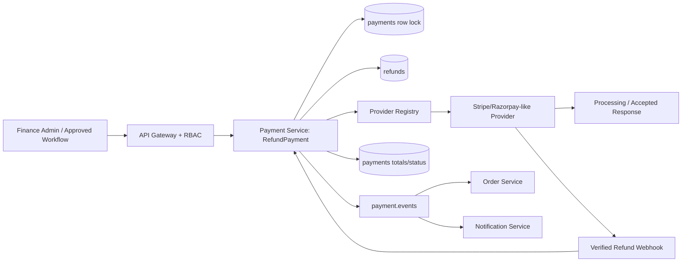
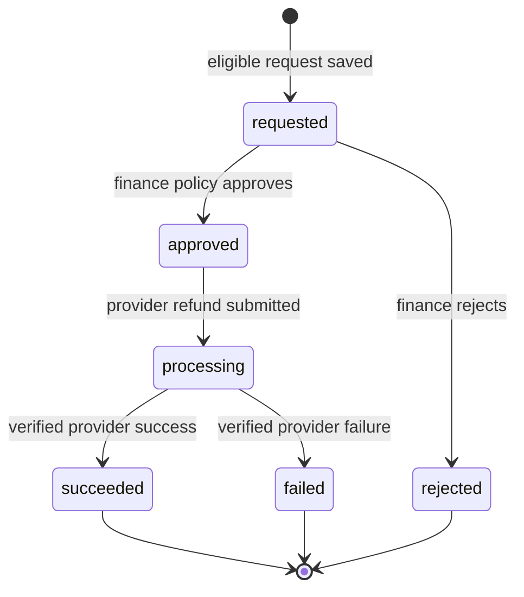
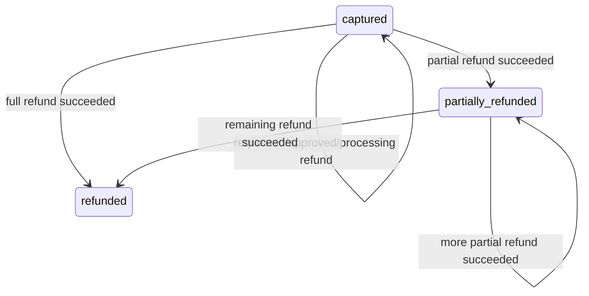
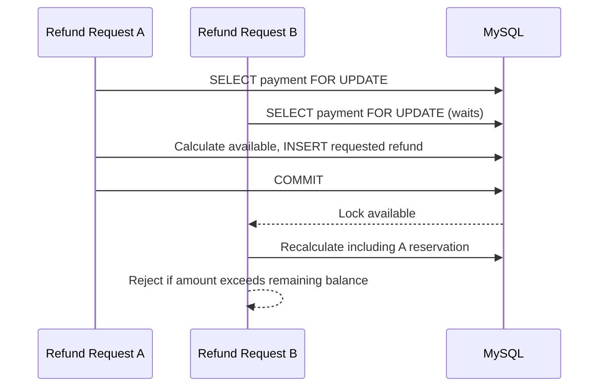
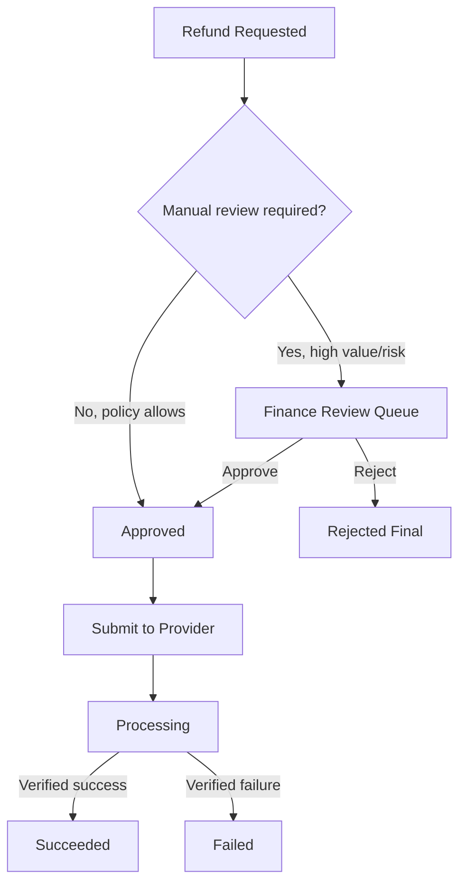
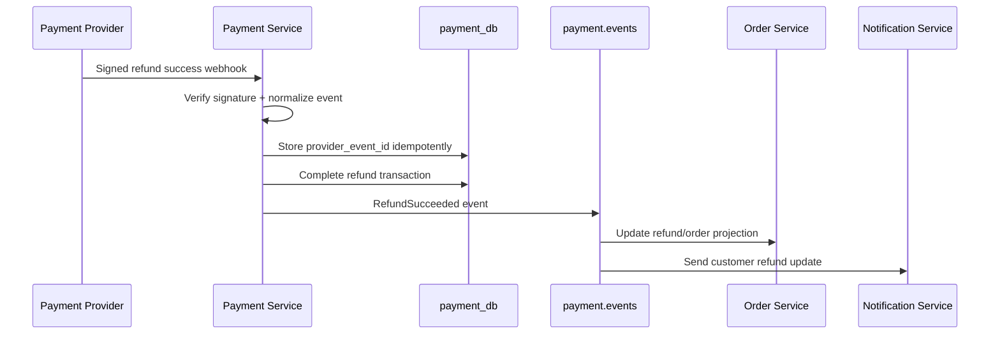
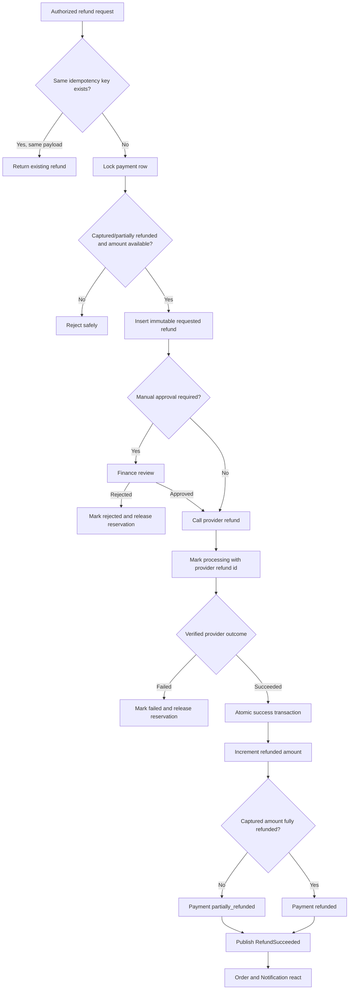

# 💳 Payment Service - Task 6: Refund Flow


## 📌 Task Summary

| Field | Detail |
|---|---|
| Task Name | Refund flow |
| Source | `docs/01-micro-tasks.md` -> `Payment Service` -> Task 6 |
| Priority | `P1` core business feature |
| Dependency | Paid/captured payments, Task 2 schema, Task 3 provider abstraction, Task 5 webhook flow |
| Main Goal | Full aur partial refund safely support karna, over-refund rokna, aur refund records auditable/immutable rakhna |
| API Surface | `POST /api/v1/payments/{payment_id}/refund` -> `PaymentService.RefundPayment` |
| Output Type | Documentation-only implementation guide |
| Not Included | Payment retry policy, reconciliation job, frontend/admin UI build, real provider credentials, new runtime code files |

> **Simple Hinglish goal:** Jab authorized admin captured payment ka full ya partial amount return karna chahe, Payment Service ek immutable refund request record banayega, duplicate/over-refund prevent karega, approval policy follow karega, provider ko refund command bhejega, aur verified outcome ke baad payment aur downstream systems ko safely update karega.

---

## ✅ Final Output Created

```text
TaskImplementation/
└── Payment Service/
    ├── task1.md
    ├── task2.md
    ├── task3.md
    ├── task4.md
    ├── task5.md
    └── task6.md
```

### Why this structure?

| Path | Purpose |
|---|---|
| `TaskImplementation/` | Task-wise implementation guides ka central folder |
| `TaskImplementation/Payment Service/` | Payment Service guides ko ek jagah organize karta hai |
| `task6.md` | Sirf **Payment Service - Task 6** ka refund flow guide |

> 🟢 **Boundary:** User request ke hisaab se is deliverable me sirf `task6.md` add kiya gaya hai. Runtime Go files, SQL migrations, routes, provider calls, deployment config, ya kisi later task ka implementation add nahi kiya gaya.

---

## 🧭 Source Documents And Existing Foundation

| Source | Task 6 ke liye kya use hua |
|---|---|
| `docs/01-micro-tasks.md` | Exact scope: full/partial refunds and immutable refund records; dependency `Paid payments` |
| `docs/07-payment-system.md` | Refund flow, provider interface, idempotency key pattern, security rules |
| `docs/03-folder-structure.md` | Planned location: `internal/domain/refund.go` and `internal/usecase/refund_payment.go` |
| `docs/04-microservice-design.md` | `RefundPayment`, `GetRefund`, REST route and `RefundRequested` workflow |
| `docs/05-database-design.md` | Payment DB ownership, refund relationship, indexes and idempotency |
| `docs/09-cms-superadmin.md` | Finance admin approval and high-value maker-checker control |
| `docs/11-devops-external-services.md` | Provider secret/config and payment event channel |
| `api/master-api.json` | `RefundRequest`, `Refund`, route and gRPC contract |
| `backend/services/payment-service/migrations/001_create_payment_tables.up.sql` | Existing `refunds` table and `payments.refunded_amount` columns |
| `backend/services/payment-service/internal/domain/refund.go` | Existing refund entity/status foundation |
| `backend/services/payment-service/internal/provider/types.go` | Existing `Provider.Refund(...)` request/response contract |
| `TaskImplementation/Payment Service/task1.md` to `task5.md` | State, schema, provider, intent and webhook decisions |

### Already Available Foundation

| Existing foundation | Task 6 me kaise reuse hoga |
|---|---|
| `refunds` table | Har refund request ka auditable financial record |
| `payments.captured_amount` | Maximum refundable successful charge |
| `payments.refunded_amount` | Confirmed succeeded refunds ka accumulated amount |
| Unique `(payment_id, idempotency_key)` | Same request retry par duplicate refund prevent |
| `domain.Refund` and refund statuses | Business entity and lifecycle base |
| `provider.Provider.Refund` | Provider-independent refund call |
| Refund webhook event types | Async success/failure finalization |

---

## 🪜 Step-by-Step Implementation

## Step 1: Task Boundary Clear Kiya

### Included In Task 6

- Full refund aur partial refund ka business flow
- Captured payment eligibility check
- Refund status lifecycle: `requested`, `approved`, `rejected`, `processing`, `succeeded`, `failed`
- Immutable/auditable refund record rule
- Admin/finance approval boundary and high-value review
- REST/gRPC request-response contract
- Idempotency and concurrent over-refund protection
- Provider `Refund` operation ka use
- Provider response/webhook ke baad payment totals and status update
- Order/Notification events ka hand-off
- Security, observability and focused test strategy

### Not Included In Task 6

- New payment intent banana
- Payment success webhook ka complete implementation; Task 5 ka foundation reuse hoga
- Failed payment retry handling; ye Task 7 ka scope hai
- Settlement reconciliation; ye Task 8 ka scope hai
- Admin panel screen ya buyer self-service UI
- Real Stripe/Razorpay account setup or secret creation
- Dispute/chargeback workflow

> 🟡 **Reason:** Task 6 ka concern captured money ko safely refund karna hai. Retry, reconciliation aur UI add karne se financial workflow ka scope unnecessary mix ho jayega.

---

## Step 2: Refund Types Aur Core Rules Define Kiye

### Refund Types

| Type | Example | Outcome |
|---|---|---|
| Full refund | Captured amount `₹1,000`, refund `₹1,000` | Payment eventually `refunded` |
| Partial refund | Captured amount `₹1,000`, refund `₹250` | Payment eventually `partially_refunded` |
| Multiple partial refunds | `₹250` then `₹750` | Second success ke baad payment `refunded` |

> 💡 Amount always **minor unit** me store hoga: INR me paise aur USD me cents. Example: `₹250.00` ko `25000` store karo. Floating point money calculation use mat karo.

### Non-Negotiable Business Rules

| Rule | Why |
|---|---|
| Refund sirf `captured` ya `partially_refunded` payment ke liye | Uncaptured/failed money customer se charge hi nahi hui |
| Refund amount `> 0` hona chahiye | Zero/negative financial command invalid hai |
| Refund currency payment currency ke same honi chahiye | Cross-currency accounting mismatch avoid hota hai |
| Total confirmed + in-flight refund captured amount se zyada nahi | Double refund/loss prevent hota hai |
| Idempotency key mandatory | Client retry se duplicate provider refund nahi banta |
| Amount, currency, payment id and original reason insert ke baad change nahi | Financial audit reliable rehta hai |
| Provider outcome verified response/webhook se update hoga | UI/manual guess final accounting proof nahi hai |
| Refund action restricted role se aayega | Sensitive financial mutation protect hoti hai |

---

## Step 3: Refund Architecture Define Ki



### Architecture Explanation

1. Authorized admin ya approved upstream workflow refund command bhejta hai.
2. Gateway JWT/RBAC check karke Payment Service ko request forward karta hai.
3. Payment Service payment row lock karke refundable balance calculate karta hai.
4. Valid request ke liye immutable refund identity/amount/reason save hota hai.
5. Approval policy ke according request `requested`, `approved`, ya later `processing` me jaati hai.
6. Provider adapter common `Refund` interface se external gateway call karta hai.
7. Provider accepted request ko `processing` rakh sakta hai; final success/failure verified provider evidence se aata hai.
8. Success par `payments.refunded_amount` increment hota hai aur payment status `partially_refunded` ya `refunded` hota hai.
9. Event se Order Service aur Notification Service apna action lete hain.

---

## Step 4: Clean Implementation Folder Structure Plan Kiya

### Current Documentation Output

```text
TaskImplementation/
└── Payment Service/
    └── task6.md
```

### Runtime Implementation Layout For Task 6

Project ke clean-architecture convention me refund implementation ka logical layout ye hoga. Is deliverable me ye runtime files create/modify nahi kiye gaye.

```text
backend/
└── services/
    └── payment-service/
        ├── cmd/
        │   └── server/
        │       └── main.go
        ├── internal/
        │   ├── domain/
        │   │   ├── payment.go                 # Existing payment totals/status entity
        │   │   └── refund.go                  # Existing refund entity/status foundation
        │   ├── usecase/
        │   │   └── refund_payment.go          # Task 6 orchestration to implement
        │   ├── provider/
        │   │   ├── types.go                   # Existing Provider.Refund contract
        │   │   ├── registry.go                # Existing provider selection
        │   │   ├── stripe_like.go             # Refund API method implementation point
        │   │   └── razorpay_like.go           # Refund API method implementation point
        │   ├── repository/
        │   │   └── mysql_payment_repository.go # Refund transaction methods to add
        │   ├── events/
        │   │   └── refund_events.go           # Refund outcome event publisher
        │   └── transport/
        │       └── grpc/
        │           └── payment_handler.go     # RefundPayment/GetRefund handlers
        └── migrations/
            └── 001_create_payment_tables.up.sql # Existing refunds schema
```

### Responsibilities

| File/Layer | Responsibility |
|---|---|
| `domain/refund.go` | Refund entity, status and immutable business fields |
| `usecase/refund_payment.go` | Validate, reserve amount, approve/process, call provider and emit outcome |
| `provider/types.go` | Generic provider refund request/response |
| Provider adapter | Gateway-specific refund API shape map karna |
| `mysql_payment_repository.go` | Row lock, idempotent insert, totals/status atomic update |
| gRPC handler | API contract ko usecase input/output me map karna |
| Events publisher | Order/Notification ko settled refund outcome dena |

---

## Step 5: Public API Aur gRPC Contract Align Kiya

`api/master-api.json` ke according Task 6 ka exposed refund endpoint:

```http
POST /api/v1/payments/{payment_id}/refund
Authorization: Bearer <admin-token>
Content-Type: application/json
```

| API Field | Repository Contract |
|---|---|
| Route | `/api/v1/payments/{payment_id}/refund` |
| Service | `payment-service` |
| gRPC method | `PaymentService.RefundPayment` |
| Auth in API definition | `admin` |
| Request schema | `RefundRequest` |
| Response schema | `Refund` |
| Read method available | `PaymentService.GetRefund` with admin auth |

### Important Authorization Clarification

Docs refund origin ko Order/Superadmin workflow ke roop me describe karte hain, lekin current public API definition refund mutation ko `admin` auth par expose karti hai. Isliye Task 6 implementation me buyer directly provider refund initiate nahi karega. Buyer/support cancellation request upstream workflow me ho sakti hai; actual payment refund command authorized admin/finance-approved path se Payment Service tak aayega.

### Example Request: Partial Refund

```json
{
  "payment_id": "pay_1001",
  "amount": {
    "amount": 25000,
    "currency": "INR"
  },
  "reason": "One item cancelled before dispatch",
  "idempotency_key": "refund:pay_1001:item_cancelled_001"
}
```

### Example Response: Request Recorded

```json
{
  "refund_id": "rfnd_2001",
  "payment_id": "pay_1001",
  "status": "requested",
  "amount": {
    "amount": 25000,
    "currency": "INR"
  },
  "reason": "One item cancelled before dispatch"
}
```

### Example Response: Processing After Approval

```json
{
  "refund_id": "rfnd_2001",
  "payment_id": "pay_1001",
  "status": "processing",
  "amount": {
    "amount": 25000,
    "currency": "INR"
  },
  "reason": "One item cancelled before dispatch"
}
```

> 🟣 **Design note:** Initial response `requested` ya `processing` policy par depend karega. High-value manual-review request pe provider call approval se pehle nahi hogi.

### Suggested gRPC Shape

```proto
service PaymentService {
  rpc RefundPayment(RefundRequest) returns (Refund);
  rpc GetRefund(IdPathRequest) returns (Refund);
}

message RefundRequest {
  string payment_id = 1;
  Money amount = 2;
  string reason = 3;
  string idempotency_key = 4;
  string requested_by = 5;
}

message Refund {
  string refund_id = 1;
  string payment_id = 2;
  string status = 3;
  Money amount = 4;
  string reason = 5;
}
```

---

## Step 6: Refund Lifecycle And Immutability Define Ki

### Refund State Machine



| Refund Status | Meaning | Amount reserved for over-refund check? |
|---|---|---:|
| `requested` | Request stored, review/provider submission pending | ✅ |
| `approved` | Authorized to submit to provider | ✅ |
| `rejected` | Request denied; no provider refund | ❌ |
| `processing` | Provider ne request accept ki; final outcome pending | ✅ |
| `succeeded` | Provider refund confirmed | Reflected in `payments.refunded_amount` |
| `failed` | Provider failed/rejected refund | ❌ |

### Immutable Record Ka Practical Meaning

Existing schema me lifecycle ke liye `status`, `provider_refund_id`, `reviewed_by`, `reviewed_at` aur timestamps update ho sakte hain. Immutable financial record ka rule yahan ye hai:

| Field | Insert ke baad policy |
|---|---|
| `refund_id` | Never change |
| `payment_id` | Never change |
| `currency`, `amount` | Never edit; correction ke liye naya controlled record/workflow |
| `reason`, `requested_by`, `idempotency_key` | Never rewrite |
| `status` | Sirf allowed forward lifecycle transitions |
| `provider_refund_id` | Provider submission par once associate karo |
| `reviewed_by`, `reviewed_at` | Approval/rejection audit evidence ke roop me fill karo |
| Row deletion | Never delete financial refund records |

> 🔴 **Do not:** Existing refund row ka `amount` edit karke full refund banana, failed row ko delete karna, ya same request ko nayi idempotency key se blindly resubmit karna audit aur money safety dono todta hai.

---

## Step 7: Payment Status Transition With Refund Outcome Define Kiya

Refund request create hone par payment immediately `refunded` nahi banta. Payment status **successful provider confirmation** ke baad change hota hai.



### Calculation

```text
new_refunded_amount = current_refunded_amount + succeeded_refund_amount

if new_refunded_amount == captured_amount:
    payment_status = refunded
else if new_refunded_amount < captured_amount:
    payment_status = partially_refunded
else:
    reject as invariant violation
```

### Example

| Stage | Captured | Confirmed Refunded | Request | Payment Status |
|---|---:|---:|---:|---|
| Payment complete | `100000` | `0` | - | `captured` |
| Partial refund succeeds | `100000` | `25000` | `25000` | `partially_refunded` |
| Remaining refund succeeds | `100000` | `100000` | `75000` | `refunded` |

> 🟢 `payments.refunded_amount` me sirf **confirmed succeeded** refund add karo. `requested` ya `processing` request ko separately reserved/in-flight calculation me count karo.

---

## Step 8: Validation Rules Build Kiye

Refund command provider ko bhejne se pehle following checks mandatory honge:

| Validation | Rejection Example |
|---|---|
| `payment_id` present and found | Unknown `pay_missing` |
| Caller authorized finance/admin path se hai | Buyer directly admin route hit kare |
| Payment status refund eligible hai | `failed`, `initiated`, `authorized`, `refunded` |
| Provider payment id available hai | Provider ko refund target hi nahi milega |
| Amount positive minor unit integer hai | `0`, `-500`, decimal float |
| Currency payment ke equal hai | Payment `INR`, request `USD` |
| Reason non-empty and within `512` chars | Blank/oversized reason |
| Idempotency key required and bounded | Missing or reused for different amount |
| Available refundable amount enough hai | Available `50000`, requested `60000` |
| Same refund already final/in-flight nahi duplicate call se create hota | Retry with same key |

### Go Validation Blueprint

```go
func validateRefundInput(payment domain.Payment, input RefundPaymentInput, reservedOpen int64) error {
    if payment.Status != domain.PaymentStatusCaptured &&
        payment.Status != domain.PaymentStatusPartiallyRefunded {
        return ErrPaymentNotRefundable
    }
    if input.AmountMinor <= 0 {
        return ErrInvalidRefundAmount
    }
    if input.Currency != payment.Amount.Currency {
        return ErrRefundCurrencyMismatch
    }
    if strings.TrimSpace(input.Reason) == "" || len(input.Reason) > 512 {
        return ErrInvalidRefundReason
    }
    available := payment.CapturedAmount - payment.RefundedAmount - reservedOpen
    if input.AmountMinor > available {
        return ErrRefundExceedsAvailableAmount
    }
    return nil
}
```

> 🟡 **Why `reservedOpen`?** Agar do `processing` partial refunds ko sirf `refunded_amount` dekhkar accept kar diya, dono individually valid lag sakte hain but combined captured amount se zyada ho sakte hain.

---

## Step 9: Idempotency And Concurrent Over-Refund Safety Build Ki

### Idempotency Key Format

`docs/07-payment-system.md` ke pattern ko follow karo:

```text
refund:{payment_id}:{refund_key}
```

Examples:

```text
refund:pay_1001:item_cancelled_001
refund:pay_1001:order_return_20260526
```

### Idempotency Behavior

| Situation | Expected Behavior |
|---|---|
| Same `payment_id` + same key + same payload retry | Existing refund safely return karo |
| Same key but different amount/reason | `409 conflict` / invalid idempotency reuse |
| New key but available amount insufficient | Reject before provider call |
| Network timeout after provider submission | Existing `processing` record query/verify karo; blindly second refund mat bhejo |

Existing schema protection:

```sql
UNIQUE KEY uk_refunds_idempotency (payment_id, idempotency_key)
```

### Transactional Reservation Strategy

`payments.refunded_amount` succeeded amount represent karta hai. Open refund requests ko bhi reserve karna zaruri hai:

```text
reserved_open_amount =
    SUM(refunds.amount WHERE status IN ('requested', 'approved', 'processing'))

available_refund_amount =
    payments.captured_amount
    - payments.refunded_amount
    - reserved_open_amount
```

### Create Refund Transaction Blueprint

```sql
START TRANSACTION;

SELECT payment_id, provider, provider_payment_id, status, currency,
       captured_amount, refunded_amount
FROM payments
WHERE payment_id = ?
FOR UPDATE;

SELECT COALESCE(SUM(amount), 0) AS reserved_open_amount
FROM refunds
WHERE payment_id = ?
  AND status IN ('requested', 'approved', 'processing');

-- Application validates:
-- requested_amount <= captured_amount - refunded_amount - reserved_open_amount

INSERT INTO refunds (
  refund_id, payment_id, status, currency, amount, reason,
  requested_by, idempotency_key
) VALUES (?, ?, 'requested', ?, ?, ?, ?, ?);

COMMIT;
```

### Why Row Lock Important Hai?



> 🔴 **Critical:** Balance calculate aur refund insert ko separate unprotected requests me mat karo. Concurrent requests tab over-refund create kar sakti hain.

---

## Step 10: Existing MySQL Schema Reuse Kiya

Task 2 foundation/migration me Task 6 ke liye required main table already designed hai:

```sql
CREATE TABLE IF NOT EXISTS refunds (
  id BIGINT UNSIGNED NOT NULL AUTO_INCREMENT,
  refund_id VARCHAR(64) NOT NULL,
  payment_id VARCHAR(64) NOT NULL,
  provider_refund_id VARCHAR(128) NULL,
  status ENUM('requested', 'approved', 'rejected', 'processing', 'succeeded', 'failed')
    NOT NULL DEFAULT 'requested',
  currency CHAR(3) NOT NULL,
  amount BIGINT NOT NULL,
  reason VARCHAR(512) NOT NULL,
  requested_by VARCHAR(64) NOT NULL,
  reviewed_by VARCHAR(64) NULL,
  reviewed_at TIMESTAMP NULL,
  idempotency_key VARCHAR(128) NOT NULL,
  created_at TIMESTAMP NOT NULL DEFAULT CURRENT_TIMESTAMP,
  updated_at TIMESTAMP NOT NULL DEFAULT CURRENT_TIMESTAMP ON UPDATE CURRENT_TIMESTAMP,
  PRIMARY KEY (id),
  UNIQUE KEY uk_refunds_refund_id (refund_id),
  UNIQUE KEY uk_refunds_idempotency (payment_id, idempotency_key),
  KEY idx_refunds_payment_status (payment_id, status),
  CONSTRAINT fk_refunds_payment
    FOREIGN KEY (payment_id) REFERENCES payments(payment_id)
) ENGINE=InnoDB;
```

Relevant payment fields:

```sql
status ENUM('initiated', 'requires_action', 'authorized', 'captured',
            'failed', 'refunded', 'partially_refunded') NOT NULL,
captured_amount BIGINT NOT NULL DEFAULT 0,
refunded_amount BIGINT NOT NULL DEFAULT 0
```

### Schema Responsibilities

| Column/Index | Use |
|---|---|
| `refund_id` | Stable public refund identity |
| `payment_id` FK | Refund ko original payment se bind karta hai |
| `amount`, `currency` | Immutable financial request |
| `provider_refund_id` | Provider outcome/webhook matching |
| `requested_by`, `reviewed_by`, `reviewed_at` | Human action audit |
| `uk_refunds_idempotency` | Duplicate refund request prevent |
| `idx_refunds_payment_status` | Open reservation and refund list query |

> 🟢 **Scope note:** Existing migration Task 6 requirements support karti hai; is documentation-only output me migration edit nahi ki gayi.

---

## Step 11: Approval And High-Value Review Workflow Define Kiya

`docs/09-cms-superadmin.md` finance admin aur high-value maker-checker control describe karta hai.



### Authorization Policy

| Operation | Minimum Control |
|---|---|
| Create actual refund command | Admin-authenticated Payment Service route; business policy should restrict to finance/superadmin |
| Approve high-value refund | Finance admin or maker-checker approver |
| Reject refund | Authorized finance reviewer with reason |
| View payment/refund records | Authorized admin; redact secrets |
| Send provider refund | Only Payment Service backend credentials |

### Review Rules

- High-value threshold configuration se aayega, code me random hard-coded amount nahi.
- Maker aur approver ideally same user nahi hone chahiye for high-value refunds.
- Rejection status terminal hai; altered refund chahiye to naya authorized request/idempotency key create hoga.
- Review reason and actor audit me store/publish hone chahiye.

---

## Step 12: Domain And Usecase Blueprint Banaya

Project me `domain.Refund` foundation already status aur audit fields rakhti hai:

```go
type Refund struct {
    RefundID         string
    PaymentID        string
    ProviderRefundID string
    Status           RefundStatus
    Amount           Money
    Reason           string
    RequestedBy      string
    ReviewedBy       string
    ReviewedAt       *time.Time
    IdempotencyKey   string
    CreatedAt        time.Time
    UpdatedAt        time.Time
}
```

### Usecase Contracts To Implement

```go
type RefundPaymentRepository interface {
    FindRefundByIdempotencyKey(
        ctx context.Context,
        paymentID string,
        idempotencyKey string,
    ) (domain.Refund, error)

    CreateRefundReservation(
        ctx context.Context,
        refund domain.Refund,
    ) error

    MarkRefundProcessing(
        ctx context.Context,
        refundID string,
        providerRefundID string,
    ) error

    CompleteRefund(
        ctx context.Context,
        refundID string,
        providerRefundID string,
        succeeded bool,
        at time.Time,
    ) (domain.Payment, error)
}

type RefundPaymentInput struct {
    PaymentID      string
    AmountMinor    int64
    Currency       string
    Reason         string
    RequestedBy    string
    IdempotencyKey string
    RequestID      string
}
```

### Usecase Processing Steps

```go
func (u *RefundPaymentUsecase) Execute(
    ctx context.Context,
    input RefundPaymentInput,
) (domain.Refund, error) {
    // 1. Normalize and validate required input/idempotency fields.
    // 2. Existing same-key request ho to same payload verify karke return karo.
    // 3. Repository transaction me payment lock, available balance validate,
    //    aur immutable `requested` refund record insert karo.
    // 4. Manual approval needed ho to requested result return karo.
    // 5. Approved request ke liye provider registry se adapter resolve karo.
    // 6. provider.Refund(...) call karo using the same idempotency key.
    // 7. Accepted/pending response ko `processing` persist karo.
    // 8. Synchronous trusted final success ho to CompleteRefund atomically call karo;
    //    otherwise verified webhook finalization ka wait karo.
    // 9. Refund outcome event emit karo.
    panic("blueprint only")
}
```

> 🟣 **Boundary:** Above code implementation direction ka example hai, is task output me Go runtime code create nahi hua.

---

## Step 13: Provider Refund Call Integrate Karna Explain Kiya

Existing provider abstraction me already generic refund capability defined hai:

```go
type Provider interface {
    Name() string
    CreateIntent(ctx context.Context, req CreateIntentRequest) (CreateIntentResponse, error)
    Capture(ctx context.Context, req CaptureRequest) (CaptureResponse, error)
    Refund(ctx context.Context, req RefundRequest) (RefundResponse, error)
    VerifyWebhook(ctx context.Context, req VerifyWebhookRequest) (WebhookEvent, error)
}

type RefundRequest struct {
    PaymentID         string
    RefundID          string
    ProviderPaymentID string
    Amount            Money
    Reason            string
    IdempotencyKey    string
    Metadata          map[string]string
}
```

### Mapping From Local Record To Provider Request

| Local data | Provider request field |
|---|---|
| `refund.refund_id` | `RefundID` and safe metadata |
| `payment.payment_id` | `PaymentID` |
| `payment.provider_payment_id` | `ProviderPaymentID` |
| `refund.amount/currency` | `Amount` |
| `refund.reason` | `Reason` |
| `refund.idempotency_key` | `IdempotencyKey` |

### Provider Sequence

```mermaid
sequenceDiagram
    participant UC as Refund Usecase
    participant DB as payment_db
    participant P as Provider Adapter
    participant W as Webhook Handler

    UC->>DB: Save approved refund reservation
    UC->>P: Refund(refund_id, provider_payment_id, amount, key)
    P-->>UC: provider_refund_id, processing
    UC->>DB: status = processing, save provider_refund_id
    P->>W: refund.succeeded signed webhook
    W->>DB: Deduplicate provider event
    W->>DB: refund=succeeded; increment refunded_amount; update payment status
    W-->>UC: outcome is observable through stored state/event
```

### Provider Safety Rules

- Provider secret key backend config/secret manager me rahegi, refund response me nahi.
- Same local idempotency key provider request me pass karo where gateway supports it.
- Provider timeout par refund ko blindly repeat mat karo; provider id/status lookup ya webhook confirmation use karo.
- Sanitized provider response hi audit/logs me rakho; credentials/card data kabhi nahi.

---

## Step 14: Verified Success Transaction Design Kiya

Provider success milne ke baad refund aur payment aggregate ko **one DB transaction** me update karna chahiye.

```sql
START TRANSACTION;

SELECT payment_id, captured_amount, refunded_amount, status
FROM payments
WHERE payment_id = ?
FOR UPDATE;

SELECT status, amount
FROM refunds
WHERE refund_id = ?
FOR UPDATE;

-- If refund already succeeded, duplicate webhook is a safe no-op.
-- If status is processing/approved and invariant is valid:

UPDATE refunds
SET status = 'succeeded',
    provider_refund_id = ?,
    updated_at = CURRENT_TIMESTAMP
WHERE refund_id = ?
  AND status IN ('approved', 'processing');

UPDATE payments
SET refunded_amount = refunded_amount + ?,
    status = CASE
      WHEN refunded_amount + ? = captured_amount THEN 'refunded'
      ELSE 'partially_refunded'
    END,
    updated_at = CURRENT_TIMESTAMP
WHERE payment_id = ?
  AND refunded_amount + ? <= captured_amount;

COMMIT;
```

### Failure Handling

| Outcome | Refund Update | Payment Aggregate Update |
|---|---|---|
| Provider success verified | `processing` -> `succeeded` | Increment and set partial/full status |
| Provider final failure verified | `processing` -> `failed` | No increment; reservation released |
| Duplicate success webhook | Already `succeeded`; no-op | No second increment |
| Unknown/timeout | Keep `processing` until confirmed | No increment |

> 🔴 **Financial safety rule:** Provider request accepted hona aur customer ko money actually refund hona same cheez nahi ho sakta. `refunded_amount` final/verified success par hi increment karo.

---

## Step 15: Webhook And Events Handoff Define Kiya

Task 5 ka verified webhook mechanism refund outcome ke liye reuse hoga. Provider abstraction me existing normalized event types:

```go
const (
    WebhookEventRefundSucceeded WebhookEventType = "refund.succeeded"
    WebhookEventRefundFailed    WebhookEventType = "refund.failed"
)
```

### Event Outcome Flow



### Suggested Domain Events

| Event | Kab publish hoga | Consumers |
|---|---|---|
| `RefundRequested` | Refund row safely create ho jaaye | Finance review workflow/audit |
| `RefundApproved` | Manual approval pass ho | Payment submission processor/audit |
| `RefundRejected` | Review reject ho | Notification/audit |
| `RefundProcessing` | Provider request accept kare | Support/admin status view |
| `RefundSucceeded` | Verified success and DB commit ho | Order, Notification, reporting |
| `RefundFailed` | Verified provider failure ho | Notification, support/admin |

Example event payload:

```json
{
  "event_type": "RefundSucceeded",
  "version": 1,
  "producer": "payment-service",
  "payload": {
    "refund_id": "rfnd_2001",
    "payment_id": "pay_1001",
    "order_id": "ord_9001",
    "amount_minor": 25000,
    "currency": "INR",
    "payment_status": "partially_refunded"
  }
}
```

> 🟡 Event publish DB transaction ke baad reliable outbox/publisher approach se hona best hai. Broader messaging reliability implementation platform concern hai; yahan refund event contract document kiya gaya hai.

---

## Step 16: Error Handling And HTTP Mapping Define Kiya

| Case | Suggested HTTP/gRPC Result | Message Policy |
|---|---|---|
| Missing/invalid amount, currency or reason | `400 InvalidArgument` | Safe validation message |
| Unauthenticated caller | `401 Unauthenticated` | No financial details |
| Caller lacks refund permission | `403 PermissionDenied` | Audit unauthorized attempt |
| Payment not found | `404 NotFound` | Safe identifier response |
| Payment not captured/refundable | `409 FailedPrecondition` | Explain payment state prevents refund |
| Amount exceeds available balance | `409 FailedPrecondition` | Include safe available amount if admin-authorized |
| Same key reused with changed payload | `409 AlreadyExists` | Idempotency conflict |
| Provider unavailable/timeout | `503 Unavailable` | Keep stored status stable/processing as appropriate |
| Duplicate same request | `200 OK` existing refund | Replay-safe response |

### Log Fields

Safe structured fields:

```text
request_id, refund_id, payment_id, order_id, provider,
status, amount_minor, currency, requested_by, reviewed_by,
provider_refund_id, idempotency_replayed
```

Never log:

```text
provider secret key, webhook secret, card PAN, CVV, OTP,
full authorization header, unredacted provider payload
```

---

## Step 17: External Libraries And Tools Explain Kiye

### Runtime Dependencies Used By The Existing Payment Service

| Library/Tool | Type | Why Used In Refund Flow | Install/Run |
|---|---|---|---|
| Go standard library (`context`, `database/sql`, `net/http`, `log/slog`) | Built-in | Usecase cancellation, DB transactions, provider HTTP requests, safe structured logs | Go ke saath included; separate install nahi |
| `github.com/go-sql-driver/mysql v1.10.0` | Go module, already in `go.mod` | `database/sql` ko MySQL Payment DB se connect karne ke liye | `go get github.com/go-sql-driver/mysql@v1.10.0` |
| MySQL | External datastore | `payments` and `refunds` transactional consistency/idempotency | Local stack/installed MySQL me migration run karo |
| Stripe/Razorpay-like HTTP APIs | External payment provider | Actual refund submit and status confirmation | Backend secret config + adapter; SDK mandatory nahi |
| Kafka/RabbitMQ | Planned platform messaging tool | `RefundSucceeded` etc. downstream services tak bhejne ke liye | Platform compose/deploy setup ke through; Task 6 doc me install nahi |

### Go Dependency Usage

Existing module me MySQL driver already declared hai:

```go
require github.com/go-sql-driver/mysql v1.10.0
```

Fresh module setup me command:

```bash
cd backend/services/payment-service
go get github.com/go-sql-driver/mysql@v1.10.0
```

Minimal usage:

```go
import (
    "database/sql"
    _ "github.com/go-sql-driver/mysql"
)

db, err := sql.Open("mysql", dsn)
```

### Database Schema Apply Karna

```bash
mysql -h 127.0.0.1 -P 3306 -u root -p \
  < backend/services/payment-service/migrations/001_create_payment_tables.up.sql
```

### Provider SDK Note

Current payment-service provider adapters Go `net/http` based API adapters hain; isliye Task 6 ke liye Stripe ya Razorpay SDK install karna mandatory nahi hai. Agar team future me official SDK choose kare, adapter interface unchanged rakhna chahiye so usecase provider-specific library se coupled na ho.

### Required Configuration Shape

```bash
PAYMENT_DEFAULT_PROVIDER=stripe_like
PAYMENT_ALLOWED_PROVIDERS=stripe_like,razorpay_like
PAYMENT_ALLOWED_CURRENCIES=INR,USD

STRIPE_LIKE_SECRET_KEY=secret-from-secret-manager
STRIPE_LIKE_WEBHOOK_SECRET=webhook-secret-from-secret-manager
RAZORPAY_LIKE_SECRET_KEY=secret-from-secret-manager
RAZORPAY_LIKE_WEBHOOK_SECRET=webhook-secret-from-secret-manager
```

> 🔴 `.env` ya markdown examples me real production credentials commit mat karo. Secrets production me secret manager/Kubernetes Secret reference se inject honge.

---

## Step 18: Testing Strategy Banayi

### Unit Tests: Refund Validation

| Test Case | Expected Result |
|---|---|
| Captured payment + valid partial amount | Refund request allowed |
| Captured payment + exact remaining amount | Full refund request allowed |
| `failed` payment refund request | Reject |
| `authorized` but not captured payment | Reject |
| Zero/negative amount | Reject |
| Currency mismatch | Reject |
| Amount greater than available | Reject |
| Blank reason/missing key | Reject |

### Unit Tests: Lifecycle

| Current Refund Status | Operation | Expected Status |
|---|---|---|
| `requested` | Approved | `approved` |
| `requested` | Rejected | `rejected` |
| `approved` | Provider accepted | `processing` |
| `processing` | Verified success | `succeeded` |
| `processing` | Verified failure | `failed` |
| `succeeded` | Same webhook repeated | Idempotent no-op |

### Repository/Integration Tests

| Scenario | Assertion |
|---|---|
| Same `(payment_id, idempotency_key)` inserted twice | One refund record only |
| Two concurrent refunds exceed remaining total | One succeeds/reserves; other rejects |
| Successful partial refund | `refunded_amount` increments and status `partially_refunded` |
| Successful final remaining refund | Status becomes `refunded` |
| Failed processing refund | No increment; capacity becomes available again |
| Duplicate provider success event | Amount increments once only |

### Provider Tests

| Test | Expected |
|---|---|
| Adapter receives amount in minor units | Correct provider payload |
| Same idempotency key retried | Same provider behavior or safe lookup |
| Provider timeout | No assumed success |
| Provider sanitized response | Secret/card data absent |
| Signed refund webhook | Normalized success/failure event |

### Security Tests

| Test | Expected |
|---|---|
| Buyer/no-admin token invokes refund route | Forbidden |
| Finance approval required but bypass attempted | Reject and audit |
| Provider webhook invalid signature | Reject without status/totals update |
| Log capture during provider failure | No secret/payment instrument data |

---

## Step 19: Verification Checklist Banayi

### Functional Checklist

| Verification | Status Expected |
|---|---:|
| Full refunds documented | ✅ |
| Partial and multiple partial refunds documented | ✅ |
| Refund statuses and payment transitions documented | ✅ |
| Existing API/gRPC shape included | ✅ |
| Provider interface reuse shown | ✅ |
| Order/Notification hand-off explained | ✅ |

### Financial Safety Checklist

| Verification | Status Expected |
|---|---:|
| Refund only captured amount ke against | ✅ |
| Amount minor units me | ✅ |
| Settled vs in-flight amount distinguish kiya | ✅ |
| Over-refund concurrent transaction se prevented | ✅ |
| Idempotency key/unique index covered | ✅ |
| Duplicate webhook does not double increment | ✅ |
| Immutable financial field policy covered | ✅ |

### Security And Operations Checklist

| Verification | Status Expected |
|---|---:|
| Admin/finance authorization explained | ✅ |
| High-value review policy documented | ✅ |
| Secret/card log redaction documented | ✅ |
| External library/tool install and use documented | ✅ |
| Tests and failure behavior documented | ✅ |

---

## 🔁 End-to-End Refund Flow Summary



---

## 🏁 Completion Note

Payment Service - Task 6 ke liye refund flow guide complete hai. Isme full/partial refunds, immutable record policy, approval controls, API and provider contracts, MySQL transaction safety, idempotency, webhook-confirmed finalization, tools/dependencies aur testing plan cover kiye gaye hain.

**Scope strictly Task 6 tak limited rakha gaya hai:** runtime implementation, retry handling aur reconciliation job is output ka part nahi hain.
