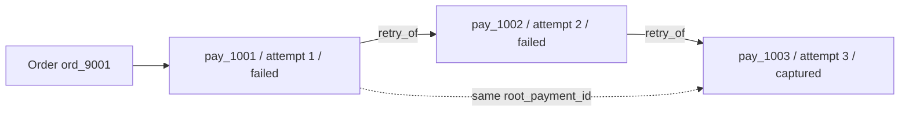
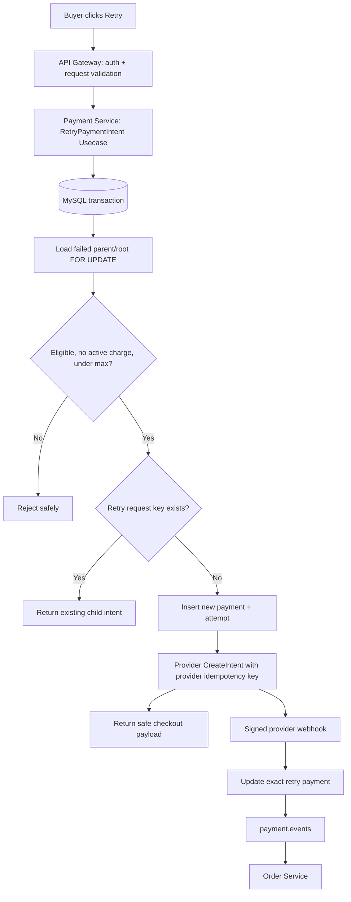
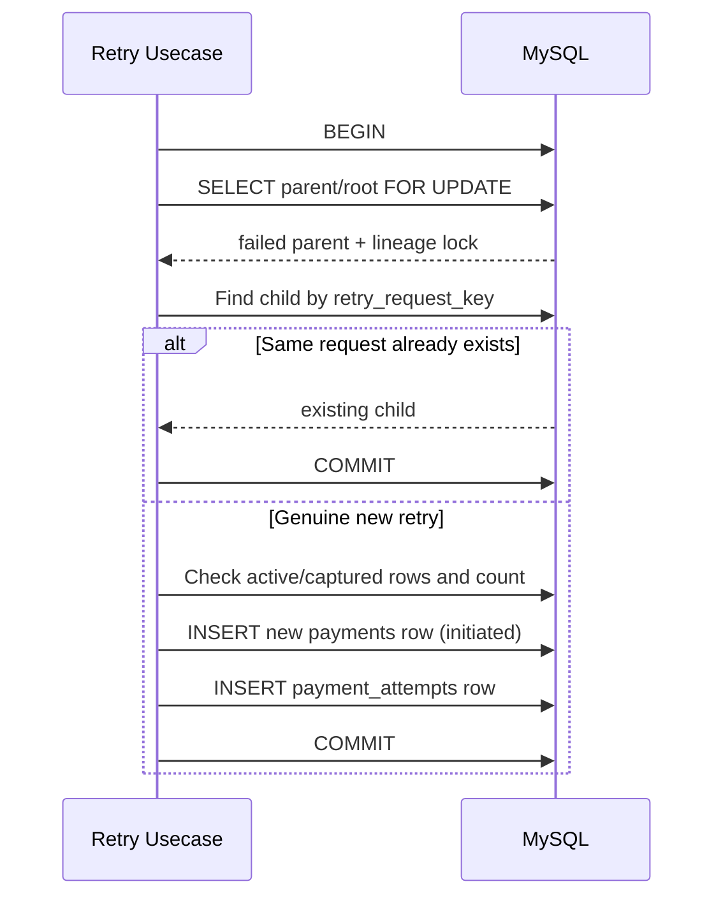
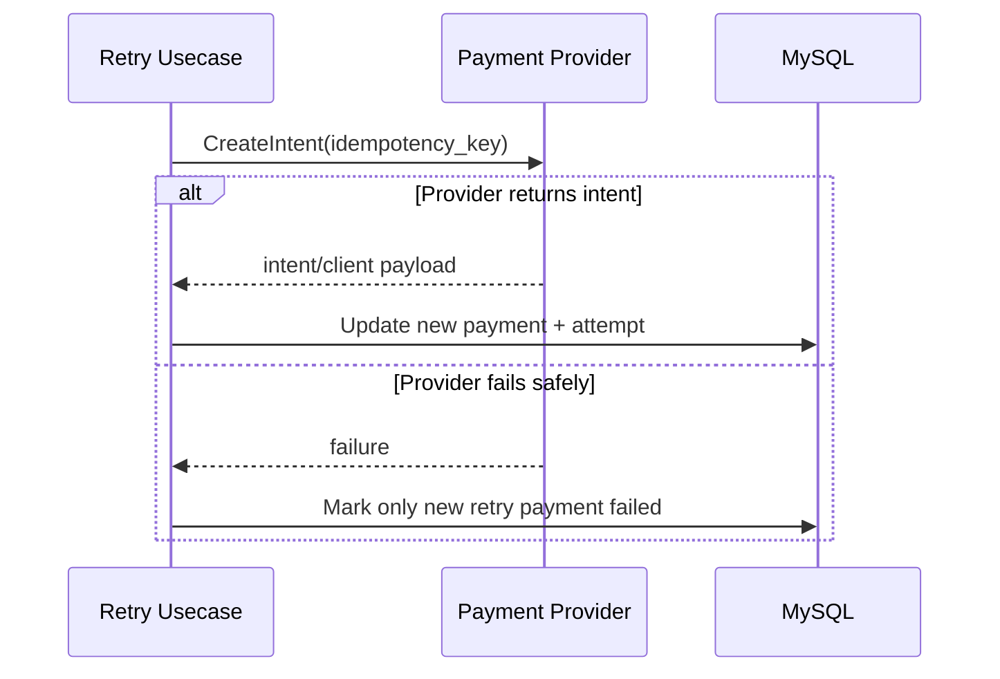
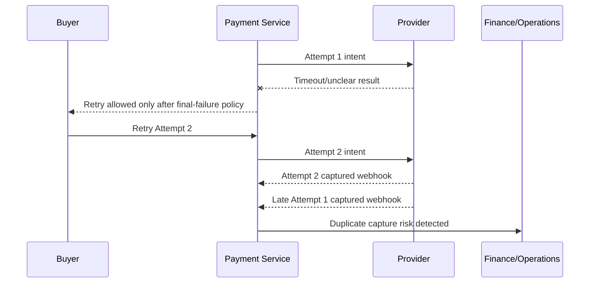
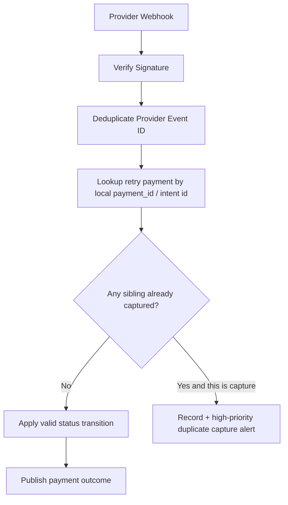
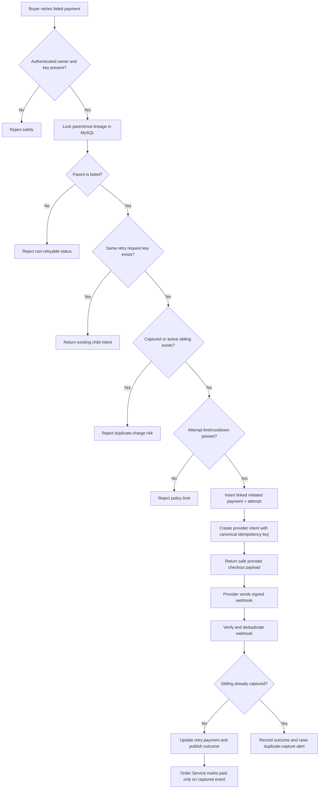

# 💳 Payment Service - Task 7: Retry Handling


## 📌 Task Summary

| Field | Detail |
|---|---|
| Task Name | Retry handling |
| Source | `docs/01-micro-tasks.md` -> `Payment Service` -> Task 7 |
| Priority | `P1` core business feature |
| Dependency | Intent flow, failed payment status, provider abstraction, webhook handler |
| Main Goal | Failed payment ke baad same order ke liye safe retry allow karna without duplicate charge |
| Mandatory Rule | Idempotency required hai; duplicate click/network retry second provider charge nahi bana sakta |
| Public API | `POST /api/v1/payments/{payment_id}/retry` |
| Output Type | Documentation-only implementation guide |
| Not Included | Reconciliation job, refund flow changes, frontend screens, real provider credentials, runtime code files |

> **Simple Hinglish goal:** Agar buyer ka payment fail ho jaye, to woh same order ko dobara pay kar sake. Lekin ek failed record ko overwrite nahi karna hai, double-click se two charges nahi banne chahiye, aur late webhook aane par do successful payments silently accept nahi hone chahiye.

---

## ✅ Final Output Created

```text
TaskImplementation/
└── Payment Service/
    ├── task1.md
    ├── task2.md
    ├── task3.md
    ├── task4.md
    ├── task5.md
    ├── task6.md
    └── task7.md
```

### Why this structure?

| Path | Purpose |
|---|---|
| `TaskImplementation/` | Saare task-wise implementation guides ka central folder |
| `TaskImplementation/Payment Service/` | Payment Service tasks ko ordered location me rakhta hai |
| `task7.md` | Sirf **Payment Service - Task 7** ka retry-handling blueprint |

> 🟢 **Boundary:** User ke requested output ke according is deliverable me sirf guide file add ki gayi hai. Neeche diye gaye Go/SQL snippets implementation examples hain; actual backend service, migrations, routes, ya configuration files is task output me create/modify nahi kiye gaye.

---

## 🧭 Source Documents And Existing Foundation

| Source | Task 7 ke liye kya use hua |
|---|---|
| `docs/01-micro-tasks.md` | Exact requirement: failed payment retry, duplicate charge prevent, idempotency mandatory |
| `docs/07-payment-system.md` | Retry rules, state machine, idempotency key format, webhook source-of-truth |
| `docs/04-microservice-design.md` | Retry REST endpoint and Payment Service responsibility |
| `docs/05-database-design.md` | One order ke multiple attempts, financial audit and MySQL indexes |
| `docs/11-devops-external-services.md` | Provider keys, webhook secret and provider interaction boundary |
| `api/master-api.json` | `POST /api/v1/payments/{payment_id}/retry`, buyer auth, `RetryPaymentRequest` |
| `TaskImplementation/Payment Service/task1.md` to `task6.md` | State, schema, gateway, intent, webhook and refund design decisions |
| `backend/services/payment-service/internal/domain/payment_state.go` | `failed -> retry_allowed -> initiated` concept; `retry_allowed` helper/non-persisted state |
| `backend/services/payment-service/internal/provider/idempotency.go` | Existing `BuildPaymentIntentIdempotencyKey(orderID, attemptNo)` helper |
| `backend/services/payment-service/internal/usecase/create_payment_intent.go` | Existing first-intent idempotency behavior and provider intent creation flow |
| `backend/services/payment-service/internal/repository/mysql_payment_repository.go` | Existing transaction/repository pattern |
| `backend/services/payment-service/migrations/001_create_payment_tables.up.sql` | Existing `payments` and `payment_attempts` foundation |

### Already Available Foundation

| Existing piece | Task 7 me reuse |
|---|---|
| `payments.status = failed` | Retry eligibility ka starting condition |
| `payment_attempts` audit table | Provider attempt audit trail preserve karne ke liye |
| Unique `(provider, idempotency_key)` | Same provider intent key se duplicate intent prevent |
| Provider `CreateIntent(...)` interface | Retry ke liye bhi same gateway abstraction |
| `BuildPaymentIntentIdempotencyKey(orderID, attemptNo)` | Provider key `payment_intent:{order_id}:{attempt_no}` safely generate karne ke liye |
| Webhook processing and provider event uniqueness | Retry outcome ko trusted tarike se finalize karne ke liye |
| Payment state machine | Retry allowed decision aur final-state protection |

### Important Existing Detail

Current domain definition me `retry_allowed` ek **helper state** hai, persisted database status nahi:

```go
{
    Status:    PaymentStatusRetryAllowed,
    Helper:    true,
    Persisted: false,
}
```

Isliye Task 7 me failed payment row ko database me `retry_allowed` update nahi karna chahiye. Policy allow kare to old row `failed` hi rahegi aur same order ke liye ek naya auditable payment intent create hoga.

---

## 🪜 Step-by-Step Implementation

## Step 1: Task Boundary Clear Kiya

### Included In Task 7

- Failed payment ko retry karne ka safe business flow
- Same order ke liye new charge attempt create karna
- Old failed attempt ko audit history ke roop me preserve karna
- Buyer-authenticated retry endpoint ka behavior
- Request idempotency aur provider idempotency dono explain karna
- Concurrent retries aur double-click control
- Configurable maximum retry count and optional cooldown
- Late webhook race ko safely handle karna
- MySQL schema extension blueprint
- Clean Go layers, repository transaction and usecase examples
- Security, logging, metrics, tools and testing strategy

### Not Included In Task 7

- Initial checkout/payment intent design; ye Task 4 ka scope hai
- Webhook signature handler ka complete build; ye Task 5 ka scope hai
- Refund creation/approval; ye Task 6 ka scope hai
- Settlement report/reconciliation worker; ye Task 8 ka scope hai
- Frontend retry page/button implementation
- Order Service inventory re-reservation implementation
- Provider production account onboarding or real secret values

> 🟡 **Reason:** Task 7 ka concern failed payment se next safe payment attempt create karna hai. Reconciliation, UI aur refund operations ko mix karne se charge-safety logic difficult to audit ho jayega.

---

## Step 2: Retry Aur Request Replay Ka Difference Samjha

Payment systems me do cheezein same nahi hoti:

| Situation | Meaning | Provider Action |
|---|---|---|
| Same request replay | Client timeout/double-click ke baad exact same retry request dobara aayi | Existing retry intent return karo; new provider charge mat banao |
| Real payment retry | Previous provider attempt final `failed` hai aur buyer dobara payment try kar raha hai | Same order ke liye new intent/attempt banao |

### Example

```text
Order: ord_9001, Amount: INR 249900

Attempt 1: pay_1001 -> failed
Buyer clicks Retry with request key client_retry_abc
Attempt 2: pay_1002 -> initiated

Network repeats client_retry_abc:
Return pay_1002 again, do NOT create Attempt 3.

Buyer later sees Attempt 2 fail and intentionally retries with client_retry_xyz:
Attempt 3: pay_1003 -> initiated.
```

> 🔴 **Core rule:** Ek user retry new attempt ho sakta hai; ek technical replay new attempt nahi hona chahiye.

---

## Step 3: Retry Safety Rules Define Kiye

| Rule | Why Required |
|---|---|
| Retry only a `failed` payment | Active/captured payment par retry duplicate charge risk hai |
| Failed original payment immutable rahe | Audit aur dispute investigation me complete history milegi |
| New retry new payment/attempt record banaye | Provider IDs/status overwrite nahi honge |
| Request idempotency key mandatory | Same buyer click/request repeat dedupe ho |
| Provider intent idempotency key mandatory | Timeout ke baad provider ko duplicate intent command na mile |
| Same order me at most one active attempt | Two different retry clicks parallel charges na create karen |
| Max attempts configurable | Abuse, provider cost aur accidental retry loop control ho |
| Amount/currency server-owned original se copied | Browser amount change karke underpay/overpay na kar sake |
| `captured`/refund states never retryable | Charged money ka retry nahi; post-payment process alag hai |
| Webhook remains final source of truth | Frontend response payment success proof nahi hai |
| Late success needs alert/compensation path | Failed samjha gaya old provider intent late capture ho sakta hai |

---

## Step 4: Retry Design Decision Liya

### Chosen Model: New Payment Record Per Genuine Retry

Ek genuine retry me failed `payments` row ko reset karke `initiated` banana unsafe hai, kyunki purane provider intent ka outcome aur failure history overwrite ho sakti hai. Safer model:

1. Existing failed row unchanged store karo.
2. Retry eligibility validate karo.
3. Same `order_id`, amount, currency and user ke saath new `payments` row create karo.
4. New row ko old/root payment se link karo.
5. New row ke saath `payment_attempts` record create karo.
6. Provider ko new idempotent intent request bhejo.



### Why old row reset nahi karenge?

| Old row overwrite approach | New linked row approach |
|---|---|
| Provider intent IDs overwrite hone ka risk | Har provider intent independently visible |
| Failure audit weak hota hai | Failed attempts immutable rehte hain |
| Late webhook map karna confusing | Webhook exact payment/intent ko map kar sakta hai |
| Support ko retry history reconstruct karna hard | Lineage and attempt number queryable |

---

## Step 5: Retry State And Flow Define Kiya

`retry_allowed` ko policy decision samjho, stored financial status nahi.

```mermaid
stateDiagram-v2
    state "Existing Payment Row" as Old {
        initiated --> failed: provider_failed webhook
        failed --> failed: preserved for audit
    }

    state "Retry Decision" as Decision {
        [*] --> retry_allowed: failed + policy passes
        retry_allowed --> denied: active/captured/max attempts
    }

    state "New Retry Payment Row" as New {
        [*] --> initiated: create new retry intent
        initiated --> requires_action
        initiated --> authorized
        initiated --> failed
        requires_action --> authorized
        requires_action --> failed
        authorized --> captured
    }

    failed --> retry_allowed
    retry_allowed --> initiated
```

### Stored State Expectations

| Row | Stored Status |
|---|---|
| Original unsuccessful attempt | `failed` remains `failed` |
| Retry policy decision | Not persisted as payment status; can be logged/evented |
| Fresh retry record immediately after insert | `initiated` |
| Successful retry after verified provider result | `captured` |

---

## Step 6: High-Level Retry Architecture Banayi



### Architecture Explanation

1. Buyer failed payment ke against retry request bhejta hai.
2. Gateway buyer identity validate karta hai.
3. Payment Service original failed payment and retry lineage ko transaction/lock me load karta hai.
4. Service same request key ke duplicate ko existing result ke roop me replay karti hai.
5. New genuine retry ke liye next attempt number allocate hota hai.
6. New payment and attempt records provider call se pehle safely reserve hote hain.
7. Provider call canonical idempotency key ke saath hoti hai.
8. Provider UI payload frontend ko milta hai.
9. Final payment status verified webhook se update hota hai.

---

## Step 7: Clean Implementation Folder Structure Plan Kiya

### Documentation Output

```text
TaskImplementation/
└── Payment Service/
    └── task7.md
```

### Runtime Layout For Task 7 Implementation

Project ke existing Go clean-layer structure ko follow karte hue Task 7 ke logical code locations:

```text
backend/
└── services/
    └── payment-service/
        ├── cmd/
        │   └── server/
        │       └── main.go                       # Retry usecase/handler wiring
        ├── internal/
        │   ├── config/
        │   │   └── config.go                     # Max attempt/cooldown settings
        │   ├── domain/
        │   │   ├── payment.go                    # Retry lineage fields/value rules
        │   │   ├── payment_attempt.go            # Existing attempt audit model
        │   │   └── payment_state.go              # Existing retry_allowed decision
        │   ├── usecase/
        │   │   ├── create_payment_intent.go      # Existing provider creation logic reuse
        │   │   └── retry_payment_intent.go       # Task 7 eligibility/orchestration
        │   ├── provider/
        │   │   ├── idempotency.go                # Existing provider key builder reuse
        │   │   └── types.go                      # Existing CreateIntent contract reuse
        │   ├── repository/
        │   │   └── mysql_payment_repository.go   # Lock, lineage, insert/replay methods
        │   ├── events/
        │   │   └── http_publisher.go             # Retry/capture event hand-off
        │   └── transport/
        │       └── http/
        │           ├── routes.go                 # Retry route wiring
        │           ├── handler.go                # Retry handler
        │           └── dto.go                    # Request/response mapping
        └── migrations/
            └── 003_add_payment_retry_lineage.up.sql
```

### File Responsibilities

| Layer/File | Responsibility |
|---|---|
| `domain/payment.go` | Parent/root payment lineage and attempt number validate karna |
| `usecase/retry_payment_intent.go` | Eligibility, dedupe, retry allocation and provider invocation coordinate karna |
| `provider/idempotency.go` | Canonical provider key create karna |
| `mysql_payment_repository.go` | Transaction, row lock, unique-key replay and active-attempt check |
| HTTP/gRPC transport | Path payment id, buyer context and idempotency input map karna |
| Migration `003...` | Existing financial rows ko overwrite kiye bina retry lineage support add karna |

> 🟣 **Note:** Folder layout implementation target dikhata hai; current output me in runtime files ko add ya edit nahi kiya gaya.

---

## Step 8: Public API Contract Align Kiya

Existing API master contract Task 7 route already identify karta hai:

```http
POST /api/v1/payments/{payment_id}/retry
Authorization: Bearer <buyer-token>
Content-Type: application/json
Idempotency-Key: retry_01JCLIENTTOKEN
```

| API Property | Value |
|---|---|
| Route ID | `payment.retry` |
| Route | `/api/v1/payments/{payment_id}/retry` |
| Auth | `buyer` |
| Service operation mapping | `PaymentService.CreatePaymentIntent` |
| Request schema | `RetryPaymentRequest` |
| Response schema | `PaymentIntentResponse` |

> 🟠 **Contract hardening required during runtime implementation:** Current `api/master-api.json` me `RetryPaymentRequest` ke properties me `idempotency_key` available hai, lekin `required` list define nahi hai. Task 7 rule ke liye transport validation/next contract revision me `idempotency_key` mandatory enforce karna hoga. Is documentation output me API contract file edit nahi ki gayi.

### Request Meaning

`payment_id` path value **failed parent payment** identify karta hai. Buyer request amount, currency ya order id choose nahi karega; service original payment/order data se trusted values copy karegi.

Recommended request:

```json
{
  "payment_id": "pay_1001",
  "idempotency_key": "retry_pay_1001_01JCLIENTTOKEN"
}
```

Recommended response for a created retry:

```json
{
  "payment_id": "pay_1002",
  "provider": "stripe_like",
  "status": "requires_action",
  "amount": {
    "amount_minor": 249900,
    "currency": "INR"
  },
  "client_secret": "browser-safe-provider-client-secret",
  "retry": {
    "retry_of_payment_id": "pay_1001",
    "attempt_no": 2,
    "replayed": false
  }
}
```

Same request repeat hone par:

```json
{
  "payment_id": "pay_1002",
  "provider": "stripe_like",
  "status": "requires_action",
  "retry": {
    "retry_of_payment_id": "pay_1001",
    "attempt_no": 2,
    "replayed": true
  }
}
```

### Contract Implementation Note

Public master API retry route ko `CreatePaymentIntent` operation se map karta hai. Internally implementation me separate `RetryPaymentIntentUsecase` rakhna cleaner hai, jo validation/lineage decide karke existing provider-intent creation capability reuse kare. Isse public contract change karna Task 7 ke liye mandatory nahi hota.

---

## Step 9: Do-Level Idempotency Model Define Kiya

Duplicate charge rokne ke liye ek key enough nahi hoti. User request aur provider command alag concerns hain.

| Idempotency Level | Example Key | Purpose |
|---|---|---|
| Retry request key | `retry_pay_1001_01JCLIENTTOKEN` | Same HTTP retry submission ko same new payment se map karna |
| Provider intent key | `payment_intent:ord_9001:2` | Same allocated attempt ka provider intent once-only banana |
| Webhook event key | `webhook:stripe_like:evt_555` | Same outcome webhook ko once-only process karna |

### Key Rules

| Key | Generated By | Stored Where | Repeat Behavior |
|---|---|---|---|
| `retry_request_key` | Client/gateway per intentional retry action | New retry `payments` row | Same parent + key returns existing child row |
| `idempotency_key` for provider | Payment Service using order + allocated attempt number | Existing `payments.idempotency_key` | Same provider command returns same intent |
| Provider event id | Provider | `payment_webhook_events` | Existing processed result is returned/no-op |

```mermaid
flowchart LR
    Click[Retry Action] --> RK[retry_request_key]
    RK -->|unique parent + key| Row[New payment row once]
    Row --> IK[payment_intent:order:attempt_no]
    IK -->|unique provider + key| Intent[Provider intent once]
    Intent --> Event[Provider webhook event id]
    Event -->|unique provider + event id| Status[Payment updated once]
```



### Why Two Client Clicks With Different Keys Still Need A Lock?

Idempotency same key ko dedupe karti hai. Buyer agar rapidly do separate keys generate kar de, unique key dono ko valid maan sakti hai. Isliye transaction me order/root lineage lock karke rule enforce hoga: **ek time par same order lineage me sirf one active payable attempt**.

---

## Step 10: Retry Data Model Extension Define Kiya

Existing schema initial intents ko support karta hai, but clean retry history ke liye payment lineage fields add karna useful hai.

### Fields To Add On `payments`

| Column | Type | Purpose |
|---|---|---|
| `retry_of_payment_id` | `VARCHAR(64) NULL` | Is payment ko directly kis failed payment se retry kiya gaya |
| `root_payment_id` | `VARCHAR(64) NULL` | Retry chain ka first payment; all retries group honge |
| `attempt_no` | `INT UNSIGNED NOT NULL DEFAULT 1` | Same lineage ka sequential charge attempt number |
| `retry_request_key` | `VARCHAR(128) NULL` | Incoming retry operation ko dedupe karne ke liye |

### Recommended Indexes/Constraints

| Constraint/Index | Reason |
|---|---|
| `uk_payments_retry_request (retry_of_payment_id, retry_request_key)` | Same failed parent ke same retry request par one child only |
| `uk_payments_root_attempt (root_payment_id, attempt_no)` | Retry lineage me attempt number duplicate na ho |
| `idx_payments_order_status (order_id, status)` | Active/captured attempt check fast ho |
| `idx_payments_root_status (root_payment_id, status)` | Retry chain status lookup fast ho |
| FK `retry_of_payment_id -> payments(payment_id)` | Direct retry reference valid rahe |

### Migration Example

```sql
USE payment_db;

ALTER TABLE payments
  ADD COLUMN retry_of_payment_id VARCHAR(64) NULL AFTER idempotency_key,
  ADD COLUMN root_payment_id VARCHAR(64) NULL AFTER retry_of_payment_id,
  ADD COLUMN attempt_no INT UNSIGNED NOT NULL DEFAULT 1 AFTER root_payment_id,
  ADD COLUMN retry_request_key VARCHAR(128) NULL AFTER attempt_no,
  ADD CONSTRAINT fk_payments_retry_of
    FOREIGN KEY (retry_of_payment_id) REFERENCES payments(payment_id),
  ADD UNIQUE KEY uk_payments_retry_request
    (retry_of_payment_id, retry_request_key),
  ADD UNIQUE KEY uk_payments_root_attempt
    (root_payment_id, attempt_no),
  ADD KEY idx_payments_order_status (order_id, status),
  ADD KEY idx_payments_root_status (root_payment_id, status);
```

### Root Row Convention

| Payment Type | `retry_of_payment_id` | `root_payment_id` | `attempt_no` |
|---|---|---|---:|
| Initial checkout payment | `NULL` | `NULL` | `1` |
| First retry of `pay_1001` | `pay_1001` | `pay_1001` | `2` |
| Retry of failed `pay_1002` | `pay_1002` | `pay_1001` | `3` |

`root_payment_id` initial row ke liye `NULL` rakhne se existing Task 4 insert compatible rahega. Retry usecase root resolve karte time:

```go
rootID := parent.RootPaymentID
if rootID == "" {
    rootID = parent.PaymentID
}
```

> 🟢 **Financial history rule:** Existing failed payment ka amount, status, provider IDs and failure reason update karke retry represent nahi karna. Retry nayi linked row hogi.

---

## Step 11: Domain Model Example Banaya

Runtime implementation me existing `domain.Payment` ko retry lineage fields ke saath extend kiya ja sakta hai:

```go
type Payment struct {
    PaymentID         string
    OrderID           string
    UserID            string
    Provider          string
    ProviderPaymentID string
    ProviderIntentID  string
    Amount            Money
    Status            PaymentStatus
    CapturedAmount    int64
    RefundedAmount    int64
    IdempotencyKey    string // Provider command key.

    RetryOfPaymentID string
    RootPaymentID    string
    AttemptNo        uint32
    RetryRequestKey  string // Buyer/gateway retry operation key.

    FailureCode    string
    FailureMessage string
    CreatedAt      time.Time
    UpdatedAt      time.Time
}
```

### Retry Input/Output Example

```go
type RetryPaymentIntentInput struct {
    FailedPaymentID string
    BuyerUserID     string
    RetryRequestKey string
    RequestID       string
}

type RetryPaymentIntentOutput struct {
    PaymentID        string
    RetryOfPaymentID string
    RootPaymentID    string
    AttemptNo        uint32
    Provider         string
    ProviderIntentID string
    Status           domain.PaymentStatus
    Amount           int64
    Currency         string
    ClientPayload    PaymentClientPayload
    Replayed         bool
}
```

### Validation Example

```go
func validateRetryParent(parent domain.Payment, buyerUserID string) error {
    if parent.UserID != buyerUserID {
        return ErrRetryPaymentNotFound // Ownership details leak mat karo.
    }
    if parent.Status != domain.PaymentStatusFailed {
        return ErrPaymentNotRetryable
    }
    if parent.CapturedAmount > 0 {
        return ErrPaymentNotRetryable
    }
    return nil
}
```

---

## Step 12: Retry Policy Define Ki

### Eligibility Table

| Parent Status | Retry Allowed? | Reason |
|---|---:|---|
| `failed` | ✅ | Previous attempt final unsuccessful hai |
| `initiated` | ❌ | Provider intent already in progress |
| `requires_action` | ❌ | Existing checkout action continue karna chahiye |
| `authorized` | ❌ | Capture may still occur; new charge unsafe |
| `captured` | ❌ | Money already collected |
| `partially_refunded` | ❌ | Payment succeeded; refund lifecycle active |
| `refunded` | ❌ | Retry new purchase/order policy ka part hona chahiye |

### Chain-Level Conditions

Parent `failed` hone ke baad bhi retry reject ho sakta hai:

| Condition | Result |
|---|---|
| Retry request key blank/too long | `400` reject |
| Buyer does not own payment/order | `404` or authorization-safe rejection |
| Another lineage row `initiated`, `requires_action`, or `authorized` hai | `409` return active payment reference |
| Any lineage row already `captured` hai | `409` order already paid |
| Configured maximum attempts reached | `429`/`409` retry limit reached |
| Cooldown not elapsed | `429` with safe retry-after hint |
| Provider disabled/currency disallowed | `503`/validation failure |

### Retry Count Configuration

```bash
PAYMENT_RETRY_MAX_ATTEMPTS=3
PAYMENT_RETRY_COOLDOWN_SECONDS=5
```

Suggested defaults:

| Config | Suggested Value | Explanation |
|---|---:|---|
| `PAYMENT_RETRY_MAX_ATTEMPTS` | `3` | Initial payment plus two retries, product policy ke according adjust ho sakta hai |
| `PAYMENT_RETRY_COOLDOWN_SECONDS` | `5` | Very fast repeated user actions ko reduce karta hai; idempotency ka replacement nahi |

> 🟡 Cooldown UX/policy control hai. Duplicate-charge safety transaction and idempotency se aati hai.

---

## Step 13: Repository Transaction Flow Define Kiya

Retry allocation ko atomic hona chahiye. Provider call network operation hai, isliye DB lock hold karke external HTTP call nahi karni.

### Transaction Phase A: Reserve New Retry Attempt



### Transaction Phase B: Invoke Provider



### Repository Interface Example

```go
type RetryPaymentRepository interface {
    ReserveRetryAttempt(
        ctx context.Context,
        input ReserveRetryAttemptInput,
    ) (ReserveRetryAttemptOutput, error)

    UpdatePaymentIntent(
        ctx context.Context,
        payment domain.Payment,
        attempt domain.PaymentAttempt,
    ) error

    FailPaymentIntent(
        ctx context.Context,
        paymentID string,
        attemptID string,
        failureCode string,
        failureMessage string,
        at time.Time,
    ) error
}
```

### Atomic Reservation Pseudocode

```go
func (r *MySQLPaymentRepository) ReserveRetryAttempt(
    ctx context.Context,
    in ReserveRetryAttemptInput,
) (ReserveRetryAttemptOutput, error) {
    tx, err := r.db.BeginTx(ctx, nil)
    if err != nil {
        return ReserveRetryAttemptOutput{}, err
    }
    defer tx.Rollback()

    parent, err := findPaymentForUpdate(ctx, tx, in.FailedPaymentID)
    if err != nil {
        return ReserveRetryAttemptOutput{}, err
    }
    if parent.Status != domain.PaymentStatusFailed {
        return ReserveRetryAttemptOutput{}, ErrPaymentNotRetryable
    }

    rootID := parent.RootPaymentID
    if rootID == "" {
        rootID = parent.PaymentID
    }
    // Every retry in this chain locks the same root row, even when its
    // immediate failed parent is a later retry payment.
    if rootID != parent.PaymentID {
        if _, err := findPaymentForUpdate(ctx, tx, rootID); err != nil {
            return ReserveRetryAttemptOutput{}, err
        }
    }

    existing, found, err := findRetryByRequestKey(
        ctx, tx, parent.PaymentID, in.RetryRequestKey,
    )
    if err != nil {
        return ReserveRetryAttemptOutput{}, err
    }
    if found {
        _ = tx.Commit()
        return ReserveRetryAttemptOutput{Payment: existing, Replayed: true}, nil
    }

    if err := ensureNoActiveOrCapturedPayment(ctx, tx, parent.OrderID, rootID); err != nil {
        return ReserveRetryAttemptOutput{}, err
    }

    nextAttemptNo, err := nextAttemptNumber(ctx, tx, parent.OrderID, rootID)
    if err != nil {
        return ReserveRetryAttemptOutput{}, err
    }
    if nextAttemptNo > in.MaxAttempts {
        return ReserveRetryAttemptOutput{}, ErrRetryLimitReached
    }

    child := newRetryPaymentFromParent(parent, rootID, nextAttemptNo, in)
    child.IdempotencyKey = provider.BuildPaymentIntentIdempotencyKey(
        parent.OrderID, int(nextAttemptNo),
    )
    attempt := newAttempt(child.PaymentID, in.Now)

    if err := insertPayment(ctx, tx, child); err != nil {
        return ReserveRetryAttemptOutput{}, err
    }
    if err := insertPaymentAttempt(ctx, tx, attempt); err != nil {
        return ReserveRetryAttemptOutput{}, err
    }
    if err := tx.Commit(); err != nil {
        return ReserveRetryAttemptOutput{}, err
    }
    return ReserveRetryAttemptOutput{Payment: child, Attempt: attempt}, nil
}
```

### Concurrency Guarantee

| Race | Protection |
|---|---|
| Same request key simultaneous calls | Unique `(retry_of_payment_id, retry_request_key)`; loser loads existing child |
| Different keys simultaneous calls | Parent/root `FOR UPDATE` lock plus active-row check |
| Same attempt provider request timeout/repeat | Provider idempotency key unique and reused |
| Same webhook repeated | Existing provider event unique key |

---

## Step 14: Retry Usecase Orchestration Example Diya

```go
func (u *RetryPaymentIntentUsecase) Execute(
    ctx context.Context,
    input RetryPaymentIntentInput,
) (RetryPaymentIntentOutput, error) {
    input = normalizeRetryInput(input)
    if err := validateRetryInput(input); err != nil {
        return RetryPaymentIntentOutput{}, err
    }

    reserved, err := u.repository.ReserveRetryAttempt(ctx, ReserveRetryAttemptInput{
        FailedPaymentID: input.FailedPaymentID,
        BuyerUserID:     input.BuyerUserID,
        RetryRequestKey: input.RetryRequestKey,
        MaxAttempts:     u.policy.MaxAttempts,
        Now:             u.clock(),
    })
    if err != nil {
        return RetryPaymentIntentOutput{}, err
    }

    if reserved.Replayed {
        return u.outputForExistingIntent(ctx, reserved.Payment, true)
    }

    gateway, err := u.providers.Get(reserved.Payment.Provider)
    if err != nil {
        return RetryPaymentIntentOutput{}, err
    }

    response, err := gateway.CreateIntent(ctx, provider.CreateIntentRequest{
        PaymentID:      reserved.Payment.PaymentID,
        OrderID:        reserved.Payment.OrderID,
        UserID:         reserved.Payment.UserID,
        Amount:         toProviderMoney(reserved.Payment.Amount),
        IdempotencyKey: reserved.Payment.IdempotencyKey,
        Metadata: map[string]string{
            "payment_id":          reserved.Payment.PaymentID,
            "order_id":            reserved.Payment.OrderID,
            "retry_of_payment_id": reserved.Payment.RetryOfPaymentID,
        },
    })
    if err != nil {
        u.recordSafeProviderFailure(ctx, reserved.Payment, reserved.Attempt)
        return RetryPaymentIntentOutput{}, err
    }

    payment, attempt, err := applyIntentResponse(reserved.Payment, reserved.Attempt, response)
    if err != nil {
        return RetryPaymentIntentOutput{}, err
    }
    if err := u.repository.UpdatePaymentIntent(ctx, payment, attempt); err != nil {
        return RetryPaymentIntentOutput{}, err
    }

    return retryOutput(payment, response, false), nil
}
```

### Why Provider Call Transaction Ke Bahar?

| If HTTP call lock ke andar ho | If reservation commit ke baad call ho |
|---|---|
| Slow provider DB locks long hold karega | DB transaction short and predictable rahega |
| Other retries/status work block ho sakta hai | Reserved `initiated` row active-attempt gate ban jaata hai |
| Timeout transaction reliability hurt karta hai | Timeout ko same provider key se recover kiya ja sakta hai |

---

## Step 15: Provider Idempotency Reuse Kiya

Existing helper Task 7 ke core provider key ko already represent karta hai:

```go
func BuildPaymentIntentIdempotencyKey(orderID string, attemptNo int) string {
    return fmt.Sprintf("payment_intent:%s:%d", idempotencyComponent(orderID), attemptNo)
}
```

### Key Examples

| Order | Attempt | Provider Idempotency Key |
|---|---:|---|
| `ord_9001` | `1` | `payment_intent:ord_9001:1` |
| `ord_9001` | `2` | `payment_intent:ord_9001:2` |
| `ord_9001` | `3` | `payment_intent:ord_9001:3` |

### Provider Adapter Rule

```go
providerReq := provider.CreateIntentRequest{
    PaymentID:      retryPayment.PaymentID,
    OrderID:        retryPayment.OrderID,
    UserID:         retryPayment.UserID,
    Amount:         provider.Money{AmountMinor: retryPayment.Amount.Amount, Currency: retryPayment.Amount.Currency},
    IdempotencyKey: retryPayment.IdempotencyKey,
    Metadata: map[string]string{
        "payment_id":          retryPayment.PaymentID,
        "order_id":            retryPayment.OrderID,
        "retry_of_payment_id": retryPayment.RetryOfPaymentID,
        "attempt_no":          strconv.Itoa(int(retryPayment.AttemptNo)),
    },
}
```

Provider metadata me local `payment_id` hona webhook lookup ko reliable banata hai. Sensitive customer/card values metadata me nahi jaane chahiye.

---

## Step 16: Ambiguous Failure And Late Webhook Safety Define Ki

Payment retry ka most risky case:

1. Attempt 1 provider request/network timeout ke baad local side par `failed` dikh raha hai.
2. Buyer Attempt 2 start karta hai.
3. Attempt 1 ka delayed `captured` webhook arrive ho jaata hai.

Sirf UI logic isko safely handle nahi kar sakta.



### Rules For Safe Handling

| Case | Action |
|---|---|
| Explicit provider `payment.failed` webhook received | Parent is retryable |
| Local HTTP timeout but provider outcome unknown | Do not immediately offer new charge; retrieve/await provider outcome or expire safely |
| A lineage payment already `captured` | New retry reject |
| Late capture arrives after another retry captured | Record trusted capture, emit critical duplicate-payment alert; automated refund is a separate approved policy |
| Late failure for old attempt | Update exact old attempt only; active child unaffected |

> 🔴 **Never assume timeout means failure.** Provider may have accepted money even when response client tak nahi aayi. Task 7 retry eligibility ko trusted failed outcome ya safe provider-status check par depend karna chahiye.

---

## Step 17: Webhook Integration Explain Ki

Task 5 ka verified webhook handler retry attempts ke liye bhi source of truth rahega. Difference sirf itna hai ki webhook metadata/provider intent ID new retry `payment_id` ko identify karega.



### Event-To-Row Mapping

| Incoming Event | Target |
|---|---|
| Attempt 2 `payment.failed` | Only `pay_1002` becomes failed |
| Attempt 2 `payment.captured` | Only `pay_1002` becomes captured; order paid event emitted |
| Duplicate Attempt 2 webhook | No-op through webhook idempotency |
| Late Attempt 1 capture | Only `pay_1001` outcome recorded plus sibling capture risk check |

### Status Ownership

| System | Owns |
|---|---|
| Payment Service | All payment attempt rows and captured/failed truth |
| Order Service | Order lifecycle such as `pending_payment`, `paid`, `payment_failed` |
| Frontend | Display and retry CTA only; not accounting truth |

---

## Step 18: Order Service And Event Hand-Off Define Kiya

Retry starts payment work, but order should not be marked paid until verified capture.

| Payment Retry Event | Suggested Order Reaction |
|---|---|
| `PaymentRetryStarted` | Keep order `pending_payment`/retry-in-progress display |
| `PaymentRetryRequiresAction` | Keep order pending; frontend continues provider flow |
| `PaymentRetryFailed` | Keep/return order `payment_failed`; show retry only if policy allows |
| `PaymentCaptured` | Mark order `paid`, commit inventory according to Order/Product policy |
| `DuplicateCaptureDetected` | Hold automated fulfillment review if policy requires; alert finance |

Example domain event:

```json
{
  "event_type": "PaymentRetryStarted",
  "version": 1,
  "producer": "payment-service",
  "payload": {
    "payment_id": "pay_1002",
    "retry_of_payment_id": "pay_1001",
    "root_payment_id": "pay_1001",
    "order_id": "ord_9001",
    "attempt_no": 2,
    "amount_minor": 249900,
    "currency": "INR",
    "status": "initiated"
  }
}
```

> 🟡 Messaging durability/outbox architecture broader platform concern ho sakta hai. Task 7 me event intent and safe timing documented hai; queue infrastructure add nahi ki gayi.

---

## Step 19: Security And Abuse Controls Define Kiye

### Authorization

| Check | Rule |
|---|---|
| Authentication | Retry endpoint buyer token require karega |
| Ownership | Buyer sirf apne failed payment/order ko retry kare |
| Detail leakage | Doosre buyer ke payment ke liye safe not-found/forbidden response |
| Server-side amount | Retry body se amount/currency accept nahi; parent record/order source use karo |
| Provider payload | Card PAN/CVV platform server par store/log nahi honge |

### Abuse Controls

| Control | Purpose |
|---|---|
| Max retry count | Unlimited provider intents rokta hai |
| Cooldown | Repeated taps ko reduce karta hai |
| Gateway/user rate limit | Scripted retry abuse limit karta hai |
| One active lineage attempt | Parallel double charge block karta hai |
| Structured audit log | Support/fraud investigation assist karta hai |

### Log Redaction

Safe log fields:

```text
request_id, buyer_user_id, order_id, payment_id, retry_of_payment_id,
root_payment_id, attempt_no, provider, status, idempotency_replayed,
failure_code, amount_minor, currency
```

Never log:

```text
client_secret, provider secret key, webhook secret, authorization header,
card number, CVV, OTP, unredacted provider request/response payload
```

---

## Step 20: Error Handling And Response Mapping Define Kiya

| Situation | Suggested HTTP / gRPC Result | Behavior |
|---|---|---|
| Missing `idempotency_key` | `400 InvalidArgument` | Provider call nahi |
| Buyer unauthenticated | `401 Unauthenticated` | Provider call nahi |
| Buyer does not own payment | `404 NotFound` or safe `403` policy | Payment detail leak nahi |
| Payment not found | `404 NotFound` | Provider call nahi |
| Parent not `failed` | `409 FailedPrecondition` | Existing active/final payment protect |
| Same retry key with same parent repeated | `200 OK` existing intent | `replayed=true`, provider create repeat nahi |
| Same retry key invalid conflict | `409 AlreadyExists` | New intent nahi |
| Active sibling attempt exists | `409 FailedPrecondition` | Client existing active payment continue kare |
| Captured sibling exists | `409 FailedPrecondition` | Order already paid |
| Maximum attempts reached | `429 ResourceExhausted` or `409` | Retry stop |
| Provider temporary unavailable before accepted intent | `503 Unavailable` | Reserved attempt safely fail/recover per policy |
| Provider timeout/unknown outcome | `202`/safe pending policy | Another charge immediately create nahi |

### Example Error Response

```json
{
  "error": {
    "code": "PAYMENT_RETRY_NOT_ALLOWED",
    "message": "Payment cannot be retried in its current state."
  }
}
```

---

## Step 21: Observability Add Ki

Money flow me silent duplicate risk acceptable nahi hai. Retry operation logs, metrics and traces se visible honi chahiye.

### Metrics

| Metric | Labels | Purpose |
|---|---|---|
| `payment_retry_requested_total` | `provider` | Retry demand measure |
| `payment_retry_created_total` | `provider,attempt_no` | New attempts count |
| `payment_retry_replayed_total` | `provider` | Idempotency hits monitor |
| `payment_retry_rejected_total` | `reason,provider` | Limit/active/captured rejects |
| `payment_retry_provider_failure_total` | `provider,reason` | Provider problems |
| `payment_duplicate_capture_detected_total` | `provider` | Critical money-risk signal |
| `payment_retry_duration_ms` | `provider,outcome` | Latency analysis |

### Structured Log Example

```go
logger.Info("payment.retry.created",
    "payment_id", child.PaymentID,
    "retry_of_payment_id", child.RetryOfPaymentID,
    "root_payment_id", child.RootPaymentID,
    "order_id", child.OrderID,
    "attempt_no", child.AttemptNo,
    "provider", child.Provider,
    "idempotency_replayed", false,
)
```

### Alert Recommendations

| Alert | Why Urgent |
|---|---|
| Duplicate capture detected > 0 | Customer may be charged twice |
| Retry provider failures spike | Checkout conversion affected |
| Retry replay count unusually high | Client/network issue or button UX problem |
| Retry limit rejects spike | Provider failure or fraud/abuse issue |

---

## Step 22: External Libraries And Tools Explain Kiye

Task 7 retry orchestration ke liye koi new mandatory Go SDK introduce karna zaruri nahi hai. Existing Payment Service foundation enough hai.

### Libraries/Tools Table

| Library/Tool | Type | Why Used In Task 7 | Install/Use |
|---|---|---|---|
| Go standard library (`context`, `database/sql`, `net/http`, `log/slog`) | Built-in | Context cancellation, transaction orchestration, HTTP transport and structured logging | Go install ke saath included |
| `github.com/go-sql-driver/mysql v1.10.0` | Existing Go dependency | MySQL transactions, row locks and unique-key error handling | `go get github.com/go-sql-driver/mysql@v1.10.0` |
| MySQL | External datastore | Financial audit rows, retry lineage, idempotency constraints and concurrency lock | Migration apply karke use karo |
| Stripe/Razorpay-like provider API | External service | New provider intent create and webhook outcome receive karne ke liye | Existing provider adapter/config use karo; SDK mandatory nahi |
| Kafka/RabbitMQ | Planned platform tool | Payment retry/outcome events Order/Notification tak bhejne ke liye | Platform messaging setup ke through, Task 7 me install nahi |

### Existing Module Dependency

Payment Service ke `go.mod` me MySQL driver already declared hai:

```go
require github.com/go-sql-driver/mysql v1.10.0
```

Fresh checkout/module me install command:

```bash
cd backend/services/payment-service
go get github.com/go-sql-driver/mysql@v1.10.0
go mod tidy
```

### MySQL Migration Use

Implementation time par retry migration run karne ka command pattern:

```bash
mysql -h 127.0.0.1 -P 3306 -u root -p \
  < backend/services/payment-service/migrations/003_add_payment_retry_lineage.up.sql
```

### Provider Setup Use

```bash
PAYMENT_DEFAULT_PROVIDER=stripe_like
PAYMENT_ALLOWED_PROVIDERS=stripe_like,razorpay_like
PAYMENT_ALLOWED_CURRENCIES=INR,USD
PAYMENT_RETRY_MAX_ATTEMPTS=3
PAYMENT_RETRY_COOLDOWN_SECONDS=5

STRIPE_LIKE_SECRET_KEY=secret-from-secret-manager
STRIPE_LIKE_WEBHOOK_SECRET=webhook-secret-from-secret-manager
RAZORPAY_LIKE_SECRET_KEY=secret-from-secret-manager
RAZORPAY_LIKE_WEBHOOK_SECRET=webhook-secret-from-secret-manager
```

> 🔴 Real production secret markdown, git, logs, ya frontend bundle me commit/expose nahi karna. Provider adapter backend secret configuration use karega.

### Provider SDK Note

Current provider abstraction `Provider.CreateIntent(...)` ke through payment gateway isolate karti hai. Task 7 ko direct Stripe/Razorpay SDK dependency se couple karna necessary nahi hai. Agar future me official SDK choose ho, change adapter ke andar rahe; retry usecase and idempotency policy unchanged rahenge.

---

## Step 23: Testing Strategy Banayi

Payment retry tests ko duplicate-charge and ambiguity scenarios par especially strong hona chahiye.

### Unit Tests: Eligibility

| Test Case | Expected Result |
|---|---|
| Parent status `failed`, valid buyer/key, under max | Retry reserve allowed |
| Parent status `captured` | Reject |
| Parent status `authorized` | Reject |
| Parent status `requires_action` | Reject |
| Parent belongs to another buyer | Reject without detail leak |
| Empty retry key | Reject before side effect |
| Maximum attempts reached | Reject without provider call |
| Cooldown active | Reject/defer without provider call |

### Unit Tests: Idempotency

| Scenario | Assertion |
|---|---|
| Same failed payment + same retry request key twice | Same child `payment_id` returned |
| Same retry key replay | Provider `CreateIntent` not called a second time, or exact provider intent safely retrieved |
| Allocated attempt 2 | Provider key equals `payment_intent:ord_9001:2` |
| Same provider key provider-call retry after network issue | Provider produces one logical intent |

### Repository/Integration Tests

| Scenario | Assertion |
|---|---|
| Retry creates child row | Original row remains `failed`, child row is `initiated` |
| First retry lineage | Child has `retry_of_payment_id=parent`, `root_payment_id=parent`, `attempt_no=2` |
| Retry of retry | Root remains first payment and `attempt_no=3` |
| Same request insert concurrently | Unique key leaves one child only |
| Different request keys concurrently | Only one active child created |
| Any sibling already captured | Retry transaction rejects |
| Migration uniqueness | Duplicate root attempt number cannot insert |

### Provider Tests

| Test | Expected |
|---|---|
| Retry uses original trusted amount/currency | Provider request contains server-side amount |
| Retry metadata has local child and parent IDs | Webhook can correlate correctly |
| Provider rejects intent | New child marked failed; original untouched |
| Provider timeout is ambiguous | No blind second retry charge |
| Sensitive response fields | Not stored/logged in raw payload |

### Webhook/Race Tests

| Test | Expected |
|---|---|
| Retry child receives capture webhook | Child captured and payment event emitted once |
| Duplicate child capture webhook | Idempotent no-op |
| Old failed attempt receives late capture before child captures | Record outcome and prevent unsafe new retry/fulfillment according to policy |
| Old attempt late capture after child captured | Critical duplicate-capture detection/alert |
| Failure webhook for old attempt after child active | Child status unchanged |

### Transport/Security Tests

| Test | Expected |
|---|---|
| No bearer token | Unauthorized |
| Payment belongs to other buyer | Safe denial |
| Body tries to override amount/currency | Values ignored/rejected; parent source used |
| Response/log inspection | No backend secret/card data |

### Example Go Test Shape

```go
func TestRetryPayment_SameRequestKeyReturnsExistingChild(t *testing.T) {
    // Arrange: parent pay_1001 is failed, same buyer owns it.
    // Act: call Retry twice using retry_pay_1001_client_abc.
    // Assert:
    // - output payment id is pay_1002 for both calls
    // - only one child payment/attempt exists
    // - provider intent is created once
    // - second response is marked replayed
}

func TestRetryPayment_ConcurrentDifferentKeysDoNotCreateTwoActiveCharges(t *testing.T) {
    // Arrange: parent pay_1001 is failed.
    // Act: two concurrent retry requests with different keys.
    // Assert: only one new active provider intent is allowed.
}
```

---

## Step 24: Manual Verification Flow Define Kiya

Implementation hone ke baad beginner-friendly verification path:

### 1. Prepare A Failed Payment

```sql
SELECT payment_id, order_id, status, idempotency_key
FROM payments
WHERE payment_id = 'pay_1001';
```

Expected parent status:

```text
pay_1001 | ord_9001 | failed | payment_intent:ord_9001:1
```

### 2. Send Retry Request

```bash
curl -X POST "http://localhost:8080/api/v1/payments/pay_1001/retry" \
  -H "Authorization: Bearer <buyer-token>" \
  -H "Content-Type: application/json" \
  -H "Idempotency-Key: retry_pay_1001_client_abc" \
  -d '{"payment_id":"pay_1001","idempotency_key":"retry_pay_1001_client_abc"}'
```

### 3. Verify Retry Lineage

```sql
SELECT payment_id, retry_of_payment_id, root_payment_id, attempt_no,
       status, idempotency_key
FROM payments
WHERE order_id = 'ord_9001'
ORDER BY attempt_no;
```

Expected concept:

```text
pay_1001 | NULL     | NULL     | 1 | failed           | payment_intent:ord_9001:1
pay_1002 | pay_1001 | pay_1001 | 2 | requires_action  | payment_intent:ord_9001:2
```

### 4. Repeat Same Retry Request

Same curl command dobara run karne par:

```text
payment_id remains pay_1002
replayed becomes true
no pay_1003 row is created
```

### 5. Verify Final Webhook Rule

Provider signed success webhook process hone ke baad:

```sql
SELECT payment_id, status, captured_amount
FROM payments
WHERE payment_id = 'pay_1002';
```

Expected:

```text
pay_1002 | captured | 249900
```

> 🟡 Curl and SQL commands verification examples hain. Is documentation-only deliverable ne service runtime/migration actually install ya run nahi ki.

---

## Step 25: Implementation Checklist Banayi

### Functional Checklist

| Requirement | Covered |
|---|---:|
| Failed payment retry flow defined | ✅ |
| Same order new attempt behavior clear | ✅ |
| Original failed record preserved | ✅ |
| Buyer retry API aligned with project contract | ✅ |
| Configurable retry limit/cooldown described | ✅ |
| Webhook remains final status authority | ✅ |

### Duplicate-Charge Safety Checklist

| Requirement | Covered |
|---|---:|
| Request idempotency mandatory | ✅ |
| Provider idempotency mandatory | ✅ |
| Webhook idempotency reused | ✅ |
| Concurrent different-key retry guarded | ✅ |
| Active/captured sibling check defined | ✅ |
| Ambiguous timeout handling documented | ✅ |
| Late double-capture alert behavior documented | ✅ |

### Documentation Checklist

| Required Output | Status |
|---|---:|
| `TaskImplementation/Payment Service/task7.md` created | ✅ |
| Step-by-step explanation in Hinglish | ✅ |
| Folder structure included | ✅ |
| Code examples included | ✅ |
| Mermaid architecture/flow diagrams included | ✅ |
| External libraries/tools with install/use explained | ✅ |
| Beginner-friendly readable formatting/badges used | ✅ |
| Scope limited to Payment Service - Task 7 | ✅ |

---

## 🚫 Out Of Scope For Task 7

| Future/Other Work | Belongs To |
|---|---|
| Full/partial refund operation changes | Payment Service Task 6 |
| Provider settlement reconciliation and finance mismatch alerting | Payment Service Task 8 |
| Checkout retry button, result screen and UX polish | User App Frontend |
| Inventory release/re-reservation mechanics | Order/Product coordination |
| Admin duplicate-payment resolution UI | Superadmin/payment operations |
| Deploying migrations, provider accounts or production secrets | Runtime/DevOps execution |

---

## 🔁 End-to-End Retry Flow Summary



---

## 🏁 Completion Note

Payment Service - Task 7 ke liye retry-handling implementation guide complete hai. Guide failed payment ko safely retry karne, original financial history preserve karne, new linked attempt banane, request/provider/webhook idempotency apply karne, parallel charge attempts block karne, aur late webhook risk handle karne ka clear blueprint deti hai.

**Scope strictly Task 7 tak limited rakha gaya hai:** is output me runtime Go code, SQL migration files, UI, reconciliation job, ya deployment changes implement nahi kiye gaye.
