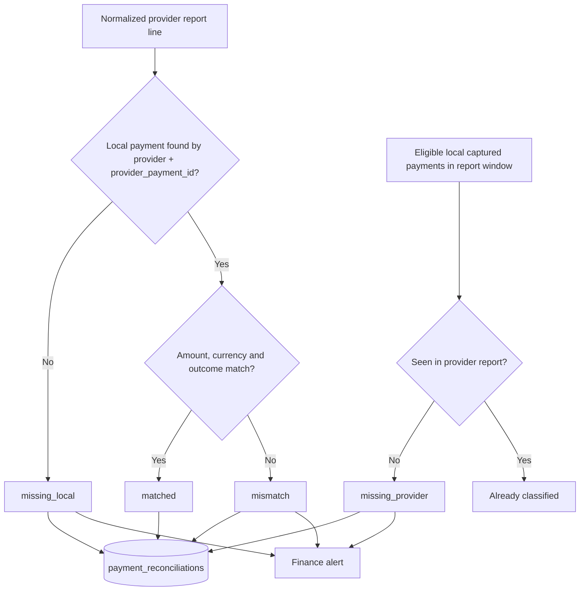
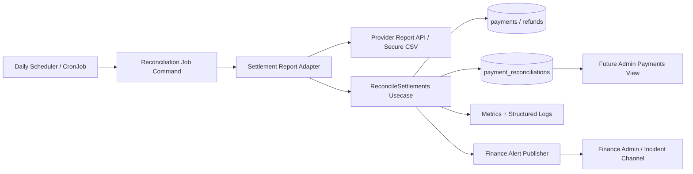
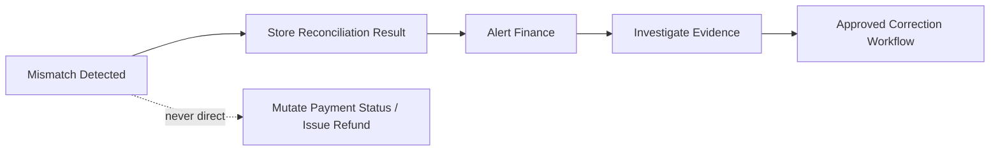
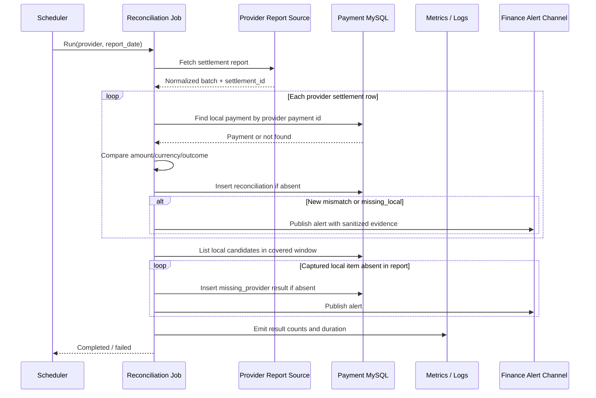
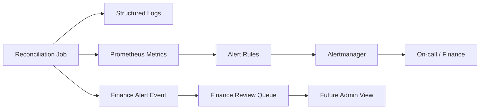
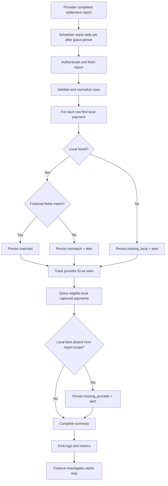

# 💳 Payment Service - Task 8: Reconciliation Job


## 📌 Task Summary

| Field | Detail |
|---|---|
| Task Name | Reconciliation job |
| Source | `docs/01-micro-tasks.md` -> `Payment Service` -> Task 8 |
| Priority | `P2` optimization / advanced financial capability |
| Dependency | Monitoring |
| Main Goal | Provider settlement report ko local payment ledger se compare karna aur financial mismatch alert karna |
| Run Style | Scheduled batch job, normally daily after provider settlement report available ho |
| Persisted Result | `payment_reconciliations` rows with `matched`, `mismatch`, `missing_local`, or `missing_provider` status |
| Output Type | Documentation-only implementation guide |
| Not Included | Runtime Go worker files, new SQL migrations, real provider settlement download, production alerts, admin UI, refund/retry changes |

> **Simple Hinglish goal:** Payment provider ke report me jo paisa settled dikh raha hai, woh Payment Service ke trusted local payment records se match hona chahiye. Daily job har settlement item ko compare karega, result audit table me save karega, aur amount/status/missing-entry jaisi problem ho to finance team ko alert karega.

---

## ✅ Final Output Created

```text
TaskImplementation/
└── Payment Service/
    ├── task1.md
    ├── task2.md
    ├── task3.md
    ├── task4.md
    ├── task5.md
    ├── task6.md
    ├── task7.md
    └── task8.md
```

### Why this structure?

| Path | Purpose |
|---|---|
| `TaskImplementation/` | Saare task-wise implementation guides ka central folder |
| `TaskImplementation/Payment Service/` | Payment Service ke ordered guides ko ek jagah rakhta hai |
| `task8.md` | Sirf **Payment Service - Task 8** ka reconciliation-job blueprint |

> 🟢 **Boundary:** Requested deliverable ke according is output me sirf `task8.md` guide add ki gayi hai. Neeche ke Go, SQL, YAML aur payload blocks implementation examples hain; actual worker, migration, deployment, API, provider integration, monitoring configuration ya UI file is task output me create/modify nahi ki gayi.

---

## 🧭 Source Documents And Existing Foundation

| Source | Task 8 ke liye kya use hua |
|---|---|
| `docs/01-micro-tasks.md` | Exact requirement: provider settlement report compare karo aur mismatch alert karo |
| `docs/07-payment-system.md` | Daily reconciliation flow: provider payment ID, amount, currency, status, fee, settlement ID compare karna |
| `docs/04-microservice-design.md` | Payment Service owns reconciliation reports and payment financial responsibility |
| `docs/05-database-design.md` | MySQL choice, `payment_reconciliations` table, batch processing expectation |
| `docs/09-cms-superadmin.md` | `finance_admin` reconciliation mismatch visibility boundary |
| `docs/11-devops-external-services.md` | Payment provider integration and `payment.events` channel context |
| `docs/12-logging-monitoring-scalability.md` | Monitoring/alerting foundation dependency |
| `TaskImplementation/Payment Service/task1.md` to `task7.md` | States, schema, provider, webhook, refund and retry decisions |
| `backend/services/payment-service/migrations/001_create_payment_tables.up.sql` | Existing reconciliation audit table |
| `backend/services/payment-service/internal/domain/reconciliation.go` | Existing result entity and statuses |
| `backend/services/payment-service/internal/repository/mysql_payment_repository.go` | Existing `CreateReconciliation(...)` insert foundation |
| `backend/services/payment-service/go.mod` | Existing MySQL driver dependency |

### Already Available In The Project

| Existing piece | Task 8 me reuse |
|---|---|
| `payments.provider_payment_id` | Provider report line ko local charged payment se match karne ka key |
| `payments.amount`, `currency`, `captured_amount`, `status` | Expected local financial outcome |
| `refunds` records | Refund-adjusted investigation evidence, jab settlement report refund lines expose kare |
| `payment_webhook_events` | Provider events received the ya nahi, mismatch investigation me useful |
| `payment_reconciliations` table | Job result ka auditable record |
| `domain.PaymentReconciliation` | Normalized result entity |
| Four reconciliation statuses | Clear match/mismatch categorization |
| MySQL repository | Results persist karne ka base method |

### Runtime Pieces Still Needed For A Real Job

Ye guide batati hai ki actual Task 8 implementation kaise banega; ye runtime files is documentation output ka part nahi hain.

| Needed piece | Purpose |
|---|---|
| Settlement report adapter | Provider CSV/API/SFTP data ko common row format me normalize kare |
| `reconcile_settlements.go` usecase | Match, compare, classify, persist and alert orchestration |
| Batch/job command | Scheduler ke through job start karne ka executable entrypoint |
| Idempotent run handling | Same report dubara run hone par duplicate alerts/results prevent kare |
| Alert publisher and metrics | Finance mismatch ko visible/actionable banaye |
| Focused tests | Money comparison and missing-row errors safely validate kare |

---

## 🪜 Step-by-Step Implementation

## Step 1: Task Boundary Clear Kiya

### Included In Task 8

- Provider settlement report ingest karne ka design
- Provider row ko local captured payment se match karne ka rule
- Amount, currency, settlement outcome and reference comparison
- `matched`, `mismatch`, `missing_local`, `missing_provider` result handling
- Batch-safe and rerun-safe processing
- Reconciliation result persistence
- Finance alert, logs and metrics design
- Scheduled daily execution design
- Security and sensitive report handling
- Test strategy and operations runbook

### Not Included In Task 8

- Payment intent create karna; ye Task 4 ka concern hai
- Webhook signature/status processing redesign; ye Task 5 ka concern hai
- Refund approval/provider refund operation change; ye Task 6 ka concern hai
- Payment retry behavior change; ye Task 7 ka concern hai
- Superadmin payment/reconciliation dashboard UI build
- Real provider credentials ya production settlement report access
- Chargeback/dispute accounting, payout ledger, tax invoice or general ledger system

> 🟡 **Reason:** Reconciliation ek detection and audit process hai. Ye silently payment ko `captured`/`refunded` update nahi karega aur provider ko charge/refund command nahi bhejega. Mismatch par investigation/approved correction flow start hoga.

---

## Step 2: Reconciliation Ko Beginner-Friendly Tarike Se Samjha

Payment processing aur settlement same moment par nahi hote:

| Concept | Simple Meaning |
|---|---|
| Payment capture | Provider ne customer se payment successful maana |
| Webhook | Provider ne near-real-time status event bheja |
| Settlement report | Provider ne later batch/report me bataya ki kaunsa financial transaction settle hua |
| Reconciliation | Local record aur provider report ko side-by-side verify karna |

### Example

```text
Local Payment Service:
  provider_payment_id = psp_pay_701
  status              = captured
  captured_amount     = 249900
  currency            = INR

Provider Settlement Report:
  provider_payment_id = psp_pay_701
  settled_amount      = 249900
  currency            = INR
  outcome             = captured
  settlement_id       = stl_20260526

Result:
  matched ✅
```

Mismatch example:

```text
Local captured_amount     = 249900 paise
Provider settled_amount   = 249000 paise
Difference                = -900 paise
Result                    = mismatch 🚨
Action                    = Result persist + finance alert; auto money mutation nahi
```

> 💡 Amount hamesha **minor unit** me compare hoga: INR ke liye paise, USD ke liye cents. Float (`2499.00`) se compare karna rounding risk create karta hai; integer (`249900`) safe hai.

---

## Step 3: Reconciliation Business Rules Define Kiye

| Rule | Why Important |
|---|---|
| Report trusted provider channel se aana chahiye | Forged financial input prevent hota hai |
| Match key primarily `(provider, provider_payment_id)` hoga | External transaction ko local payment se uniquely locate karta hai |
| Currency exact match honi chahiye | Same numeric amount different currency me equivalent nahi hota |
| Amount integer minor units me compare hoga | Rounding mismatch avoid hota hai |
| Local successful payment ka report me absent hona alertable hai | Missing settlement cash-flow issue ho sakta hai |
| Report transaction ka local payment me absent hona alertable hai | Untracked charge/accounting gap indicate karta hai |
| Report rerun idempotent hona chahiye | Duplicate finance alarms aur duplicate audit rows avoid hote hain |
| Every mismatch me sanitized evidence store hoga | Investigation repeatable rahegi |
| Reconciliation payment status automatically change nahi karega | Settlement discrepancy ko verified correction process chahiye |
| Secrets, card data, full customer PII `details` me store/log nahi honge | Compliance aur data-leak risk reduce hota hai |

---

## Step 4: Status Model Existing Domain Se Align Kiya

Project me `internal/domain/reconciliation.go` already four result statuses define karta hai:

| Status | Kab use hoga | Example |
|---|---|---|
| `matched` | Provider row aur local row expected financial fields par agree karte hain | Both show captured INR `249900` |
| `mismatch` | Dono rows milte hain, par amount/currency/outcome inconsistent hai | Local `249900`, provider `249000` |
| `missing_local` | Provider settlement item mila, local payment record locate nahi hua | Provider charge exists, DB lookup empty |
| `missing_provider` | Local settled/captured candidate mila, selected report scope me provider line nahi mila | Local captured payment report me absent |

### Existing Domain Shape

```go
type PaymentReconciliation struct {
    ReconciliationID  string
    Provider          string
    SettlementID      string
    Status            ReconciliationStatus
    PaymentID         string
    ProviderPaymentID string
    Details           json.RawMessage
    CreatedAt         time.Time
}
```

### Classification Flow



---

## Step 5: Architecture Design Kiya



### Har Component Ka Kaam

| Component | Responsibility |
|---|---|
| Scheduler | Configured time par run trigger kare; provider report ready hone ke baad schedule ho |
| Job command | Date/provider/report reference accept karke usecase run kare |
| Settlement adapter | Stripe/Razorpay-like provider-specific input ko common normalized rows me map kare |
| Reconciliation usecase | Local lookup, comparisons, classification, result write and alert decision |
| Payment repository | Local records fetch kare aur reconciliation result persist kare |
| Metrics/logging | Counts, duration, failed ingestion and mismatches observable banaye |
| Finance alert publisher | Non-matched results ko actionable alert me deliver kare |

### Important Safety Decision



Reconciliation job ka output **evidence and alert** hai, automatic charge/refund/status correction nahi.

---

## Step 6: Clean Folder Structure Plan Kiya

### Documentation Output

```text
TaskImplementation/
└── Payment Service/
    └── task8.md
```

### Runtime Implementation Layout For Task 8

Project ke current Go clean-layer approach ke saath actual implementation ka recommended logical layout:

```text
backend/
└── services/
    └── payment-service/
        ├── cmd/
        │   ├── server/
        │   │   └── main.go                         # Existing HTTP service
        │   └── reconciliation/
        │       └── main.go                         # Planned scheduled-job entrypoint
        ├── internal/
        │   ├── config/
        │   │   └── config.go                       # Planned reconciliation config fields
        │   ├── domain/
        │   │   ├── payment.go                      # Existing local money/status record
        │   │   └── reconciliation.go               # Existing result entity/statuses
        │   ├── provider/
        │   │   └── settlement/
        │   │       ├── report.go                   # Planned normalized settlement contract
        │   │       ├── csv.go                      # Planned CSV parser adapter
        │   │       ├── stripe_like.go              # Planned provider adapter
        │   │       └── razorpay_like.go            # Planned provider adapter
        │   ├── repository/
        │   │   └── mysql_payment_repository.go     # Existing result insert + planned batch reads
        │   ├── usecase/
        │   │   ├── reconcile_settlements.go        # Planned comparison orchestration
        │   │   └── reconcile_settlements_test.go   # Planned unit tests
        │   └── events/
        │       └── reconciliation_alert.go         # Planned finance alert publisher
        └── migrations/
            └── 001_create_payment_tables.up.sql    # Existing reconciliation table
```

### Layer Ownership

| Layer/File | Kya build hoga | Kya nahi karega |
|---|---|---|
| `provider/settlement/*` | External report parse/normalize | Local payment business decision nahi |
| `usecase/reconcile_settlements.go` | Compare, classify, save, alert | Provider-specific CSV columns assume nahi |
| `repository/mysql_payment_repository.go` | Batched DB reads and idempotent result write | Finance severity decide nahi |
| `events/reconciliation_alert.go` | Alert event publish | Payment row mutate nahi |
| `cmd/reconciliation/main.go` | Config load aur one job invocation | Long-running HTTP route serve nahi |

> 🟢 Existing schema/domain/repository foundation reuse hoga. Proposed worker/adapters actual code me tab add honge jab Task 8 runtime implementation explicitly requested hogi.

---

## Step 7: Existing MySQL Result Table Reuse Kiya

Task 2/schema foundation me already ye table available hai:

```sql
CREATE TABLE IF NOT EXISTS payment_reconciliations (
  id BIGINT UNSIGNED NOT NULL AUTO_INCREMENT,
  reconciliation_id VARCHAR(64) NOT NULL,
  provider VARCHAR(64) NOT NULL,
  settlement_id VARCHAR(128) NULL,
  status ENUM('matched', 'mismatch', 'missing_local', 'missing_provider') NOT NULL,
  payment_id VARCHAR(64) NULL,
  provider_payment_id VARCHAR(128) NULL,
  details JSON NULL,
  created_at TIMESTAMP NOT NULL DEFAULT CURRENT_TIMESTAMP,
  PRIMARY KEY (id),
  UNIQUE KEY uk_reconciliation_id (reconciliation_id),
  KEY idx_reconciliation_provider_status (provider, status)
) ENGINE=InnoDB;
```

### Column Meaning

| Column | Purpose |
|---|---|
| `reconciliation_id` | Idempotent result identity; same report line rerun par same value generate karo |
| `provider` | `stripe_like`, `razorpay_like`, ya configured normalized provider name |
| `settlement_id` | Provider report/batch/payout reference |
| `status` | Comparison outcome |
| `payment_id` | Local row mila to uska internal ID |
| `provider_payment_id` | Provider line identifier used for lookup |
| `details` | Sanitized mismatch evidence and report metadata |
| `created_at` | Audit creation time |

### `details` JSON Example

```json
{
  "report_date": "2026-05-26",
  "reason_codes": ["amount_mismatch"],
  "local": {
    "status": "captured",
    "currency": "INR",
    "captured_amount": 249900
  },
  "provider": {
    "outcome": "captured",
    "currency": "INR",
    "settled_amount": 249000,
    "fee_amount": 7250
  },
  "difference_amount": -900
}
```

### Data Retention Rule

`details` me comparison evidence rakho, lekin ye data mat rakho:

- Card number, CVV, UPI VPA or bank account full value
- Provider API secret, webhook secret or authorization header
- Full customer name/email/phone agar comparison ke liye required nahi
- Complete raw report file without explicit retention/security policy

---

## Step 8: Provider Report Ko Common Format Me Normalize Kiya

Har provider ka settlement CSV/API format different ho sakta hai. Usecase ko provider-specific column names samajhne ki zarurat nahi honi chahiye. Adapter ek common row return karega.

### Normalized Settlement Row

```go
package settlement

import (
    "context"
    "time"
)

type Row struct {
    Provider          string
    SettlementID      string
    ProviderPaymentID string
    Outcome           string
    Currency          string
    SettledAmount     int64
    FeeAmount         int64
    SettledAt         time.Time
    ReportDate        string
}

type Report struct {
    Provider     string
    SettlementID string
    ReportDate   string
    WindowStart  time.Time
    WindowEnd    time.Time
    Rows         []Row
}

type Source interface {
    Fetch(ctx context.Context, reportDate time.Time) (Report, error)
}
```

### Required Input Validation

| Field | Rule |
|---|---|
| `Provider` | Configured provider name; lowercase normalized |
| `SettlementID` | Daily report adapter ke liye required rakho aur maximum supported length follow kare |
| `ProviderPaymentID` | Blank row reconcile nahi hoga; invalid report error/alert |
| `Outcome` | Supported captured/settled/refunded outcome mapping me hona chahiye |
| `Currency` | Trim + uppercase, ISO 3-letter currency |
| `SettledAmount` | Relevant captured transaction ke liye positive minor units |
| `FeeAmount` | Non-negative minor units; evidence/policy comparison ke liye |
| `ReportDate` | Job requested reporting window ke saath align ho |

### CSV Input Example

```csv
settlement_id,provider_payment_id,outcome,currency,settled_amount,fee_amount,settled_at
stl_20260526,psp_pay_701,captured,INR,249900,7250,2026-05-26T16:30:00Z
stl_20260526,psp_pay_702,captured,INR,149900,4300,2026-05-26T16:31:00Z
```

### Standard Library Parser Example

```go
func ParseCSV(r io.Reader, provider, reportDate string) ([]settlement.Row, error) {
    reader := csv.NewReader(r)
    reader.FieldsPerRecord = -1

    header, err := reader.Read()
    if err != nil {
        return nil, fmt.Errorf("read settlement header: %w", err)
    }
    index, err := requiredColumns(header,
        "settlement_id", "provider_payment_id", "outcome",
        "currency", "settled_amount", "fee_amount", "settled_at",
    )
    if err != nil {
        return nil, err
    }

    var rows []settlement.Row
    for line := 2; ; line++ {
        values, err := reader.Read()
        if errors.Is(err, io.EOF) {
            break
        }
        if err != nil {
            return nil, fmt.Errorf("read settlement line %d: %w", line, err)
        }
        row, err := normalizeRow(values, index, provider, reportDate)
        if err != nil {
            return nil, fmt.Errorf("invalid settlement line %d: %w", line, err)
        }
        rows = append(rows, row)
    }
    return rows, nil
}
```

> 🟡 `encoding/csv`, `io`, `errors` aur `fmt` Go standard library packages hain; inke liye separate install required nahi.

> 🟡 Existing base domain `settlement_id` ko nullable support karta hai. Scheduled settlement-report adapter stricter rule apply karega, kyunki repeatable daily report identity aur investigation ke liye settlement reference zaruri hai.

---

## Step 9: Matching Key Aur Comparison Rules Banaye

### Lookup Key

```text
provider + provider_payment_id
```

Existing `payments` table me `idx_payments_provider_payment (provider, provider_payment_id)` isi lookup ko support karta hai.

### Comparison Matrix

| Check | Local Source | Provider Source | Result When Failed |
|---|---|---|---|
| Payment exists | `payments` lookup | Report row reference | `missing_local` |
| Provider ID | `provider_payment_id` | `provider_payment_id` | `missing_local` or invalid input |
| Currency | `payments.currency` | Report `currency` | `mismatch` |
| Captured amount | `payments.captured_amount` | Report `settled_amount` | `mismatch` |
| Outcome/status | Local `captured` expectation | Report mapped outcome | `mismatch` |
| Settlement presence | Eligible local payment | Seen report rows | `missing_provider` |
| Fee | Expected fee policy/ledger when available | Report `fee_amount` | Evidence or `mismatch` only when expected fee data exists |
| Settlement ID | None before provider reports it | Provider batch ID | Persist reference, not falsely compare against blank local value |

### Important Fee Clarification

Project ke current `payments` schema me expected provider fee column nahi hai. Isliye:

- Provider `fee_amount` ko sanitized `details` evidence me store kiya ja sakta hai.
- Fee mismatch tabhi automatically classify karo jab fee expectation source later available ho, jaise pricing agreement/ledger field.
- Amount/currency/outcome/missing-row checks Task 8 ka reliable initial automated match set hain.

### Eligible Local Rows For `missing_provider`

Report me absent row detect karne ke liye sirf provider lines iterate karna enough nahi hai. Job ko report window ke eligible local rows bhi query karne honge:

```sql
SELECT payment_id, provider, provider_payment_id, status,
       currency, captured_amount, refunded_amount, updated_at
FROM payments
WHERE provider = ?
  AND status IN ('captured', 'partially_refunded', 'refunded')
  AND provider_payment_id IS NOT NULL
  AND updated_at >= ?
  AND updated_at < ?;
```

> 🟡 Provider ka settlement window transaction date se different ho sakta hai. Production adapter ko provider report/payout coverage rule define karke hi `missing_provider` alert raise karna chahiye; premature same-day alert false positive bana sakta hai.

---

## Step 10: Classification Logic Code Example Diya

```go
type Comparison struct {
    Status      domain.ReconciliationStatus
    ReasonCodes []string
    Difference  int64
}

func compareCapturedPayment(local domain.Payment, external settlement.Row) Comparison {
    reasons := make([]string, 0, 3)

    if local.Amount.Currency != strings.ToUpper(strings.TrimSpace(external.Currency)) {
        reasons = append(reasons, "currency_mismatch")
    }
    if local.CapturedAmount != external.SettledAmount {
        reasons = append(reasons, "amount_mismatch")
    }
    if local.Status != domain.PaymentStatusCaptured &&
        local.Status != domain.PaymentStatusPartiallyRefunded &&
        local.Status != domain.PaymentStatusRefunded {
        reasons = append(reasons, "local_status_not_settleable")
    }
    if external.Outcome != "captured" {
        reasons = append(reasons, "provider_outcome_mismatch")
    }

    if len(reasons) == 0 {
        return Comparison{Status: domain.ReconciliationStatusMatched}
    }
    return Comparison{
        Status:      domain.ReconciliationStatusMismatch,
        ReasonCodes: reasons,
        Difference:  external.SettledAmount - local.CapturedAmount,
    }
}
```

### How This Part Was Built

1. `provider_payment_id` se local payment locate hota hai.
2. Local row missing ho to compare karne ke bajay direct `missing_local` result banta hai.
3. Row milne par deterministic checks chalte hain.
4. Har failed check ka machine-readable `reason_code` collect hota hai.
5. No failed checks ka result `matched`; otherwise `mismatch`.
6. Separate reverse pass local eligible payments ko report set ke against check karke `missing_provider` banata hai.

### Reason Codes Recommended

| Reason Code | Meaning | Suggested Severity |
|---|---|---|
| `amount_mismatch` | Provider and local captured amount differ | Critical |
| `currency_mismatch` | Provider and local currency differ | Critical |
| `provider_outcome_mismatch` | Local captured, provider result captured nahi | High |
| `local_status_not_settleable` | Provider reports settled but local state incompatible | High |
| `provider_payment_not_found_locally` | External charge local ledger me absent | Critical |
| `captured_payment_missing_in_report` | Local captured payment settlement scope me absent | High after grace period |
| `invalid_report_row` | Provider row parse/validation failed | High |

---

## Step 11: Idempotent Batch Processing Design Kiya

Daily job manually rerun ho sakta hai: timeout, transient database problem, ya finance recheck ke reason se. Same input par duplicate rows aur duplicate alerts create nahi hone chahiye.

### Deterministic Result Identity

Ek settlement row ke liye ID source evidence se derive karo:

```text
matched/mismatch/missing_local:
  reconciliation key = provider | settlement_id | provider_payment_id

missing_provider:
  reconciliation key = provider | settlement_id | payment_id | missing_provider
```

```go
func reconciliationID(parts ...string) string {
    normalized := strings.Join(parts, "|")
    sum := sha256.Sum256([]byte(normalized))
    return "rec_" + hex.EncodeToString(sum[:])[:32]
}
```

Existing `UNIQUE KEY uk_reconciliation_id (reconciliation_id)` deterministic result ko rerun-safe banane ka foundation deta hai.

### Idempotency Rules

| Scenario | Expected Behavior |
|---|---|
| Same settlement report exactly rerun | Existing result replay/skip; second alert nahi |
| Job mid-batch fail and restart | Saved rows skip; remaining rows process |
| Provider revised/corrected report issues new settlement/report version | New report identity se fresh comparison; old audit evidence preserve |
| Same line conflicting contents ke saath same report ID me aaye | Ingestion failure/high alert; silently overwrite nahi |

### Repository Write Pattern Example

```sql
INSERT INTO payment_reconciliations (
  reconciliation_id, provider, settlement_id, status,
  payment_id, provider_payment_id, details, created_at
) VALUES (?, ?, ?, ?, ?, ?, ?, ?)
ON DUPLICATE KEY UPDATE reconciliation_id = reconciliation_id;
```

Application ko insert/duplicate result distinguish karna chahiye:

```go
created, err := repo.CreateReconciliationIfAbsent(ctx, result)
if err != nil {
    return err
}
if created && result.Status != domain.ReconciliationStatusMatched {
    return alerts.PublishMismatch(ctx, result)
}
return nil
```

> 🟡 Current repository me `CreateReconciliation(...)` insertion foundation present hai. A real scheduled job ko rerun behavior explicitly implement/test karna hoga, taaki duplicate unique-key error poore batch ko unnecessarily fail na kare.

---

## Step 12: Usecase Orchestration Plan Banaya

### Interfaces

```go
type SettlementSource interface {
    Fetch(ctx context.Context, provider string, reportDate time.Time) (settlement.Report, error)
}

type ReconciliationRepository interface {
    FindPaymentByProviderPaymentID(ctx context.Context, provider, providerPaymentID string) (domain.Payment, error)
    ListSettlementCandidates(ctx context.Context, provider string, from, to time.Time) ([]domain.Payment, error)
    CreateReconciliationIfAbsent(ctx context.Context, result domain.PaymentReconciliation) (bool, error)
}

type ReconciliationAlertPublisher interface {
    PublishMismatch(ctx context.Context, result domain.PaymentReconciliation) error
}
```

### Usecase Flow

```go
func (u *ReconcileSettlementsUsecase) Execute(
    ctx context.Context,
    provider string,
    reportDate time.Time,
) (Summary, error) {
    report, err := u.source.Fetch(ctx, provider, reportDate)
    if err != nil {
        return Summary{}, fmt.Errorf("fetch settlement report: %w", err)
    }

    summary := Summary{Provider: provider, SettlementID: report.SettlementID}
    seen := make(map[string]struct{}, len(report.Rows))

    for _, row := range report.Rows {
        result := u.reconcileProviderRow(ctx, report, row)
        created, err := u.repo.CreateReconciliationIfAbsent(ctx, result)
        if err != nil {
            return summary, err
        }
        summary.Add(result.Status, created)
        if created && result.Status != domain.ReconciliationStatusMatched {
            _ = u.alerts.PublishMismatch(ctx, result)
        }
        seen[row.ProviderPaymentID] = struct{}{}
    }

    candidates, err := u.repo.ListSettlementCandidates(ctx, provider, report.WindowStart, report.WindowEnd)
    if err != nil {
        return summary, err
    }
    for _, local := range candidates {
        if _, exists := seen[local.ProviderPaymentID]; !exists {
            result := u.missingProviderResult(report, local)
            created, err := u.repo.CreateReconciliationIfAbsent(ctx, result)
            if err != nil {
                return summary, err
            }
            summary.Add(result.Status, created)
            if created {
                _ = u.alerts.PublishMismatch(ctx, result)
            }
        }
    }
    return summary, nil
}
```

### How This Part Was Built

| Stage | Explanation |
|---|---|
| Fetch | Adapter report obtain aur normalize karta hai |
| Forward scan | Har provider line ko local row se compare karta hai; provider-only charges pakadta hai |
| Seen set | Report me kaun se provider payments aaye track karta hai |
| Reverse scan | Local captured candidates jo report me nahi aaye detect karta hai |
| Persist | Har outcome audit table me insert hota hai |
| Alert | Sirf newly created non-matched result alert karta hai |
| Summary | Job end par counts/log/metric provide karta hai |

### Batch Processing

Large reports ke liye sari rows memory me hold karna avoid karo:

| Practice | Benefit |
|---|---|
| CSV/API pagination or streaming | Memory stable rehti hai |
| DB lookup batch size, e.g. `500` | Query load bounded rehta hai |
| Per-result idempotency | Partial restart possible hota hai |
| Job summary after processing | Finance/operations ko total outcome milta hai |
| Context timeout and cancellation | Stuck report download/job terminate ho sakta hai |

---

## Step 13: Sequence Flow Diagram Add Kiya



---

## Step 14: Scheduler And Configuration Plan Kiya

### Recommended Configuration

| Environment Variable | Example | Purpose |
|---|---|---|
| `PAYMENT_RECONCILIATION_ENABLED` | `true` | Job execution switch |
| `PAYMENT_RECONCILIATION_PROVIDER` | `stripe_like` | Provider adapter selection |
| `PAYMENT_RECONCILIATION_REPORT_LAG_HOURS` | `24` | Provider report complete hone ka grace period |
| `PAYMENT_RECONCILIATION_BATCH_SIZE` | `500` | Batch read/write load control |
| `PAYMENT_RECONCILIATION_TIMEOUT` | `20m` | One run deadline |
| `PAYMENT_RECONCILIATION_ALERT_TOPIC` | `payment.reconciliation.alerts` | Finance alert routing |
| `PAYMENT_MYSQL_DSN` | Secret-injected DSN | Existing payment database access |
| Provider report credential variables | Secret-managed | Report source authentication |

> 🔴 Provider report credentials aur database DSN secret manager/Kubernetes Secret se inject hone chahiye; Git repository ya log me values store nahi honi chahiye.

### Job Command Shape

```bash
go run ./cmd/reconciliation --provider=stripe_like --report-date=2026-05-26
```

Recommended behavior:

| Input | Behavior |
|---|---|
| Explicit `--report-date` | Backfill/manual investigation run reproducible hota hai |
| No report date | Configured lag ke according last complete provider day choose kare |
| Same date rerun | Idempotently no duplicate result/alert |
| Non-zero exit | Report fetch, validation or persistence failure ko scheduler visible banaye |

### Kubernetes CronJob Blueprint

Ye deployment example hai, is deliverable me Kubernetes file create nahi ki gayi:

```yaml
apiVersion: batch/v1
kind: CronJob
metadata:
  name: payment-reconciliation-daily
spec:
  schedule: "30 2 * * *"
  concurrencyPolicy: Forbid
  successfulJobsHistoryLimit: 3
  failedJobsHistoryLimit: 7
  jobTemplate:
    spec:
      backoffLimit: 2
      template:
        spec:
          restartPolicy: Never
          containers:
            - name: reconciliation
              image: ecommerce/payment-service:VERSION
              args: ["reconciliation", "--provider=stripe_like"]
              envFrom:
                - secretRef:
                    name: payment-service-secrets
                - configMapRef:
                    name: payment-service-config
```

### Schedule Explanation

- Schedule provider ke report generation time ke baad rakho.
- `concurrencyPolicy: Forbid` same provider/date ke overlapping runs reduce karta hai.
- Idempotency fir bhi mandatory hai, kyunki manual rerun ya retry possible hai.
- Multiple providers hon to separate provider jobs ya orchestrated per-provider runs use karo.

---

## Step 15: Monitoring And Finance Alerts Build Kiye

Task dependency `Monitoring` hai, kyunki mismatch detect karna tab useful hai jab team ko timely pata bhi chale.

### Structured Completion Log Example

```json
{
  "event": "payment.reconciliation.completed",
  "provider": "stripe_like",
  "settlement_id": "stl_20260526",
  "report_date": "2026-05-26",
  "matched_count": 12408,
  "mismatch_count": 2,
  "missing_local_count": 1,
  "missing_provider_count": 3,
  "duration_ms": 18342
}
```

### Alert Event Example

```json
{
  "event_type": "PaymentReconciliationMismatchDetected",
  "reconciliation_id": "rec_443f2f31a10158a31f8e4c90e3220d7a",
  "provider": "stripe_like",
  "settlement_id": "stl_20260526",
  "status": "mismatch",
  "payment_id": "pay_1003",
  "provider_payment_id": "psp_pay_701",
  "reason_codes": ["amount_mismatch"],
  "severity": "critical"
}
```

### Metrics

| Metric | Type | Labels | Purpose |
|---|---|---|---|
| `payment_reconciliation_runs_total` | Counter | `provider`, `result` | Success/failure runs count |
| `payment_reconciliation_rows_total` | Counter | `provider`, `status` | Outcome trend |
| `payment_reconciliation_duration_seconds` | Histogram | `provider` | Slow job detection |
| `payment_reconciliation_mismatch_amount_minor` | Gauge/Counter | `provider`, `currency` | Financial impact visibility |
| `payment_reconciliation_report_fetch_failures_total` | Counter | `provider` | External source reliability |

### Alert Routing

| Condition | Severity | Alert Target | Response |
|---|---|---|---|
| Any `currency_mismatch` | Critical | Finance + on-call | Immediate investigate |
| Any `missing_local` | Critical | Finance + engineering on-call | Check untracked provider charge |
| Material `amount_mismatch` | Critical | Finance + on-call | Hold/manual investigation |
| `missing_provider` after grace period | High | Finance queue | Check delayed settlement/report scope |
| Job/report fetch failure | High | Operations/on-call | Rerun after source issue resolve |
| Only `matched` results | Info/dashboard | Metrics only | No page required |

### Observability Flow



---

## Step 16: Admin And Investigation Boundary Define Ki

`docs/09-cms-superadmin.md` ke according `finance_admin` payments, refunds aur reconciliation access own karta hai. Task 8 sirf data/alert supply karta hai; dashboard banana iska scope nahi.

### Finance View Ko Future Me Kya Dikhna Chahiye

| Field | Why Useful |
|---|---|
| Reconciliation ID | Audit reference |
| Provider and settlement ID | External report lookup |
| Status and reason codes | Immediate classification |
| Payment ID/provider payment ID | Local/external trace |
| Local vs provider amount/currency | Difference samajhne ke liye |
| Created time/report date | Timeline |
| Investigation status/notes | Manual operational workflow, future admin concern |

### Investigation Checklist

| Finding | First Investigation Step |
|---|---|
| `missing_local` | Provider ID se webhook log aur create-intent failure trace dekho |
| `missing_provider` | Settlement window/grace period aur provider report completeness verify karo |
| `amount_mismatch` | Captured amount, partial refund timing, provider adjustment/fee fields inspect karo |
| `currency_mismatch` | Original intent currency and provider report mapping validate karo |
| Provider outcome mismatch | Webhook delivery/processing history aur provider dashboard verify karo |

---

## Step 17: Security And Compliance Controls Add Kiye

| Control | Implementation Guidance |
|---|---|
| Report authentication | Provider API credential or signed/secure SFTP download only |
| Least privilege | Job credential ko report read access do; charge/refund write permission mat do |
| Secret storage | Keys/token secret manager se inject karo |
| Report storage | Encrypted temporary/object storage with controlled retention |
| Logging redaction | Secrets, card/UPI/bank data and unnecessary PII omit/redact karo |
| Database access | Job ko required payment read + reconciliation write permissions tak limit karo |
| Alert content | Investigation IDs and amounts include karo; raw sensitive payload nahi |
| Auditability | Old reconciliation results overwrite/delete mat karo; correction new evidence ke roop me store karo |
| Manual correction | RBAC and maker-checker finance workflow ke through hi ho |

### Threat-Safety Table

| Risk | Protection |
|---|---|
| Fake CSV upload se false alert/correction | Trusted authenticated source and report signature/checksum |
| Duplicate job alerts | Deterministic IDs and insert-if-absent |
| Report me PII leak via logs | Sanitized details and log allowlist |
| Mismatch se automatic wrong refund | Detect-and-alert only policy |
| Stolen report credential se charge operation | Read-only provider credential |

---

## Step 18: External Libraries And Tools Explain Kiye

Task 8 ke initial implementation ke liye new provider SDK mandatory nahi hai. Existing project stack aur Go standard library se common report parsing/job logic build ho sakta hai.

### Libraries / Tools Table

| Library / Tool | External? | Why Used | Install / Setup | How Used In Task 8 |
|---|---:|---|---|---|
| Go `encoding/csv` | No, standard library | CSV settlement file parse karna | Go ke saath built-in; install nahi | Adapter report rows read karega |
| Go `crypto/sha256` | No, standard library | Deterministic reconciliation ID banana | Built-in | Rerun deduplication key |
| Go `log/slog` | No, standard library | Structured job logs | Built-in | Run summary/error logs |
| `github.com/go-sql-driver/mysql` | Yes, already declared | MySQL `payments`/`payment_reconciliations` access | Existing module me `go mod download`; new module me `go get github.com/go-sql-driver/mysql@v1.10.0` | Repository queries and result insert |
| MySQL | Yes, infrastructure | Financial audit/results persist karna | Local Docker/MySQL setup project infrastructure ke according | Existing reconciliation table query/write |
| Kubernetes `CronJob` or equivalent scheduler | Optional deployment tool | Daily execution trigger | Cluster me manifest apply; local me command manually run | One job run per schedule/provider |
| Prometheus + Alertmanager | Optional monitoring tools | Metrics based operational alerts | Monitoring stack deployment/config required | Job failures and mismatch thresholds alert |

### Existing Go Dependency

Payment Service ke `go.mod` me ye database driver already present hai:

```go
require github.com/go-sql-driver/mysql v1.10.0
```

Existing service module me dependency fetch/verify karne ka command:

```bash
cd backend/services/payment-service
go mod download
go test ./...
```

### Why No Mandatory Provider SDK?

| Approach | Reason |
|---|---|
| `net/http` based adapter | Existing provider integration pattern ke saath consistent aur SDK lock-in kam |
| Secure CSV adapter | Providers often settlement export file dete hain; normalized interface same rahega |
| SDK later optional | Agar selected provider ka authenticated reporting SDK beneficial ho, adapter ke andar add ho sakta hai without usecase rewrite |

> 🟡 Is guide me koi dependency install ya monitoring/deployment configuration actually execute nahi ki gayi; ye real implementation ke use/setup instructions hain.

---

## Step 19: Testing Strategy Banayi

Financial comparison logic ke tests deterministic hone chahiye. Real provider network ke bajay fake report source aur fake alert publisher use karo.

### Unit Test Cases

| Test Case | Expected Result |
|---|---|
| Exact provider/local amount, currency and captured outcome | `matched`, no finance alert |
| Amount differs by one minor unit | `mismatch`, reason `amount_mismatch`, alert |
| Currency differs | `mismatch`, critical alert |
| Report payment ID DB me absent | `missing_local`, critical alert |
| Eligible local captured payment report me absent after scope/grace | `missing_provider`, alert |
| Non-supported report outcome | Validation error or mismatch policy result |
| Invalid blank provider payment ID | Report ingestion fails visibly |
| Same report rerun | No duplicate result and no duplicate alert |
| Mid-batch persistence failure | Error return; rerun safely resumes/skips persisted results |
| Alert publishing fails after result persists | Result retained; metric/log allows alert retry |

### Usecase Test Example

```go
func TestReconcileSettlementsAmountMismatchCreatesOneAlertOnRerun(t *testing.T) {
    report := settlement.Report{
        Provider: "stripe_like",
        SettlementID: "stl_20260526",
        Rows: []settlement.Row{{
            Provider: "stripe_like",
            SettlementID: "stl_20260526",
            ProviderPaymentID: "psp_pay_701",
            Outcome: "captured",
            Currency: "INR",
            SettledAmount: 249000,
        }},
    }
    repo := newFakeReconciliationRepository(capturedPayment("psp_pay_701", 249900, "INR"))
    alerts := &fakeAlertPublisher{}
    uc := newUsecase(fakeSettlementSource{report: report}, repo, alerts)

    _, err := uc.Execute(context.Background(), "stripe_like", mustDate("2026-05-26"))
    if err != nil {
        t.Fatal(err)
    }
    _, err = uc.Execute(context.Background(), "stripe_like", mustDate("2026-05-26"))
    if err != nil {
        t.Fatal(err)
    }

    if got := repo.statusCount(domain.ReconciliationStatusMismatch); got != 1 {
        t.Fatalf("mismatch rows = %d, want 1", got)
    }
    if alerts.calls != 1 {
        t.Fatalf("alert calls = %d, want 1", alerts.calls)
    }
}
```

### Integration Tests

| Area | What To Verify |
|---|---|
| MySQL unique ID behavior | Same deterministic result insert replay-safe ho |
| Candidate query | Correct provider/date scope ke captured rows return ho |
| JSON detail sanitation | Sensitive fields reject/redact ho |
| Batch transaction behavior | One invalid row handling policy documented/tested ho |
| Cron command exit code | Run failure scheduler ko non-zero status deta ho |

### Operational Test

Test environment me ek small known CSV run karo:

```text
Rows supplied       : 4
Expected matched    : 1
Expected mismatch   : 1
Expected missing_local: 1
Local-only candidate: 1 -> missing_provider
Expected alert count: 3
```

Rerun par:

```text
New reconciliation rows: 0
New alerts             : 0
```

---

## Step 20: Failure Handling And Runbook Define Kiya

| Failure | Job Behavior | Team Action |
|---|---|---|
| Provider report unavailable | Fail run, log/metric alert; no empty-report assumption | Check provider/report generation then rerun |
| Report format invalid | Stop or quarantine invalid batch; high alert | Validate provider format/version mapping |
| DB unavailable | Fail run; no report acknowledged as processed | Restore DB connectivity then rerun idempotently |
| Single row mismatch | Persist evidence, alert, continue remaining valid rows | Finance investigate |
| Alert channel unavailable | Persist result, metric/log alert delivery failure | Replay alert from stored non-matched results |
| Job overlapping invocation | Scheduler forbids where possible; ID dedupe remains guard | Confirm one active run |
| Unexpected large mismatch spike | Continue safe evidence persistence; page finance/on-call | Check provider report scope/currency/config before correction |

### Never Do Automatically

- Mismatch dekhkar captured payment delete/update mat karo.
- `missing_provider` dekhkar direct refund issue mat karo.
- Report fetch fail hone par empty report treat karke sab local rows ko missing mat mark karo.
- Provider raw secret/header ko error log ya `details` JSON me store mat karo.

---

## Step 21: End-to-End Daily Flow Summarize Kiya



### Numbered Flow

1. Daily scheduler completed reporting date ke liye job invoke karta hai.
2. Adapter authenticated provider source se settlement report fetch karta hai.
3. Input rows validate aur common format me normalize hote hain.
4. Job each provider row ko local payment ID/index ke through locate karta hai.
5. Missing local record ko `missing_local` store karke urgent alert karta hai.
6. Located row ke amount/currency/outcome compare karke `matched` ya `mismatch` save hota hai.
7. Job local eligible captured items ki reverse scan karta hai.
8. Covered report me absent local item ko grace/policy ke baad `missing_provider` save karta hai.
9. Non-matched newly-created results finance alert generate karte hain.
10. Run summary metrics/log me publish hota hai.
11. Finance approved investigation/correction workflow separately perform karti hai.

---

## Step 22: Implementation Checklist

| Required Output / Design Point | Status In This Guide |
|---|---:|
| `TaskImplementation/Payment Service/task8.md` created | ✅ |
| Step-by-step implementation Hinglish me | ✅ |
| Reconciliation meaning and safety boundary clear | ✅ |
| Existing schema/domain/repository foundation identified | ✅ |
| Clean runtime folder structure blueprint | ✅ |
| Provider report normalization explained | ✅ |
| Matching and missing-item logic explained | ✅ |
| Idempotency/rerun design explained | ✅ |
| Code examples added | ✅ |
| Mermaid architecture, classification, sequence and flow diagrams added | ✅ |
| External libraries/tools with install/use guidance | ✅ |
| Monitoring and financial alerting explained | ✅ |
| Security, testing and operational failure handling included | ✅ |
| Scope limited to Payment Service - Task 8 documentation | ✅ |

---

## 🚫 Out Of Scope Reminder

| Work Item | Belongs To |
|---|---|
| Initial payment intent or checkout changes | Payment Service Task 4 / frontend checkout |
| Webhook signature and event finalization changes | Payment Service Task 5 |
| Refund request/approval/provider refund changes | Payment Service Task 6 |
| Failed payment retry behavior | Payment Service Task 7 |
| Reconciliation alerts dashboard screens | Superadmin Panel payment operations |
| Production scheduler/monitoring deployment | Infrastructure/observability implementation |
| Runtime job files and migrations | Future explicit Task 8 code implementation request |

---

## 🏁 Completion Note

Payment Service - Task 8 ke liye reconciliation-job implementation guide complete hai. Guide provider settlement report ko normalized format me read karne, local captured payment ledger se safely compare karne, auditable statuses persist karne, reruns ko idempotent banane, aur mismatch ko finance alert/monitoring tak pahunchane ka clear blueprint deti hai.

**Scope strictly Task 8 documentation tak limited rakha gaya hai:** is output me actual Go worker, SQL migration, provider download, CronJob deployment, monitoring rule, finance UI, payment status mutation ya kisi aur task ka runtime implementation add nahi kiya gaya.
