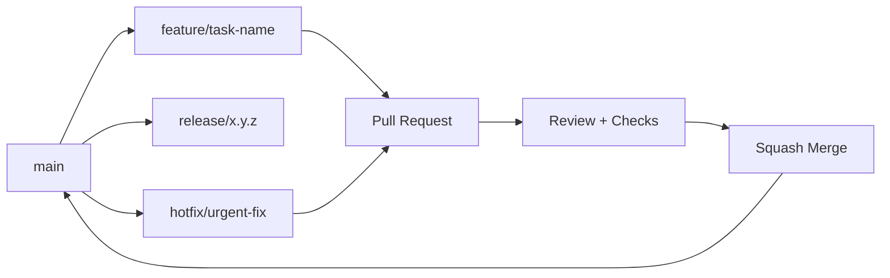
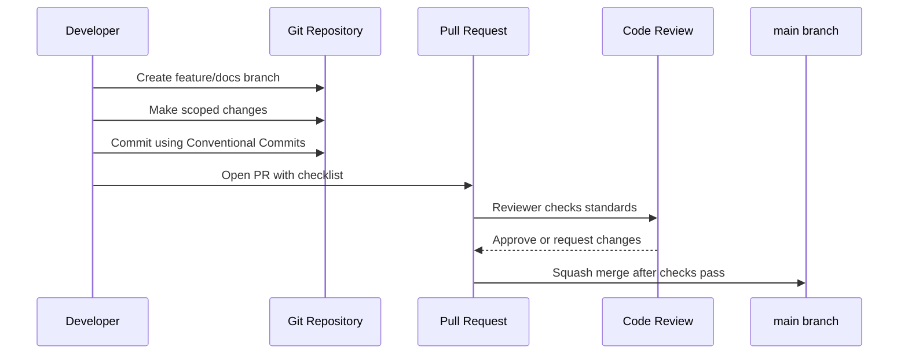

# 🧱 Platform Foundation - Task 1: Define Repo Standards


## 📌 Task Summary

| Field | Detail |
|---|---|
| Task Name | Define repo standards |
| Source | `docs/01-micro-tasks.md` → `Platform Foundation` → Task 1 |
| Goal | Naming, folder, branching, aur commit rules define karna |
| Scope | Documentation-only foundation standard |
| Not Included | Proto strategy, shared Go libs, Docker Compose, CI, Kubernetes |

> **Simple Hinglish goal:** Is task ka kaam hai repo ke basic rules clear karna, taaki future me backend, frontend, infra, docs, aur database work same style me ho. Ye foundation task hai, isliye isme business feature ya service code implement nahi kiya gaya.

---

## ✅ Final Output Created

```text
TaskImplementation/
└── Platform Foundation/
    └── task1.md
```

### Why this structure?

- `TaskImplementation/` ek central folder hai jahan task-wise implementation guides rahenge.
- `Platform Foundation/` platform foundation ke tasks ko group karta hai.
- `task1.md` sirf **Platform Foundation - Task 1** ka guide hai.

---

## 🧭 Implementation Approach

Is guide ko banane ke liye project ke docs ko study kiya gaya:

| Document | Kya use kiya gaya |
|---|---|
| `docs/01-micro-tasks.md` | Task name, priority, dependency, aur scope identify kiya |
| `docs/00-index.md` | Platform build order samjha |
| `docs/02-system-architecture.md` | Monorepo, services, gRPC, REST, DB ownership rules align kiye |
| `docs/03-folder-structure.md` | Recommended folder layout ko repo standard banaya |
| `docs/13-developer-guide.md` | Branching, release, coding, testing standards ko base banaya |

---

## 🪜 Step-by-Step Implementation

### Step 1: Task scope identify kiya

**Task detail:**  
`Define repo standards` ka matlab hai:

- Naming rules decide karna
- Folder structure standard karna
- Branching workflow define karna
- Commit message rules define karna
- Future team ke liye same working style set karna

**Important boundary:**  
Ye task sirf standards define karta hai. Isme proto contracts, Docker Compose, shared Go libraries, ya CI pipeline implement nahi kiye gaye, kyunki wo next Platform Foundation tasks me aate hain.

---

### Step 2: Monorepo standard define kiya

Project docs ke according platform ek monorepo style me grow karega. Monorepo ka benefit ye hai ki backend, frontend, proto, infra, aur docs ek hi repository me coordinated rahte hain.

### Standard root folders

```text
ecommerce-platform/
├── README.md
├── docs/
├── api/
├── proto/
├── backend/
├── frontend/
├── database/
├── infra/
└── TaskImplementation/
```

### Folder responsibility

| Folder | Responsibility |
|---|---|
| `docs/` | Requirements, architecture, developer guide |
| `api/` | Master API contract/reference JSON |
| `proto/` | Future gRPC protobuf contracts |
| `backend/` | Go microservices and shared backend packages |
| `frontend/` | React apps and frontend shared packages |
| `database/` | SQL schema, MongoDB design, migrations |
| `infra/` | Docker, Kubernetes, Helm, CI, monitoring |
| `TaskImplementation/` | Task-wise implementation guides |

> 🟢 **Rule:** Har major concern ka apna folder hoga. Mixed code like `backend` ke andar frontend files ya `frontend` ke andar DB migrations avoid karne hain.

---

### Step 3: Naming standards define kiye

Naming ka goal hai ki repo predictable lage. New developer ko folder/file dekh ke immediately samajh aa jaye ki file kis purpose ke liye hai.

### Folder naming

| Area | Standard | Example |
|---|---|---|
| Service folders | `kebab-case` | `auth-service`, `product-service` |
| Frontend apps | `kebab-case` | `user-app`, `seller-dashboard` |
| Shared packages | `kebab-case` | `api-client`, `proto-client` |
| Go package folders | lowercase simple names | `domain`, `usecase`, `repository` |
| Docs files | numbered kebab-case | `01-micro-tasks.md` |
| Required task folder | user-requested title allowed | `Platform Foundation` |

> 🟡 **Exception:** Normal repo folders me spaces avoid karne hain. Lekin is task me `Platform Foundation` folder user requirement hai, isliye intentionally space use kiya gaya.

### File naming

| File Type | Standard | Example |
|---|---|---|
| Go files | `snake_case.go` | `create_user.go` |
| TypeScript components | `kebab-case.tsx` | `product-card.tsx` |
| TypeScript hooks | `use-*.ts` | `use-login.ts` |
| SQL migrations | numbered action format | `001_create_auth_tables.up.sql` |
| Proto files | service name | `auth.proto`, `product.proto` |
| Markdown docs | numbered kebab-case | `13-developer-guide.md` |

### Identifier naming

| Area | Standard | Example |
|---|---|---|
| Environment variables | `SCREAMING_SNAKE_CASE` | `MYSQL_AUTH_DSN` |
| REST paths | lowercase plural nouns | `/api/v1/products` |
| JSON fields | `snake_case` | `user_id`, `created_at` |
| DB columns | `snake_case` | `updated_at`, `seller_id` |
| Go exported types | `PascalCase` | `CreateUserUsecase` |
| Go variables | `camelCase` | `userID`, `orderRepo` |
| TypeScript types | `PascalCase` | `ProductSummary` |

---

### Step 4: Backend folder standard define kiya

Backend services clean architecture pattern follow karenge. Iska matlab business logic transport aur database details se separate rahega.

```text
backend/
├── go.work
├── shared/
│   ├── config/
│   ├── logger/
│   ├── errors/
│   ├── middleware/
│   ├── grpcclient/
│   ├── validation/
│   └── events/
└── services/
    └── auth-service/
        ├── cmd/
        │   └── server/
        │       └── main.go
        ├── internal/
        │   ├── domain/
        │   ├── usecase/
        │   ├── repository/
        │   ├── transport/
        │   ├── events/
        │   └── config/
        ├── migrations/
        └── deploy/
```

### Backend layer rules

| Layer | Rule |
|---|---|
| `domain` | Core entities and business rules. DB ya HTTP import nahi karega. |
| `usecase` | Application workflows. Interfaces pe depend karega. |
| `repository` | DB implementation yahan rahegi. |
| `transport` | gRPC/HTTP request-response mapping karega. |
| `config` | Env/config loading. |
| `events` | Kafka/RabbitMQ producers and consumers. |

### Go code style example

```go
package usecase

import "context"

type CreateUserInput struct {
    Email string
    Name  string
}

type UserRepository interface {
    Create(ctx context.Context, input CreateUserInput) error
}

type CreateUserUsecase struct {
    repo UserRepository
}

func (uc *CreateUserUsecase) Execute(ctx context.Context, input CreateUserInput) error {
    return uc.repo.Create(ctx, input)
}
```

**Explanation:**  
Usecase repository interface pe depend karta hai, direct MySQL/Mongo implementation pe nahi. Isse testing easy hoti hai aur business logic clean rehta hai.

---

### Step 5: Frontend folder standard define kiya

Frontend apps React + TypeScript pattern follow karenge. App-specific code app folder me rahega, reusable code packages me rahega.

```text
frontend/
├── package.json
├── pnpm-workspace.yaml
├── tsconfig.base.json
├── packages/
│   ├── ui/
│   ├── api-client/
│   ├── proto-client/
│   ├── auth/
│   └── config/
└── user-app/
    ├── index.html
    ├── vite.config.ts
    └── src/
        ├── main.tsx
        ├── app.tsx
        ├── routes/
        ├── app-shell/
        ├── features/
        ├── stores/
        ├── lib/
        └── styles/
```

### Frontend rules

| Rule | Reason |
|---|---|
| Feature-based folders use karo | Auth, product, cart jaise modules easy locate honge |
| Shared UI `packages/ui` me rakho | Duplicate buttons/tables/forms avoid honge |
| API calls `api-client` ya feature `api/` me rakho | Components clean rahenge |
| TypeScript strict mode rakho | Runtime bugs early catch honge |
| Server state ke liye React Query use karo | Cache, loading, retry consistent rahega |

### TypeScript component example

```tsx
type ProductCardProps = {
  title: string;
  priceLabel: string;
  imageUrl: string;
};

export function ProductCard({ title, priceLabel, imageUrl }: ProductCardProps) {
  return (
    <article>
      
      <h3>{title}</h3>
      <p>{priceLabel}</p>
    </article>
  );
}
```

**Explanation:**  
Props explicit type me hain. Component ka kaam sirf UI render karna hai, API fetching yahan nahi rakhi gayi.

---

### Step 6: Proto and API naming boundary define kiya

Proto strategy actual implementation **Platform Foundation - Task 2** me hoga. Task 1 me sirf naming boundary define ki gayi hai, taaki future proto files predictable location me ban sakein.

```text
proto/
├── buf.yaml
├── buf.gen.yaml
└── ecommerce/
    ├── common/
    │   └── v1/
    ├── auth/
    │   └── v1/
    ├── user/
    │   └── v1/
    └── product/
        └── v1/
```

### Proto naming rules

| Rule | Example |
|---|---|
| Package versioned hoga | `ecommerce.auth.v1` |
| File service ke naam pe hoga | `auth.proto` |
| Breaking change new version me jayega | `v2` |
| Common types separate rahenge | `ecommerce/common/v1/money.proto` |

> 🔵 **Note:** Is task me koi `.proto` file create nahi ki gayi. Sirf future standard document kiya gaya.

---

### Step 7: Branching strategy define ki

Docs ke developer guide ke according branching predictable honi chahiye. Recommended strategy:



### Branch types

| Branch Type | Purpose | Example |
|---|---|---|
| `main` | Production-ready branch | `main` |
| `develop` | Optional integration branch | `develop` |
| `feature/*` | New feature/task work | `feature/platform-foundation-repo-standards` |
| `fix/*` | Bug fix | `fix/cart-total-rounding` |
| `hotfix/*` | Production urgent fix | `hotfix/payment-webhook-timeout` |
| `release/*` | Release stabilization | `release/1.0.0` |
| `docs/*` | Documentation-only work | `docs/task1-repo-standards` |
| `chore/*` | Tooling/maintenance | `chore/update-go-version` |

### Branch rules

- Branch name lowercase rakho.
- Words separate karne ke liye hyphen use karo.
- Short but meaningful name rakho.
- Ek branch me ek logical task rakho.
- PR merge se pehle latest `main` ya `develop` sync karo.

### Example commands

```bash
git checkout main
git pull origin main
git checkout -b docs/task1-repo-standards
```

---

### Step 8: Commit message rules define kiye

Commit messages Conventional Commits style follow karenge. Ye changelog, release notes, aur CI automation ke liye helpful hota hai.

### Commit format

```text
<type>(<scope>): <short summary>
```

### Allowed commit types

| Type | Use Case | Example |
|---|---|---|
| `feat` | New feature | `feat(cart): add item quantity update` |
| `fix` | Bug fix | `fix(payment): handle duplicate webhook` |
| `docs` | Documentation | `docs(platform): define repo standards` |
| `test` | Tests | `test(auth): add token expiry cases` |
| `refactor` | Behavior same, code cleanup | `refactor(user): simplify profile mapper` |
| `chore` | Maintenance | `chore(repo): update gitignore` |
| `build` | Build dependencies/tooling | `build(frontend): configure pnpm workspace` |
| `ci` | CI pipeline | `ci(repo): add lint workflow` |
| `perf` | Performance | `perf(search): reduce facet response size` |

### Recommended scopes

```text
repo
docs
backend
frontend
proto
infra
database
gateway
auth
user
product
cart
wishlist
order
payment
search
cms
session
notification
superadmin
shared
```

### Good commit examples

```bash
git commit -m "docs(platform): define repo standards"
git commit -m "feat(auth): add login usecase"
git commit -m "fix(order): prevent duplicate checkout"
git commit -m "ci(repo): add backend lint workflow"
```

### Bad commit examples

```text
update stuff
final changes
bug fixed
work
```

**Why bad?**  
Ye messages future developer ko context nahi dete. Commit history searchable aur meaningful honi chahiye.

---

### Step 9: Pull Request standard define kiya

Har meaningful change PR ke through merge hoga. PR ka goal sirf code review nahi, context sharing bhi hai.

### PR title format

```text
<type>(<scope>): <short summary>
```

Example:

```text
docs(platform): define repo standards
```

### PR description template

```markdown
## Summary
- What changed?

## Scope
- What is included?
- What is not included?

## Verification
- Commands run
- Screenshots or diagrams if needed

## Checklist
- [ ] Naming rules followed
- [ ] Folder structure followed
- [ ] Tests added/updated if code changed
- [ ] Docs updated if behavior changed
- [ ] No unrelated changes included
```

---

### Step 10: Definition of Done set kiya

Platform foundation work tab complete maana jayega jab:

| Check | Required? |
|---|---|
| Task scope clear hai | ✅ |
| Folder structure standard follow hota hai | ✅ |
| Naming conventions follow hoti hain | ✅ |
| Branch name meaningful hai | ✅ |
| Commit message Conventional Commit style me hai | ✅ |
| PR description me scope and verification hai | ✅ |
| Docs update kiye gaye hain | ✅ |
| Code task hai to tests run kiye gaye hain | ✅ |
| Unrelated changes avoid kiye gaye hain | ✅ |

---

## 🧩 Repo Standards Architecture Diagram

```mermaid
flowchart TB
    R[Repository Standards] --> N[Naming Rules]
    R --> F[Folder Structure]
    R --> B[Branching Workflow]
    R --> C[Commit Rules]
    R --> P[PR Checklist]
    R --> D[Definition of Done]

    N --> N1[Folders: kebab-case]
    N --> N2[DB/API fields: snake_case]
    N --> N3[Types: PascalCase]

    F --> F1[backend/services]
    F --> F2[frontend/apps + packages]
    F --> F3[proto/ecommerce/service/v1]
    F --> F4[infra/docker/k8s/ci]

    B --> B1[feature/*]
    B --> B2[fix/*]
    B --> B3[release/*]
    B --> B4[hotfix/*]

    C --> C1[docs(platform): define repo standards]
```

---

## 🔁 Developer Workflow Flowchart



---

## 🛠️ External Libraries / Tools Used

Is Task 1 me koi runtime library install nahi ki gayi. Ye documentation-only implementation hai.

| Tool / Format | Used? | What it is | Why used | Install / Use |
|---|---:|---|---|---|
| Markdown | ✅ | Documentation format | Beginner-friendly guide likhne ke liye | No install needed in GitHub/GitLab/most IDEs |
| Mermaid | ✅ | Markdown-friendly diagram syntax | Architecture and workflow diagrams ke liye | GitHub supports it; VS Code me optional Mermaid extension use kar sakte ho |
| Shields.io badges | ✅ | Markdown image badges | Status, priority, scope visually show karne ke liye | No install; badge URL directly Markdown me use hota hai |
| Git | Conceptual standard | Version control tool | Branching and commit workflow ke liye | `sudo apt install git` or `brew install git` |
| Conventional Commits | Recommended convention | Commit message standard | Clean history, changelog, release automation ke liye | No install required; optional enforcement with commitlint |

### Optional commitlint setup

Ye Task 1 me implement nahi kiya gaya, but future CI/tooling task me use ho sakta hai.

```bash
pnpm add -D @commitlint/cli @commitlint/config-conventional
```

Example `commitlint.config.cjs`:

```js
module.exports = {
  extends: ["@commitlint/config-conventional"],
};
```

Use:

```bash
npx commitlint --from HEAD~1 --to HEAD
```

> 🟠 **Note:** Optional tooling sirf enforcement ke liye hai. Current task me actual file create nahi ki gayi, kyunki user ne sirf `task1.md` output manga hai.

---

## 📚 Beginner-Friendly Rules Summary

### Golden rules

| Rule | Hinglish Explanation |
|---|---|
| Ek folder ka ek purpose | Har folder ka clear responsibility hona chahiye |
| Naming predictable rakho | File dekh ke purpose samajh aana chahiye |
| Branch short and meaningful rakho | `feature/add-cart-api` is better than `my-work` |
| Commit message context de | `docs(platform): define repo standards` clear hai |
| PR me scope mention karo | Reviewer ko pata rahe kya changed hai |
| Unrelated changes avoid karo | Ek task me dusra task mix mat karo |

---

## 🧪 Verification Checklist for This Task

| Verification | Status |
|---|---|
| `TaskImplementation/` folder created | ✅ |
| `TaskImplementation/Platform Foundation/` folder created | ✅ |
| `task1.md` created | ✅ |
| Guide Hinglish me likha gaya | ✅ |
| Step-by-step implementation included | ✅ |
| Folder structure included | ✅ |
| Code examples included | ✅ |
| Mermaid diagrams included | ✅ |
| External tools/libraries section included | ✅ |
| Scope Task 1 tak limited hai | ✅ |

---

## 🚫 Out of Scope for Task 1

Ye items intentionally implement nahi kiye gaye:

- Proto contracts create karna
- Shared Go libraries banana
- Docker Compose local stack banana
- API gateway code likhna
- CI pipeline create karna
- Kubernetes manifests banana
- Backend/frontend business feature implement karna

> 🔴 **Reason:** Ye sab `Platform Foundation` ke later tasks hain. Task 1 ka purpose sirf repo standards define karna hai.

---

## ✅ Final Task 1 Standard

```text
Repo standard = predictable folders + clear naming + clean branches + meaningful commits + PR checklist
```

**Final Hinglish conclusion:**  
Task 1 complete hai as a foundation documentation guide. Ab future tasks me jab proto, shared Go libs, Docker, gateway, CI, ya Kubernetes work start hoga, team ke paas clear repo rules available rahenge.
