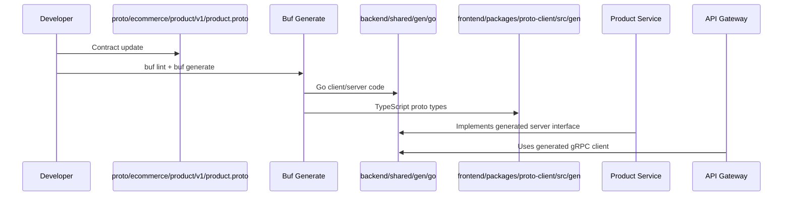
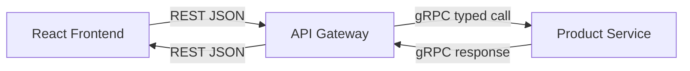
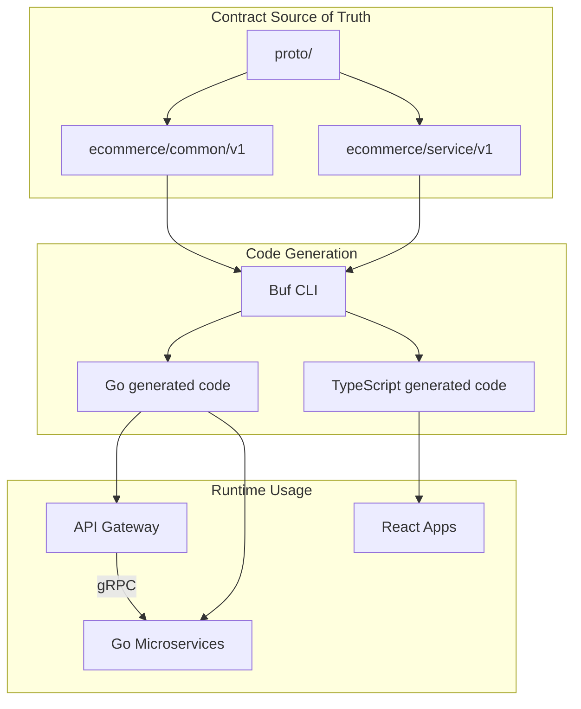
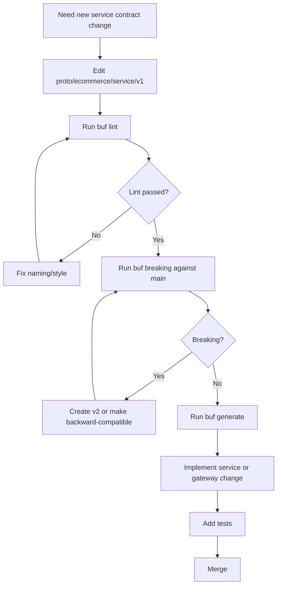

# 🧩 Platform Foundation - Task 2: Create Proto Strategy


## 📌 Task Summary

| Field | Detail |
|---|---|
| Task Name | Create proto strategy |
| Source | `docs/01-micro-tasks.md` → `Platform Foundation` → Task 2 |
| Priority | `P0` foundation/blocker |
| Dependency | Platform Foundation Task 1: Define repo standards |
| Main Goal | Har service ke gRPC contract ke liye `proto/` folder aur versioning rule define karna |
| Output Type | Documentation-only implementation guide |
| Not Included | Actual business proto implementation, generated Go/TS clients, API Gateway implementation, shared Go libs |

> **Simple Hinglish goal:** Is task ka purpose ye decide karna hai ki platform ke saare gRPC contracts kaha rahenge, kaise version honge, kaise generate honge, aur future services in contracts ko safely kaise use karengi. Contract stable hoga to services loosely coupled rahengi.

---

## ✅ Final Output Created

```text
TaskImplementation/
└── Platform Foundation/
    ├── task1.md
    └── task2.md
```

### Why this structure?

- `TaskImplementation/` me task-wise guides rakhe ja rahe hain.
- `Platform Foundation/` folder already present tha, isliye usko keep kiya gaya.
- `task2.md` sirf **Platform Foundation - Task 2** ka implementation guide hai.

---

## 🧭 Implementation Approach

Is guide ko banate time project ke existing documentation ko base banaya gaya:

| Document | Kya use kiya gaya |
|---|---|
| `docs/01-micro-tasks.md` | Task 2 ka exact scope, dependency, priority |
| `docs/02-system-architecture.md` | Internal communication mostly gRPC hoga, REST Gateway expose karega |
| `docs/03-folder-structure.md` | Recommended `proto/` folder, common proto files, generated client output paths |
| `docs/04-microservice-design.md` | Services ke expected gRPC method names |
| `docs/13-developer-guide.md` | Proto update → generate clients → implement service flow |

---

## 🪜 Step-by-Step Implementation

## Step 1: Task Boundary Clear Kiya

Task 2 ka kaam **proto strategy define karna** hai, actual proto contracts likhna nahi.

### Included

- `proto/` folder ka recommended structure
- Service-wise proto package naming
- Versioning rules
- Backward compatibility rules
- Code generation strategy
- Common message reuse strategy
- Review checklist

### Not Included

- Actual `auth.proto`, `user.proto`, `product.proto` files create karna
- Go/TypeScript generated code create karna
- API Gateway routes implement karna
- gRPC server/client code implement karna

> 🟢 **Reason:** Task 2 ek foundation decision task hai. Real proto files tab create honge jab individual service implementation start hogi.

---

## Step 2: Proto Root Folder Strategy Define Kiya

Project docs ke according saare protobuf contracts monorepo ke root-level `proto/` folder me rahenge.

### Recommended target structure

```text
proto/
├── buf.yaml
├── buf.gen.yaml
└── ecommerce/
    ├── common/
    │   └── v1/
    │       ├── pagination.proto
    │       ├── money.proto
    │       ├── errors.proto
    │       └── auth_context.proto
    ├── auth/
    │   └── v1/
    │       └── auth.proto
    ├── user/
    │   └── v1/
    │       └── user.proto
    ├── product/
    │   └── v1/
    │       └── product.proto
    ├── cart/
    │   └── v1/
    │       └── cart.proto
    ├── wishlist/
    │   └── v1/
    │       └── wishlist.proto
    ├── order/
    │   └── v1/
    │       └── order.proto
    ├── payment/
    │   └── v1/
    │       └── payment.proto
    ├── search/
    │   └── v1/
    │       └── search.proto
    ├── cms/
    │   └── v1/
    │       └── cms.proto
    ├── session/
    │   └── v1/
    │       └── session.proto
    ├── notification/
    │   └── v1/
    │       └── notification.proto
    └── superadmin/
        └── v1/
            └── superadmin.proto
```

### Explanation

| Part | Meaning |
|---|---|
| `proto/` | Saare gRPC contracts ka single source of truth |
| `buf.yaml` | Proto linting and breaking-change checks ka config |
| `buf.gen.yaml` | Go and TypeScript clients generate karne ka config |
| `ecommerce/` | Platform-level namespace |
| `common/v1/` | Reusable messages like money, pagination, errors |
| `{service}/v1/` | Har service ka versioned contract folder |

> 🟡 **Important:** Service code `backend/services/...` me rahega, lekin service contract `proto/ecommerce/{service}/v1/...` me rahega. Isse contracts centralized and discoverable rahenge.

---

## Step 3: Package Naming Rule Define Kiya

Har proto file ka package predictable hona chahiye.

### Proto package format

```proto
package ecommerce.<service>.v1;
```

### Examples

| Service | Proto package |
|---|---|
| Auth Service | `ecommerce.auth.v1` |
| User Service | `ecommerce.user.v1` |
| Product Service | `ecommerce.product.v1` |
| Order Service | `ecommerce.order.v1` |
| Payment Service | `ecommerce.payment.v1` |
| Session Service | `ecommerce.session.v1` |

### Go package option format

```proto
option go_package = "github.com/<org>/<repo>/backend/shared/gen/go/ecommerce/<service>/v1;<service>v1";
```

### Example

```proto
syntax = "proto3";

package ecommerce.product.v1;

option go_package = "github.com/example/ecommerce-platform/backend/shared/gen/go/ecommerce/product/v1;productv1";
```

**Hinglish explanation:**  
`package ecommerce.product.v1` proto world ka namespace hai. `go_package` generated Go code ko correct import path deta hai. Alias `productv1` use karne se Go imports clean rahenge.

---

## Step 4: Versioning Strategy Define Kiya

Versioning ka rule simple rakha gaya:

```text
proto/ecommerce/{service}/v1/{service}.proto
proto/ecommerce/{service}/v2/{service}.proto
```

### Versioning rules

| Change Type | Same Version Allowed? | Example |
|---|---:|---|
| New optional field add karna | ✅ Yes | `string display_name = 5;` |
| New RPC method add karna | ✅ Yes | `rpc BatchGetProducts(...)` |
| Existing field remove karna | ❌ No | `email` delete karna |
| Existing field number reuse karna | ❌ No | field `3` ko naye meaning ke liye use karna |
| Field type change karna | ❌ No | `string price` → `int64 price` |
| RPC request/response meaning break karna | ❌ No | same method ka behavior incompatible karna |
| Major domain redesign | ✅ New version | `v1` ke saath `v2` add karo |

### Breaking change rule

Breaking change kabhi same `v1` file me silently nahi jayega. New folder banao:

```text
proto/ecommerce/product/v1/product.proto
proto/ecommerce/product/v2/product.proto
```

> 🔴 **Golden rule:** Field number once used, always reserved ya same meaning. Number reuse production me data corruption type bugs create kar sakta hai.

---

## Step 5: Field Numbering Rule Define Kiya

Proto me field numbers API contract ka permanent part hote hain. Isliye numbering disciplined honi chahiye.

### Recommended numbering

| Range | Use |
|---:|---|
| `1-15` | Frequently used core fields |
| `16-99` | Normal business fields |
| `100-199` | Metadata/audit fields |
| `200-299` | Future extension fields |
| `500+` | Internal/debug fields, avoid unless needed |

### Example

```proto
message ProductSummary {
  string product_id = 1;
  string title = 2;
  ecommerce.common.v1.Money price = 3;
  string thumbnail_url = 4;
  string seller_id = 16;
  string status = 17;
  string created_at = 100;
  string updated_at = 101;
}
```

### Reserved field example

```proto
message ProductSummary {
  reserved 5, 6;
  reserved "old_sku", "legacy_category";

  string product_id = 1;
  string title = 2;
}
```

**Hinglish explanation:**  
Agar koi field delete hoti hai, uska number aur name reserve kar do. Future developer accidentally same field number reuse nahi karega.

---

## Step 6: Common Proto Messages Strategy Define Kiya

Repeated concepts ko har service me duplicate nahi karna. Common messages `proto/ecommerce/common/v1/` me rahenge.

### Recommended common files

| File | Purpose |
|---|---|
| `pagination.proto` | `PageRequest`, `PageResponse` |
| `money.proto` | Currency-safe amount representation |
| `errors.proto` | Common error detail messages |
| `auth_context.proto` | User/session/role context for internal requests |

### `money.proto` example

```proto
syntax = "proto3";

package ecommerce.common.v1;

option go_package = "github.com/example/ecommerce-platform/backend/shared/gen/go/ecommerce/common/v1;commonv1";

message Money {
  string currency = 1;
  int64 amount_minor = 2;
}
```

### Why `amount_minor`?

| Currency | Human amount | Stored minor amount |
|---|---:|---:|
| INR | ₹199.99 | `19999` |
| USD | $10.50 | `1050` |

> 🟢 **Reason:** Floating point numbers money ke liye risky hote hain. `int64 amount_minor` precise and payment-safe hota hai.

---

## Step 7: Service Contract Shape Define Kiya

Har service proto file me teen cheezein clearly honi chahiye:

1. Request messages
2. Response messages
3. Service RPC methods

### Example: Product Service contract skeleton

```proto
syntax = "proto3";

package ecommerce.product.v1;

import "ecommerce/common/v1/pagination.proto";
import "ecommerce/common/v1/money.proto";

option go_package = "github.com/example/ecommerce-platform/backend/shared/gen/go/ecommerce/product/v1;productv1";

service ProductService {
  rpc GetProduct(GetProductRequest) returns (GetProductResponse);
  rpc BatchGetProducts(BatchGetProductsRequest) returns (BatchGetProductsResponse);
  rpc ListProducts(ListProductsRequest) returns (ListProductsResponse);
}

message GetProductRequest {
  string product_id = 1;
}

message GetProductResponse {
  Product product = 1;
}

message BatchGetProductsRequest {
  repeated string product_ids = 1;
}

message BatchGetProductsResponse {
  repeated Product products = 1;
}

message ListProductsRequest {
  ecommerce.common.v1.PageRequest page = 1;
  string category_id = 2;
}

message ListProductsResponse {
  repeated Product products = 1;
  ecommerce.common.v1.PageResponse page = 2;
}

message Product {
  string product_id = 1;
  string title = 2;
  ecommerce.common.v1.Money price = 3;
  string status = 4;
}
```

### Naming rules

| Item | Standard | Example |
|---|---|---|
| Service | `PascalCase` + `Service` | `ProductService` |
| RPC | Verb + Entity | `GetProduct`, `CreateOrder` |
| Request | RPC name + `Request` | `GetProductRequest` |
| Response | RPC name + `Response` | `GetProductResponse` |
| Message fields | `snake_case` | `product_id`, `created_at` |

---

## Step 8: Generated Code Output Strategy Define Kiya

Proto contracts source files rahenge. Actual Go/TypeScript code generate hoga.

### Generated Go output

```text
backend/
└── shared/
    └── gen/
        └── go/
            └── ecommerce/
                ├── common/v1/
                ├── auth/v1/
                ├── user/v1/
                ├── product/v1/
                └── order/v1/
```

### Generated TypeScript output

```text
frontend/
└── packages/
    └── proto-client/
        └── src/
            └── gen/
                └── ecommerce/
                    ├── common/v1/
                    ├── auth/v1/
                    ├── product/v1/
                    └── order/v1/
```

### Why generated code separate?

| Reason | Benefit |
|---|---|
| Source proto and generated code separate | Contract readable rahta hai |
| Go generated code backend shared path me | Services same typed clients use kar sakte hain |
| TS generated code frontend package me | gRPC-Web or typed API clients future me easy |
| Generated files predictable path me | Imports clean and automation simple |

---

## Step 9: Buf Tooling Strategy Define Kiya

Manual `protoc` commands complex ho sakte hain. Is project ke liye `buf` recommended hai.

### External tool: Buf

| Item | Detail |
|---|---|
| What | Protobuf linting, breaking-change detection, generation tool |
| Why used | Consistent proto style, CI checks, easy multi-language generation |
| Install | `brew install bufbuild/buf/buf` or official Buf install docs |
| Use | `buf lint`, `buf breaking`, `buf generate` |

### `buf.yaml` example

```yaml
version: v2
lint:
  use:
    - STANDARD
breaking:
  use:
    - FILE
```

### `buf.gen.yaml` example

```yaml
version: v2
plugins:
  - remote: buf.build/protocolbuffers/go
    out: backend/shared/gen/go
    opt: paths=source_relative
  - remote: buf.build/grpc/go
    out: backend/shared/gen/go
    opt: paths=source_relative
  - remote: buf.build/bufbuild/es
    out: frontend/packages/proto-client/src/gen
    opt: target=ts
```

### Common commands

```bash
# Proto files lint karo
buf lint

# Generated Go/TypeScript clients banao
buf generate

# Breaking changes check karo
buf breaking --against ".git#branch=main"
```

> 🟣 **Note:** Ye commands future implementation ke liye strategy me define hain. Is Task 2 me generated files create nahi kiye gaye.

---

## Step 10: gRPC and Protobuf Libraries Define Kiye

Task 2 me libraries install nahi ki gayi, but strategy me required tools clear kiye gaye.

| Library/Tool | What it is | Why needed | Install/Use |
|---|---|---|---|
| Protocol Buffers | Interface definition language and binary serialization format | Service contracts strongly typed rahenge | Usually Buf remote plugins ke through use hoga |
| gRPC | High-performance RPC framework | Internal service-to-service communication fast and typed hoga | Go services me `google.golang.org/grpc` |
| Buf CLI | Proto lint/generate/breaking checks | Proto workflow consistent and CI-friendly banega | `brew install bufbuild/buf/buf` |
| Go protobuf plugin | Go structs and clients generate karta hai | Backend services typed proto code use karenge | Buf remote plugin: `buf.build/protocolbuffers/go` |
| Go gRPC plugin | Go gRPC client/server interfaces generate karta hai | Service handlers and clients generated honge | Buf remote plugin: `buf.build/grpc/go` |
| Connect-ES / Buf ES plugin | TypeScript proto clients generate karta hai | Frontend/gRPC-Web future support ke liye | Buf remote plugin: `buf.build/bufbuild/es` |

### Go usage example

```go
import productv1 "github.com/example/ecommerce-platform/backend/shared/gen/go/ecommerce/product/v1"

func callProductService(client productv1.ProductServiceClient) {
    // client.GetProduct(ctx, &productv1.GetProductRequest{ProductId: "prod_123"})
}
```

### TypeScript usage example

```ts
import type { Product } from "@ecommerce/proto-client/gen/ecommerce/product/v1/product_pb";

const product: Product = {
  productId: "prod_123",
  title: "Running Shoes",
  status: "ACTIVE",
};
```

---

## Step 11: Service-to-Service Contract Flow Define Kiya

Internal service communication mostly gRPC rahega.



### Hinglish explanation

1. Developer pehle proto contract update karega.
2. `buf lint` se style validate hoga.
3. `buf generate` se Go/TS code banega.
4. Service generated server interface implement karegi.
5. API Gateway generated client se service ko call karega.

---

## Step 12: API Gateway Mapping Strategy Define Kiya

Frontend REST call karega, Gateway internal gRPC call karega.



### Example mapping

| Public REST route | Internal gRPC call |
|---|---|
| `GET /api/v1/products/{product_id}` | `ProductService.GetProduct` |
| `GET /api/v1/products` | `ProductService.ListProducts` |
| `POST /api/v1/orders/checkout` | `OrderService.CreateOrderFromCart` |
| `POST /api/v1/auth/login` | `AuthService.Login` |

**Reason:**  
Browser ke liye REST simple hai. Internal services ke liye gRPC fast, typed, and contract-driven hai.

---

## Step 13: Compatibility Checklist Define Kiya

Proto change merge karne se pehle ye checklist follow hogi.

| Check | Required? | Why |
|---|---:|---|
| `buf lint` pass | ✅ | Style consistency |
| `buf breaking` pass | ✅ | Existing clients break na hon |
| New fields optional/backward-compatible | ✅ | Old clients safe rahein |
| Deleted field numbers reserved | ✅ | Number reuse avoid ho |
| RPC deadline documented | ✅ | Slow calls production issue na baney |
| Error behavior documented | ✅ | Gateway mapping predictable rahe |
| Request/response names standard | ✅ | Generated code readable rahe |
| Common messages reuse | ✅ | Duplicate contract definitions avoid hon |

---

## 🏗️ Clean Folder Structure

### Current implemented documentation structure

```text
TaskImplementation/
└── Platform Foundation/
    ├── task1.md
    └── task2.md
```

### Target proto strategy structure

```text
ecommerce-platform/
├── proto/
│   ├── buf.yaml
│   ├── buf.gen.yaml
│   └── ecommerce/
│       ├── common/v1/
│       ├── auth/v1/
│       ├── user/v1/
│       ├── product/v1/
│       ├── cart/v1/
│       ├── wishlist/v1/
│       ├── order/v1/
│       ├── payment/v1/
│       ├── search/v1/
│       ├── cms/v1/
│       ├── session/v1/
│       ├── notification/v1/
│       └── superadmin/v1/
├── backend/
│   └── shared/
│       └── gen/go/ecommerce/
└── frontend/
    └── packages/
        └── proto-client/
            └── src/gen/ecommerce/
```

---

## 🧠 Architecture Diagram



---

## 🔄 Proto Change Flow



---

## ✅ Example Service Proto Template

Future service proto files is template ko follow karenge:

```proto
syntax = "proto3";

package ecommerce.<service>.v1;

import "ecommerce/common/v1/pagination.proto";

option go_package = "github.com/example/ecommerce-platform/backend/shared/gen/go/ecommerce/<service>/v1;<service>v1";

service <ServiceName>Service {
  rpc Get<Entity>(Get<Entity>Request) returns (Get<Entity>Response);
}

message Get<Entity>Request {
  string <entity>_id = 1;
}

message Get<Entity>Response {
  <Entity> <entity> = 1;
}

message <Entity> {
  string <entity>_id = 1;
  string created_at = 100;
  string updated_at = 101;
}
```

### Template explanation

| Section | Why needed |
|---|---|
| `syntax = "proto3"` | Modern protobuf syntax |
| `package ecommerce.<service>.v1` | Versioned namespace |
| `import common` | Shared reusable messages |
| `option go_package` | Go generated import path |
| `service` | gRPC method definitions |
| `Request/Response` | Clear method-specific contract |
| Audit fields `100+` | Consistent metadata range |

---

## 🚦 Rules for Future Developers

| Rule | Description |
|---|---|
| Contract first | Service implementation se pehle proto update karo |
| Version folders mandatory | `v1`, `v2` style folder use karo |
| No direct DB sharing | Data chahiye to gRPC ya events use karo |
| No field number reuse | Deleted fields ko reserve karo |
| Common messages reuse | Money, pagination, auth context duplicate mat karo |
| Backward compatibility first | Existing clients ko break mat karo |
| Generated code manually edit mat karo | Proto update karke regenerate karo |
| CI me proto checks mandatory | `buf lint`, `buf breaking`, `buf generate` |

---

## 🧪 Verification Strategy

Task 2 documentation-level implementation hai. Future me jab proto files add honge, ye checks run honge:

```bash
buf lint
buf breaking --against ".git#branch=main"
buf generate
go test ./...
pnpm typecheck
```

### Expected verification outcome

| Command | Expected result |
|---|---|
| `buf lint` | Proto style valid |
| `buf breaking` | Existing contracts safe |
| `buf generate` | Go/TS code generated successfully |
| `go test ./...` | Backend generated clients compile |
| `pnpm typecheck` | Frontend generated types compile |

---

## 📦 External Libraries / Tools Summary

| Tool | Used in this task? | Why mentioned |
|---|---:|---|
| Buf CLI | Strategy only | Proto lint/generate/breaking checks ke liye |
| Protocol Buffers | Strategy only | gRPC contract definition format |
| gRPC Go | Strategy only | Backend service communication |
| Buf ES / Connect-ES | Strategy only | TypeScript proto output future frontend clients ke liye |

> 🟡 **Note:** Is task me koi package install ya generated output create nahi kiya gaya, kyunki user request ka output only `task2.md` documentation hai.

---

## 🎯 Final Outcome

Platform Foundation Task 2 ke liye proto strategy define ho gayi:

- Root `proto/` folder ka structure clear hai.
- Har service ke liye versioned path rule clear hai.
- Package naming and Go package option standard define hai.
- Backward compatibility and breaking-change rules documented hain.
- Buf-based generation workflow define hai.
- Go and TypeScript generated output paths clear hain.
- API Gateway REST → gRPC mapping approach explain kiya gaya hai.

> ✅ **Conclusion:** Ab future services contract-first approach follow kar sakti hain. Isse microservices loosely coupled, version-safe, and production-friendly rahengi.
