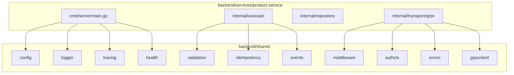
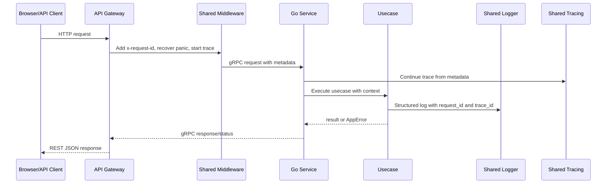

# 🧰 Platform Foundation - Task 3: Create Shared Go Libs


## 📌 Task Summary

| Field | Detail |
|---|---|
| Task Name | Create shared Go libs |
| Source | `docs/01-micro-tasks.md` → `Platform Foundation` → Task 3 |
| Priority | `P0` foundation/blocker |
| Dependency | Platform Foundation Task 1: Define repo standards |
| Main Goal | Logger, config, errors, middleware, tracing, validation jaise reusable Go packages define karna |
| Output Type | Structured implementation guide |
| Not Included | Docker Compose local stack, API Gateway base, business service implementation, CI pipeline, Kubernetes manifests |

> **Simple Hinglish goal:** Har microservice me same logging, config loading, error handling, request middleware, tracing, validation, event envelope, aur health behavior use hoga. Isse duplicate code kam hoga, services predictable rahengi, aur debugging easy hogi.

---

## ✅ Final Output Created

```text
TaskImplementation/
└── Platform Foundation/
    ├── task1.md
    ├── task2.md
    └── task3.md
```

### Why this structure?

- `TaskImplementation/` task-wise implementation guides ke liye central folder hai.
- `Platform Foundation/` already present tha, isliye usko keep kiya gaya.
- `task3.md` sirf **Platform Foundation - Task 3** ka guide hai.
- Actual Go package files create nahi kiye gaye, kyunki requested output sirf folder structure aur `task3.md` content generate karna tha.

---

## 🧭 Implementation Approach

Is guide ko banate time project ke docs ko base banaya gaya:

| Document | Kya use kiya gaya |
|---|---|
| `docs/01-micro-tasks.md` | Task 3 ka exact scope: logger, config, errors, middleware, tracing, validation |
| `docs/02-system-architecture.md` | gRPC internal communication, gateway flow, request id, tracing, service boundaries |
| `docs/03-folder-structure.md` | `backend/shared/` folder ka recommended package layout |
| `docs/06-auth-security.md` | JWT claims, RBAC context, rate limiting, validation, secret safety |
| `docs/12-logging-monitoring-scalability.md` | Structured logs, trace propagation, redaction rules, health/observability needs |
| `docs/13-developer-guide.md` | Go coding rules, deadlines, config validation, production readiness checklist |

---

## 🧱 Task Boundary

### Included in Task 3

- Shared Go libraries ka target folder structure
- Har package ka purpose and responsibility
- Installable external libraries/tools ka explanation
- Beginner-friendly implementation steps
- Code examples for reusable package APIs
- Mermaid diagrams for architecture and request flow
- Usage pattern showing how one service will import shared packages

### Not Included in Task 3

- Real `auth-service`, `product-service`, ya `api-gateway` implementation
- Docker Compose stack
- Proto generation output
- Kubernetes manifests
- CI pipeline
- Database migrations

> 🟢 **Rule:** Shared libs generic rahengi. Inke andar Product, Order, Payment jaise business-specific logic nahi aayega.

---

## 🗂️ Target Shared Go Library Folder Structure

Ye structure `docs/03-folder-structure.md` ke backend shared layout ko follow karta hai, plus Task 3 ke tracing requirement ko clearly expose karta hai.

```text
backend/
├── go.work
├── shared/
│   ├── config/
│   │   ├── loader.go
│   │   ├── env.go
│   │   └── validation.go
│   ├── logger/
│   │   ├── logger.go
│   │   └── zap.go
│   ├── errors/
│   │   ├── app_error.go
│   │   ├── grpc_mapping.go
│   │   └── http_mapping.go
│   ├── authctx/
│   │   ├── claims.go
│   │   └── context.go
│   ├── middleware/
│   │   ├── request_id.go
│   │   ├── recovery.go
│   │   ├── rate_limit.go
│   │   └── tracing.go
│   ├── tracing/
│   │   ├── provider.go
│   │   └── propagation.go
│   ├── grpcclient/
│   │   ├── dialer.go
│   │   └── interceptors.go
│   ├── validation/
│   │   ├── validator.go
│   │   └── rules.go
│   ├── events/
│   │   ├── envelope.go
│   │   ├── publisher.go
│   │   └── consumer.go
│   ├── idempotency/
│   │   └── store.go
│   └── health/
│       └── health.go
└── services/
    ├── api-gateway/
    ├── auth-service/
    ├── user-service/
    └── product-service/
```

### Folder Responsibility

| Package | Responsibility |
|---|---|
| `config` | Env variables load, defaults set, required config validate |
| `logger` | Structured JSON logging, request/trace/user safe fields |
| `errors` | Common app error type, HTTP/gRPC error mapping |
| `authctx` | JWT claims ko typed context me carry karna |
| `middleware` | Request id, panic recovery, rate limit hook, tracing wrapper |
| `tracing` | OpenTelemetry setup and trace propagation helpers |
| `grpcclient` | gRPC dialer, deadlines, interceptors, metadata propagation |
| `validation` | DTO/domain input validation helpers |
| `events` | Common event envelope and publisher/consumer interfaces |
| `idempotency` | Idempotency store interface for retry-safe commands |
| `health` | Liveness/readiness health check contracts |

---

## 🧩 Shared Library Architecture



**Hinglish explanation:**  
Service ka `main.go` shared config, logger, tracing, aur health setup karega. Transport layer middleware, auth context, and error mapping use karegi. Usecase layer validation, events, and idempotency interfaces use karegi. Repository layer DB-specific rahegi, shared lib me DB business query nahi rahegi.

---

## 🪜 Step-by-Step Implementation

## Step 1: Shared Lib Rules Define Karo

Shared libs ka goal common infra concerns ko centralize karna hai.

### Rules

| Rule | Explanation |
|---|---|
| Business logic nahi | Shared package me `CreateOrder`, `PublishProduct`, `RefundPayment` jaise logic nahi aayega |
| Service independent | Package ko kisi ek service ke internal folder pe depend nahi karna chahiye |
| Context-first APIs | Go functions me `context.Context` first argument rahega where needed |
| Structured outputs | Logger/errors/events predictable structured format use karenge |
| Security safe | Logs me passwords, OTP, full JWT, refresh token, card data, secrets nahi print honge |
| Testable design | Interfaces expose karo, concrete provider service me inject karo |

### Good shared package example

```go
package errors

type Code string

const (
    CodeValidation Code = "VALIDATION_ERROR"
    CodeNotFound   Code = "NOT_FOUND"
    CodeInternal   Code = "INTERNAL_ERROR"
)
```

### Bad shared package example

```go
package shared

func CreateProduct() {
    // Product-specific business workflow shared package me nahi aana chahiye.
}
```

---

## Step 2: Go Workspace and Module Plan

Recommended plan:

```text
backend/
├── go.work
├── shared/
│   └── go.mod
└── services/
    └── auth-service/
        └── go.mod
```

### Why separate module?

- Har service independently build/test ho sakti hai.
- `backend/shared` reusable module ban sakta hai.
- `go.work` local development me modules ko saath bind karega.

### Example commands

```bash
cd backend/shared
go mod init github.com/<org>/<repo>/backend/shared

cd ..
go work init ./shared ./services/auth-service ./services/user-service
```

> 🟡 **Note:** Actual repo path final hone ke baad `<org>/<repo>` replace karna hai.

---

## Step 3: Config Package Banao

`config` package service startup ke time environment variables load karega and required values validate karega.

### Target files

```text
backend/shared/config/
├── loader.go
├── env.go
└── validation.go
```

### Config design

```go
package config

import (
    "fmt"
    "os"
    "strconv"
)

type ServiceConfig struct {
    ServiceName string
    Environment string
    HTTPPort    int
    GRPCPort    int
}

func LoadServiceConfig() (ServiceConfig, error) {
    cfg := ServiceConfig{
        ServiceName: getEnv("SERVICE_NAME", ""),
        Environment: getEnv("APP_ENV", "local"),
        HTTPPort: mustInt(getEnv("HTTP_PORT", "8080")),
        GRPCPort: mustInt(getEnv("GRPC_PORT", "9090")),
    }

    if cfg.ServiceName == "" {
        return cfg, fmt.Errorf("SERVICE_NAME is required")
    }

    return cfg, nil
}

func getEnv(key string, fallback string) string {
    value := os.Getenv(key)
    if value == "" {
        return fallback
    }
    return value
}

func mustInt(value string) int {
    parsed, err := strconv.Atoi(value)
    if err != nil {
        return 0
    }
    return parsed
}
```

### Explanation

- `SERVICE_NAME` required hai because logs, metrics, and tracing me service identify hoti hai.
- `APP_ENV` default `local` ho sakta hai.
- Ports config se aayenge, hardcoded nahi rahenge.
- Secrets ko print nahi karna.

---

## Step 4: Logger Package Banao

Docs ke according platform structured JSON logs use karega.

### Required log fields

| Field | Meaning |
|---|---|
| `timestamp` | Log time |
| `level` | `debug`, `info`, `warn`, `error` |
| `service` | Service name |
| `environment` | local/dev/staging/prod |
| `request_id` | Single request tracking id |
| `trace_id` | Distributed trace id |
| `user_id_hash` | PII-safe user reference |
| `route` / `grpc_method` | Request source |
| `message` | Human-readable short message |
| `error_code` | App error code |
| `latency_ms` | Request duration |

### Target files

```text
backend/shared/logger/
├── logger.go
└── zap.go
```

### Logger interface

```go
package logger

import "context"

type Field struct {
    Key   string
    Value any
}

type Logger interface {
    Info(ctx context.Context, msg string, fields ...Field)
    Warn(ctx context.Context, msg string, fields ...Field)
    Error(ctx context.Context, msg string, fields ...Field)
}
```

### Usage example

```go
log.Info(ctx, "product created",
    logger.Field{Key: "product_id", Value: productID},
    logger.Field{Key: "seller_id", Value: sellerID},
)
```

### Redaction rule

Kabhi log nahi karna:

- Password
- OTP
- Full JWT
- Refresh token
- Payment card data
- DB password
- API secret

---

## Step 5: App Errors Package Banao

Har service same error format return karegi. Gateway HTTP response me same structure map karega.

### Target files

```text
backend/shared/errors/
├── app_error.go
├── grpc_mapping.go
└── http_mapping.go
```

### App error model

```go
package errors

type Code string

const (
    CodeValidation     Code = "VALIDATION_ERROR"
    CodeUnauthorized   Code = "UNAUTHORIZED"
    CodeForbidden      Code = "FORBIDDEN"
    CodeNotFound       Code = "NOT_FOUND"
    CodeConflict       Code = "CONFLICT"
    CodeRateLimited    Code = "RATE_LIMITED"
    CodeInternal       Code = "INTERNAL_ERROR"
)

type AppError struct {
    Code    Code
    Message string
    Details map[string]string
    Cause   error
}

func (e *AppError) Error() string {
    return e.Message
}

func Validation(message string, details map[string]string) *AppError {
    return &AppError{
        Code:    CodeValidation,
        Message: message,
        Details: details,
    }
}
```

### REST error response format

```json
{
  "data": null,
  "request_id": "req_123",
  "error": {
    "code": "VALIDATION_ERROR",
    "message": "Invalid request",
    "details": {
      "email": "must be a valid email"
    }
  }
}
```

### gRPC mapping

| App Code | gRPC Code | HTTP Status |
|---|---|---:|
| `VALIDATION_ERROR` | `InvalidArgument` | `400` |
| `UNAUTHORIZED` | `Unauthenticated` | `401` |
| `FORBIDDEN` | `PermissionDenied` | `403` |
| `NOT_FOUND` | `NotFound` | `404` |
| `CONFLICT` | `AlreadyExists` or `FailedPrecondition` | `409` |
| `RATE_LIMITED` | `ResourceExhausted` | `429` |
| `INTERNAL_ERROR` | `Internal` | `500` |

---

## Step 6: Auth Context Package Banao

JWT validation Auth Service/Gateway ka kaam hai, but validated claims ko services ke andar type-safe context me carry karna shared concern hai.

### Target files

```text
backend/shared/authctx/
├── claims.go
└── context.go
```

### Claims model

```go
package authctx

type Claims struct {
    UserID    string
    SessionID string
    SellerID  string
    Roles     []string
}

func (c Claims) HasRole(role string) bool {
    for _, current := range c.Roles {
        if current == role {
            return true
        }
    }
    return false
}
```

### Context helper

```go
package authctx

import "context"

type contextKey struct{}

func WithClaims(ctx context.Context, claims Claims) context.Context {
    return context.WithValue(ctx, contextKey{}, claims)
}

func FromContext(ctx context.Context) (Claims, bool) {
    claims, ok := ctx.Value(contextKey{}).(Claims)
    return claims, ok
}
```

### Explanation

- Gateway JWT verify karega.
- gRPC metadata me user/session/role safe values pass honge.
- Service transport layer metadata se `Claims` banakar context me inject karegi.
- Usecase layer `authctx.FromContext(ctx)` se authorization decisions le sakti hai.

---

## Step 7: Middleware Package Banao

Middleware HTTP and gRPC dono flow me common request handling karega.

### Target files

```text
backend/shared/middleware/
├── request_id.go
├── recovery.go
├── rate_limit.go
└── tracing.go
```

### Request ID middleware example

```go
package middleware

import (
    "context"
    "net/http"
)

type requestIDKey struct{}

func WithRequestID(ctx context.Context, requestID string) context.Context {
    return context.WithValue(ctx, requestIDKey{}, requestID)
}

func RequestIDFromContext(ctx context.Context) string {
    value, _ := ctx.Value(requestIDKey{}).(string)
    return value
}

func RequestID(next http.Handler, newID func() string) http.Handler {
    return http.HandlerFunc(func(w http.ResponseWriter, r *http.Request) {
        requestID := r.Header.Get("x-request-id")
        if requestID == "" {
            requestID = newID()
        }

        w.Header().Set("x-request-id", requestID)
        ctx := WithRequestID(r.Context(), requestID)
        next.ServeHTTP(w, r.WithContext(ctx))
    })
}
```

### Recovery behavior

- Panic catch karo.
- Structured error log karo.
- Response me generic `INTERNAL_ERROR` do.
- Stack trace local/dev me useful ho sakta hai, production response me nahi.

### Rate limit behavior

- Actual Redis implementation API Gateway task me aa sakti hai.
- Shared package me interface define karo:

```go
package middleware

import "context"

type RateLimiter interface {
    Allow(ctx context.Context, key string) (bool, error)
}
```

---

## Step 8: Tracing Package Banao

Distributed tracing OpenTelemetry se setup hoga. Docs ke according services `traceparent` and `x-request-id` propagate karenge.

### Target files

```text
backend/shared/tracing/
├── provider.go
└── propagation.go
```

### Tracing setup example

```go
package tracing

import (
    "context"

    "go.opentelemetry.io/otel"
    "go.opentelemetry.io/otel/propagation"
    "go.opentelemetry.io/otel/sdk/resource"
    sdktrace "go.opentelemetry.io/otel/sdk/trace"
    semconv "go.opentelemetry.io/otel/semconv/v1.26.0"
)

func Init(ctx context.Context, serviceName string) (*sdktrace.TracerProvider, error) {
    res, err := resource.New(ctx,
        resource.WithAttributes(semconv.ServiceName(serviceName)),
    )
    if err != nil {
        return nil, err
    }

    provider := sdktrace.NewTracerProvider(
        sdktrace.WithResource(res),
    )

    otel.SetTracerProvider(provider)
    otel.SetTextMapPropagator(propagation.TraceContext{})

    return provider, nil
}
```

### Explanation

- `serviceName` trace UI me service identify karega.
- `TraceContext` W3C `traceparent` header propagate karega.
- Later Jaeger/OTLP exporter add ho sakta hai.
- Checkout, search, payment webhook jaise flows end-to-end traceable honge.

---

## Step 9: gRPC Client Package Banao

Internal service-to-service calls gRPC use karenge. Shared `grpcclient` package deadlines, interceptors, request id, trace context, and auth metadata propagate karega.

### Target files

```text
backend/shared/grpcclient/
├── dialer.go
└── interceptors.go
```

### Dialer example

```go
package grpcclient

import (
    "context"
    "time"

    "google.golang.org/grpc"
    "google.golang.org/grpc/credentials/insecure"
)

func Dial(ctx context.Context, target string) (*grpc.ClientConn, error) {
    dialCtx, cancel := context.WithTimeout(ctx, 5*time.Second)
    defer cancel()

    return grpc.DialContext(
        dialCtx,
        target,
        grpc.WithTransportCredentials(insecure.NewCredentials()),
    )
}
```

### Deadline rule

| Flow | Suggested deadline |
|---|---:|
| Search internal call | `300ms` |
| Product detail | `500ms` |
| Checkout internal steps | `1.5s` |
| Payment provider coordination | Provider-specific timeout |

> 🟡 Production me TLS/mTLS credentials use honge. `insecure.NewCredentials()` sirf local development example ke liye hai.

---

## Step 10: Validation Package Banao

Validation 4 layers me hogi: frontend, gateway DTO, service usecase, database constraints. Shared package Go DTO/domain validation ko standardize karega.

### Target files

```text
backend/shared/validation/
├── validator.go
└── rules.go
```

### Validator example

```go
package validation

import (
    "github.com/go-playground/validator/v10"
)

type Validator struct {
    validate *validator.Validate
}

func New() *Validator {
    return &Validator{validate: validator.New()}
}

func (v *Validator) Struct(input any) error {
    return v.validate.Struct(input)
}
```

### DTO example

```go
type CreateUserRequest struct {
    Email string `validate:"required,email"`
    Name  string `validate:"required,min=2,max=80"`
    Phone string `validate:"omitempty,e164"`
}
```

### Explanation

- Invalid data DB tak nahi jaana chahiye.
- Gateway public DTO validate karega.
- Service usecase business validation karega.
- Database final safety net rahega.

---

## Step 11: Events Package Banao

Platform async workflows ke liye Kafka/RabbitMQ use karega. Shared package provider-specific dependency lock nahi karega; sirf common envelope and interfaces define karega.

### Target files

```text
backend/shared/events/
├── envelope.go
├── publisher.go
└── consumer.go
```

### Event envelope

```go
package events

import "time"

type Envelope[T any] struct {
    EventID     string    `json:"event_id"`
    EventType   string    `json:"event_type"`
    Version     int       `json:"version"`
    Source      string    `json:"source"`
    RequestID   string    `json:"request_id"`
    TraceID     string    `json:"trace_id"`
    OccurredAt  time.Time `json:"occurred_at"`
    Payload     T         `json:"payload"`
}
```

### Publisher interface

```go
package events

import "context"

type Publisher interface {
    Publish(ctx context.Context, topic string, event Envelope[any]) error
}
```

### Example event types

| Event | Producer | Consumer |
|---|---|---|
| `UserCreated` | Auth/User Service | Notification, Analytics |
| `ProductUpdated` | Product Service | Search, Recommendation |
| `OrderCreated` | Order Service | Notification, Analytics |
| `PaymentCaptured` | Payment Service | Order, Notification |

---

## Step 12: Idempotency Package Banao

Checkout, payment intent, refund, and webhook processing retry-safe hone chahiye. Shared package interface define karega; actual Redis/MySQL implementation service-specific ho sakti hai.

### Target file

```text
backend/shared/idempotency/
└── store.go
```

### Interface example

```go
package idempotency

import "context"

type Result struct {
    StatusCode int
    Body       []byte
}

type Store interface {
    Get(ctx context.Context, key string) (Result, bool, error)
    Save(ctx context.Context, key string, result Result) error
    Lock(ctx context.Context, key string) (func() error, error)
}
```

### Explanation

- Same checkout request retry hua to duplicate order nahi banega.
- Same payment webhook repeat hua to duplicate status update nahi hoga.
- Interface shared hai; storage implementation service ke data choice pe depend karegi.

---

## Step 13: Health Package Banao

Production readiness checklist me health endpoints required hain.

### Target file

```text
backend/shared/health/
└── health.go
```

### Health contract

```go
package health

import "context"

type CheckResult struct {
    Name    string
    Healthy bool
    Message string
}

type Checker interface {
    Check(ctx context.Context) CheckResult
}
```

### Health types

| Endpoint | Purpose |
|---|---|
| `/livez` | Process alive hai ya nahi |
| `/readyz` | Service traffic receive karne ke liye ready hai ya nahi |
| `/healthz` | Combined basic health status |

---

## 🔁 Request Flow with Shared Libs



**Hinglish explanation:**  
Client se request aati hai, Gateway request id attach karta hai, trace start/continue hota hai, service usecase context ke saath execute hota hai, logs same fields ke saath generate hote hain, aur errors same format me map hote hain.

---

## 🧪 Testing Strategy for Shared Go Libs

| Package | Test Focus |
|---|---|
| `config` | Required env missing, defaults, invalid port |
| `logger` | Fields attach ho rahe hain, sensitive data redaction helper works |
| `errors` | App code to HTTP/gRPC mapping correct hai |
| `authctx` | Claims context me set/get ho rahe hain |
| `middleware` | Request id create/pass-through, recovery panic handle |
| `tracing` | Provider init and propagator setup |
| `grpcclient` | Dial timeout and interceptor metadata propagation |
| `validation` | Struct tags and custom rules |
| `events` | Envelope JSON shape and required metadata |
| `idempotency` | Interface contract with fake in-memory store |
| `health` | Aggregated healthy/unhealthy response |

### Example test

```go
func TestClaimsContext(t *testing.T) {
    ctx := context.Background()
    claims := authctx.Claims{UserID: "user_123", Roles: []string{"buyer"}}

    ctx = authctx.WithClaims(ctx, claims)
    got, ok := authctx.FromContext(ctx)

    require.True(t, ok)
    require.Equal(t, "user_123", got.UserID)
    require.True(t, got.HasRole("buyer"))
}
```

---

## 📦 External Libraries and Tools

Task 3 shared libs mostly Go packages hain. Neeche recommended tools/libraries ka purpose and install command diya gaya hai.

| Library/Tool | Why Used | Install |
|---|---|---|
| Go modules | Dependency management | Built into Go |
| Go workspace | Local multi-module development | Built into Go 1.18+ |
| `go.uber.org/zap` | Fast structured JSON logger | `go get go.uber.org/zap` |
| `go.opentelemetry.io/otel` | Distributed tracing API | `go get go.opentelemetry.io/otel` |
| `go.opentelemetry.io/otel/sdk` | Tracer provider setup | `go get go.opentelemetry.io/otel/sdk` |
| `google.golang.org/grpc` | gRPC clients/interceptors | `go get google.golang.org/grpc` |
| `github.com/go-playground/validator/v10` | DTO validation tags | `go get github.com/go-playground/validator/v10` |
| `github.com/google/uuid` | Request/event id generation | `go get github.com/google/uuid` |
| `github.com/stretchr/testify` | Cleaner unit test assertions | `go get github.com/stretchr/testify` |

### Install commands

```bash
cd backend/shared

go get go.uber.org/zap
go get go.opentelemetry.io/otel
go get go.opentelemetry.io/otel/sdk
go get google.golang.org/grpc
go get github.com/go-playground/validator/v10
go get github.com/google/uuid
go get github.com/stretchr/testify
```

### Usage examples

```go
// Logger
log, err := logger.NewZapLogger("product-service", "local")

// Validation
validator := validation.New()
err := validator.Struct(input)

// Tracing
provider, err := tracing.Init(ctx, "product-service")
defer provider.Shutdown(ctx)

// gRPC
conn, err := grpcclient.Dial(ctx, "auth-service:9090")
```

---

## 🧱 Service Usage Example

Ye example dikhata hai ki future service shared packages kaise use karegi.

```go
package main

import (
    "context"
    "log"

    sharedconfig "github.com/<org>/<repo>/backend/shared/config"
    sharedlogger "github.com/<org>/<repo>/backend/shared/logger"
    sharedtracing "github.com/<org>/<repo>/backend/shared/tracing"
)

func main() {
    ctx := context.Background()

    cfg, err := sharedconfig.LoadServiceConfig()
    if err != nil {
        log.Fatal(err)
    }

    appLogger, err := sharedlogger.NewZapLogger(cfg.ServiceName, cfg.Environment)
    if err != nil {
        log.Fatal(err)
    }

    tracerProvider, err := sharedtracing.Init(ctx, cfg.ServiceName)
    if err != nil {
        appLogger.Error(ctx, "failed to initialize tracing")
        log.Fatal(err)
    }
    defer tracerProvider.Shutdown(ctx)

    appLogger.Info(ctx, "service starting")
}
```

### Explanation

- `config` service name and environment load karta hai.
- `logger` startup logs structured format me print karta hai.
- `tracing` service ko distributed tracing ke liye ready karta hai.
- Actual service server setup service-specific package me rahega.

---

## 🛡️ Security and Production Rules

| Area | Rule |
|---|---|
| Logs | Sensitive values redact karo |
| Errors | Internal DB/provider errors directly client ko expose mat karo |
| Config | Secrets env/secret manager se aayenge, docs/code me hardcode nahi |
| Auth Context | JWT full token context/logs me store nahi karna |
| Tracing | PII-heavy attributes avoid karo |
| Validation | Max length, ID format, content type, file size validate karo |
| Rate Limit | Redis-backed implementation later gateway/service layer me plug hoga |

---

## ✅ Acceptance Checklist

- [x] `TaskImplementation/Platform Foundation/task3.md` created
- [x] Task 3 scope clearly documented
- [x] Shared Go libs target folder structure documented
- [x] Logger, config, errors, middleware, tracing, validation covered
- [x] Extra useful foundation packages documented: `authctx`, `grpcclient`, `events`, `idempotency`, `health`
- [x] External libraries/tools explained with install commands
- [x] Code examples included
- [x] Mermaid architecture and request flow diagrams included
- [x] No implementation beyond Platform Foundation Task 3 added

---

## 🧠 Quick Recap

Task 3 ka outcome ek reusable Go foundation blueprint hai:

- `config` startup ko predictable banata hai.
- `logger` debugging and observability improve karta hai.
- `errors` REST/gRPC error response consistent rakhta hai.
- `middleware` request id, recovery, tracing, and rate limit hooks centralize karta hai.
- `tracing` distributed request journey visible banata hai.
- `validation` bad data ko early block karta hai.
- `events`, `idempotency`, and `health` future production services ko safer banate hain.

> 🟣 **Final note:** Shared libs platform ka skeleton hain. Jab individual services implement hongi, wahi services in shared packages ko import karke duplicate infra code avoid karengi.
